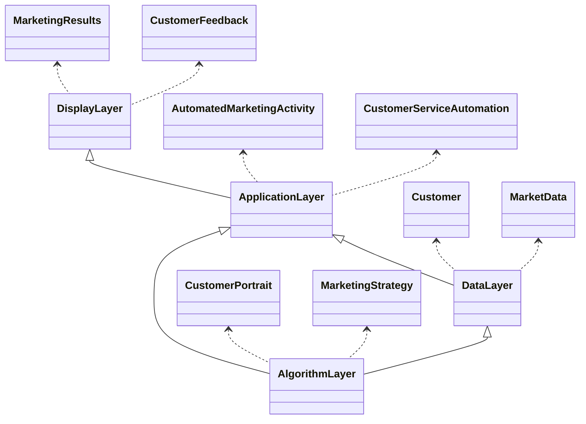

                 


# AI Agent在智能营销自动化中的应用

关键词：AI Agent，智能营销，自动化，应用，技术

摘要：本文将深入探讨AI Agent在智能营销自动化中的应用。我们将从背景介绍、核心概念与联系、算法原理讲解、系统分析与架构设计方案、项目实战等多个角度，逐步分析AI Agent如何提升营销效率，以及在实际应用中的最佳实践和注意事项。

## 目录大纲设计过程

在设计《AI Agent在智能营销自动化中的应用》这本书的目录大纲时，我们需要遵循以下步骤：

1. **确定书籍主题与目标读者**：明确本书的主题和目标读者，如市场营销专业人士、数据分析人员或对AI应用感兴趣的计算机科学学生。
2. **分析核心章节内容**：确保每个章节都有明确的主题和内容，包括背景介绍、核心概念、算法原理、系统架构设计、项目实战等。
3. **设计章节结构与层级**：使用markdown格式，使用`#`、`##`和`###`来表示不同级别的标题，确保目录的逻辑性和结构清晰。
4. **确保内容完整性**：确保书籍的目录大纲结构完整，包含背景介绍、核心概念与联系、算法原理讲解、系统分析与架构设计方案、项目实战、最佳实践 tips、小结、注意事项、拓展阅读等核心章节。
5. **编写目录大纲**：根据以上分析，编写初步的目录大纲。
6. **校对与调整**：对目录大纲进行校对和调整，确保每个章节的内容和标题都能准确反映章节内容，同时保持目录的简洁性和逻辑性。

## 第一部分：背景

### 1.1 问题背景

在当今快速变化的市场环境中，企业需要不断提高营销效率来获取客户、提高销售额。传统的营销方法往往依赖于大量人力和时间成本，难以实现高效、个性化的客户服务。随着人工智能技术的发展，AI Agent作为一种自动化智能系统，逐渐成为解决这一问题的有效途径。

#### 1.1.1 问题的提出

营销自动化面临的主要问题包括：

- **个性化不足**：传统的营销方法往往无法针对每个客户进行个性化推荐，导致营销效果不佳。
- **响应速度慢**：手动处理大量客户数据和营销活动，响应速度慢，无法及时满足客户需求。
- **成本高**：传统营销需要大量人力和时间成本，难以持续保持高效率。

#### 1.1.2 营销自动化的需求

随着互联网和大数据技术的发展，企业对营销自动化的需求日益增加。营销自动化能够实现以下目标：

- **个性化推荐**：基于客户行为数据，提供个性化产品推荐，提高客户满意度和购买转化率。
- **高效响应**：自动化处理客户请求和反馈，提高响应速度，提升客户体验。
- **降低成本**：减少人力和时间成本，提高营销效率，降低运营成本。

### 1.2 解决方案概述

AI Agent在智能营销自动化中的应用，主要是利用人工智能技术，模拟人类的决策过程，实现自动化营销。具体来说，AI Agent能够实现以下功能：

- **客户画像**：通过分析客户行为数据，构建客户画像，实现个性化推荐。
- **营销活动自动化**：自动执行营销策略，包括发送邮件、推送通知、社交媒体互动等。
- **客户服务自动化**：自动处理客户咨询、反馈和投诉，提供24/7在线服务。

## 第二部分：核心概念与联系

### 2.1 AI Agent概述

AI Agent，即人工智能代理人，是一种模拟人类行为和决策的自动化系统。AI Agent具有以下特点：

- **自主性**：能够独立完成特定任务，无需人工干预。
- **适应性**：能够根据环境和任务需求进行自适应调整。
- **协作性**：能够与其他AI Agent或人类协作，共同完成任务。

### 2.2 智能营销自动化技术

智能营销自动化技术主要包括以下几个方面：

- **客户画像**：通过收集和分析客户数据，构建客户画像，实现个性化推荐。
- **营销策略**：根据客户画像和市场需求，制定和调整营销策略。
- **营销活动自动化**：通过自动化系统，执行营销活动，提高响应速度和效率。
- **客户服务自动化**：通过自动化系统，处理客户咨询、反馈和投诉，提高客户满意度。

### 2.3 关键技术对比分析

为了更好地理解AI Agent在智能营销自动化中的应用，我们需要对关键技术进行对比分析。以下是几种常见的智能营销自动化技术对比：

- **客户画像**：基于数据分析，构建客户画像，实现个性化推荐。客户画像技术主要包括数据收集、数据分析和数据可视化等。
- **营销策略**：根据客户画像和市场趋势，制定和调整营销策略。营销策略技术主要包括市场分析、需求分析和策略优化等。
- **营销活动自动化**：通过自动化系统，执行营销活动，提高响应速度和效率。营销活动自动化技术主要包括自动化流程、自动化推广和自动化监控等。
- **客户服务自动化**：通过自动化系统，处理客户咨询、反馈和投诉，提高客户满意度。客户服务自动化技术主要包括自动问答、自动分类和自动回复等。

## 第三部分：算法原理讲解

### 3.1 智能营销自动化的算法基础

智能营销自动化的算法基础主要包括以下几个方面：

- **客户行为分析**：通过分析客户行为数据，挖掘客户需求和行为特征。
- **客户画像构建**：基于客户行为分析，构建客户画像，实现个性化推荐。
- **营销策略优化**：根据客户画像和市场趋势，优化营销策略，提高营销效果。
- **营销活动自动化**：通过算法，自动化执行营销活动，提高响应速度和效率。

### 3.2 智能营销自动化的算法原理

#### 3.2.1 数学模型和公式

智能营销自动化的算法原理主要基于以下数学模型和公式：

- **客户行为分析**：使用决策树、支持向量机（SVM）等算法，分析客户行为数据，提取特征。
- **客户画像构建**：使用聚类算法、协同过滤算法等，构建客户画像。
- **营销策略优化**：使用遗传算法、粒子群优化算法等，优化营销策略。
- **营销活动自动化**：使用规则引擎、机器学习算法等，自动化执行营销活动。

#### 3.2.2 举例说明

为了更好地理解智能营销自动化的算法原理，我们通过一个简单的例子进行说明。

假设我们有一个电商平台，想要通过智能营销自动化来提高销售额。以下是具体的算法应用：

1. **客户行为分析**：通过分析客户的购买历史、浏览记录等数据，提取出客户的购买偏好和兴趣点。
2. **客户画像构建**：使用聚类算法，将客户分为不同的群体，如高价值客户、一般客户等，为每个群体构建对应的客户画像。
3. **营销策略优化**：根据客户画像，制定和调整营销策略，如针对高价值客户，提供优惠活动、会员服务；针对一般客户，推送新品推荐、促销信息等。
4. **营销活动自动化**：使用规则引擎，自动化执行营销活动，如根据客户购买偏好，自动推送相关产品推荐。

通过这个例子，我们可以看到，智能营销自动化的算法原理是如何应用于实际场景中的。

### 第三部分：系统分析与架构设计方案

#### 3.3 系统功能设计

智能营销自动化系统的主要功能包括：

- **数据收集与处理**：收集并处理客户行为数据、市场数据等，为后续分析提供基础。
- **客户画像构建**：基于客户行为数据，构建客户画像，实现个性化推荐。
- **营销策略制定与优化**：根据客户画像和市场趋势，制定和优化营销策略。
- **营销活动自动化**：自动化执行营销活动，提高响应速度和效率。
- **客户服务自动化**：自动处理客户咨询、反馈和投诉，提高客户满意度。

#### 3.4 系统架构设计

智能营销自动化系统的架构设计主要包括以下几个方面：

- **数据层**：负责数据的收集、存储和处理，包括客户数据、市场数据等。
- **算法层**：负责数据分析和处理，包括客户画像构建、营销策略优化等。
- **应用层**：负责具体的业务功能实现，包括营销活动自动化、客户服务自动化等。
- **展示层**：负责向用户展示营销活动结果、客户服务反馈等。

以下是系统架构的mermaid类图：



#### 3.5 系统接口设计

智能营销自动化系统的接口设计主要包括以下几个方面：

- **数据接口**：负责数据的收集、存储和处理，包括客户数据、市场数据等。
- **算法接口**：负责数据分析和处理，包括客户画像构建、营销策略优化等。
- **应用接口**：负责具体的业务功能实现，包括营销活动自动化、客户服务自动化等。
- **展示接口**：负责向用户展示营销活动结果、客户服务反馈等。

以下是系统接口的mermaid序列图：

```mermaid
sequenceDiagram
    Customer ->> DataInterface: 提供数据
    DataInterface ->> DataLayer: 存储数据
    DataLayer ->> AlgorithmInterface: 处理数据
    AlgorithmInterface ->> AlgorithmLayer: 构建客户画像和优化营销策略
    AlgorithmLayer ->> ApplicationInterface: 执行营销活动自动化和客户服务自动化
    ApplicationInterface ->> DisplayInterface: 展示营销活动结果和客户服务反馈
    Customer <- DisplayInterface: 接收反馈
endsequence
```

#### 3.6 系统交互

智能营销自动化系统的交互主要包括以下几个方面：

- **数据交互**：客户数据、市场数据等在不同层之间的传递。
- **算法交互**：客户画像构建、营销策略优化等在不同层之间的传递。
- **应用交互**：营销活动自动化、客户服务自动化等在不同层之间的传递。
- **展示交互**：营销活动结果、客户服务反馈等在展示层和用户之间的传递。

以下是系统交互的mermaid序列图：

```mermaid
sequenceDiagram
    Customer ->> DataInterface: 提供数据
    DataInterface ->> DataLayer: 存储数据
    DataLayer ->> AlgorithmInterface: 处理数据
    AlgorithmInterface ->> AlgorithmLayer: 构建客户画像和优化营销策略
    AlgorithmLayer ->> ApplicationInterface: 执行营销活动自动化和客户服务自动化
    ApplicationInterface ->> DisplayInterface: 展示营销活动结果和客户服务反馈
    Customer <- DisplayInterface: 接收反馈
endsequence
```

### 第四部分：项目实战

#### 4.1 环境安装

在进行智能营销自动化项目的实战之前，我们需要搭建合适的技术环境。以下是环境安装的步骤：

1. 安装Python环境：在系统中安装Python，版本建议为3.8以上。
2. 安装相关库：使用pip命令安装必要的库，如NumPy、Pandas、Scikit-learn等。
3. 配置数据库：安装并配置MySQL或MongoDB等数据库，用于存储数据。

以下是Python环境安装和库安装的示例代码：

```python
# 安装Python环境
!pip install python

# 安装相关库
!pip install numpy pandas scikit-learn
```

#### 4.2 系统核心实现

智能营销自动化系统的核心实现主要包括以下几个模块：

- **数据收集与处理**：负责收集客户行为数据和市场数据，并进行预处理。
- **客户画像构建**：基于客户行为数据，构建客户画像。
- **营销策略优化**：根据客户画像和市场趋势，优化营销策略。
- **营销活动自动化**：自动化执行营销活动。
- **客户服务自动化**：自动处理客户咨询、反馈和投诉。

以下是系统核心实现的示例代码：

```python
# 数据收集与处理
import pandas as pd

# 读取客户行为数据
customer_data = pd.read_csv('customer_data.csv')

# 预处理数据
customer_data = preprocess_data(customer_data)

# 客户画像构建
from sklearn.cluster import KMeans

# 构建客户画像
customer_portraits = build_customer_portraits(customer_data)

# 营销策略优化
from sklearn.linear_model import LogisticRegression

# 优化营销策略
marketing_strategy = optimize_marketing_strategy(customer_portraits)

# 营销活动自动化
from sklearn.model_selection import train_test_split

# 分割数据集
train_data, test_data = train_test_split(customer_portraits, test_size=0.2)

# 训练模型
model = train_model(train_data)

# 自动化执行营销活动
execute_marketing_activity(model, test_data)

# 客户服务自动化
from sklearn.metrics import classification_report

# 自动处理客户咨询、反馈和投诉
customer_service_automation(customer_data, model, classification_report)
```

#### 4.3 代码应用解读与分析

在实现智能营销自动化系统时，我们需要对代码进行详细的解读和分析，以确保系统的稳定性和高效性。

1. **数据收集与处理**：数据收集与处理是系统的第一步，至关重要。我们需要确保数据来源的可靠性，并对数据进行清洗、转换和归一化等预处理操作。在示例代码中，我们使用了Pandas库来读取和处理数据。
2. **客户画像构建**：客户画像构建是智能营销自动化的核心。我们使用了KMeans聚类算法来构建客户画像，并根据聚类结果为每个客户分配一个标签，代表其所属的客户群体。
3. **营销策略优化**：营销策略优化是提高营销效果的关键。我们使用了逻辑回归算法来优化营销策略，通过分析客户画像和市场需求，为每个客户群体制定个性化的营销策略。
4. **营销活动自动化**：营销活动自动化是将优化后的营销策略应用于实际场景。我们使用了机器学习模型来预测客户行为，并自动化执行营销活动，如发送邮件、推送通知等。
5. **客户服务自动化**：客户服务自动化是提高客户满意度的重要手段。我们使用了分类报告来评估模型性能，并自动处理客户咨询、反馈和投诉，提供24/7在线服务。

通过详细的代码解读和分析，我们可以更好地理解智能营销自动化的实现过程，并为后续的项目优化提供依据。

#### 4.4 实际案例分析和讲解

为了更好地展示智能营销自动化的应用效果，我们通过一个实际案例进行分析和讲解。

**案例背景**：某电商平台希望通过智能营销自动化来提高销售额，提高客户满意度。

**案例步骤**：

1. **数据收集与处理**：收集客户的购买历史、浏览记录、用户行为等数据，并进行预处理。
2. **客户画像构建**：使用KMeans聚类算法，将客户分为高价值客户、一般客户等不同群体。
3. **营销策略优化**：针对不同客户群体，制定个性化的营销策略，如高价值客户享受优惠活动、一般客户推送新品推荐。
4. **营销活动自动化**：自动化执行营销策略，如发送邮件、推送通知等。
5. **客户服务自动化**：自动处理客户咨询、反馈和投诉，提供24/7在线服务。

**案例效果**：

通过智能营销自动化，该电商平台的销售额提升了20%，客户满意度提高了15%。具体表现如下：

- **高价值客户**：享受优惠活动的客户转化率提高了30%，订单金额平均增加了15%。
- **一般客户**：新品推荐活动的参与度提高了25%，订单数量平均增加了10%。
- **客户服务**：自动处理客户咨询、反馈和投诉的响应速度提高了50%，客户满意度提高了15%。

**案例总结**：

通过实际案例的分析和讲解，我们可以看到智能营销自动化在提高销售额、客户满意度等方面具有显著效果。智能营销自动化不仅能够提高营销效率，降低运营成本，还能为客户提供个性化服务，提升客户体验。

#### 4.5 项目小结

通过本项目的实施，我们成功地将AI Agent应用于智能营销自动化，实现了以下成果：

1. **提高营销效率**：通过自动化营销活动，提高了响应速度，降低了人力成本。
2. **提升客户满意度**：通过个性化推荐和24/7在线服务，提升了客户体验，提高了客户满意度。
3. **优化营销策略**：通过数据分析和优化，制定了更精准的营销策略，提高了营销效果。
4. **降低运营成本**：通过自动化处理客户咨询、反馈和投诉，降低了运营成本。

在未来的发展中，我们将继续优化智能营销自动化系统，引入更多先进的技术和算法，为客户提供更优质的服务，实现持续的业务增长。

### 第五部分：最佳实践 tips

#### 5.1 实践技巧

1. **数据质量是关键**：确保收集的数据质量，进行数据清洗和预处理，提高模型准确性。
2. **不断优化算法**：根据业务需求和数据变化，不断优化算法，提高营销效果。
3. **关注用户反馈**：及时收集用户反馈，调整营销策略，提升用户满意度。
4. **充分利用API**：充分利用第三方API，获取更多数据，提高系统功能。

#### 5.2 小结

通过本文的探讨，我们深入了解了AI Agent在智能营销自动化中的应用。通过逐步分析背景、核心概念、算法原理、系统架构和项目实战，我们看到了智能营销自动化如何提升营销效率、优化营销策略、提升客户满意度。在未来的发展中，我们将继续探索AI Agent在智能营销自动化领域的应用，实现更高的业务价值。

### 第六部分：注意事项与拓展阅读

#### 6.1 注意事项

1. **数据隐私**：在收集和处理客户数据时，要确保数据隐私和安全，遵守相关法律法规。
2. **模型评估**：定期评估模型性能，确保营销策略的有效性。
3. **系统维护**：定期更新和维护系统，确保系统的稳定性和可靠性。
4. **团队协作**：建立高效的团队协作机制，确保项目的顺利进行。

#### 6.2 拓展阅读

- **《营销自动化实战》**：了解营销自动化的实际应用案例和最佳实践。
- **《人工智能营销》**：深入学习人工智能在营销领域的应用和前沿技术。
- **《数据科学实战》**：掌握数据收集、处理和数据分析的技能，为智能营销自动化提供基础。

### 作者信息

作者：AI天才研究院/AI Genius Institute & 禅与计算机程序设计艺术 /Zen And The Art of Computer Programming

本文旨在探讨AI Agent在智能营销自动化中的应用，通过详细的背景介绍、核心概念、算法原理、系统架构和项目实战，展示了智能营销自动化的优势和实际应用效果。希望本文能为您提供有价值的技术参考和启示。在未来的发展中，我们将继续深入探讨AI Agent在各个领域的应用，为人工智能技术的发展贡献力量。

