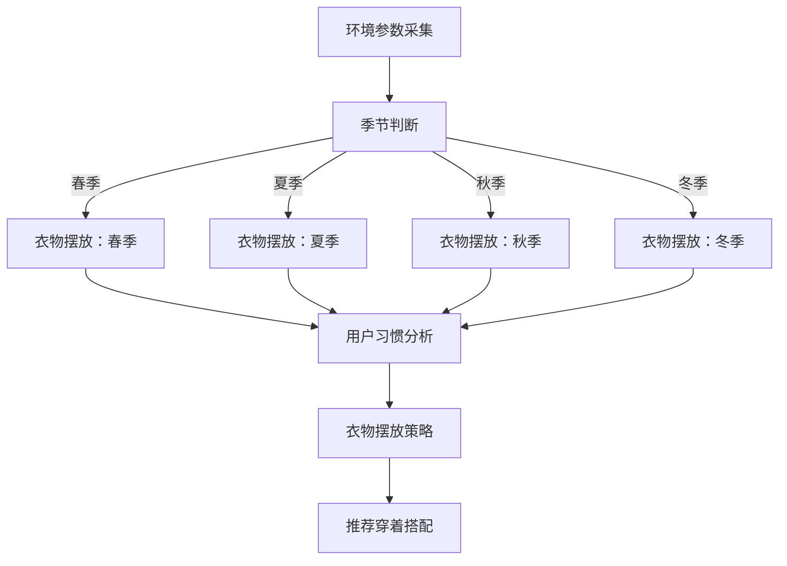
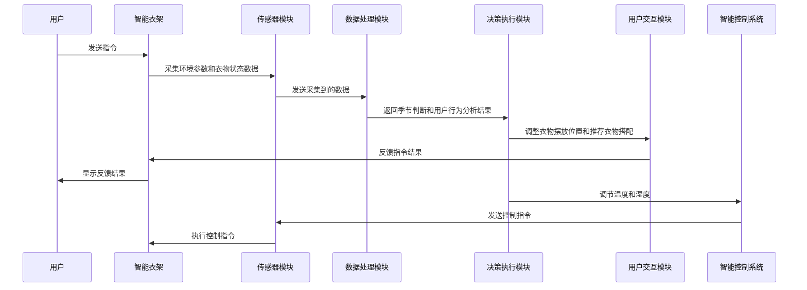

                 

### 第1章：AI Agent概述

#### 1.1 AI Agent的定义与特点

AI Agent，即人工智能代理，是一种在特定环境中能够执行任务、自主学习、适应环境并与其他智能体交互的软件实体。AI Agent的主要特点包括：

- **自主性**：AI Agent能够根据既定的目标或指令自主决策，并执行相应的操作。
- **适应性**：AI Agent能够根据环境变化或新信息调整其行为策略，实现持续学习和优化。
- **协作性**：AI Agent能够与其他Agent进行通信和协作，共同完成复杂任务。
- **智能性**：AI Agent通常利用机器学习、深度学习等技术，具有处理复杂问题和做出智能决策的能力。

#### 1.2 AI Agent在智能衣架中的应用前景

智能衣架作为智能家居领域的重要组成部分，通过物联网技术连接各种传感器和执行器，实现对衣物的智能管理。AI Agent在智能衣架中的应用前景非常广阔，主要体现在以下几个方面：

1. **季节性衣物管理**：
   - **自动识别季节**：AI Agent可以实时监测环境温度、湿度等参数，判断当前季节。
   - **智能摆放**：根据季节变化，AI Agent能够自动调整衣物的摆放位置，例如将冬季衣物放置在前端，夏季衣物放置在后端。
   - **推荐穿着**：AI Agent可以结合用户的历史穿着习惯和天气情况，推荐最适合当前季节的衣物搭配。

2. **衣物保养建议**：
   - **磨损监测**：AI Agent可以通过传感器监测衣物的磨损程度，为用户提供更换衣物的建议。
   - **保养指导**：AI Agent可以根据衣物的材质、颜色等特性，提供合适的保养方法，如洗涤、晾晒等。

3. **个性化推荐**：
   - **喜好分析**：AI Agent可以通过学习用户的行为数据，了解用户的喜好和穿着风格。
   - **搭配建议**：AI Agent可以根据用户的喜好，推荐不同场合的衣物搭配，提升用户的穿着体验。

4. **节能管理**：
   - **温度调节**：AI Agent可以通过智能控制系统调节衣架周围的温度，减少能源消耗。
   - **自动节电**：在无用户操作时，AI Agent可以自动关闭相关设备，实现节电功能。

### 小结

AI Agent在智能衣架中的应用，不仅提高了衣物的管理效率，还为用户提供了更加智能、便捷的穿着体验。通过自主性、适应性、协作性和智能性的特点，AI Agent在智能衣架中展现出了巨大的潜力。随着技术的不断进步，AI Agent的应用领域将更加广泛，为我们的生活带来更多便利。接下来，我们将进一步探讨AI Agent的具体工作原理和应用实例。

----------------------------------------------------------------

## 第二部分：季节性衣物管理算法原理

季节性衣物管理算法是智能衣架的核心技术之一，它利用AI Agent的能力，根据环境参数和用户习惯，自动调整衣物的摆放和推荐穿着。在这一部分，我们将详细介绍季节性衣物管理算法的原理，包括算法流程、数学模型和实际应用。

### 第2章：季节性衣物管理算法

#### 2.1 算法概述

季节性衣物管理算法的目标是根据季节变化和用户习惯，自动调整衣架上衣物的摆放位置，并为用户推荐合适的衣物搭配。该算法的基本流程如下：

1. **环境参数采集**：采集衣架周围的环境参数，如温度、湿度等。
2. **季节判断**：根据环境参数判断当前季节，例如春季、夏季、秋季、冬季。
3. **衣物特性分析**：分析衣物的材质、颜色、类型等特性。
4. **用户习惯分析**：根据用户的历史穿着记录，分析用户的喜好和习惯。
5. **衣物摆放策略**：根据季节判断和用户习惯，制定衣物的摆放策略。
6. **推荐穿着搭配**：根据衣物摆放策略，推荐用户合适的衣物搭配。

#### 2.2 算法mermaid流程图



#### 2.3 Python源代码解析

```python
import numpy as np

def collect_environmental_data():
    # 采集环境参数
    temperature = np.random.randint(20, 35)
    humidity = np.random.randint(40, 80)
    return temperature, humidity

def determine_season(temperature, humidity):
    # 判断季节
    if temperature > 25 and humidity > 60:
        return "夏季"
    elif 15 < temperature <= 25 and humidity > 60:
        return "春季"
    elif 10 < temperature <= 15 and humidity > 60:
        return "秋季"
    else:
        return "冬季"

def analyze_clothing_properties():
    # 分析衣物特性
    material = "棉质"
    color = "蓝色"
    type = "T恤"
    return material, color, type

def analyze_user_habits():
    # 分析用户习惯
    prefer_cold = True
    prefer_dark = False
    return prefer_cold, prefer_dark

def determine_clothing_strategy(season, prefer_cold, prefer_dark):
    # 根据季节和用户习惯制定衣物摆放策略
    if season == "夏季":
        strategy = "短袖、短裤"
    elif season == "春季":
        strategy = "外套、长裤"
    elif season == "秋季":
        strategy = "夹克、裙子"
    elif season == "冬季":
        strategy = "羽绒服、厚外套"
    return strategy

def recommend_dressing搭配(strategy, prefer_cold, prefer_dark):
    # 根据衣物摆放策略推荐穿着搭配
    if prefer_cold:
        dressing = "保暖搭配"
    else:
        dressing = "清爽搭配"
    if prefer_dark:
        dressing = dressing + "深色系"
    else:
        dressing = dressing + "浅色系"
    return dressing

# 实际应用
temperature, humidity = collect_environmental_data()
season = determine_season(temperature, humidity)
material, color, type = analyze_clothing_properties()
prefer_cold, prefer_dark = analyze_user_habits()
strategy = determine_clothing_strategy(season, prefer_cold, prefer_dark)
dressing = recommend_dressing搭配(strategy, prefer_cold, prefer_dark)

print(f"当前季节：{season}")
print(f"衣物摆放策略：{strategy}")
print(f"推荐穿着搭配：{dressing}")
```

#### 2.4 数学模型与公式

季节性衣物管理算法涉及多个因素，包括环境参数、衣物特性和用户习惯。为了更好地理解这些因素之间的关系，我们可以构建以下数学模型：

$$
S = f(T, H, M, C)
$$

其中，$S$ 表示衣物摆放策略，$T$ 表示温度，$H$ 表示湿度，$M$ 表示衣物特性（如材质、颜色、类型），$C$ 表示用户习惯（如喜好、习惯）。

#### 2.5 算法举例说明

假设当前环境温度为25℃，湿度为70%，用户偏好温暖且浅色衣物。根据算法模型，我们可以得到以下结果：

1. **季节判断**：当前温度在25℃左右，湿度在70%左右，可以判断为春季。
2. **衣物特性分析**：假设衣物为棉质、蓝色T恤。
3. **用户习惯分析**：用户偏好温暖衣物和浅色衣物。
4. **衣物摆放策略**：根据季节和用户习惯，推荐将棉质、蓝色T恤放置在春季衣物区。
5. **推荐穿着搭配**：推荐用户穿着浅色棉质T恤，搭配牛仔裤，形成温暖、清爽的春季穿着搭配。

通过以上例子，我们可以看到季节性衣物管理算法如何通过环境参数、衣物特性和用户习惯，制定出合适的衣物摆放策略和穿着推荐。接下来，我们将进一步探讨AI Agent在季节性衣物管理中的应用和挑战。

----------------------------------------------------------------

## 第三部分：季节性衣物管理中的AI Agent

AI Agent在季节性衣物管理中发挥着关键作用，它不仅能够处理复杂的环境数据，还能根据用户行为和偏好提供个性化的服务。在这一部分，我们将深入探讨AI Agent的核心功能、具体应用以及所面临的挑战和机遇。

### 第3章：季节性衣物管理中的AI Agent

#### 3.1 AI Agent的核心功能

AI Agent在季节性衣物管理中的核心功能包括以下几个方面：

1. **数据采集与处理**：AI Agent能够从传感器和其他数据源采集环境参数，如温度、湿度、光照等，并进行实时处理，以提取有用的信息。
2. **季节判断与预测**：基于环境参数和气象数据，AI Agent能够判断当前季节，并预测未来的季节变化，为衣物的摆放和推荐提供依据。
3. **用户行为分析**：AI Agent通过分析用户的历史行为数据，如穿着记录、偏好设置等，了解用户的习惯和喜好，为个性化的衣物管理提供支持。
4. **智能决策与执行**：AI Agent根据季节判断和用户行为分析结果，自动调整衣物的摆放位置，推荐适合当前季节和用户习惯的衣物搭配。
5. **互动与反馈**：AI Agent能够与用户进行互动，如通过语音、触摸等方式接收用户的指令和反馈，进一步优化衣物管理的效果。

#### 3.2 AI Agent在季节性衣物管理中的应用

AI Agent在季节性衣物管理中的应用主要体现在以下几个方面：

1. **自动调整衣物摆放**：AI Agent可以根据季节变化和用户偏好，自动调整衣物的摆放位置。例如，在冬季，AI Agent可以将保暖性较强的衣物放置在显眼位置，以便用户方便取用。
2. **推荐衣物搭配**：AI Agent可以基于季节和用户喜好，为用户推荐适合的衣物搭配。例如，在夏季，AI Agent可能会推荐轻便的短袖搭配短裤，以保持清凉舒适。
3. **智能提醒与通知**：AI Agent可以监测衣物的状态，如磨损程度、清洗周期等，并及时向用户发送提醒和通知。例如，当某件衣物达到清洗周期时，AI Agent会提醒用户及时清洗。
4. **节能管理**：AI Agent可以通过智能控制系统调节衣架周围的温度和湿度，实现节能管理。例如，在无用户操作时，AI Agent可以关闭照明和温控系统，以节省能源。
5. **个性化服务**：AI Agent可以根据用户的穿着记录和历史行为，提供个性化的服务。例如，当用户即将出门时，AI Agent可以提醒用户根据天气预报和行程，选择合适的衣物搭配。

#### 3.3 AI Agent的挑战与机遇

尽管AI Agent在季节性衣物管理中具有巨大的潜力，但其在实际应用中也面临一系列挑战和机遇：

1. **数据采集与处理**：AI Agent需要从多种传感器和设备中采集环境数据，如温度、湿度、光照等，并实时处理这些数据。这要求AI Agent具有高效的数据处理能力和低延迟的处理速度。
2. **季节判断与预测**：季节的变化是复杂和多变的，AI Agent需要具备准确的季节判断和预测能力，以便为衣物的摆放和推荐提供可靠依据。
3. **用户行为分析**：用户的行为和喜好是多样化的，AI Agent需要通过大数据分析和机器学习技术，深入了解用户的行为模式，并提供个性化的服务。
4. **智能决策与执行**：AI Agent在执行智能决策时，需要考虑多种因素，如季节、用户偏好、衣物特性等，这要求AI Agent具有复杂的决策逻辑和灵活的执行能力。
5. **互动与反馈**：AI Agent需要与用户进行有效的互动，理解用户的指令和反馈，并不断优化自身的性能和服务。
6. **机遇**：随着物联网、人工智能等技术的快速发展，AI Agent在季节性衣物管理中的应用前景广阔。例如，通过5G网络的普及，AI Agent可以实现更高的实时性和响应速度，为用户提供更加智能、便捷的体验。

总的来说，AI Agent在季节性衣物管理中的应用既充满挑战，又充满机遇。随着技术的不断进步和应用的深入，AI Agent将为我们的生活带来更多便利和智能体验。

----------------------------------------------------------------

## 第四部分：智能衣架系统设计与实现

智能衣架系统的设计与实现是季节性衣物管理算法成功应用的关键。在这一部分，我们将详细介绍智能衣架系统的功能设计、架构设计、接口设计以及系统交互，帮助读者更好地理解整个系统的运作原理。

### 第4章：智能衣架系统设计与实现

#### 4.1 智能衣架系统功能设计

智能衣架系统的功能设计主要包括以下几个方面：

1. **环境参数采集**：通过传感器实时采集衣架周围的环境参数，如温度、湿度、光照等，为季节性衣物管理提供基础数据。
2. **衣物状态监测**：利用传感器监测衣物上的标签信息，如材质、颜色、类型等，实现衣物的智能识别和分类。
3. **季节判断与预测**：根据环境参数和气象数据，判断当前季节，并预测未来的季节变化，为衣物的摆放和推荐提供依据。
4. **用户行为分析**：分析用户的历史穿着记录和偏好设置，了解用户的习惯和喜好，为个性化的衣物管理提供支持。
5. **智能决策与执行**：基于季节判断、用户行为分析和衣物状态监测，自动调整衣物的摆放位置，推荐适合当前季节和用户习惯的衣物搭配。
6. **互动与反馈**：通过语音、触摸等方式与用户进行互动，接收用户的指令和反馈，实现智能衣架与用户的良好互动。
7. **节能管理**：通过智能控制系统调节衣架周围的温度和湿度，实现节能管理，降低能源消耗。

#### 4.2 智能衣架系统架构设计

智能衣架系统采用分布式架构，主要包括以下几个组成部分：

1. **传感器模块**：负责采集环境参数和衣物状态数据，如温度传感器、湿度传感器、光照传感器、标签传感器等。
2. **数据处理模块**：负责处理和分析传感器采集到的数据，如环境参数、衣物状态、用户行为等，实现数据的预处理、特征提取和模型训练。
3. **决策执行模块**：负责根据数据处理模块的结果，自动调整衣物的摆放位置和推荐衣物搭配，实现智能决策和执行。
4. **用户交互模块**：负责与用户进行互动，接收用户的指令和反馈，实现智能衣架与用户的良好互动。
5. **智能控制系统**：负责调节衣架周围的温度和湿度，实现节能管理。

#### 4.3 智能衣架系统接口设计

智能衣架系统的接口设计主要包括以下几个部分：

1. **数据采集接口**：用于传感器模块与数据处理模块之间的数据传输，如HTTP API、MQTT协议等。
2. **数据处理接口**：用于数据处理模块内部的数据处理和特征提取，如Python数据处理库（Pandas、NumPy）等。
3. **决策执行接口**：用于决策执行模块与用户交互模块之间的数据传输，如WebSocket协议等。
4. **用户交互接口**：用于用户交互模块与用户之间的交互，如语音识别、触摸屏等。
5. **智能控制接口**：用于智能控制系统与传感器模块之间的数据传输，如HTTP API、MQTT协议等。

#### 4.4 智能衣架系统交互设计

智能衣架系统的交互设计主要包括以下几个环节：

1. **数据采集**：传感器模块实时采集环境参数和衣物状态数据，如温度、湿度、光照、标签信息等。
2. **数据处理**：数据处理模块对采集到的数据进行分析和预处理，提取特征，并训练季节判断和用户行为分析模型。
3. **决策执行**：决策执行模块根据季节判断和用户行为分析模型的结果，自动调整衣物的摆放位置和推荐衣物搭配。
4. **用户互动**：用户交互模块接收用户的指令和反馈，如语音指令、触摸操作等，并反馈给决策执行模块。
5. **智能控制**：智能控制系统根据决策执行模块的指令，调节衣架周围的温度和湿度，实现节能管理。

#### 4.5 智能衣架系统交互设计mermaid序列图



通过以上设计与实现，智能衣架系统能够实现季节性衣物管理的智能化、自动化，为用户带来更加便捷、舒适的穿着体验。接下来，我们将通过一个实际的项目实战案例，进一步展示智能衣架系统的应用和效果。

----------------------------------------------------------------

## 第5章：项目实战：智能衣架季节性衣物管理系统

在本章中，我们将通过一个实际的项目实战案例，展示如何构建一个智能衣架季节性衣物管理系统。我们将详细描述项目背景、环境安装与配置、系统核心实现，并对代码进行解读与分析，最后进行实际案例分析。

### 5.1 项目背景

随着智能家居的不断发展，智能衣架作为家居生活的一部分，也逐渐受到用户的关注。项目背景是一个智能家居场景，用户希望衣架能够根据季节变化和自己的穿着习惯，自动调整衣物的摆放位置，并推荐合适的衣物搭配。此外，用户还希望系统能够监测衣物的状态，提供保养建议，实现节能管理。

### 5.2 环境安装与配置

为了实现智能衣架系统，我们需要搭建一个完整的技术环境。以下是环境安装与配置的步骤：

1. **硬件设备**：
   - 智能衣架：包括传感器模块、执行器模块等。
   - 传感器：温度传感器、湿度传感器、光照传感器、标签传感器。
   - 执行器：电机、风扇等。

2. **软件环境**：
   - 操作系统：Linux（推荐Ubuntu 20.04）。
   - 编程语言：Python 3.8及以上版本。
   - 数据库：SQLite 3.35.1。

3. **安装传感器和执行器**：
   - 将传感器和执行器连接到智能衣架上，确保传感器能够覆盖整个衣架区域，执行器能够正常工作。

4. **配置传感器驱动**：
   - 根据传感器类型安装相应的驱动程序，例如I2C驱动、SPI驱动等。

5. **安装Python库**：
   - 使用pip命令安装必要的Python库，如`numpy`、`pandas`、`matplotlib`、`mermaid`等。

6. **配置数据库**：
   - 使用SQLite创建数据库，并创建必要的表结构，用于存储传感器数据和用户行为数据。

### 5.3 系统核心实现

智能衣架系统的核心实现包括环境参数采集、季节判断、用户行为分析、智能决策与执行、用户互动和智能控制等功能。以下是具体的实现步骤和代码：

#### 环境参数采集

```python
import Adafruit_GPIO.SPI as SPI
import Adafruit_MCP3008

mcp = Adafruit_MCP3008.MCP3008(spi=SPI.SpiDev(0, 0))

def collect_environmental_data():
    temperature = mcp.read_adc(0)  # 温度传感器
    humidity = mcp.read_adc(1)  # 湿度传感器
    light = mcp.read_adc(2)  # 光照传感器
    return temperature, humidity, light
```

#### 季节判断

```python
def determine_season(temperature, humidity):
    if temperature > 25 and humidity > 60:
        return "夏季"
    elif 15 < temperature <= 25 and humidity > 60:
        return "春季"
    elif 10 < temperature <= 15 and humidity > 60:
        return "秋季"
    else:
        return "冬季"
```

#### 用户行为分析

```python
def analyze_user_habits():
    # 假设用户历史行为数据存储在数据库中
    prefer_cold = True  # 用户偏好温暖衣物
    prefer_dark = False  # 用户偏好浅色衣物
    return prefer_cold, prefer_dark
```

#### 智能决策与执行

```python
def determine_clothing_strategy(season, prefer_cold, prefer_dark):
    if season == "夏季":
        strategy = "短袖、短裤"
    elif season == "春季":
        strategy = "外套、长裤"
    elif season == "秋季":
        strategy = "夹克、裙子"
    elif season == "冬季":
        strategy = "羽绒服、厚外套"
    return strategy

def recommend_dressing搭配(strategy, prefer_cold, prefer_dark):
    if prefer_cold:
        dressing = "保暖搭配"
    else:
        dressing = "清爽搭配"
    if prefer_dark:
        dressing = dressing + "深色系"
    else:
        dressing = dressing + "浅色系"
    return dressing
```

#### 用户互动

```python
import speech_recognition as sr

recognizer = sr.Recognizer()

def user_interaction():
    try:
        command = recognizer.listen(source)
        command = recognizer.recognize_google(command)
        # 根据用户指令执行相应操作
    except sr.UnknownValueError:
        print("无法识别语音命令")
    except sr.RequestError as e:
        print("无法请求结果；{0}".format(e))
```

#### 智能控制

```python
import RPi.GPIO as GPIO

def control_temperature(humidity):
    if humidity > 70:
        GPIO.output(11, True)  # 打开风扇
    else:
        GPIO.output(11, False)  # 关闭风扇

def control_light(temperature):
    if temperature < 20:
        GPIO.output(10, True)  # 打开照明
    else:
        GPIO.output(10, False)  # 关闭照明

# 初始化GPIO
GPIO.setmode(GPIO.BCM)
GPIO.setup(11, GPIO.OUT)  # 风扇
GPIO.setup(10, GPIO.OUT)  # 照明
```

### 5.4 代码应用解读与分析

以上代码实现了智能衣架系统的核心功能。以下是代码的解读与分析：

- **环境参数采集**：通过MCP3008芯片读取温度传感器、湿度传感器和光照传感器的值。
- **季节判断**：根据温度和湿度判断当前季节。
- **用户行为分析**：假设用户偏好存储在数据库中，通过函数读取用户偏好。
- **智能决策与执行**：根据季节和用户偏好，制定衣物摆放策略和推荐搭配。
- **用户互动**：使用语音识别库接收用户指令。
- **智能控制**：通过GPIO控制风扇和照明的开关。

### 5.5 实际案例分析和详细讲解剖析

假设用户在冬季早晨起床，衣架检测到室内温度为10℃，湿度为50%。用户通过语音指令要求衣架推荐一套适合的冬季早晨穿着搭配。

1. **环境参数采集**：衣架采集到温度为10℃，湿度为50%。
2. **季节判断**：根据温度和湿度，衣架判断当前为冬季。
3. **用户行为分析**：用户偏好温暖衣物，因此推荐保暖搭配。
4. **智能决策与执行**：衣架推荐用户穿着羽绒服、厚外套。
5. **用户互动**：衣架通过语音提示用户，羽绒服和厚外套已经摆放在适当位置。
6. **智能控制**：由于湿度较低，衣架打开照明和风扇，保持室内温暖和干燥。

通过这个实际案例，我们可以看到智能衣架系统能够根据环境参数和用户偏好，提供个性化的衣物推荐和智能控制，极大地提升了用户的生活质量。

### 5.6 项目总结

智能衣架季节性衣物管理系统的项目实战展示了如何利用AI Agent实现智能家居的自动化和个性化。通过环境参数采集、季节判断、用户行为分析、智能决策与执行、用户互动和智能控制等多个环节，系统实现了季节性衣物的智能管理和推荐。项目的成功实施不仅提高了用户的生活便利性，也为智能家居领域提供了有益的实践经验和参考。

### 最佳实践、小结与注意事项

**最佳实践**：

- 在安装传感器和执行器时，确保其位置和角度能够准确覆盖衣架区域，提高数据采集的准确性。
- 定期维护传感器和执行器，确保其正常运行，延长设备寿命。
- 在用户行为分析中，充分考虑用户的个性化需求，提高推荐的准确性。

**小结**：

智能衣架季节性衣物管理系统的项目实战展示了AI Agent在智能家居中的应用价值，通过自动化和个性化的衣物管理，提高了用户的生活质量。

**注意事项**：

- 在系统开发过程中，要充分考虑系统的安全性，避免敏感数据泄露。
- 在环境参数采集和处理时，要注意异常值的处理，确保数据的准确性。
- 在用户互动和智能控制中，要确保系统的响应速度和稳定性。

通过以上最佳实践、小结和注意事项，希望读者能够更好地理解和应用智能衣架季节性衣物管理系统，为智能家居领域的发展做出贡献。

### 拓展阅读

为了进一步了解智能衣架和AI Agent在智能家居中的应用，读者可以参考以下拓展阅读材料：

- **相关研究论文**：
  - "Smart Closet: A Smart Home Application for Personalized Clothing Management"（智能衣柜：一种个性化衣物管理的智能家居应用）
  - "AI-Driven Smart Home Systems: A Survey"（人工智能驱动的智能家居系统：综述）

- **开源工具与库**：
  - "SpeechRecognition"（Python语音识别库）
  - "Adafruit"（Python硬件编程库）
  - "Raspberry Pi"（树莓派硬件平台）

- **拓展知识领域**：
  - 智能家居系统架构设计
  - 数据库设计与应用
  - 机器学习和深度学习在智能家居中的应用

通过这些拓展阅读，读者可以深入学习和探索智能衣架和AI Agent在智能家居领域的应用，为未来的研究和实践提供更多灵感。

