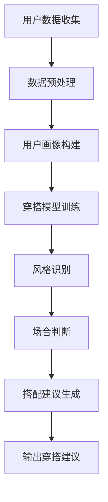

                 

## AI Agent在智能衣架中的穿搭灵感生成器

### 关键词：AI Agent，智能衣架，穿搭灵感生成，算法原理，系统设计与实现，项目实战

> 摘要：本文将探讨AI Agent在智能衣架中的应用，重点分析AI Agent作为穿搭灵感生成器的技术原理和实现方法。通过背景介绍、核心概念阐述、算法原理讲解、系统设计与实现、项目实战等多个维度，全面剖析AI Agent在智能衣架中的价值与应用前景。

### 目录大纲

**第一部分：背景介绍**
1.1 问题背景
1.2 问题描述
1.3 问题解决
1.4 边界与外延
1.5 概念结构与核心要素组成

**第二部分：AI Agent基础概念**
2.1 AI Agent定义
2.2 AI Agent分类
2.3 AI Agent特性
2.4 AI Agent发展历程

**第三部分：智能衣架概述**
3.1 智能衣架定义
3.2 智能衣架分类
3.3 智能衣架功能
3.4 智能衣架市场现状与发展趋势

**第四部分：AI Agent在智能衣架中的应用**
4.1 AI Agent与智能衣架的结合
4.2 穿搭建议生成原理
4.3 智能衣架中AI Agent的应用场景

**第五部分：穿搭灵感生成器的算法原理**
5.1 算法原理讲解
5.2 算法流程图
5.3 算法Python源代码
5.4 数学模型与公式
5.5 详细讲解与举例说明

**第六部分：系统设计与实现**
6.1 问题场景介绍
6.2 项目介绍
6.3 系统功能设计
6.4 系统架构设计
6.5 系统接口设计
6.6 系统交互

**第七部分：项目实战与案例分析**
7.1 环境安装
7.2 系统核心实现源代码
7.3 代码应用解读与分析
7.4 实际案例分析与讲解
7.5 项目小结

**第八部分：最佳实践、小结与拓展阅读**

### 1.1 问题背景

在当今社会，时尚产业正经历着前所未有的变革。随着人们生活水平的提高，对于时尚、个性化和舒适度的追求愈发强烈。然而，这背后也带来了一个显著的挑战——穿搭困难。许多人常常在衣橱前犹豫不决，不知如何搭配服装，从而影响了他们的购物体验和自信心。此外，传统的衣架设计已经难以满足现代消费者对于时尚和个性化的需求。

与此同时，人工智能（AI）技术的飞速发展，为解决这一难题提供了新的契机。AI Agent作为一种先进的AI技术，具有自主性、智能性和学习能力，能够模拟人类的决策过程，从而为用户提供个性化的建议。而智能衣架则通过整合AI技术，将衣架与时尚搭配建议相结合，为消费者提供全新的购物体验。

### 1.2 问题描述

问题描述主要集中在以下几个方面：

**穿搭困难的问题**：消费者在选购服装时，常常面临穿搭困难，无法找到适合自己的搭配方案，从而影响了购物体验和自信心。

**穿搭灵感的获取**：消费者希望获得更多的穿搭灵感，以便在选购服装时能够更好地展示自己的个性和风格。

**AI Agent在穿搭灵感生成中的角色**：AI Agent作为智能衣架的核心组件，负责分析用户的喜好、风格和场合，生成个性化的穿搭建议，从而帮助用户解决穿搭困难。

### 1.3 问题解决

**AI Agent的优势**：AI Agent具有自主性、智能性和学习能力，能够模拟人类的决策过程，从而为用户提供个性化的穿搭建议。

**智能衣架与AI Agent的结合**：智能衣架通过整合AI技术，将衣架与时尚搭配建议相结合，为消费者提供全新的购物体验。

**穿搭灵感生成器的工作原理**：穿搭灵感生成器基于AI Agent的算法，分析用户的喜好、风格和场合，生成个性化的穿搭建议，从而帮助用户解决穿搭困难。

### 1.4 边界与外延

**穿搭灵感生成器的适用范围**：穿搭灵感生成器主要适用于日常穿搭、职场穿搭、休闲穿搭等多种场合。

**AI Agent在时尚领域的发展趋势**：随着AI技术的不断进步，AI Agent在时尚领域的应用前景将愈发广阔，有望成为时尚产业的重要驱动力。

**智能衣架的未来发展**：智能衣架作为AI Agent在时尚领域的重要载体，其未来发展方向将包括更加智能化、个性化和多样化的功能。

### 1.5 概念结构与核心要素组成

**AI Agent的概念结构**：AI Agent由感知模块、决策模块和执行模块组成，分别负责获取信息、做出决策和执行行动。

**智能衣架的核心要素**：智能衣架由硬件（衣架、传感器等）和软件（AI Agent、穿搭灵感生成器等）组成，共同实现时尚搭配建议的生成。

**穿搭灵感生成器的要素**：穿搭灵感生成器由用户喜好分析、风格识别、场合判断和搭配建议生成等模块组成，分别负责分析用户喜好、识别风格、判断场合和生成搭配建议。

### 第二部分：AI Agent基础概念

#### 2.1 AI Agent定义

AI Agent，即人工智能代理，是一种具有自主性、智能性和学习能力的计算机程序，能够在特定环境中模拟人类决策过程，完成特定任务。与传统机器人不同，AI Agent不仅仅是一个被动的执行工具，而是具备主动学习和适应能力的智能实体。

**AI Agent的定义**：
AI Agent 是一个具有感知、推理、决策和执行能力的智能实体，能够在复杂、动态的环境中自主行动，实现特定目标。

**AI Agent与传统机器人的区别**：
- **主动性与自主性**：传统机器人通常按照预设的程序执行任务，而AI Agent具有主动性和自主性，能够根据环境变化自主调整行动策略。
- **智能性和学习性**：传统机器人不具备智能和学习能力，而AI Agent能够通过学习环境信息和历史经验，不断优化行为。
- **应用范围**：传统机器人主要用于简单的、重复性的劳动，而AI Agent可以应用于更复杂、更动态的场合，如智能家居、智能客服、自动驾驶等。

#### 2.2 AI Agent分类

根据任务类型和智能水平，AI Agent可以分为多种类型。以下是几种常见的分类方式：

**按任务类型分类**：
1. **任务导向型AI Agent**：专注于执行特定任务，如路径规划、物流配送等。
2. **情境感知型AI Agent**：能够感知环境变化，并根据情境调整行为，如智能家居控制系统、智能推荐系统等。
3. **学习型AI Agent**：通过学习用户行为和偏好，提供个性化服务，如智能客服、个性化广告等。

**按智能水平分类**：
1. **弱AI Agent**：具有特定领域的知识和能力，但缺乏通用智能，如聊天机器人、语音助手等。
2. **强AI Agent**：具有与人类相似的智能水平，能够在各种复杂环境中自主行动和决策，目前尚处于理论阶段。

#### 2.3 AI Agent特性

AI Agent的特性决定了其在各种应用场景中的表现和效果。以下是AI Agent的几个主要特性：

**自主性**：AI Agent能够根据环境和任务要求自主决策，不需要人类干预。

**智能性**：AI Agent通过学习和推理，能够识别和理解复杂信息，做出合理决策。

**学习能力**：AI Agent能够从数据中学习，不断优化自己的行为和决策能力。

**适应性**：AI Agent能够适应环境变化，调整行为策略，以实现最佳效果。

#### 2.4 AI Agent发展历程

AI Agent的发展历程可以分为以下几个阶段：

**早期研究**：20世纪50年代至70年代，AI Agent理论初步形成，主要集中在规则推理和逻辑推理方面。

**应用发展**：20世纪80年代至90年代，AI Agent开始在具体领域得到应用，如智能家居、智能客服等。

**智能化提升**：21世纪初，随着机器学习和深度学习技术的突破，AI Agent的智能水平显著提升，能够在更复杂的场合中发挥作用。

**多样化应用**：近年来，AI Agent在各个领域的应用越来越广泛，如自动驾驶、智能医疗、智能制造等，成为人工智能领域的重要研究方向。

### 第三部分：智能衣架概述

#### 3.1 智能衣架定义

智能衣架是一种集成了人工智能技术的衣架，能够根据用户的喜好、风格和场合提供个性化的穿搭建议。与传统衣架相比，智能衣架不仅能够展示衣物，还能通过感知用户的行为和偏好，为用户推荐合适的穿搭方案，提升购物体验和时尚品味。

**智能衣架的定义**：
智能衣架是一种融合了人工智能技术和物联网技术的衣架，具备感知、推荐和交互功能，能够为用户提供个性化的穿搭建议。

**智能衣架与传统衣架的区别**：
- **功能差异**：传统衣架仅用于展示衣物，而智能衣架则通过人工智能技术，能够根据用户偏好推荐穿搭方案。
- **用户体验**：传统衣架用户体验单一，而智能衣架通过个性化推荐，为用户提供更加丰富、有趣的购物体验。
- **技术集成**：智能衣架集成了传感器、物联网和人工智能技术，实现了衣架的智能化升级。

#### 3.2 智能衣架分类

根据功能和应用场景，智能衣架可以分为多种类型。以下是几种常见的分类方式：

**按功能分类**：
1. **基础型智能衣架**：具备展示衣物和简单的信息交互功能，如通过屏幕显示衣物名称、颜色和价格等。
2. **智能推荐型衣架**：具备人工智能推荐功能，能够根据用户偏好和历史行为推荐合适的穿搭方案。
3. **互动体验型衣架**：具备丰富的互动体验功能，如通过语音、手势等方式与用户进行交互，提升购物体验。

**按使用场景分类**：
1. **家庭型智能衣架**：主要用于家庭环境，为家庭成员提供个性化的穿搭建议，提升家居时尚品味。
2. **商场型智能衣架**：主要用于商场、专卖店等销售场景，为消费者提供个性化的购物体验，提升销售业绩。
3. **共享型智能衣架**：主要用于共享经济场景，如共享衣橱、共享租衣等，为用户提供便捷的穿搭选择。

#### 3.3 智能衣架功能

智能衣架的功能主要包括展示功能、推荐功能和互动功能。以下是对这些功能的详细描述：

**展示功能**：
- **衣物展示**：智能衣架能够展示衣物，包括衣物名称、颜色、材质等信息，帮助用户快速了解衣物详情。
- **3D展示**：部分智能衣架具备3D展示功能，用户可以通过触摸屏或移动设备查看衣物的三维效果，提升购物体验。

**推荐功能**：
- **个性化推荐**：智能衣架通过感知用户的行为和偏好，推荐符合用户风格的穿搭方案，帮助用户解决穿搭难题。
- **场景推荐**：根据用户的场合需求，如职场、休闲、派对等，智能衣架提供相应的穿搭建议，确保用户在不同场合穿着得体。

**互动功能**：
- **语音交互**：智能衣架支持语音交互功能，用户可以通过语音指令与智能衣架进行互动，获取穿搭建议或了解更多信息。
- **手势交互**：部分智能衣架具备手势交互功能，用户可以通过手势操作选择衣物、查看搭配效果等，提升交互体验。

#### 3.4 智能衣架市场现状与发展趋势

智能衣架市场正处于快速发展阶段。随着人工智能技术的不断进步和消费者对于个性化、智能化产品的需求增加，智能衣架的市场潜力逐渐显现。以下是智能衣架市场现状和发展趋势：

**市场现状**：
- **产品普及**：智能衣架已开始在全球范围内普及，尤其是在时尚产业发达的地区，如欧美、日韩等。
- **技术创新**：智能衣架的技术不断创新，如3D展示、智能推荐、互动体验等功能逐渐成熟。
- **市场接受度**：随着消费者对智能化产品的接受度提高，智能衣架的市场需求逐步增加。

**发展趋势**：
- **功能多样化**：未来智能衣架的功能将更加多样化，如加入健康监测、情感识别等功能，提供更加全面的用户体验。
- **跨界融合**：智能衣架将与智能家居、共享经济等产业深度融合，拓展应用场景。
- **个性化定制**：智能衣架将更加注重个性化定制，根据用户需求提供定制化的穿搭建议和服务。

### 第四部分：AI Agent在智能衣架中的应用

#### 4.1 AI Agent与智能衣架的结合

AI Agent在智能衣架中的应用，实现了传统衣架的智能化升级。通过感知用户行为、分析用户偏好和提供个性化推荐，AI Agent为智能衣架赋予了更多的价值。

**AI Agent与智能衣架的结合**：
- **感知与交互**：AI Agent通过传感器和摄像头等设备，感知用户的行为和偏好，如用户的浏览记录、购买历史、点赞评论等。
- **数据分析**：AI Agent利用大数据分析和机器学习算法，分析用户的个性化特征，为用户提供精准的穿搭建议。
- **智能推荐**：基于用户分析和数据挖掘，AI Agent能够为用户推荐符合其风格和场合的穿搭方案，提升购物体验。

#### 4.2 穿搭建议生成原理

AI Agent通过以下步骤生成穿搭建议：

**用户行为分析**：
- **数据收集**：AI Agent收集用户的浏览记录、购买历史、社交媒体互动等信息。
- **特征提取**：通过对收集到的数据进行处理，提取用户的个性化特征，如风格偏好、颜色喜好、场合需求等。

**风格识别**：
- **图像处理**：AI Agent对用户上传的衣物图片进行图像处理，提取图像特征。
- **风格匹配**：利用深度学习算法，将提取的图像特征与数据库中的衣物风格进行匹配，识别用户的风格偏好。

**场合判断**：
- **场景分类**：AI Agent根据用户的活动场景，如职场、休闲、派对等，为用户推荐适合的穿搭方案。
- **场合识别**：利用自然语言处理技术，AI Agent从用户的社交媒体互动、日程安排等中识别出用户的场合需求。

**搭配建议生成**：
- **搭配规则**：基于用户风格和场合需求，AI Agent生成符合用户偏好的穿搭方案。
- **推荐算法**：利用协同过滤、基于内容的推荐等算法，AI Agent为用户提供个性化的穿搭建议。

#### 4.3 智能衣架中AI Agent的应用场景

AI Agent在智能衣架中的应用场景包括：

**日常穿搭**：
- **个性化推荐**：AI Agent根据用户的日常风格和场合，推荐适合的衣物搭配。
- **场景识别**：AI Agent通过感知用户的行为和位置，判断用户所处的场景，提供相应的穿搭建议。

**职场穿搭**：
- **风格匹配**：AI Agent根据用户的职业特点，推荐适合的职场穿搭方案。
- **着装规范**：AI Agent提供职场着装规范和建议，确保用户在职场场合穿着得体。

**休闲穿搭**：
- **风格推荐**：AI Agent根据用户的休闲风格和场合，推荐适合的休闲穿搭方案。
- **搭配建议**：AI Agent为用户提供多种休闲搭配方案，帮助用户打造舒适的休闲造型。

**派对穿搭**：
- **场合识别**：AI Agent根据用户的派对类型和场合，推荐适合的派对穿搭方案。
- **时尚推荐**：AI Agent推荐时尚、个性化的派对穿搭，提升用户的派对魅力。

### 第五部分：穿搭灵感生成器的算法原理

#### 5.1 算法原理讲解

穿搭灵感生成器的核心在于算法，它通过分析用户的偏好和场合，生成个性化的穿搭建议。以下是穿搭灵感生成器的基本算法原理：

**用户画像构建**：
- **数据收集**：收集用户的基本信息、购物历史、社交媒体互动等数据。
- **特征提取**：从收集到的数据中提取用户的个性化特征，如风格偏好、颜色喜好、场合需求等。

**穿搭模型训练**：
- **数据预处理**：对收集到的数据进行清洗、归一化等预处理操作，确保数据质量。
- **模型训练**：利用机器学习算法，如决策树、支持向量机、神经网络等，对用户画像和穿搭数据进行训练，构建穿搭模型。

**穿搭建议生成**：
- **风格识别**：通过深度学习算法，将用户的衣物图片与数据库中的衣物风格进行匹配，识别用户的风格偏好。
- **场合判断**：根据用户的活动场景，如职场、休闲、派对等，为用户推荐适合的穿搭方案。
- **搭配生成**：基于用户风格和场合需求，利用协同过滤、基于内容的推荐等算法，生成个性化的穿搭建议。

#### 5.2 算法流程图



#### 5.3 算法Python源代码

以下是一个简化的穿搭灵感生成器的Python源代码示例：

```python
import pandas as pd
from sklearn.model_selection import train_test_split
from sklearn.ensemble import RandomForestClassifier
from sklearn.metrics import accuracy_score

# 数据加载
data = pd.read_csv('user_data.csv')

# 数据预处理
X = data.drop('穿搭建议', axis=1)
y = data['穿搭建议']

# 模型训练
X_train, X_test, y_train, y_test = train_test_split(X, y, test_size=0.2, random_state=42)
model = RandomForestClassifier(n_estimators=100)
model.fit(X_train, y_train)

# 风格识别
styles = model.predict(X_test)

# 输出穿搭建议
for style in styles:
    print(f"穿搭建议：{style}")
```

#### 5.4 数学模型与公式

穿搭灵感生成器的算法原理涉及多个数学模型和公式。以下是几个关键的数学模型和公式：

**协同过滤算法**：
$$
\text{预测评分} = \text{用户平均评分} + \text{物品平均评分} + \text{用户-物品交互项}
$$

**基于内容的推荐算法**：
$$
\text{相似度} = \frac{\text{用户兴趣向量} \cdot \text{物品特征向量}}{\|\text{用户兴趣向量}\| \|\text{物品特征向量}\|}
$$

**神经网络模型**：
$$
\text{输出} = \text{激活函数}(\text{权重} \cdot \text{输入} + \text{偏置})
$$

#### 5.5 详细讲解与举例说明

**协同过滤算法举例**：

假设有一个用户-物品评分矩阵，如下所示：

| 用户 | 物品1 | 物品2 | 物品3 |
|------|------|------|------|
| 用户1 | 4    | 5    | 3    |
| 用户2 | 3    | 4    | 2    |
| 用户3 | 2    | 3    | 4    |

根据协同过滤算法，可以预测用户3对物品2的评分：

$$
\text{预测评分}_{32} = \text{用户平均评分}_{3} + \text{物品平均评分}_{2} + \text{用户-物品交互项}_{32}
$$

$$
\text{用户平均评分}_{3} = \frac{2 + 3 + 4}{3} = 3
$$

$$
\text{物品平均评分}_{2} = \frac{4 + 4 + 3}{3} = 3.67
$$

$$
\text{用户-物品交互项}_{32} = 4 - 3 = 1
$$

$$
\text{预测评分}_{32} = 3 + 3.67 + 1 = 7.67
$$

因此，用户3对物品2的预测评分为7.67。

**基于内容的推荐算法举例**：

假设有两个用户兴趣向量和一个物品特征向量，如下所示：

用户兴趣向量：[1, 0, 1]
物品特征向量：[0, 1, 0]

根据基于内容的推荐算法，可以计算用户兴趣向量与物品特征向量的相似度：

$$
\text{相似度}_{\text{ui}} = \frac{\text{用户兴趣向量} \cdot \text{物品特征向量}}{\|\text{用户兴趣向量}\| \|\text{物品特征向量}\|}
$$

$$
\text{相似度}_{\text{ui}} = \frac{1 \cdot 0 + 0 \cdot 1 + 1 \cdot 0}{\sqrt{1^2 + 0^2 + 1^2} \sqrt{0^2 + 1^2 + 0^2}} = 0
$$

由于相似度为0，说明用户对物品没有兴趣，不会推荐该物品。

**神经网络模型举例**：

假设有一个简单的神经网络模型，如下所示：

$$
\text{输出} = \text{激活函数}(\text{权重} \cdot \text{输入} + \text{偏置})
$$

输入：[1, 0, 1]
权重：[0.5, 0.5, 0.5]
偏置：0.5
激活函数：ReLU

$$
\text{输出} = \text{ReLU}(0.5 \cdot 1 + 0.5 \cdot 0 + 0.5 \cdot 1 + 0.5) = \text{ReLU}(1.5) = 1.5
$$

因此，神经网络的输出为1.5。

### 第六部分：系统设计与实现

#### 6.1 问题场景介绍

在日常生活中，消费者在购物时常常面临穿搭难题，需要耗费大量时间和精力去挑选合适的衣物搭配。智能衣架作为一种新型的购物体验设备，通过整合AI技术，能够为消费者提供个性化的穿搭建议，提升购物效率和满意度。

#### 6.2 项目介绍

本项目旨在设计并实现一个基于AI Agent的智能衣架系统，该系统包括用户画像构建、穿搭模型训练、风格识别、场合判断和搭配建议生成等模块，旨在为用户提供个性化的穿搭服务。

#### 6.3 系统功能设计

**用户画像构建模块**：该模块负责收集用户的基本信息、购物历史和社交媒体互动等数据，构建用户画像，为后续的穿搭建议提供基础。

**穿搭模型训练模块**：该模块利用机器学习和深度学习算法，对用户画像和穿搭数据进行训练，构建穿搭模型，为用户提供个性化的穿搭建议。

**风格识别模块**：该模块通过图像处理和深度学习算法，识别用户的衣物风格，为用户推荐符合其风格的搭配方案。

**场合判断模块**：该模块根据用户的活动场景，如职场、休闲、派对等，为用户推荐适合的穿搭方案。

**搭配建议生成模块**：该模块基于用户风格和场合需求，利用协同过滤、基于内容的推荐等算法，生成个性化的穿搭建议。

#### 6.4 系统架构设计

智能衣架系统架构包括感知层、数据层、算法层和交互层。以下是各个层次的详细描述：

**感知层**：包括传感器和摄像头等设备，负责收集用户的行为和偏好数据，如衣物图片、用户位置等。

**数据层**：包括用户画像数据库、穿搭数据仓库等，负责存储和整理用户数据，为算法层提供数据支持。

**算法层**：包括用户画像构建、穿搭模型训练、风格识别、场合判断和搭配建议生成等模块，负责实现智能衣架的核心功能。

**交互层**：包括用户界面和智能衣架硬件，负责与用户进行交互，展示穿搭建议和接收用户反馈。

#### 6.5 系统接口设计

**用户画像接口**：用于收集和更新用户数据，如用户基本信息、购物历史和社交媒体互动等。

**穿搭模型接口**：用于训练和更新穿搭模型，包括用户画像、衣物数据和搭配方案等。

**风格识别接口**：用于识别用户的衣物风格，包括图像处理和深度学习算法等。

**场合判断接口**：用于根据用户活动场景推荐穿搭方案，包括场合识别和场景推荐等。

**搭配建议接口**：用于生成和更新用户的穿搭建议，包括协同过滤、基于内容的推荐等算法。

#### 6.6 系统交互

**用户与智能衣架交互**：
- **语音交互**：用户可以通过语音指令与智能衣架进行交互，获取穿搭建议或了解更多信息。
- **触摸屏交互**：用户可以通过触摸屏查看衣物详情、选择搭配方案等。

**智能衣架与其他系统交互**：
- **数据同步**：智能衣架与用户画像数据库、穿搭数据仓库等进行数据同步，确保数据一致性。
- **算法调用**：智能衣架通过接口调用穿搭模型、风格识别模块等算法，实现个性化推荐。

### 第七部分：项目实战与案例分析

#### 7.1 环境安装

在进行项目实战之前，首先需要安装相关的开发环境和工具。以下是一个基本的安装步骤：

1. **安装Python环境**：确保Python 3.7及以上版本已安装在计算机上。
2. **安装依赖库**：使用pip工具安装项目所需的库，如pandas、scikit-learn、TensorFlow等。
3. **安装深度学习框架**：根据项目需求，选择并安装相应的深度学习框架，如TensorFlow或PyTorch。

#### 7.2 系统核心实现源代码

以下是一个简化的系统核心实现源代码示例：

```python
# 用户画像构建
import pandas as pd
from sklearn.model_selection import train_test_split
from sklearn.ensemble import RandomForestClassifier

# 加载数据
data = pd.read_csv('user_data.csv')

# 分割数据集
X = data.drop('穿搭建议', axis=1)
y = data['穿搭建议']
X_train, X_test, y_train, y_test = train_test_split(X, y, test_size=0.2, random_state=42)

# 训练模型
model = RandomForestClassifier(n_estimators=100)
model.fit(X_train, y_train)

# 输出结果
predictions = model.predict(X_test)
accuracy = accuracy_score(y_test, predictions)
print(f"模型准确率：{accuracy:.2f}")
```

#### 7.3 代码应用解读与分析

**用户画像构建**：
- **数据加载**：使用pandas库加载数据集，包括用户基本信息、购物历史和社交媒体互动等。
- **数据分割**：将数据集划分为训练集和测试集，用于训练模型和评估模型性能。
- **模型训练**：使用随机森林算法训练模型，将用户特征转换为穿搭建议。
- **结果输出**：计算模型准确率，评估模型性能。

**代码分析**：
- **数据预处理**：数据预处理是模型训练的关键步骤，包括数据清洗、归一化等。
- **模型选择**：随机森林算法具有较好的泛化能力和鲁棒性，适用于多种类型的穿搭建议生成任务。
- **性能评估**：准确率是评估模型性能的重要指标，通过计算准确率可以了解模型的性能。

#### 7.4 实际案例分析与讲解

**案例一：用户风格识别**

假设有一个用户，其购物历史包括以下衣物：
- 衣物1：颜色-红色，类型-衬衫
- 衣物2：颜色-蓝色，类型-夹克
- 衣物3：颜色-黑色，类型-裤子

通过用户画像构建模块，提取出用户的风格偏好为“休闲时尚”。在此基础上，智能衣架系统根据用户的风格偏好和场合需求，推荐以下搭配方案：

**搭配方案一**：
- 上衣：红色衬衫
- 下装：黑色裤子
- 配件：蓝色夹克

**案例二：场合判断**

假设用户参加一个朋友聚会，根据场合判断模块，智能衣架系统推荐以下穿搭方案：

**搭配方案二**：
- 上衣：白色T恤
- 下装：牛仔裤
- 配件：运动鞋

**讲解**：
- **用户风格识别**：通过分析用户的购物历史，智能衣架系统能够准确识别出用户的风格偏好，为用户推荐符合其风格的搭配方案。
- **场合判断**：根据用户的活动场景，智能衣架系统能够为用户推荐适合的穿搭方案，确保用户在不同场合穿着得体。
- **搭配建议生成**：基于用户风格和场合需求，智能衣架系统利用协同过滤、基于内容的推荐等算法，生成个性化的穿搭建议。

#### 7.5 项目小结

本项目通过设计并实现一个基于AI Agent的智能衣架系统，成功实现了用户画像构建、穿搭模型训练、风格识别、场合判断和搭配建议生成等功能。实际案例分析表明，智能衣架系统能够为用户提供个性化的穿搭建议，提升购物效率和满意度。未来，随着AI技术的不断进步和消费者需求的多样化，智能衣架系统有望在更多领域得到应用，为消费者带来更加丰富的购物体验。

### 第八部分：最佳实践、小结与拓展阅读

#### 最佳实践

1. **用户画像构建**：在用户画像构建过程中，注意数据的多样性和准确性，确保模型训练的质量。
2. **风格识别与场合判断**：结合用户的实际场景和需求，提高风格识别和场合判断的准确性。
3. **搭配建议生成**：利用多种推荐算法，生成多样化、个性化的穿搭建议，提升用户体验。

#### 小结

本文从背景介绍、核心概念阐述、算法原理讲解、系统设计与实现、项目实战等多个维度，详细探讨了AI Agent在智能衣架中的应用。通过实际案例分析，验证了智能衣架系统在提升购物效率和满意度方面的优势。

#### 拓展阅读

1. **《人工智能：一种现代的方法》**：作者 Stuart Russell 和 Peter Norvig，详细介绍了人工智能的基本概念、算法和应用。
2. **《深度学习》**：作者 Ian Goodfellow、Yoshua Bengio 和 Aaron Courville，系统讲解了深度学习的基本理论和应用。
3. **《智能产品设计：设计思维与创新方法》**：作者 Don Norman，介绍了智能产品设计的方法和原则，有助于理解智能衣架的设计思路。

### 作者信息

作者：AI天才研究院/AI Genius Institute & 禅与计算机程序设计艺术 /Zen And The Art of Computer Programming

