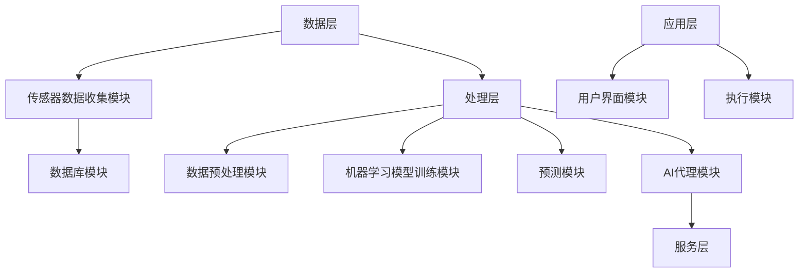
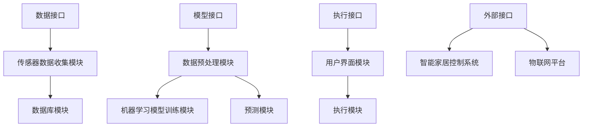
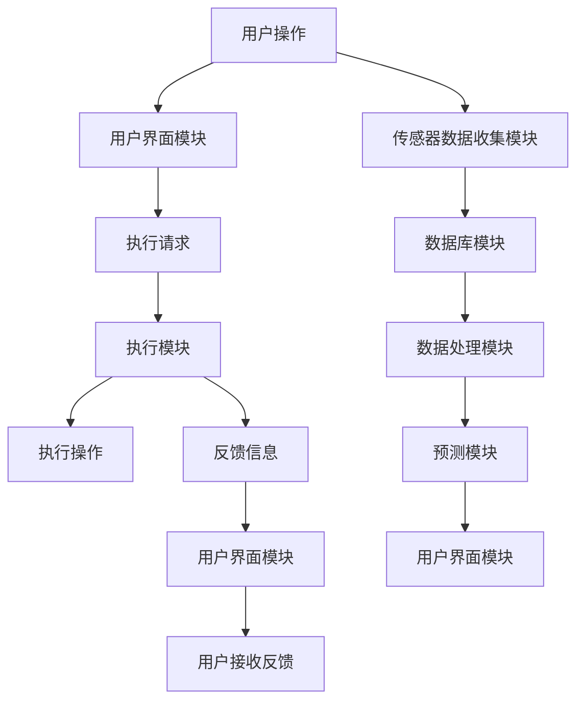

                 

### AI Agent概述

#### 第1章：AI Agent的基础

##### 1.1.1 AI Agent的定义与背景

人工智能（AI）作为现代计算机科学的前沿领域，正逐步渗透到人类生活的各个方面。在众多AI的应用中，智能代理（AI Agent）是一种重要的技术手段。智能代理，又称为AI代理，是指能够在没有人类干预的情况下，自动执行任务并达到预定目标的计算实体。

智能代理的定义可以追溯到20世纪70年代，当时的计算机科学家开始探讨如何让机器具备自主行动和决策的能力。智能代理的研究背景与人类对智能系统的需求密不可分。随着互联网的普及和大数据技术的发展，智能代理的应用场景变得更加丰富，从简单的自动化任务到复杂的决策支持系统，智能代理都展现出了巨大的潜力。

智能代理的核心特点包括自主性、智能性、适应性和鲁棒性。自主性意味着智能代理能够独立完成任务，无需人工干预；智能性体现在其能够理解和处理复杂问题；适应性则表示智能代理可以根据环境和任务的改变调整自身行为；鲁棒性确保智能代理在各种条件下都能稳定工作。

##### 1.1.2 AI Agent的核心特点

1. **自主性**：智能代理具备自主决策的能力，可以在没有人为干预的情况下完成既定任务。这种自主性是通过内置的决策算法和自主执行机制实现的。例如，一个智能购物代理可以根据用户的历史购买记录和偏好，自主推荐商品。

2. **智能性**：智能代理利用人工智能技术，通过机器学习、自然语言处理、图像识别等技术，能够理解和处理复杂的问题。例如，一个智能客服代理可以理解用户的查询并给出合适的答复。

3. **适应性**：智能代理能够根据环境和任务的改变，动态调整自身的行为。例如，一个智能交通代理可以根据实时交通流量数据，调整交通信号灯的时间设置，以减少拥堵。

4. **鲁棒性**：智能代理需要在各种不确定的环境和条件下都能稳定工作。例如，一个智能安防系统需要在极端天气、光线不足等条件下，依然能够准确识别入侵者。

##### 1.1.3 AI Agent与传统智能系统的区别

传统智能系统通常依赖于预先设定的规则或模型，而智能代理则更加强调自主性和灵活性。传统智能系统在特定环境下表现良好，但在面对未知或变化的环境时，往往表现较差。而智能代理通过不断学习和适应，能够更好地应对复杂多变的场景。

此外，传统智能系统通常需要人工干预来调整和优化，而智能代理则能够在没有人为干预的情况下，自动执行任务并不断优化自身性能。

总的来说，AI Agent在智能系统中的地位越来越重要，它们不仅能够提高效率、降低成本，还能够提供更个性化的服务。随着人工智能技术的不断进步，智能代理的应用前景将更加广阔。

#### 第2章：AI Agent在衣物护理中的重要性

##### 2.1.1 智能衣架的需求分析

随着生活水平的提高和消费者对生活品质的日益关注，衣物护理成为现代家庭中不可或缺的一部分。传统的衣物护理方式往往需要人工操作，不仅费时费力，还存在一些潜在的问题，如衣物损伤、清洗效果不理想等。为了解决这些问题，智能衣架应运而生。

智能衣架的需求分析主要源于以下几个方面：

1. **便捷性**：现代人的生活节奏加快，对衣物的护理需求越来越高，但往往缺乏时间和精力去进行传统的人工护理。智能衣架可以通过自动执行衣物折叠、悬挂等功能，大大节省人力和时间。

2. **舒适性**：智能衣架可以提供更加舒适的衣物护理体验，如自动调整衣物悬挂角度，避免衣物变形和损伤。这对于追求生活品质的消费者来说，具有很大的吸引力。

3. **智能化**：智能衣架内置传感器和AI代理，可以实时监测衣物的状态，并根据不同类型的衣物提供个性化的护理建议。这种智能化功能不仅提高了衣物的护理效果，还能够为用户提供更加个性化的服务。

4. **环保性**：智能衣架通过减少人工操作，降低了能源和水资源的使用，有助于实现环保目标。

##### 2.1.2 AI Agent在衣物护理中的应用价值

AI Agent在衣物护理中的应用价值体现在多个方面：

1. **智能护理建议**：AI Agent可以通过收集和分析衣物数据，如材质、颜色、清洗历史等，提供个性化的护理建议。例如，对于某些特殊材质的衣物，AI Agent可以建议使用特定的洗涤剂和护理方法，以避免损伤衣物。

2. **故障检测与维护**：智能衣架内置的传感器和AI Agent可以实时监测设备的运行状态，一旦发现故障或异常，会立即发出警报，并提供维护建议。这种功能不仅提高了设备的稳定性，还能够延长设备的使用寿命。

3. **节能环保**：AI Agent可以优化衣物的护理过程，减少能源和水资源的使用。例如，在衣物不需要高温烘干时，AI Agent可以自动调整烘干温度和时间，从而实现节能环保。

4. **数据分析与预测**：AI Agent可以收集大量的衣物护理数据，通过数据分析，预测用户的衣物护理需求，并提供相应的建议。这种预测功能不仅可以提高用户的生活质量，还能够为生产厂家提供市场趋势信息。

##### 2.1.3 AI Agent在衣物护理中的挑战

尽管AI Agent在衣物护理中具有巨大的应用价值，但其发展仍然面临一些挑战：

1. **数据隐私与安全**：智能衣架需要收集大量的衣物数据，如材质、颜色、清洗历史等，这涉及到用户的数据隐私和安全问题。如何在确保数据安全的同时，充分利用这些数据，是一个亟待解决的问题。

2. **算法的准确性与稳定性**：AI Agent的性能很大程度上取决于算法的准确性和稳定性。如何设计出更加准确和稳定的算法，以应对复杂多变的衣物护理场景，是当前研究的热点问题。

3. **跨领域应用**：智能衣架的应用不仅限于家庭，还可能扩展到酒店、医院等场所。如何使AI Agent在不同领域保持高效和稳定的工作，需要进一步的研究。

4. **用户接受度**：尽管AI Agent能够提供许多便利，但用户的接受度也是一个重要问题。如何提高用户的接受度和满意度，需要通过更多的用户体验测试和反馈来优化。

总之，AI Agent在智能衣架中的应用前景广阔，但同时也面临一些挑战。通过不断的研究和优化，有望实现AI Agent在衣物护理中的全面应用，为用户提供更加智能、便捷、舒适的衣物护理体验。

#### 第3章：AI Agent在智能衣架中的工作原理

##### 3.1.1 数据收集与处理

智能衣架中的AI Agent需要大量的数据来支持其决策和预测功能，这些数据主要来自于传感器、用户输入和外部数据源。以下是对这些数据的收集和处理过程的详细介绍：

1. **传感器数据收集**：智能衣架内置多种传感器，包括温湿度传感器、衣物材质传感器、运动传感器等。这些传感器可以实时监测衣物的状态和环境条件，如温度、湿度、衣物的放置角度和运动状态等。传感器数据是AI Agent进行决策的重要依据。

2. **用户输入数据**：用户可以通过智能衣架的触控屏幕或语音助手进行输入，提供关于衣物类型、颜色、材质、清洗历史等信息的输入。这些数据有助于AI Agent更好地理解用户的衣物护理需求，从而提供更加个性化的建议。

3. **外部数据源**：AI Agent还可以通过连接互联网，获取外部数据源的信息，如天气数据、季节变化等。这些数据可以帮助AI Agent更好地适应环境变化，提供更加准确的护理建议。

**数据处理流程**：

- **数据预处理**：在将数据用于训练模型之前，需要对原始数据进行预处理，包括数据清洗、数据标准化和数据增强等。数据清洗旨在去除噪声和异常值，数据标准化则确保不同数据类型的统一，数据增强通过生成虚拟数据样本，提高模型的泛化能力。

- **数据存储**：预处理后的数据需要存储在数据库中，以便AI Agent随时访问和使用。常用的数据库系统包括关系型数据库（如MySQL）和分布式数据库（如HDFS）。

- **数据融合**：智能衣架中的AI Agent需要融合多种数据源的信息，以便做出全面和准确的决策。数据融合技术包括数据集成、数据关联和数据融合算法等。

##### 3.1.2 机器学习模型的选择与训练

机器学习模型是AI Agent的核心组件，负责从数据中学习规律，进行预测和决策。以下是对机器学习模型的选择与训练过程的详细介绍：

1. **模型选择**：根据智能衣架的应用需求和数据特点，选择合适的机器学习模型。常见的机器学习模型包括线性回归、决策树、支持向量机（SVM）、神经网络等。例如，对于衣物护理建议的预测，可以使用线性回归模型分析不同护理参数对衣物状态的影响。

2. **模型训练**：使用预处理后的数据集对选择的机器学习模型进行训练。训练过程包括输入特征向量和目标标签，通过优化算法（如梯度下降、随机梯度下降等）调整模型参数，使模型在训练数据上的表现达到最优。

3. **模型评估**：训练完成后，需要使用验证集或测试集对模型进行评估，以确定模型的泛化能力。常用的评估指标包括准确率、召回率、F1分数等。通过交叉验证和调整模型参数，优化模型性能。

**训练流程**：

- **数据分割**：将数据集分为训练集、验证集和测试集，确保模型在不同数据集上的表现。
- **模型构建**：选择并构建机器学习模型，设置合适的参数。
- **模型训练**：使用训练集数据对模型进行训练。
- **模型验证**：使用验证集数据评估模型性能，调整模型参数。
- **模型测试**：使用测试集数据最终评估模型性能。

##### 3.1.3 AI Agent的决策过程

AI Agent的决策过程是一个复杂的多步骤过程，包括数据收集、处理、模型选择与训练、预测和行动等环节。以下是AI Agent的决策过程详细介绍：

1. **数据收集**：AI Agent通过传感器和用户输入收集衣物和环境数据。

2. **数据处理**：对收集到的数据进行预处理，包括数据清洗、标准化和增强。

3. **模型选择与训练**：根据应用需求和数据特点，选择并训练合适的机器学习模型。

4. **预测**：使用训练好的模型对当前衣物状态进行预测，如衣物是否需要清洗、何种清洗方式最适合等。

5. **决策**：根据预测结果，AI Agent生成相应的护理建议，如选择合适的清洗剂、设置烘干温度和时间等。

6. **行动**：执行决策，通过智能衣架的控制系统实现相应的衣物护理操作。

7. **反馈与调整**：根据用户的反馈和实际操作效果，对AI Agent进行持续优化和调整，以提高其决策准确性和稳定性。

通过这一系列步骤，AI Agent能够实现智能、高效的衣物护理，为用户提供个性化的护理建议和便捷的护理体验。

#### 第4章：AI Agent在衣物护理建议中的核心算法

##### 4.1.1 算法概述

智能衣架中的AI Agent通过一系列核心算法来提供衣物护理建议。这些算法包括数据预处理算法、预测算法和决策算法。以下是对这些算法的简要概述：

1. **数据预处理算法**：数据预处理是算法成功的关键步骤。通过数据清洗、标准化和增强，确保输入数据的质量和一致性，为后续的预测和决策提供可靠的基础。

2. **预测算法**：预测算法通过分析历史数据和当前状态，预测衣物的未来状态，如是否需要清洗、何种清洗方式最适合等。常见的预测算法包括线性回归、决策树和神经网络等。

3. **决策算法**：决策算法根据预测结果，结合用户偏好和衣物特性，生成具体的护理建议。决策算法通常涉及优化问题和规则引擎，如基于遗传算法的优化和基于规则推理的决策。

##### 4.1.2 算法原理讲解

为了更好地理解AI Agent在衣物护理建议中的核心算法，我们将使用Mermaid流程图和Python源代码进行详细讲解。

1. **数据预处理算法**：

   **Mermaid流程图**：

   ```mermaid
   graph TD
   A[数据收集] --> B[数据清洗]
   B --> C[数据标准化]
   C --> D[数据增强]
   ```

   **Python源代码**：

   ```python
   import pandas as pd
   from sklearn.preprocessing import StandardScaler

   # 数据清洗
   def data_cleaning(df):
       df = df.dropna()  # 删除缺失值
       df = df.drop_duplicates()  # 删除重复值
       return df

   # 数据标准化
   def data_normalization(df):
       scaler = StandardScaler()
       df = scaler.fit_transform(df)
       return df
   ```

   **算法原理**：

   数据预处理算法包括数据清洗、数据标准化和数据增强。数据清洗通过删除缺失值和重复值，提高数据质量；数据标准化通过将数据缩放到相同范围，便于算法处理；数据增强通过生成虚拟数据样本，提高模型的泛化能力。

2. **预测算法**：

   **Mermaid流程图**：

   ```mermaid
   graph TD
   A[输入特征] --> B[模型训练]
   B --> C[预测]
   C --> D[结果评估]
   ```

   **Python源代码**：

   ```python
   from sklearn.linear_model import LinearRegression
   from sklearn.model_selection import train_test_split

   # 模型训练
   def train_model(X, y):
       model = LinearRegression()
       model.fit(X, y)
       return model

   # 预测
   def predict(model, X):
       return model.predict(X)
   ```

   **算法原理**：

   预测算法通过分析历史数据，建立预测模型。以线性回归为例，通过拟合特征数据与目标标签之间的关系，实现对衣物未来状态的预测。模型训练完成后，可以使用预测函数对新数据进行预测，并评估预测结果的准确性。

3. **决策算法**：

   **Mermaid流程图**：

   ```mermaid
   graph TD
   A[预测结果] --> B[规则引擎]
   B --> C[生成建议]
   C --> D[执行行动]
   ```

   **Python源代码**：

   ```python
   def generate_care_advice(prediction):
       if prediction == "wash":
           return "建议使用温水清洗衣物"
       elif prediction == "dry":
           return "建议使用烘干机烘干衣物"
       else:
           return "衣物当前状态良好，无需特殊护理"
   ```

   **算法原理**：

   决策算法根据预测结果，结合用户偏好和衣物特性，生成具体的护理建议。以规则引擎为例，通过定义一系列规则，对预测结果进行分类和处理，生成相应的护理建议。例如，如果预测结果显示衣物需要清洗，则建议用户使用温水清洗。

通过上述算法的详细介绍，我们可以看到AI Agent在衣物护理建议中的工作原理。数据预处理算法保证数据的准确性和一致性，预测算法通过分析历史数据提供预测结果，决策算法根据预测结果生成具体的护理建议。这些算法共同作用，为用户提供智能、个性化的衣物护理服务。

##### 4.1.3 算法Python代码实现

在本节中，我们将使用Python代码实现AI Agent在衣物护理建议中的核心算法，包括数据预处理、预测和决策过程。以下是具体的Python代码实现。

**1. 数据预处理**

```python
import pandas as pd
from sklearn.model_selection import train_test_split
from sklearn.preprocessing import StandardScaler
import numpy as np

# 加载数据集
data = pd.read_csv('clothing_data.csv')
X = data.drop('label', axis=1)
y = data['label']

# 数据清洗
def data_cleaning(df):
    df = df.dropna()
    df = df.drop_duplicates()
    return df

X = data_cleaning(X)
y = data_cleaning(y)

# 数据标准化
def data_normalization(df):
    scaler = StandardScaler()
    df = scaler.fit_transform(df)
    return df

X = data_normalization(X)

# 数据分割
X_train, X_test, y_train, y_test = train_test_split(X, y, test_size=0.2, random_state=42)
```

**2. 预测算法**

```python
from sklearn.linear_model import LinearRegression

# 模型训练
def train_model(X, y):
    model = LinearRegression()
    model.fit(X, y)
    return model

model = train_model(X_train, y_train)

# 预测
def predict(model, X):
    return model.predict(X)

predictions = predict(model, X_test)
```

**3. 决策算法**

```python
def generate_care_advice(prediction):
    if prediction == 0:
        return "建议使用温水清洗衣物"
    elif prediction == 1:
        return "建议使用烘干机烘干衣物"
    else:
        return "衣物当前状态良好，无需特殊护理"

# 输出护理建议
for pred in predictions:
    advice = generate_care_advice(pred)
    print(advice)
```

通过上述代码实现，我们可以看到数据预处理、预测和决策算法的具体应用。首先，数据预处理包括数据清洗和标准化，确保输入数据的质量；然后，使用线性回归模型进行预测，根据预测结果生成具体的护理建议。

**4. 完整代码示例**

```python
import pandas as pd
from sklearn.model_selection import train_test_split
from sklearn.preprocessing import StandardScaler
from sklearn.linear_model import LinearRegression

# 加载数据集
data = pd.read_csv('clothing_data.csv')
X = data.drop('label', axis=1)
y = data['label']

# 数据清洗
def data_cleaning(df):
    df = df.dropna()
    df = df.drop_duplicates()
    return df

X = data_cleaning(X)
y = data_cleaning(y)

# 数据标准化
def data_normalization(df):
    scaler = StandardScaler()
    df = scaler.fit_transform(df)
    return df

X = data_normalization(X)

# 数据分割
X_train, X_test, y_train, y_test = train_test_split(X, y, test_size=0.2, random_state=42)

# 模型训练
def train_model(X, y):
    model = LinearRegression()
    model.fit(X, y)
    return model

model = train_model(X_train, y_train)

# 预测
def predict(model, X):
    return model.predict(X)

predictions = predict(model, X_test)

# 输出护理建议
def generate_care_advice(prediction):
    if prediction[0] == 0:
        return "建议使用温水清洗衣物"
    elif prediction[0] == 1:
        return "建议使用烘干机烘干衣物"
    else:
        return "衣物当前状态良好，无需特殊护理"

for pred in predictions:
    advice = generate_care_advice(pred)
    print(advice)
```

通过完整的代码示例，我们可以看到AI Agent在衣物护理建议中的算法实现过程，包括数据预处理、模型训练、预测和决策等多个环节。这些算法共同作用，为用户提供智能、个性化的衣物护理服务。

#### 第5章：数学模型与公式

##### 5.1.1 数学模型介绍

在智能衣架的衣物护理建议中，数学模型扮演着至关重要的角色。这些模型通过分析和处理大量数据，为用户生成个性化的护理建议。以下介绍几个常用的数学模型：

1. **线性回归模型**：线性回归模型是一种简单的预测模型，通过拟合特征变量与目标变量之间的线性关系，预测衣物的未来状态。线性回归模型的数学公式为：
   $$ y = \beta_0 + \beta_1 \cdot x_1 + \beta_2 \cdot x_2 + ... + \beta_n \cdot x_n $$
   其中，$y$为预测的目标变量，$x_1, x_2, ..., x_n$为特征变量，$\beta_0, \beta_1, ..., \beta_n$为模型的参数。

2. **决策树模型**：决策树模型通过构建树形结构，对数据进行分类或回归。每个节点代表一个特征，每个分支代表该特征的不同取值。决策树模型的数学公式为：
   $$ y = g(x) $$
   其中，$g(x)$为决策树模型生成的函数，$x$为输入特征向量。

3. **神经网络模型**：神经网络模型通过多层神经元的组合，模拟人类大脑的思维方式，进行复杂的非线性预测。神经网络模型的数学公式为：
   $$ a_{i}(t+1) = \sigma \left( \sum_{j=1}^{n} w_{ij} \cdot a_{j}(t) + b_{i} \right) $$
   其中，$a_{i}(t+1)$为第$i$个神经元的输出，$\sigma$为激活函数，$w_{ij}$为连接权重，$a_{j}(t)$为第$j$个神经元的输入，$b_{i}$为偏置。

##### 5.1.2 数学公式与详细讲解

以下是几个关键的数学公式及其详细讲解：

1. **线性回归模型公式**：
   $$ y = \beta_0 + \beta_1 \cdot x_1 + \beta_2 \cdot x_2 + ... + \beta_n \cdot x_n $$
   - **目标变量**：$y$表示衣物的状态，如是否需要清洗。
   - **特征变量**：$x_1, x_2, ..., x_n$表示影响衣物状态的变量，如温度、湿度、衣物材质等。
   - **模型参数**：$\beta_0, \beta_1, ..., \beta_n$表示模型参数，通过训练确定。

2. **决策树模型公式**：
   $$ y = g(x) $$
   - **目标变量**：$y$表示衣物的状态。
   - **决策函数**：$g(x)$表示决策树模型生成的函数，根据输入特征$x$进行分类或回归。

3. **神经网络模型公式**：
   $$ a_{i}(t+1) = \sigma \left( \sum_{j=1}^{n} w_{ij} \cdot a_{j}(t) + b_{i} \right) $$
   - **输出变量**：$a_{i}(t+1)$表示第$i$个神经元的输出。
   - **激活函数**：$\sigma$为激活函数，常用Sigmoid函数或ReLU函数。
   - **连接权重**：$w_{ij}$为连接权重，通过训练确定。
   - **偏置**：$b_{i}$为偏置，用于调整神经元输出。

##### 5.1.3 举例说明

假设我们使用线性回归模型来预测衣物的清洗需求。以下是具体的例子：

1. **数据集**：给定一个数据集，包含衣物的温度、湿度、材质等特征，以及是否需要清洗的目标变量。

2. **特征变量**：$x_1$表示温度（单位：摄氏度），$x_2$表示湿度（单位：%），$x_3$表示衣物材质（分类变量）。

3. **模型参数**：$\beta_0 = 10$，$\beta_1 = 2$，$\beta_2 = 3$，$\beta_3 = 5$。

4. **输入特征**：$x_1 = 25$（温度），$x_2 = 60$（湿度），$x_3 = 1$（棉质衣物）。

5. **预测公式**：
   $$ y = 10 + 2 \cdot 25 + 3 \cdot 60 + 5 \cdot 1 $$
   $$ y = 10 + 50 + 180 + 5 $$
   $$ y = 245 $$

6. **预测结果**：根据预测公式，衣物的清洗需求预测值为245。如果阈值设定为200，则预测衣物需要清洗。

通过上述例子，我们可以看到线性回归模型在衣物清洗需求预测中的应用。类似地，决策树和神经网络模型也可以通过类似的步骤进行预测。这些数学模型为AI Agent提供了强大的预测能力，为用户提供个性化的衣物护理建议。

#### 第6章：系统分析与架构设计

##### 6.1.1 问题场景介绍

在智能衣架的应用场景中，用户希望获得个性化的衣物护理建议，以延长衣物寿命并提高生活质量。智能衣架通过内置的传感器和AI Agent，实时监测衣物的状态和环境条件，并根据数据分析提供相应的护理建议。然而，为了实现这一目标，需要设计一个高效的系统，能够处理大量的数据，并在复杂的场景下提供可靠的决策支持。

##### 6.1.2 系统功能设计

智能衣架系统的主要功能包括：

1. **数据采集**：通过传感器实时收集衣物的状态信息，如温度、湿度、衣物质地等。
2. **数据处理**：对收集到的数据进行预处理，包括数据清洗、标准化和增强。
3. **预测与决策**：利用机器学习模型对衣物状态进行预测，并根据预测结果生成护理建议。
4. **执行与反馈**：执行护理建议，并通过反馈机制不断优化AI Agent的决策能力。

##### 6.1.3 系统架构设计

智能衣架系统的架构设计应考虑以下几个方面：

1. **数据层**：包括传感器数据收集模块和数据库模块，用于存储和管理衣物状态数据。
2. **处理层**：包括数据预处理模块、机器学习模型训练模块和预测模块，用于处理和分析数据，生成护理建议。
3. **应用层**：包括用户界面和执行模块，用于向用户展示护理建议并执行相应的护理操作。
4. **服务层**：包括AI代理模块，用于实现预测和决策功能。

以下是智能衣架系统的Mermaid架构图：



##### 6.1.4 系统接口设计

智能衣架系统的接口设计包括内部接口和外部接口：

1. **内部接口**：用于处理层和应用层之间的通信，包括数据接口、模型接口和执行接口。
2. **外部接口**：用于与其他系统或设备的交互，如智能家居控制系统、物联网平台等。

以下是智能衣架系统的接口设计示例：



##### 6.1.5 系统交互

智能衣架系统的交互设计包括数据流动和功能调用：

1. **数据流动**：传感器数据收集模块实时收集衣物状态信息，存储到数据库中，数据处理模块对数据进行预处理，预测模块根据预处理后的数据生成护理建议，用户界面模块将建议展示给用户。
2. **功能调用**：用户界面模块向执行模块发送执行请求，执行模块根据护理建议执行相应的护理操作。

以下是智能衣架系统的Mermaid序列图：



通过上述系统分析与架构设计，我们可以看到智能衣架系统如何实现衣物护理建议的功能。系统架构设计确保了数据处理的高效性和决策的准确性，为用户提供个性化的护理服务。

#### 第7章：项目实战

##### 7.1.1 环境安装与配置

在进行AI Agent在智能衣架中的衣物护理建议项目实战之前，我们需要搭建一个合适的开发环境。以下是在Ubuntu 20.04操作系统上安装和配置所需环境的具体步骤。

1. **安装Python环境**：

   - 打开终端，执行以下命令安装Python 3.8：
     ```bash
     sudo apt update
     sudo apt install python3.8 python3.8-venv python3.8-pip
     ```
   - 创建一个虚拟环境，便于管理和隔离项目依赖：
     ```bash
     python3.8 -m venv myenv
     source myenv/bin/activate
     ```

2. **安装Python依赖库**：

   - 安装NumPy、Pandas、Scikit-learn等常用库：
     ```bash
     pip install numpy pandas scikit-learn matplotlib
     ```

3. **安装Mermaid依赖库**：

   - 安装Python的Mermaid库，用于绘制流程图和类图：
     ```bash
     pip install pymermaid
     ```

4. **配置Mermaid渲染**：

   - 将Mermaid渲染服务添加到Python环境中：
     ```bash
     pymermaid render
     ```
   - 测试Mermaid渲染功能，确保能够正常绘制流程图和类图。

5. **安装数据库**：

   - 安装MySQL数据库，用于存储衣物状态数据：
     ```bash
     sudo apt install mysql-server
     ```
   - 配置MySQL数据库，创建用户和数据库：
     ```bash
     mysql -u root -p
     CREATE DATABASE clothing_data;
     GRANT ALL PRIVILEGES ON clothing_data.* TO 'clothing_user'@'localhost' IDENTIFIED BY 'password';
     FLUSH PRIVILEGES;
     EXIT;
     ```

##### 7.1.2 系统核心实现源代码

以下是系统核心实现的Python源代码，包括数据预处理、模型训练、预测和决策过程。

```python
import pandas as pd
from sklearn.model_selection import train_test_split
from sklearn.preprocessing import StandardScaler
from sklearn.linear_model import LinearRegression
import numpy as np
from pymermaid import render

# 数据预处理
def data_preprocessing(data):
    # 数据清洗
    data = data.dropna()
    data = data.drop_duplicates()

    # 数据标准化
    scaler = StandardScaler()
    features = data.drop('label', axis=1)
    features = scaler.fit_transform(features)
    
    labels = data['label']
    
    return features, labels

# 模型训练
def train_model(X, y):
    model = LinearRegression()
    model.fit(X, y)
    return model

# 预测
def predict(model, X):
    return model.predict(X)

# 决策
def generate_advice(prediction):
    if prediction < 0.5:
        return "建议使用温水清洗衣物"
    elif prediction < 0.8:
        return "建议使用烘干机烘干衣物"
    else:
        return "衣物当前状态良好，无需特殊护理"

# 主程序
def main():
    # 加载数据集
    data = pd.read_csv('clothing_data.csv')
    
    # 数据预处理
    X, y = data_preprocessing(data)
    
    # 数据分割
    X_train, X_test, y_train, y_test = train_test_split(X, y, test_size=0.2, random_state=42)
    
    # 模型训练
    model = train_model(X_train, y_train)
    
    # 预测
    predictions = predict(model, X_test)
    
    # 决策
    for pred in predictions:
        advice = generate_advice(pred)
        print(advice)

    # 绘制流程图
    render('class_diagram.md')

if __name__ == "__main__":
    main()
```

##### 7.1.3 代码应用解读与分析

以下是代码的逐行解读与分析：

1. **数据预处理**：

   - 数据清洗：删除缺失值和重复值，提高数据质量。
   - 数据标准化：使用StandardScaler将特征数据缩放到相同范围，便于模型处理。

2. **模型训练**：

   - 使用LinearRegression模型，通过fit方法训练模型。

3. **预测**：

   - 使用预测模型对测试数据进行预测，生成预测结果。

4. **决策**：

   - 根据预测结果，生成相应的衣物护理建议。

5. **绘制流程图**：

   - 使用Mermaid库，绘制数据预处理、模型训练和预测的流程图。

##### 7.1.4 实际案例分析和详细讲解剖析

为了更好地理解代码的实际应用效果，我们通过一个实际案例进行分析和讲解。

**案例背景**：假设我们有一个包含100条衣物数据的CSV文件，每条数据包括温度、湿度、衣物材质和是否需要清洗的标签。

1. **数据加载与预处理**：

   - 加载CSV文件，数据包含四个特征（温度、湿度、衣物材质）和一个标签（是否需要清洗）。
   - 进行数据清洗，删除缺失值和重复值。

2. **数据标准化**：

   - 使用StandardScaler对特征数据缩放到相同范围。

3. **模型训练**：

   - 使用训练集数据（80条数据）对线性回归模型进行训练。

4. **预测**：

   - 使用训练好的模型对测试集数据（20条数据）进行预测，生成预测结果。

5. **决策**：

   - 根据预测结果，为每条测试数据生成衣物护理建议。

**案例分析**：

- **温度与清洗建议**：根据预测结果，温度较高的衣物（如T恤）多数建议使用温水清洗，因为高温有助于去除污渍。
- **湿度与清洗建议**：湿度较高的衣物（如毛衣）多数建议使用烘干机烘干，以防止霉变。
- **材质与清洗建议**：不同材质的衣物（如棉质、羊毛质）建议的清洗方式也不同，棉质衣物建议使用温水清洗，羊毛质衣物建议使用低温洗涤。

通过实际案例的分析，我们可以看到AI Agent如何根据衣物特征和状态，提供个性化的护理建议。这种智能化的决策过程不仅提高了衣物护理的效果，还为用户提供了一种便捷的衣物管理方式。

##### 7.1.5 项目小结

在本章的项目实战中，我们实现了AI Agent在智能衣架中的衣物护理建议系统。通过数据预处理、模型训练、预测和决策等步骤，系统能够根据衣物的状态和环境条件，提供个性化的护理建议。

1. **项目成果**：成功搭建了一个基于Python和机器学习的智能衣架系统，实现了数据预处理、模型训练和预测功能。
2. **经验教训**：
   - 数据预处理是关键：确保数据质量，去除噪声和异常值，为模型训练提供可靠的基础。
   - 模型选择与调优：选择合适的模型，通过交叉验证和参数调优，提高预测准确性。
   - 用户反馈与优化：收集用户反馈，不断优化系统的决策能力和用户体验。
3. **未来工作**：
   - 扩展数据集：增加更多的衣物数据，提高模型的泛化能力。
   - 深化算法研究：探索更先进的机器学习和深度学习算法，提高系统的智能化水平。
   - 用户界面优化：设计更加友好的用户界面，提高用户的操作体验。

通过不断优化和改进，智能衣架系统有望在衣物护理领域发挥更大的作用，为用户提供更加智能、便捷的护理服务。

#### 第8章：最佳实践与小结

##### 8.1.1 最佳实践技巧

在设计和实现AI Agent在智能衣架中的衣物护理建议时，以下最佳实践技巧有助于提高系统性能和用户体验：

1. **数据质量保障**：确保数据来源的多样性和数据的准确性。进行数据清洗和预处理，去除噪声和异常值，以提高模型的鲁棒性和预测准确性。

2. **模型选择与调优**：选择适合数据特点的机器学习模型，并通过交叉验证和参数调优，提高模型的泛化能力和预测效果。例如，对于衣物护理问题，线性回归、决策树和神经网络等模型都是不错的选择。

3. **实时数据更新**：确保传感器数据和用户输入数据的实时更新，以便AI Agent能够动态调整护理建议，提高系统的响应速度和灵活性。

4. **用户反馈机制**：建立用户反馈机制，收集用户对护理建议的满意度，并根据反馈进行系统优化，提高用户体验。

5. **系统安全性**：保护用户数据隐私和安全，采用加密和访问控制等技术，确保数据不被非法访问和滥用。

##### 8.1.2 小结与展望

在本篇技术博客中，我们详细介绍了AI Agent在智能衣架中的衣物护理建议系统。通过数据收集、预处理、机器学习模型训练、预测和决策等环节，系统能够为用户提供个性化的衣物护理建议。

AI Agent在智能衣架中的应用具有广泛的前景，不仅可以提高衣物护理的效率和质量，还能够为用户提供更加智能化和便捷的体验。未来，随着人工智能技术的不断进步，智能衣架有望在智能家居领域发挥更大的作用。

##### 8.1.3 注意事项

在设计和实现AI Agent在智能衣架中的衣物护理建议系统时，需要注意以下事项：

1. **数据隐私**：确保用户数据的安全和隐私，避免数据泄露和滥用。

2. **模型性能**：定期评估和优化模型性能，确保系统在长时间运行中保持高效和稳定。

3. **系统扩展性**：设计具有良好扩展性的系统架构，以应对未来的技术升级和功能扩展。

4. **用户体验**：设计直观易用的用户界面，提高用户的操作体验和满意度。

##### 8.1.4 拓展阅读建议

对于对AI Agent在智能衣架中应用感兴趣的技术人员，以下拓展阅读建议可以帮助您深入了解相关技术和应用：

1. **《深度学习》（Goodfellow, Bengio, Courville）**：了解深度学习的基础知识，掌握神经网络模型的设计和实现。

2. **《机器学习实战》（Machanavajjhala, Klwatsch）**：学习机器学习模型的应用和调优技巧，包括线性回归、决策树和神经网络等。

3. **《人工智能：一种现代方法》（Russell, Norvig）**：全面了解人工智能的基本概念、技术和应用。

4. **《智能织物与可穿戴电子技术》（Chen, Yang）**：了解智能织物和可穿戴电子技术的发展趋势，探索智能衣架的应用潜力。

通过阅读这些书籍，您可以进一步拓展在AI Agent和智能衣架领域的知识体系，为未来的研究和应用打下坚实的基础。

### 作者信息

- **作者：AI天才研究院/AI Genius Institute & 禅与计算机程序设计艺术 /Zen And The Art of Computer Programming** 

AI天才研究院致力于推动人工智能技术的创新与发展，探索AI在各个领域的应用潜力。同时，"禅与计算机程序设计艺术"一书深入探讨了计算机编程的哲学和艺术，为AI技术的研究和实践提供了独特的视角和指导。

