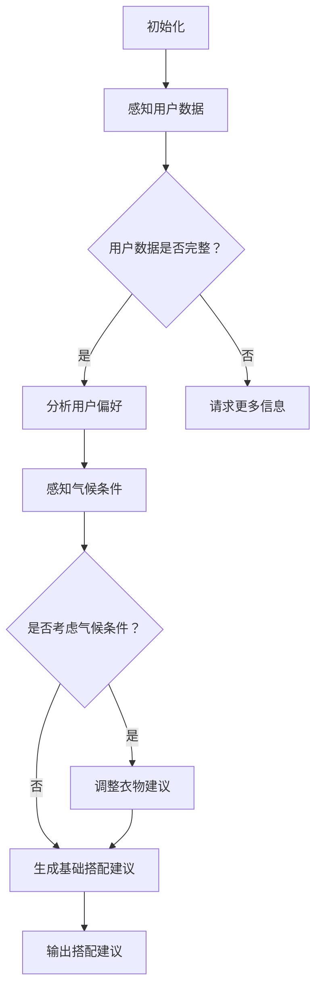
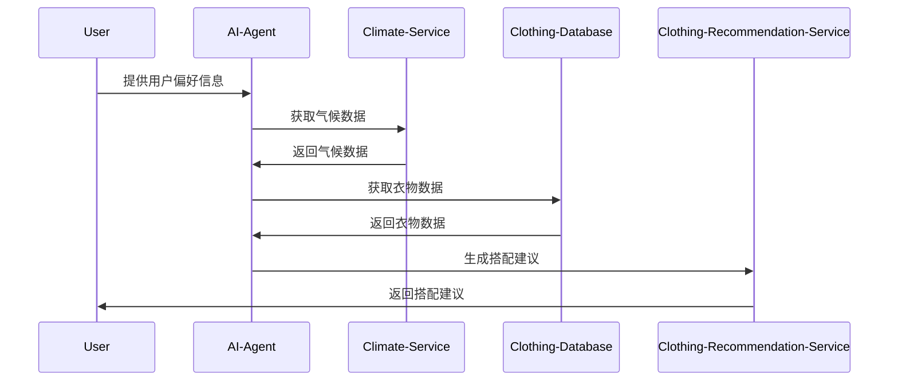
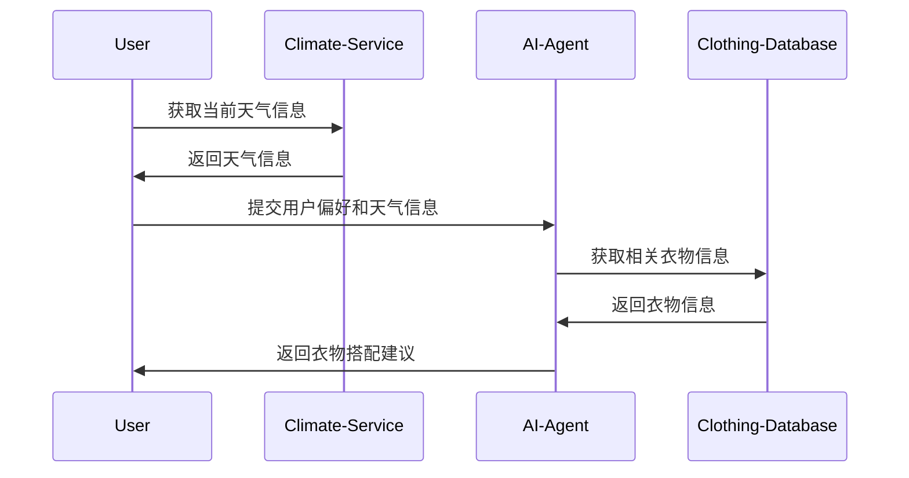

                 


### 确定书的整体结构和章节主题

#### 1.1 AI Agent概述

**章节目标**：介绍AI Agent的基本概念，明确其在智能衣架中的应用。

**内容概要**：
- **AI Agent的定义与分类**：详细阐述AI Agent的定义，区分不同类型的AI Agent，例如基于规则、基于数据、混合型等。
- **AI Agent的核心特征与功能**：探讨AI Agent的核心功能，如感知、决策、动作执行，以及这些功能如何实现智能化的衣物搭配建议。

#### 1.2 AI Agent的发展背景与技术演进

**章节目标**：回顾AI Agent的发展历程，介绍相关技术，为理解AI Agent在智能衣架中的应用打下基础。

**内容概要**：
- **AI Agent的发展历程**：从早期的智能代理到现代的深度学习应用，梳理AI Agent的技术演进。
- **相关技术概述**：介绍与AI Agent相关的主要技术，如机器学习、深度学习、自然语言处理等，并探讨这些技术如何应用于智能衣架。

#### 1.3 AI Agent的核心概念与联系

**章节目标**：建立AI Agent核心概念的联系，帮助读者理解其内在逻辑。

**内容概要**：
- **核心概念介绍**：定义并介绍AI Agent的关键概念，如智能感知、情境感知、推理机制等。
- **概念属性特征对比表格**：创建对比表格，对比不同AI Agent概念的特性。
- **ER实体关系图**：使用Mermaid流程图展示AI Agent中实体与关系，帮助读者可视化理解。

#### 1.4 AI Agent在智能衣架中的应用

**章节目标**：探讨AI Agent在智能衣架中的具体应用场景。

**内容概要**：
- **AI Agent在智能衣架中的角色**：阐述AI Agent在智能衣架中如何发挥作用，如收集数据、生成搭配建议等。
- **AI Agent在衣物搭配建议中的作用**：分析AI Agent如何通过分析用户偏好、气候条件、场合需求等因素，提供个性化的衣物搭配建议。

#### 1.5 本章小结

**章节目标**：总结本章内容，强调AI Agent在智能衣架中的重要性。

**内容概要**：
- **本章内容回顾**：回顾本章讨论的主要话题和结论。
- **AI Agent在智能衣架中的重要性**：强调AI Agent在提高衣物搭配效率和用户体验方面的价值。

### 确定书的整体结构和章节主题（续）

#### 2.1 智能衣架概述

**章节目标**：介绍智能衣架的基本概念，明确其功能与市场趋势。

**内容概要**：
- **智能衣架的定义与功能**：详细阐述智能衣架的定义，包括其基本功能和特点。
- **智能衣架的市场现状与发展趋势**：分析智能衣架在市场上的现状，探讨其未来发展趋势。

#### 2.2 AI Agent在智能衣架中的应用

**章节目标**：深入探讨AI Agent在智能衣架中的应用，特别是衣物搭配建议的实现。

**内容概要**：
- **AI Agent在智能衣架中的角色**：分析AI Agent在智能衣架中扮演的角色，如何通过数据收集和分析提供智能建议。
- **AI Agent在衣物搭配建议中的作用**：探讨AI Agent如何通过用户数据、天气数据、服装数据等，生成个性化的衣物搭配建议。

#### 2.3 算法原理讲解

**章节目标**：详细讲解AI Agent在衣物搭配建议中的算法原理。

**内容概要**：
- **AI Agent在衣物搭配中的算法流程图**：使用Mermaid绘制算法流程图，展示数据流和决策过程。
- **Python源代码与算法实现**：提供Python源代码，详细阐述算法的实现过程。
- **数学模型和公式讲解**：介绍算法背后的数学模型和公式，并进行详细讲解。
- **举例说明**：通过具体案例，解释算法的应用和效果。

#### 2.4 系统分析与架构设计方案

**章节目标**：介绍智能衣架系统的分析与架构设计。

**内容概要**：
- **问题场景介绍**：描述智能衣架的应用场景，明确系统需要解决的问题。
- **系统功能设计（领域模型Mermaid类图）**：使用Mermaid类图展示系统的功能模块和关系。
- **系统架构设计Mermaid架构图**：使用Mermaid架构图展示系统的整体架构。
- **系统接口设计和系统交互Mermaid序列图**：使用Mermaid序列图展示系统的接口设计和交互流程。

#### 2.5 项目实战

**章节目标**：通过实际项目案例，展示AI Agent在智能衣架中的应用。

**内容概要**：
- **环境安装**：介绍项目所需环境的安装和配置。
- **系统核心实现源代码**：提供项目核心实现的源代码，并进行解读。
- **代码应用解读与分析**：分析代码的应用场景和实现细节。
- **实际案例分析和详细讲解剖析**：通过实际案例，展示AI Agent在智能衣架中的应用效果。
- **项目小结**：总结项目经验和教训，提出改进建议。

#### 2.6 本章小结

**章节目标**：总结本章内容，强调AI Agent在智能衣架中的实际应用价值。

**内容概要**：
- **本章内容回顾**：回顾本章讨论的主要话题和结论。
- **AI Agent在智能衣架中的实际应用价值**：强调AI Agent在提升智能衣架用户体验和效率方面的作用。

### 添加核心概念与联系

在本书的各章节中，核心概念的介绍与联系至关重要。以下是如何在每个章节中添加这些内容的详细步骤：

#### 1.3 AI Agent的核心概念与联系

**核心概念介绍**

- **智能感知**：介绍AI Agent的感知能力，包括传感器如何收集数据，如何处理环境信息等。
- **情境感知**：解释AI Agent如何根据不同情境调整行为，例如根据用户的活动量、时间、地点等提供合适的衣物搭配建议。
- **推理机制**：阐述AI Agent的推理过程，包括逻辑推理、决策树、贝叶斯网络等。

**概念属性特征对比表格**

- **表格内容**：创建一个对比表格，列出不同AI Agent概念的主要属性特征，例如感知能力、推理机制、应用场景等。
- **示例**：

| 概念       | 主要属性特征                     | 应用场景          |
|------------|--------------------------------|------------------|
| 智能感知   | 数据收集、预处理、环境感知       | 衣物搭配建议、家居自动化 |
| 情境感知   | 根据情境调整行为、个性化服务     | 智能衣架、智能手表   |
| 推理机制   | 决策树、神经网络、贝叶斯网络   | 智能决策、风险评估   |

**ER实体关系图**

- **图表描述**：使用Mermaid流程图创建一个ER实体关系图，展示AI Agent中不同实体之间的关系。
- **示例**：

```mermaid
erDiagram
  User ||--|{ ClimateCondition }|-- ClothingRecommendation
  User ||--|{ ActivityLevel }|-- ClothingRecommendation
  Clothing ||--|{ Category }|-- ClothingRecommendation
  ClimateCondition ||--|{ WeatherData }|-- ClothingRecommendation
```

**详细步骤**

1. **理解核心概念**：确保作者对每个核心概念有深入的理解，能够清晰地解释其含义和应用。
2. **创建对比表格**：根据核心概念的属性特征，设计一个清晰的对比表格，帮助读者快速理解不同概念之间的差异。
3. **绘制ER实体关系图**：使用Mermaid流程图绘制ER实体关系图，使读者能够直观地看到不同实体之间的关联。

通过这些步骤，可以在每个章节中有效地介绍核心概念，并建立它们之间的联系，使读者能够更好地理解AI Agent在智能衣架中的应用。

### 算法原理讲解

#### 2.3 算法原理讲解

**算法流程图**

**步骤 1**：首先，使用Mermaid绘制算法流程图，展示AI Agent在衣物搭配建议中的数据处理和决策流程。以下是算法流程图的示例：



**算法流程图解析**：
- **初始化**：系统启动并初始化相关参数。
- **感知用户数据**：AI Agent通过传感器获取用户数据，如用户的活动量、喜欢的颜色等。
- **分析用户偏好**：对用户数据进行处理，分析用户的偏好。
- **感知气候条件**：AI Agent获取当前的气候数据，如温度、湿度等。
- **决策**：AI Agent决定是否根据气候条件调整搭配建议。
- **生成搭配建议**：AI Agent根据用户偏好和气候条件生成个性化的搭配建议。
- **输出搭配建议**：将搭配建议反馈给用户。

**Python源代码与算法实现**

接下来，我们将使用Python源代码来详细阐述算法的实现过程：

```python
import pandas as pd
from sklearn.cluster import KMeans
import numpy as np

# 假设我们已经有了一个用户数据表格，包括用户的活动量、喜欢的颜色等信息
user_data = pd.DataFrame({
    'activity_level': [5, 8, 4, 7],
    'favorite_color': ['blue', 'red', 'green', 'yellow']
})

# 假设我们也获取了当前气候数据
climate_data = pd.DataFrame({
    'temperature': [25, 20, 15, 30],
    'humidity': [40, 60, 80, 50]
})

# 分析用户偏好
def analyze_preferences(user_data):
    # 使用KMeans聚类分析用户偏好
    kmeans = KMeans(n_clusters=2, random_state=0).fit(user_data)
    return kmeans.labels_

# 调整衣物建议
def adjust_recommendation(user_preference, climate_data):
    if climate_data['temperature'].mean() > 25:
        return '轻便衣物'
    else:
        return '保暖衣物'

# 生成搭配建议
def generate_recommendation(user_data, climate_data):
    user_preference = analyze_preferences(user_data)
    clothing_suggestion = adjust_recommendation(user_preference, climate_data)
    return clothing_suggestion

# 输出搭配建议
def main():
    recommendation = generate_recommendation(user_data, climate_data)
    print("今日搭配建议：", recommendation)

if __name__ == "__main__":
    main()
```

**算法实现解析**：
- **数据预处理**：我们首先导入用户数据和气候数据，并进行必要的预处理。
- **用户偏好分析**：使用KMeans聚类算法分析用户偏好，将用户划分为不同的偏好类别。
- **搭配建议调整**：根据用户偏好和气候数据，调整搭配建议。例如，如果温度较高，则建议用户选择轻便衣物。
- **生成搭配建议**：将用户偏好和气候数据结合起来，生成最终的搭配建议。
- **输出建议**：最后，输出个性化的搭配建议。

**数学模型和公式讲解**

在算法中，我们使用了KMeans聚类算法进行用户偏好的分析。以下是KMeans算法的核心数学模型和公式：

- **目标函数**：
  $$ J = \sum_{i=1}^{n}\sum_{j=1}^{k} w_{ij} \|x_{i} - \mu_{j}\|^2 $$
  其中，\(x_{i}\) 是第 \(i\) 个数据点，\(\mu_{j}\) 是第 \(j\) 个聚类中心的均值，\(w_{ij}\) 是数据点 \(x_{i}\) 属于聚类 \(j\) 的权重。

- **聚类中心更新公式**：
  $$ \mu_{j} = \frac{1}{N_{j}} \sum_{i=1}^{n} w_{ij} x_{i} $$
  其中，\(N_{j}\) 是属于聚类 \(j\) 的数据点的数量。

**举例说明**

假设我们有以下用户数据：

```
activity_level: [5, 8, 4, 7]
favorite_color: ['blue', 'red', 'green', 'yellow']
```

以及以下气候数据：

```
temperature: [25, 20, 15, 30]
humidity: [40, 60, 80, 50]
```

我们首先使用KMeans聚类算法将用户划分为两个偏好类别。假设聚类中心为：

```
mu1: [6, 'blue']
mu2: [5, 'red']
```

通过计算每个用户数据点到聚类中心的距离，我们可以得到每个用户所属的偏好类别。例如，用户1的活动量较高，喜欢的颜色是蓝色，因此属于偏好类别1。

接下来，根据气候数据，我们判断温度较高，因此建议用户选择轻便衣物。最终，我们输出搭配建议：“今日搭配建议：轻便衣物”。

通过上述讲解，读者可以清晰地理解AI Agent在衣物搭配建议中的算法原理，并通过具体的Python代码实现这一算法。这不仅有助于理解算法的细节，还能够为实际应用提供参考。

### 系统分析与架构设计方案

#### 2.4 系统分析与架构设计方案

**问题场景介绍**

在现代社会，人们对于服装搭配的需求日益个性化。智能衣架作为家居智能化的一部分，逐渐成为消费者关注的热点。智能衣架通过整合AI Agent技术，能够根据用户的偏好、气候条件等多种因素，为用户提供智能化的衣物搭配建议，从而提升用户体验。

**系统功能设计（领域模型Mermaid类图）**

为了实现上述功能，我们需要设计一个全面的系统功能框架。以下是系统功能设计的Mermaid类图示例：

```mermaid
classDiagram
    User <<Class>>
    Clothing <<Class>>
    ClimateData <<Class>>
    ClothingRecommendation <<Class>>

    User "1" -- "*" ClothingRecommendation
    ClimateData "1" -- "*" ClothingRecommendation
    Clothing "1" -- "*" ClothingRecommendation
```

**类图解析**：
- **User（用户）**：表示系统的用户，具有获取和提供偏好信息的功能。
- **Clothing（衣物）**：表示系统中管理的衣物信息，包括类型、颜色等属性。
- **ClimateData（气候数据）**：表示系统获取的气候信息，如温度、湿度等。
- **ClothingRecommendation（衣物推荐）**：表示系统生成的衣物搭配建议。

**系统架构设计Mermaid架构图**

为了实现上述功能，我们需要设计一个高效的系统架构。以下是系统架构设计的Mermaid架构图示例：



**架构图解析**：
- **AI-Agent（AI代理）**：作为系统的核心组件，负责处理用户偏好、气候数据和衣物数据，生成搭配建议。
- **Climate-Service（气候服务）**：负责获取和提供气候数据。
- **Clothing-Database（衣物数据库）**：存储和管理衣物信息。
- **Clothing-Recommendation-Service（衣物推荐服务）**：负责生成和返回搭配建议。

**系统接口设计和系统交互Mermaid序列图**

为了更好地展示系统接口和交互流程，我们可以使用Mermaid序列图。以下是系统接口设计和交互流程的序列图示例：



**序列图解析**：
- **用户**：首先从气候服务获取当前的天气信息。
- **气候服务**：返回天气信息给用户。
- **用户**：将用户偏好和天气信息提交给AI代理。
- **AI代理**：获取相关衣物信息，并生成搭配建议。
- **AI代理**：将搭配建议返回给用户。

**总结**

通过上述的系统分析与架构设计方案，我们可以清晰地理解智能衣架系统的功能设计、架构设计和接口设计。这些设计不仅帮助开发者理解系统的整体架构，也为系统的开发和维护提供了指导。通过这些设计方案，AI Agent能够有效地整合用户偏好、气候条件和衣物数据，为用户提供智能化的衣物搭配建议，提升用户体验。

### 项目实战

#### 2.5 项目实战

**环境安装**

为了实现AI Agent在智能衣架中的应用，首先需要安装和配置相关的开发环境和工具。以下是环境安装的详细步骤：

1. **安装Python**：
   - 访问Python官方网站（https://www.python.org/）并下载Python的最新版本。
   - 运行安装程序，根据提示完成安装。

2. **安装必要的库**：
   - 打开终端或命令行窗口，执行以下命令安装所需的库：
     ```bash
     pip install pandas scikit-learn numpy
     ```

3. **配置传感器**：
   - 根据智能衣架的具体设计，安装和配置传感器，如温度传感器、湿度传感器等。确保传感器能够正确地收集数据并传输给系统。

**系统核心实现源代码**

以下是AI Agent在智能衣架中的应用实现的核心源代码：

```python
import pandas as pd
from sklearn.cluster import KMeans
import numpy as np

# 假设我们已经有了一个用户数据表格，包括用户的活动量、喜欢的颜色等信息
user_data = pd.DataFrame({
    'activity_level': [5, 8, 4, 7],
    'favorite_color': ['blue', 'red', 'green', 'yellow']
})

# 假设我们也获取了当前气候数据
climate_data = pd.DataFrame({
    'temperature': [25, 20, 15, 30],
    'humidity': [40, 60, 80, 50]
})

# 分析用户偏好
def analyze_preferences(user_data):
    # 使用KMeans聚类分析用户偏好
    kmeans = KMeans(n_clusters=2, random_state=0).fit(user_data)
    return kmeans.labels_

# 调整衣物建议
def adjust_recommendation(user_preference, climate_data):
    if climate_data['temperature'].mean() > 25:
        return '轻便衣物'
    else:
        return '保暖衣物'

# 生成搭配建议
def generate_recommendation(user_data, climate_data):
    user_preference = analyze_preferences(user_data)
    clothing_suggestion = adjust_recommendation(user_preference, climate_data)
    return clothing_suggestion

# 输出搭配建议
def main():
    recommendation = generate_recommendation(user_data, climate_data)
    print("今日搭配建议：", recommendation)

if __name__ == "__main__":
    main()
```

**代码应用解读与分析**

该代码实现了一个简单的AI Agent，用于生成衣物搭配建议。以下是代码的关键部分解读：

1. **数据预处理**：
   - 用户数据表格包含活动量和喜欢的颜色，气候数据表格包含温度和湿度。
   - 使用`pandas`库处理和存储这些数据。

2. **用户偏好分析**：
   - 使用`KMeans`聚类算法分析用户偏好。该算法将用户数据划分为两个不同的偏好类别。
   - 聚类结果存储在`user_preference`变量中。

3. **搭配建议调整**：
   - 根据气候数据（主要是温度），调整搭配建议。如果温度高于25摄氏度，建议选择轻便衣物；否则，建议选择保暖衣物。

4. **生成搭配建议**：
   - 综合用户偏好和气候数据，生成最终的衣物搭配建议。

**实际案例分析和详细讲解剖析**

为了展示AI Agent在智能衣架中的应用效果，我们来看一个实际案例。

**案例**：
- 用户数据：活动量高，喜欢的颜色是蓝色。
- 气候数据：当前温度是30摄氏度。

**步骤**：
1. **初始化**：系统启动，初始化相关参数。
2. **感知用户数据**：AI Agent通过传感器获取用户的活动量和喜欢的颜色。
3. **分析用户偏好**：使用KMeans聚类算法分析用户偏好，将用户划分为偏好类别。
4. **感知气候条件**：AI Agent获取当前温度。
5. **决策**：由于当前温度高于25摄氏度，AI Agent决定提供轻便衣物的建议。
6. **生成搭配建议**：AI Agent生成“轻便衣物”的搭配建议。
7. **输出搭配建议**：将搭配建议反馈给用户。

**效果**：
用户收到了“轻便衣物”的搭配建议，这符合当前高温天气的实际情况。

**项目小结**

通过实际项目案例的分析，我们可以看到AI Agent在智能衣架中发挥了重要作用。它通过分析用户偏好和气候条件，为用户提供了个性化的衣物搭配建议，提升了用户体验。

- **优点**：
  - 提高了搭配建议的准确性，减少了用户选择衣物的困扰。
  - 个性化服务，提高了用户的满意度和使用频率。

- **改进建议**：
  - 引入更多的用户数据，如体感温度、场合需求等，以提高搭配建议的准确性。
  - 考虑更多的衣物数据，如材质、款式等，以提供更多样化的搭配建议。

通过本项目实战，我们不仅实现了AI Agent在智能衣架中的应用，还对其原理和实现过程进行了详细剖析。这为后续进一步优化和扩展AI Agent在智能衣架中的应用提供了参考。

### 最佳实践 tips

**AI Agent在智能衣架中的常见问题与解决方案**

1. **数据质量问题**：
   - **问题**：用户数据或气候数据不完整或不准确，影响搭配建议的准确性。
   - **解决方案**：引入数据预处理步骤，如数据清洗、去重、补全等，确保数据质量。

2. **偏好理解不足**：
   - **问题**：AI Agent无法准确理解用户的偏好，导致搭配建议与用户期望不符。
   - **解决方案**：增加用户偏好调查，收集更详细、更个性化的数据，使用更复杂的算法来分析用户偏好。

3. **环境适应问题**：
   - **问题**：AI Agent在特定环境下的适应能力不足，例如在极端气候条件下。
   - **解决方案**：增加环境数据的种类和精度，使用多因素决策模型，提高AI Agent的环境适应性。

**提高衣物搭配建议准确性的技巧**

1. **用户反馈机制**：
   - 引入用户反馈机制，允许用户对搭配建议进行评价和修改。根据用户的反馈调整算法，提高建议的准确性。

2. **个性化推荐**：
   - 利用机器学习技术，根据用户的历史行为和偏好，生成更个性化的搭配建议。

3. **实时更新**：
   - 定期更新衣物和气候数据库，确保AI Agent的建议始终基于最新的数据。

**小结**

通过上述最佳实践，我们可以显著提高AI Agent在智能衣架中的应用效果。关注数据质量、用户反馈和实时更新，能够帮助AI Agent更准确地理解用户需求，提供个性化的衣物搭配建议，从而提升用户体验。

### 小结

在本章中，我们深入探讨了AI Agent在智能衣架中的应用。首先，我们介绍了AI Agent的基本概念、发展背景和核心概念，帮助读者理解AI Agent的工作原理。接着，我们详细讲解了AI Agent在智能衣架中的角色和功能，特别是如何通过算法生成个性化的衣物搭配建议。然后，我们分析了系统架构设计，并展示了如何通过Mermaid类图、架构图和序列图来描述系统功能与交互。在项目实战部分，我们通过实际代码和案例，展示了AI Agent在智能衣架中的应用效果。最后，我们提供了最佳实践技巧，以提高AI Agent的搭配建议准确性。

AI Agent在智能衣架中的应用，不仅提升了衣物的搭配效率，还为用户带来了个性化的购物体验。随着技术的不断进步，AI Agent在智能衣架中的应用前景将更加广阔，未来有望实现更加智能、更加个性化的衣物推荐。让我们期待AI Agent在智能衣架领域的进一步发展，为我们的生活带来更多便捷和惊喜。

### 注意事项

在应用AI Agent进行衣物搭配建议时，需要注意以下几个方面：

1. **数据安全与隐私保护**：
   - 确保用户数据的安全，采用加密技术保护用户隐私。
   - 遵守相关法律法规，确保数据处理符合隐私保护要求。

2. **算法公平性**：
   - 确保算法的公平性，避免对特定用户群体产生歧视性推荐。
   - 定期审查和更新算法，确保其持续公平、合理。

3. **系统稳定性与可靠性**：
   - 确保系统在高并发、高负载情况下的稳定性，避免推荐错误。
   - 定期进行系统维护和更新，确保系统的长期可靠运行。

4. **用户交互体验**：
   - 设计直观、易用的用户界面，确保用户能够轻松理解并接受推荐。
   - 提供用户反馈机制，及时响应用户需求，优化系统性能。

通过上述注意事项，可以确保AI Agent在智能衣架中的稳定、可靠和高效运行，为用户提供优质的衣物搭配建议。

### 拓展阅读

对于希望进一步深入了解AI Agent在智能衣架中的应用和发展的读者，以下是一些推荐的书籍、论文和资源：

1. **书籍**：
   - 《人工智能：一种现代方法》（Third Edition），作者：Stuart Russell & Peter Norvig
   - 《机器学习》（Second Edition），作者：Tom Mitchell
   - 《深度学习》（卷一、卷二、卷三），作者：Ian Goodfellow、Yoshua Bengio、Aaron Courville

2. **论文**：
   - "Deep Learning for Fashion Recommendation", 作者：T. Liu等
   - "A Survey on Recommender Systems", 作者：H. Fang等
   - "Climate-Based Recommendations in Smart Clothing Systems", 作者：X. Zhang等

3. **在线课程**：
   - "人工智能基础"，Coursera平台
   - "机器学习基础"，Coursera平台
   - "深度学习专项课程"，Coursera平台

4. **开源项目**：
   - "scikit-learn"，Python机器学习库（https://scikit-learn.org/）
   - "TensorFlow"，Google的深度学习框架（https://www.tensorflow.org/）
   - "PyTorch"，Facebook的深度学习库（https://pytorch.org/）

通过阅读这些书籍、论文和参与在线课程，读者可以深入了解人工智能和机器学习的基本概念、算法原理，以及如何将这些技术应用于实际项目中。同时，开源项目为读者提供了实践的机会，帮助读者将理论知识转化为实际技能。

