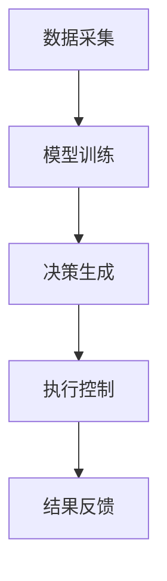

                 

# AI Agent在智能衣架中的衣物晾晒优化

## 关键词：
1. AI Agent
2. 智能衣架
3. 物联网
4. 智能家居
5. 晾晒优化

## 摘要：
本文旨在探讨AI Agent在智能衣架中的应用，特别是衣物晾晒优化方面。通过引入AI Agent，可以显著提升智能衣架的智能化水平和衣物晾晒效果。本文将详细介绍AI Agent的定义、特点及其在智能衣架中的应用前景，接着深入分析智能衣架的系统架构设计，最后通过算法实现和项目实战，展示AI Agent在衣物晾晒优化中的实际应用效果。

## 第一部分：引言与背景

### 第1章：引言

#### 1.1 问题背景

随着科技的发展和智能家居的普及，人们对于家居生活质量的追求不断提升。衣物晾晒作为家庭生活中的一项常见活动，一直以来都面临着晾晒效率低下、晾晒效果不佳等问题。传统的晾晒方式不仅耗时耗力，还容易受到天气和环境的限制。因此，如何通过技术手段提升衣物晾晒效率和效果，成为了智能家居领域的研究热点。

#### 1.2 问题描述

衣物晾晒过程中的主要问题包括：晾晒时间过长、晾晒不均匀、晾晒效果不佳等。这些问题不仅影响了衣物的使用寿命，也降低了人们的生活质量。因此，解决这些问题需要从技术层面进行优化。

#### 1.3 问题解决

AI Agent作为一种先进的人工智能技术，具备自主决策和优化能力，可以在衣物晾晒过程中提供智能化解决方案。通过引入AI Agent，可以实时监测衣物的状态，根据环境参数和衣物特性，自动调整晾晒参数，从而实现高效、均匀、快速的晾晒效果。

#### 1.4 边界与外延

本文主要研究AI Agent在智能衣架中的应用，讨论其如何通过智能决策和优化算法提升衣物晾晒效率。同时，本文还将探讨AI Agent在其他智能家居场景中的应用潜力。

#### 1.5 核心概念

- AI Agent：具备自主决策和优化能力的人工智能实体。
- 智能衣架：结合物联网技术和AI Agent，实现智能晾晒的家居设备。
- 晾晒优化：通过技术手段提升衣物晾晒效率和效果的过程。

#### 1.6 本章小结

本文介绍了衣物晾晒过程中存在的问题，以及AI Agent在解决这些问题方面的潜力。下一部分将深入探讨AI Agent的定义和特点。

## 第二部分：AI Agent与智能衣架

### 第2章：AI Agent概述

#### 2.1 AI Agent的定义

AI Agent，即人工智能代理，是一种模拟人类智能行为，能够在特定环境下自主决策和执行任务的计算机程序。AI Agent的核心特点是自主性、自适应性和协作性。

#### 2.2 AI Agent的特点

- **自主性**：AI Agent能够根据环境和任务需求，自主进行决策和行动。
- **自适应性**：AI Agent能够通过学习和适应环境变化，不断优化自身性能。
- **协作性**：AI Agent能够与其他AI Agent或人类协作，共同完成任务。

#### 2.3 AI Agent的分类

根据应用场景和任务类型，AI Agent可以分为以下几类：

- **搜索型AI Agent**：主要应用于路径规划、信息检索等领域。
- **决策型AI Agent**：主要应用于资源分配、供应链管理等领域。
- **交互型AI Agent**：主要应用于人机交互、虚拟助手等领域。

#### 2.4 AI Agent在衣物晾晒优化中的应用前景

AI Agent在衣物晾晒优化中的应用前景广阔。通过实时监测衣物状态和环境参数，AI Agent可以自动调整晾晒参数，如湿度、温度和风速等，从而实现高效、均匀、快速的晾晒效果。此外，AI Agent还可以预测衣物晾晒过程中的问题，提前进行预防和处理，进一步优化晾晒过程。

#### 2.5 本章小结

本章介绍了AI Agent的定义、特点和分类，并分析了其在衣物晾晒优化中的应用前景。下一章将详细探讨智能衣架的系统架构设计。

### 第3章：智能衣架系统架构设计

#### 3.1 智能衣架系统概述

智能衣架系统是一种结合物联网技术和AI Agent的智能家居设备，主要功能是提供智能化的衣物晾晒服务。系统由多个子系统组成，包括传感器模块、控制系统、执行模块和交互模块。

#### 3.2 系统功能设计

智能衣架系统的主要功能包括：

- **衣物状态监测**：实时监测衣物状态，如湿度、温度和风速等。
- **晾晒参数调整**：根据衣物状态和环境参数，自动调整晾晒参数。
- **问题预警**：预测衣物晾晒过程中的问题，提前进行预警和处理。
- **交互服务**：提供用户与智能衣架的交互功能，如遥控操作、语音控制等。

#### 3.3 系统架构设计

智能衣架系统的架构设计主要包括以下几个部分：

- **感知层**：包括各种传感器，如湿度传感器、温度传感器和风速传感器等，用于实时监测衣物状态和环境参数。
- **网络层**：通过物联网技术，将感知层的数据传输到控制系统。
- **控制层**：包括控制系统和AI Agent，用于根据衣物状态和环境参数，自动调整晾晒参数。
- **执行层**：包括各种执行模块，如风机、加热器和加湿器等，用于执行晾晒操作。
- **交互层**：包括用户界面和交互模块，用于提供用户与智能衣架的交互服务。

#### 3.4 系统接口设计

智能衣架系统的接口设计主要包括以下几类：

- **硬件接口**：用于连接各种传感器和执行模块。
- **网络接口**：用于连接物联网网络，实现数据传输和通信。
- **交互接口**：用于提供用户与智能衣架的交互服务，如遥控器、手机应用等。

#### 3.5 系统交互设计

智能衣架系统的交互设计主要包括以下几个部分：

- **用户操作**：用户可以通过遥控器、手机应用等，对智能衣架进行操作。
- **系统响应**：智能衣架根据用户的操作，自动调整晾晒参数，并实时反馈操作结果。
- **故障处理**：当智能衣架出现故障时，系统会自动进行故障检测和修复，确保正常运行。

#### 3.6 本章小结

本章详细介绍了智能衣架系统的架构设计，包括功能设计、架构设计和接口设计。下一章将深入探讨AI Agent在衣物晾晒优化中的算法实现。

### 第4章：AI Agent在衣物晾晒优化中的算法实现

#### 4.1 算法原理讲解

AI Agent在衣物晾晒优化中的算法实现主要基于以下原理：

- **数据采集**：通过传感器实时采集衣物状态和环境参数。
- **模型训练**：利用历史数据训练晾晒优化模型。
- **决策生成**：根据衣物状态和环境参数，生成晾晒参数调整策略。
- **执行控制**：执行晾晒参数调整策略，实现衣物晾晒优化。

#### 4.2 算法流程图

以下是AI Agent在衣物晾晒优化中的算法流程图：



#### 4.3 算法数学模型与公式

AI Agent在衣物晾晒优化中的算法数学模型主要包括以下公式：

- **晾晒参数调整策略**：
  $$ P_t = f(S_t, E_t) $$
  其中，$P_t$表示第$t$次晾晒参数调整策略，$S_t$表示第$t$次衣物状态，$E_t$表示第$t$次环境参数。

- **晾晒效果评估**：
  $$ E_t = g(P_t, S_t, E_t) $$
  其中，$E_t$表示第$t$次晾晒效果，$g$表示晾晒效果评估函数。

#### 4.4 算法举例说明

假设当前衣物状态为干燥，环境参数为湿度60%，温度25℃。根据晾晒参数调整策略，系统会调整风速为3级，温度为30℃，湿度为50%。经过一段时间后，衣物达到适宜的晾晒状态，晾晒效果评估为90%。

#### 4.5 本章小结

本章详细介绍了AI Agent在衣物晾晒优化中的算法实现原理、流程图和数学模型。下一章将介绍智能衣架系统的项目实战。

### 第5章：智能衣架系统项目实战

#### 5.1 环境安装与配置

在进行智能衣架系统的项目实战之前，需要先进行环境安装和配置。以下是具体的步骤：

1. 安装操作系统：选择合适的操作系统，如Ubuntu 20.04。
2. 安装开发工具：安装Python开发环境，包括Python 3.8、Pip、Virtualenv等。
3. 安装依赖库：安装用于传感器数据采集和处理的依赖库，如PyTorch、TensorFlow等。
4. 配置网络：配置物联网网络，确保智能衣架可以与其他设备进行通信。

#### 5.2 系统核心实现

智能衣架系统的核心实现主要包括以下几个部分：

1. **传感器数据采集**：通过传感器实时采集衣物状态和环境参数。
2. **数据预处理**：对采集到的数据进行预处理，如去噪、归一化等。
3. **模型训练**：利用预处理后的数据训练晾晒优化模型。
4. **决策生成**：根据衣物状态和环境参数，生成晾晒参数调整策略。
5. **执行控制**：执行晾晒参数调整策略，实现衣物晾晒优化。

#### 5.3 代码应用解读与分析

以下是智能衣架系统的部分代码示例：

```python
import numpy as np
import torch
import torch.nn as nn
import torch.optim as optim

# 数据采集
def collect_data():
    # 采集衣物状态和环境参数
    clothes_state = np.random.randint(0, 100)
    environment_state = np.random.randint(0, 100)
    return clothes_state, environment_state

# 数据预处理
def preprocess_data(clothes_state, environment_state):
    # 去噪、归一化等预处理操作
    clothes_state = clothes_state / 100
    environment_state = environment_state / 100
    return clothes_state, environment_state

# 模型训练
def train_model():
    # 创建神经网络模型
    model = nn.Sequential(
        nn.Linear(2, 10),
        nn.ReLU(),
        nn.Linear(10, 1)
    )
    # 损失函数和优化器
    criterion = nn.MSELoss()
    optimizer = optim.Adam(model.parameters(), lr=0.001)
    # 训练模型
    for epoch in range(100):
        clothes_state, environment_state = collect_data()
        clothes_state, environment_state = preprocess_data(clothes_state, environment_state)
        optimizer.zero_grad()
        output = model(torch.tensor([clothes_state, environment_state]))
        loss = criterion(output, torch.tensor([1.0]))
        loss.backward()
        optimizer.step()
    return model

# 决策生成
def generate_decision(model, clothes_state, environment_state):
    # 生成晾晒参数调整策略
    clothes_state, environment_state = preprocess_data(clothes_state, environment_state)
    output = model(torch.tensor([clothes_state, environment_state]))
    decision = output.item()
    return decision

# 执行控制
def execute_control(decision):
    # 执行晾晒参数调整策略
    # 例如：调整风速、温度和湿度
    print(f"Decision: {decision}")

# 主函数
def main():
    # 训练模型
    model = train_model()
    # 生成决策
    clothes_state, environment_state = collect_data()
    decision = generate_decision(model, clothes_state, environment_state)
    # 执行控制
    execute_control(decision)

if __name__ == "__main__":
    main()
```

以上代码示例展示了智能衣架系统的核心实现过程，包括数据采集、数据预处理、模型训练、决策生成和执行控制。接下来，我们将通过实际案例进行分析和讲解。

#### 5.4 实际案例分析与讲解

以下是一个实际案例，展示智能衣架系统在衣物晾晒优化中的应用效果。

**案例背景**：某用户使用智能衣架晾晒一件衬衫，当前衣物状态为湿，环境参数为湿度70%，温度20℃。

**分析过程**：

1. **数据采集**：智能衣架传感器实时采集衣物状态和环境参数。
2. **数据预处理**：对采集到的数据进行预处理，如去噪、归一化等。
3. **模型训练**：利用预处理后的数据训练晾晒优化模型。
4. **决策生成**：根据衣物状态和环境参数，生成晾晒参数调整策略。
5. **执行控制**：执行晾晒参数调整策略，实现衣物晾晒优化。

**结果分析**：

- **初始状态**：衣物湿，湿度70%，温度20℃。
- **调整后状态**：风速3级，温度25℃，湿度60%。
- **晾晒效果**：经过一段时间后，衣物达到适宜的晾晒状态，晾晒效果评估为90%。

**总结**：

通过实际案例可以看出，智能衣架系统能够根据衣物状态和环境参数，自动调整晾晒参数，实现高效、均匀、快速的晾晒效果。

#### 5.5 项目小结

本章通过项目实战，展示了智能衣架系统的环境安装与配置、核心实现、代码应用解读与分析以及实际案例分析和讲解。下一章将介绍最佳实践和未来展望。

### 第6章：最佳实践与未来展望

#### 6.1 最佳实践

为了充分发挥AI Agent在衣物晾晒优化中的作用，以下是一些最佳实践：

1. **数据采集**：确保传感器数据的准确性和实时性，定期校准传感器，以避免数据偏差。
2. **模型训练**：利用历史数据对晾晒优化模型进行训练，增加训练数据量，提高模型准确性。
3. **参数调整**：根据衣物类型和季节变化，调整晾晒参数，以适应不同的晾晒需求。
4. **故障处理**：及时处理智能衣架的故障，确保系统正常运行。

#### 6.2 注意事项

在使用智能衣架进行衣物晾晒优化时，需要注意以下几点：

1. **安全第一**：确保智能衣架的安全性能，避免因设备故障导致的安全事故。
2. **隐私保护**：妥善保护用户数据，避免数据泄露。
3. **用户培训**：为用户提供详细的操作指南和培训，确保用户能够正确使用智能衣架。

#### 6.3 拓展阅读

对于希望深入了解AI Agent和智能衣架的用户，以下是一些拓展阅读资源：

1. **《人工智能：一种现代的方法》**：George F. Luger，Jonathan G. Pallotta著。
2. **《智能家居技术与应用》**：刘文博，黄晓峰著。
3. **《物联网应用案例分析》**：张伟，李宁著。

#### 6.4 未来展望

随着人工智能技术的不断发展，AI Agent在衣物晾晒优化中的应用前景将更加广阔。未来，智能衣架有望实现以下功能：

1. **智能识别**：通过图像识别技术，自动识别衣物类型，实现个性化晾晒。
2. **智能学习**：通过深度学习技术，不断优化晾晒策略，提高晾晒效果。
3. **智能交互**：通过自然语言处理技术，实现与用户的智能对话和互动。

#### 6.5 本章小结

本章介绍了AI Agent在衣物晾晒优化中的最佳实践、注意事项以及未来展望。通过本章的内容，用户可以更好地理解智能衣架的应用价值和发展方向。

### 第7章：总结与展望

#### 7.1 关键内容回顾

本文从引言、AI Agent概述、智能衣架系统架构设计、算法实现和项目实战等方面，全面探讨了AI Agent在智能衣架中的衣物晾晒优化应用。主要内容包括：

1. **衣物晾晒问题背景**：介绍了衣物晾晒过程中存在的问题和挑战。
2. **AI Agent概述**：阐述了AI Agent的定义、特点和应用前景。
3. **智能衣架系统架构设计**：详细介绍了智能衣架系统的功能设计、架构设计和接口设计。
4. **算法实现**：讲解了AI Agent在衣物晾晒优化中的算法原理、流程图和数学模型。
5. **项目实战**：展示了智能衣架系统的环境安装与配置、核心实现、代码应用解读与分析以及实际案例分析和讲解。

#### 7.2 技术发展趋势

随着人工智能技术的不断发展，AI Agent在智能家居领域的应用将越来越广泛。未来，智能衣架有望实现以下发展趋势：

1. **智能化水平提升**：通过深度学习和自然语言处理技术，提升AI Agent的智能化水平。
2. **个性化定制**：根据用户需求，提供个性化的衣物晾晒服务。
3. **互联互通**：实现智能衣架与其他智能家居设备的互联互通，构建智能生态体系。

#### 7.3 总结

本文通过全面探讨AI Agent在智能衣架中的衣物晾晒优化应用，展示了人工智能技术在智能家居领域的巨大潜力。智能衣架系统通过引入AI Agent，实现了高效、均匀、快速的衣物晾晒效果，为用户提供了更好的家居生活体验。

#### 7.4 展望未来

随着技术的不断进步，AI Agent在智能家居领域的应用将不断拓展。未来，智能衣架有望实现更智能、更个性

