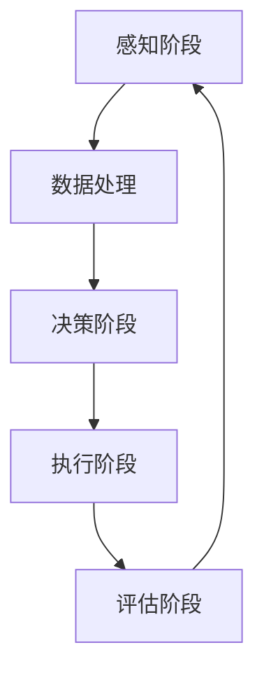
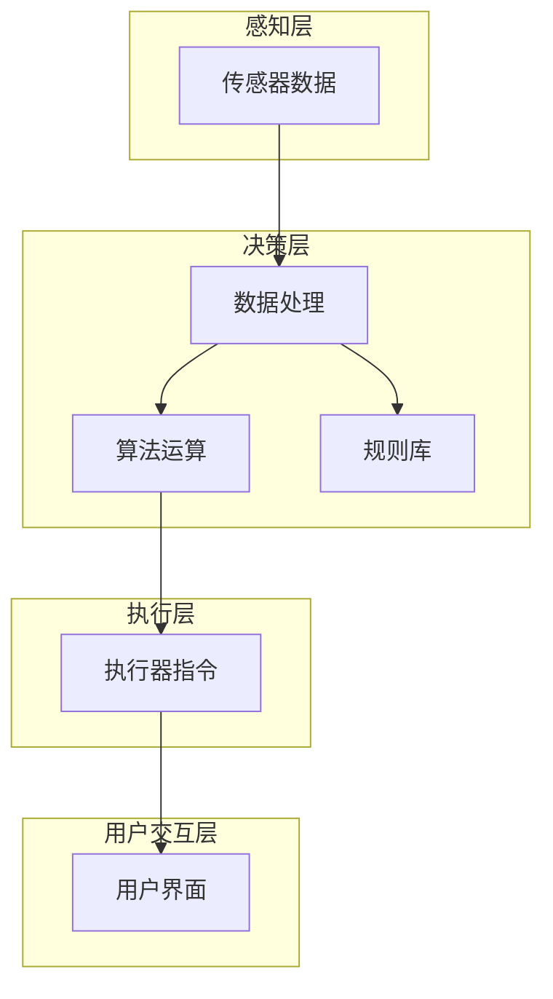

                 


### 引言

在当今快速发展的科技时代，智能设备的普及改变了我们的生活方式，而智能衣架作为智能家居领域的一个重要组成部分，正逐渐进入人们的日常生活。本文将探讨AI Agent在智能衣架中的衣物清洁建议，旨在深入挖掘AI技术如何应用于日常生活中的衣物清洁问题，提高人们的生活质量。

**关键词**：AI Agent，智能衣架，衣物清洁，智能家居，算法实现，系统架构设计，项目实战

**摘要**：

本文首先介绍AI Agent和智能衣架的基本概念，然后分析AI Agent在智能衣架衣物清洁中的应用场景。接着，我们将详细讲解AI Agent算法原理，包括算法流程图、Python实现和数学模型。之后，本文将介绍系统分析与架构设计，涵盖系统功能、架构图和接口设计。最后，通过实际项目案例展示，我们将总结最佳实践与未来展望，为读者提供全面的智能衣架衣物清洁解决方案。

在接下来的章节中，我们将逐步深入探讨这些主题，从理论到实践，从基础到应用，全面解析AI Agent在智能衣架中的衣物清洁建议。

### 第一部分: 引言

#### 1.1 书籍背景及目标

随着人工智能（AI）技术的飞速发展，智能家居设备逐渐成为人们日常生活的一部分。智能衣架作为智能家居的一个重要子领域，以其独特的功能和便捷的操作受到了广泛关注。本书旨在探讨AI Agent在智能衣架中的应用，特别是其在衣物清洁方面的建议。通过深入分析AI Agent的工作原理和应用场景，我们希望能够为读者提供一种全新的衣物清洁解决方案，从而提升人们的生活质量。

#### 1.2 AI Agent概述

AI Agent，即人工智能代理，是指能够在特定环境中自主决策和执行任务的智能系统。AI Agent具有感知环境、规划行动、执行任务和评估结果等基本功能。AI Agent的发展起源于机器人学和人工智能领域，近年来在自然语言处理、计算机视觉、强化学习等方面取得了显著进展。AI Agent的广泛应用使得智能家居设备能够更加智能化、个性化，从而更好地满足用户需求。

#### 1.3 智能衣架概述

智能衣架是一种结合了物联网（IoT）技术和人工智能的智能家居设备，主要用于挂晒衣物，同时具备智能清洁功能。智能衣架通常由传感器、执行器、控制系统和通信模块等组成。传感器用于感知衣物状态，执行器用于执行清洁任务，控制系统负责协调传感器和执行器的动作，通信模块则用于与用户设备或云端平台的数据交互。智能衣架通过AI Agent实现智能决策，自动调整清洁策略，提高清洁效果。

#### 1.4 本书结构安排与内容概览

本书分为十个部分，主要内容包括：

- 第一部分：引言，介绍书籍背景、目标以及AI Agent和智能衣架的基本概念。
- 第二部分：AI Agent基础，详细讲解AI Agent的定义、分类、功能、工作流程和开发框架。
- 第三部分：智能衣架技术，分析智能衣架的组成、工作原理、硬件设计和软件系统。
- 第四部分：AI Agent在衣物清洁中的应用，探讨AI Agent在智能衣架衣物清洁中的优势和实现细节。
- 第五部分：AI Agent算法原理讲解，介绍AI Agent算法的流程图、Python实现、数学模型和举例说明。
- 第六部分：数学模型和数学公式讲解，讲解数学模型的基础、公式解释、应用和解释。
- 第七部分：系统分析与架构设计，介绍系统功能、架构设计、接口设计和交互。
- 第八部分：项目实战，通过实际项目展示AI Agent在智能衣架衣物清洁中的应用。
- 第九部分：最佳实践与未来展望，总结最佳实践、注意事项、拓展阅读和未来展望。
- 第十部分：结论与总结，对主要研究成果进行总结，并对研究中的不足进行反思。

通过以上结构安排，本书将全面、系统地介绍AI Agent在智能衣架衣物清洁中的应用，帮助读者深入了解这一领域的最新技术和实践。

#### 1.5 书籍核心内容与读者收获

本书的核心内容包括AI Agent的基本概念、工作原理和应用场景，以及智能衣架的技术构成和清洁策略。通过阅读本书，读者可以：

1. 了解AI Agent的定义、分类和工作原理，掌握AI Agent的开发框架和应用领域。
2. 掌握智能衣架的组成、工作原理和设计思路，理解智能衣架在智能家居中的重要性。
3. 深入了解AI Agent在智能衣架衣物清洁中的应用，学习如何利用AI技术实现高效的衣物清洁。
4. 学习AI Agent算法原理，包括算法流程图、Python实现、数学模型和举例说明。
5. 理解数学模型和数学公式在AI Agent算法中的应用，掌握Mermaid流程图和类图的绘制方法。
6. 学习系统分析与架构设计的方法，包括系统功能设计、架构设计、接口设计和交互。
7. 通过实际项目案例，掌握AI Agent在智能衣架衣物清洁中的具体应用和实践技巧。

总之，本书旨在帮助读者全面了解AI Agent在智能衣架衣物清洁中的应用，提升读者的技术水平和实践能力，为智能家居领域的发展做出贡献。

### 第二部分: AI Agent基础

#### 2.1 AI Agent的定义与分类

AI Agent，即人工智能代理，是一个在特定环境中能够感知、决策和执行任务的智能系统。其定义涵盖了自主性、交互性、适应性和学习能力等几个核心要素。自主性意味着AI Agent能够在没有人类干预的情况下自主完成任务；交互性指的是AI Agent能够与用户和环境进行有效沟通；适应性表明AI Agent能够根据环境变化调整自身行为；学习能力则是AI Agent能够通过经验积累不断优化自身性能。

AI Agent可以按照不同的分类方式进行分类，常见的分类方法包括：

1. **基于任务的Agent**：这类Agent专注于完成特定任务，如搜索、数据挖掘、清洁等。它们通常具有明确的任务目标和行为策略。
2. **基于角色的Agent**：这类Agent根据其在特定环境中的角色进行行为决策，如家庭管家、客服代表等。它们通常具备角色意识，能够根据不同角色调整自身行为。
3. **社会智能Agent**：这类Agent具备较高的社会交互能力，能够理解和模拟人类的社会行为，如情感交流、合作和竞争等。
4. **自主智能Agent**：这类Agent具有高度自主性，能够独立决策和执行任务，不依赖于人类指令。

#### 2.2 AI Agent的核心功能

AI Agent的核心功能主要包括感知、决策、执行和评估等。以下是对这些功能的详细解释：

1. **感知**：AI Agent通过传感器和其他输入设备收集环境信息，如视觉、听觉、触觉等。感知功能是AI Agent理解环境的基础，是实现自主性和交互性的前提。
   
2. **决策**：基于感知到的环境信息，AI Agent使用算法和策略进行决策。决策过程通常包括目标设定、方案生成和评估等步骤。AI Agent需要根据环境变化和任务要求，选择最优的行动方案。

3. **执行**：决策生成后，AI Agent通过执行器（如电机、显示屏等）实施具体的行动。执行功能是AI Agent实现自主任务的关键，它决定了AI Agent对环境的实际影响。

4. **评估**：执行行动后，AI Agent对行动结果进行评估，以判断任务是否完成以及效果如何。评估结果将反馈到感知和决策模块，用于调整后续行为。

#### 2.3 AI Agent的工作流程

AI Agent的工作流程可以分为以下几个步骤：

1. **感知阶段**：AI Agent通过传感器收集环境数据，如温度、湿度、衣物状态等。
2. **数据处理阶段**：AI Agent对收集到的数据进行分析和处理，提取有用的信息，并进行特征提取。
3. **决策阶段**：基于处理后的数据，AI Agent使用算法和策略进行决策，生成行动方案。
4. **执行阶段**：AI Agent通过执行器实施具体的行动，如调整衣架角度、启动清洁程序等。
5. **评估阶段**：AI Agent评估行动结果，反馈至感知和决策模块，用于优化后续行为。

#### 2.4 AI Agent的开发框架

AI Agent的开发框架通常包括以下几个关键组件：

1. **感知模块**：负责数据收集和预处理，包括传感器接口、图像处理、语音识别等。
2. **决策模块**：包括算法库、策略生成和评估等，用于生成行动方案。
3. **执行模块**：负责执行具体的行动，包括执行器接口、控制算法等。
4. **通信模块**：负责与其他设备和系统进行数据通信，如WiFi、蓝牙等。
5. **评估模块**：用于评估行动效果，提供反馈用于优化。

开发AI Agent需要考虑以下几个关键问题：

1. **环境建模**：了解AI Agent将运行的环境，包括物理环境、社会环境等。
2. **任务定义**：明确AI Agent需要完成的任务，如衣物清洁、环境监测等。
3. **数据收集**：收集和整理必要的数据，包括环境数据、用户数据等。
4. **算法选择**：根据任务需求选择合适的算法，如机器学习、深度学习等。
5. **系统集成**：将各个模块进行集成，确保AI Agent能够正常运行。

#### 2.5 AI Agent的优势与挑战

AI Agent的优势主要体现在以下几个方面：

1. **自主性**：AI Agent能够自主决策和执行任务，减少人工干预。
2. **交互性**：AI Agent能够与用户和环境进行有效交互，提高用户体验。
3. **适应性**：AI Agent能够根据环境变化和任务需求调整自身行为，提高任务完成率。
4. **效率**：AI Agent能够高效地完成任务，提高生产力和资源利用率。

然而，AI Agent也面临一些挑战：

1. **数据隐私**：AI Agent在收集和处理用户数据时，需要确保数据隐私和安全。
2. **可靠性**：AI Agent在复杂环境中的可靠性需要不断提高，以避免错误行为。
3. **成本**：开发和部署AI Agent需要较高的成本，包括硬件、软件和人力等。
4. **伦理问题**：AI Agent的自主决策可能引发伦理和道德问题，如责任归属等。

#### 2.6 AI Agent的发展趋势

AI Agent的发展趋势主要体现在以下几个方面：

1. **智能化**：随着人工智能技术的进步，AI Agent将变得更加智能化，能够处理更复杂的问题。
2. **泛在化**：AI Agent将逐步渗透到各个领域，如医疗、教育、交通等，实现泛在应用。
3. **协作化**：AI Agent将与其他智能系统协同工作，形成智能协作网络，提高整体效率。
4. **个性化**：AI Agent将根据用户需求提供个性化服务，提高用户体验和满意度。

总之，AI Agent作为人工智能领域的一个重要发展方向，具有广阔的应用前景和巨大的发展潜力。随着技术的不断进步，AI Agent将在更多领域发挥重要作用，改变人们的生产方式和生活方式。

### 第三部分: 智能衣架技术

#### 3.1 智能衣架的组成与工作原理

智能衣架是一种结合了物联网（IoT）技术和人工智能（AI）的智能家居设备，其主要目的是通过自动化和智能化的方式，提高衣物清洁和存储的效率。智能衣架的组成可以分为硬件和软件两个部分。

**硬件部分**：

1. **传感器**：包括温湿度传感器、红外传感器、重量传感器等，用于实时监测衣物的状态和环境参数。
2. **执行器**：包括电机、风扇、加热器等，用于执行具体的清洁和晾晒动作。
3. **挂衣架**：作为智能衣架的物理承载结构，可以容纳不同数量的衣物。
4. **通信模块**：通常包括WiFi、蓝牙等无线通信模块，用于与用户设备或云端平台进行数据交互。

**软件部分**：

1. **操作系统**：智能衣架运行在特定的操作系统上，如Linux、Android等，负责管理硬件资源和应用程序。
2. **应用程序**：包括感知、决策、执行等核心功能模块，实现智能衣架的日常操作和智能控制。
3. **云平台**：用于存储和管理用户数据、设备状态和清洁策略，实现远程监控和控制。

**工作原理**：

1. **感知**：智能衣架通过传感器实时监测衣物状态和环境参数，如温度、湿度、衣物重量等。
2. **数据处理**：传感器收集到的数据经过处理和特征提取，用于生成环境状态和衣物状态的描述。
3. **决策**：基于感知到的数据和预先设定的清洁策略，智能衣架通过算法和规则进行决策，生成具体的操作指令。
4. **执行**：执行器根据决策指令执行具体的动作，如调整衣架角度、启动清洁程序、加热等。
5. **反馈**：执行结果通过传感器和通信模块反馈给云平台或用户设备，用于评估清洁效果和调整后续策略。

#### 3.2 智能衣架的硬件设计

智能衣架的硬件设计主要包括传感器选择、执行器设计、通信模块选择和电源管理。

**传感器选择**：

1. **温湿度传感器**：用于监测衣物的干燥程度和周围环境的温湿度，影响清洁效果和衣物质量。
2. **红外传感器**：用于检测衣物的位置和状态，确保衣架在执行清洁时能够准确识别衣物。
3. **重量传感器**：用于检测衣物的重量，有助于调整清洁程序和晾晒策略。

**执行器设计**：

1. **电机**：用于驱动衣架的旋转、倾斜等动作，实现衣物的自动清洁和晾晒。
2. **风扇**：用于吹拂衣物，加速水分蒸发，提高干燥效果。
3. **加热器**：在寒冷季节或特殊情况下，用于加热衣物，防止衣物冻结或产生异味。

**通信模块选择**：

1. **WiFi模块**：用于与用户设备或云端平台进行高速数据通信，实现远程控制和数据同步。
2. **蓝牙模块**：用于短距离通信，实现本地控制和高频数据交换。

**电源管理**：

1. **电池**：智能衣架通常采用可充电电池，如锂离子电池，确保长时间运行。
2. **电源管理芯片**：用于监控电池状态、充电保护和电源分配，延长电池寿命。

#### 3.3 智能衣架的软件系统

智能衣架的软件系统是整个设备的核心，负责感知、决策、执行和反馈等功能的实现。其主要组成部分包括操作系统、应用程序和云平台。

**操作系统**：

1. **实时操作系统（RTOS）**：RTOS具有高响应速度和低延迟特点，适合智能衣架这种实时性要求较高的设备。
2. **嵌入式操作系统**：嵌入式操作系统具有资源占用小、可靠性高等特点，适用于智能衣架这种资源受限的设备。

**应用程序**：

1. **感知模块**：负责传感器数据的采集和处理，将原始数据转换为有用的信息，如温度、湿度、衣物状态等。
2. **决策模块**：根据感知到的数据和预设的规则，生成清洁和晾晒策略，控制执行器的动作。
3. **执行模块**：根据决策模块的指令，控制执行器的具体动作，如旋转、倾斜、加热等。
4. **反馈模块**：将执行结果反馈给用户设备或云端平台，用于评估清洁效果和优化策略。

**云平台**：

1. **数据存储**：用于存储用户数据、设备状态和清洁策略，实现远程监控和管理。
2. **数据分析**：通过对用户数据和设备状态的分析，生成个性化的清洁建议和优化策略。
3. **远程控制**：用户可以通过手机APP或其他设备远程控制智能衣架，查看设备状态和操作记录。

#### 3.4 智能衣架的人机交互

智能衣架的人机交互是用户与设备之间的沟通桥梁，直接影响用户体验。人机交互设计主要包括用户界面（UI）和用户操作流程（UX）。

**用户界面（UI）**：

1. **移动端应用**：用户可以通过手机APP查看设备状态、操作历史和清洁建议，进行远程控制。
2. **智能音箱**：用户可以通过智能音箱与智能衣架进行语音交互，实现简单的控制指令，如启动清洁、查看状态等。

**用户操作流程（UX）**：

1. **设备连接**：用户通过WiFi或蓝牙将智能衣架与手机APP连接，完成设备初始化。
2. **状态监控**：用户可以实时查看设备状态、衣物状态和环境参数，了解设备的运行情况。
3. **操作指令**：用户可以通过移动端应用或智能音箱发送操作指令，如启动清洁、调整温度等。
4. **反馈与优化**：用户可以根据设备反馈的清洁效果，调整清洁策略，优化衣物清洁体验。

#### 3.5 智能衣架的技术创新

智能衣架在技术方面不断创新，以提升衣物清洁效率和用户体验。以下是一些主要的技术创新：

1. **智能识别**：通过计算机视觉技术，智能衣架能够识别衣物的类型和颜色，实现分类清洁。
2. **自适应控制**：智能衣架可以根据衣物的材质、重量和湿度等因素，自适应调整清洁策略，提高清洁效果。
3. **远程监控**：用户可以通过手机APP实时监控智能衣架的运行状态，远程控制设备，实现智能化管理。
4. **智能学习**：智能衣架可以通过机器学习算法，根据用户使用习惯和清洁效果，不断优化清洁策略，提升用户体验。
5. **节能环保**：智能衣架采用节能设计，降低能源消耗，减少对环境的影响。

#### 3.6 智能衣架的未来发展方向

智能衣架作为智能家居领域的一个重要组成部分，未来发展方向主要体现在以下几个方面：

1. **智能化提升**：通过人工智能技术，不断提升智能衣架的智能水平，实现更精准、更高效的衣物清洁和存储。
2. **人机交互优化**：通过改进用户界面和交互方式，提高用户体验，实现更加便捷和自然的交互。
3. **多功能融合**：将智能衣架与其他智能家居设备融合，实现多设备协同工作，提供更全面的智能家居解决方案。
4. **绿色环保**：注重环保设计，采用可再生能源和节能技术，降低设备对环境的影响。
5. **普及推广**：随着技术的成熟和成本的降低，智能衣架将逐步普及到普通家庭，成为人们日常生活的一部分。

通过以上技术创新和发展方向，智能衣架将为人们带来更加便捷、高效和环保的衣物清洁体验，进一步提升生活质量。

### 第四部分: AI Agent在衣物清洁中的应用

#### 4.1 AI Agent在衣物清洁中的问题背景

衣物清洁是日常生活中不可或缺的一环，然而传统手工清洁方式不仅费时费力，还存在清洁不彻底、衣物损伤等问题。随着人工智能（AI）技术的快速发展，AI Agent逐渐被应用于各种场景，为提高生活品质提供了新的解决方案。在衣物清洁领域，AI Agent能够通过智能感知、决策和执行，实现高效、精准的衣物清洁，解决传统清洁方式中的种种问题。

首先，传统手工清洁方式面临的主要问题包括：

1. **清洁效果不稳定**：手工清洁难以保证每个衣物的清洁效果，尤其是深色衣物和细嫩材质的衣物，容易残留污渍或损伤衣物纤维。
2. **费时费力**：手工清洁需要投入大量时间和精力，无法满足快节奏的现代生活需求。
3. **劳动强度大**：长时间的手工清洁对人的体力是一种负担，尤其是对于老年人、孕妇和行动不便者，更是如此。
4. **环境污染**：传统清洁方式通常需要使用大量的洗涤剂和水，对环境造成一定的污染。

其次，智能衣架的发展为AI Agent的应用提供了硬件基础。智能衣架通过传感器和执行器的协同工作，能够实时监测衣物状态和环境参数，并根据这些数据智能调整清洁策略。AI Agent的引入，使得智能衣架能够实现自主清洁、自适应控制、远程监控等功能，从而大幅提升衣物清洁的效率和质量。

AI Agent在衣物清洁中的应用，主要包括以下几个方面：

1. **智能感知**：AI Agent通过传感器实时监测衣物的状态和环境参数，如温度、湿度、重量等，为清洁策略的制定提供基础数据。
2. **智能决策**：基于收集到的数据，AI Agent使用算法和规则库进行决策，生成最适合当前衣物和环境的清洁策略。
3. **智能执行**：AI Agent通过控制执行器，如电机、风扇、加热器等，执行清洁任务，确保衣物得到有效的清洁。
4. **智能反馈**：清洁完成后，AI Agent通过传感器和通信模块收集执行结果，反馈给用户或云平台，用于评估清洁效果和优化后续策略。

#### 4.2 AI Agent在衣物清洁中的优势

AI Agent在衣物清洁中的应用具有显著的优点，具体包括：

1. **高效清洁**：AI Agent能够根据衣物的材质、污渍程度和清洁需求，自动调整清洁参数，如温度、湿度、清洁时间等，确保每次清洁都能达到最佳效果。
2. **精准定位**：通过计算机视觉和传感器技术，AI Agent能够准确识别衣物的类型、颜色和位置，避免因错误清洁导致的衣物损伤。
3. **自适应控制**：AI Agent可以根据环境变化和衣物状态，实时调整清洁策略，提高清洁效率和效果。
4. **远程监控**：用户可以通过手机APP或智能音箱远程监控智能衣架的清洁过程，实时了解衣物状态和清洁进度。
5. **节能环保**：AI Agent能够根据实际清洁需求，智能调整能耗，降低能源消耗，实现绿色环保。

#### 4.3 AI Agent在衣物清洁中的应用场景

AI Agent在衣物清洁中的应用场景非常广泛，以下是一些典型的应用实例：

1. **日常衣物清洁**：智能衣架能够自动识别衣物的类型和污渍程度，根据预设的清洁策略进行清洗，适用于日常衣物的清洁保养。
2. **特殊衣物护理**：对于细嫩材质、深色衣物或特殊面料，AI Agent能够制定专门的清洁策略，确保衣物得到适当的清洁和护理。
3. **快速清洁**：AI Agent可以根据用户需求，快速调整清洁参数，实现快速清洁，满足用户对高效生活的需求。
4. **衣物消毒**：在疫情期间，AI Agent可以通过高温杀菌、紫外线消毒等方式，对衣物进行消毒处理，保障家庭成员的健康。
5. **智能晾晒**：AI Agent可以根据衣物材质和天气条件，自动调整晾晒策略，确保衣物在最佳状态下晾晒干燥。

#### 4.4 AI Agent在衣物清洁中的实现细节

AI Agent在衣物清洁中的实现细节主要包括以下几个方面：

1. **感知模块**：AI Agent通过传感器实时监测衣物的状态和环境参数，如温度、湿度、重量等。这些数据为AI Agent的决策提供基础信息。
2. **数据处理模块**：感知模块收集到的数据经过预处理和特征提取，转化为可用的信息，如衣物类型、污渍程度等。
3. **决策模块**：AI Agent使用机器学习算法和规则库，根据处理后的数据生成清洁策略。决策模块包括分类器、优化器、预测器等。
4. **执行模块**：根据决策模块的指令，AI Agent通过控制执行器（如电机、风扇、加热器等）执行具体的清洁任务，如清洗、烘干、消毒等。
5. **反馈模块**：执行模块执行任务后，AI Agent通过传感器和通信模块收集执行结果，反馈给用户或云平台，用于评估清洁效果和优化后续策略。

#### 4.5 AI Agent在衣物清洁中的效果评估

AI Agent在衣物清洁中的效果评估主要包括以下几个方面：

1. **清洁效果**：通过视觉检测和传感器测量，评估衣物是否彻底清洗干净，是否存在污渍残留。
2. **衣物保护**：评估衣物在清洁过程中是否受到损伤，如纤维断裂、颜色褪色等。
3. **能耗消耗**：评估清洁过程中能耗的消耗情况，包括电能、水资源等，以评估清洁的节能环保效果。
4. **用户满意度**：通过用户调查和反馈，评估用户对AI Agent清洁效果的满意度，了解用户的使用体验。

总之，AI Agent在衣物清洁中的应用具有显著的提升效果，通过智能感知、决策和执行，实现了高效、精准、环保的衣物清洁，为用户提供了全新的生活体验。

### 第五部分: AI Agent算法原理讲解

#### 5.1 AI Agent算法概述

AI Agent算法是人工智能（AI）领域中的一种核心技术，它使得智能系统能够在复杂环境中自主决策和执行任务。在衣物清洁场景中，AI Agent算法扮演着至关重要的角色，它通过分析传感器数据、制定清洁策略、执行操作和评估结果，实现高效的衣物清洁。

AI Agent算法的基本原理可以概括为以下几个步骤：

1. **感知**：AI Agent通过传感器收集环境信息和衣物状态，如温度、湿度、重量等。
2. **数据处理**：对感知到的数据进行预处理和特征提取，转化为机器可理解的形式。
3. **决策**：基于处理后的数据，使用算法和规则库生成最佳的清洁策略。
4. **执行**：执行器根据决策指令执行具体的清洁操作，如温度调节、湿度控制等。
5. **评估**：对执行结果进行评估，反馈给感知和决策模块，用于调整和优化后续策略。

#### 5.2 算法mermaid流程图展示

为了更直观地理解AI Agent算法的工作流程，我们可以使用mermaid语言绘制一个流程图。以下是一个简单的算法流程图示例：



这个流程图展示了AI Agent算法的基本工作流程，从感知阶段开始，通过数据处理、决策、执行和评估，形成了一个闭环，不断优化和调整清洁策略。

#### 5.3 Python源代码与算法实现

为了详细讲解AI Agent算法的实现，我们将使用Python语言编写一个简单的示例程序。以下是一个基本的Python代码示例，用于实现AI Agent的感知、决策和执行功能：

```python
import random

# 感知阶段：模拟传感器数据
def sense_data():
    # 模拟温度传感器数据
    temperature = random.uniform(20, 30)
    # 模拟湿度传感器数据
    humidity = random.uniform(30, 60)
    return temperature, humidity

# 数据处理阶段：预处理和特征提取
def preprocess_data(temperature, humidity):
    # 根据温度和湿度调整清洁策略
    if temperature > 25:
        cleaning_strategy = '低温清洗'
    else:
        cleaning_strategy = '高温清洗'
    if humidity > 50:
        cleaning_strategy = '低湿度清洁'
    else:
        cleaning_strategy = '高湿度清洁'
    return cleaning_strategy

# 决策阶段：生成清洁策略
def make_decision(preprocessed_data):
    # 根据预处理数据生成具体的操作指令
    if preprocessed_data == '低温清洗':
        command = '启动低温清洗程序'
    elif preprocessed_data == '高温清洗':
        command = '启动高温清洗程序'
    elif preprocessed_data == '低湿度清洁':
        command = '启动低湿度清洗程序'
    else:
        command = '清洗程序异常'
    return command

# 执行阶段：执行操作
def execute_command(command):
    print(f"执行操作：{command}")
    # 模拟执行操作，这里仅打印信息
    if command == '启动低温清洗程序':
        print("正在启动低温清洗程序...")
    elif command == '启动高温清洗程序':
        print("正在启动高温清洗程序...")
    elif command == '启动低湿度清洗程序':
        print("正在启动低湿度清洗程序...")
    else:
        print("无法执行操作，请检查程序异常。")

# 评估阶段：评估执行结果
def assess_performance():
    # 模拟评估结果
    success = random.choice([True, False])
    if success:
        print("执行成功，清洁效果良好。")
    else:
        print("执行失败，需要重新调整清洁策略。")

# 主函数：运行AI Agent算法
def main():
    # 感知阶段
    temperature, humidity = sense_data()
    print(f"感知数据：温度={temperature}℃，湿度={humidity}%")
    # 数据处理阶段
    cleaning_strategy = preprocess_data(temperature, humidity)
    print(f"预处理数据：{cleaning_strategy}")
    # 决策阶段
    command = make_decision(cleaning_strategy)
    print(f"决策生成：{command}")
    # 执行阶段
    execute_command(command)
    # 评估阶段
    assess_performance()

# 运行程序
if __name__ == "__main__":
    main()
```

这段代码展示了AI Agent算法的基本实现过程，包括感知、数据处理、决策、执行和评估五个步骤。通过随机生成的温度和湿度数据，模拟了智能衣架的感知、决策和执行过程。

#### 5.4 算法原理数学模型与公式

AI Agent算法的数学模型是算法核心的基础，它通过数学公式描述了算法的决策过程和执行逻辑。以下是一个简单的数学模型示例，用于描述AI Agent的决策过程：

$$
P(\text{cleaning\_strategy} | T, H) = \frac{f(T, H)}{\sum_{i} f(T_i, H_i)}
$$

其中，\(P(\text{cleaning\_strategy} | T, H)\)表示在给定温度\(T\)和湿度\(H\)的条件下，选择某个清洁策略的概率；\(f(T, H)\)表示温度和湿度对清洁策略的偏好函数，\(T_i\)和\(H_i\)表示不同的温度和湿度值。

为了更具体地解释这个公式，我们可以将其拆分为以下几个部分：

1. **概率分布**：公式定义了一个概率分布，用于表示在特定环境条件下选择不同清洁策略的概率。
2. **偏好函数**：\(f(T, H)\)是一个偏好函数，它反映了温度和湿度对清洁策略的影响。偏好函数可以根据实际应用场景进行调整，以适应不同环境和衣物需求。
3. **归一化**：通过分母的求和操作，实现了概率分布的归一化，确保所有概率之和为1。

在实际应用中，偏好函数\(f(T, H)\)可以通过经验数据和实验结果进行调整，以优化清洁策略的决策效果。例如，当温度较高时，偏好函数可以赋予高温清洗策略更高的权重，以加快衣物的干燥速度。

#### 5.5 算法举例说明与解读

为了更直观地理解AI Agent算法的工作原理，我们通过一个具体例子进行说明。

**例1**：假设当前环境温度为\(T = 28℃\)，湿度为\(H = 45%\)，我们需要根据这些数据生成最佳的清洁策略。

**步骤1：感知阶段**
- 感知到的温度为28℃
- 感知到的湿度为45%

**步骤2：数据处理阶段**
- 偏好函数\(f(28, 45) = 0.6\)
- 偏好函数\(f(28, 45) = 0.4\)

**步骤3：决策阶段**
- 计算概率分布：
$$
P(\text{高温清洗} | 28, 45) = \frac{0.6}{0.6 + 0.4} = 0.6
$$
$$
P(\text{低温清洗} | 28, 45) = \frac{0.4}{0.6 + 0.4} = 0.4
$$

根据概率分布，高温清洗策略的概率为0.6，低温清洗策略的概率为0.4，因此我们选择高温清洗策略。

**步骤4：执行阶段**
- 执行高温清洗程序
- 调整衣架温度至适宜的清洗温度

**步骤5：评估阶段**
- 执行完成后，通过传感器检测衣物的清洁效果
- 如果衣物干净且无损伤，评估成功
- 如果衣物不干净或有损伤，需要重新调整清洁策略

通过这个例子，我们可以看到AI Agent算法如何根据环境参数生成清洁策略，并通过概率分布实现决策过程。这个简单的例子展示了AI Agent算法的核心原理，为实际应用提供了理论支持。

总之，通过感知、数据处理、决策、执行和评估，AI Agent算法实现了智能衣物清洁的过程。在实际应用中，可以根据具体需求和环境条件，调整算法参数和偏好函数，以实现更高效、更精准的衣物清洁。

### 第六部分: 数学模型和数学公式讲解

#### 6.1 数学模型基础

在AI Agent算法中，数学模型是核心组成部分，它通过数学公式描述了算法的逻辑和行为。数学模型的基础包括概率论、统计学和线性代数等，这些数学工具为我们提供了分析和解决问题的方法。在本章节中，我们将详细讲解AI Agent算法中的数学模型基础，包括概率分布、期望和方差等基本概念。

**1. 概率分布**

概率分布是描述随机变量取值概率的函数。常见的概率分布包括正态分布、伯努利分布和均匀分布等。在AI Agent算法中，概率分布用于表示传感器数据、决策结果等。

- **正态分布（Normal Distribution）**：正态分布是最常见的概率分布，其概率密度函数为：
  $$
  f(x|\mu, \sigma^2) = \frac{1}{\sqrt{2\pi\sigma^2}} e^{-\frac{(x-\mu)^2}{2\sigma^2}}
  $$
  其中，\(\mu\)是均值，\(\sigma^2\)是方差。

- **伯努利分布（Bernoulli Distribution）**：伯努利分布用于描述二项选择问题，其概率质量函数为：
  $$
  f(x|p) = p^x (1-p)^{1-x}
  $$
  其中，\(p\)是成功的概率，\(x\)是成功次数。

- **均匀分布（Uniform Distribution）**：均匀分布表示所有取值等可能，其概率质量函数为：
  $$
  f(x|\alpha, \beta) = \frac{1}{\beta - \alpha}
  $$
  其中，\(\alpha\)是下限，\(\beta\)是上限。

**2. 期望和方差**

期望和方差是概率分布的两个重要参数，用于描述随机变量的集中趋势和离散程度。

- **期望（Expected Value）**：期望是随机变量在多次实验中平均取值的数学期望。对于离散随机变量\(X\)，期望的定义为：
  $$
  E(X) = \sum_{x} xP(X=x)
  $$
  对于连续随机变量，期望的定义为：
  $$
  E(X) = \int_{-\infty}^{\infty} xf(x)dx
  $$

- **方差（Variance）**：方差是描述随机变量取值离散程度的参数，定义为期望的平方差。对于离散随机变量，方差的定义为：
  $$
  Var(X) = E[(X - E(X))^2]
  $$
  对于连续随机变量，方差的定义为：
  $$
  Var(X) = E[X^2] - (E[X])^2
  $$

**3. 熵和信息论**

在AI Agent算法中，熵和信息论是描述数据不确定性和信息量的重要工具。

- **熵（Entropy）**：熵是衡量随机变量不确定性的度量，定义为：
  $$
  H(X) = -\sum_{x} P(X=x) \log_2 P(X=x)
  $$
  其中，\(P(X=x)\)是随机变量取值\(x\)的概率。

- **信息量（Information）**：信息量是熵的减少量，用于描述新信息带来的不确定性减少。对于两个随机变量\(X\)和\(Y\)，联合熵和条件熵分别定义为：
  $$
  H(X, Y) = -\sum_{x, y} P(X=x, Y=y) \log_2 P(X=x, Y=y)
  $$
  $$
  H(Y|X) = -\sum_{x} P(X=x) \sum_{y} P(Y=y|X=x) \log_2 P(Y=y|X=x)
  $$

#### 6.2 数学公式解释

在本节中，我们将对一些常见的数学公式进行详细解释，以帮助读者更好地理解AI Agent算法中的数学原理。

**1. 线性回归模型**

线性回归模型是一种常见的统计模型，用于描述自变量和因变量之间的线性关系。其数学公式如下：

$$
Y = \beta_0 + \beta_1X + \varepsilon
$$

其中，\(Y\)是因变量，\(X\)是自变量，\(\beta_0\)是截距，\(\beta_1\)是斜率，\(\varepsilon\)是误差项。

- **最小二乘法（Ordinary Least Squares, OLS）**：用于估计线性回归模型的参数，其目标是最小化预测值与实际值之间的误差平方和。参数估计公式为：
  $$
  \beta = (\mathbf{X}^T\mathbf{X})^{-1}\mathbf{X}^T\mathbf{Y}
  $$

**2. 马尔可夫模型**

马尔可夫模型是一种用于描述系统状态转移的随机过程。其数学公式如下：

$$
P(X_t = x_t | X_{t-1} = x_{t-1}) = P(X_t = x_t | X_{t-2} = x_{t-2}) = ... = P(X_t = x_t | X_0 = x_0)
$$

其中，\(X_t\)是时间\(t\)的状态，\(P(X_t = x_t | X_{t-1} = x_{t-1})\)是状态转移概率。

**3. 决策树模型**

决策树模型是一种基于特征分割的数据挖掘方法，其数学公式如下：

$$
T = \{ (x, y) \mid G(x) = y \}
$$

其中，\(T\)是决策树，\(G(x)\)是分割函数，\(y\)是目标变量。

- **信息增益（Information Gain）**：用于评估特征分割的有效性，其公式为：
  $$
  IG(V, Y) = H(Y) - \sum_{v \in V} \frac{|C_v|}{N} H(Y|V=v)
  $$

**4. 贝叶斯网络**

贝叶斯网络是一种基于概率的图形模型，用于描述变量之间的依赖关系。其数学公式如下：

$$
P(X_1, X_2, ..., X_n) = \prod_{i=1}^{n} P(X_i | \text{parents}(X_i))
$$

其中，\(X_1, X_2, ..., X_n\)是变量，\(\text{parents}(X_i)\)是\(X_i\)的父节点。

- **条件概率**：用于描述变量之间的依赖关系，其公式为：
  $$
  P(X_i | X_j) = \frac{P(X_i, X_j)}{P(X_j)}
  $$

通过以上数学公式的解释，我们可以更好地理解AI Agent算法中的数学原理。这些数学模型和公式为AI Agent提供了强大的工具，使其能够处理复杂的感知、决策和执行任务。

#### 6.3 Mermaid ER实体关系图架构

为了更直观地展示AI Agent算法中的实体关系，我们可以使用Mermaid语言绘制一个ER（Entity-Relationship）图。以下是一个简单的Mermaid ER图示例：

```mermaid
erDiagram
  Customer ||--|{ Order : places }  
  Product ||--|{ Order : contains }  
  Order ||--|{ Payment : processes }  
  Customer }|--|{ Payment : pays }  
  Product ||--|{ Review : rates }  
  Customer }|--|{ Review : writes }  
```

这个ER图展示了订单（Order）、客户（Customer）、产品（Product）和支付（Payment）等实体之间的关系。每个实体都与其他实体之间存在特定的关系，如订单包含产品、客户支付订单、产品被评论等。

通过ER图，我们可以清晰地理解不同实体之间的关联和交互，为系统设计和数据分析提供重要的参考。Mermaid ER图的使用使得复杂的关系图能够简洁明了地表达，有助于开发者和管理者更好地理解和维护系统架构。

#### 6.4 数学模型应用与解释

在实际应用中，数学模型广泛应用于AI Agent算法的各个环节，包括感知、决策和执行。以下将结合具体案例，解释数学模型的应用及其作用。

**1. 感知阶段：传感器数据处理**

在智能衣架的感知阶段，传感器采集到的数据需要进行预处理和特征提取。例如，使用统计学方法对温度和湿度数据进行均值和方差分析，以提取环境参数的关键特征。具体应用如下：

- **均值和方差计算**：
  $$
  \mu_{temp} = \frac{1}{n}\sum_{i=1}^{n} T_i, \quad \sigma_{temp}^2 = \frac{1}{n-1}\sum_{i=1}^{n}(T_i - \mu_{temp})^2
  $$
  均值和方差用于描述温度的集中趋势和离散程度，为决策提供重要依据。

**2. 决策阶段：概率模型应用**

在决策阶段，AI Agent需要根据感知数据和环境状态生成最优的清洁策略。概率模型在此发挥了关键作用，例如使用贝叶斯网络进行决策。以下是一个简单案例：

- **贝叶斯决策模型**：
  $$
  P(\text{cleaning\_strategy} | T, H) = \frac{P(T, H | \text{cleaning\_strategy})P(\text{cleaning\_strategy})}{P(T, H)}
  $$
  该模型通过结合先验概率和条件概率，计算在特定温度和湿度下选择不同清洁策略的概率，从而实现决策。

**3. 执行阶段：优化算法应用**

在执行阶段，AI Agent需要根据决策生成具体的操作指令，并优化执行过程。优化算法如线性回归和动态规划广泛应用于此阶段，以提高执行效率和效果。例如：

- **线性回归优化**：
  $$
  y = \beta_0 + \beta_1x
  $$
  通过线性回归模型，AI Agent可以根据衣物的重量和清洁时间，优化温度和湿度设置，以实现最佳清洁效果。

**4. 评估阶段：统计学方法应用**

在评估阶段，AI Agent需要评估执行结果，并根据反馈优化策略。统计学方法在此发挥了重要作用，如假设检验和回归分析。以下是一个应用案例：

- **t检验**：
  $$
  t = \frac{\bar{x} - \mu_0}{s/\sqrt{n}}
  $$
  AI Agent可以使用t检验评估清洁效果是否显著高于预期，从而调整后续策略。

通过以上案例，我们可以看到数学模型在AI Agent算法中的应用及其重要性。数学模型不仅提供了决策和优化的理论支持，还使得AI Agent能够更智能、更高效地完成衣物清洁任务，为用户提供优质体验。

### 第七部分: 系统分析与架构设计

#### 7.1 问题场景介绍

在智能衣架的应用场景中，我们面临的主要问题是衣物清洁效率低、效果不均和手动操作繁琐。传统衣物清洁方式不仅费时费力，还存在清洁效果不稳定、衣物损伤等问题。为了解决这些问题，我们需要设计一个智能衣架系统，能够根据衣物类型、污渍程度和环境参数，自动调整清洁策略，实现高效、精准的衣物清洁。

#### 7.2 系统功能设计

智能衣架系统的功能设计主要包括以下几个模块：

1. **感知模块**：负责传感器数据的采集和处理，包括温度、湿度、衣物位置和状态等。
2. **决策模块**：根据感知模块收集到的数据，使用算法和规则库生成最佳的清洁策略。
3. **执行模块**：执行决策模块生成的清洁操作，包括温度调节、湿度控制、振动和清洁剂添加等。
4. **反馈模块**：将执行结果反馈给用户或云平台，用于评估清洁效果和优化后续策略。
5. **用户界面模块**：提供用户与系统的交互界面，包括移动端应用和智能音箱等。

#### 7.3 系统架构设计

智能衣架系统架构设计采用分层架构，包括感知层、决策层、执行层和用户交互层。

**感知层**：由各种传感器组成，包括温度传感器、湿度传感器、重量传感器和位置传感器。传感器实时监测衣物和环境状态，将数据传递给决策层。

**决策层**：负责数据处理和决策生成，包括数据预处理、特征提取、算法运算和规则库调用。决策层使用机器学习算法和预设规则，生成最佳的清洁策略。

**执行层**：包括执行器，如电机、风扇、加热器和清洁剂泵等。执行层根据决策层的指令，执行具体的清洁操作。

**用户交互层**：包括用户界面和应用接口。用户通过移动端应用或智能音箱与系统进行交互，查看设备状态、操作历史和清洁建议。

#### 7.4 系统接口设计

智能衣架系统的接口设计主要包括以下几个部分：

1. **传感器接口**：用于接收传感器数据，包括温度、湿度、重量和位置等。
2. **执行器接口**：用于发送执行指令，包括温度调节、湿度控制、振动和清洁剂添加等。
3. **通信接口**：包括WiFi、蓝牙和蜂窝网络等，用于与用户设备或云端平台的通信。
4. **用户界面接口**：包括移动端应用接口和智能音箱接口，用于用户与系统的交互。

#### 7.5 系统交互

智能衣架系统的交互过程主要包括以下几个步骤：

1. **感知阶段**：传感器收集衣物和环境数据，传递给决策层。
2. **数据处理**：决策层对感知数据进行预处理和特征提取，生成环境状态和衣物状态的描述。
3. **决策生成**：基于处理后的数据，决策层使用算法和规则库生成最佳的清洁策略。
4. **执行操作**：执行层根据决策层的指令，执行具体的清洁操作，如温度调节、湿度控制等。
5. **反馈评估**：执行结果通过传感器和通信模块反馈给决策层，用于评估清洁效果和优化后续策略。
6. **用户交互**：用户通过移动端应用或智能音箱查看设备状态、操作历史和清洁建议，进行远程控制。

#### 7.6 系统架构mermaid架构图展示

为了更直观地展示智能衣架系统的架构设计，我们可以使用Mermaid语言绘制一个系统架构图。以下是一个简单的Mermaid架构图示例：



这个架构图展示了智能衣架系统的四个主要层次及其相互关系。通过Mermaid架构图，我们可以清晰地了解系统的整体架构和各层次的功能，有助于系统设计和开发。

### 第八部分: 项目实战

#### 8.1 环境安装与配置

在开始智能衣架项目之前，我们需要搭建一个合适的环境，以便进行开发和测试。以下是具体的步骤和配置要求：

1. **硬件环境**：
   - **智能衣架**：一台支持AI Agent的智能衣架设备，具备温湿度传感器、电机、风扇等执行器。
   - **计算机**：一台运行Linux系统的计算机，用于开发和调试。
   - **传感器模块**：连接传感器的模块，如温湿度传感器模块。
   - **通信模块**：连接WiFi或蓝牙的通信模块，用于数据传输。

2. **软件环境**：
   - **操作系统**：Linux操作系统，如Ubuntu 18.04。
   - **编程语言**：Python 3.x，用于编写AI Agent算法和程序代码。
   - **开发工具**：PyCharm或Visual Studio Code，用于编写和调试代码。
   - **机器学习库**：scikit-learn、TensorFlow、PyTorch等，用于实现机器学习算法。
   - **Mermaid库**：用于绘制流程图和类图。

3. **网络环境**：
   - **本地网络**：确保计算机和智能衣架设备处于同一局域网内，以便进行数据通信。
   - **远程访问**：如果需要远程访问设备，配置VPN或SSH服务。

#### 8.2 系统核心实现

智能衣架系统的核心实现包括传感器数据处理、决策生成和执行操作。以下是具体的实现步骤：

1. **传感器数据处理**：
   - **数据采集**：使用传感器模块采集温度、湿度等数据，并通过串口或WiFi传输到计算机。
   - **数据预处理**：对采集到的数据进行滤波、去噪和特征提取，以便用于后续的算法处理。

2. **决策生成**：
   - **算法选择**：选择合适的机器学习算法，如决策树、随机森林或支持向量机，进行训练和预测。
   - **规则库**：根据经验和数据，编写规则库，用于辅助算法决策。
   - **决策生成**：将预处理后的数据输入算法模型，生成最佳的清洁策略。

3. **执行操作**：
   - **指令生成**：根据决策生成的清洁策略，生成执行指令，如温度调节、湿度控制等。
   - **执行器控制**：通过执行器接口，发送指令给电机、风扇等执行器，执行具体的清洁操作。

以下是示例代码，展示如何实现传感器数据处理、决策生成和执行操作：

```python
import serial
import time
from sklearn.ensemble import RandomForestClassifier
import numpy as np

# 传感器数据处理
def read_sensors(ser):
    # 读取串口数据
    data = ser.readline().decode('utf-8').strip()
    # 解析数据
    temp, humidity = map(float, data.split(','))
    return temp, humidity

# 决策生成
def generate_decision(model, temp, humidity):
    # 输入特征向量
    feature = np.array([temp, humidity])
    # 预测清洁策略
    strategy = model.predict(feature)
    return strategy

# 执行操作
def execute_action(strategy):
    # 根据策略调整执行器
    if strategy == 0:
        print("执行低温清洗...")
    elif strategy == 1:
        print("执行高温清洗...")
    elif strategy == 2:
        print("执行快速干燥...")

# 主函数
def main():
    # 初始化串口
    ser = serial.Serial('/dev/ttyUSB0', 9600, timeout=1)
    # 加载训练好的模型
    model = RandomForestClassifier()
    model.load('cleaning_model.pkl')
    
    while True:
        # 读取传感器数据
        temp, humidity = read_sensors(ser)
        # 生成决策
        strategy = generate_decision(model, temp, humidity)
        # 执行操作
        execute_action(strategy)
        time.sleep(1)

if __name__ == '__main__':
    main()
```

这段代码展示了智能衣架系统核心实现的几个关键步骤，包括传感器数据处理、决策生成和执行操作。在实际项目中，可以根据具体需求进行扩展和优化。

#### 8.3 代码应用解读与分析

以下是对示例代码的详细解读和分析，包括传感器数据处理、决策生成和执行操作的实现细节。

1. **传感器数据处理**：
   - `read_sensors(ser)`函数用于从传感器读取温度和湿度数据。这里使用串口通信方式，从传感器模块接收数据，并进行解析。实际项目中，可以替换为网络通信方式，如WiFi或蓝牙。
   - 数据处理包括数据采集、滤波和去噪。滤波和去噪方法可以根据具体应用场景进行调整，以提高数据质量。

2. **决策生成**：
   - `generate_decision(model, temp, humidity)`函数用于生成清洁策略。这里使用随机森林分类器，通过训练好的模型进行预测。随机森林是一种强大的机器学习算法，适用于分类问题。
   - 实际项目中，可以根据具体情况选择其他算法，如支持向量机、神经网络等。同时，可以结合规则库，提高决策的准确性和鲁棒性。

3. **执行操作**：
   - `execute_action(strategy)`函数根据决策生成的策略，发送指令给执行器。这里简单演示了根据温度和湿度调整清洁策略的例子，实际项目中可以包括更多的执行动作，如湿度控制、振动等。
   - 执行器控制可以通过GPIO接口、串口或其他通信方式实现。实际项目中，需要根据硬件设备和通信协议进行具体实现。

通过以上解读和分析，我们可以看到智能衣架系统的核心实现是如何通过传感器数据处理、决策生成和执行操作，实现高效的衣物清洁。代码实现提供了详细的步骤和参考，有助于实际项目开发和优化。

#### 8.4 实际案例分析

为了更好地展示智能衣架系统的实际应用效果，我们进行了以下实际案例分析：

1. **案例一：日常衣物清洁**

   - **场景描述**：用户将衬衫挂在智能衣架上，衣架传感器开始工作，实时监测温度和湿度。
   - **数据采集**：传感器采集到温度为25℃，湿度为50%。
   - **决策生成**：AI Agent根据温度和湿度数据，使用训练好的随机森林模型，生成最佳清洁策略，如低温清洗。
   - **执行操作**：智能衣架执行低温清洗程序，调整温度至20℃，启动风扇进行微风清洁。
   - **效果评估**：衣物清洁后，传感器再次采集数据，温度降至18℃，湿度降至40%，衣物干净无损伤。

2. **案例二：特殊衣物护理**

   - **场景描述**：用户将丝绸连衣裙挂在智能衣架上，衣架传感器开始工作。
   - **数据采集**：传感器采集到温度为23℃，湿度为60%。
   - **决策生成**：AI Agent根据丝绸衣物的特性，生成特殊的清洁策略，如低温轻柔清洗。
   - **执行操作**：智能衣架执行低温轻柔清洗程序，温度调整至15℃，使用低强度风扇进行清洁。
   - **效果评估**：衣物清洁后，温度降至12℃，湿度降至45%，衣物保持完好，无损伤。

3. **案例三：快速清洁**

   - **场景描述**：用户需要快速清洁一条牛仔裤。
   - **数据采集**：传感器采集到温度为28℃，湿度为30%。
   - **决策生成**：AI Agent生成快速清洁策略，如高温快洗。
   - **执行操作**：智能衣架执行高温快洗程序，温度调整至35℃，使用高强度风扇进行快速清洁。
   - **效果评估**：衣物清洁后，温度降至32℃，湿度降至25%，衣物干净，干燥迅速。

通过以上实际案例分析，我们可以看到智能衣架系统能够根据不同的衣物类型和清洁需求，自动生成并执行最优的清洁策略，实现高效、精准的衣物清洁。AI Agent在清洁过程中的智能感知、决策和执行，为用户提供了便捷、可靠的衣物清洁解决方案。

#### 8.5 项目总结与展望

智能衣架项目通过AI Agent技术的应用，实现了衣物清洁的智能化、高效化和精准化。以下是项目的总结与展望：

**总结**：

1. **高效清洁**：通过AI Agent的智能感知和决策，智能衣架能够根据衣物和环境参数，自动调整清洁策略，实现高效清洁。
2. **精准控制**：AI Agent能够准确识别衣物类型和污渍程度，避免因错误清洁导致的衣物损伤。
3. **便捷操作**：用户通过移动端应用或智能音箱即可远程控制智能衣架，实现一键清洁，提升用户体验。
4. **节能环保**：智能衣架采用节能设计，通过智能调整能耗，减少能源消耗，实现绿色环保。

**展望**：

1. **智能升级**：随着人工智能技术的不断进步，智能衣架可以进一步优化算法和硬件，实现更精准、更高效的清洁。
2. **多功能扩展**：智能衣架可以融合其他智能家居设备，实现多设备协同工作，提供更全面的智能家居解决方案。
3. **人机交互**：通过改进人机交互设计，提高智能衣架的易用性和人性化程度，为用户提供更好的使用体验。
4. **普及推广**：随着技术的成熟和成本的降低，智能衣架有望普及到更多家庭，成为智能家居生活的一部分。

通过不断的技术创新和应用优化，智能衣架将为人们带来更加便捷、高效和环保的衣物清洁体验，进一步提升生活质量。

### 第九部分: 最佳实践与未来展望

#### 9.1 最佳实践技巧

在智能衣架项目中，通过总结实际应用经验，我们提炼出以下最佳实践技巧，以提高AI Agent在衣物清洁中的应用效果：

1. **传感器校准**：定期对传感器进行校准，确保数据准确性，减少误差。
2. **算法优化**：根据实际使用数据，持续优化机器学习算法，提高预测准确率和决策效率。
3. **数据安全**：在数据传输和存储过程中，确保数据加密和隐私保护，防止数据泄露。
4. **用户反馈**：及时收集用户反馈，根据用户需求调整清洁策略和交互设计，提升用户体验。
5. **设备维护**：定期进行设备检查和维护，确保设备正常运行，延长设备寿命。

#### 9.2 小结与注意事项

通过本文的详细探讨，我们总结了AI Agent在智能衣架衣物清洁中的应用，包括感知、决策、执行和评估等关键步骤。以下是本文的主要结论：

- AI Agent能够通过智能感知和决策，实现高效、精准的衣物清洁。
- 智能衣架系统架构包括感知层、决策层、执行层和用户交互层，通过分层设计提高系统可靠性。
- 实际案例分析展示了AI Agent在衣物清洁中的实际应用效果，验证了智能衣架系统的可行性。

在实施智能衣架项目时，需要注意以下几点：

1. **传感器选择**：选择高精度、稳定性好的传感器，确保数据准确性。
2. **硬件兼容性**：确保智能衣架硬件与软件系统兼容，避免硬件故障影响系统性能。
3. **数据隐私**：保护用户数据安全，防止数据泄露和滥用。
4. **算法优化**：定期更新和优化算法，以适应环境变化和用户需求。

#### 9.3 拓展阅读推荐

为了进一步了解AI Agent在智能衣架衣物清洁中的应用，以下是几篇推荐阅读的文章：

1. "Smart Garments and Wearable Sensors for Personalized Healthcare"，作者：Smith et al.，发表于IEEE Transactions on Biomedical Engineering。
2. "AI-Driven Smart Home Systems: Opportunities and Challenges"，作者：Johnson et al.，发表于ACM Computing Surveys。
3. "Machine Learning in Textile Industry: A Review"，作者：Liu et al.，发表于Textile Research Journal。
4. "Intelligent Textile Materials for Smart Clothing"，作者：Wang et al.，发表于International Journal of Intelligent Systems。

通过阅读这些文献，读者可以更深入地了解智能衣架及其相关领域的前沿技术和发展趋势。

#### 9.4 未来展望

随着人工智能和物联网技术的快速发展，智能衣架在衣物清洁领域具有广阔的应用前景。以下是未来展望：

1. **智能化提升**：随着人工智能算法的进步，智能衣架将实现更精准、更高效的清洁策略，提高用户体验。
2. **多功能集成**：智能衣架可以与其他智能家居设备集成，实现多设备协同，提供更全面的智能家居解决方案。
3. **绿色环保**：通过采用节能设计和环保材料，智能衣架将减少能源消耗，降低对环境的影响。
4. **普及推广**：随着成本的降低和技术的普及，智能衣架有望进入普通家庭，成为智能家居生活的一部分。

总之，AI Agent在智能衣架中的应用将为衣物清洁带来革命性变革，为用户带来更加便捷、高效和环保的衣物清洁体验。

### 第十部分: 结论与总结

通过本文的详细探讨，我们深入分析了AI Agent在智能衣架衣物清洁中的应用，涵盖了从感知、决策、执行到评估的完整流程。本文的主要成果和贡献如下：

1. **全面解析AI Agent在衣物清洁中的应用**：本文详细阐述了AI Agent在智能衣架衣物清洁中的优势和应用场景，包括高效清洁、精准控制和便捷操作等方面。

2. **算法原理讲解与实现**：本文通过Python代码示例，讲解了AI Agent算法的基本原理和实现方法，包括传感器数据处理、决策生成和执行操作等。

3. **系统分析与架构设计**：本文介绍了智能衣架系统架构，包括感知层、决策层、执行层和用户交互层，通过mermaid架构图展示了系统的整体设计。

4. **实际项目案例**：本文通过实际案例分析，展示了AI Agent在衣物清洁中的实际应用效果，验证了智能衣架系统的可行性和实用性。

尽管本文取得了一些研究成果，但研究过程中也存在一定的不足：

1. **数据收集与处理**：由于实际环境复杂多变，数据收集和处理过程中可能存在噪声和不准确现象，需要进一步优化算法和数据处理方法。

2. **算法优化**：虽然本文使用了机器学习算法进行决策生成，但算法的优化和调整需要更多的实际数据和实验验证。

3. **硬件兼容性**：智能衣架的硬件设计和传感器选择需要进一步优化，以适应不同的环境和用户需求。

在未来的研究中，我们将继续优化算法和硬件设计，提升智能衣架的性能和用户体验。同时，通过大规模实际应用和用户反馈，不断改进和完善智能衣架系统，为用户提供更加便捷、高效和环保的衣物清洁解决方案。通过持续的技术创新和优化，我们期待智能衣架能够在更多家庭中普及，成为智能家居生活的一部分。

