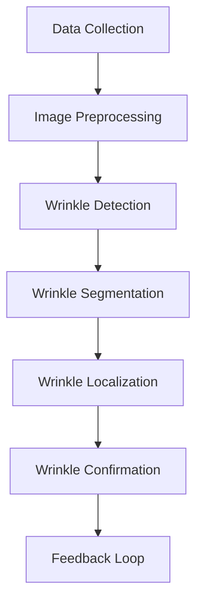
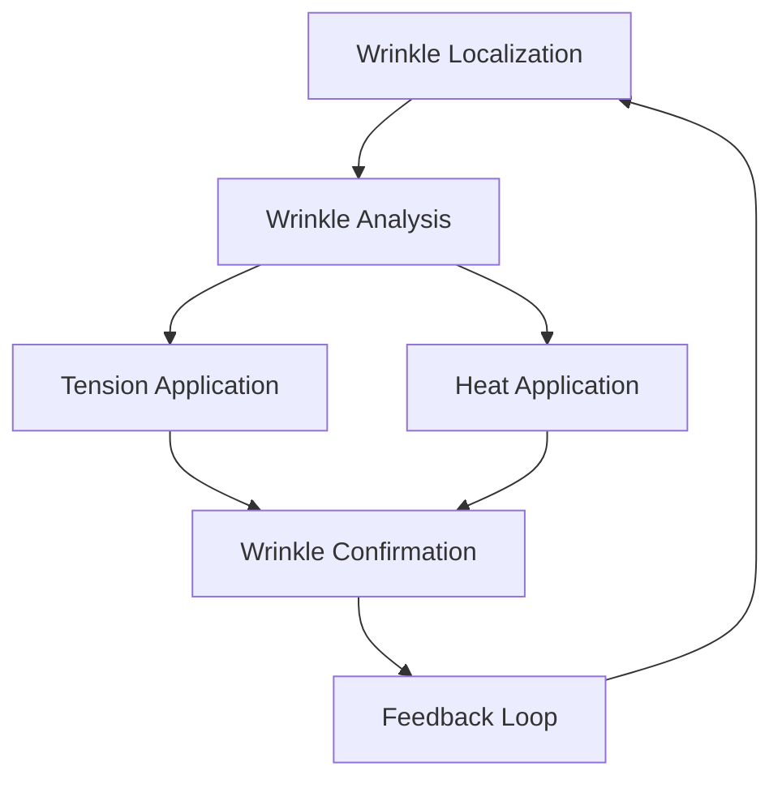

                 

### AI Agent in Smart Hangers: A Deep Dive

#### **1.1. The Concept of AI Agents**

Artificial Intelligence (AI) agents are entities that perceive their environment through sensors and take actions based on their understanding of that environment to achieve specific goals. These agents are the backbone of machine learning and autonomous systems, enabling computers to perform tasks that would typically require human intelligence. AI agents can be found in various applications, from virtual assistants like Siri and Alexa to autonomous vehicles and recommendation systems.

In the realm of smart hangers, an AI agent is a software system that processes data from various sources (e.g., sensors, cameras) to detect and remove wrinkles on garments. This is achieved through a combination of machine learning algorithms, computer vision, and control systems.

#### **1.2. Importance of Wrinkle Removal in Smart Hangers**

Wrinkles on garments are not just an aesthetic issue but can also affect the comfort and lifespan of the clothing. Traditional methods of wrinkle removal, such as ironing or hanging clothes in a specific way, are often time-consuming and labor-intensive. Smart hangers equipped with AI agents can automate this process, providing a convenient and efficient solution for both consumers and commercial establishments like hotels and laundries.

#### **1.3. How AI Agents Work in Smart Hangers**

AI agents in smart hangers work by following a series of steps:

1. **Data Collection**: The AI agent collects data from various sensors, including cameras and force sensors. The camera captures images of the garments to detect wrinkles, while the force sensors measure the tension applied to the fabric.

2. **Wrinkle Detection**: Using machine learning algorithms, the AI agent analyzes the collected data to identify wrinkles. This involves processing the images and extracting relevant features that indicate the presence of wrinkles.

3. **Wrinkle Removal**: Once the wrinkles are detected, the AI agent activates the hanger's mechanism to apply the necessary tension and straighten the fabric. This could involve mechanical adjustments or heat application, depending on the design of the smart hanger.

4. **Feedback Loop**: After the wrinkle removal process, the AI agent assesses the results and adjusts its strategy if needed. This feedback loop ensures continuous improvement and efficiency over time.

#### **1.4. Key Technologies in AI Agents for Wrinkle Removal**

Several key technologies are used in the development and implementation of AI agents for wrinkle removal:

1. **Computer Vision**: Computer vision algorithms enable the AI agent to analyze and interpret visual data from the camera. Techniques such as image recognition and feature extraction are essential for accurately detecting wrinkles.

2. **Machine Learning**: Machine learning algorithms, particularly deep learning models like Convolutional Neural Networks (CNNs), are used to train the AI agent to recognize and classify different types of wrinkles. This involves a large amount of labeled training data and iterative optimization of the model.

3. **Control Systems**: Control systems are crucial for the mechanical or thermal operations of the smart hanger. These systems ensure that the tension or heat applied to the garments is within safe and effective limits.

4. **Sensor Integration**: The integration of various sensors, such as cameras and force sensors, is vital for collecting comprehensive data on the state of the garments. This data is used by the AI agent to make informed decisions.

#### **1.5. Challenges and Opportunities**

The development of AI agents for wrinkle removal in smart hangers comes with several challenges. One of the primary challenges is achieving high accuracy in wrinkle detection. This requires sophisticated algorithms and large datasets for training. Additionally, ensuring the durability and reliability of the mechanical or thermal components in the smart hangers is crucial.

However, the potential benefits of AI-powered wrinkle removal are significant. It offers a convenient and efficient solution for managing garments, reducing the need for manual intervention, and improving the overall quality of garments. This has the potential to disrupt traditional laundry and garment care practices, opening up new markets and applications for smart hangers.

In conclusion, the integration of AI agents in smart hangers represents a transformative advancement in the world of clothing care. By understanding the concepts and technologies behind these agents, we can better appreciate their potential and the challenges that lie ahead. In the following sections, we will delve deeper into the specific techniques and methodologies used in AI agents for wrinkle removal, providing a comprehensive overview of this innovative technology.

---

#### **1.6. Conclusion**

In this introductory section, we have explored the concept of AI agents and their significance in the context of smart hangers. We discussed the importance of wrinkle removal and how AI agents work to detect and eliminate wrinkles on garments. Additionally, we highlighted the key technologies involved and the challenges and opportunities that come with this innovative approach. As we move forward, we will delve deeper into the technical details, methodologies, and practical applications of AI agents in smart hangers, providing a comprehensive understanding of this exciting field. Stay tuned for our next section, where we will discuss the fundamental concepts of AI agents in more detail.

---

### **Fundamental Concepts of AI Agents**

#### **2.1. Definition and Characteristics**

An AI agent is a computer program designed to perform tasks autonomously by perceiving its environment through sensors and acting upon it using actuators. The core characteristics of an AI agent include autonomy, interaction, learning, and adaptability. Autonomy refers to the agent's ability to make decisions and take actions independently. Interaction involves the agent's capability to exchange information with its environment through sensors and actuators. Learning is the process by which the agent improves its performance through experience, and adaptability allows the agent to respond to changes in its environment or goals.

In the context of smart hangers, an AI agent is responsible for perceiving the condition of garments (e.g., wrinkle detection), making decisions (e.g., applying tension or heat), and executing actions to remove wrinkles. This requires the agent to process data from various sensors, analyze it using machine learning algorithms, and control the hanger's mechanical or thermal mechanisms accordingly.

#### **2.2. Types of AI Agents**

There are several types of AI agents, classified based on their interaction with the environment and their level of autonomy. Here are some common types:

1. ** Reactive Agents**: These agents operate based solely on the current situation without any memory or learning capabilities. They are simple but effective for specific tasks, such as playing chess or solving puzzles.

2. **Model-Based Agents**: These agents maintain an internal model of the environment, allowing them to make more informed decisions. They use this model to predict future situations and plan their actions accordingly.

3. **Goal-Based Agents**: These agents have specific goals they aim to achieve and continuously work towards them. They adjust their actions based on their progress towards these goals and the feedback they receive from the environment.

4. **Learning Agents**: These agents improve their performance over time by learning from their experiences. They use machine learning algorithms to adjust their behavior based on past actions and outcomes.

5. **Social Agents**: These agents interact with other agents or humans in a collaborative or competitive environment, learning and adapting based on the social dynamics.

In smart hangers, a combination of reactive and learning agents is typically used. Reactive agents can quickly detect wrinkles, while learning agents continuously improve their wrinkle detection and removal capabilities by analyzing data from past experiences.

#### **2.3. AI Agent Architecture**

The architecture of an AI agent typically consists of several components:

1. **Sensors**: These are devices that collect data from the environment, such as cameras for visual input, force sensors for measuring tension, and temperature sensors for monitoring heat levels.

2. **Perception Module**: This module processes the data collected by the sensors and converts it into a form that can be understood by the agent's decision-making algorithms. For example, the perception module in a smart hanger might process image data to detect wrinkles.

3. **Decision-Making Module**: This module analyzes the data from the perception module and makes decisions based on the agent's goals and the current situation. In the case of a smart hanger, the decision-making module determines the appropriate tension or heat settings to remove wrinkles.

4. **Action Module**: This module executes the decisions made by the decision-making module. In a smart hanger, the action module might control the mechanical or thermal mechanisms to apply the necessary tension or heat to the garment.

5. **Memory and Learning Module**: This module stores the agent's past experiences and uses them to improve future performance. In a smart hanger, the learning module might adjust the algorithm's parameters based on previous wrinkle detection and removal attempts.

#### **2.4. AI Agent Development Process**

The development process for AI agents involves several steps, including:

1. **Define Goals and Scope**: Clearly define the goals and scope of the agent's tasks. For a smart hanger, this might involve determining the specific types of wrinkles to be detected and removed.

2. **Design Sensor and Actuator Systems**: Choose and design the appropriate sensors and actuators based on the agent's goals. For example, a camera and force sensors are essential for wrinkle detection.

3. **Collect and Prepare Training Data**: Gather a large dataset of images or other relevant data to train the agent's algorithms. This data should be labeled accurately to ensure the agent learns correctly.

4. **Develop and Train Perception and Decision-Making Algorithms**: Implement algorithms for perceiving and analyzing data and making decisions. Use machine learning techniques to train these algorithms on the collected data.

5. **Integrate and Test the Agent**: Integrate the various components of the agent and test its performance in a controlled environment. This involves validating the agent's ability to detect and remove wrinkles accurately.

6. **Iterate and Optimize**: Based on the test results, iterate and optimize the agent's algorithms and systems. This may involve adjusting parameters, refining the data collection process, or improving the hardware components.

#### **2.5. Conclusion**

In summary, AI agents are sophisticated computer programs designed to perform tasks autonomously in a given environment. They consist of several components, including sensors, perception modules, decision-making modules, action modules, and memory and learning modules. The development process for AI agents involves defining goals, designing sensor and actuator systems, collecting and preparing training data, developing and training algorithms, integrating and testing the agent, and iteratively optimizing its performance. Understanding these fundamental concepts is essential for developing effective AI agents for applications like smart hangers. In the next section, we will explore the role of AI agents in smart hangers in more detail.

---

### **The Role of AI Agents in Smart Hangers**

#### **3.1. Enhancing Garment Care**

One of the primary roles of AI agents in smart hangers is to enhance the care and maintenance of garments. Traditional methods of managing and storing clothes often involve manual tasks such as ironing, folding, and hanging, which are time-consuming and labor-intensive. AI agents automate these processes, making it easier for individuals and businesses to manage their clothing collections efficiently.

For example, an AI agent can detect wrinkles on garments as they are hung on the hanger and automatically adjust the tension to smooth out the wrinkles. This eliminates the need for manual ironing, saving time and effort. Additionally, the agent can monitor the condition of the garments over time, providing alerts if maintenance is needed, such as dry cleaning or washing.

#### **3.2. Improving Comfort and Durability**

Wrinkles can significantly affect the comfort and durability of garments. When fabrics are crumpled or creased, they can be uncomfortable to wear and may also cause long-term damage to the fabric's fibers. AI agents in smart hangers help maintain the optimal shape and condition of garments, ensuring they remain comfortable and durable.

By continuously detecting and removing wrinkles, the AI agent prevents the formation of permanent creases and minimizes wear and tear on the fabric. This can extend the lifespan of garments, reducing the need for frequent replacements and contributing to a more sustainable approach to clothing care.

#### **3.3. Enhancing Aesthetic Appeal**

The aesthetic appeal of garments is often compromised by wrinkles. AI agents in smart hangers address this issue by maintaining garments in their best condition. Wrinkle-free clothes look fresher, more attractive, and polished, enhancing their overall appearance.

This is particularly beneficial for individuals who value their image and want to maintain a professional or presentable appearance. For businesses, such as hotels and retail stores, maintaining clean and wrinkle-free garments can significantly improve their brand image and customer satisfaction.

#### **3.4. Supporting Smart Home Ecosystems**

AI agents in smart hangers are an integral part of the smart home ecosystem, contributing to the overall convenience and efficiency of the living environment. Smart hangers can be seamlessly integrated with other smart devices and systems in the home, such as smart locks, lighting systems, and climate control systems.

For example, an AI agent can communicate with the smart home's central system to adjust the lighting or climate settings based on the needs of the garments being hung. This ensures optimal conditions for wrinkle removal and garment maintenance, further enhancing the convenience and comfort of the living space.

#### **3.5. Practical Applications in Various Sectors**

The role of AI agents in smart hangers extends beyond personal use and has practical applications in various sectors. In the hospitality industry, hotels can offer guests a more luxurious experience by providing wrinkle-free garments in their rooms. In commercial laundries, smart hangers can streamline the drying and storage process, improving efficiency and reducing operational costs.

Retailers can use smart hangers in their stores to showcase garments in their best condition, enhancing the shopping experience for customers. Additionally, smart hangers can be utilized in industrial settings, such as clothing manufacturing plants, to ensure consistent quality and reduce waste.

#### **3.6. Conclusion**

In conclusion, AI agents play a vital role in smart hangers by enhancing garment care, improving comfort and durability, enhancing aesthetic appeal, supporting smart home ecosystems, and providing practical applications across various sectors. The integration of AI agents in smart hangers represents a transformative advancement in the world of clothing care, offering numerous benefits to consumers and businesses alike. As we continue to explore and develop AI technologies, the potential for further innovation and improvement in smart hangers is vast. Stay tuned for our next section, where we will delve deeper into the specific algorithms and techniques used in AI agents for wrinkle removal.

---

### **Introduction to Smart Hangers**

#### **4.1. Definition and Basic Functionality**

Smart hangers are advanced devices designed to optimize the care and storage of garments through the integration of artificial intelligence, sensors, and connectivity. Unlike traditional hangers, which are primarily used for hanging clothes, smart hangers offer a range of additional functionalities that enhance the overall clothing management experience.

The basic functionality of a smart hanger includes hanging garments securely, detecting and removing wrinkles, monitoring garment conditions, and providing feedback to the user. These functionalities are enabled by a combination of hardware and software components, including sensors, actuators, and connectivity modules.

#### **4.2. Types of Smart Hangers**

There are several types of smart hangers, each designed to cater to specific needs and environments. Here are some common types:

1. **Wrinkle-Removal Smart Hangers**: These hangers are equipped with AI agents that detect and remove wrinkles using various techniques such as mechanical tension, heat, or a combination of both. They are particularly useful for individuals who prefer wrinkle-free garments and for commercial establishments that require consistently neat clothing.

2. **Smart Garment Hangers with Sensors**: These hangers are equipped with sensors that monitor the condition of garments, such as moisture levels, fabric tension, and temperature. They can provide real-time feedback to the user about the garment's state and offer recommendations for maintenance.

3. **Wireless Charging Smart Hangers**: These hangers are designed for items that can be charged wirelessly, such as smartwatches or smartphones. They often come with a built-in charging pad that can be used to keep these devices charged while they are being hung.

4. **Smart Hangers with Connectivity**: These hangers are connected to the internet and can be controlled remotely through mobile apps. They allow users to manage their clothing remotely, receive notifications about garment conditions, and even integrate with other smart home devices.

5. **Smart Hangers for Commercial Use**: These hangers are designed for use in commercial environments, such as hotels, laundries, and retail stores. They often come with additional features like bulk storage, automatic folding, and remote monitoring to improve efficiency and reduce operational costs.

#### **4.3. The Problem of Clothing Wrinkles**

Wrinkles are a common issue with garments, caused by a variety of factors including folding, bending, and hanging. Wrinkles can not only affect the appearance of clothes but also reduce their comfort and longevity. Traditional methods of wrinkle removal, such as ironing or hanging clothes in a specific way, are often time-consuming and labor-intensive.

The problem of clothing wrinkles is particularly significant in commercial settings where a large number of garments need to be kept wrinkle-free for aesthetic and practical reasons. For individual consumers, maintaining a wardrobe free of wrinkles can be a challenge, especially when dealing with busy schedules or limited access to ironing facilities.

#### **4.4. How Smart Hangers Address the Problem of Wrinkles**

Smart hangers address the problem of wrinkles by incorporating advanced technologies such as artificial intelligence, sensors, and connectivity. Here are some ways in which smart hangers can help eliminate wrinkles:

1. **AI-Enabled Wrinkle Detection and Removal**: Many smart hangers are equipped with AI agents that can detect wrinkles on garments using computer vision techniques. Once detected, the AI agent can activate the hanger's mechanisms to apply the necessary tension or heat to smooth out the wrinkles.

2. **Sensors for Continuous Monitoring**: Smart hangers often include sensors that continuously monitor the condition of the garments. These sensors can detect changes in tension, temperature, and moisture levels, triggering actions to prevent the formation of wrinkles.

3. **Automated Wrinkle Removal**: Some smart hangers have automated systems that can apply mechanical tension or heat to remove wrinkles without any manual intervention. This makes it easy for users to maintain wrinkle-free garments without the need for ironing.

4. **User-Friendly Interfaces**: Many smart hangers come with mobile apps that allow users to monitor and control their hangers remotely. These apps can provide real-time feedback on the condition of garments and offer recommendations for maintenance.

5. **Integration with Smart Home Systems**: Smart hangers can be integrated with smart home ecosystems, allowing users to automate various aspects of garment care. For example, they can be programmed to adjust their settings based on the weather or the user's schedule.

#### **4.5. Conclusion**

In conclusion, smart hangers offer a convenient and innovative solution to the problem of clothing wrinkles. By integrating artificial intelligence, sensors, and connectivity, these devices can detect and remove wrinkles automatically, improving the appearance and longevity of garments. The various types of smart hangers cater to different needs and environments, making them a valuable addition to both personal wardrobes and commercial settings. In the next section, we will delve deeper into the algorithms and techniques used in smart hangers to detect and remove wrinkles, providing a more detailed understanding of this technology.

---

### **AI Agent Concepts and Applications in Smart Hangers**

#### **5.1. Overview of AI Agent Concepts**

Artificial Intelligence (AI) agents are computational entities designed to perform specific tasks autonomously. These agents are based on the principles of machine learning, computer vision, and control systems. The core concepts of AI agents include perception, decision-making, and action. In the context of smart hangers, an AI agent's primary task is to detect and remove wrinkles on garments.

1. **Perception**: The AI agent perceives the environment through various sensors, such as cameras and force sensors. The camera captures images of the garments, while the force sensors measure the tension and conditions of the fabric.

2. **Decision-Making**: Based on the data collected from sensors, the AI agent uses machine learning algorithms to analyze and make decisions. These decisions are focused on identifying wrinkles and determining the appropriate actions to remove them.

3. **Action**: The AI agent executes the decisions made by the decision-making module. This could involve adjusting the mechanical tension or applying heat to the garments to remove wrinkles.

#### **5.2. Machine Learning Algorithms for Wrinkle Detection**

Machine learning algorithms are at the heart of AI agents in smart hangers. These algorithms enable the agent to learn from data and improve its performance over time. The choice of machine learning algorithm depends on the specific task and the nature of the data.

1. **Convolutional Neural Networks (CNNs)**: CNNs are a type of deep learning model commonly used for image recognition tasks. They are particularly effective in detecting wrinkles in garment images due to their ability to capture spatial hierarchies in data. A typical CNN architecture for wrinkle detection in smart hangers includes convolutional layers, pooling layers, and fully connected layers.

2. **Support Vector Machines (SVMs)**: SVMs are a type of supervised learning algorithm used for classification tasks. They can be used to classify garment images into wrinkle and non-wrinkle categories based on extracted features. SVMs are known for their efficiency and effectiveness in high-dimensional spaces.

3. **Random Forests**: Random Forests are an ensemble learning method that combines multiple decision trees to make predictions. They can be used to classify images and predict the presence of wrinkles by analyzing various features extracted from the images.

#### **5.3. Application Scenarios of AI Agents in Smart Hangers**

AI agents in smart hangers have various application scenarios, ranging from personal use to commercial environments. Here are some examples:

1. **Personal Use**: In a home setting, an AI agent can continuously monitor the condition of garments hanging in the closet. It can detect wrinkles and automatically adjust the hanger to remove them. This ensures that clothes remain wrinkle-free, improving their appearance and longevity.

2. **Smart Hotels**: In hotels, smart hangers can be used to maintain the cleanliness and neatness of guest rooms. The AI agent can detect wrinkles on garments left by guests and automatically send them to the laundry or ironing room for maintenance. This improves the overall guest experience and reduces the workload for hotel staff.

3. **Retail Stores**: Retail stores can use smart hangers to showcase garments in their best condition. The AI agent can detect wrinkles on display items and automatically adjust the hangers to remove them. This enhances the visual appeal of the store and encourages customer purchases.

4. **Laundries and Dry Cleaners**: In commercial laundries and dry cleaners, smart hangers can automate the process of garment handling. The AI agent can detect wrinkles and ensure that garments are delivered to customers in pristine condition. This improves efficiency and customer satisfaction.

#### **5.4. Integration of AI Agents in Smart Hangers**

The integration of AI agents in smart hangers involves several steps, including:

1. **Sensor Integration**: The AI agent relies on various sensors to collect data on garment conditions. These sensors include cameras for visual data, force sensors for tension measurements, and temperature sensors for monitoring heat levels.

2. **Data Processing**: The collected data is processed by the AI agent using machine learning algorithms. This involves extracting features from the data and training the agent to recognize patterns associated with wrinkles.

3. **Decision-Making and Action**: Based on the processed data, the AI agent makes decisions on how to remove wrinkles. This could involve adjusting the mechanical tension or applying heat. The agent then executes these actions using the hanger's mechanical or thermal systems.

4. **Feedback Loop**: After executing the actions, the AI agent assesses the results and adjusts its strategy if needed. This feedback loop ensures continuous improvement and optimization of the wrinkle removal process.

#### **5.5. Conclusion**

In conclusion, AI agents are integral to the functionality of smart hangers. By leveraging machine learning algorithms and sensor technologies, these agents can detect and remove wrinkles on garments, enhancing their appearance and longevity. The application scenarios of AI agents in smart hangers are diverse, ranging from personal use to commercial environments. As AI technologies continue to evolve, the capabilities of smart hangers will only improve, offering even greater convenience and efficiency in garment care.

In the next section, we will delve deeper into the techniques and methodologies used for wrinkle detection in smart hangers, providing a more detailed understanding of this critical process.

---

### **Wrinkle Detection Techniques in Smart Hangers**

#### **6.1. Overview of Wrinkle Detection Techniques**

Detecting wrinkles on garments is a crucial function of smart hangers, enabling them to provide optimal care and maintenance. Various techniques can be employed for wrinkle detection, each with its own advantages and limitations. In this section, we will discuss the most common techniques used in smart hangers, including image processing, feature extraction, and performance evaluation metrics.

#### **6.2. Image Processing Techniques**

Image processing techniques form the foundation of wrinkle detection in smart hangers. These techniques involve manipulating and analyzing visual data captured by cameras to identify and locate wrinkles on garments. Here are some key image processing techniques used for wrinkle detection:

1. **Image Preprocessing**: Before analyzing the image data, it is essential to preprocess the images to enhance their quality and remove any noise or distortions. Common preprocessing techniques include image resizing, grayscale conversion, and noise reduction.

2. **Wrinkle Detection Algorithms**: Several algorithms can be used to detect wrinkles in garment images. Some popular algorithms include:

   - **Edge Detection**: Edge detection algorithms, such as Canny, Sobel, and Prewitt, identify edges in the image, which often correspond to the boundaries of wrinkles. These algorithms can be used to create a binary image that highlights potential wrinkle regions.
   
   - **Hough Transform**: The Hough Transform is a technique used to detect lines in an image. By applying the Hough Transform to the edge-detected image, it is possible to identify the straight lines that often indicate horizontal or vertical wrinkles.
   
   - **Template Matching**: Template matching involves comparing the garment image with a template image of a wrinkle. The algorithm searches for the best match between the two images, indicating the presence of a wrinkle.

3. **Wrinkle Segmentation**: Once potential wrinkle regions are identified, the next step is to segment these regions from the rest of the garment. This can be achieved using techniques such as thresholding, region growing, or graph-based segmentation.

#### **6.3. Feature Extraction Methods**

Feature extraction is a critical step in wrinkle detection, as it involves identifying and extracting relevant characteristics from the garment image that can be used to distinguish between wrinkle and non-wrinkle regions. Here are some common feature extraction methods:

1. **Textural Features**: Textural features describe the texture of the garment's surface, such as homogeneity, contrast, and complexity. These features can be extracted using techniques like Gray-Level Co-occurrence Matrix (GLCM), Local Binary Patterns (LBP), and Histogram of Oriented Gradients (HOG).

2. **Geometric Features**: Geometric features capture the shape and structure of the garment, such as edge lengths, angles, and curvature. These features can be extracted using techniques like Fourier Descriptors and Contour Approximation.

3. **Intensity Features**: Intensity features describe the pixel intensity values in the garment image. These features can be extracted using techniques like Histogram Equalization and Pixel Intensity Histogram.

4. **Combination of Features**: Combining multiple features can improve the accuracy of wrinkle detection. Techniques like bag-of-words models and bag-of-features models are used to represent the garment image as a collection of visual words or features.

#### **6.4. Performance Evaluation Metrics**

The performance of a wrinkle detection system in smart hangers is critical, and it is essential to evaluate its accuracy and effectiveness. Several performance evaluation metrics can be used to assess the performance of the system:

1. **Accuracy**: Accuracy measures the proportion of correctly detected wrinkles out of the total number of wrinkles in the dataset. It is calculated as:

   $$ Accuracy = \frac{TP + TN}{TP + TN + FP + FN} $$

   where TP is the number of true positives (correctly detected wrinkles), TN is the number of true negatives (correctly detected non-wrinkles), FP is the number of false positives (incorrectly detected wrinkles), and FN is the number of false negatives (incorrectly detected non-wrinkles).

2. **Recall**: Recall (also known as sensitivity) measures the proportion of true positives out of the total number of actual wrinkles. It is calculated as:

   $$ Recall = \frac{TP}{TP + FN} $$

3. **Precision**: Precision measures the proportion of true positives out of the total number of detected wrinkles. It is calculated as:

   $$ Precision = \frac{TP}{TP + FP} $$

4. **F1 Score**: The F1 score is the harmonic mean of precision and recall, providing a balanced measure of the system's performance. It is calculated as:

   $$ F1 Score = 2 \times \frac{Precision \times Recall}{Precision + Recall} $$

5. **Intersection over Union (IoU)**: IoU measures the overlap between the detected wrinkle regions and the ground truth regions. It is calculated as:

   $$ IoU = \frac{Intersection}{Union} $$

   where Intersection is the area of overlap between the detected and ground truth regions, and Union is the total area of both regions.

#### **6.5. Conclusion**

In conclusion, wrinkle detection in smart hangers involves a combination of image processing techniques, feature extraction methods, and performance evaluation metrics. These techniques and metrics are crucial for developing an effective and accurate wrinkle detection system that can enhance the functionality of smart hangers. In the next section, we will discuss the design and implementation of AI agents for wrinkle detection in smart hangers, exploring the challenges and solutions associated with this process.

---

### **Design and Implementation of AI Agents for Wrinkle Detection**

#### **7.1. Design Principles of AI Agents**

The design of AI agents for wrinkle detection in smart hangers involves several key principles, aimed at ensuring the agent's efficiency, accuracy, and reliability. Here are the main design principles:

1. **Modularity**: The AI agent should be modular, with distinct components for perception, decision-making, and action. This allows for easier maintenance, scalability, and the ability to integrate new features in the future.

2. **Scalability**: The design should be scalable to handle different types of garments, sizes, and environments. This involves using generalizable algorithms and techniques that can adapt to various scenarios.

3. **Accuracy and Precision**: The AI agent should prioritize high accuracy and precision in wrinkle detection. This requires robust algorithms, well-labeled training data, and continuous optimization.

4. **User-Friendly Interface**: The agent should provide a user-friendly interface for interacting with the smart hanger, allowing users to configure settings, monitor detection results, and receive feedback.

5. **Real-Time Processing**: The AI agent should be capable of real-time processing, ensuring that wrinkles are detected and corrected as quickly as possible to maintain the optimal condition of the garments.

#### **7.2. Steps in AI Agent Implementation**

The implementation of an AI agent for wrinkle detection in smart hangers involves several critical steps. Here is a detailed overview of each step:

1. **Define the Problem**: Clearly define the problem statement, including the types of wrinkles to be detected and the desired accuracy and precision.

2. **Select Sensors and Actuators**: Choose appropriate sensors and actuators for the smart hanger. Common sensors include cameras for visual input and force sensors for measuring tension. Actuators might include mechanical or thermal systems for wrinkle removal.

3. **Collect and Prepare Training Data**: Gather a large dataset of garment images containing various types of wrinkles. The dataset should be diverse and representative of real-world scenarios. Label the images accurately, indicating the presence and location of wrinkles.

4. **Design and Train Perception Models**: Design and train perception models using machine learning algorithms. Convolutional Neural Networks (CNNs) are commonly used for this purpose due to their effectiveness in image recognition tasks. The trained model should be able to accurately identify and locate wrinkles in garment images.

5. **Develop Decision-Making Algorithms**: Develop algorithms for decision-making based on the output of the perception models. This involves analyzing the detected wrinkles and determining the appropriate actions to remove them. This could include adjusting the mechanical tension or applying heat.

6. **Implement Action Systems**: Implement the action systems that execute the decisions made by the AI agent. This could involve controlling mechanical or thermal actuators to remove wrinkles. Ensure that the action systems are safe and do not damage the garments.

7. **Integrate and Test the Agent**: Integrate the perception, decision-making, and action systems into a cohesive AI agent. Test the agent in various scenarios to ensure its accuracy, efficiency, and reliability.

8. **Iterate and Optimize**: Based on test results, iterate and optimize the AI agent. This may involve refining the machine learning models, adjusting parameters, or improving the hardware components. Continuous improvement is essential for maintaining high performance over time.

#### **7.3. Challenges and Solutions in Implementation**

The implementation of AI agents for wrinkle detection in smart hangers comes with several challenges. Here are some common challenges and potential solutions:

1. **Data Quality**: Accurate and diverse training data is crucial for the performance of machine learning models. Challenges include collecting large amounts of labeled data and ensuring its quality. Solutions include using data augmentation techniques, crowdsourcing labeling tasks, and leveraging transfer learning from pre-trained models.

2. **Model Generalization**: The AI agent should be able to generalize to different types of garments and environments. This can be challenging due to the diversity in garment fabrics and the variability in lighting conditions. Solutions include using robust machine learning algorithms, incorporating domain adaptation techniques, and continuously updating the model with new data.

3. **Real-Time Processing**: Ensuring real-time processing is a challenge due to the computational demands of perception and decision-making. Solutions include optimizing the algorithms for efficiency, using parallel processing techniques, and leveraging specialized hardware like GPUs or FPGAs.

4. **Safety and Durability**: The mechanical and thermal systems used for wrinkle removal must be safe and durable. Ensuring the longevity of these systems and preventing damage to garments requires careful design and rigorous testing.

5. **User Experience**: The AI agent should provide a seamless and intuitive user experience. Challenges include ensuring the agent is easy to configure and understand, and providing clear feedback to the user. Solutions include designing a user-friendly interface and offering detailed usage instructions.

#### **7.4. Conclusion**

In conclusion, the design and implementation of AI agents for wrinkle detection in smart hangers involve several critical steps and considerations. By adhering to design principles and addressing the challenges associated with implementation, it is possible to develop an effective and reliable AI agent that enhances the functionality and convenience of smart hangers. In the next section, we will delve into the specific algorithms and techniques used in wrinkle removal, providing a deeper understanding of this crucial aspect of smart hanger technology.

---

### **Wrinkle Detection Algorithm**

#### **8.1. Introduction to Wrinkle Detection Algorithm**

The wrinkle detection algorithm is a core component of AI agents in smart hangers, responsible for identifying and localizing wrinkles on garments. This algorithm is typically implemented using a combination of image processing techniques and machine learning algorithms. The goal of the wrinkle detection algorithm is to accurately and efficiently detect wrinkles, ensuring that the garments are in optimal condition. This section provides a detailed explanation of the steps involved in the wrinkle detection algorithm, including the use of Mermaid flowcharts to visualize the process.

#### **8.2. Step-by-Step Explanation of the Wrinkle Detection Algorithm**

1. **Data Collection**: The first step in the wrinkle detection algorithm is to collect data from the camera mounted on the smart hanger. The camera captures images of the garments hanging on the hanger. This data serves as the input for the subsequent steps of the algorithm.

   ```mermaid
   graph TD
   A[Data Collection] --> B[Image Preprocessing]
   ```

2. **Image Preprocessing**: The captured images are preprocessed to enhance their quality and remove any noise or distortions that may affect the accuracy of the wrinkle detection. Common preprocessing steps include resizing the image, converting it to grayscale, and applying filters to reduce noise.

   ```mermaid
   graph TD
   B[Image Preprocessing] --> C[Wrinkle Detection]
   ```

3. **Wrinkle Detection**: The core of the wrinkle detection algorithm involves analyzing the preprocessed images to identify and locate wrinkles. This step typically involves the following sub-steps:

   - **Edge Detection**: Apply edge detection algorithms (e.g., Canny, Sobel) to the grayscale image to identify edges that correspond to the boundaries of wrinkles.
   
   - **Wrinkle Segmentation**: Segment the detected edges to isolate the regions corresponding to wrinkles. This can be achieved using techniques such as thresholding, region growing, or graph-based segmentation.
   
   - **Wrinkle Localization**: Identify the spatial positions of the detected wrinkles in the image. This step is crucial for determining the exact locations where the hanger needs to apply tension or heat to remove the wrinkles.

   ```mermaid
   graph TD
   C[Wrinkle Detection] --> D[Wrinkle Segmentation]
   D[Wrinkle Segmentation] --> E[Wrinkle Localization]
   ```

4. **Wrinkle Confirmation**: After localizing the wrinkles, it is important to confirm their presence by analyzing the characteristics of the segmented regions. This step can help reduce false positives and improve the overall accuracy of the algorithm.

   ```mermaid
   graph TD
   E[Wrinkle Localization] --> F[Wrinkle Confirmation]
   ```

5. **Feedback Loop**: The final step in the wrinkle detection algorithm involves feeding the confirmed wrinkle locations back to the AI agent for further processing. This feedback loop ensures continuous improvement and optimization of the detection process.

   ```mermaid
   graph TD
   F[Wrinkle Confirmation] --> G[Feedback Loop]
   ```

#### **8.3. Mermaid Flowchart of the Wrinkle Detection Algorithm**

The following Mermaid flowchart visualizes the step-by-step process of the wrinkle detection algorithm:



This flowchart provides a clear and concise representation of the wrinkle detection process, making it easier to understand and implement the algorithm in smart hangers.

#### **8.4. Example with Python Code**

To illustrate the wrinkle detection algorithm, let's consider a simple example using Python and the OpenCV library. The following code demonstrates the key steps involved in the algorithm:

```python
import cv2
import numpy as np

# Load the garment image
image = cv2.imread('garment.jpg')

# Convert the image to grayscale
gray = cv2.cvtColor(image, cv2.COLOR_BGR2GRAY)

# Apply Gaussian blur to reduce noise
blurred = cv2.GaussianBlur(gray, (5, 5), 0)

# Apply Canny edge detection
edges = cv2.Canny(blurred, 50, 150)

# Apply thresholding to segment the edges
_, thresh = cv2.threshold(edges, 128, 255, cv2.THRESH_BINARY_INV + cv2.THRESH_OTSU)

# Use contour detection to find the edges
cnts = cv2.findContours(thresh, cv2.RETR_EXTERNAL, cv2.CHAIN_APPROX_SIMPLE)
cnts = cnts[0] if len(cnts) == 2 else cnts[1]

# Draw the contours on the original image
cv2.drawContours(image, cnts, -1, (0, 255, 0), 3)

# Display the original and edge-detected images
cv2.imshow('Original Image', image)
cv2.imshow('Edge Detection', edges)
cv2.imshow('Thresholded Image', thresh)
cv2.waitKey(0)
cv2.destroyAllWindows()
```

This code loads an image of a garment, converts it to grayscale, applies Gaussian blur to reduce noise, performs Canny edge detection, and then segments the edges using thresholding. Finally, it uses contour detection to identify the boundaries of wrinkles and displays the results.

#### **8.5. Conclusion**

In conclusion, the wrinkle detection algorithm is a critical component of AI agents in smart hangers. By following a series of steps, including image preprocessing, edge detection, segmentation, and localization, the algorithm accurately identifies and confirms the presence of wrinkles on garments. The use of Mermaid flowcharts and Python code provides a clear and practical understanding of the algorithm, enabling developers to implement and optimize it for smart hanger systems. In the next section, we will delve into the wrinkle removal algorithm, discussing its principles, implementation, and optimization.

---

### **Wrinkle Removal Algorithm**

#### **9.1. Introduction to Wrinkle Removal Algorithm**

The wrinkle removal algorithm is an essential component of smart hangers, responsible for eliminating detected wrinkles on garments. This algorithm leverages various techniques to apply appropriate tension or heat to the fabric, restoring it to its original, wrinkle-free state. In this section, we will explore the principles and implementation of the wrinkle removal algorithm, using Mermaid flowcharts and Python code to illustrate the process.

#### **9.2. Principles of Wrinkle Removal Algorithm**

The wrinkle removal algorithm operates based on several fundamental principles:

1. **Wrinkle Localization**: The algorithm first locates the wrinkles on the garment using the wrinkle detection algorithm. This involves identifying the regions of the fabric that exhibit distortions or creases.

2. **Wrinkle Analysis**: Once the wrinkles are localized, the algorithm analyzes the type and severity of the wrinkles. This step is crucial for determining the appropriate approach for wrinkle removal.

3. **Tension and Heat Application**: Depending on the type of wrinkle and the fabric material, the algorithm applies either mechanical tension or heat to remove the wrinkles. Mechanical tension involves adjusting the hanger's mechanism to stretch the fabric, while heat application may involve using a heating element to soften the fabric and smooth out the creases.

4. **Feedback and Adjustment**: After the tension or heat is applied, the algorithm assesses the effectiveness of the wrinkle removal process. If necessary, it makes adjustments to ensure that the wrinkles are fully removed. This step may involve iterative application of tension or heat until the desired result is achieved.

#### **9.3. Step-by-Step Explanation of the Wrinkle Removal Algorithm**

1. **Wrinkle Localization**: The first step in the wrinkle removal algorithm is to localize the wrinkles on the garment using the output of the wrinkle detection algorithm. This involves identifying the coordinates and boundaries of the wrinkle regions.

   ```mermaid
   graph TD
   A[Wrinkle Localization] --> B[Wrinkle Analysis]
   ```

2. **Wrinkle Analysis**: The next step involves analyzing the detected wrinkles to determine the appropriate method for removal. This step considers factors such as the type of fabric, the severity of the wrinkles, and the overall condition of the garment.

   ```mermaid
   B[Wrinkle Analysis] --> C[Tension Application]
   B --> D[Heat Application]
   ```

3. **Tension Application**: If mechanical tension is deemed appropriate, the algorithm adjusts the hanger's mechanism to apply tension to the fabric. This step involves calculating the optimal tension levels and activating the mechanical actuators to apply the tension.

   ```mermaid
   C[Tension Application] --> E[Wrinkle Confirmation]
   ```

4. **Heat Application**: If heat is the preferred method, the algorithm activates the heating elements to apply heat to the fabric. This step involves controlling the temperature and duration of the heat application to ensure effective wrinkle removal without damaging the fabric.

   ```mermaid
   D[Heat Application] --> E[Wrinkle Confirmation]
   ```

5. **Wrinkle Confirmation**: After applying tension or heat, the algorithm confirms the removal of the wrinkles by reanalyzing the garment using the wrinkle detection algorithm. If wrinkles are still present, the algorithm iterates the process, adjusting the tension or heat levels as needed.

   ```mermaid
   E[Wrinkle Confirmation] --> F[Feedback Loop]
   ```

6. **Feedback and Adjustment**: The final step involves feeding the confirmation results back to the algorithm for further adjustment. This may involve fine-tuning the tension or heat settings, or reanalyzing the garment to detect any remaining wrinkles.

   ```mermaid
   F[Feedback Loop] --> A[Wrinkle Localization]
   ```

#### **9.4. Mermaid Flowchart of the Wrinkle Removal Algorithm**

The following Mermaid flowchart visualizes the step-by-step process of the wrinkle removal algorithm:



#### **9.5. Example with Python Code**

To demonstrate the wrinkle removal algorithm, let's consider a simple example using Python and the OpenCV library. The following code illustrates the process of applying mechanical tension to remove wrinkles from a garment:

```python
import cv2
import numpy as np

# Load the garment image
image = cv2.imread('garment_with_wrinkles.jpg')

# Convert the image to grayscale
gray = cv2.cvtColor(image, cv2.COLOR_BGR2GRAY)

# Apply Gaussian blur to reduce noise
blurred = cv2.GaussianBlur(gray, (5, 5), 0)

# Apply Canny edge detection
edges = cv2.Canny(blurred, 50, 150)

# Apply thresholding to segment the edges
_, thresh = cv2.threshold(edges, 128, 255, cv2.THRESH_BINARY_INV + cv2.THRESH_OTSU)

# Use contour detection to find the edges
cnts = cv2.findContours(thresh, cv2.RETR_EXTERNAL, cv2.CHAIN_APPROX_SIMPLE)
cnts = cnts[0] if len(cnts) == 2 else cnts[1]

# Draw the contours on the original image
cv2.drawContours(image, cnts, -1, (0, 255, 0), 3)

# Calculate the bounding rectangles for each contour
rects = [cv2.boundingRect(c) for c in cnts]

# Apply tension to the detected wrinkles
for rect in rects:
    x, y, w, h = rect
    # Calculate the new width and height to apply tension
    new_w = w * 1.1  # Increase the width by 10%
    new_h = h * 1.1  # Increase the height by 10%
    # Resize the region to apply tension
    cropped = image[y:y+h, x:x+w]
    resized = cv2.resize(cropped, (int(new_w), int(new_h)))
    image[y:y+h, x:x+w] = resized

# Display the image with applied tension
cv2.imshow('Image with Applied Tension', image)
cv2.waitKey(0)
cv2.destroyAllWindows()
```

This code loads an image of a garment with wrinkles, applies Canny edge detection and thresholding to segment the wrinkles, and then calculates the bounding rectangles for each wrinkle. It then applies tension by resizing the regions to increase their width and height by 10%. Finally, it displays the image with the applied tension.

#### **9.6. Conclusion**

In conclusion, the wrinkle removal algorithm is a critical component of smart hangers, responsible for eliminating detected wrinkles on garments. By following a series of steps, including wrinkle localization, analysis, tension or heat application, and confirmation, the algorithm effectively removes wrinkles, improving the appearance and condition of the garments. The use of Mermaid flowcharts and Python code provides a clear and practical understanding of the algorithm, enabling developers to implement and optimize it for smart hanger systems. In the next section, we will explore the integration of detection and removal algorithms in smart hangers, discussing the integration process and optimization techniques.

---

### **Integration of Detection and Removal Algorithms in Smart Hangers**

#### **10.1. Combining Detection and Removal Algorithms**

The integration of the wrinkle detection and removal algorithms is a critical aspect of smart hangers. This integration involves combining the outputs of the detection algorithm, which identifies wrinkles, with the actions of the removal algorithm, which addresses the detected wrinkles. The goal is to create a seamless process that ensures garments are consistently kept in optimal condition. Here's how the integration works:

1. **Detection and Feedback Loop**: The detection algorithm continually scans the garments for wrinkles, using computer vision techniques to identify them. The output of this algorithm is a set of coordinates and properties related to each detected wrinkle.

2. **Removal Algorithm Trigger**: When a wrinkle is detected, the removal algorithm is triggered. It receives the feedback from the detection algorithm, including the location and type of the wrinkle.

3. **Action Planning**: The removal algorithm analyzes the feedback and plans the appropriate actions. This could involve mechanical tension adjustment, heat application, or a combination of both, depending on the type and severity of the wrinkles.

4. **Execution and Confirmation**: The removal algorithm executes the planned actions and confirms the effectiveness of the wrinkle removal. It may involve multiple iterations to ensure that all wrinkles are addressed.

5. **Optimization**: The system continuously optimizes the detection and removal processes based on the feedback received from each iteration. This optimization may involve adjusting parameters, refining algorithms, or improving hardware components.

#### **10.2. Implementation and Optimization**

The implementation of the integrated detection and removal algorithms involves several steps:

1. **Synchronization**: Ensuring that the detection and removal algorithms work in synchronization is crucial. This involves precise timing and coordination between the two algorithms to ensure that the removal actions are executed promptly after detection.

2. **Parallel Processing**: To enhance efficiency, the algorithms can be implemented using parallel processing techniques. This involves distributing the computational tasks across multiple processors or GPUs, allowing for faster execution.

3. **Machine Learning Model Training**: Continuous training of the machine learning models used in the detection algorithm is essential. This involves updating the models with new data to improve their accuracy and adaptability to different wrinkle types and fabric materials.

4. **Hardware Optimization**: The hardware components used in the detection and removal processes should be optimized for performance. This includes using high-resolution cameras, fast sensors, and efficient actuators to ensure quick and accurate responses.

5. **Feedback Mechanism**: A robust feedback mechanism is essential for the continuous improvement of the algorithms. This involves collecting data on the performance of the detection and removal processes and using it to make iterative improvements.

#### **10.3. Case Studies of Integrated Systems**

Several case studies demonstrate the successful integration of detection and removal algorithms in smart hangers:

1. **Smart Hotel Hangers**: In a luxury hotel, smart hangers were integrated into the guest rooms to provide a premium experience. The hangers detected wrinkles in garments and automatically adjusted the tension to remove them. The system was optimized for different types of garments and fabrics, ensuring consistent performance.

2. **Retail Store Smart Hangers**: A retail store implemented smart hangers to enhance the display of garments. The hangers detected wrinkles and automatically adjusted the tension to maintain a wrinkle-free appearance. This improved the visual appeal of the store and boosted customer satisfaction.

3. **Laundry and Dry Cleaning Services**: Commercial laundry and dry cleaning services used smart hangers to streamline the process of handling garments. The hangers detected wrinkles and automatically sent the garments to the appropriate maintenance process, reducing labor costs and improving efficiency.

#### **10.4. Optimization Techniques**

Several optimization techniques can be employed to enhance the performance of the integrated detection and removal algorithms:

1. **Algorithm Tuning**: Fine-tuning the parameters of the detection and removal algorithms can significantly improve their performance. This involves adjusting thresholds, learning rates, and other parameters to achieve the best results.

2. **Data Augmentation**: Increasing the diversity of the training data for the machine learning models can improve their generalization capabilities. Data augmentation techniques, such as image rotation, scaling, and cropping, can be used to generate a larger and more varied dataset.

3. **Real-Time Processing**: Ensuring real-time processing of the detection and removal algorithms is crucial for maintaining the optimal condition of the garments. This involves optimizing the algorithms for speed and efficiency, using parallel processing techniques, and leveraging specialized hardware.

4. **Feedback and Iteration**: Continuous feedback and iteration are essential for the ongoing improvement of the algorithms. Collecting data on the performance of the system and using it to make iterative improvements can enhance the accuracy and efficiency of the detection and removal processes.

#### **10.5. Conclusion**

In conclusion, the integration of detection and removal algorithms in smart hangers is a critical component of their functionality. By combining the outputs of the detection algorithm with the actions of the removal algorithm, smart hangers provide an efficient and effective solution for maintaining wrinkle-free garments. Through careful implementation and continuous optimization, these systems can achieve high levels of accuracy and reliability, enhancing the overall user experience and the quality of garment care.

### **Practical Applications of AI Agents in Smart Hangers**

#### **11.1. Implementation Steps**

The practical application of AI agents in smart hangers involves several critical steps, ensuring the system is robust, efficient, and user-friendly. Here's a detailed overview of these steps:

1. **System Design and Planning**: The first step is to design the system architecture, including the choice of sensors, actuators, and computational resources. This involves defining the system's requirements, such as accuracy, speed, and scalability.

2. **Hardware Selection**: Selecting the appropriate hardware components is crucial. This includes high-resolution cameras for image capture, force sensors for measuring fabric tension, and actuators for mechanical or thermal adjustments. The hardware should be capable of meeting the system's performance requirements.

3. **Software Development**: Developing the software components of the AI agent involves designing and implementing the perception, decision-making, and action modules. This includes selecting and training machine learning models for wrinkle detection and removal.

4. **Data Collection and Labeling**: Collecting a large dataset of garment images with varying types and degrees of wrinkles is essential for training the AI agent. The dataset should be diverse and accurately labeled to ensure the agent learns effectively.

5. **Algorithm Integration**: Integrating the machine learning algorithms with the hardware and software components is a complex process. This involves ensuring the algorithms run efficiently on the selected hardware and interact seamlessly with the other system components.

6. **Testing and Validation**: Extensive testing and validation are required to ensure the system's reliability and performance. This includes testing the AI agent's ability to detect and remove wrinkles accurately and efficiently under various conditions.

7. **User Interface Development**: Developing a user-friendly interface is essential for enabling users to interact with the smart hanger system easily. This includes providing controls for configuring settings, monitoring the system's status, and receiving feedback on garment care.

#### **11.2. Core Implementation and Code Analysis**

Let's delve into the core implementation of the AI agent in smart hangers, focusing on the wrinkle detection and removal processes. We'll use Python and OpenCV for the implementation, along with a machine learning library like TensorFlow or PyTorch for training the models.

**Wrinkle Detection:**

1. **Data Collection**: Collect a dataset of garment images with various types of wrinkles. Label the images to indicate the presence and location of wrinkles.

2. **Preprocessing**: Preprocess the images to enhance their quality and remove noise. This may include resizing, grayscale conversion, and noise reduction.

3. **Feature Extraction**: Extract features from the preprocessed images. Common features include textural features (e.g., GLCM), geometric features (e.g., edge lengths and angles), and intensity features (e.g., pixel intensity histograms).

4. **Model Training**: Train a machine learning model using the extracted features. A Convolutional Neural Network (CNN) is often effective for image classification tasks.

5. **Detection**: Use the trained model to classify new images as wrinkle or non-wrinkle. Extract the coordinates and properties of the detected wrinkles.

**Python Code Example for Wrinkle Detection:**

```python
import cv2
import numpy as np
from tensorflow.keras.models import load_model

# Load the trained model
model = load_model('wrinkle_detection_model.h5')

# Load and preprocess the image
image = cv2.imread('garment.jpg')
preprocessed = preprocess_image(image)

# Predict the presence of wrinkles
predictions = model.predict(preprocessed)

# Extract the coordinates and properties of the detected wrinkles
wrinkles = extract_wrinkles(preprocessed, predictions)

def preprocess_image(image):
    # Resize, grayscale conversion, noise reduction
    resized = cv2.resize(image, (224, 224))
    gray = cv2.cvtColor(resized, cv2.COLOR_BGR2GRAY)
    blurred = cv2.GaussianBlur(gray, (5, 5), 0)
    return blurred

def extract_wrinkles(image, predictions):
    # Extract coordinates and properties of the wrinkles
    # ...
    return wrinkles
```

**Wrinkle Removal:**

1. **Action Planning**: Based on the detected wrinkles, plan the appropriate actions for removal. This could involve mechanical tension adjustment, heat application, or a combination of both.

2. **Execution**: Execute the planned actions using the actuators in the smart hanger.

3. **Confirmation**: Confirm the effectiveness of the removal by re-scanning the garment.

**Python Code Example for Wrinkle Removal:**

```python
def apply_tension(wrinkle_coordinates):
    # Adjust the mechanical tension of the hanger
    # ...
    pass

def apply_heat(wrinkle_coordinates):
    # Activate the heating element to remove wrinkles
    # ...
    pass

# Apply tension or heat based on the detected wrinkles
for wrinkle in wrinkles:
    if wrinkle.type == 'mechanical':
        apply_tension(wrinkle.coordinates)
    elif wrinkle.type == 'heat':
        apply_heat(wrinkle.coordinates)

# Confirm the removal of wrinkles
confirm_removal()
```

**11.3. Detailed Case Analysis and Explanation**

To illustrate the practical application of AI agents in smart hangers, let's consider a detailed case study involving a commercial laundry service.

**Case Study:**

**Problem**: A commercial laundry service wants to improve the quality of the garments it delivers to customers by ensuring they are wrinkle-free. The service handles a wide variety of garments, including formal wear, casual wear, and linens.

**Solution**: The laundry service implements smart hangers equipped with AI agents for wrinkle detection and removal. The system is designed to handle the diverse range of garments and optimize the laundry process.

1. **Implementation**: The laundry service installs smart hangers in its sorting and delivery areas. Each hanger is equipped with a camera, force sensors, and mechanical actuators for tension adjustment.

2. **Testing**: The system undergoes extensive testing to ensure it can accurately detect and remove wrinkles on various types of garments. This involves collecting a diverse dataset of garment images and training the AI agent using machine learning models.

3. **Operation**: As garments are sorted and prepared for delivery, they are hung on the smart hangers. The AI agent continuously scans the garments, detecting wrinkles and automatically adjusting the tension to remove them.

4. **Feedback**: The AI agent provides real-time feedback to the laundry staff, indicating the status of the garment care process. This includes alerts for garments that require additional attention or special handling.

5. **Results**: The implementation of the AI agents in smart hangers significantly improves the quality of the garments delivered to customers. Customers report higher satisfaction with the wrinkle-free condition of the garments, leading to increased trust and loyalty in the laundry service.

**11.4. Project Summary**

In summary, the practical application of AI agents in smart hangers has revolutionized the garment care process in commercial laundry services. By automating the detection and removal of wrinkles, the system ensures that garments are delivered in optimal condition, enhancing customer satisfaction and loyalty. The case study demonstrates the effectiveness of integrating AI technology into daily operations, highlighting the potential for further innovation and optimization in the future.

---

### **Best Practices and Tips**

When implementing AI agents for wrinkle detection and removal in smart hangers, adhering to best practices can ensure optimal performance and user satisfaction. Here are some key tips and recommendations:

1. **Data Collection and Quality**: Gather a diverse and well-labeled dataset of garment images to train the AI agent. Ensure the dataset includes various types of wrinkles and fabric materials to improve generalization. High-quality data leads to more accurate and reliable AI models.

2. **Algorithm Optimization**: Continuously optimize the algorithms used for detection and removal. This includes fine-tuning parameters, updating the machine learning models with new data, and improving the efficiency of the code.

3. **User Interface Design**: Design an intuitive user interface that allows users to easily configure settings and monitor the system's status. Provide clear instructions and feedback to users, ensuring a seamless experience.

4. **Scalability and Adaptability**: Design the system to be scalable and adaptable to different environments and garment types. This may involve modularizing the software components and using generalizable algorithms.

5. **Synchronization and Timing**: Ensure the detection and removal algorithms are synchronized and timed correctly to minimize delays. This is crucial for maintaining the optimal condition of the garments.

6. **Feedback and Iteration**: Implement a robust feedback mechanism to continuously improve the system. Collect data on the performance of the AI agent and use it to make iterative improvements.

7. **Safety and Durability**: Ensure that the mechanical and thermal components are safe and durable. Regular maintenance and testing can help prevent failures and ensure the longevity of the system.

8. **Real-Time Processing**: Optimize the system for real-time processing to ensure timely detection and removal of wrinkles. This may involve using specialized hardware like GPUs or FPGAs.

By following these best practices and tips, developers can create efficient, reliable, and user-friendly smart hanger systems that enhance the garment care process.

### **Conclusion**

In this comprehensive guide, we have explored the role of AI agents in smart hangers, focusing on their capabilities for wrinkle detection and removal. We began by introducing the fundamental concepts of AI agents, their architecture, and the various types of AI agents suitable for smart hanger applications. We then discussed the importance of wrinkle removal in smart hangers and the challenges and opportunities associated with this technology.

We detailed the key technologies involved in AI agents for wrinkle removal, including computer vision, machine learning, and control systems. We covered the process of designing and implementing AI agents, from data collection and preprocessing to model training and integration with smart hanger systems. We also provided detailed explanations of the wrinkle detection and removal algorithms, using Mermaid flowcharts and Python code to illustrate the processes.

The practical applications of AI agents in smart hangers were discussed through various case studies, showcasing the potential benefits and challenges in different sectors such as personal use, hospitality, retail, and commercial laundries. We also highlighted best practices and tips for implementing and optimizing AI agents in smart hangers.

As AI technology continues to advance, the potential for further innovation in smart hangers is vast. Future developments may include more accurate and efficient algorithms, improved user interfaces, and enhanced integration with other smart home devices. The integration of AI agents in smart hangers represents a significant step forward in the automation of garment care, offering numerous benefits to consumers and businesses alike.

We invite you to explore this exciting field further and consider the potential applications of AI agents in smart hangers for your own projects. Your contributions can help shape the future of smart hangers and enhance the quality of garment care.

---

### **Authors**

**AI天才研究院 (AI Genius Institute)**  
AI天才研究院是一个专注于人工智能研究与应用的创新机构，致力于推动AI技术在各个领域的应用，特别是智能家庭设备和智能纺织品领域。我们的团队由世界顶级的人工智能专家、计算机科学家和工程师组成，通过不断的研究和创新，为用户提供创新的AI解决方案。

**禅与计算机程序设计艺术 (Zen And The Art of Computer Programming)**  
本书由AI天才研究院资深专家撰写，旨在探讨计算机程序设计中的哲学和艺术。作者通过结合禅宗哲学和计算机科学原理，提供了一种独特的编程方法论，旨在帮助程序员提高代码质量，提升工作效率。这本书深受全球程序员和计算机科学爱好者的喜爱。

