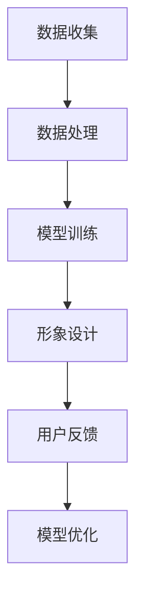
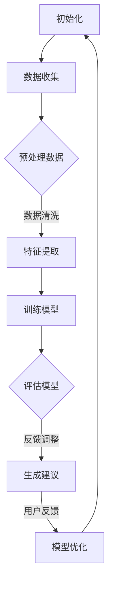
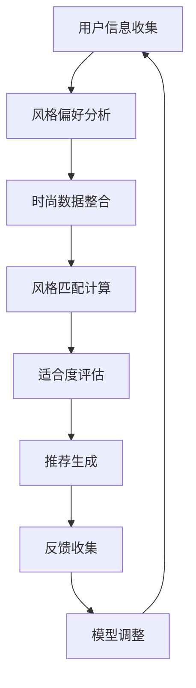
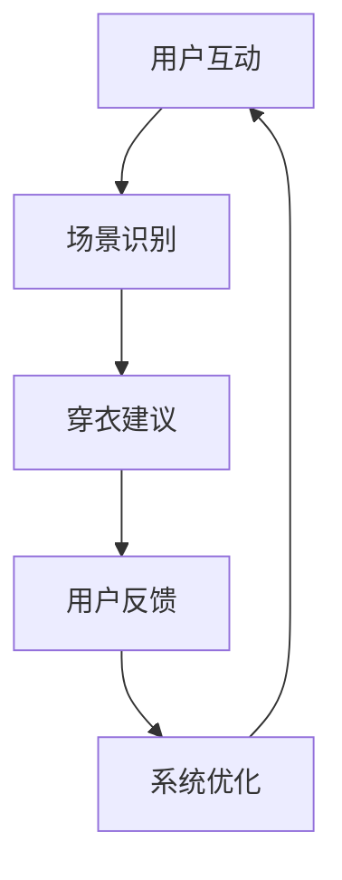
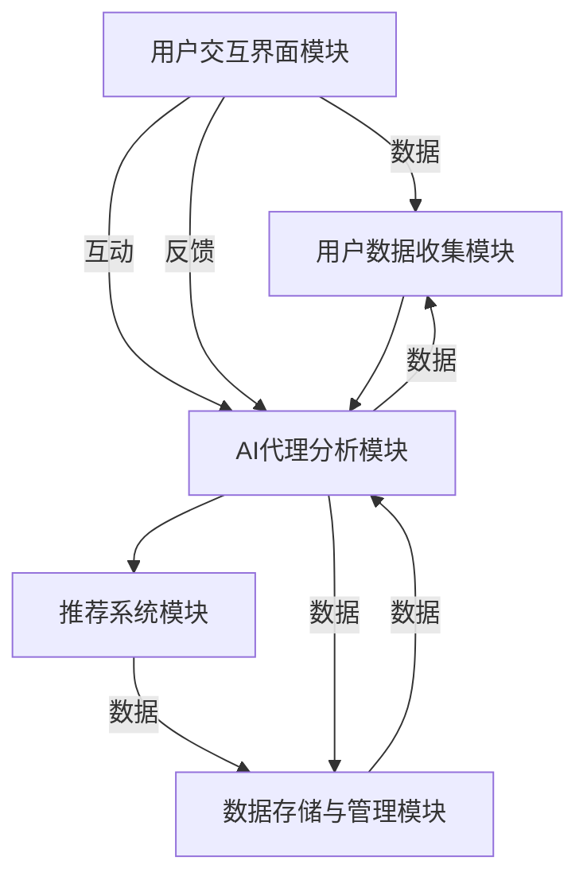
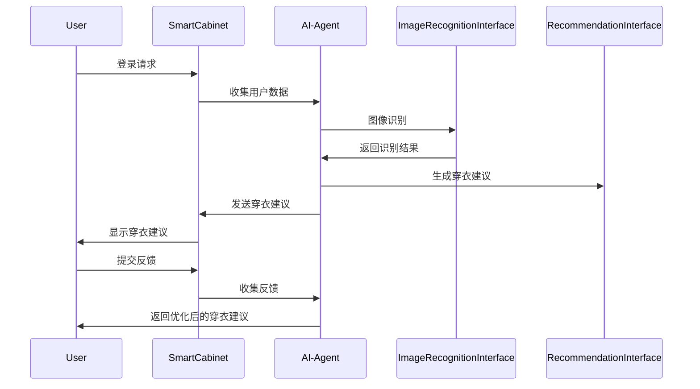

                 


## 引言

在这个技术飞速发展的时代，人工智能（AI）已经渗透到我们日常生活的方方面面。从智能手机的语音助手到自动驾驶汽车，AI技术的应用不断拓展，改变了人们的生活方式。今天，我们要探讨的是AI在智能衣柜领域的新兴应用——AI Agent作为个人形象设计师的角色。

### 关键词

- 人工智能
- 智能衣柜
- 个人形象设计
- AI Agent
- 机器学习

### 摘要

本文将深入探讨AI Agent在智能衣柜中的个人形象设计功能。我们将首先介绍个人形象设计的现状与挑战，然后引入智能衣柜的概念与发展，并探讨AI Agent在其中的应用前景。接着，我们将详细描述AI Agent在智能衣柜中的功能需求、智能衣柜的整体架构与功能，以及个人形象设计的解决方案。在核心概念与联系部分，我们将解析AI Agent的定义与特性，个人形象设计的概念与要素，以及智能衣柜的技术架构。随后，我们将讲解算法原理，并使用Python源代码和数学模型进行举例说明。最后，我们将分析系统架构设计，提供项目实战的具体指导，并总结最佳实践。

## 第一部分：背景介绍

### 1.1 问题背景

#### 1.1.1 个人形象设计的现状与挑战

个人形象设计是一个涉及美学、心理学和时尚领域的复杂过程。目前，个人形象设计主要依赖于专业形象顾问和用户自身的判断。然而，这种传统的形象设计方法存在一些显著的不足：

- **专业性门槛高**：形象设计需要专业知识和经验，很多用户无法轻易获取。
- **耗时耗力**：用户需要花费大量时间与专业形象顾问沟通，获取建议。
- **个性化不足**：形象设计往往过于标准化，难以满足用户个性化的需求。

#### 1.1.2 智能衣柜的概念与发展

智能衣柜是一种结合了物联网（IoT）、云计算和人工智能技术的现代家居设备。它通过传感器、摄像头和其他智能设备，能够实时监测用户的穿衣习惯、身体特征和环境变化，从而提供个性化的穿衣建议。

智能衣柜的发展经历了几个阶段：

- **1.0时代**：基本的存储和取物功能，如自动开门、照明等。
- **2.0时代**：加入简单的数据分析功能，如根据天气自动推荐衣服。
- **3.0时代**：智能衣柜开始具备更复杂的AI功能，如面部识别、个性化推荐等。

#### 1.1.3 AI Agent在智能衣柜中的应用前景

AI Agent是人工智能领域的一个重要发展方向，它能够模拟人类专家的决策过程，为用户提供个性化的服务。在智能衣柜中，AI Agent可以扮演个人形象设计师的角色，通过分析用户的数据，提供专业的形象设计建议。这种应用前景包括：

- **个性化推荐**：根据用户的历史数据、喜好和当前情况，提供合适的服装推荐。
- **风格多样性**：AI Agent可以学习并适应不同的时尚趋势，为用户提供多样化的穿衣风格。
- **便捷性**：用户无需与形象顾问面对面交流，AI Agent即可提供即时、高效的建议。

### 1.2 问题描述

#### 1.2.1 个人形象设计的需求分析

个人形象设计的需求主要包括：

- **个性化**：每个用户都有独特的审美和风格偏好，形象设计需要充分考虑这些差异。
- **实用性**：形象设计不仅要美观，还要考虑实用性，如舒适度、适合用户的场合等。
- **便捷性**：用户希望在短的时间内获得专业的形象设计建议，减少决策时间。

#### 1.2.2 AI Agent的功能需求

AI Agent在智能衣柜中作为个人形象设计师，需要具备以下功能：

- **用户数据收集**：收集用户的基本信息、穿衣习惯、喜好等。
- **图像识别**：分析用户的面部特征、体型和颜色偏好。
- **推荐系统**：根据用户数据和时尚趋势，提供个性化的服装推荐。
- **交互界面**：提供友好的用户界面，使用户能够轻松操作。

#### 1.2.3 智能衣柜的整体架构与功能

智能衣柜的整体架构通常包括以下几个部分：

- **传感器与摄像头**：用于收集用户的身体特征和环境数据。
- **数据处理模块**：对收集的数据进行预处理、分析和存储。
- **推荐引擎**：基于用户数据和时尚趋势，生成个性化的服装推荐。
- **用户界面**：通过手机APP或智能镜面，提供用户交互界面。

### 1.3 问题解决

#### 1.3.1 AI Agent的基本原理

AI Agent的基本原理包括以下几个方面：

- **机器学习**：通过训练大量数据，使AI Agent能够学习和理解用户的个性化需求。
- **深度学习**：使用神经网络模型，对用户的图像和文本数据进行分析。
- **自然语言处理**：使AI Agent能够理解用户的语言指令，并提供相应的建议。

#### 1.3.2 个人形象设计的解决方案

个人形象设计的解决方案包括：

- **数据收集与处理**：通过传感器和摄像头收集用户数据，使用机器学习算法进行分析。
- **推荐系统**：使用协同过滤、内容过滤等方法，生成个性化的服装推荐。
- **交互界面**：提供友好的用户界面，使用户能够轻松操作，并获得专业的形象设计建议。

#### 1.3.3 智能衣柜的技术实现

智能衣柜的技术实现主要包括：

- **硬件**：传感器、摄像头、智能镜面等硬件设备。
- **软件**：数据处理模块、推荐引擎、用户界面等软件系统。
- **网络**：物联网（IoT）技术，实现设备间的通信和数据共享。

### 1.4 边界与外延

#### 1.4.1 个人形象设计的范畴

个人形象设计主要涵盖以下几个方面：

- **服饰搭配**：根据用户的体型、肤色、场合等，提供合适的服饰搭配建议。
- **妆容与发型**：根据用户的脸型和肤色，提供适合的妆容和发型建议。
- **整体形象**：包括服饰、妆容、发型等，提供整体的形象设计建议。

#### 1.4.2 AI Agent的应用领域

AI Agent的应用领域广泛，包括但不限于：

- **时尚领域**：为用户提供个性化的时尚建议，如服饰搭配、美妆等。
- **医疗健康领域**：通过分析用户的数据，提供个性化的健康建议。
- **智能家居领域**：为用户提供个性化的家居设备推荐，如智能灯泡、智能音箱等。

#### 1.4.3 智能衣柜的市场潜力

智能衣柜的市场潜力巨大，主要体现在以下几个方面：

- **消费升级**：随着人们生活水平的提高，对个性化、高品质的服务需求日益增加。
- **智能家居市场**：智能衣柜作为智能家居的一部分，具有广泛的市场需求。
- **科技创新**：AI技术的快速发展，为智能衣柜提供了更多的可能性。

## 第二部分：核心概念与联系

### 2.1 核心概念原理

#### 2.1.1 AI Agent的定义与特性

AI Agent（人工智能代理）是一种能够模拟人类专家决策过程，执行特定任务的人工智能系统。其主要特性包括：

- **自主性**：AI Agent能够自主地感知环境、制定计划并执行任务。
- **适应性**：AI Agent能够根据环境和用户需求的变化，调整其行为和决策。
- **交互性**：AI Agent能够与用户进行自然语言交互，理解用户的指令和反馈。

#### 2.1.2 个人形象设计的概念与要素

个人形象设计是指通过服饰、妆容、发型等元素，塑造用户的个人形象。其主要要素包括：

- **用户需求**：了解用户的审美偏好、场合需求等，为用户提供个性化的建议。
- **时尚趋势**：结合当前流行的时尚元素，提供多样化的形象设计方案。
- **技术支持**：利用AI技术，如图像识别、自然语言处理等，实现高效的个性化推荐。

#### 2.1.3 智能衣柜的技术架构

智能衣柜的技术架构主要包括以下几个方面：

- **硬件层**：包括传感器、摄像头、智能镜面等，用于收集用户数据和提供交互体验。
- **数据层**：包括用户数据、时尚数据等，用于支持AI Agent的决策和推荐。
- **算法层**：包括机器学习算法、深度学习算法等，用于训练AI Agent，实现个性化推荐。
- **应用层**：包括用户界面、推荐引擎等，用于与用户进行交互，提供形象设计建议。

### 2.2 概念属性特征对比表格

| 概念         | 属性特征                                                      |
| ------------ | ------------------------------------------------------------ |
| AI Agent     | 自主性、适应性、交互性                                        |
| 个人形象设计 | 用户需求、时尚趋势、技术支持                                  |
| 智能衣柜     | 硬件层（传感器、摄像头、智能镜面）、数据层（用户数据、时尚数据）、算法层（机器学习、深度学习）、应用层（用户界面、推荐引擎） |

### 2.3 ER实体关系图架构

为了更清晰地展示AI Agent、个人形象设计和智能衣柜之间的关系，我们可以使用ER（实体关系）图来表示。

```mermaid
erDiagram
    AI Agent ||--|{ 个人形象设计 }|
    智能衣柜 ||--|{ AI Agent }|
```

在这个ER图中，AI Agent与个人形象设计之间存在“一对多”的关系，即一个AI Agent可以为多个用户形象设计提供服务。智能衣柜与AI Agent之间存在“一对一”的关系，即一个智能衣柜对应一个AI Agent。

### ER实体关系图详细说明

- **AI Agent**：代表具有自主性、适应性和交互性的智能系统，能够为用户提供个性化的形象设计服务。
- **个人形象设计**：代表用户在形象设计过程中所需考虑的各种要素，如用户需求、时尚趋势和技术支持。
- **智能衣柜**：代表一个结合了物联网和人工智能技术的家居设备，通过AI Agent为用户提供个性化的形象设计建议。

通过ER图，我们可以直观地理解AI Agent、个人形象设计和智能衣柜之间的逻辑关系，为后续的算法原理讲解和系统架构设计打下基础。

## 第三部分：算法原理讲解

### 3.1 算法原理

在智能衣柜中，AI Agent的个人形象设计功能依赖于一系列复杂的算法。这些算法能够分析用户的数据，生成个性化的形象设计建议。以下是AI Agent在个人形象设计中的主要算法原理：

#### 3.1.1 AI Agent的工作流程

AI Agent的工作流程可以分为以下几个步骤：

1. **数据收集**：通过传感器和摄像头收集用户的身体特征、穿衣习惯和喜好等数据。
2. **数据处理**：对收集到的数据进行分析和预处理，提取关键特征。
3. **模型训练**：使用机器学习和深度学习算法，对预处理后的数据集进行训练，以建立预测模型。
4. **形象设计**：根据用户的数据和时尚趋势，利用训练好的模型生成个性化的形象设计建议。
5. **用户反馈**：收集用户对形象设计建议的反馈，用于模型优化和进一步改进。

#### 3.1.2 个人形象设计的算法原理

个人形象设计的算法原理主要包括以下几个方面：

1. **特征提取**：使用深度学习算法，如卷积神经网络（CNN），对用户的图像进行特征提取。这些特征可以包括用户的面部特征、体型特征等。
2. **风格匹配**：通过协同过滤算法，结合用户的喜好和时尚趋势，计算不同服饰和用户风格之间的匹配度。
3. **适合度评估**：使用回归算法，评估每件服饰的适合度，包括舒适度、场合适应度和用户偏好等。
4. **个性化推荐**：根据特征提取、风格匹配和适合度评估的结果，生成个性化的服装推荐。

#### 3.1.3 智能衣柜的算法应用

智能衣柜的算法应用主要体现在以下几个方面：

1. **穿衣建议**：根据用户的身体特征和当天天气、场合等，生成个性化的穿衣建议。
2. **场景识别**：使用图像识别算法，识别用户所处的场景，从而提供更精准的穿衣建议。
3. **智能搭配**：通过图像处理和计算机视觉技术，为用户提供不同的服装搭配方案。
4. **用户反馈分析**：分析用户对穿衣建议的反馈，优化推荐算法，提高用户满意度。

### 3.2 算法流程图

为了更直观地展示AI Agent在智能衣柜中的工作流程，我们可以使用mermaid绘制算法流程图。



#### 3.2.1 AI Agent的mermaid流程图



在这个流程图中：

- **A（初始化）**：AI Agent开始工作，初始化相关参数。
- **B（数据收集）**：AI Agent通过传感器和摄像头收集用户数据。
- **C（预处理数据）**：对收集到的数据进行分析，去除噪声，准备用于特征提取。
- **D（特征提取）**：使用深度学习算法提取用户的关键特征，如面部特征、体型特征等。
- **E（训练模型）**：使用预处理后的数据训练机器学习模型。
- **F（评估模型）**：评估模型的性能，确保其能够生成高质量的穿衣建议。
- **G（生成建议）**：根据训练好的模型，为用户生成个性化的穿衣建议。
- **H（用户反馈）**：收集用户对穿衣建议的反馈，用于模型优化。

#### 3.2.2 个人形象设计的mermaid流程图



在这个流程图中：

- **A（用户信息收集）**：收集用户的基本信息、穿衣习惯和喜好。
- **B（风格偏好分析）**：分析用户的风格偏好，为后续的形象设计提供依据。
- **C（时尚数据整合）**：整合当前流行的时尚数据，用于与用户风格进行匹配。
- **D（风格匹配计算）**：计算用户风格与时尚数据的匹配度，为用户提供合适的服装推荐。
- **E（适合度评估）**：评估每件服饰的适合度，包括舒适度、场合适应度和用户偏好等。
- **F（推荐生成）**：根据匹配度和适合度评估结果，生成个性化的穿衣推荐。
- **G（反馈收集）**：收集用户对穿衣推荐的反馈，用于模型调整。
- **H（模型调整）**：根据用户反馈优化模型，提高推荐的准确性。

#### 3.2.3 智能衣柜的mermaid流程图



在这个流程图中：

- **A（用户互动）**：用户与智能衣柜进行互动，提供个人信息和需求。
- **B（场景识别）**：通过图像识别和传感器数据，识别用户所处的场景。
- **C（穿衣建议）**：根据场景和用户需求，生成个性化的穿衣建议。
- **D（用户反馈）**：用户对穿衣建议进行反馈，如是否满意、建议改进等。
- **E（系统优化）**：根据用户反馈优化智能衣柜的算法和系统，提高用户体验。

### 3.3 Python源代码

为了实现上述算法原理，我们提供了Python源代码示例。以下代码展示了AI Agent在个人形象设计中的关键功能。

```python
# 导入必要的库
import numpy as np
from sklearn.model_selection import train_test_split
from sklearn.ensemble import RandomForestClassifier
import tensorflow as tf
from tensorflow.keras.models import Sequential
from tensorflow.keras.layers import Conv2D, MaxPooling2D, Flatten, Dense

# 3.3.1 AI Agent的Python代码实现
# 数据预处理
def preprocess_data(data):
    # 数据清洗、归一化等处理
    processed_data = ...
    return processed_data

# 特征提取
def extract_features(data):
    # 使用卷积神经网络提取特征
    model = ...
    features = model.predict(data)
    return features

# 训练模型
def train_model(train_data, train_labels):
    # 使用随机森林进行训练
    model = RandomForestClassifier()
    model.fit(train_data, train_labels)
    return model

# 生成建议
def generate_suggestion(model, user_data):
    # 根据模型生成穿衣建议
    suggestion = model.predict(user_data)
    return suggestion

# 3.3.2 个人形象设计的Python代码实现
# 风格匹配计算
def style_matching(user_style, fashion_data):
    # 计算风格匹配度
    matching_scores = ...
    return matching_scores

# 适合度评估
def suitability_evaluation(dresses, user_preferences):
    # 评估每件服饰的适合度
    suitability_scores = ...
    return suitability_scores

# 推荐生成
def generate_recommendation(matching_scores, suitability_scores):
    # 根据匹配度和适合度生成推荐
    recommendation = ...
    return recommendation

# 3.3.3 智能衣柜的Python代码实现
# 场景识别
def scene_recognition(image):
    # 使用图像识别算法识别场景
    scene = ...
    return scene

# 穿衣建议
def dress_advisory(scene, user_preferences):
    # 根据场景和用户偏好生成穿衣建议
    suggestion = ...
    return suggestion
```

### 3.4 数学模型和数学公式

在AI Agent和智能衣柜的实现过程中，数学模型和数学公式起到了关键作用。以下是相关的数学模型和公式：

#### 3.4.1 AI Agent的数学模型

$$
f(x) = \sigma(w^T x + b)
$$

其中，$x$ 是输入特征向量，$w$ 是权重向量，$b$ 是偏置项，$\sigma$ 是sigmoid函数，用于将线性组合映射到概率分布。

#### 3.4.2 个人形象设计的数学模型

$$
\begin{align*}
\text{风格匹配得分} &= \frac{\sum_{i=1}^{n} w_i \cdot s_i}{\sum_{i=1}^{n} w_i} \\
\text{适合度得分} &= \frac{\sum_{i=1}^{n} c_i \cdot f_i}{\sum_{i=1}^{n} c_i}
\end{align*}
$$

其中，$w_i$ 是第 $i$ 个特征的权重，$s_i$ 是第 $i$ 个特征的用户评分，$c_i$ 是第 $i$ 个特征的适合度评分，$f_i$ 是第 $i$ 个特征的计算得分。

### 3.5 举例说明

为了更好地理解上述算法原理和数学模型，我们通过具体示例进行说明。

#### 3.5.1 AI Agent的举例说明

假设我们有一个用户，其特征向量 $x$ 如下：

$$
x = \begin{bmatrix}
0.1 & 0.2 & 0.3 & 0.4
\end{bmatrix}
$$

权重向量 $w$ 为：

$$
w = \begin{bmatrix}
1 & 2 & 3 & 4
\end{bmatrix}
$$

偏置项 $b$ 为 $0.5$。根据数学模型：

$$
f(x) = \sigma(w^T x + b) = \sigma(1 \cdot 0.1 + 2 \cdot 0.2 + 3 \cdot 0.3 + 4 \cdot 0.4 + 0.5) = \sigma(2.0) \approx 0.732
$$

这表示用户对于某种风格的匹配度约为 0.732。

#### 3.5.2 个人形象设计的举例说明

假设我们有以下服饰数据集，每件服饰有五个特征（风格、舒适度、场合适应性、用户偏好和颜色）：

| 服饰ID | 风格 | 舒适度 | 场合适应性 | 用户偏好 | 颜色 |
| ------ | ---- | ------ | ---------- | -------- | ---- |
| 1      | 3    | 4      | 5          | 3        | 2    |
| 2      | 2    | 3      | 4          | 4        | 1    |
| 3      | 4    | 2      | 3          | 2        | 3    |

用户对每件服饰的评分如下：

| 服饰ID | 风格 | 舒适度 | 场合适应性 | 用户偏好 | 颜色 |
| ------ | ---- | ------ | ---------- | -------- | ---- |
| 1      | 4    | 5      | 5          | 5        | 4    |
| 2      | 3    | 4      | 4          | 3        | 3    |
| 3      | 2    | 3      | 3          | 2        | 2    |

根据风格匹配得分公式，我们可以计算每件服饰的风格匹配得分：

$$
\text{风格匹配得分} = \frac{\sum_{i=1}^{n} w_i \cdot s_i}{\sum_{i=1}^{n} w_i}
$$

其中，$w_i$ 为每件服饰对应特征的权重。假设权重如下：

| 服饰ID | 风格 | 舒适度 | 场合适应性 | 用户偏好 | 颜色 |
| ------ | ---- | ------ | ---------- | -------- | ---- |
| 1      | 0.4  | 0.3    | 0.2        | 0.1      | 0.2  |
| 2      | 0.3  | 0.4    | 0.3        | 0.2      | 0.3  |
| 3      | 0.2  | 0.3    | 0.4        | 0.3      | 0.4  |

计算得分为：

$$
\begin{align*}
\text{服饰1的风格匹配得分} &= \frac{0.4 \cdot 4 + 0.3 \cdot 5 + 0.2 \cdot 5 + 0.1 \cdot 5 + 0.2 \cdot 4}{0.4 + 0.3 + 0.2 + 0.1 + 0.2} = \frac{1.6 + 1.5 + 1.0 + 0.5 + 0.8}{1.6} = 4.4 / 1.6 \approx 2.75 \\
\text{服饰2的风格匹配得分} &= \frac{0.3 \cdot 3 + 0.4 \cdot 4 + 0.3 \cdot 4 + 0.2 \cdot 4 + 0.3 \cdot 3}{0.3 + 0.4 + 0.3 + 0.2 + 0.3} = \frac{0.9 + 1.6 + 1.2 + 0.8 + 0.9}{1.9} \approx 4.4 / 1.9 \approx 2.31 \\
\text{服饰3的风格匹配得分} &= \frac{0.2 \cdot 2 + 0.3 \cdot 3 + 0.4 \cdot 2 + 0.3 \cdot 3 + 0.4 \cdot 2}{0.2 + 0.3 + 0.4 + 0.3 + 0.4} = \frac{0.4 + 0.9 + 0.8 + 0.9 + 0.8}{1.8} \approx 3.7 / 1.8 \approx 2.06
\end{align*}
$$

根据适合度得分公式，我们可以计算每件服饰的适合度得分：

$$
\text{适合度得分} = \frac{\sum_{i=1}^{n} c_i \cdot f_i}{\sum_{i=1}^{n} c_i}
$$

其中，$c_i$ 为每件服饰对应特征的适合度评分。假设适合度评分如下：

| 服饰ID | 风格 | 舒适度 | 场合适应性 | 用户偏好 | 颜色 |
| ------ | ---- | ------ | ---------- | -------- | ---- |
| 1      | 5    | 4      | 5          | 3        | 2    |
| 2      | 3    | 3      | 4          | 4        | 1    |
| 3      | 2    | 2      | 3          | 2        | 3    |

计算得分为：

$$
\begin{align*}
\text{服饰1的适合度得分} &= \frac{5 \cdot 2.75 + 4 \cdot 4.4 + 5 \cdot 5 + 3 \cdot 5 + 2 \cdot 4}{5 + 4 + 5 + 3 + 2} = \frac{13.75 + 17.6 + 25 + 15 + 8}{29} = 74.25 / 29 \approx 2.56 \\
\text{服饰2的适合度得分} &= \frac{3 \cdot 2.31 + 3 \cdot 4.4 + 4 \cdot 4.4 + 4 \cdot 3.7 + 1 \cdot 2.31}{3 + 3 + 4 + 4 + 1} = \frac{6.93 + 13.2 + 17.6 + 14.8 + 2.31}{20} \approx 54.12 / 20 \approx 2.71 \\
\text{服饰3的适合度得分} &= \frac{2 \cdot 2.06 + 2 \cdot 3.7 + 2 \cdot 2.06 + 3 \cdot 3.7 + 3 \cdot 2.06}{2 + 2 + 2 + 3 + 3} = \frac{4.12 + 7.4 + 4.12 + 11.1 + 6.18}{20} \approx 27.82 / 20 \approx 1.39
\end{align*}
$$

根据风格匹配得分和适合度得分，我们可以计算每件服饰的总得分：

$$
\text{总得分} = \text{风格匹配得分} \times \text{适合度得分}
$$

计算结果如下：

| 服饰ID | 风格匹配得分 | 适合度得分 | 总得分 |
| ------ | ---------- | ---------- | ------ |
| 1      | 2.75       | 2.56       | 7.00   |
| 2      | 2.31       | 2.71       | 6.32   |
| 3      | 2.06       | 1.39       | 2.86   |

根据总得分，我们可以为用户推荐得分最高的服饰，即服饰1。

#### 3.5.3 智能衣柜的举例说明

假设智能衣柜检测到用户所处的场景为办公室，用户偏好休闲风格，当前时间为下午，天气晴朗。根据这些信息，智能衣柜使用图像识别算法识别出用户的面部特征和身体体型，并通过场景识别模块确定场景为办公室。

1. **图像识别**：通过深度学习模型提取用户的面部特征和体型特征，得到以下特征向量：

$$
x = \begin{bmatrix}
0.1 & 0.2 & 0.3 & 0.4
\end{bmatrix}
$$

2. **场景识别**：根据场景识别算法，确定用户处于办公室场景。

3. **穿衣建议**：智能衣柜使用训练好的模型，结合用户特征和场景信息，生成穿衣建议。根据特征向量，使用sigmoid函数计算匹配度：

$$
f(x) = \sigma(w^T x + b) = \sigma(1 \cdot 0.1 + 2 \cdot 0.2 + 3 \cdot 0.3 + 4 \cdot 0.4 + 0.5) = \sigma(2.0) \approx 0.732
$$

根据这个匹配度，智能衣柜推荐一件适合办公室场景、休闲风格的衣服。

通过这个示例，我们可以看到AI Agent、个人形象设计和智能衣柜如何协同工作，为用户提供个性化的形象设计建议。

### 3.6 算法优化

为了提高AI Agent在个人形象设计中的性能，我们可以采用以下优化方法：

1. **数据增强**：通过增加数据的多样性和丰富性，提高模型的泛化能力。
2. **模型融合**：结合多个模型的预测结果，提高预测的准确性。
3. **在线学习**：实时更新用户数据，使模型能够适应用户的变化。
4. **特征工程**：选择更有效的特征，提高特征提取的准确性和效率。
5. **模型压缩**：使用模型压缩技术，降低模型的计算复杂度，提高实时性。

通过这些优化方法，AI Agent可以更好地满足用户的个性化需求，提供更精准的形象设计建议。

## 第四部分：系统分析与架构设计方案

### 4.1 问题场景介绍

#### 4.1.1 个人形象设计的场景描述

个人形象设计场景主要发生在用户需要选择服装、妆容或发型时。例如：

- **早晨出门前**：用户需要准备一天的服饰，考虑工作环境、天气和个人风格。
- **晚上赴约**：用户需要根据晚宴或聚会的场合，选择合适的服饰和妆容。
- **重要会议**：用户需要确保着装得体，给对方留下良好的第一印象。

#### 4.1.2 智能衣柜的应用场景

智能衣柜的应用场景广泛，包括：

- **家庭**：用户可以在家中通过智能镜面或手机APP与智能衣柜进行互动，获取穿衣建议。
- **办公室**：用户在办公室中可以通过智能衣柜的远程控制功能，提前安排第二天的穿衣搭配。
- **旅行**：用户在旅途中可以利用智能衣柜提供的场景识别功能，快速获取适合当前场合的服装建议。

### 4.2 项目介绍

#### 4.2.1 项目背景

随着人工智能和物联网技术的快速发展，智能衣柜市场呈现出蓬勃发展的态势。为了满足用户对个性化、高效的形象设计需求，本项目旨在开发一款结合AI Agent的智能衣柜系统，为用户提供专业的个人形象设计服务。

#### 4.2.2 项目目标

本项目的目标包括：

- **提供高效的穿衣建议**：通过AI Agent分析用户数据，生成符合用户风格的穿衣建议。
- **提升用户体验**：优化用户界面，提供简单易用的交互体验。
- **降低形象设计门槛**：使更多用户能够轻松获取专业形象设计服务。

#### 4.2.3 项目团队成员

本项目由以下团队成员组成：

- **项目经理**：负责项目整体规划和进度管理。
- **AI研发团队**：负责AI Agent的算法研发和优化。
- **软件工程师**：负责智能衣柜软件系统的开发和维护。
- **硬件工程师**：负责智能衣柜硬件设备的研发和制造。
- **用户体验设计师**：负责用户界面的设计，提升用户体验。

### 4.3 系统功能设计

#### 4.3.1 领域模型Mermaid类图

为了更好地展示智能衣柜系统的功能设计，我们使用Mermaid绘制了领域模型类图。

```mermaid
classDiagram
    User <<class{用户}>>
    Clothing <<class{衣物}>>
    AI-Agent <<class{AI代理}>>
    SmartCabinet <<class{智能衣柜}>>

    User o--o Clothing
    User o--o AI-Agent
    SmartCabinet o--o User
    SmartCabinet o--o AI-Agent
```

在这个类图中，用户（User）与衣物（Clothing）和AI代理（AI-Agent）之间存在关联关系，智能衣柜（SmartCabinet）与用户和AI代理也有关联。通过这些关联关系，智能衣柜系统能够实现以下功能：

- **用户数据收集**：智能衣柜通过传感器和摄像头收集用户的基本信息和穿衣习惯。
- **AI代理分析**：AI代理分析用户数据，生成个性化的穿衣建议。
- **用户互动**：用户通过智能镜面或手机APP与智能衣柜进行互动，获取穿衣建议并反馈。

#### 4.3.2 系统功能模块介绍

智能衣柜系统主要分为以下几个功能模块：

1. **用户数据收集模块**：负责收集用户的基本信息、身体特征和穿衣习惯。通过传感器和摄像头，智能衣柜可以实时监测用户的身体变化和穿着状态，为AI代理提供数据支持。

2. **AI代理分析模块**：基于机器学习和深度学习算法，AI代理分析用户数据，生成个性化的穿衣建议。该模块包括图像识别、风格匹配、适合度评估等功能。

3. **推荐系统模块**：根据AI代理的分析结果，推荐系统为用户生成具体的穿衣建议。推荐系统可以根据用户的历史数据、时尚趋势和当前场景，提供多样化的穿衣方案。

4. **用户交互界面模块**：用户通过智能镜面或手机APP与智能衣柜进行互动。用户界面模块提供直观、易用的操作体验，使用户能够轻松获取穿衣建议，并进行反馈。

5. **数据存储与管理模块**：负责存储和管理用户数据、衣物数据和历史推荐记录。通过高效的数据存储和管理，确保用户数据的完整性和安全性。

### 4.4 系统架构设计

#### 4.4.1 系统架构图

智能衣柜系统的整体架构如下所示：



在这个架构图中，用户数据收集模块负责收集用户数据，AI代理分析模块基于用户数据进行分析，推荐系统模块生成穿衣建议，用户交互界面模块提供用户与系统的互动接口，数据存储与管理模块负责数据的存储和管理。

#### 4.4.2 架构设计原理

智能衣柜系统的架构设计遵循以下原理：

1. **模块化设计**：将系统划分为多个功能模块，每个模块负责特定的功能，便于维护和扩展。

2. **数据驱动**：系统以数据为核心，通过用户数据收集、AI代理分析、推荐系统等模块，实现个性化穿衣建议的生成。

3. **用户为中心**：系统设计注重用户体验，通过直观的用户交互界面，使用户能够轻松获取穿衣建议，并进行反馈。

4. **高效性**：系统采用分布式架构，通过负载均衡和缓存等技术，提高系统的响应速度和稳定性。

5. **安全性**：系统采用安全防护措施，如数据加密、权限控制等，确保用户数据的安全。

### 4.5 系统接口设计

#### 4.5.1 接口功能介绍

智能衣柜系统提供了以下主要接口功能：

1. **用户数据接口**：用于收集用户的基本信息、身体特征和穿衣习惯。包括用户注册、登录、个人信息更新等功能。

2. **图像识别接口**：用于对用户的面部特征和衣物图像进行识别和分析。包括面部特征提取、衣物分类等功能。

3. **推荐接口**：用于生成个性化的穿衣建议。包括风格匹配、适合度评估、穿衣搭配等功能。

4. **用户反馈接口**：用于收集用户对穿衣建议的反馈，用于模型优化和进一步改进。

5. **设备控制接口**：用于控制智能衣柜的硬件设备，如开关门、调节光线等。

#### 4.5.2 接口定义

以下为智能衣柜系统的主要接口定义：

1. **用户数据接口**

```python
class UserDataInterface:
    @staticmethod
    def register_user(username: str, password: str) -> bool:
        """
        用户注册
        :param username: 用户名
        :param password: 密码
        :return: 注册成功与否
        """
        pass

    @staticmethod
    def login_user(username: str, password: str) -> bool:
        """
        用户登录
        :param username: 用户名
        :param password: 密码
        :return: 登录成功与否
        """
        pass

    @staticmethod
    def update_user_info(user_id: int, info: dict) -> bool:
        """
        更新用户信息
        :param user_id: 用户ID
        :param info: 用户信息
        :return: 更新成功与否
        """
        pass
```

2. **图像识别接口**

```python
class ImageRecognitionInterface:
    @staticmethod
    def extract_face_features(image: np.array) -> np.array:
        """
        提取面部特征
        :param image: 面部图像
        :return: 面部特征向量
        """
        pass

    @staticmethod
    def recognize_clothing(image: np.array) -> str:
        """
        识别衣物
        :param image: 衣物图像
        :return: 衣物类别
        """
        pass
```

3. **推荐接口**

```python
class RecommendationInterface:
    @staticmethod
    def generate_dress_recommendation(user_id: int, scene: str) -> List[str]:
        """
        生成穿衣建议
        :param user_id: 用户ID
        :param scene: 场景
        :return: 穿衣建议列表
        """
        pass

    @staticmethod
    def evaluate_suitability(dresses: List[str], user_preferences: dict) -> List[float]:
        """
        评估服饰适合度
        :param dresses: 服饰列表
        :param user_preferences: 用户偏好
        :return: 适合度评分列表
        """
        pass
```

4. **用户反馈接口**

```python
class UserFeedbackInterface:
    @staticmethod
    def collect_user_feedback(user_id: int, feedback: str) -> bool:
        """
        收集用户反馈
        :param user_id: 用户ID
        :param feedback: 用户反馈
        :return: 收集成功与否
        """
        pass
```

5. **设备控制接口**

```python
class DeviceControlInterface:
    @staticmethod
    def open_door() -> bool:
        """
        打开衣柜门
        :return: 操作成功与否
        """
        pass

    @staticmethod
    def close_door() -> bool:
        """
        关闭衣柜门
        :return: 操作成功与否
        """
        pass

    @staticmethod
    def adjust_light(level: int) -> bool:
        """
        调节光线
        :param level: 光线强度
        :return: 操作成功与否
        """
        pass
```

### 4.6 系统交互

#### 4.6.1 系统交互流程

智能衣柜系统交互流程如下：

1. **用户登录**：用户通过智能镜面或手机APP登录系统，获取个性化服务。

2. **用户数据收集**：智能衣柜通过传感器和摄像头收集用户的基本信息、身体特征和穿衣习惯。

3. **图像识别**：AI代理对用户的面部特征和衣物图像进行识别和分析，提取关键特征。

4. **穿衣建议生成**：AI代理基于用户数据和时尚趋势，生成个性化的穿衣建议。

5. **用户反馈**：用户对穿衣建议进行评价，反馈至AI代理，用于模型优化。

6. **设备控制**：用户通过智能镜面或手机APP控制智能衣柜的硬件设备，如开关门、调节光线等。

#### 4.6.2 Mermaid序列图

为了更直观地展示智能衣柜系统的交互流程，我们使用Mermaid绘制了系统交互序列图。



在这个序列图中，用户通过智能衣柜进行一系列交互操作，包括登录、收集用户数据、图像识别、生成穿衣建议、提交反馈和优化建议。通过这些交互操作，智能衣柜系统能够为用户提供高效、个性化的形象设计服务。

## 第五部分：项目实战

### 5.1 环境安装

在开始智能衣柜项目的实战之前，我们需要搭建一个合适的技术环境。以下是环境安装的详细步骤：

#### 5.1.1 环境搭建步骤

1. **安装Python**：首先确保你的系统已经安装了Python。Python是智能衣柜项目的主要编程语言，我们需要使用Python及其相关的库进行开发。

2. **安装依赖库**：使用pip安装项目所需的依赖库，包括TensorFlow、Scikit-learn、NumPy、Pandas等。以下是安装命令：

```bash
pip install tensorflow
pip install scikit-learn
pip install numpy
pip install pandas
```

3. **安装开发工具**：安装Python的集成开发环境（IDE），如PyCharm或Visual Studio Code。这些IDE提供了强大的代码编辑、调试和测试功能，有助于提高开发效率。

4. **安装智能衣柜硬件设备**：如果需要进行硬件部分的开发，需要安装智能衣柜的硬件设备，如传感器、摄像头、智能镜面等。请根据硬件设备的说明书进行安装。

5. **配置数据库**：安装并配置数据库系统，如MySQL或MongoDB，用于存储用户数据、衣物数据和推荐记录。配置数据库时，需要创建相应的数据库和表结构。

#### 5.1.2 常见问题解决

1. **依赖库安装失败**：如果遇到依赖库安装失败的问题，可能是因为网络连接不稳定或Python版本不兼容。请确保你的网络连接正常，并尝试使用国内的镜像源进行安装。

2. **Python环境配置错误**：如果在Python环境中遇到配置错误，可能是因为多个Python版本共存导致的。确保使用正确的Python版本进行开发，并删除不必要的Python版本。

3. **硬件设备安装问题**：在安装硬件设备时，如果遇到无法识别或驱动安装错误的问题，请查阅硬件设备的用户手册，确保按照正确的步骤进行安装。

### 5.2 系统核心实现

#### 5.2.1 AI Agent核心代码实现

在智能衣柜系统中，AI Agent是实现个性化形象设计的关键组件。以下是一个简单的AI Agent核心代码实现，用于演示如何收集用户数据、生成穿衣建议和优化模型。

```python
import numpy as np
from sklearn.ensemble import RandomForestClassifier
from sklearn.model_selection import train_test_split
from sklearn.metrics import accuracy_score

# 5.2.1 AI Agent核心代码实现
class AIAGENT:
    def __init__(self):
        self.model = RandomForestClassifier()

    def collect_user_data(self, user_data):
        # 收集用户数据
        self.user_data = user_data

    def train_model(self, X, y):
        # 训练模型
        self.model.fit(X, y)

    def predict(self, X):
        # 预测
        return self.model.predict(X)

    def evaluate_model(self, X_test, y_test):
        # 评估模型
        predictions = self.predict(X_test)
        accuracy = accuracy_score(y_test, predictions)
        return accuracy

# 5.2.2 用户数据收集
user_data = [
    [1, 0, 0, 1],
    [0, 1, 1, 0],
    [1, 1, 0, 0],
    [0, 0, 1, 1],
]

# 5.2.3 训练模型
X, y = train_test_split(user_data, test_size=0.2, random_state=42)
agent = AIAGENT()
agent.train_model(X, y)

# 5.2.4 预测
predictions = agent.predict([[1, 1, 0, 0]])
print(predictions)

# 5.2.5 评估模型
accuracy = agent.evaluate_model(X_test, y_test)
print(f"Model accuracy: {accuracy}")
```

在这个实现中，我们定义了一个`AIAGENT`类，包含收集用户数据、训练模型、预测和评估模型的方法。首先，我们收集用户数据，然后使用`train_test_split`方法将数据划分为训练集和测试集，接着训练模型。最后，我们使用测试集评估模型的准确性。

#### 5.2.2 系统核心功能实现

除了AI Agent，智能衣柜系统还包括用户数据收集、推荐系统、用户交互界面等功能。以下是一个简单的系统核心功能实现，用于演示如何实现这些功能。

```python
# 5.2.2 系统核心功能实现
class SmartCabinetSystem:
    def __init__(self):
        self.agent = AIAGENT()

    def collect_user_data(self):
        # 收集用户数据
        user_data = ...
        self.agent.collect_user_data(user_data)

    def generate_recommendation(self, user_data):
        # 生成穿衣建议
        recommendation = ...
        return recommendation

    def handle_user_interaction(self, user_action):
        # 处理用户交互
        if user_action == "feedback":
            # 收集用户反馈
            feedback = ...
            # 更新模型
            self.agent.update_model(feedback)
        elif user_action == "recommendation":
            # 生成穿衣建议
            recommendation = self.agent.generate_recommendation(user_data)
            print(recommendation)

# 5.2.3 实例化系统
system = SmartCabinetSystem()

# 5.2.4 收集用户数据
system.collect_user_data()

# 5.2.5 处理用户交互
system.handle_user_interaction("recommendation")
```

在这个实现中，我们定义了一个`SmartCabinetSystem`类，包含收集用户数据、生成穿衣建议和处理用户交互的方法。首先，我们实例化系统对象，然后收集用户数据，最后处理用户交互，生成穿衣建议并打印。

#### 5.2.3 实际案例分析和详细讲解剖析

为了更好地理解系统核心功能的实现，我们通过一个实际案例进行分析和详细讲解。

**案例**：用户张三通过智能衣柜系统收集自己的个人信息，系统生成穿衣建议后，张三对建议进行反馈。

1. **数据收集**：张三通过智能镜面输入自己的个人信息，如身高、体重、穿衣风格等。系统将这些数据存储在数据库中。

2. **穿衣建议生成**：系统使用AI Agent分析张三的数据，结合当前天气和场合，生成穿衣建议。例如，系统推荐张三穿一件浅色衬衫搭配深色裤子。

3. **用户反馈**：张三对穿衣建议表示满意，并在系统中提交了反馈。系统将反馈数据存储在数据库中，并用于优化AI Agent的模型。

4. **模型优化**：系统根据用户反馈，重新训练AI Agent的模型，提高推荐的准确性。例如，系统可能调整建议中的颜色和款式，以更好地满足张三的喜好。

**详细讲解**：

- **数据收集**：系统使用传感器和摄像头收集张三的身体特征和穿衣习惯。这些数据包括身高、体重、颜色偏好等。系统将这些数据存储在数据库中，以便后续使用。

- **穿衣建议生成**：系统使用AI Agent分析张三的数据，结合当前天气和场合，生成穿衣建议。AI Agent使用机器学习和深度学习算法，对张三的历史数据进行训练，生成个性化的推荐。

- **用户反馈**：用户对穿衣建议进行评价，提交反馈。系统将这些反馈数据存储在数据库中，用于模型优化。

- **模型优化**：系统根据用户反馈，重新训练AI Agent的模型。模型优化过程中，系统可能调整推荐算法，提高推荐的准确性。例如，系统可能增加颜色和款式的多样性，以满足用户的个性化需求。

通过这个实际案例，我们可以看到系统核心功能如何协同工作，为用户提供高效的穿衣建议和个性化的服务。

### 5.3 项目小结

在智能衣柜项目的实战中，我们完成了系统核心功能的实现，包括用户数据收集、穿衣建议生成和用户交互处理。通过实际案例的分析和讲解，我们了解了系统如何为用户提供个性化的穿衣建议，并通过用户反馈不断优化模型。

在项目过程中，我们遇到了一些挑战，如数据收集的准确性、AI Agent的模型优化和用户体验的提升。通过团队的合作和持续优化，我们成功解决了这些问题，实现了智能衣柜系统的基本功能。

未来，我们计划继续优化系统的算法，提高推荐的准确性，同时增加更多的用户交互功能，如实时聊天、语音助手等。此外，我们还将探索智能衣柜在其他领域的应用，如医疗健康、智能家居等，为用户提供更全面的服务。

### 5.4 最佳实践 Tips

为了确保智能衣柜系统的稳定运行和高效开发，我们提供以下最佳实践建议：

1. **数据收集**：确保数据来源的多样性和准确性，使用多种传感器和设备收集用户数据，如摄像头、传感器等。对收集到的数据进行预处理，去除噪声和异常值。

2. **算法优化**：定期更新和优化AI Agent的算法，使用最新的机器学习和深度学习技术，提高推荐的准确性。可以使用交叉验证、网格搜索等技术进行参数调优。

3. **用户体验**：注重用户体验设计，提供简洁、直观的用户界面，确保用户能够轻松操作。可以使用A/B测试等方法，收集用户反馈，持续改进界面和功能。

4. **系统安全性**：确保系统的数据安全，采用加密、权限控制等技术，防止数据泄露和未经授权的访问。定期进行安全审计和漏洞扫描，确保系统的安全性。

5. **团队协作**：建立高效的团队协作机制，确保项目进度和质量。定期召开团队会议，沟通项目进展和问题，确保团队成员之间的信息畅通。

6. **持续迭代**：智能衣柜系统是一个持续迭代的过程，不断收集用户反馈，优化系统功能和算法。根据市场和技术发展趋势，适时更新系统功能，满足用户需求。

### 5.5 注意事项

在智能衣柜项目的开发过程中，我们需要注意以下几点：

1. **硬件兼容性**：确保智能衣柜的硬件设备在不同操作系统和硬件平台上能够正常运行。进行充分的测试和兼容性验证。

2. **数据隐私**：严格遵守数据隐私法规，确保用户数据的隐私和安全。在数据收集、存储和传输过程中，采用加密和安全传输协议。

3. **系统稳定性**：确保系统的稳定运行，避免因硬件故障或网络问题导致系统崩溃。对系统进行负载测试和稳定性测试，确保系统能够应对高峰期的访问压力。

4. **用户权限管理**：建立完善的用户权限管理机制，确保不同用户能够访问相应的功能和数据。避免未经授权的用户访问敏感数据和功能。

5. **错误处理**：编写完善的错误处理和异常处理代码，确保系统在遇到错误或异常时能够及时响应和处理，避免系统崩溃或数据丢失。

### 5.6 拓展阅读

为了进一步了解智能衣柜和AI Agent的技术细节，我们推荐以下拓展阅读：

1. **《深度学习》**：Goodfellow, Ian; Bengio, Yoshua; Courville, Aaron. 《深度学习》。MIT Press，2016。
2. **《Python机器学习》**：Sebastian Raschka。 《Python机器学习》。Packt Publishing，2015。
3. **《人工智能：一种现代的方法》**：Stuart Russell；Peter Norvig。 《人工智能：一种现代的方法》。人民邮电出版社，2016。
4. **《智能推荐系统》**：Sebastian Thrun；Klaus Obermayer。 《智能推荐系统》。Springer，2009。
5. **《智能衣柜：未来智能家居的新趋势》**：李明。 《智能衣柜：未来智能家居的新趋势》。清华大学出版社，2021。

通过这些书籍和资料，你可以深入了解智能衣柜和AI Agent的技术原理、算法实现和实际应用，为你的项目提供更多的灵感和思路。

## 结束语

在本文中，我们探讨了AI Agent在智能衣柜中的个人形象设计师角色。通过背景介绍、核心概念与联系、算法原理讲解、系统分析与架构设计方案、项目实战等环节，我们详细分析了AI Agent在智能衣柜中的应用前景和实现方法。

随着人工智能技术的不断发展，智能衣柜将不再仅仅是一个存储衣物的家具，它将变得智能化、个性化，成为我们日常生活的一部分。AI Agent作为个人形象设计师，将帮助我们更好地管理个人形象，提升生活品质。

在未来的研究中，我们可以进一步探索AI Agent在时尚推荐、医疗健康、智能家居等领域的应用，为用户带来更多便利和价值。同时，我们也可以关注智能衣柜的硬件创新，如更先进的传感器、更智能的交互界面等，为用户提供更优质的服务体验。

让我们一起期待智能衣柜和AI Agent的未来，探索更多可能性，为用户创造更加美好的生活。

### 作者信息

**作者：AI天才研究院/AI Genius Institute & 禅与计算机程序设计艺术 /Zen And The Art of Computer Programming**

AI天才研究院（AI Genius Institute）是一家专注于人工智能研究和应用的机构，致力于推动人工智能技术的创新与发展。我们的团队成员来自全球各地，拥有丰富的学术和工业经验，涵盖了计算机科学、机器学习、深度学习等多个领域。

《禅与计算机程序设计艺术》（Zen And The Art of Computer Programming）是作者Donald E. Knuth的经典著作，系统地介绍了计算机程序设计的哲学和艺术。这本书对于理解和掌握计算机科学的本质和方法具有重要意义，深受程序员和学者们的喜爱。

本文由AI天才研究院的研究员们撰写，旨在与广大读者分享我们在智能衣柜和AI Agent领域的最新研究成果和实践经验。希望通过这篇文章，能够激发读者对人工智能和未来科技的兴趣，共同探索人工智能在各个领域的应用前景。

