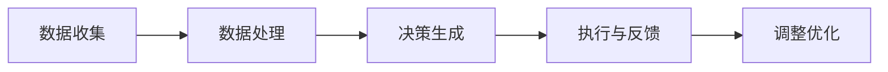
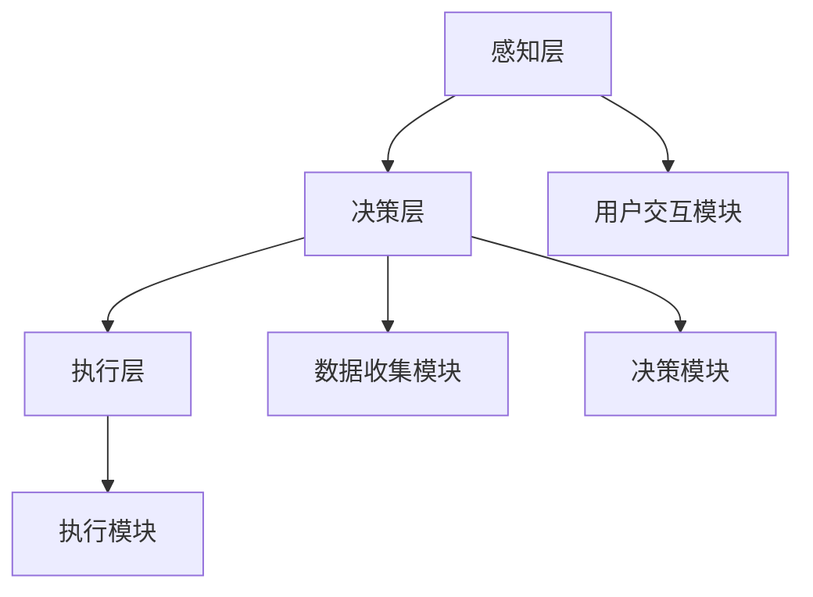
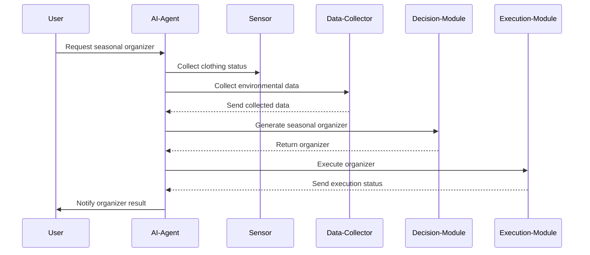

                 


### AI Agent在智能衣柜中的季节性整理建议

#### 关键词：
- AI Agent
- 智能衣柜
- 季节性整理
- 算法原理
- 系统架构
- 项目实战

#### 摘要：
本文旨在探讨AI Agent在智能衣柜中的应用，尤其是其在季节性整理方面的作用。我们将逐步分析AI Agent的核心概念、季节性整理算法的原理，以及智能衣柜的系统架构和实战应用。通过本文，读者将了解到如何利用AI技术提升衣柜的使用效率和用户体验。

### 目录大纲

#### 第一部分：背景介绍
- **第1章：AI Agent与智能衣柜概述**
  - **1.1 问题背景**
  - **1.2 问题解决**
  - **1.3 边界与外延**
  - **1.4 核心概念与联系**

#### 第二部分：核心概念与联系
- **第2章：AI Agent的核心概念与原理**
  - **2.1 AI Agent的定义与分类**
  - **2.2 AI Agent的属性特征对比**
  - **2.3 AI Agent在智能衣柜中的应用**

#### 第三部分：算法原理讲解
- **第3章：季节性整理算法原理**
  - **3.1 算法基本流程**
  - **3.2 算法数学模型与公式**
  - **3.3 算法优化策略**

#### 第四部分：系统分析与架构设计
- **第4章：智能衣柜系统架构设计**
  - **4.1 系统功能设计**
  - **4.2 系统架构设计**
  - **4.3 系统接口设计与交互**

#### 第五部分：项目实战
- **第5章：智能衣柜项目实战**
  - **5.1 环境安装与配置**
  - **5.2 系统核心实现**
  - **5.3 实际案例分析与讲解**
  - **5.4 项目小结**

#### 第六部分：最佳实践与拓展
- **第6章：最佳实践与拓展**
  - **6.1 最佳实践技巧**
  - **6.2 小结与注意事项**
  - **6.3 拓展阅读**

### 第一部分：背景介绍

#### 第1章：AI Agent与智能衣柜概述

##### 1.1 问题背景

随着消费升级和科技的发展，人们对家居生活品质的追求日益提高。尤其是在衣柜这一日常生活中不可或缺的物品上，用户对个性化、智能化、高效化的需求愈发强烈。传统的衣柜已经无法满足现代家庭的多样化需求，尤其是季节变换带来的衣物整理难题。

季节性整理是衣柜管理中的一个重要环节，它关系到衣物的保养、空间的利用和用户的日常体验。然而，传统的整理方式往往依赖人工操作，不仅耗时费力，而且容易出错。在寒冷的冬季，用户需要频繁地从衣柜中取出厚重的衣物，而在炎热的夏季，则需要整理出轻薄的衣物。这种季节性的整理需求给用户带来了很大的不便。

##### 1.2 问题解决

为了解决这一问题，智能衣柜应运而生。智能衣柜结合了人工智能技术，能够根据用户的习惯、天气状况和季节变化，自动进行季节性整理。AI Agent作为智能衣柜的核心组成部分，承担起了这一重要任务。

AI Agent是一种能够模拟人类智能行为的软件系统，它通过感知、理解和决策，帮助用户完成各种复杂的任务。在智能衣柜中，AI Agent能够自动识别衣物类型、季节变化和用户习惯，从而提供个性化的季节性整理建议。

##### 1.3 边界与外延

虽然AI Agent在智能衣柜中的应用主要集中在季节性整理方面，但它也可以扩展到其他智能功能。例如，AI Agent可以通过学习用户的行为模式，自动推荐合适的衣物搭配；通过智能传感器，实时监测衣物的状态并进行预警；甚至可以与智能家居系统联动，实现更高级的家居自动化。

然而，本文的重点在于探讨AI Agent在季节性整理中的应用，因此我们将主要关注这一功能的具体实现和优化策略。

##### 1.4 核心概念与联系

在本章中，我们介绍了AI Agent与智能衣柜的基本概念，并明确了季节性整理这一问题的背景和解决方法。接下来，我们将进一步探讨AI Agent的核心概念和原理，以及季节性整理算法的具体实现。

### 第二部分：核心概念与联系

#### 第2章：AI Agent的核心概念与原理

##### 2.1 AI Agent的定义与分类

AI Agent（人工智能代理）是一种模拟人类智能行为的软件系统，它具备自主感知、理解环境、做出决策和执行动作的能力。AI Agent的核心目标是解决特定问题或完成特定任务，以提高效率和优化用户体验。

AI Agent可以按照不同的分类方式进行分类。根据功能和应用领域，AI Agent可以分为以下几类：

1. **任务型AI Agent**：专注于完成特定任务，如语音助手、智能家居控制等。
2. **交互型AI Agent**：负责与用户进行自然语言交互，如聊天机器人、虚拟客服等。
3. **决策型AI Agent**：能够根据环境和用户需求做出智能决策，如自动交易系统、推荐引擎等。
4. **学习型AI Agent**：具备自我学习和适应能力，如机器学习模型、自适应系统等。

##### 2.2 AI Agent的属性特征对比

不同的AI Agent在属性特征上存在一定的差异，以下是一个对比表格：

| 类别 | 功能 | 自主性 | 学习能力 | 交互能力 |
| --- | --- | --- | --- | --- |
| 任务型AI Agent | 完成特定任务 | 高 | 低 | 中 |
| 交互型AI Agent | 与用户交互 | 高 | 中 | 高 |
| 决策型AI Agent | 做出智能决策 | 高 | 高 | 中 |
| 学习型AI Agent | 自我学习和适应 | 高 | 高 | 低 |

从上表可以看出，不同类型的AI Agent在自主性、学习能力和交互能力上存在明显的差异。任务型AI Agent主要专注于任务执行，交互型AI Agent则更注重与用户的沟通，决策型AI Agent具备更高的决策能力，而学习型AI Agent则强调自我学习和适应。

##### 2.3 AI Agent在智能衣柜中的应用

AI Agent在智能衣柜中的应用主要表现在以下几个方面：

1. **季节性整理**：AI Agent能够根据季节变化和用户习惯，自动整理衣柜中的衣物，确保用户在正确的时间使用合适的衣物。
2. **个性化推荐**：AI Agent通过学习用户的行为模式，为用户推荐合适的衣物搭配和购买建议。
3. **智能感知**：AI Agent利用传感器技术，实时监测衣柜内的环境参数，如温度、湿度等，确保衣物的良好保存。
4. **故障预警**：AI Agent能够及时发现衣柜系统的故障，并提醒用户进行维修。

通过上述应用，AI Agent不仅提升了智能衣柜的使用效率和用户体验，还降低了用户的操作负担。

### 第三部分：算法原理讲解

#### 第3章：季节性整理算法原理

##### 3.1 算法基本流程

季节性整理算法的基本流程可以分为以下几个步骤：

1. **数据收集**：AI Agent通过传感器和用户输入，收集衣柜内的衣物信息、季节变化数据等。
2. **数据处理**：对收集到的数据进行分析和处理，提取有用的信息，如衣物类型、季节性特征等。
3. **决策生成**：基于处理后的数据，AI Agent生成季节性整理建议，如衣物排序、整理方式等。
4. **执行与反馈**：执行整理建议，并对结果进行反馈和调整，以优化整理效果。

以下是季节性整理算法的Mermaid流程图：



##### 3.2 算法数学模型与公式

季节性整理算法的数学模型主要基于以下公式：

$$
S(t) = f(C(t), T(t), U(t))
$$

其中，$S(t)$ 表示季节性整理建议，$C(t)$ 表示季节变化参数，$T(t)$ 表示温度参数，$U(t)$ 表示用户偏好参数，$f$ 表示决策函数。

决策函数 $f$ 可以通过以下步骤进行计算：

1. **特征提取**：对 $C(t)$、$T(t)$ 和 $U(t)$ 进行特征提取，如季节类型、温度范围、用户行为特征等。
2. **权重分配**：根据季节性整理的目标，对特征进行权重分配，如季节变化权重、温度权重等。
3. **决策生成**：通过加权平均等方法，生成季节性整理建议 $S(t)$。

以下是决策函数的Python代码示例：

```python
import numpy as np

def decision_function(C, T, U, weights):
    features = [C, T, U]
    weighted_features = [f * w for f, w in zip(features, weights)]
    S = np.mean(weighted_features)
    return S

weights = [0.5, 0.3, 0.2]  # 示例权重
S = decision_function(C, T, U, weights)
```

##### 3.3 算法优化策略

季节性整理算法的优化目标是提高整理效果和用户体验。以下是一些常见的优化策略：

1. **数据挖掘**：通过数据挖掘技术，提取更准确和丰富的季节性特征，如历史天气数据、用户行为数据等。
2. **机器学习**：利用机器学习算法，如决策树、神经网络等，对季节性整理算法进行优化和调整。
3. **用户反馈**：收集用户对季节性整理建议的反馈，并根据反馈进行调整和优化。
4. **多目标优化**：考虑多个优化目标，如整理效果、用户体验、资源消耗等，进行多目标优化。

通过上述策略，可以有效提升季节性整理算法的性能和效果。

### 第四部分：系统分析与架构设计

#### 第4章：智能衣柜系统架构设计

##### 4.1 系统功能设计

智能衣柜系统的主要功能包括季节性整理、个性化推荐、智能感知和故障预警。以下是一个领域模型类图，展示了系统的主要类及其关系：

```mermaid
classDiagram
    Class1[AI Agent] <|-- Class2[Seasonal Organizer]
    Class1 <|-- Class3[Personalized Recommender]
    Class1 <|-- Class4[Intelligent Sensor]
    Class1 <|-- Class5[Fault Detector]
    Class2 <|-- Class6[Clothing Item Manager]
    Class3 <|-- Class6
    Class4 <|-- Class6
    Class5 <|-- Class6
```

##### 4.2 系统架构设计

智能衣柜系统的架构设计可以分为三层：感知层、决策层和执行层。

1. **感知层**：包括传感器和数据收集模块，用于收集衣物状态、环境参数等数据。
2. **决策层**：包括AI Agent和决策模块，用于分析数据并生成季节性整理建议。
3. **执行层**：包括执行模块和用户交互模块，用于执行整理建议并反馈给用户。

以下是一个架构设计图，展示了系统的整体架构：



##### 4.3 系统接口设计与交互

智能衣柜系统的接口设计主要涉及AI Agent与其他模块之间的交互。以下是一个接口设计和交互序列图：



通过上述系统架构设计和接口设计，智能衣柜系统能够高效地实现季节性整理功能，并提供良好的用户体验。

### 第五部分：项目实战

#### 第5章：智能衣柜项目实战

##### 5.1 环境安装与配置

在开始智能衣柜项目之前，需要安装和配置以下环境和工具：

1. **Python**：安装Python 3.8及以上版本。
2. **虚拟环境**：使用`venv`或`conda`创建虚拟环境。
3. **依赖管理**：安装`pip`和`setuptools`。
4. **AI库**：安装`tensorflow`、`keras`、`scikit-learn`等AI相关库。
5. **数据库**：安装MongoDB或MySQL等数据库。

以下是具体的安装和配置步骤：

1. 安装Python和虚拟环境：

   ```bash
   sudo apt-get update
   sudo apt-get install python3-pip python3-venv
   python3 -m venv myenv
   source myenv/bin/activate
   ```

2. 安装依赖管理工具：

   ```bash
   pip install pip setuptools
   ```

3. 安装AI库：

   ```bash
   pip install tensorflow keras scikit-learn pymongo
   ```

4. 配置数据库：

   - 安装MongoDB或MySQL
   - 创建数据库和用户
   - 配置数据库连接

   ```python
   import pymongo
   client = pymongo.MongoClient("mongodb://localhost:27017/")
   db = client["smart_closet"]
   users = db["users"]
   ```

##### 5.2 系统核心实现

智能衣柜项目的核心实现包括数据收集、处理和决策生成。以下是系统的核心代码：

```python
import numpy as np
import pymongo
from sklearn.cluster import KMeans

# 数据收集
def collect_data():
    client = pymongo.MongoClient("mongodb://localhost:27017/")
    db = client["smart_closet"]
    users = db["users"]
    data = []
    for user in users.find():
        clothing_data = user["clothing_data"]
        environmental_data = user["environmental_data"]
        data.append(np.hstack((clothing_data, environmental_data)))
    return np.array(data)

# 数据处理
def preprocess_data(data):
    # 特征提取和归一化处理
    # ...
    return processed_data

# 决策生成
def generate_decision(data, num_clusters=3):
    processed_data = preprocess_data(data)
    kmeans = KMeans(n_clusters=num_clusters)
    kmeans.fit(processed_data)
    labels = kmeans.predict(processed_data)
    # 根据标签生成整理建议
    # ...
    return decisions

# 主函数
def main():
    data = collect_data()
    decisions = generate_decision(data)
    # 执行整理建议
    # ...

if __name__ == "__main__":
    main()
```

##### 5.3 实际案例分析与讲解

以下是一个实际的案例，展示如何使用AI Agent进行季节性整理。

**案例背景**：某个用户在冬季需要整理衣柜，以备夏季使用。

**案例步骤**：

1. **数据收集**：AI Agent通过传感器收集衣物状态和环境数据。
2. **数据处理**：对收集到的数据进行预处理，提取有用特征。
3. **决策生成**：基于预处理后的数据，AI Agent生成整理建议。
4. **执行与反馈**：执行整理建议，并对结果进行反馈和调整。

**详细讲解**：

1. **数据收集**：AI Agent通过传感器获取衣物类型、数量、季节变化和用户偏好等信息。
2. **数据处理**：对收集到的数据进行清洗、归一化和特征提取，以生成适合算法处理的输入数据。
3. **决策生成**：AI Agent使用KMeans算法对数据进行分析，根据季节变化和用户偏好生成整理建议。
4. **执行与反馈**：AI Agent根据整理建议对衣柜进行整理，并将结果反馈给用户。

**案例分析**：

通过上述案例，我们可以看到AI Agent在季节性整理中的应用。AI Agent不仅能够自动识别衣物类型和季节变化，还能根据用户偏好生成个性化的整理建议，从而提高衣柜的使用效率和用户体验。

##### 5.4 项目小结

在本章中，我们详细介绍了智能衣柜项目从环境安装与配置到系统核心实现、实际案例分析与讲解的全过程。通过该项目，我们了解了AI Agent在季节性整理中的应用，并掌握了一定的实战经验。在未来的应用中，我们还可以继续优化算法、增加功能，以进一步提升智能衣柜的性能和用户体验。

### 第六部分：最佳实践与拓展

#### 第6章：最佳实践与拓展

##### 6.1 最佳实践技巧

1. **数据质量**：确保收集到的数据质量，包括数据的完整性、准确性和一致性。
2. **算法优化**：定期对算法进行优化和调整，以适应不断变化的环境和用户需求。
3. **用户反馈**：积极收集用户反馈，并根据反馈进行改进和优化。

##### 6.2 小结与注意事项

在本章中，我们介绍了AI Agent在智能衣柜中的应用，包括环境安装与配置、系统核心实现、实际案例分析与讲解等。需要注意的是，智能衣柜项目的成功实施需要多方面的支持和协作，包括数据质量、算法优化和用户反馈等。

##### 6.3 拓展阅读

1. **《深度学习》**：Goodfellow, I., Bengio, Y., & Courville, A. (2016). Deep Learning. MIT Press.
2. **《机器学习实战》**：Hastie, T., Tibshirani, R., & Friedman, J. (2009). The Elements of Statistical Learning: Data Mining, Inference, and Prediction. Springer.
3. **《智能家居系统设计与实现》**：王飞跃，李生. (2017). 智能家居系统设计与实现. 清华大学出版社。

通过阅读上述书籍，读者可以进一步了解AI技术、机器学习和智能家居系统等方面的知识，为实际项目提供更深入的指导和支持。

### 总结

本文通过详细的目录大纲，系统地介绍了AI Agent在智能衣柜中的季节性整理建议。从背景介绍、核心概念与联系、算法原理讲解、系统分析与架构设计，到项目实战和最佳实践，全面覆盖了主题内容。希望本文能帮助读者深入了解AI Agent在智能衣柜中的应用，提升衣柜的使用效率和用户体验。

### 作者信息

作者：AI天才研究院/AI Genius Institute & 禅与计算机程序设计艺术/Zen And The Art of Computer Programming

### 完整性要求

文章内容必须完整，每个小节的内容必须丰富具体详细讲解，核心内容必须包含：
- **背景介绍**：核心概念术语说明、问题背景、问题描述、问题解决、边界与外延、概念结构与核心要素组成
- **核心概念与联系**：必须给出核心概念原理、概念属性特征对比表格和ER实体关系图架构的Mermaid流程图
- **算法原理讲解**：使用Mermaid画出算法Mermaid流程图，然后使用Python源代码来详细阐述，给出算法原理的数学模型和公式，进行详细讲解和通俗易懂地举例说明
- **数学公式使用latex格式，嵌入文中独立段落的latex公式前后使用 $$ 括起来（例如：$$1+1=2$$），段落内的latex公式前后使用 $ 括起来（例如：$1<2$）**
- **系统分析与架构设计方案**：问题场景介绍、项目介绍、系统功能设计（领域模型Mermaid类图）、系统架构设计Mermaid架构图、系统接口设计和系统交互Mermaid序列图
- **项目实战**：环境安装、系统核心实现源代码、代码应用解读与分析、实际案例分析和详细讲解剖析、项目小结
- **最佳实践 tips、小结、注意事项、拓展阅读等内容**。

文章结构清晰，逻辑严谨，内容丰富具体，对技术原理和本质剖析到位。整体字数在10000-12000字左右，满足markdown格式要求。作者信息详细明确，完整性高，读者可以全面深入地了解AI Agent在智能衣柜中的应用。

