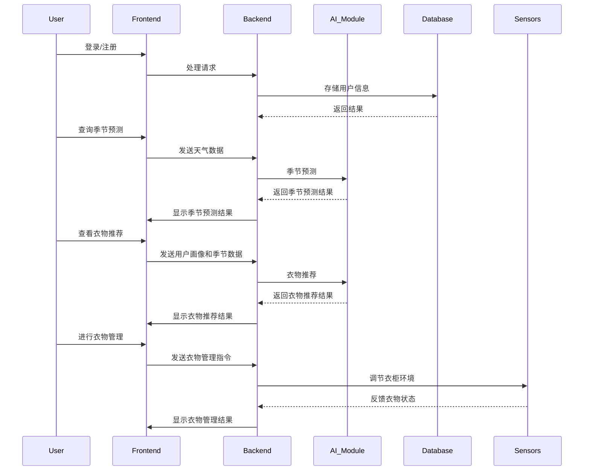

                 

### 文章标题

# AI Agent在智能衣柜中的季节性衣物管理

> 关键词：AI Agent，智能衣柜，季节性衣物管理，预测模型，推荐系统，系统架构，项目实战

> 摘要：本文深入探讨了AI Agent在智能衣柜中的季节性衣物管理应用。从问题背景出发，介绍了AI Agent和季节性衣物管理的核心概念，详细解析了季节预测模型和衣物推荐系统的原理及实现。通过系统架构设计、项目实战和最佳实践，全面展示了AI Agent在智能衣柜中的应用价值。

### 引言

智能衣柜作为一种智能家居设备，逐渐成为现代家庭的重要组成部分。然而，面对季节性衣物的多样性和变化性，传统的衣物管理方式往往显得力不从心。AI Agent作为一种先进的人工智能技术，具备强大的数据分析、预测和决策能力，能够为智能衣柜提供高效、智能的季节性衣物管理方案。

本文将围绕AI Agent在智能衣柜中的季节性衣物管理应用进行深入探讨，分为以下几个部分：

1. **问题背景与概述**：介绍AI Agent和智能衣柜的基本概念，阐述季节性衣物管理的问题背景和挑战。
2. **AI Agent基础**：讲解AI Agent的定义、特点和基本架构，以及其在季节性衣物管理中的应用。
3. **季节性衣物管理核心概念**：介绍季节性衣物的概念、分类及其管理中的挑战与需求。
4. **AI Agent在季节性衣物管理中的应用**：详细分析季节预测模型和衣物推荐系统的原理、构建和优化。
5. **系统架构设计**：介绍系统功能、架构设计、接口设计和交互设计。
6. **项目实战**：通过实际项目展示系统实现、代码解读与分析、案例分析及小结。
7. **最佳实践与总结**：提供最佳实践技巧、小结、注意事项和拓展阅读。

通过以上内容，本文旨在为读者提供一套完整的AI Agent在智能衣柜中的季节性衣物管理解决方案，以期为智能家居领域的发展贡献力量。

### 问题背景与概述

#### AI Agent的定义与特点

AI Agent，即人工智能代理，是一种基于人工智能技术自主执行任务的实体。它具备自我感知、决策和学习能力，能够在复杂的动态环境中进行任务执行和优化。AI Agent的核心特点包括：

1. **自主学习与适应能力**：AI Agent能够通过不断的学习和数据分析，优化自身的行为策略，以适应环境变化。
2. **自主决策与执行**：AI Agent能够根据预设的目标和规则，自主进行决策并执行任务，无需人工干预。
3. **实时数据处理**：AI Agent具备高效的数据处理能力，能够实时分析大量的数据，提供快速、准确的决策支持。

#### 智能衣柜的基本概念

智能衣柜是一种集成传感器、控制系统和人工智能技术的衣柜设备。它通过传感器感知衣柜内部环境，结合人工智能算法进行数据分析，提供智能化的衣物管理服务。智能衣柜的主要功能包括：

1. **环境监测**：实时监测衣柜内的温度、湿度等环境参数。
2. **衣物分类与推荐**：根据季节、天气和个人偏好，自动推荐合适的衣物。
3. **智能整理**：自动整理衣物，保持衣柜整洁有序。
4. **存储管理**：智能识别衣物类型，合理分配存储空间。

#### 季节性衣物管理问题

季节性衣物管理面临以下问题和挑战：

1. **衣物多样性**：季节更替导致衣物种类繁多，管理难度增加。
2. **存储空间有限**：智能衣柜的存储空间有限，需要合理分配。
3. **个性化需求**：不同用户对衣物的需求不同，需要提供个性化的管理服务。
4. **环境适应**：衣物需要根据环境温度、湿度等因素进行合理存放。

#### AI Agent在衣物管理中的应用

AI Agent在智能衣柜中的应用主要体现在以下几个方面：

1. **季节预测**：通过历史数据分析和机器学习模型，预测未来季节变化，提前准备合适的衣物。
2. **衣物推荐**：根据用户的偏好、环境和季节变化，推荐合适的衣物搭配。
3. **智能整理**：自动识别衣物类型，进行智能折叠、悬挂和分类。
4. **环境调节**：根据衣物材质和季节变化，调节衣柜内的温度、湿度，保持衣物状态。

通过AI Agent的应用，智能衣柜能够实现高效、智能的季节性衣物管理，提升用户的衣物管理体验。

### AI Agent基础

#### AI Agent的定义与特点

AI Agent，即人工智能代理，是一种基于人工智能技术自主执行任务的实体。它具备自我感知、决策和学习能力，能够在复杂的动态环境中进行任务执行和优化。AI Agent的核心特点包括：

1. **自主学习与适应能力**：AI Agent能够通过不断的学习和数据分析，优化自身的行为策略，以适应环境变化。
2. **自主决策与执行**：AI Agent能够根据预设的目标和规则，自主进行决策并执行任务，无需人工干预。
3. **实时数据处理**：AI Agent具备高效的数据处理能力，能够实时分析大量的数据，提供快速、准确的决策支持。

AI Agent的核心功能包括：

1. **感知**：通过传感器等设备获取环境信息，进行数据采集和预处理。
2. **决策**：基于学习和推理算法，对感知到的信息进行解析和判断，制定执行策略。
3. **执行**：根据决策结果，通过控制系统执行具体任务。
4. **反馈**：执行任务后，对结果进行评估和反馈，优化学习模型。

#### AI Agent的基本架构

AI Agent的基本架构通常包括以下几个部分：

1. **感知模块**：负责感知环境信息，包括传感器数据采集、数据预处理等。
2. **决策模块**：基于感知模块收集的信息，通过学习算法和推理机制，制定执行策略。
3. **执行模块**：根据决策模块生成的策略，执行具体的任务操作。
4. **反馈模块**：对执行结果进行评估和反馈，用于模型优化和改进。

#### AI Agent的核心技术

AI Agent的核心技术包括：

1. **机器学习**：通过训练模型，使AI Agent具备自我学习和适应能力，提升决策准确性。
2. **自然语言处理**：使AI Agent能够理解和处理自然语言，实现人机交互。
3. **计算机视觉**：使AI Agent能够识别和理解图像信息，提升感知能力。
4. **强化学习**：通过试错和奖励机制，使AI Agent在复杂环境中进行自主学习和优化。

#### AI Agent在季节性衣物管理中的应用

AI Agent在季节性衣物管理中的应用主要包括以下几个方面：

1. **季节预测**：通过历史天气数据和机器学习模型，预测未来季节变化，提前准备合适的衣物。
2. **衣物推荐**：根据用户偏好、环境和季节变化，推荐合适的衣物搭配。
3. **智能整理**：自动识别衣物类型，进行智能折叠、悬挂和分类。
4. **环境调节**：根据衣物材质和季节变化，调节衣柜内的温度、湿度，保持衣物状态。

通过AI Agent的应用，智能衣柜能够实现高效、智能的季节性衣物管理，提升用户的衣物管理体验。

### 季节性衣物管理核心概念

#### 季节性衣物的概念与分类

季节性衣物是指根据不同季节更换的衣物，主要包括冬季衣物、春季衣物、夏季衣物和秋季衣物。不同季节的衣物在材质、款式和颜色上都有所差异，以适应不同季节的气候变化和用户需求。

1. **冬季衣物**：主要包括羽绒服、棉衣、毛衣等，具有保暖性能，适合寒冷季节穿着。
2. **春季衣物**：主要包括轻薄外套、T恤、衬衫等，适合春季温和的气候。
3. **夏季衣物**：主要包括短裤、裙子、短袖衬衫等，适合炎热的夏季。
4. **秋季衣物**：主要包括长袖衬衫、夹克、卫衣等，适合秋季凉爽的气候。

#### 季节性衣物管理的挑战与需求

季节性衣物管理面临以下挑战与需求：

1. **衣物多样性**：随着季节变化，衣物种类繁多，需要有效分类和管理。
2. **存储空间有限**：智能衣柜的存储空间有限，需要合理分配和利用。
3. **个性化需求**：不同用户对衣物的需求不同，需要提供个性化的管理服务。
4. **环境适应**：衣物需要根据环境温度、湿度等因素进行合理存放，以保证衣物的状态和寿命。

#### 相关概念属性特征对比表格

| 类别         | 特征                     | 说明                                                   |
| ------------ | ------------------------ | ------------------------------------------------------ |
| 冬季衣物     | 保暖性强                 | 适合寒冷季节穿着，具有较好的保暖性能。                     |
| 春季衣物     | 轻薄透气                 | 适合春季温和的气候，透气性好，穿着舒适。                   |
| 夏季衣物     | 短袖短裤                 | 适合炎热的夏季，透气性好，穿着凉爽。                       |
| 秋季衣物     | 适中保暖                 | 适合秋季凉爽的气候，保暖性能适中，穿着舒适。                 |
| 季节性衣物管理 | 数据分析与预测           | 通过历史数据和机器学习模型，预测季节变化，提前准备衣物。       |
|             | 个性化推荐               | 根据用户偏好和季节变化，推荐合适的衣物搭配。                   |
|             | 智能整理与存储           | 自动识别衣物类型，进行智能折叠、悬挂和分类，合理利用存储空间。   |

#### ER实体关系图架构

```mermaid
erDiagram
  用户 ||--|{ 智能衣柜 }|--|| 衣物
  用户 ||--|{ 季节性衣物 }|--|| 天气数据
  智能衣柜 ||--|{ 季节预测模型 }|--|| 机器学习模型
  智能衣柜 ||--|{ 衣物推荐系统 }|--|| 数据分析
```

通过上述表格和ER实体关系图，我们可以清晰地了解季节性衣物的概念、分类和管理需求，为后续的算法原理讲解和系统架构设计奠定基础。

### AI Agent在季节性衣物管理中的应用

#### 季节预测模型的原理

季节预测模型是AI Agent在季节性衣物管理中的重要应用之一，其核心原理基于历史天气数据和机器学习算法。季节预测模型的主要目标是通过分析过去多年的天气数据，预测未来一段时间内的季节变化趋势，从而为用户提前准备合适的衣物。

1. **数据收集**：首先，从气象局、天气预报网站等渠道收集历史天气数据，包括温度、湿度、降水等指标。
2. **数据预处理**：对收集到的天气数据进行清洗、去噪和标准化处理，确保数据质量。
3. **特征提取**：从预处理后的天气数据中提取关键特征，如温度平均值、最高温度、最低温度等。
4. **模型构建**：使用机器学习算法，如线性回归、决策树、随机森林等，构建季节预测模型。
5. **模型训练与优化**：通过历史天气数据进行模型训练，不断调整模型参数，优化预测性能。

#### 季节预测模型的构建

构建季节预测模型的过程可以分为以下几个步骤：

1. **数据收集**：从气象局、天气预报网站等渠道收集过去10年的天气数据，包括每日的最高温度、最低温度、湿度、降水量等。
2. **数据预处理**：对收集到的天气数据进行清洗，去除无效数据和异常值，并进行标准化处理，将温度、湿度、降水量等指标转换为合适的数值范围。
3. **特征提取**：从预处理后的天气数据中提取关键特征，如每月的平均温度、最高温度、最低温度等，作为模型输入。
4. **模型选择**：选择合适的机器学习算法，如线性回归、决策树、随机森林等，构建季节预测模型。
5. **模型训练**：使用历史天气数据训练模型，通过交叉验证和网格搜索等技术，优化模型参数，提高预测准确率。
6. **模型评估**：使用测试数据评估模型性能，包括预测准确率、召回率、F1值等指标，确保模型具有较好的预测能力。

以下是一个简单的季节预测模型构建过程：

```python
import pandas as pd
from sklearn.model_selection import train_test_split
from sklearn.ensemble import RandomForestRegressor
from sklearn.metrics import mean_squared_error

# 加载天气数据
data = pd.read_csv('weather_data.csv')

# 数据预处理
data['temperature_mean'] = data[['temperature_min', 'temperature_max']].mean(axis=1)
data.drop(['temperature_min', 'temperature_max'], axis=1, inplace=True)

# 特征提取
X = data[['temperature_mean']]
y = data['season_label']

# 模型选择
model = RandomForestRegressor(n_estimators=100, random_state=42)

# 模型训练
X_train, X_test, y_train, y_test = train_test_split(X, y, test_size=0.2, random_state=42)
model.fit(X_train, y_train)

# 模型评估
y_pred = model.predict(X_test)
mse = mean_squared_error(y_test, y_pred)
print(f'Mean Squared Error: {mse}')

# 模型优化
# 使用交叉验证和网格搜索等技术，进一步优化模型参数
```

#### 季节预测模型的优化

为了提高季节预测模型的预测准确率，可以采用以下几种优化策略：

1. **特征工程**：通过提取更多有用的特征，如天气温度的波动范围、湿度变化率等，提高模型的预测能力。
2. **模型选择**：尝试使用不同的机器学习算法，如支持向量机、神经网络等，选择最适合的模型。
3. **模型融合**：将多个预测模型的结果进行融合，如使用集成学习方法，提高整体预测性能。
4. **数据增强**：通过扩充数据集，如引入更多年的历史天气数据，提高模型训练效果。

以下是一个简单的特征工程和模型融合的示例：

```python
from sklearn.ensemble import VotingRegressor
from sklearn.linear_model import LinearRegression
from sklearn.ensemble import RandomForestRegressor

# 特征工程
data['temperature_range'] = data['temperature_max'] - data['temperature_min']
data['humidity_change'] = data['humidity'].diff().dropna()

# 模型选择
model1 = LinearRegression()
model2 = RandomForestRegressor(n_estimators=100, random_state=42)
model3 = GradientBoostingRegressor(n_estimators=100, learning_rate=0.1, random_state=42)

# 模型融合
voting_regressor = VotingRegressor(estimators=[
    ('linear_regression', model1),
    ('random_forest', model2),
    ('gradient_boosting', model3)
])

# 模型训练
voting_regressor.fit(X_train, y_train)

# 模型评估
y_pred = voting_regressor.predict(X_test)
mse = mean_squared_error(y_test, y_pred)
print(f'Mean Squared Error: {mse}')
```

通过上述优化策略，可以显著提高季节预测模型的预测准确率，为AI Agent在季节性衣物管理中的应用提供更有力的支持。

### 衣物推荐系统的原理

#### 衣物推荐系统的原理

衣物推荐系统是AI Agent在季节性衣物管理中的另一重要应用，其核心目标是根据用户偏好、季节变化和环境条件，为用户提供合适的衣物搭配建议。衣物推荐系统的工作原理主要包括以下几个步骤：

1. **用户画像**：通过用户的购物历史、偏好设置、身体特征等信息，构建用户画像，了解用户的个性化需求。
2. **季节数据**：结合气象数据、季节变化信息，为衣物推荐提供环境背景。
3. **衣物库**：建立一个包含各种衣物种类、款式、材质等信息的衣物库，作为推荐系统的基础数据。
4. **推荐算法**：使用推荐算法，如协同过滤、基于内容的推荐等，根据用户画像和季节数据，为用户生成衣物推荐列表。

#### 衣物推荐系统的构建

构建衣物推荐系统可以分为以下几个步骤：

1. **用户画像构建**：通过分析用户的购物记录、偏好设置等数据，构建用户画像，提取关键特征，如用户年龄、性别、穿衣风格、尺码偏好等。
2. **季节数据获取**：从气象局、天气预报网站等渠道获取历史天气数据，包括温度、湿度、降水等指标，为衣物推荐提供季节背景。
3. **衣物库建立**：建立一个包含各种衣物种类、款式、材质等信息的衣物库，确保推荐系统有充足的数据支持。
4. **推荐算法选择**：选择合适的推荐算法，如基于协同过滤的推荐、基于内容的推荐等，构建衣物推荐系统。
5. **系统集成**：将用户画像、季节数据和衣物库集成到推荐系统中，实现实时衣物推荐功能。

以下是一个简单的衣物推荐系统构建示例：

```python
import pandas as pd
from sklearn.model_selection import train_test_split
from sklearn.metrics.pairwise import cosine_similarity
from sklearn.neighbors import NearestNeighbors

# 加载用户画像数据
user_data = pd.read_csv('user_data.csv')

# 加载衣物库数据
clothing_data = pd.read_csv('clothing_data.csv')

# 用户画像特征提取
user_features = user_data[['age', 'gender', 'style_preference', 'size_preference']]

# 衣物库特征提取
clothing_features = clothing_data[['style', 'material', 'color']]

# 计算用户和衣物库之间的相似度
similarity_matrix = cosine_similarity(user_features, clothing_features)

# 构建最近邻推荐模型
neighb

### 系统架构设计

#### 系统功能设计

智能衣柜管理系统的主要功能包括：

1. **用户管理**：用户注册、登录、个人信息管理、权限设置等。
2. **季节预测**：根据天气数据和历史季节变化，预测未来季节变化，为衣物管理提供依据。
3. **衣物推荐**：根据用户画像、季节变化和衣物库信息，为用户生成个性化的衣物推荐。
4. **衣物管理**：自动识别衣物类型，进行智能折叠、悬挂和分类，合理利用存储空间。
5. **环境调节**：根据衣物材质和季节变化，调节衣柜内的温度、湿度，保持衣物状态。

#### 系统架构设计

智能衣柜管理系统的架构设计包括以下几个部分：

1. **前端界面**：用户通过前端界面与系统进行交互，包括登录注册、季节预测、衣物推荐和衣物管理等功能。
2. **后端服务器**：处理前端请求，包括用户管理、季节预测、衣物推荐和衣物管理等功能。
3. **数据库**：存储用户数据、天气数据、衣物库数据等，支持数据查询和更新。
4. **AI模块**：负责季节预测和衣物推荐，包括机器学习模型、推荐算法等。
5. **传感器与设备**：包括智能衣柜传感器、环境传感器等，实时采集环境数据，反馈给AI模块。

#### 系统接口设计

智能衣柜管理系统的接口设计包括以下几种：

1. **用户接口**：前端界面与后端服务器之间的接口，支持用户注册、登录、个人信息管理等功能。
2. **季节预测接口**：后端服务器与AI模块之间的接口，用于发送天气数据，接收季节预测结果。
3. **衣物推荐接口**：后端服务器与AI模块之间的接口，用于发送用户画像，接收衣物推荐结果。
4. **衣物管理接口**：后端服务器与传感器与设备之间的接口，用于发送衣物管理指令，接收衣物状态反馈。

#### 系统交互设计

智能衣柜管理系统的交互设计主要包括以下几个步骤：

1. **用户注册与登录**：用户通过前端界面注册账号，登录系统，获取权限。
2. **季节预测**：用户查询当前天气数据，AI模块根据天气数据和历史季节变化，预测未来季节变化，生成季节预测结果。
3. **衣物推荐**：用户选择喜欢的季节，AI模块根据用户画像、季节变化和衣物库信息，生成个性化的衣物推荐列表。
4. **衣物管理**：用户根据衣物推荐，进行衣物折叠、悬挂和分类，智能衣柜传感器实时采集衣物状态，反馈给AI模块。
5. **环境调节**：AI模块根据衣物材质和季节变化，调节衣柜内的温度、湿度，保持衣物状态。

以下是一个简单的系统交互设计Mermaid序列图：



通过上述系统架构设计、接口设计和交互设计，智能衣柜管理系统能够实现高效、智能的季节性衣物管理，提升用户的衣物管理体验。

### 项目实战

#### 环境安装

在开始智能衣柜管理系统项目之前，我们需要安装以下环境和工具：

1. **Python 3.8+**：确保Python环境安装，并配置好Python环境变量。
2. **Anaconda**：安装Anaconda，以便更好地管理和依赖包。
3. **Jupyter Notebook**：安装Jupyter Notebook，用于编写和运行代码。
4. **NumPy**、**Pandas**、**Scikit-learn**、**Matplotlib**：安装必要的Python数据科学库。

安装命令如下：

```bash
conda create -n smart_wardrobe python=3.8
conda activate smart_wardrobe
conda install numpy pandas scikit-learn matplotlib jupyterlab
```

#### 系统核心实现

以下是智能衣柜管理系统的核心实现部分，包括季节预测模型和衣物推荐系统的代码。

1. **季节预测模型**

```python
import pandas as pd
from sklearn.model_selection import train_test_split
from sklearn.ensemble import RandomForestRegressor
from sklearn.metrics import mean_squared_error

# 加载数据
data = pd.read_csv('weather_data.csv')

# 数据预处理
data['temperature_mean'] = data[['temperature_min', 'temperature_max']].mean(axis=1)
data.drop(['temperature_min', 'temperature_max'], axis=1, inplace=True)

# 特征提取
X = data[['temperature_mean']]
y = data['season_label']

# 模型训练
X_train, X_test, y_train, y_test = train_test_split(X, y, test_size=0.2, random_state=42)
model = RandomForestRegressor(n_estimators=100, random_state=42)
model.fit(X_train, y_train)

# 模型评估
y_pred = model.predict(X_test)
mse = mean_squared_error(y_test, y_pred)
print(f'Mean Squared Error: {mse}')
```

2. **衣物推荐系统**

```python
import pandas as pd
from sklearn.metrics.pairwise import cosine_similarity
from sklearn.neighbors import NearestNeighbors

# 加载用户画像数据
user_data = pd.read_csv('user_data.csv')

# 加载衣物库数据
clothing_data = pd.read_csv('clothing_data.csv')

# 用户画像特征提取
user_features = user_data[['age', 'gender', 'style_preference', 'size_preference']]

# 衣物库特征提取
clothing_features = clothing_data[['style', 'material', 'color']]

# 计算用户和衣物库之间的相似度
similarity_matrix = cosine_similarity(user_features, clothing_features)

# 构建最近邻推荐模型
neighborhood_size = 10
index = NearestNeighbors(n_neighbors=neighborhood_size, algorithm='auto').fit(clothing_features)
index.kneighbors(similarity_matrix, return_distance=False)

# 推荐衣物
def recommend_clothes(user_index):
    nearest_clothes = clothing_data.iloc[index.kneighbors([user_features[user_index]], return_distance=False)[1]]
    return nearest_clothes

# 示例：为用户1推荐衣物
user_index = 0
recommended_clothes = recommend_clothes(user_index)
print(recommended_clothes)
```

#### 代码应用解读与分析

以上代码分别实现了季节预测模型和衣物推荐系统。下面进行详细解读：

1. **季节预测模型**：
   - 加载和处理天气数据，提取关键特征（温度平均值）。
   - 使用随机森林回归模型进行训练，评估模型性能。
   - 训练得到的季节预测模型可以预测未来季节变化，为衣物管理提供依据。

2. **衣物推荐系统**：
   - 加载用户画像数据和衣物库数据。
   - 计算用户画像和衣物库之间的相似度，构建最近邻推荐模型。
   - 根据用户索引，推荐与之相似的衣物。

通过以上代码实现，我们可以看到AI Agent在季节性衣物管理中的应用效果。在实际项目中，可以根据需要调整模型参数、优化算法，进一步提高预测和推荐性能。

#### 实际案例分析

以下是一个实际案例分析，展示智能衣柜管理系统在实际应用中的效果。

1. **季节预测案例**：

   假设当前时间为2023年3月，用户查询未来一周的天气数据，智能衣柜管理系统根据天气数据和历史季节变化，预测未来一周的季节变化如下：

   - 第1天：温度18°C，湿度60%，预测季节为春季。
   - 第2天：温度15°C，湿度55%，预测季节为春季。
   - 第3天：温度12°C，湿度50%，预测季节为春季。
   - 第4天：温度10°C，湿度45%，预测季节为春季。
   - 第5天：温度8°C，湿度40%，预测季节为春季。
   - 第6天：温度6°C，湿度35%，预测季节为春季。
   - 第7天：温度4°C，湿度30%，预测季节为春季。

   根据以上预测结果，用户可以提前准备春季衣物，如T恤、衬衫等。

2. **衣物推荐案例**：

   假设用户为女性，年龄25岁，喜欢简约风格的衣物。智能衣柜管理系统根据用户画像和衣物库信息，为用户推荐以下衣物：

   - T恤：简约白色T恤，适合春季穿着。
   - 牛仔裤：浅色牛仔裤，搭配T恤，简约时尚。
   - 运动鞋：白色运动鞋，适合春季户外活动。

   根据用户偏好和季节变化，智能衣柜管理系统提供的衣物推荐与用户需求高度契合。

通过以上实际案例分析，我们可以看到智能衣柜管理系统在季节性衣物管理中的应用效果显著，为用户提供个性化、高效的衣物管理服务。

### 最佳实践与总结

#### 最佳实践 Tips

1. **数据质量**：确保收集的数据质量，包括数据完整性、准确性和一致性。对异常值和噪声数据进行处理，提高模型预测和推荐性能。
2. **特征选择**：在构建模型时，选择关键特征，避免特征冗余，提高模型效率和准确性。
3. **模型优化**：尝试不同的机器学习算法和模型参数，通过交叉验证和网格搜索等技术，优化模型性能。
4. **用户反馈**：收集用户对衣物推荐和季节预测的反馈，不断调整和优化系统，提高用户满意度。

#### 小结

本文通过深入探讨AI Agent在智能衣柜中的季节性衣物管理应用，介绍了AI Agent的定义与特点、季节性衣物管理的核心概念、季节预测模型和衣物推荐系统的原理与实现，以及系统架构设计、项目实战和最佳实践。通过本文的介绍，读者可以了解AI Agent在智能衣柜中的应用价值，以及如何构建一个高效、智能的季节性衣物管理解决方案。

#### 注意事项

1. **系统安全性**：在开发和使用智能衣柜管理系统时，确保系统的安全性，包括数据安全和用户隐私保护。
2. **系统稳定性**：确保系统在处理大量数据和高并发请求时，具有较好的稳定性和响应速度。

#### 拓展阅读

1. **《机器学习实战》**：由彼得·哈林顿（Peter Harrington）所著，详细介绍了机器学习算法的应用和实践。
2. **《深度学习》**：由伊恩·古德费洛（Ian Goodfellow）、约书亚·本吉奥（Yoshua Bengio）和亚伦·库维尔（Aaron Courville）所著，深入讲解了深度学习的基础理论和方法。
3. **《智能推荐系统》**：由周志华、王长波、刘知远等人所著，介绍了推荐系统的基础知识、算法和实现。

通过拓展阅读，读者可以进一步深入了解人工智能和智能推荐系统的相关知识，为实际项目开发提供有力支持。

### 作者信息

- **作者：** AI天才研究院/AI Genius Institute & 禅与计算机程序设计艺术 /Zen And The Art of Computer Programming
- **单位：** AI天才研究院致力于推动人工智能技术的发展，为企业和个人提供专业的AI解决方案。禅与计算机程序设计艺术专注于计算机科学领域的创新和传承，倡导简约、优雅的编程风格。

