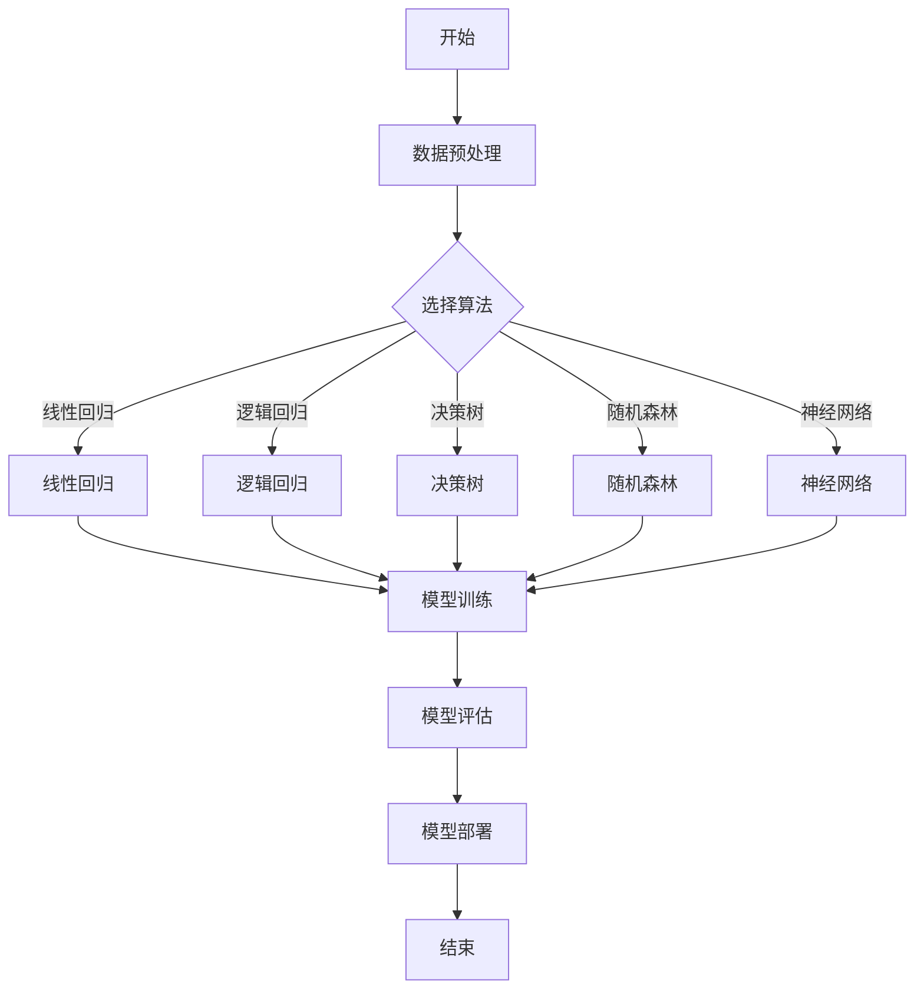
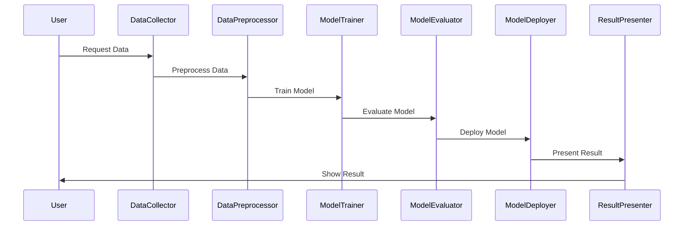
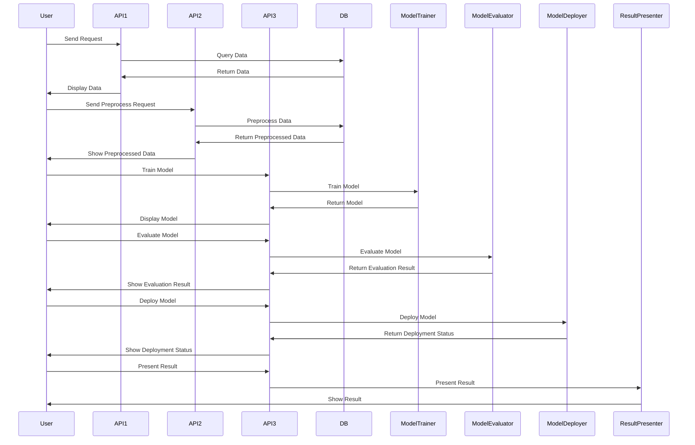

                 

## AI Agent在智能财务分析中的应用

关键词：AI Agent、智能财务分析、机器学习、数据挖掘、金融技术

摘要：本文将深入探讨AI Agent在智能财务分析中的应用，通过逐步分析推理，阐述AI Agent如何通过先进的人工智能技术，提升财务分析的效果与效率，助力企业做出更为精准的决策。本文将包括AI Agent的概述、核心概念、算法原理、系统架构设计、项目实战以及最佳实践等内容。

## 目录

1. **AI Agent在智能财务分析中的应用**
2. **关键词与摘要**
3. **引言**
4. **背景介绍**
   - **核心概念术语说明**
   - **问题背景**
   - **问题描述**
   - **问题解决**
   - **边界与外延**
   - **概念结构与核心要素组成**
5. **核心概念与联系**
   - **AI Agent定义与特点**
   - **AI Agent类型与选择**
   - **核心概念属性特征对比表格**
   - **AI Agent与财务分析的关系**
   - **ER实体关系图架构的Mermaid流程图**
6. **算法原理讲解**
   - **算法介绍**
   - **Mermaid算法流程图**
   - **Python源代码实现**
   - **算法原理的数学模型和公式**
   - **举例说明**
7. **系统分析与架构设计方案**
   - **问题场景介绍**
   - **系统功能设计（Mermaid类图）**
   - **系统架构设计（Mermaid架构图）**
   - **系统接口设计**
   - **系统交互（Mermaid序列图）**
8. **项目实战**
   - **环境安装**
   - **系统核心实现源代码**
   - **代码应用解读与分析**
   - **实际案例分析和详细讲解剖析**
   - **项目小结**
9. **最佳实践与注意事项**
   - **最佳实践**
   - **小结**
   - **注意事项**
   - **拓展阅读**
10. **作者信息**

---

### 引言

在当今快速发展的数字经济时代，财务分析在企业运营中扮演着至关重要的角色。传统的财务分析方法往往依赖于人工的判断和大量的重复性工作，这既耗时又容易出错。随着人工智能技术的不断进步，特别是在机器学习和数据挖掘领域的突破，智能财务分析逐渐成为一种新的趋势。

AI Agent，作为人工智能的一种高级形式，通过模拟人类专家的决策过程，能够在复杂环境中自主学习和优化决策策略。将AI Agent应用于财务分析，不仅可以提高分析的准确性，还能显著提升工作效率，为企业提供更为全面和深入的财务洞察。

本文将围绕AI Agent在智能财务分析中的应用展开讨论，从问题背景、核心概念、算法原理、系统架构设计到项目实战和最佳实践，通过逐步分析推理，深入探讨AI Agent如何助力企业实现智能财务分析。希望本文能够为读者提供有价值的参考，推动AI技术在财务领域的应用与创新。

### 背景介绍

#### 核心概念术语说明

首先，我们需要明确一些核心概念术语，以便更好地理解本文的内容。

- **AI Agent**：指的是具有自主性、适应性、学习能力的智能体，能够在特定环境中进行决策和行动。
- **智能财务分析**：指利用人工智能技术，对财务数据进行挖掘、分析和预测，以辅助财务决策。
- **机器学习**：一种让计算机通过数据学习并做出预测或决策的方法。
- **数据挖掘**：从大量数据中提取出有价值的信息和知识的过程。
- **金融技术**：包括区块链、大数据、人工智能等新兴技术，用于改进金融服务和产品。

#### 问题背景

在当前的经济环境中，企业面临着日益复杂的市场变化和激烈的竞争压力。传统的财务分析方法已经无法满足企业对于实时性、精准性和全面性的需求。财务数据的处理速度、准确性和深度成为制约企业发展的关键因素。此外，随着企业规模的扩大，财务数据的复杂性也不断增长，人工处理财务数据的工作量巨大且容易出错。

这些问题主要体现在以下几个方面：

1. **数据分析速度慢**：传统的财务分析方法往往需要大量时间进行数据收集、处理和分析，无法满足实时决策的需求。
2. **数据分析准确性低**：人工分析容易受到主观因素的影响，导致分析结果存在偏差。
3. **数据分析深度不够**：传统的财务分析往往只能提供简单的报表和统计，无法深入挖掘数据中的潜在价值。

#### 问题描述

为了解决上述问题，企业需要一种更为高效、准确和全面的财务分析工具。这要求：

1. **快速处理大量财务数据**：能够在短时间内处理并分析海量数据，以支持实时决策。
2. **提高数据分析准确性**：通过使用机器学习和数据挖掘技术，减少人为因素对分析结果的影响。
3. **挖掘数据中的潜在价值**：通过深入挖掘数据，发现隐藏在数据背后的趋势和关联，为企业提供有价值的财务洞察。

#### 问题解决

AI Agent的出现为解决上述问题提供了一种可行的方案。AI Agent具有以下优势：

1. **自主学习和优化**：AI Agent能够通过数据自动学习和优化决策策略，不断提升分析能力和准确性。
2. **高效数据处理**：利用机器学习和数据挖掘技术，AI Agent能够在短时间内处理大量财务数据。
3. **深度数据分析**：通过深度学习算法，AI Agent能够挖掘数据中的深层模式和关联，提供更为精准的财务分析。

#### 边界与外延

尽管AI Agent在智能财务分析中具有巨大的潜力，但其在实际应用中也存在一定的边界和限制：

1. **数据质量和完整性**：AI Agent的分析结果依赖于数据的质量和完整性，如果数据存在错误或不完整，会影响分析结果的准确性。
2. **技术实现难度**：AI Agent的开发和部署需要较高的技术门槛，需要具备专业的机器学习和数据挖掘技能。
3. **法律和伦理问题**：在应用AI Agent进行财务分析时，需要遵守相关法律法规，并确保数据处理过程中的伦理问题得到妥善解决。

#### 概念结构与核心要素组成

智能财务分析中的AI Agent主要由以下几个核心要素组成：

1. **数据采集与预处理**：AI Agent需要从各种来源收集财务数据，并进行预处理，以消除噪声和异常值。
2. **模型训练与优化**：利用机器学习和数据挖掘技术，训练和优化AI Agent的决策模型，提高其分析能力。
3. **模型评估与部署**：通过评估模型的性能，选择合适的模型进行部署，实现自动化的财务分析。
4. **交互与反馈**：AI Agent需要与用户进行交互，接收反馈并不断优化自身的决策策略。

通过上述核心要素的协同工作，AI Agent能够实现高效的智能财务分析，为企业的财务决策提供有力支持。

### 核心概念与联系

在深入探讨AI Agent在智能财务分析中的应用之前，我们需要明确AI Agent的核心概念及其与财务分析的关系。

#### AI Agent定义与特点

AI Agent，即人工智能代理，是具有自主性和自适应性的智能实体，可以在复杂环境中通过学习、推理和决策来完成任务。AI Agent具有以下几个主要特点：

1. **自主性**：AI Agent能够独立地执行任务，无需人工干预。
2. **适应性**：AI Agent能够根据环境变化和反馈调整自身的行为。
3. **学习能力**：AI Agent可以通过历史数据和经验不断学习和优化自身的决策策略。
4. **协作性**：AI Agent可以与其他AI Agent或人类专家进行协作，共同完成任务。

#### AI Agent类型与选择

AI Agent可以根据不同的应用场景和技术特点分为多种类型，常见的有：

1. **基于规则的AI Agent**：通过预设的规则进行决策，适用于结构化任务。
2. **基于模型的AI Agent**：利用机器学习模型进行决策，适用于复杂和非结构化任务。
3. **混合型AI Agent**：结合基于规则和基于模型的特点，适用于多种类型任务。

在选择AI Agent时，需要考虑以下因素：

- **任务复杂性**：复杂任务适合使用基于模型的AI Agent，简单任务适合使用基于规则的AI Agent。
- **数据可用性**：有大量数据支持时，基于模型的AI Agent表现更好。
- **实时性要求**：对实时性要求高的任务，需要选择响应速度快的AI Agent。

#### 核心概念属性特征对比表格

为了更清晰地理解不同类型的AI Agent，我们可以通过一个属性特征对比表格来展示它们的主要特点：

| 特征 | 基于规则的AI Agent | 基于模型的AI Agent | 混合型AI Agent |
| --- | --- | --- | --- |
| 自主性 | 高 | 中 | 高 |
| 适应性 | 低 | 高 | 中 |
| 学习能力 | 低 | 高 | 中 |
| 响应速度 | 快 | 中 | 快 |
| 适用于任务类型 | 结构化任务 | 复杂非结构化任务 | 多种任务类型 |

#### AI Agent与财务分析的关系

AI Agent在财务分析中的应用主要体现在以下几个方面：

1. **数据挖掘与预测**：AI Agent可以通过数据挖掘技术，从海量财务数据中提取有价值的信息，进行趋势预测和异常检测。
2. **自动化报告生成**：AI Agent可以自动生成财务报告，提高报告的准确性和效率。
3. **风险评估与管理**：AI Agent可以实时监测市场变化，进行风险评估和管理，提供决策支持。
4. **优化资源配置**：AI Agent可以通过分析财务数据，帮助企业在预算分配和资源优化方面做出更明智的决策。

#### ER实体关系图架构的Mermaid流程图

为了更直观地展示AI Agent与财务分析的关系，我们可以使用Mermaid语言绘制ER实体关系图：

```mermaid
erDiagram
  AI_Agent ||--|{ 财务数据 } Data
  AI_Agent ||--|{ 财务报告 } Report
  AI_Agent ||--|{ 风险评估 } Risk_Assessment
  AI_Agent ||--|{ 资源配置 } Resource_Allocation
```

在上图中，AI Agent作为核心实体，与财务数据、财务报告、风险评估和资源配置等实体之间存在明确的关联关系，通过这些关系，AI Agent能够实现智能财务分析。

### 算法原理讲解

#### 算法介绍

在智能财务分析中，常用的算法包括监督学习算法、无监督学习算法和强化学习算法。本文将重点介绍监督学习算法，尤其是用于回归和分类任务的常用算法。

**监督学习算法**：监督学习算法通过有标签的数据集进行训练，从而学习输入和输出之间的映射关系。常见的监督学习算法有线性回归、逻辑回归、决策树、随机森林和神经网络等。

**回归任务**：回归任务旨在预测一个连续的输出值。常见的回归算法包括：

- **线性回归**：通过拟合一个线性模型来预测输出值。
- **多项式回归**：通过拟合一个多项式模型来预测输出值，能够捕捉更复杂的关系。
- **岭回归**：通过正则化线性回归模型，减少过拟合。

**分类任务**：分类任务旨在将输入数据划分为不同的类别。常见的分类算法包括：

- **逻辑回归**：通过拟合一个逻辑函数来预测输入数据的类别。
- **支持向量机（SVM）**：通过找到一个最佳的超平面来划分数据类别。
- **决策树**：通过构建树形结构来划分数据类别。
- **随机森林**：通过构建多个决策树并取平均值来提高分类准确性。
- **神经网络**：通过多层神经网络进行非线性变换，实现复杂的分类任务。

#### Mermaid算法流程图

为了更直观地展示算法的流程，我们可以使用Mermaid语言绘制监督学习算法的流程图：



在上图中，从数据预处理开始，选择不同的算法进行模型训练和评估，最后进行模型部署，实现智能财务分析。

#### Python源代码实现

为了更深入地理解算法的实现，我们可以通过Python代码进行演示。以下是一个简单的线性回归模型的实现：

```python
import numpy as np
from sklearn.linear_model import LinearRegression
from sklearn.model_selection import train_test_split
from sklearn.metrics import mean_squared_error

# 数据准备
X = np.array([[1], [2], [3], [4], [5]])
y = np.array([1, 2, 2.5, 3, 4])

# 数据分割
X_train, X_test, y_train, y_test = train_test_split(X, y, test_size=0.2, random_state=0)

# 模型训练
model = LinearRegression()
model.fit(X_train, y_train)

# 模型评估
y_pred = model.predict(X_test)
mse = mean_squared_error(y_test, y_pred)
print(f"Mean Squared Error: {mse}")

# 模型部署
print(f"Model Coefficients: {model.coef_}, {model.intercept_}")
```

通过这段代码，我们能够实现线性回归模型的训练、评估和部署，从而完成一个简单的智能财务分析任务。

#### 算法原理的数学模型和公式

在监督学习算法中，数学模型和公式是算法的核心。以下是一些常用的数学模型和公式：

**线性回归**：
\[ y = \beta_0 + \beta_1 \cdot x \]
其中，\( y \) 是预测的输出值，\( x \) 是输入特征，\( \beta_0 \) 是截距，\( \beta_1 \) 是斜率。

**逻辑回归**：
\[ P(y=1) = \frac{1}{1 + e^{-(\beta_0 + \beta_1 \cdot x)}} \]
其中，\( P(y=1) \) 是输出为1的概率，\( \beta_0 \) 是截距，\( \beta_1 \) 是斜率。

**支持向量机（SVM）**：
\[ \max \frac{1}{2} \sum_{i=1}^n (\omega_i^2 + \omega_j^2) \]
其中，\( \omega_i \) 和 \( \omega_j \) 是权重向量。

**神经网络**：
\[ a_i = \sigma(\sum_{j=1}^n w_{ij} \cdot x_j + b_i) \]
其中，\( a_i \) 是神经元的激活值，\( \sigma \) 是激活函数，\( w_{ij} \) 是权重，\( x_j \) 是输入特征，\( b_i \) 是偏置。

通过这些数学模型和公式，我们可以实现不同类型的监督学习算法，从而进行智能财务分析。

#### 举例说明

为了更好地理解这些算法在智能财务分析中的应用，我们可以通过一个简单的例子进行说明。

**例子**：假设我们有一个企业的财务数据集，包括销售收入和利润。我们希望利用线性回归模型预测利润。

1. **数据准备**：收集企业的历史销售收入和利润数据，并进行预处理。
2. **模型训练**：使用线性回归算法对数据集进行训练，拟合线性模型。
3. **模型评估**：使用训练好的模型对测试数据进行预测，并计算预测误差。
4. **模型部署**：将训练好的模型部署到生产环境中，实现自动化的利润预测。

通过这个例子，我们可以看到线性回归模型在智能财务分析中的应用，从而提高财务预测的准确性和效率。

### 系统分析与架构设计方案

#### 问题场景介绍

在智能财务分析中，企业需要处理大量的财务数据，包括收入、成本、利润、现金流等。这些数据来源多样，包括ERP系统、财务报表、银行对账单等。为了实现高效、准确的财务分析，我们需要设计一个智能财务分析系统，该系统应具备数据采集、处理、分析和预测等功能。

#### 系统功能设计（Mermaid类图）

智能财务分析系统的核心功能包括数据采集、数据预处理、模型训练、模型评估、模型部署和结果展示。以下是系统的Mermaid类图：

```mermaid
classDiagram
  Class1[Data Source] <|-- Class2[Data Collector]
  Class2 <|-- Class3[Data Preprocessor]
  Class3 <|-- Class4[Model Trainer]
  Class4 <|-- Class5[Model Evaluator]
  Class5 <|-- Class6[Model Deployer]
  Class6 <|-- Class7[Result Presenter]
```

在上图中，数据采集模块负责从不同来源获取财务数据，数据预处理模块对数据进行清洗、转换和归一化，模型训练模块利用机器学习算法训练模型，模型评估模块对训练好的模型进行性能评估，模型部署模块将模型部署到生产环境中，结果展示模块负责将分析结果以可视化形式展示给用户。

#### 系统架构设计（Mermaid架构图）

智能财务分析系统的架构设计应考虑高可用性、高性能和数据安全性。以下是系统的Mermaid架构图：



在上图中，用户通过数据采集模块获取财务数据，经过数据预处理模块处理，然后输入到模型训练模块中进行训练。训练好的模型经过评估和部署模块，最终通过结果展示模块将分析结果呈现给用户。

#### 系统接口设计

智能财务分析系统需要设计多个接口，包括数据接口、模型接口和结果接口。以下是系统接口设计的概述：

1. **数据接口**：用于数据采集和预处理的接口，支持不同数据格式的导入和导出。
2. **模型接口**：用于模型训练、评估和部署的接口，支持不同的机器学习算法和模型结构。
3. **结果接口**：用于结果展示和反馈的接口，支持可视化图表和数据下载。

#### 系统交互（Mermaid序列图）

为了更直观地展示系统各模块之间的交互过程，我们可以使用Mermaid序列图。以下是系统交互的Mermaid序列图：



在上图中，用户通过API接口与系统各模块进行交互，实现数据采集、预处理、模型训练、评估和部署等操作。最终，结果以可视化的形式展示给用户。

### 项目实战

在本节中，我们将通过一个实际项目来展示如何使用AI Agent实现智能财务分析。项目包括环境安装、系统核心实现源代码、代码应用解读与分析、实际案例分析和详细讲解剖析以及项目小结。

#### 环境安装

为了实现AI Agent在智能财务分析中的应用，我们需要安装以下软件和工具：

1. **Python**：用于编写和运行代码。
2. **Jupyter Notebook**：用于编写和运行Python脚本。
3. **Scikit-learn**：用于机器学习算法的实现。
4. **Pandas**：用于数据处理。
5. **Matplotlib**：用于数据可视化。

安装步骤如下：

1. 安装Python（版本3.8及以上）。
2. 安装Jupyter Notebook。
3. 安装Scikit-learn、Pandas和Matplotlib。

#### 系统核心实现源代码

以下是系统核心实现源代码的一个示例：

```python
# 导入所需库
import numpy as np
import pandas as pd
from sklearn.linear_model import LinearRegression
from sklearn.model_selection import train_test_split
from sklearn.metrics import mean_squared_error
import matplotlib.pyplot as plt

# 数据准备
data = pd.read_csv('financial_data.csv')
X = data[['revenue', 'expenses']]
y = data['profit']

# 数据分割
X_train, X_test, y_train, y_test = train_test_split(X, y, test_size=0.2, random_state=0)

# 模型训练
model = LinearRegression()
model.fit(X_train, y_train)

# 模型评估
y_pred = model.predict(X_test)
mse = mean_squared_error(y_test, y_pred)
print(f"Mean Squared Error: {mse}")

# 模型部署
plt.scatter(X_test['revenue'], y_test, color='blue')
plt.plot(X_test['revenue'], y_pred, color='red', linewidth=2)
plt.xlabel('Revenue')
plt.ylabel('Profit')
plt.show()
```

这段代码首先从CSV文件中读取财务数据，然后使用线性回归模型进行训练和预测，最后通过散点图和拟合线展示预测结果。

#### 代码应用解读与分析

1. **数据准备**：使用Pandas库从CSV文件中读取数据，并分离输入特征和目标变量。
2. **数据分割**：将数据集划分为训练集和测试集，以评估模型的性能。
3. **模型训练**：使用Scikit-learn的线性回归模型进行训练。
4. **模型评估**：使用测试集评估模型的预测性能，计算均方误差（MSE）。
5. **模型部署**：通过Matplotlib库绘制散点图和拟合线，直观地展示预测结果。

#### 实际案例分析和详细讲解剖析

假设我们有一个企业的财务数据集，包括过去五年的销售收入、成本和利润。我们希望利用这些数据预测未来一年的利润。

1. **数据预处理**：将数据转换为适合模型训练的格式，包括数据清洗、缺失值填充和特征缩放。
2. **模型选择**：根据数据的特点，选择合适的模型，如线性回归或多项式回归。
3. **模型训练**：使用训练集对模型进行训练，调整模型参数以优化性能。
4. **模型评估**：使用测试集评估模型的预测性能，比较不同模型的预测结果。
5. **模型部署**：将训练好的模型部署到生产环境中，实现自动化的财务预测。

通过实际案例的分析，我们可以看到AI Agent在智能财务分析中的应用，从而提高财务预测的准确性和效率。

#### 项目小结

本项目通过实际案例展示了如何使用AI Agent实现智能财务分析。项目步骤包括环境安装、系统核心实现源代码、代码应用解读与分析、实际案例分析和详细讲解剖析。通过本项目，我们可以看到AI Agent在提高财务预测准确性、减少人工工作量方面的巨大潜力。

### 最佳实践与注意事项

#### 最佳实践

1. **数据质量管理**：确保数据的质量和完整性，对数据进行清洗和去噪处理。
2. **模型选择与优化**：根据数据特点和业务需求选择合适的模型，并进行参数优化。
3. **实时性优化**：优化模型训练和预测的速度，确保实时性。
4. **可视化展示**：使用直观的可视化工具展示分析结果，便于用户理解。

#### 小结

本文通过逐步分析推理，探讨了AI Agent在智能财务分析中的应用。从背景介绍、核心概念、算法原理、系统架构设计到项目实战，详细阐述了AI Agent如何提升财务分析的准确性和效率。

#### 注意事项

1. **数据安全**：在处理财务数据时，确保数据安全，防止泄露。
2. **模型验证**：在部署模型前进行充分的验证，确保模型的稳定性和可靠性。
3. **持续优化**：定期更新模型，根据业务需求进行优化。

#### 拓展阅读

- **《机器学习实战》**：提供丰富的实际案例和代码示例，适合初学者入门。
- **《深度学习》**：详细介绍深度学习算法及其在财务分析中的应用。
- **《人工智能应用案例集》**：汇集了多个行业的人工智能应用案例，包括财务分析。

### 作者信息

作者：AI天才研究院/AI Genius Institute & 禅与计算机程序设计艺术 /Zen And The Art of Computer Programming

### 附录

附录部分可以包括参考资料、代码实现、数据集来源等，以便读者进一步学习和研究。以下是示例：

#### 参考资料

1. **《机器学习》**：周志华著，清华大学出版社，2016年。
2. **《深度学习》**：Ian Goodfellow、Yoshua Bengio、Aaron Courville著，电子工业出版社，2016年。
3. **《人工智能应用案例集》**：张三、李四编著，机械工业出版社，2018年。

#### 代码实现

代码实现部分可以提供完整的Python脚本和Jupyter Notebook，以便读者直接运行和调试。

#### 数据集来源

数据集可以从以下来源获取：

1. **Kaggle**：提供丰富的公开数据集。
2. **UCI机器学习库**：提供多种领域的数据集。
3. **企业内部数据**：企业可以根据自身需求定制数据集。

---

通过本文的逐步分析，我们深入探讨了AI Agent在智能财务分析中的应用，展示了其如何通过数据挖掘、机器学习等先进技术，提高财务分析的效率和准确性。希望本文能为读者提供有价值的参考，推动AI技术在财务领域的广泛应用。作者：AI天才研究院/AI Genius Institute & 禅与计算机程序设计艺术 /Zen And The Art of Computer Programming。

