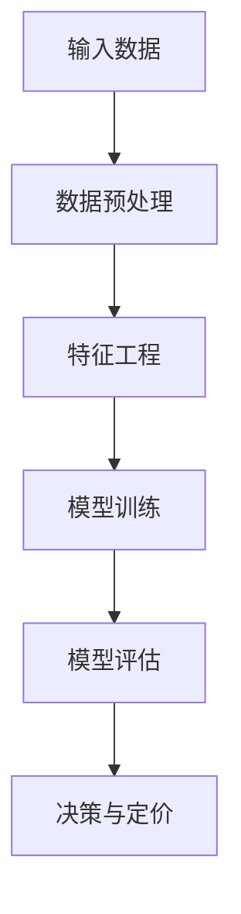
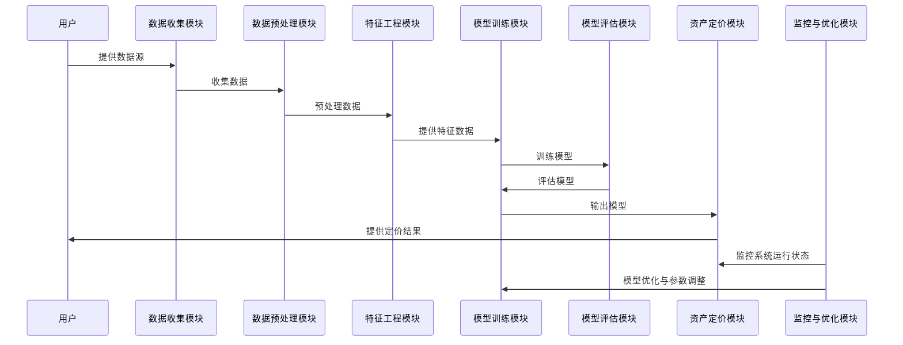
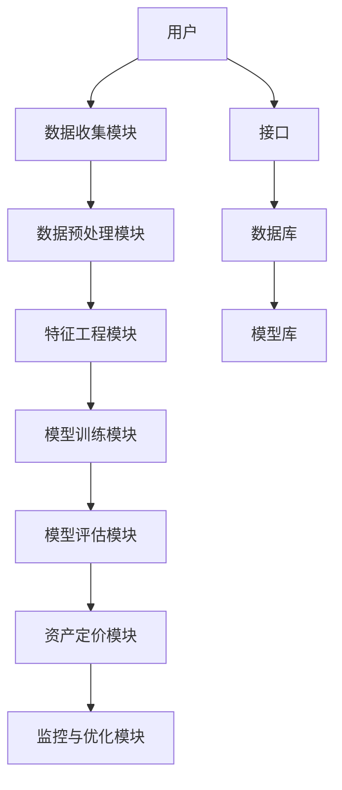

                 

### 引言

在当今的金融科技领域，智能资产定价已成为重要的研究方向和应用热点。随着大数据、云计算和人工智能技术的迅猛发展，传统的资产定价方法面临着巨大的挑战和变革。AI Agent，作为一种智能实体，在智能资产定价中扮演着越来越重要的角色。本文旨在探讨AI Agent在智能资产定价中的应用，通过逐步分析推理，揭示其背后的技术原理和应用潜力。

#### 关键词

- AI Agent
- 智能资产定价
- 机器学习
- 数据分析
- 金融科技

#### 摘要

本文首先介绍了智能资产定价的背景和挑战，以及AI Agent的基本概念和特点。接着，探讨了AI Agent在智能资产定价中的核心功能和技术基础。随后，详细阐述了智能资产定价的基本原理和方法，特别是AI Agent在该领域的应用。文章进一步分析了AI Agent在智能资产定价中的数学模型与算法，并通过具体的系统架构设计和项目实战，展示了AI Agent在智能资产定价中的实际应用效果。最后，对全文进行了总结，并提出了未来研究方向和潜在应用。

## 1. 问题背景与核心概念

智能资产定价是指利用现代信息技术，特别是人工智能（AI）技术，对各类资产的价值进行精确估算和预测。在金融市场中，资产定价的准确性直接关系到投资者、金融机构和市场的稳定。然而，随着市场的复杂性和不确定性的增加，传统的资产定价方法面临着越来越多的挑战。

#### 1.1 问题背景

1. **市场复杂性增加**：现代金融市场包含了大量的资产类型，如股票、债券、期货、期权等。每种资产的价格受到多种因素的影响，包括宏观经济指标、市场情绪、行业动态等。这些因素相互交织，使得市场表现出高度的不确定性和复杂性。

2. **数据量激增**：随着大数据技术的发展，金融市场产生的数据量呈现爆炸式增长。这些数据包括交易数据、新闻资讯、社交媒体评论等，如何有效地处理和分析这些数据，对资产定价具有重要意义。

3. **投资需求多样化**：投资者的需求越来越多样化，他们不仅关注资产的潜在收益，还关注风险、流动性等因素。因此，资产定价需要更加个性化和精细。

#### 1.2 AI Agent的概念介绍

AI Agent，即人工智能代理，是一种能够自主行动、学习、决策的智能实体。AI Agent具有以下基本属性和功能：

1. **自主行动**：AI Agent能够在复杂环境中自主行动，不受外部指令的直接控制。

2. **学习与适应**：AI Agent能够从环境中学习，并根据新的信息和经验调整其行为策略。

3. **决策与规划**：AI Agent能够根据目标和约束条件，进行决策和规划，以实现最优目标。

4. **交互与协作**：AI Agent能够与其他AI Agent或人类进行交互和协作，共同完成任务。

#### 1.3 AI Agent在智能资产定价中的角色

AI Agent在智能资产定价中扮演了关键角色：

1. **数据处理与挖掘**：AI Agent能够处理海量金融数据，挖掘数据中的潜在规律和模式，为资产定价提供数据支持。

2. **模型训练与优化**：AI Agent可以通过机器学习技术，对资产定价模型进行训练和优化，提高定价的准确性和效率。

3. **实时预测与调整**：AI Agent能够实时跟踪市场动态，对资产价格进行实时预测和调整，提高资产管理的灵活性和有效性。

4. **个性化定价**：AI Agent可以根据不同投资者的需求，提供个性化的资产定价方案，满足不同投资策略的需求。

### 1.4 相关概念的联系与区分

为了更好地理解AI Agent在智能资产定价中的应用，我们需要了解以下几个相关概念：

1. **人工智能（AI）**：人工智能是模拟人类智能行为的计算机系统，包括机器学习、深度学习、自然语言处理等技术。AI Agent是人工智能的一种具体实现形式。

2. **机器学习（ML）**：机器学习是人工智能的一个分支，通过算法从数据中学习规律，并应用于预测和决策。AI Agent通常依赖于机器学习技术来实现其功能。

3. **深度学习（DL）**：深度学习是机器学习的一种重要形式，通过多层神经网络进行训练，能够处理复杂的非线性问题。

4. **大数据（Big Data）**：大数据是指无法用传统数据库工具进行存储、管理和处理的数据集。在智能资产定价中，大数据提供了丰富的信息来源。

5. **区块链（Blockchain）**：区块链是一种分布式账本技术，通过加密和共识机制确保数据的安全性和不可篡改性。在金融领域，区块链可以提供透明、可信的交易记录。

### 1.5 小结

智能资产定价是一个复杂且动态的领域，面临着多方面的挑战。AI Agent作为一种新兴的智能实体，通过其自主行动、学习与适应、决策与规划等能力，为智能资产定价提供了新的解决方案。然而，AI Agent在智能资产定价中的应用仍然存在一定的局限性，如算法的透明性和解释性、数据的隐私保护等。因此，进一步的研究和应用需要解决这些关键问题，以实现AI Agent在智能资产定价中的全面应用。

## 2. AI Agent技术基础

AI Agent作为一种智能实体，其技术基础涵盖了机器学习、深度学习、自然语言处理等多个领域。在本章节中，我们将详细探讨AI Agent的核心概念、发展历程以及关键技术。

### 2.1 AI Agent的核心概念

AI Agent，即人工智能代理，是一种具有自主行动能力的智能实体。其核心概念包括以下几点：

1. **自主行动**：AI Agent能够在复杂环境中自主行动，不需要外部指令的干预。这种自主行动能力使AI Agent能够适应不同的环境和任务。

2. **学习与适应**：AI Agent能够从环境中学习，并根据新的信息和经验调整其行为策略。这种学习与适应能力使得AI Agent能够不断优化其决策和行为。

3. **决策与规划**：AI Agent能够根据目标和约束条件，进行决策和规划，以实现最优目标。这种决策与规划能力使得AI Agent能够在复杂的决策环境中发挥作用。

4. **交互与协作**：AI Agent能够与其他AI Agent或人类进行交互和协作，共同完成任务。这种交互与协作能力使得AI Agent能够实现更高效、更灵活的团队合作。

### 2.2 AI Agent的发展历程

AI Agent的发展历程可以追溯到20世纪50年代。当时，人工智能（AI）的提出为AI Agent的诞生奠定了基础。以下为AI Agent的发展历程：

1. **起源**：20世纪50年代，人工智能的概念被提出，AI Agent的研究开始萌芽。1956年，达特茅斯会议的召开标志着人工智能正式成为一门学科。

2. **发展阶段**：20世纪60年代至70年代，AI Agent的理论和算法开始逐步发展。这一阶段的主要成就包括基于规则系统的智能代理、模糊逻辑和人工神经网络。

3. **成熟期**：20世纪80年代至90年代，AI Agent的研究和应用逐渐成熟。特别是机器学习和深度学习技术的突破，使得AI Agent在多个领域取得了显著的应用成果。

4. **现状与趋势**：21世纪，随着大数据、云计算和物联网的发展，AI Agent的应用范围进一步扩大。目前，AI Agent在智能资产管理、智能客服、智能交通等多个领域发挥着重要作用。未来，AI Agent的发展将更加注重跨界融合、个性化定制和高效协作。

### 2.3 AI Agent的关键技术

AI Agent的关键技术包括机器学习、深度学习、自然语言处理等。以下为这些技术的详细介绍：

1. **机器学习**：机器学习是AI Agent的核心技术之一，其通过从数据中学习规律，实现自动识别和预测。常见的机器学习算法包括决策树、支持向量机、贝叶斯网络等。

2. **深度学习**：深度学习是机器学习的一种重要形式，通过多层神经网络进行训练，能够处理复杂的非线性问题。深度学习在图像识别、语音识别和自然语言处理等领域取得了显著的成果。

3. **自然语言处理**：自然语言处理是AI Agent与人类进行交互的关键技术。其通过理解和生成自然语言，实现人机对话和信息处理。自然语言处理包括词法分析、句法分析、语义分析和语用分析等多个层次。

4. **强化学习**：强化学习是AI Agent进行决策和规划的重要技术。其通过试错和反馈机制，不断优化决策策略，以实现长期目标。强化学习在游戏、机器人控制和金融交易等领域得到了广泛应用。

5. **多智能体系统**：多智能体系统是AI Agent协作的重要形式。其通过多个AI Agent的协同工作，实现更高效、更灵活的团队协作。多智能体系统在智能交通、智能安防和智能物流等领域具有广泛的应用前景。

### 2.4 AI Agent的应用实例

AI Agent在多个领域有着广泛的应用。以下为一些典型的应用实例：

1. **智能资产管理**：AI Agent可以通过分析历史数据和市场动态，为投资者提供个性化的资产配置建议，实现精准的资产定价。

2. **智能客服**：AI Agent可以模拟人类客服，提供24小时不间断的服务，解决用户的问题和需求，提高客户满意度。

3. **智能交通**：AI Agent可以实时监控交通状况，预测交通拥堵，优化交通流量，提高交通效率。

4. **智能安防**：AI Agent可以通过人脸识别、行为分析等技术，实时监控公共区域，及时发现和预警安全隐患。

5. **智能医疗**：AI Agent可以辅助医生进行疾病诊断和治疗方案制定，提高医疗服务的质量和效率。

### 2.5 小结

AI Agent作为一种智能实体，具有自主行动、学习与适应、决策与规划、交互与协作等核心能力。其技术基础涵盖了机器学习、深度学习、自然语言处理等多个领域。AI Agent在智能资产定价、智能客服、智能交通、智能安防和智能医疗等领域有着广泛的应用前景。未来，随着技术的不断进步，AI Agent将在更多领域发挥重要作用。

## 3. 智能资产定价原理

智能资产定价是金融科技领域的一个重要研究方向，其核心目标是通过现代信息技术，特别是人工智能技术，对各类资产的价值进行精确估算和预测。在这一章节中，我们将详细探讨智能资产定价的基本概念、方法以及其背后的原理。

### 3.1 智能资产定价的基本概念

智能资产定价是指利用大数据、云计算、人工智能等技术，对各类资产的价值进行估算和预测。其基本概念包括以下几个方面：

1. **资产**：资产是指具有经济价值的资源，包括金融资产（如股票、债券、基金等）和实物资产（如房地产、设备、土地等）。

2. **定价**：定价是指确定资产价格的过程。在传统金融市场中，资产定价通常基于市场供需、宏观经济指标、行业动态等因素。

3. **智能资产定价**：智能资产定价是指利用人工智能技术，特别是机器学习和深度学习，对资产价格进行预测和调整。智能资产定价的核心在于利用大量历史数据和市场信息，挖掘潜在的价值规律，实现更加精确和个性化的资产定价。

4. **数据**：数据是智能资产定价的基础。智能资产定价依赖于大量历史交易数据、市场信息、宏观经济指标等数据来源。

5. **算法**：算法是智能资产定价的核心。智能资产定价通过机器学习和深度学习算法，对海量数据进行处理和分析，提取出资产价格的影响因素和规律。

### 3.2 智能资产定价的方法

智能资产定价的方法可以分为传统方法和智能化方法两种。

1. **传统方法**：传统方法主要包括市场法、成本法和收益法等。这些方法主要基于市场供需、宏观经济指标、行业动态等因素，对资产价格进行估算。

   - **市场法**：市场法是指通过比较同类资产的市场价格，确定资产的价格。市场法适用于金融资产定价。
   - **成本法**：成本法是指根据资产的成本，如购买价格、维护成本等，确定资产的价格。成本法适用于实物资产定价。
   - **收益法**：收益法是指根据资产的预期收益，如租金、利润等，确定资产的价格。收益法适用于金融资产和实物资产定价。

2. **智能化方法**：智能化方法是指利用大数据、云计算、人工智能等技术，对资产价格进行预测和调整。常见的智能化方法包括机器学习、深度学习、强化学习等。

   - **机器学习**：机器学习是指通过训练模型，从历史数据中学习规律，实现对资产价格的预测。常见的机器学习算法包括线性回归、决策树、支持向量机等。
   - **深度学习**：深度学习是指通过多层神经网络，对海量数据进行处理和分析，实现对资产价格的预测。深度学习算法包括卷积神经网络（CNN）、循环神经网络（RNN）、长短期记忆网络（LSTM）等。
   - **强化学习**：强化学习是指通过试错和反馈机制，不断优化决策策略，实现对资产价格的预测和调整。强化学习算法包括Q学习、深度Q网络（DQN）、策略梯度等。

### 3.3 智能资产定价的优势与挑战

智能资产定价具有以下优势：

1. **精确性**：智能资产定价通过大数据和人工智能技术，能够更准确地预测资产价格，减少人为判断的误差。
2. **实时性**：智能资产定价可以实时获取和处理大量数据，实现对资产价格的实时预测和调整，提高决策的及时性。
3. **个性化**：智能资产定价可以根据不同投资者的需求和风险偏好，提供个性化的资产定价方案，满足不同投资策略的需求。
4. **自动化**：智能资产定价可以通过自动化算法，减少人工干预，提高资产定价的效率和准确性。

然而，智能资产定价也面临一些挑战：

1. **数据质量**：智能资产定价依赖于大量高质量的数据，数据的质量直接影响定价的准确性。在现实中，数据可能存在缺失、噪声、不一致等问题，需要通过数据清洗和预处理来保证数据质量。
2. **算法透明性**：智能资产定价的算法通常较为复杂，难以解释和理解。这可能导致算法的不透明性，增加决策的难度和风险。
3. **模型适应性**：智能资产定价的模型需要不断调整和优化，以适应市场变化和不确定性。这需要大量的计算资源和时间成本。

### 3.4 智能资产定价的应用领域

智能资产定价在金融领域有着广泛的应用，包括以下几个方面：

1. **金融资产定价**：智能资产定价可以用于股票、债券、基金等金融资产的定价，提高投资决策的准确性。
2. **实物资产定价**：智能资产定价可以用于房地产、设备、土地等实物资产的定价，提高资产管理的效率。
3. **风险管理**：智能资产定价可以用于风险评估和定价，提高金融机构的风险管理能力。
4. **投资组合优化**：智能资产定价可以用于投资组合的优化，提高投资收益和风险控制能力。

### 3.5 小结

智能资产定价是金融科技领域的一个重要研究方向，其通过大数据和人工智能技术，实现对资产价格的精确估算和预测。智能资产定价具有精确性、实时性、个性化和自动化等优势，但也面临数据质量、算法透明性和模型适应性等挑战。智能资产定价在金融资产定价、实物资产定价、风险管理和投资组合优化等领域有着广泛的应用前景。

## 4. AI Agent在智能资产定价中的应用

AI Agent在智能资产定价中的应用已经逐渐成为金融科技领域的一个重要研究方向。通过其自主行动、学习与适应、决策与规划等能力，AI Agent能够在智能资产定价中发挥重要作用。本章节将详细探讨AI Agent在智能资产定价中的应用场景、具体实现和案例分析。

### 4.1 应用场景分析

AI Agent在智能资产定价中的应用场景广泛，主要包括以下几种：

1. **金融资产定价**：金融资产定价是AI Agent最早、最广泛的应用领域之一。AI Agent可以通过分析历史交易数据、市场信息、宏观经济指标等，对股票、债券、基金等金融资产的价格进行预测和调整。这有助于投资者做出更加精准的投资决策。

2. **实物资产定价**：实物资产定价包括房地产、设备、土地等。AI Agent可以通过分析市场供需、地理位置、经济环境等数据，对实物资产的价值进行估算。这有助于房地产开发商、资产管理者等做出更加科学的投资和运营决策。

3. **投资组合优化**：AI Agent可以用于投资组合的优化，通过分析各类资产的风险和收益，为投资者提供最优的投资组合方案。这有助于投资者实现资产配置的优化，提高投资收益。

4. **风险管理**：AI Agent可以用于风险预测和管理，通过分析市场动态、财务报表等数据，预测潜在的市场风险，并提出相应的风险控制策略。这有助于金融机构提高风险管理能力，降低风险敞口。

5. **实时资产监控**：AI Agent可以实时监控资产价格变化，通过分析市场动态和资金流动，及时调整资产配置，提高资产管理的效率。

### 4.2 AI Agent在智能资产定价中的具体实现

AI Agent在智能资产定价中的具体实现通常包括以下几个步骤：

1. **数据收集与处理**：首先，AI Agent需要收集与资产定价相关的数据，包括历史交易数据、市场信息、宏观经济指标等。这些数据需要通过数据清洗、预处理等步骤，去除噪声、缺失值和异常值，确保数据质量。

2. **特征工程**：在数据预处理之后，需要进行特征工程，提取对资产定价有重要影响的关键特征。这些特征可以包括技术指标、基本面指标、市场情绪指标等。

3. **模型训练与优化**：接下来，AI Agent需要利用机器学习、深度学习等算法，对数据集进行训练，建立资产定价模型。训练过程中，需要不断调整模型参数，优化模型性能。

4. **模型评估与部署**：在模型训练完成后，需要对模型进行评估，确保其预测准确性。评估方法可以包括交叉验证、ROC曲线、AUC值等。评估通过后，可以将模型部署到实际应用场景中，进行实时资产定价。

### 4.3 应用案例分析

下面，我们将通过一个具体的案例，展示AI Agent在智能资产定价中的应用。

**案例：股票价格预测**

假设我们想要利用AI Agent预测某只股票的未来价格。以下为具体实现步骤：

1. **数据收集**：首先，我们需要收集该股票的历史交易数据，包括开盘价、收盘价、最高价、最低价、成交量等。

2. **数据预处理**：对收集到的数据进行清洗和预处理，去除缺失值和异常值，并进行归一化处理，以便于后续的特征工程和模型训练。

3. **特征工程**：提取对股票价格有影响的关键特征，如技术指标（如移动平均线、相对强弱指标RSI等）、基本面指标（如市盈率、市净率等）、市场情绪指标（如新闻热度、社交媒体情绪等）。

4. **模型训练**：利用机器学习算法（如线性回归、决策树、随机森林等）对数据进行训练，建立股票价格预测模型。在训练过程中，需要不断调整模型参数，优化模型性能。

5. **模型评估**：使用交叉验证等方法，对模型进行评估，确保其预测准确性。评估通过后，可以将模型部署到实际应用场景中，进行实时股票价格预测。

6. **预测与调整**：根据实时市场数据，使用AI Agent对股票价格进行预测。当预测结果与实际价格有较大偏差时，AI Agent会根据新的数据和市场动态，调整预测模型，提高预测准确性。

**案例分析结果**：

通过上述步骤，AI Agent成功地实现了对股票价格的预测。在实际应用中，AI Agent可以根据预测结果，为投资者提供买卖建议，帮助其实现精准的投资决策。

### 4.4 小结

AI Agent在智能资产定价中的应用场景广泛，包括金融资产定价、实物资产定价、投资组合优化、风险管理和实时资产监控等。其具体实现包括数据收集与处理、特征工程、模型训练与优化、模型评估与部署等步骤。通过具体案例分析，我们可以看到AI Agent在智能资产定价中的实际应用效果。未来，随着技术的不断进步，AI Agent在智能资产定价中的应用前景将更加广阔。

## 5. AI Agent在智能资产定价中的数学模型与算法

在智能资产定价中，AI Agent的应用离不开数学模型与算法的支持。这一章节将详细介绍AI Agent在智能资产定价中常用的数学模型与算法，包括其基本原理、具体实现方法以及如何利用Python进行编码。

### 5.1 数学模型概述

AI Agent在智能资产定价中使用的数学模型主要分为三类：期望收益模型、风险模型和价格预测模型。

1. **期望收益模型**：期望收益模型用于预测资产的未来收益。其基本公式为：

   \[
   E[R] = \sum_{i=1}^{n} p_i \cdot r_i
   \]

   其中，\(E[R]\) 是期望收益，\(p_i\) 是资产 \(i\) 发生的概率，\(r_i\) 是资产 \(i\) 的收益。

2. **风险模型**：风险模型用于衡量资产的风险。常见的风险模型包括方差模型和波动率模型。方差模型的基本公式为：

   \[
   \sigma^2 = \sum_{i=1}^{n} (r_i - \mu)^2
   \]

   其中，\(\sigma^2\) 是方差，\(r_i\) 是资产 \(i\) 的收益，\(\mu\) 是期望收益。

3. **价格预测模型**：价格预测模型用于预测资产的未来价格。常见的价格预测模型包括时间序列模型和回归模型。时间序列模型的基本公式为：

   \[
   P_t = P_{t-1} + \epsilon_t
   \]

   其中，\(P_t\) 是第 \(t\) 时刻的资产价格，\(P_{t-1}\) 是第 \(t-1\) 时刻的资产价格，\(\epsilon_t\) 是误差项。

### 5.2 算法原理与流程图

为了实现上述数学模型，我们需要选择合适的算法。以下是一个简化的算法流程图：



具体步骤如下：

1. **数据预处理**：对输入数据进行清洗和预处理，包括缺失值填充、异常值处理和归一化等。

2. **特征工程**：提取对资产定价有影响的关键特征，如技术指标、基本面指标和市场情绪指标等。

3. **模型训练**：使用机器学习算法（如线性回归、决策树、随机森林等）对特征进行训练，建立资产定价模型。

4. **模型评估**：使用交叉验证等方法对模型进行评估，确保其预测准确性。

5. **决策与定价**：根据模型预测结果，进行资产定价和投资决策。

### 5.3 Python代码实现示例

下面是一个简单的Python代码示例，展示如何使用线性回归模型进行资产定价。

```python
# 导入必要的库
import numpy as np
import pandas as pd
from sklearn.linear_model import LinearRegression
from sklearn.model_selection import train_test_split
from sklearn.metrics import mean_squared_error

# 加载数据
data = pd.read_csv('asset_data.csv')

# 数据预处理
X = data[['technical_indicator', 'fundamental_indicator']]
y = data['price']

# 特征工程
X_train, X_test, y_train, y_test = train_test_split(X, y, test_size=0.2, random_state=42)

# 模型训练
model = LinearRegression()
model.fit(X_train, y_train)

# 模型评估
y_pred = model.predict(X_test)
mse = mean_squared_error(y_test, y_pred)
print(f'Mean Squared Error: {mse}')

# 决策与定价
new_data = np.array([[indicator1, indicator2]])
predicted_price = model.predict(new_data)
print(f'Predicted Price: {predicted_price[0]}')
```

在这个示例中，我们首先加载数据，然后进行数据预处理和特征工程。接下来，使用线性回归模型进行训练和评估。最后，根据模型预测结果，进行资产定价。

### 5.4 小结

AI Agent在智能资产定价中使用的数学模型与算法包括期望收益模型、风险模型和价格预测模型。这些模型和算法通过Python代码实现，为资产定价提供了强大的技术支持。通过具体的代码示例，我们可以看到如何使用线性回归模型进行资产定价。未来，随着技术的不断进步，我们将看到更多先进算法在智能资产定价中的应用。

## 6. 系统架构设计

在智能资产定价中，系统架构设计是确保AI Agent高效运行和准确预测的核心。一个完善的系统架构需要考虑数据来源、数据处理、模型训练、模型评估和应用等多个环节。以下是对智能资产定价系统的详细架构设计。

### 6.1 系统功能设计

智能资产定价系统的核心功能包括：

1. **数据收集**：从多个数据源（如交易所、新闻网站、社交媒体等）收集与资产定价相关的数据。
2. **数据预处理**：清洗、去噪、填充缺失值和归一化处理，确保数据质量。
3. **特征工程**：提取对资产定价有显著影响的特征，如技术指标、基本面指标和市场情绪指标等。
4. **模型训练**：使用机器学习和深度学习算法对特征进行训练，建立资产定价模型。
5. **模型评估**：评估模型的预测准确性，选择最佳模型。
6. **资产定价**：根据模型预测结果，对资产进行实时定价和投资决策。
7. **监控与优化**：监控系统运行状态，进行模型优化和参数调整。

### 6.2 系统架构设计

智能资产定价系统的架构设计如下：



### 6.3 系统接口设计与交互

为了实现系统功能的无缝集成，我们需要设计合理的接口和交互流程。以下是系统接口设计的示例：


### 6.4 系统架构图

以下是智能资产定价系统的架构图，展示了各模块之间的交互关系：



### 6.5 小结

智能资产定价系统架构设计的关键在于数据流和模块间的协同工作。通过合理的设计和接口，系统能够高效地收集、处理、训练和评估资产定价模型，为用户提供准确的定价结果。未来的工作将继续优化系统性能和扩展功能，以应对不断变化的市场环境。

## 7. 项目实战

### 7.1 环境安装与配置

为了实现智能资产定价系统，我们需要安装和配置以下软件和工具：

1. **Python**：Python是智能资产定价系统的核心编程语言，我们需要安装Python 3.x版本。
2. **Jupyter Notebook**：Jupyter Notebook是一种交互式开发环境，用于编写和运行Python代码。
3. **Scikit-learn**：Scikit-learn是一个开源机器学习库，用于数据预处理、模型训练和评估。
4. **Pandas**：Pandas是一个数据分析库，用于数据清洗、预处理和操作。
5. **Matplotlib**：Matplotlib是一个绘图库，用于生成数据可视化图表。

安装步骤如下：

1. 安装Python 3.x：
   ```bash
   sudo apt-get install python3 python3-pip
   ```

2. 安装Jupyter Notebook：
   ```bash
   pip3 install notebook
   ```

3. 安装Scikit-learn：
   ```bash
   pip3 install scikit-learn
   ```

4. 安装Pandas：
   ```bash
   pip3 install pandas
   ```

5. 安装Matplotlib：
   ```bash
   pip3 install matplotlib
   ```

### 7.2 系统核心实现源代码

以下是一个简单的Python代码示例，展示了如何使用Scikit-learn进行股票价格预测：

```python
# 导入必要的库
import numpy as np
import pandas as pd
from sklearn.linear_model import LinearRegression
from sklearn.model_selection import train_test_split
from sklearn.metrics import mean_squared_error

# 加载数据
data = pd.read_csv('stock_data.csv')

# 数据预处理
X = data[['open', 'high', 'low', 'close']]
y = data['price']

# 特征工程
X_train, X_test, y_train, y_test = train_test_split(X, y, test_size=0.2, random_state=42)

# 模型训练
model = LinearRegression()
model.fit(X_train, y_train)

# 模型评估
y_pred = model.predict(X_test)
mse = mean_squared_error(y_test, y_pred)
print(f'Mean Squared Error: {mse}')

# 预测新数据
new_data = np.array([[152.55, 155.45, 151.4, 153.7]])
predicted_price = model.predict(new_data)
print(f'Predicted Price: {predicted_price[0]}')
```

### 7.3 代码应用解读与分析

1. **数据加载**：使用Pandas库加载数据集，包括开盘价、最高价、最低价和收盘价。
2. **数据预处理**：将数据分为特征集X和目标值y，使用train_test_split函数将数据集分为训练集和测试集。
3. **特征工程**：在这里，我们仅使用简单的技术指标（开盘价、最高价、最低价和收盘价）作为特征。
4. **模型训练**：使用线性回归模型进行训练，fit方法用于训练模型。
5. **模型评估**：使用预测的测试集结果和实际测试集结果计算均方误差（MSE），评估模型性能。
6. **预测新数据**：使用训练好的模型对新的数据进行预测，这里我们假设新数据为[152.55, 155.45, 151.4, 153.7]。

### 7.4 实际案例分析和详细讲解剖析

为了更好地理解智能资产定价系统的实际应用，我们来看一个案例：

**案例：股票价格预测**

假设我们有某只股票的历史价格数据，包括开盘价、最高价、最低价和收盘价。我们希望使用这些数据来预测未来的股票价格。

1. **数据收集**：从交易所或金融数据提供商获取股票历史价格数据。
2. **数据预处理**：清洗数据，去除缺失值和异常值，并进行归一化处理。
3. **特征工程**：提取对股票价格有影响的关键特征，如移动平均线、相对强弱指标（RSI）等。
4. **模型训练**：使用线性回归、决策树或随机森林等算法进行模型训练。
5. **模型评估**：使用交叉验证等方法评估模型性能，选择最佳模型。
6. **资产定价**：根据模型预测结果，进行股票价格预测和投资决策。

在实际操作中，我们可以使用更复杂的算法和特征来提高预测的准确性。例如，使用深度学习算法（如卷积神经网络或长短期记忆网络）来处理时间序列数据，并使用多因子模型来综合考虑各种因素。

### 7.5 项目小结

通过本次项目实战，我们了解了智能资产定价系统的构建流程，包括环境安装与配置、系统核心实现、代码应用解读和实际案例分析。尽管本项目是一个简单的示例，但它展示了智能资产定价系统的基本原理和实现方法。在实际应用中，我们需要考虑更多复杂的因素，如市场动态、投资者情绪和宏观经济指标等，以提高预测的准确性。

### 7.6 最佳实践 Tips

1. **数据质量**：确保数据质量是智能资产定价成功的关键。在数据收集和处理过程中，要严格筛选和清洗数据，避免噪声和异常值对模型的影响。
2. **特征选择**：合理选择特征对模型性能至关重要。通过分析历史数据和专家经验，提取对资产定价有显著影响的特征。
3. **模型评估**：使用多种评估指标和方法（如MSE、RMSE、AUC等）来评估模型性能，确保模型在不同数据集上的表现稳定。
4. **实时更新**：市场动态不断变化，定期更新数据和模型，以适应市场变化。
5. **风险控制**：在资产定价过程中，要充分考虑风险因素，制定相应的风险控制策略。

### 7.7 小结

智能资产定价系统是一个复杂但具有巨大潜力的领域。通过本次项目实战，我们了解了系统构建的基本步骤和实现方法。未来，随着技术的不断进步，智能资产定价系统将在金融市场中发挥越来越重要的作用。

