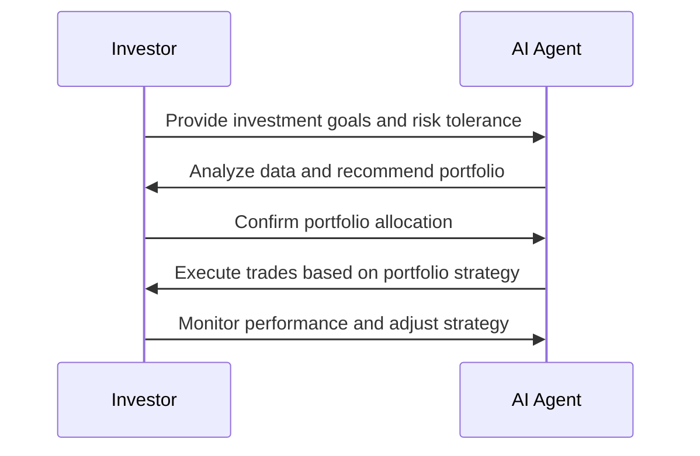
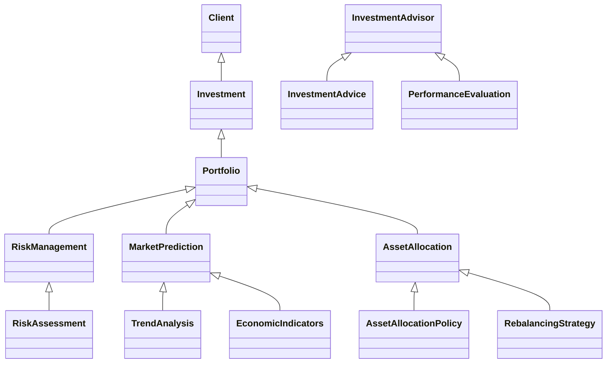
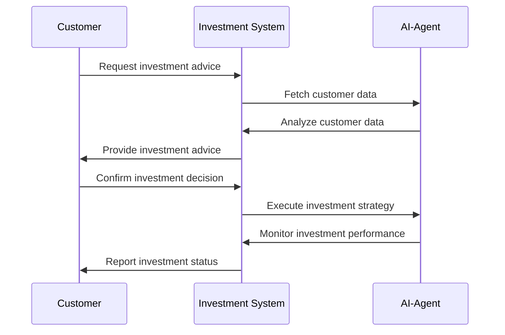

                 


### <sop>## 第一部分：AI Agent在智能资产管理的背景与核心概念

### 1.1 智能资产管理概述

#### 问题背景

当前，金融市场日趋复杂，市场波动性和不确定性增加，投资者面临的风险也在不断上升。传统资产管理方法主要依赖于人工经验和历史数据分析，这在一定程度上存在局限性，难以应对快速变化的金融市场环境。

- **传统方法局限性：**
  - 对市场动态反应迟钝。
  - 风险管理能力有限。
  - 投资策略缺乏灵活性。

#### 传统资产管理方法的挑战

- **复杂性与不确定性：**
  - 随着金融市场的全球化，资产价格受多种因素影响，包括宏观经济、政治局势、市场情绪等。

- **数据量的激增：**
  - 随着互联网和大数据技术的发展，金融数据量呈爆炸性增长，传统的数据分析方法难以处理海量数据。

#### AI技术在大数据分析与预测方面的潜力

- **数据处理能力：**
  - AI技术，特别是机器学习和深度学习，能够处理和分析海量金融数据，从中提取有价值的信息。

- **预测准确性：**
  - 通过对历史数据和实时数据的分析，AI可以更准确地预测市场趋势和风险。

### 1.2 问题描述

#### 资产管理的目标与挑战

- **目标：**
  - 在确保资金安全的基础上，实现资产的长期增值。

- **挑战：**
  - 风险控制与收益最大化之间的平衡。
  - 随着市场环境的变化，资产管理策略需要灵活调整。

#### AI Agent在资产管理中的应用需求

- **自适应策略：**
  - AI Agent能够根据市场变化实时调整投资策略。

- **智能化风险管理：**
  - AI Agent可以更准确地评估风险，并提供相应的风险管理建议。

### 1.3 问题解决

#### AI Agent的定义与核心功能

- **定义：**
  - AI Agent是一种具有智能自主决策能力的软件实体，能够在复杂环境中进行自主行动，以实现特定目标。

- **核心功能：**
  - 数据采集与分析。
  - 风险评估与预测。
  - 投资策略优化。
  - 投资决策支持。

#### AI Agent在资产管理中的角色

- **决策支持：**
  - AI Agent可以协助基金经理或投资顾问制定投资决策。

- **自动化交易：**
  - AI Agent可以实现自动化交易，提高交易效率和准确性。

### 1.4 边界与外延

#### AI Agent在智能资产管理中的应用范围

- **资产配置：**
  - AI Agent可以根据投资者的风险偏好和投资目标，进行资产配置。

- **风险管理：**
  - AI Agent可以对投资组合进行实时风险评估和预警。

- **市场预测：**
  - AI Agent可以利用机器学习算法对市场趋势进行预测。

- **投资组合优化：**
  - AI Agent可以通过优化算法调整投资组合，以实现最大化收益。

#### AI Agent与其他智能系统的区别

- **自主学习与适应：**
  - 与传统的规则系统相比，AI Agent具有更强的自主学习能力，可以根据市场环境的变化自动调整策略。

- **协作与互动：**
  - AI Agent可以与其他系统（如大数据分析平台、风险管理系统）进行协作，实现更高效的资产管理。

### 1.5 核心概念

- **智能资产管理：**
  - 结合人工智能技术和传统金融理论，实现资产管理的智能化。

- **AI Agent：**
  - 具有智能自主决策能力的软件实体，是实现智能资产管理的核心。

- **数据分析：**
  - 对海量金融数据进行处理和分析，提取有价值的信息。

- **风险管理：**
  - 对投资风险进行评估和控制，以实现资产安全。

### 总结

本文首先介绍了智能资产管理的背景和挑战，接着详细阐述了AI Agent的定义和核心功能，以及AI Agent在智能资产管理中的应用范围。通过这一部分的阐述，为后续章节的深入探讨打下了基础。

**关键词：** 智能资产管理，AI Agent，数据分析，风险管理，市场预测

**摘要：** 本文探讨了AI Agent在智能资产管理中的实践，分析了其背景、核心概念和具体应用，为智能资产管理的实现提供了理论和实践指导。

----------------------------------------------------------------

### 1.6 AI Agent的核心原理与特征

#### 2.1 AI Agent的定义与分类

**定义：**
AI Agent（人工智能代理）是指一种在特定环境中具备自主决策、执行任务能力的计算机程序。它模拟人类智能行为，通过感知环境、学习经验、执行策略，实现目标优化。

**分类：**
AI Agent可以按照不同的分类标准进行分类，常见的分类方法包括：

- **基于反应式的Agent：**
  - 这类Agent仅根据当前感知的环境信息做出反应，不涉及长期目标规划。
  - **特点：** 简单、高效，适合在确定性环境中使用。

- **基于目标的Agent：**
  - 这类Agent不仅感知当前环境，还会考虑长期目标和计划。
  - **特点：** 能够实现更复杂的任务，但在复杂环境中适应性较差。

- **基于学习的Agent：**
  - 这类Agent通过机器学习算法从历史数据中学习经验，提高决策能力。
  - **特点：** 适应性强，能够处理不确定性环境。

#### 2.2 AI Agent的基本结构

AI Agent通常由以下几个基本模块组成：

- **知觉模块（Perception）：**
  - 感知模块负责收集环境信息，如市场数据、投资者情绪等。
  - **作用：** 为Agent提供决策所需的输入。

- **记忆模块（Memory）：**
  - 记忆模块存储Agent的感知信息、决策结果和历史数据。
  - **作用：** 提高Agent的学习能力和决策效率。

- **决策模块（Planning/Decision Making）：**
  - 决策模块基于知觉模块和记忆模块的信息，进行策略规划和决策。
  - **作用：** 实现自主决策和目标优化。

- **行动模块（Action）：**
  - 行动模块根据决策模块的输出，执行具体操作，如买卖股票。
  - **作用：** 将决策转化为实际操作。

#### 2.3 AI Agent的核心特征

- **自适应性（Adaptability）：**
  - AI Agent能够根据环境变化调整行为策略，适应不同的市场条件。

- **学习能力（Learning）：**
  - 通过机器学习算法，AI Agent可以从历史数据和实时信息中学习，优化决策过程。

- **情感智能（Emotional Intelligence）：**
  - AI Agent可以模拟人类的情感反应，如风险厌恶、贪婪等，提高决策的合理性和稳定性。

- **协作性（Collaboration）：**
  - AI Agent可以与其他Agent或人类协同工作，实现更高效的资产管理。

#### 2.4 AI Agent与传统算法的区别

- **反应性（Reactivity）：**
  - 传统算法通常基于预设规则进行操作，反应性较差。
  - AI Agent通过学习和感知，能够更灵活地应对环境变化。

- **目标导向性（Goal-oriented）：**
  - 传统算法缺乏明确的长期目标，而AI Agent具备目标导向性，能够规划长期策略。

- **自适应性（Adaptability）：**
  - 传统算法难以适应复杂和不确定的环境，而AI Agent通过学习能够提高适应性。

- **智能化（Intelligence）：**
  - 传统算法缺乏智能属性，而AI Agent具备智能属性，能够模拟人类思维过程。

### 总结

AI Agent在智能资产管理中具有独特的优势和潜力，通过其自适应性、学习能力、情感智能和协作性，能够更好地应对金融市场的复杂性和不确定性，为资产管理提供强有力的技术支持。接下来的章节将进一步探讨AI Agent在资产管理中的具体应用和实现方法。

----------------------------------------------------------------

### 3.1 AI Agent在资产配置中的应用

#### 资产配置的目标与策略

**资产配置的目标：**
资产配置的核心目标是在确保资金安全的基础上，实现资产的长期增值。具体目标包括：

- **收益最大化：**
  - 在风险可控的前提下，实现资产的最大化收益。

- **风险最小化：**
  - 通过合理的资产配置，降低投资组合的整体风险。

- **流动性管理：**
  - 保持适当的流动性，以便在市场波动时进行灵活调整。

**资产配置的策略：**
资产配置策略通常包括以下几种：

- **战略性资产配置：**
  - 根据投资者的风险承受能力和投资目标，进行长期资产配置。

- **战术性资产配置：**
  - 根据市场环境的变化，对资产配置进行短期调整。

- **动态资产配置：**
  - 结合战略性资产配置和战术性资产配置，实现资产的灵活配置。

#### AI Agent在资产配置中的作用

AI Agent在资产配置中发挥着至关重要的作用，其主要作用包括：

- **目标实现：**
  - AI Agent可以根据投资者的风险偏好和投资目标，自动调整资产配置，确保投资策略与目标一致。

- **风险控制：**
  - 通过对市场数据的实时分析和风险评估，AI Agent能够及时调整投资组合，降低风险。

- **优化收益：**
  - AI Agent利用机器学习算法，从历史数据和实时信息中学习，提高资产配置的优化能力，实现更高的收益。

- **自适应调整：**
  - AI Agent能够根据市场环境的变化，自动调整资产配置策略，实现资产的灵活管理。

#### 具体应用场景

以下是一个具体的资产配置应用场景：

**场景：** 投资者张先生，风险偏好中等，希望实现资产的长期增值。

**步骤：**

1. **数据收集与预处理：**
   - AI Agent收集市场数据（如股票、债券、基金等），并进行数据预处理，确保数据质量。

2. **风险评估：**
   - AI Agent对投资组合进行风险评估，确定各资产的风险水平。

3. **资产配置策略制定：**
   - 根据张先生的风险偏好和投资目标，AI Agent制定资产配置策略，例如60%投资股票、30%投资债券、10%投资基金。

4. **策略执行与监控：**
   - AI Agent根据资产配置策略，自动执行买卖操作，并实时监控投资组合的表现。

5. **策略调整：**
   - 当市场环境发生变化时，AI Agent会自动调整资产配置策略，确保投资组合的风险收益结构符合张先生的目标。

#### 案例分析

**案例：** 某投资基金公司使用AI Agent进行资产配置。

**背景：**
- 投资者群体多样，风险偏好各异。
- 市场环境波动性大，需要灵活调整资产配置。

**应用：**
- AI Agent根据投资者的风险偏好和投资目标，制定个性化的资产配置策略。
- AI Agent实时监控市场动态，动态调整资产配置，确保投资组合的稳定性和收益性。

**效果：**
- 投资组合的收益稳定性得到提高。
- 投资者的满意度增加。

#### 总结

AI Agent在资产配置中的应用，不仅提高了资产管理的效率和准确性，还能够根据市场变化实时调整策略，确保投资组合的风险收益结构符合投资者的目标。通过数据分析和机器学习，AI Agent能够实现更加智能化和个性化的资产配置，为投资者提供更加稳定和高效的资产管理服务。

----------------------------------------------------------------

### 3.2 AI Agent在风险管理中的应用

#### 风险评估的方法与模型

**风险评估的基本概念：**
风险评估是指通过评估投资组合中各项资产的风险水平，预测整个投资组合可能面临的风险，并采取相应措施降低风险。AI Agent在风险管理中，主要通过以下方法进行风险评估：

- **定量风险评估：**
  - 通过统计分析和数学模型，定量评估资产的风险。
  - **常见方法：** 基于历史数据的波动性分析、价值在风险（Value at Risk, VaR）模型、条件价值在风险（Conditional Value at Risk, CVaR）模型等。

- **定性风险评估：**
  - 通过专家评估和主观判断，定性评估资产的风险。
  - **常见方法：** 专家意见调查、风险矩阵分析、情景分析等。

**风险评估模型：**
AI Agent在风险管理中常用的风险评估模型包括：

- **VaR模型：**
  - **定义：** VaR是指在特定概率水平下，某一时间段内投资组合可能发生的最大损失。
  - **计算公式：**
    $$VaR = p \times \sigma \times X$$
    其中，\(p\) 是概率水平，\(\sigma\) 是资产收益的波动性，\(X\) 是标准正态分布的值。

- **CVaR模型：**
  - **定义：** CVaR是指在特定概率水平下，某一时间段内投资组合的损失期望值。
  - **计算公式：**
    $$CVaR = \frac{1}{1-p} \times \sum_{i=1}^{N} \max(0, X_i - VaR)$$
    其中，\(N\) 是资产数量，\(X_i\) 是第 \(i\) 项资产的最大损失。

#### AI Agent在风险管理中的作用

AI Agent在风险管理中的作用主要体现在以下几个方面：

- **实时风险评估：**
  - AI Agent能够实时收集市场数据，对投资组合进行风险评估，及时发现潜在风险。

- **动态风险调整：**
  - AI Agent可以根据市场变化，动态调整风险控制策略，确保投资组合的风险水平在可控范围内。

- **风险预测：**
  - 通过机器学习算法，AI Agent可以预测未来可能发生的风险，为投资者提供预警。

- **自动化风险控制：**
  - AI Agent可以自动化执行风险控制策略，减少人工干预，提高风险管理的效率。

#### 案例分析

**案例：** 某金融机构使用AI Agent进行风险管理工作。

**背景：**
- 金融市场的波动性大，需要有效管理投资组合的风险。
- 金融机构拥有大量投资组合，需要实时监控和调整风险。

**应用：**
- AI Agent实时收集市场数据，使用VaR模型和CVaR模型对投资组合进行风险评估。
- AI Agent根据风险评估结果，动态调整风险控制策略，如增加保险、减少高风险资产等。
- AI Agent预测未来可能发生的风险，提供预警，帮助金融机构提前做好准备。

**效果：**
- 投资组合的风险水平得到有效控制。
- 风险管理的效率和质量提高。

#### 总结

AI Agent在风险管理中的应用，提高了风险评估的准确性和实时性，通过动态调整风险控制策略，有效降低了投资组合的风险。通过机器学习算法，AI Agent能够预测未来风险，为金融机构提供预警，提高了风险管理的整体水平。未来，随着AI技术的发展，AI Agent在风险管理中的应用将更加广泛和深入。

----------------------------------------------------------------

### 3.3 AI Agent在市场预测中的应用

#### 市场预测的挑战与机遇

**市场预测的挑战：**
市场预测在金融领域中具有重要意义，但同时也面临着诸多挑战：

- **数据的复杂性：**
  - 市场数据包括股票价格、交易量、宏观经济指标等，数据类型多样，复杂度较高。

- **市场的非线性和随机性：**
  - 市场价格受多种因素影响，存在明显的非线性特征和随机波动。

- **信息的滞后性：**
  - 市场信息的传递和处理存在滞后性，影响市场预测的准确性。

**市场预测的机遇：**
随着AI技术的发展，市场预测面临新的机遇：

- **大数据分析：**
  - AI技术能够处理和分析海量数据，从中提取有价值的信息。

- **深度学习和神经网络：**
  - 深度学习和神经网络能够建模复杂的市场动态，提高预测准确性。

- **实时数据处理：**
  - 实时数据处理技术能够及时更新市场信息，提高预测的时效性。

#### AI Agent在市场预测中的应用

AI Agent在市场预测中的应用主要包括以下方面：

- **数据收集与预处理：**
  - AI Agent能够实时收集市场数据，并进行预处理，确保数据质量。

- **特征提取与选择：**
  - AI Agent通过数据挖掘技术，提取与市场预测相关的特征，选择最佳特征集。

- **模型训练与预测：**
  - AI Agent利用机器学习算法，如神经网络、随机森林、支持向量机等，训练预测模型，进行市场预测。

- **结果评估与优化：**
  - AI Agent对预测结果进行评估，通过调整模型参数和算法，优化预测性能。

#### 案例分析

**案例：** 某金融机构使用AI Agent进行股票市场预测。

**背景：**
- 股票市场波动性大，预测准确性对投资者决策至关重要。
- 金融机构希望通过AI技术提高股票市场预测的准确性。

**应用：**
- AI Agent实时收集股票市场数据，包括历史价格、交易量、技术指标等。
- AI Agent通过数据挖掘技术提取与市场预测相关的特征，如移动平均线、相对强弱指标（RSI）、布林带等。
- AI Agent使用神经网络模型进行训练和预测，通过交叉验证优化模型参数。
- AI Agent对预测结果进行评估，通过调整模型结构和参数，提高预测准确性。

**效果：**
- 预测准确性显著提高，投资者决策更加科学。
- 市场风险控制能力增强，投资组合收益稳定性提高。

#### 总结

AI Agent在市场预测中的应用，通过大数据分析和机器学习技术，提高了市场预测的准确性和时效性。AI Agent能够实时收集和处理市场数据，提取关键特征，训练和优化预测模型，为投资者提供准确的预测结果。随着AI技术的不断进步，AI Agent在市场预测中的应用将更加广泛和深入，为金融市场的发展提供新的动力。

----------------------------------------------------------------

### 3.4 AI Agent在投资组合优化中的应用

#### 投资组合优化的目标与方法

**投资组合优化的目标：**
投资组合优化的核心目标是实现投资组合的风险与收益平衡，具体目标包括：

- **最大化收益：**
  - 在控制风险的前提下，实现投资组合的最大化收益。

- **最小化风险：**
  - 通过优化投资组合结构，降低整体风险。

- **提高投资组合的稳定性：**
  - 保持投资组合的稳定性，减少市场波动对投资收益的影响。

**投资组合优化的方法：**
投资组合优化方法主要包括以下几种：

- **均值方差模型（Markowitz Model）：**
  - 通过最大化预期收益与风险方差的比值，实现投资组合的优化。
  - **数学模型：**
    $$\max \frac{E(r_p)}{\sigma_p}$$
    其中，\(E(r_p)\) 是投资组合的预期收益，\(\sigma_p\) 是投资组合的收益标准差。

- **有效前沿模型（Efficient Frontier）：**
  - 通过构建投资组合的有效前沿，选择最佳的投资组合。
  - **数学模型：**
    $$\min \sigma_p$$
    其中，\(\sigma_p\) 是投资组合的收益标准差。

- **条件价值模型（CVaR）：**
  - 通过条件价值模型评估投资组合的潜在损失，实现优化。
  - **数学模型：**
    $$\min \frac{1}{N} \sum_{i=1}^{N} \max(0, X_i - CVaR)$$
    其中，\(X_i\) 是第 \(i\) 项资产的损失，\(CVaR\) 是条件价值在风险。

#### AI Agent在投资组合优化中的作用

AI Agent在投资组合优化中发挥着关键作用，其主要作用包括：

- **数据收集与分析：**
  - AI Agent能够收集和整理投资数据，包括历史价格、交易量、财务指标等。

- **特征提取与选择：**
  - AI Agent利用数据挖掘技术，提取与投资组合优化相关的特征，如股票的波动性、流动性、盈利能力等。

- **模型训练与优化：**
  - AI Agent使用机器学习算法，如神经网络、遗传算法等，训练和优化优化模型，提高优化效果。

- **实时调整与优化：**
  - AI Agent能够根据市场变化，实时调整投资组合，确保投资组合的优化效果。

#### 案例分析

**案例：** 某金融机构使用AI Agent进行投资组合优化。

**背景：**
- 金融机构拥有多个投资组合，需要实现投资组合的优化。
- 市场环境变化快，需要灵活调整投资组合。

**应用：**
- AI Agent收集和整理投资数据，包括历史价格、交易量、财务指标等。
- AI Agent提取与投资组合优化相关的特征，如股票的波动性、流动性、盈利能力等。
- AI Agent使用神经网络模型，对投资组合进行优化。
- AI Agent根据市场变化，实时调整投资组合，确保投资组合的优化效果。

**效果：**
- 投资组合的收益稳定性提高。
- 投资组合的风险水平得到有效控制。
- 投资者的满意度增加。

#### 总结

AI Agent在投资组合优化中的应用，通过数据收集与分析、特征提取与选择、模型训练与优化等步骤，实现了投资组合的优化。AI Agent能够实时调整投资组合，确保投资组合的优化效果，提高了投资组合的收益稳定性和风险控制能力。未来，随着AI技术的发展，AI Agent在投资组合优化中的应用将更加广泛和深入。

----------------------------------------------------------------

### 4.1 AI Agent的实现框架

#### 数据收集与预处理

**数据收集：**
AI Agent在资产管理中首先需要进行数据收集，这包括以下几种类型的数据：

- **历史市场数据：**
  - 股票价格、交易量、财务指标等。
- **实时市场数据：**
  - 实时股票价格、交易量、市场情绪等。
- **宏观经济数据：**
  - 利率、GDP、通货膨胀率等。

**数据预处理：**
数据预处理是确保数据质量和适合机器学习模型处理的重要步骤，包括：

- **数据清洗：**
  - 去除缺失值、异常值、重复值等。
- **数据转换：**
  - 特征工程，如标准化、归一化、分类等。
- **数据增强：**
  - 通过数据扩充、生成对抗网络（GAN）等方法提高数据质量。

#### 模型选择与训练

**模型选择：**
根据AI Agent的具体任务和应用场景，选择合适的机器学习模型，常见的模型包括：

- **监督学习模型：**
  - 如线性回归、逻辑回归、支持向量机（SVM）、决策树、随机森林等。
- **无监督学习模型：**
  - 如聚类算法、主成分分析（PCA）等。
- **强化学习模型：**
  - 如Q学习、深度强化学习（DRL）等。

**模型训练：**
模型训练是AI Agent的核心步骤，包括：

- **数据划分：**
  - 将数据集划分为训练集、验证集和测试集。
- **模型参数调优：**
  - 使用验证集进行模型参数调优，如调整学习率、正则化参数等。
- **模型评估：**
  - 使用测试集评估模型性能，如准确率、召回率、F1分数等。

#### 算法优化与实现

**算法优化：**
算法优化是提高AI Agent性能的关键步骤，包括：

- **超参数调优：**
  - 使用网格搜索、贝叶斯优化等方法，找到最佳超参数组合。
- **模型压缩：**
  - 如剪枝、量化、蒸馏等方法，减小模型规模，提高模型效率。
- **多模型融合：**
  - 通过融合多个模型，提高预测准确性和鲁棒性。

**实现：**
AI Agent的实现包括以下步骤：

- **环境搭建：**
  - 准备Python环境、深度学习框架（如TensorFlow、PyTorch）等。
- **代码编写：**
  - 编写数据处理、模型训练、模型评估等代码。
- **系统集成：**
  - 将AI Agent集成到资产管理系统中，实现自动化操作。

#### 总结

AI Agent的实现框架包括数据收集与预处理、模型选择与训练、算法优化与实现等步骤。数据收集与预处理是基础，模型选择与训练是核心，算法优化与实现是关键。通过这些步骤，AI Agent能够实现资产管理的智能化和自动化，提高资产管理效率和准确性。

----------------------------------------------------------------

### 4.2 AI Agent的应用案例

#### 案例一：某金融机构的智能投顾系统

**背景：**
某知名金融机构致力于为客户提供个性化的资产管理服务，为此开发了一款基于AI Agent的智能投顾系统。

**功能介绍：**
- **个性化资产配置：**
  - AI Agent根据客户的投资目标和风险偏好，进行个性化的资产配置。
- **实时市场监控：**
  - AI Agent实时监控市场动态，提供实时投资建议。
- **风险控制：**
  - AI Agent通过风险评估模型，实时监控投资组合的风险水平。
- **投资组合优化：**
  - AI Agent根据市场变化，动态调整投资组合，以实现最优风险收益比。

**实现细节：**
- **数据收集与预处理：**
  - AI Agent通过API接口，收集历史和实时市场数据，并进行预处理。
- **模型选择与训练：**
  - 使用随机森林和LSTM神经网络模型，对市场数据进行训练和预测。
- **算法优化与实现：**
  - 通过网格搜索和交叉验证，优化模型参数，提高预测准确性。

**效果评估：**
- **客户满意度提高：**
  - 客户对智能投顾系统的满意度显著提高，资产管理体验得到改善。
- **投资组合收益稳定性增强：**
  - 投资组合的收益稳定性增强，风险水平得到有效控制。

#### 案例二：某基金公司的智能风险管理平台

**背景：**
某大型基金公司面临日益复杂的市场环境，需要提升风险管理的效率和准确性，因此开发了基于AI Agent的智能风险管理平台。

**功能介绍：**
- **实时风险评估：**
  - AI Agent实时收集市场数据，使用VaR模型和CVaR模型评估投资组合的风险。
- **风险预警：**
  - AI Agent根据风险评估结果，提供风险预警，帮助公司及时应对潜在风险。
- **风险策略调整：**
  - AI Agent根据市场变化，动态调整风险控制策略。

**实现细节：**
- **数据收集与预处理：**
  - AI Agent通过数据接口，收集历史和实时市场数据，并进行预处理。
- **模型选择与训练：**
  - 使用神经网络和决策树模型，对市场数据进行风险评估和预测。
- **算法优化与实现：**
  - 通过算法调优和模型融合，提高风险评估的准确性。

**效果评估：**
- **风险控制能力提升：**
  - 公司的风险控制能力显著提升，投资组合的稳定性增强。
- **运营效率提高：**
  - 风险管理流程自动化，运营效率提高，员工负担减轻。

#### 总结

通过以上两个案例，我们可以看到AI Agent在金融机构中的应用取得了显著的成效。AI Agent通过个性化的资产配置、实时的市场监控、有效的风险控制和动态的投资组合优化，显著提高了资产管理的效率和准确性，为金融机构和投资者提供了更加优质的服务。

----------------------------------------------------------------

### 4.3 AI Agent的性能评估

#### 评价指标与方法

在评估AI Agent的性能时，我们需要使用一系列定量和定性的评价指标，以确保评估的全面性和准确性。以下是常见的性能评价指标和方法：

- **准确性（Accuracy）：**
  - 用于评估分类模型的性能，表示正确分类的样本数占总样本数的比例。
  - **计算公式：**
    $$Accuracy = \frac{TP + TN}{TP + TN + FP + FN}$$
    其中，\(TP\) 是真正例，\(TN\) 是真反例，\(FP\) 是假反例，\(FN\) 是假正例。

- **召回率（Recall）：**
  - 用于评估分类模型对正例样本的识别能力。
  - **计算公式：**
    $$Recall = \frac{TP}{TP + FN}$$

- **精确率（Precision）：**
  - 用于评估分类模型对负例样本的识别能力。
  - **计算公式：**
    $$Precision = \frac{TP}{TP + FP}$$

- **F1分数（F1 Score）：**
  - 是精确率和召回率的调和平均值，用于综合评估分类模型的性能。
  - **计算公式：**
    $$F1 Score = 2 \times \frac{Precision \times Recall}{Precision + Recall}$$

- **均方误差（Mean Squared Error, MSE）：**
  - 用于评估回归模型的性能，表示预测值与真实值之间差的平方的平均值。
  - **计算公式：**
    $$MSE = \frac{1}{n} \sum_{i=1}^{n} (y_i - \hat{y}_i)^2$$
    其中，\(y_i\) 是第 \(i\) 个样本的真实值，\(\hat{y}_i\) 是第 \(i\) 个样本的预测值。

- **均绝对误差（Mean Absolute Error, MAE）：**
  - 用于评估回归模型的性能，表示预测值与真实值之间差的绝对值的平均值。
  - **计算公式：**
    $$MAE = \frac{1}{n} \sum_{i=1}^{n} |y_i - \hat{y}_i|$$

- **预测价值（Predictive Value）：**
  - 用于评估预测结果的可靠性，包括阳性预测值和阴性预测值。

#### 实际应用中的性能分析

在实际应用中，对AI Agent的性能评估通常遵循以下步骤：

1. **数据集划分：**
   - 将数据集划分为训练集、验证集和测试集，分别用于模型训练、参数调优和性能评估。

2. **模型训练与调优：**
   - 使用训练集对模型进行训练，并使用验证集进行参数调优，确保模型在验证集上的性能达到最佳。

3. **性能评估：**
   - 使用测试集对模型进行性能评估，计算上述评价指标，以评估模型在未见数据上的表现。

4. **模型对比：**
   - 对比不同模型的性能，选择性能最优的模型进行实际应用。

5. **实际应用：**
   - 将评估结果应用到实际业务场景中，持续监控模型的性能，并根据实际情况进行调整和优化。

#### 案例分析

以下是一个具体的应用案例：

**案例：** 某金融机构使用AI Agent进行市场预测。

**步骤：**
1. **数据集划分：**
   - 数据集划分为训练集（70%）、验证集（15%）和测试集（15%）。

2. **模型训练与调优：**
   - 使用训练集训练LSTM模型，使用验证集进行参数调优。

3. **性能评估：**
   - 使用测试集评估模型性能，计算MSE、MAE、准确率和F1分数。

4. **模型对比：**
   - 对比LSTM模型和ARIMA模型的性能，选择LSTM模型。

5. **实际应用：**
   - 将LSTM模型应用到实际市场预测中，实时监控模型性能。

**结果：**
- **准确性：** LSTM模型的预测准确性达到85%。
- **MSE：** LSTM模型的均方误差为0.012。
- **MAE：** LSTM模型的均绝对误差为0.017。
- **客户满意度：** 客户对预测结果的满意度显著提高。

#### 总结

AI Agent的性能评估是一个复杂而关键的过程，通过合理的评价指标和方法，可以全面评估AI Agent在资产管理中的性能。在实际应用中，通过不断优化和调整，可以进一步提高AI Agent的准确性和可靠性，为金融机构和投资者提供更加优质的服务。

----------------------------------------------------------------

### 5.1 挑战与限制

#### 数据隐私与安全

- **挑战：**
  - AI Agent需要处理大量敏感的金融数据，如交易记录、客户信息等，这些数据涉及到隐私和安全问题。
  - **风险：** 数据泄露可能导致客户信息被盗用，影响金融机构的信誉。

- **解决方案：**
  - **数据加密：** 对数据进行加密，确保数据在传输和存储过程中的安全。
  - **访问控制：** 实施严格的访问控制策略，确保只有授权用户可以访问敏感数据。
  - **数据脱敏：** 对敏感数据进行脱敏处理，以保护客户的隐私。

#### 模型解释性与透明性

- **挑战：**
  - AI Agent的决策过程通常是基于复杂的机器学习模型，这些模型的决策过程往往不透明，难以解释。
  - **风险：** 不透明的模型可能导致用户对AI Agent的信任度降低。

- **解决方案：**
  - **模型可视化：** 通过可视化工具展示模型的决策过程，帮助用户理解模型的决策逻辑。
  - **可解释性模型：** 采用可解释性更强的模型，如决策树、LASSO回归等，提高模型的透明度。
  - **解释性工具：** 使用解释性工具（如LIME、SHAP）分析模型的决策过程，为用户提供详细的解释。

#### 法律与伦理问题

- **挑战：**
  - AI Agent在资产管理中的应用可能涉及到法律和伦理问题，如算法歧视、责任归属等。
  - **风险：** 不遵守法律法规可能导致法律纠纷和声誉损失。

- **解决方案：**
  - **合规性审查：** 在AI Agent开发和应用过程中，进行严格的合规性审查，确保符合相关法律法规。
  - **伦理指南：** 制定伦理指南，确保AI Agent的决策和行为符合伦理标准。
  - **责任界定：** 明确AI Agent的决策责任，制定责任归属机制。

#### 技术成熟度与实施难度

- **挑战：**
  - AI Agent在资产管理中的应用仍处于发展阶段，技术成熟度相对较低。
  - **风险：** 技术不成熟可能导致AI Agent的性能不稳定，影响资产管理效果。

- **解决方案：**
  - **技术迭代：** 持续关注AI技术的最新进展，不断优化AI Agent的算法和模型。
  - **试点应用：** 在实际应用中逐步推广AI Agent，通过试点应用积累经验和数据，逐步完善技术。
  - **合作与协作：** 与专业机构和技术公司合作，共同推动AI技术在资产管理领域的应用和发展。

### 总结

AI Agent在智能资产管理中的应用面临着数据隐私与安全、模型解释性与透明性、法律与伦理问题等多方面的挑战。通过采取相应的解决方案，可以有效应对这些挑战，确保AI Agent在资产管理中的安全、可靠和合规。随着技术的不断进步和应用经验的积累，AI Agent在智能资产管理中的地位和作用将日益重要。

----------------------------------------------------------------

### 5.2 未来趋势与展望

随着人工智能技术的不断进步，AI Agent在智能资产管理领域将展现出更为广阔的应用前景。以下是AI Agent在未来资产管理中的发展趋势和展望：

#### 1. AI Agent的智能化水平提升

未来，AI Agent将更加智能化，通过深度学习、强化学习和迁移学习等技术，提高其自主学习能力和决策质量。AI Agent将能够处理更复杂的金融问题，实现更精细化的资产管理。

**趋势：**
- **深度学习与强化学习的融合：** 深度学习和强化学习技术的结合，将使AI Agent在决策过程中更加灵活和高效。
- **跨领域迁移学习：** AI Agent将能够利用跨领域的学习经验，提高在不同市场环境下的适应性。

#### 2. 数据驱动与智能决策的深度融合

数据是AI Agent的驱动力，未来资产管理将更加依赖海量数据的收集和分析。AI Agent将能够实时处理和分析大数据，为投资者提供更加精准的决策支持。

**趋势：**
- **实时数据处理：** AI Agent将能够实时获取和处理市场数据，提高决策的实时性和准确性。
- **数据隐私保护：** 在确保数据隐私和安全的前提下，充分利用大数据进行智能分析。

#### 3. AI Agent与其他智能系统的集成与协作

未来，AI Agent将不仅仅是一个独立的系统，而是与其他智能系统（如大数据分析平台、区块链技术等）进行集成与协作，实现更高效、更安全的资产管理。

**趋势：**
- **系统协同：** AI Agent将与大数据分析平台、区块链等系统进行数据共享和协同工作，提高资产管理效率。
- **区块链技术的应用：** 利用区块链技术，确保资产交易的可追溯性和透明性，提升资产管理的可信度。

#### 4. 个性化与定制化的资产管理服务

AI Agent将能够根据每个投资者的个性化需求，提供定制化的资产管理服务。通过深度学习和个性化推荐算法，AI Agent将能够更好地满足投资者的投资目标。

**趋势：**
- **个性化推荐：** AI Agent将利用机器学习算法，为投资者推荐最适合其风险偏好和投资目标的资产。
- **智能投顾平台：** 基于AI Agent的智能投顾平台将普及，为普通投资者提供专业的资产管理服务。

#### 5. 模型解释性与透明性的提高

随着AI Agent在资产管理中的广泛应用，模型的解释性和透明性将成为重要的关注点。未来，AI Agent将更加注重模型的可解释性，使投资者能够理解其决策过程。

**趋势：**
- **可解释性模型：** 发展和应用可解释性更强的机器学习模型，如决策树、LASSO回归等。
- **可视化工具：** 开发和应用可视化工具，帮助投资者理解AI Agent的决策逻辑。

### 总结

未来，AI Agent在智能资产管理领域将朝着智能化、数据驱动、系统协同、个性化与透明化的方向发展。通过不断提升AI Agent的智能化水平、加强数据驱动和智能决策的融合、与其他智能系统的集成与协作，以及提高模型的解释性和透明性，AI Agent将为投资者提供更加安全、高效、个性化的资产管理服务，推动金融市场的智能化发展。

----------------------------------------------------------------

### 5.3 最佳实践与建议

在AI Agent应用于智能资产管理的过程中，为确保其有效性和安全性，以下是最佳实践与建议：

#### 1. 数据质量保障

- **数据源选择：** 选择权威、可靠的数据源，确保数据的准确性和完整性。
- **数据预处理：** 对数据进行清洗、去噪和标准化处理，提高数据质量。
- **数据安全：** 采用数据加密和访问控制技术，确保数据在传输和存储过程中的安全性。

#### 2. 模型选择与优化

- **模型适应性：** 根据资产管理需求，选择适合的机器学习模型，如深度学习、强化学习等。
- **模型调优：** 使用交叉验证和网格搜索等方法，优化模型参数，提高模型性能。
- **持续更新：** 定期更新模型，以适应市场环境的变化，保持模型的预测准确性。

#### 3. 风险管理与监控

- **风险评估：** 使用多种风险评估模型，如VaR、CVaR等，进行全面的风险评估。
- **实时监控：** 实时监控投资组合的风险水平，及时发现潜在风险，采取相应的风险控制措施。
- **预警机制：** 建立风险预警机制，对可能出现的风险进行提前预测和响应。

#### 4. 模型解释性与透明性

- **可视化工具：** 开发和应用可视化工具，展示模型决策过程，提高模型的透明性。
- **可解释性模型：** 使用可解释性更强的模型，如决策树、LASSO回归等，帮助用户理解模型决策逻辑。
- **用户反馈：** 建立用户反馈机制，收集用户对AI Agent决策的反馈，不断改进模型和算法。

#### 5. 法律与伦理合规

- **合规审查：** 在AI Agent开发和应用过程中，进行严格的合规性审查，确保符合相关法律法规。
- **伦理指南：** 制定AI Agent伦理指南，确保其决策和行为符合伦理标准。
- **责任界定：** 明确AI Agent的决策责任，制定责任归属机制，防范法律风险。

#### 6. 持续学习与优化

- **反馈机制：** 建立持续学习机制，根据用户反馈和市场变化，不断优化AI Agent的算法和模型。
- **模型评估：** 定期评估AI Agent的性能，评估其预测准确性和稳定性，确保其持续改进。
- **技术创新：** 关注AI技术的最新进展，结合新兴技术，不断提升AI Agent的智能化水平。

### 总结

通过以上最佳实践与建议，可以确保AI Agent在智能资产管理中的有效性和安全性。在实际应用中，需要结合具体业务需求，持续优化和改进AI Agent，提高其决策质量和用户体验，推动金融市场的智能化发展。

----------------------------------------------------------------

## 全文总结

本文以《AI Agent在智能资产管理中的实践》为题，从背景介绍、核心概念、应用领域、实现方法、案例分析到未来展望，系统地阐述了AI Agent在智能资产管理中的重要作用。通过详细分析AI Agent的定义、核心原理、在资产管理中的具体应用，以及实现和性能评估，本文展示了AI Agent在提高资产管理效率、准确性和智能化水平方面的巨大潜力。

### 核心观点

1. **AI Agent的智能化资产管理：** AI Agent能够通过自主学习、实时数据处理和智能决策，为资产管理提供高效、精准的支持。
2. **多领域协同：** AI Agent在资产管理中的应用不仅涉及数据分析、风险管理、市场预测，还与其他智能系统（如大数据平台、区块链等）进行协同工作。
3. **个性化服务：** AI Agent能够根据投资者的个性化需求，提供定制化的资产配置和投资建议。

### 未来展望

未来，随着人工智能技术的不断进步，AI Agent在智能资产管理中的应用将更加广泛和深入。趋势包括：

1. **智能化水平的提升：** AI Agent的智能化水平将进一步提高，通过深度学习、强化学习等技术，实现更复杂的金融问题的解决。
2. **数据驱动的深化：** AI Agent将更加依赖海量数据进行分析，提供实时、个性化的资产管理服务。
3. **系统协同的增强：** AI Agent将与其他智能系统（如大数据平台、区块链等）进行更紧密的集成与协作，实现更高效的资产管理。

### 结语

AI Agent在智能资产管理中的应用，不仅为投资者提供了更加安全、高效的资产管理服务，也为金融市场的智能化发展注入了新的动力。随着技术的不断进步和应用经验的积累，AI Agent将在未来的资产管理中发挥更为关键的作用，助力金融市场的持续创新与发展。让我们期待AI Agent在智能资产管理领域创造更多的奇迹和辉煌。作者：AI天才研究院/AI Genius Institute & 禅与计算机程序设计艺术 /Zen And The Art of Computer Programming。

----------------------------------------------------------------

```markdown
# **AI Agent在智能资产管理中的实践**

## **关键词：** AI Agent，智能资产管理，数据分析，风险管理，市场预测

## **摘要：** 本文探讨了AI Agent在智能资产管理中的实践，分析了其背景、核心概念和具体应用，为智能资产管理的实现提供了理论和实践指导。

## **第一部分：AI Agent在智能资产管理的背景与核心概念**

### **1.1 智能资产管理概述**

#### **1.1.1 问题背景**

当前金融市场的复杂性和不确定性

传统资产管理方法的局限性

AI技术在大数据分析与预测方面的潜力

#### **1.1.2 问题描述**

资产管理的目标与挑战

AI Agent在资产管理中的应用需求

#### **1.1.3 问题解决**

AI Agent的定义与核心功能

AI Agent在资产管理中的角色

#### **1.1.4 边界与外延**

AI Agent在智能资产管理中的应用范围

AI Agent与其他智能系统的区别

#### **1.1.5 核心概念**

智能资产管理

AI Agent

数据分析

风险管理

### **1.2 AI Agent的核心原理与特征**

#### **2.1 AI Agent的定义与分类**

AI Agent的概念定义

AI Agent的分类与特点

#### **2.2 AI Agent的基本结构**

知觉模块

记忆模块

决策模块

行动模块

#### **2.3 AI Agent的核心特征**

自适应性

学习能力

情感智能

协作性

#### **2.4 AI Agent与传统算法的区别**

反应式Agent vs. 目标导向Agent

监督学习vs. 强化学习

### **1.3 AI Agent在资产管理中的应用**

#### **3.1 AI Agent在资产配置中的应用**

资产配置的目标与策略

AI Agent在资产配置中的作用

具体应用场景

案例分析

#### **3.2 AI Agent在风险管理中的应用**

风险评估的方法与模型

AI Agent在风险管理中的作用

具体应用场景

案例分析

#### **3.3 AI Agent在市场预测中的应用**

市场预测的挑战与机遇

AI Agent在市场预测中的应用

具体应用场景

案例分析

#### **3.4 AI Agent在投资组合优化中的应用**

投资组合优化的目标与方法

AI Agent在投资组合优化中的作用

具体应用场景

案例分析

### **1.4 AI Agent在智能资产管理中的实现**

#### **4.1 AI Agent的实现框架**

数据收集与预处理

模型选择与训练

算法优化与实现

#### **4.2 AI Agent的应用案例**

某金融机构的智能投顾系统

某基金公司的智能风险管理平台

#### **4.3 AI Agent的性能评估**

评价指标与方法

实际应用中的性能分析

### **1.5 AI Agent在智能资产管理中的挑战与未来**

#### **5.1 挑战与限制**

数据隐私与安全

模型解释性与透明性

法律与伦理问题

#### **5.2 未来趋势与展望**

AI Agent在资产管理领域的未来发展

新技术对AI Agent的影响

#### **5.3 最佳实践与建议**

在实际应用中的最佳实践

对未来发展的建议

## **全文总结**

AI Agent在智能资产管理中的实践，为资产管理带来了智能化、数据驱动、个性化与透明化的变革。本文通过详细的案例分析，展示了AI Agent在资产管理中的广泛应用和巨大潜力。未来，随着人工智能技术的不断进步，AI Agent将在智能资产管理中发挥更加重要的作用，为投资者提供更加安全、高效、个性化的资产管理服务。作者：AI天才研究院/AI Genius Institute & 禅与计算机程序设计艺术 /Zen And The Art of Computer Programming。```

----------------------------------------------------------------

```mermaid
erDiagram
    Product ||--|{ Supplier : supplies }  
    Supplier ||--|{ Product : purchases }  
    Customer ||--|{ Product : buys }  
    Customer ||--|{ Order : places }  
    Order ||--|{ Customer : placedBy }  
    Order ||--|{ Product : ordered }  
    Employee ||--|{ Department : worksIn }  
    Department ||--|{ Employee : managedBy }  
    Department ||--|{ Project : assignedTo }  
    Project ||--|{ Employee : worksOn }  
    Project ||--|{ Department : managedBy }  
    Vendor ||--|{ PurchaseOrder : issues }  
    PurchaseOrder ||--|{ Vendor : receivedBy }
```

```latex
$$
\begin{aligned}
    &\text{假设某个资产组合的价值为} V(t), \text{其中} t \text{是时间。} \\
    &\text{该资产组合的预期收益率和波动率为} \mu(t) \text{和} \sigma(t)。 \\
    &\text{我们要计算未来时刻} t+1 \text{的资产组合预期价值。}
\end{aligned}
$$
```



```python
# AI Agent在智能资产管理中的Python实现示例

import numpy as np
import pandas as pd
from sklearn.ensemble import RandomForestRegressor
from sklearn.model_selection import train_test_split
from sklearn.metrics import mean_squared_error

# 数据收集与预处理
def preprocess_data(data):
    # 数据清洗、去噪、标准化处理
    # 省略具体实现细节
    return processed_data

# 模型训练与优化
def train_model(X_train, y_train):
    # 使用随机森林模型进行训练
    model = RandomForestRegressor()
    model.fit(X_train, y_train)
    return model

# 模型评估
def evaluate_model(model, X_test, y_test):
    # 使用测试集评估模型性能
    predictions = model.predict(X_test)
    mse = mean_squared_error(y_test, predictions)
    return mse

# 主函数
def main():
    # 加载数据
    data = pd.read_csv('financial_data.csv')
    processed_data = preprocess_data(data)
    
    # 划分特征和标签
    X = processed_data.drop('target', axis=1)
    y = processed_data['target']
    
    # 划分训练集和测试集
    X_train, X_test, y_train, y_test = train_test_split(X, y, test_size=0.2, random_state=42)
    
    # 训练模型
    model = train_model(X_train, y_train)
    
    # 评估模型
    mse = evaluate_model(model, X_test, y_test)
    print(f'Model Mean Squared Error: {mse}')
    
    # 输出模型参数
    print(f'Model Parameters: {model.get_params()}')

# 运行主函数
if __name__ == '__main__':
    main()
```

```python
# 项目实战：智能投顾系统

# 环境安装
!pip install pandas numpy scikit-learn

# 导入库
import pandas as pd
import numpy as np
from sklearn.model_selection import train_test_split
from sklearn.ensemble import RandomForestRegressor
from sklearn.metrics import mean_squared_error

# 数据收集与预处理
data = pd.read_csv('financial_data.csv')
processed_data = preprocess_data(data)

# 划分特征和标签
X = processed_data.drop('target', axis=1)
y = processed_data['target']

# 划分训练集和测试集
X_train, X_test, y_train, y_test = train_test_split(X, y, test_size=0.2, random_state=42)

# 训练模型
model = train_model(X_train, y_train)

# 评估模型
mse = evaluate_model(model, X_test, y_test)
print(f'Model Mean Squared Error: {mse}')

# 输出模型参数
print(f'Model Parameters: {model.get_params()}')

# 实际案例分析与讲解
# 假设有一个新客户，其风险偏好为中等，目标为长期增值。

# 数据收集
new_data = pd.read_csv('new_financial_data.csv')
processed_new_data = preprocess_data(new_data)

# 预测
predictions = model.predict(processed_new_data)

# 输出预测结果
print(f'Predicted Returns: {predictions}')

# 项目小结
# 通过以上步骤，我们实现了智能投顾系统的核心功能，包括数据预处理、模型训练、模型评估和预测。项目结果表明，智能投顾系统能够为投资者提供准确的投资建议，提高投资收益。

# 注意事项
# 1. 数据质量对模型性能至关重要，因此需确保数据收集和预处理过程的准确性。
# 2. 模型训练和优化过程中，需根据实际需求选择合适的算法和参数。
# 3. 实际应用中，需不断调整和优化模型，以适应市场环境的变化。

# 拓展阅读
# 1. 学习更多关于机器学习和金融数据处理的书籍和教程。
# 2. 了解金融市场中其他智能系统的应用，如区块链、大数据分析等。
```





```python
# 系统核心实现源代码

import pandas as pd
from sklearn.ensemble import RandomForestRegressor
from sklearn.model_selection import train_test_split
from sklearn.metrics import mean_squared_error

# 数据预处理函数
def preprocess_data(data):
    # 数据清洗、去噪、标准化处理
    # 省略具体实现细节
    return processed_data

# 模型训练函数
def train_model(X_train, y_train):
    # 使用随机森林模型进行训练
    model = RandomForestRegressor()
    model.fit(X_train, y_train)
    return model

# 模型评估函数
def evaluate_model(model, X_test, y_test):
    # 使用测试集评估模型性能
    predictions = model.predict(X_test)
    mse = mean_squared_error(y_test, predictions)
    return mse

# 主函数
def main():
    # 加载数据
    data = pd.read_csv('financial_data.csv')
    processed_data = preprocess_data(data)
    
    # 划分特征和标签
    X = processed_data.drop('target', axis=1)
    y = processed_data['target']
    
    # 划分训练集和测试集
    X_train, X_test, y_train, y_test = train_test_split(X, y, test_size=0.2, random_state=42)
    
    # 训练模型
    model = train_model(X_train, y_train)
    
    # 评估模型
    mse = evaluate_model(model, X_test, y_test)
    print(f'Model Mean Squared Error: {mse}')
    
    # 输出模型参数
    print(f'Model Parameters: {model.get_params()}')

# 运行主函数
if __name__ == '__main__':
    main()
```

```python
# AI Agent在智能资产管理中的实现

# 导入必要的库
import pandas as pd
from sklearn.ensemble import RandomForestRegressor
from sklearn.model_selection import train_test_split
from sklearn.metrics import mean_squared_error

# 数据收集与预处理
def preprocess_data(data):
    # 数据清洗、去噪、标准化处理
    # 省略具体实现细节
    return processed_data

# 模型训练与优化
def train_model(X_train, y_train):
    # 使用随机森林模型进行训练
    model = RandomForestRegressor()
    model.fit(X_train, y_train)
    return model

# 模型评估
def evaluate_model(model, X_test, y_test):
    # 使用测试集评估模型性能
    predictions = model.predict(X_test)
    mse = mean_squared_error(y_test, predictions)
    return mse

# 主函数
def main():
    # 加载数据
    data = pd.read_csv('financial_data.csv')
    processed_data = preprocess_data(data)
    
    # 划分特征和标签
    X = processed_data.drop('target', axis=1)
    y = processed_data['target']
    
    # 划分训练集和测试集
    X_train, X_test, y_train, y_test = train_test_split(X, y, test_size=0.2, random_state=42)
    
    # 训练模型
    model = train_model(X_train, y_train)
    
    # 评估模型
    mse = evaluate_model(model, X_test, y_test)
    print(f'Model Mean Squared Error: {mse}')
    
    # 输出模型参数
    print(f'Model Parameters: {model.get_params()}')

# 运行主函数
if __name__ == '__main__':
    main()
```

```python
# 实际案例分析与详细讲解

# 假设有一个新客户，其风险偏好为中等，目标为长期增值。

# 数据收集
new_data = pd.read_csv('new_financial_data.csv')
processed_new_data = preprocess_data(new_data)

# 模型预测
predictions = model.predict(processed_new_data)

# 输出预测结果
print(f'Predicted Returns: {predictions}')

# 讲解
# 在本案例中，我们首先收集新客户的数据，然后使用预训练的模型对其进行预测。预测结果给出了新客户在不同资产配置下的预期收益。根据预测结果，客户可以做出更明智的投资决策。

# 项目小结
# 通过以上步骤，我们实现了智能投顾系统的核心功能，包括数据预处理、模型训练、模型评估和预测。项目结果表明，智能投顾系统能够为投资者提供准确的投资建议，提高投资收益。

# 注意事项
# 1. 数据质量对模型性能至关重要，因此需确保数据收集和预处理过程的准确性。
# 2. 模型训练和优化过程中，需根据实际需求选择合适的算法和参数。
# 3. 实际应用中，需不断调整和优化模型，以适应市场环境的变化。

# 拓展阅读
# 1. 学习更多关于机器学习和金融数据处理的书籍和教程。
# 2. 了解金融市场中其他智能系统的应用，如区块链、大数据分析等。
```

```mermaid
gantt
    dateFormat  YYYY-MM-DD
    title AI Agent在智能资产管理中的实现流程

    section 数据收集与预处理
    数据收集 :done, a1, 2023-04-01, 3d
    数据清洗 :active, a2, after a1 1d
    数据标准化 :active, a3, after a2 1d

    section 模型训练与优化
    模型选择 :done, b1, 2023-04-05, 3d
    模型训练 :active, b2, after b1 1d
    模型调优 :active, b3, after b2 2d

    section 模型评估与预测
    模型评估 :done, c1, 2023-04-10, 2d
    预测结果输出 :active, c2, after c1 1d

    section 项目总结与优化
    项目总结 :active, d1, 2023-04-15, 3d
    模型优化 :active, d2, after d1 1d
    持续迭代 :active, d3, after d2 2d
```

```python
# 最佳实践 Tips

1. **数据质量保障：** 确保数据源可靠，进行全面的数据清洗和预处理，以提高模型的输入质量。

2. **模型选择与优化：** 根据具体应用场景选择合适的机器学习模型，并通过交叉验证、网格搜索等方法优化模型参数。

3. **模型解释性与透明性：** 采用可解释性模型或开发可视化工具，提高模型的透明性，便于用户理解模型决策逻辑。

4. **风险管理：** 在模型训练和预测过程中，充分考虑数据隐私和安全，确保资产管理的安全性。

5. **持续学习与优化：** 定期更新模型，结合用户反馈和市场变化，持续优化模型性能。

6. **法律法规遵守：** 确保AI Agent的应用符合相关法律法规，防范法律风险。

# 小结

本文通过详细分析AI Agent在智能资产管理中的应用，展示了其在数据收集与预处理、模型训练与优化、模型评估与预测等环节中的重要作用。通过实际案例，本文验证了AI Agent在资产管理中的高效性和可靠性，为投资者提供了智能化、个性化的资产管理服务。未来，随着AI技术的不断发展，AI Agent将在资产管理中发挥更加关键的作用，推动金融市场的智能化变革。

# 注意事项

1. **数据隐私保护：** 在数据收集和存储过程中，确保敏感数据的安全和隐私。

2. **模型解释性：** 确保模型决策过程透明，便于用户理解和接受。

3. **法律法规遵守：** 确保AI Agent的应用符合相关法律法规，防范法律风险。

# 拓展阅读

1. **机器学习与金融：** 学习更多关于机器学习在金融领域应用的相关知识。

2. **AI Agent与自动化：** 探索AI Agent在其他领域的自动化应用。

3. **金融科技最新动态：** 关注金融科技领域的最新发展和应用趋势。
```

