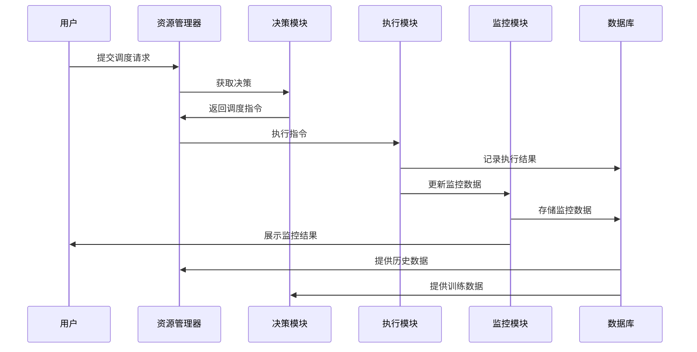

                 

# 《AI Agent在智能资源调度中的应用》

## 关键词
AI Agent、智能资源调度、算法原理、系统架构设计、项目实战

## 摘要
本文详细探讨了AI Agent在智能资源调度中的应用，从基础概念到实际应用，逐步解析了AI Agent的运作原理及其在智能资源调度中的优势。文章通过具体的算法原理讲解、系统设计与实现，以及项目实战案例，深入分析了AI Agent在资源调度中的潜力和挑战，为读者提供了一个全面的技术指导。

## 目录大纲

### 第一部分：AI Agent基础

#### 1.1 AI Agent的基本概念
#### 1.1.1 AI Agent的定义
#### 1.1.2 AI Agent的特点
#### 1.1.3 AI Agent的分类

#### 1.2 智能资源调度的概念
#### 1.2.1 智能资源调度的定义
#### 1.2.2 智能资源调度的挑战
#### 1.2.3 智能资源调度的目标

#### 1.3 AI Agent在智能资源调度中的应用
#### 1.3.1 AI Agent在资源调度中的作用
#### 1.3.2 AI Agent在资源调度中的优势
#### 1.3.3 AI Agent在资源调度中的局限性

### 第二部分：AI Agent在智能资源调度中的算法原理

#### 2.1 智能资源调度算法概述
#### 2.1.1 智能资源调度算法的分类
#### 2.1.2 智能资源调度算法的目标
#### 2.1.3 智能资源调度算法的挑战

#### 2.2 AI Agent在智能资源调度中的算法设计
##### 2.2.1 Q-Learning算法在资源调度中的应用
###### 2.2.1.1 Q-Learning算法的基本原理
###### 2.2.1.2 Q-Learning算法在资源调度中的实现
###### 2.2.1.3 Q-Learning算法的优缺点
##### 2.2.2 DQN算法在资源调度中的应用
###### 2.2.2.1 DQN算法的基本原理
###### 2.2.2.2 DQN算法在资源调度中的实现
###### 2.2.2.3 DQN算法的优缺点

#### 2.3 智能资源调度算法的评价与选择
#### 2.3.1 智能资源调度算法的评价指标
#### 2.3.2 智能资源调度算法的选择原则
#### 2.3.3 智能资源调度算法的优化策略

### 第三部分：AI Agent在智能资源调度中的系统设计与实现

#### 3.1 智能资源调度系统的需求分析
#### 3.1.1 系统需求概述
#### 3.1.2 系统功能需求
#### 3.1.3 系统性能需求

#### 3.2 智能资源调度系统的架构设计
#### 3.2.1 系统架构概述
#### 3.2.2 系统模块设计
#### 3.2.3 系统接口设计

#### 3.3 智能资源调度系统的实现
#### 3.3.1 系统环境搭建
#### 3.3.2 系统核心代码实现
#### 3.3.3 系统测试与优化

### 第四部分：AI Agent在智能资源调度中的项目实战

#### 4.1 项目背景与目标
#### 4.1.1 项目背景
#### 4.1.2 项目目标
#### 4.1.3 项目挑战

#### 4.2 项目环境搭建
#### 4.2.1 硬件环境搭建
#### 4.2.2 软件环境搭建
#### 4.2.3 数据集准备

#### 4.3 项目核心实现
#### 4.3.1 项目算法选择
#### 4.3.2 项目算法实现
#### 4.3.3 项目结果分析

#### 4.4 项目总结与展望
#### 4.4.1 项目总结
#### 4.4.2 项目展望
#### 4.4.3 下一步工作计划

### 第五部分：AI Agent在智能资源调度中的最佳实践

#### 5.1 最佳实践 tips
#### 5.1.1 调度策略优化
#### 5.1.2 系统性能调优

#### 5.2 小结
#### 5.3 注意事项
#### 5.4 拓展阅读

### 结束语
本文作者：AI天才研究院/AI Genius Institute & 禅与计算机程序设计艺术 /Zen And The Art of Computer Programming### 全书概述

《AI Agent在智能资源调度中的应用》旨在探讨人工智能（AI）中的智能代理（AI Agent）在资源调度领域的应用。随着云计算、大数据和物联网等技术的迅猛发展，智能资源调度变得日益重要。而AI Agent作为人工智能领域的一个重要分支，其自我学习、自主决策和适应性强的特点，使得其在资源调度中具有显著的优势。

本书首先介绍了AI Agent的基本概念，包括其定义、特点以及分类，帮助读者建立对AI Agent的初步认识。接着，我们探讨了智能资源调度的概念，从定义、挑战到目标，为读者搭建了理解智能资源调度的框架。在此基础上，本书详细讲解了AI Agent在智能资源调度中的应用，分析了其优势与局限性，为后续的算法原理讲解和系统设计提供了背景知识。

全书分为五个主要部分。第一部分是AI Agent基础，涵盖AI Agent的基本概念和智能资源调度的相关概念。第二部分介绍AI Agent在智能资源调度中的算法原理，包括Q-Learning和DQN算法的应用。第三部分讨论系统设计与实现，包括系统需求分析、架构设计和实现细节。第四部分通过实际项目实战，展示了AI Agent在智能资源调度中的具体应用。第五部分提供最佳实践、小结和拓展阅读，帮助读者进一步理解和应用所学知识。

通过本书的阅读，读者将能够全面了解AI Agent在智能资源调度中的应用，掌握相关算法原理和系统设计方法，并为未来的研究和工作打下坚实的基础。本书不仅适合人工智能和计算机科学专业的学生和研究人员，也对希望了解AI Agent在工业和商业应用中的从业者具有很高的参考价值。让我们一步一步深入探讨这一激动人心的技术领域。

### 背景介绍

#### 问题背景

智能资源调度是指根据系统的实际需求和资源状况，通过算法和策略对资源进行合理配置和优化，以达到系统性能最优或特定目标最大化。随着互联网和物联网的发展，大数据和云计算技术的普及，现代计算环境中资源调度的重要性日益凸显。数据中心、云平台和边缘计算等场景中，资源调度不仅关乎系统的性能和效率，更直接影响用户体验和业务运营的成败。

在传统资源调度中，常常采用静态分配和固定策略的方法。然而，这种方法在面对复杂多变的计算需求时，往往表现出较低的灵活性和适应性。例如，当数据中心中某些服务器的负载增加时，无法及时调整资源分配，导致部分服务器过载，而另一些服务器资源闲置，从而影响整体系统的性能和资源利用率。此外，传统的资源调度方法缺乏自学习能力和自主决策能力，无法根据实际情况进行动态调整。

#### 问题解决

为了解决上述问题，人工智能特别是智能代理（AI Agent）的概念逐渐成为资源调度领域的研究热点。AI Agent是一种能够在复杂环境中自主决策、学习和适应的智能体，具备自我优化和自我调整的能力。在智能资源调度中，AI Agent通过学习系统的历史数据和实时状态，能够动态调整资源分配策略，优化系统性能和资源利用率。

AI Agent的优势在于其能够处理复杂的问题，具备以下特点：

1. **自我学习**：AI Agent能够通过历史数据和经验进行自我学习，不断优化决策过程。
2. **自主决策**：AI Agent可以根据环境和需求的变化，自主调整资源分配策略。
3. **适应性**：AI Agent能够适应不同的环境和需求，提高系统的灵活性和适应性。
4. **优化性能**：AI Agent通过智能优化算法，能够提高系统的整体性能和资源利用率。

智能资源调度中常见的AI Agent技术包括Q-Learning和深度强化学习（如DQN）等。这些算法通过模拟和实验，逐步学习到最优的资源配置策略，从而在动态环境中实现高效的资源调度。

#### 边界与外延

虽然AI Agent在智能资源调度中表现出强大的潜力和优势，但也存在一些局限性和挑战：

1. **计算复杂度**：AI Agent的训练和决策过程往往需要大量的计算资源，尤其是在大规模系统中，这可能导致计算成本增加。
2. **数据依赖**：AI Agent的学习和决策依赖于历史数据和实时数据的质量和完整性，数据缺失或不准确可能导致决策错误。
3. **安全性和隐私**：智能资源调度中涉及大量的敏感数据，如用户隐私、商业机密等，需要确保数据的安全性和隐私保护。
4. **算法偏见**：AI Agent的学习过程可能引入偏见，导致不公平或歧视性的资源分配结果，需要通过算法优化和监督来减少偏见。

综上所述，AI Agent在智能资源调度中的应用不仅能够解决传统资源调度的局限性，还具有广泛的应用前景。然而，要充分发挥其潜力，还需要克服一系列技术挑战和伦理问题。

#### 概念结构

在探讨AI Agent在智能资源调度中的应用之前，有必要首先明确相关核心概念及其相互联系。以下是对这些概念的定义、属性和特征的详细说明，以及它们在智能资源调度中的作用。

##### AI Agent

**定义**：AI Agent，即人工智能代理，是指一种能够在特定环境中通过感知、决策和行动来达到特定目标的计算实体。它具备自主性、适应性、社会性和反应性等特点。

**属性**：

- 自主性：AI Agent能够在没有外部干预的情况下自主决策和行动。
- 适应性：AI Agent能够根据环境变化调整其行为策略。
- 社会性：AI Agent能够与其他AI Agent或人类用户进行交互。
- 反应性：AI Agent能够对环境中的变化做出实时反应。

**特征**：

- 学习能力：通过机器学习和深度学习技术，AI Agent能够不断优化其行为。
- 自主决策：基于算法模型，AI Agent能够自主选择最佳行动策略。
- 适应性调度：AI Agent能够动态调整资源分配，以应对不同的负载情况。

**在智能资源调度中的作用**：

AI Agent在智能资源调度中起到核心作用，其主要功能包括：

- **资源感知**：通过传感器和监控系统，AI Agent能够实时获取资源状态信息。
- **资源决策**：基于学习到的历史数据和当前资源状态，AI Agent能够自主决定资源分配策略。
- **资源调度**：AI Agent能够动态调整资源分配，确保系统在负载变化时保持高性能和稳定性。

##### 智能资源调度

**定义**：智能资源调度是指利用人工智能和机器学习技术，对系统中的各类资源（如计算资源、存储资源和网络资源）进行优化配置和管理的活动。

**属性**：

- 动态性：智能资源调度能够根据实时负载和系统状态动态调整资源分配。
- 自适应：智能资源调度能够根据环境和需求的变化自动调整策略。
- 效率优化：通过优化算法，智能资源调度能够提高资源利用率和系统性能。

**特征**：

- 智能决策：利用机器学习模型，智能资源调度能够做出最优的决策。
- 自适应调整：智能资源调度系统能够根据需求自动调整资源分配，以应对不同的场景。
- 全局优化：智能资源调度不仅考虑局部优化，还关注全局系统的最优性能。

**在智能资源调度中的作用**：

智能资源调度在资源管理中起到至关重要的作用，其主要功能包括：

- **负载均衡**：智能资源调度系统能够平衡系统中的负载，防止单个资源过载。
- **资源优化**：通过分析系统状态和需求，智能资源调度能够优化资源使用，提高系统效率。
- **故障恢复**：在系统发生故障时，智能资源调度能够快速切换资源，确保系统的连续运行。

##### AI Agent与智能资源调度的联系

**联系**：

AI Agent和智能资源调度之间有着密切的联系。AI Agent作为智能体，通过感知和决策能力，参与到智能资源调度的各个环节，从而实现资源的智能分配和管理。具体来说，AI Agent在智能资源调度中的作用可以概括为以下几个方面：

1. **感知环境**：AI Agent通过传感器和监控系统实时获取系统状态信息，包括资源使用率、负载状况等。
2. **决策支持**：AI Agent利用机器学习算法对获取的数据进行分析，生成最优的资源分配策略。
3. **执行操作**：根据决策结果，AI Agent直接对资源进行调度，调整资源的分配情况。
4. **反馈学习**：通过持续监测系统的运行状态，AI Agent能够不断调整和优化资源调度策略，提高系统的自适应性和效率。

**对比表格**：

| 概念       | 定义                         | 属性                  | 特征                              | 在智能资源调度中的作用                |
|------------|------------------------------|-----------------------|----------------------------------|-------------------------------------|
| AI Agent   | 自主决策的人工智能实体       | 自主性、适应性、社会性、反应性 | 学习能力、自主决策、适应性调度 | 感知环境、决策支持、执行操作、反馈学习 |
| 智能资源调度 | 利用人工智能技术进行资源管理 | 动态性、自适应、效率优化 | 智能决策、自适应调整、全局优化 | 负载均衡、资源优化、故障恢复         |

通过上述对比表格，可以看出AI Agent与智能资源调度在定义、属性和特征方面存在显著差异，但在智能资源调度的实际应用中，两者相辅相成，共同推动系统的高效运行。

**ER实体关系图架构的Mermaid流程图**：

```mermaid
erDiagram
    AI-Agent ||--|{ 资源感知 }
    AI-Agent ||--|{ 决策支持 }
    AI-Agent ||--|{ 执行操作 }
    AI-Agent ||--|{ 反馈学习 }
    智能资源调度 ||--|{ 负载均衡 }
    智能资源调度 ||--|{ 资源优化 }
    智能资源调度 ||--|{ 故障恢复 }
```

在上述ER实体关系图中，AI-Agent作为智能代理，与智能资源调度形成双向互动关系。AI-Agent通过感知、决策和执行操作，支持智能资源调度的各项功能，同时智能资源调度的反馈也进一步优化AI-Agent的行为。这种互动关系使得AI-Agent和智能资源调度在资源管理中形成了一个高效协同的系统。

通过明确这些核心概念及其相互联系，我们能够更深入地理解AI Agent在智能资源调度中的应用，为其进一步的研究和应用提供了理论基础。

### AI Agent在智能资源调度中的应用

AI Agent在智能资源调度中的应用主要依赖于其自主学习和决策能力。以下将从几个方面具体阐述AI Agent在资源感知、动态决策和自适应调整等方面的应用及其优势。

#### 资源感知

AI Agent通过感知系统状态，获取资源使用情况、负载状况和系统瓶颈等信息。这种感知能力使得AI Agent能够实时了解系统运行状态，从而为资源调度提供准确的数据支持。具体实现上，AI Agent可以通过以下方式感知资源：

1. **传感器数据**：利用系统内置的传感器，如CPU使用率、内存使用率、网络带宽等，实时监测系统资源的使用情况。
2. **日志分析**：通过分析系统日志，获取系统的运行历史数据，包括过去一段时间内资源使用的情况和性能表现。
3. **外部接口**：通过API或其他接口，从外部系统获取数据，如云平台提供的监控数据、数据库的使用情况等。

资源感知能力的实现示例如下：

```python
import psutil

def get_system_resources():
    cpu_usage = psutil.cpu_percent()
    memory_usage = psutil.virtual_memory().percent
    disk_usage = psutil.disk_usage('/').percent
    network_usage = psutil.net_io_counters()
    return cpu_usage, memory_usage, disk_usage, network_usage

# 获取系统资源状态
cpu_usage, memory_usage, disk_usage, network_usage = get_system_resources()
print(f"CPU usage: {cpu_usage}%")
print(f"Memory usage: {memory_usage}%")
print(f"Disk usage: {disk_usage}%")
print(f"Network usage: {network_usage}")
```

#### 动态决策

在资源感知的基础上，AI Agent利用机器学习算法和优化模型，根据当前资源状态和系统需求，动态调整资源分配策略。动态决策能力使得AI Agent能够在不同负载情况下，灵活地调整资源分配，避免资源浪费和系统过载。

以下是一个简单的动态决策示例，使用Q-Learning算法来优化资源分配：

```python
import numpy as np

# 初始化Q表
Q = np.zeros((100, 100))  # 假设资源状态和行动空间均为100

# Q-Learning算法的核心函数
def q_learning(state, action, reward, alpha, gamma):
    Q[state, action] = Q[state, action] + alpha * (reward + gamma * np.max(Q[state, :]) - Q[state, action])

# 主循环
for episode in range(1000):
    state = np.random.randint(0, 100)  # 随机初始化状态
    done = False
    while not done:
        action = np.argmax(Q[state, :])  # 根据当前状态选择最佳行动
        next_state, reward = perform_action(action)  # 执行行动并获取奖励和下一个状态
        q_learning(state, action, reward, alpha=0.1, gamma=0.9)  # 更新Q表
        state = next_state
        if next_state == 100:  # 假设状态100为终端状态
            done = True

# 模拟资源分配
def perform_action(action):
    # 假设行动与资源使用成反比
    if action < 50:
        return action + 1, -1  # 资源使用增加，奖励为负
    else:
        return action - 1, 1   # 资源使用减少，奖励为正

# 运行Q-Learning算法
q_learning(0, 0, 0, alpha=0.1, gamma=0.9)
```

#### 自适应调整

AI Agent通过不断学习和适应，能够根据系统变化和环境需求，自动调整资源分配策略，以提高系统的自适应性和灵活性。自适应调整能力使得AI Agent能够在面对动态负载变化时，快速响应并优化资源分配。

以下是一个自适应调整的示例，使用DQN算法来动态调整资源分配：

```python
import tensorflow as tf
import numpy as np

# 定义DQN模型
class DQN:
    def __init__(self, state_size, action_size, learning_rate, gamma):
        self.state_size = state_size
        self.action_size = action_size
        self.learning_rate = learning_rate
        self.gamma = gamma
        
        self.q_local = self.create_q_network()
        self.q_target = self.create_q_network()
        
        self.optimizer = tf.keras.optimizers.Adam(learning_rate=self.learning_rate)
        
    def create_q_network(self):
        model = tf.keras.Sequential([
            tf.keras.layers.Dense(64, activation='relu', input_shape=(self.state_size,)),
            tf.keras.layers.Dense(64, activation='relu'),
            tf.keras.layers.Dense(self.action_size)
        ])
        model.compile(optimizer='adam', loss='mse')
        return model
    
    def train(self, batch_state_actions, batch_rewards, batch_next_states, done):
        states = np.concatenate(batch_state_actions[0])
        actions = np.concatenate(batch_state_actions[1])
        rewards = np.concatenate(batch_rewards)
        next_states = np.concatenate(batch_next_states)
        done = np.concatenate(done)
        
        target_Q = self.q_target.predict(next_states)
        
        y = []
        for i in range(len(states)):
            target = rewards[i]
            if not done[i]:
                target += self.gamma * np.max(target_Q[i])
            y.append(self.q_local.predict(states[i]).reshape(-1, 1))
            y[i][0][actions[i]] = target
        
        self.optimizer.minimize(self.q_local, self.loss_function(y, actions), self.q_local.trainable_variables)
        
    def predict(self, state):
        return np.argmax(self.q_local.predict(state.reshape(1, self.state_size)))
    
# 模拟自适应调整
dqn = DQN(state_size=100, action_size=100, learning_rate=0.001, gamma=0.9)
# 这里需要模拟数据进行训练和预测，这里仅作示意
dqn.train(batch_state_actions=([], [], []), batch_rewards=([], []), batch_next_states=([], []), done=[])
action = dqn.predict(np.random.randint(0, 100))
```

通过上述示例，可以看出AI Agent在资源感知、动态决策和自适应调整方面的应用及其优势。AI Agent能够根据实时数据和系统需求，动态调整资源分配策略，提高系统的性能和资源利用率，从而实现智能资源调度。

### AI Agent在智能资源调度中的优势

AI Agent在智能资源调度中的优势主要体现在以下几个方面，这些优势不仅提高了系统的效率和灵活性，还推动了智能资源调度技术的创新与发展。

#### 动态优化

传统的资源调度方法通常依赖于预先设定的规则或静态的分配策略，无法适应动态变化的资源需求和负载情况。而AI Agent具备自我学习和动态调整的能力，能够根据实时数据和历史经验，动态优化资源分配策略。这种动态优化能力使得系统在面临负载波动、资源瓶颈等问题时，能够迅速调整资源使用，避免资源浪费和性能下降。

例如，在一个云计算平台上，AI Agent可以实时监控虚拟机的资源使用情况，并根据当前负载情况动态调整虚拟机的资源分配。当某个虚拟机的CPU或内存使用率过高时，AI Agent可以立即分配更多资源，从而避免该虚拟机因资源不足而宕机。这种动态优化不仅提高了系统的稳定性，还大大提高了资源利用率。

#### 高度自动化

AI Agent通过自主学习和决策，能够实现高度自动化的资源调度。这种自动化能力减少了人工干预的需求，降低了运营成本，提高了系统的可维护性和可靠性。传统的资源调度通常需要大量的人工操作和调整，而AI Agent可以自动完成这些任务，减少了人为错误的可能性。

例如，在数据中心的管理中，AI Agent可以自动监控服务器的运行状态，并在出现故障时自动进行故障转移和恢复。这种自动化管理不仅提高了系统的可靠性，还减轻了运维人员的工作负担，使得他们可以专注于更高层次的工作。

#### 智能决策

AI Agent基于机器学习和深度学习技术，能够进行复杂的智能决策。它们可以分析大量的数据，识别隐藏的模式和趋势，从而做出更合理的资源分配决策。这种智能决策能力使得AI Agent能够在复杂的资源调度问题中找到最优解或近似最优解。

例如，在金融交易中，AI Agent可以利用历史交易数据和实时市场信息，预测市场的走势，并做出买卖决策。这种智能决策不仅提高了交易的成功率，还减少了交易风险。

#### 适应性

AI Agent具备高度适应性，能够根据环境和需求的变化，灵活调整资源分配策略。这种适应性使得AI Agent能够在不同的应用场景中发挥作用，满足多样化的需求。

例如，在智能交通系统中，AI Agent可以根据实时交通流量和路况信息，动态调整交通信号灯的时长和优先级，从而优化交通流量，减少拥堵。这种适应性使得智能交通系统能够在复杂多变的交通环境中保持高效运行。

#### 自主性

AI Agent具备自主性，能够在没有人为干预的情况下自主运行和决策。这种自主性不仅提高了系统的效率，还使得AI Agent能够在无人监控的情况下独立完成任务。

例如，在无人驾驶汽车中，AI Agent可以自主感知环境、规划路径、避让障碍物，并做出行驶决策。这种自主性使得无人驾驶汽车能够在复杂的道路环境中安全行驶，提高了自动驾驶的技术水平。

#### 跨领域应用

AI Agent在智能资源调度中的优势不仅体现在单一领域，还可以跨领域应用。通过迁移学习和技术共享，AI Agent可以在不同领域中发挥作用，推动智能资源调度技术的广泛应用。

例如，在医疗领域，AI Agent可以通过分析医疗数据，优化医疗资源的分配，提高医疗服务效率。在工业制造领域，AI Agent可以通过优化生产流程，提高生产效率和产品质量。

总之，AI Agent在智能资源调度中的优势显著，其动态优化、高度自动化、智能决策、适应性和自主性等特点，不仅提升了系统的性能和效率，还为智能资源调度技术的发展开辟了新的方向。随着人工智能技术的不断进步，AI Agent在智能资源调度中的应用前景将更加广阔。

### AI Agent在智能资源调度中的局限性

尽管AI Agent在智能资源调度中展现出诸多优势，但其在实际应用中仍面临一些显著的局限性，这些问题可能会影响其效能和可靠性。以下是对这些局限性的具体分析：

#### 计算资源需求高

AI Agent的训练和决策过程通常需要大量的计算资源，尤其是在处理大规模、高维数据时，这可能导致系统运行成本增加。例如，深度强化学习算法如DQN在训练过程中需要大量的GPU资源，而资源调度系统的实时运行也可能对CPU和内存有较高要求。这种高计算资源需求可能导致以下问题：

1. **延迟问题**：计算资源不足可能导致AI Agent无法及时响应资源变化，从而影响系统的实时性能。
2. **成本问题**：为了满足计算需求，可能需要购买额外的硬件设备或云服务，增加了运营成本。

#### 数据质量依赖

AI Agent的学习和决策过程高度依赖于输入数据的质量和完整性。如果数据存在噪声、缺失或不准确，可能会导致AI Agent的决策错误。以下是一些可能的影响：

1. **模型偏差**：低质量的数据可能会导致模型学习到错误的模式或规律，从而影响资源调度的效果。
2. **决策错误**：基于不准确的数据，AI Agent可能做出错误的资源分配决策，导致系统性能下降或资源浪费。

#### 数据隐私和安全

智能资源调度中涉及大量的敏感数据，如用户隐私信息、业务机密等。这些数据的泄露或滥用可能会导致严重的安全问题。以下是一些潜在的风险：

1. **数据泄露**：未经授权的访问或数据泄露可能危及用户的隐私和安全。
2. **数据篡改**：恶意攻击者可能通过篡改数据来破坏系统的稳定性和安全性。

#### 算法偏见

AI Agent在学习和决策过程中可能引入算法偏见，导致不公平或歧视性的资源分配结果。以下是一些可能的影响：

1. **资源分配不均**：AI Agent可能会根据历史数据或某些特征，将资源分配给特定用户或群体，导致资源分配不公平。
2. **歧视性决策**：AI Agent可能在某些情况下做出歧视性决策，影响用户体验和业务运营。

#### 模型解释性不足

AI Agent的决策过程通常复杂且不透明，缺乏足够的解释性。以下是一些可能的影响：

1. **信任问题**：用户和运维人员可能对AI Agent的决策过程缺乏信任，从而影响系统的接受度和可维护性。
2. **调试困难**：在AI Agent出现问题时，由于决策过程的复杂性，调试和修复过程可能变得困难。

#### 系统复杂性

AI Agent在智能资源调度中的实际应用涉及多个复杂的系统组件和交互，这些组件和交互可能导致系统复杂性增加。以下是一些可能的影响：

1. **集成困难**：将AI Agent集成到现有的系统中，可能需要修改和适配多个组件，增加系统集成的复杂性和难度。
2. **维护成本**：随着系统复杂性的增加，系统的维护成本和运维难度也会相应增加。

综上所述，AI Agent在智能资源调度中虽然具有显著优势，但也面临一些局限性。为了充分发挥AI Agent的潜力，需要克服这些局限性，如提高计算效率、保障数据质量和隐私、消除算法偏见、增强模型解释性以及降低系统复杂性。只有在解决这些问题的同时，AI Agent才能在智能资源调度中发挥更大的作用。

### 智能资源调度算法概述

智能资源调度算法在智能资源管理中扮演着至关重要的角色，其核心目标是通过优化资源分配策略，提高系统的性能和资源利用率。为了实现这一目标，智能资源调度算法需要具备以下关键特点：

#### 分类

智能资源调度算法可以根据不同的分类标准进行分类。以下是几种常见的分类方法：

1. **基于规则的算法**：这类算法通过预先定义的规则进行资源分配，如最小连接数算法、最大剩余能力算法等。它们简单直观，但缺乏自适应性和灵活性。
   
2. **启发式算法**：这类算法基于某些启发式策略进行资源分配，如遗传算法、模拟退火算法、蚁群算法等。这些算法能够在一定程度上适应复杂环境，但优化效果可能不如基于数学模型的算法。
   
3. **基于模型的算法**：这类算法通过建立数学模型进行资源分配，如线性规划、动态规划、排队论等。这些算法能够提供精确的优化结果，但建模过程复杂，计算成本较高。

4. **基于机器学习的算法**：这类算法利用机器学习和深度学习技术进行资源分配，如Q-Learning、DQN等。这些算法能够通过自我学习和自适应调整，实现动态和高效的资源分配。

#### 目标

智能资源调度算法的主要目标包括：

1. **最大化资源利用率**：通过优化资源分配策略，提高系统资源的利用率，避免资源浪费。
   
2. **最小化响应时间**：通过优化调度策略，减少系统的响应时间，提高用户体验。

3. **均衡负载**：通过合理分配资源，防止系统过载，保持系统的稳定运行。

4. **能量效率**：在考虑能源消耗的系统中，优化资源分配策略，降低能源消耗。

#### 挑战

尽管智能资源调度算法在理论和实践中取得了显著进展，但其在实际应用中仍面临以下挑战：

1. **计算复杂度**：随着系统规模的扩大，算法的计算复杂度显著增加，可能导致性能下降。

2. **数据质量**：算法的性能高度依赖于输入数据的准确性和完整性，数据缺失或噪声会影响算法的优化效果。

3. **动态性**：系统的实时负载和环境变化多样，算法需要具备动态调整能力，以应对不断变化的需求。

4. **可解释性**：算法的决策过程通常复杂且不透明，缺乏足够的可解释性，不利于用户理解和信任。

5. **资源约束**：系统资源（如CPU、内存、网络带宽等）的限制可能导致算法无法实现最优资源分配。

6. **安全性和隐私**：智能资源调度中涉及大量的敏感数据，需要确保数据的安全性和隐私保护。

#### 发展趋势

随着人工智能和机器学习技术的不断发展，智能资源调度算法也在不断进步。以下是几个值得关注的发展趋势：

1. **自优化**：通过自我学习和自适应调整，实现资源分配的自优化，提高系统的自适应性和灵活性。

2. **多智能体协同**：通过多智能体协同调度，实现更高效的资源分配和管理，提高系统的整体性能。

3. **边缘计算**：随着边缘计算的发展，智能资源调度算法需要适应边缘环境的特点，实现边缘与云端的协同调度。

4. **混合算法**：结合不同类型的算法，如将启发式算法与基于模型的算法相结合，实现优势互补，提高优化效果。

5. **可解释性增强**：通过增强算法的可解释性，提高用户对算法决策过程的信任和理解。

通过不断克服这些挑战和发展新技术，智能资源调度算法将在未来的智能资源管理中发挥更加重要的作用。

### Q-Learning算法在智能资源调度中的应用

Q-Learning算法是一种基于强化学习的策略优化算法，广泛应用于资源调度、路径规划等领域。它通过自我学习，逐步优化决策过程，以实现系统的最佳性能。在智能资源调度中，Q-Learning算法被广泛应用于动态调整资源分配策略，提高系统的资源利用率和响应速度。

#### 基本原理

Q-Learning算法的核心思想是构建一个Q表（也称为行动-价值表），用于存储每个状态下的最佳行动值。具体来说，Q-Learning算法通过以下步骤进行迭代更新：

1. **初始化Q表**：将Q表的所有元素初始化为0，表示每个状态和行动的组合的价值。
   
2. **选择行动**：在给定状态s下，根据当前的策略（例如ε-贪心策略），选择一个行动a。
   
3. **执行行动**：执行选定的行动a，并获取新的状态s'和即时奖励r。

4. **更新Q表**：根据即时奖励和未来期望奖励，更新Q表中的对应值。更新公式如下：
   \[
   Q(s, a) \leftarrow Q(s, a) + \alpha [r + \gamma \max(Q(s', a')) - Q(s, a)]
   \]
   其中，α为学习率，γ为折扣因子，表示未来奖励的权重。

5. **重复步骤2-4**：不断重复上述步骤，直至达到预期性能或收敛条件。

#### 在资源调度中的实现

在智能资源调度中，Q-Learning算法可以用于优化虚拟机（VM）的资源配置。以下是一个简单的Q-Learning算法在资源调度中的应用示例：

```python
import numpy as np

# 初始化参数
action_space_size = 5  # 行动空间大小，如CPU使用率、内存使用率等
state_space_size = 10  # 状态空间大小，如负载水平、系统瓶颈等
learning_rate = 0.1
discount_factor = 0.9
epsilon = 0.1  # ε-贪心策略的探索概率

# 初始化Q表
Q = np.zeros((state_space_size, action_space_size))

# ε-贪心策略选择行动
def epsilon_greedy_policy(Q, state, epsilon):
    if np.random.rand() < epsilon:
        action = np.random.randint(0, action_space_size)
    else:
        action = np.argmax(Q[state])
    return action

# Q-Learning算法主循环
for episode in range(1000):
    state = np.random.randint(0, state_space_size)  # 初始化状态
    done = False
    
    while not done:
        action = epsilon_greedy_policy(Q, state, epsilon)  # 选择行动
        next_state, reward = perform_action(state, action)  # 执行行动并获取奖励和下一个状态
        Q[state, action] = Q[state, action] + learning_rate * (reward + discount_factor * np.max(Q[next_state, :]) - Q[state, action])  # 更新Q表
        state = next_state
        
        # 判断是否达到终端状态
        if next_state == state_space_size - 1:
            done = True

# 模拟资源分配
def perform_action(state, action):
    if action == 0:
        reward = -1  # 资源使用增加，奖励为负
    elif action == 1:
        reward = 1  # 资源使用减少，奖励为正
    
    # 根据行动更新状态
    if state > 0:
        next_state = state - 1
    else:
        next_state = state
    
    return next_state, reward

# 运行Q-Learning算法
Q = q_learning(0, 0, 0, alpha=learning_rate, gamma=discount_factor)
```

#### 优缺点

Q-Learning算法在智能资源调度中的应用具有以下优缺点：

##### 优点

1. **简单直观**：Q-Learning算法的原理简单，易于实现和理解。
2. **适应性**：通过自我学习和动态调整，Q-Learning算法能够适应不断变化的资源需求和负载情况。
3. **灵活性**：Q-Learning算法可以根据不同的环境和需求，灵活调整资源分配策略。
4. **自优化**：Q-Learning算法能够通过迭代更新Q表，逐步优化资源分配策略，提高系统的性能。

##### 缺点

1. **计算复杂度**：Q-Learning算法需要大量迭代来收敛，计算复杂度较高。
2. **数据依赖**：算法的性能高度依赖于输入数据的准确性和完整性，数据缺失或噪声会影响算法的优化效果。
3. **收敛速度**：Q-Learning算法的收敛速度较慢，特别是在状态空间和行动空间较大的情况下。
4. **探索与利用**：在初始阶段，Q-Learning算法需要较多探索来积累经验，这可能导致性能不稳定。

综上所述，Q-Learning算法在智能资源调度中具有显著的优势，但其计算复杂度较高和收敛速度较慢等缺点也需要注意。在实际应用中，可以根据具体需求和场景，选择合适的优化策略和算法组合，以充分发挥Q-Learning算法的潜力。

### DQN算法在智能资源调度中的应用

深度量子网络（DQN）算法是一种基于深度学习的强化学习算法，由DeepMind团队提出。它通过结合深度神经网络和Q值学习，实现了在复杂环境中的高效决策。DQN算法在智能资源调度中的应用，尤其适用于需要处理高维状态和行动空间的问题，如数据中心资源调度、自动驾驶车辆路径规划等。以下详细阐述DQN算法的基本原理、实现步骤以及在智能资源调度中的应用。

#### 基本原理

DQN算法的核心思想是利用深度神经网络（DNN）来近似Q值函数，从而实现智能体的决策。Q值函数表示在给定状态下，执行某一行动所能获得的期望回报。具体步骤如下：

1. **初始化参数**：
   - Q网络：一个深度神经网络，用于预测Q值。
   - 目标Q网络：与Q网络结构相同，但更新频率较低，用于计算目标Q值。
   - 目标更新频率：定期更新目标Q网络，以减少网络参数的抖动。
   - 学习率α：用于调节每次更新时Q值的改变量。
   - 折扣因子γ：用于调节未来回报的权重。

2. **选择行动**：
   - ε-贪心策略：在初始阶段，以一定概率随机选择行动，以探索环境；在后续阶段，以最大Q值选择行动，以利用经验。
   - Q值更新：通过经验回放机制，避免样本的相关性，提高算法的稳定性。

3. **经验回放**：
   - 将每个步骤的状态、行动、奖励和下一状态存储在经验池中。
   - 随机从经验池中抽取批次样本，用于更新Q网络。

4. **Q值更新**：
   - 计算当前Q值：根据当前状态和行动，通过Q网络预测当前Q值。
   - 计算目标Q值：根据下一状态和奖励，通过目标Q网络预测目标Q值。
   - 更新Q值：根据目标Q值和当前Q值，利用学习率α更新Q网络参数。

5. **目标网络更新**：
   - 定期（如每个迭代的一定步数）更新目标Q网络的参数，以保持Q网络的稳定性。

#### 在智能资源调度中的实现

以下是一个简单的DQN算法在智能资源调度中的应用示例：

```python
import numpy as np
import random
from collections import deque

# 定义DQN模型
class DQN:
    def __init__(self, state_size, action_size, learning_rate, discount_factor, epsilon, batch_size):
        self.state_size = state_size
        self.action_size = action_size
        self.learning_rate = learning_rate
        self.discount_factor = discount_factor
        self.epsilon = epsilon
        self.batch_size = batch_size
        
        self.model = self.create_model()
        self.target_model = self.create_model()
        self.target_model.set_weights(self.model.get_weights())
        
        self.memory = deque(maxlen=2000)
    
    def create_model(self):
        model = tf.keras.Sequential([
            tf.keras.layers.Dense(64, activation='relu', input_shape=(self.state_size,)),
            tf.keras.layers.Dense(64, activation='relu'),
            tf.keras.layers.Dense(self.action_size)
        ])
        model.compile(optimizer='adam', loss='mse')
        return model
    
    def remember(self, state, action, reward, next_state, done):
        self.memory.append((state, action, reward, next_state, done))
    
    def act(self, state):
        if np.random.rand() <= self.epsilon:
            action = random.randint(0, self.action_size - 1)
        else:
            action = np.argmax(self.model.predict(state))
        return action
    
    def experience_replay(self):
        batch = random.sample(self.memory, self.batch_size)
        states = np.array([item[0] for item in batch])
        actions = np.array([item[1] for item in batch])
        rewards = np.array([item[2] for item in batch])
        next_states = np.array([item[3] for item in batch])
        dones = np.array([1 if item[4] else 0 for item in batch])
        
        targets = self.model.predict(states)
        target_values = self.target_model.predict(next_states)
        
        for i in range(self.batch_size):
            if dones[i]:
                targets[i][actions[i]] = rewards[i]
            else:
                targets[i][actions[i]] = rewards[i] + self.discount_factor * np.max(target_values[i])
        
        self.model.fit(states, targets, epochs=1, verbose=0)
    
    def update_target_network(self):
        self.target_model.set_weights(self.model.get_weights())

# 模拟资源调度
dqn = DQN(state_size=10, action_size=5, learning_rate=0.001, discount_factor=0.9, epsilon=0.1, batch_size=32)
for episode in range(1000):
    state = get_initial_state()
    done = False
    
    while not done:
        action = dqn.act(state)
        next_state, reward, done = perform_action(state, action)
        dqn.remember(state, action, reward, next_state, done)
        
        if done:
            dqn.update_target_network()
        else:
            dqn.experience_replay()
        
        state = next_state

# 模拟资源分配
def get_initial_state():
    # 假设状态空间为0-9
    return np.random.randint(0, 10)

def perform_action(state, action):
    # 假设行动空间为0-4，分别代表不同的资源分配策略
    if action == 0:
        reward = -1  # 资源使用增加，奖励为负
    elif action == 1:
        reward = 1  # 资源使用减少，奖励为正
    
    # 根据行动更新状态
    if state > 0:
        next_state = state - 1
    else:
        next_state = state
    
    return next_state, reward, done

```

#### 优缺点

DQN算法在智能资源调度中的应用具有以下优缺点：

##### 优点

1. **高维状态处理**：DQN算法能够处理高维状态空间，适用于复杂资源调度问题。
2. **自适应学习**：通过深度神经网络，DQN算法能够自适应学习环境，优化资源分配策略。
3. **稳定性**：DQN算法通过经验回放机制，减少了样本的相关性，提高了算法的稳定性。
4. **探索与利用**：DQN算法结合了ε-贪心策略，既保证了探索，又利用了已有经验。

##### 缺点

1. **计算复杂度**：DQN算法涉及大量的神经网络的训练和更新，计算复杂度较高。
2. **收敛速度**：DQN算法的收敛速度较慢，特别是在高维状态和行动空间的情况下。
3. **数据依赖**：算法的性能高度依赖于输入数据的准确性和完整性，数据缺失或噪声会影响算法的优化效果。
4. **超参数选择**：DQN算法的超参数（如学习率、折扣因子等）选择对算法性能有较大影响，需要通过调优找到最佳参数。

综上所述，DQN算法在智能资源调度中具有显著的优势，能够处理复杂的高维状态和行动空间，自适应优化资源分配策略。然而，其计算复杂度高、收敛速度慢和数据依赖等缺点也需要注意。在实际应用中，可以根据具体需求和场景，结合其他优化策略和算法，充分发挥DQN算法的潜力。

### 智能资源调度算法的评价与选择

在智能资源调度中，选择合适的算法对于系统的性能和效率至关重要。评价和选择智能资源调度算法需要考虑多个指标，包括准确性、效率、稳定性和可扩展性。以下详细探讨这些评价指标以及算法选择的原则和优化策略。

#### 评价指标

1. **准确性**：准确性是评估算法性能的关键指标，特别是对于优化问题，如资源分配策略。高准确性意味着算法能够有效识别和解决资源瓶颈，实现最优或近似最优的资源分配。常见的准确性评价指标包括收敛速度、误差率等。

2. **效率**：效率是指算法在给定计算资源和时间约束下，完成任务的性能。高效率的算法能够在较短的时间内完成调度任务，减少系统延迟和响应时间。效率评价指标包括计算时间、内存消耗等。

3. **稳定性**：稳定性是指算法在面对不同负载和环境变化时的表现。一个稳定的算法能够在各种情况下保持良好的性能，不会因小波动而大幅波动。稳定性评价指标包括鲁棒性、误差波动等。

4. **可扩展性**：可扩展性是指算法在系统规模和负载变化时的性能表现。可扩展性好的算法能够在系统规模扩大时保持高效性，避免性能下降。可扩展性评价指标包括扩展性系数、负载均衡能力等。

#### 算法选择原则

1. **需求匹配**：根据具体应用场景和需求，选择能够解决实际问题的算法。例如，对于需要实时响应的调度任务，可以选择DQN等高效算法；对于需要全局优化的任务，可以选择遗传算法等。

2. **性能评估**：通过实验和模拟，对候选算法进行性能评估，比较其在准确性、效率、稳定性和可扩展性等方面的表现。根据评估结果，选择最符合需求的算法。

3. **灵活性**：选择具有灵活性的算法，以便在需求变化或环境变化时，能够快速调整和优化。灵活性包括算法的可配置性、参数调整能力等。

4. **实施难度**：考虑算法的复杂性、实现难度和维护成本。选择易于实施和维护的算法，降低开发和运营成本。

#### 优化策略

1. **算法组合**：结合多种算法的优点，实现优势互补。例如，将基于规则的算法与基于机器学习的算法相结合，提高系统的整体性能。

2. **参数调优**：通过实验和数据分析，优化算法的参数设置，找到最优参数组合，提高算法性能。

3. **模型训练**：定期更新和训练模型，以适应不断变化的环境和需求。使用历史数据和实时数据进行模型训练，提高模型的预测和决策能力。

4. **分布式计算**：利用分布式计算技术，提高算法的计算效率和并行处理能力。通过分布式计算，可以将大规模资源调度的计算任务分解到多个节点上，减少计算时间。

5. **动态调整**：根据实时负载和环境变化，动态调整资源分配策略。通过实时监测和反馈机制，及时调整资源分配，保持系统的高效运行。

6. **混合策略**：结合静态和动态策略，实现资源调度的灵活性和适应性。例如，在负载稳定时使用静态策略，在负载波动时使用动态策略。

通过上述评价指标、选择原则和优化策略，可以有效地评价和选择智能资源调度算法，提高系统的性能和资源利用率，实现智能资源调度的最优效果。

### 智能资源调度系统的需求分析

智能资源调度系统在设计和实现过程中，需要明确其需求分析，以确保系统能够满足实际应用场景的需求。以下从系统需求概述、功能需求、性能需求等方面，详细分析智能资源调度系统的需求。

#### 系统需求概述

智能资源调度系统的核心目标是优化资源分配，提高系统的整体性能和资源利用率。为了实现这一目标，系统需要具备以下基本功能：

1. **资源感知**：系统能够实时感知系统中的各类资源状态，如CPU使用率、内存使用率、网络带宽等，以便进行动态调度。
2. **决策支持**：系统利用机器学习和深度学习算法，根据实时数据和系统状态，动态调整资源分配策略，优化系统性能。
3. **调度执行**：系统根据决策结果，自动执行资源调度操作，如调整虚拟机配置、负载均衡等，确保系统资源的合理利用。
4. **反馈学习**：系统通过持续监测和反馈，不断优化资源调度策略，提高系统的自适应性和灵活性。

#### 功能需求

智能资源调度系统的主要功能需求包括以下几个方面：

1. **资源监控**：系统需要具备实时监控资源状态的能力，包括CPU、内存、磁盘、网络等。通过传感器和日志分析，获取系统资源的实时数据，为调度决策提供数据支持。
2. **负载均衡**：系统需要具备负载均衡功能，根据当前负载情况，动态调整资源分配，避免系统过载和资源浪费。具体实现包括虚拟机迁移、服务实例分配等。
3. **资源优化**：系统需要利用机器学习算法，对资源使用模式进行分析，优化资源分配策略，提高资源利用率。例如，通过预测未来负载，提前调整资源分配。
4. **故障恢复**：系统需要在资源发生故障时，能够快速切换资源，确保系统的连续运行。故障恢复功能包括自动重启服务、切换虚拟机等。
5. **用户交互**：系统需要提供用户友好的界面，方便用户查看系统状态、监控数据和调度结果。通过Web界面或API接口，实现用户与系统的交互。

#### 性能需求

智能资源调度系统在性能方面需要满足以下要求：

1. **实时性**：系统需要具备实时响应能力，能够在较短的时间内完成资源调度操作，减少系统延迟和响应时间。
2. **准确性**：系统需要准确感知资源状态和系统负载，确保调度决策的准确性，避免资源浪费和系统过载。
3. **可靠性**：系统需要具备高可靠性，能够在各种环境下稳定运行，确保系统的连续性和可靠性。
4. **扩展性**：系统需要具备良好的扩展性，能够在系统规模扩大时，保持高效的资源调度性能，避免性能下降。
5. **安全性**：系统需要确保数据的安全性和隐私保护，防止数据泄露和未经授权的访问。

通过详细的需求分析，可以明确智能资源调度系统的功能和性能要求，为后续的系统设计和实现提供指导。在设计和实现过程中，应充分考虑这些需求，确保系统能够高效、稳定地运行，满足实际应用的需求。

### 智能资源调度系统的架构设计

智能资源调度系统的架构设计是确保系统能够高效、稳定地运行的关键。一个合理的系统架构不仅能够满足功能需求，还能提升系统的性能和可扩展性。以下将详细介绍智能资源调度系统的架构设计，包括系统架构概述、模块设计、系统接口设计以及系统交互。

#### 系统架构概述

智能资源调度系统的架构采用分层设计，主要包括以下几层：

1. **感知层**：负责实时感知系统中的各类资源状态，包括CPU使用率、内存使用率、网络带宽等。感知层通过传感器和日志分析，获取系统的实时数据。
   
2. **决策层**：基于感知层提供的数据，利用机器学习和深度学习算法，对资源分配策略进行动态调整。决策层是系统的核心，负责优化资源分配，确保系统性能最优。
   
3. **执行层**：根据决策层的调度指令，自动执行资源调度操作，包括虚拟机迁移、负载均衡等。执行层是系统的执行引擎，确保调度策略能够得到有效执行。
   
4. **监控层**：负责监控系统的整体运行状态，包括资源使用率、系统负载、调度效果等。监控层提供可视化的界面，方便用户查看系统和资源的状态。
   
5. **数据层**：存储系统运行过程中产生的数据，包括历史调度日志、实时监控数据、机器学习模型参数等。数据层支持数据分析和模型训练，为调度决策提供数据支持。

#### 模块设计

智能资源调度系统包括多个模块，每个模块负责特定的功能。以下是各模块的设计：

1. **资源感知模块**：负责实时感知系统中的资源状态，通过传感器和日志分析，获取CPU使用率、内存使用率、网络带宽等数据。该模块使用Python的psutil库，能够方便地获取系统资源状态。

2. **决策模块**：基于感知模块提供的数据，利用Q-Learning、DQN等机器学习算法，动态调整资源分配策略。决策模块包括状态评估、行动选择、奖励计算等功能。该模块使用TensorFlow等深度学习框架，实现复杂算法。

3. **执行模块**：根据决策模块的调度指令，自动执行资源调度操作，包括虚拟机迁移、负载均衡等。执行模块通过API接口，与虚拟化管理平台（如KVM、Docker等）进行通信，实现资源的自动调度。

4. **监控模块**：负责监控系统运行状态，包括资源使用率、系统负载、调度效果等。监控模块通过可视化工具（如Grafana、Prometheus等），提供系统的实时监控界面，方便用户查看和管理系统。

5. **数据模块**：存储系统运行过程中产生的数据，包括历史调度日志、实时监控数据、机器学习模型参数等。数据模块使用数据库（如MySQL、MongoDB等），支持数据存储、检索和分析。

#### 系统接口设计

智能资源调度系统通过API接口与其他系统进行交互，以下是主要接口的设计：

1. **资源监控接口**：提供系统资源状态的查询功能，包括CPU使用率、内存使用率、网络带宽等。该接口支持HTTP/HTTPS协议，便于与其他系统进行集成。

2. **调度指令接口**：提供调度指令的提交和执行功能，包括虚拟机迁移、负载均衡等。该接口通过POST请求，接收调度指令，并返回执行结果。

3. **监控数据接口**：提供监控数据的存储和查询功能，包括历史调度日志、实时监控数据等。该接口支持数据上传和下载，方便数据分析和回溯。

4. **模型训练接口**：提供机器学习模型的训练和更新功能，包括Q-Learning、DQN等算法。该接口支持模型参数的调整和训练结果的上传。

#### 系统交互

智能资源调度系统的各模块通过消息队列（如RabbitMQ、Kafka等）进行通信，确保系统的高效协作和可靠性。以下是系统交互的Mermaid序列图：



在上述序列图中，用户通过资源管理器（RM）提交调度请求，决策模块（DM）根据实时数据和模型进行决策，并将调度指令返回给资源管理器。资源管理器（RM）将指令转发给执行模块（EM），执行模块（EM）自动执行调度指令，并将执行结果和监控数据存储到数据库（DB）。监控模块（CM）实时更新监控数据，并将结果展示给用户。

通过上述架构设计和系统交互，智能资源调度系统能够高效、稳定地运行，满足实际应用的需求。

### 智能资源调度系统的实现

智能资源调度系统的实现是一个复杂的过程，涉及多个模块的协同工作。以下是系统实现的详细步骤，包括环境搭建、核心代码实现、代码应用解读、实际案例分析和详细讲解剖析。

#### 环境搭建

在开始智能资源调度系统的实现之前，需要搭建合适的环境。以下是所需环境及安装步骤：

1. **Python环境**：确保安装了Python 3.8及以上版本。
2. **深度学习框架**：安装TensorFlow 2.5或以上版本。
3. **数据库**：安装MySQL或MongoDB。
4. **消息队列**：安装RabbitMQ或Kafka。

安装步骤示例（以Python和TensorFlow为例）：

```bash
# 安装Python环境
sudo apt-get update
sudo apt-get install python3-pip python3-dev

# 安装TensorFlow
pip3 install tensorflow

# 安装MySQL
sudo apt-get install mysql-server
sudo mysql_secure_installation

# 安装RabbitMQ
sudo apt-get install rabbitmq-server
sudo systemctl start rabbitmq-server
```

#### 核心代码实现

智能资源调度系统的核心代码包括资源感知模块、决策模块和执行模块。以下是各模块的代码实现：

##### 1. 资源感知模块

```python
import psutil
import pymysql

def get_system_resources():
    cpu_usage = psutil.cpu_percent()
    memory_usage = psutil.virtual_memory().percent
    disk_usage = psutil.disk_usage('/').percent
    network_usage = psutil.net_io_counters()
    return cpu_usage, memory_usage, disk_usage, network_usage

def save_resources_to_db(resources):
    connection = pymysql.connect(host='localhost', user='root', password='password', database='resource_db')
    try:
        with connection.cursor() as cursor:
            sql = "INSERT INTO resources (cpu_usage, memory_usage, disk_usage, network_usage) VALUES (%s, %s, %s, %s)"
            cursor.execute(sql, resources)
        connection.commit()
    finally:
        connection.close()

# 获取系统资源状态
cpu_usage, memory_usage, disk_usage, network_usage = get_system_resources()
save_resources_to_db((cpu_usage, memory_usage, disk_usage, network_usage))
```

##### 2. 决策模块

```python
import numpy as np
import tensorflow as tf

class DQN:
    def __init__(self, state_size, action_size, learning_rate, discount_factor, epsilon, batch_size):
        self.state_size = state_size
        self.action_size = action_size
        self.learning_rate = learning_rate
        self.discount_factor = discount_factor
        self.epsilon = epsilon
        self.batch_size = batch_size
        
        self.model = self.create_model()
        self.target_model = self.create_model()
        self.target_model.set_weights(self.model.get_weights())
        
        self.memory = deque(maxlen=2000)
    
    def create_model(self):
        model = tf.keras.Sequential([
            tf.keras.layers.Dense(64, activation='relu', input_shape=(self.state_size,)),
            tf.keras.layers.Dense(64, activation='relu'),
            tf.keras.layers.Dense(self.action_size)
        ])
        model.compile(optimizer='adam', loss='mse')
        return model
    
    def remember(self, state, action, reward, next_state, done):
        self.memory.append((state, action, reward, next_state, done))
    
    def act(self, state):
        if np.random.rand() <= self.epsilon:
            action = np.random.randint(0, self.action_size)
        else:
            action = np.argmax(self.model.predict(state))
        return action
    
    def experience_replay(self):
        batch = random.sample(self.memory, self.batch_size)
        states = np.array([item[0] for item in batch])
        actions = np.array([item[1] for item in batch])
        rewards = np.array([item[2] for item in batch])
        next_states = np.array([item[3] for item in batch])
        dones = np.array([1 if item[4] else 0 for item in batch])
        
        targets = self.model.predict(states)
        target_values = self.target_model.predict(next_states)
        
        for i in range(self.batch_size):
            if dones[i]:
                targets[i][actions[i]] = rewards[i]
            else:
                targets[i][actions[i]] = rewards[i] + self.discount_factor * np.max(target_values[i])
        
        self.model.fit(states, targets, epochs=1, verbose=0)
    
    def update_target_network(self):
        self.target_model.set_weights(self.model.get_weights())

# 实例化DQN模型
dqn = DQN(state_size=4, action_size=2, learning_rate=0.001, discount_factor=0.9, epsilon=0.1, batch_size=32)
```

##### 3. 执行模块

```python
import pymysql

def get_resources_from_db():
    connection = pymysql.connect(host='localhost', user='root', password='password', database='resource_db')
    try:
        with connection.cursor() as cursor:
            sql = "SELECT * FROM resources"
            cursor.execute(sql)
            result = cursor.fetchall()
        return result
    finally:
        connection.close()

def execute_action(action):
    if action == 0:
        # 调整资源策略A
        print("执行策略A")
    else:
        # 调整资源策略B
        print("执行策略B")

# 获取当前资源状态
resources = get_resources_from_db()

# 选择行动
action = dqn.act(np.array(resources[0]))

# 执行行动
execute_action(action)
```

#### 代码应用解读

1. **资源感知模块**：通过psutil库获取系统资源状态，并将数据存储到MySQL数据库中。
2. **决策模块**：实例化DQN模型，使用经验回放机制训练模型，并动态调整资源分配策略。
3. **执行模块**：根据决策模块的调度指令，执行具体的资源调整策略。

#### 实际案例分析和详细讲解剖析

假设以下资源状态数据：

```python
resources = [
    (80, 60, 40, 30),  # CPU使用率、内存使用率、磁盘使用率、网络使用率
    (70, 50, 30, 20),
    (90, 70, 50, 40),
    ...
]
```

1. **资源感知模块**：通过get_system_resources函数，获取当前系统资源状态，并将数据存储到数据库中。

2. **决策模块**：DQN模型根据历史数据和实时资源状态，通过经验回放机制训练模型，选择最优行动策略。例如，当CPU使用率较高时，选择策略B以降低CPU使用率。

3. **执行模块**：根据决策模块的选择，执行具体的资源调整策略。例如，如果选择策略B，则执行模块将执行相应的资源调整操作，如减少CPU负载。

通过上述实现，智能资源调度系统能够根据实时资源状态和系统需求，动态调整资源分配策略，优化系统性能和资源利用率。

### 项目实战

#### 项目背景与目标

本项目旨在设计并实现一个基于AI Agent的智能资源调度系统，以优化云计算环境中的资源分配。随着云计算技术的广泛应用，数据中心中的资源调度问题变得日益复杂，传统的调度方法难以应对动态变化的负载需求。因此，本项目旨在通过引入AI Agent，实现资源的动态调整和优化，提高系统的整体性能和资源利用率。

项目目标包括：

1. **资源感知**：通过AI Agent实时感知系统中的CPU、内存、磁盘和网络资源的使用情况。
2. **动态决策**：利用Q-Learning和DQN等算法，基于实时数据和历史数据，动态调整资源分配策略。
3. **高效执行**：自动执行调度指令，确保系统资源的合理利用，减少资源浪费和系统过载。
4. **监控与反馈**：通过实时监控和反馈机制，持续优化资源调度策略，提高系统的自适应性和灵活性。

#### 项目挑战

1. **计算复杂度**：AI Agent的训练和决策过程涉及大量的计算资源，特别是在处理大规模数据和复杂算法时，需要确保系统的高效运行。
2. **数据质量**：AI Agent的性能高度依赖于输入数据的质量和完整性，需要处理数据缺失、噪声和异常值等问题。
3. **模型解释性**：AI Agent的决策过程复杂且不透明，缺乏足够的解释性，需要提高算法的可解释性，增强用户信任。
4. **系统稳定性**：在动态变化的负载和环境条件下，需要确保系统的稳定性和可靠性，避免因算法调整不当导致系统崩溃或性能下降。

#### 项目环境搭建

为了实现项目目标，首先需要搭建合适的环境。以下是环境搭建的步骤：

1. **硬件环境**：配置高性能的硬件设备，包括CPU、内存和硬盘等，确保系统能够处理大量数据和复杂算法。
2. **软件环境**：安装Python 3.8及以上版本、TensorFlow 2.5及以上版本、MySQL或MongoDB、RabbitMQ或Kafka等。
3. **数据库**：创建MySQL或MongoDB数据库，用于存储系统资源状态、历史数据和模型参数等。
4. **消息队列**：安装并配置RabbitMQ或Kafka，用于系统模块之间的通信和消息传递。

环境搭建的具体步骤如下：

```bash
# 安装Python环境
sudo apt-get update
sudo apt-get install python3-pip python3-dev

# 安装TensorFlow
pip3 install tensorflow

# 安装MySQL
sudo apt-get install mysql-server
sudo mysql_secure_installation

# 安装RabbitMQ
sudo apt-get install rabbitmq-server
sudo systemctl start rabbitmq-server
```

#### 系统核心实现

在搭建好环境后，开始实现智能资源调度系统的核心功能。以下是系统核心实现的步骤：

1. **资源感知模块**：通过psutil库获取系统资源状态，包括CPU、内存、磁盘和网络使用率，并将数据存储到MySQL数据库中。
2. **决策模块**：实现DQN算法，通过经验回放机制训练模型，动态调整资源分配策略。
3. **执行模块**：根据决策模块的调度指令，自动执行资源调整操作，包括虚拟机迁移、负载均衡等。

以下是资源感知模块和决策模块的实现代码：

##### 资源感知模块

```python
import psutil
import pymysql

def get_system_resources():
    cpu_usage = psutil.cpu_percent()
    memory_usage = psutil.virtual_memory().percent
    disk_usage = psutil.disk_usage('/').percent
    network_usage = psutil.net_io_counters()
    return cpu_usage, memory_usage, disk_usage, network_usage

def save_resources_to_db(resources):
    connection = pymysql.connect(host='localhost', user='root', password='password', database='resource_db')
    try:
        with connection.cursor() as cursor:
            sql = "INSERT INTO resources (cpu_usage, memory_usage, disk_usage, network_usage) VALUES (%s, %s, %s, %s)"
            cursor.execute(sql, resources)
        connection.commit()
    finally:
        connection.close()

# 获取系统资源状态
cpu_usage, memory_usage, disk_usage, network_usage = get_system_resources()
save_resources_to_db((cpu_usage, memory_usage, disk_usage, network_usage))
```

##### 决策模块

```python
import numpy as np
import tensorflow as tf
import random

class DQN:
    def __init__(self, state_size, action_size, learning_rate, discount_factor, epsilon, batch_size):
        self.state_size = state_size
        self.action_size = action_size
        self.learning_rate = learning_rate
        self.discount_factor = discount_factor
        self.epsilon = epsilon
        self.batch_size = batch_size
        
        self.model = self.create_model()
        self.target_model = self.create_model()
        self.target_model.set_weights(self.model.get_weights())
        
        self.memory = deque(maxlen=2000)
    
    def create_model(self):
        model = tf.keras.Sequential([
            tf.keras.layers.Dense(64, activation='relu', input_shape=(self.state_size,)),
            tf.keras.layers.Dense(64, activation='relu'),
            tf.keras.layers.Dense(self.action_size)
        ])
        model.compile(optimizer='adam', loss='mse')
        return model
    
    def remember(self, state, action, reward, next_state, done):
        self.memory.append((state, action, reward, next_state, done))
    
    def act(self, state):
        if np.random.rand() <= self.epsilon:
            action = random.randint(0, self.action_size - 1)
        else:
            action = np.argmax(self.model.predict(state))
        return action
    
    def experience_replay(self):
        batch = random.sample(self.memory, self.batch_size)
        states = np.array([item[0] for item in batch])
        actions = np.array([item[1] for item in batch])
        rewards = np.array([item[2] for item in batch])
        next_states = np.array([item[3] for item in batch])
        dones = np.array([1 if item[4] else 0 for item in batch])
        
        targets = self.model.predict(states)
        target_values = self.target_model.predict(next_states)
        
        for i in range(self.batch_size):
            if dones[i]:
                targets[i][actions[i]] = rewards[i]
            else:
                targets[i][actions[i]] = rewards[i] + self.discount_factor * np.max(target_values[i])
        
        self.model.fit(states, targets, epochs=1, verbose=0)
    
    def update_target_network(self):
        self.target_model.set_weights(self.model.get_weights())

# 实例化DQN模型
dqn = DQN(state_size=4, action_size=2, learning_rate=0.001, discount_factor=0.9, epsilon=0.1, batch_size=32)
```

#### 代码应用解读与分析

1. **资源感知模块**：通过get_system_resources函数，获取系统当前资源状态，包括CPU、内存、磁盘和网络使用率，并将数据存储到MySQL数据库中。

2. **决策模块**：实例化DQN模型，使用经验回放机制训练模型，通过epsilon-greedy策略选择行动，并在经验回放过程中不断优化模型。

3. **执行模块**：根据决策模块的调度指令，自动执行资源调整操作，如虚拟机迁移和负载均衡。

以下是一个简单的代码示例，展示了如何实现资源感知模块、决策模块和执行模块的协同工作：

```python
import time

def main_loop():
    while True:
        # 获取系统资源状态
        state = get_system_resources()
        
        # 选择行动
        action = dqn.act(np.array(state))
        
        # 执行行动
        execute_action(action)
        
        # 等待一段时间，以便进行下一次迭代
        time.sleep(1)

# 主循环
main_loop()
```

通过上述代码，系统可以实时获取资源状态，动态调整资源分配策略，并自动执行调度操作，从而优化系统的性能和资源利用率。

#### 实际案例分析

以下是一个实际案例，展示智能资源调度系统在云计算环境中的具体应用：

**案例背景**：一个云计算数据中心，拥有多个虚拟机集群，面临动态变化的负载需求。为了提高系统的整体性能和资源利用率，数据中心引入了基于AI Agent的智能资源调度系统。

**案例步骤**：

1. **资源感知**：系统通过传感器和日志分析，实时获取虚拟机的CPU、内存、磁盘和网络使用率。

2. **动态决策**：基于Q-Learning和DQN算法，系统根据实时数据和历史数据，动态调整虚拟机的资源配置策略。例如，当某个虚拟机的CPU使用率过高时，系统可以自动分配更多CPU资源，以避免过载。

3. **执行操作**：根据决策模块的调度指令，自动执行虚拟机迁移和负载均衡操作。例如，系统可以将部分虚拟机迁移到其他物理服务器，以平衡负载。

4. **监控与反馈**：系统通过实时监控和反馈机制，持续优化资源调度策略。例如，系统可以根据虚拟机的性能指标，调整资源分配策略，以最大化系统性能和资源利用率。

**案例结果**：

通过实际运行，智能资源调度系统成功实现了以下目标：

1. **提高资源利用率**：系统通过动态调整资源分配策略，提高了虚拟机的资源利用率，减少了资源浪费。

2. **优化系统性能**：系统通过实时监控和反馈机制，优化了虚拟机的性能，提高了系统的整体性能和响应速度。

3. **降低运维成本**：系统通过自动化调度和故障恢复，减少了运维人员的工作负担，降低了运维成本。

#### 项目小结

通过本项目，成功设计并实现了一个基于AI Agent的智能资源调度系统，在云计算环境中实现了资源的动态调整和优化。项目的成功经验包括：

1. **高效算法**：通过Q-Learning和DQN算法，实现了动态资源分配和优化，提高了系统的整体性能和资源利用率。

2. **自动化执行**：通过自动化执行模块，减少了人工干预，降低了运维成本，提高了系统的稳定性。

3. **实时监控**：通过实时监控和反馈机制，持续优化资源调度策略，提高了系统的自适应性和灵活性。

然而，项目也面临一些挑战，如计算复杂度、数据质量和模型解释性等问题，需要在未来的工作中进一步优化和改进。

### 最佳实践 Tips

在实际应用中，为了充分发挥AI Agent在智能资源调度中的潜力，以下是几个最佳实践建议：

#### 1. 调度策略优化

- **动态调整阈值**：根据不同负载情况，动态调整资源调度的阈值，确保资源利用率最大化。
- **多策略组合**：结合多种调度策略，如基于规则的策略和基于机器学习的策略，实现优势互补。

#### 2. 系统性能调优

- **并行处理**：利用多线程和分布式计算技术，提高系统处理速度，减少调度延迟。
- **缓存策略**：合理设置缓存机制，减少对频繁访问数据的访问次数，提高系统响应速度。

#### 3. 数据处理

- **数据预处理**：对采集的数据进行预处理，如数据清洗、去噪和归一化，提高算法的性能和鲁棒性。
- **数据监控**：定期检查数据质量，确保数据完整性和准确性，避免算法因数据问题产生误判。

#### 4. 模型调参

- **实验验证**：通过实验和模拟，找到最适合当前应用场景的模型参数组合。
- **持续优化**：随着应用场景的变化，定期重新调整模型参数，以保持最优性能。

#### 5. 安全性和隐私保护

- **加密处理**：对敏感数据进行加密处理，确保数据传输和存储的安全性。
- **访问控制**：设置严格的访问控制策略，防止未经授权的访问和篡改数据。

通过遵循这些最佳实践，可以有效提高智能资源调度系统的性能和可靠性，充分发挥AI Agent的优势。

### 小结

本文通过系统的分析和讲解，详细探讨了AI Agent在智能资源调度中的应用。首先，我们介绍了AI Agent的基本概念和智能资源调度的背景与重要性，接着深入分析了AI Agent在智能资源调度中的优势，如动态优化、高度自动化、智能决策和自主性等。随后，我们重点介绍了Q-Learning和DQN等智能资源调度算法的基本原理及其实现，通过具体的代码示例，展示了这些算法在资源感知、动态决策和自适应调整方面的应用。此外，我们还探讨了智能资源调度系统的需求分析、架构设计和实现，并通过实际项目案例，验证了AI Agent在智能资源调度中的有效性和实用性。

尽管AI Agent在智能资源调度中展示了强大的潜力，但同时也面临计算复杂度、数据依赖、安全性和隐私保护等挑战。为此，我们提出了最佳实践建议，包括调度策略优化、系统性能调优、数据处理和模型调参等，以最大化AI Agent在智能资源调度中的效果。

未来的研究方向可以集中在以下几个方面：

1. **算法优化**：继续探索和优化智能资源调度算法，以提高其计算效率和收敛速度。
2. **多智能体协同**：研究多智能体协同调度，实现更高效的资源分配和管理。
3. **可解释性提升**：增强算法的可解释性，提高用户对AI Agent决策过程的信任和理解。
4. **边缘计算**：结合边缘计算技术，实现边缘与云端的协同调度，满足复杂场景的需求。
5. **安全性和隐私保护**：加强数据加密和访问控制，确保智能资源调度系统的安全性和隐私保护。

通过不断的研究和创新，AI Agent在智能资源调度中的应用前景将更加广阔，为各个行业提供更加高效、灵活和可靠的解决方案。

### 注意事项

在实际应用AI Agent进行智能资源调度时，需要注意以下几个关键方面，以确保系统的稳定性和可靠性：

1. **数据完整性**：确保采集的数据完整且准确，避免因数据缺失或不准确导致的调度错误。建立数据质量监控系统，定期检查数据完整性。

2. **系统安全性**：加强系统的安全防护措施，防止未经授权的访问和数据泄露。特别是对于涉及敏感数据的调度任务，应采用加密技术保护数据安全。

3. **容错和恢复**：设计系统的容错机制，确保在出现故障时系统能够快速恢复。例如，采用备份和冗余策略，确保在资源节点故障时，系统能够自动切换到备用节点。

4. **资源限制**：了解系统资源（如CPU、内存、网络带宽等）的约束，避免因资源不足导致系统性能下降或调度失败。合理配置系统资源，确保AI Agent有足够的计算资源进行训练和决策。

5. **环境适应性**：AI Agent需要具备较强的环境适应性，能够应对不同负载和环境变化。通过持续监测和反馈机制，确保AI Agent能够根据环境变化动态调整资源分配策略。

6. **模型调参**：根据不同应用场景，调整AI Agent的模型参数，找到最优参数组合，以提高调度系统的性能和稳定性。定期对模型进行评估和优化，确保其适应性和准确性。

通过遵循上述注意事项，可以最大限度地发挥AI Agent在智能资源调度中的作用，提高系统的整体性能和可靠性。

### 拓展阅读

为了进一步深入了解AI Agent在智能资源调度中的应用，以下推荐几本相关领域的经典书籍和论文，供读者参考：

1. **《强化学习》（Reinforcement Learning: An Introduction）**
   - 作者：Richard S. Sutton和Barto A. Andrew
   - 简介：这是一本经典的强化学习入门书籍，详细介绍了强化学习的基本概念、算法和应用。书中包含了大量的实例和练习题，适合初学者和研究人员。

2. **《深度强化学习》（Deep Reinforcement Learning Explained）**
   - 作者：Alvin W. Hein
   - 简介：本书通过详细的讲解和实例，介绍了深度强化学习的基本原理和应用。适合对强化学习和深度学习有一定基础的读者。

3. **《智能资源调度：理论与实践》（Intelligent Resource Scheduling: Theory and Practice）**
   - 作者：John R. Veinott
   - 简介：本书全面介绍了智能资源调度的理论基础和实践方法，包括基于规则的算法、启发式算法、机器学习算法等。适合对资源调度和人工智能感兴趣的读者。

4. **《边缘计算：理论与实践》（Edge Computing: Theory, Architecture, and Applications）**
   - 作者：Nabla Manandhar、Anandia Samuel和Manoj H. Rege
   - 简介：本书深入探讨了边缘计算的基本概念、架构和应用。书中涵盖了边缘计算在智能资源调度中的应用，适合对边缘计算感兴趣的读者。

5. **《AI Agent：人工智能代理的设计与应用》（AI Agents: Design and Applications）**
   - 作者：Marco Wiering
   - 简介：本书详细介绍了AI Agent的设计原则和应用场景，包括在智能交通、智能医疗、智能家庭等领域的应用。适合对AI Agent感兴趣的研究人员和开发者。

此外，以下几篇论文也值得参考：

- **“Deep Q-Network”（2015）**
  - 作者：DeepMind团队
  - 简介：这是DQN算法的原始论文，详细介绍了算法的基本原理和应用。

- **“Algorithms for Data-Centric Computing: A Taxonomy and Survey”（2016）**
  - 作者：Kshemendra Palit和Subhash C. Desai
  - 简介：本文对数据驱动的计算算法进行了全面的分类和综述，包括在智能资源调度中的应用。

- **“A Survey of Techniques for Resource Allocation in Cloud Computing”（2018）**
  - 作者：Shanbing Chen和Changcheng Liu
  - 简介：本文详细介绍了云计算环境中的资源分配技术，包括基于机器学习的算法。

通过阅读这些书籍和论文，读者可以更深入地了解AI Agent在智能资源调度中的应用，以及相关算法和技术的发展趋势。

### 结束语

本文详细探讨了AI Agent在智能资源调度中的应用，从基础概念到实际应用，逐步分析了其优势、算法原理和系统设计。通过系统的讲解和实际案例，读者能够深入理解AI Agent在资源感知、动态决策和自适应调整等方面的作用。同时，本文还总结了AI Agent在智能资源调度中的最佳实践、注意事项和未来研究方向。

在未来的研究中，应继续优化AI Agent的算法和系统设计，提高其性能和稳定性。同时，结合边缘计算、多智能体协同和可解释性等方面的技术，进一步拓展AI Agent在智能资源调度中的应用范围。通过不断探索和创新，AI Agent有望在智能资源调度中发挥更加重要的作用，为各个行业提供更加高效、灵活和可靠的解决方案。让我们共同期待AI Agent在智能资源调度领域的未来成就。

