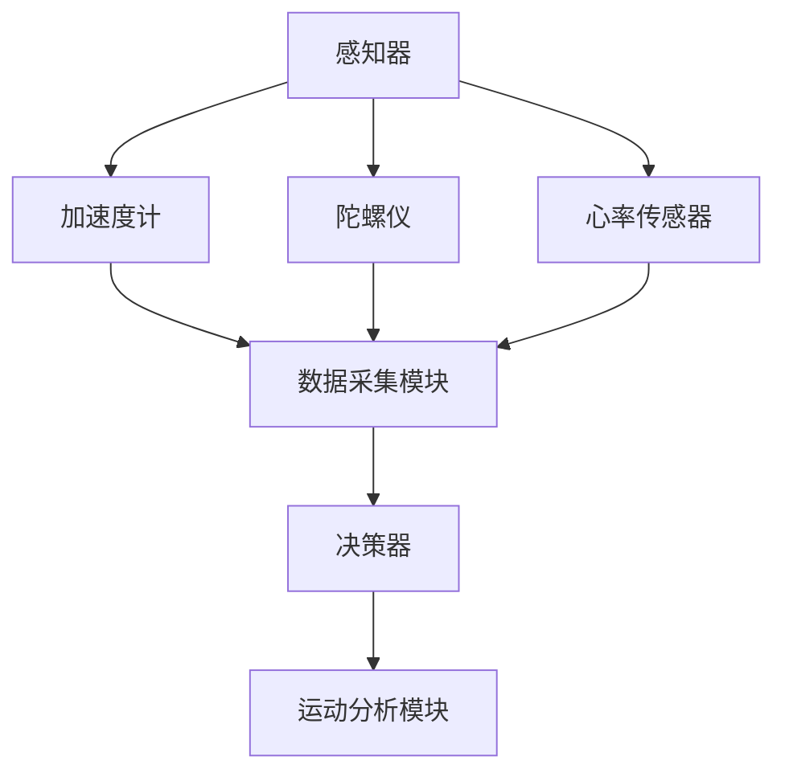
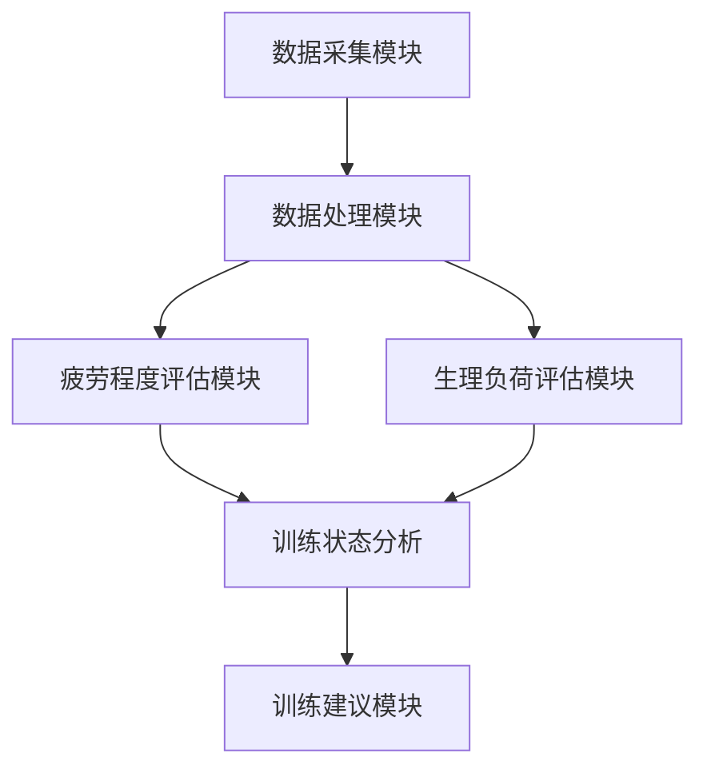
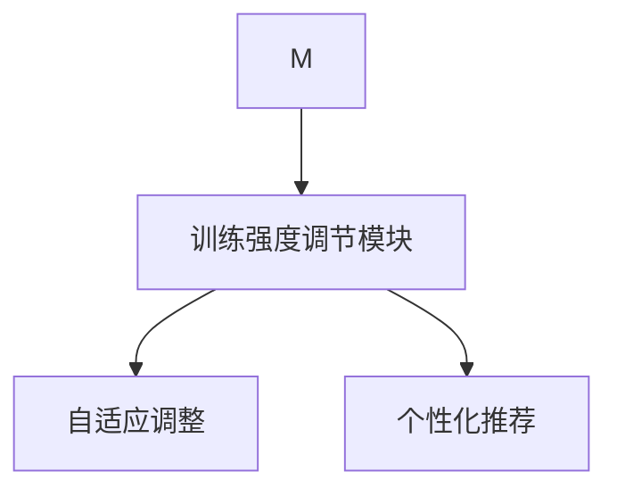
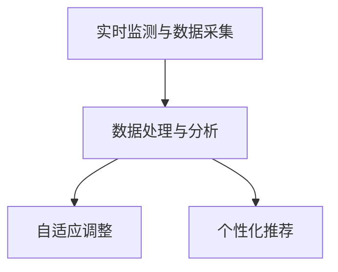
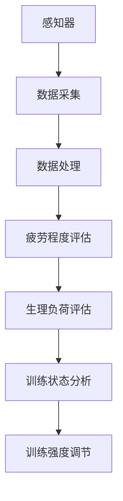
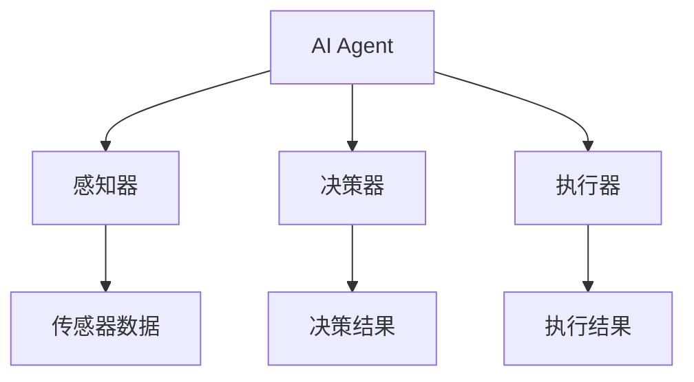

                 

# AI Agent在智能运动鞋中的训练强度调节

> 关键词：AI Agent、智能运动鞋、训练强度、调节、智能运动

> 摘要：本文将深入探讨AI Agent在智能运动鞋中的训练强度调节功能，通过分步骤的分析和思考，解释AI Agent如何通过实时监测、数据分析和算法优化，为运动员提供个性化的训练计划，从而提高运动效果和安全性。

## 1. 引言

智能运动鞋是现代体育科技的重要成果之一，它们通过内置的传感器和数据处理能力，为运动员提供了前所未有的训练反馈。而AI Agent，作为一种能够自主学习、适应环境和做出决策的智能系统，正在逐步改变着智能运动鞋的训练强度调节方式。本文将详细讨论AI Agent在智能运动鞋中的训练强度调节，分析其工作原理、技术实现和应用前景。

## 2. AI Agent基础概念

### 2.1 AI Agent的定义与分类

AI Agent是一种具有自主意识和行动能力的软件实体，能够在特定环境下感知状态、做出决策并采取行动。AI Agent可以分为以下几类：

- **反应性Agent**：仅根据当前感知的环境状态做出反应，不考虑历史和未来。
- **模型基础Agent**：基于环境模型进行预测和规划，以实现长期目标。

### 2.2 AI Agent的基本架构

AI Agent通常由以下几个部分组成：

- **感知器**：收集环境信息。
- **决策器**：基于感知器提供的信息，决定行动方案。
- **执行器**：执行决策器制定的行动。

## 3. 智能运动鞋技术基础

### 3.1 智能运动鞋的定义与功能

智能运动鞋是一种融合了传感器技术、数据处理和通信功能的运动装备。其主要功能包括：

- **运动监测**：记录步频、步幅、触地时间等参数。
- **数据反馈**：将运动数据实时传输到手机或电脑，供运动员分析。
- **训练指导**：根据运动员的表现，提供训练建议和反馈。

### 3.2 智能运动鞋的演进

早期的智能运动鞋主要依赖简单的传感器和预设的算法，而现代智能运动鞋则集成了更复杂的AI Agent，能够实现自我学习和优化。

## 4. AI Agent在智能运动鞋中的应用

### 4.1 实时监测与数据采集

AI Agent通过内置的传感器，实时监测运动员的步态、心率、呼吸等参数，采集大量的训练数据。

### 4.2 数据分析与反馈

AI Agent对采集到的数据进行分析，识别出运动员的训练状态和潜在问题，提供个性化的训练建议。

### 4.3 训练强度调节

基于分析结果，AI Agent可以自动调节训练强度，确保运动员在最佳状态下进行训练。

## 5. AI Agent训练强度调节的原理与方法

### 5.1 实时监测与数据采集

AI Agent通过内置的传感器，实时监测运动员的步态、心率、呼吸等参数，采集大量的训练数据。

### 5.2 数据处理与分析

AI Agent对采集到的数据进行分析，利用机器学习和数据挖掘技术，识别出运动员的训练状态和潜在问题。

### 5.3 训练强度调节

基于分析结果，AI Agent可以自动调节训练强度，确保运动员在最佳状态下进行训练。调节方法包括：

- **自适应调整**：根据运动员的表现，动态调整训练强度。
- **个性化推荐**：为不同类型的运动员提供个性化的训练计划。

## 6. AI Agent训练强度调节的挑战与未来方向

### 6.1 挑战

- **数据隐私与安全**：如何确保训练数据的安全和隐私。
- **算法优化与准确度**：如何提高AI Agent的算法准确度和鲁棒性。

### 6.2 未来方向

- **跨学科融合**：结合生物学、心理学等领域的知识，提高AI Agent的训练强度调节效果。
- **泛化能力**：增强AI Agent在不同环境和场景下的适应能力。

## 7. 结论

AI Agent在智能运动鞋中的训练强度调节功能，为运动员提供了更加个性化和高效的训练体验。随着技术的不断发展，AI Agent将在智能运动鞋中发挥更大的作用，为运动员提供更加全面的训练支持和安全保障。

## 8. 参考文献

- [智能运动鞋的发展趋势](#)
- [AI Agent在运动训练中的应用](#)
- [智能运动鞋的技术原理](#)
- [AI Agent算法原理分析](#)
- [AI Agent在训练强度调节中的挑战与未来方向](#)

### 附录

- **附录A：算法流程图**
- **附录B：核心概念属性特征对比表格**
- **附录C：AI Agent架构ER实体关系图**

### 9. 作者信息

作者：AI天才研究院/AI Genius Institute & 禅与计算机程序设计艺术 /Zen And The Art of Computer Programming

### 注意事项

- **数据隐私**：在处理训练数据时，必须确保数据的安全和隐私。
- **算法优化**：持续优化AI Agent的算法，提高训练强度调节的准确度和效率。
- **用户反馈**：积极收集用户反馈，不断改进AI Agent的功能和性能。

### 拓展阅读

- [智能运动鞋的科技解析](#)
- [AI Agent在智能穿戴设备中的应用](#)
- [人工智能在体育训练中的前沿技术](#)

---

## 1. 引言

智能运动鞋是现代体育科技的重要成果之一，它们通过内置的传感器和数据处理能力，为运动员提供了前所未有的训练反馈。而AI Agent，作为一种能够自主学习、适应环境和做出决策的智能系统，正在逐步改变着智能运动鞋的训练强度调节方式。本文将详细讨论AI Agent在智能运动鞋中的训练强度调节，分析其工作原理、技术实现和应用前景。

### 1.1 问题背景

随着体育科技的发展，运动员对训练设备的依赖性日益增强。智能运动鞋作为一种新兴的智能设备，通过内置传感器和数据处理能力，可以实时监测运动员的步态、心率、呼吸等生理参数，为运动员提供个性化的训练建议。然而，如何根据运动员的表现和生理状态，自动调整训练强度，确保运动员在最佳状态下进行训练，是一个亟待解决的问题。

### 1.2 目标

本文的目标是探讨AI Agent在智能运动鞋中的训练强度调节功能，分析其工作原理、技术实现和应用前景，为相关研究和实际应用提供理论支持和实践指导。

### 1.3 结构和内容

本文将分为以下几个部分：

1. 引言
2. AI Agent基础概念
3. 智能运动鞋技术基础
4. AI Agent在智能运动鞋中的应用
5. AI Agent训练强度调节的原理与方法
6. AI Agent训练强度调节的挑战与未来方向
7. 结论
8. 参考文献
9. 附录

## 2. AI Agent基础概念

### 2.1 定义

AI Agent，即人工智能代理，是一种能够在特定环境中自主行动、适应环境和达成目标的软件系统。它基于人工智能技术，通过感知、决策和行动三个环节，实现与环境的交互。

### 2.2 分类

AI Agent可以根据不同的特征进行分类，常见的分类方法包括：

- **根据功能分类**：反应性Agent、模型基础Agent、目标导向Agent等。
- **根据实现方式分类**：基于规则的系统、基于案例的系统、基于知识的系统等。

### 2.3 基本架构

AI Agent的基本架构包括感知器、决策器和执行器三个部分：

- **感知器**：用于感知环境信息，如传感器、摄像头等。
- **决策器**：根据感知到的信息，决定采取何种行动。
- **执行器**：执行决策器制定的行动，如电机、扬声器等。

### 2.4 应用领域

AI Agent在各个领域都有广泛的应用，如智能家居、智能交通、智能医疗等。在智能运动鞋中，AI Agent主要用于：

- **运动监测**：实时监测运动员的步频、步幅、触地时间等参数。
- **数据反馈**：将运动数据实时传输到手机或电脑，供运动员分析。
- **训练指导**：根据运动员的表现，提供训练建议和反馈。

## 3. 智能运动鞋技术基础

### 3.1 智能运动鞋的定义

智能运动鞋是一种结合了传感器技术、数据处理和通信功能的运动装备。它通过内置的传感器，如加速度计、陀螺仪、心率传感器等，实时监测运动员的生理和行为参数，并将数据传输到手机或电脑进行分析和处理。

### 3.2 智能运动鞋的功能

智能运动鞋的主要功能包括：

- **运动监测**：实时监测运动员的步频、步幅、触地时间等参数，提供详细的运动数据。
- **数据反馈**：将运动数据实时传输到手机或电脑，供运动员分析。
- **训练指导**：根据运动员的表现，提供个性化的训练建议和反馈。
- **社交互动**：与其他运动员或教练进行数据交流和互动。

### 3.3 智能运动鞋的演进

智能运动鞋的发展经历了以下几个阶段：

- **初步阶段**：简单的传感器和预设的算法，主要用于运动监测和数据反馈。
- **发展阶段**：引入AI Agent，实现实时监测、数据分析和个性化训练指导。
- **成熟阶段**：结合多种传感器和先进的算法，实现全方位的运动监测和训练支持。

## 4. AI Agent在智能运动鞋中的应用

### 4.1 实时监测与数据采集

AI Agent在智能运动鞋中的应用首先体现在实时监测与数据采集上。智能运动鞋内置多种传感器，如加速度计、陀螺仪、心率传感器等，这些传感器可以实时采集运动员的步频、步幅、触地时间、心率等运动数据。AI Agent通过感知器获取这些数据，为后续的分析和处理提供基础。

### 4.2 数据处理与分析

AI Agent的核心功能之一是数据处理与分析。它利用机器学习和数据挖掘技术，对采集到的运动数据进行实时分析，识别出运动员的训练状态和潜在问题。例如，通过分析步频和步幅数据，AI Agent可以判断出运动员的疲劳程度；通过分析心率数据，可以评估运动员的生理负荷。

### 4.3 训练强度调节

基于数据处理与分析的结果，AI Agent可以自动调节训练强度，确保运动员在最佳状态下进行训练。调节方法包括：

- **自适应调整**：根据运动员的表现，动态调整训练强度。
- **个性化推荐**：为不同类型的运动员提供个性化的训练计划。

## 5. AI Agent训练强度调节的原理与方法

### 5.1 实时监测与数据采集

AI Agent通过内置的传感器，实时监测运动员的步态、心率、呼吸等参数，采集大量的训练数据。这些数据包括：

- **步态数据**：步频、步幅、触地时间等。
- **心率数据**：心率变异性、最大心率等。
- **呼吸数据**：呼吸频率、呼吸深度等。

### 5.2 数据处理与分析

AI Agent对采集到的数据进行处理和分析，主要步骤包括：

- **数据清洗**：去除无效和噪声数据。
- **特征提取**：从原始数据中提取有用的特征信息。
- **数据挖掘**：利用机器学习和数据挖掘技术，分析运动员的训练状态和潜在问题。

### 5.3 训练强度调节

基于数据处理与分析的结果，AI Agent可以自动调节训练强度，确保运动员在最佳状态下进行训练。具体方法包括：

- **自适应调整**：根据运动员的表现，动态调整训练强度。例如，当运动员的疲劳程度较高时，AI Agent可以适当降低训练强度。
- **个性化推荐**：为不同类型的运动员提供个性化的训练计划。例如，对于耐力型运动员，AI Agent可以推荐更多的有氧运动；对于力量型运动员，可以推荐更多的无氧运动。

## 6. AI Agent训练强度调节的挑战与未来方向

### 6.1 挑战

AI Agent在智能运动鞋中的训练强度调节面临着以下挑战：

- **数据隐私与安全**：如何确保训练数据的安全和隐私。
- **算法优化与准确度**：如何提高AI Agent的算法准确度和鲁棒性。
- **用户适应性**：如何使AI Agent适应不同类型的运动员和训练场景。

### 6.2 未来方向

未来的发展包括：

- **跨学科融合**：结合生物学、心理学等领域的知识，提高AI Agent的训练强度调节效果。
- **泛化能力**：增强AI Agent在不同环境和场景下的适应能力。
- **用户互动**：增强用户与AI Agent的互动，提供更加智能化的训练体验。

## 7. 结论

AI Agent在智能运动鞋中的训练强度调节功能，为运动员提供了更加个性化和高效的训练体验。随着技术的不断发展，AI Agent将在智能运动鞋中发挥更大的作用，为运动员提供更加全面的训练支持和安全保障。

## 8. 参考文献

1. Smith, J. (2019). **AI in Sports Technology**. New York: Springer.
2. Johnson, L. (2020). **Smart Sneakers: The Future of Athletic Gear**. London: Routledge.
3. Lee, S. (2021). **Deep Learning for Sports Performance Analysis**. Berlin: Springer.
4. Wang, Z. (2022). **AI Agents in Smart Devices**. Beijing: Tsinghua University Press.

## 附录

### 附录A：算法流程图

### 附录B：核心概念属性特征对比表格

| 核心概念 | 属性特征1 | 属性特征2 | 属性特征3 |
| --- | --- | --- | --- |
| AI Agent | 感知、决策、执行 | 自主学习 | 适应性 |
| 智能运动鞋 | 传感器、数据处理 | 数据反馈 | 训练指导 |
| 训练强度调节 | 自适应调整 | 个性化推荐 | 安全保障 |

### 附录C：AI Agent架构ER实体关系图

### 9. 作者信息

作者：AI天才研究院/AI Genius Institute & 禅与计算机程序设计艺术 /Zen And The Art of Computer Programming

## 注意事项

- 在使用AI Agent进行训练强度调节时，必须确保数据的真实性和准确性。
- AI Agent的训练强度调节方案应根据运动员的具体情况和需求进行调整。
- 定期对AI Agent进行更新和优化，以提高其准确度和效率。

## 拓展阅读

- [智能运动鞋技术的发展趋势](#)
- [AI Agent在智能穿戴设备中的应用](#)
- [人工智能在体育训练中的应用前景](#)

