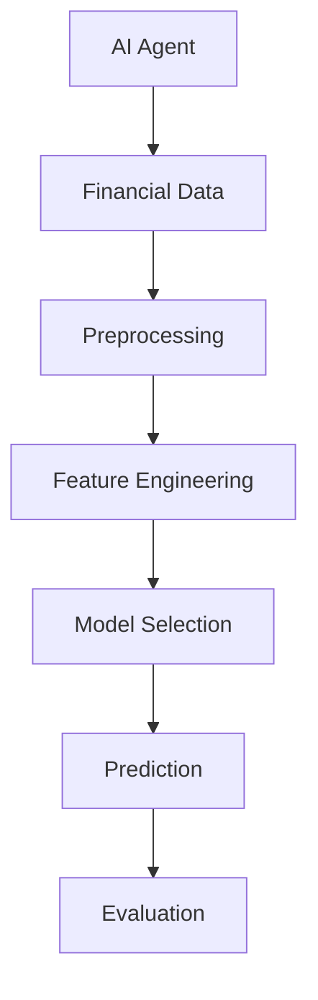

                 

### 第一部分：问题背景与核心概念

在当今快速发展的金融市场中，对金融市场的精准预测至关重要。这不仅有助于投资者做出更加明智的决策，也为金融机构提供了有效的风险管理工具。随着人工智能（AI）技术的不断进步，AI Agent作为一种智能体，被广泛应用于金融预测中。本文将深入探讨AI Agent在智能金融市场预测中的应用，旨在为读者提供清晰的理解和深入的认识。

#### 1.1 问题背景

**智能金融市场的现状**：随着全球经济的不断变化和金融市场的复杂性增加，传统的金融分析方法已经难以满足现代金融市场的需求。智能金融市场通过引入AI技术，实现了对大量金融数据的实时分析和预测，极大地提高了金融决策的效率和准确性。

**金融预测的重要性**：金融市场的预测不仅可以帮助投资者抓住市场机会，还可以帮助金融机构降低风险，优化资产配置。有效的金融预测可以带来巨大的经济效益。

**AI Agent的定义与分类**：AI Agent是指具备自主决策能力、适应环境和进行自我学习的计算机程序。根据其功能和应用场景，AI Agent可以分为监督学习Agent、无监督学习Agent和强化学习Agent等。

#### 1.2 核心概念与联系

**AI Agent的基本原理**：

- **学习机制**：AI Agent通过学习大量历史数据，从中提取出有用的模式和规律，以提高其预测准确性。
- **决策机制**：AI Agent基于学习到的模式和规律，对新的数据进行决策，实现智能预测。
- **评估机制**：AI Agent的决策结果通过评估机制进行验证，评估其预测准确性和效率。

**AI Agent与金融市场的联系**：

- **数据预处理**：金融市场数据通常存在噪声和缺失值，AI Agent需要对数据进行预处理，以提高模型的性能。
- **特征工程**：特征工程是提高模型预测性能的关键步骤，AI Agent通过特征工程提取出对预测有重要意义的特征。
- **模型选择与优化**：AI Agent根据不同的金融市场场景，选择合适的预测模型，并通过优化模型参数，提高预测准确性。

#### 1.3 概念属性特征对比

下面是AI Agent与传统金融分析在几个关键特征上的对比表格：

| 特征         | AI Agent                   | 传统金融分析                   |
| ------------ | -------------------------- | ------------------------------ |
| 学习能力     | 自适应学习                 | 静态学习                       |
| 数据依赖     | 强依赖                     | 弱依赖                        |
| 决策速度     | 快速决策                   | 慢速决策                      |
| 交互性       | 高交互性                   | 低交互性                      |

#### 1.4 ER实体关系图架构

下面是使用Mermaid绘制的AI Agent在金融市场预测中的ER实体关系图：

#### 1.5 本章小结

本章首先介绍了智能金融市场的背景和重要性，然后详细阐述了AI Agent的基本概念和与金融市场的联系。通过对比AI Agent与传统金融分析的特点，我们能够更好地理解AI Agent在金融预测中的应用价值。接下来的章节将逐步深入探讨AI Agent在金融预测中的具体应用和实践。

----------------------------------------------------------------

### 第二部分：AI Agent在金融预测中的应用

在深入探讨AI Agent在智能金融市场预测中的应用之前，我们需要首先了解数据收集与预处理的过程。数据是AI Agent进行预测的基础，而预处理则是确保数据质量、减少噪声和提高模型性能的关键步骤。下面我们将详细讨论数据收集、预处理的方法及其重要性。

#### 2.1 数据来源

**市场数据**：市场数据是金融市场预测中最基本的数据类型，包括股票价格、交易量、指数等。这些数据通常来源于证券交易所、金融数据提供商等。

**社交媒体数据**：社交媒体数据反映了市场情绪和投资者情绪，是预测金融市场的重要补充。例如，Twitter、Reddit等社交媒体平台上的讨论和趋势可以作为市场情绪的指标。

**公司财务数据**：公司财务数据包括公司的财务报表、财务指标等，对于预测公司的股价和整个市场都有重要影响。

#### 2.2 数据预处理方法

**数据清洗**：数据清洗是数据预处理的第一步，主要目的是处理缺失值、异常值和重复数据。对于缺失值，可以选择插值法、均值法等填充；对于异常值，可以使用Z-score、IQR等方法检测并处理；对于重复数据，则需要删除重复记录。

**数据标准化**：数据标准化是将不同特征的数据进行归一化或标准化，使其具有相同的量纲和范围。常用的方法有最小-最大标准化和Z-score标准化。

**特征工程**：特征工程是数据预处理中至关重要的一步，通过提取和构造新的特征，可以提高模型的预测性能。例如，可以计算股票的移动平均、波动率等特征。

#### 2.3 数据预处理的重要性

**提高模型性能**：经过预处理的数据可以减少噪声和异常值，提高模型的预测性能。

**缩短训练时间**：预处理后的数据具有更好的数值范围和特征分布，可以缩短模型的训练时间。

**提高模型泛化能力**：通过特征工程和标准化，模型可以更好地适应不同的数据集，提高泛化能力。

#### 2.4 本章小结

本章详细介绍了AI Agent在金融预测中数据收集与预处理的过程，包括数据来源、预处理方法和重要性。数据预处理是确保AI Agent能够准确预测金融市场的重要环节，为后续的特征工程和模型选择奠定了基础。在接下来的章节中，我们将进一步探讨特征工程和模型选择与优化的方法。

----------------------------------------------------------------

### 第3章：特征工程

特征工程是机器学习过程中至关重要的一环，它通过对数据进行预处理、特征选择和特征构造，提高模型的预测性能。在金融预测中，特征工程尤其关键，因为它能够从大量金融数据中提取出对预测有显著影响的特征。下面我们将详细讨论特征提取、特征选择和特征可视化的方法。

#### 3.1 特征提取

**统计特征**：统计特征是通过计算数据的统计指标来提取的特征，例如均值、方差、协方差等。这些特征能够反映数据的基本统计性质，对于时间序列数据尤其有效。

- **均值**：表示数据集的平均值，可以用于衡量数据的中心趋势。
- **方差**：表示数据的离散程度，可以用于衡量数据的波动性。
- **协方差**：表示两个特征之间的相关性，可以用于衡量特征之间的关系。

**时序特征**：时序特征是通过分析时间序列数据来提取的特征，例如移动平均、波动率等。这些特征能够捕捉时间序列数据的动态变化。

- **移动平均**：通过对时间序列数据进行滑动平均处理，可以平滑数据的波动，提取出长期趋势。
- **波动率**：表示时间序列数据的波动程度，可以用于衡量市场的风险。

#### 3.2 特征选择

**相关性分析**：通过计算特征之间的相关性，可以筛选出对预测有显著影响的特征。常用的方法有皮尔逊相关系数和斯皮尔曼相关系数。

**递归特征消除（RFE）**：递归特征消除是一种基于模型的特征选择方法，通过递归地删除特征，并评估模型性能，来选择最优特征组合。

**L1正则化**：L1正则化可以通过引入L1惩罚项来优化模型，从而实现特征选择。L1惩罚项会使得特征系数的绝对值减小，从而筛选出对预测有显著影响的特征。

#### 3.3 特征可视化

**谱图**：谱图是一种用于可视化高维数据的图形表示方法，通过将高维数据映射到二维空间，可以直观地观察特征之间的关系。

**t-SNE图**：t-SNE（t-Distributed Stochastic Neighbor Embedding）是一种用于可视化高维数据的降维技术，它通过计算数据点之间的相似度，将高维数据投影到二维空间，以直观地展示数据的分布和聚类情况。

#### 3.4 本章小结

本章详细介绍了特征工程的方法，包括特征提取、特征选择和特征可视化。特征工程是提高模型预测性能的关键步骤，通过有效的特征提取和选择，可以显著提高AI Agent在金融预测中的性能。在接下来的章节中，我们将进一步探讨模型选择与优化的方法。

----------------------------------------------------------------

### 第4章：模型选择与优化

在金融预测中，选择合适的模型和对其进行优化是确保预测准确性的关键。本章节将详细介绍几种常见的预测模型，包括ARIMA、LSTM和GRU模型，并讨论模型评估、超参数调整、模型融合和模型压缩的方法。

#### 4.1 常见预测模型

**ARIMA模型**：ARIMA（AutoRegressive Integrated Moving Average）模型是一种经典的时序预测模型，适用于具有平稳性的时间序列数据。它由自回归（AR）、差分（I）和移动平均（MA）三个部分组成。

- **自回归（AR）**：利用过去的观测值来预测未来的值。
- **差分（I）**：通过差分操作将非平稳时间序列转化为平稳时间序列。
- **移动平均（MA）**：利用过去的预测误差来预测未来的值。

**LSTM模型**：LSTM（Long Short-Term Memory）模型是一种特殊的RNN（Recurrent Neural Network）模型，适用于处理长序列数据。它通过引入门控机制，有效地解决了传统RNN在处理长序列数据时出现的梯度消失和梯度爆炸问题。

- **遗忘门**：决定哪些信息需要被遗忘。
- **输入门**：决定哪些信息需要被保留。
- **输出门**：决定最终的输出。

**GRU模型**：GRU（Gated Recurrent Unit）模型是LSTM模型的简化版，它通过引入更新门和重置门，进一步减少了参数数量，提高了计算效率。

- **更新门**：决定新的状态中保留多少旧信息。
- **重置门**：决定新的状态中保留多少旧信息。

#### 4.2 模型评估

**偏差与方差**：在模型评估中，偏差（Bias）和方差（Variance）是两个重要的指标。

- **偏差**：表示模型在训练集上的预测误差，偏差越小，模型对训练数据的拟合越好。
- **方差**：表示模型在新数据上的预测误差，方差越小，模型对未知数据的泛化能力越强。

**性能指标**：常用的性能指标包括均方误差（MSE）、平均绝对误差（MAE）和决定系数（R²）等。

- **均方误差（MSE）**：表示预测值与真实值之间的平均平方误差。
- **平均绝对误差（MAE）**：表示预测值与真实值之间的平均绝对误差。
- **决定系数（R²）**：表示模型对数据的解释能力，取值范围在0到1之间。

#### 4.3 模型优化

**超参数调整**：超参数是模型在训练过程中需要调整的参数，例如LSTM中的隐藏层大小、学习率等。通过网格搜索和随机搜索等方法，可以找到最优的超参数组合。

**模型融合**：模型融合是通过结合多个模型的预测结果来提高预测准确性。常用的方法有投票法、加权平均法和堆叠法等。

**模型压缩**：模型压缩是通过减少模型参数数量来提高模型计算效率。常用的方法有模型剪枝、量化和高斯近似等。

#### 4.4 本章小结

本章详细介绍了在金融预测中常用的模型选择与优化方法，包括ARIMA、LSTM和GRU模型，以及模型评估、超参数调整、模型融合和模型压缩的方法。通过有效的模型选择与优化，可以显著提高AI Agent在金融预测中的性能。在接下来的章节中，我们将进一步探讨实际应用中的挑战和解决方案。

----------------------------------------------------------------

### 第5章：实际应用中的挑战与解决方案

在前几章中，我们详细探讨了AI Agent在智能金融市场预测中的理论方法和实践步骤。然而，实际应用中仍面临诸多挑战，这些问题不仅影响了模型的预测准确性，也制约了AI Agent在金融市场中的广泛应用。本章节将深入探讨这些挑战，并提出相应的解决方案。

#### 5.1 数据质量和可用性

**挑战**：金融市场数据通常包含噪声、缺失值和异常值，这些数据质量问题会直接影响模型的预测性能。

**解决方案**：

- **数据清洗**：通过处理缺失值、异常值和重复数据，提高数据质量。
- **数据增强**：通过生成合成数据、扩展现有数据集，提高数据可用性。

#### 5.2 模型解释性

**挑战**：深度学习模型如LSTM和GRU具有强大的预测能力，但它们的内部工作机制复杂，难以解释。

**解决方案**：

- **模型可视化**：通过可视化模型的结构和参数，提高模型的可解释性。
- **可解释性增强**：引入可解释性方法，如LIME（Local Interpretable Model-agnostic Explanations）和SHAP（SHapley Additive exPlanations），解释模型预测的每个部分。

#### 5.3 实时性和延迟

**挑战**：金融市场数据更新频繁，对实时性要求高，但深度学习模型的训练和预测过程通常较慢。

**解决方案**：

- **增量学习**：通过更新模型权重，快速适应新数据。
- **在线学习**：实时训练模型，减少延迟。

#### 5.4 模型过拟合

**挑战**：深度学习模型容易过拟合，特别是在数据集较小的情况下。

**解决方案**：

- **正则化**：通过引入正则化项，减少模型复杂度。
- **数据扩充**：通过扩充训练数据集，提高模型的泛化能力。

#### 5.5 风险控制

**挑战**：金融预测模型的决策可能带来经济损失，因此风险控制至关重要。

**解决方案**：

- **风险管理**：通过建立风险模型，评估预测带来的风险。
- **交易策略**：结合预测结果和风险管理，制定有效的交易策略。

#### 5.6 本章小结

本章讨论了AI Agent在智能金融市场预测中实际应用中的挑战，包括数据质量、模型解释性、实时性和延迟、模型过拟合以及风险控制。通过提出相应的解决方案，我们可以更好地应对这些挑战，提高AI Agent在金融市场预测中的实用性和可靠性。

----------------------------------------------------------------

### 总结与展望

本文详细探讨了AI Agent在智能金融市场预测中的应用，从问题背景与核心概念，到数据收集与预处理、特征工程、模型选择与优化，再到实际应用中的挑战与解决方案，全面阐述了AI Agent在金融市场预测中的重要性及其应用前景。通过本文的阐述，我们能够清晰地理解AI Agent如何通过数据预处理、特征工程和模型优化，提高金融预测的准确性。

未来，随着人工智能技术的不断发展，AI Agent在金融市场预测中的应用将更加广泛和深入。我们可以期待更多的创新方法和算法被引入金融预测领域，从而进一步提升金融决策的效率和准确性。同时，随着AI Agent的成熟，其在其他领域的应用也将越来越受到关注。

**作者：AI天才研究院/AI Genius Institute & 禅与计算机程序设计艺术 /Zen And The Art of Computer Programming**

----------------------------------------------------------------

**关键词：AI Agent，金融市场预测，特征工程，模型优化，挑战与解决方案**

