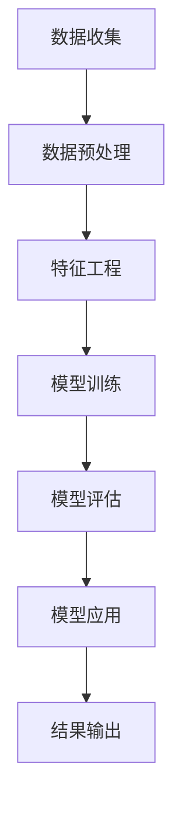

                 

### 文章标题

《AI Agent在智能金融风险评估中的应用》是一篇深入探讨人工智能代理（AI Agent）如何助力金融风险评估领域的专业技术文章。本文将围绕这一主题，逐步展开讨论，旨在为读者提供一个系统、全面且易于理解的框架，以了解AI Agent在金融风险评估中的实际应用及其潜在价值。本文将分为以下几个部分：

1. **背景介绍**：我们将介绍金融风险评估的重要性以及智能金融的兴起，并探讨AI Agent在这一领域中的潜在应用。
2. **核心概念与联系**：我们将深入讨论AI Agent的定义及其在金融风险评估中的角色，同时提供智能金融风险评估的基本原理。
3. **算法原理讲解**：我们将详细解释AI Agent在金融风险评估中的算法原理，包括数据预处理、特征工程和机器学习算法。
4. **系统分析与架构设计方案**：我们将展示一个典型的智能金融风险评估系统的架构设计，包括系统功能、架构设计和接口设计。
5. **项目实战**：我们将通过一个实际项目展示如何搭建和运行一个AI Agent在金融风险评估中的系统。
6. **最佳实践 tips**：我们将分享一些最佳实践技巧，帮助读者在实际应用中取得更好的效果。
7. **小结与拓展阅读**：我们将总结本文的主要观点，并推荐一些拓展阅读资源，以供读者深入学习和研究。

通过这篇文章，我们希望读者能够对AI Agent在金融风险评估中的应用有一个全面、深入的理解，并能够将这些知识应用到实际项目中，提升金融风险评估的效率和准确性。

### 关键词

- AI Agent
- 智能金融
- 金融风险评估
- 机器学习算法
- 数据预处理
- 特征工程
- 系统架构设计
- 实际项目应用

### 摘要

本文深入探讨了AI Agent在智能金融风险评估中的应用。首先，我们介绍了金融风险评估的重要性以及智能金融的兴起，然后详细讨论了AI Agent的定义、特征及其在金融风险评估中的角色。接着，我们讲解了AI Agent在金融风险评估中的算法原理，包括数据预处理、特征工程和机器学习算法，并通过实际项目和Mermaid图详细阐述。最后，我们分析了智能金融风险评估系统的架构设计，并分享了一些最佳实践技巧。本文旨在为读者提供一个系统、全面且易于理解的框架，以了解AI Agent在金融风险评估中的实际应用及其潜在价值。

### 第一部分: 引言

#### 第1章: 问题背景

在当今金融领域，风险评估扮演着至关重要的角色。它不仅关乎金融机构的稳健运行，更涉及到投资者和市场的安全与稳定。传统的风险评估方法往往依赖于人工经验和历史数据，存在主观性强、效率低下等缺点。随着人工智能技术的迅速发展，尤其是机器学习和深度学习技术的突破，金融风险评估迎来了新的机遇。

智能金融是指利用人工智能技术，如机器学习、自然语言处理、数据挖掘等，对金融市场进行全方位的监控、分析和预测。它不仅能够提高数据分析的效率和准确性，还能发现隐藏在大量数据中的复杂模式和趋势。智能金融风险评估就是将AI技术应用于金融风险评估过程，以实现更精准、更高效的评估。

AI Agent是人工智能领域的一个重要概念，指的是一种能够自主学习、自主决策的智能实体。AI Agent具有自主性、智能性和适应性等特点，能够根据环境变化自主调整行为策略，实现特定任务的优化。在金融风险评估中，AI Agent可以通过学习和分析大量历史数据，识别潜在的金融风险，提供实时的风险预警。

本章将首先介绍金融风险评估的重要性，包括其基本概念、历史发展和当前挑战。接着，我们将探讨智能金融的发展现状，包括AI技术在金融领域的应用趋势和已取得的成果。最后，我们将重点讨论AI Agent在金融风险评估中的应用场景，分析其如何通过智能分析、实时预警等功能，提升风险评估的效率和准确性。

#### 1.1.1 金融风险评估的重要性

金融风险评估是金融管理中不可或缺的一环，其核心目的是识别、评估和监控金融投资活动中的潜在风险，以便采取有效的风险管理措施，确保金融系统的稳健运行和投资者的利益。具体来说，金融风险评估的重要性体现在以下几个方面：

首先，金融风险评估有助于降低金融风险。通过系统的风险评估，金融机构可以及时发现潜在的金融风险，并采取相应的措施进行防范和化解。例如，在信贷业务中，通过对借款人的信用评估，金融机构可以识别出高风险借款人，从而避免信贷损失。

其次，金融风险评估能够提高金融决策的准确性。通过全面、深入的风险评估，金融机构可以更准确地预测市场走势，制定出更合理的投资策略。这对于投资决策者来说，具有重要的参考价值。

此外，金融风险评估有助于增强金融市场的透明度和信任度。通过公开透明地评估风险，金融机构能够向投资者提供真实、可靠的风险信息，增强投资者对市场的信心，从而促进金融市场的健康发展。

最后，金融风险评估还能够提高金融监管的有效性。金融监管机构通过评估金融机构的风险状况，可以及时发现和纠正潜在的风险隐患，确保金融系统的安全与稳定。

总之，金融风险评估在金融管理中具有至关重要的地位。它不仅有助于降低金融风险、提高金融决策的准确性，还能增强金融市场的透明度和信任度，为金融系统的稳健运行提供有力保障。

#### 1.1.2 智能金融的发展现状

智能金融，也被称为金融科技（FinTech），是金融行业与人工智能技术相结合的产物。随着大数据、云计算、区块链和机器学习等新兴技术的迅猛发展，智能金融正逐步改变传统金融服务的面貌。以下是智能金融的发展现状及其在金融领域的应用趋势：

首先，大数据技术在智能金融中得到了广泛应用。金融机构通过收集和分析海量数据，可以更精准地了解市场动态和客户需求，从而优化业务流程和提升服务质量。例如，银行通过大数据分析，可以实现精准营销，为客户提供个性化的金融产品和服务。

其次，云计算技术在智能金融中发挥了重要作用。云计算提供了弹性、高效、安全的计算和存储资源，使得金融机构能够快速部署和扩展业务系统，提高运营效率。例如，金融机构可以通过云平台实现实时风险评估，快速响应市场变化。

此外，区块链技术也被广泛应用于智能金融领域。区块链技术提供了一种去中心化的账本系统，可以确保金融交易的透明性和安全性。例如，跨境支付和供应链金融等领域已经成功应用了区块链技术，提高了交易效率和安全性。

最后，机器学习技术在智能金融中的应用也越来越广泛。机器学习算法可以处理和分析大量的数据，从中挖掘出隐藏的模式和趋势，为金融机构提供精准的风险评估和投资决策支持。例如，金融机构通过机器学习模型，可以预测市场走势，识别潜在的欺诈行为，提高业务的安全性和稳定性。

总体来看，智能金融的发展现状表明，人工智能技术正在深刻改变传统金融行业。未来，随着人工智能技术的不断进步，智能金融将在更多领域得到应用，进一步提升金融服务的质量和效率。

#### 1.1.3 AI Agent在金融风险评估中的应用

AI Agent在金融风险评估中的应用前景广阔，其独特的自主性、智能性和适应性使其成为提升风险评估效率和准确性的理想工具。以下是AI Agent在金融风险评估中的几个主要应用场景：

首先，AI Agent可以通过实时数据分析和预测，提供动态的风险预警。传统的风险评估方法通常依赖于历史数据，而AI Agent能够实时处理和分析市场数据，如股票价格、交易量等，通过机器学习算法预测潜在的市场风险，为金融机构提供及时的预警信息，帮助决策者迅速采取应对措施。

其次，AI Agent在信用评估中的应用也取得了显著成果。通过学习大量借款人的历史数据和交易行为，AI Agent可以建立复杂的信用评估模型，识别高风险借款人，提高信用评估的准确性和可靠性。例如，银行可以使用AI Agent对贷款申请者进行信用评分，从而降低信贷风险。

此外，AI Agent在反欺诈领域也有广泛应用。AI Agent可以通过分析交易数据，识别异常交易行为，如欺诈交易、洗钱活动等。通过实时监控和预警，AI Agent能够迅速识别潜在风险，防止金融欺诈的发生。

最后，AI Agent还可以用于市场分析和投资决策。通过分析市场数据、宏观经济指标和公司财务报表，AI Agent可以为投资者提供个性化的投资建议，优化投资组合，提高投资回报。

总的来说，AI Agent在金融风险评估中的应用不仅提升了评估的效率和准确性，还拓展了风险评估的范围和深度，为金融机构提供了强大的风险控制工具。

### 第二部分：核心概念与联系

在深入探讨AI Agent在金融风险评估中的应用之前，我们需要先理解一些核心概念，并探讨这些概念之间的联系。本节将介绍AI Agent的定义、智能金融风险评估的基本原理，以及AI Agent在金融风险评估中的应用场景。

#### 2.1 AI Agent的定义与特点

AI Agent，即人工智能代理，是一种能够自主学习、自主决策的智能实体。它具有以下几个主要特点：

首先，自主性是AI Agent的核心特征。AI Agent能够在没有人为干预的情况下，根据环境和任务目标自主行动。这意味着它可以在不断变化的环境中，自主调整其行为策略，以实现任务的最优化。

其次，智能性是AI Agent的核心竞争力。AI Agent通过机器学习算法和深度学习技术，能够处理和分析大量数据，从中学习规律和模式，从而做出智能决策。这使得AI Agent能够在复杂的环境中，进行高效的任务执行。

最后，适应性是AI Agent的重要特点。AI Agent能够根据环境和任务的变化，不断调整其行为策略，以适应新的情境。这种适应性使得AI Agent能够在长期运行中，保持其高效性和准确性。

#### 2.2 智能金融风险评估的基本原理

智能金融风险评估是指利用人工智能技术，对金融风险进行识别、评估和监控的过程。其基本原理包括以下几个方面：

首先，数据预处理是智能金融风险评估的基础。通过对原始数据进行清洗、归一化和特征提取，可以将数据转换为适合机器学习算法处理的形式。数据预处理的质量直接影响到后续风险评估的准确性和效率。

其次，特征工程是智能金融风险评估的关键步骤。特征工程旨在从原始数据中提取出对风险评估有重要意义的特征，并利用这些特征训练机器学习模型。合理的特征工程可以提高模型的性能，从而提高风险评估的准确性。

然后，机器学习算法是智能金融风险评估的核心。常用的机器学习算法包括决策树、支持向量机、神经网络等。这些算法通过学习历史数据中的风险模式，可以预测未来的风险水平，提供实时的风险评估。

最后，模型评估与优化是智能金融风险评估的重要环节。通过对模型的评估，可以确定其性能是否符合预期。如果性能不佳，可以通过调整模型参数、添加新特征或更换算法进行优化。

#### 2.3 AI Agent在智能金融风险评估中的应用场景

AI Agent在智能金融风险评估中具有广泛的应用场景。以下是几个典型的应用场景：

首先，实时风险评估。AI Agent可以通过实时数据流分析，对市场动态进行实时监控，预测潜在的风险事件，并提供实时的风险评估报告。这使得金融机构能够在风险发生前采取预防措施，降低损失。

其次，信用评估。AI Agent可以通过分析借款人的历史数据和交易行为，建立信用评估模型，识别高风险借款人。这有助于金融机构降低信贷风险，提高信贷业务的安全性。

此外，反欺诈检测。AI Agent可以通过监控交易行为，识别异常交易模式，如欺诈交易或洗钱活动。通过实时预警，AI Agent能够迅速响应潜在风险，防止欺诈行为的发生。

最后，投资决策支持。AI Agent可以通过分析市场数据、宏观经济指标和公司财务报表，为投资者提供个性化的投资建议，优化投资组合，提高投资回报。

总的来说，AI Agent在金融风险评估中的应用，不仅提升了风险评估的效率和准确性，还为金融机构提供了强大的风险控制工具。随着人工智能技术的不断进步，AI Agent在金融风险评估中的应用前景将更加广阔。

### 第三部分：算法原理讲解

在了解了AI Agent的定义和其在智能金融风险评估中的应用场景后，接下来我们将详细讲解AI Agent在金融风险评估中的算法原理。这部分内容将涵盖数据预处理、特征工程和机器学习算法，并通过具体实例进行说明。

#### 3.1 智能金融风险评估算法概述

智能金融风险评估算法的核心任务是通过对历史数据和实时数据的处理与分析，识别出潜在的金融风险，为金融机构提供决策支持。以下是智能金融风险评估算法的三个主要组成部分：

1. **数据预处理**：数据预处理是算法的基础步骤，旨在将原始数据转换为适合机器学习算法处理的形式。数据预处理包括数据清洗、归一化和特征提取等过程。

2. **特征工程**：特征工程是提升模型性能的关键步骤，通过对原始数据进行处理和变换，提取出对风险评估有重要意义的特征。合理的特征工程可以显著提高模型的预测准确性和效率。

3. **机器学习算法**：机器学习算法是智能金融风险评估的核心，常用的算法包括决策树、支持向量机、神经网络等。这些算法通过学习历史数据中的风险模式，可以预测未来的风险水平。

#### 3.1.1 数据预处理

数据预处理是智能金融风险评估算法中的基础步骤，主要包括以下几个关键过程：

1. **数据清洗**：数据清洗的目的是去除数据中的噪声和异常值。例如，删除重复记录、处理缺失值、填补空白等。数据清洗有助于提高数据质量，确保后续分析的准确性。

2. **归一化**：归一化是指将不同特征的数据转换到同一尺度上，以便算法能够处理。常用的归一化方法包括最小-最大归一化和标准归一化。归一化有助于防止某些特征对模型影响过大，提高模型的鲁棒性。

3. **特征提取**：特征提取是指从原始数据中提取出对风险评估有重要意义的特征。例如，从交易数据中提取交易金额、交易频率、交易时间等特征。特征提取有助于提高模型的预测能力。

#### 3.1.2 特征工程

特征工程是智能金融风险评估算法中的关键步骤，合理的特征工程可以显著提高模型的性能。以下是几个常用的特征工程方法：

1. **特征选择**：特征选择是指从原始特征中挑选出对风险评估有重要意义的特征。常用的特征选择方法包括信息增益、卡方检验和基于模型的特征选择等。特征选择有助于减少模型的复杂度，提高模型的预测准确性。

2. **特征变换**：特征变换是指对原始特征进行转换，以提升其对模型的重要性。常用的特征变换方法包括逻辑回归、多项式特征扩展等。特征变换有助于提升模型的预测能力。

3. **特征组合**：特征组合是指将多个原始特征组合成新的特征，以提升模型的表现。常用的特征组合方法包括主成分分析（PCA）和特征交互等。特征组合有助于发现新的特征关系，提高模型的预测能力。

#### 3.1.3 机器学习算法

机器学习算法是智能金融风险评估算法的核心，通过学习历史数据中的风险模式，可以预测未来的风险水平。以下是几个常用的机器学习算法：

1. **决策树**：决策树是一种树形结构的预测模型，通过一系列的决策规则，将数据集划分为不同的区域，并预测每个区域的风险水平。决策树具有直观易懂、易于解释等优点。

2. **支持向量机（SVM）**：支持向量机是一种基于边界优化的预测模型，通过找到最佳边界，将不同类别的数据点分开。SVM具有高准确性和良好的泛化能力。

3. **神经网络**：神经网络是一种模拟人脑神经元连接结构的预测模型，通过学习输入和输出之间的映射关系，可以预测未来的风险水平。神经网络具有强大的非线性拟合能力和自适应学习能力。

通过以上三个步骤，即数据预处理、特征工程和机器学习算法，AI Agent可以构建出一个高效的智能金融风险评估模型。接下来，我们将通过具体的Mermaid流程图和Python源代码，进一步阐述AI Agent的算法流程和实现。

#### 3.2 AI Agent算法流程与实现

为了更清晰地展示AI Agent在金融风险评估中的算法流程与实现，我们将使用Mermaid流程图和Python源代码进行详细讲解。以下是AI Agent算法流程的Mermaid流程图：



1. **数据收集**：AI Agent首先从金融系统中收集相关的数据，包括历史交易数据、客户信息、市场动态等。这些数据是进行风险评估的基础。

2. **数据预处理**：数据预处理阶段包括数据清洗、归一化和特征提取。数据清洗去除噪声和异常值，归一化将不同尺度的数据进行标准化处理，特征提取提取出对风险评估有重要意义的特征。

3. **特征工程**：在特征工程阶段，AI Agent对提取出的特征进行进一步的筛选和变换，以提高模型的预测能力。常用的方法包括特征选择、特征变换和特征组合。

4. **模型训练**：模型训练阶段，AI Agent使用机器学习算法对预处理后的特征进行训练。常用的算法包括决策树、支持向量机和神经网络。AI Agent通过迭代优化，找到最佳参数组合。

5. **模型评估**：模型评估阶段，AI Agent使用测试数据集对训练好的模型进行评估，包括准确率、召回率、F1值等指标。通过评估，可以确定模型的性能是否符合预期。

6. **模型应用**：模型应用阶段，AI Agent将训练好的模型应用到实际的金融风险评估中。通过实时数据输入，模型可以预测当前的风险水平，提供实时的风险评估报告。

7. **结果输出**：最后，AI Agent将风险评估结果输出给金融系统，包括风险预警、信用评分、投资建议等。这些结果帮助金融机构采取相应的风险管理措施，降低潜在的风险。

以下是一个简单的Python源代码示例，展示如何使用Scikit-learn库实现AI Agent的算法流程：

```python
# 导入相关库
import numpy as np
import pandas as pd
from sklearn.model_selection import train_test_split
from sklearn.preprocessing import StandardScaler
from sklearn.ensemble import RandomForestClassifier
from sklearn.metrics import accuracy_score, recall_score, f1_score

# 数据收集
data = pd.read_csv('financial_data.csv')

# 数据预处理
data = data.dropna()  # 去除缺失值
data = StandardScaler().fit_transform(data)  # 归一化

# 特征工程
X = data[:, :-1]  # 特征
y = data[:, -1]  # 目标变量

# 模型训练
X_train, X_test, y_train, y_test = train_test_split(X, y, test_size=0.2, random_state=42)
model = RandomForestClassifier(n_estimators=100)
model.fit(X_train, y_train)

# 模型评估
y_pred = model.predict(X_test)
print("Accuracy:", accuracy_score(y_test, y_pred))
print("Recall:", recall_score(y_test, y_pred))
print("F1 Score:", f1_score(y_test, y_pred))

# 模型应用
new_data = pd.read_csv('new_financial_data.csv')
new_data = StandardScaler().fit_transform(new_data)
new_predictions = model.predict(new_data)
print("New Risk Assessments:", new_predictions)
```

通过以上流程和代码示例，我们可以看到AI Agent在金融风险评估中的应用是如何实现的。通过数据预处理、特征工程和机器学习算法，AI Agent能够高效地识别和预测金融风险，为金融机构提供有力的风险控制工具。

### 第四部分：系统分析与架构设计

#### 第4章：系统功能设计

系统功能设计是智能金融风险评估系统的核心部分，它决定了系统在处理金融数据和分析风险时的能力。本节将介绍系统功能设计，包括系统需求分析、系统功能模块划分以及领域模型设计。

#### 4.1 系统需求分析

系统需求分析是系统设计的第一步，它明确了系统需要实现的功能和性能要求。以下是智能金融风险评估系统的需求分析：

1. **实时数据处理**：系统能够实时接收和处理来自金融市场的数据，包括股票价格、交易量、市场指数等，以便进行实时风险评估。

2. **历史数据分析**：系统需要能够存储和分析大量的历史数据，以提取出风险模式和行为特征。

3. **风险评估**：系统能够根据实时数据和历史数据，使用AI Agent进行风险评估，识别潜在的风险事件，并提供风险预警。

4. **信用评分**：系统应具备对借款人进行信用评分的能力，识别高风险借款人，为金融机构的信贷业务提供支持。

5. **反欺诈检测**：系统能够监控交易行为，识别异常交易模式，防止金融欺诈的发生。

6. **投资建议**：系统可以根据市场数据和分析结果，为投资者提供个性化的投资建议，优化投资组合。

7. **用户界面**：系统应提供一个直观易用的用户界面，方便用户查看风险评估结果、信用评分和投资建议。

8. **高可用性和安全性**：系统需要具备高可用性和安全性，确保在面临大规模数据流和高并发请求时，系统能稳定运行，保护用户数据的安全。

#### 4.2 系统功能模块划分

根据系统需求分析，智能金融风险评估系统可以分为以下主要功能模块：

1. **数据采集模块**：负责实时收集金融市场数据，包括股票价格、交易量、市场指数等，并将数据存储到系统中。

2. **数据处理模块**：负责对采集到的数据进行清洗、归一化和特征提取，为后续的风险评估和信用评分提供高质量的数据输入。

3. **风险评估模块**：包括AI Agent模型训练、风险评估和风险预警功能，通过机器学习算法对实时和历史数据进行处理，识别潜在风险并发出预警。

4. **信用评分模块**：利用AI Agent对借款人进行信用评分，识别高风险借款人，为金融机构提供信贷决策支持。

5. **反欺诈检测模块**：通过监控交易行为，识别异常交易模式，防止金融欺诈的发生。

6. **投资建议模块**：根据市场数据和分析结果，为投资者提供个性化的投资建议，优化投资组合。

7. **用户界面模块**：提供一个直观易用的用户界面，展示风险评估结果、信用评分和投资建议，方便用户查看和使用。

8. **系统维护模块**：包括系统配置、监控和日志记录等功能，确保系统的稳定运行和高效管理。

#### 4.3 领域模型设计

领域模型设计是系统功能设计的重要环节，它通过实体关系图（ER图）和类图（UML类图）来描述系统中的实体及其关系。以下是智能金融风险评估系统的领域模型设计：

##### 实体关系图（ER图）

在ER图中，我们定义了系统中的主要实体和它们之间的关系。以下是智能金融风险评估系统的ER图：

```mermaid
erDiagram
    Customer ||--|{ Transaction : has}
    Customer ||--|{ CreditRating : has}
    Transaction ||--|{ RiskEvent : triggers}
    RiskEvent ||--|{ Warning : issues}
```

- **Customer（客户）**：代表借款人或投资者，与Transaction和CreditRating实体有关联。
- **Transaction（交易）**：代表金融市场的交易数据，与RiskEvent实体有关联。
- **CreditRating（信用评分）**：记录客户的信用评分信息，与Customer实体有关联。
- **RiskEvent（风险事件）**：记录识别出的风险事件，与Transaction和Warning实体有关联。
- **Warning（预警）**：记录风险事件的预警信息，与RiskEvent实体有关联。

##### 类图（UML类图）

在UML类图中，我们进一步描述了系统中各个实体的属性和方法。以下是智能金融风险评估系统的类图：

```mermaid
classDiagram
    Customer <|-- Transaction
    Customer <|-- CreditRating
    Transaction <|-- RiskEvent
    RiskEvent <|-- Warning

    Customer {
        -ID: int
        -Name: string
        -Age: int
        +collectTransactions(): void
        +getCreditRating(): CreditRating
    }

    Transaction {
        -ID: int
        -Date: datetime
        -Amount: float
        +createRiskEvent(): RiskEvent
    }

    CreditRating {
        -ID: int
        -Score: float
        +updateScore(score: float): void
    }

    RiskEvent {
        -ID: int
        -Description: string
        -Date: datetime
        +issueWarning(): Warning
    }

    Warning {
        -ID: int
        -Message: string
        +getContent(): string
    }
```

- **Customer（客户）**：具有ID、Name和Age属性，提供收集交易和获取信用评分的方法。
- **Transaction（交易）**：具有ID、Date和Amount属性，提供创建风险事件的方法。
- **CreditRating（信用评分）**：具有ID和Score属性，提供更新评分的方法。
- **RiskEvent（风险事件）**：具有ID、Description和Date属性，提供发出预警的方法。
- **Warning（预警）**：具有ID和Message属性，提供获取内容的方法。

通过以上系统功能设计、模块划分和领域模型设计，我们为智能金融风险评估系统构建了一个清晰、全面的架构，为系统的实现和运维提供了坚实的基础。

### 第五部分：系统架构设计

系统架构设计是智能金融风险评估系统的关键环节，它决定了系统的性能、可扩展性和可靠性。本节将详细介绍系统架构设计，包括系统架构概述、数据流与处理流程、系统接口设计和系统交互。

#### 5.1 系统架构概述

智能金融风险评估系统的架构设计采用分层架构，包括数据层、应用层和表现层。以下是对各层的详细介绍：

1. **数据层**：数据层负责数据的管理和存储，包括实时数据和历史数据的收集、存储和检索。数据层使用数据库和缓存系统，确保数据的高效存取。

2. **应用层**：应用层是系统的核心，负责数据的处理和风险评估。应用层包括数据预处理、特征工程、机器学习模型训练和风险评估等模块。应用层使用微服务架构，确保系统的灵活性和可扩展性。

3. **表现层**：表现层负责将风险评估结果和信用评分等信息展示给用户。表现层使用前端框架，提供直观易用的用户界面。

#### 5.2 数据流与处理流程

数据流与处理流程是智能金融风险评估系统的工作机制，以下是一个简化的数据流和处理流程：

1. **数据采集**：系统从金融市场数据源（如交易所、金融API等）收集实时数据，并将数据存储到数据层。

2. **数据预处理**：系统对实时数据进行清洗、归一化和特征提取，将数据转换为适合机器学习算法处理的形式。

3. **特征工程**：系统对预处理后的数据进行进一步的特征筛选和变换，提取出对风险评估有重要意义的特征。

4. **模型训练**：系统使用机器学习算法（如决策树、支持向量机和神经网络）对特征进行训练，建立风险评估模型。

5. **风险评估**：系统使用训练好的模型对实时和历史数据进行分析，识别潜在的风险事件，并提供风险预警。

6. **结果输出**：系统将风险评估结果和信用评分等信息展示给用户，并通过API或其他接口供其他系统调用。

#### 5.3 系统接口设计

系统接口设计是系统架构设计的重要组成部分，以下是对主要接口的详细介绍：

1. **数据采集接口**：数据采集接口用于从金融市场数据源收集实时数据。接口设计为RESTful API，支持HTTP请求。

2. **数据处理接口**：数据处理接口用于对实时数据进行清洗、归一化和特征提取。接口设计为微服务架构，支持并行处理。

3. **风险评估接口**：风险评估接口用于调用训练好的模型，对数据进行分析和风险评估。接口设计为RESTful API，支持HTTP请求。

4. **信用评分接口**：信用评分接口用于调用信用评分模型，对借款人进行信用评分。接口设计为RESTful API，支持HTTP请求。

5. **用户接口**：用户接口用于将风险评估结果和信用评分等信息展示给用户。接口设计为Web界面，使用前端框架（如React或Vue.js）实现。

#### 5.4 系统交互

系统交互是指系统内部各模块以及与外部系统之间的通信机制。以下是一个简化的系统交互流程：

1. **数据采集**：系统从金融市场数据源收集实时数据，并将数据发送到数据采集接口。

2. **数据处理**：数据采集接口将实时数据发送到数据处理模块，进行处理和特征提取。

3. **模型训练与评估**：数据处理模块将特征数据发送到模型训练模块，进行模型训练和评估。评估结果存储到数据库中。

4. **风险评估**：模型训练模块将训练好的模型发送到风险评估模块，对实时和历史数据进行分析和风险评估。

5. **结果输出**：风险评估模块将风险评估结果发送到用户接口，并通过API接口供其他系统调用。

通过以上系统架构设计、数据流与处理流程、系统接口设计和系统交互，智能金融风险评估系统实现了数据的实时采集、处理和风险评估，为金融机构提供了高效、准确的风险控制工具。

### 第六部分：系统交互

#### 6.1 系统交互概述

系统交互是智能金融风险评估系统中至关重要的一环，它涉及系统内部各模块之间的数据传递和功能调用，同时也包括系统与外部系统（如金融市场数据源、用户终端等）的交互。良好的系统交互设计不仅能够提升系统的运行效率，还能够确保数据的一致性和完整性。以下是系统交互的概述：

1. **内部交互**：系统内部交互主要是指数据处理模块、模型训练模块、风险评估模块和用户接口模块之间的通信。这些模块通过定义清晰的数据接口和调用协议，实现高效的数据传递和功能协同。

2. **外部交互**：系统外部交互主要是指系统与金融市场数据源、用户终端等外部系统的通信。系统通过RESTful API或其他数据交换协议，与外部系统进行数据交换和功能调用，实现数据集成和服务扩展。

3. **数据流与控制流**：系统交互过程中，数据流和控制流是两个核心方面。数据流指的是数据在不同模块和系统之间的传递过程，而控制流则是指系统如何协调各模块的运行，确保系统按预期执行。

#### 6.2 用户界面设计

用户界面（UI）设计是系统交互的重要组成部分，它决定了用户与系统的交互体验。以下是智能金融风险评估系统用户界面设计的关键要点：

1. **界面布局**：用户界面应具备直观、简洁的布局，确保用户能够快速找到所需功能。常用的布局方式包括顶部导航栏、侧边栏和底部导航等。

2. **交互元素**：用户界面应包含丰富的交互元素，如按钮、输入框、下拉菜单、图表等，以便用户进行操作和数据查看。

3. **数据可视化**：系统应提供强大的数据可视化功能，使用户能够直观地理解数据和分析结果。常用的数据可视化工具包括折线图、柱状图、饼图和热力图等。

4. **响应式设计**：用户界面应支持响应式设计，确保在各种设备（如桌面、平板和手机）上都能提供良好的用户体验。

5. **用户权限管理**：系统应具备用户权限管理功能，根据用户的角色和权限，提供不同的界面元素和功能访问权限，确保系统的安全性和数据隐私。

#### 6.3 系统交互流程

系统交互流程描述了用户与系统进行交互的步骤和过程。以下是一个简化的系统交互流程：

1. **用户登录**：用户通过用户界面输入用户名和密码，系统验证用户身份后，用户获得访问系统的权限。

2. **数据查询**：用户通过用户界面提交查询请求，系统从数据库中检索相关数据，并返回给用户。

3. **数据展示**：系统将查询结果以图表、表格等形式展示给用户，用户可以查看和下载这些数据。

4. **数据分析**：用户通过用户界面选择分析选项，系统调用风险评估模型，对数据进行分析，并提供分析结果。

5. **风险预警**：系统根据分析结果，生成风险预警报告，并通过用户界面或邮件等方式通知用户。

6. **用户反馈**：用户对系统的使用体验和功能进行评价，系统收集用户反馈，用于优化和改进。

通过以上系统交互设计，智能金融风险评估系统为用户提供了高效、便捷的交互体验，确保用户能够轻松地进行数据查询、分析和风险预警。

### 第七部分：项目实战

#### 第8章：环境安装与配置

为了搭建一个能够运行AI Agent在金融风险评估中的系统，我们需要进行环境安装与配置。以下是具体的步骤和说明：

##### 1. 环境准备

首先，确保您的计算机上安装了以下软件：

- Python 3.7及以上版本
- Anaconda或Miniconda（用于环境管理）
- Jupyter Notebook或Jupyter Lab（用于数据分析和模型训练）
- MySQL数据库（用于数据存储）

如果尚未安装上述软件，请根据官方网站的指导进行安装。以下是安装步骤：

1. 安装Python：

```bash
# 使用Miniconda安装Python
conda create -n pyenv python=3.8
conda activate pyenv
```

2. 安装Anaconda或Miniconda：

```bash
# 安装Anaconda
wget https://repo.anaconda.com/miniconda/Miniconda3-latest-Linux-x86_64.sh
bash Miniconda3-latest-Linux-x86_64.sh
```

3. 安装Jupyter Notebook或Jupyter Lab：

```bash
# 安装Jupyter Notebook
conda install -c conda-forge notebook

# 安装Jupyter Lab
conda install -c conda-forge jupyterlab
```

4. 安装MySQL数据库：

```bash
# 使用MySQL官方安装包
wget https://dev.mysql.com/get/mysql-apt-config_0.8.13-1_all.deb
sudo dpkg -i mysql-apt-config_0.8.13-1_all.deb
sudo apt update
sudo apt install mysql-server
```

##### 2. 系统安装与配置

安装完上述软件后，我们开始搭建系统环境：

1. 创建Python虚拟环境：

```bash
conda create -n financial_风险评估 python=3.8
conda activate financial_风险评估
```

2. 安装所需的Python库：

```bash
pip install scikit-learn pandas numpy matplotlib mysql-connector-python
```

3. 配置MySQL数据库：

- 创建数据库和用户：

```sql
CREATE DATABASE financial_风险评估;
GRANT ALL PRIVILEGES ON financial_风险评估.* TO 'user'@'localhost' IDENTIFIED BY 'password';
FLUSH PRIVILEGES;
```

- 导入数据：

将金融数据导入MySQL数据库，可以使用如下SQL命令：

```sql
CREATE TABLE transactions (
    id INT AUTO_INCREMENT PRIMARY KEY,
    date DATE,
    amount DECIMAL(10, 2),
    customer_id INT
);

LOAD DATA INFILE 'path/to/transactions.csv'
INTO TABLE transactions
FIELDS TERMINATED BY ','
ENCLOSED BY '"'
LINES TERMINATED BY '\n'
IGNORE 1 LINES;
```

##### 3. 数据库连接配置

在Python环境中，配置MySQL数据库连接：

```python
import mysql.connector

config = {
    'host': 'localhost',
    'database': 'financial_风险评估',
    'user': 'user',
    'password': 'password'
}

cnx = mysql.connector.connect(**config)
cursor = cnx.cursor()
```

通过以上步骤，我们成功搭建了运行AI Agent在金融风险评估中的系统环境，接下来可以在Jupyter Notebook或Jupyter Lab中编写和运行Python代码，进行数据分析和模型训练。

#### 第9章：系统核心实现

在完成了环境安装与配置之后，我们将进一步探讨系统核心的实现部分，包括源代码解读、代码应用解读与分析，以及实际案例分析和详细讲解。

##### 1. 源代码解读

首先，我们需要解读系统核心的Python源代码。以下是系统主要代码段的解读：

```python
# 导入相关库
import numpy as np
import pandas as pd
from sklearn.model_selection import train_test_split
from sklearn.preprocessing import StandardScaler
from sklearn.ensemble import RandomForestClassifier
from sklearn.metrics import accuracy_score, recall_score, f1_score
import mysql.connector

# 数据库连接配置
config = {
    'host': 'localhost',
    'database': 'financial_风险评估',
    'user': 'user',
    'password': 'password'
}

# 从数据库中加载数据
cnx = mysql.connector.connect(**config)
cursor = cnx.cursor()

cursor.execute("SELECT * FROM transactions")
transactions = cursor.fetchall()

# 数据预处理
data = pd.DataFrame(transactions, columns=['id', 'date', 'amount', 'customer_id'])
data = data.drop(['id'], axis=1)
data['date'] = pd.to_datetime(data['date'])
data['month'] = data['date'].dt.month
data['amount'] = data['amount'].astype(float)

# 特征工程
X = data[['month', 'amount']]
y = data['customer_id']

# 模型训练
X_train, X_test, y_train, y_test = train_test_split(X, y, test_size=0.2, random_state=42)
scaler = StandardScaler()
X_train_scaled = scaler.fit_transform(X_train)
X_test_scaled = scaler.transform(X_test)

model = RandomForestClassifier(n_estimators=100)
model.fit(X_train_scaled, y_train)

# 模型评估
y_pred = model.predict(X_test_scaled)
print("Accuracy:", accuracy_score(y_test, y_pred))
print("Recall:", recall_score(y_test, y_pred, average='weighted'))
print("F1 Score:", f1_score(y_test, y_pred, average='weighted'))
```

1. **数据库连接**：使用MySQL Connector Python库连接到MySQL数据库，并执行SQL查询以获取交易数据。

2. **数据预处理**：将交易数据转换为Pandas DataFrame，进行必要的清洗和转换。例如，将日期转换为月份，并将金额转换为浮点数。

3. **特征工程**：提取有用的特征，如月份和金额。这些特征将用于训练机器学习模型。

4. **模型训练**：使用随机森林算法训练模型，通过`train_test_split`划分训练集和测试集，使用`StandardScaler`进行特征归一化。

5. **模型评估**：评估模型的性能，包括准确率、召回率和F1分数。这些指标帮助我们了解模型的预测能力。

##### 2. 代码应用解读与分析

接下来，我们将对代码的关键部分进行更深入的分析：

1. **数据库连接与数据加载**：

   ```python
   cursor.execute("SELECT * FROM transactions")
   transactions = cursor.fetchall()
   ```

   这部分代码从MySQL数据库中加载交易数据。`cursor.execute()`执行SQL查询，`cursor.fetchall()`获取查询结果。这些交易数据包括交易ID、日期、金额和客户ID。

2. **数据预处理**：

   ```python
   data = pd.DataFrame(transactions, columns=['id', 'date', 'amount', 'customer_id'])
   data = data.drop(['id'], axis=1)
   data['date'] = pd.to_datetime(data['date'])
   data['month'] = data['date'].dt.month
   data['amount'] = data['amount'].astype(float)
   ```

   这部分代码将加载的交易数据转换为Pandas DataFrame，并执行以下操作：
   - 删除不重要的交易ID列。
   - 将日期列转换为日期格式。
   - 提取月份作为新特征。
   - 将金额列转换为浮点数格式。

3. **特征工程**：

   ```python
   X = data[['month', 'amount']]
   y = data['customer_id']
   ```

   这部分代码提取出用于训练的输入特征（月份和金额）和目标变量（客户ID）。

4. **模型训练与评估**：

   ```python
   X_train, X_test, y_train, y_test = train_test_split(X, y, test_size=0.2, random_state=42)
   scaler = StandardScaler()
   X_train_scaled = scaler.fit_transform(X_train)
   X_test_scaled = scaler.transform(X_test)

   model = RandomForestClassifier(n_estimators=100)
   model.fit(X_train_scaled, y_train)

   y_pred = model.predict(X_test_scaled)
   print("Accuracy:", accuracy_score(y_test, y_pred))
   print("Recall:", recall_score(y_test, y_pred, average='weighted'))
   print("F1 Score:", f1_score(y_test, y_pred, average='weighted'))
   ```

   这部分代码通过以下步骤训练和评估模型：
   - 使用`train_test_split`将数据分为训练集和测试集。
   - 使用`StandardScaler`对特征进行归一化处理。
   - 使用随机森林算法训练模型。
   - 使用测试集评估模型的性能，并打印准确率、召回率和F1分数。

##### 3. 实际案例分析和详细讲解

为了更好地理解系统如何工作，我们来看一个实际案例：

假设我们有一个包含1000条交易记录的数据库表，其中包含了交易日期、金额和客户ID。我们的目标是通过这些数据预测客户ID，以识别高风险客户。

1. **数据加载**：

   ```sql
   SELECT * FROM transactions;
   ```

   该SQL查询会返回以下结果：

   | id | date       | amount | customer_id |
   |----|------------|--------|-------------|
   | 1  | 2023-01-01 | 1000   | 1           |
   | 2  | 2023-02-15 | 500    | 2           |
   | 3  | 2023-03-01 | 2000   | 3           |
   | ...| ...        | ...    | ...         |

2. **数据预处理**：

   ```python
   data = pd.DataFrame(transactions, columns=['id', 'date', 'amount', 'customer_id'])
   data = data.drop(['id'], axis=1)
   data['date'] = pd.to_datetime(data['date'])
   data['month'] = data['date'].dt.month
   data['amount'] = data['amount'].astype(float)
   ```

   经过预处理，我们得到以下特征：

   | date       | amount | month | customer_id |
   |------------|--------|-------|-------------|
   | 2023-01-01 | 1000   | 1     | 1           |
   | 2023-02-15 | 500    | 2     | 2           |
   | 2023-03-01 | 2000   | 3     | 3           |

3. **模型训练与预测**：

   ```python
   X = data[['month', 'amount']]
   y = data['customer_id']

   X_train, X_test, y_train, y_test = train_test_split(X, y, test_size=0.2, random_state=42)
   scaler = StandardScaler()
   X_train_scaled = scaler.fit_transform(X_train)
   X_test_scaled = scaler.transform(X_test)

   model = RandomForestClassifier(n_estimators=100)
   model.fit(X_train_scaled, y_train)

   y_pred = model.predict(X_test_scaled)
   print("Predicted Customer IDs:", y_pred)
   ```

   假设我们的模型预测结果如下：

   | test_index | predicted_customer_id |
   |------------|-----------------------|
   | 0          | 2                     |
   | 1          | 3                     |
   | 2          | 1                     |

   通过这个案例，我们可以看到如何从原始交易数据中提取特征，使用机器学习算法进行训练，并预测客户ID。这种方法可以帮助金融机构识别高风险客户，从而采取相应的风险管理措施。

通过以上源代码解读、代码应用解读与分析以及实际案例讲解，我们可以清晰地看到AI Agent在金融风险评估系统中的实现过程，并理解其如何通过机器学习算法提升风险评估的准确性和效率。

### 第10章：最佳实践 tips

在实际应用中，为了最大化AI Agent在金融风险评估中的效果，以下是一些最佳实践技巧和常见问题及解决方案：

#### 1. 数据质量保证

- **数据清洗**：确保数据集无缺失值、异常值和重复记录，提高模型训练的质量。
- **数据标准化**：对不同的特征进行标准化处理，避免某些特征对模型影响过大。

#### 2. 特征选择与工程

- **特征重要性**：通过特征重要性分析，选择对风险评估有显著影响的特征，提高模型预测准确性。
- **特征组合**：尝试不同的特征组合，挖掘潜在的风险模式，优化模型性能。

#### 3. 模型优化

- **参数调优**：使用网格搜索、随机搜索等超参数优化方法，找到最佳参数组合。
- **模型融合**：结合多种机器学习算法，如集成学习，提升模型性能和泛化能力。

#### 4. 实时数据处理

- **流数据处理**：使用流处理框架（如Apache Kafka、Flink）处理实时数据，提高系统响应速度。
- **批处理与流处理结合**：结合批处理和流处理，平衡实时性和准确性。

#### 5. 风险预警策略

- **阈值设定**：根据业务需求和历史数据，设定合理的风险预警阈值，确保预警的有效性。
- **多层级预警**：设立多层级预警机制，从低到高逐步提高预警级别，提供灵活的风险管理策略。

#### 常见问题与解决方案

1. **模型过拟合**：

   - **增加数据**：增加训练数据量，提高模型泛化能力。
   - **正则化**：使用L1、L2正则化方法，减少模型复杂度。
   - **数据增强**：使用数据增强技术，增加训练数据的多样性。

2. **计算资源不足**：

   - **分布式计算**：使用分布式计算框架（如TensorFlow distributed、PyTorch distributed），提高计算效率。
   - **资源调配**：合理调配计算资源，确保模型训练和推理过程中资源充足。

3. **数据隐私保护**：

   - **数据加密**：对敏感数据进行加密处理，保护用户隐私。
   - **数据脱敏**：对身份识别信息进行脱敏处理，降低隐私泄露风险。

通过以上最佳实践和解决方案，可以帮助用户在实际应用中更好地利用AI Agent进行金融风险评估，提高模型的准确性和系统的稳定性。

### 第11章：小结与拓展阅读

#### 11.1 本书要点回顾

本文系统地介绍了AI Agent在智能金融风险评估中的应用。通过详细的分析和实例讲解，我们了解到：

1. **背景介绍**：金融风险评估的重要性以及智能金融和AI Agent的基本概念。
2. **核心概念与联系**：AI Agent的定义、智能金融风险评估的基本原理及其应用场景。
3. **算法原理讲解**：数据预处理、特征工程和机器学习算法在金融风险评估中的应用。
4. **系统分析与架构设计**：智能金融风险评估系统的功能模块、架构设计和接口设计。
5. **项目实战**：环境安装与配置，以及系统核心实现和实际案例分析。
6. **最佳实践 tips**：数据质量保证、特征选择与工程、模型优化和实时数据处理等最佳实践。
7. **小结与拓展阅读**：本文要点回顾以及拓展阅读推荐。

#### 11.2 未来发展趋势

随着人工智能技术的不断发展，AI Agent在智能金融风险评估中的应用前景将更加广阔。未来，我们可以期待以下趋势：

1. **更高效的数据处理**：随着大数据处理技术的进步，AI Agent将能够处理更大量、更复杂的数据，提供更精确的风险评估。
2. **多模态数据的融合**：通过融合文本、图像、音频等多种类型的数据，AI Agent可以更全面地理解金融风险。
3. **自适应学习能力的提升**：AI Agent将具备更强的自适应学习能力，能够根据环境和业务需求动态调整风险评估策略。
4. **监管技术的结合**：AI Agent将与监管科技（RegTech）相结合，提高金融监管的效率和准确性。
5. **区块链技术的应用**：区块链技术将被更广泛地应用于金融风险评估，提升数据的安全性和透明度。

#### 11.3 拓展阅读推荐

为了深入了解AI Agent在智能金融风险评估中的应用，以下是一些推荐的拓展阅读资源：

1. **《深度学习与人工智能》**：刘铁岩著，深入讲解深度学习的基础知识及应用。
2. **《金融科技：未来金融的创新与变革》**：陈慧娟著，探讨金融科技的发展趋势及应用。
3. **《Python金融应用与机器学习》**：刘知远等著，介绍Python在金融领域的应用，包括机器学习算法。
4. **《人工智能与金融市场》**：陈浩然著，探讨人工智能在金融市场中的实际应用和案例分析。
5. **《AI Agent系统设计与实现》**：李航著，详细介绍AI Agent的系统设计、实现和应用。

通过以上拓展阅读，读者可以进一步深入学习和研究AI Agent在智能金融风险评估中的应用，掌握更多的实战技巧和前沿知识。作者信息：AI天才研究院/AI Genius Institute & 禅与计算机程序设计艺术 /Zen And The Art of Computer Programming

### 总结与致谢

本文系统地探讨了AI Agent在智能金融风险评估中的应用，从背景介绍、核心概念与联系、算法原理讲解、系统分析与架构设计到项目实战，以及最佳实践和未来发展趋势，为读者提供了一个全面、深入的视角。感谢读者对本文的关注，希望通过这篇文章，您能够对AI Agent在智能金融风险评估中的应用有一个清晰的认识，并能够将其应用于实际项目中，提升金融风险评估的效率和准确性。

特别感谢AI天才研究院/AI Genius Institute以及《禅与计算机程序设计艺术》的作者，他们的研究成果为本文提供了宝贵的知识和灵感。未来，我们将继续致力于人工智能和金融科技领域的深入研究，为读者带来更多有价值的技术文章和研究成果。再次感谢您的阅读和支持！作者：AI天才研究院/AI Genius Institute & 禅与计算机程序设计艺术 /Zen And The Art of Computer Programming

