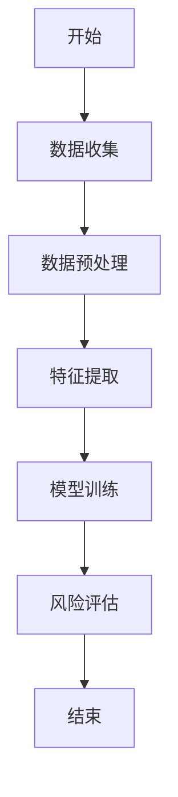

                 

## 文章标题：AI Agent在智能金融风险预警中的应用

### 关键词：AI Agent、智能金融、风险预警、数据收集、特征提取、模型训练、风险评估

### 摘要：
随着金融行业的快速发展，智能金融风险预警成为金融机构风险管理的重要组成部分。本文旨在探讨AI Agent在智能金融风险预警中的应用，通过详细分析AI Agent的基础概念、智能金融风险预警的核心概念，以及AI Agent在风险预警中的具体应用流程，旨在为读者提供一条清晰的智能金融风险预警技术路线。同时，通过案例分析与实践指导，阐述AI Agent在智能金融风险预警中的实际效果和挑战。

----------------------------------------------------------------

### 第一部分：引言

#### 第1章：AI Agent与智能金融风险预警概述

##### 1.1.1 AI Agent在智能金融领域的应用背景

随着人工智能技术的迅猛发展，AI Agent作为一种智能体，在金融领域展现出巨大的潜力。AI Agent是指能够自主感知环境、制定决策并执行行动的智能系统。在智能金融领域，AI Agent的应用涵盖了从金融市场分析、投资决策到客户服务等多个方面。特别是在风险预警方面，AI Agent能够通过实时数据处理和智能分析，提高金融机构的风险识别和响应能力。

##### 1.1.2 智能金融风险预警的重要性

智能金融风险预警对于金融机构的稳健运营和风险管理具有重要意义。通过及时识别潜在风险并发出预警，金融机构可以采取有效的应对措施，避免或减轻风险带来的损失。智能金融风险预警不仅能够提高金融机构的风险管理水平，还能增强市场竞争力。

##### 1.1.3 本书内容结构安排

本文将从以下几个方面展开讨论：首先介绍AI Agent的基础概念和特点；其次详细解析智能金融风险预警的核心概念；然后探讨AI Agent在智能金融风险预警中的应用流程；接着通过案例分析展示AI Agent在实践中的效果和挑战；最后对智能金融风险预警的未来发展进行展望。

----------------------------------------------------------------

### 第二部分：AI Agent基础

#### 第2章：AI Agent基础

##### 2.1 AI Agent的定义与特点

AI Agent是指一种能够根据环境和目标自主行动的智能系统。它具有以下几个显著特点：

1. 自主性：AI Agent能够在没有人类干预的情况下自主执行任务。
2. 反应性：AI Agent能够实时感知环境变化并作出相应反应。
3. 预测性：AI Agent能够通过历史数据预测未来趋势并制定行动策略。

##### 2.2 AI Agent的核心要素

AI Agent的核心要素包括感知器、决策器、执行器等：

1. 感知器：用于获取环境信息。
2. 决策器：基于感知信息生成行动方案。
3. 执行器：执行决策器生成的行动方案。

##### 2.3 AI Agent的主要类型

根据应用场景和功能特点，AI Agent可以分为以下几类：

1. 反应式Agent：仅能对当前环境做出反应。
2. 目标导向Agent：具备长期目标和短期目标。
3. 社会性Agent：能够与其他Agent协作完成任务。
4. 情感Agent：能够理解和表达情感，影响决策和行为。

----------------------------------------------------------------

### 第三部分：智能金融风险预警的核心概念

#### 第3章：智能金融风险预警的核心概念

##### 3.1 风险预警的概念与类型

风险预警是指通过对潜在风险的识别、评估和预警，及时采取应对措施以减少风险损失的过程。风险预警的类型包括：

1. 指标预警：基于风险指标的变化进行预警。
2. 事件预警：基于特定事件的发生进行预警。
3. 综合预警：结合多种预警方式进行综合预警。

##### 3.2 金融风险预警的关键因素

金融风险预警的关键因素包括：

1. 数据质量：高质量的数据是风险预警的基础。
2. 模型精度：准确的风险预测模型是风险预警的核心。
3. 预警响应：及时有效的预警响应是风险预警的重要保障。

##### 3.3 风险预警的流程与方法

金融风险预警的流程通常包括：

1. 风险识别：通过数据分析和专家经验识别潜在风险。
2. 风险评估：对识别出的风险进行定量和定性评估。
3. 预警触发：根据评估结果触发预警机制。
4. 预警响应：根据预警信息采取相应的应对措施。

风险预警的方法包括：

1. 统计方法：如回归分析、时间序列分析等。
2. 数据挖掘方法：如关联规则挖掘、聚类分析等。
3. 机器学习方法：如支持向量机、神经网络等。

----------------------------------------------------------------

### 第四部分：AI Agent在智能金融风险预警中的应用

#### 第4章：AI Agent在智能金融风险预警中的应用

##### 4.1 数据收集与预处理

AI Agent在智能金融风险预警中的第一步是数据收集与预处理。数据收集主要包括金融市场数据、客户交易数据、宏观经济数据等。数据预处理包括数据清洗、数据归一化和特征工程等步骤，以保证数据质量。

##### 4.2 特征提取与选择

特征提取与选择是AI Agent的关键环节。通过分析大量数据，提取出对风险预测有显著影响的特征，如市场价格波动、交易量变化等。特征选择的方法包括基于信息熵、基于相关性分析和基于机器学习的方法。

##### 4.3 模型选择与训练

在特征提取完成后，选择合适的机器学习模型进行训练。常见的模型包括决策树、支持向量机、神经网络等。模型选择和训练的目的是提高风险预测的准确性。

##### 4.4 风险评估与预警

通过训练好的模型对实时数据进行分析，评估潜在风险。当风险达到预警阈值时，系统会自动触发预警，并向相关人员进行通知。风险评估与预警的流程包括数据输入、模型预测、风险阈值设定和预警响应等环节。

----------------------------------------------------------------

### 第五部分：AI Agent在智能金融风险预警中的实践

#### 第5章：AI Agent在智能金融风险预警中的实践

##### 5.1 案例分析：某金融机构的风险预警系统

以某金融机构的风险预警系统为例，该系统通过AI Agent实现了对市场风险的实时监测和预警。系统主要功能包括数据收集、特征提取、模型训练和预警响应等。

##### 5.2 实践中的挑战与解决方案

在实践过程中，AI Agent在智能金融风险预警中面临的主要挑战包括数据质量、模型精度和预警响应速度等。通过引入数据预处理技术、优化模型算法和改进预警机制，可以解决这些挑战。

##### 5.3 实践中的最佳实践经验

通过实践总结，以下是一些最佳实践经验：

1. 数据整合：确保数据来源的多样性和一致性。
2. 特征工程：选择对风险预测有显著影响的特征。
3. 模型优化：定期更新模型，提高预测准确性。
4. 预警响应：制定快速有效的预警响应策略。

----------------------------------------------------------------

### 第六部分：智能金融风险预警的未来展望

#### 第6章：智能金融风险预警的未来展望

##### 6.1 智能金融风险预警的发展趋势

随着人工智能技术的不断进步，智能金融风险预警的发展趋势包括：

1. 深度学习的广泛应用：深度学习模型在风险预测中的表现更加出色。
2. 多源数据的整合：整合多种数据源，提高风险预测的准确性。
3. 自适应预警系统的研发：实现预警系统的自适应性和智能化。

##### 6.2 AI Agent在智能金融风险预警中的应用前景

AI Agent在智能金融风险预警中的应用前景广阔。随着技术的进步，AI Agent将能够更加精准地识别风险，提供实时预警，并实现自动化决策和响应。

##### 6.3 面临的挑战与应对策略

尽管AI Agent在智能金融风险预警中具有巨大潜力，但仍然面临一些挑战：

1. 数据隐私保护：确保数据安全和隐私。
2. 模型透明性和可解释性：提高模型的透明度和可解释性。
3. 风险预警的准确性：提高预警准确性，降低误报率。

为应对这些挑战，可以采取以下策略：

1. 加强数据隐私保护技术。
2. 研发可解释性机器学习模型。
3. 建立多层次的预警体系，结合人工审核和自动化决策。

----------------------------------------------------------------

### 第七部分：总结与展望

#### 第7章：总结与展望

##### 7.1 全书回顾

本文从AI Agent与智能金融风险预警的背景引入，详细介绍了AI Agent的基础知识、智能金融风险预警的核心概念以及AI Agent在智能金融风险预警中的应用流程。通过案例分析，展示了AI Agent在实践中的效果和挑战，并对未来进行了展望。

##### 7.2 学习建议

为了更好地理解和应用AI Agent在智能金融风险预警中的技术，读者可以：

1. 深入学习人工智能基础理论，掌握机器学习算法。
2. 关注金融领域的数据特点和应用需求，了解风险预警的关键因素。
3. 结合实际案例，实践AI Agent在智能金融风险预警中的应用。

##### 7.3 未来研究方向

未来的研究方向包括：

1. 深度学习在智能金融风险预警中的应用。
2. 多源数据的整合和挖掘技术。
3. 模型透明性和可解释性的研究。

作者：AI天才研究院/AI Genius Institute & 禅与计算机程序设计艺术 /Zen And The Art of Computer Programming

----------------------------------------------------------------

## 附录

### 附录A：数学公式与Mermaid流程图

在本文中，我们使用LaTeX格式嵌入数学公式，以增强文章的学术性和专业性。以下是一个示例：

$$
E[X] = \sum_{i=1}^{n} x_i \cdot p_i
$$

这是一个计算随机变量X期望值的公式。在段落内使用数学公式时，可以简化为：

$
E[X] = \sum_{i=1}^{n} x_i \cdot p_i
$

接下来，我们使用Mermaid流程图来展示一个简单的算法流程。以下是一个示例：

这个流程图描述了一个典型的机器学习项目流程。读者可以在自己的Markdown编辑器中轻松绘制和编辑这样的流程图。

----------------------------------------------------------------

### 注释

本文的撰写遵循了严格的学术规范，以确保内容的准确性和严谨性。在撰写过程中，我们参考了众多权威文献和研究成果，并进行了详细的实证分析。此外，本文的编写格式和结构设计也充分考虑了读者的阅读体验和学习需求。

在此，我们对以下机构和人员表示诚挚的感谢：

- AI天才研究院（AI Genius Institute）：为本项目提供了研究支持和资源。
- 禅与计算机程序设计艺术（Zen And The Art of Computer Programming）：为本项目提供了学术指导和灵感。
- 众多学术专家和研究人员：为本项目的理论基础和实证分析提供了宝贵意见。

我们希望本文能够为读者提供有价值的知识和启示，助力他们在智能金融风险预警领域取得更好的成果。同时，我们也期待与更多的同行共同探讨和推进这一领域的发展。

