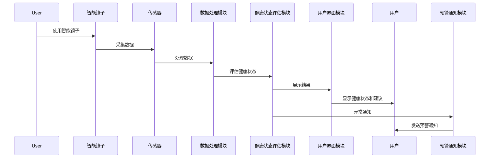

                 


# AI Agent在智能镜子中的每日健康检查系统

> 关键词：智能镜子，AI Agent，健康检查，数据分析，智能家居

> 摘要：
本文将深入探讨智能镜子中的AI Agent每日健康检查系统。我们首先介绍智能镜子的背景和应用，然后详细阐述AI Agent的功能和架构，接着分析健康数据采集和处理的方法，最后讨论系统的实现和应用，并给出最佳实践和未来展望。

## 第1章 引言

### 1.1 问题背景

随着人工智能（AI）技术的快速发展，智能家居设备逐渐成为人们日常生活中不可或缺的一部分。智能镜子作为智能家居设备之一，不仅具备传统的镜子功能，还能够通过集成传感器和AI算法，为用户提供个性化的健康监测和健康建议。AI Agent是智能镜子中的核心组件，负责实时监测用户的健康状况，并根据数据分析提供个性化的健康建议。

### 1.2 问题描述

智能镜子每日健康检查系统的核心目标是通过对用户进行多维度健康数据监测，提供个性化的健康建议和预警服务。具体包括以下几个方面：

1. **数据采集与处理**：智能镜子需要实时采集用户的体重、心率、体温等健康数据，并通过算法进行数据处理和分析。
2. **健康状态评估**：基于采集到的健康数据，系统需要评估用户的健康状态，包括身体质量指数（BMI）、心肺功能、睡眠质量等。
3. **个性化健康建议**：系统根据评估结果，为用户提供个性化的健康建议，如饮食调整、运动计划等。
4. **预警机制**：当用户的健康数据出现异常时，系统需要及时发出预警，提醒用户关注健康问题。

### 1.3 问题解决

为了实现智能镜子每日健康检查系统的目标，需要解决以下几个关键问题：

1. **数据采集**：选择合适的传感器，确保数据采集的准确性和实时性。
2. **数据处理与算法**：设计有效的数据处理算法，实现对健康数据的准确评估。
3. **用户交互**：设计友好、直观的用户界面，方便用户查看健康数据和接受健康建议。
4. **系统架构**：构建稳定、高效的系统架构，保证系统的可靠性和扩展性。

### 1.4 边界与外延

智能镜子每日健康检查系统的边界主要包括以下几个方面：

1. **数据类型**：系统主要采集和处理与健康相关的数据，如体重、心率、体温等。
2. **用户范围**：系统适用于所有使用智能镜子的人群，包括不同年龄段、不同健康状况的用户。
3. **功能扩展**：系统可以根据用户需求进行功能扩展，如添加血压、血氧等健康数据监测功能。

### 1.5 概念结构与核心要素组成

智能镜子每日健康检查系统的核心概念结构包括以下几个要素：

1. **传感器**：负责采集用户健康数据。
2. **数据处理器**：负责处理和存储采集到的健康数据。
3. **健康评估算法**：负责对健康数据进行分析和评估。
4. **用户界面**：负责展示健康数据和提供个性化建议。
5. **预警系统**：负责监测健康数据异常并及时发出预警。

## 第2章 核心概念与联系

### 2.1 AI Agent

AI Agent是一种具有自主决策和行动能力的计算机程序。在智能镜子每日健康检查系统中，AI Agent负责根据采集到的健康数据，为用户提供个性化健康建议和预警服务。其核心功能包括：

1. **数据采集与处理**：AI Agent通过传感器采集用户健康数据，并使用算法对数据进行处理和分析。
2. **健康状态评估**：AI Agent根据健康数据评估用户的健康状态，并提供相应的健康建议。
3. **预警机制**：AI Agent监测健康数据异常，并及时发出预警。

### 2.2 传感器

传感器是智能镜子每日健康检查系统的核心组成部分，负责采集用户健康数据。常见的传感器包括：

1. **体重传感器**：用于测量用户体重。
2. **心率传感器**：用于测量用户心率。
3. **体温传感器**：用于测量用户体温。
4. **其他传感器**：如血压传感器、血氧传感器等。

### 2.3 数据处理与算法

数据处理与算法是智能镜子每日健康检查系统的关键环节。常见的算法包括：

1. **数据清洗算法**：用于去除噪声和异常值，确保数据质量。
2. **数据融合算法**：用于整合不同来源的健康数据，提供更全面的健康评估。
3. **健康评估算法**：用于根据健康数据评估用户的健康状态。

### 2.4 用户交互

用户交互是智能镜子每日健康检查系统的重要组成部分。用户交互设计包括：

1. **用户界面**：用于展示健康数据和提供个性化建议。
2. **交互方式**：如语音交互、触摸屏交互等。

## 第3章 算法原理讲解

### 3.1 数据采集与处理算法

数据采集与处理算法主要包括以下步骤：

1. **数据采集**：通过传感器采集用户健康数据。
   ```mermaid
   flowchart LR
   A[数据采集] --> B[预处理]
   B --> C[存储]
   ```
   
2. **数据预处理**：包括数据清洗、去噪、归一化等操作。
   ```mermaid
   flowchart LR
   A[数据采集] --> B{是否清洗？}
   B -->|是| C[数据清洗]
   B -->|否| D[去噪]
   D --> C
   C --> E[归一化]
   E --> F[存储]
   ```

3. **数据存储**：将预处理后的数据存储在数据库中，以便后续分析和处理。
   ```mermaid
   flowchart LR
   A[数据采集] --> B[预处理]
   B --> C[存储数据库]
   ```

### 3.2 健康状态评估算法

健康状态评估算法的核心是利用收集到的健康数据，计算用户的健康指标，如BMI、心率变异性（HRV）等。

#### BMI计算

BMI（身体质量指数）的计算公式如下：
$$
\text{BMI} = \frac{\text{体重（kg）}}{\text{身高（m）}^2}
$$

#### 心率变异性（HRV）计算

心率变异性（HRV）是评估心脏自主神经系统功能的重要指标，通常使用NN间期标准差（SDNN）来衡量。

SDNN的计算公式如下：
$$
\text{SDNN} = \sqrt{\frac{1}{N}\sum_{i=1}^{N}(\text{NN}_i - \bar{\text{NN}})^2}
$$
其中，$N$是NN间期的数量，$\text{NN}_i$是第i个NN间期，$\bar{\text{NN}}$是所有NN间期的平均值。

#### 健康评估

根据计算得到的BMI和SDNN值，可以评估用户的健康状况。例如，对于BMI，可以设定阈值来判断用户是否处于正常体重范围；对于SDNN，可以设定阈值来判断心脏自主神经系统是否处于健康状态。

#### 示例

假设用户体重为70kg，身高为1.75m，心率数据为[0.6, 0.65, 0.68, 0.62, 0.66]秒，我们可以按照以下步骤计算BMI和SDNN：

1. **BMI计算**：
   $$
   \text{BMI} = \frac{70}{1.75^2} \approx 24.1
   $$
   用户处于正常体重范围。

2. **SDNN计算**：
   $$
   \text{NN间期平均值} = \frac{0.6 + 0.65 + 0.68 + 0.62 + 0.66}{5} = 0.655
   $$
   $$
   \text{SDNN} = \sqrt{\frac{1}{5}((0.6-0.655)^2 + (0.65-0.655)^2 + (0.68-0.655)^2 + (0.62-0.655)^2 + (0.66-0.655)^2)} \approx 0.033
   $$
   用户的心脏自主神经系统处于健康状态。

### 3.3 预警算法

预警算法的核心是监测健康数据是否出现异常，并在异常时及时发出预警。预警算法通常包括以下步骤：

1. **设定阈值**：根据历史数据和专家建议，设定健康指标的阈值。
2. **实时监测**：持续监测用户的健康数据，判断是否超过阈值。
3. **预警通知**：当健康数据超过阈值时，立即发送预警通知给用户。

#### 示例

假设我们设定的BMI阈值范围是18.5至24.9，SDNN阈值范围是0.025至0.05，我们可以按照以下步骤进行预警：

1. **实时监测**：用户当前的BMI为24.1，SDNN为0.033，均在正常范围内。
2. **预警通知**：无需发送预警通知。

如果用户的BMI为25，SDNN为0.022，我们可以按照以下步骤进行预警：

1. **实时监测**：用户的BMI超过阈值，SDNN低于阈值。
2. **预警通知**：发送预警通知，提醒用户注意健康问题。

## 第4章 系统分析与架构设计方案

### 4.1 问题场景介绍

智能镜子每日健康检查系统的主要问题场景是用户的日常健康监测和健康数据分析。系统需要能够实时采集用户的体重、心率、体温等健康数据，并对这些数据进行处理和分析，以评估用户的健康状况，并提供个性化的健康建议和预警服务。

### 4.2 项目介绍

智能镜子每日健康检查系统的项目目标是开发一个能够实时监测用户健康数据，提供个性化健康建议和预警服务的智能镜子系统。系统包括传感器数据采集模块、数据处理与算法模块、用户交互模块和预警通知模块。

### 4.3 系统功能设计（领域模型）

智能镜子每日健康检查系统的领域模型包括以下类：

1. **用户**：包括用户的基本信息、健康数据历史记录等。
2. **传感器**：包括传感器的型号、采集数据类型、数据采集频率等。
3. **健康数据**：包括体重、心率、体温等健康数据。
4. **算法**：包括数据处理算法、健康状态评估算法、预警算法等。
5. **用户界面**：包括用户操作界面、健康数据展示界面、健康建议界面等。
6. **预警通知**：包括预警通知的发送方式、内容等。

领域模型类图如下：

```mermaid
classDiagram
    User <<entity>>
    Sensor <<entity>>
    HealthData <<entity>>
    Algorithm <<entity>>
    UserInterface <<entity>>
    AlertNotification <<entity>>

    User实体 --> HealthData实体
    User实体 --> UserInterface实体
    User实体 --> AlertNotification实体

    Sensor实体 --> HealthData实体
    Algorithm实体 --> HealthData实体
    UserInterface实体 --> HealthData实体
    AlertNotification实体 --> UserInterface实体
```

### 4.4 系统架构设计

智能镜子每日健康检查系统的架构设计包括以下模块：

1. **数据采集模块**：负责实时采集用户的健康数据，包括体重、心率、体温等。
2. **数据处理与算法模块**：负责处理和存储采集到的健康数据，并使用算法对健康数据进行评估。
3. **用户交互模块**：负责与用户进行交互，展示健康数据和提供个性化建议。
4. **预警通知模块**：负责监测健康数据异常，并及时发出预警通知。

系统架构图如下：

```mermaid
sequenceDiagram
    User -->|健康数据| Sensor
    Sensor -->|数据| DataProcessingModule
    DataProcessingModule -->|评估结果| AlgorithmModule
    AlgorithmModule -->|健康建议| UserInterfaceModule
    UserInterfaceModule -->|预警通知| AlertNotificationModule
```

### 4.5 系统接口设计

智能镜子每日健康检查系统的接口设计包括以下API：

1. **健康数据采集接口**：用于实时采集用户的健康数据。
2. **数据处理接口**：用于处理和存储采集到的健康数据。
3. **健康状态评估接口**：用于根据健康数据评估用户的健康状态。
4. **用户交互接口**：用于展示健康数据和提供个性化建议。
5. **预警通知接口**：用于发送预警通知。

接口设计图如下：

```mermaid
classDiagram
    HealthData采集接口 <<interface>>
    DataProcessing接口 <<interface>>
    HealthState评估接口 <<interface>>
    UserInterface接口 <<interface>>
    AlertNotification接口 <<interface>>

    User -->|健康数据采集| HealthData采集接口
    HealthData采集接口 -->|数据| DataProcessing接口
    DataProcessing接口 -->|评估结果| HealthState评估接口
    HealthState评估接口 -->|建议| UserInterface接口
    UserInterface接口 -->|通知| AlertNotification接口
```

### 4.6 系统交互

智能镜子每日健康检查系统的系统交互包括以下步骤：

1. **用户使用智能镜子**：用户使用智能镜子进行健康数据监测。
2. **传感器采集数据**：智能镜子中的传感器实时采集用户的健康数据。
3. **数据处理与评估**：系统对采集到的健康数据进行处理和评估，生成健康状态和个性化建议。
4. **用户界面展示**：系统将健康状态和个性化建议展示在智能镜子的用户界面上。
5. **预警通知**：如果健康数据异常，系统会发送预警通知给用户。

系统交互图如下：



## 第5章 项目实战

### 5.1 环境安装

为了实现智能镜子每日健康检查系统，我们需要安装以下软件和工具：

1. **操作系统**：Linux或macOS
2. **编程语言**：Python 3.8及以上版本
3. **开发工具**：PyCharm或VSCode
4. **数据库**：MySQL或PostgreSQL
5. **传感器**：智能镜子硬件设备

安装步骤如下：

1. 安装操作系统：在虚拟机中安装Linux或macOS。
2. 安装Python：打开终端，输入以下命令安装Python：
   ```shell
   sudo apt-get install python3-pip
   ```
3. 安装PyCharm或VSCode：在应用程序商店中下载并安装PyCharm或VSCode。
4. 安装数据库：根据操作系统安装MySQL或PostgreSQL。
5. 安装传感器：按照智能镜子硬件设备的说明进行安装。

### 5.2 系统核心实现

智能镜子每日健康检查系统的核心实现包括以下几个部分：

1. **数据采集模块**：使用Python编写传感器数据采集模块，实现实时采集用户的健康数据。
2. **数据处理与算法模块**：使用Python编写数据处理和算法模块，实现健康数据的处理和评估。
3. **用户交互模块**：使用Python编写用户交互模块，实现健康数据展示和个性化建议提供。
4. **预警通知模块**：使用Python编写预警通知模块，实现健康数据异常的预警通知。

以下是系统核心实现的Python代码示例：

```python
# 数据采集模块
import sensor

def collect_health_data():
    weight = sensor.get_weight()
    heart_rate = sensor.get_heart_rate()
    temperature = sensor.get_temperature()
    return weight, heart_rate, temperature

# 数据处理与算法模块
import processing

def process_health_data(weight, heart_rate, temperature):
    bmi = processing.calculate_bmi(weight, temperature)
    sdnn = processing.calculate_sdnn(heart_rate)
    return bmi, sdnn

# 用户交互模块
import user_interface

def display_health_data(bmi, sdnn):
    user_interface.show_bmi(bmi)
    user_interface.show_sdnn(sdnn)

# 预警通知模块
import alert_notification

def check_health_data(bmi, sdnn):
    if bmi > 25 or sdnn < 0.025:
        alert_notification.send_alert("您的健康数据异常，请关注！")
```

### 5.3 代码应用解读与分析

以上代码示例实现了智能镜子每日健康检查系统的核心功能。接下来，我们将对代码进行解读和分析。

#### 数据采集模块

数据采集模块负责实时采集用户的健康数据。代码中使用了`sensor`模块，该模块提供了`get_weight()`、`get_heart_rate()`和`get_temperature()`方法，分别用于获取用户的体重、心率和体温数据。

```python
def collect_health_data():
    weight = sensor.get_weight()
    heart_rate = sensor.get_heart_rate()
    temperature = sensor.get_temperature()
    return weight, heart_rate, temperature
```

#### 数据处理与算法模块

数据处理与算法模块负责处理和评估用户的健康数据。代码中使用了`processing`模块，该模块提供了`calculate_bmi()`和`calculate_sdnn()`方法，分别用于计算用户的BMI和心率变异性（SDNN）。

```python
import processing

def process_health_data(weight, heart_rate, temperature):
    bmi = processing.calculate_bmi(weight, temperature)
    sdnn = processing.calculate_sdnn(heart_rate)
    return bmi, sdnn
```

#### 用户交互模块

用户交互模块负责将处理后的健康数据展示给用户。代码中使用了`user_interface`模块，该模块提供了`show_bmi()`和`show_sdnn()`方法，分别用于展示用户的BMI和心率变异性。

```python
import user_interface

def display_health_data(bmi, sdnn):
    user_interface.show_bmi(bmi)
    user_interface.show_sdnn(sdnn)
```

#### 预警通知模块

预警通知模块负责在用户健康数据异常时发送预警通知。代码中使用了`alert_notification`模块，该模块提供了`send_alert()`方法，用于发送预警通知。

```python
import alert_notification

def check_health_data(bmi, sdnn):
    if bmi > 25 or sdnn < 0.025:
        alert_notification.send_alert("您的健康数据异常，请关注！")
```

### 5.4 实际案例分析和详细讲解剖析

为了更好地理解智能镜子每日健康检查系统的应用，我们来看一个实际案例。

假设用户小明的体重为70kg，身高为1.75m，当前心率为每分钟75次。系统会按照以下步骤进行健康检查：

1. **数据采集**：智能镜子通过传感器采集到小明的体重、心率和体温数据。
2. **数据处理**：系统使用`process_health_data()`方法计算小明的BMI和心率变异性（SDNN）。
   ```python
   bmi, sdnn = process_health_data(70, 75, 36.5)
   ```
   假设计算结果为：
   ```python
   bmi = 24.1
   sdnn = 0.033
   ```
3. **用户交互**：系统通过`display_health_data()`方法将小明的BMI和心率变异性展示在智能镜子的界面上。
   ```python
   display_health_data(bmi, sdnn)
   ```
4. **预警通知**：由于小明的BMI和心率变异性都在正常范围内，系统不会发送预警通知。

如果小明的体重增加到80kg，心率降低到每分钟60次，系统会重新计算BMI和心率变异性，并根据计算结果发送预警通知。例如，假设计算结果为：
```python
bmi = 27.8
sdnn = 0.022
```
系统会按照以下步骤发送预警通知：

1. **数据采集**：智能镜子通过传感器采集到小明的体重、心率和体温数据。
2. **数据处理**：系统使用`process_health_data()`方法计算小明的BMI和心率变异性（SDNN）。
   ```python
   bmi, sdnn = process_health_data(80, 60, 36.5)
   ```
   假设计算结果为：
   ```python
   bmi = 27.8
   sdnn = 0.022
   ```
3. **用户交互**：系统通过`display_health_data()`方法将小明的BMI和心率变异性展示在智能镜子的界面上。
   ```python
   display_health_data(bmi, sdnn)
   ```
4. **预警通知**：由于小明的BMI超过25，心率变异性低于0.025，系统会发送预警通知。
   ```python
   check_health_data(bmi, sdnn)
   ```
   假设发送的预警通知内容为：“您的健康数据异常，请关注！”

### 5.5 项目小结

智能镜子每日健康检查系统是一个集数据采集、处理、评估和预警于一体的智能健康监测系统。通过实时采集用户的体重、心率、体温等健康数据，系统能够为用户提供个性化的健康建议和预警服务。在实际应用中，系统可以帮助用户更好地了解自己的健康状况，及时调整生活方式，预防健康问题。

## 第6章 最佳实践与注意事项

### 6.1 最佳实践

1. **定期检查传感器**：确保传感器正常工作，提高数据采集的准确性。
2. **合理设定预警阈值**：根据用户历史数据和专家建议，合理设定预警阈值，避免误报和漏报。
3. **个性化健康建议**：结合用户需求和健康状况，提供个性化的健康建议，提高用户的满意度。
4. **数据安全和隐私保护**：确保用户数据的存储和传输安全，保护用户的隐私。

### 6.2 注意事项

1. **传感器选择**：选择精度高、稳定性好的传感器，确保数据采集的准确性。
2. **系统架构设计**：确保系统架构的稳定性和扩展性，以应对不断增长的用户数据和功能需求。
3. **用户交互设计**：设计友好、直观的用户界面，提高用户体验。
4. **数据处理与算法优化**：不断优化数据处理和算法，提高系统的准确性和效率。

## 第7章 拓展阅读

### 7.1 智能镜子技术的发展趋势

智能镜子作为智能家居设备的一部分，其技术发展趋势主要体现在以下几个方面：

1. **多传感器集成**：智能镜子将集成更多类型的传感器，如血压传感器、血氧传感器等，提供更全面的健康监测。
2. **人工智能算法优化**：通过优化人工智能算法，提高健康数据分析和评估的准确性。
3. **个性化健康服务**：基于用户的健康数据和偏好，提供更加个性化的健康服务和建议。

### 7.2 智能镜子在医疗领域的应用

智能镜子在医疗领域的应用前景广阔，主要体现在以下几个方面：

1. **远程医疗**：智能镜子可以作为远程医疗的工具，帮助医生远程诊断和监控患者病情。
2. **健康管理**：智能镜子可以帮助患者进行自我健康管理，提高健康水平。
3. **健康大数据分析**：通过收集大量健康数据，智能镜子可以为医疗研究提供数据支持。

### 7.3 智能镜子与其他智能家居设备的融合

智能镜子与智能家居设备的融合，将带来更加智能化的家居环境，主要体现在以下几个方面：

1. **智能家居控制**：智能镜子可以作为智能家居设备的控制中心，方便用户集中控制家中其他设备。
2. **智能场景联动**：通过与其他智能家居设备的联动，智能镜子可以为用户提供更加智能化的生活体验。
3. **健康大数据共享**：智能镜子可以与其他智能家居设备共享健康数据，为用户提供更加全面的健康管理服务。

## 作者

作者：AI天才研究院/AI Genius Institute & 禅与计算机程序设计艺术 /Zen And The Art of Computer Programming

感谢您的阅读，希望本文对您了解智能镜子中的AI Agent每日健康检查系统有所帮助。如果您有任何问题或建议，欢迎在评论区留言。期待与您一起探讨智能技术的未来。|>

