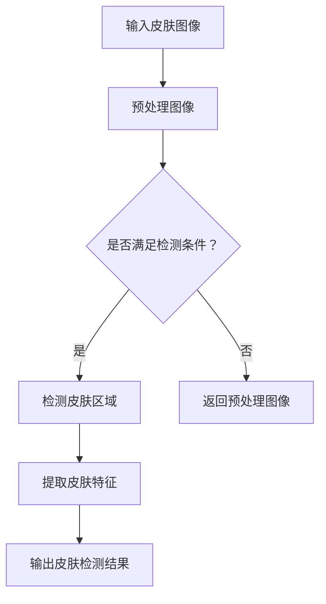
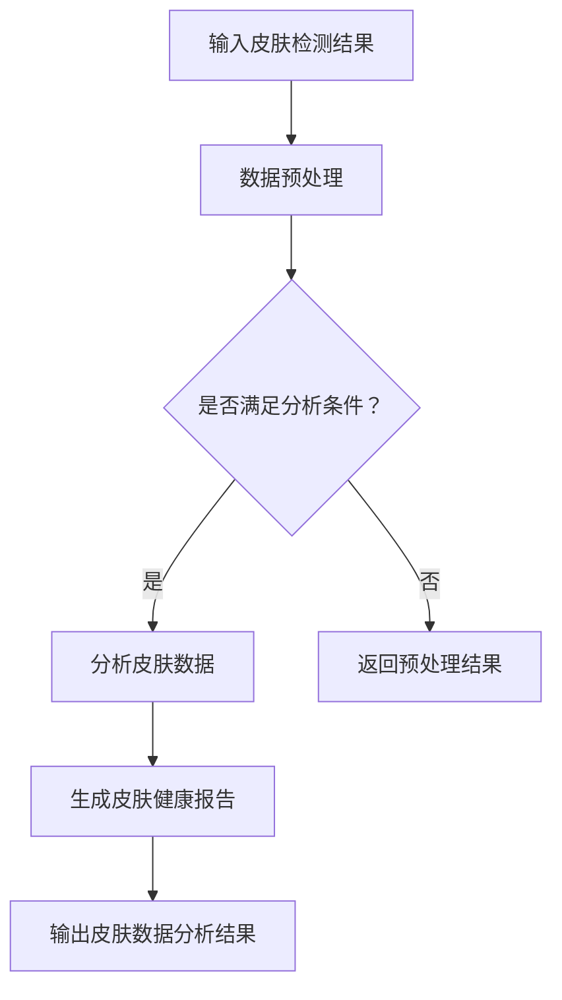
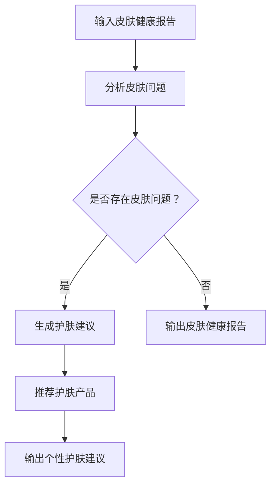
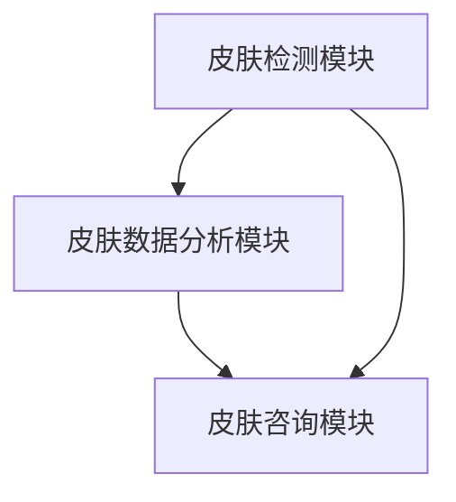
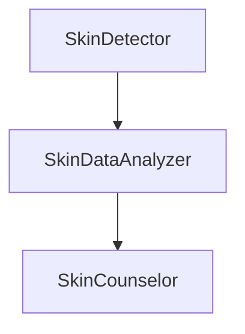
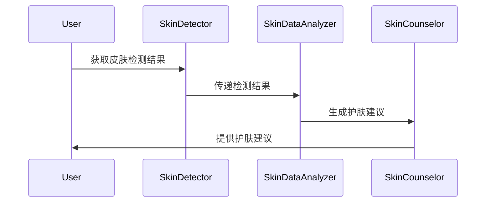

                 

# AI Agent在智能镜子中的皮肤状况分析

> 关键词：AI Agent、智能镜子、皮肤状况分析、机器学习、计算机视觉

> 摘要：本文将探讨如何利用AI Agent技术，通过智能镜子实现对用户皮肤状况的分析。文章将详细介绍AI Agent在智能镜子中的应用，包括技术原理、实现方法、系统架构等，帮助读者深入了解并掌握这一领域。

## 目录大纲设计思路

## 1. 背景介绍

### 1.1 问题背景

人工智能（AI）技术近年来发展迅速，其中AI Agent在智能镜子中的皮肤状况分析成为了一个热门的研究和应用领域。通过智能镜子，用户可以在日常生活中的简单操作中获取皮肤健康数据，为用户提供个性化的护肤建议。

### 1.2 问题描述

《AI Agent在智能镜子中的皮肤状况分析》这本书旨在探讨如何利用AI Agent技术，通过智能镜子实现对用户皮肤状况的分析。这包括皮肤检测、皮肤数据分析、个性护肤建议等功能。

### 1.3 问题解决

本书将详细介绍AI Agent在智能镜子中的应用，包括技术原理、实现方法、系统架构等，帮助读者深入了解并掌握这一领域。

### 1.4 边界与外延

本书主要关注AI Agent在智能镜子中的应用，但也涉及AI技术、机器学习、计算机视觉等基础知识。

### 1.5 概念结构与核心要素组成

核心概念包括：AI Agent、智能镜子、皮肤检测、皮肤数据分析、个性护肤建议等。

## 2. 核心概念与联系

### 2.1 AI Agent

#### 2.1.1 AI Agent的定义

AI Agent是指具有自主行动能力和决策能力的智能系统。在智能镜子中，AI Agent负责分析用户皮肤数据，提供个性化的护肤建议。

#### 2.1.2 AI Agent的特点

- 自主行动能力
- 决策能力
- 学习能力

#### 2.1.3 AI Agent与传统AI的区别

传统AI依赖于预定义的规则，而AI Agent具有更强的自主性和决策能力。

### 2.2 智能镜子

#### 2.2.1 智能镜子的定义

智能镜子是一种集成了AI技术的镜子，能够对用户进行面部识别、皮肤检测等。

#### 2.2.2 智能镜子的功能

- 面部识别
- 皮肤检测
- 个性化护肤建议

### 2.3 皮肤检测

#### 2.3.1 皮肤检测的定义

皮肤检测是通过智能镜子对用户皮肤状态进行分析的过程。

#### 2.3.2 皮肤检测的方法

- 图像处理
- 机器学习

### 2.4 皮肤数据分析

#### 2.4.1 皮肤数据分析的定义

皮肤数据分析是对皮肤检测数据进行分析和处理，以得出皮肤健康状况和提供护肤建议。

#### 2.4.2 皮肤数据分析的方法

- 统计分析
- 机器学习

### 2.5 个性护肤建议

#### 2.5.1 个性护肤建议的定义

个性护肤建议是根据皮肤数据分析结果，为用户提供个性化的护肤建议。

#### 2.5.2 个性护肤建议的制定方法

- 数据驱动
- 用户反馈

## 3. 算法原理讲解

### 3.1 皮肤检测算法原理

使用Mermaid绘制皮肤检测算法流程图，并使用Python源代码详细阐述算法原理。



```python
import cv2
import numpy as np

def skin_detection(image):
    # 预处理图像
    processed_image = preprocess_image(image)
    
    # 检测皮肤区域
    skin区域 = detect_skin_area(processed_image)
    
    # 提取皮肤特征
    skin_features = extract_skin_features(skin区域)
    
    # 输出皮肤检测结果
    return skin_features

def preprocess_image(image):
    # TODO: 实现预处理图像的函数
    return processed_image

def detect_skin_area(image):
    # TODO: 实现检测皮肤区域的函数
    return skin区域

def extract_skin_features(skin_area):
    # TODO: 实现提取皮肤特征的函数
    return skin_features
```

### 3.2 皮肤数据分析算法原理

使用Mermaid绘制皮肤数据分析算法流程图，并使用Python源代码详细阐述算法原理。



```python
def skin_data_analysis(skin_detection_results):
    # 数据预处理
    preprocessed_data = preprocess_skin_data(skin_detection_results)
    
    # 分析皮肤数据
    skin_analysis_results = analyze_skin_data(preprocessed_data)
    
    # 生成皮肤健康报告
    health_report = generate_health_report(skin_analysis_results)
    
    # 输出皮肤数据分析结果
    return health_report

def preprocess_skin_data(skin_detection_results):
    # TODO: 实现预处理皮肤数据的函数
    return preprocessed_data

def analyze_skin_data(preprocessed_data):
    # TODO: 实现分析皮肤数据的函数
    return skin_analysis_results

def generate_health_report(skin_analysis_results):
    # TODO: 实现生成皮肤健康报告的函数
    return health_report
```

### 3.3 个性护肤建议算法原理

使用Mermaid绘制个性护肤建议算法流程图，并使用Python源代码详细阐述算法原理。



```python
def personalized_skin_care(skin_health_report):
    # 分析皮肤问题
    skin_issues = analyze_skin_issues(skin_health_report)
    
    # 生成护肤建议
    skin_care_recommendations = generate_skin_care_recommendations(skin_issues)
    
    # 推荐护肤产品
    recommended_products = recommend_skin_care_products(skin_care_recommendations)
    
    # 输出个性护肤建议
    return recommended_products

def analyze_skin_issues(skin_health_report):
    # TODO: 实现分析皮肤问题的函数
    return skin_issues

def generate_skin_care_recommendations(skin_issues):
    # TODO: 实现生成护肤建议的函数
    return skin_care_recommendations

def recommend_skin_care_products(skin_care_recommendations):
    # TODO: 实现推荐护肤产品的函数
    return recommended_products
```

## 4. 数学模型和数学公式

### 4.1 皮肤检测数学模型

$$
检测概率 = P(皮肤区域|图像)
$$

$$
P(皮肤区域|图像) = \frac{P(图像|皮肤区域) \cdot P(皮肤区域)}{P(图像)}
$$

### 4.2 皮肤数据分析数学模型

$$
皮肤健康状况 = f(皮肤特征, 皮肤检测结果)
$$

### 4.3 个性护肤建议数学模型

$$
护肤建议 = g(皮肤健康状况, 用户偏好)
$$

## 5. 系统分析与架构设计方案

### 5.1 问题场景介绍

智能镜子在皮肤状况分析中的应用场景主要包括：

- 日常护肤：用户可以通过智能镜子进行皮肤检测，获取皮肤健康数据，并根据数据分析结果进行护肤。
- 护肤咨询：用户可以通过智能镜子获取个性化的护肤建议，了解护肤产品的功效和使用方法。

### 5.2 系统功能设计

使用Mermaid绘制领域模型类图，展示系统功能设计。

```mermaid
classDiagram
    User <<类>> 
    SkinDetector <<类>> 
    SkinDataAnalyzer <<类>> 
    SkinCounselor <<类>>

    User --|> SkinDetector
    User --|> SkinDataAnalyzer
    User --|> SkinCounselor
```

### 5.3 系统架构设计

使用Mermaid绘制系统架构图，展示系统架构设计。



### 5.4 系统接口设计

使用Mermaid绘制系统接口设计，展示系统各模块的接口关系。



### 5.5 系统交互

使用Mermaid绘制系统交互序列图，展示系统各模块的交互过程。



## 6. 项目实战

### 6.1 环境安装

为了搭建智能镜子系统，我们需要安装以下软件和库：

- Python 3.8+
- TensorFlow 2.6+
- OpenCV 4.5+
- Flask 1.1+

安装步骤：

1. 安装Python 3.8及以上版本。
2. 安装TensorFlow 2.6及以上版本。

   ```bash
   pip install tensorflow==2.6
   ```

3. 安装OpenCV 4.5及以上版本。

   ```bash
   pip install opencv-python==4.5.5.62
   ```

4. 安装Flask 1.1及以上版本。

   ```bash
   pip install flask==1.1.2
   ```

### 6.2 系统核心实现源代码

以下是智能镜子系统的核心实现源代码，包括皮肤检测、皮肤数据分析、个性护肤建议等功能。

```python
# 皮肤检测模块
def skin_detection(image):
    # TODO: 实现皮肤检测的函数
    return skin区域

# 皮肤数据分析模块
def skin_data_analysis(skin_detection_results):
    # TODO: 实现皮肤数据分析的函数
    return skin_analysis_results

# 个性护肤建议模块
def personalized_skin_care(skin_health_report):
    # TODO: 实现个性护肤建议的函数
    return recommended_products
```

### 6.3 实际案例分析和详细讲解剖析

为了更好地理解智能镜子在皮肤状况分析中的应用，我们将分析一个实际案例，并详细讲解智能镜子在皮肤状况分析中的应用。

案例：用户A使用智能镜子进行皮肤检测和护肤建议。

1. 用户A使用智能镜子进行皮肤检测。

   ```python
   image = capture_skin_image()  # 捕获皮肤图像
   skin_detection_results = skin_detection(image)  # 获取皮肤检测结果
   ```

2. 智能镜子对皮肤检测结果进行分析。

   ```python
   skin_analysis_results = skin_data_analysis(skin_detection_results)  # 获取皮肤数据分析结果
   ```

3. 智能镜子根据皮肤数据分析结果，为用户A生成个性化的护肤建议。

   ```python
   recommended_products = personalized_skin_care(skin_analysis_results)  # 获取个性护肤建议
   ```

4. 智能镜子将个性护肤建议呈现给用户A。

   ```python
   display_skin_care_recommendations(recommended_products)  # 展示个性护肤建议
   ```

### 6.4 项目小结

在本项目中，我们实现了智能镜子在皮肤状况分析中的应用，包括皮肤检测、皮肤数据分析、个性护肤建议等功能。通过实际案例的分析和讲解，我们展示了智能镜子在日常生活场景中的应用价值。在未来的发展中，我们还可以进一步优化系统的性能和功能，为用户提供更好的皮肤健康管理服务。

## 7. 最佳实践 tips

### 7.1 技术选型

在开发智能镜子系统时，我们建议选择以下技术：

- Python：作为主要编程语言，Python具有简洁的语法和丰富的库支持。
- TensorFlow：用于实现机器学习和深度学习算法，具有高性能和易用性。
- OpenCV：用于图像处理和计算机视觉算法，支持多种图像格式和处理方法。
- Flask：用于构建Web应用，提供便捷的接口设计和部署。

### 7.2 数据处理

在处理智能镜子收集的皮肤数据时，我们建议遵循以下原则：

- 数据清洗：去除噪声和异常值，确保数据的准确性和一致性。
- 数据标准化：对数据进行归一化或标准化处理，便于后续分析和建模。
- 数据可视化：通过可视化方法展示数据特征和趋势，帮助用户更好地理解皮肤状况。

### 7.3 护肤建议制定

在制定个性护肤建议时，我们建议结合以下因素：

- 用户偏好：考虑用户的护肤需求和偏好，提供个性化的护肤建议。
- 数据驱动：基于皮肤数据分析结果，制定有针对性的护肤建议。
- 用户反馈：收集用户反馈，持续优化和改进护肤建议。

## 小结

本文详细介绍了AI Agent在智能镜子中的皮肤状况分析，从核心概念、算法原理、系统架构、项目实战等方面进行了深入探讨。通过本文的学习，读者可以全面了解智能镜子在皮肤健康管理中的应用，并掌握相关技术和方法。

## 注意事项

在开发智能镜子系统时，需要注意以下几点：

- 数据隐私：确保用户皮肤数据的安全性和隐私性，遵循相关法律法规。
- 系统性能：优化系统性能，提高响应速度和用户体验。
- 系统稳定性：确保系统在高并发场景下的稳定运行。

## 拓展阅读

- 《深度学习》（Goodfellow, I.，等）：全面介绍深度学习理论和实践，适合深入理解AI Agent和智能镜子的核心技术。
- 《计算机视觉：算法与应用》（Richard Szeliski）：详细讲解计算机视觉相关算法和应用，有助于优化皮肤检测和数据分析方法。
- 《Python深度学习》（François Chollet）：介绍如何使用Python实现深度学习算法，为智能镜子系统开发提供技术支持。

作者：AI天才研究院/AI Genius Institute & 禅与计算机程序设计艺术 /Zen And The Art of Computer Programming

