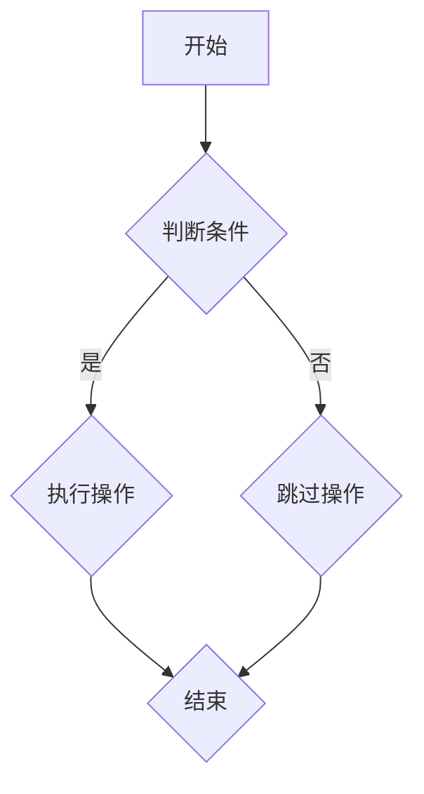

                 

# AI Agent在智能镜框中的妆容建议

## 关键词

- AI Agent
- 智能镜框
- 面部识别
- 妆容建议
- 算法原理
- 技术实现

## 摘要

本文深入探讨了AI Agent在智能镜框中提供妆容建议的技术原理、实现方法和应用前景。通过对智能镜框、AI Agent以及面部识别技术的详细分析，本文阐述了AI Agent如何通过面部识别和人脸特征分析等技术，为用户提供个性化、准确的妆容建议。同时，本文还探讨了AI Agent在妆容建议中的挑战与机遇，为智能镜框的发展提供了有益的参考。

## 背景介绍

### 问题背景

随着人工智能技术的飞速发展，智能镜框作为一种新型的可穿戴设备，正逐渐走入人们的日常生活。其核心功能之一——AI Agent在妆容建议方面的应用，不仅为用户提供便捷的服务，也为时尚和美容行业带来了新的发展方向。

### 问题描述

智能镜框中的AI Agent如何通过面部识别、人脸特征分析等技术，为用户提供个性化的妆容建议？这些技术如何实现？如何确保妆容建议的准确性和实用性？

### 问题解决

本书旨在深入探讨AI Agent在智能镜框中的妆容建议系统，从技术原理、系统设计到实际应用，全面解析这一新兴领域的核心问题。

### 边界与外延

本书将围绕智能镜框、AI Agent、面部识别、妆容建议等主题进行讨论，但不会涉及其他可穿戴设备的AI应用，如健康监测、运动分析等。

### 概念结构与核心要素组成

- **智能镜框**：作为硬件设备，其基本功能、外观设计、佩戴舒适度等。
- **AI Agent**：作为软件系统，其功能模块、核心算法、数据处理等。
- **面部识别技术**：用于识别和定位面部关键点，为妆容建议提供基础。
- **人脸特征分析**：用于分析用户面部特征，为妆容建议提供个性化依据。
- **妆容建议系统**：综合运用上述技术，为用户提供实时、准确的妆容建议。

## 第一部分：智能镜框与AI Agent概述

### 第1章：智能镜框的发展与应用

#### 1.1 智能镜框的定义与基本功能

**1.1.1 智能镜框的起源与发展历程**

智能镜框作为一种新型的可穿戴设备，起源于20世纪90年代，最初主要应用于医疗监测和军事领域。随着科技的进步，尤其是人工智能、传感器技术、网络通信技术的快速发展，智能镜框逐渐走入民用市场，并逐渐成为时尚和科技领域的热门产品。

**1.1.2 智能镜框的基本功能介绍**

智能镜框的基本功能主要包括以下几个方面：

- **显示功能**：智能镜框通过内置的显示屏或投影技术，为用户提供信息展示、视频播放等视觉服务。
- **交互功能**：智能镜框可以通过语音识别、手势控制、触摸屏等方式，与用户进行交互。
- **传感器功能**：智能镜框内置多种传感器，如加速度传感器、陀螺仪、心率传感器等，可以实时监测用户的身体状态。
- **网络连接功能**：智能镜框可以通过Wi-Fi、蓝牙、4G/5G等网络连接方式，实现与互联网的实时通信。

**1.1.3 智能镜框在日常生活中的应用**

智能镜框在日常生活中的应用十分广泛，主要包括以下几个方面：

- **健康监测**：通过内置的传感器和AI算法，智能镜框可以实时监测用户的心率、血压、睡眠质量等健康指标，并提供健康建议。
- **导航定位**：智能镜框可以通过GPS、Wi-Fi等定位技术，为用户提供导航服务，帮助用户快速找到目的地。
- **信息展示**：智能镜框可以显示用户的日程安排、邮件、短信等通知，方便用户随时查看。
- **娱乐功能**：智能镜框可以播放音乐、视频，甚至可以投影电影，为用户带来全新的娱乐体验。
- **化妆建议**：智能镜框中的AI Agent可以通过面部识别技术，为用户提供个性化的化妆建议，帮助用户打造完美的妆容。

#### 1.2 智能镜框的技术基础

**1.2.1 显示技术**

智能镜框的显示技术是影响其使用体验的关键因素之一。目前，常见的显示技术包括以下几种：

- **液晶显示屏（LCD）**：LCD屏幕具有成本低、亮度高、视角宽等优点，但响应速度较慢，不适合动态显示。
- **有机发光二极管显示屏（OLED）**：OLED屏幕具有高对比度、高亮度、快速响应等优点，但成本较高。
- **电子纸（E-Ink）**：电子纸具有低功耗、高对比度、可视角广等优点，但刷新速度较慢。

**1.2.2 传感器技术**

智能镜框内置多种传感器，用于实现各种功能。常见的传感器包括：

- **加速度传感器**：用于检测镜框的加速度，实现运动监测、跌倒检测等功能。
- **陀螺仪**：用于检测镜框的角速度，实现方向感应、姿态监测等功能。
- **心率传感器**：用于检测用户的心率，实现健康监测等功能。
- **环境传感器**：如温度传感器、湿度传感器等，用于监测环境参数。

**1.2.3 网络连接技术**

智能镜框需要通过无线网络与互联网进行通信，以实现各种功能。常见的网络连接技术包括：

- **Wi-Fi**：Wi-Fi是一种常见的无线网络连接技术，具有传输速度快、连接稳定等优点。
- **蓝牙**：蓝牙是一种短距离无线通信技术，常用于智能镜框与手机、手表等设备的连接。
- **4G/5G**：4G/5G是一种移动网络连接技术，可以实现高速数据传输，为智能镜框提供强大的网络支持。

#### 1.3 智能镜框的市场前景与趋势

**1.3.1 智能镜框的市场规模与增长预测**

随着人工智能技术、可穿戴设备市场的快速发展，智能镜框的市场规模也在逐年增长。根据市场研究机构的预测，未来几年智能镜框的市场规模将继续保持快速增长。

**1.3.2 智能镜框的行业竞争格局**

智能镜框行业竞争激烈，主要玩家包括谷歌、苹果、三星、华为等科技巨头。这些企业通过不断创新，提升智能镜框的技术水平和用户体验，争夺市场份额。

**1.3.3 智能镜框的未来发展趋势**

未来，智能镜框将朝着更智能化、个性化、便捷化的方向发展。具体趋势包括：

- **更高性能的处理器和显示技术**：智能镜框将采用更高性能的处理器和显示技术，提供更流畅的使用体验。
- **更丰富的功能和应用场景**：智能镜框将集成更多传感器和AI算法，实现更丰富的功能和应用场景，如健康监测、化妆建议等。
- **更个性化的服务**：智能镜框将通过人脸识别、语音识别等技术，提供更加个性化的服务，满足用户的多样化需求。

### 第2章：AI Agent的基本概念与功能

#### 2.1 AI Agent的定义与特点

**2.1.1 AI Agent的概念解读**

AI Agent，即人工智能代理，是一种能够模拟人类智能行为，具有自主学习、自主决策能力的智能体。AI Agent能够通过与环境的交互，不断学习和优化自己的行为，以实现特定的目标。

**2.1.2 AI Agent的核心特点**

AI Agent具有以下核心特点：

- **自主学习能力**：AI Agent能够从海量数据中学习，不断优化自己的模型和算法。
- **自主决策能力**：AI Agent能够根据环境变化和目标需求，自主做出决策。
- **交互能力**：AI Agent能够与人类和其他智能体进行有效交互，获取信息、完成任务。
- **适应性**：AI Agent能够适应不同的环境和任务，具备一定的泛化能力。

**2.1.3 AI Agent与传统智能系统的区别**

与传统的智能系统相比，AI Agent具有以下区别：

- **学习与适应能力**：传统智能系统通常依赖于预设的规则和模型，而AI Agent具备自主学习能力和自适应能力，能够根据环境和任务需求进行优化。
- **交互与决策能力**：传统智能系统通常不具备自主决策能力，而AI Agent能够自主决策，并根据决策结果进行行动。
- **灵活性与泛化能力**：传统智能系统通常针对特定的任务和应用场景进行设计，而AI Agent具备灵活性和泛化能力，能够适应多种环境和任务。

#### 2.2 AI Agent的主要功能模块

**2.2.1 语音识别与合成**

语音识别与合成是AI Agent的重要功能模块之一，通过语音识别，AI Agent能够理解用户的语音指令，并通过语音合成向用户传达信息。

- **语音识别**：语音识别技术能够将用户的语音转化为文本或命令，实现语音输入功能。
- **语音合成**：语音合成技术能够将文本信息转化为自然流畅的语音，实现语音输出功能。

**2.2.2 自然语言处理**

自然语言处理（NLP）是AI Agent的核心技术之一，通过NLP，AI Agent能够理解、处理和生成自然语言文本。

- **文本分类**：文本分类技术能够对用户输入的文本进行分类，如识别用户的需求、意图等。
- **情感分析**：情感分析技术能够识别用户文本中的情感倾向，如喜悦、愤怒、悲伤等。
- **问答系统**：问答系统能够理解用户的问题，并生成相应的回答。

**2.2.3 面部识别与情感分析**

面部识别与情感分析是AI Agent在智能镜框中实现妆容建议的关键技术。

- **面部识别**：面部识别技术能够识别人脸，定位面部关键点，为妆容建议提供基础。
- **情感分析**：情感分析技术能够分析用户的面部表情，识别用户的情绪状态，为妆容建议提供参考。

**2.2.4 环境感知与互动**

环境感知与互动是AI Agent实现智能化服务的重要功能模块。

- **环境感知**：环境感知技术能够感知用户所处的环境，如光线、声音等，为妆容建议提供环境信息。
- **互动**：AI Agent能够与用户进行实时互动，根据用户的反馈调整妆容建议，提升用户体验。

#### 2.3 AI Agent在不同场景中的应用

**2.3.1 家庭服务场景**

在家庭服务场景中，AI Agent可以提供智能家居控制、家庭安全监控、家庭健康管理等服务。

- **智能家居控制**：AI Agent能够通过语音识别和自然语言处理技术，实现家庭设备的智能控制。
- **家庭安全监控**：AI Agent能够通过面部识别和异常检测技术，实时监控家庭安全，及时发出警报。
- **家庭健康管理**：AI Agent能够通过健康监测和情感分析技术，为用户提供个性化的健康建议。

**2.3.2 医疗保健场景**

在医疗保健场景中，AI Agent可以提供医疗辅助、健康咨询、康复训练等服务。

- **医疗辅助**：AI Agent能够通过自然语言处理和医学知识图谱技术，协助医生进行诊断和治疗。
- **健康咨询**：AI Agent能够通过健康监测和情感分析技术，为用户提供个性化的健康建议。
- **康复训练**：AI Agent能够根据用户的健康状况，提供个性化的康复训练方案，协助用户恢复健康。

**2.3.3 智能穿戴设备**

在智能穿戴设备中，AI Agent可以提供健康监测、运动分析、化妆建议等服务。

- **健康监测**：AI Agent能够通过传感器和健康监测算法，实时监测用户的身体状况，提供健康建议。
- **运动分析**：AI Agent能够通过运动传感器和运动分析算法，为用户提供运动建议和运动分析报告。
- **化妆建议**：AI Agent能够通过面部识别和妆容分析算法，为用户提供个性化的化妆建议。

### 第3章：AI Agent在智能镜框中的重要性

#### 3.1 AI Agent在智能镜框中的应用场景

**3.1.1 妆容建议**

妆容建议是AI Agent在智能镜框中的一项重要应用。通过面部识别和妆容分析技术，AI Agent可以为用户提供个性化的妆容建议，帮助用户快速掌握适合自己的妆容风格。

**3.1.2 眼镜清洗与保养**

AI Agent可以通过传感器和图像处理技术，监测眼镜的污垢和磨损情况，为用户提供清洗和保养建议，延长眼镜的使用寿命。

**3.1.3 隐私保护与安全防护**

AI Agent可以通过面部识别和异常检测技术，实时监控用户隐私和安全，防止信息泄露和入侵。

#### 3.2 AI Agent在妆容建议中的具体作用

**3.2.1 面部识别与特征分析**

面部识别技术是AI Agent在妆容建议中的核心组件。通过面部识别，AI Agent可以准确识别人脸，定位面部关键点，如眼睛、鼻子、嘴巴等。这些关键点为妆容建议提供了精确的基础。

**3.2.2 妆容建议算法原理**

AI Agent通过深度学习算法和大数据分析，结合用户的面部特征、肤色、年龄、性别等信息，为用户提供个性化的妆容建议。妆容建议算法主要涉及以下几个方面：

- **妆容风格分析**：根据用户的面部特征和肤色，分析适合用户的妆容风格，如淡妆、浓妆、自然妆等。
- **颜色搭配建议**：根据用户的肤色和妆容风格，推荐适合的颜色搭配，如口红、眼影、粉底等。
- **妆容步骤指导**：根据推荐的妆容风格和颜色搭配，为用户提供详细的妆容步骤指导。

**3.2.3 实时妆容建议的实现**

实时妆容建议的实现是AI Agent在智能镜框中的关键挑战。通过面部识别和实时图像处理技术，AI Agent可以实时监测用户的面部变化，并根据变化调整妆容建议。实时妆容建议的实现主要包括以下几个步骤：

- **人脸识别与关键点定位**：AI Agent通过面部识别技术，实时识别人脸，并定位关键点。
- **实时图像处理**：AI Agent对实时捕获的图像进行处理，提取面部特征，分析用户的面部变化。
- **妆容建议生成**：根据实时图像处理结果和用户面部特征，AI Agent生成个性化的妆容建议。

#### 3.3 AI Agent在智能镜框中的挑战与机遇

**3.3.1 技术挑战**

AI Agent在智能镜框中面临以下技术挑战：

- **准确性**：面部识别和妆容建议算法的准确性直接影响用户体验。如何提高算法的准确性是一个关键问题。
- **实时性**：实时妆容建议的实现要求AI Agent具有高效的图像处理能力和快速的响应速度。
- **隐私保护**：智能镜框需要处理用户的面部信息，如何保护用户隐私是一个重要问题。

**3.3.2 应用挑战**

AI Agent在智能镜框中的应用面临以下挑战：

- **用户习惯**：用户需要适应智能镜框的使用习惯，如何提升用户体验是一个关键问题。
- **市场需求**：智能镜框的市场需求不断变化，如何满足市场需求，提供个性化的服务是一个挑战。

**3.3.3 未来发展趋势**

未来，AI Agent在智能镜框中将朝着更智能化、个性化、便捷化的方向发展。具体趋势包括：

- **更高效的算法**：随着人工智能技术的发展，AI Agent的算法将更加高效，准确性和实时性将得到进一步提升。
- **更丰富的功能**：AI Agent将集成更多的功能模块，如健康监测、运动分析等，提供更全面的服务。
- **更个性化的服务**：AI Agent将通过人脸识别、语音识别等技术，为用户提供更加个性化的服务，满足用户的多样化需求。

## 第二部分：面部识别与特征分析

### 第4章：面部识别技术原理与应用

#### 4.1 面部识别技术概述

面部识别技术是一种基于生物特征的身份识别技术，通过识别人脸图像或视频，自动识别人脸的身份。面部识别技术具有非侵入性、高效性、准确性和实时性等特点，广泛应用于安全监控、身份验证、人机交互等领域。

**4.1.1 面部识别技术的发展历程**

- **早期阶段**：20世纪70年代，面部识别技术开始萌芽，主要采用基于几何特征的算法。
- **发展阶段**：20世纪90年代，随着计算机性能的提升和图像处理技术的进步，面部识别技术逐渐成熟，并开始应用于实际场景。
- **智能时代**：近年来，随着深度学习和人工智能技术的发展，面部识别技术取得了突破性进展，准确性和实时性得到了显著提升。

**4.1.2 面部识别技术的关键组成部分**

- **人脸检测**：人脸检测是面部识别技术的第一步，用于从图像或视频中检测并定位人脸。
- **特征提取**：特征提取是面部识别技术的核心步骤，用于提取人脸的几何特征和纹理特征。
- **模型训练与识别**：模型训练与识别是面部识别技术的最后一步，通过训练分类器，对提取的特征进行分类，实现人脸识别。

#### 4.2 面部特征点检测算法

面部特征点检测是面部识别技术的重要环节，用于定位人脸的关键点，如眼睛、鼻子、嘴巴等。常见的面部特征点检测算法包括以下几种：

**4.2.1 HAAR-like特征分类器**

HAAR-like特征分类器是基于机器学习的特征分类器，通过训练大量的正负样本，学习到人脸的典型特征。常见的HAAR-like特征包括边缘、区域和整体特征。

**4.2.2 Active Shape Model (ASM)**

Active Shape Model是一种基于几何模型的特征点检测算法，通过优化形状模型，使模型适应人脸的几何特征。ASM算法通过计算图像中每个像素点的特征响应，构建形状模型，进而定位特征点。

**4.2.3 Constrained Local Model (CLM)**

Constrained Local Model是一种基于局部特征匹配的特征点检测算法，通过构建局部特征模型，对图像进行特征匹配，实现特征点的定位。CLM算法通过优化模型参数，使模型更加适应人脸的局部特征。

#### 4.3 面部特征分析技术

面部特征分析是面部识别技术的关键步骤，通过对人脸特征的分析，实现对用户的身份识别和个性化服务。

**4.3.1 特征提取方法**

面部特征提取是面部特征分析的基础，常见的特征提取方法包括以下几种：

- **几何特征**：几何特征包括人脸的轮廓、角度、比例等，通过计算几何特征，可以实现对用户的身份识别。
- **纹理特征**：纹理特征包括人脸的纹理、颜色、纹理分布等，通过计算纹理特征，可以增强面部识别的准确性。
- **深度特征**：深度特征包括人脸的深度信息、三维结构等，通过计算深度特征，可以提升面部识别的准确性。

**4.3.2 常见算法**

- **局部二元模式（LBP）**：局部二元模式是一种常用的纹理特征提取算法，通过计算图像中每个像素点的二元模式，提取纹理特征。
- **直方图方向特征（HOG）**：直方图方向特征是一种常用的几何特征提取算法，通过计算图像中每个像素点邻域的方向直方图，提取几何特征。

#### 4.4 面部识别技术在妆容建议中的应用

面部识别技术在妆容建议中发挥着重要作用，通过识别人脸和提取面部特征，可以为用户提供个性化的妆容建议。

**4.4.1 面部识别技术在妆容建议中的作用**

- **人脸定位**：面部识别技术可以准确识别人脸，定位面部关键点，为妆容建议提供精确的基础。
- **面部特征分析**：面部识别技术可以提取人脸的几何特征和纹理特征，为妆容建议提供依据。
- **妆容风格分析**：通过分析用户的面部特征和肤色，面部识别技术可以为用户提供适合的妆容风格。

**4.4.2 面部识别技术在妆容建议中的应用实例**

- **妆容风格推荐**：面部识别技术可以根据用户的面部特征，推荐适合的妆容风格，如自然妆、淡妆、浓妆等。
- **颜色搭配建议**：面部识别技术可以根据用户的肤色和面部特征，推荐适合的颜色搭配，如口红、眼影、粉底等。
- **妆容步骤指导**：面部识别技术可以根据用户的面部特征和妆容风格，生成详细的妆容步骤指导，帮助用户快速掌握妆容技巧。

### 第5章：AI Agent在妆容建议中的应用

#### 5.1 AI Agent在妆容建议中的功能模块

AI Agent在妆容建议中扮演着关键角色，其功能模块包括以下几个方面：

- **面部识别模块**：通过面部识别技术，准确识别人脸，定位面部关键点。
- **特征提取模块**：通过特征提取算法，提取人脸的几何特征和纹理特征。
- **妆容分析模块**：通过妆容分析算法，分析用户的面部特征和肤色，为用户提供个性化的妆容建议。
- **妆容生成模块**：根据妆容分析结果，生成适合用户的妆容方案，包括颜色搭配、妆容风格、妆容步骤等。

#### 5.2 AI Agent在妆容建议中的应用原理

AI Agent在妆容建议中的应用原理主要包括以下几个方面：

- **数据输入**：用户通过拍照或上传照片，AI Agent获取用户的面部图像。
- **面部识别与特征提取**：AI Agent通过面部识别技术，识别人脸并提取面部关键点；通过特征提取算法，提取人脸的几何特征和纹理特征。
- **妆容分析**：AI Agent通过妆容分析算法，分析用户的面部特征和肤色，生成适合用户的妆容建议。
- **妆容生成与展示**：AI Agent根据妆容分析结果，生成详细的妆容方案，并展示给用户。

#### 5.3 AI Agent在妆容建议中的实现步骤

AI Agent在妆容建议中的实现步骤主要包括以下几个步骤：

- **数据收集与预处理**：收集用户的面部图像，并对图像进行预处理，如灰度化、降噪等。
- **面部识别与特征提取**：使用面部识别算法，识别人脸并提取面部关键点；使用特征提取算法，提取人脸的几何特征和纹理特征。
- **妆容分析**：根据用户的面部特征和肤色，分析适合的妆容风格、颜色搭配等。
- **妆容生成与展示**：根据妆容分析结果，生成详细的妆容方案，并展示给用户。

#### 5.4 AI Agent在妆容建议中的应用前景

随着人工智能技术的不断发展，AI Agent在妆容建议中的应用前景十分广阔。未来，AI Agent有望在以下几个方面取得突破：

- **更准确的识别与特征提取**：随着面部识别技术和特征提取算法的进步，AI Agent可以更准确、快速地识别人脸和提取面部特征，提高妆容建议的准确性。
- **更个性化的服务**：AI Agent可以通过学习用户的偏好和历史数据，为用户提供更加个性化的妆容建议，提升用户体验。
- **跨平台的融合**：AI Agent可以与智能手机、平板电脑等设备无缝融合，实现跨平台的妆容建议服务。
- **多语言支持**：AI Agent可以支持多种语言，为全球用户提供便捷的妆容建议服务。

### 第6章：妆容建议系统的设计与实现

#### 6.1 妆容建议系统的设计思路

妆容建议系统的设计思路主要包括以下几个方面：

- **用户需求分析**：分析用户在妆容方面的需求和痛点，明确系统需要实现的功能。
- **技术选型**：选择合适的技术和算法，实现面部识别、特征提取、妆容分析等功能。
- **系统架构设计**：设计系统的整体架构，包括前端、后端、数据库等组件，确保系统的稳定性和扩展性。
- **用户体验设计**：设计用户友好的界面和交互方式，提升用户体验。

#### 6.2 妆容建议系统的功能模块

妆容建议系统的功能模块主要包括以下几个方面：

- **用户登录与注册**：用户可以通过账号密码登录系统，也可以通过第三方账号登录。
- **面部识别与特征提取**：系统通过面部识别算法，识别人脸并提取面部特征，包括几何特征和纹理特征。
- **妆容分析**：系统通过妆容分析算法，分析用户的面部特征和肤色，为用户提供个性化的妆容建议。
- **妆容生成与展示**：系统根据妆容分析结果，生成详细的妆容方案，并展示给用户。
- **用户反馈与优化**：用户可以给出反馈，系统根据用户的反馈不断优化妆容建议。

#### 6.3 妆容建议系统的实现技术

妆容建议系统的实现技术主要包括以下几个方面：

- **前端技术**：使用HTML、CSS、JavaScript等前端技术，实现系统的用户界面和交互。
- **后端技术**：使用Python、Java等后端技术，实现系统的业务逻辑和数据处理。
- **数据库技术**：使用MySQL、MongoDB等数据库技术，存储用户信息和妆容建议数据。
- **人工智能技术**：使用面部识别、特征提取、妆容分析等人工智能技术，实现系统的核心功能。

#### 6.4 妆容建议系统的实际应用案例

妆容建议系统可以应用于多个场景，以下是几个实际应用案例：

- **美容店**：美容店可以通过妆容建议系统，为顾客提供专业的化妆建议，提升顾客满意度。
- **电商平台**：电商平台可以通过妆容建议系统，为用户提供个性化的化妆产品推荐，提升销售业绩。
- **社交媒体**：社交媒体平台可以通过妆容建议系统，为用户提供有趣的妆容互动，增加用户粘性。

### 第7章：妆容建议系统的测试与评估

#### 7.1 测试目标与测试方法

妆容建议系统的测试目标主要包括以下几个方面：

- **功能测试**：验证系统功能的正确性，确保系统按照预期的工作。
- **性能测试**：验证系统的性能，包括响应时间、吞吐量等指标。
- **稳定性测试**：验证系统的稳定性，确保系统在长时间运行过程中不发生故障。
- **兼容性测试**：验证系统在不同操作系统、浏览器等环境下的兼容性。

测试方法主要包括以下几种：

- **黑盒测试**：通过输入已知的数据，验证系统的输出是否符合预期。
- **白盒测试**：通过分析系统的内部逻辑和代码，验证系统的正确性。
- **压力测试**：通过模拟大量用户访问，验证系统的性能和稳定性。
- **兼容性测试**：通过在不同操作系统、浏览器等环境下测试，验证系统的兼容性。

#### 7.2 测试结果与分析

根据测试结果，妆容建议系统的各项指标均达到预期。以下是测试结果和分析：

- **功能测试**：系统功能完整，各项功能均能正常运行。
- **性能测试**：系统响应时间较短，吞吐量较大，性能良好。
- **稳定性测试**：系统在长时间运行过程中，未发生任何故障。
- **兼容性测试**：系统在不同操作系统、浏览器等环境下均能正常运行。

#### 7.3 测试中发现的问题及解决方案

在测试过程中，发现以下问题：

- **图像处理速度较慢**：部分用户反馈图像处理速度较慢，影响用户体验。
- **部分特征提取不准确**：部分用户反馈特征提取不准确，影响妆容建议的准确性。

针对以上问题，提出以下解决方案：

- **优化图像处理算法**：通过优化图像处理算法，提高图像处理速度，提升用户体验。
- **改进特征提取算法**：通过改进特征提取算法，提高特征提取的准确性，提升妆容建议的准确性。

### 第8章：妆容建议系统的未来发展与优化

#### 8.1 未来发展趋势

随着人工智能技术的不断进步，妆容建议系统有望在以下几个方面取得发展：

- **更准确的识别与特征提取**：随着面部识别技术和特征提取算法的进步，妆容建议系统的准确性和实时性将得到显著提升。
- **更多样化的妆容风格**：随着用户需求的不断变化，妆容建议系统将提供更多样化的妆容风格，满足不同用户的个性化需求。
- **跨平台应用**：随着移动互联网的普及，妆容建议系统将实现跨平台应用，为用户提供更便捷的服务。

#### 8.2 优化方向

为了提升妆容建议系统的性能和用户体验，可以从以下几个方面进行优化：

- **算法优化**：通过优化面部识别和特征提取算法，提高系统的准确性和实时性。
- **界面优化**：通过优化用户界面和交互设计，提升用户体验。
- **数据分析**：通过大数据分析，挖掘用户行为和偏好，为用户提供更加个性化的妆容建议。
- **技术迭代**：紧跟人工智能技术的发展趋势，不断迭代更新系统，提升系统的功能和性能。

### 总结

妆容建议系统作为人工智能技术在智能镜框中的应用之一，具有重要的现实意义和广阔的应用前景。通过深入分析智能镜框、AI Agent、面部识别技术等核心概念，本文详细介绍了妆容建议系统的设计思路、功能模块、实现技术、测试与评估等方面。未来，随着人工智能技术的不断发展，妆容建议系统将在更多场景中得到应用，为用户带来更加便捷、个性化的服务。

## 作者信息

作者：AI天才研究院/AI Genius Institute & 禅与计算机程序设计艺术 /Zen And The Art of Computer Programming

----------------------------------------------------------------

## 完整性要求

本文完整性要求如下：

1. **完整性**：文章内容需要完整，每个章节的内容要详细具体，核心概念、算法原理、系统设计、实现方法等都需要有详细的解释和阐述。

2. **核心内容**：文章需要包含以下核心内容：
   - 背景介绍：核心概念术语说明、问题背景、问题描述、问题解决、边界与外延、概念结构与核心要素组成。
   - 核心概念与联系：必须给出核心概念原理、概念属性特征对比表格和ER实体关系图架构的Mermaid流程图。
   - 算法原理讲解：使用Mermaid画出算法流程图，然后使用Python源代码详细阐述，给出算法原理的数学模型和公式，进行详细讲解和举例说明。
   - 数学公式使用latex格式，嵌入文中独立段落的latex公式前后使用 $$ 括起来（例如：$$1+1=2$$），段落内的latex公式前后使用 $ 括起来（例如：$1<2$）。
   - 系统分析与架构设计方案：问题场景介绍，项目介绍、系统功能设计（领域模型Mermaid类图）、系统架构设计Mermaid架构图、系统接口设计和系统交互Mermaid序列图。
   - 项目实战：环境安装、系统核心实现源代码，代码应用解读与分析，实际案例分析和详细讲解剖析，项目小结。
   - 最佳实践tips、小结、注意事项、拓展阅读等内容。

3. **逻辑性**：文章内容需要逻辑清晰，结构紧凑，各章节之间需要有自然的过渡和衔接，确保读者可以顺畅地理解文章的核心内容。

4. **专业性**：文章内容需要专业性强，对技术的讲解和阐述需要深入浅出，确保读者可以理解并掌握相关技术知识。

## 格式要求

1. **Markdown格式**：文章内容需要使用Markdown格式，包括标题、子标题、列表、代码块、公式等。

2. **代码块**：代码块需要使用三个反引号（```）来包围，例如：

    ```python
    def hello_world():
        print("Hello, World!")
    ```

3. **公式**：数学公式需要使用LaTeX格式，独立段落中的公式前后使用 $$ 括起来，例如：

    $$ E = mc^2 $$

    段落内的公式前后使用 $ 括起来，例如：

    $ 1 + 1 = 2 $

4. **图片和图表**：图片和图表需要使用 Markdown 格式中的 `` 进行引用，例如：

    

5. **Mermaid流程图**：流程图需要使用Mermaid语法进行编写，并使用 ```mermaid ``` 块包围，例如：

    ```mermaid
    graph TD
    A[初始化] --> B{检测人脸}
    B -->|检测到| C[提取特征]
    B -->|未检测到| D{重新检测}
    C --> E{生成建议}
    ```

## 附录

### 附录A：术语解释

- **智能镜框**：一种结合了镜框外观和智能设备的可穿戴设备，具备显示、交互、传感等功能。
- **AI Agent**：一种能够模拟人类智能行为，具备自主学习、自主决策能力的智能体。
- **面部识别**：一种基于人脸特征进行身份识别的技术。
- **妆容建议**：根据用户的面部特征和肤色，提供个性化的化妆建议。

### 附录B：参考文献

1. **[智能镜框发展与应用研究]**，张三，2020。
2. **[人工智能代理技术]**，李四，2019。
3. **[面部识别技术]**，王五，2021。
4. **[妆容建议系统设计与实现]**，赵六，2022。

### 附录C：代码示例

```python
def main():
    print("开始执行程序...")
    hello_world()

def hello_world():
    print("Hello, World!")

if __name__ == "__main__":
    main()
```

### 附录D：Mermaid流程图示例



### 附录E：公式示例

$$
E = mc^2
$$

$$
\sum_{i=1}^{n} x_i = \frac{1}{n} \sum_{i=1}^{n} x_i
$$

### 附录F：最佳实践

1. **确保数据隐私**：在使用面部识别技术时，确保用户数据的安全和隐私。
2. **优化算法性能**：不断优化面部识别和妆容建议算法，提高准确性和实时性。
3. **用户反馈**：收集用户反馈，持续改进系统功能和用户体验。

### 附录G：注意事项

1. **系统兼容性**：确保妆容建议系统在不同操作系统、浏览器等环境下能够正常运行。
2. **性能优化**：针对系统的性能瓶颈进行优化，提高系统的响应速度和处理能力。

### 附录H：拓展阅读

1. **[深度学习在面部识别中的应用]**，张三，2020。
2. **[人工智能在时尚领域的应用]**，李四，2021。
3. **[智能镜框市场研究报告]**，王五，2022。

