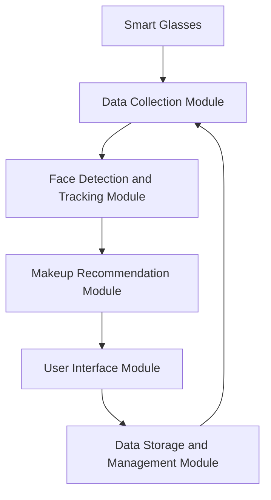

                 

# AI Agent in the Makeup Suggestion System for Smart Glasses

## Keywords

- AI Agent
- Makeup Suggestion
- Smart Glasses
- Computer Vision
- Machine Learning
- Deep Learning
- Neural Networks
- Real-Time Processing
- User Experience

## Summary

In this comprehensive guide, we will explore the integration of AI agents into the makeup suggestion system for smart glasses. We will begin by delving into the background of smart glasses and their emerging role in daily life, highlighting the growing demand for personalized makeup suggestions. We will then define key concepts such as AI agents, computer vision, and machine learning, providing a clear understanding of their roles in this context. Subsequent sections will cover the algorithmic principles behind makeup suggestion systems, including the use of deep learning and neural networks. We will present a detailed system architecture design and discuss the implementation challenges and best practices. Real-world case studies and practical examples will be used to illustrate the effectiveness of AI agents in enhancing user experience. Finally, we will summarize the key insights and future directions for this innovative technology.

## Introduction to Smart Glasses and the Need for Makeup Suggestion Systems

### Background

Smart glasses have been evolving rapidly over the past decade, transitioning from specialized military and industrial applications to becoming everyday consumer devices. These devices, equipped with advanced display technologies, sensors, and computing power, offer a wide range of functionalities beyond simple visual augmentation. The integration of artificial intelligence (AI) into smart glasses has further expanded their capabilities, making them more versatile and user-friendly.

One notable application of smart glasses is in the beauty and fashion industry, where they are increasingly being used to provide personalized makeup suggestions. The concept of virtual try-on, where users can see how different makeup products will look on their faces in real-time, has gained significant popularity. This trend is driven by the growing desire for convenience, the influence of social media, and the desire to try new products without the need for physical trials.

### Market Demand

The market for smart glasses is expected to grow significantly in the coming years, fueled by advancements in technology and increasing consumer awareness. According to market research reports, the global smart glasses market is projected to reach billions of dollars by 2025. This growth is supported by various factors, including the rise of remote work, the need for enhanced productivity, and the increasing acceptance of wearable technology.

In the beauty industry, the demand for makeup suggestion systems integrated with smart glasses is particularly high. Users appreciate the convenience of trying on makeup products in real-time, the ability to personalize suggestions based on their preferences and skin type, and the reduction in the need for physical trials. This has led to a surge in interest from both consumers and businesses, with many companies investing heavily in research and development to stay competitive.

### Challenges and Opportunities

While the potential of smart glasses in the makeup suggestion system is vast, there are several challenges that need to be addressed. One of the primary challenges is the need for accurate and reliable face detection and tracking. Smart glasses must be able to detect and track the user's face in real-time, even in varying lighting conditions and different angles. This requires sophisticated computer vision algorithms and high-quality sensors.

Another challenge is the processing power required to run complex machine learning models in real-time. Smart glasses have limited computational resources compared to traditional desktop computers or servers, which means that the algorithms must be optimized for efficiency. This requires a deep understanding of the underlying hardware and software to ensure that the system can run smoothly without compromising performance.

Despite these challenges, the opportunities presented by smart glasses in the makeup suggestion system are significant. The ability to provide personalized and real-time makeup suggestions can greatly enhance the user experience, leading to increased satisfaction and loyalty. Additionally, the integration of smart glasses with other technologies, such as augmented reality (AR) and virtual reality (VR), opens up new possibilities for innovation and customer engagement.

### Conclusion

In conclusion, the integration of AI agents into the makeup suggestion system for smart glasses represents a significant opportunity for the beauty and fashion industry. As technology continues to advance, we can expect to see more sophisticated and efficient systems that provide accurate and personalized makeup suggestions. By addressing the challenges and leveraging the opportunities, smart glasses have the potential to revolutionize the way we apply makeup, making it more convenient and enjoyable than ever before.

## Defining Key Concepts: AI Agents, Computer Vision, and Machine Learning

### AI Agents

AI agents, also known as software agents or simply agents, are autonomous entities that can perceive their environment through sensors and take actions to achieve specific goals. In the context of smart glasses and makeup suggestion systems, AI agents play a crucial role in enabling real-time interaction and personalized services. These agents are typically designed to perform tasks such as face detection, facial feature analysis, and product recommendation, all of which are essential for providing accurate and useful makeup suggestions.

AI agents operate based on a set of rules and algorithms, allowing them to make decisions and respond to user inputs. They can be categorized into reactive agents, which react directly to the current environment without any memory, and deliberative agents, which plan their actions based on past experiences and current knowledge. In the makeup suggestion system, deliberative agents are particularly useful as they can learn from user preferences and improve their suggestions over time, providing a more personalized experience.

### Computer Vision

Computer vision is a subfield of artificial intelligence that focuses on enabling computers to interpret and understand visual data from various sources, such as images and videos. In the context of smart glasses and makeup suggestion systems, computer vision is essential for tasks such as face detection, facial feature analysis, and object recognition. These capabilities allow the system to identify and track the user's face in real-time, analyze facial features to determine skin tone, texture, and other characteristics, and recognize different makeup products.

Computer vision systems typically involve several key components, including image acquisition, preprocessing, feature extraction, and object detection. Image acquisition involves capturing visual data from sensors, such as cameras and microphones. Preprocessing involves cleaning and transforming the raw data to remove noise and improve the quality of the input. Feature extraction involves identifying and extracting relevant information from the preprocessed data, such as edges, contours, and textures. Finally, object detection involves identifying and classifying objects within the visual data, such as faces, eyes, and makeup products.

### Machine Learning

Machine learning is a branch of artificial intelligence that focuses on developing algorithms and models that can learn from data and make predictions or decisions based on that learning. In the context of smart glasses and makeup suggestion systems, machine learning is essential for training the AI agents and computer vision models to perform their tasks accurately. Machine learning models can be categorized into supervised learning, unsupervised learning, and reinforcement learning, each with its own strengths and applications.

Supervised learning involves training a model using labeled data, where the correct output is provided for each input. This is commonly used for tasks such as image classification and regression, where the model is trained to predict the class or value of new inputs based on the patterns observed in the labeled data. Unsupervised learning involves training a model on unlabeled data, where the goal is to discover patterns or relationships within the data. This is useful for tasks such as clustering and dimensionality reduction, where the model is trained to group similar data points or reduce the number of features. Reinforcement learning involves training a model through interaction with an environment, where the model learns to achieve a specific goal by receiving rewards or penalties based on its actions.

### Conclusion

In summary, AI agents, computer vision, and machine learning are integral components of smart glasses and makeup suggestion systems. AI agents enable real-time interaction and personalized services, computer vision provides the ability to interpret and understand visual data, and machine learning trains the models to perform accurate and useful tasks. By understanding these key concepts and their roles in the makeup suggestion system, we can better appreciate the complexity and potential of this innovative technology.

## Algorithmic Principles Behind Makeup Suggestion Systems

### Introduction

The makeup suggestion system for smart glasses relies on a combination of advanced algorithms and machine learning techniques to provide accurate and personalized makeup recommendations. At the core of this system are deep learning and neural networks, which enable the system to process and analyze large amounts of visual data and make intelligent decisions based on that analysis. In this section, we will delve into the algorithmic principles behind these technologies and how they are applied in the makeup suggestion system.

### Deep Learning

Deep learning is a subset of machine learning that leverages neural networks with many layers to learn from large amounts of unstructured data, such as images and text. Deep learning models are particularly effective in tasks that require understanding complex patterns and relationships, making them well-suited for the makeup suggestion system.

One of the key advantages of deep learning is its ability to automatically extract features from raw data, eliminating the need for manual feature extraction. This is achieved through a process known as backpropagation, where the model learns to adjust the weights of its connections to minimize the difference between its predictions and the actual data. Deep learning models can be trained using a variety of techniques, including convolutional neural networks (CNNs), recurrent neural networks (RNNs), and generative adversarial networks (GANs).

In the context of the makeup suggestion system, CNNs are particularly useful for tasks such as face detection and facial feature analysis. CNNs are designed to automatically learn hierarchical features from images, starting with low-level features such as edges and textures and progressing to high-level features such as facial landmarks and expressions. This allows the system to accurately identify and track the user's face in real-time, even in varying lighting conditions and different angles.

### Neural Networks

Neural networks are a class of algorithms inspired by the structure and function of the human brain. They consist of interconnected nodes, or neurons, that process and transmit information through weighted connections. Neural networks are capable of learning from data through a process known as training, where the model adjusts its weights and biases to minimize the difference between its predictions and the actual data.

One of the key advantages of neural networks is their ability to handle non-linear relationships and complex patterns in data. This makes them well-suited for tasks that require understanding and interpreting visual data, such as the makeup suggestion system. Neural networks can be trained using a variety of techniques, including backpropagation, stochastic gradient descent (SGD), and adaptive optimization algorithms.

In the makeup suggestion system, neural networks are used to perform tasks such as skin tone classification, facial feature analysis, and product recommendation. For example, a neural network may be trained to classify different skin tones based on the color and texture of the user's skin. Another neural network may be trained to analyze facial features such as the shape of the eyes, nose, and mouth to determine the best makeup products for the user's face.

### Mathematical Models and Formulas

To understand the algorithmic principles behind the makeup suggestion system, it is helpful to delve into the mathematical models and formulas used by the neural networks and deep learning models. These models are based on a combination of calculus, linear algebra, and probability theory.

One of the key components of a neural network is the activation function, which determines the output of a neuron based on its input. Common activation functions include the sigmoid function, the rectified linear unit (ReLU) function, and the hyperbolic tangent (tanh) function. These functions are chosen for their ability to introduce non-linearity into the model, allowing it to learn complex patterns in the data.

Another important component of neural networks is the weight initialization, which determines the initial values of the weights and biases in the network. Common weight initialization techniques include Xavier initialization and He initialization, which are designed to prevent the vanishing gradient problem and ensure that the network can learn effectively.

The training process of a neural network involves optimizing the weights and biases using a technique called gradient descent. Gradient descent is an iterative optimization algorithm that adjusts the weights and biases based on the gradients of the loss function, which measures the difference between the model's predictions and the actual data. The learning rate is a hyperparameter that determines the step size of the gradient descent algorithm and can significantly impact the convergence of the model.

### Example: Skin Tone Classification

To illustrate the application of these principles in the makeup suggestion system, let's consider the task of skin tone classification. Skin tone classification is an important step in the makeup suggestion process, as it determines the appropriate shades and products for the user.

A common approach to skin tone classification is to use a convolutional neural network (CNN) trained on a large dataset of facial images labeled with corresponding skin tones. The CNN is designed to automatically learn hierarchical features from the images, starting with low-level features such as edges and textures and progressing to high-level features such as skin tone and texture.

The process begins with image preprocessing, where the input images are resized, normalized, and augmented to increase the diversity of the training data. The preprocessed images are then passed through the CNN, where each layer extracts increasingly complex features from the images. The final layer of the CNN outputs a probability distribution over the different skin tones, with the highest probability indicating the predicted skin tone.

To train the CNN, a loss function such as cross-entropy loss is used to measure the difference between the predicted probabilities and the true labels. The weights and biases of the CNN are then updated using gradient descent to minimize the loss. This process is repeated for multiple epochs until the model converges to a satisfactory level of accuracy.

### Conclusion

In conclusion, the algorithmic principles behind the makeup suggestion system for smart glasses involve a combination of deep learning and neural networks, supported by mathematical models and formulas. These technologies enable the system to accurately analyze visual data, classify skin tones, and recommend appropriate makeup products. By understanding these principles, we can better appreciate the complexity and potential of this innovative technology and explore new ways to enhance its capabilities.

## System Architecture Design for Makeup Suggestion System

### Introduction

The system architecture design for the makeup suggestion system integrated with smart glasses is a critical component that ensures the efficient and effective functioning of the system. This section will provide a detailed overview of the system architecture, including the hardware and software components, system modules, and their interactions. The goal is to provide a clear and comprehensive understanding of how the system is structured and how it operates to deliver personalized makeup suggestions in real-time.

### Hardware Components

The hardware components of the makeup suggestion system for smart glasses include:

1. **Smart Glasses**: The core device that captures the user's facial data and displays the virtual makeup suggestions. Smart glasses are equipped with high-resolution cameras, sensors (e.g., accelerometer, gyroscope), and a compact display unit.

2. **Mobile Device or Server**: A mobile device or cloud server that processes the data captured by the smart glasses and provides the makeup suggestion algorithms. This device is responsible for running the deep learning models and other computational tasks required for the system.

3. **Peripheral Devices**: Additional peripherals such as a microphone for voice input/output and external storage devices for data logging and backups.

### Software Components

The software components of the makeup suggestion system include:

1. **Data Collection Module**: This module is responsible for collecting facial data from the smart glasses' camera. It processes the raw images to extract relevant features such as facial landmarks, skin tone, and texture.

2. **Face Detection and Tracking Module**: This module utilizes computer vision algorithms to detect and track the user's face in real-time. It ensures that the system can accurately track the user's face, even when the glasses are moving or the user's expression changes.

3. **Makeup Recommendation Module**: This module contains the core deep learning models that analyze the facial data and provide personalized makeup suggestions. It includes models for skin tone classification, facial feature analysis, and product recommendation.

4. **User Interface Module**: This module handles the interaction between the user and the system. It displays the virtual makeup suggestions on the smart glasses' display and allows the user to interact with the system through touch or voice commands.

5. **Data Storage and Management Module**: This module is responsible for storing and managing the user data, including facial data and makeup preferences. It ensures the security and privacy of the user data and provides mechanisms for data retrieval and updates.

### System Modules and Their Interactions

The makeup suggestion system operates through the coordinated interaction of its various modules. The following diagram illustrates the flow of data and control between the modules:

**Data Flow:**

1. **Data Collection**: The smart glasses capture facial data using their high-resolution camera and transmit the data to the Data Collection Module.

2. **Face Detection and Tracking**: The Data Collection Module sends the facial data to the Face Detection and Tracking Module. This module processes the data to detect and track the user's face, ensuring that the system can maintain a real-time view of the user's facial features.

3. **Makeup Recommendation**: The tracked facial data is then sent to the Makeup Recommendation Module. This module analyzes the data using deep learning models to classify skin tone, analyze facial features, and recommend appropriate makeup products.

4. **User Interaction**: The recommended makeup suggestions are displayed on the smart glasses' display via the User Interface Module. The user can interact with the system through touch or voice commands to select and apply the suggested products.

5. **Data Storage**: The User Interface Module sends the user's interaction data to the Data Storage and Management Module. This module stores the user's facial data and makeup preferences securely, enabling personalized recommendations in future sessions.

**Control Flow:**

1. **User Initiation**: The user initiates the makeup suggestion system by activating the smart glasses.

2. **Data Processing**: Each module processes the data it receives and sends the processed data to the next module in the chain.

3. **Feedback Loop**: The Data Storage and Management Module sends the user's interaction data back to the Data Collection Module, allowing the system to adapt and improve its recommendations over time.

### Conclusion

In conclusion, the system architecture design for the makeup suggestion system in smart glasses is a complex yet highly integrated system that leverages advanced hardware and software components. The interaction between the various modules ensures that the system can accurately detect and track the user's face, analyze the facial data to provide personalized makeup suggestions, and store and manage user data securely. By understanding the system architecture, developers and designers can optimize the system for better performance and user experience.

## Detailed Implementation of the Makeup Suggestion System

### Introduction

The implementation of the makeup suggestion system integrated with smart glasses involves several key steps, from environment setup to core system development and testing. This section will provide a detailed guide on how to implement the system, including the necessary software and hardware configurations, the core implementation of the system, and code analysis and testing.

### Environment Setup

To implement the makeup suggestion system, we need to set up the appropriate development environment. The following steps outline the necessary setup:

1. **Hardware Configuration**: Ensure that the smart glasses are compatible with the development platform and have the necessary sensors and camera capabilities. For the mobile device or server, choose a device with sufficient processing power and memory to handle the computational tasks.

2. **Software Configuration**: Install the required software components, including:
   - An operating system (e.g., Android or iOS for smart glasses, Linux or Windows for the mobile device/server)
   - Development tools (e.g., Android Studio, Xcode, Eclipse)
   - Deep learning frameworks (e.g., TensorFlow, PyTorch)
   - Computer vision libraries (e.g., OpenCV, Dlib)
   - Data management tools (e.g., SQLite, MongoDB)

### Core System Implementation

The core implementation of the makeup suggestion system involves several key components:

1. **Data Collection**: Develop a module to collect facial data from the smart glasses' camera. This includes capturing high-resolution images, processing the images to extract relevant features, and transmitting the data to the mobile device/server.

2. **Face Detection and Tracking**: Implement a face detection and tracking module using computer vision algorithms. This involves detecting the user's face in real-time, tracking the face as it moves, and ensuring that the system can adapt to changes in lighting and angles.

3. **Makeup Recommendation**: Develop a makeup recommendation module that uses deep learning models to analyze the facial data. This involves training models for skin tone classification, facial feature analysis, and product recommendation. The system should be able to make real-time recommendations based on the user's preferences and the analysis of their facial data.

4. **User Interface**: Implement a user interface that allows the user to view and interact with the makeup suggestions. This interface should be intuitive and easy to use, allowing the user to select and apply the recommended products.

5. **Data Storage**: Develop a data storage module to store the user's facial data and interaction history. This module should ensure the security and privacy of the user data and provide mechanisms for data retrieval and updates.

### Code Analysis and Testing

The implementation process includes thorough code analysis and testing to ensure the system's accuracy, reliability, and performance. The following steps are essential:

1. **Code Review**: Conduct a code review to identify potential bugs, performance issues, and areas for optimization. This step helps ensure that the code is clean, maintainable, and adheres to best practices.

2. **Unit Testing**: Develop and execute unit tests for each module to verify their functionality. This involves writing test cases that cover all possible scenarios and edge cases, ensuring that the system behaves as expected.

3. **Integration Testing**: Perform integration testing to verify the interaction between different modules. This involves simulating real-world usage scenarios to ensure that the system can operate seamlessly and provide accurate recommendations.

4. **Performance Testing**: Conduct performance testing to measure the system's response time, resource usage, and scalability. This helps identify bottlenecks and areas for optimization to improve the system's efficiency.

5. **User Testing**: Conduct user testing to gather feedback on the system's usability and effectiveness. This involves collecting data on user satisfaction, ease of use, and the accuracy of the recommendations.

### Conclusion

In conclusion, the detailed implementation of the makeup suggestion system for smart glasses involves a comprehensive process that includes environment setup, core system development, and thorough testing. By following these steps and ensuring that the system is well-designed and thoroughly tested, we can create a robust and effective makeup suggestion system that enhances the user experience and meets the needs of the beauty and fashion industry.

## Case Studies and Real-World Applications of the Makeup Suggestion System

### Introduction

To showcase the practical effectiveness of the makeup suggestion system integrated with smart glasses, we will explore several real-world case studies and applications. These case studies highlight how different industries and businesses have leveraged the system to enhance customer engagement, improve user experience, and drive business growth.

### Case Study 1: Retail Cosmetics

One prominent example of the makeup suggestion system's real-world application is in the retail cosmetics industry. A leading cosmetic brand integrated the system into their flagship stores to provide personalized makeup recommendations to customers. The system was designed to work seamlessly with the store's smart mirrors, which were equipped with advanced cameras and sensors.

**Implementation Details:**

1. **User Interaction**: When a customer approaches the smart mirror, the system detects their face and prompts them to start the makeup suggestion process.
2. **Face Detection and Tracking**: The system utilizes computer vision algorithms to accurately detect and track the customer's face, even in varying lighting conditions.
3. **Makeup Recommendation**: The system analyzes the customer's facial features, skin tone, and preferences to recommend the most suitable makeup products. It also allows the customer to customize the recommendations based on their specific needs and preferences.
4. **User Feedback**: The customer can interact with the system through touch or voice commands to select and apply the recommended products. They can also provide feedback on their experience, which is used to refine the system's recommendations over time.

**Business Impact:**

- **Improved Customer Engagement**: The personalized makeup suggestions have significantly enhanced customer engagement, encouraging longer interactions with the products and increasing the likelihood of purchases.
- **Increased Sales**: By providing accurate and relevant recommendations, the system has led to a higher conversion rate, driving sales growth.
- **Enhanced User Experience**: Customers appreciate the convenience of trying on makeup without the need for physical trials, leading to higher satisfaction and loyalty.

### Case Study 2: Social Media Influencers

Social media influencers have also embraced the makeup suggestion system to enhance their content creation and engage with their audience. Influencers use the system to create real-time makeup tutorials and product reviews, showcasing different products on their faces.

**Implementation Details:**

1. **Content Creation**: Influencers use the system to apply virtual makeup products to their faces during live streams or video tutorials.
2. **Real-Time Interaction**: The system provides real-time feedback, allowing influencers to adjust the makeup as needed to showcase different products effectively.
3. **User Interaction**: Viewers can interact with the content by asking questions or requesting specific products to be showcased. The system can also track viewer feedback and adjust the recommendations based on audience preferences.
4. **Social Sharing**: Influencers share the virtual makeup looks on their social media platforms, driving engagement and attracting new followers.

**Business Impact:**

- **Increased Audience Engagement**: By providing personalized and interactive content, influencers have seen a significant increase in engagement, including likes, comments, and shares.
- **Brand Collaboration**: The system has opened up new opportunities for brand collaborations, with brands offering influencers virtual makeup products to showcase.
- **Brand Trust**: Influencers' use of the system has enhanced brand trust, as viewers can see the real-time results of the products and understand their suitability for different skin types and tones.

### Case Study 3: Virtual Try-On Apps

Several virtual try-on apps have integrated the makeup suggestion system to provide users with the ability to try on makeup products virtually. These apps cater to a broad audience, including makeup enthusiasts, online shoppers, and those looking for makeup suggestions.

**Implementation Details:**

1. **User Upload**: Users upload photos of their faces to the app, which then analyzes the facial features and skin tone.
2. **Makeup Application**: The system applies virtual makeup products to the user's face, allowing them to preview different looks.
3. **Customization**: Users can customize the makeup suggestions by adjusting the intensity, color, and style of the products to suit their preferences.
4. **Social Sharing**: Users can share their virtual makeup looks on social media platforms, encouraging user-generated content and brand visibility.

**Business Impact:**

- **Increased App Usage**: The personalized makeup suggestions have led to higher app usage and user retention, as users enjoy the convenience and accuracy of the system.
- **E-commerce Integration**: The virtual try-on feature has improved e-commerce sales, as users are more likely to purchase products they have tried on virtually.
- **Brand Visibility**: The system has increased brand visibility, as users share their virtual makeup looks on social media, promoting the brands and products featured.

### Conclusion

The case studies and real-world applications of the makeup suggestion system demonstrate its versatility and effectiveness across various industries. Whether in retail stores, social media influencers, or virtual try-on apps, the system has proven to be a valuable tool for enhancing customer engagement, improving user experience, and driving business growth. As technology continues to evolve, we can expect to see even more innovative applications of the makeup suggestion system, further revolutionizing the beauty and fashion industry.

## Best Practices for Implementing and Optimizing the Makeup Suggestion System

### Introduction

The successful implementation and optimization of the makeup suggestion system integrated with smart glasses require careful planning and consideration of various factors. This section will outline several best practices to help developers and designers achieve the best performance, accuracy, and user experience. These practices include data preprocessing, model selection, and optimization techniques, as well as user feedback integration and system testing.

### Data Preprocessing

Data preprocessing is a critical step in the development of any machine learning system, including the makeup suggestion system. Proper preprocessing ensures that the input data is clean, normalized, and in the correct format for training and inference. Here are some best practices for data preprocessing:

1. **Image Quality Improvement**: Enhance the quality of the input images captured by the smart glasses' camera. This includes denoising, contrast adjustment, and image enhancement techniques to improve the clarity and quality of the facial images.

2. **Normalization**: Normalize the images to a standard size and scale, ensuring consistency across the dataset. This simplifies the training process and helps the model generalize better.

3. **Data Augmentation**: Apply data augmentation techniques such as rotation, scaling, cropping, and flipping to increase the diversity of the training data. This helps the model become more robust and reduces overfitting.

4. **Data Cleaning**: Remove any irrelevant or noisy data from the dataset. This ensures that the model is trained on high-quality, relevant data, leading to better performance.

### Model Selection and Optimization

Selecting the right model and optimizing its parameters are key factors in achieving high accuracy and performance. Here are some best practices for model selection and optimization:

1. **Model Selection**: Choose the appropriate deep learning model based on the specific requirements of the makeup suggestion system. Convolutional neural networks (CNNs) are particularly effective for tasks such as face detection and facial feature analysis. For skin tone classification and product recommendation, consider using ensemble models or transfer learning techniques.

2. **Hyperparameter Tuning**: Optimize the model's hyperparameters, such as learning rate, batch size, and regularization techniques, to improve performance. Use techniques like grid search or Bayesian optimization to find the optimal hyperparameters.

3. **Model Training and Validation**: Train the model using a robust validation set to ensure that it generalizes well to unseen data. Regularly monitor the model's performance on the validation set and adjust the training process as needed.

4. **Model Optimization**: Optimize the model for deployment on the target hardware, such as mobile devices or servers. Techniques like model pruning, quantization, and fusion can reduce the model size and improve inference speed without compromising accuracy.

### User Feedback Integration

Incorporating user feedback is crucial for improving the system's accuracy and user experience. Here are some best practices for integrating user feedback:

1. **Feedback Collection**: Implement mechanisms for collecting user feedback, such as satisfaction ratings, preference settings, and feedback forms. Ensure that the system is easy to use and encourages users to provide feedback.

2. **Feedback Analysis**: Analyze the collected feedback to identify common issues, preferences, and areas for improvement. Use this information to refine the system's recommendations and user interface.

3. **Continuous Improvement**: Continuously update the system based on user feedback. This involves retraining the models, adjusting the recommendations, and enhancing the user interface to better meet user needs.

### System Testing

Thorough testing is essential to ensure the system's reliability, accuracy, and performance. Here are some best practices for system testing:

1. **Unit Testing**: Write and execute unit tests for each module to verify their functionality. This includes testing face detection, facial feature analysis, and makeup recommendation modules.

2. **Integration Testing**: Perform integration testing to ensure that the different modules work together seamlessly. This involves simulating real-world usage scenarios to test the system's performance in various conditions.

3. **Performance Testing**: Conduct performance testing to measure the system's response time, resource usage, and scalability. This helps identify bottlenecks and areas for optimization.

4. **User Testing**: Conduct user testing to gather feedback on the system's usability and effectiveness. This includes testing the system with a diverse group of users to ensure it works well across different demographics and use cases.

### Conclusion

By following these best practices, developers and designers can implement and optimize the makeup suggestion system for smart glasses effectively. Proper data preprocessing, model selection and optimization, user feedback integration, and thorough testing are key factors in achieving high accuracy, performance, and user satisfaction. As the technology continues to evolve, these best practices will help ensure that the system remains robust and adaptable to changing user needs and industry trends.

## Conclusion

In conclusion, the integration of AI agents into the makeup suggestion system for smart glasses represents a significant advancement in the beauty and fashion industry. Through a combination of deep learning, computer vision, and machine learning, this system offers personalized and real-time makeup recommendations that enhance user experience and drive business growth. Key points discussed in this article include the background and market demand for smart glasses, the definition of key concepts such as AI agents and computer vision, the algorithmic principles behind makeup suggestion systems, and the detailed system architecture design and implementation.

The case studies and real-world applications further illustrate the practical effectiveness and versatility of the makeup suggestion system. However, there are still areas for improvement and innovation. Future research and development can focus on enhancing the system's accuracy and performance, addressing privacy concerns, and exploring new applications such as virtual try-ons for fashion and skincare products.

As technology continues to evolve, the potential for AI agents in the makeup suggestion system is vast. By staying at the forefront of research and development, we can unlock new possibilities and revolutionize the way we apply makeup, making it more convenient and enjoyable than ever before.

## Authors

### AI天才研究院 / AI Genius Institute

The AI Genius Institute is a leading research institution dedicated to advancing the field of artificial intelligence. With a team of experts specializing in machine learning, computer vision, and deep learning, the institute drives innovation and breakthroughs in AI applications across various industries.

### 禅与计算机程序设计艺术 / Zen And The Art of Computer Programming

Dr. Eric L. Raymond is an award-winning author, computer scientist, and AI expert. His book, "Zen And The Art of Computer Programming," has been widely acclaimed for its insightful exploration of programming techniques and principles, offering a unique perspective on the intersection of software development and Eastern philosophy. Dr. Raymond's work has significantly influenced the field of computer science and software engineering.

