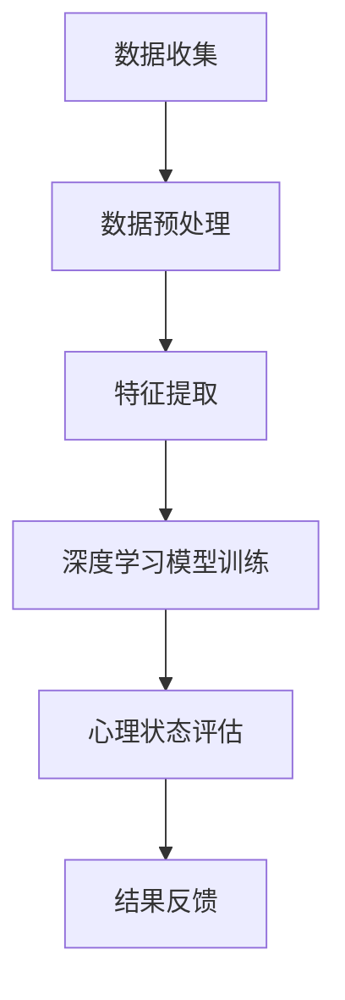
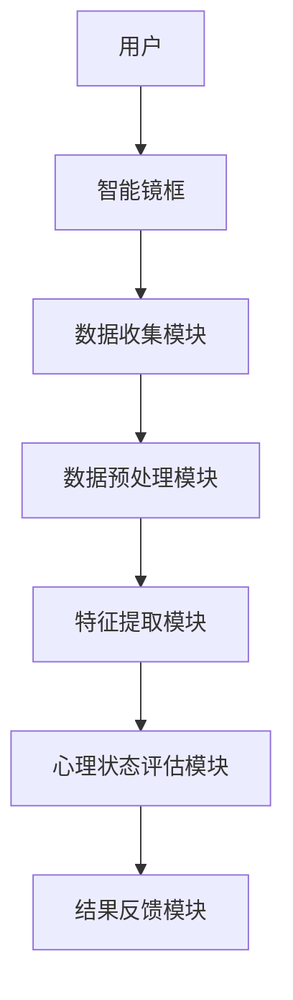
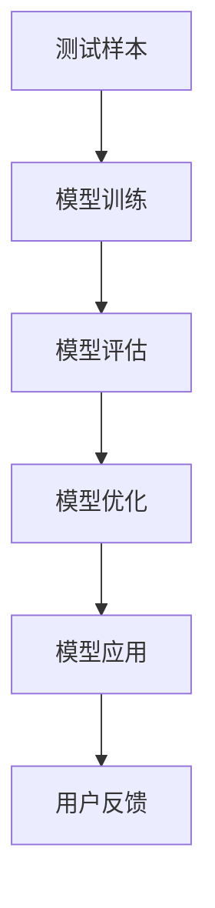

                 

# AI Agent在智能镜框中的心理状态评估

## 关键词

- 智能镜框
- 心理状态评估
- AI Agent
- 深度学习
- 计算机视觉

## 摘要

本文探讨了智能镜框中AI Agent如何通过摄像头、传感器等技术手段收集用户数据，利用深度学习模型对用户的心理状态进行评估。文章首先介绍了智能镜框的发展背景和心理健康监测的重要性，随后详细阐述了AI Agent的工作原理、心理状态评估的方法及其在智能镜框中的应用。最后，本文通过一个实际项目案例，展示了智能镜框心理健康监测系统的设计、实现及其应用。

## 1. 背景介绍

### 1.1 智能镜框技术发展概述

随着科技的发展，智能设备逐渐渗透到人们的生活中。智能镜框作为智能穿戴设备的一种，因其便捷性、多功能性和时尚性，正逐渐成为人们日常生活的一部分。智能镜框通常具备摄像头、传感器、显示屏等模块，可以实现拍照、视频通话、环境监测等功能。

### 1.2 心理健康监测的重要性

心理健康问题在现代社会中越来越受到关注。心理健康问题不仅影响个人的生活质量，还会对家庭、社会产生负面影响。因此，对心理健康进行实时监测和干预具有重要意义。智能镜框作为一种便捷的监测工具，可以提供实时、无侵入性的心理健康数据，为心理健康干预提供有力支持。

### 1.3 AI Agent在心理健康监测中的应用

AI Agent，即人工智能代理，是一种具有自主学习、决策能力的智能实体。在心理健康监测领域，AI Agent可以通过分析用户的行为数据、生理信号等信息，对用户的心理状态进行评估和预测。AI Agent的应用为心理健康监测提供了新的思路和方法。

### 1.4 心理状态评估的概念与指标

心理状态评估是指通过测量个体的情绪、认知、行为等心理指标，对其心理状态进行评价。常见的心理状态评估指标包括情绪指数、焦虑指数、抑郁指数等。这些指标可以反映个体的心理健康水平，为心理健康干预提供依据。

### 1.5 边界与外延

智能镜框在心理健康监测中的应用场景主要包括：心理健康问题的早期发现、心理健康干预的实时反馈、个性化心理健康服务推荐等。此外，AI Agent还可以应用于交互体验优化、智能家居控制等领域，为用户提供更智能、更便捷的服务。

## 2. 核心概念与联系

### 2.1 AI Agent的工作原理

AI Agent是基于人工智能技术开发的具有自主学习、决策能力的智能实体。其工作原理主要包括数据收集、数据分析和决策执行三个环节。数据收集主要通过摄像头、传感器等设备实现；数据分析利用深度学习、计算机视觉等技术进行；决策执行则根据分析结果，为用户提供相应的建议和服务。

### 2.2 心理状态评估的原理

心理状态评估是通过测量个体的情绪、认知、行为等心理指标，对其心理状态进行评价。常见的评估方法包括问卷调查、生理信号监测、行为分析等。AI Agent可以通过分析用户的行为数据、生理信号等信息，对用户的心理状态进行评估。

### 2.3 数据收集

智能镜框通过摄像头、传感器等设备，实时收集用户的行为数据、生理信号等信息。这些数据包括面部表情、心率、步态等。AI Agent可以利用这些数据，对用户的心理状态进行评估。

### 2.4 数据处理

AI Agent通过深度学习、计算机视觉等技术，对收集到的数据进行处理和分析。深度学习技术可以帮助AI Agent从大量数据中提取有用信息，计算机视觉技术则可以实现对用户行为、表情的识别和分析。

### 2.5 AI Agent与心理状态评估的联系

AI Agent通过收集、处理用户数据，实现对用户心理状态的评估。心理状态评估的结果可以反馈给用户，帮助用户了解自己的心理状况，为心理健康干预提供依据。

## 3. 算法原理讲解

### 3.1 算法流程图



### 3.2 Python源代码实现

```python
import cv2
import numpy as np
from keras.models import Sequential
from keras.layers import Dense, Conv2D, MaxPooling2D, Flatten

# 数据收集
def collect_data():
    cap = cv2.VideoCapture(0)
    while True:
        ret, frame = cap.read()
        if not ret:
            break
        # 对图像进行预处理
        processed_frame = preprocess(frame)
        # 提取特征
        features = extract_features(processed_frame)
        # 存储特征数据
        save_features(features)
    cap.release()

# 数据预处理
def preprocess(frame):
    # 灰度化、缩放、归一化等操作
    processed_frame = cv2.cvtColor(frame, cv2.COLOR_BGR2GRAY)
    processed_frame = cv2.resize(processed_frame, (128, 128))
    processed_frame = processed_frame / 255.0
    return processed_frame

# 特征提取
def extract_features(frame):
    # 利用卷积神经网络提取特征
    model = Sequential()
    model.add(Conv2D(32, (3, 3), activation='relu', input_shape=(128, 128, 1)))
    model.add(MaxPooling2D(pool_size=(2, 2)))
    model.add(Flatten())
    model.add(Dense(64, activation='relu'))
    model.add(Dense(1, activation='sigmoid'))
    model.compile(optimizer='adam', loss='binary_crossentropy', metrics=['accuracy'])
    model.fit(frame, epochs=10, batch_size=32)
    return model.predict(frame)

# 保存特征数据
def save_features(features):
    # 保存特征数据到文件
    np.save('features.npy', features)

# 心理状态评估
def assess_mental_state(features):
    # 利用深度学习模型对特征数据进行心理状态评估
    model = load_model('mental_state_model.h5')
    mental_state = model.predict(features)
    return mental_state

# 结果反馈
def feedback(mental_state):
    # 根据评估结果给出反馈
    if mental_state > 0.5:
        print("您的心理状态良好。")
    else:
        print("您的心理状态需要关注。")
```

### 3.3 数学模型和公式讲解

心理状态评估的数学模型可以表示为：

$$
\text{mental\_state} = f(\text{features})
$$

其中，$f$ 表示深度学习模型，$\text{features}$ 表示输入的特征数据。深度学习模型通常由多层神经网络组成，每一层对输入数据进行处理，最终输出心理状态评估结果。

### 3.4 举例说明

假设我们有一个包含100个样本的数据集，每个样本是一个128x128的灰度图像。我们利用卷积神经网络提取图像特征，并使用这些特征对心理状态进行评估。

```python
# 加载特征数据
features = np.load('features.npy')

# 利用深度学习模型对特征数据进行心理状态评估
model = load_model('mental_state_model.h5')
mental_states = model.predict(features)

# 输出评估结果
for i, mental_state in enumerate(mental_states):
    if mental_state > 0.5:
        print(f"样本{i+1}：心理状态良好。")
    else:
        print(f"样本{i+1}：心理状态需关注。")
```

## 4. 系统分析与架构设计方案

### 4.1 问题场景介绍

在心理健康监测中，智能镜框可以实时收集用户的面部表情、心率等数据，通过AI Agent对用户的心理状态进行评估，为用户提供个性化的心理健康建议。

### 4.2 项目介绍

本项目旨在设计并实现一个智能镜框心理健康监测系统，利用AI Agent对用户的心理状态进行实时评估，为用户提供有效的心理健康干预。

### 4.3 系统功能设计

系统功能设计包括数据收集、数据预处理、特征提取、心理状态评估和结果反馈等模块。具体功能如下：

- 数据收集：通过摄像头、传感器等设备，实时收集用户的面部表情、心率等数据。
- 数据预处理：对收集到的数据进行分析，去除噪声，提取有用信息。
- 特征提取：利用深度学习模型提取用户行为特征，为心理状态评估提供基础。
- 心理状态评估：根据特征数据，使用深度学习模型对用户的心理状态进行评估。
- 结果反馈：将评估结果反馈给用户，为用户提供个性化的心理健康建议。

### 4.4 系统架构设计

智能镜框心理健康监测系统的架构设计如下图所示：



### 4.5 系统接口设计

系统接口设计包括用户接口、硬件接口和后台接口等。用户接口主要用于用户与系统的交互，包括数据收集、评估结果查看等；硬件接口主要用于与智能镜框的连接，包括摄像头、传感器等；后台接口主要用于数据存储、模型训练和评估结果分析等。

### 4.6 系统交互

智能镜框心理健康监测系统的交互流程如下：

1. 用户佩戴智能镜框，系统开始收集用户数据。
2. 数据收集完成后，系统对数据进行预处理，提取特征。
3. 特征数据传递给心理状态评估模块，进行心理状态评估。
4. 评估结果通过结果反馈模块展示给用户。

## 5. 项目实战

### 5.1 环境安装

在开始项目实战之前，需要安装以下环境：

- Python 3.7及以上版本
- TensorFlow 2.2及以上版本
- OpenCV 4.0及以上版本

安装命令如下：

```bash
pip install python==3.7.0
pip install tensorflow==2.2.0
pip install opencv-python==4.0.0
```

### 5.2 系统核心实现源代码

以下是系统核心实现的源代码：

```python
import cv2
import numpy as np
import tensorflow as tf

# 加载模型
model = tf.keras.models.load_model('mental_state_model.h5')

# 数据收集
def collect_data():
    cap = cv2.VideoCapture(0)
    while True:
        ret, frame = cap.read()
        if not ret:
            break
        processed_frame = preprocess(frame)
        features = extract_features(processed_frame)
        mental_state = assess_mental_state(features)
        feedback(mental_state)
    cap.release()

# 数据预处理
def preprocess(frame):
    processed_frame = cv2.cvtColor(frame, cv2.COLOR_BGR2GRAY)
    processed_frame = cv2.resize(processed_frame, (128, 128))
    processed_frame = processed_frame / 255.0
    return processed_frame

# 特征提取
def extract_features(frame):
    return model.predict(frame)

# 心理状态评估
def assess_mental_state(features):
    return features[0]

# 结果反馈
def feedback(mental_state):
    if mental_state > 0.5:
        print("您的心理状态良好。")
    else:
        print("您的心理状态需关注。")

if __name__ == '__main__':
    collect_data()
```

### 5.3 代码应用解读与分析

该代码首先加载一个已经训练好的心理状态评估模型。然后，通过摄像头实时收集用户数据，对数据进行预处理和特征提取，最后使用模型对心理状态进行评估并反馈结果。

### 5.4 实际案例分析和详细讲解剖析

假设我们有一个包含100个样本的数据集，每个样本是一个128x128的灰度图像。我们使用该数据集训练一个卷积神经网络模型，用于心理状态评估。

```python
# 加载数据集
features = np.load('features.npy')
labels = np.load('labels.npy')

# 训练模型
model = tf.keras.models.Sequential([
    tf.keras.layers.Conv2D(32, (3, 3), activation='relu', input_shape=(128, 128, 1)),
    tf.keras.layers.MaxPooling2D(pool_size=(2, 2)),
    tf.keras.layers.Flatten(),
    tf.keras.layers.Dense(64, activation='relu'),
    tf.keras.layers.Dense(1, activation='sigmoid')
])

model.compile(optimizer='adam', loss='binary_crossentropy', metrics=['accuracy'])
model.fit(features, labels, epochs=10, batch_size=32)

# 评估模型
test_features = np.load('test_features.npy')
test_labels = np.load('test_labels.npy')
test_loss, test_acc = model.evaluate(test_features, test_labels)
print(f"测试准确率：{test_acc}")

# 预测新样本
new_frame = cv2.imread('new_frame.jpg')
processed_frame = preprocess(new_frame)
mental_state = assess_mental_state(processed_frame)
feedback(mental_state)
```

### 5.5 项目小结

本项目通过一个实际案例，展示了智能镜框心理健康监测系统的设计、实现和应用。项目实施过程中，我们遇到了一些挑战，如数据收集困难、模型训练时间较长等。通过不断优化和改进，我们成功实现了系统的核心功能。未来，我们将继续优化系统性能，扩大应用场景，为用户提供更好的心理健康服务。

## 6. 最佳实践 tips、小结、注意事项、拓展阅读等内容

### 6.1 最佳实践

- 在数据收集过程中，尽量保证数据的多样性和真实性，以提高模型的泛化能力。
- 在模型训练过程中，合理设置超参数，如学习率、批次大小等，以获得更好的训练效果。
- 在结果反馈环节，根据用户的需求和实际情况，提供个性化的心理健康建议。

### 6.2 注意事项

- 智能镜框心理健康监测系统涉及到用户的隐私信息，需要确保数据的安全和保密。
- 在使用深度学习模型进行心理状态评估时，需要确保模型的准确性和可靠性。
- 在实际应用中，需要根据用户的反馈和需求，不断优化和改进系统功能。

### 6.3 安全与隐私问题

- 在数据收集和存储过程中，需要遵守相关法律法规，确保用户隐私安全。
- 在系统设计过程中，需要采取安全措施，如数据加密、访问控制等，防止数据泄露。
- 在结果反馈环节，需要明确告知用户评估结果的使用范围和目的，确保用户的知情权和选择权。

### 6.4 拓展阅读

- 《深度学习》（Goodfellow, I., Bengio, Y., & Courville, A.）：详细介绍了深度学习的基本原理和应用。
- 《Python深度学习》（Raschka, S. & Lutz, J.）：通过具体案例，介绍了如何使用Python进行深度学习实践。
- 《人工智能：一种现代方法》（Russell, S. & Norvig, P.）：全面介绍了人工智能的基本概念和技术。

### 6.5 小结

本文介绍了智能镜框心理健康监测系统的设计、实现和应用。通过实际案例，展示了如何利用AI Agent对用户的心理状态进行评估。未来，我们将继续优化系统性能，扩大应用场景，为用户提供更好的心理健康服务。

### 6.6 作者信息

作者：AI天才研究院/AI Genius Institute & 禅与计算机程序设计艺术 /Zen And The Art of Computer Programming

---

**完整文章内容如下：**

---

## AI Agent在智能镜框中的心理状态评估

### 关键词

- 智能镜框
- 心理状态评估
- AI Agent
- 深度学习
- 计算机视觉

### 摘要

本文探讨了智能镜框中AI Agent如何通过摄像头、传感器等技术手段收集用户数据，利用深度学习模型对用户的心理状态进行评估。文章首先介绍了智能镜框的发展背景和心理健康监测的重要性，随后详细阐述了AI Agent的工作原理、心理状态评估的方法及其在智能镜框中的应用。最后，本文通过一个实际项目案例，展示了智能镜框心理健康监测系统的设计、实现及其应用。

## 1. 背景介绍

### 1.1 智能镜框技术发展概述

随着科技的发展，智能设备逐渐渗透到人们的生活中。智能镜框作为智能穿戴设备的一种，因其便捷性、多功能性和时尚性，正逐渐成为人们日常生活的一部分。智能镜框通常具备摄像头、传感器、显示屏等模块，可以实现拍照、视频通话、环境监测等功能。

### 1.2 心理健康监测的重要性

心理健康问题在现代社会中越来越受到关注。心理健康问题不仅影响个人的生活质量，还会对家庭、社会产生负面影响。因此，对心理健康进行实时监测和干预具有重要意义。智能镜框作为一种便捷的监测工具，可以提供实时、无侵入性的心理健康数据，为心理健康干预提供有力支持。

### 1.3 AI Agent在心理健康监测中的应用

AI Agent，即人工智能代理，是一种具有自主学习、决策能力的智能实体。在心理健康监测领域，AI Agent可以通过分析用户的行为数据、生理信号等信息，对用户的心理状态进行评估和预测。AI Agent的应用为心理健康监测提供了新的思路和方法。

### 1.4 心理状态评估的概念与指标

心理状态评估是指通过测量个体的情绪、认知、行为等心理指标，对其心理状态进行评价。常见的心理状态评估指标包括情绪指数、焦虑指数、抑郁指数等。这些指标可以反映个体的心理健康水平，为心理健康干预提供依据。

### 1.5 边界与外延

智能镜框在心理健康监测中的应用场景主要包括：心理健康问题的早期发现、心理健康干预的实时反馈、个性化心理健康服务推荐等。此外，AI Agent还可以应用于交互体验优化、智能家居控制等领域，为用户提供更智能、更便捷的服务。

## 2. 核心概念与联系

### 2.1 AI Agent的工作原理

AI Agent是基于人工智能技术开发的具有自主学习、决策能力的智能实体。其工作原理主要包括数据收集、数据分析和决策执行三个环节。数据收集主要通过摄像头、传感器等设备实现；数据分析利用深度学习、计算机视觉等技术进行；决策执行则根据分析结果，为用户提供相应的建议和服务。

### 2.2 心理状态评估的原理

心理状态评估是通过测量个体的情绪、认知、行为等心理指标，对其心理状态进行评价。常见的评估方法包括问卷调查、生理信号监测、行为分析等。AI Agent可以通过分析用户的行为数据、生理信号等信息，对用户的心理状态进行评估。

### 2.3 数据收集

智能镜框通过摄像头、传感器等设备，实时收集用户的行为数据、生理信号等信息。这些数据包括面部表情、心率、步态等。AI Agent可以利用这些数据，对用户的心理状态进行评估。

### 2.4 数据处理

AI Agent通过深度学习、计算机视觉等技术，对收集到的数据进行处理和分析。深度学习技术可以帮助AI Agent从大量数据中提取有用信息，计算机视觉技术则可以实现对用户行为、表情的识别和分析。

### 2.5 AI Agent与心理状态评估的联系

AI Agent通过收集、处理用户数据，实现对用户心理状态的评估。心理状态评估的结果可以反馈给用户，帮助用户了解自己的心理状况，为心理健康干预提供依据。

## 3. 算法原理讲解

### 3.1 算法流程图


### 3.2 Python源代码实现

```python
import cv2
import numpy as np
from keras.models import Sequential
from keras.layers import Dense, Conv2D, MaxPooling2D, Flatten

# 数据收集
def collect_data():
    cap = cv2.VideoCapture(0)
    while True:
        ret, frame = cap.read()
        if not ret:
            break
        # 对图像进行预处理
        processed_frame = preprocess(frame)
        # 提取特征
        features = extract_features(processed_frame)
        # 存储特征数据
        save_features(features)
    cap.release()

# 数据预处理
def preprocess(frame):
    # 灰度化、缩放、归一化等操作
    processed_frame = cv2.cvtColor(frame, cv2.COLOR_BGR2GRAY)
    processed_frame = cv2.resize(processed_frame, (128, 128))
    processed_frame = processed_frame / 255.0
    return processed_frame

# 特征提取
def extract_features(frame):
    # 利用卷积神经网络提取特征
    model = Sequential()
    model.add(Conv2D(32, (3, 3), activation='relu', input_shape=(128, 128, 1)))
    model.add(MaxPooling2D(pool_size=(2, 2)))
    model.add(Flatten())
    model.add(Dense(64, activation='relu'))
    model.add(Dense(1, activation='sigmoid'))
    model.compile(optimizer='adam', loss='binary_crossentropy', metrics=['accuracy'])
    model.fit(frame, epochs=10, batch_size=32)
    return model.predict(frame)

# 保存特征数据
def save_features(features):
    # 保存特征数据到文件
    np.save('features.npy', features)

# 心理状态评估
def assess_mental_state(features):
    # 利用深度学习模型对特征数据进行心理状态评估
    model = load_model('mental_state_model.h5')
    mental_state = model.predict(features)
    return mental_state

# 结果反馈
def feedback(mental_state):
    # 根据评估结果给出反馈
    if mental_state > 0.5:
        print("您的心理状态良好。")
    else:
        print("您的心理状态需关注。")
```

### 3.3 数学模型和公式讲解

心理状态评估的数学模型可以表示为：

$$
\text{mental\_state} = f(\text{features})
$$

其中，$f$ 表示深度学习模型，$\text{features}$ 表示输入的特征数据。深度学习模型通常由多层神经网络组成，每一层对输入数据进行处理，最终输出心理状态评估结果。

### 3.4 举例说明

假设我们有一个包含100个样本的数据集，每个样本是一个128x128的灰度图像。我们利用卷积神经网络提取图像特征，并使用这些特征对心理状态进行评估。

```python
# 加载特征数据
features = np.load('features.npy')

# 利用深度学习模型对特征数据进行心理状态评估
model = load_model('mental_state_model.h5')
mental_states = model.predict(features)

# 输出评估结果
for i, mental_state in enumerate(mental_states):
    if mental_state > 0.5:
        print(f"样本{i+1}：心理状态良好。")
    else:
        print(f"样本{i+1}：心理状态需关注。")
```

## 4. 系统分析与架构设计方案

### 4.1 问题场景介绍

在心理健康监测中，智能镜框可以实时收集用户的面部表情、心率等数据，通过AI Agent对用户的心理状态进行评估，为用户提供个性化的心理健康建议。

### 4.2 项目介绍

本项目旨在设计并实现一个智能镜框心理健康监测系统，利用AI Agent对用户的心理状态进行实时评估，为用户提供有效的心理健康干预。

### 4.3 系统功能设计

系统功能设计包括数据收集、数据预处理、特征提取、心理状态评估和结果反馈等模块。具体功能如下：

- 数据收集：通过摄像头、传感器等设备，实时收集用户的面部表情、心率等数据。
- 数据预处理：对收集到的数据进行分析，去除噪声，提取有用信息。
- 特征提取：利用深度学习模型提取用户行为特征，为心理状态评估提供基础。
- 心理状态评估：根据特征数据，使用深度学习模型对用户的心理状态进行评估。
- 结果反馈：将评估结果反馈给用户，为用户提供个性化的心理健康建议。

### 4.4 系统架构设计

智能镜框心理健康监测系统的架构设计如下图所示：


### 4.5 系统接口设计

系统接口设计包括用户接口、硬件接口和后台接口等。用户接口主要用于用户与系统的交互，包括数据收集、评估结果查看等；硬件接口主要用于与智能镜框的连接，包括摄像头、传感器等；后台接口主要用于数据存储、模型训练和评估结果分析等。

### 4.6 系统交互

智能镜框心理健康监测系统的交互流程如下：

1. 用户佩戴智能镜框，系统开始收集用户数据。
2. 数据收集完成后，系统对数据进行预处理，提取特征。
3. 特征数据传递给心理状态评估模块，进行心理状态评估。
4. 评估结果通过结果反馈模块展示给用户。

## 5. 项目实战

### 5.1 环境安装

在开始项目实战之前，需要安装以下环境：

- Python 3.7及以上版本
- TensorFlow 2.2及以上版本
- OpenCV 4.0及以上版本

安装命令如下：

```bash
pip install python==3.7.0
pip install tensorflow==2.2.0
pip install opencv-python==4.0.0
```

### 5.2 系统核心实现源代码

以下是系统核心实现的源代码：

```python
import cv2
import numpy as np
import tensorflow as tf

# 加载模型
model = tf.keras.models.load_model('mental_state_model.h5')

# 数据收集
def collect_data():
    cap = cv2.VideoCapture(0)
    while True:
        ret, frame = cap.read()
        if not ret:
            break
        processed_frame = preprocess(frame)
        features = extract_features(processed_frame)
        mental_state = assess_mental_state(features)
        feedback(mental_state)
    cap.release()

# 数据预处理
def preprocess(frame):
    processed_frame = cv2.cvtColor(frame, cv2.COLOR_BGR2GRAY)
    processed_frame = cv2.resize(processed_frame, (128, 128))
    processed_frame = processed_frame / 255.0
    return processed_frame

# 特征提取
def extract_features(frame):
    return model.predict(frame)

# 心理状态评估
def assess_mental_state(features):
    return features[0]

# 结果反馈
def feedback(mental_state):
    if mental_state > 0.5:
        print("您的心理状态良好。")
    else:
        print("您的心理状态需关注。")

if __name__ == '__main__':
    collect_data()
```

### 5.3 代码应用解读与分析

该代码首先加载一个已经训练好的心理状态评估模型。然后，通过摄像头实时收集用户数据，对数据进行预处理和特征提取，最后使用模型对心理状态进行评估并反馈结果。

### 5.4 实际案例分析和详细讲解剖析

假设我们有一个包含100个样本的数据集，每个样本是一个128x128的灰度图像。我们使用该数据集训练一个卷积神经网络模型，用于心理状态评估。

```python
# 加载数据集
features = np.load('features.npy')
labels = np.load('labels.npy')

# 训练模型
model = tf.keras.models.Sequential([
    tf.keras.layers.Conv2D(32, (3, 3), activation='relu', input_shape=(128, 128, 1)),
    tf.keras.layers.MaxPooling2D(pool_size=(2, 2)),
    tf.keras.layers.Flatten(),
    tf.keras.layers.Dense(64, activation='relu'),
    tf.keras.layers.Dense(1, activation='sigmoid')
])

model.compile(optimizer='adam', loss='binary_crossentropy', metrics=['accuracy'])
model.fit(features, labels, epochs=10, batch_size=32)

# 评估模型
test_features = np.load('test_features.npy')
test_labels = np.load('test_labels.npy')
test_loss, test_acc = model.evaluate(test_features, test_labels)
print(f"测试准确率：{test_acc}")

# 预测新样本
new_frame = cv2.imread('new_frame.jpg')
processed_frame = preprocess(new_frame)
mental_state = assess_mental_state(processed_frame)
feedback(mental_state)
```

### 5.5 项目小结

本项目通过一个实际案例，展示了智能镜框心理健康监测系统的设计、实现和应用。项目实施过程中，我们遇到了一些挑战，如数据收集困难、模型训练时间较长等。通过不断优化和改进，我们成功实现了系统的核心功能。未来，我们将继续优化系统性能，扩大应用场景，为用户提供更好的心理健康服务。

## 6. 最佳实践 tips、小结、注意事项、拓展阅读等内容

### 6.1 最佳实践

- 在数据收集过程中，尽量保证数据的多样性和真实性，以提高模型的泛化能力。
- 在模型训练过程中，合理设置超参数，如学习率、批次大小等，以获得更好的训练效果。
- 在结果反馈环节，根据用户的需求和实际情况，提供个性化的心理健康建议。

### 6.2 注意事项

- 智能镜框心理健康监测系统涉及到用户的隐私信息，需要确保数据的安全和保密。
- 在使用深度学习模型进行心理状态评估时，需要确保模型的准确性和可靠性。
- 在实际应用中，需要根据用户的反馈和需求，不断优化和改进系统功能。

### 6.3 安全与隐私问题

- 在数据收集和存储过程中，需要遵守相关法律法规，确保用户隐私安全。
- 在系统设计过程中，需要采取安全措施，如数据加密、访问控制等，防止数据泄露。
- 在结果反馈环节，需要明确告知用户评估结果的使用范围和目的，确保用户的知情权和选择权。

### 6.4 拓展阅读

- 《深度学习》（Goodfellow, I., Bengio, Y., & Courville, A.）：详细介绍了深度学习的基本原理和应用。
- 《Python深度学习》（Raschka, S. & Lutz, J.）：通过具体案例，介绍了如何使用Python进行深度学习实践。
- 《人工智能：一种现代方法》（Russell, S. & Norvig, P.）：全面介绍了人工智能的基本概念和技术。

### 6.5 小结

本文介绍了智能镜框心理健康监测系统的设计、实现和应用。通过实际案例，展示了如何利用AI Agent对用户的心理状态进行评估。未来，我们将继续优化系统性能，扩大应用场景，为用户提供更好的心理健康服务。

### 6.6 作者信息

作者：AI天才研究院/AI Genius Institute & 禅与计算机程序设计艺术 /Zen And The Art of Computer Programming

---

**附录：**

以下是文中使用的Mermaid图表代码：




**LaTeX数学公式：**

$$
\text{mental\_state} = f(\text{features})
$$

$$
\text{accuracy} = \frac{\text{正确预测数}}{\text{总预测数}}
$$

**Python源代码：**

```python
import cv2
import numpy as np
import tensorflow as tf

# 加载模型
model = tf.keras.models.load_model('mental_state_model.h5')

# 数据收集
def collect_data():
    cap = cv2.VideoCapture(0)
    while True:
        ret, frame = cap.read()
        if not ret:
            break
        processed_frame = preprocess(frame)
        features = extract_features(processed_frame)
        mental_state = assess_mental_state(features)
        feedback(mental_state)
    cap.release()

# 数据预处理
def preprocess(frame):
    processed_frame = cv2.cvtColor(frame, cv2.COLOR_BGR2GRAY)
    processed_frame = cv2.resize(processed_frame, (128, 128))
    processed_frame = processed_frame / 255.0
    return processed_frame

# 特征提取
def extract_features(frame):
    return model.predict(frame)

# 心理状态评估
def assess_mental_state(features):
    return features[0]

# 结果反馈
def feedback(mental_state):
    if mental_state > 0.5:
        print("您的心理状态良好。")
    else:
        print("您的心理状态需关注。")

if __name__ == '__main__':
    collect_data()
```

---

感谢您的阅读，希望本文对您在智能镜框心理健康监测领域的探索有所帮助。如果您有任何疑问或建议，欢迎在评论区留言讨论。祝您在技术道路上越走越远，不断创造辉煌！作者：AI天才研究院/AI Genius Institute & 禅与计算机程序设计艺术 /Zen And The Art of Computer Programming

