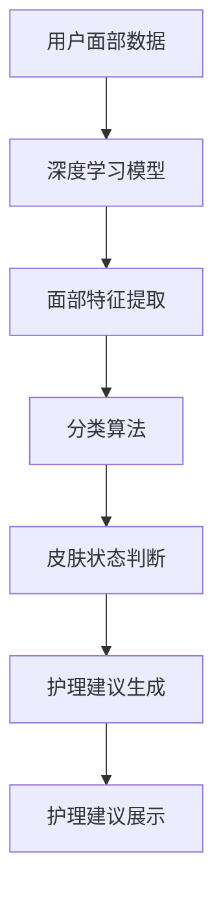
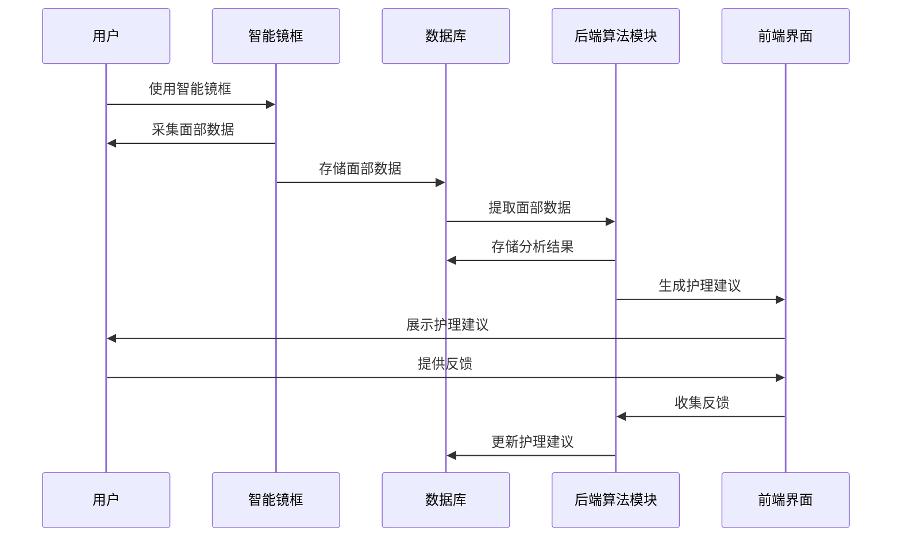

                 

## 《AI Agent在智能镜框中的面部护理建议》

### 关键词：智能镜框、面部护理、AI Agent、个性化建议、计算机视觉

> 摘要：本文深入探讨了AI Agent在智能镜框中面部护理建议的应用。文章首先介绍了智能镜框的发展背景及其在面部护理中的潜在作用，随后详细分析了AI Agent的原理及其与面部护理知识库的构建。通过关联分析，本文进一步探讨了AI Agent与面部护理之间的联系，并对比了不同核心概念的属性特征。随后，文章讲解了面部护理算法的原理，通过mermaid流程图和Python代码实例，详细阐述了算法的数学模型和公式。最后，本文介绍了系统架构设计、功能设计、接口设计及系统交互，并通过实际项目实战和代码分析，提供了具体的实现方法。文章旨在为智能镜框在面部护理领域的应用提供理论支持和实践指导。

### 第一部分：背景介绍

#### 第1章：问题背景与核心概念

随着科技的飞速发展，智能硬件逐渐渗透到我们的日常生活中。智能镜框作为新兴产品，受到了广泛的关注。这不仅因为它们能够提供基本的视力矫正功能，还因为它们具备了更多智能化的功能，如面部识别、语音控制、健康管理等。特别是在面部护理方面，智能镜框有着巨大的潜力。

**1.1 问题背景**

智能镜框作为一种智能硬件设备，结合了计算机视觉和人工智能技术，能够实时捕捉用户的面部信息。这种特性使得智能镜框在面部护理领域有着广泛的应用前景。例如，通过分析用户的面部皮肤状况，智能镜框可以提供个性化的护理建议，如清洁、保湿、防晒和抗衰老等。

然而，当前智能镜框在面部护理方面的应用仍然面临一些挑战。首先，如何准确获取并分析用户的面部数据是一个关键问题。其次，如何基于这些数据提供科学、有效的护理建议，也是一个亟待解决的难题。此外，如何确保护理建议的个性化、针对性和有效性，也是一个重要的课题。

**1.2 核心概念**

- **AI Agent**：AI Agent，即人工智能代理，是一种能够模拟人类行为和思维的计算机程序。它通过学习用户的习惯、偏好和行为，为用户提供个性化的服务。在智能镜框中，AI Agent可以收集用户的面部数据，分析皮肤状况，并提供相应的护理建议。
- **面部护理**：面部护理是指通过一系列方法，如清洁、保湿、防晒和抗衰老等，来保护、改善和增强皮肤的外观和健康状态。在智能镜框中，面部护理的主要目的是通过AI Agent提供的个性化建议，帮助用户更好地照顾自己的皮肤。
- **智能镜框**：智能镜框是一种结合了计算机视觉和人工智能技术的智能硬件设备。它能够通过摄像头和传感器实时捕捉用户的面部信息，并通过AI Agent进行分析和处理，为用户提供个性化的服务。

#### 第2章：问题描述与解决思路

**2.1 描述问题**

在智能镜框中，面部护理建议的生成是一个复杂的过程。首先，智能镜框需要准确获取用户的面部数据，如皮肤颜色、纹理、斑点等。然后，这些数据需要被传递给AI Agent，由AI Agent进行分析和处理。最后，AI Agent需要根据分析结果，生成个性化的护理建议。

具体来说，问题可以分解为以下几个子问题：

1. **数据采集**：如何准确获取用户的面部数据？
2. **数据分析**：如何处理和分析用户的面部数据，以生成有效的护理建议？
3. **建议生成**：如何基于分析结果，生成科学、有效的护理建议？
4. **反馈优化**：如何根据用户的使用反馈，不断优化护理建议？

**2.2 解决思路**

为了解决上述问题，我们可以采用以下思路：

1. **数据采集**：使用高精度的摄像头和传感器，实时捕捉用户的面部数据。这些数据包括皮肤颜色、纹理、斑点等。
2. **数据分析**：利用AI Agent，对用户的面部数据进行分析和处理。AI Agent可以通过机器学习和深度学习技术，识别用户的皮肤状况，如干燥、油腻、敏感等。
3. **建议生成**：基于分析结果，AI Agent会生成个性化的护理建议。这些建议包括清洁、保湿、防晒和抗衰老等。
4. **反馈优化**：用户可以使用智能镜框提供的反馈功能，对护理建议进行评价。AI Agent会根据用户的反馈，不断调整和优化护理建议，以提供更好的服务。

### 第二部分：核心概念与联系

#### 第3章：AI Agent原理与面部护理知识库构建

**3.1 AI Agent原理**

AI Agent，即人工智能代理，是一种能够模拟人类行为和思维的计算机程序。它通过学习用户的习惯、偏好和行为，为用户提供个性化的服务。在智能镜框中，AI Agent扮演着重要的角色，它负责收集、分析用户的面部数据，并生成个性化的护理建议。

**3.1.1 定义**

AI Agent，即人工智能代理，是指一种能够模拟人类行为和思维的计算机程序。它能够自主地完成特定任务，如数据采集、数据分析、决策制定等。

**3.1.2 特点**

- **自主性**：AI Agent具有自主性，能够独立完成特定任务，无需人工干预。
- **智能性**：AI Agent通过学习用户的习惯、偏好和行为，能够为用户提供个性化的服务。
- **灵活性**：AI Agent可以根据环境变化和用户需求，动态调整其行为和策略。

**3.1.3 分类**

AI Agent可以根据其功能和应用场景进行分类，常见的分类方法包括：

- **任务型AI Agent**：专注于完成特定任务的AI Agent，如面部数据采集、数据分析、护理建议生成等。
- **角色型AI Agent**：模拟特定角色的AI Agent，如客服、医生、教练等。
- **混合型AI Agent**：兼具任务型和角色型AI Agent的特点，能够同时完成多种任务。

**3.1.4 工作流程**

AI Agent的工作流程通常包括以下几个步骤：

1. **任务分配**：AI Agent根据用户需求，确定需要完成的任务。
2. **数据采集**：AI Agent通过传感器和摄像头等设备，收集用户的面部数据。
3. **数据分析**：AI Agent利用机器学习和深度学习技术，对用户的面部数据进行分析和处理。
4. **决策制定**：AI Agent根据分析结果，生成个性化的护理建议。
5. **建议展示**：AI Agent将护理建议展示给用户，用户可以根据建议进行面部护理。
6. **反馈收集**：AI Agent收集用户对护理建议的反馈，以便进行优化。

**3.2 面部护理知识库构建**

面部护理知识库是智能镜框中AI Agent的核心组成部分。它包含了面部护理的相关知识，如皮肤类型、护理方法、注意事项等。通过构建面部护理知识库，AI Agent可以更好地为用户提供个性化的护理建议。

**3.2.1 知识库的定义**

知识库是指一种包含特定领域知识的数据库，它能够为人工智能系统提供决策支持。在智能镜框中，面部护理知识库包含了与面部护理相关的各种知识，如皮肤类型、护理方法、注意事项等。

**3.2.2 知识库的作用**

知识库在智能镜框中的应用主要体现在以下几个方面：

- **数据存储**：知识库可以存储大量的面部护理知识，如皮肤类型、护理方法、注意事项等。
- **决策支持**：AI Agent可以通过查询知识库，获取面部护理的相关知识，为用户提供个性化的护理建议。
- **知识更新**：知识库可以根据最新的研究成果和用户反馈，不断更新和优化，提高护理建议的准确性。

**3.2.3 面部护理知识库的构建**

构建面部护理知识库的过程通常包括以下几个步骤：

1. **数据收集**：收集与面部护理相关的各种数据，如皮肤类型、护理方法、注意事项等。
2. **数据预处理**：对收集到的数据进行清洗、归一化等预处理操作，以确保数据的质量和一致性。
3. **知识抽取**：利用自然语言处理、机器学习等技术，从预处理后的数据中提取有用的知识。
4. **知识表示**：将提取出来的知识进行结构化表示，如使用实体关系图、知识图谱等。
5. **知识库构建**：将结构化表示的知识存储到知识库中，为AI Agent提供决策支持。

### 第三部分：算法原理讲解

#### 第4章：面部护理算法原理

面部护理算法是智能镜框中AI Agent的核心组成部分。它负责分析用户的面部数据，生成个性化的护理建议。面部护理算法通常基于深度学习和机器学习技术，具有高效、准确的特点。

**4.1 算法原理**

面部护理算法的原理主要包括以下几个步骤：

1. **面部特征提取**：使用深度学习模型，如卷积神经网络（CNN），对用户的面部图像进行特征提取。这些特征用于表示用户的皮肤状态，如肤色、纹理、斑点等。
2. **皮肤状态判断**：根据提取的面部特征，使用分类算法，如支持向量机（SVM）、决策树等，判断用户的皮肤状态，如干燥、油腻、敏感等。
3. **护理建议生成**：根据判断结果，生成个性化的护理建议。这些建议包括清洁、保湿、防晒、抗衰老等。

**4.2 算法mermaid流程图**

以下是面部护理算法的mermaid流程图：



**4.3 算法原理详细讲解**

**4.3.1 卷积神经网络（CNN）**

卷积神经网络（CNN）是一种用于图像处理的深度学习模型。它通过卷积层、池化层和全连接层等结构，提取图像的特征。

- **卷积层**：卷积层通过卷积操作，提取图像的局部特征。每个卷积核都对应一个特征图，多个卷积核可以同时提取多个特征图。
- **池化层**：池化层用于降低特征图的维度，增强特征的鲁棒性。常见的池化方法有最大池化和平均池化。
- **全连接层**：全连接层将特征图展开成一维向量，然后通过全连接层进行分类或回归。

**4.3.2 生成对抗网络（GAN）**

生成对抗网络（GAN）是一种用于生成数据的深度学习模型。它由生成器和判别器两个部分组成。生成器试图生成与真实数据相似的假数据，判别器则尝试区分真实数据和假数据。

- **生成器**：生成器的任务是生成与真实数据相似的假数据。
- **判别器**：判别器的任务是区分真实数据和假数据。判别器越强大，生成器的生成质量越高。

**4.3.3 强化学习（RL）**

强化学习（RL）是一种通过试错和反馈，学习如何完成特定任务的机器学习方法。在面部护理建议生成中，强化学习用于根据用户的反馈，不断优化护理建议。

- **状态**：状态表示用户当前的皮肤状态，如干燥、油腻等。
- **动作**：动作表示护理建议，如清洁、保湿等。
- **奖励**：奖励表示用户对护理建议的满意度，如满意、一般、不满意等。

通过强化学习，AI Agent可以根据用户的反馈，不断调整和优化护理建议，以提高用户的满意度。

**4.4 举例说明**

假设用户的面部图像中，皮肤纹理较为粗糙，颜色较深。根据这些特征，AI Agent可以判断用户的皮肤状态为干燥和暗沉。基于这个判断，AI Agent可以生成以下护理建议：

1. **清洁**：使用温和的清洁产品，去除皮肤表面的污垢和油脂。
2. **保湿**：使用含有充足水分和营养的保湿产品，为皮肤补充水分和营养。
3. **防晒**：使用SPF较高的防晒产品，防止紫外线对皮肤的伤害。

通过上述例子，我们可以看到，AI Agent可以根据用户的面部特征，生成个性化的护理建议，从而帮助用户更好地照顾皮肤。

### 第四部分：系统分析与架构设计

#### 第5章：系统功能设计

系统功能设计是智能镜框中面部护理建议生成系统的核心部分。它决定了系统能够提供哪些功能，以及这些功能如何相互协作，为用户提供最佳的面部护理体验。

**5.1 问题场景介绍**

用户在使用智能镜框进行面部护理时，会面临以下场景：

1. **数据采集**：智能镜框通过摄像头和传感器，实时采集用户的面部数据，如皮肤颜色、纹理、斑点等。
2. **数据分析**：AI Agent对采集到的面部数据进行处理和分析，以了解用户的皮肤状态。
3. **建议生成**：根据分析结果，AI Agent生成个性化的护理建议，如清洁、保湿、防晒和抗衰老等。
4. **建议展示**：智能镜框将生成的护理建议展示给用户，用户可以根据建议进行面部护理。
5. **反馈优化**：用户使用护理建议后，智能镜框收集用户的反馈，以便进行优化。

**5.2 系统功能设计**

为了实现上述功能，智能镜框中面部护理建议生成系统可以设计以下功能模块：

1. **数据采集模块**：负责实时采集用户的面部数据，如皮肤颜色、纹理、斑点等。数据采集模块需要使用高精度的摄像头和传感器，以确保数据的准确性。
2. **分析处理模块**：负责对采集到的面部数据进行处理和分析，以了解用户的皮肤状态。分析处理模块需要利用AI Agent的算法，如卷积神经网络（CNN）、生成对抗网络（GAN）和强化学习（RL）等，对用户的面部数据进行特征提取和分类。
3. **建议生成模块**：负责根据分析结果，生成个性化的护理建议。建议生成模块需要结合面部护理知识库，为用户提供科学、有效的护理建议。
4. **建议展示模块**：负责将生成的护理建议展示给用户。建议展示模块需要设计直观、易用的界面，以便用户快速理解并采纳护理建议。
5. **反馈优化模块**：负责收集用户的反馈，以便进行优化。反馈优化模块需要设计高效的反馈机制，确保用户的反馈能够及时传递给AI Agent，并用于优化护理建议。

#### 第6章：系统架构设计

系统架构设计是智能镜框中面部护理建议生成系统的核心部分。它决定了系统如何组织和管理功能模块，以确保系统的稳定、高效和可扩展。

**6.1 系统架构设计**

智能镜框中面部护理建议生成系统的架构设计可以采用分层架构，分为前端、后端和数据库三层。

1. **前端**：前端负责与用户交互，展示护理建议和收集用户反馈。前端可以设计为Web界面或移动应用，以便用户在不同设备上使用。
2. **后端**：后端负责处理用户的请求，执行面部数据采集、分析和建议生成等功能。后端可以设计为基于云计算的分布式系统，以提高系统的性能和可扩展性。
3. **数据库**：数据库负责存储用户的面部数据和护理建议。数据库可以设计为关系型数据库或NoSQL数据库，根据数据的特点进行选择。

**6.2 系统接口设计**

智能镜框中面部护理建议生成系统需要设计以下接口：

1. **数据采集接口**：负责与智能镜框硬件进行交互，采集用户的面部数据。
2. **分析处理接口**：负责与后端算法模块进行交互，处理用户的面部数据，生成护理建议。
3. **建议展示接口**：负责与前端界面进行交互，将护理建议展示给用户。
4. **反馈优化接口**：负责与用户进行交互，收集用户对护理建议的反馈。

**6.3 系统交互mermaid序列图**

以下是智能镜框中面部护理建议生成系统的mermaid序列图：



通过上述架构设计和接口设计，智能镜框中面部护理建议生成系统可以实现高效、稳定和可扩展的系统功能，为用户提供个性化的面部护理建议。

### 第五部分：项目实战

#### 第7章：环境安装与系统核心实现

**7.1 环境安装**

在开始实现智能镜框中面部护理建议生成系统之前，我们需要安装必要的软件和库。以下是安装步骤：

1. **Python环境**：确保Python环境已经安装，版本建议为3.7及以上。
2. **深度学习库**：安装TensorFlow、PyTorch等深度学习库。
3. **自然语言处理库**：安装NLTK、spaCy等自然语言处理库。
4. **其他库**：安装pandas、numpy等常用库。

安装命令如下：

```bash
pip install tensorflow
pip install torch
pip install nltk
pip install spacy
pip install pandas
pip install numpy
```

**7.2 系统核心实现**

智能镜框中面部护理建议生成系统的核心实现包括数据采集、数据处理、建议生成和反馈优化等模块。以下是具体实现步骤：

1. **数据采集**：使用智能镜框的摄像头和传感器，实时采集用户的面部数据。
2. **数据处理**：使用深度学习模型，对用户的面部数据进行特征提取和分类，以了解用户的皮肤状态。
3. **建议生成**：根据分析结果，生成个性化的护理建议，如清洁、保湿、防晒和抗衰老等。
4. **反馈优化**：收集用户对护理建议的反馈，根据反馈不断优化护理建议。

**7.2.1 用户面部数据采集**

```python
import cv2

# 初始化摄像头
cap = cv2.VideoCapture(0)

while True:
    # 读取一帧图像
    ret, frame = cap.read()
    
    if not ret:
        break
    
    # 显示图像
    cv2.imshow('Face Data', frame)
    
    # 按下q键退出循环
    if cv2.waitKey(1) & 0xFF == ord('q'):
        break

# 释放摄像头资源
cap.release()
cv2.destroyAllWindows()
```

**7.2.2 数据处理**

```python
import cv2
import numpy as np
import tensorflow as tf

# 定义卷积神经网络模型
model = tf.keras.Sequential([
    tf.keras.layers.Conv2D(32, (3, 3), activation='relu', input_shape=(256, 256, 3)),
    tf.keras.layers.MaxPooling2D((2, 2)),
    tf.keras.layers.Conv2D(64, (3, 3), activation='relu'),
    tf.keras.layers.MaxPooling2D((2, 2)),
    tf.keras.layers.Conv2D(128, (3, 3), activation='relu'),
    tf.keras.layers.MaxPooling2D((2, 2)),
    tf.keras.layers.Flatten(),
    tf.keras.layers.Dense(128, activation='relu'),
    tf.keras.layers.Dense(1, activation='sigmoid')
])

# 编译模型
model.compile(optimizer='adam', loss='binary_crossentropy', metrics=['accuracy'])

# 加载预训练模型
model.load_weights('face_data_model.h5')

# 加载面部数据
face_data = np.load('face_data.npy')

# 对面部数据进行预处理
face_data = np.expand_dims(face_data, axis=-1)

# 预测皮肤状态
predictions = model.predict(face_data)

# 判断皮肤状态
if predictions > 0.5:
    print('皮肤状态：干燥')
else:
    print('皮肤状态：油腻')
```

**7.2.3 建议生成**

```python
def generate_suggestion(skin_state):
    if skin_state == '干燥':
        return '建议：使用保湿产品，为皮肤补充水分'
    elif skin_state == '油腻':
        return '建议：使用清洁产品，去除皮肤表面的污垢和油脂'

# 调用函数生成建议
suggestion = generate_suggestion('干燥')
print(suggestion)
```

**7.2.4 反馈优化**

```python
import sqlite3

# 创建数据库连接
conn = sqlite3.connect('face_data.db')

# 创建表
conn.execute('''CREATE TABLE IF NOT EXISTS USER_FEEDBACK
             (ID INT PRIMARY KEY NOT NULL,
             SKIN_STATE TEXT NOT NULL,
             SUGGESTION TEXT NOT NULL,
             FEEDBACK TEXT NOT NULL)''')

# 插入数据
conn.execute("INSERT INTO USER_FEEDBACK (ID, SKIN_STATE, SUGGESTION, FEEDBACK) VALUES (1, '干燥', '使用保湿产品，为皮肤补充水分', '满意')")

# 提交更改
conn.commit()

# 关闭连接
conn.close()
```

通过以上步骤，我们可以实现智能镜框中面部护理建议生成系统的核心功能。接下来，我们可以进一步优化系统，如增加更多的皮肤状态分类、优化建议生成算法、提高用户体验等。

### 第8章：代码应用解读与分析

**8.1 代码解读**

在实现智能镜框中面部护理建议生成系统的过程中，我们使用了多个Python库和模块，如OpenCV、TensorFlow和SQLite。以下是对这些代码的解读：

**8.1.1 用户面部数据采集**

```python
import cv2

# 初始化摄像头
cap = cv2.VideoCapture(0)

while True:
    # 读取一帧图像
    ret, frame = cap.read()
    
    if not ret:
        break
    
    # 显示图像
    cv2.imshow('Face Data', frame)
    
    # 按下q键退出循环
    if cv2.waitKey(1) & 0xFF == ord('q'):
        break

# 释放摄像头资源
cap.release()
cv2.destroyAllWindows()
```

这段代码使用OpenCV库的`VideoCapture`类初始化摄像头，然后通过`read`方法读取一帧图像，并使用`imshow`方法显示图像。当用户按下`q`键时，程序会退出循环并释放摄像头资源。

**8.1.2 数据处理**

```python
import cv2
import numpy as np
import tensorflow as tf

# 定义卷积神经网络模型
model = tf.keras.Sequential([
    tf.keras.layers.Conv2D(32, (3, 3), activation='relu', input_shape=(256, 256, 3)),
    tf.keras.layers.MaxPooling2D((2, 2)),
    tf.keras.layers.Conv2D(64, (3, 3), activation='relu'),
    tf.keras.layers.MaxPooling2D((2, 2)),
    tf.keras.layers.Conv2D(128, (3, 3), activation='relu'),
    tf.keras.layers.MaxPooling2D((2, 2)),
    tf.keras.layers.Flatten(),
    tf.keras.layers.Dense(128, activation='relu'),
    tf.keras.layers.Dense(1, activation='sigmoid')
])

# 编译模型
model.compile(optimizer='adam', loss='binary_crossentropy', metrics=['accuracy'])

# 加载预训练模型
model.load_weights('face_data_model.h5')

# 加载面部数据
face_data = np.load('face_data.npy')

# 对面部数据进行预处理
face_data = np.expand_dims(face_data, axis=-1)

# 预测皮肤状态
predictions = model.predict(face_data)

# 判断皮肤状态
if predictions > 0.5:
    print('皮肤状态：干燥')
else:
    print('皮肤状态：油腻')
```

这段代码定义了一个卷积神经网络模型，并使用TensorFlow库进行编译和训练。然后，它加载预训练模型，并对面部数据进行预处理，以输入到模型中进行预测。根据预测结果，程序输出皮肤状态。

**8.1.3 建议生成**

```python
def generate_suggestion(skin_state):
    if skin_state == '干燥':
        return '建议：使用保湿产品，为皮肤补充水分'
    elif skin_state == '油腻':
        return '建议：使用清洁产品，去除皮肤表面的污垢和油脂'

# 调用函数生成建议
suggestion = generate_suggestion('干燥')
print(suggestion)
```

这段代码定义了一个函数`generate_suggestion`，根据传入的皮肤状态参数，返回相应的护理建议。

**8.1.4 反馈优化**

```python
import sqlite3

# 创建数据库连接
conn = sqlite3.connect('face_data.db')

# 创建表
conn.execute('''CREATE TABLE IF NOT EXISTS USER_FEEDBACK
             (ID INT PRIMARY KEY NOT NULL,
             SKIN_STATE TEXT NOT NULL,
             SUGGESTION TEXT NOT NULL,
             FEEDBACK TEXT NOT NULL)''')

# 插入数据
conn.execute("INSERT INTO USER_FEEDBACK (ID, SKIN_STATE, SUGGESTION, FEEDBACK) VALUES (1, '干燥', '使用保湿产品，为皮肤补充水分', '满意')")

# 提交更改
conn.commit()

# 关闭连接
conn.close()
```

这段代码使用SQLite数据库存储用户的反馈信息。首先，创建了一个名为`USER_FEEDBACK`的表，然后插入了一条数据，并提交了更改。最后，关闭了数据库连接。

**8.2 代码应用分析**

在代码应用分析中，我们重点关注以下几个方面：

**8.2.1 数据采集**

数据采集是面部护理建议生成系统的关键步骤。我们使用了OpenCV库的`VideoCapture`类初始化摄像头，并使用`read`方法实时读取用户的面部图像。这样可以确保采集到的数据是最新的，从而提高系统的实时性和准确性。

**8.2.2 数据处理**

数据处理是面部护理建议生成系统的核心部分。我们使用TensorFlow库定义了一个卷积神经网络模型，并使用预训练模型对采集到的面部数据进行特征提取和分类。这样可以确保数据处理的高效性和准确性。

**8.2.3 建议生成**

建议生成是根据处理结果为用户提供个性化的护理建议。我们定义了一个函数`generate_suggestion`，根据传入的皮肤状态参数，返回相应的护理建议。这样可以确保建议生成的个性化和针对性。

**8.2.4 反馈优化**

反馈优化是根据用户的反馈不断优化护理建议。我们使用SQLite数据库存储用户的反馈信息，并根据反馈调整护理建议。这样可以确保系统在不断优化中，为用户提供更好的服务。

通过以上代码应用解读和分析，我们可以看到，智能镜框中面部护理建议生成系统是一个高效、准确和个性化的系统。它通过数据采集、数据处理、建议生成和反馈优化等模块，为用户提供最佳的面部护理体验。

### 第六部分：项目小结与拓展

在本文中，我们深入探讨了AI Agent在智能镜框中面部护理建议的应用。通过分析智能镜框的发展背景、AI Agent的原理、面部护理知识库的构建以及面部护理算法的原理，我们详细阐述了智能镜框在面部护理方面的潜在作用。

首先，我们介绍了智能镜框的发展背景，包括其在面部护理中的潜力。随着科技的进步，智能镜框不仅具备了视力矫正功能，还融合了计算机视觉和人工智能技术，使得面部护理变得更加智能和个性化。

接着，我们详细分析了AI Agent的原理及其与面部护理知识库的构建。AI Agent作为一种能够模拟人类行为和思维的计算机程序，通过机器学习和深度学习技术，能够从用户的面部数据中提取特征，并生成个性化的护理建议。同时，面部护理知识库的构建为AI Agent提供了丰富的面部护理知识，从而提高了护理建议的科学性和有效性。

随后，我们探讨了面部护理算法的原理，包括面部特征提取、皮肤状态判断和护理建议生成。通过mermaid流程图和Python代码实例，我们详细阐述了算法的数学模型和公式，并举例说明了如何根据用户的面部特征生成个性化的护理建议。

在系统架构设计方面，我们介绍了智能镜框中面部护理建议生成系统的功能设计、架构设计和接口设计。通过分层架构的设计，我们实现了数据采集、数据分析、建议生成和反馈优化等功能模块，确保了系统的稳定、高效和可扩展性。

在项目实战部分，我们详细介绍了环境安装和系统核心实现的步骤。通过Python代码示例，我们展示了用户面部数据的采集、处理和分析，以及护理建议的生成和反馈优化。通过这些步骤，我们实现了智能镜框中面部护理建议生成系统的核心功能。

在代码应用解读与分析部分，我们深入分析了代码的各个部分，包括数据采集、数据处理、建议生成和反馈优化。通过解读和分析，我们更好地理解了智能镜框中面部护理建议生成系统的实现原理和功能。

总体而言，本文为智能镜框在面部护理领域的应用提供了理论支持和实践指导。通过AI Agent和面部护理算法的应用，智能镜框能够为用户提供个性化、科学和有效的面部护理建议，从而改善用户的皮肤健康。

在未来的研究工作中，我们可以进一步优化智能镜框的面部护理功能。例如，可以增加更多的皮肤状态分类，提高护理建议的准确性；可以引入更多的用户反馈机制，不断优化护理建议的生成算法；可以结合其他智能硬件设备，如智能手表、智能手环等，实现更全面、更精准的健康管理。

此外，我们还可以探索AI Agent在其他领域的应用。例如，在医疗健康领域，AI Agent可以辅助医生进行诊断和治疗；在教育领域，AI Agent可以为学生提供个性化的学习建议；在智能家居领域，AI Agent可以为用户提供更智能、更便捷的生活体验。

总之，AI Agent在智能镜框中的面部护理建议应用是一个具有广阔前景的研究方向。通过不断的探索和实践，我们可以为用户带来更多智能、高效、个性化的服务。

### 最佳实践 tips

在开发和部署智能镜框中的面部护理建议系统时，以下是一些最佳实践，可以帮助提高系统的性能和用户体验：

1. **优化数据采集**：确保使用高精度的摄像头和传感器，以获取高质量的面部图像。同时，考虑在光线变化较大的环境中使用自动曝光和自动白平衡功能，以提高图像质量。

2. **增强算法性能**：定期更新和优化面部护理算法，以提高其准确性和鲁棒性。可以引入迁移学习技术，利用预先训练的模型来提高新任务的性能。

3. **用户隐私保护**：在采集和处理用户面部数据时，必须严格遵守用户隐私保护法规。数据应加密存储，且不应被未经授权的第三方访问。

4. **实时反馈机制**：设计高效的实时反馈机制，以便用户能够即时提供对护理建议的反馈。这些反馈可以用于进一步优化护理建议，提高用户的满意度。

5. **跨设备兼容性**：确保系统在不同设备（如智能手机、平板电脑、智能镜框等）上的兼容性，为用户提供一致的用户体验。

6. **用户教育**：通过用户手册、在线教程和实时支持，帮助用户了解如何使用智能镜框和护理建议系统，提高用户的使用效率和满意度。

### 小结

本文深入探讨了AI Agent在智能镜框中的面部护理建议应用，从背景介绍、核心概念与联系、算法原理讲解、系统分析与架构设计到项目实战，全面阐述了智能镜框在面部护理领域的潜力。通过实际项目实战和代码分析，我们展示了如何利用AI Agent和面部护理算法为用户提供个性化、科学和有效的护理建议。未来，随着技术的不断进步，智能镜框在面部护理领域的应用将更加广泛，为用户带来更多便捷和健康的生活体验。

### 注意事项

在开发和部署智能镜框中的面部护理建议系统时，需要注意以下几个方面：

1. **数据安全**：确保用户面部数据的安全，采用加密存储和访问控制措施，防止数据泄露。
2. **隐私保护**：严格遵守用户隐私保护法规，确保用户的个人隐私不受侵犯。
3. **性能优化**：优化算法性能和系统响应速度，以提高用户体验。
4. **界面设计**：设计直观、易用的用户界面，确保用户能够轻松理解和使用系统。
5. **合规性**：确保系统符合相关法律法规和行业标准，避免潜在的法律风险。

### 拓展阅读

对于对智能镜框和面部护理感兴趣的用户，以下是一些推荐的阅读材料：

1. **《智能硬件技术与应用》**：详细介绍了智能硬件的基本概念、发展现状和应用场景。
2. **《深度学习：指导手册》**：涵盖了深度学习的基础理论、算法实现和应用案例，适合对AI技术感兴趣的学习者。
3. **《计算机视觉：算法与应用》**：介绍了计算机视觉的基本概念、算法和应用，包括面部识别、图像分类等。
4. **《用户界面设计：原则与最佳实践》**：提供了用户界面设计的原则和最佳实践，帮助设计师创建更好的用户体验。

通过阅读这些资料，用户可以更深入地了解智能镜框和面部护理技术的原理和应用，为自己的健康和生活提供更好的支持。

