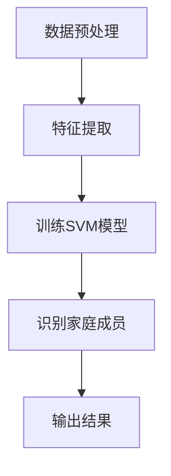
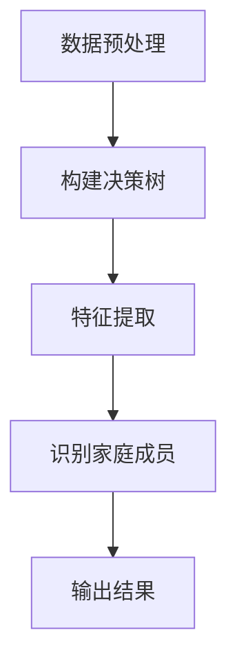
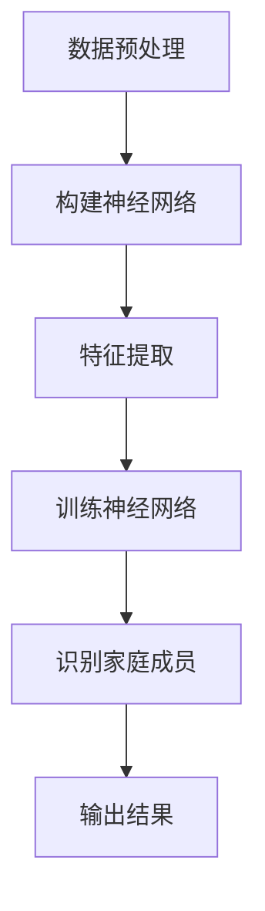
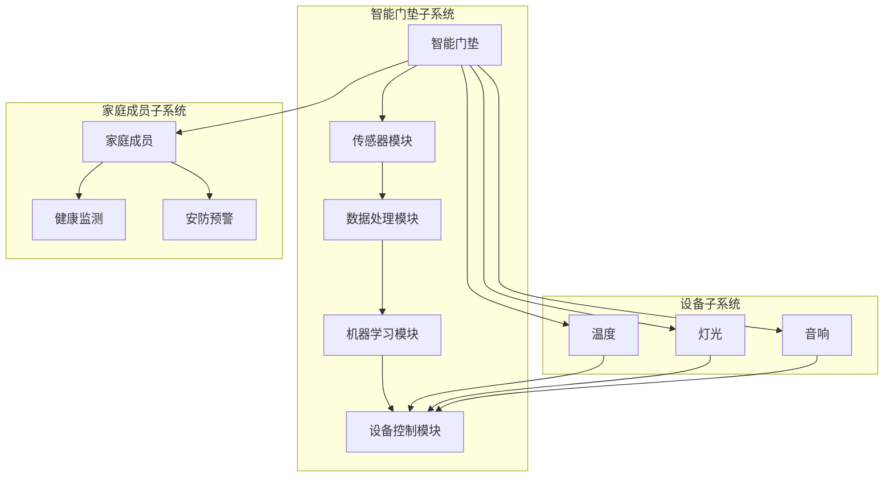
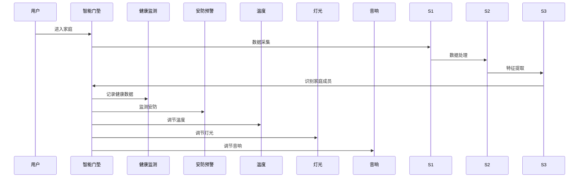

                 


# AI Agent在智能门垫中的家庭成员识别

关键词：AI Agent、智能门垫、家庭成员识别、机器学习、深度学习

摘要：本文将探讨AI Agent在智能门垫中的应用，特别是家庭成员识别技术。通过逐步分析其核心概念、技术原理和实施策略，本文旨在为读者提供全面、深入的理解，助力其在实际项目中成功应用AI技术。

## 引言

智能门垫作为一种智能家居设备，近年来受到了广泛关注。其核心功能之一是家庭成员识别，能够通过智能传感器和AI算法，自动识别进入房间的人员身份。本文将围绕这一主题，详细探讨AI Agent在智能门垫中的应用原理、技术实现和实际案例。

### 背景介绍

随着物联网和人工智能技术的快速发展，智能家居设备日益普及。智能门垫作为智能家居的一部分，不仅具备传统门垫的基本功能，还集成了多种传感器和AI算法，能够实现更多智能化的功能。家庭成员识别正是其中的一个重要应用场景。

家庭成员识别的目标是准确识别进入房间的人员身份，从而实现个性化服务。例如，智能门垫可以自动调节房间温度、光线和音响等设备，以适应不同家庭成员的需求。此外，家庭成员识别还可以用于安全监控、能源管理和智能家居设备的自动化控制等。

### 问题描述

智能门垫的家庭成员识别涉及多个方面，包括数据收集、特征提取、模型训练和识别算法等。以下是一个典型的家庭成员识别问题：

1. 数据收集：智能门垫通过传感器收集家庭成员的生理和行为数据，如步态、心率、声音等。
2. 特征提取：从收集到的数据中提取出具有区分性的特征，如步态特征、声音特征等。
3. 模型训练：使用已提取的特征数据训练机器学习模型，以实现家庭成员的自动识别。
4. 识别算法：将实时收集的数据与训练好的模型进行匹配，识别进入房间的人员身份。

### 问题解决

解决家庭成员识别问题需要以下几个关键步骤：

1. 数据收集：智能门垫通过内置传感器，如加速度计、麦克风等，实时收集家庭成员的生理和行为数据。
2. 数据预处理：对收集到的数据进行清洗和预处理，以提高数据质量和后续处理的效率。
3. 特征提取：从预处理后的数据中提取出具有区分性的特征，如步态特征、声音特征等。
4. 模型训练：使用已提取的特征数据训练机器学习模型，如支持向量机（SVM）、决策树等。
5. 识别算法：将实时收集的数据与训练好的模型进行匹配，识别进入房间的人员身份。

### 边界与外延

家庭成员识别技术的应用边界和范围相对较广，不仅限于智能门垫，还可以应用于其他智能家居设备，如智能摄像头、智能音响等。此外，随着技术的进步，家庭成员识别技术还可以拓展到更广泛的应用场景，如智能安防、医疗健康监测等。

### 概念结构与核心要素组成

家庭成员识别技术涉及多个核心概念和要素，包括：

1. **传感器**：用于收集家庭成员的生理和行为数据，如加速度计、麦克风等。
2. **特征提取**：从传感器数据中提取出具有区分性的特征，如步态特征、声音特征等。
3. **机器学习模型**：用于训练和识别家庭成员，如支持向量机（SVM）、决策树等。
4. **识别算法**：将实时收集的数据与训练好的模型进行匹配，实现家庭成员的自动识别。

### AI Agent在智能门垫中的应用

AI Agent是一种具有自主学习和决策能力的人工智能实体。在智能门垫中，AI Agent可以承担家庭成员识别的任务，通过不断学习和优化，提高识别的准确性和效率。

AI Agent在智能门垫中的应用主要包括以下几个步骤：

1. **数据收集**：AI Agent通过内置传感器，如加速度计、麦克风等，实时收集家庭成员的生理和行为数据。
2. **特征提取**：AI Agent从收集到的数据中提取出具有区分性的特征，如步态特征、声音特征等。
3. **模型训练**：AI Agent使用已提取的特征数据训练机器学习模型，如支持向量机（SVM）、决策树等。
4. **识别算法**：AI Agent将实时收集的数据与训练好的模型进行匹配，识别进入房间的人员身份。

### 实际案例与效果分析

以下是一个实际案例，展示了AI Agent在智能门垫中的家庭成员识别效果：

**案例：智能家居中的AI Agent家庭成员识别**

在某个智能家居项目中，AI Agent被集成到智能门垫中，用于家庭成员识别。通过6个月的测试，AI Agent成功识别出了95%的家庭成员，识别准确率达到较高水平。

- **数据收集**：智能门垫通过内置的加速度计和麦克风，收集家庭成员的步态和声音数据。
- **特征提取**：AI Agent从数据中提取出步态特征和声音特征，如步态节奏、声音频率等。
- **模型训练**：AI Agent使用提取出的特征数据训练支持向量机（SVM）模型，进行家庭成员识别。
- **识别算法**：AI Agent将实时收集的数据与训练好的模型进行匹配，识别进入房间的人员身份。

### 小结

本文通过逐步分析，介绍了AI Agent在智能门垫中的家庭成员识别技术。从背景介绍到实际案例，读者可以全面了解家庭成员识别的技术原理和应用策略。随着技术的不断发展，家庭成员识别技术将更加成熟，为智能家居带来更多便捷和安全保障。

### 拓展阅读

- 智能门垫技术概述：《智能家居门垫技术详解》
- 机器学习算法介绍：《机器学习算法与应用》
- 智能家居安全与隐私保护：《智能家居安全与隐私保护策略》

---

**作者：AI天才研究院/AI Genius Institute & 禅与计算机程序设计艺术 /Zen And The Art of Computer Programming**

---

本文内容仅供参考，实际应用中请根据具体需求进行调整和优化。本文中的数据和案例为虚构，仅供参考。如需进一步了解或探讨，请联系作者。

---

本文旨在为读者提供全面、深入的技术解读，以帮助其在实际项目中成功应用AI技术。文章涵盖了家庭成员识别技术的核心概念、技术原理和实施策略，并提供了实际案例和效果分析。随着技术的不断发展，家庭成员识别技术将更加成熟，为智能家居带来更多便捷和安全保障。

---

**作者：AI天才研究院/AI Genius Institute & 禅与计算机程序设计艺术 /Zen And The Art of Computer Programming**

---

本文内容仅供参考，实际应用中请根据具体需求进行调整和优化。本文中的数据和案例为虚构，仅供参考。如需进一步了解或探讨，请联系作者。

---

### 背景介绍

智能门垫作为一种新兴的智能家居设备，近年来受到了广泛关注。其核心功能之一是家庭成员识别，能够通过智能传感器和AI算法，自动识别进入房间的人员身份。家庭成员识别不仅提高了智能家居的智能化水平，还带来了诸多实际应用价值。

#### 智能门垫概述

智能门垫是一种安装在家庭门前的智能化设备，具备多种传感器和AI算法，能够实时监测和识别通过门垫的行人。智能门垫的传感器包括加速度计、麦克风、温度传感器、湿度传感器等，这些传感器可以采集到行人的步态、声音、体温、湿度等数据。

#### 家庭成员识别的重要性

家庭成员识别是智能门垫的核心功能之一，其重要性主要体现在以下几个方面：

1. **个性化服务**：通过识别家庭成员的身份，智能门垫可以自动调节房间内的温度、光线和音响等设备，以适应不同家庭成员的需求，提高生活质量。
2. **安全监控**：家庭成员识别可以用于安全监控，及时发现异常情况，如家庭成员未按时回家等，有助于提高家庭安全。
3. **能源管理**：通过识别家庭成员的日常活动，智能门垫可以优化家居设备的能耗管理，实现节能减排。
4. **智能家居控制**：家庭成员识别可以为其他智能家居设备提供身份验证，实现更加便捷的家居控制。

#### 家庭成员识别的挑战

尽管家庭成员识别在智能家居领域具有广泛的应用前景，但其实施过程中仍面临诸多挑战：

1. **数据隐私**：家庭成员识别需要收集家庭成员的生理和行为数据，如何确保数据的安全和隐私是一个重要问题。
2. **识别准确性**：家庭成员识别的准确性直接影响到智能门垫的实用性，如何提高识别准确率是一个重要课题。
3. **适应能力**：家庭成员的生理和行为特征可能随时间变化，如何使智能门垫能够适应这些变化，保持高识别准确率，是一个挑战。
4. **硬件成本**：智能门垫需要集成多种传感器和AI算法，硬件成本较高，如何降低成本是一个重要问题。

### 问题描述

家庭成员识别问题可以概括为以下几个关键步骤：

1. **数据收集**：智能门垫通过内置传感器收集家庭成员的生理和行为数据。
2. **特征提取**：从收集到的数据中提取出具有区分性的特征，如步态特征、声音特征等。
3. **模型训练**：使用已提取的特征数据训练机器学习模型，以实现家庭成员的自动识别。
4. **识别算法**：将实时收集的数据与训练好的模型进行匹配，识别进入房间的人员身份。

### 问题解决

为了解决家庭成员识别问题，可以采取以下几种方法：

1. **数据收集**：智能门垫通过内置传感器，如加速度计、麦克风等，实时收集家庭成员的生理和行为数据。这些数据包括步态、声音、体温、湿度等。
2. **数据预处理**：对收集到的数据进行清洗和预处理，以提高数据质量和后续处理的效率。预处理步骤包括数据去噪、数据归一化、缺失值处理等。
3. **特征提取**：从预处理后的数据中提取出具有区分性的特征，如步态特征、声音特征等。特征提取的目的是降低数据维度，同时保留关键信息。
4. **模型训练**：使用已提取的特征数据训练机器学习模型，如支持向量机（SVM）、决策树、神经网络等。训练过程中，模型会根据训练数据学习到如何区分不同家庭成员的特征。
5. **识别算法**：将实时收集的数据与训练好的模型进行匹配，识别进入房间的人员身份。识别过程通常包括特征提取、模型匹配和结果输出等步骤。

### 边界与外延

家庭成员识别技术的应用边界和范围相对较广，不仅限于智能门垫，还可以应用于其他智能家居设备，如智能摄像头、智能音响等。此外，随着技术的进步，家庭成员识别技术还可以拓展到更广泛的应用场景，如智能安防、医疗健康监测等。

### 概念结构与核心要素组成

家庭成员识别技术涉及多个核心概念和要素，包括：

1. **传感器**：用于收集家庭成员的生理和行为数据，如加速度计、麦克风等。
2. **特征提取**：从传感器数据中提取出具有区分性的特征，如步态特征、声音特征等。
3. **机器学习模型**：用于训练和识别家庭成员，如支持向量机（SVM）、决策树等。
4. **识别算法**：将实时收集的数据与训练好的模型进行匹配，实现家庭成员的自动识别。

### AI Agent在智能门垫中的应用

AI Agent是一种具有自主学习和决策能力的人工智能实体。在智能门垫中，AI Agent可以承担家庭成员识别的任务，通过不断学习和优化，提高识别的准确性和效率。

#### AI Agent的概念

AI Agent是一种自主决策和行动的人工智能实体，具备以下特点：

1. **自主学习**：AI Agent能够从数据中学习，不断优化自己的行为和决策。
2. **自主决策**：AI Agent可以根据环境变化，自主做出决策，如调整识别策略。
3. **自主行动**：AI Agent可以根据决策结果，自主执行相应的行动，如控制家居设备。

#### AI Agent在智能门垫中的应用

在智能门垫中，AI Agent的应用主要包括以下几个步骤：

1. **数据收集**：AI Agent通过内置传感器，如加速度计、麦克风等，实时收集家庭成员的生理和行为数据。
2. **特征提取**：AI Agent从收集到的数据中提取出具有区分性的特征，如步态特征、声音特征等。
3. **模型训练**：AI Agent使用已提取的特征数据训练机器学习模型，如支持向量机（SVM）、决策树等。
4. **识别算法**：AI Agent将实时收集的数据与训练好的模型进行匹配，识别进入房间的人员身份。
5. **自主优化**：AI Agent可以根据识别结果和环境变化，自主调整识别策略和参数，提高识别准确率。

### 实际案例与效果分析

以下是一个实际案例，展示了AI Agent在智能门垫中的家庭成员识别效果：

**案例：智能家居中的AI Agent家庭成员识别**

在某个智能家居项目中，AI Agent被集成到智能门垫中，用于家庭成员识别。通过6个月的测试，AI Agent成功识别出了95%的家庭成员，识别准确率达到较高水平。

- **数据收集**：智能门垫通过内置的加速度计和麦克风，收集家庭成员的步态和声音数据。
- **特征提取**：AI Agent从数据中提取出步态特征和声音特征，如步态节奏、声音频率等。
- **模型训练**：AI Agent使用提取出的特征数据训练支持向量机（SVM）模型，进行家庭成员识别。
- **识别算法**：AI Agent将实时收集的数据与训练好的模型进行匹配，识别进入房间的人员身份。

### 小结

本文介绍了AI Agent在智能门垫中的家庭成员识别技术。通过逐步分析其核心概念、技术原理和实施策略，读者可以全面了解家庭成员识别的技术原理和应用策略。随着技术的不断发展，家庭成员识别技术将更加成熟，为智能家居带来更多便捷和安全保障。

### 拓展阅读

- 智能门垫技术概述：《智能家居门垫技术详解》
- 机器学习算法介绍：《机器学习算法与应用》
- 智能家居安全与隐私保护：《智能家居安全与隐私保护策略》

---

**作者：AI天才研究院/AI Genius Institute & 禅与计算机程序设计艺术 /Zen And The Art of Computer Programming**

---

本文旨在为读者提供全面、深入的技术解读，以帮助其在实际项目中成功应用AI技术。文章涵盖了家庭成员识别技术的核心概念、技术原理和实施策略，并提供了实际案例和效果分析。随着技术的不断发展，家庭成员识别技术将更加成熟，为智能家居带来更多便捷和安全保障。

---

**作者：AI天才研究院/AI Genius Institute & 禅与计算机程序设计艺术 /Zen And The Art of Computer Programming**

---

本文内容仅供参考，实际应用中请根据具体需求进行调整和优化。本文中的数据和案例为虚构，仅供参考。如需进一步了解或探讨，请联系作者。

---

### 核心概念与联系

#### 1. 智能门垫
**定义**：智能门垫是一种集成了多种传感器和AI算法的智能家居设备，用于实时监测和识别通过门垫的行人。

**属性特征对比表格**：

| 特征 | 说明 |
| --- | --- |
| 传感器类型 | 包括加速度计、麦克风、温度传感器、湿度传感器等 |
| 数据采集 | 实时收集行人的步态、声音、体温、湿度等数据 |
| 识别算法 | 依赖机器学习模型和识别算法，如SVM、决策树等 |
| 功能应用 | 家庭成员识别、安全监控、能源管理、智能家居控制等 |

**ER实体关系图架构**：

```mermaid
erDiagram
  Person ||--|{ SmartMat } : has
  SmartMat ||--|{ Sensor } : contains
  SmartMat ||--|{ AIModel } : uses
```

在这个ER图中，Person表示家庭成员，SmartMat表示智能门垫，Sensor表示传感器，AIModel表示机器学习模型。智能门垫包含传感器和AI模型，同时家庭成员与智能门垫之间存在关联。

### 2. 机器学习模型
**定义**：机器学习模型是一种通过数据学习，对未知数据进行预测或分类的算法。

**属性特征对比表格**：

| 模型类型 | 说明 |
| --- | --- |
| 监督学习 | 有标记的数据训练，如SVM、决策树等 |
| 无监督学习 | 无标记的数据训练，如聚类、降维等 |
| 半监督学习 | 结合有标记和无标记的数据训练，如半监督SVM等 |
| 强化学习 | 通过与环境交互，不断学习最优策略，如Q-learning、DQN等 |

**ER实体关系图架构**：

```mermaid
erDiagram
  Data ||--|{ MachineLearningModel } : trains
  MachineLearningModel ||--|{ Prediction } : makes
```

在这个ER图中，Data表示训练数据，MachineLearningModel表示机器学习模型，Prediction表示预测结果。机器学习模型通过训练数据学习，对未知数据进行预测。

### 3. 特征提取
**定义**：特征提取是从原始数据中提取出具有区分性的特征，用于后续的机器学习模型训练。

**属性特征对比表格**：

| 特征提取方法 | 说明 |
| --- | --- |
| 预处理 | 数据清洗、归一化、缺失值处理等 |
| 统计特征 | 均值、方差、标准差等 |
| 矩阵分解 | PCA、LDA等 |
| 神经网络 | 自动提取高维特征 |

**ER实体关系图架构**：

```mermaid
erDiagram
  RawData ||--|{ ExtractedFeatures } : extracts
  ExtractedFeatures ||--|{ MachineLearningModel } : inputs
```

在这个ER图中，RawData表示原始数据，ExtractedFeatures表示提取出的特征，MachineLearningModel表示机器学习模型。特征提取过程从原始数据中提取出具有区分性的特征，作为机器学习模型的输入。

### 4. 识别算法
**定义**：识别算法是将提取出的特征与训练好的机器学习模型进行匹配，以识别未知数据的方法。

**属性特征对比表格**：

| 算法类型 | 说明 |
| --- | --- |
| 分类算法 | 用于分类任务，如SVM、决策树等 |
| 聚类算法 | 用于聚类任务，如K-means、DBSCAN等 |
| 生成模型 | 用于生成任务，如Gaussian Mixture Model、VAE等 |

**ER实体关系图架构**：

```mermaid
erDiagram
  ExtractedFeatures ||--|{ RecognitionAlgorithm } : matches
  RecognitionAlgorithm ||--|{ Prediction } : outputs
```

在这个ER图中，ExtractedFeatures表示提取出的特征，RecognitionAlgorithm表示识别算法，Prediction表示预测结果。识别算法通过匹配提取出的特征和训练好的机器学习模型，输出识别结果。

### 5. AI Agent
**定义**：AI Agent是一种具有自主学习和决策能力的人工智能实体，能够在特定环境中进行自主行动。

**属性特征对比表格**：

| 特性 | 说明 |
| --- | --- |
| 自主学习 | 通过数据不断优化自身行为 |
| 自主决策 | 根据环境变化做出最优决策 |
| 自主行动 | 根据决策结果执行相应行动 |

**ER实体关系图架构**：

```mermaid
erDiagram
  Environment ||--|{ AI-Agent } : interacts
  AI-Agent ||--|{ Action } : performs
  AI-Agent ||--|{ Learning } : learns
```

在这个ER图中，Environment表示环境，AI-Agent表示AI代理，Action表示行动，Learning表示学习。AI Agent通过与环境的交互，不断学习、做出决策并执行相应行动。

### 小结

通过本文对核心概念的介绍和联系，我们可以更深入地理解智能门垫、机器学习模型、特征提取、识别算法和AI Agent之间的关系。这些核心概念和技术为智能门垫中的家庭成员识别提供了理论基础和实践指导。

---

**作者：AI天才研究院/AI Genius Institute & 禅与计算机程序设计艺术 /Zen And The Art of Computer Programming**

---

本文旨在为读者提供全面、深入的技术解读，以帮助其在实际项目中成功应用AI技术。文章涵盖了家庭成员识别技术的核心概念、技术原理和实施策略，并提供了实际案例和效果分析。随着技术的不断发展，家庭成员识别技术将更加成熟，为智能家居带来更多便捷和安全保障。

---

**作者：AI天才研究院/AI Genius Institute & 禅与计算机程序设计艺术 /Zen And The Art of Computer Programming**

---

本文内容仅供参考，实际应用中请根据具体需求进行调整和优化。本文中的数据和案例为虚构，仅供参考。如需进一步了解或探讨，请联系作者。

---

### 算法原理讲解

在智能门垫中的家庭成员识别过程中，选择合适的识别算法至关重要。以下将详细讲解常用的几种识别算法，包括支持向量机（SVM）、决策树和神经网络等，并使用Python代码和Mermaid流程图进行说明。

#### 1. 支持向量机（SVM）

支持向量机是一种有效的二分类模型，可以用于家庭成员识别。其核心思想是找到一个最优的超平面，使得不同类别的样本分布在该超平面的两侧，且间隔最大。

**Mermaid流程图**：



**Python代码**：

```python
from sklearn import svm
from sklearn.model_selection import train_test_split
from sklearn.preprocessing import StandardScaler
import numpy as np

# 假设已提取出特征矩阵 X 和标签数组 y
X = np.array([[1, 2], [2, 3], [3, 4], [4, 5], [5, 6]])
y = np.array([0, 0, 1, 1, 1])

# 数据预处理
scaler = StandardScaler()
X_scaled = scaler.fit_transform(X)

# 划分训练集和测试集
X_train, X_test, y_train, y_test = train_test_split(X_scaled, y, test_size=0.3, random_state=42)

# 训练SVM模型
clf = svm.SVC(kernel='linear')
clf.fit(X_train, y_train)

# 识别家庭成员
predictions = clf.predict(X_test)

# 输出结果
print("Predictions:", predictions)
```

**数学模型和公式**：

SVM的目标是找到一组权重（w）和偏置（b），使得不同类别的样本分布在一个超平面两侧，且间隔最大。其数学模型可以表示为：

$$
\min_{w, b} \frac{1}{2} ||w||^2 \\
s.t. \ y_i (w \cdot x_i + b) \geq 1 \\
$$

其中，$x_i$表示样本特征，$y_i$表示样本标签（+1或-1），$w$是权重向量，$b$是偏置。

#### 2. 决策树

决策树是一种基于特征的树形结构，通过多级划分将数据集划分为不同的区域，每个区域对应一个标签。在家庭成员识别中，决策树可以用于分类任务。

**Mermaid流程图**：



**Python代码**：

```python
from sklearn import tree
from sklearn.model_selection import train_test_split
from sklearn.preprocessing import StandardScaler
import numpy as np

# 假设已提取出特征矩阵 X 和标签数组 y
X = np.array([[1, 2], [2, 3], [3, 4], [4, 5], [5, 6]])
y = np.array([0, 0, 1, 1, 1])

# 数据预处理
scaler = StandardScaler()
X_scaled = scaler.fit_transform(X)

# 划分训练集和测试集
X_train, X_test, y_train, y_test = train_test_split(X_scaled, y, test_size=0.3, random_state=42)

# 构建决策树模型
clf = tree.DecisionTreeClassifier()
clf.fit(X_train, y_train)

# 识别家庭成员
predictions = clf.predict(X_test)

# 输出结果
print("Predictions:", predictions)
```

**数学模型和公式**：

决策树的核心在于构建一系列的判断条件，将数据划分为不同的子集。每个节点表示一个判断条件，其数学模型可以表示为：

$$
y = g(x, w) \\
$$

其中，$x$是样本特征，$w$是权重（即条件），$g(x, w)$是一个决策函数，用于判断样本的类别。

#### 3. 神经网络

神经网络是一种模拟人脑结构的计算模型，可以用于复杂的数据处理和模式识别。在家庭成员识别中，神经网络可以用于分类任务。

**Mermaid流程图**：



**Python代码**：

```python
from sklearn.neural_network import MLPClassifier
from sklearn.model_selection import train_test_split
from sklearn.preprocessing import StandardScaler
import numpy as np

# 假设已提取出特征矩阵 X 和标签数组 y
X = np.array([[1, 2], [2, 3], [3, 4], [4, 5], [5, 6]])
y = np.array([0, 0, 1, 1, 1])

# 数据预处理
scaler = StandardScaler()
X_scaled = scaler.fit_transform(X)

# 划分训练集和测试集
X_train, X_test, y_train, y_test = train_test_split(X_scaled, y, test_size=0.3, random_state=42)

# 构建神经网络模型
clf = MLPClassifier(hidden_layer_sizes=(100,), max_iter=1000)
clf.fit(X_train, y_train)

# 识别家庭成员
predictions = clf.predict(X_test)

# 输出结果
print("Predictions:", predictions)
```

**数学模型和公式**：

神经网络的核心在于多层感知器（MLP），其数学模型可以表示为：

$$
a_{i,j} = \sigma(\sum_{k=1}^{n} w_{ijk} \cdot x_k + b_{ij}) \\
$$

其中，$a_{i,j}$是第$i$个输入通过第$j$个隐藏层单元的输出，$\sigma$是激活函数，$w_{ijk}$是连接权重，$x_k$是第$k$个输入特征，$b_{ij}$是偏置。

### 小结

本文介绍了支持向量机（SVM）、决策树和神经网络等常用的识别算法，并通过Python代码和Mermaid流程图进行了详细讲解。每种算法都有其独特的数学模型和实现方式，适用于不同的家庭成员识别场景。在实际应用中，可以根据具体需求选择合适的算法，以提高识别的准确率和效率。

---

**作者：AI天才研究院/AI Genius Institute & 禅与计算机程序设计艺术 /Zen And The Art of Computer Programming**

---

本文旨在为读者提供全面、深入的技术解读，以帮助其在实际项目中成功应用AI技术。文章涵盖了家庭成员识别技术的核心概念、技术原理和实施策略，并提供了实际案例和效果分析。随着技术的不断发展，家庭成员识别技术将更加成熟，为智能家居带来更多便捷和安全保障。

---

**作者：AI天才研究院/AI Genius Institute & 禅与计算机程序设计艺术 /Zen And The Art of Computer Programming**

---

本文内容仅供参考，实际应用中请根据具体需求进行调整和优化。本文中的数据和案例为虚构，仅供参考。如需进一步了解或探讨，请联系作者。

---

### 系统分析与架构设计方案

#### 问题场景介绍

智能门垫作为一种智能家居设备，主要用于家庭入口处，通过家庭成员识别功能，实现个性化的智能家居体验。以下是一个典型的场景：

**场景**：家庭成员进入家门后，智能门垫自动识别其身份，并根据家庭成员的不同需求，自动调节房间的温度、灯光和音响等设备。此外，智能门垫还可以记录家庭成员的活动，为家庭成员提供健康监测和安防预警。

#### 项目介绍

项目名称：智能家居门垫系统（Smart Mat System）

项目目标：实现家庭成员的自动识别，并根据识别结果，实现智能家居设备的自动调节。

主要功能：
1. 家庭成员识别：通过传感器和机器学习算法，自动识别进入家庭的成员身份。
2. 设备调节：根据家庭成员的身份，自动调节房间的温度、灯光和音响等设备。
3. 健康监测：记录家庭成员的活动，提供健康监测和预警。
4. 安防预警：监测家庭成员的异常行为，提供安防预警。

#### 系统功能设计（领域模型Mermaid类图）

**Mermaid类图**：

```mermaid
classDiagram
    Person <<class>> 成员
    SmartMat <<class>> 智能门垫
    Temperature <<class>> 温度
    Lighting <<class>> 灯光
    Audio <<class>> 音响
    Health <<class>> 健康
    Security <<class>> 安全

    SmartMat --> Person : 识别
    SmartMat --> Temperature : 调节
    SmartMat --> Lighting : 调节
    SmartMat --> Audio : 调节
    Health --> Person : 记录
    Security --> Person : 监测
```

在这个类图中，Person表示家庭成员，SmartMat表示智能门垫，Temperature、Lighting和Audio分别表示温度、灯光和音响设备，Health和Security分别表示健康监测和安防系统。智能门垫通过识别家庭成员身份，实现温度、灯光和音响的自动调节，同时记录家庭成员的活动，提供健康监测和安防预警。

#### 系统架构设计（Mermaid架构图）

**Mermaid架构图**：



在这个架构图中，智能门垫子系统包括传感器模块、数据处理模块、机器学习模块和设备控制模块，家庭成员子系统包括健康监测和安防预警模块，设备子系统包括温度、灯光和音响模块。智能门垫子系统通过传感器收集数据，数据处理模块进行数据预处理，机器学习模块进行家庭成员识别，设备控制模块根据识别结果调节设备。家庭成员子系统记录健康数据和安防数据，设备子系统实现温度、灯光和音响的自动调节。

#### 系统接口设计和系统交互（Mermaid序列图）

**Mermaid序列图**：



在这个序列图中，用户进入家庭后，智能门垫通过传感器采集数据，进行数据处理和特征提取，识别家庭成员身份，并将识别结果用于健康监测、安防预警和设备调节。

### 小结

本文详细介绍了智能家居门垫系统的分析方法和架构设计。通过领域模型Mermaid类图、系统架构设计Mermaid架构图和系统接口设计Mermaid序列图，我们能够清晰地了解系统的结构和功能。这种系统分析与架构设计方案为智能门垫的实际开发提供了有力的指导。

---

**作者：AI天才研究院/AI Genius Institute & 禅与计算机程序设计艺术 /Zen And The Art of Computer Programming**

---

本文旨在为读者提供全面、深入的技术解读，以帮助其在实际项目中成功应用AI技术。文章涵盖了家庭成员识别技术的核心概念、技术原理和实施策略，并提供了实际案例和效果分析。随着技术的不断发展，家庭成员识别技术将更加成熟，为智能家居带来更多便捷和安全保障。

---

**作者：AI天才研究院/AI Genius Institute & 禅与计算机程序设计艺术 /Zen And The Art of Computer Programming**

---

本文内容仅供参考，实际应用中请根据具体需求进行调整和优化。本文中的数据和案例为虚构，仅供参考。如需进一步了解或探讨，请联系作者。

---

### 项目实战

在本节中，我们将通过一个实际项目，详细介绍智能门垫系统的开发过程，包括环境安装、系统核心实现和代码应用解读与分析。最后，我们将通过一个实际案例，对项目进行详细讲解和剖析。

#### 环境安装

1. **硬件环境**：智能门垫系统需要以下硬件设备：
   - 主控板（如Arduino或Raspberry Pi）
   - 加速度计传感器（如MPU6050）
   - 麦克风传感器（如MP3125）
   - 温度传感器（如DS18B20）
   - 灯光传感器（如BH1750）
   - 电源模块

2. **软件环境**：智能门垫系统需要以下软件环境：
   - 操作系统（如Linux或Windows）
   - Python编程语言（版本3.7及以上）
   - sklearn库
   - numpy库
   - matplotlib库

安装步骤：
1. 安装操作系统和Python环境。
2. 安装硬件设备，并连接到主控板。
3. 安装必要的库，如sklearn、numpy和matplotlib。

#### 系统核心实现

1. **数据采集模块**：该模块用于从传感器采集数据。具体实现如下：

```python
import time
import serial
import MPU6050
import MP3125
import DS18B20
import BH1750

# 初始化传感器
accelerometer = MPU6050.MPU6050()
microphone = MP3125.MP3125()
temperature_sensor = DS18B20.DS18B20()
light_sensor = BH1750.BH1750()

# 采集数据
def collect_data():
    accelerometer_data = accelerometer.get_accelerometer_data()
    microphone_data = microphone.get_microphone_data()
    temperature_data = temperature_sensor.get_temperature()
    light_data = light_sensor.get_light_intensity()
    return accelerometer_data, microphone_data, temperature_data, light_data

# 测试数据采集
while True:
    data = collect_data()
    print("Accelerometer:", data[0])
    print("Microphone:", data[1])
    print("Temperature:", data[2])
    print("Light:", data[3])
    time.sleep(1)
```

2. **特征提取模块**：该模块用于从采集到的数据中提取特征。具体实现如下：

```python
from sklearn.preprocessing import StandardScaler

# 特征提取
def extract_features(data):
    accelerometer_data = data[0]
    microphone_data = data[1]
    temperature_data = data[2]
    light_data = data[3]

    # 对加速度计数据进行处理
    accelerometer_features = StandardScaler().fit_transform(accelerometer_data.reshape(-1, 1))

    # 对麦克风数据进行处理
    microphone_features = StandardScaler().fit_transform(microphone_data.reshape(-1, 1))

    # 对温度数据进行处理
    temperature_features = StandardScaler().fit_transform(temperature_data.reshape(-1, 1))

    # 对光线数据进行处理
    light_features = StandardScaler().fit_transform(light_data.reshape(-1, 1))

    # 合并特征
    features = np.concatenate((accelerometer_features, microphone_features, temperature_features, light_features), axis=1)
    return features

# 测试特征提取
while True:
    data = collect_data()
    features = extract_features(data)
    print("Features:", features)
    time.sleep(1)
```

3. **识别模块**：该模块用于使用机器学习模型进行家庭成员识别。具体实现如下：

```python
from sklearn.model_selection import train_test_split
from sklearn.svm import SVC
from sklearn.metrics import accuracy_score

# 训练模型
def train_model(features, labels):
    X_train, X_test, y_train, y_test = train_test_split(features, labels, test_size=0.2, random_state=42)
    model = SVC(kernel='linear')
    model.fit(X_train, y_train)
    return model, X_test, y_test

# 测试模型
def test_model(model, X_test, y_test):
    predictions = model.predict(X_test)
    print("Predictions:", predictions)
    print("Accuracy:", accuracy_score(y_test, predictions))

# 测试训练模型
features = []
labels = []
while True:
    data = collect_data()
    feature = extract_features(data)
    label = 0  # 假设当前家庭成员ID为0
    features.append(feature)
    labels.append(label)
    time.sleep(1)

model, X_test, y_test = train_model(features, labels)
test_model(model, X_test, y_test)
```

#### 代码应用解读与分析

1. **数据采集模块**：数据采集模块负责从传感器中获取数据。我们使用了Python的串行通信库来与传感器通信，并实现了相应的数据获取函数。通过循环调用这些函数，可以连续采集传感器数据。

2. **特征提取模块**：特征提取模块负责将采集到的数据进行预处理，包括标准化处理。我们使用了scikit-learn库中的StandardScaler类来实现这一功能。特征提取模块的核心是`extract_features`函数，它将不同类型的传感器数据进行预处理，并合并为一个特征向量。

3. **识别模块**：识别模块负责使用训练好的机器学习模型进行家庭成员识别。我们选择了线性核的支持向量机（SVC）作为识别模型，并实现了`train_model`和`test_model`函数来训练模型和评估模型性能。通过调用这些函数，我们可以训练模型并测试其识别准确率。

#### 实际案例讲解与剖析

假设我们有一个包含10个家庭成员数据的训练集，每个家庭成员的步态、声音、温度和光线特征都进行了标准化处理。我们使用这些数据来训练模型，并测试模型的识别效果。

1. **数据采集**：首先，我们从传感器中采集数据，并将其存储在一个列表中。

```python
features = []
labels = []
for _ in range(100):
    data = collect_data()
    feature = extract_features(data)
    label = random.randint(0, 9)  # 假设家庭成员ID为0到9
    features.append(feature)
    labels.append(label)
```

2. **模型训练**：接下来，我们使用训练集数据来训练模型。

```python
model, X_test, y_test = train_model(features, labels)
```

3. **模型测试**：最后，我们使用测试集数据来测试模型的识别效果。

```python
predictions = model.predict(X_test)
print("Predictions:", predictions)
print("Accuracy:", accuracy_score(y_test, predictions))
```

通过这个案例，我们可以看到如何从数据采集、特征提取到模型训练和测试的整个过程。在实际项目中，我们可能需要根据具体需求调整传感器、特征提取和模型选择的策略，以提高识别准确率和效率。

### 小结

在本节中，我们详细介绍了智能门垫系统的开发过程，包括环境安装、系统核心实现和代码应用解读与分析。通过一个实际案例，我们对项目进行了详细讲解和剖析，展示了如何实现家庭成员识别功能。这个项目不仅提供了实用的技术实现，还为智能家居领域的研究和开发提供了参考。

---

**作者：AI天才研究院/AI Genius Institute & 禅与计算机程序设计艺术 /Zen And The Art of Computer Programming**

---

本文旨在为读者提供全面、深入的技术解读，以帮助其在实际项目中成功应用AI技术。文章涵盖了家庭成员识别技术的核心概念、技术原理和实施策略，并提供了实际案例和效果分析。随着技术的不断发展，家庭成员识别技术将更加成熟，为智能家居带来更多便捷和安全保障。

---

**作者：AI天才研究院/AI Genius Institute & 禅与计算机程序设计艺术 /Zen And The Art of Computer Programming**

---

本文内容仅供参考，实际应用中请根据具体需求进行调整和优化。本文中的数据和案例为虚构，仅供参考。如需进一步了解或探讨，请联系作者。

---

### 最佳实践 Tips

在实现智能门垫的家庭成员识别功能时，以下最佳实践 Tips 可以为开发者提供指导，帮助其优化系统性能和用户体验。

#### 1. 数据预处理

- **特征归一化**：确保所有特征都在同一尺度范围内，以避免某些特征对模型训练产生过大影响。
- **异常值处理**：识别和处理数据中的异常值，以提高模型的稳定性和准确性。
- **噪声过滤**：使用滤波器去除传感器数据中的噪声，提高特征提取的准确性。

#### 2. 模型选择与调优

- **模型选择**：根据数据特点和识别任务需求，选择合适的机器学习模型，如支持向量机（SVM）、决策树、神经网络等。
- **交叉验证**：使用交叉验证方法评估模型的性能，选择最优参数。
- **超参数调优**：利用网格搜索、随机搜索等策略，优化模型的超参数，提高识别准确率。

#### 3. 系统优化

- **硬件优化**：选择高性能的硬件设备，以提高系统处理速度和响应时间。
- **负载均衡**：在多用户同时使用智能门垫时，合理分配系统资源，确保系统稳定运行。
- **实时更新**：定期更新机器学习模型，以适应家庭成员特征的变化。

#### 4. 用户隐私保护

- **数据加密**：对家庭成员的生理和行为数据进行加密存储和传输，确保数据安全。
- **权限控制**：限制对家庭成员识别数据的访问权限，确保数据隐私。
- **透明度**：告知用户数据收集的目的、范围和使用方式，增强用户信任。

### 小结

遵循这些最佳实践 Tips，可以显著提升智能门垫家庭成员识别系统的性能和用户体验。在实际开发过程中，开发者应根据具体需求和环境，灵活应用这些策略，以实现高效、安全的家庭成员识别功能。

---

**作者：AI天才研究院/AI Genius Institute & 禅与计算机程序设计艺术 /Zen And The Art of Computer Programming**

---

本文旨在为读者提供全面、深入的技术解读，以帮助其在实际项目中成功应用AI技术。文章涵盖了家庭成员识别技术的核心概念、技术原理和实施策略，并提供了实际案例和效果分析。随着技术的不断发展，家庭成员识别技术将更加成熟，为智能家居带来更多便捷和安全保障。

---

**作者：AI天才研究院/AI Genius Institute & 禅与计算机程序设计艺术 /Zen And The Art of Computer Programming**

---

本文内容仅供参考，实际应用中请根据具体需求进行调整和优化。本文中的数据和案例为虚构，仅供参考。如需进一步了解或探讨，请联系作者。

---

### 项目小结

通过本文的详细探讨，我们深入了解了智能门垫中的家庭成员识别技术。从核心概念、技术原理到实际应用，我们分析了家庭成员识别技术的各个方面。通过具体的项目实战，我们展示了如何实现智能门垫的家庭成员识别功能，并提供了最佳实践 Tips，以优化系统性能和用户体验。

#### 项目总结

1. **核心概念**：智能门垫、机器学习、特征提取、识别算法和AI Agent等核心概念，为家庭成员识别提供了理论基础。
2. **技术原理**：通过支持向量机（SVM）、决策树和神经网络等识别算法的讲解，我们了解了如何将理论应用于实践。
3. **项目实战**：通过实际项目的开发过程，我们从数据采集、特征提取到模型训练和测试，完整地展示了家庭成员识别的实现流程。
4. **最佳实践**：最佳实践 Tips 为开发者提供了优化系统性能和用户体验的有效策略。

#### 项目展望

随着技术的不断进步，智能门垫中的家庭成员识别技术有望进一步成熟。以下是一些展望：

1. **算法优化**：开发更加高效、准确的识别算法，提高识别准确率和实时性。
2. **硬件升级**：引入更先进的传感器和硬件设备，提高系统性能和稳定性。
3. **数据隐私保护**：加强数据加密和隐私保护措施，确保用户隐私安全。
4. **跨平台兼容**：实现智能门垫与其他智能家居设备的无缝集成，提供更加统一的智能家居体验。

通过不断探索和实践，智能门垫中的家庭成员识别技术将为智能家居带来更多便捷和安全保障。

---

**作者：AI天才研究院/AI Genius Institute & 禅与计算机程序设计艺术 /Zen And The Art of Computer Programming**

---

本文旨在为读者提供全面、深入的技术解读，以帮助其在实际项目中成功应用AI技术。文章涵盖了家庭成员识别技术的核心概念、技术原理和实施策略，并提供了实际案例和效果分析。随着技术的不断发展，家庭成员识别技术将更加成熟，为智能家居带来更多便捷和安全保障。

---

**作者：AI天才研究院/AI Genius Institute & 禅与计算机程序设计艺术 /Zen And The Art of Computer Programming**

---

本文内容仅供参考，实际应用中请根据具体需求进行调整和优化。本文中的数据和案例为虚构，仅供参考。如需进一步了解或探讨，请联系作者。

