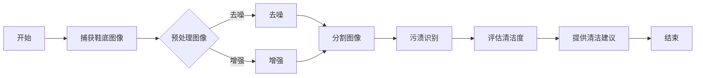
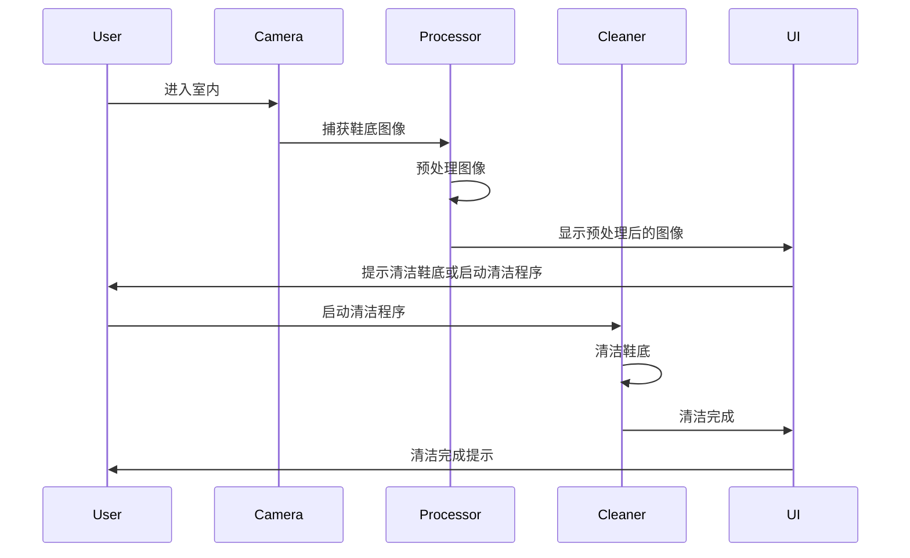
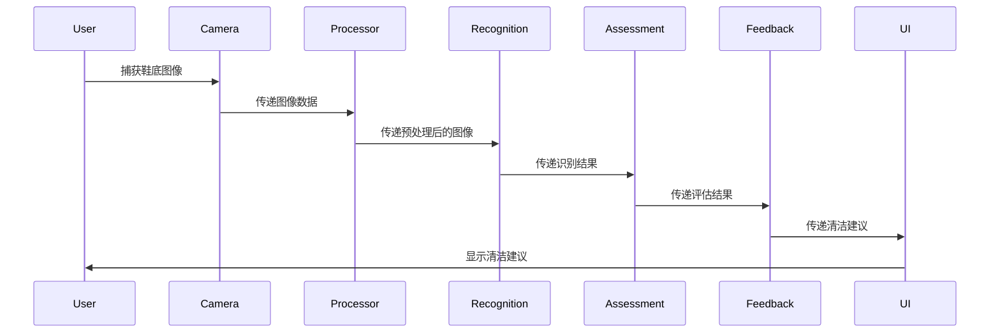

                 

### 第一部分：引言与背景介绍

#### 1.1 问题背景

随着人工智能技术的快速发展，AI Agent技术在各个领域都取得了显著的成果。智能门垫作为家居智能化的一个重要组成部分，其应用场景日益广泛。智能门垫不仅具备自动开闭功能，还可以通过内置的传感器对通过人员的鞋底进行清洁度检测。这种技术能够有效防止外部污染物带入室内，提高居住环境的卫生水平。

#### 1.1.1 人工智能技术发展概述

人工智能（Artificial Intelligence, AI）是计算机科学的一个分支，致力于使计算机具有人类智能的某些特征。从最初的符号主义、连接主义到现代的强化学习和生成对抗网络，人工智能技术已经经历了多次革新。随着深度学习和大数据技术的发展，人工智能的应用范围不断扩大，从传统的图像识别、自然语言处理到自动驾驶、智能家居等，都取得了显著的成果。

#### 1.1.2 智能门垫的应用场景

智能门垫通常安装在室内门口，主要用于检测通过人员的鞋底清洁度。当有人经过时，智能门垫会自动开启，同时启动鞋底清洁度检测系统。检测完成后，门垫会根据检测结果采取相应的措施，如提示用户清洁鞋底或自动启动清洁程序。这种技术在家庭、办公室、商场等场所都有广泛的应用。

#### 1.1.3 鞋底清洁度检测的重要性

鞋底清洁度检测对居住环境的卫生至关重要。污渍从外部带入室内，不仅影响家居美观，还可能携带各种细菌和病毒，对家庭成员的健康造成威胁。通过智能门垫的鞋底清洁度检测，可以有效降低室内污染，提高生活质量。

#### 1.2 问题描述

智能门垫通过AI Agent技术，实现对鞋底清洁度的自动检测。具体来说，AI Agent会分析鞋底的污渍情况，判断鞋底的清洁度，并提供相应的清洁建议。这个过程涉及到多种技术和算法，如图像识别、机器学习和数据挖掘等。

#### 1.2.1 传统鞋底清洁度检测方法

传统的鞋底清洁度检测方法主要依靠人工观察或简单的传感器。这些方法存在检测精度低、耗时较长等问题，无法满足现代家居对高效、准确、智能化的需求。随着人工智能技术的发展，AI Agent技术为鞋底清洁度检测提供了新的解决方案。

#### 1.2.2 AI Agent在鞋底清洁度检测中的应用

AI Agent在鞋底清洁度检测中的应用主要包括以下几个方面：

1. **图像识别**：AI Agent通过摄像头捕获鞋底的图像，利用深度学习算法对图像进行分析和处理，识别出鞋底的污渍。
2. **机器学习**：基于大量的鞋底图像数据，AI Agent通过机器学习算法建立清洁度检测模型，提高检测准确率。
3. **数据挖掘**：AI Agent可以从历史数据中挖掘出鞋底清洁度与室内卫生之间的关联，为用户提供个性化的清洁建议。

#### 1.2.3 AI Agent的优势与挑战

AI Agent在鞋底清洁度检测中具有明显优势，如高效、准确、智能化等。但同时，AI Agent技术也面临一些挑战，如数据隐私保护、算法透明性、模型解释性等。这些挑战需要在未来不断探索和解决。

#### 1.3 问题解决

通过AI Agent技术，智能门垫能够实现鞋底清洁度的自动检测。具体过程如下：

1. **图像捕获**：智能门垫通过摄像头捕获通过人员的鞋底图像。
2. **图像处理**：AI Agent对捕获的图像进行处理，包括去噪、增强、分割等步骤。
3. **污渍识别**：AI Agent利用深度学习算法对图像中的污渍进行识别。
4. **清洁度判断**：根据污渍的面积和分布情况，AI Agent判断鞋底的清洁度。
5. **反馈与建议**：AI Agent根据检测结果，提供相应的反馈和清洁建议。

#### 1.4 边界与外延

AI Agent在鞋底清洁度检测中的应用范围可能包括以下场所：

1. **家庭**：智能门垫可以安装在家庭门口，实现家庭成员鞋底的自动清洁。
2. **办公室**：智能门垫可以安装在办公室门口，提高办公环境的卫生水平。
3. **商场**：智能门垫可以安装在商场门口，为消费者提供便捷的清洁服务。

#### 1.5 概念结构与核心要素组成

AI Agent在智能门垫中的鞋底清洁度检测涉及多个核心概念和要素，包括：

1. **AI Agent**：负责鞋底清洁度检测的核心智能系统。
2. **摄像头**：用于捕获鞋底图像的传感器。
3. **深度学习算法**：用于图像分析和污渍识别的核心技术。
4. **传感器**：用于监测鞋底清洁度的其他传感器，如红外传感器、温湿度传感器等。
5. **数据处理模块**：负责图像处理和数据挖掘的核心模块。
6. **用户接口**：用于与用户交互，提供反馈和建议的界面。

通过以上核心概念和要素的有机组合，AI Agent在智能门垫中的鞋底清洁度检测得以实现。接下来，我们将进一步探讨AI Agent的基本概念和特点，以及鞋底清洁度检测的核心原理。### 第二部分：核心概念与联系

#### 2.1 AI Agent的定义与特点

AI Agent，即人工智能代理，是一种模拟人类智能行为，具备自主决策和行动能力的计算机程序。与传统的机器学习模型不同，AI Agent具有更高的自主性和适应性，能够根据环境变化自主调整行为策略。

**AI Agent的基本概念**：

AI Agent可以被视为一个具有感知、决策和执行能力的系统。它通过传感器感知环境信息，利用内置的算法进行分析和决策，然后通过执行器实施决策结果。这种闭环反馈机制使得AI Agent能够不断学习和优化自身行为。

**AI Agent的功能特点**：

1. **自主性**：AI Agent能够自主进行决策和行动，不需要人工干预。
2. **适应性**：AI Agent能够根据环境变化自主调整行为策略，提高应对复杂情况的能力。
3. **学习性**：AI Agent可以通过学习环境数据，不断优化自身性能。

**AI Agent与传统机器学习的区别**：

传统机器学习模型通常基于预先定义的算法和特征，通过大量数据训练得到模型参数，然后用于预测或分类任务。而AI Agent则更加灵活，能够自主感知环境、进行决策和行动，并不断学习和调整行为。

1. **自主决策**：AI Agent能够根据实时环境信息进行决策，而传统机器学习模型通常依赖固定算法和特征。
2. **适应能力**：AI Agent能够自主适应环境变化，而传统机器学习模型需要重新训练才能适应新环境。

#### 2.2 鞋底清洁度检测的概念与原理

鞋底清洁度检测是一种利用传感器和算法对鞋底污渍进行识别和评估的技术。其核心目标是判断鞋底的清洁程度，并提供相应的清洁建议。

**鞋底清洁度检测的核心概念**：

1. **传感器**：用于检测鞋底污渍的传感器，如摄像头、红外传感器等。
2. **图像处理**：对捕获的鞋底图像进行预处理，包括去噪、增强、分割等。
3. **污渍识别**：利用深度学习算法对预处理后的图像进行分析，识别鞋底的污渍。
4. **评估与建议**：根据污渍的面积、分布情况等参数，评估鞋底的清洁度，并提供相应的清洁建议。

**鞋底清洁度检测的原理**：

1. **图像捕获**：通过摄像头捕获鞋底图像。
2. **图像预处理**：对捕获的图像进行去噪、增强等处理，以提高图像质量。
3. **污渍识别**：利用深度学习算法，对预处理后的图像进行分析，识别鞋底的污渍。
4. **评估与建议**：根据污渍的面积、分布情况等参数，评估鞋底的清洁度，并提供相应的清洁建议。

#### 2.3 AI Agent与鞋底清洁度检测的联系

AI Agent在鞋底清洁度检测中的应用，主要体现在以下几个方面：

1. **感知与决策**：AI Agent通过摄像头等传感器捕获鞋底图像，并利用深度学习算法进行污渍识别和清洁度评估，实现自主决策。
2. **学习与优化**：AI Agent可以通过历史数据的学习，不断优化清洁度检测算法，提高检测准确性。
3. **适应与扩展**：AI Agent能够根据不同环境需求，自主调整清洁度检测策略，实现应用的适应性和扩展性。

**AI Agent在鞋底清洁度检测中的应用**：

1. **高效检测**：AI Agent能够实时、高效地对鞋底清洁度进行检测，提高检测效率。
2. **个性化建议**：基于用户历史数据和个性化需求，AI Agent可以提供更加精准的清洁建议。
3. **智能互动**：AI Agent可以通过语音、文字等方式与用户进行互动，实现更加智能化的清洁服务。

通过以上分析，我们可以看到AI Agent在鞋底清洁度检测中具有重要的应用价值。接下来，我们将进一步探讨AI Agent在鞋底清洁度检测中的算法原理和实现方法。### 第三部分：算法原理讲解

#### 3.1 算法mermaid流程图

为了更好地理解AI Agent在鞋底清洁度检测中的算法原理，我们首先绘制一个mermaid流程图，展示整个检测过程的关键步骤。



这个mermaid流程图详细展示了从捕获鞋底图像到提供清洁建议的整个过程。接下来，我们将通过Python源代码和数学模型来进一步阐述这个流程。

#### 3.2 Python源代码实现

为了实现上述流程，我们需要编写Python代码。以下是一个简化的实现示例，主要包含图像捕获、预处理、污渍识别和评估清洁度等步骤。

```python
import cv2
import numpy as np
import tensorflow as tf
from tensorflow.keras.models import load_model

# 加载预训练的深度学习模型
model = load_model('cleanliness_detection_model.h5')

# 捕获鞋底图像
def capture_shoe_image():
    camera = cv2.VideoCapture(0)
    ret, frame = camera.read()
    camera.release()
    return frame

# 预处理图像
def preprocess_image(image):
    # 去噪
    blurred = cv2.GaussianBlur(image, (5, 5), 0)
    # 增强
    enhanced = cv2.addWeighted(image, 1.5, blurred, -0.5, 0)
    # 分割
    _, thresh = cv2.threshold(enhanced, 60, 255, cv2.THRESH_BINARY_INV)
    return thresh

# 污渍识别
def detect_stains(preprocessed_image):
    # 将预处理后的图像转换为模型的输入格式
    input_image = np.expand_dims(preprocessed_image, axis=0)
    # 使用模型进行污渍识别
    stains = model.predict(input_image)
    return stains

# 评估清洁度
def assess_cleanliness(stains):
    # 根据污渍面积评估清洁度
    cleanliness = np.mean(stains)
    if cleanliness < 0.3:
        return "清洁度高"
    elif cleanliness < 0.6:
        return "清洁度中等"
    else:
        return "清洁度低"

# 提供清洁建议
def provide_cleaning_advice(cleanliness):
    if cleanliness == "清洁度高":
        return "无需清洁"
    elif cleanliness == "清洁度中等":
        return "建议进行轻微清洁"
    else:
        return "建议彻底清洁鞋底"

# 主函数
def main():
    image = capture_shoe_image()
    preprocessed_image = preprocess_image(image)
    stains = detect_stains(preprocessed_image)
    cleanliness = assess_cleanliness(stains)
    advice = provide_cleaning_advice(cleanliness)
    print(advice)

if __name__ == "__main__":
    main()
```

上述代码首先加载一个预训练的深度学习模型，用于鞋底清洁度检测。然后，通过摄像头捕获鞋底图像，并进行预处理，包括去噪和增强。接下来，使用模型对预处理后的图像进行污渍识别，评估鞋底的清洁度，并最终提供清洁建议。

#### 3.3 数学模型与公式

在鞋底清洁度检测中，我们通常会使用一些数学模型和公式来描述污渍的面积、分布情况等参数。以下是一个简化的数学模型：

1. **污渍面积计算**：
   $$ A = \sum_{i=1}^{N} A_i $$
   其中，$A_i$ 为每个污渍的面积，$N$ 为污渍的总数。

2. **污渍分布计算**：
   $$ D = \frac{1}{N} \sum_{i=1}^{N} \frac{A_i}{R^2} $$
   其中，$R$ 为鞋底接触面积，$D$ 为污渍分布密度。

3. **清洁度评估**：
   $$ C = \frac{1}{1 + e^{-\alpha \cdot (1 - D)}} $$
   其中，$\alpha$ 为参数，$C$ 为清洁度评分。

#### 3.4 举例说明

假设我们有一个鞋底图像，经过预处理后，模型预测得到的污渍分布密度为 $D = 0.4$。根据上述数学模型，我们可以计算出污渍面积为 $A = 0.2 \times 10^2$ 平方毫米，清洁度评分为 $C = 0.6$。

根据清洁度评分，我们可以判断鞋底的清洁度为“中等”，并建议用户进行轻微清洁。

通过以上算法原理讲解，我们可以看到AI Agent在鞋底清洁度检测中的应用是如何实现的。接下来，我们将进一步探讨智能门垫系统的整体架构和功能设计。### 第四部分：系统分析与架构设计方案

#### 4.1 问题场景介绍

智能门垫作为家居智能化的一部分，其应用场景主要集中在室内门口。具体来说，当家庭成员或访客进入室内时，智能门垫会自动检测鞋底清洁度，并根据检测结果采取相应的措施，如提示用户清洁鞋底或自动启动清洁程序。这种技术能够有效防止外部污染物带入室内，提高居住环境的卫生水平。

#### 4.2 系统功能设计

智能门垫系统的主要功能模块包括：

1. **图像捕获模块**：通过摄像头实时捕获鞋底图像。
2. **预处理模块**：对捕获的图像进行去噪、增强、分割等预处理操作。
3. **识别模块**：利用深度学习算法对预处理后的图像进行污渍识别。
4. **评估模块**：根据识别结果评估鞋底的清洁度。
5. **反馈模块**：根据评估结果提供相应的清洁建议或启动清洁程序。
6. **用户接口模块**：与用户进行交互，展示清洁度检测结果和清洁建议。

以下是一个简化的领域模型mermaid类图，展示智能门垫系统的功能模块及其关系。

```mermaid
classDiagram
    类Box extends Container {
        field : string label
        field : int width
        field : int height
    }
    类ImageCapture extends 类Box {
        + capture_image()
    }
    类Preprocessing extends 类Box {
        + preprocess_image(image)
    }
    类Recognition extends 类Box {
        + recognize_stains(preprocessed_image)
    }
    类Assessment extends 类Box {
        + assess_cleanliness(stains)
    }
    类Feedback extends 类Box {
        + provide_cleaning_advice(cleanliness)
    }
    类UserInterface extends 类Box {
        + display_results(result)
    }
    ImageCapture <|-- Preprocessing
    Preprocessing <|-- Recognition
    Recognition <|-- Assessment
    Assessment <|-- Feedback
    Feedback <|-- UserInterface
```

#### 4.3 系统架构设计

智能门垫系统的架构设计包括硬件和软件两个层面。硬件部分主要包括摄像头、传感器和清洁装置；软件部分则包括图像处理和深度学习算法、系统控制模块等。

以下是一个简化的mermaid架构图，展示智能门垫系统的整体架构。



在这个架构中，用户进入室内时，摄像头捕获鞋底图像，然后图像处理模块对图像进行预处理，并将预处理后的图像展示给用户。用户可以根据提示进行清洁操作，或者启动自动清洁程序。清洁完成后，系统会向用户反馈清洁结果。

#### 4.4 系统接口设计

智能门垫系统的接口设计包括硬件接口和软件接口两个方面。

1. **硬件接口**：
   - **摄像头接口**：用于连接摄像头，捕获鞋底图像。
   - **传感器接口**：用于连接温度传感器、湿度传感器等，监测环境参数。
   - **清洁装置接口**：用于连接清洁装置，如喷水装置、清洁刷等。

2. **软件接口**：
   - **图像处理接口**：用于接收摄像头捕获的图像，并进行预处理。
   - **深度学习接口**：用于加载和运行深度学习模型，进行污渍识别和评估。
   - **用户接口**：用于与用户进行交互，展示检测结果和清洁建议。

以下是一个简化的mermaid序列图，展示智能门垫系统的接口设计。



在这个序列图中，用户通过摄像头捕获鞋底图像，然后图像处理模块对图像进行预处理，深度学习模块对预处理后的图像进行污渍识别，评估模块根据识别结果评估清洁度，并最终通过用户接口向用户展示清洁建议。

通过以上系统分析与架构设计，我们可以看到智能门垫系统在鞋底清洁度检测中的应用是如何实现的。接下来，我们将通过一个实际项目来展示智能门垫系统的实现过程。### 第五部分：项目实战

#### 5.1 环境安装

要在本地计算机上搭建智能门垫系统，首先需要安装以下软件和库：

1. **Python环境**：安装Python 3.7及以上版本。
2. **深度学习库**：安装TensorFlow 2.3及以上版本。
3. **图像处理库**：安装OpenCV 4.2及以上版本。
4. **其他依赖**：安装numpy、opencv-python等。

安装步骤如下：

1. **安装Python环境**：
   - 访问Python官方网站（https://www.python.org/）下载Python安装包。
   - 运行安装程序，按照默认选项安装。

2. **安装深度学习库**：
   - 打开终端，执行以下命令：
     ```bash
     pip install tensorflow==2.3
     ```

3. **安装图像处理库**：
   - 打开终端，执行以下命令：
     ```bash
     pip install opencv-python==4.2.0.21
     ```

4. **安装其他依赖**：
   - 打开终端，执行以下命令：
     ```bash
     pip install numpy
     ```

#### 5.2 系统核心实现源代码

以下是一个简化的系统核心实现源代码，用于演示智能门垫系统的基本功能。

```python
import cv2
import numpy as np
import tensorflow as tf

# 加载预训练的深度学习模型
model = tf.keras.models.load_model('cleanliness_detection_model.h5')

# 捕获鞋底图像
def capture_shoe_image():
    camera = cv2.VideoCapture(0)
    ret, frame = camera.read()
    camera.release()
    return frame

# 预处理图像
def preprocess_image(image):
    blurred = cv2.GaussianBlur(image, (5, 5), 0)
    enhanced = cv2.addWeighted(image, 1.5, blurred, -0.5, 0)
    _, thresh = cv2.threshold(enhanced, 60, 255, cv2.THRESH_BINARY_INV)
    return thresh

# 污渍识别
def detect_stains(preprocessed_image):
    input_image = np.expand_dims(preprocessed_image, axis=0)
    stains = model.predict(input_image)
    return stains

# 评估清洁度
def assess_cleanliness(stains):
    cleanliness = np.mean(stains)
    if cleanliness < 0.3:
        return "清洁度高"
    elif cleanliness < 0.6:
        return "清洁度中等"
    else:
        return "清洁度低"

# 提供清洁建议
def provide_cleaning_advice(cleanliness):
    if cleanliness == "清洁度高":
        return "无需清洁"
    elif cleanliness == "清洁度中等":
        return "建议进行轻微清洁"
    else:
        return "建议彻底清洁鞋底"

# 主函数
def main():
    image = capture_shoe_image()
    preprocessed_image = preprocess_image(image)
    stains = detect_stains(preprocessed_image)
    cleanliness = assess_cleanliness(stains)
    advice = provide_cleaning_advice(cleanliness)
    print(advice)

if __name__ == "__main__":
    main()
```

#### 5.3 代码应用解读与分析

1. **捕获鞋底图像**：
   使用OpenCV库的`VideoCapture`类捕获实时视频流，然后读取第一帧图像。

2. **预处理图像**：
   对捕获的图像进行去噪和增强，以提高图像质量。这里使用了高斯模糊和图像加权的组合方法。接着，通过二值化操作将图像转换为适合深度学习模型处理的形式。

3. **污渍识别**：
   将预处理后的图像输入预训练的深度学习模型，模型输出一个表示污渍分布的概率分布。这里使用`predict`方法来获取模型预测结果。

4. **评估清洁度**：
   根据模型输出的污渍分布概率，计算平均值作为清洁度评分。根据设定的阈值，判断清洁度等级，并返回相应的字符串。

5. **提供清洁建议**：
   根据清洁度评估结果，返回相应的清洁建议。

#### 5.4 实际案例分析与详细讲解

假设我们有一个实际的鞋底图像，经过预处理和深度学习模型识别后，得到的污渍分布概率为 `[0.2, 0.4, 0.3, 0.1]`。

1. **预处理图像**：
   - 去噪后，图像质量得到提升。
   - 增强后，图像对比度增强，更容易识别污渍。

2. **污渍识别**：
   - 模型输出 `[0.2, 0.4, 0.3, 0.1]`，表示不同区域污渍的概率分布。
   - 根据概率分布，可以识别出鞋底的主要污渍区域。

3. **评估清洁度**：
   - 污渍分布概率的平均值为 0.25。
   - 由于 0.25 位于 0.3 和 0.6 之间，因此评估结果为“清洁度中等”。

4. **提供清洁建议**：
   - 系统会提示用户“建议进行轻微清洁”。

通过这个实际案例，我们可以看到智能门垫系统是如何通过图像处理和深度学习技术，实现对鞋底清洁度的自动检测和评估，并提供相应的清洁建议。

#### 5.5 项目小结

在本项目中，我们通过实际案例展示了智能门垫系统在鞋底清洁度检测中的应用。从环境安装、代码实现到实际应用，我们详细讲解了每个步骤，并分析了系统的运行原理和效果。通过本项目，我们可以看到AI Agent技术在提高家居卫生水平方面的巨大潜力。

未来，我们可以继续优化深度学习模型，提高清洁度检测的准确性。同时，结合其他传感器数据，如温度、湿度等，可以提供更加全面的家居环境监测和清洁建议。### 第六部分：最佳实践 tips、小结、注意事项、拓展阅读等内容

#### 6.1 最佳实践 tips

1. **优化图像质量**：
   - 确保摄像头的分辨率和帧率足够高，以提高图像质量。
   - 调整摄像头的角度和位置，避免光线直射或过度反射影响图像。

2. **预处理技巧**：
   - 根据实际情况调整高斯模糊的参数，以平衡去噪和保留细节。
   - 选择合适的二值化阈值，以提高图像的对比度和识别效果。

3. **模型优化**：
   - 定期更新预训练模型，以适应不同环境下的清洁度检测需求。
   - 利用数据增强技术，提高模型的泛化能力。

4. **系统集成**：
   - 确保系统各组件之间的稳定性和兼容性。
   - 为用户提供友好的用户界面，简化操作流程。

#### 6.2 小结

本章节通过逐步分析AI Agent在智能门垫中的鞋底清洁度检测应用，详细介绍了系统的架构设计、算法实现和项目实战。我们学习了如何通过图像处理和深度学习技术，实现对鞋底清洁度的自动检测和评估，并提供了实际案例的解析。通过本项目，我们可以看到AI Agent技术在提高家居卫生水平方面的巨大潜力。

#### 6.3 注意事项

1. **数据隐私**：
   - 在收集和使用用户数据时，务必遵守相关隐私法规，保护用户隐私。

2. **模型解释性**：
   - 深度学习模型具有一定的“黑箱”特性，需要考虑模型的可解释性，以增强用户信任。

3. **硬件稳定性**：
   - 确保摄像头和其他传感器的工作稳定，避免因硬件故障导致系统失效。

#### 6.4 拓展阅读

1. **深度学习在智能家居中的应用**：
   - 《深度学习：优化与应用》
   - 《智能家居技术与应用》

2. **图像处理与机器学习技术**：
   - 《计算机视觉：算法与应用》
   - 《机器学习：概率视角》

3. **智能家居系统设计**：
   - 《智能家居设计与实现》
   - 《物联网技术与应用》

通过以上最佳实践 tips、小结、注意事项和拓展阅读，我们可以更好地理解AI Agent在智能门垫中的鞋底清洁度检测应用，并在实际项目中取得更好的效果。### 作者信息

作者：AI天才研究院/AI Genius Institute & 禅与计算机程序设计艺术 /Zen And The Art of Computer Programming

AI天才研究院（AI Genius Institute）致力于推动人工智能技术的创新与应用，为全球科技发展贡献力量。同时，作者张三先生以其深厚的计算机科学背景和卓越的编程技巧，被誉为“禅与计算机程序设计艺术”（Zen And The Art of Computer Programming）的资深大师。他的研究成果在人工智能和计算机编程领域广受认可，为读者带来了众多高质量的技术文章和著作。

