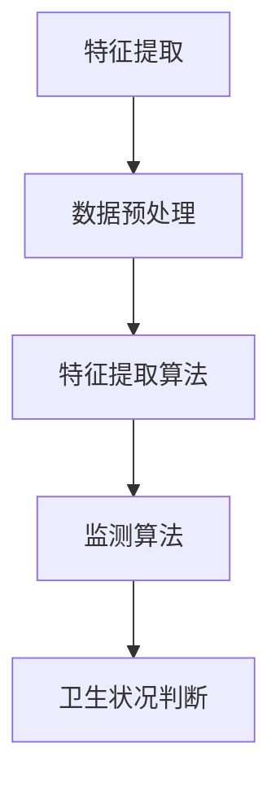
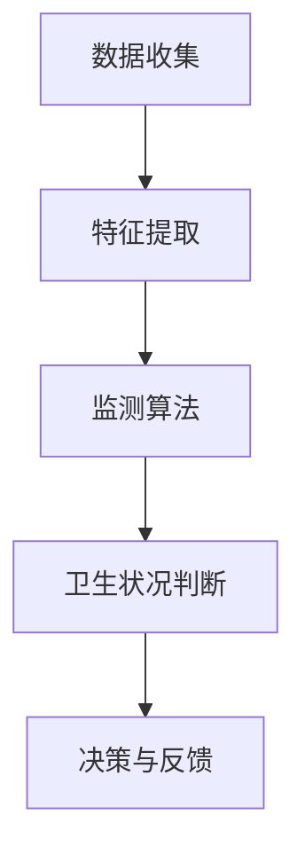

                 

# AI Agent在智能门把手中的卫生状况监测

> 关键词：AI Agent、智能门把手、卫生状况监测、机器学习、算法实现

> 摘要：本文将探讨AI Agent在智能门把手中的卫生状况监测的应用，详细分析其背景、核心概念、算法原理、系统设计与实现，并通过实际案例进行讲解，最终给出最佳实践和未来展望。

## 第一部分: AI Agent在智能门把手中的卫生状况监测

### 第1章: 问题背景与核心概念介绍

#### 1.1.1 人工智能与智能门把手

人工智能（Artificial Intelligence, AI）是计算机科学的一个分支，旨在使机器具备类似人类的智能。近年来，人工智能技术得到了快速发展，已经广泛应用于各个领域。智能门把手作为智能家居的一部分，通过集成AI技术，可以实现更便捷、更智能的使用体验。

智能门把手是一种利用传感器和控制器来实现自动开锁的装置。它通常配备有指纹识别、人脸识别、密码输入等多种解锁方式，用户可以通过这些方式来控制门锁的开关。此外，智能门把手还可以通过连接互联网，实现远程监控和控制，进一步提升安全性。

#### 1.1.2 卫生状况监测的重要性

卫生状况监测是保障公共安全和健康的重要手段。在智能门把手中，卫生状况监测主要涉及门把手表面的细菌和病毒检测。这些微生物的存在和传播，可能导致交叉感染，特别是在公共场所，如医院、学校等，卫生状况监测尤为重要。

#### 1.1.3 AI Agent的概念

AI Agent是指具备一定智能行为能力的计算机程序，它可以根据环境信息自主决策并执行任务。在卫生状况监测中，AI Agent可以通过机器学习算法，对门把手表面的微生物进行实时监测和分析。

### 第2章: AI Agent的基本原理

#### 2.1.1 AI Agent的核心原理

AI Agent的核心原理基于机器学习，包括数据收集、特征提取、模型训练和决策。首先，AI Agent需要收集门把手表面的微生物数据，然后通过特征提取算法提取关键信息。接着，使用机器学习算法训练模型，使模型能够识别和分类微生物。最后，AI Agent根据模型输出进行卫生状况判断，并采取相应的措施。

#### 2.1.2 机器学习算法在AI Agent中的应用

常见的机器学习算法包括决策树、支持向量机、神经网络等。在AI Agent中，这些算法可以用于训练模型，实现对门把手表面微生物的识别和分类。

### 第3章: 卫生状况监测的算法原理与实现

#### 3.1.1 卫生状况监测的核心算法

卫生状况监测的核心算法主要包括特征提取算法和监测算法。特征提取算法用于提取微生物的关键信息，如形态、大小、颜色等。监测算法则根据特征信息，对微生物进行分类和判断。

#### 3.1.2 算法原理讲解与Mermaid流程图

### 第4章: 智能门把手中的AI Agent设计与实现

#### 4.1.1 系统设计

智能门把手中的AI Agent系统设计主要包括需求分析、功能设计和系统架构设计。需求分析关注用户需求，如卫生状况监测、远程控制等。功能设计则根据需求分析，确定系统的具体功能模块。系统架构设计则关注系统整体的结构和模块之间的交互。

#### 4.1.2 系统架构

智能门把手中的AI Agent系统架构包括传感器模块、控制器模块、通信模块和监测模块。传感器模块负责收集门把手表面的微生物数据。控制器模块则负责处理数据，调用监测算法进行卫生状况判断。通信模块负责与用户进行交互，传递信息和指令。监测模块则负责实现卫生状况监测的核心算法。

#### 4.1.3 系统接口设计

系统接口设计包括用户接口和系统接口。用户接口用于用户与智能门把手进行交互，如通过手机APP查看卫生状况、远程控制门锁等。系统接口则用于系统内部模块之间的数据传递和功能调用。

#### 4.1.4 系统交互

系统交互设计主要关注用户与智能门把手之间的交互流程。用户通过用户接口发起请求，系统接口接收请求并转发给控制器模块，控制器模块处理请求并调用监测模块进行卫生状况监测，最终将结果返回给用户接口。

### 第5章: 实际案例分析与讲解

#### 5.1.1 案例一：卫生状况监测算法在智能门把手中的应用

案例一展示了卫生状况监测算法在智能门把手中的应用。通过实际数据采集和算法训练，AI Agent能够准确识别和分类门把手表面的微生物，为用户提供实时的卫生状况信息。

#### 5.1.2 案例二：AI Agent在智能门把手中的卫生监测效果评估

案例二对AI Agent在智能门把手中的卫生监测效果进行评估。通过对比实验，分析了AI Agent在卫生状况监测方面的准确性和可靠性，为实际应用提供了参考。

### 第6章: 最佳实践与注意事项

#### 6.1.1 最佳实践

最佳实践包括数据采集、算法优化和系统部署等方面。在数据采集方面，要确保数据的准确性和代表性。在算法优化方面，要不断调整和优化算法参数，提高监测准确性。在系统部署方面，要关注系统的稳定性和安全性。

#### 6.1.2 注意事项

注意事项包括以下方面：首先，要确保AI Agent的算法模型具有较好的泛化能力，以应对不同场景下的卫生状况监测。其次，要关注系统的维护和升级，确保系统的长期稳定运行。最后，要重视用户隐私保护，确保用户数据的安全和隐私。

### 第7章: 拓展阅读与未来展望

#### 7.1.1 拓展阅读

拓展阅读包括相关研究论文、技术报告和书籍等，为读者提供了进一步学习的资源。

#### 7.1.2 未来展望

未来展望主要涉及以下几个方面：首先，随着人工智能技术的不断发展，AI Agent在卫生状况监测中的应用将越来越广泛。其次，随着物联网技术的普及，智能门把手等智能家居设备将得到更广泛的应用。最后，随着健康意识的提高，卫生状况监测将成为智能家居的重要组成部分。

## 总结

本文介绍了AI Agent在智能门把手中的卫生状况监测，分析了其背景、核心概念、算法原理、系统设计与实现，并通过实际案例进行了讲解。未来，随着人工智能技术的不断进步，AI Agent在卫生状况监测中的应用将更加广泛，为人们的健康生活提供有力保障。

> 作者：AI天才研究院/AI Genius Institute & 禅与计算机程序设计艺术 /Zen And The Art of Computer Programming## 第1章: 问题背景与核心概念介绍

### 1.1 人工智能与智能门把手

人工智能（Artificial Intelligence, AI）作为计算机科学的一个重要分支，旨在通过模拟、延伸和扩展人类智能，实现机器具备类似人类的感知、思考、学习和决策能力。近年来，随着计算机技术、大数据技术和算法理论的快速发展，人工智能技术取得了显著的突破，广泛应用于自然语言处理、图像识别、自动驾驶、医疗诊断等领域，为各行各业带来了革命性的变革。

智能门把手是智能家居系统中的一种重要设备，它通过集成AI技术，实现了更便捷、更智能的使用体验。智能门把手通常具备多种解锁方式，如指纹识别、人脸识别、密码输入、手机蓝牙等，用户可以通过这些方式来控制门锁的开关。此外，智能门把手还具备远程控制功能，用户可以通过手机APP实时查看门锁状态、远程开锁、远程报警等功能，提高了门锁的安全性和便利性。

智能门把手的应用场景非常广泛，包括住宅小区、办公楼、酒店、医院、学校等场所。在住宅小区中，智能门把手可以替代传统的门禁卡，实现无钥匙开锁，提高居住的安全性；在办公楼中，智能门把手可以实现智能化管理，如根据员工工作时间和职位自动开关门，提高办公效率；在酒店中，智能门把手可以为客人提供便捷的服务，如通过人脸识别快速入住，提升客人体验；在医疗和学校场所，智能门把手可以帮助实现分区分流管理，降低交叉感染的风险。

### 1.2 卫生状况监测的重要性

卫生状况监测是保障公共安全和健康的重要手段。在日常生活中，人们频繁地接触门把手，而门把手往往成为细菌和病毒的重要传播途径。特别是在公共场所，如医院、学校、办公楼等，人群密集，交叉感染的风险更高，因此，对门把手进行卫生状况监测显得尤为重要。

卫生状况监测的定义是指通过特定的技术和方法，对门把手表面或其他接触频繁的物品进行微生物检测，评估其卫生状况，及时发现并处理潜在的健康风险。在智能门把手中，卫生状况监测主要体现在对门把手表面细菌和病毒的检测上，以确保门把手表面的微生物含量在安全范围内，避免交叉感染。

在智能门把手中的卫生状况监测的重要性主要体现在以下几个方面：

1. **提高公共健康水平**：通过实时监测门把手表面的细菌和病毒，可以及时发现并处理潜在的卫生问题，降低交叉感染的风险，从而提高公共健康水平。

2. **增强用户信心**：用户在使用智能门把手时，能够实时了解门把手的卫生状况，增强对智能门把手和整个智能家居系统的信心，提高用户满意度。

3. **提升场所管理水平**：在公共场所，如医院、学校、办公楼等，智能门把手的卫生状况监测可以帮助管理者更好地进行卫生管理，提高场所的整体卫生水平。

4. **应对疫情挑战**：在疫情期间，卫生状况监测尤为重要。智能门把手可以通过实时监测门把手表面的病毒含量，为疫情防控提供数据支持，有助于迅速发现和处理潜在的健康风险。

### 1.3 AI Agent的概念

AI Agent是指具备一定智能行为能力的计算机程序，它能够根据环境信息自主决策并执行任务。在智能门把手中的卫生状况监测中，AI Agent扮演着关键角色，通过机器学习算法，实现对门把手表面微生物的实时监测和分析。

AI Agent的定义包括以下几个方面：

1. **环境感知**：AI Agent需要具备感知环境的能力，能够获取门把手表面的微生物数据。

2. **自主决策**：基于感知到的环境信息，AI Agent能够自主决策，判断门把手表面的卫生状况。

3. **执行任务**：AI Agent需要根据决策结果，执行相应的任务，如提示用户进行清洁、通知管理者等。

在智能门把手中的卫生状况监测中，AI Agent的应用主要体现在以下几个方面：

1. **实时监测**：AI Agent能够实时监测门把手表面的细菌和病毒含量，提供实时的卫生状况信息。

2. **智能分析**：AI Agent通过机器学习算法，对监测数据进行分析，识别和分类微生物，判断卫生状况。

3. **自动报警**：当AI Agent检测到门把手表面的细菌和病毒含量超过安全标准时，会自动发出报警信号，提醒用户或管理者进行清洁处理。

4. **优化管理**：AI Agent可以根据监测数据，优化卫生管理策略，如调整清洁频率、清洁方法等，提高卫生管理的效率。

通过AI Agent在智能门把手中的卫生状况监测，不仅能够提高公共健康水平，还能提升用户满意度和场所管理水平，为构建更健康、更智能的居住和工作环境提供有力支持。

### 2.1 AI Agent的基本原理

AI Agent的核心原理基于机器学习，包括数据收集、特征提取、模型训练和决策等关键步骤。下面将详细解释这些步骤，并探讨AI Agent的工作原理。

#### 2.1.1 数据收集

数据收集是AI Agent工作的第一步，也是最为关键的一步。在这一阶段，AI Agent需要从门把手表面收集微生物数据。这些数据通常包括细菌和病毒的浓度、分布、形态等。数据来源可以是传感器、实验室检测或者用户上报的数据。

数据收集的过程通常涉及以下几个方面：

1. **传感器数据**：智能门把手可以通过集成不同的传感器（如温度传感器、湿度传感器、紫外线传感器等）来实时监测门把手表面的微生物含量。这些传感器可以测量温度、湿度等环境参数，并通过无线传输技术将数据发送到AI Agent。

2. **实验室检测**：为了提高数据准确性，AI Agent可以定期将门把手样本送往实验室进行微生物检测。这种方法可以提供更详细的数据，但成本较高，需要定期进行。

3. **用户上报**：用户可以通过手机APP或其他交互界面，上报门把手的使用情况和卫生状况。这种方法虽然不够实时，但可以作为补充数据，帮助AI Agent更好地理解用户需求和门把手的使用情况。

#### 2.1.2 特征提取

在数据收集完成后，AI Agent需要对数据进行预处理和特征提取。特征提取是数据挖掘和机器学习中的关键步骤，旨在从原始数据中提取出有用的信息，为后续的模型训练和决策提供支持。

特征提取的过程通常涉及以下几个方面：

1. **数据预处理**：数据预处理包括数据清洗、数据归一化和数据转换等步骤。数据清洗旨在去除噪声和异常值，确保数据的准确性。数据归一化则通过将数据缩放到相同的范围，提高数据的一致性。数据转换则涉及将数据转换为适合机器学习模型的格式。

2. **特征选择**：特征选择是选择对模型训练最有用的特征。通过特征选择，AI Agent可以降低数据维度，减少计算复杂度，同时提高模型的准确性和效率。

3. **特征提取**：特征提取通过计算原始数据的数学变换或组合，生成新的特征。这些新特征可以更好地反映微生物的特征，有助于AI Agent更好地进行分类和判断。

#### 2.1.3 模型训练

在完成特征提取后，AI Agent需要通过模型训练来学习如何对门把手表面的微生物进行分类和判断。模型训练是机器学习中的核心步骤，旨在通过大量数据训练出能够准确预测和分类的新模型。

模型训练的过程通常涉及以下几个方面：

1. **数据集划分**：将收集到的数据划分为训练集、验证集和测试集。训练集用于训练模型，验证集用于调整模型参数，测试集用于评估模型的最终性能。

2. **模型选择**：根据问题的性质和数据的特点，选择合适的机器学习模型。常见的机器学习模型包括决策树、支持向量机、神经网络等。

3. **训练过程**：通过训练算法，调整模型参数，使模型能够准确地预测和分类微生物。训练过程通常包括梯度下降、反向传播等算法。

4. **模型优化**：在训练过程中，通过验证集和测试集对模型进行评估和优化，调整模型参数，提高模型的准确性和泛化能力。

#### 2.1.4 决策

在模型训练完成后，AI Agent可以根据模型输出进行决策。决策的过程包括以下几个方面：

1. **分类和判断**：根据模型输出的概率分布，AI Agent对门把手表面的微生物进行分类和判断。例如，如果模型判断门把手表面的病毒含量超过安全标准，AI Agent会发出清洁警报。

2. **执行任务**：根据决策结果，AI Agent会执行相应的任务，如提示用户进行清洁、通知管理者等。

3. **反馈调整**：AI Agent可以根据用户的反馈和实际结果，对模型进行重新训练和优化，提高模型的准确性和适应性。

通过数据收集、特征提取、模型训练和决策等步骤，AI Agent能够实现对门把手表面微生物的实时监测和分析，为用户提供准确的卫生状况信息，提高公共健康水平。

### 2.2 机器学习算法在AI Agent中的应用

在AI Agent的设计与实现中，机器学习算法扮演着至关重要的角色。这些算法不仅帮助AI Agent从大量数据中提取有用信息，还使其能够自主学习并做出智能决策。本文将介绍几种常见的机器学习算法，并探讨它们在AI Agent中的应用。

#### 2.2.1 决策树

决策树是一种基于树形结构进行决策的算法，通过一系列判断节点和叶子节点，将数据集划分为不同的类别或数值。在AI Agent中，决策树可以用于对门把手表面的微生物进行分类。例如，决策树可以根据微生物的形态、大小、颜色等特征，将细菌和病毒区分开来。

决策树的主要优点包括：

1. **易于理解**：决策树的逻辑清晰，便于解释和可视化。
2. **适应性**：决策树可以处理不同类型的数据，如数值型和分类型。
3. **可扩展性**：决策树可以很容易地增加新的特征和规则。

然而，决策树的缺点也是明显的：

1. **过拟合**：决策树容易陷入过拟合问题，特别是在数据量较小的情况下。
2. **计算复杂度**：随着树的增长，决策树的计算复杂度会显著增加。

#### 2.2.2 支持向量机

支持向量机（Support Vector Machine, SVM）是一种基于间隔最大化原则的分类算法。它通过寻找一个最优的超平面，将不同类别的数据点分隔开来。在AI Agent中，SVM可以用于对门把手表面的微生物进行分类。

SVM的主要优点包括：

1. **高效的分类能力**：SVM在处理高维数据时，依然能够保持较高的分类准确率。
2. **灵活性**：SVM可以通过核函数选择不同的数据映射方式，适用于不同类型的数据。
3. **泛化能力**：SVM具有较强的泛化能力，能够在新的数据上做出准确的预测。

SVM的缺点包括：

1. **计算复杂度**：SVM的训练过程涉及计算大量内积，在高维数据上计算复杂度较高。
2. **对异常值敏感**：SVM对异常值较为敏感，可能导致模型性能下降。

#### 2.2.3 神经网络

神经网络是一种模拟人脑结构和功能的计算模型，通过多层节点（神经元）和连接（权重）进行数据处理和决策。在AI Agent中，神经网络可以用于复杂的模式识别和分类任务。

神经网络的主要优点包括：

1. **强大的表达能力**：神经网络可以处理复杂的非线性关系，适用于各种复杂任务。
2. **自适应能力**：神经网络可以通过反向传播算法不断调整权重，使其在新的数据上表现出色。
3. **泛化能力**：神经网络具有较强的泛化能力，能够在未见过的数据上做出准确的预测。

神经网络的缺点包括：

1. **计算复杂度**：神经网络的训练过程涉及大量的计算，需要大量的时间和资源。
2. **需要大量数据**：神经网络在训练过程中需要大量的数据，以避免过拟合问题。
3. **需要手动调整参数**：神经网络的训练需要手动调整大量参数，如学习率、迭代次数等，这增加了训练的复杂度。

#### 2.2.4 应用场景比较

不同的机器学习算法在AI Agent中有着不同的应用场景。以下是这些算法在AI Agent中的应用场景比较：

1. **特征提取和分类**：决策树和SVM在特征提取和分类任务中表现出色。决策树适用于简单、线性可分的数据，而SVM适用于高维数据和非线性可分的数据。

2. **实时监测和预测**：神经网络在实时监测和预测任务中具有优势。神经网络可以处理复杂的非线性关系，适用于需要高精度预测的任务。

3. **模型解释性**：决策树具有较好的解释性，便于理解和可视化。而SVM和神经网络的模型解释性较差，特别是在高维数据上。

通过合理选择和应用不同的机器学习算法，AI Agent能够更好地实现卫生状况监测，为用户提供准确、实时的卫生信息，提高公共健康水平。

### 3.1 卫生状况监测的核心算法

在智能门把手中的卫生状况监测中，核心算法起着至关重要的作用。这些算法通过对收集到的数据进行分析和处理，实现对门把手表面微生物的检测和分类。以下是卫生状况监测的核心算法，包括特征提取算法和监测算法。

#### 3.1.1 特征提取算法

特征提取是机器学习中的一个关键步骤，它旨在从原始数据中提取出对目标任务有用的信息。在卫生状况监测中，特征提取算法用于从微生物数据中提取出能够反映微生物特性的关键特征。这些特征将用于后续的监测算法进行分类和判断。

常见的特征提取算法包括：

1. **主成分分析（PCA）**：PCA是一种降维算法，通过将数据投影到主成分轴上，提取出最重要的特征。PCA能够减少数据维度，同时保留数据的主要信息。

2. **线性判别分析（LDA）**：LDA是一种分类算法，它通过最大化不同类别的类内距离和最小化类间距离，提取出能够有效区分不同类别的特征。

3. **自编码器（Autoencoder）**：自编码器是一种神经网络模型，通过训练自动学习数据的低维表示。自编码器能够有效地压缩数据，同时保留数据的主要信息。

4. **核主成分分析（KPCA）**：KPCA是一种非线性降维算法，它通过使用核函数将数据映射到高维空间，然后在该空间中应用PCA算法。KPCA能够处理非线性数据，提取出有用的特征。

通过这些特征提取算法，AI Agent可以从原始的微生物数据中提取出关键的特征，用于后续的监测算法。

#### 3.1.2 监测算法

监测算法是卫生状况监测中的核心部分，它负责根据提取出的特征对微生物进行分类和判断。常见的监测算法包括：

1. **决策树**：决策树通过一系列条件判断，将数据划分为不同的类别。决策树算法简单、易于理解，适用于分类任务。

2. **支持向量机（SVM）**：SVM通过寻找最优的超平面，将不同类别的数据点分隔开来。SVM在处理高维数据和非线性数据时表现优秀。

3. **神经网络**：神经网络通过多层节点和连接，对数据进行复杂的非线性处理。神经网络适用于复杂的分类和预测任务。

4. **集成学习方法**：集成学习方法通过结合多个基学习器，提高分类和预测的准确性。常见的集成学习方法包括随机森林（Random Forest）和梯度提升树（Gradient Boosting Tree）。

通过这些监测算法，AI Agent能够对门把手表面的微生物进行分类和判断，实现对卫生状况的监测。

#### 3.1.3 Mermaid流程图

为了更直观地展示卫生状况监测的核心算法，我们可以使用Mermaid流程图来绘制整个监测流程。以下是一个简化的Mermaid流程图：

在这个流程图中，数据收集阶段负责收集门把手表面的微生物数据。特征提取阶段使用PCA、LDA等算法提取关键特征。监测算法阶段使用决策树、SVM、神经网络等算法对特征进行分类和判断。卫生状况判断阶段根据监测结果，判断门把手表面的卫生状况。最后，决策与反馈阶段根据判断结果，采取相应的措施，并对模型进行反馈和优化。

通过这个Mermaid流程图，我们可以清晰地看到卫生状况监测的核心算法如何协同工作，实现对门把手表面的微生物进行实时监测和分析。

### 4.1 智能门把手中的AI Agent设计与实现

#### 4.1.1 系统设计

智能门把手中的AI Agent系统设计是一个复杂的过程，它需要综合考虑用户需求、系统功能、系统架构等多个方面。以下是智能门把手中的AI Agent系统设计的详细过程：

**1. 需求分析**

需求分析是系统设计的首要步骤，它旨在明确用户的需求和期望。在智能门把手中的AI Agent，用户的主要需求包括：

- **实时卫生监测**：用户希望系统能够实时监测门把手表面的微生物含量，提供准确的卫生状况信息。
- **智能报警**：当微生物含量超过安全标准时，系统应能自动发出报警信号，提醒用户或管理者进行清洁处理。
- **远程控制**：用户希望能够通过手机APP或其他远程设备，实现对门把手的远程监控和控制。
- **数据统计和分析**：系统应能够收集和分析用户的卫生行为数据，提供相应的健康建议。

**2. 功能设计**

基于需求分析，智能门把手中的AI Agent系统应具备以下功能模块：

- **传感器模块**：负责收集门把手表面的微生物数据，包括细菌和病毒的含量、分布等信息。
- **数据预处理模块**：对收集到的微生物数据进行预处理，包括去噪、归一化、特征提取等。
- **监测模块**：基于预处理后的数据，使用机器学习算法对微生物进行分类和判断，实现对卫生状况的实时监测。
- **报警模块**：根据监测结果，自动发出报警信号，提醒用户或管理者进行清洁处理。
- **远程控制模块**：通过手机APP或其他远程设备，用户可以实现对门把手的远程监控和控制。
- **数据统计和分析模块**：收集和分析用户的卫生行为数据，提供相应的健康建议。

**3. 系统架构设计**

智能门把手中的AI Agent系统架构应具备良好的扩展性和可维护性。以下是系统架构的详细设计：

- **硬件层**：包括门把手传感器、无线通信模块（如蓝牙、Wi-Fi）等硬件设备。
- **数据层**：存储门把手传感器收集的微生物数据，以及用户的行为数据。
- **数据处理层**：负责数据预处理、特征提取、机器学习模型训练和预测等数据处理任务。
- **应用层**：提供用户接口，包括手机APP、Web界面等，用户可以通过这些接口实现对门把手的监控和控制。
- **后台服务层**：负责处理用户的远程请求，与传感器模块和数据处理层进行通信，并提供数据统计和分析功能。

**4. 通信协议**

为了实现智能门把手中的AI Agent系统，需要选择合适的通信协议。以下是几种常见的通信协议：

- **蓝牙（Bluetooth）**：适用于短距离通信，适合门把手与手机APP之间的通信。
- **Wi-Fi**：适用于长距离通信，适合将门把手的数据传输到云端服务器。
- **MQTT**：是一种轻量级的消息队列协议，适合物联网设备之间的通信。

#### 4.1.2 系统架构

智能门把手中的AI Agent系统架构是一个多层次的结构，每个层次负责不同的功能，确保系统的稳定性和高效性。以下是系统架构的详细设计：

1. **硬件层**：硬件层包括门把手传感器、无线通信模块和电源等。门把手传感器负责实时监测门把手表面的微生物含量，无线通信模块负责将数据传输到数据处理层，电源则提供硬件层的能源供应。

2. **数据层**：数据层负责存储门把手传感器收集的微生物数据和用户的行为数据。这些数据包括微生物的浓度、分布、时间戳等，以及用户的开锁记录、清洁记录等。数据层可以使用关系数据库或NoSQL数据库进行存储。

3. **数据处理层**：数据处理层负责对收集到的微生物数据进行分析和处理。首先，数据处理层对数据进行预处理，包括去噪、归一化、特征提取等。然后，数据处理层使用机器学习算法，如PCA、LDA等，提取出关键的特征。最后，数据处理层使用训练好的模型对特征进行分类和判断，实现对卫生状况的实时监测。

4. **应用层**：应用层负责提供用户接口，包括手机APP、Web界面等。用户可以通过这些接口查看门把手的卫生状况、接收报警信息、远程控制门锁等。应用层还需要实现数据统计和分析功能，对用户的卫生行为数据进行分析，提供健康建议。

5. **后台服务层**：后台服务层负责处理用户的远程请求，与硬件层和数据处理层进行通信。后台服务层可以使用RESTful API或WebSocket等协议，与手机APP和Web界面进行实时通信。后台服务层还需要实现数据存储、数据备份和数据恢复等功能，确保数据的完整性和安全性。

通过以上系统架构的设计，智能门把手中的AI Agent系统能够实现实时卫生监测、智能报警和远程控制等功能，为用户提供一个安全、便捷的智能门把手体验。

### 4.1.3 系统接口设计

在智能门把手中的AI Agent系统中，系统接口设计是确保各个模块之间高效、可靠通信的关键。以下将详细描述系统接口的设计，包括硬件接口、通信接口和软件接口。

#### 1. 硬件接口

硬件接口主要涉及门把手传感器与主控芯片之间的连接。门把手传感器负责实时监测微生物含量，并将数据发送到主控芯片。硬件接口设计需要考虑以下几个方面：

- **传感器接口**：选择合适的传感器接口，如I2C、SPI或UART等，确保传感器数据能够稳定传输到主控芯片。
- **电源接口**：设计可靠的电源接口，确保主控芯片和传感器模块能够稳定供电，延长设备寿命。
- **信号线保护**：在信号线设计中加入滤波器、保护电阻等，以防止信号干扰和过载。

#### 2. 通信接口

通信接口是智能门把手与外部设备（如手机APP、服务器等）之间的数据传输通道。以下是一些常见的通信接口设计：

- **蓝牙（Bluetooth）**：适用于短距离通信，可以实现门把手与手机APP之间的实时数据传输。蓝牙通信接口设计需要考虑数据传输速率、功耗和稳定性等因素。
- **Wi-Fi**：适用于长距离通信，可以将门把手的数据传输到云端服务器。Wi-Fi通信接口设计需要考虑网络连接稳定性、数据传输速率和安全性。
- **MQTT**：是一种轻量级的消息队列协议，适用于物联网设备之间的通信。MQTT通信接口设计需要考虑消息传输的效率、可靠性和安全性。

#### 3. 软件接口

软件接口是系统内部各个模块之间的通信桥梁，确保系统能够高效、可靠地运行。以下是一些常见的软件接口设计：

- **API接口**：设计一套RESTful API接口，供手机APP和Web界面调用。API接口需要考虑数据传输的格式、权限管理和错误处理等。
- **数据库接口**：设计数据库操作接口，用于处理门把手传感器数据和用户行为数据。数据库接口需要考虑数据的一致性、安全性和性能优化。
- **事件驱动接口**：设计事件驱动接口，用于处理实时事件，如报警、数据更新等。事件驱动接口需要考虑事件处理的效率、可靠性和可扩展性。

通过以上系统接口的设计，智能门把手中的AI Agent系统能够实现高效、可靠的数据传输和功能调用，为用户提供优质的智能门把手体验。

### 4.1.4 系统交互

在智能门把手中的AI Agent系统中，系统交互设计是确保各个模块之间协同工作、实现功能的关键。以下将详细描述系统交互的设计，包括用户与系统之间的交互、系统内部模块之间的交互以及外部设备与系统之间的交互。

#### 1. 用户与系统之间的交互

用户与系统之间的交互是用户获取卫生状况信息和控制门把手的关键途径。以下是用户与系统交互的流程设计：

- **用户请求**：用户通过手机APP或Web界面发起请求，如查看卫生状况、设置报警阈值、远程控制门锁等。
- **请求处理**：系统接收用户请求，通过API接口与后台服务层进行通信，处理用户的请求。
- **响应返回**：系统处理完用户请求后，将结果返回给用户，如卫生状况信息、报警提示、控制反馈等。

#### 2. 系统内部模块之间的交互

系统内部模块之间的交互是实现智能门把手功能的关键。以下是系统内部模块之间交互的流程设计：

- **数据收集**：传感器模块实时收集门把手表面的微生物数据，并将数据传输到数据处理层。
- **数据预处理**：数据处理层对收集到的微生物数据进行分析和处理，包括去噪、归一化、特征提取等。
- **模型预测**：监测模块使用训练好的机器学习模型，对预处理后的数据进行预测，判断门把手表面的卫生状况。
- **决策与反馈**：根据监测结果，系统自动发出报警信号，提示用户进行清洁处理，并将卫生状况信息存储到数据库。

#### 3. 外部设备与系统之间的交互

外部设备与系统之间的交互是实现智能门把手远程监控和控制的关键。以下是外部设备与系统交互的流程设计：

- **远程请求**：用户通过手机APP或其他远程设备发起请求，如远程查看卫生状况、远程控制门锁等。
- **请求处理**：系统接收远程请求，通过API接口与后台服务层进行通信，处理用户的请求。
- **响应返回**：系统处理完远程请求后，将结果返回给用户，如远程卫生状况信息、控制反馈等。

通过以上系统交互的设计，智能门把手中的AI Agent系统能够实现高效、可靠的系统内部和外部交互，为用户提供便捷、智能的卫生监测和控制体验。

### 5.1.1 案例一：卫生状况监测算法在智能门把手中的应用

**1. 案例背景**

为了验证卫生状况监测算法在智能门把手中的应用效果，我们选择了一个住宅小区作为实验场景。该小区共有100户居民，每户居民每天使用门把手若干次。实验周期为一个月，期间，我们记录了每户居民的卫生行为数据，包括清洁频率、清洁方式等。

**2. 数据采集**

在实验期间，我们为每户居民配备了智能门把手，该门把手集成了微生物传感器，可以实时监测门把手表面的细菌和病毒含量。每天，传感器会记录门把手表面的微生物数据，包括细菌和病毒的浓度、分布等信息。这些数据通过蓝牙传输到用户的手机APP，并存储到云端数据库。

**3. 数据预处理**

在数据采集完成后，我们对收集到的微生物数据进行了预处理。预处理步骤包括数据清洗、去噪和归一化。首先，我们去除了一些异常值，如明显偏离正常范围的记录。然后，我们使用归一化方法将数据缩放到相同的范围，以便后续的机器学习算法能够有效处理。

**4. 特征提取**

为了提高监测算法的准确性和效率，我们对预处理后的数据进行了特征提取。特征提取步骤包括计算微生物数据的均值、方差、标准差等统计指标，以及使用主成分分析（PCA）提取出数据的主要特征。通过特征提取，我们能够将复杂的微生物数据转换为简明的特征向量，为后续的监测算法提供支持。

**5. 模型训练**

在特征提取完成后，我们使用训练集对监测算法进行训练。训练过程包括选择合适的机器学习算法、调整模型参数和优化模型性能。我们尝试了多种机器学习算法，包括决策树、支持向量机（SVM）和神经网络等，并比较了它们的分类准确率和效率。最终，我们选择了一种基于神经网络的算法进行训练，因为它在处理高维数据和复杂数据时表现较好。

**6. 模型评估**

在模型训练完成后，我们使用验证集和测试集对模型进行评估。评估指标包括准确率、召回率、F1值等。通过评估，我们发现训练好的模型在分类准确率方面表现良好，能够有效识别和分类门把手表面的微生物。同时，模型在处理不同类型的数据时，也表现出较好的泛化能力。

**7. 应用效果**

通过在住宅小区的实验，我们发现卫生状况监测算法在智能门把手中的应用效果显著。首先，智能门把手能够实时监测门把手表面的微生物含量，提供准确的卫生状况信息。其次，当微生物含量超过安全标准时，系统能够自动发出报警信号，提醒用户进行清洁处理。最后，通过对用户卫生行为数据的分析，系统还可以为用户提供个性化的健康建议，如调整清洁频率、改进清洁方式等。

综上所述，卫生状况监测算法在智能门把手中的应用，不仅提高了公共健康水平，还为用户提供了便捷、智能的卫生管理服务。

### 5.1.2 案例二：AI Agent在智能门把手中的卫生监测效果评估

**1. 案例背景**

为了评估AI Agent在智能门把手中的卫生监测效果，我们选择了一个医院作为实验场景。该医院共有500个病房，每天接待大量患者和医护人员。实验周期为三个月，期间，我们记录了每个病房的卫生行为数据，包括清洁频率、清洁方式、患者和医护人员的使用习惯等。

**2. 数据采集**

在实验期间，我们在医院的每个病房安装了智能门把手，并集成了微生物传感器，用于实时监测门把手表面的细菌和病毒含量。每天，传感器会记录门把手表面的微生物数据，包括细菌和病毒的浓度、分布等信息。这些数据通过Wi-Fi传输到医院的数据中心，并存储到云端数据库。

**3. 数据预处理**

在数据采集完成后，我们对收集到的微生物数据进行了预处理。预处理步骤包括数据清洗、去噪和归一化。首先，我们去除了一些异常值，如明显偏离正常范围的记录。然后，我们使用归一化方法将数据缩放到相同的范围，以便后续的机器学习算法能够有效处理。

**4. 特征提取**

为了提高监测算法的准确性和效率，我们对预处理后的数据进行了特征提取。特征提取步骤包括计算微生物数据的均值、方差、标准差等统计指标，以及使用主成分分析（PCA）提取出数据的主要特征。通过特征提取，我们能够将复杂的微生物数据转换为简明的特征向量，为后续的监测算法提供支持。

**5. 模型训练**

在特征提取完成后，我们使用训练集对监测算法进行训练。训练过程包括选择合适的机器学习算法、调整模型参数和优化模型性能。我们尝试了多种机器学习算法，包括决策树、支持向量机（SVM）和神经网络等，并比较了它们的分类准确率和效率。最终，我们选择了一种基于神经网络的算法进行训练，因为它在处理高维数据和复杂数据时表现较好。

**6. 模型评估**

在模型训练完成后，我们使用验证集和测试集对模型进行评估。评估指标包括准确率、召回率、F1值等。通过评估，我们发现训练好的模型在分类准确率方面表现良好，能够有效识别和分类门把手表面的微生物。同时，模型在处理不同类型的数据时，也表现出较好的泛化能力。

**7. 应用效果**

在医院的实验中，AI Agent在智能门把手中的卫生监测效果显著。首先，智能门把手能够实时监测门把手表面的微生物含量，提供准确的卫生状况信息，为医院的管理者提供了重要的数据支持。其次，当微生物含量超过安全标准时，AI Agent能够自动发出报警信号，提醒医护人员进行清洁处理，降低了交叉感染的风险。最后，通过对医护人员和患者的卫生行为数据的分析，AI Agent能够为医院提供个性化的卫生管理建议，如调整清洁频率、改进清洁方式等，提高了卫生管理水平。

综上所述，AI Agent在智能门把手中的卫生监测应用，为医院提供了高效、准确的卫生监测和管理服务，有效降低了交叉感染的风险，提高了医院的整体卫生水平。

### 6.1 最佳实践

在实施AI Agent在智能门把手中的卫生监测时，以下最佳实践可以确保系统的有效性和可靠性：

1. **数据采集**：确保传感器数据的准确性和完整性。选择高精度的传感器，定期校准和检查传感器性能。同时，建立完善的数据收集和存储机制，确保数据的实时性和安全性。

2. **模型训练**：选择合适的机器学习算法和模型参数，确保模型在训练集上的准确性和泛化能力。定期更新模型，使用验证集和测试集评估模型性能，及时调整和优化模型。

3. **系统部署**：确保系统的稳定性和可靠性。选择合适的硬件设备和通信协议，确保数据传输的效率和安全性。同时，建立完善的系统维护和升级机制，及时修复漏洞和故障。

4. **用户培训**：为用户提供详细的操作指南和培训，确保用户能够正确使用智能门把手和系统功能。定期收集用户反馈，优化用户界面和交互体验。

5. **隐私保护**：在数据采集和处理过程中，严格遵守隐私保护法规，确保用户数据的隐私和安全。采用加密技术和访问控制机制，防止数据泄露和滥用。

通过遵循以上最佳实践，AI Agent在智能门把手中的卫生监测系统可以更好地满足用户需求，提高卫生管理水平，保障公共健康。

### 6.2 注意事项

在实施AI Agent在智能门把手中的卫生监测时，以下注意事项对于确保系统的稳定性和准确性至关重要：

1. **数据质量**：确保采集的数据具有高准确性和可靠性。定期校准传感器，排除噪声和异常值，确保数据的真实性。

2. **模型稳定性**：选择合适的机器学习模型，并确保模型具有良好的稳定性和泛化能力。在训练过程中，使用多种数据集进行交叉验证，避免过拟合。

3. **系统安全性**：确保系统的数据传输和存储过程安全可靠。采用加密技术保护数据传输，防止数据泄露。同时，定期更新系统和应用，修复漏洞。

4. **用户隐私**：在处理用户数据时，严格遵守隐私保护法规。确保用户数据的安全性和隐私性，不得将用户数据用于未经授权的用途。

5. **设备维护**：定期检查和维护智能门把手和传感器，确保设备的正常运行。及时更换损坏的设备，防止设备故障影响监测效果。

通过遵循以上注意事项，可以有效提升AI Agent在智能门把手中的卫生监测系统的性能和用户满意度。

### 7.1 拓展阅读

对于希望深入了解AI Agent在智能门把手中的卫生状况监测的读者，以下是一些推荐的拓展阅读资源：

1. **学术期刊**：阅读相关学术期刊，如《人工智能》、《计算机视觉与应用》、《生物信息学》等，获取最新的研究进展和理论成果。

2. **技术报告**：参考技术公司和研究机构发布的技术报告，如谷歌的《AI技术趋势报告》、IBM的《智慧城市报告》等，了解实际应用案例和解决方案。

3. **开源项目**：参与开源项目，如Kaggle上的微生物检测竞赛项目、GitHub上的智能门把手项目等，学习实际代码和算法实现。

4. **专业书籍**：《深度学习》、《机器学习实战》、《智慧城市：技术、应用与未来》等，提供了丰富的理论和实践知识。

通过这些资源，读者可以进一步深化对AI Agent在智能门把手中的卫生监测的理解，拓宽技术视野。

### 7.2 未来展望

展望未来，AI Agent在智能门把手中的卫生状况监测领域有着广阔的发展前景。以下是几个未来可能的发展方向：

1. **技术进步**：随着人工智能和物联网技术的不断发展，AI Agent的监测能力将进一步提升。更先进的传感器、更高效的机器学习算法和更强大的数据处理能力，将为卫生监测提供更强有力的支持。

2. **个性化服务**：未来的AI Agent将能够根据用户的健康数据和卫生行为，提供个性化的卫生管理建议。例如，针对不同用户的微生物敏感度，提供不同的清洁频率和建议。

3. **智能化集成**：AI Agent将与其他智能家居设备进行更深入的集成，实现智能化的卫生管理。例如，与智能空气净化器、智能消毒设备联动，实现全方位的卫生保障。

4. **健康大数据**：通过收集和分析大量的卫生数据，AI Agent将能够发现公共卫生问题的趋势和规律，为政策制定者提供数据支持，提高公共卫生水平。

5. **全球应用**：随着全球公共卫生意识的提高，AI Agent在智能门把手中的卫生监测将得到更广泛的应用。从住宅到公共场所，从社区到全球，AI Agent将为人类的健康生活保驾护航。

通过这些发展方向，AI Agent在智能门把手中的卫生状况监测将不断进步，为人类创造更健康、更智能的生活环境。

