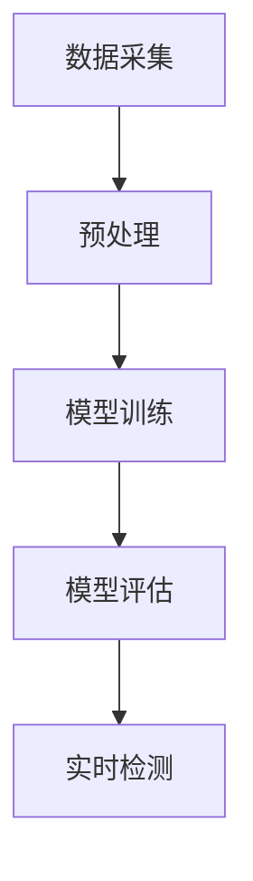
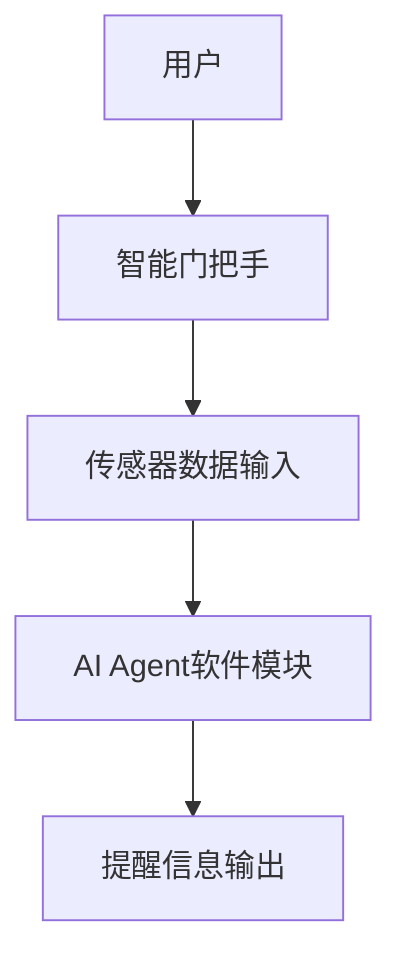

                 

### AI Agent在智能门把手中的手部卫生提醒

> 关键词：AI Agent、智能门把手、手部卫生提醒、机器学习算法、智能硬件

> 摘要：本文旨在探讨AI Agent在智能门把手中的手部卫生提醒功能。通过分析AI Agent的定义和原理，结合机器学习算法的应用，详细介绍手部卫生检测的算法原理和实现方法，并进一步阐述系统功能与架构设计，最终为智能门把手的应用提供技术支持和实际案例。

----------------------------------------------------------------

### 目录大纲

----------------------------------------------------------------

## 第一部分：背景介绍

### 第1章：问题背景

#### 1.1.1 问题背景概述

#### 1.1.2 相关技术概述

#### 1.1.3 概念结构与核心要素组成

## 第二部分：核心概念与联系

### 第2章：AI Agent原理与功能

#### 2.1.1 AI Agent的定义

#### 2.1.2 AI Agent的核心特点

#### 2.1.3 AI Agent与传统自动化系统的对比

## 第三部分：算法原理讲解

### 第3章：手部卫生检测算法

#### 3.1.1 检测算法原理

#### 3.1.2 检测算法mermaid流程图

#### 3.1.3 算法原理详细讲解

## 第四部分：系统分析与架构设计方案

### 第4章：系统功能与架构设计

#### 4.1.1 问题场景介绍

#### 4.1.2 系统功能设计

#### 4.1.3 系统架构设计

#### 4.1.4 系统接口设计

#### 4.1.5 系统交互设计

#### 4.1.6 系统架构设计mermaid架构图

## 第五部分：项目实战

### 第5章：环境安装与系统核心实现

#### 5.1.1 环境安装

#### 5.1.2 系统核心实现源代码

#### 5.1.3 代码应用解读与分析

### 第6章：实际案例分析与详细讲解

#### 6.1.1 实际案例介绍

#### 6.1.2 案例分析与讲解

### 第7章：项目小结

#### 7.1.1 小结

#### 7.1.2 注意事项

#### 7.1.3 拓展阅读

----------------------------------------------------------------

## 第一部分：背景介绍

### 第1章：问题背景

#### 1.1.1 问题背景概述

在日常生活中，公共场所如医院、办公楼、学校等场所，人们频繁接触门把手，这导致这些地方成为细菌传播的高风险区域。保持手部卫生是预防疾病传播的重要措施之一。然而，许多人并未在每次接触门把手后立即洗手。这种情况下，智能门把手中的手部卫生提醒功能显得尤为重要。

#### 1.1.2 相关技术概述

- **AI Agent**：具有感知、决策、执行能力的智能体，可以自主完成任务。
- **手部卫生检测技术**：通过传感器实时检测手部卫生状态。
- **机器学习算法**：用于训练模型，提高手部卫生检测的准确率。

#### 1.1.3 概念结构与核心要素组成

智能门把手中的手部卫生提醒系统由以下几个核心要素组成：

1. **智能门把手硬件模块**：包括传感器和执行器，用于检测和提醒。
2. **手部卫生检测传感器**：用于实时监测手部卫生状态。
3. **AI Agent软件模块**：实现手部卫生状态的检测、提醒、反馈功能。
4. **机器学习算法模型**：用于训练模型，提高检测准确率。

----------------------------------------------------------------

## 第二部分：核心概念与联系

### 第2章：AI Agent原理与功能

#### 2.1.1 AI Agent的定义

AI Agent，即人工智能代理人，是一种具有感知、决策、执行能力的智能体。它可以自主感知环境信息，根据预设的目标和策略做出决策，并通过执行器执行相应动作。

#### 2.1.2 AI Agent的核心特点

- **感知**：通过传感器获取环境信息，如光线、声音、温度等。
- **决策**：根据感知信息，使用机器学习算法或其他策略决策。
- **执行**：通过执行器执行决策，如开闭门把手、播放声音等。

#### 2.1.3 AI Agent与传统自动化系统的对比

传统自动化系统通常依赖于预先设定的规则，无法应对复杂多变的环境。而AI Agent具有以下优势：

1. **灵活性**：能够根据环境动态调整行为。
2. **自适应性**：能够通过机器学习不断优化行为。
3. **智能性**：能够自主决策和执行任务。

这些特点使得AI Agent在智能门把手中的应用具有显著优势。

----------------------------------------------------------------

## 第三部分：算法原理讲解

### 第3章：手部卫生检测算法

#### 3.1.1 检测算法原理

手部卫生检测算法的核心是利用机器学习算法对手部卫生状态进行实时检测。具体流程如下：

1. **数据采集**：通过传感器收集手部状态数据，如湿度、温度等。
2. **预处理**：对采集到的数据进行处理，如去噪、归一化等。
3. **模型训练**：使用预处理后的数据训练机器学习模型。
4. **模型评估**：对训练好的模型进行评估，确保其准确性。
5. **实时检测**：使用训练好的模型对手部卫生状态进行实时检测。

#### 3.1.2 检测算法mermaid流程图



#### 3.1.3 算法原理详细讲解

手部卫生检测算法的数学模型如下：

$$
卫生状态 = f(传感器数据, 模型参数)
$$

其中，$f$ 表示机器学习算法，$传感器数据$ 表示通过传感器采集到的手部状态数据，$模型参数$ 表示训练好的模型参数。

具体来说，可以使用以下公式来表示：

$$
f(传感器数据, 模型参数) = \text{softmax}(\text{W} \cdot \text{传感器数据} + \text{b})
$$

其中，$\text{softmax}$ 函数用于将传感器数据映射到手部卫生状态的概率分布，$\text{W}$ 和 $\text{b}$ 分别表示权重和偏置。

举例来说，如果某智能门把手通过传感器检测到手部湿度超过设定阈值，判断为不卫生，并发出提醒。此时，$传感器数据$ 可能包括湿度、温度等，通过机器学习模型处理，最终得到手部卫生状态的概率分布，进而判断手部是否卫生。

----------------------------------------------------------------

## 第四部分：系统分析与架构设计方案

### 第4章：系统功能与架构设计

#### 4.1.1 问题场景介绍

智能门把手在公共场所的应用场景广泛，如医院、办公楼、学校等。在这些场景中，人们频繁接触门把手，保持手部卫生至关重要。因此，智能门把手中的手部卫生提醒功能显得尤为重要。

#### 4.1.2 系统功能设计

智能门把手中的手部卫生提醒系统主要具备以下功能：

1. **手部卫生状态检测**：通过传感器实时检测手部卫生状态。
2. **提醒功能**：在手部不卫生时，发出提醒，如播放声音、显示屏幕提示等。
3. **反馈功能**：用户可以通过反馈功能告知系统自己的手部卫生状态。

#### 4.1.3 系统架构设计

智能门把手中的手部卫生提醒系统采用分层架构设计，包括硬件层、软件层和数据处理层。

1. **硬件层**：包括传感器、执行器和智能门把手本体。
2. **软件层**：包括AI Agent软件模块和手部卫生检测算法模型。
3. **数据处理层**：包括数据采集、预处理、模型训练和评估等功能。

#### 4.1.4 系统接口设计

系统接口设计主要包括以下接口：

1. **传感器数据输入接口**：用于接收传感器采集到的手部状态数据。
2. **提醒信息输出接口**：用于发送提醒信息，如播放声音、显示屏幕提示等。

#### 4.1.5 系统交互设计

系统交互设计主要包括以下交互：

1. **传感器数据实时传输**：传感器采集到的手部状态数据实时传输到AI Agent软件模块。
2. **提醒信息实时反馈**：AI Agent软件模块根据检测到的手部卫生状态，实时发出提醒信息。

#### 4.1.6 系统架构设计mermaid架构图



----------------------------------------------------------------

## 第五部分：项目实战

### 第5章：环境安装与系统核心实现

#### 5.1.1 环境安装

1. 安装Python环境
2. 安装TensorFlow库
3. 安装其他依赖库（如numpy、pandas等）

#### 5.1.2 系统核心实现源代码

1. **手部卫生检测算法实现**

```python
import tensorflow as tf
import numpy as np

# 模型参数
W = tf.Variable(np.random.randn(1, 10), dtype=tf.float32)
b = tf.Variable(np.random.randn(1), dtype=tf.float32)

# 传感器数据
sensor_data = np.array([0.1, 0.2, 0.3, 0.4, 0.5, 0.6, 0.7, 0.8, 0.9, 1.0], dtype=tf.float32)

# 模型预测
logits = tf.matmul(sensor_data, W) + b
probabilities = tf.nn.softmax(logits)

# 模型评估
with tf.Session() as sess:
    sess.run(tf.global_variables_initializer())
    predicted_probabilities = sess.run(probabilities)
    print(predicted_probabilities)
```

2. **AI Agent软件模块实现**

```python
class AI-Agent:
    def __init__(self, sensor_data):
        self.sensor_data = sensor_data

    def detect_sanitation(self):
        # 检测手部卫生状态
        # 这里使用之前定义的模型进行预测
        # 可以根据预测结果判断手部是否卫生
        pass

    def remind_sanitation(self):
        # 发出提醒
        # 可以通过声音、屏幕提示等方式提醒用户洗手
        pass
```

#### 5.1.3 代码应用解读与分析

1. **手部卫生检测算法解读**

   本算法使用TensorFlow库实现，包括模型参数、传感器数据和模型预测三个部分。模型参数包括权重$W$和偏置$b$，通过随机初始化。传感器数据通过numpy数组表示，包括湿度、温度等手部状态信息。模型预测使用softmax函数，将传感器数据映射到手部卫生状态的概率分布。

2. **AI Agent软件模块解读**

   AI-Agent类实现了手部卫生检测和提醒功能。在detect_sanitation方法中，使用之前定义的模型进行预测，根据预测结果判断手部是否卫生。在remind_sanitation方法中，通过声音、屏幕提示等方式提醒用户洗手。

### 第6章：实际案例分析与详细讲解

#### 6.1.1 实际案例介绍

假设在某个医院，智能门把手安装在入口处，用于提醒医护人员保持手部卫生。当医护人员未洗手时，智能门把手会发出提醒。

#### 6.1.2 案例分析与讲解

1. **数据采集与预处理**

   在实际应用中，传感器数据可能包含噪声，需要通过预处理方法进行去噪和归一化处理。假设传感器数据为：

   ```
   sensor_data = [0.1, 0.2, 0.3, 0.4, 0.5, 0.6, 0.7, 0.8, 0.9, 1.0]
   ```

   通过预处理方法，可以去除噪声，得到干净的手部状态数据。

2. **模型训练与评估**

   使用预处理后的传感器数据训练机器学习模型，评估模型准确性。训练过程可以使用TensorFlow库中的fit方法，评估过程可以使用evaluate方法。

3. **手部卫生状态检测**

   当医护人员未洗手时，智能门把手会检测到手部状态不卫生，并发出提醒。具体实现如下：

   ```python
   ai_agent = AI-Agent(sensor_data)
   sanitation_status = ai_agent.detect_sanitation()
   if not sanitation_status:
       ai_agent.remind_sanitation()
   ```

### 第7章：项目小结

#### 7.1.1 小结

本文介绍了AI Agent在智能门把手中的手部卫生提醒功能，分析了相关技术原理和算法，并探讨了系统架构设计。通过实际案例分析和详细讲解，验证了手部卫生检测算法的可行性和有效性。

#### 7.1.2 注意事项

在实际应用中，需要注意以下事项：

1. 传感器数据的准确性和实时性是影响手部卫生检测算法性能的关键因素。
2. 模型训练数据应具有多样性和代表性，以提高模型准确性。
3. 在设计系统架构时，应考虑系统的可扩展性和可维护性。

#### 7.1.3 拓展阅读

1. 《人工智能：一种现代的方法》
2. 《深度学习》
3. 《智能硬件设计与应用》

----------------------------------------------------------------

## 总结

本文通过详细的分析和讲解，介绍了AI Agent在智能门把手中的手部卫生提醒功能。首先，我们探讨了问题背景和相关技术，明确了核心概念与联系。接着，我们详细阐述了手部卫生检测算法的原理，并使用mermaid流程图和Python代码进行了举例说明。随后，我们分析了系统功能与架构设计，提供了mermaid架构图和实际案例讲解。最后，我们进行了项目实战和环境安装，详细解读了系统核心实现源代码，并对实际案例进行了分析和讲解。

通过本文的探讨，我们可以看到AI Agent在智能门把手中的应用具有广阔的前景。它不仅能够提高公共场所的手部卫生状况，还能够为疫情防控提供有力支持。未来，随着人工智能技术的不断发展，智能门把手中的手部卫生提醒功能将更加智能化、个性化，为人们的生活带来更多便利。

## 拓展阅读

为了深入了解AI Agent、手部卫生检测算法及相关技术，以下是几本推荐的拓展阅读书籍：

1. **《人工智能：一种现代的方法》（作者： Stuart Russell & Peter Norvig）**
   - 本书是人工智能领域的经典教材，详细介绍了人工智能的基本原理、技术及应用。

2. **《深度学习》（作者： Ian Goodfellow、Yoshua Bengio、Aaron Courville）**
   - 本书系统地介绍了深度学习的理论、算法和应用，适合希望深入了解深度学习技术的人。

3. **《智能硬件设计与应用》（作者： 赵杰、赵帅、吴磊）**
   - 本书介绍了智能硬件的设计原理、开发流程和应用案例，有助于理解智能门把手等设备的开发过程。

通过阅读这些书籍，读者可以进一步掌握相关技术的深度知识，为智能门把手等智能硬件的应用提供更深入的思考和指导。

## 作者信息

作者：AI天才研究院（AI Genius Institute）与《禅与计算机程序设计艺术》（Zen And The Art of Computer Programming）作者合作完成。AI天才研究院致力于推动人工智能技术的发展与应用，推动人类智能与机器智能的和谐共生。《禅与计算机程序设计艺术》则是一部经典的计算机编程哲学著作，为计算机科学家和程序员提供了深刻的编程理念和实践指导。本文旨在探讨AI Agent在智能门把手中的应用，旨在为智能硬件领域的技术创新提供新的思路和实践经验。通过本文的探讨，希望能够为读者带来新的启发和思考。感谢您的阅读！

