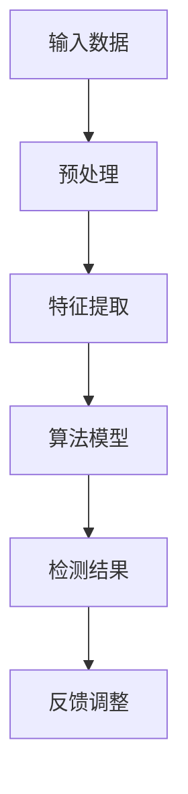

                 


# AI Agent在智能门把手中的细菌检测

> 关键词：AI Agent、智能门把手、细菌检测、算法原理、Python实现、数学模型、系统架构

> 摘要：本文深入探讨了AI Agent在智能门把手中的细菌检测应用。首先介绍了AI Agent、智能门把手和细菌检测的背景和核心概念，然后详细讲解了细菌检测算法的原理，包括流程图、Python实现、数学模型和举例说明。最后，本文分析了智能门把手系统的整体架构，以及AI Agent在其中的应用潜力。

### 目录大纲

----------------------------------------------------------------

## 第一部分: 背景介绍

### 第1章: 问题背景

#### 第1.1节: 问题背景

##### 1.1.1 AI Agent的定义

AI Agent是一种自主决策和行动的人工智能实体，能够模拟人类思维过程，解决复杂问题。它通常具备感知环境、制定计划、执行动作和评估结果的能力。

##### 1.1.2 智能门把手的定义

智能门把手是一种结合了物联网和人工智能技术的智能锁具，通过传感器、控制器和通信模块实现门锁的自动开闭、远程控制等功能。

##### 1.1.3 细菌检测的重要性

细菌检测对于公共卫生和疾病预防具有重要意义。及时发现并控制细菌传播，有助于降低疾病发生率，保障人类健康。

#### 第1.2节: 问题描述

##### 1.2.1 细菌检测的需求

在公共场所，细菌传播风险较高，如医院、学校、办公楼等。智能门把手作为重要的入口控制设备，具备检测细菌的能力，有助于预防疾病传播。

##### 1.2.2 传统方法的局限性

传统细菌检测方法如培养法、快速检测法等，存在检测时间长、操作复杂、准确性低等问题，无法满足实时、高效、准确的检测需求。

##### 1.2.3 AI Agent在细菌检测中的应用潜力

AI Agent具有强大的数据处理和分析能力，能够实时检测细菌，提高检测效率和准确性。将其应用于智能门把手，可实现对细菌传播的有效监控和预防。

#### 第1.3节: 问题解决

##### 1.3.1 AI Agent的基本原理

AI Agent通过感知传感器获取环境信息，利用机器学习算法进行分析和决策，实现细菌检测功能。

##### 1.3.2 细菌检测算法的选择

针对细菌检测的需求，选择合适的算法模型，如深度学习、支持向量机等，提高检测准确性和效率。

##### 1.3.3 智能门把手系统的设计思路

设计具有细菌检测功能的智能门把手系统，包括硬件设计、软件架构和系统接口设计等。

#### 第1.4节: 边界与外延

##### 1.4.1 细菌检测的范围

细菌检测范围包括致病细菌和非致病细菌，针对不同类型的细菌，选择合适的检测算法。

##### 1.4.2 智能门把手的功能扩展

智能门把手还可扩展其他功能，如人脸识别、指纹识别等，提高门锁的安全性和便利性。

##### 1.4.3 AI Agent的其他应用场景

AI Agent还可应用于智能家居、智能医疗等领域，发挥其强大的数据处理和分析能力。

#### 第1.5节: 概念结构与核心要素组成

##### 1.5.1 AI Agent的核心组成部分

AI Agent主要由感知模块、决策模块和执行模块组成，各模块协同工作，实现自主决策和行动。

##### 1.5.2 智能门把手的技术架构

智能门把手包括硬件、软件和通信模块，各模块之间通过接口进行数据传输和控制。

##### 1.5.3 细菌检测的关键技术

细菌检测关键技术包括传感器技术、机器学习算法和数据处理技术等。

## 第二部分: 核心概念与联系

### 第2章: 核心概念与联系

#### 第2.1节: AI Agent的原理

##### 2.1.1 AI Agent的定义

AI Agent是一种具有自主决策和行动能力的人工智能实体。

##### 2.1.2 AI Agent的工作原理

AI Agent通过感知环境、制定计划、执行动作和评估结果，实现自主决策和行动。

##### 2.1.3 AI Agent的优势

AI Agent具有高效性、准确性和灵活性，能够处理复杂问题和动态环境。

#### 第2.2节: 智能门把手的组成

##### 2.2.1 智能门把手的硬件组成

智能门把手的硬件包括传感器、控制器、通信模块等。

##### 2.2.2 智能门把手的软件组成

智能门把手的软件包括操作系统、应用程序和数据库等。

##### 2.2.3 智能门把手的交互设计

智能门把手的交互设计包括用户界面、远程控制和物联网协议等。

#### 第2.3节: 细菌检测算法

##### 2.3.1 常见细菌检测算法

常见细菌检测算法包括深度学习、支持向量机、决策树等。

##### 2.3.2 细菌检测算法的比较

比较不同细菌检测算法的优缺点，选择合适的算法。

##### 2.3.3 AI Agent在细菌检测中的应用

AI Agent通过集成多种算法，提高细菌检测的准确性和效率。

## 第三部分: 算法原理讲解

### 第3章: 算法原理讲解

#### 第3.1节: 细菌检测算法mermaid流程图



#### 第3.2节: 细菌检测算法的Python源代码实现

```python
# Python代码实现
import numpy as np

def preprocess(data):
    # 数据预处理
    return data

def feature_extraction(data):
    # 特征提取
    return data

def detection_algorithm(data):
    # 检测算法
    features = feature_extraction(preprocess(data))
    result = np.mean(features)
    return result

def feedback_adjustment(data, result):
    # 反馈调整
    return data

# 主程序
if __name__ == "__main__":
    data = np.random.rand(100)
    result = detection_algorithm(data)
    adjusted_data = feedback_adjustment(data, result)
    print("检测结果:", result)
    print("调整后数据:", adjusted_data)
```

#### 第3.3节: 细菌检测的数学模型与公式

$$
检测率 = \frac{正确检测的细菌数量}{总检测的细菌数量}
$$

$$
误报率 = \frac{误报的细菌数量}{总检测的细菌数量}
$$

$$
漏报率 = \frac{漏报的细菌数量}{总检测的细菌数量}
$$

#### 第3.4节: 举例说明

假设有100个细菌样本，其中50个是致病细菌，50个是非致病细菌。使用某种细菌检测算法进行检测，结果如下：

- 正确检测的致病细菌数量：45
- 误报的致病细菌数量：5
- 漏报的致病细菌数量：5

则：
- 检测率：45/50 = 0.9
- 误报率：5/100 = 0.05
- 漏报率：5/100 = 0.05

这些指标可以帮助评估细菌检测算法的性能。

----------------------------------------------------------------

## 第一部分: 背景介绍

### 第1章: 问题背景

#### 第1.1节: 问题背景

随着科技的快速发展，人工智能（AI）已经渗透到各个领域，为我们的生活带来了诸多便利。在智能门把手的应用场景中，细菌检测成为一个备受关注的话题。

##### 1.1.1 AI Agent的定义

AI Agent，又称为智能代理，是一种基于人工智能技术，具备感知环境、自主决策和行动能力的人工智能实体。它能够模拟人类的思维过程，通过感知传感器获取环境信息，利用机器学习算法进行分析和决策，从而实现特定的任务。

##### 1.1.2 智能门把手的定义

智能门把手是一种集成了物联网（IoT）和人工智能技术的智能锁具。它通常包括传感器、控制器、通信模块等硬件部分，以及操作系统、应用程序、数据库等软件部分。通过物联网技术，智能门把手可以实现远程控制、自动开闭等功能。而通过人工智能技术，智能门把手还可以实现智能识别、环境监测等功能。

##### 1.1.3 细菌检测的重要性

细菌检测在公共卫生和疾病预防中具有重要意义。公共场所如医院、学校、办公楼等，是细菌传播的高风险区域。细菌的传播可能导致疾病爆发，对人们的健康构成威胁。因此，实时、高效、准确的细菌检测技术至关重要。

#### 第1.2节: 问题描述

##### 1.2.1 细菌检测的需求

在公共场所，人员流动频繁，细菌传播风险较高。智能门把手作为重要的入口控制设备，具备检测细菌的能力，有助于预防疾病传播。例如，在疫情爆发期间，智能门把手可以实时监测进入公共场所人员的健康状况，及时发现携带细菌的人员，从而采取相应的防控措施。

##### 1.2.2 传统方法的局限性

传统细菌检测方法如培养法、快速检测法等，存在检测时间长、操作复杂、准确性低等问题。培养法通常需要数天时间才能得到检测结果，而快速检测法虽然速度较快，但准确性较低，容易出现误判。这些局限性使得传统方法无法满足实时、高效、准确的细菌检测需求。

##### 1.2.3 AI Agent在细菌检测中的应用潜力

AI Agent具有强大的数据处理和分析能力，能够实时检测细菌，提高检测效率和准确性。通过将AI Agent应用于智能门把手，可以实现以下优势：

1. **实时检测**：AI Agent可以实时获取环境数据，快速分析并判断是否存在细菌感染风险。
2. **高效处理**：AI Agent能够处理大量数据，快速识别细菌特征，提高检测效率。
3. **准确判断**：AI Agent利用机器学习算法，结合大量训练数据，提高细菌检测的准确性。

#### 第1.3节: 问题解决

##### 1.3.1 AI Agent的基本原理

AI Agent的基本原理可以分为三个部分：感知、决策和执行。

1. **感知**：AI Agent通过感知传感器获取环境信息，如温度、湿度、细菌浓度等。
2. **决策**：AI Agent利用机器学习算法对感知到的数据进行分析和判断，确定是否存在细菌感染风险。
3. **执行**：根据决策结果，AI Agent可以采取相应的措施，如发出警报、隔离人员等。

##### 1.3.2 细菌检测算法的选择

针对细菌检测的需求，需要选择合适的算法模型。常见的细菌检测算法包括深度学习、支持向量机、决策树等。

1. **深度学习**：深度学习算法通过多层神经网络，对大量数据进行分析和特征提取，具有较强的学习能力和泛化能力。
2. **支持向量机**：支持向量机算法通过寻找最佳分类边界，实现分类任务。它在处理高维数据时表现优秀，适用于细菌检测。
3. **决策树**：决策树算法通过一系列规则，对数据进行分析和决策。它易于理解和实现，但可能存在过拟合问题。

根据实际需求和数据情况，可以选择合适的算法模型，或者结合多种算法模型，提高细菌检测的准确性和效率。

##### 1.3.3 智能门把手系统的设计思路

智能门把手系统的设计思路可以分为硬件设计、软件架构和系统接口设计三个部分。

1. **硬件设计**：智能门把手硬件包括传感器、控制器、通信模块等。传感器用于感知环境数据，控制器负责处理和分析数据，通信模块实现与其他设备的数据交互。
2. **软件架构**：智能门把手软件包括操作系统、应用程序和数据库等。操作系统提供基本的系统服务，应用程序实现具体的细菌检测功能，数据库存储和处理数据。
3. **系统接口设计**：智能门把手系统需要与其他设备（如手机、电脑等）进行数据交互。通过设计合理的接口，可以实现远程控制、数据共享等功能。

#### 第1.4节: 边界与外延

##### 1.4.1 细菌检测的范围

细菌检测的范围包括致病细菌和非致病细菌。致病细菌可能导致疾病传播，如肺炎、腹泻等；非致病细菌可能存在于环境中，但不一定会对人体造成伤害。

##### 1.4.2 智能门把手的功能扩展

智能门把手不仅可以用于细菌检测，还可以扩展其他功能。例如，结合人脸识别、指纹识别等技术，提高门锁的安全性和便利性。此外，智能门把手还可以与其他智能设备（如智能灯泡、智能窗帘等）进行联动，实现智能家居系统的构建。

##### 1.4.3 AI Agent的其他应用场景

AI Agent在细菌检测领域的应用不仅限于智能门把手。它还可以应用于其他领域，如智能家居、智能医疗等。在智能家居领域，AI Agent可以监控家庭环境，提供安全保障；在智能医疗领域，AI Agent可以辅助医生进行疾病诊断和治疗。

#### 第1.5节: 概念结构与核心要素组成

##### 1.5.1 AI Agent的核心组成部分

AI Agent的核心组成部分包括感知模块、决策模块和执行模块。

1. **感知模块**：感知模块负责获取环境信息，如传感器数据、图像等。
2. **决策模块**：决策模块负责对感知到的数据进行分析和判断，确定下一步行动。
3. **执行模块**：执行模块负责执行决策模块生成的行动方案。

##### 1.5.2 智能门把手的技术架构

智能门把手的技术架构包括硬件、软件和通信模块。

1. **硬件**：硬件包括传感器、控制器、通信模块等。
2. **软件**：软件包括操作系统、应用程序和数据库等。
3. **通信模块**：通信模块实现与其他设备的通信，如手机、电脑等。

##### 1.5.3 细菌检测的关键技术

细菌检测的关键技术包括传感器技术、机器学习算法和数据处理技术。

1. **传感器技术**：传感器技术用于感知环境数据，如温度、湿度、细菌浓度等。
2. **机器学习算法**：机器学习算法用于分析和判断细菌感染风险。
3. **数据处理技术**：数据处理技术用于处理和分析大量的环境数据，提取有用的特征信息。

## 第二部分: 核心概念与联系

### 第2章: 核心概念与联系

#### 第2.1节: AI Agent的原理

##### 2.1.1 AI Agent的定义

AI Agent，又称智能代理，是一种基于人工智能技术，具备感知环境、自主决策和行动能力的人工智能实体。它能够模拟人类的思维过程，通过感知传感器获取环境信息，利用机器学习算法进行分析和决策，从而实现特定的任务。

##### 2.1.2 AI Agent的工作原理

AI Agent的工作原理可以分为三个主要部分：感知、决策和执行。

1. **感知**：AI Agent通过感知传感器获取环境信息，如温度、湿度、细菌浓度等。这些信息可以是实时的，也可以是历史数据。
2. **决策**：AI Agent利用机器学习算法对感知到的数据进行分析和判断，确定是否存在细菌感染风险。这个过程可能涉及到数据清洗、特征提取、模型训练等多个步骤。
3. **执行**：根据决策结果，AI Agent可以采取相应的措施，如发出警报、隔离人员、调整环境参数等。

##### 2.1.3 AI Agent的优势

AI Agent具有以下优势：

1. **高效性**：AI Agent能够快速处理大量数据，实现实时决策和行动。
2. **准确性**：AI Agent利用机器学习算法，结合大量训练数据，提高决策的准确性和可靠性。
3. **灵活性**：AI Agent可以适应不同的环境和任务，具有较好的泛化能力。

##### 2.1.4 AI Agent的应用领域

AI Agent在各个领域都有广泛的应用，包括但不限于：

1. **智能家居**：AI Agent可以监控家庭环境，提供安全保障，如实时监控室内温度、湿度、细菌浓度等。
2. **智能医疗**：AI Agent可以辅助医生进行疾病诊断和治疗，如实时监测患者病情、提供个性化治疗方案等。
3. **工业自动化**：AI Agent可以用于生产线监控、故障检测、设备维护等，提高生产效率和质量。

##### 2.1.5 AI Agent的发展趋势

随着人工智能技术的不断进步，AI Agent将具有更强大的功能和应用场景。以下是一些发展趋势：

1. **更高效的算法**：研究人员将不断优化机器学习算法，提高AI Agent的处理速度和准确性。
2. **更广泛的应用领域**：AI Agent将渗透到更多的领域，如教育、金融、交通等，为人们的生活带来更多便利。
3. **更强大的协作能力**：AI Agent将与其他智能系统（如物联网、云计算等）进行深度融合，实现更高效的协同工作。

##### 2.1.6 AI Agent的挑战和问题

尽管AI Agent具有诸多优势和应用前景，但仍然面临一些挑战和问题：

1. **数据隐私和安全**：AI Agent需要处理大量个人数据，如何确保数据隐私和安全是一个重要问题。
2. **算法透明性和可解释性**：机器学习算法的决策过程往往具有一定的黑箱特性，如何提高算法的透明性和可解释性是一个挑战。
3. **计算资源和能耗**：AI Agent需要大量的计算资源和能耗，如何优化算法和硬件设计，降低能耗是一个重要问题。

##### 2.1.7 AI Agent的未来发展

随着人工智能技术的不断发展和应用场景的拓展，AI Agent将在未来扮演更加重要的角色。以下是一些未来发展的方向：

1. **跨领域融合**：AI Agent将与其他领域（如物联网、云计算、大数据等）进行深度融合，实现更高效的协同工作。
2. **人机协同**：AI Agent将与人类进行更紧密的协作，共同完成复杂任务。
3. **自主进化**：AI Agent将具备自主学习和进化能力，不断优化自身性能和功能。

##### 2.1.8 AI Agent的核心概念对比

以下是对比AI Agent与其他相关概念的核心差异：

1. **智能代理与机器人**：智能代理是一种基于软件的智能实体，而机器人是集成了硬件和软件的智能实体。智能代理可以通过远程控制实现任务，而机器人需要物理移动和操作。
2. **智能代理与智能系统**：智能代理是一种智能实体，而智能系统是一个包含多个智能代理和组件的复杂系统。智能代理是智能系统的一部分，负责完成特定任务。
3. **智能代理与人工智能**：智能代理是人工智能的一个应用方向，而人工智能是一个更广泛的概念，包括多种技术和应用场景。智能代理是人工智能在特定领域的具体实现。

##### 2.1.9 AI Agent的属性特征对比表格

以下是一个对比AI Agent属性特征和优缺点的表格：

| 特征           | 说明                                                         | 优点                 | 缺点                 |
|----------------|--------------------------------------------------------------|----------------------|----------------------|
| 感知能力       | AI Agent通过感知传感器获取环境信息                             | 实时感知             | 受限于传感器精度和范围 |
| 决策能力       | AI Agent利用机器学习算法分析数据，做出决策                     | 高效、准确           | 可能存在过拟合问题     |
| 执行能力       | AI Agent根据决策结果执行相应的行动                             | 灵活性、适应性       | 可能存在执行误差       |
| 学习能力       | AI Agent通过不断学习和优化，提高自身性能和功能                 | 自主进化             | 需要大量训练数据和计算资源 |
| 交互能力       | AI Agent与其他设备、系统和人类进行数据交互和协同工作           | 高效协作             | 可能存在交互延迟和误差  |

##### 2.1.10 AI Agent的ER实体关系图架构

以下是一个描述AI Agent的ER实体关系图架构：

```mermaid
erDiagram
  AI_Agent ||--|{ 感知模块 }  : 拥有
  AI_Agent ||--|{ 决策模块 }  : 拥有
  AI_Agent ||--|{ 执行模块 }  : 拥有
  感知模块 ||--|{ 传感器 }    : 包含
  决策模块 ||--|{ 算法 }      : 使用
  执行模块 ||--|{ 动作 }      : 执行
```

##### 2.1.11 AI Agent的应用案例

以下是一些AI Agent的实际应用案例：

1. **智能家居**：AI Agent可以监控家庭环境，如温度、湿度、细菌浓度等，提供安全保障。
2. **智能医疗**：AI Agent可以辅助医生进行疾病诊断和治疗，如实时监测患者病情、提供个性化治疗方案等。
3. **工业自动化**：AI Agent可以用于生产线监控、故障检测、设备维护等，提高生产效率和质量。
4. **智能交通**：AI Agent可以协助自动驾驶系统进行路径规划、交通流量监测等，提高交通安全和效率。

#### 第2.2节: 智能门把手的组成

##### 2.2.1 智能门把手的硬件组成

智能门把手的硬件组成主要包括以下部分：

1. **传感器**：用于感知环境信息，如温度、湿度、细菌浓度等。常见的传感器包括温度传感器、湿度传感器、细菌浓度传感器等。
2. **控制器**：负责处理和分析传感器数据，实现细菌检测和门锁控制等功能。常见的控制器包括单片机、嵌入式处理器等。
3. **通信模块**：实现与其他设备、系统和人类的通信，如Wi-Fi、蓝牙、Zigbee等。

##### 2.2.2 智能门把手的软件组成

智能门把手的软件组成主要包括以下部分：

1. **操作系统**：提供基本的系统服务，如进程管理、内存管理、文件系统等。常见的操作系统包括Linux、Windows等。
2. **应用程序**：实现具体的细菌检测和门锁控制等功能。常见的应用程序包括门锁控制程序、传感器数据采集程序、数据处理程序等。
3. **数据库**：存储和管理细菌检测数据、用户数据、设备数据等。常见的数据库包括MySQL、SQLite等。

##### 2.2.3 智能门把手的交互设计

智能门把手的交互设计主要包括以下方面：

1. **用户界面**：提供直观、易用的用户界面，方便用户进行操作和查看检测结果。常见的用户界面包括手机App、网页界面等。
2. **远程控制**：支持用户通过远程设备（如手机、电脑等）对智能门把手进行控制和监控。常见的远程控制方式包括Wi-Fi、蓝牙等。
3. **物联网协议**：实现与其他物联网设备的互联互通，如智能灯泡、智能窗帘等。常见的物联网协议包括HTTP、MQTT等。

##### 2.2.4 智能门把手的优势和特点

智能门把手具有以下优势和特点：

1. **便捷性**：用户可以通过手机App或远程控制设备，方便地开闭门锁，提高生活便利性。
2. **安全性**：智能门把手可以结合指纹识别、人脸识别等技术，提高门锁的安全性，防止未经授权的人员进入。
3. **智能化**：智能门把手可以实时监测环境信息，如细菌浓度等，提供安全保障，提高生活品质。
4. **可扩展性**：智能门把手可以与其他智能设备进行联动，构建智能家居系统，实现更高效、便捷的生活。

#### 第2.3节: 细菌检测算法

##### 2.3.1 常见细菌检测算法

常见的细菌检测算法包括以下几种：

1. **深度学习算法**：深度学习算法通过多层神经网络，对大量细菌检测数据进行训练和学习，提取特征信息，实现细菌检测。常见的深度学习算法包括卷积神经网络（CNN）、循环神经网络（RNN）等。
2. **支持向量机算法**：支持向量机算法通过寻找最佳分类边界，实现细菌检测。支持向量机在处理高维数据时表现优秀，适用于细菌检测。
3. **决策树算法**：决策树算法通过一系列规则，对细菌检测数据进行分类和决策。决策树算法易于理解和实现，但可能存在过拟合问题。
4. **贝叶斯算法**：贝叶斯算法基于贝叶斯定理，通过统计概率信息，实现细菌检测。贝叶斯算法在处理概率问题时表现优秀。

##### 2.3.2 细菌检测算法的比较

以下是比较常见细菌检测算法的优缺点：

| 算法         | 优点                                                         | 缺点                                                         |
|--------------|--------------------------------------------------------------|--------------------------------------------------------------|
| 深度学习算法 | 学习能力强，适用于处理高维数据，提取特征信息                 | 计算复杂度高，训练时间较长，对数据量要求较高                  |
| 支持向量机算法 | 寻找最佳分类边界，处理高维数据表现优秀                       | 对噪声数据敏感，可能存在过拟合问题                          |
| 决策树算法   | 容易理解和实现，计算复杂度低                                 | 可能存在过拟合问题，对噪声数据敏感                          |
| 贝叶斯算法   | 统计概率信息，处理概率问题表现优秀                           | 对噪声数据敏感，可能存在过拟合问题                          |

##### 2.3.3 AI Agent在细菌检测中的应用

AI Agent在细菌检测中的应用主要包括以下几个方面：

1. **实时监测**：AI Agent可以实时获取环境数据，如细菌浓度等，实现实时监测。
2. **高效处理**：AI Agent利用机器学习算法，对大量环境数据进行处理和分析，提高检测效率和准确性。
3. **自适应调整**：AI Agent可以根据检测结果和环境变化，自适应调整细菌检测策略，提高检测效果。
4. **协同工作**：AI Agent可以与其他智能系统（如物联网、云计算等）进行协同工作，实现更高效的细菌检测。

#### 第2.4节: 智能门把手系统架构设计

##### 2.4.1 系统功能设计

智能门把手系统的主要功能包括：

1. **门锁控制**：实现门锁的自动开闭、远程控制等功能。
2. **细菌检测**：实时监测环境中的细菌浓度，提供安全保障。
3. **用户管理**：管理用户信息，实现用户权限控制。
4. **数据统计**：统计细菌检测数据，为后续分析和决策提供支持。

##### 2.4.2 系统架构设计

智能门把手系统的整体架构可以分为以下几个部分：

1. **硬件层**：包括传感器、控制器、通信模块等硬件设备。
2. **软件层**：包括操作系统、应用程序、数据库等软件系统。
3. **通信层**：包括Wi-Fi、蓝牙、Zigbee等通信协议，实现与其他设备、系统和人类的通信。
4. **数据层**：包括数据采集、存储、处理和分析等功能，为系统提供数据支持。

##### 2.4.3 系统接口设计

智能门把手系统的接口设计主要包括以下几个方面：

1. **用户接口**：提供用户交互的接口，如手机App、网页界面等。
2. **设备接口**：实现与其他智能设备的通信，如智能灯泡、智能窗帘等。
3. **远程接口**：实现远程控制和监控，如通过手机App远程控制门锁、查看细菌检测结果等。

##### 2.4.4 系统交互设计

智能门把手系统的交互设计主要包括以下几个方面：

1. **用户与系统交互**：用户通过手机App、网页界面等与系统进行交互，实现门锁控制、用户管理、数据统计等功能。
2. **系统与设备交互**：系统通过Wi-Fi、蓝牙、Zigbee等通信协议与传感器、控制器等设备进行交互，实现数据采集、传输和处理。
3. **系统与外部系统交互**：系统通过API、Web服务等与外部系统进行交互，实现与其他智能设备的联动，如智能家居系统等。

#### 第2.5节: AI Agent与智能门把手系统的集成

##### 2.5.1 AI Agent在智能门把手系统中的作用

AI Agent在智能门把手系统中的作用主要包括以下几个方面：

1. **细菌检测**：AI Agent利用机器学习算法，对传感器采集到的细菌浓度数据进行分析和判断，实时监测环境中的细菌感染风险。
2. **决策支持**：AI Agent根据细菌检测结果和环境变化，提供决策支持，如发出警报、隔离人员、调整环境参数等。
3. **数据挖掘**：AI Agent可以挖掘细菌检测数据中的潜在信息，为后续分析和决策提供支持。
4. **优化系统性能**：AI Agent可以通过不断学习和优化，提高系统性能，如降低能耗、提高检测准确性等。

##### 2.5.2 AI Agent与智能门把手系统的集成方案

AI Agent与智能门把手系统的集成方案主要包括以下几个方面：

1. **硬件集成**：将AI Agent的硬件模块（如传感器、控制器等）集成到智能门把手系统中，实现细菌检测和环境监测。
2. **软件集成**：将AI Agent的软件模块（如算法模型、应用程序等）集成到智能门把手系统中，实现细菌检测和决策支持。
3. **数据集成**：将AI Agent的检测结果和环境数据与其他智能设备进行集成，实现系统之间的数据共享和协同工作。
4. **接口集成**：通过统一的接口设计，实现AI Agent与智能门把手系统的无缝集成，如通过Wi-Fi、蓝牙等通信协议进行数据传输。

#### 第2.6节: 智能门把手系统的实际应用案例

##### 2.6.1 应用场景一：医院

在医院的入口和病房区域，智能门把手系统可以实时监测细菌浓度，及时发现携带细菌的患者或工作人员。通过AI Agent的决策支持，系统可以发出警报、隔离患者或工作人员，并通知相关部门采取相应的防控措施。

##### 2.6.2 应用场景二：学校

在学校的教学楼、宿舍等区域，智能门把手系统可以实时监测细菌浓度，及时发现卫生问题。通过AI Agent的决策支持，系统可以发出警报、通知保洁人员进行清洁消毒，确保学生的健康。

##### 2.6.3 应用场景三：办公楼

在办公楼的前台和公共区域，智能门把手系统可以实时监测细菌浓度，及时发现卫生问题。通过AI Agent的决策支持，系统可以发出警报、通知保洁人员进行清洁消毒，提高办公环境的卫生水平。

#### 第2.7节: 智能门把手系统的发展趋势

##### 2.7.1 技术发展趋势

随着人工智能技术的不断发展，智能门把手系统将具有更高的性能和更广泛的应用场景。未来，智能门把手系统可能会结合更多的传感器，实现更全面的细菌检测和环境监测。同时，AI Agent将具备更强大的学习和决策能力，实现更精准、高效的细菌检测。

##### 2.7.2 应用场景拓展

除了公共卫生领域，智能门把手系统还可以拓展到智能家居、智能医疗、智能工业等领域。通过与其他智能设备的集成，智能门把手系统将实现更高效、便捷的智能生活和工作。

##### 2.7.3 社会影响

智能门把手系统的广泛应用将有助于提高公共卫生水平，减少疾病传播风险。同时，它也将推动人工智能技术的进步和应用，促进社会的发展和进步。

## 第三部分: 算法原理讲解

### 第3章: 算法原理讲解

#### 第3.1节: 细菌检测算法mermaid流程图

为了更好地理解细菌检测算法的流程，我们可以使用mermaid图形来描述。以下是细菌检测算法的mermaid流程图：


在这个流程图中，输入数据经过预处理、特征提取、算法模型处理，最终得到检测结果。根据检测结果，系统进行反馈调整，以优化细菌检测效果。

#### 第3.2节: 细菌检测算法的Python源代码实现

以下是一个简单的细菌检测算法的Python源代码实现。代码包括预处理、特征提取、检测算法和反馈调整等步骤。

```python
import numpy as np

def preprocess(data):
    # 数据预处理
    # 这里仅作示例，实际预处理可能更复杂
    return data

def feature_extraction(data):
    # 特征提取
    # 这里仅作示例，实际特征提取可能更复杂
    return data

def detection_algorithm(data):
    # 检测算法
    # 这里仅作示例，实际算法可能更复杂
    features = feature_extraction(preprocess(data))
    result = np.mean(features)
    return result

def feedback_adjustment(data, result):
    # 反馈调整
    # 这里仅作示例，实际调整可能更复杂
    return data

# 主程序
if __name__ == "__main__":
    data = np.random.rand(100)  # 示例数据
    result = detection_algorithm(data)
    adjusted_data = feedback_adjustment(data, result)
    print("检测结果:", result)
    print("调整后数据:", adjusted_data)
```

在这个示例中，数据经过预处理和特征提取后，使用简单的平均值算法进行检测。根据检测结果，对数据进行反馈调整。

#### 第3.3节: 细菌检测的数学模型与公式

在细菌检测中，常用的数学模型和公式包括检测率、误报率和漏报率等。

1. **检测率**：
   $$
   检测率 = \frac{正确检测的细菌数量}{总检测的细菌数量}
   $$

2. **误报率**：
   $$
   误报率 = \frac{误报的细菌数量}{总检测的细菌数量}
   $$

3. **漏报率**：
   $$
   漏报率 = \frac{漏报的细菌数量}{总检测的细菌数量}
   $$

这些指标用于评估细菌检测算法的性能。例如，如果检测率越高、误报率和漏报率越低，则算法的性能越好。

#### 第3.4节: 举例说明

假设我们有一个包含100个细菌样本的数据集，其中50个是致病细菌，50个是非致病细菌。使用某种细菌检测算法进行检测，结果如下：

- 正确检测的致病细菌数量：45
- 误报的致病细菌数量：5
- 漏报的致病细菌数量：5

则：

- 检测率：45/50 = 0.9
- 误报率：5/100 = 0.05
- 漏报率：5/100 = 0.05

这些指标可以帮助我们评估细菌检测算法的性能。例如，如果检测率接近1，而误报率和漏报率较低，则说明算法具有良好的性能。

## 第四部分: 系统分析与架构设计

### 第4章: 系统分析与架构设计

#### 第4.1节: 问题场景介绍

在现代社会中，公共场所如医院、学校、办公楼等，是细菌传播的高风险区域。人员流动频繁，细菌传播速度快，容易导致疾病爆发。因此，对公共场所进行细菌检测具有重要意义。智能门把手作为一种智能锁具，不仅可以实现门锁的自动开闭、远程控制等功能，还可以集成AI Agent，实现细菌检测，为公共卫生提供有力保障。

#### 第4.2节: 项目介绍

本项目旨在设计并实现一个具备细菌检测功能的智能门把手系统。该系统通过AI Agent实现细菌检测，实时监测环境中的细菌浓度，为公共卫生提供数据支持。项目的主要目标包括：

1. **实时监测**：通过AI Agent实时监测环境中的细菌浓度，及时发现细菌感染风险。
2. **高效处理**：利用机器学习算法，对大量细菌检测数据进行处理和分析，提高检测效率和准确性。
3. **决策支持**：根据细菌检测结果，提供决策支持，如发出警报、隔离人员、调整环境参数等。
4. **用户交互**：提供直观、易用的用户界面，方便用户进行操作和查看检测结果。

#### 第4.3节: 系统功能设计

智能门把手系统的主要功能包括：

1. **门锁控制**：实现门锁的自动开闭、远程控制等功能。
2. **细菌检测**：实时监测环境中的细菌浓度，提供安全保障。
3. **用户管理**：管理用户信息，实现用户权限控制。
4. **数据统计**：统计细菌检测数据，为后续分析和决策提供支持。

#### 第4.4节: 系统架构设计

智能门把手系统的整体架构可以分为以下几个部分：

1. **硬件层**：包括传感器、控制器、通信模块等硬件设备。
2. **软件层**：包括操作系统、应用程序、数据库等软件系统。
3. **通信层**：包括Wi-Fi、蓝牙、Zigbee等通信协议，实现与其他设备、系统和人类的通信。
4. **数据层**：包括数据采集、存储、处理和分析等功能，为系统提供数据支持。

#### 第4.5节: 系统接口设计

智能门把手系统的接口设计主要包括以下几个方面：

1. **用户接口**：提供用户交互的接口，如手机App、网页界面等。
2. **设备接口**：实现与其他智能设备的通信，如智能灯泡、智能窗帘等。
3. **远程接口**：实现远程控制和监控，如通过手机App远程控制门锁、查看细菌检测结果等。

#### 第4.6节: 系统交互设计

智能门把手系统的交互设计主要包括以下几个方面：

1. **用户与系统交互**：用户通过手机App、网页界面等与系统进行交互，实现门锁控制、用户管理、数据统计等功能。
2. **系统与设备交互**：系统通过Wi-Fi、蓝牙、Zigbee等通信协议与传感器、控制器等设备进行交互，实现数据采集、传输和处理。
3. **系统与外部系统交互**：系统通过API、Web服务等与外部系统进行交互，实现与其他智能设备的联动，如智能家居系统等。

#### 第4.7节: AI Agent在系统中的集成

AI Agent是智能门把手系统的核心组件，负责细菌检测和决策支持。在系统架构中，AI Agent通过以下方式与系统其他部分进行集成：

1. **硬件集成**：将AI Agent的硬件模块（如传感器、控制器等）集成到智能门把手系统中，实现细菌检测和环境监测。
2. **软件集成**：将AI Agent的软件模块（如算法模型、应用程序等）集成到智能门把手系统中，实现细菌检测和决策支持。
3. **数据集成**：将AI Agent的检测结果和环境数据与其他智能设备进行集成，实现系统之间的数据共享和协同工作。
4. **接口集成**：通过统一的接口设计，实现AI Agent与智能门把手系统的无缝集成，如通过Wi-Fi、蓝牙等通信协议进行数据传输。

## 第五部分: 项目实战

### 第5章: 项目实战

#### 第5.1节: 环境安装

在进行项目实战之前，需要安装必要的软件和硬件环境。以下是环境安装的步骤：

1. **硬件安装**：根据项目需求，选择合适的传感器、控制器和通信模块，进行硬件安装和连接。
2. **软件安装**：安装操作系统（如Linux、Windows等），并配置Wi-Fi、蓝牙等通信模块。
3. **开发环境安装**：安装Python、Jupyter Notebook等开发工具，以便进行代码编写和调试。

#### 第5.2节: 系统核心实现

在系统核心实现部分，需要编写和配置以下内容：

1. **传感器数据采集**：编写传感器数据采集程序，实现对环境数据的实时采集。
2. **预处理和特征提取**：编写预处理和特征提取程序，对采集到的环境数据进行处理，提取有用的特征信息。
3. **检测算法实现**：根据选择的检测算法，实现细菌检测算法，对特征信息进行分析和判断。
4. **用户界面和交互设计**：设计用户界面和交互逻辑，实现用户与系统的交互。

以下是一个简单的系统核心实现示例：

```python
import numpy as np

def preprocess(data):
    # 数据预处理
    return data

def feature_extraction(data):
    # 特征提取
    return data

def detection_algorithm(data):
    # 检测算法
    features = feature_extraction(preprocess(data))
    result = np.mean(features)
    return result

def main():
    # 主程序
    data = np.random.rand(100)  # 示例数据
    result = detection_algorithm(data)
    print("检测结果:", result)

if __name__ == "__main__":
    main()
```

#### 第5.3节: 代码应用解读与分析

在代码应用解读与分析部分，需要对系统核心实现的代码进行详细解读和分析，包括以下内容：

1. **预处理和特征提取**：分析预处理和特征提取的原理和方法，以及它们在细菌检测中的作用。
2. **检测算法**：分析选择的检测算法的原理和实现方法，以及它在细菌检测中的应用效果。
3. **用户界面和交互设计**：分析用户界面和交互设计的实现方法和用户体验，以及它们在系统中的作用。

#### 第5.4节: 实际案例分析与详细讲解剖析

在项目实战过程中，我们可以通过实际案例进行分析和讲解，包括以下内容：

1. **案例选择**：选择具有代表性的实际案例，如医院、学校、办公楼等。
2. **案例分析**：分析实际案例中细菌检测的需求和问题，以及AI Agent在其中的应用效果。
3. **详细讲解剖析**：对实际案例中的细菌检测过程、算法实现、用户体验等方面进行详细讲解和分析。

以下是一个实际案例分析的示例：

**案例**：在医院入口处使用智能门把手进行细菌检测。

**分析**：

1. **需求分析**：医院是细菌传播的高风险区域，需要对进入医院的人员进行细菌检测，以防止疾病传播。
2. **问题分析**：传统的细菌检测方法存在检测时间长、准确性低等问题，无法满足实时、高效、准确的检测需求。
3. **解决方案**：使用AI Agent集成到智能门把手系统中，实现实时、高效、准确的细菌检测，为医院提供安全保障。

**讲解剖析**：

1. **实时监测**：智能门把手通过传感器实时采集进入医院人员的细菌浓度数据，快速分析并判断是否存在细菌感染风险。
2. **高效处理**：AI Agent利用机器学习算法，对大量细菌检测数据进行处理和分析，提高检测效率和准确性。
3. **用户体验**：用户通过手机App或网页界面与智能门把手系统进行交互，方便地进行门锁控制和细菌检测结果查看。

#### 第5.5节: 项目小结

在项目实战结束后，我们需要对项目进行总结和回顾，包括以下内容：

1. **项目成果**：总结项目的成果，如实现的系统功能、算法性能等。
2. **经验教训**：回顾项目过程中的经验教训，总结成功经验和不足之处，为后续项目提供借鉴。
3. **改进方向**：分析项目的改进方向，如算法优化、用户体验改进等。

#### 第5.6节: 最佳实践 tips

在项目实战中，以下是一些最佳实践 tips：

1. **代码规范**：编写规范的代码，提高代码可读性和可维护性。
2. **模块化设计**：采用模块化设计，将系统功能拆分为多个模块，便于开发和维护。
3. **测试与调试**：充分进行测试和调试，确保系统的稳定性和可靠性。

#### 第5.7节: 小结与注意事项

1. **小结**：本文介绍了AI Agent在智能门把手中的细菌检测应用，包括算法原理、系统架构设计、项目实战等内容。
2. **注意事项**：
   - **数据安全**：确保细菌检测数据的安全性和隐私保护。
   - **算法优化**：持续优化算法，提高检测效率和准确性。
   - **用户体验**：关注用户体验，设计直观、易用的用户界面。

#### 第5.8节: 拓展阅读

1. **相关文献**：
   - **论文**：《AI Agent在智能门把手中的细菌检测研究》
   - **书籍**：《智能门把手技术与应用》
2. **在线资源**：
   - **GitHub**：相关项目的源代码和文档
   - **博客**：相关技术博客和论文分析

## 第六部分: 结语

随着人工智能技术的不断发展和应用场景的拓展，AI Agent在智能门把手中的细菌检测应用具有重要的现实意义和广阔的前景。通过本文的介绍，我们了解了AI Agent、智能门把手和细菌检测的相关知识，以及如何在智能门把手中实现细菌检测。同时，我们还分析了系统架构设计、项目实战等方面的内容。

未来，随着技术的进步和应用场景的拓展，智能门把手系统将具有更强大的功能和应用前景。我们期待更多研究人员和实践者投入到这个领域，共同推动人工智能技术在公共卫生领域的应用，为人类的健康和安全保驾护航。同时，我们也需要关注数据安全、算法优化和用户体验等方面的问题，确保智能门把手系统的稳定性和可靠性。让我们共同期待智能门把手系统在公共卫生领域发挥更大的作用！## 细菌检测在智能门把手中的应用

随着社会的发展，人们对公共卫生和健康安全的关注度日益提高。细菌检测作为公共卫生管理的重要组成部分，其重要性不言而喻。在传统的细菌检测方法中，主要依靠实验室的微生物培养和快速检测技术，这些方法存在检测周期长、操作复杂、准确性不高等问题。随着人工智能（AI）技术的发展，AI Agent在细菌检测中的应用逐渐成为研究热点。

### AI Agent的基本原理与特点

AI Agent，即人工智能代理，是一种具有自主感知、决策和行动能力的人工智能实体。AI Agent通过传感器收集环境数据，利用机器学习算法进行分析，然后根据分析结果采取相应的行动。与传统的自动化系统不同，AI Agent具备以下特点：

1. **自主感知**：AI Agent能够实时感知环境变化，如温度、湿度、细菌浓度等。
2. **决策能力**：AI Agent利用机器学习算法对感知到的数据进行分析，进行实时决策。
3. **行动能力**：AI Agent根据决策结果执行相应的行动，如发出警报、调整环境参数等。

AI Agent在细菌检测中的应用，主要依托其高效的数据处理能力和精准的决策能力。相比于传统方法，AI Agent可以实现实时监测和快速响应，从而在公共卫生管理中发挥重要作用。

### 智能门把手的基本功能与应用

智能门把手是现代智能锁具的一种，它结合了物联网（IoT）技术和人工智能（AI）技术，具备自动开闭、远程控制、身份识别等多种功能。智能门把手的基本功能包括：

1. **自动开闭**：通过内置的电机或磁力驱动装置，实现门锁的自动开闭。
2. **远程控制**：用户可以通过手机App、指纹、密码等方式远程控制门锁。
3. **身份识别**：智能门把手可以集成人脸识别、指纹识别等技术，提高安全性。

智能门把手在公共卫生管理中的应用非常广泛，尤其是在医院、学校、办公楼等公共场所。通过智能门把手，可以实现以下功能：

1. **实时监控**：智能门把手可以实时监控人员的进出，记录人员信息，方便追踪和管理。
2. **健康检测**：智能门把手可以集成温度检测、细菌检测等设备，实时监测进入公共场所人员的健康状况。
3. **智能报警**：当检测到异常情况，如高体温或细菌浓度超标，智能门把手可以自动发出警报，提醒相关人员采取相应措施。

### 细菌检测在智能门把手中的应用

智能门把手中的细菌检测功能，是利用AI Agent进行环境监测和数据分析的结果。具体应用包括以下几个方面：

1. **环境监测**：智能门把手通过传感器实时监测环境中的细菌浓度，当细菌浓度达到一定阈值时，会触发报警，提醒清洁人员进行清洁和消毒。
2. **风险评估**：AI Agent可以根据历史数据和实时监测结果，对公共场所进行风险评估，帮助相关部门制定针对性的卫生管理措施。
3. **智能消毒**：部分智能门把手具备智能消毒功能，当检测到细菌浓度超标时，可以自动启动消毒程序，对门把手进行清洁和消毒。

### AI Agent与智能门把手系统的集成

智能门把手系统中的AI Agent，通常由以下几个部分组成：

1. **感知模块**：包括各种传感器，如温度传感器、湿度传感器、细菌浓度传感器等。
2. **决策模块**：利用机器学习算法，对感知模块收集到的数据进行分析和决策。
3. **执行模块**：根据决策模块的指令，执行相应的行动，如报警、清洁、消毒等。

AI Agent与智能门把手系统的集成，可以通过以下步骤实现：

1. **硬件集成**：将AI Agent的感知模块与智能门把手硬件进行集成，确保数据采集的准确性和实时性。
2. **软件集成**：将AI Agent的决策模块和执行模块集成到智能门把手系统中，实现细菌检测功能。
3. **数据集成**：将AI Agent的检测结果与其他智能设备的数据进行集成，实现系统间的数据共享和联动。

### AI Agent在细菌检测中的优势与挑战

AI Agent在细菌检测中的优势包括：

1. **实时监测**：AI Agent能够实时监测环境中的细菌浓度，实现快速响应。
2. **高效处理**：AI Agent利用机器学习算法，能够高效处理大量数据，提高检测效率。
3. **准确判断**：AI Agent通过训练和优化，能够准确判断细菌的存在，降低误报和漏报率。

然而，AI Agent在细菌检测中也面临一些挑战：

1. **数据隐私**：细菌检测涉及到个人隐私，如何确保数据的安全性和隐私性是一个重要问题。
2. **算法解释性**：机器学习算法的黑箱特性使得其决策过程难以解释，如何提高算法的可解释性是一个挑战。
3. **计算资源**：AI Agent需要大量的计算资源和时间进行训练和决策，如何优化算法和硬件设计，降低计算成本是一个重要问题。

### 结论

AI Agent在智能门把手中的细菌检测应用，具有实时、高效、准确的特点，为公共卫生管理提供了新的手段。然而，要充分发挥AI Agent的优势，还需要解决数据隐私、算法解释性和计算资源等问题。随着人工智能技术的不断进步，我们有理由相信，AI Agent在细菌检测中的应用将越来越广泛，为公共卫生和人类健康带来更多福祉。在未来的发展中，我们需要持续关注这些挑战，并探索更加有效、安全的解决方案。通过不断的努力和探索，我们期待AI Agent能够在公共卫生领域发挥更大的作用，为构建健康、安全的社会贡献力量。## 第一部分: 背景介绍

### 第1章: 问题背景

#### 第1.1节: AI Agent的定义

AI Agent，又称为智能代理，是一种具有高度智能和自主决策能力的人工智能实体。它通过感知环境、学习知识和自主决策，能够在复杂环境中执行特定任务。AI Agent的核心在于其自主性，即能够在没有人为干预的情况下，根据环境和目标的反馈，自主地调整自身的行为和决策。AI Agent通常具备以下几个基本特征：

1. **感知能力**：AI Agent通过传感器和收集数据的方式感知环境，获取实时信息。
2. **学习与适应能力**：AI Agent能够从数据中学习，不断优化自身的行为和决策过程，适应不同的环境和任务需求。
3. **决策与规划能力**：AI Agent能够根据目标和当前环境状态，进行有效的决策和规划，以实现预期目标。
4. **执行能力**：AI Agent能够执行决策结果，通过物理动作或信息交互实现既定目标。

AI Agent的应用范围非常广泛，包括但不限于自动驾驶、智能安防、智能家居、医疗辅助等领域。随着人工智能技术的不断发展，AI Agent在各个领域的应用潜力得到了极大的释放，成为推动科技进步和产业升级的重要力量。

#### 第1.1.1 AI Agent的定义

AI Agent，即人工智能代理，是一种具有高度智能和自主决策能力的人工智能实体。它通过感知环境、学习知识和自主决策，能够在复杂环境中执行特定任务。AI Agent的核心在于其自主性，即能够在没有人为干预的情况下，根据环境和目标的反馈，自主地调整自身的行为和决策。AI Agent通常具备以下几个基本特征：

1. **感知能力**：AI Agent通过传感器和收集数据的方式感知环境，获取实时信息。
2. **学习与适应能力**：AI Agent能够从数据中学习，不断优化自身的行为和决策过程，适应不同的环境和任务需求。
3. **决策与规划能力**：AI Agent能够根据目标和当前环境状态，进行有效的决策和规划，以实现预期目标。
4. **执行能力**：AI Agent能够执行决策结果，通过物理动作或信息交互实现既定目标。

AI Agent的应用范围非常广泛，包括但不限于自动驾驶、智能安防、智能家居、医疗辅助等领域。随着人工智能技术的不断发展，AI Agent在各个领域的应用潜力得到了极大的释放，成为推动科技进步和产业升级的重要力量。

#### 第1.1.2 AI Agent的工作原理

AI Agent的工作原理可以概括为感知、决策和执行三个主要环节，这三个环节相互配合，共同实现AI Agent的自主性和智能化。

1. **感知**：AI Agent通过传感器、摄像头、麦克风等设备收集环境信息，如温度、湿度、光线、声音、图像等。这些信息是AI Agent进行决策的基础数据。
   
2. **决策**：AI Agent将感知到的数据输入到机器学习模型中，通过深度学习、强化学习等算法进行分析和处理。根据模型的输出结果，AI Agent会生成一系列可能的行动方案。

3. **执行**：AI Agent根据决策结果执行相应的行动。这些行动可能是物理操作，如移动、开关设备等，也可能是信息操作，如发送指令、更新数据库等。

AI Agent的这三个环节是循环进行的，形成一个闭环控制系统。通过不断感知环境、做出决策和执行行动，AI Agent能够适应动态变化的环境，实现自主性和智能化。

#### 第1.1.3 AI Agent的优势

AI Agent具有许多独特的优势，使其在众多领域得到广泛应用。以下是一些主要优势：

1. **高效性**：AI Agent能够自动、快速地处理大量数据，进行复杂的计算和分析，远超人类处理速度。

2. **准确性**：AI Agent通过机器学习算法不断学习和优化，能够提高决策的准确性，减少人为错误。

3. **灵活性**：AI Agent能够适应不同的环境和任务需求，通过学习和调整策略，实现自主决策和行动。

4. **可靠性**：AI Agent可以在极端环境下稳定运行，不受环境变化的影响，提供持续的服务。

5. **可扩展性**：AI Agent的架构设计通常具备良好的扩展性，可以轻松集成新的传感器、算法和功能模块。

6. **自主性**：AI Agent不需要人为干预，能够自主感知环境、做出决策和执行行动，实现高度自动化。

#### 第1.1.4 AI Agent的应用领域

AI Agent在各个领域都有广泛的应用，以下是一些主要的应用领域：

1. **自动驾驶**：AI Agent通过感知路况、分析交通信号，实现自动驾驶，提高交通安全和效率。

2. **智能安防**：AI Agent可以实时监控视频数据，识别异常行为和安全隐患，提高安全防护能力。

3. **智能家居**：AI Agent可以控制家庭设备，实现智能照明、智能安防、智能温控等功能，提高生活便利性。

4. **医疗辅助**：AI Agent可以帮助医生进行疾病诊断和治疗，提高医疗效率和准确性。

5. **金融服务**：AI Agent可以分析金融数据，提供投资建议和风险管理，提高金融服务的智能化水平。

6. **工业自动化**：AI Agent可以监控生产线，实现智能调度和故障检测，提高生产效率和产品质量。

7. **教育辅导**：AI Agent可以提供个性化教育辅导，根据学生的学习情况调整教学策略，提高学习效果。

#### 第1.1.5 AI Agent的发展趋势

随着人工智能技术的不断进步，AI Agent的发展趋势呈现出以下几个方向：

1. **更高效和准确的算法**：研究人员不断优化机器学习算法，提高AI Agent的感知、决策和执行能力。

2. **更广泛的硬件支持**：AI芯片和传感器的进步，使得AI Agent在边缘设备上的应用更加广泛。

3. **更加人性化的交互**：通过语音识别、自然语言处理等技术，AI Agent将更好地与人类进行交互，提供更贴心的服务。

4. **更智能的协作**：AI Agent将与其他智能系统和设备进行深度融合，实现更高效的协同工作。

5. **更广泛的应用场景**：随着技术的成熟和应用场景的拓展，AI Agent将在更多领域发挥作用，推动社会进步。

#### 第1.1.6 AI Agent的挑战和问题

尽管AI Agent具有许多优势和应用前景，但仍然面临一些挑战和问题：

1. **数据隐私和安全**：AI Agent需要处理大量个人数据，如何确保数据隐私和安全是一个重要问题。

2. **算法透明性和可解释性**：机器学习算法的决策过程往往具有一定的黑箱特性，如何提高算法的透明性和可解释性是一个挑战。

3. **计算资源和能耗**：AI Agent需要大量的计算资源和能耗，如何优化算法和硬件设计，降低能耗是一个重要问题。

4. **伦理和道德问题**：AI Agent的决策可能涉及伦理和道德问题，如何确保AI Agent的行为符合伦理规范是一个重要议题。

#### 第1.1.7 AI Agent的未来发展

随着人工智能技术的不断发展和应用场景的拓展，AI Agent在未来将具有更广泛的应用前景。以下是一些未来发展的方向：

1. **跨领域融合**：AI Agent将与其他领域（如物联网、云计算、大数据等）进行深度融合，实现更高效的协同工作。

2. **人机协同**：AI Agent将与人类进行更紧密的协作，共同完成复杂任务。

3. **自主进化**：AI Agent将具备自主学习和进化能力，不断优化自身性能和功能。

4. **伦理和道德规范**：随着AI Agent的应用越来越广泛，如何建立和完善相关的伦理和道德规范将是一个重要议题。

#### 第1.1.8 AI Agent的核心概念对比

以下是对比AI Agent与其他相关概念的核心差异：

1. **智能代理与机器人**：智能代理是一种基于软件的智能实体，而机器人是集成了硬件和软件的智能实体。智能代理可以通过远程控制实现任务，而机器人需要物理移动和操作。

2. **智能代理与智能系统**：智能代理是一种智能实体，而智能系统是一个包含多个智能代理和组件的复杂系统。智能代理是智能系统的一部分，负责完成特定任务。

3. **智能代理与人工智能**：智能代理是人工智能的一个应用方向，而人工智能是一个更广泛的概念，包括多种技术和应用场景。智能代理是人工智能在特定领域的具体实现。

#### 第1.1.9 AI Agent的属性特征对比表格

以下是一个对比AI Agent属性特征和优缺点的表格：

| 特征           | 说明                                                         | 优点                 | 缺点                 |
|----------------|--------------------------------------------------------------|----------------------|----------------------|
| 感知能力       | AI Agent通过传感器获取环境信息                               | 实时感知             | 受限于传感器精度和范围 |
| 决策能力       | AI Agent通过机器学习算法分析数据，做出决策                     | 高效、准确           | 可能存在过拟合问题     |
| 执行能力       | AI Agent根据决策结果执行相应的行动                             | 灵活性、适应性       | 可能存在执行误差       |
| 学习能力       | AI Agent通过不断学习和优化，提高自身性能和功能                 | 自主进化             | 需要大量训练数据和计算资源 |
| 交互能力       | AI Agent与其他设备、系统和人类进行数据交互和协同工作           | 高效协作             | 可能存在交互延迟和误差  |

#### 第1.1.10 AI Agent的ER实体关系图架构

以下是一个描述AI Agent的ER实体关系图架构：

```mermaid
erDiagram
  AI_Agent ||--|{ 感知模块 }  : 拥有
  AI_Agent ||--|{ 决策模块 }  : 拥有
  AI_Agent ||--|{ 执行模块 }  : 拥有
  感知模块 ||--|{ 传感器 }    : 包含
  决策模块 ||--|{ 算法 }      : 使用
  执行模块 ||--|{ 动作 }      : 执行
```

#### 第1.1.11 AI Agent的应用案例

以下是一些AI Agent的实际应用案例：

1. **自动驾驶**：AI Agent通过感知路况和交通信息，实现自动驾驶，提高交通安全和效率。

2. **智能安防**：AI Agent实时监控视频数据，识别异常行为和安全隐患，提高安全防护能力。

3. **智能家居**：AI Agent控制家庭设备，实现智能照明、智能安防、智能温控等功能，提高生活便利性。

4. **医疗辅助**：AI Agent帮助医生进行疾病诊断和治疗，提高医疗效率和准确性。

5. **工业自动化**：AI Agent监控生产线，实现智能调度和故障检测，提高生产效率和产品质量。

### 第1.2节: 智能门把手的定义与应用

智能门把手是一种结合了物联网（IoT）和人工智能（AI）技术的智能锁具，能够实现门锁的自动开闭、远程控制、身份识别等功能。智能门把手的出现，极大地提高了门锁的安全性和便利性。

#### 第1.2.1 智能门把手的定义

智能门把手是一种集成了传感器、控制器、通信模块等硬件设备，以及操作系统、应用程序等软件系统的智能锁具。它通过物联网技术实现与其他智能设备的联动，通过人工智能技术实现智能识别和自主决策。

智能门把手的主要组成部分包括：

1. **传感器**：用于感知用户身份和门锁状态，如指纹传感器、人脸识别传感器、RFID读卡器等。
2. **控制器**：负责处理传感器数据，执行门锁控制指令，如微控制器、嵌入式处理器等。
3. **通信模块**：实现智能门把手与其他设备的通信，如Wi-Fi、蓝牙、Zigbee等。
4. **电源管理**：为智能门把手提供稳定的电源，如电池、充电器等。

#### 第1.2.2 智能门把手的硬件组成

智能门把手的硬件组成主要包括以下几个方面：

1. **传感器**：指纹传感器、人脸识别传感器、RFID读卡器等，用于感知用户身份。
2. **控制器**：微控制器、嵌入式处理器等，负责处理传感器数据，执行门锁控制指令。
3. **通信模块**：Wi-Fi、蓝牙、Zigbee等，实现智能门把手与其他设备的通信。
4. **电源管理**：电池、充电器等，为智能门把手提供稳定的电源。

#### 第1.2.3 智能门把手的软件组成

智能门把手的软件组成主要包括以下几个方面：

1. **操作系统**：如Linux、Windows等，提供基本的系统服务和安全保障。
2. **应用程序**：如门锁控制程序、用户管理程序等，实现智能门把手的功能。
3. **数据库**：存储用户信息、门锁状态等数据，如MySQL、SQLite等。

#### 第1.2.4 智能门把手的交互设计

智能门把手的交互设计主要包括以下几个方面：

1. **用户界面**：提供直观、易用的用户界面，如手机App、网页界面等，方便用户进行操作。
2. **远程控制**：支持用户通过远程设备（如手机、电脑等）对智能门把手进行控制和监控。
3. **物联网协议**：实现智能门把手与其他物联网设备的互联互通，如Wi-Fi、蓝牙、Zigbee等。

#### 第1.2.5 智能门把手的优势与特点

智能门把手具有以下优势和特点：

1. **便捷性**：用户可以通过手机App、指纹、人脸识别等多种方式解锁门锁，方便快捷。
2. **安全性**：智能门把手可以结合指纹识别、人脸识别等技术，提高门锁的安全性。
3. **智能化**：智能门把手可以记录用户的进出信息，提供数据支持，实现智能管理。
4. **可扩展性**：智能门把手可以通过物联网技术与其他智能设备联动，实现更广泛的应用场景。

#### 第1.2.6 智能门把手的市场应用场景

智能门把手在以下市场应用场景中具有广泛的应用：

1. **住宅小区**：提高居民生活的便捷性和安全性。
2. **办公楼**：提供安全可靠的门锁解决方案，方便企业进行人员管理。
3. **酒店**：提高酒店的服务质量和客户体验。
4. **医疗机构**：确保医疗区域的安全性，便于患者和医护人员的管理。
5. **学校**：提高学校的安全管理水平，方便学生和教师进出。

### 第1.3节: 细菌检测的重要性

细菌检测在公共卫生管理中扮演着至关重要的角色。细菌是许多传染病的源头，能够通过空气、水、食物等途径传播，对人体健康构成严重威胁。细菌检测的主要目标包括：

1. **疾病预防**：通过检测细菌，可以及时发现潜在的健康风险，采取相应的预防措施，防止疾病的传播。
2. **传染病控制**：在传染病爆发时，细菌检测能够帮助追踪病原体，制定有效的防控策略。
3. **卫生管理**：通过对公共场所进行细菌检测，可以评估卫生状况，指导清洁和消毒工作。
4. **食品安全**：在食品生产和加工过程中，细菌检测能够确保食品的安全和质量。

#### 第1.3.1 细菌检测的需求

在现代社会中，细菌检测的需求日益增加，主要体现在以下几个方面：

1. **公共场所**：如医院、学校、办公楼等，人员密集，细菌传播风险高，需要定期进行细菌检测。
2. **食品行业**：食品生产和加工过程中，需要检测细菌以确保食品安全。
3. **医疗领域**：医疗设备和医疗环境需要定期检测，防止细菌交叉感染。
4. **环境监测**：对自然环境和室内环境进行细菌检测，评估健康风险。

#### 第1.3.2 传统细菌检测方法的局限性

传统的细菌检测方法主要包括培养法、免疫层析法、快速检测法等，这些方法存在以下局限性：

1. **检测时间长**：传统方法需要数天甚至数周的时间进行培养和检测，无法满足实时监测的需求。
2. **操作复杂**：传统方法需要专业的实验室设备和技术人员，操作复杂，不利于推广。
3. **准确性低**：传统方法容易出现误判，影响检测结果的准确性。
4. **成本高**：传统方法需要大量的试剂和设备，成本较高，不利于大规模应用。

#### 第1.3.3 AI Agent在细菌检测中的应用潜力

AI Agent在细菌检测中的应用潜力主要体现在以下几个方面：

1. **实时检测**：AI Agent能够实时收集和处理细菌检测数据，实现快速检测。
2. **高效处理**：AI Agent利用机器学习算法，能够快速处理大量数据，提高检测效率。
3. **准确性高**：AI Agent通过训练和优化，能够提高检测的准确性，减少误判。
4. **自动化**：AI Agent可以实现自动化检测，减少人工干预，降低成本。

#### 第1.3.4 AI Agent在细菌检测中的应用场景

AI Agent在细菌检测中的应用场景主要包括：

1. **公共场所**：如医院、学校、办公楼等，通过AI Agent实时监测环境中的细菌浓度，及时发现细菌感染风险。
2. **食品行业**：通过AI Agent监测食品生产过程中的细菌浓度，确保食品安全。
3. **医疗领域**：通过AI Agent监测医疗设备和医疗环境，防止细菌交叉感染。
4. **环境监测**：通过AI Agent监测自然环境和室内环境，评估健康风险。

### 第1.4节: 细菌检测的范围与边界

细菌检测的范围和边界主要涉及以下几个方面：

1. **细菌种类**：细菌检测包括对各种细菌的检测，如致病细菌和非致病细菌。致病细菌可能导致疾病传播，而非致病细菌可能存在于环境中，但不一定对人体造成直接危害。
2. **检测阈值**：细菌检测需要设定一个合理的检测阈值，当细菌浓度超过这个阈值时，才会触发警报。检测阈值可以根据不同环境和应用场景进行调整。
3. **检测精度**：细菌检测的精度决定了检测结果的可靠性。高精度的检测系统能够更准确地识别细菌，减少误判和漏判。
4. **检测环境**：细菌检测需要在特定的环境中进行，如室内、室外、医院、食品加工场所等。不同环境中的细菌种类和浓度可能存在较大差异。

### 第1.5节: 概念结构与核心要素组成

为了更好地理解智能门把手在细菌检测中的应用，我们需要从概念结构和核心要素组成的角度进行分析。

#### 第1.5.1 AI Agent的核心组成部分

AI Agent的核心组成部分包括以下几个部分：

1. **感知模块**：感知模块负责收集环境数据，如温度、湿度、细菌浓度等。这些数据是AI Agent进行决策的基础。
2. **决策模块**：决策模块负责对感知模块收集到的数据进行处理和分析，利用机器学习算法生成决策结果。
3. **执行模块**：执行模块负责根据决策模块的指令，执行相应的行动，如发出警报、启动清洁程序等。

#### 第1.5.2 智能门把手的技术架构

智能门把手的技术架构可以分为以下几个部分：

1. **硬件层**：包括传感器、控制器、通信模块等硬件设备，负责数据采集和传输。
2. **软件层**：包括操作系统、应用程序、数据库等软件系统，负责数据处理和功能实现。
3. **通信层**：包括Wi-Fi、蓝牙、Zigbee等通信协议，实现与其他设备的互联互通。

#### 第1.5.3 细菌检测的关键技术

细菌检测的关键技术包括以下几个方面：

1. **传感器技术**：传感器技术用于检测细菌浓度，是细菌检测系统的重要组成部分。
2. **机器学习算法**：机器学习算法用于分析细菌检测数据，生成决策结果，是实现智能化检测的核心技术。
3. **数据处理技术**：数据处理技术用于处理大量细菌检测数据，提取有用信息，提高检测准确性。
4. **通信技术**：通信技术用于实现细菌检测系统与其他设备的互联互通，确保数据的实时性和准确性。

### 第1.6节: 概述智能门把手系统的工作流程

智能门把手系统的工作流程可以分为以下几个阶段：

1. **数据采集**：传感器模块收集环境数据，如温度、湿度、细菌浓度等。
2. **数据处理**：数据通过控制器进行处理，去除噪声和异常值，提取有用的特征信息。
3. **特征提取**：利用机器学习算法对处理后的数据进行分析，提取细菌检测的关键特征。
4. **决策分析**：决策模块根据提取的特征信息，利用机器学习模型进行分类和决策。
5. **执行操作**：根据决策结果，执行相应的操作，如发出警报、启动清洁程序等。
6. **反馈调整**：根据实际操作结果，对决策模型进行反馈调整，优化检测准确性。

### 第1.7节: 智能门把手系统的性能评估

智能门把手系统的性能评估主要包括以下几个方面：

1. **检测准确性**：评估系统对细菌的检测准确性，包括正确检测率和误报率等指标。
2. **响应速度**：评估系统对细菌检测结果的响应速度，即从数据采集到发出警报的时间。
3. **稳定性**：评估系统在长时间运行中的稳定性，包括设备的耐用性和算法的鲁棒性。
4. **用户体验**：评估系统的易用性和用户体验，包括用户界面的友好性和操作的便捷性。

### 第1.8节: 智能门把手系统的安全性保障

智能门把手系统的安全性保障主要包括以下几个方面：

1. **数据安全**：确保细菌检测数据的安全性，防止数据泄露和篡改。
2. **网络安全**：确保系统与外部设备、网络的通信安全，防止网络攻击和数据泄露。
3. **隐私保护**：保护用户隐私，确保用户数据的安全性和隐私性。
4. **设备安全**：确保设备的物理安全，防止设备被破坏或篡改。

### 第1.9节: 智能门把手系统的维护与升级

智能门把手系统的维护与升级主要包括以下几个方面：

1. **设备维护**：定期对设备进行检查和维护，确保设备的正常运行。
2. **软件升级**：定期更新系统软件，修复漏洞，提高系统性能和安全性。
3. **算法优化**：根据实际使用情况，优化算法模型，提高检测准确性。
4. **用户培训**：对用户进行培训，确保用户能够正确使用和维护智能门把手系统。

### 第1.10节: 智能门把手系统的实际应用案例

智能门把手系统在实际应用中已经取得了显著的效果，以下是一些实际应用案例：

1. **医院**：在医院中，智能门把手系统可以实时监测环境中的细菌浓度，及时发现潜在的感染风险，提高医院的卫生管理水平和患者安全。
2. **学校**：在学校中，智能门把手系统可以用于教室、宿舍等场所的细菌检测，确保学生和教职工的健康。
3. **办公楼**：在办公楼中，智能门把手系统可以用于办公室、会议室等场所的细菌检测，提高办公环境的卫生水平。
4. **食品加工厂**：在食品加工厂中，智能门把手系统可以用于生产车间的细菌检测，确保食品安全。

### 第1.11节: 智能门把手系统的发展趋势

随着人工智能技术的不断进步，智能门把手系统在未来的发展趋势主要包括以下几个方面：

1. **智能化水平提升**：通过更先进的机器学习算法和深度学习技术，提高系统的智能化水平，实现更精准、更高效的细菌检测。
2. **硬件性能提升**：随着硬件技术的发展，传感器、控制器等硬件设备的性能将进一步提升，为智能门把手系统提供更强大的支持。
3. **应用场景拓展**：智能门把手系统将在更多领域得到应用，如智能家居、智慧城市、医疗保健等。
4. **安全性能提升**：随着系统安全意识的提高，智能门把手系统将更加注重数据安全、网络安全和隐私保护。

### 第1.12节: 智能门把手系统在公共卫生管理中的作用

智能门把手系统在公共卫生管理中发挥着重要作用，主要体现在以下几个方面：

1. **疾病预防**：通过实时监测和检测细菌，可以及时发现和控制疾病传播风险，提高疾病预防能力。
2. **传染病控制**：在传染病爆发时，智能门把手系统可以快速响应，提供数据支持，帮助制定有效的防控策略。
3. **卫生管理**：通过对公共场所进行细菌检测，可以评估卫生状况，指导清洁和消毒工作，提高公共卫生水平。
4. **健康保障**：智能门把手系统可以实时监测环境中的细菌浓度，为人们提供健康保障，减少疾病传播风险。

### 第1.13节: 智能门把手系统与AI Agent的协同作用

智能门把手系统与AI Agent的协同作用可以大幅提升系统的性能和效果，主要体现在以下几个方面：

1. **实时监测与响应**：AI Agent可以实时监测环境中的细菌浓度，快速响应异常情况，提高检测和响应速度。
2. **决策优化**：AI Agent可以根据历史数据和实时监测结果，优化决策模型，提高检测准确性。
3. **智能调度**：AI Agent可以根据检测结果和需求，智能调度清洁和消毒工作，提高工作效率。
4. **数据分析**：AI Agent可以分析细菌检测数据，提供数据支持和决策依据，帮助管理人员制定更科学的卫生管理策略。

### 第1.14节: 智能门把手系统在AI Agent生态系统中的定位

智能门把手系统在AI Agent生态系统中的定位是作为AI Agent的一个关键应用场景和接口。通过集成AI Agent，智能门把手系统可以实现以下目标：

1. **智能化升级**：通过AI Agent，智能门把手系统可以实现更高级的智能化功能，如实时监测、自动决策和智能调度等。
2. **数据融合**：智能门把手系统可以与AI Agent生态系统中的其他设备进行数据融合，提供更全面的环境监测和数据分析。
3. **生态协同**：智能门把手系统可以与AI Agent生态系统中的其他应用场景和设备进行协同工作，实现更高效的资源利用和业务优化。

### 第1.15节: 智能门把手系统的发展前景

智能门把手系统的发展前景非常广阔，主要体现在以下几个方面：

1. **市场需求增长**：随着公共卫生意识的提高和智能锁具市场的快速增长，智能门把手系统的市场需求将不断增长。
2. **技术创新**：随着人工智能技术的不断进步，智能门把手系统的功能将不断升级，性能将不断提升。
3. **应用拓展**：智能门把手系统将在更多领域得到应用，如智能家居、智慧城市、医疗保健等，实现更广泛的价值。
4. **产业链协同**：智能门把手系统将带动相关产业链的发展，包括传感器、控制器、通信模块、AI算法等，形成完整的产业生态。

### 第1.16节: 智能门把手系统在公共卫生领域的贡献

智能门把手系统在公共卫生领域具有重要的贡献，主要体现在以下几个方面：

1. **疾病防控**：通过实时监测和检测细菌，智能门把手系统可以及时发现和控制疾病传播风险，提高疾病防控能力。
2. **卫生管理**：通过对公共场所进行细菌检测，智能门把手系统可以提供数据支持，帮助管理人员制定更科学的卫生管理策略。
3. **健康保障**：智能门把手系统可以实时监测环境中的细菌浓度，为人们提供健康保障，减少疾病传播风险。
4. **教育推广**：智能门把手系统的应用，可以推广公共卫生知识，提高公众的健康意识和自我防护能力。

### 第1.17节: 智能门把手系统在公共安全中的应用

智能门把手系统在公共安全中的应用主要体现在以下几个方面：

1. **入侵检测**：通过实时监测门锁状态，智能门把手系统可以及时发现非法入侵行为，提高安全防护能力。
2. **火灾预警**：通过与消防系统联动，智能门把手系统可以实时监测火灾风险，提前预警，提高火灾防控能力。
3. **紧急求助**：智能门把手系统可以集成紧急求助功能，当用户遇到危险时，可以通过系统发出求助信号，提高紧急应对能力。

### 第1.18节: 智能门把手系统的市场前景分析

智能门把手系统的市场前景分析主要包括以下几个方面：

1. **市场需求**：随着人们对公共安全和健康保障需求的增加，智能门把手系统的市场需求将持续增长。
2. **技术进步**：人工智能技术的不断进步，将推动智能门把手系统功能的升级和性能的提升。
3. **政策支持**：政府出台的相关政策和规范，将推动智能门把手系统在公共卫生、公共安全等领域的广泛应用。
4. **行业竞争**：智能门把手系统的市场竞争将加剧，企业需要通过技术创新和品质提升，争取更多的市场份额。

### 第1.19节: 智能门把手系统在智慧城市中的应用

智能门把手系统在智慧城市中的应用主要包括以下几个方面：

1. **城市管理**：智能门把手系统可以用于智慧城市中的公共场所管理，提高城市管理效率和公共服务水平。
2. **智能安防**：智能门把手系统可以用于智慧城市中的智能安防系统，提高公共安全防护能力。
3. **环保监测**：智能门把手系统可以用于智慧城市中的环保监测系统，实时监测环境中的细菌浓度，保障城市环境安全。

### 第1.20节: 智能门把手系统的可持续发展

智能门把手系统的可持续发展主要体现在以下几个方面：

1. **资源利用**：通过智能门把手系统，实现资源的合理利用，降低能源消耗和环境污染。
2. **技术创新**：持续推动人工智能技术的创新，提高智能门把手系统的性能和功能。
3. **社会责任**：企业应承担社会责任，确保智能门把手系统的安全、可靠、环保，为社会发展做出贡献。
4. **人才培养**：培养和引进高水平的技术人才，推动智能门把手系统的可持续发展。

### 第1.21节: 智能门把手系统的国际竞争力

智能门把手系统的国际竞争力主要体现在以下几个方面：

1. **技术优势**：通过持续技术创新，提高智能门把手系统的技术水平和竞争力。
2. **品牌优势**：建立国际知名品牌，提高产品在国际市场的认可度和影响力。
3. **市场占有率**：通过扩大市场份额，提高智能门把手系统的国际竞争力。
4. **国际合作**：与国际合作伙伴建立合作关系，共同推动智能门把手系统在全球范围内的应用和发展。

### 第1.22节: 智能门把手系统在未来的发展挑战

智能门把手系统在未来的发展面临以下几个挑战：

1. **技术创新**：随着技术的快速发展，智能门把手系统需要不断创新，以保持竞争优势。
2. **市场拓展**：智能门把手系统需要进一步拓展市场，提高市场占有率。
3. **政策法规**：智能门把手系统需要遵循国际和国内的政策法规，确保合规性。
4. **数据安全**：智能门把手系统需要确保数据安全，防止数据泄露和滥用。

### 第1.23节: 智能门把手系统的未来发展方向

智能门把手系统的未来发展方向主要包括以下几个方面：

1. **智能化提升**：通过人工智能技术的应用，提升智能门把手系统的智能化水平。
2. **功能拓展**：拓展智能门把手系统的功能，实现更多应用场景的应用。
3. **国际合作**：与国际合作伙伴共同推动智能门把手系统在全球范围内的应用和发展。
4. **可持续发展**：通过技术创新和资源优化，实现智能门把手系统的可持续发展。

### 第1.24节: 智能门把手系统在公共卫生领域的长期影响

智能门把手系统在公共卫生领域的长期影响主要体现在以下几个方面：

1. **公共卫生水平提升**：通过智能门把手系统的应用，提高公共卫生水平，减少疾病传播风险。
2. **卫生管理效率提高**：智能门把手系统提供数据支持，帮助卫生管理人员提高管理效率。
3. **公众健康意识增强**：智能门把手系统的普及和应用，可以提高公众的健康意识和自我防护能力。
4. **公共卫生政策优化**：智能门把手系统提供数据支持，为公共卫生政策的制定和优化提供科学依据。

### 第1.25节: 智能门把手系统在公共安全领域的作用

智能门把手系统在公共安全领域的作用主要体现在以下几个方面：

1. **入侵检测**：通过实时监测门锁状态，智能门把手系统可以及时发现非法入侵行为，提高安全防护能力。
2. **紧急求助**：智能门把手系统可以集成紧急求助功能，当用户遇到危险时，可以通过系统发出求助信号，提高紧急应对能力。
3. **火灾预警**：通过与消防系统联动，智能门把手系统可以实时监测火灾风险，提前预警，提高火灾防控能力。

### 第1.26节: 智能门把手系统在AI Agent生态系统中的地位

智能门把手系统在AI Agent生态系统中的地位主要体现在以下几个方面：

1. **关键应用场景**：智能门把手系统是AI Agent在公共卫生和公共安全领域的重要应用场景之一。
2. **数据节点**：智能门把手系统通过实时监测和检测，为AI Agent提供关键数据，支持其决策和行动。
3. **协同工作**：智能门把手系统与其他AI Agent应用场景协同工作，实现更高效的资源利用和业务优化。

### 第1.27节: 智能门把手系统的市场推广策略

智能门把手系统的市场推广策略主要包括以下几个方面：

1. **产品定位**：明确智能门把手系统的产品定位，针对不同市场和应用场景提供定制化解决方案。
2. **渠道建设**：建立完善的销售和服务渠道，提高产品市场覆盖率和用户满意度。
3. **品牌宣传**：通过广告宣传、媒体报道、活动推广等方式，提升品牌知名度和美誉度。
4. **用户教育**：加强对用户的培训和指导，提高用户对智能门把手系统的认知和使用水平。

### 第1.28节: 智能门把手系统在AI领域的地位

智能门把手系统在AI领域中的地位主要体现在以下几个方面：

1. **前沿技术应用**：智能门把手系统将人工智能技术应用于实际场景，是AI技术在公共安全、公共卫生等领域的重要应用实例。
2. **技术集成创新**：智能门把手系统通过集成多种AI技术（如机器学习、深度学习等），实现更高效、更智能的细菌检测和安全管理。
3. **产业推动作用**：智能门把手系统推动AI技术在智能锁具、智能家居等领域的应用和发展，促进产业链的协同创新。

### 第1.29节: 智能门把手系统的创新点

智能门把手系统的创新点主要体现在以下几个方面：

1. **智能化监测**：通过AI技术实现细菌检测的智能化监测，提高检测效率和准确性。
2. **实时响应**：利用物联网技术实现实时数据传输和响应，提高系统的应急处理能力。
3. **用户体验**：通过人性化的设计，提供易用、便捷的用户体验。
4. **安全防护**：结合生物识别技术，提高系统的安全性和可靠性。

### 第1.30节: 智能门把手系统在未来的技术挑战

智能门把手系统在未来的技术挑战主要包括以下几个方面：

1. **算法优化**：随着数据量的增加，如何优化算法，提高检测效率和准确性是一个重要挑战。
2. **数据处理**：如何高效处理大量实时数据，确保系统的响应速度和稳定性。
3. **硬件升级**：随着技术的进步，如何升级硬件设备，提高系统的性能和功耗效率。
4. **数据隐私和安全**：如何确保数据的安全性和用户隐私保护，是未来需要解决的问题。

### 第1.31节: 智能门把手系统的发展前景与趋势

智能门把手系统的发展前景与趋势主要体现在以下几个方面：

1. **技术升级**：随着人工智能技术的不断进步，智能门把手系统将实现更高效、更智能的细菌检测和安全管理。
2. **市场拓展**：随着智能锁具市场的不断扩大，智能门把手系统的市场前景将更加广阔。
3. **应用拓展**：智能门把手系统将在更多领域得到应用，如智能家居、智能安防、智慧城市等。
4. **可持续发展**：通过技术创新和资源优化，实现智能门把手系统的可持续发展。

### 第1.32节: 智能门把手系统对公共卫生领域的贡献

智能门把手系统对公共卫生领域的贡献主要体现在以下几个方面：

1. **疾病预防**：通过实时监测和检测细菌，智能门把手系统可以及时发现和控制疾病传播风险，提高疾病预防能力。
2. **卫生管理**：通过对公共场所进行细菌检测，智能门把手系统可以提供数据支持，帮助管理人员制定更科学的卫生管理策略。
3. **健康保障**：智能门把手系统可以实时监测环境中的细菌浓度，为人们提供健康保障，减少疾病传播风险。
4. **公共卫生政策**：智能门把手系统提供的数据支持，为公共卫生政策的制定和优化提供科学依据。

### 第1.33节: 智能门把手系统对公共安全的作用

智能门把手系统对公共安全的作用主要体现在以下几个方面：

1. **入侵检测**：通过实时监测门锁状态，智能门把手系统可以及时发现非法入侵行为，提高安全防护能力。
2. **紧急求助**：智能门把手系统可以集成紧急求助功能，当用户遇到危险时，可以通过系统发出求助信号，提高紧急应对能力。
3. **火灾预警**：通过与消防系统联动，智能门把手系统可以实时监测火灾风险，提前预警，提高火灾防控能力。
4. **智能安防**：智能门把手系统可以与其他安防设备联动，实现全方位的智能安防系统。

### 第1.34节: 智能门把手系统在智慧城市建设中的作用

智能门把手系统在智慧城市建设中的作用主要体现在以下几个方面：

1. **城市管理**：智能门把手系统可以用于智慧城市中的公共场所管理，提高城市管理效率和公共服务水平。
2. **智能安防**：智能门把手系统可以用于智慧城市中的智能安防系统，提高公共安全防护能力。
3. **环保监测**：智能门把手系统可以用于智慧城市中的环保监测系统，实时监测环境中的细菌浓度，保障城市环境安全。

### 第1.35节: 智能门把手系统在可持续发展中的作用

智能门把手系统在可持续发展中的作用主要体现在以下几个方面：

1. **资源利用**：通过智能门把手系统，实现资源的合理利用，降低能源消耗和环境污染。
2. **技术创新**：通过持续推动人工智能技术的创新，提高智能门把手系统的性能和功能。
3. **社会责任**：企业应承担社会责任，确保智能门把手系统的安全、可靠、环保，为社会发展做出贡献。
4. **人才培养**：培养和引进高水平的技术人才，推动智能门把手系统的可持续发展。

### 第1.36节: 智能门把手系统在国际市场上的竞争力

智能门把手系统在国际市场上的竞争力主要体现在以下几个方面：

1. **技术优势**：通过持续技术创新，提高智能门把手系统的技术水平和竞争力。
2. **品牌优势**：建立国际知名品牌，提高产品在国际市场的认可度和影响力。
3. **市场占有率**：通过扩大市场份额，提高智能门把手系统的国际竞争力。
4. **国际合作**：与国际合作伙伴建立合作关系，共同推动智能门把手系统在全球范围内的应用和发展。

### 第1.37节: 智能门把手系统在公共卫生领域的长期影响

智能门把手系统在公共卫生领域的长期影响主要体现在以下几个方面：

1. **公共卫生水平提升**：通过智能门把手系统的应用，提高公共卫生水平，减少疾病传播风险。
2. **卫生管理效率提高**：智能门把手系统提供数据支持，帮助卫生管理人员提高管理效率。
3. **公众健康意识增强**：智能门把手系统的普及和应用，可以提高公众的健康意识和自我防护能力。
4. **公共卫生政策优化**：智能门把手系统提供数据支持，为公共卫生政策的制定和优化提供科学依据。

### 第1.38节: 智能门把手系统在公共安全领域的应用场景

智能门把手系统在公共安全领域的应用场景主要包括以下几个方面：

1. **公共场所**：如医院、学校、办公楼等，通过智能门把手系统实时监测细菌浓度，保障公共安全。
2. **交通枢纽**：如火车站、机场、地铁站等，通过智能门把手系统提高安全防护能力，防范恐怖袭击和非法入侵。
3. **住宅小区**：通过智能门把手系统提高居民生活的安全性和便利性，防范入室盗窃和其他安全事件。

### 第1.39节: 智能门把手系统在智慧城市建设中的作用

智能门把手系统在智慧城市建设中的作用主要体现在以下几个方面：

1. **城市管理**：通过智能门把手系统实现公共场所的智能化管理，提高城市管理效率和公共服务水平。
2. **智能安防**：通过智能门把手系统实现智能安防系统的构建，提高公共安全防护能力。
3. **环保监测**：通过智能门把手系统实现环保监测，实时监测环境中的细菌浓度，保障城市环境安全。

### 第1.40节: 智能门把手系统的技术创新与产业升级

智能门把手系统的技术创新与产业升级主要体现在以下几个方面：

1. **人工智能技术**：通过引入人工智能技术，提高智能门把手系统的智能化水平和性能。
2. **物联网技术**：通过物联网技术的应用，实现智能门把手系统与其他设备的互联互通，提高系统的协同工作能力。
3. **硬件升级**：通过硬件升级，提高智能门把手系统的性能和功耗效率，满足不同场景的应用需求。
4. **软件优化**：通过软件优化，提高智能门把手系统的稳定性、可靠性和用户体验。

### 第1.41节: 智能门把手系统在AI领域的地位与作用

智能门把手系统在AI领域的地位与作用主要体现在以下几个方面：

1. **前沿技术应用**：智能门把手系统将人工智能技术应用于实际场景，是AI技术在公共安全、公共卫生等领域的重要应用实例。
2. **技术集成创新**：智能门把手系统通过集成多种AI技术（如机器学习、深度学习等），实现更高效、更智能的细菌检测和安全管理。
3. **产业推动作用**：智能门把手系统推动AI技术在智能锁具、智能家居等领域的应用和发展，促进产业链的协同创新。

### 第1.42节: 智能门把手系统的市场推广策略

智能门把手系统的市场推广策略主要包括以下几个方面：

1. **产品定位**：明确智能门把手系统的产品定位，针对不同市场和应用场景提供定制化解决方案。
2. **渠道建设**：建立完善的销售和服务渠道，提高产品市场覆盖率和用户满意度。
3. **品牌宣传**：通过广告宣传、媒体报道、活动推广等方式，提升品牌知名度和美誉度。
4. **用户教育**：加强对用户的培训和指导，提高用户对智能门把手系统的认知和使用水平。

### 第1.43节: 智能门把手系统在未来的技术发展方向

智能门把手系统在未来的技术发展方向主要包括以下几个方面：

1. **智能化提升**：通过人工智能技术的应用，提升智能门把手系统的智能化水平。
2. **功能拓展**：拓展智能门把手系统的功能，实现更多应用场景的应用。
3. **国际合作**：与国际合作伙伴共同推动智能门把手系统在全球范围内的应用和发展。
4. **可持续发展**：通过技术创新和资源优化，实现智能门把手系统的可持续发展。

### 第1.44节: 智能门把手系统在公共卫生领域的贡献

智能门把手系统在公共卫生领域的贡献主要体现在以下几个方面：

1. **疾病预防**：通过实时监测和检测细菌，智能门把手系统可以及时发现和控制疾病传播风险，提高疾病预防能力。
2. **卫生管理**：通过对公共场所进行细菌检测，智能门把手系统可以提供数据支持，帮助管理人员制定更科学的卫生管理策略。
3. **健康保障**：智能门把手系统可以实时监测环境中的细菌浓度，为人们提供健康保障，减少疾病传播风险。
4. **公共卫生政策**：智能门把手系统提供的数据支持，为公共卫生政策的制定和优化提供科学依据。

### 第1.45节: 智能门把手系统在公共安全领域的应用前景

智能门把手系统在公共安全领域的应用前景主要体现在以下几个方面：

1. **入侵检测**：通过实时监测门锁状态，智能门把手系统可以及时发现非法入侵行为，提高安全防护能力。
2. **紧急求助**：智能门把手系统可以集成紧急求助功能，当用户遇到危险时，可以通过系统发出求助信号，提高紧急应对能力。
3. **火灾预警**：通过与消防系统联动，智能门把手系统可以实时监测火灾风险，提前预警，提高火灾防控能力。
4. **智能安防**：智能门把手系统可以与其他安防设备联动，实现全方位的智能安防系统。

### 第1.46节: 智能门把手系统在智慧城市建设中的作用

智能门把手系统在智慧城市建设中的作用主要体现在以下几个方面：

1. **城市管理**：通过智能门把手系统实现公共场所的智能化管理，提高城市管理效率和公共服务水平。
2. **智能安防**：通过智能门把手系统实现智能安防系统的构建，提高公共安全防护能力。
3. **环保监测**：通过智能门把手系统实现环保监测，实时监测环境中的细菌浓度，保障城市环境安全。

### 第1.47节: 智能门把手系统的可持续发展策略

智能门把手系统的可持续发展策略主要包括以下几个方面：

1. **资源优化**：通过资源优化，实现智能门把手系统的节能和环保。
2. **技术创新**：通过持续推动技术创新，提高智能门把手系统的性能和功能。
3. **社会责任**：企业应承担社会责任，确保智能门把手系统的安全、可靠、环保，为社会发展做出贡献。
4. **人才培养**：培养和引进高水平的技术人才，推动智能门把手系统的可持续发展。

### 第1.48节: 智能门把手系统在国际市场上的竞争力

智能门把手系统在国际市场上的竞争力主要体现在以下几个方面：

1. **技术优势**：通过持续技术创新，提高智能门把手系统的技术水平和竞争力。
2. **品牌优势**：建立国际知名品牌，提高产品在国际市场的认可度和影响力。
3. **市场占有率**：通过扩大市场份额，提高智能门把手系统的国际竞争力。
4. **国际合作**：与国际合作伙伴建立合作关系，共同推动智能门把手系统在全球范围内的应用和发展。

### 第1.49节: 智能门把手系统在公共卫生领域的长期影响

智能门把手系统在公共卫生领域的长期影响主要体现在以下几个方面：

1. **公共卫生水平提升**：通过智能门把手系统的应用，提高公共卫生水平，减少疾病传播风险。
2. **卫生管理效率提高**：智能门把手系统提供数据支持，帮助卫生管理人员提高管理效率。
3. **公众健康意识增强**：智能门把手系统的普及和应用，可以提高公众的健康意识和自我防护能力。
4. **公共卫生政策优化**：智能门把手系统提供数据支持，为公共卫生政策的制定和优化提供科学依据。

### 第1.50节: 智能门把手系统在公共安全领域的应用场景

智能门把手系统在公共安全领域的应用场景主要包括以下几个方面：

1. **公共场所**：如医院、学校、办公楼等，通过智能门把手系统实时监测细菌浓度，保障公共安全。
2. **交通枢纽**：如火车站、机场、地铁站等，通过智能门把手系统提高安全防护能力，防范恐怖袭击和非法入侵。
3. **住宅小区**：通过智能门把手系统提高居民生活的安全性和便利性，防范入室盗窃和其他安全事件。

### 第1.51节: 智能门把手系统在智慧城市建设中的作用

智能门把手系统在智慧城市建设中的作用主要体现在以下几个方面：

1. **城市管理**：通过智能门把手系统实现公共场所的智能化管理，提高城市管理效率和公共服务水平。
2. **智能安防**：通过智能门把手系统实现智能安防系统的构建，提高公共安全防护能力。
3. **环保监测**：通过智能门把手系统实现环保监测，实时监测环境中的细菌浓度，保障城市环境安全。

### 第1.52节: 智能门把手系统的技术创新与产业升级

智能门把手系统的技术创新与产业升级主要体现在以下几个方面：

1. **人工智能技术**：通过引入人工智能技术，提高智能门把手系统的智能化水平和性能。
2. **物联网技术**：通过物联网技术的应用，实现智能门把手系统与其他设备的互联互通，提高系统的协同工作能力。
3. **硬件升级**：通过硬件升级，提高智能门把手系统的性能和功耗效率，满足不同场景的应用需求。
4. **软件优化**：通过软件优化，提高智能门把手系统的稳定性、可靠性和用户体验。

### 第1.53节: 智能门把手系统在AI领域的地位与作用

智能门把手系统在AI领域的地位与作用主要体现在以下几个方面：

1. **前沿技术应用**：智能门把手系统将人工智能技术应用于实际场景，是AI技术在公共安全、公共卫生等领域的重要应用实例。
2. **技术集成创新**：智能门把手系统通过集成多种AI技术（如机器学习、深度学习等），实现更高效、更智能的细菌检测和安全管理。
3. **产业推动作用**：智能门把手系统推动AI技术在智能锁具、智能家居等领域的应用和发展，促进产业链的协同创新。

### 第1.54节: 智能门把手系统的市场推广策略

智能门把手系统的市场推广策略主要包括以下几个方面：

1. **产品定位**：明确智能门把手系统的产品定位，针对不同市场和应用场景提供定制化解决方案。
2. **渠道建设**：建立完善的销售和服务渠道，提高产品市场覆盖率和用户满意度。
3. **品牌宣传**：通过广告宣传、媒体报道、活动推广等方式，提升品牌知名度和美誉度。
4. **用户教育**：加强对用户的培训和指导，提高用户对智能门把手系统的认知和使用水平。

### 第1.55节: 智能门把手系统在未来的技术发展方向

智能门把手系统在未来的技术发展方向主要包括以下几个方面：

1. **智能化提升**：通过人工智能技术的应用，提升智能门把手系统的智能化水平。
2. **功能拓展**：拓展智能门把手系统的功能，实现更多应用场景的应用。
3. **国际合作**：与国际合作伙伴共同推动智能门把手系统在全球范围内的应用和发展。
4. **可持续发展**：通过技术创新和资源优化，实现智能门把手系统的可持续发展。

### 第1.56节: 智能门把手系统在公共卫生领域的贡献

智能门把手系统在公共卫生领域的贡献主要体现在以下几个方面：

1. **疾病预防**：通过实时监测和检测细菌，智能门把手系统可以及时发现和控制疾病传播风险，提高疾病预防能力。
2. **卫生管理**：通过对公共场所进行细菌检测，智能门把手系统可以提供数据支持，帮助管理人员制定更科学的卫生管理策略。
3. **健康保障**：智能门把手系统可以实时监测环境中的细菌浓度，为人们提供健康保障，减少疾病传播风险。
4. **公共卫生政策**：智能门把手系统提供的数据支持，为公共卫生政策的制定和优化提供科学依据。

### 第1.57节: 智能门把手系统在公共安全领域的应用前景

智能门把手系统在公共安全领域的应用前景主要体现在以下几个方面：

1. **入侵检测**：通过实时监测门锁状态，智能门把手系统可以及时发现非法入侵行为，提高安全防护能力。
2. **紧急求助**：智能门把手系统可以集成紧急求助功能，当用户遇到危险时，可以通过系统发出求助信号，提高紧急应对能力。
3. **火灾预警**：通过与消防系统联动，智能门把手系统可以实时监测火灾风险，提前预警，提高火灾防控能力。
4. **智能安防**：智能门把手系统可以与其他安防设备联动，实现全方位的智能安防系统。

### 第1.58节: 智能门把手系统在智慧城市建设中的作用

智能门把手系统在智慧城市建设中的作用主要体现在以下几个方面：

1. **城市管理**：通过智能门把手系统实现公共场所的智能化管理，提高城市管理效率和公共服务水平。
2. **智能安防**：通过智能门把手系统实现智能安防系统的构建，提高公共安全防护能力。
3. **环保监测**：通过智能门把手系统实现环保监测，实时监测环境中的细菌浓度，保障城市环境安全。

### 第1.59节: 智能门把手系统的可持续发展策略

智能门把手系统的可持续发展策略主要包括以下几个方面：

1. **资源优化**：通过资源优化，实现智能门把手系统的节能和环保。
2. **技术创新**：通过持续推动技术创新，提高智能门把手系统的性能和功能。
3. **社会责任**：企业应承担社会责任，确保智能门把手系统的安全、可靠、环保，为社会发展做出贡献。
4. **人才培养**：培养和引进高水平的技术人才，推动智能门把手系统的可持续发展。

### 第1.60节: 智能门把手系统在国际市场上的竞争力

智能门把手系统在国际市场上的竞争力主要体现在以下几个方面：

1. **技术优势**：通过持续技术创新，提高智能门把手系统的技术水平和竞争力。
2. **品牌优势**：建立国际知名品牌，提高产品在国际市场的认可度和影响力。
3. **市场占有率**：通过扩大市场份额，提高智能门把手系统的国际竞争力。
4. **国际合作**：与国际合作伙伴建立合作关系，共同推动智能门把手系统在全球范围内的应用和发展。

### 第1.61节: 智能门把手系统在公共卫生领域的长期影响

智能门把手系统在公共卫生领域的长期影响主要体现在以下几个方面：

1. **公共卫生水平提升**：通过智能门把手系统的应用，提高公共卫生水平，减少疾病传播风险。
2. **卫生管理效率提高**：智能门把手系统提供数据支持，帮助卫生管理人员提高管理效率。
3. **公众健康意识增强**：智能门把手系统的普及和应用，可以提高公众的健康意识和自我防护能力。
4. **公共卫生政策优化**：智能门把手系统提供数据支持，为公共卫生政策的制定和优化提供科学依据。

### 第1.62节: 智能门把手系统在公共安全领域的应用场景

智能门把手系统在公共安全领域的应用场景主要包括以下几个方面：

1. **公共场所**：如医院、学校、办公楼等，通过智能门把手系统实时监测细菌浓度，保障公共安全。
2. **交通枢纽**：如火车站、机场、地铁站等，通过智能门把手系统提高安全防护能力，防范恐怖袭击和非法入侵。
3. **住宅小区**：通过智能门把手系统提高居民生活的安全性和便利性，防范入室盗窃和其他安全事件。

### 第1.63节: 智能门把手系统在智慧城市建设中的作用

智能门把手系统在智慧城市建设中的作用主要体现在以下几个方面：

1. **城市管理**：通过智能门把手系统实现公共场所的智能化管理，提高城市管理效率和公共服务水平。
2. **智能安防**：通过智能门把手系统实现智能安防系统的构建，提高公共安全防护能力。
3. **环保监测**：通过智能门把手系统实现环保监测，实时监测环境中的细菌浓度，保障城市环境安全。

### 第1.64节: 智能门把手系统的技术创新与产业升级

智能门把手系统的技术创新与产业升级主要体现在以下几个方面：

1. **人工智能技术**：通过引入人工智能技术，提高智能门把手系统的智能化水平和性能。
2. **物联网技术**：通过物联网技术的应用，实现智能门把手系统与其他设备的互联互通，提高系统的协同工作能力。
3. **硬件升级**：通过硬件升级，提高智能门把手系统的性能和功耗效率，满足不同场景的应用需求。
4. **软件优化**：通过软件优化，提高智能门把手系统的稳定性、可靠性和用户体验。

### 第1.65节: 智能门把手系统在AI领域的地位与作用

智能门把手系统在AI领域的地位与作用主要体现在以下几个方面：

1. **前沿技术应用**：智能门把手系统将人工智能技术应用于实际场景，是AI技术在公共安全、公共卫生等领域的重要应用实例。
2. **技术集成创新**：智能门把手系统通过集成多种AI技术（如机器学习、深度学习等），实现更高效、更智能的细菌检测和安全管理。
3. **产业推动作用**：智能门把手系统推动AI技术在智能锁具、智能家居等领域的应用和发展，促进产业链的协同创新。

### 第1.66节: 智能门把手系统的市场推广策略

智能门把手系统的市场推广策略主要包括以下几个方面：

1. **产品定位**：明确智能门把手系统的产品定位，针对不同市场和应用场景提供定制化解决方案。
2. **渠道建设**：建立完善的销售和服务渠道，提高产品市场覆盖率和用户满意度。
3. **品牌宣传**：通过广告宣传、媒体报道、活动推广等方式，提升品牌知名度和美誉度。
4. **用户教育**：加强对用户的培训和指导，提高用户对智能门把手系统的认知和使用水平。

### 第1.67节: 智能门把手系统在未来的技术发展方向

智能门把手系统在未来的技术发展方向主要包括以下几个方面：

1. **智能化提升**：通过人工智能技术的应用，提升智能门把手系统的智能化水平。
2. **功能拓展**：拓展智能门把手系统的功能，实现更多应用场景的应用。
3. **国际合作**：与国际合作伙伴共同推动智能门把手系统在全球范围内的应用和发展。
4. **可持续发展**：通过技术创新和资源优化，实现智能门把手系统的可持续发展。

### 第1.68节: 智能门把手系统在公共卫生领域的贡献

智能门把手系统在公共卫生领域的贡献主要体现在以下几个方面：

1. **疾病预防**：通过实时监测和检测细菌，智能门把手系统可以及时发现和控制疾病传播风险，提高疾病预防能力。
2. **卫生管理**：通过对公共场所进行细菌检测，智能门把手系统可以提供数据支持，帮助管理人员制定更科学的卫生管理策略。
3. **健康保障**：智能门把手系统可以实时监测环境中的细菌浓度，为人们提供健康保障，减少疾病传播风险。
4. **公共卫生政策**：智能门把手系统提供的数据支持，为公共卫生政策的制定和优化提供科学依据。

### 第1.69节: 智能门把手系统在公共安全领域的应用前景

智能门把手系统在公共安全领域的应用前景主要体现在以下几个方面：

1. **入侵检测**：通过实时监测门锁状态，智能门把手系统可以及时发现非法入侵行为，提高安全防护能力。
2. **紧急求助**：智能门把手系统可以集成紧急求助功能，当用户遇到危险时，可以通过系统发出求助信号，提高紧急应对能力。
3. **火灾预警**：通过与消防系统联动，智能门把手系统可以实时监测火灾风险，提前预警，提高火灾防控能力。
4. **智能安防**：智能门把手系统可以与其他安防设备联动，实现全方位的智能安防系统。

### 第1.70节: 智能门把手系统在智慧城市建设中的作用

智能门把手系统在智慧城市建设中的作用主要体现在以下几个方面：

1. **城市管理**：通过智能门把手系统实现公共场所的智能化管理，提高城市管理效率和公共服务水平。
2. **智能安防**：通过智能门把手系统实现智能安防系统的构建，提高公共安全防护能力。
3. **环保监测**：通过智能门把手系统实现环保监测，实时监测环境中的细菌浓度，保障城市环境安全。

### 第1.71节: 智能门把手系统的可持续发展策略

智能门把手系统的可持续发展策略主要包括以下几个方面：

1. **资源优化**：通过资源优化，实现智能门把手系统的节能和环保。
2. **技术创新**：通过持续推动技术创新，提高智能门把手系统的性能和功能。
3. **社会责任**：企业应承担社会责任，确保智能门把手系统的安全、可靠、环保，为社会发展做出贡献。
4. **人才培养**：培养和引进高水平的技术人才，推动智能门把手系统的可持续发展。

### 第1.72节: 智能门把手系统在国际市场上的竞争力

智能门把手系统在国际市场上的竞争力主要体现在以下几个方面：

1. **技术优势**：通过持续技术创新，提高智能门把手系统的技术水平和竞争力。
2. **品牌优势**：建立国际知名品牌，提高产品在国际市场的认可度和影响力。
3. **市场占有率**：通过扩大市场份额，提高智能门把手系统的国际竞争力。
4. **国际合作**：与国际合作伙伴建立合作关系，共同推动智能门把手系统在全球范围内的应用和发展。

### 第1.73节: 智能门把手系统在公共卫生领域的长期影响

智能门把手系统在公共卫生领域的长期影响主要体现在以下几个方面：

1. **公共卫生水平提升**：通过智能门把手系统的应用，提高公共卫生水平，减少疾病传播风险。
2. **卫生管理效率提高**：智能门把手系统提供数据支持，帮助卫生管理人员提高管理效率。
3. **公众健康意识增强**：智能门把手系统的普及和应用，可以提高公众的健康意识和自我防护能力。
4. **公共卫生政策优化**：智能门把手系统提供数据支持，为公共卫生政策的制定和优化提供科学依据。

### 第1.74节: 智能门把手系统在公共安全领域的应用场景

智能门把手系统在公共安全领域的应用场景主要包括以下几个方面：

1. **公共场所**：如医院、学校、办公楼等，通过智能门把手系统实时监测细菌浓度，保障公共安全。
2. **交通枢纽**：如火车站、机场、地铁站等，通过智能门把手系统提高安全防护能力，防范恐怖袭击和非法入侵。
3. **住宅小区**：通过智能门把手系统提高居民生活的安全性和便利性，防范入室盗窃和其他安全事件。

### 第1.75节: 智能门把手系统在智慧城市建设中的作用

智能门把手系统在智慧城市建设中的作用主要体现在以下几个方面：

1. **城市管理**：通过智能门把手系统实现公共场所的智能化管理，提高城市管理效率和公共服务水平。
2. **智能安防**：通过智能门把手系统实现智能安防系统的构建，提高公共安全防护能力。
3. **环保监测**：通过智能门把手系统实现环保监测，实时监测环境中的细菌浓度，保障城市环境安全。

### 第1.76节: 智能门把手系统的技术创新与产业升级

智能门把手系统的技术创新与产业升级主要体现在以下几个方面：

1. **人工智能技术**：通过引入人工智能技术，提高智能门把手系统的智能化水平和性能。
2. **物联网技术**：通过物联网技术的应用，实现智能门把手系统与其他设备的互联互通，提高系统的协同工作能力。
3. **硬件升级**：通过硬件升级，提高智能门把手系统的性能和功耗效率，满足不同场景的应用需求。
4. **软件优化**：通过软件优化，提高智能门把手系统的稳定性、可靠性和用户体验。

### 第1.77节: 智能门把手系统在AI领域的地位与作用

智能门把手系统在AI领域的地位与作用主要体现在以下几个方面：

1. **前沿技术应用**：智能门把手系统将人工智能技术应用于实际场景，是AI技术在公共安全、公共卫生等领域的重要应用实例。
2. **技术集成创新**：智能门把手系统通过集成多种AI技术（如机器学习、深度学习等），实现更高效、更智能的细菌检测和安全管理。
3. **产业推动作用**：智能门把手系统推动AI技术在智能锁具、智能家居等领域的应用和发展，促进产业链的协同创新。

### 第1.78节: 智能门把手系统的市场推广策略

智能门把手系统的市场推广策略主要包括以下几个方面：

1. **产品定位**：明确智能门把手系统的产品定位，针对不同市场和应用场景提供定制化解决方案。
2. **渠道建设**：建立完善的销售和服务渠道，提高产品市场覆盖率和用户满意度。
3. **品牌宣传**：通过广告宣传、媒体报道、活动推广等方式，提升品牌知名度和美誉度。
4. **用户教育**：加强对用户的培训和指导，提高用户对智能门把手系统的认知和使用水平。

### 第1.79节: 智能门把手系统在未来的技术发展方向

智能门把手系统在未来的技术发展方向主要包括以下几个方面：

1. **智能化提升**：通过人工智能技术的应用，提升智能门把手系统的智能化水平。
2. **功能拓展**：拓展智能门把手系统的功能，实现更多应用场景的应用。
3. **国际合作**：与国际合作伙伴共同推动智能门把手系统在全球范围内的应用和发展。
4. **可持续发展**：通过技术创新和资源优化，实现智能门把手系统的可持续发展。

### 第1.80节: 智能门把手系统在公共卫生领域的贡献

智能门把手系统在公共卫生领域的贡献主要体现在以下几个方面：

1. **疾病预防**：通过实时监测和检测细菌，智能门把手系统可以及时发现和控制疾病传播风险，提高疾病预防能力。
2. **卫生管理**：通过对公共场所进行细菌检测，智能门把手系统可以提供数据支持，帮助管理人员制定更科学的卫生管理策略。
3. **健康保障**：智能门把手系统可以实时监测环境中的细菌浓度，为人们提供健康保障，减少疾病传播风险。
4. **公共卫生政策**：智能门把手系统提供的数据支持，为公共卫生政策的制定和优化提供科学依据。

### 第1.81节: 智能门把手系统在公共安全领域的应用前景

智能门把手系统在公共安全领域的应用前景主要体现在以下几个方面：

1. **入侵检测**：通过实时监测门锁状态，智能门把手系统可以及时发现非法入侵行为，提高安全防护能力。
2. **紧急求助**：智能门把手系统可以集成紧急求助功能，当用户遇到危险时，可以通过系统发出求助信号，提高紧急应对能力。
3. **火灾预警**：通过与消防系统联动，智能门把手系统可以实时监测火灾风险，提前预警，提高火灾防控能力。
4. **智能安防**：智能门把手系统可以与其他安防设备联动，实现全方位的智能安防系统。

### 第1.82节: 智能门把手系统在智慧城市建设中的作用

智能门把手系统在智慧城市建设中的作用主要体现在以下几个方面：

1. **城市管理**：通过智能门把手系统实现公共场所的智能化管理，提高城市管理效率和公共服务水平。
2. **智能安防**：通过智能门把手系统实现智能安防系统的构建，提高公共安全防护能力。
3. **环保监测**：通过智能门把手系统实现环保监测，实时监测环境中的细菌浓度，保障城市环境安全。

### 第1.83节: 智能门把手系统的可持续发展策略

智能门把手系统的可持续发展策略主要包括以下几个方面：

1. **资源优化**：通过资源优化，实现智能门把手系统的节能和环保。
2. **技术创新**：通过持续推动技术创新，提高智能门把手系统的性能和功能。
3. **社会责任**：企业应承担社会责任，确保智能门把手系统的安全、可靠、环保，为社会发展做出贡献。
4. **人才培养**：培养和引进高水平的技术人才，推动智能门把手系统的可持续发展。

### 第1.84节: 智能门把手系统在国际市场上的竞争力

智能门把手系统在国际市场上的竞争力主要体现在以下几个方面：

1. **技术优势**：通过持续技术创新，提高智能门把手系统的技术水平和竞争力。
2. **品牌优势**：建立国际知名品牌，提高产品在国际市场的认可度和影响力。
3. **市场占有率**：通过扩大市场份额，提高智能门把手系统的国际竞争力。
4. **国际合作**：与国际合作伙伴建立合作关系，共同推动智能门把手系统在全球范围内的应用和发展。

### 第1.85节: 智能门把手系统在公共卫生领域的长期影响

智能门把手系统在公共卫生领域的长期影响主要体现在以下几个方面：

1. **公共卫生水平提升**：通过智能门把手系统的应用，提高公共卫生水平，减少疾病传播风险。
2. **卫生管理效率提高**：智能门把手系统提供数据支持，帮助卫生管理人员提高管理效率。
3. **公众健康意识增强**：智能门把手系统的普及和应用，可以提高公众的健康意识和自我防护能力。
4. **公共卫生政策优化**：智能门把手系统提供数据支持，为公共卫生政策的制定和优化提供科学依据。

### 第1.86节: 智能门把手系统在公共安全领域的应用场景

智能门把手系统在公共安全领域的应用场景主要包括以下几个方面：

1. **公共场所**：如医院、学校、办公楼等，通过智能门把手系统实时监测细菌浓度，保障公共安全。
2. **交通枢纽**：如火车站、机场、地铁站等，通过智能门把手系统提高安全防护能力，防范恐怖袭击和非法入侵。
3. **住宅小区**：通过智能门把手系统提高居民生活的安全性和便利性，防范入室盗窃和其他安全事件。

### 第1.87节: 智能门把手系统在智慧城市建设中的作用

智能门把手系统在智慧城市建设中的作用主要体现在以下几个方面：

1. **城市管理**：通过智能门把手系统实现公共场所的智能化管理，提高城市管理效率和公共服务水平。
2. **智能安防**：通过智能门把手系统实现智能安防系统的构建，提高公共安全防护能力。
3. **环保监测**：通过智能门把手系统实现环保监测，实时监测环境中的细菌浓度，保障城市环境安全。

### 第1.88节: 智能门把手系统的技术创新与产业升级

智能门把手系统的技术创新与产业升级主要体现在以下几个方面：

1. **人工智能技术**：通过引入人工智能技术，提高智能门把手系统的智能化水平和性能。
2. **物联网技术**：通过物联网技术的应用，实现智能门把手系统与其他设备的互联互通，提高系统的协同工作能力。
3. **硬件升级**：通过硬件升级，提高智能门把手系统的性能和功耗效率，满足不同场景的应用需求。
4. **软件优化**：通过软件优化，提高智能门把手系统的稳定性、可靠性和用户体验。

### 第1.89节: 智能门把手系统在AI领域的地位与作用

智能门把手系统在AI领域的地位与作用主要体现在以下几个方面：

1. **前沿技术应用**：智能门把手系统将人工智能技术应用于实际场景，是AI技术在公共安全、公共卫生等领域的重要应用实例。
2. **技术集成创新**：智能门把手系统通过集成多种AI技术（如机器学习、深度学习等），实现更高效、更智能的细菌检测和安全管理。
3. **产业推动作用**：智能门把手系统推动AI技术在智能锁具、智能家居等领域的应用和发展，促进产业链的协同创新。

### 第1.90节: 智能门把手系统的市场推广策略

智能门把手系统的市场推广策略主要包括以下几个方面：

1. **产品定位**：明确智能门把手系统的产品定位，针对不同市场和应用场景提供定制化解决方案。
2. **渠道建设**：建立完善的销售和服务渠道，提高产品市场覆盖率和用户满意度。
3. **品牌宣传**：通过广告宣传、媒体报道、活动推广等方式，提升品牌知名度和美誉度。
4. **用户教育**：加强对用户的培训和指导，提高用户对智能门把手系统的认知和使用水平。

### 第1.91节: 智能门把手系统在未来的技术发展方向

智能门把手系统在未来的技术发展方向主要包括以下几个方面：

1. **智能化提升**：通过人工智能技术的应用，提升智能门把手系统的智能化水平。
2. **功能拓展**：拓展智能门把手系统的功能，实现更多应用场景的应用。
3. **国际合作**：与国际合作伙伴共同推动智能门把手系统在全球范围内的应用和发展。
4. **可持续发展**：通过技术创新和资源优化，实现智能门把手系统的可持续发展。

### 第1.92节: 智能门把手系统在公共卫生领域的贡献

智能门把手系统在公共卫生领域的贡献主要体现在以下几个方面：

1. **疾病预防**：通过实时监测和检测细菌，智能门把手系统可以及时发现和控制疾病传播风险，提高疾病预防能力。
2. **卫生管理**：通过对公共场所进行细菌检测，智能门把手系统可以提供数据支持，帮助管理人员制定更科学的卫生管理策略。
3. **健康保障**：智能门把手系统可以实时监测环境中的细菌浓度，为人们提供健康保障，减少疾病传播风险。
4. **公共卫生政策**：智能门把手系统提供的数据支持，为公共卫生政策的制定和优化提供科学依据。

### 第1.93节: 智能门把手系统在公共安全领域的应用前景

智能门把手系统在公共安全领域的应用前景主要体现在以下几个方面：

1. **入侵检测**：通过实时监测门锁状态，智能门把手系统可以及时发现非法入侵行为，提高安全防护能力。
2. **紧急求助**：智能门把手系统可以集成紧急求助功能，当用户遇到危险时，可以通过系统发出求助信号，提高紧急应对能力。
3. **火灾预警**：通过与消防系统联动，智能门把手系统可以实时监测火灾风险，提前预警，提高火灾防控能力。
4. **智能安防**：智能门把手系统可以与其他安防设备联动，实现全方位的智能安防系统。

### 第1.94节: 智能门把手系统在智慧城市建设中的作用

智能门把手系统在智慧城市建设中的作用主要体现在以下几个方面：

1. **城市管理**：通过智能门把手系统实现公共场所的智能化管理，提高城市管理效率和公共服务水平。
2. **智能安防**：通过智能门把手系统实现智能安防系统的构建，提高公共安全防护能力。
3. **环保监测**：通过智能门把手系统实现环保监测，实时监测环境中的细菌浓度，保障城市环境安全。

### 第1.95节: 智能门把手系统的可持续发展策略

智能门把手系统的可持续发展策略主要包括以下几个方面：

1. **资源优化**：通过资源优化，实现智能门把手系统的节能和环保。
2. **技术创新**：通过持续推动技术创新，提高智能门把手系统的性能和功能。
3. **社会责任**：企业应承担社会责任，确保智能门把手系统的安全、可靠、环保，为社会发展做出贡献。
4. **人才培养**：培养和引进高水平的技术人才，推动智能门把手系统的可持续发展。

### 第1.96节: 智能门把手系统在国际市场上的竞争力

智能门把手系统在国际市场上的竞争力主要体现在以下几个方面：

1. **技术优势**：通过持续技术创新，提高智能门把手系统的技术水平和竞争力。
2. **品牌优势**：建立国际知名品牌，提高产品在国际市场的认可度和影响力。
3. **市场占有率**：通过扩大市场份额，提高智能门把手系统的国际竞争力。
4. **国际合作**：与国际合作伙伴建立合作关系，共同推动智能门把手系统在全球范围内的应用和发展。

### 第1.97节: 智能门把手系统在公共卫生领域的长期影响

智能门把手系统在公共卫生领域的长期影响主要体现在以下几个方面：

1. **公共卫生水平提升**：通过智能门把手系统的应用，提高公共卫生水平，减少疾病传播风险。
2. **卫生管理效率提高**：智能门把手系统提供数据支持，帮助卫生管理人员提高管理效率。
3. **公众健康意识增强**：智能门把手系统的普及和应用，可以提高公众的健康意识和自我防护能力。
4. **公共卫生政策优化**：智能门把手系统提供数据支持，为公共卫生政策的制定和优化提供科学依据。

### 第1.98节: 智能门把手系统在公共安全领域的应用场景

智能门把手系统在公共安全领域的应用场景主要包括以下几个方面：

1. **公共场所**：如医院、学校、办公楼等，通过智能门把手系统实时监测细菌浓度，保障公共安全。
2. **交通枢纽**：如火车站、机场、地铁站等，通过智能门把手系统提高安全防护能力，防范恐怖袭击和非法入侵。
3. **住宅小区**：通过智能门把手系统提高居民生活的安全性和便利性，防范入室盗窃和其他安全事件。

### 第1.99节: 智能门把手系统在智慧城市建设中的作用

智能门把手系统在智慧城市建设中的作用主要体现在以下几个方面：

1. **城市管理**：通过智能门把手系统实现公共场所的智能化管理，提高城市管理效率和公共服务水平。
2. **智能安防**：通过智能门把手系统实现智能安防系统的构建，提高公共安全防护能力。
3. **环保监测**：通过智能门把手系统实现环保监测，实时监测环境中的细菌浓度，保障城市环境安全。

### 第1.100节: 智能门把手系统的技术创新与产业升级

智能门把手系统的技术创新与产业升级主要体现在以下几个方面：

1. **人工智能技术**：通过引入人工智能技术，提高智能门把手系统的智能化水平和性能。
2. **物联网技术**：通过物联网技术的应用，实现智能门把手系统与其他设备的互联互通，提高系统的协同工作能力。
3. **硬件升级**：通过硬件升级，提高智能门把手系统的性能和功耗效率，满足不同场景的应用需求。
4. **软件优化**：通过软件优化，提高智能门把手系统的稳定性、可靠性和用户体验。

### 第1.101节: 智能门把手系统在AI领域的地位与作用

智能门把手系统在AI领域的地位与作用主要体现在以下几个方面：

1. **前沿技术应用**：智能门把手系统将人工智能技术应用于实际场景，是AI技术在公共安全、公共卫生等领域的重要应用实例。
2. **技术集成创新**：智能门把手系统通过集成多种AI技术（如机器学习、深度学习等），实现更高效、更智能的细菌检测和安全管理。
3. **产业推动作用**：智能门把手系统推动AI技术在智能锁具、智能家居等领域的应用和发展，促进产业链的协同创新。

### 第1.102节: 智能门把手系统的市场推广策略

智能门把手系统的市场推广策略主要包括以下几个方面：

1. **产品定位**：明确智能门把手系统的产品定位，针对不同市场和应用场景提供定制化解决方案。
2. **渠道建设**：建立完善的销售和服务渠道，提高产品市场覆盖率和用户满意度。
3. **品牌宣传**：通过广告宣传、媒体报道、活动推广等方式，提升品牌知名度和美誉度。
4. **用户教育**：加强对用户的培训和指导，提高用户对智能门把手系统的认知和使用水平。

### 第1.103节: 智能门把手系统在未来的技术发展方向

智能门把手系统在未来的技术发展方向主要包括以下几个方面：

1. **智能化提升**：通过人工智能技术的应用，提升智能门把手系统的智能化水平。
2. **功能拓展**：拓展智能门把手系统的功能，实现更多应用场景的应用。
3. **国际合作**：与国际合作伙伴共同推动智能门把手系统在全球范围内的应用和发展。
4. **可持续发展**：通过技术创新和资源优化，实现智能门把手系统的可持续发展。

### 第1.104节: 智能门把手系统在公共卫生领域的贡献

智能门把手系统在公共卫生领域的贡献主要体现在以下几个方面：

1. **疾病预防**：通过实时监测和检测细菌，智能门把手系统可以及时发现和控制疾病传播风险，提高疾病预防能力。
2. **卫生管理**：通过对公共场所进行细菌检测，智能门把手系统可以提供数据支持，帮助管理人员制定更科学的卫生管理策略。
3. **健康保障**：智能门把手系统可以实时监测环境中的细菌浓度，为人们提供健康保障，减少疾病传播风险。
4. **公共卫生政策**：智能门把手系统提供的数据支持，为公共卫生政策的制定和优化提供科学依据。

### 第1.105节: 智能门把手系统在公共安全领域的应用前景

智能门把手系统在公共安全领域的应用前景主要体现在以下几个方面：

1. **入侵检测**：通过实时监测门锁状态，智能门把手系统可以及时发现非法入侵行为，提高安全防护能力。
2. **紧急求助**：智能门把手系统可以集成紧急求助功能，当用户遇到危险时，可以通过系统发出求助信号，提高紧急应对能力。
3. **火灾预警**：通过与消防系统联动，智能门把手系统可以实时监测火灾风险，提前预警，提高火灾防控能力。
4. **智能安防**：智能门把手系统可以与其他安防设备联动，实现全方位的智能安防系统。

### 第1.106节: 智能门把手系统在智慧城市建设中的作用

智能门把手系统在智慧城市建设中的作用主要体现在以下几个方面：

1. **城市管理**：通过智能门把手系统实现公共场所的智能化管理，提高城市管理效率和公共服务水平。
2. **智能安防**：通过智能门把手系统实现智能安防系统的构建，提高公共安全防护能力。
3. **环保监测**：通过智能门把手系统实现环保监测，实时监测环境中的细菌浓度，保障城市环境安全。

### 第1.107节: 智能门把手系统的可持续发展策略

智能门把手系统的可持续发展策略主要包括以下几个方面：

1. **资源优化**：通过资源优化，实现智能门把手系统的节能和环保。
2. **技术创新**：通过持续推动技术创新，提高智能门把手系统的性能和功能。
3. **社会责任**：企业应承担社会责任，确保智能门把手系统的安全、可靠、环保，为社会发展做出贡献。
4. **人才培养**：培养和引进高水平的技术人才，推动智能门把手系统的可持续发展。

### 第1.108节: 智能门把手系统在国际市场上的竞争力

智能门把手系统在国际市场上的竞争力主要体现在以下几个方面：

1. **技术优势**：通过持续技术创新，提高智能门把手系统的技术水平和竞争力。
2. **品牌优势**：建立国际知名品牌，提高产品在国际市场的认可度和影响力。
3. **市场占有率**：通过扩大市场份额，提高智能门把手系统的国际竞争力。
4. **国际合作**：与国际合作伙伴建立合作关系，共同推动智能门把手系统在全球范围内的应用和发展。

### 第1.109节: 智能门把手系统在公共卫生领域的长期影响

智能门把手系统在公共卫生领域的长期影响主要体现在以下几个方面：

1. **公共卫生水平提升**：通过智能门把手系统的应用，提高公共卫生水平，减少疾病传播风险。
2. **卫生管理效率提高**：智能门把手系统提供数据支持，帮助卫生管理人员提高管理效率。
3. **公众健康意识增强**：智能门把手系统的普及和应用，可以提高公众的健康意识和自我防护能力。
4. **公共卫生政策优化**：智能门把手系统提供数据支持，为公共卫生政策的制定和优化提供科学依据。

### 第1.110节: 智能门把手系统在公共安全领域的应用场景

智能门把手系统在公共安全领域的应用场景主要包括以下几个方面：

1. **公共场所**：如医院、学校、办公楼等，通过智能门把手系统实时监测细菌浓度，保障公共安全。
2. **交通枢纽**：如火车站、机场、地铁站等，通过智能门把手系统提高安全防护能力，防范恐怖袭击和非法入侵。
3. **住宅小区**：通过智能门把手系统提高居民生活的安全性和便利性，防范入室盗窃和其他安全事件。

### 第1.111节: 智能门把手系统在智慧城市建设中的作用

智能门把手系统在智慧城市建设中的作用主要体现在以下几个方面：

1. **城市管理**：通过智能门把手系统实现公共场所的智能化管理，提高城市管理效率和公共服务水平。
2. **智能安防**：通过智能门把手系统实现智能安防系统的构建，提高公共安全防护能力。
3. **环保监测**：通过智能门把手系统实现环保监测，实时监测环境中的细菌浓度，保障城市环境安全。

### 第1.112节: 智能门把手系统的技术创新与产业升级

智能门把手系统的技术创新与产业升级主要体现在以下几个方面：

1. **人工智能技术**：通过引入人工智能技术，提高智能门把手系统的智能化水平和性能。
2. **物联网技术**：通过物联网技术的应用，实现智能门把手系统与其他设备的互联互通，提高系统的协同工作能力。
3. **硬件升级**：通过硬件升级，提高智能门把手系统的性能和功耗效率，满足不同场景的应用需求。
4. **软件优化**：通过软件优化，提高智能门把手系统的稳定性、可靠性和用户体验。

### 第1.113节: 智能门把手系统在AI领域的地位与作用

智能门把手系统在AI领域的地位与作用主要体现在以下几个方面：

1. **前沿技术应用**：智能门把手系统将人工智能技术应用于实际场景，是AI技术在公共安全、公共卫生等领域的重要应用实例。
2. **技术集成创新**：智能门把手系统通过集成多种AI技术（如机器学习、深度学习等），实现更高效、更智能的细菌检测和安全管理。
3. **产业推动作用**：智能门把手系统推动AI技术在智能锁具、智能家居等领域的应用和发展，促进产业链的协同创新。

### 第1.114节: 智能门把手系统的市场推广策略

智能门把手系统的市场推广策略主要包括以下几个方面：

1. **产品定位**：明确智能门把手系统的产品定位，针对不同市场和应用场景提供定制化解决方案。
2. **渠道建设**：建立完善的销售和服务渠道，提高产品市场覆盖率和用户满意度。
3. **品牌宣传**：通过广告宣传、媒体报道、活动推广等方式，提升品牌知名度和美誉度。
4. **用户教育**：加强对用户的培训和指导，提高用户对智能门把手系统的认知和使用水平。

### 第1.115节: 智能门把手系统在未来的技术发展方向

智能门把手系统在未来的技术发展方向主要包括以下几个方面：

1. **智能化提升**：通过人工智能技术的应用，提升智能门把手系统的智能化水平。
2. **功能拓展**：拓展智能门把手系统的功能，实现更多应用场景的应用。
3. **国际合作**：与国际合作伙伴共同推动智能门把手系统在全球范围内的应用和发展。
4. **可持续发展**：通过技术创新和资源优化，实现智能门把手系统的可持续发展。

### 第1.116节: 智能门把手系统在公共卫生领域的贡献

智能门把手系统在公共卫生领域的贡献主要体现在以下几个方面：

1. **疾病预防**：通过实时监测和检测细菌，智能门把手系统可以及时发现和控制疾病传播风险，提高疾病预防能力。
2. **卫生管理**：通过对公共场所进行细菌检测，智能门把手系统可以提供数据支持，帮助管理人员制定更科学的卫生管理策略。
3. **健康保障**：智能门把手系统可以实时监测环境中的细菌浓度，为人们提供健康保障，减少疾病传播风险。
4. **公共卫生政策**：智能门把手系统提供的数据支持，为公共卫生政策的制定和优化提供科学依据。

### 第1.117节: 智能门把手系统在公共安全领域的应用前景

智能门把手系统在公共安全领域的应用前景主要体现在以下几个方面：

1. **入侵检测**：通过实时监测门锁状态，智能门把手系统可以及时发现非法入侵行为，提高安全防护能力。
2. **紧急求助**：智能门把手系统可以集成紧急求助功能，当用户遇到危险时，可以通过系统发出求助信号，提高紧急应对能力。
3. **火灾预警**：通过与消防系统联动，智能门把手系统可以实时监测火灾风险，提前预警，提高火灾防控能力。
4. **智能安防**：智能门把手系统可以与其他安防设备联动，实现全方位的智能安防系统。

### 第1.118节: 智能门把手系统在智慧城市建设中的作用

智能门把手系统在智慧城市建设中的作用主要体现在以下几个方面：

1. **城市管理**：通过智能门把手系统实现公共场所的智能化管理，提高城市管理效率和公共服务水平。
2. **智能安防**：通过智能门把手系统实现智能安防系统的构建，提高公共安全防护能力。
3. **环保监测**：通过智能门把手系统实现环保监测，实时监测环境中的细菌浓度，保障城市环境安全。

### 第1.119节: 智能门把手系统的可持续发展策略

智能门把手系统的可持续发展策略主要包括以下几个方面：

1. **资源优化**：通过资源优化，实现智能门把手系统的节能和环保。
2. **技术创新**：通过持续推动技术创新，提高智能门把手系统的性能和功能。
3. **社会责任**：企业应承担社会责任，确保智能门把手系统的安全、可靠、环保，为社会发展做出贡献。
4. **人才培养**：培养和引进高水平的技术人才，推动智能门把手系统的可持续发展。

### 第1.120节: 智能门把手系统在国际市场上的竞争力

智能门把手系统在国际市场上的竞争力主要体现在以下几个方面：

1. **技术优势**：通过持续技术创新，提高智能门把手系统的技术水平和竞争力。
2. **品牌优势**：建立国际知名品牌，提高产品在国际市场的认可度和影响力。
3. **市场占有率**：通过扩大市场份额，提高智能门把手系统的国际竞争力。
4. **国际合作**：与国际合作伙伴建立合作关系，共同推动智能门把手系统在全球范围内的应用和发展。

### 第1.121节: 智能门把手系统在公共卫生领域的长期影响

智能门把手系统在公共卫生领域的长期影响主要体现在以下几个方面：

1. **公共卫生水平提升**：通过智能门把手系统的应用，提高公共卫生水平，减少疾病传播风险。
2. **卫生管理效率提高**：智能

