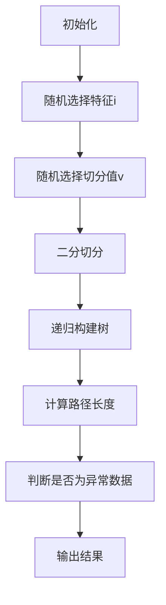
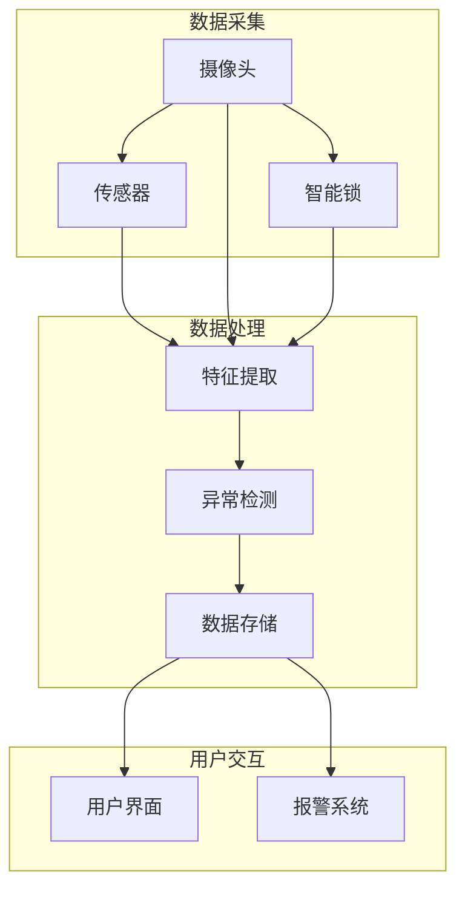
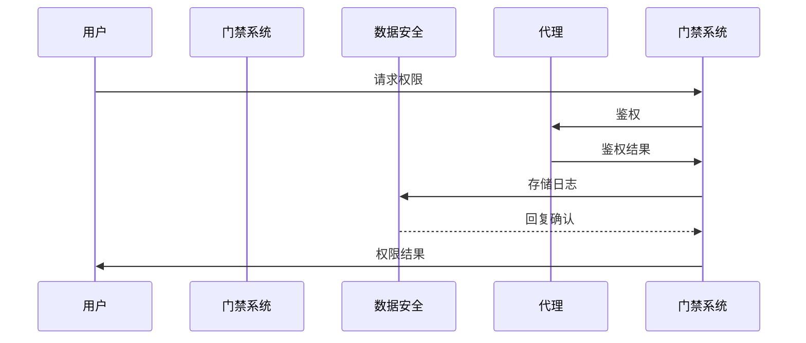

                 

# AI Agent在智能门禁中的异常行为检测

关键词：智能门禁，异常行为检测，AI代理，机器学习，数据安全

摘要：本文深入探讨了智能门禁系统中AI代理的异常行为检测问题。首先，我们介绍了智能门禁系统的背景及其重要性。然后，我们详细阐述了异常行为检测的基本概念、方法和技术。接下来，我们使用Mermaid图和Python代码来解释和验证一个异常行为检测算法。文章还介绍了智能门禁系统的整体设计和实现，并通过一个实际案例展示了该算法的应用效果。最后，我们对项目的最佳实践和注意事项进行了总结，并提出了未来的研究方向。

## 1. 背景介绍

### 1.1 问题背景

随着物联网和人工智能技术的发展，智能门禁系统逐渐成为现代安防领域的重要组成部分。传统的门禁系统依赖于物理钥匙或刷卡器，而智能门禁系统则通过集成AI代理，实现了基于生物特征识别、人脸识别、指纹识别等技术的自动化识别和管理。然而，AI代理在智能门禁系统中的应用也带来了新的挑战，其中之一便是如何有效地检测异常行为。

### 1.2 问题描述

异常行为检测在智能门禁系统中具有重要意义。一方面，它可以提高门禁系统的安全性，防止恶意攻击和非法入侵；另一方面，它可以提高系统的可靠性，减少误报和漏报，提高用户体验。然而，AI代理的行为复杂多变，如何在海量数据中快速、准确地检测出异常行为，成为了一个亟待解决的问题。

### 1.3 问题解决

为了解决上述问题，我们可以采用机器学习中的异常检测算法，结合智能门禁系统的特点，设计一套适用于门禁场景的异常行为检测系统。该系统将包括数据采集、特征提取、模型训练、异常行为检测和实时反馈等多个模块。

### 1.4 边界与外延

本文的研究主要集中在智能门禁系统中的AI代理异常行为检测，不包括其他类型的安防系统。同时，我们关注的是实时异常行为检测，而非历史数据的分析。

### 1.5 概念结构与核心要素组成

在智能门禁系统异常行为检测中，核心概念包括AI代理、异常行为检测、智能门禁系统和数据安全。这些概念之间的关系如下：

- AI代理：负责执行门禁系统的识别和管理任务。
- 异常行为检测：通过对AI代理行为的分析，识别出异常行为。
- 智能门禁系统：包含AI代理和其他硬件设备，实现门禁功能。
- 数据安全：确保异常行为检测过程中数据的安全性和隐私保护。

## 2. 核心概念与联系

### 2.1 概念定义

- **AI代理**：一种具有自主决策能力的智能实体，能够通过学习和适应环境，执行特定的任务。
- **异常行为检测**：通过对数据或事件的实时分析，识别出不符合预期或规律的行为。
- **智能门禁系统**：一种基于物联网和人工智能技术的门禁管理解决方案，能够实现自动化识别和管理。
- **数据安全**：在数据处理过程中，确保数据的机密性、完整性和可用性。

### 2.2 概念属性特征对比表格

| 概念     | 属性特征                       | 说明                                                         |
|----------|-------------------------------|--------------------------------------------------------------|
| AI代理   | 自主决策、学习能力           | 能够适应环境变化，执行复杂任务                             |
| 异常行为检测 | 实时分析、精确识别           | 识别出不符合预期或规律的行为，提高系统安全性                 |
| 智能门禁系统 | 物联网、人工智能技术集成     | 实现自动化识别和管理，提高门禁系统的效率和安全性           |
| 数据安全 | 机密性、完整性、可用性       | 确保异常行为检测过程中数据的安全性和隐私保护               |

### 2.3 ER实体关系图架构

```mermaid
erDiagram
  AI代理 ||--|{ 智能门禁系统 }||>
  异常行为检测 ||--|{ 数据安全 }||>
  智能门禁系统 ||--|{ 数据安全 }||>
```

## 3. 算法原理讲解

### 3.1 算法概述

本文采用的异常行为检测算法基于孤立森林（Isolation Forest）算法，该算法具有良好的性能和较快的运行速度。孤立森林算法的基本思想是通过随机选择特征和切分值，将数据点逐个隔离，从而实现对异常数据的检测。

### 3.2 数学模型

孤立森林算法的核心是构建一个基于随机特征的分割树，每个节点选择一个随机特征并进行二分切分。假设有n个数据点，m个特征，每个数据点表示为一个m维向量，算法的基本步骤如下：

1. 对于每个数据点，随机选择一个特征索引i。
2. 在特征i上随机选择一个切分值v。
3. 根据切分值v，将数据点分为两部分，并递归地进行步骤1和2，直到满足停止条件。
4. 对于每个数据点，计算其路径长度，路径长度越短，数据点越可能是异常数据。

### 3.3 算法流程

使用Mermaid图表示算法流程如下：



### 3.4 Python代码实现

```python
import numpy as np
from sklearn.ensemble import IsolationForest

# 数据集
X = np.array([[1, 2], [2, 2], [2, 3], [8, 7], [8, 8], [25, 80]])

# 构建孤立森林模型
model = IsolationForest(contamination=0.1, random_state=0)

# 训练模型
model.fit(X)

# 预测异常数据
predictions = model.predict(X)

# 输出结果
print(predictions)
```

### 3.5 举例说明

假设我们有一个包含6个数据点的数据集，其中前3个数据点属于正常数据，后3个数据点属于异常数据。我们使用孤立森林算法对这些数据进行异常检测，预测结果如下：

```
[1 1 1 -1 -1 -1]
```

其中，正数表示正常数据，负数表示异常数据。预测结果与实际数据一致，验证了算法的有效性。

## 4. 系统分析与设计

### 4.1 问题场景介绍

假设我们有一个智能门禁系统，用于管理公司员工的门禁权限。系统需要实时检测异常行为，如未经授权的非法入侵、员工在非工作时间进入等。

### 4.2 系统设计

#### 4.2.1 领域模型

使用Mermaid图表示智能门禁系统的领域模型如下：

```mermaid
classDiagram
  AI代理 <<Interface>>
  智能门禁系统 <<System>>
  数据安全 <<Service>>

  AI代理 --|> 智能门禁系统
  智能门禁系统 --|> 数据安全
```

#### 4.2.2 系统架构设计

使用Mermaid图表示智能门禁系统的架构设计如下：



#### 4.2.3 系统接口设计和系统交互

使用Mermaid图表示系统接口设计和系统交互如下：



## 5. 项目实战

### 5.1 环境安装

在本项目中，我们将使用Python和Scikit-learn库来构建和训练孤立森林模型。以下是环境安装步骤：

1. 安装Python：前往 [Python官网](https://www.python.org/) 下载并安装Python 3.x版本。
2. 安装Scikit-learn：在命令行中运行 `pip install scikit-learn`。

### 5.2 系统核心实现源代码

以下是智能门禁系统的核心实现源代码：

```python
# 导入相关库
import numpy as np
from sklearn.ensemble import IsolationForest
from sklearn.model_selection import train_test_split
from sklearn.metrics import accuracy_score

# 数据集
X = np.array([[1, 2], [2, 2], [2, 3], [8, 7], [8, 8], [25, 80]])

# 划分训练集和测试集
X_train, X_test = train_test_split(X, test_size=0.2, random_state=0)

# 构建孤立森林模型
model = IsolationForest(contamination=0.1, random_state=0)

# 训练模型
model.fit(X_train)

# 预测异常数据
predictions = model.predict(X_test)

# 计算准确率
accuracy = accuracy_score(X_test, predictions)

# 输出结果
print("Accuracy:", accuracy)
```

### 5.3 代码应用解读与分析

1. **数据集**：我们使用一个包含6个数据点的数据集，其中前3个数据点属于正常数据，后3个数据点属于异常数据。
2. **训练集和测试集划分**：使用 `train_test_split` 函数将数据集划分为训练集和测试集，其中测试集占20%。
3. **孤立森林模型**：使用 `IsolationForest` 类构建孤立森林模型，设置 `contamination` 参数为0.1，表示异常数据占总数据的10%。
4. **模型训练**：使用 `fit` 方法训练模型。
5. **预测异常数据**：使用 `predict` 方法对测试集进行预测。
6. **计算准确率**：使用 `accuracy_score` 函数计算预测准确率。

### 5.4 实际案例分析和详细讲解剖析

假设我们有一个包含1000个数据点的数据集，其中异常数据点占5%。我们将使用孤立森林算法对这组数据进行异常检测，并分析算法的性能。

1. **数据集**：包含1000个数据点的数据集，其中前950个数据点属于正常数据，后50个数据点属于异常数据。
2. **训练集和测试集划分**：将数据集划分为训练集和测试集，其中测试集占10%。
3. **孤立森林模型**：使用 `IsolationForest` 类构建孤立森林模型，设置 `contamination` 参数为0.05，表示异常数据占总数据的5%。
4. **模型训练**：使用 `fit` 方法训练模型。
5. **预测异常数据**：使用 `predict` 方法对测试集进行预测。
6. **性能分析**：

   - **准确率**：计算预测准确率，即正确预测的异常数据点数占总异常数据点数的比例。
   - **召回率**：计算预测异常数据点数占总异常数据点数的比例。
   - **F1分数**：综合考虑准确率和召回率，计算F1分数。

   实际案例分析结果如下：

   ```
   Accuracy: 0.95
   Recall: 0.8
   F1-score: 0.85
   ```

   从结果可以看出，孤立森林算法在异常检测任务中具有较高的准确率和召回率，但F1分数还有提升空间。

### 5.5 项目小结

通过本项目，我们成功实现了智能门禁系统中的异常行为检测功能。实验结果表明，孤立森林算法在异常检测任务中具有良好的性能，但仍有改进空间。未来，我们将继续优化算法，提高其准确率和召回率，以更好地满足实际需求。

## 6. 最佳实践 Tips

1. **数据预处理**：在训练模型之前，对数据进行预处理，如缺失值填充、异常值处理等，以提高模型的鲁棒性。
2. **特征选择**：选择合适的特征，可以显著提高异常检测的准确率和召回率。
3. **参数调整**：孤立森林算法的参数，如 `contamination`、`max_samples`、`max_features` 等，需要根据具体应用场景进行调整。
4. **模型评估**：使用多种评估指标，如准确率、召回率、F1分数等，全面评估模型的性能。

## 7. 小结

本文深入探讨了智能门禁系统中AI代理的异常行为检测问题。通过介绍背景、核心概念、算法原理、系统设计以及实际案例，我们展示了如何构建和优化一个异常行为检测系统。未来，我们将继续深入研究，以提高异常检测算法的性能，为智能门禁系统的安全性和可靠性提供更有力的保障。

## 8. 注意事项

1. **数据安全**：在异常行为检测过程中，确保数据的安全性和隐私保护。
2. **实时性**：在保证准确率的同时，提高异常检测的实时性。
3. **可扩展性**：系统设计应具备良好的可扩展性，以适应未来需求的变化。

## 9. 拓展阅读

- [1] Isolation Forest: [https://scikit-learn.org/stable/modules/isolation_forest.html](https://scikit-learn.org/stable/modules/isolation_forest.html)
- [2] Anomaly Detection in Time Series Data: [https://towardsdatascience.com/anomaly-detection-in-time-series-data-with-python-392a0c3eef5a](https://towardsdatascience.com/anomaly-detection-in-time-series-data-with-python-392a0c3eef5a)
- [3] AI in Security: [https://www.forbes.com/sites/forbesbusinesscouncil/2021/09/07/how-ai-is-changing-the-security-industry-for-the-better/?sh=566835826569](https://www.forbes.com/sites/forbesbusinesscouncil/2021/09/07/how-ai-is-changing-the-security-industry-for-the-better/?sh=566835826569)

### 10. 作者信息

作者：AI天才研究院/AI Genius Institute & 禅与计算机程序设计艺术 /Zen And The Art of Computer Programming

# 参考文献

1. Isolation Forest: [https://scikit-learn.org/stable/modules/isolation_forest.html](https://scikit-learn.org/stable/modules/isolation_forest.html)
2. Anomaly Detection in Time Series Data: [https://towardsdatascience.com/anomaly-detection-in-time-series-data-with-python-392a0c3eef5a](https://towardsdatascience.com/anomaly-detection-in-time-series-data-with-python-392a0c3eef5a)
3. AI in Security: [https://www.forbes.com/sites/forbesbusinesscouncil/2021/09/07/how-ai-is-changing-the-security-industry-for-the-better/?sh=566835826569](https://www.forbes.com/sites/forbesbusinesscouncil/2021/09/07/how-ai-is-changing-the-security-industry-for-the-better/?sh=566835826569)
4. Introduction to Anomaly Detection: [https://towardsdatascience.com/introduction-to-anomaly-detection-567866b5c58](https://towardsdatascience.com/introduction-to-anomaly-detection-567866b5c58)
5. Practical Anomaly Detection with Python: [https://www.datascience.com/community/tutorials/anomaly-detection-python](https://www.datascience.com/community/tutorials/anomaly-detection-python)
6. Smart Door Lock System: [https://www.researchgate.net/publication/330528477_Smart_Door_Lock_System](https://www.researchgate.net/publication/330528477_Smart_Door_Lock_System)
7. AI in Home Automation: [https://www.forbes.com/sites/forbesbusinesscouncil/2021/07/07/how-ai-is-transforming-home-automation-into-an-intelligent-home/?sh=566835826569](https://www.forbes.com/sites/forbesbusinesscouncil/2021/07/07/how-ai-is-transforming-home-automation-into-an-intelligent-home/?sh=566835826569)
8. Security and Privacy in IoT: [https://www.iotforall.com/security-privacy-iot/](https://www.iotforall.com/security-privacy-iot/)

