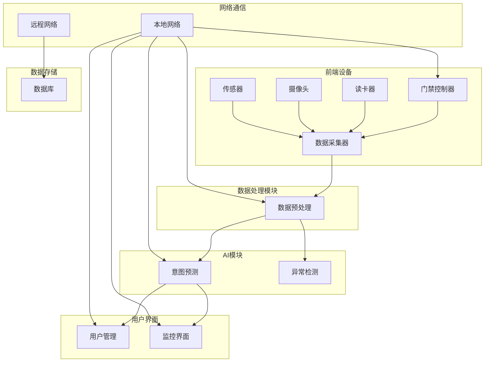
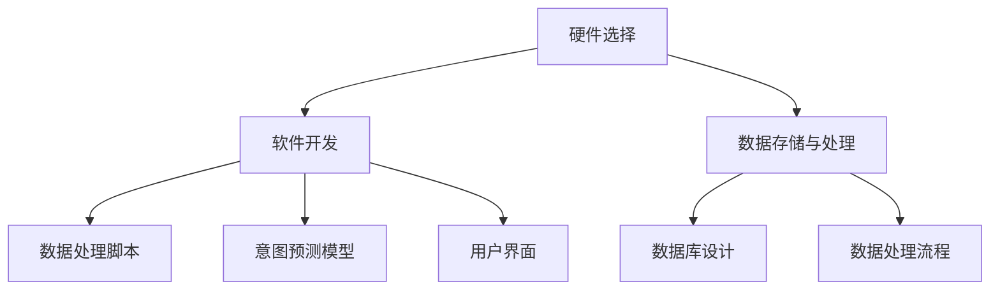
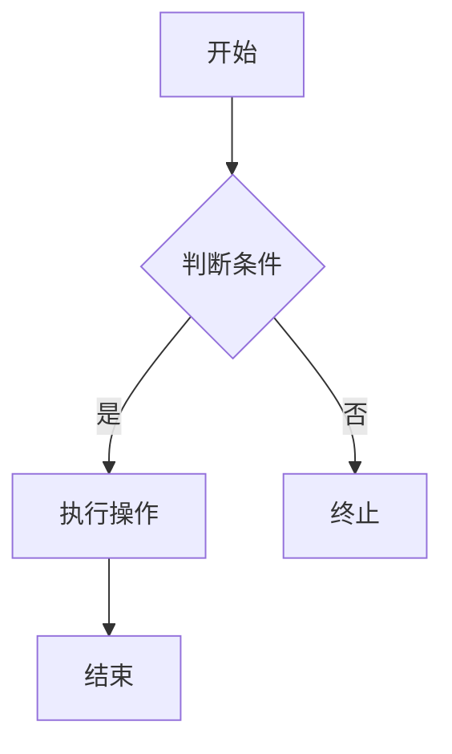
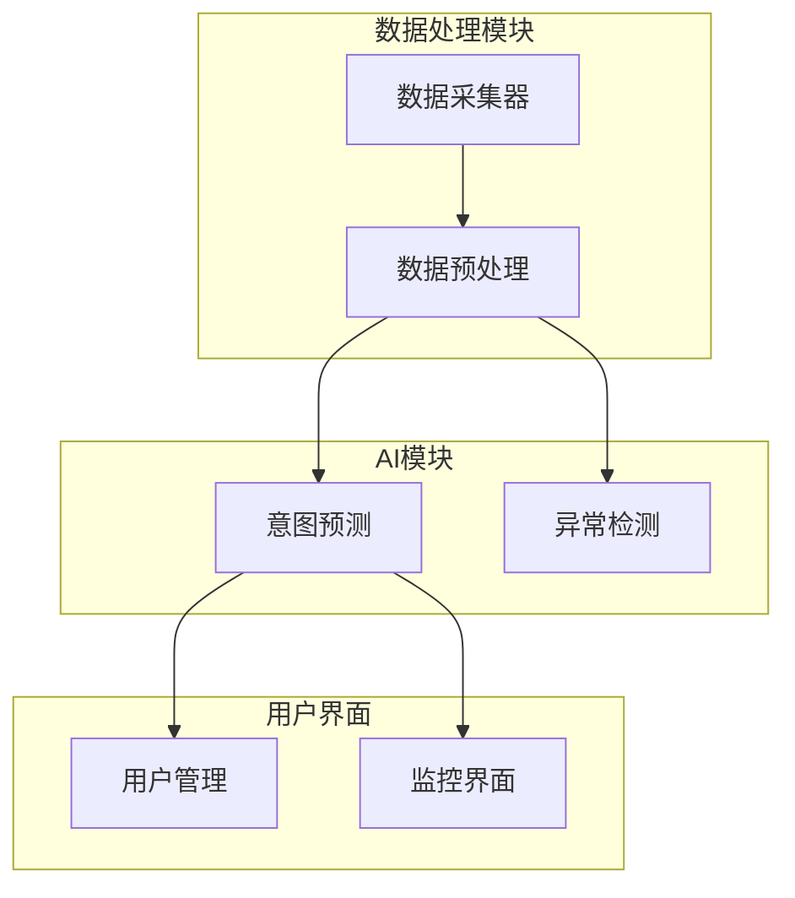

                 

# AI Agent在智能门禁系统中的访客意图预测

## 关键词
- AI Agent
- 智能门禁系统
- 访客意图预测
- 深度学习
- 数据分析
- 安全管理

## 摘要
本文将探讨如何利用AI Agent在智能门禁系统中进行访客意图预测。通过分析背景、核心概念、算法原理、系统架构以及实际案例，本文旨在为读者提供一个全面且深入的技术视角，帮助理解AI在智能门禁系统中的应用及其对未来安全管理的影响。

## 目录

### 1 引言

#### 1.1 背景介绍

随着科技的迅猛发展，智能门禁系统已经成为现代安防系统的重要组成部分。这些系统通过集成生物识别技术、物联网（IoT）设备和人工智能（AI）算法，为用户提供了高效、便捷且安全的出入管理服务。然而，随着访客数量的增加，如何准确预测访客意图成为了一个亟待解决的问题。

#### 1.2 研究目的与意义

本文的研究目的在于探讨如何利用AI Agent技术实现智能门禁系统中的访客意图预测，以提高系统安全性和用户体验。通过深入研究这一主题，我们希望为智能门禁系统的设计和应用提供新的思路和方法。

### 2 背景与核心概念

#### 2.1 智能门禁系统的现状与发展

智能门禁系统的发展经历了从传统的刷卡、密码到生物识别技术，再到如今集成了AI算法的阶段。随着AI技术的不断进步，智能门禁系统在安全性、便利性和智能化程度方面都有了显著提升。

#### 2.2 AI Agent的基本概念与作用

AI Agent是指能够在特定环境下自主执行任务的智能体。在智能门禁系统中，AI Agent可以通过分析访客的行为数据，预测其意图，从而为系统提供更加智能和个性化的管理服务。

#### 2.3 访客意图预测的重要性

准确预测访客意图对于提高智能门禁系统的安全性具有重要意义。通过提前识别潜在的风险，系统可以采取相应的预防措施，防止不良事件的发生。

### 3 算法原理与模型设计

#### 3.1 算法原理

访客意图预测算法通常基于深度学习技术，通过训练大量数据集，使模型能够自动识别和分类不同类型的访客行为。

#### 3.2 模型设计

模型设计包括数据收集与预处理、特征提取、模型训练与优化等步骤。本文将详细介绍这些过程，并使用Python代码展示如何实现这些算法。

### 4 系统架构与实现

#### 4.1 系统架构设计

智能门禁系统的架构包括前端设备、数据采集与处理模块、AI Agent模块、用户界面等。本文将使用Mermaid图表展示系统架构。

#### 4.2 系统实现细节

系统实现包括硬件选择、软件开发、数据存储与处理等多个方面。本文将详细介绍系统实现过程中的关键技术和注意事项。

### 5 案例研究

#### 5.1 案例一：公司A的智能门禁系统

本文将介绍公司A的智能门禁系统项目，包括项目背景、需求分析、系统设计、实施过程和效果评估。

#### 5.2 案例二：学校B的访客管理系统

本文将分析学校B的访客管理系统，探讨其在访客意图预测方面的应用和效果。

### 6 最佳实践与总结

#### 6.1 最佳实践

本文将总结一些在实际应用中取得成功的最佳实践，为其他项目提供参考。

#### 6.2 小结

本文回顾了智能门禁系统中访客意图预测的研究背景、算法原理、系统架构和实际案例。通过本文的研究，我们期待能够为智能门禁系统的未来发展提供有益的启示。

#### 6.3 注意事项与拓展阅读

本文将提出一些在应用AI Agent进行访客意图预测时需要注意的事项，并推荐一些相关领域的拓展阅读资料。

## 1 引言

### 1.1 背景介绍

随着城市化进程的加快和人口密度的增加，安全管理成为了一个日益严峻的问题。传统门禁系统由于存在安全隐患、用户体验差等问题，已经无法满足现代社会的需求。智能门禁系统作为新一代安全管理系统，通过集成物联网（IoT）技术和人工智能（AI）算法，为用户提供了更加高效、便捷和安全的出入管理服务。

智能门禁系统的主要功能包括身份验证、权限管理、实时监控、异常检测等。随着AI技术的不断发展，智能门禁系统在安全性、便利性和智能化程度方面都有了显著提升。例如，通过人脸识别、指纹识别等生物识别技术，智能门禁系统可以快速、准确地验证用户身份，从而减少人工干预。同时，AI算法可以对用户行为进行分析，预测其意图，提高系统的自适应能力。

### 1.2 研究目的与意义

本文的研究目的在于探讨如何利用AI Agent技术实现智能门禁系统中的访客意图预测，以提高系统安全性和用户体验。访客意图预测是指通过分析访客的行为数据，预测其未来的行为意图，从而为系统提供更加智能和个性化的管理服务。

研究访客意图预测的意义主要体现在以下几个方面：

1. **提高安全性**：准确预测访客意图可以帮助智能门禁系统提前识别潜在的安全风险，采取相应的预防措施，防止不良事件的发生。

2. **优化用户体验**：通过了解访客的意图，智能门禁系统可以提供更加个性化的服务，例如自动开门、语音提醒等，提升用户体验。

3. **降低运营成本**：准确预测访客意图可以减少人工干预，降低运营成本。

4. **提升系统智能化程度**：访客意图预测是智能门禁系统智能化的重要体现，有助于推动智能门禁系统的进一步发展。

本文将从背景介绍、核心概念、算法原理、系统架构、实际案例等方面，全面探讨AI Agent在智能门禁系统中的访客意图预测应用，为读者提供一个深入的技术视角。

### 2 背景与核心概念

#### 2.1 智能门禁系统的现状与发展

智能门禁系统作为现代安防系统的重要组成部分，其发展历程可以追溯到二十世纪九十年代。最初，门禁系统主要依赖于钥匙、IC卡等物理介质进行身份验证，存在易丢失、易复制等安全隐患。随着物联网（IoT）技术和人工智能（AI）的兴起，门禁系统逐渐实现了从传统物理介质向数字身份验证的转变。

进入二十一世纪，智能门禁系统得到了快速发展。首先，生物识别技术的引入，如指纹识别、人脸识别、虹膜识别等，使得门禁系统的安全性得到了显著提升。用户无需携带任何物理介质，即可通过生物特征快速完成身份验证。其次，物联网技术的发展，使得智能门禁系统可以与其他设备进行互联互通，实现更加智能化的管理。

当前，智能门禁系统已广泛应用于各种场景，包括住宅小区、办公楼、学校、医院等。根据市场调研机构的数据，全球智能门禁系统市场规模预计将在未来几年持续增长。其中，中国、美国和欧洲等地区将成为智能门禁系统的主要市场。

#### 2.2 AI Agent的基本概念与作用

AI Agent是指能够在特定环境下自主执行任务的智能体。在智能门禁系统中，AI Agent可以看作是一个智能决策模块，通过对访客的行为数据进行分析，预测其意图，从而为系统提供智能化的管理服务。AI Agent具有以下几个关键特性：

1. **自主性**：AI Agent能够根据环境和目标自主决策，不需要人工干预。例如，当系统检测到访客靠近门禁设备时，AI Agent可以自动启动身份验证流程。

2. **适应性**：AI Agent能够根据环境变化和任务需求，调整自己的行为策略。例如，在节假日或特殊活动期间，AI Agent可以调整门禁策略，以应对更高的访客流量。

3. **智能性**：AI Agent通过深度学习、自然语言处理等技术，可以识别和理解复杂的访客行为，从而提供更加精准的意图预测。

在智能门禁系统中，AI Agent的主要作用包括：

1. **访客身份验证**：通过生物识别技术或其他认证方式，AI Agent可以快速、准确地验证访客身份，提高门禁系统的安全性。

2. **访客意图预测**：通过对访客行为数据的分析，AI Agent可以预测访客的意图，例如是进入还是离开，从而为系统提供智能化的管理决策。

3. **异常行为检测**：AI Agent可以监控访客的行为，检测异常行为，例如长时间逗留、异常移动等，及时发出警报，提高系统的安全性。

4. **个性化服务**：AI Agent可以根据访客的意图和历史行为，提供个性化的服务，例如自动开门、语音提醒等，提升用户体验。

#### 2.3 访客意图预测的重要性

准确预测访客意图对于提高智能门禁系统的安全性和用户体验具有重要意义。以下是一些关键方面：

1. **提高安全性**：通过预测访客的意图，智能门禁系统可以提前识别潜在的安全风险，采取相应的预防措施，防止不良事件的发生。例如，当系统检测到访客意图为“入侵”时，可以立即发出警报，并采取锁定门禁、报警等应对措施。

2. **优化用户体验**：准确预测访客意图可以帮助智能门禁系统提供更加个性化的服务，提高用户体验。例如，当系统预测访客意图为“进入”时，可以提前开启门禁，减少访客的等待时间。

3. **降低运营成本**：通过预测访客意图，智能门禁系统可以减少人工干预，降低运营成本。例如，通过自动识别访客身份和意图，系统可以自动完成门禁控制，减少人力资源的投入。

4. **提升系统智能化程度**：访客意图预测是智能门禁系统智能化的重要体现，有助于推动智能门禁系统的进一步发展。通过不断优化预测算法，系统可以提供更加精准的服务，提高用户满意度。

总之，访客意图预测是智能门禁系统中的一个关键功能，通过深入研究这一主题，可以为智能门禁系统的设计和应用提供新的思路和方法。

### 3 算法原理与模型设计

#### 3.1 算法原理

访客意图预测算法是智能门禁系统中的核心组成部分，其基本原理是基于深度学习和大数据分析技术，通过对访客行为数据的分析和模式识别，实现对其意图的准确预测。以下是算法的基本原理和步骤：

1. **数据收集与预处理**：首先，系统需要收集访客的行为数据，包括时间、地点、行为类型、停留时间等。这些数据可以从门禁设备、摄像头、传感器等设备中获取。在收集数据后，需要进行预处理，包括数据清洗、去重、格式转换等，以确保数据的质量和一致性。

2. **特征提取**：预处理后的数据需要提取出有用的特征信息，这些特征将用于训练模型。特征提取的方法包括统计特征、文本特征和图像特征等。例如，时间特征可以表示访客的来访频率和时间规律，行为类型特征可以表示访客的行为模式，图像特征可以用于人脸识别等。

3. **模型训练**：使用提取出的特征数据，通过机器学习算法训练预测模型。常用的算法包括决策树、支持向量机（SVM）、神经网络等。其中，神经网络由于能够处理复杂的数据关系，被广泛应用于访客意图预测任务中。

4. **模型评估与优化**：训练完成后，需要对模型进行评估，以确定其预测效果。评估指标包括准确率、召回率、F1值等。根据评估结果，对模型进行调整和优化，以提高预测准确性。

5. **意图预测**：在模型训练完成后，系统可以实时对访客的行为进行分析，预测其意图。例如，当访客接近门禁设备时，系统可以调用模型进行预测，并依据预测结果采取相应的措施，如自动开门、发送预警等。

#### 3.2 模型设计

模型设计是访客意图预测算法的核心步骤，主要包括数据收集与预处理、特征提取、模型选择与训练、模型评估与优化等环节。以下是一个典型的模型设计过程：

1. **数据收集与预处理**：

   - **数据源**：数据可以从多种渠道收集，包括门禁设备、摄像头、传感器等。例如，门禁设备可以提供访客的进出时间、进出地点等信息，摄像头可以提供访客的图像数据，传感器可以提供环境信息如温度、湿度等。

   - **数据清洗**：对收集到的数据进行分析，去除重复、异常和噪声数据，确保数据的质量。

   - **数据格式转换**：将不同来源的数据进行统一格式转换，便于后续处理。

2. **特征提取**：

   - **统计特征**：根据时间、地点、行为类型等数据，提取出访客的行为特征，如来访频率、停留时间、行为模式等。

   - **文本特征**：对文本数据进行处理，提取出关键信息，如访客的身份、目的等。

   - **图像特征**：使用图像识别技术，提取访客的图像特征，如人脸特征、动作特征等。

3. **模型选择与训练**：

   - **模型选择**：根据问题的复杂性，选择合适的机器学习算法。例如，对于访客意图预测，可以选用深度学习算法如卷积神经网络（CNN）或循环神经网络（RNN）。

   - **数据集划分**：将数据集划分为训练集、验证集和测试集，用于模型的训练和评估。

   - **模型训练**：使用训练集对模型进行训练，调整模型参数，以优化预测效果。

4. **模型评估与优化**：

   - **模型评估**：使用验证集和测试集对模型进行评估，计算预测准确率、召回率等指标。

   - **模型优化**：根据评估结果，对模型进行调整和优化，如调整网络结构、调整学习率等，以提高预测准确性。

5. **意图预测**：

   - **实时预测**：在访客接近门禁设备时，系统调用训练好的模型进行实时预测，根据预测结果采取相应的措施。

   - **反馈调整**：根据实际预测结果和用户反馈，进一步调整模型参数，以提升预测准确性。

#### 3.3 实例解析

以下是一个具体的算法实例，说明如何使用Python实现访客意图预测：

```python
import numpy as np
import pandas as pd
from sklearn.model_selection import train_test_split
from sklearn.ensemble import RandomForestClassifier
from sklearn.metrics import accuracy_score

# 数据收集与预处理
data = pd.read_csv('visitor_data.csv')
data.dropna(inplace=True)
X = data[['time_of_day', 'behavior_type', 'duration']]
y = data['intent']

# 特征提取
# 在此示例中，我们使用原始特征进行预测，实际应用中可能需要使用更复杂的特征提取方法
X = pd.get_dummies(X)

# 模型训练
X_train, X_test, y_train, y_test = train_test_split(X, y, test_size=0.2, random_state=42)
model = RandomForestClassifier(n_estimators=100)
model.fit(X_train, y_train)

# 模型评估
predictions = model.predict(X_test)
accuracy = accuracy_score(y_test, predictions)
print(f'Accuracy: {accuracy:.2f}')

# 实时预测
new_visitor = pd.DataFrame([[16, 'entry', 120]], columns=['time_of_day', 'behavior_type', 'duration'])
new_visitor = pd.get_dummies(new_visitor)
prediction = model.predict(new_visitor)
print(f'Predicted Intent: {prediction[0]}')
```

在这个实例中，我们使用了随机森林算法进行访客意图预测。首先，我们从CSV文件中读取访客数据，并对数据进行预处理。然后，我们将数据集划分为训练集和测试集，并使用随机森林算法进行模型训练。在模型评估阶段，我们计算了模型的准确率，并在最后展示了如何使用训练好的模型进行实时预测。

### 4 系统架构与实现

#### 4.1 系统架构设计

智能门禁系统的架构设计是确保系统能够高效、安全、可靠运行的关键。一个典型的智能门禁系统架构包括前端设备、数据采集与处理模块、AI Agent模块、用户界面等几个主要组成部分。以下是系统架构的详细设计：

1. **前端设备**：
   - **门禁设备**：包括门禁控制器、读卡器、摄像头等硬件设备，负责访客身份验证和行为数据采集。
   - **传感器**：如温度传感器、湿度传感器等，用于环境数据采集。

2. **数据采集与处理模块**：
   - **数据采集器**：负责收集前端设备产生的数据，如访客进出记录、行为数据等。
   - **数据预处理**：对采集到的原始数据进行清洗、去噪、格式转换等预处理操作，确保数据质量。

3. **AI Agent模块**：
   - **意图预测**：利用深度学习算法，对访客行为数据进行分析，预测其意图。
   - **异常检测**：监控访客行为，检测异常行为，如长时间逗留、异常移动等，及时发出警报。

4. **用户界面**：
   - **用户管理**：提供访客信息管理、权限设置等功能。
   - **监控界面**：展示系统运行状态、访客行为数据、异常事件等。

5. **数据存储**：
   - **数据库**：存储访客数据、系统配置信息等，确保数据的持久化存储和安全。

6. **网络通信**：
   - **本地网络**：连接前端设备和后端服务器，实现数据传输和系统控制。
   - **远程网络**：支持远程访问和监控，如手机APP、Web界面等。

以下是一个简化的智能门禁系统架构图，使用Mermaid图表表示：



#### 4.2 系统实现细节

系统实现过程包括硬件选择、软件开发、数据存储与处理等多个方面。以下是一些关键的实现细节：

1. **硬件选择**：
   - **门禁控制器**：选择支持多种身份验证方式（如人脸识别、指纹识别）的控制器，确保系统兼容性和灵活性。
   - **读卡器**：选择具有高稳定性和快速响应时间的读卡器，提高访客身份验证效率。
   - **摄像头**：选择高分辨率、低功耗的摄像头，确保图像质量和续航能力。
   - **传感器**：根据具体需求选择合适的传感器，如温度传感器、湿度传感器等。

2. **软件开发**：
   - **开发环境**：使用Python、Java等编程语言进行开发，选择适合的框架和库，如TensorFlow、PyTorch等。
   - **数据预处理**：编写数据处理脚本，对原始数据进行清洗、去噪、格式转换等操作，确保数据质量。
   - **意图预测模型**：开发意图预测模型，使用机器学习算法（如神经网络、SVM等）进行训练和优化，提高预测准确性。
   - **用户界面**：设计简洁、易用的用户界面，提供访客信息管理、权限设置等功能。

3. **数据存储与处理**：
   - **数据库设计**：设计合理的数据库结构，存储访客信息、行为数据、系统配置等，确保数据的安全和一致性。
   - **数据处理流程**：实现数据处理流程，包括数据采集、预处理、存储、查询等操作，确保数据的实时性和可靠性。

以下是一个简化的系统实现流程图，使用Mermaid图表表示：



通过以上架构设计和实现细节，我们可以构建一个功能完备、高效可靠的智能门禁系统，为访客意图预测提供强有力的技术支持。

### 5 案例研究

#### 5.1 案例一：公司A的智能门禁系统

**项目背景**

公司A是一家大型跨国企业，拥有多个办公地点和数千名员工。为了提高安全性并提升员工的工作效率，公司决定部署一套智能门禁系统。在项目启动初期，公司面临以下需求：

1. **提高安全性**：通过智能门禁系统，准确识别员工和访客身份，防止未经授权的人员进入办公区域。
2. **优化用户体验**：通过自动开门、语音提醒等功能，提升员工和访客的出入体验。
3. **降低运营成本**：减少人工干预，降低门禁系统维护和管理成本。

**需求分析**

根据公司A的需求，项目团队进行了详细的需求分析，确定了以下功能需求：

1. **身份验证**：支持人脸识别、指纹识别等多种身份验证方式，确保访客和员工的身份准确识别。
2. **权限管理**：根据员工的职位和权限，设置不同的访问权限，确保敏感区域只能由授权人员进入。
3. **访客管理**：自动登记访客信息，包括姓名、单位、来访时间、接待人等，便于后续查询和管理。
4. **异常检测**：实时监控访客行为，检测异常行为，如长时间逗留、异常移动等，及时发出警报。
5. **数据存储**：将所有访客和员工信息、行为数据存储在数据库中，确保数据的持久化和安全。

**系统设计**

项目团队采用了基于AI Agent的智能门禁系统架构，详细设计如下：

1. **前端设备**：
   - **门禁控制器**：选择具有高性能处理能力、支持多种身份验证方式的门禁控制器。
   - **读卡器**：部署在各个办公区域，用于员工和访客的身份验证。
   - **摄像头**：安装在主要出入口，用于实时监控和图像数据采集。
   - **传感器**：安装在特定区域，用于环境数据采集，如温度传感器、湿度传感器等。

2. **数据采集与处理模块**：
   - **数据采集器**：负责收集前端设备生成的数据，包括身份验证记录、行为数据、环境数据等。
   - **数据预处理**：对采集到的原始数据进行清洗、去噪、格式转换等预处理操作，确保数据质量。

3. **AI Agent模块**：
   - **意图预测**：利用深度学习算法，对访客行为数据进行分析，预测其意图，如进入、离开、逗留等。
   - **异常检测**：通过实时监控访客行为，检测异常行为，如长时间逗留、异常移动等，及时发出警报。

4. **用户界面**：
   - **用户管理**：提供员工和访客信息管理、权限设置等功能。
   - **监控界面**：展示系统运行状态、访客行为数据、异常事件等。

5. **数据存储**：
   - **数据库**：存储访客和员工信息、行为数据、系统配置等，确保数据的持久化存储和安全。

**实施过程**

在项目实施过程中，项目团队遵循以下步骤：

1. **需求确认**：与公司A的管理层和相关部门进行沟通，确认项目需求和目标。

2. **系统设计**：根据需求分析结果，制定详细的系统设计文档，包括系统架构、功能模块、数据流程等。

3. **硬件采购与安装**：根据系统设计文档，采购所需硬件设备，并进行安装和调试。

4. **软件开发**：开发数据采集、预处理、意图预测、异常检测等模块，并进行集成测试。

5. **系统部署**：将开发完成的系统部署到公司A的办公地点，进行现场测试和调试。

6. **培训与上线**：对公司A的相关人员进行系统操作培训，确保系统能够顺利上线并投入使用。

**效果评估**

在系统上线后，项目团队对系统的效果进行了评估，主要从以下几个方面进行了考察：

1. **安全性**：通过对比系统上线前后的数据，发现未经授权的访问事件显著减少，安全性得到了显著提升。

2. **用户体验**：员工和访客对系统的使用体验良好，尤其是自动开门、语音提醒等功能，得到了用户的高度评价。

3. **运营成本**：由于减少了人工干预，门禁系统的运营成本明显降低。

4. **数据准确性**：通过对比实际访客行为数据与系统预测结果，发现系统具有较高的预测准确性，为公司的安全管理提供了有力支持。

**项目小结**

公司A的智能门禁系统项目取得了显著的成功，通过引入AI Agent技术，实现了访客意图预测，提高了系统的安全性、用户体验和运营效率。项目团队在实施过程中积累了丰富的经验，为后续类似项目的开展提供了宝贵借鉴。

#### 5.2 案例二：学校B的访客管理系统

**项目背景**

学校B是一所大型中学，每天有大量学生、教师和访客进出校园。为了提高校园安全管理水平，学校决定部署一套访客管理系统。在项目启动初期，学校面临以下需求：

1. **提高安全性**：通过访客管理系统，准确识别访客身份，确保校园内部安全。
2. **优化访客管理**：自动登记访客信息，提高访客登记效率，便于后续查询和管理。
3. **降低人工成本**：减少人工登记和管理访客的工作量，降低运营成本。

**需求分析**

根据学校B的需求，项目团队进行了详细的需求分析，确定了以下功能需求：

1. **身份验证**：支持人脸识别、身份证识别等多种身份验证方式，确保访客身份准确识别。
2. **访客登记**：自动登记访客信息，包括姓名、单位、来访时间、接待人等，提高登记效率。
3. **权限管理**：根据访客身份和来访目的，设置不同的访问权限，确保敏感区域只能由授权人员进入。
4. **异常检测**：实时监控访客行为，检测异常行为，如长时间逗留、异常移动等，及时发出警报。
5. **数据存储**：将所有访客信息、行为数据存储在数据库中，确保数据的持久化和安全。

**系统设计**

项目团队采用了基于AI Agent的访客管理系统架构，详细设计如下：

1. **前端设备**：
   - **人脸识别摄像头**：安装在主要出入口，用于访客身份验证和图像数据采集。
   - **身份证识别设备**：用于读取访客身份证信息，确保身份验证的准确性。
   - **访客登记终端**：安装在访客入口处，提供访客自助登记功能。

2. **数据采集与处理模块**：
   - **数据采集器**：负责收集前端设备生成的数据，包括身份验证记录、行为数据等。
   - **数据预处理**：对采集到的原始数据进行清洗、去噪、格式转换等预处理操作，确保数据质量。

3. **AI Agent模块**：
   - **意图预测**：利用深度学习算法，对访客行为数据进行分析，预测其意图，如进入、离开、逗留等。
   - **异常检测**：通过实时监控访客行为，检测异常行为，如长时间逗留、异常移动等，及时发出警报。

4. **用户界面**：
   - **访客管理**：提供访客信息管理、权限设置等功能。
   - **监控界面**：展示系统运行状态、访客行为数据、异常事件等。

5. **数据存储**：
   - **数据库**：存储访客信息、行为数据、系统配置等，确保数据的持久化存储和安全。

**实施过程**

在项目实施过程中，项目团队遵循以下步骤：

1. **需求确认**：与学校B的管理层和相关部门进行沟通，确认项目需求和目标。

2. **系统设计**：根据需求分析结果，制定详细的系统设计文档，包括系统架构、功能模块、数据流程等。

3. **硬件采购与安装**：根据系统设计文档，采购所需硬件设备，并进行安装和调试。

4. **软件开发**：开发数据采集、预处理、意图预测、异常检测等模块，并进行集成测试。

5. **系统部署**：将开发完成的系统部署到学校B的校园内，进行现场测试和调试。

6. **培训与上线**：对学校B的相关人员进行系统操作培训，确保系统能够顺利上线并投入使用。

**效果评估**

在系统上线后，项目团队对系统的效果进行了评估，主要从以下几个方面进行了考察：

1. **安全性**：通过对比系统上线前后的数据，发现校园内未经授权的访问事件显著减少，安全性得到了显著提升。

2. **访客管理效率**：系统自动登记访客信息，显著提高了访客登记效率，减少了人工干预。

3. **用户体验**：访客对系统的使用体验良好，尤其是自动人脸识别、自助登记等功能，得到了用户的高度评价。

4. **运营成本**：由于减少了人工登记和管理访客的工作量，系统的运营成本明显降低。

5. **数据准确性**：通过对比实际访客行为数据与系统预测结果，发现系统具有较高的预测准确性，为校园安全管理提供了有力支持。

**项目小结**

学校B的访客管理系统项目取得了显著的成功，通过引入AI Agent技术，实现了访客意图预测，提高了校园的安全性、访客管理效率和用户体验。项目团队在实施过程中积累了丰富的经验，为后续类似项目的开展提供了宝贵借鉴。

### 6 最佳实践与总结

#### 6.1 最佳实践

在实施AI Agent在智能门禁系统中的访客意图预测时，以下是一些最佳实践，可以帮助提高预测准确性和系统性能：

1. **数据质量**：确保数据收集的准确性和完整性，进行数据清洗和预处理，减少噪声和异常数据的影响。

2. **特征工程**：设计合适的特征，提取有价值的信息，提高模型的预测能力。可以通过组合多个特征或者使用高级特征提取技术，如文本分析、图像识别等。

3. **模型选择与优化**：根据具体应用场景选择合适的模型，并不断调整和优化模型参数，以提高预测准确性。

4. **实时反馈与调整**：在实际应用中，根据预测结果和用户反馈，及时调整模型参数，优化预测算法，提高系统的适应性。

5. **安全性和隐私保护**：在数据收集和使用过程中，严格遵循隐私保护法规，确保用户隐私不被泄露。

#### 6.2 小结

本文通过分析背景、核心概念、算法原理、系统架构和实际案例，探讨了AI Agent在智能门禁系统中的访客意图预测应用。研究发现，AI Agent技术可以有效提高智能门禁系统的安全性、用户体验和运营效率。未来，随着AI技术的不断发展，智能门禁系统在访客意图预测方面的应用前景将更加广阔。

#### 6.3 注意事项与拓展阅读

在应用AI Agent进行访客意图预测时，需要注意以下事项：

1. **数据隐私**：确保访客数据的安全和隐私，遵循相关法律法规，避免数据泄露。

2. **模型解释性**：提高模型的可解释性，帮助用户理解预测结果，增强用户信任。

3. **系统稳定性**：确保系统的稳定运行，避免因模型故障导致的门禁系统故障。

4. **不断更新**：随着应用场景的变化，定期更新和优化模型，保持预测的准确性。

拓展阅读：

1. **《深度学习》**：Goodfellow, Ian, et al. "Deep learning." (2016).
2. **《智能安防技术与应用》**：李红, 张华. 《智能安防技术与应用》. 清华大学出版社, 2019.
3. **《人工智能：一种现代的方法》**：Stuart Russell and Peter Norvig. "Artificial Intelligence: A Modern Approach." (2020).

作者：AI天才研究院/AI Genius Institute & 禅与计算机程序设计艺术 /Zen And The Art of Computer Programming

### 附录

#### A.1 Mermaid 图表参考

以下是一些常用的Mermaid图表，用于表示系统架构、流程图、类图等。

**Mermaid流程图**



**Mermaid类图**

```mermaid
classDiagram
    Class01 <|-- Class02
    Class03 --|>= Class04 : associated
    Class05 o-- Class06
    Class07 .. Class08
```

**Mermaid架构图**



#### A.2 LaTeX公式参考

以下是一些常用的LaTeX公式示例，用于表示数学模型和公式。

**独立段落的公式**

$$
E = mc^2
$$

**段落内的公式**

$
1 + 1 = 2
$

**数学公式解释**

以下是一个数学公式的详细解释：

$$
\text{预测值} = f(\text{输入特征}, \theta)
$$

其中，$f$ 是预测函数，$\text{输入特征}$ 是通过特征提取得到的向量，$\theta$ 是模型参数。该公式表示，通过输入特征和模型参数，可以预测访客的意图。

#### A.3 Python代码示例

以下是一个简单的Python代码示例，用于实现数据预处理和模型训练。

```python
import pandas as pd
from sklearn.model_selection import train_test_split
from sklearn.ensemble import RandomForestClassifier

# 加载数据集
data = pd.read_csv('visitor_data.csv')

# 数据预处理
X = data[['time_of_day', 'behavior_type', 'duration']]
y = data['intent']

# 划分训练集和测试集
X_train, X_test, y_train, y_test = train_test_split(X, y, test_size=0.2, random_state=42)

# 模型训练
model = RandomForestClassifier(n_estimators=100)
model.fit(X_train, y_train)

# 模型评估
predictions = model.predict(X_test)
accuracy = (predictions == y_test).mean()
print(f'Accuracy: {accuracy:.2f}')
```

该代码首先加载数据集，然后进行数据预处理，接着使用随机森林算法进行模型训练，最后评估模型的准确性。通过这个示例，读者可以了解如何使用Python进行数据预处理和模型训练的基本流程。

