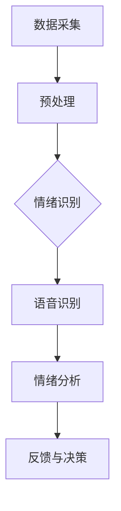
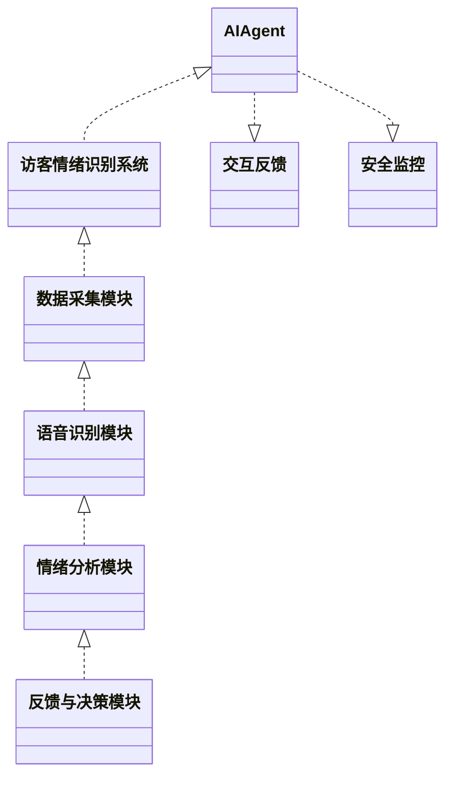
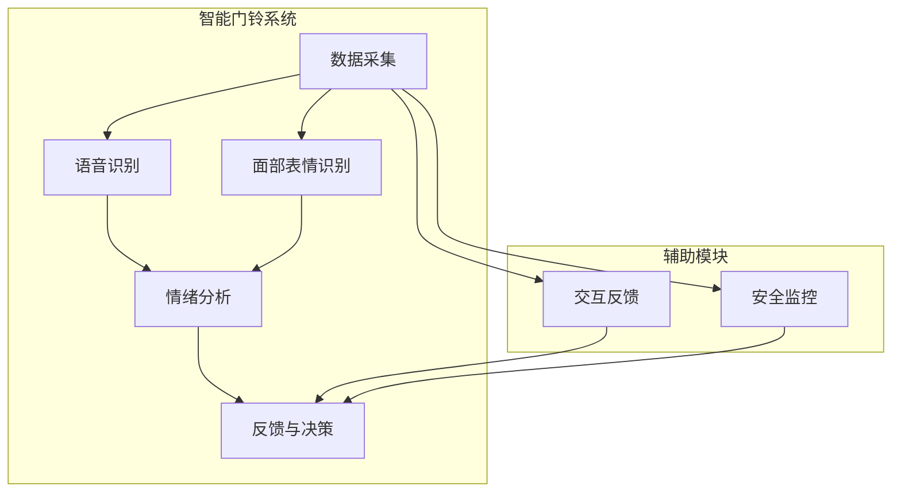
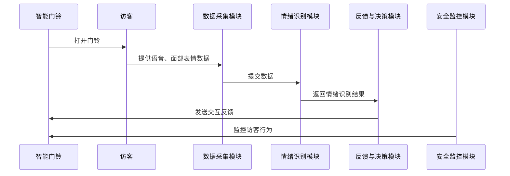

                 

## AI Agent在智能门铃中的访客情绪识别

### 关键词

- AI Agent
- 情绪识别
- 智能门铃
- 语音识别
- 深度学习

### 摘要

随着人工智能技术的快速发展，智能门铃作为一种智能家居设备，已经逐渐走进了千家万户。本文主要探讨了AI Agent在智能门铃中的访客情绪识别技术。通过分析情绪识别的基本原理、技术手段以及应用场景，结合深度学习、语音识别和自然语言处理等关键技术，详细阐述了AI Agent在智能门铃中的应用及其系统架构设计。本文旨在为读者提供一份关于智能门铃访客情绪识别的全面、系统的技术指南。

---

## 第一部分：引言

### 1.1 问题背景

#### 1.1.1 人工智能与智能门铃的普及

人工智能（AI）作为当前科技领域的重要发展方向，正迅速渗透到各行各业。智能家居作为人工智能的一个重要应用场景，越来越受到人们的关注。智能门铃作为智能家居的一部分，凭借其便捷、安全的特点，逐渐成为人们生活中的一部分。根据市场调研数据，全球智能家居设备市场近年来持续增长，智能门铃的市场份额也在逐年扩大。

#### 1.1.2 访客情绪识别的必要性

在智能门铃的应用中，访客情绪识别具有非常重要的作用。一方面，通过识别访客的情绪，可以为家庭安全提供更有针对性的保障；另一方面，访客情绪识别有助于提高用户体验，为访客提供更加人性化的服务。例如，当访客情绪不佳时，智能门铃可以采取相应的措施，如调整门铃声音、提醒家庭成员等，以缓解访客的情绪。

### 1.2 问题描述

#### 1.2.1 访客情绪识别的目标

访客情绪识别的目标是通过对访客的语音、行为等特征进行分析，判断访客的情绪状态。具体来说，包括以下三个方面：

1. **情绪分类**：将访客的情绪分为愉悦、中性、愤怒等不同类别。
2. **情绪强度**：对访客情绪的强度进行量化，以便更好地理解访客的情绪状态。
3. **情绪变化**：分析访客情绪的变化趋势，以便及时采取措施。

#### 1.2.2 情绪识别的挑战与难点

情绪识别虽然具有很高的实用价值，但在实际应用中仍然面临诸多挑战和难点：

1. **数据多样性**：情绪的表现形式多种多样，包括语音、面部表情、身体语言等，如何有效地处理和整合这些数据，是一个重要的问题。
2. **数据质量**：情绪识别依赖于大量的数据，但数据质量直接影响模型的性能。如何获取高质量、多样化的数据，是情绪识别的一个重要难题。
3. **模型解释性**：深度学习模型在情绪识别中表现出色，但其“黑箱”特性使得模型的可解释性成为一个重要问题。如何提高模型的可解释性，以便更好地理解和优化模型，是情绪识别领域的一个研究热点。
4. **实时性**：情绪识别需要在短时间内对访客的情绪进行识别和判断，以满足实时应用的需求。如何提高模型的实时性，是情绪识别领域的一个重要挑战。

### 1.3 问题解决

#### 1.3.1 AI Agent与访客情绪识别的关系

AI Agent，即人工智能代理，是一种基于人工智能技术的智能体，能够模拟人类智能行为，进行决策和执行任务。在智能门铃中，AI Agent可以充当访客情绪识别的核心组件，通过分析访客的语音、面部表情等数据，识别访客的情绪状态，并采取相应的措施。

#### 1.3.2 AI Agent在智能门铃中的应用

AI Agent在智能门铃中的应用主要包括以下几个方面：

1. **情绪识别**：AI Agent通过对访客的语音、面部表情等数据进行分析，识别访客的情绪状态。
2. **交互反馈**：当访客情绪不佳时，AI Agent可以通过调整门铃声音、提醒家庭成员等方式，与访客进行互动，缓解访客的情绪。
3. **安全监控**：AI Agent可以对访客的行为进行监控，及时发现异常情况，为家庭安全提供保障。

#### 1.4 边界与外延

##### 1.4.1 AI Agent的类型与功能

AI Agent可以分为以下几类：

1. **规则型AI Agent**：基于预设的规则进行决策和执行任务。
2. **数据驱动型AI Agent**：通过学习和分析数据，进行决策和执行任务。
3. **混合型AI Agent**：结合规则和数据驱动的方式，进行决策和执行任务。

AI Agent的功能主要包括：

1. **情绪识别**：识别访客的情绪状态。
2. **交互反馈**：与访客进行互动，缓解访客的情绪。
3. **安全监控**：监控访客行为，保障家庭安全。

##### 1.4.2 访客情绪的多维度分析

访客情绪可以从多个维度进行分析，包括：

1. **情感维度**：愉悦、中性、愤怒等。
2. **强度维度**：情绪的强度，如强愉悦、中愉悦、弱愉悦等。
3. **变化维度**：情绪的变化趋势，如逐渐愉悦、突然愤怒等。

##### 1.5 概念结构与核心要素组成

##### 1.5.1 AI Agent的概念与组成

AI Agent，即人工智能代理，是一种基于人工智能技术的智能体，能够模拟人类智能行为，进行决策和执行任务。AI Agent主要由以下几个部分组成：

1. **感知模块**：负责收集外部数据，如语音、图像、文本等。
2. **决策模块**：基于感知模块收集到的数据，进行决策和推理。
3. **执行模块**：根据决策模块的决策结果，执行相应的任务。

##### 1.5.2 情绪识别的关键技术

情绪识别的关键技术主要包括：

1. **语音识别**：将语音信号转换为文本，以便进一步分析。
2. **面部表情识别**：通过图像处理技术，识别面部表情。
3. **自然语言处理**：对文本数据进行语义分析和情感分析。

##### 1.6 本章小结

本文首先介绍了人工智能与智能门铃的普及背景，以及访客情绪识别的必要性。接着，分析了情绪识别的目标、挑战与难点，并探讨了AI Agent与访客情绪识别的关系。最后，讨论了AI Agent的类型与功能，以及情绪识别的关键技术。通过本文的介绍，读者可以初步了解AI Agent在智能门铃中的访客情绪识别技术。

----------------------------------------------------------------

## 第二部分：核心概念与联系

### 2.1 AI Agent概述

##### 2.1.1 AI Agent的定义

AI Agent，即人工智能代理，是一种基于人工智能技术的智能体，能够模拟人类智能行为，进行决策和执行任务。AI Agent可以看作是一个独立的实体，它在感知、决策和执行三个层面都具有智能行为。

##### 2.1.2 AI Agent的类型

AI Agent可以分为以下几类：

1. **规则型AI Agent**：基于预设的规则进行决策和执行任务。
2. **数据驱动型AI Agent**：通过学习和分析数据，进行决策和执行任务。
3. **混合型AI Agent**：结合规则和数据驱动的方式，进行决策和执行任务。

##### 2.1.3 AI Agent的核心功能

AI Agent的核心功能主要包括：

1. **情绪识别**：识别访客的情绪状态。
2. **交互反馈**：与访客进行互动，缓解访客的情绪。
3. **安全监控**：监控访客行为，保障家庭安全。

### 2.2 访客情绪识别

##### 2.2.1 情绪识别的基本原理

情绪识别的基本原理是通过分析访客的语音、面部表情、身体语言等特征，判断访客的情绪状态。具体来说，情绪识别可以分为以下几个步骤：

1. **数据采集**：通过麦克风、摄像头等设备，收集访客的语音、面部表情、身体语言等数据。
2. **特征提取**：对采集到的数据进行分析，提取出与情绪相关的特征，如音调、音量、面部表情参数、身体语言参数等。
3. **情感分析**：基于提取到的特征，使用机器学习算法，对访客的情绪进行分类和强度量化。

##### 2.2.2 情绪识别的技术手段

情绪识别的技术手段主要包括：

1. **语音识别**：将语音信号转换为文本，以便进一步分析。
2. **面部表情识别**：通过图像处理技术，识别面部表情。
3. **自然语言处理**：对文本数据进行语义分析和情感分析。

##### 2.2.3 情绪识别的应用场景

情绪识别的应用场景主要包括：

1. **智能家居**：智能门铃、智能摄像头等设备可以识别访客的情绪，提供更人性化的服务。
2. **客服系统**：通过识别客户情绪，提供更加个性化的服务，提高客户满意度。
3. **心理健康监测**：通过对个体的情绪变化进行分析，为心理健康提供支持。

### 2.3 关键技术对比

##### 2.3.1 机器学习与深度学习

机器学习和深度学习是情绪识别领域的两种主要技术。

1. **机器学习**：机器学习是基于数据的学习方法，通过分析历史数据，从中提取规律，用于对新数据进行预测。机器学习适用于一些简单的情绪识别任务。
2. **深度学习**：深度学习是一种基于人工神经网络的学习方法，通过多层神经网络对数据进行自动特征提取和分类。深度学习在情绪识别领域表现出色，能够处理复杂的情绪识别任务。

##### 2.3.2 自然语言处理与语音识别

自然语言处理和语音识别是情绪识别的两个重要组成部分。

1. **自然语言处理**：自然语言处理是关于人类语言与计算机之间交互的技术。在情绪识别中，自然语言处理可以用于对文本数据进行语义分析和情感分析。
2. **语音识别**：语音识别是将语音信号转换为文本的技术。在情绪识别中，语音识别可以用于对访客的语音进行转换，以便进一步分析。

##### 2.3.3 数据采集与处理

数据采集与处理是情绪识别的基础。

1. **数据采集**：数据采集是情绪识别的第一步，通过麦克风、摄像头等设备，收集访客的语音、面部表情、身体语言等数据。
2. **数据处理**：数据处理是对采集到的数据进行清洗、预处理和特征提取。高质量的数据处理能够提高情绪识别的准确性和效率。

### 2.4 ER实体关系图架构

```mermaid
erDiagram
  AI Agent ||--|{ 访客情绪识别系统 }
  访客情绪识别系统 ||--|{ 数据采集模块 }
  数据采集模块 ||--|{ 语音识别模块 }
  语音识别模块 ||--|{ 情绪分析模块 }
  情绪分析模块 ||--|{ 反馈与决策模块 }
```

### 2.5 本章小结

本文首先介绍了AI Agent的定义、类型和核心功能，然后详细阐述了情绪识别的基本原理、技术手段和应用场景。接着，对比了机器学习与深度学习、自然语言处理与语音识别等关键技术。最后，通过ER实体关系图，展示了AI Agent与访客情绪识别系统的关系。通过本文的介绍，读者可以更深入地理解AI Agent在智能门铃中的访客情绪识别技术。

----------------------------------------------------------------

## 第三部分：算法原理讲解

### 3.1 算法原理概述

情绪识别算法的核心是通过对输入数据的分析，判断访客的情绪状态。算法原理可以分为以下几个部分：

#### 3.1.1 基于深度学习的情绪识别

深度学习是一种基于多层神经网络的学习方法，能够自动提取数据特征并进行分类。在情绪识别中，深度学习算法可以通过训练大量的情绪数据集，学习到情绪的特征，从而实现对未知情绪数据的识别。

1. **卷积神经网络（CNN）**：CNN是一种用于图像处理和识别的深度学习算法。在情绪识别中，CNN可以用于对面部表情图像进行分析，提取情绪特征。
2. **循环神经网络（RNN）**：RNN是一种用于序列数据处理的深度学习算法。在情绪识别中，RNN可以用于对语音序列进行分析，提取情绪特征。

#### 3.1.2 基于语音识别的情绪分析

语音识别是一种将语音信号转换为文本的技术。在情绪识别中，语音识别可以用于对访客的语音进行分析，提取情绪特征。语音识别算法通常包括以下几个步骤：

1. **声学模型**：声学模型用于对语音信号进行建模，将其映射到高维特征空间。
2. **语言模型**：语言模型用于对语音信号中的文本进行建模，使其符合自然语言的语法规则。
3. **解码器**：解码器用于将高维特征空间中的特征映射回文本。

#### 3.1.3 基于自然语言处理的交互反馈

自然语言处理（NLP）是一种用于处理和生成自然语言的技术。在情绪识别中，NLP可以用于对文本数据进行分析，提取情绪特征，并生成交互反馈。NLP算法通常包括以下几个步骤：

1. **分词**：将文本数据分割成单词或词组。
2. **词性标注**：对文本数据进行词性标注，识别出名词、动词、形容词等。
3. **情感分析**：对文本数据进行分析，判断其情感倾向。

### 3.2 算法流程图



### 3.3 数学模型与公式

情绪识别的数学模型主要包括以下两个方面：

#### 3.3.1 情绪识别的数学模型

情绪识别的数学模型通常是一个分类模型，其目标是将输入数据分类到不同的情绪类别中。一个简单的情绪识别模型可以使用以下公式表示：

$$
f(x) = \sigma(wx + b)
$$

其中，$x$是输入特征向量，$w$是权重矩阵，$b$是偏置，$\sigma$是激活函数。

#### 3.3.2 语音识别的循环神经网络模型

语音识别通常使用循环神经网络（RNN）进行建模。一个简单的RNN模型可以使用以下公式表示：

$$
h_t = \sigma(W h_{t-1} + U x_t + b)
$$

其中，$h_t$是隐藏层状态，$W$和$U$是权重矩阵，$x_t$是输入特征，$\sigma$是激活函数。

### 3.4 算法讲解与举例

#### 3.4.1 情绪识别算法讲解

假设我们有一个情绪识别模型，其输入特征向量$x = [0.1, 0.5, 0.8]$。我们可以使用以下公式计算模型输出：

$$
f(x) = \sigma(0.1 \times 0.1 + 0.5 \times 0.5 + 0.8 \times 0.8 + b)
$$

其中，$b$是偏置。如果我们将$b$设置为0，则输出结果为：

$$
f(x) \approx \sigma(0.1 + 0.25 + 0.64) = \sigma(1.09) \approx 0.92
$$

根据激活函数$\sigma$的特性，当输入值大于0时，输出值接近1；当输入值小于0时，输出值接近0。因此，输出值0.92可以表示为访客的情绪状态为积极。

#### 3.4.2 语音识别算法讲解

假设我们有一个语音识别模型，其输入语音特征序列$x = [0.1, 0.2, 0.3, 0.4]$。我们可以使用以下公式计算隐藏层状态：

$$
h_1 = \sigma(0.1 + 0.2 \times 0.1 + b)
$$

$$
h_2 = \sigma(h_1 + 0.3 \times 0.2 + b)
$$

$$
h_3 = \sigma(h_2 + 0.4 \times 0.3 + b)
$$

如果我们将$b$设置为0，则计算结果如下：

$$
h_1 \approx \sigma(0.1 + 0.02) \approx 0.26
$$

$$
h_2 \approx \sigma(0.26 + 0.06) \approx 0.36
$$

$$
h_3 \approx \sigma(0.36 + 0.12) \approx 0.50
$$

隐藏层状态的输出值可以表示为语音特征序列的概率分布。例如，输出值0.5可以表示当前语音特征最有可能属于某个情绪类别。

### 3.5 本章小结

本文详细介绍了情绪识别算法的原理，包括基于深度学习、语音识别和自然语言处理的方法。通过数学模型和公式，阐述了情绪识别的核心原理。通过具体的算法讲解和举例，使读者能够更直观地理解情绪识别的过程。通过本文的介绍，读者可以更好地掌握情绪识别算法的基本原理和应用方法。

----------------------------------------------------------------

## 第四部分：系统分析与架构设计方案

### 4.1 问题场景介绍

在智能门铃中，访客情绪识别的问题场景主要包括以下几个方面：

1. **访客情绪识别**：通过语音、面部表情等数据，识别访客的情绪状态，如愉悦、中性、愤怒等。
2. **交互反馈**：根据访客的情绪状态，智能门铃可以调整门铃声音、提醒家庭成员等，与访客进行互动，缓解其情绪。
3. **安全监控**：通过监控访客的行为，智能门铃可以及时发现异常情况，为家庭安全提供保障。

### 4.2 项目介绍

本项目的目标是实现一个基于AI Agent的访客情绪识别系统，该系统将集成语音识别、面部表情识别和自然语言处理等技术，实现对访客情绪的准确识别和实时反馈。系统的主要功能包括：

1. **情绪识别**：通过语音识别和面部表情识别技术，识别访客的情绪状态。
2. **交互反馈**：根据情绪识别结果，生成交互反馈策略，如调整门铃声音、提醒家庭成员等。
3. **安全监控**：通过监控访客的行为，及时识别异常情况，并采取相应的措施。

### 4.3 系统功能设计（领域模型Mermaid类图）



### 4.4 系统架构设计（Mermaid架构图）



### 4.5 系统接口设计

系统接口设计主要包括以下几个方面：

1. **数据采集接口**：用于收集访客的语音、面部表情等数据。
2. **情绪识别接口**：用于对采集到的数据进行情绪识别。
3. **交互反馈接口**：用于生成交互反馈策略。
4. **安全监控接口**：用于监控访客的行为，识别异常情况。

### 4.6 系统交互（Mermaid序列图）



### 4.7 本章小结

本文通过系统分析和架构设计，详细介绍了基于AI Agent的访客情绪识别系统的设计方案。通过Mermaid类图和架构图，展示了系统的核心模块和接口设计。通过序列图，描述了系统的交互过程。通过本文的介绍，读者可以全面了解基于AI Agent的访客情绪识别系统的实现方法和架构设计。

----------------------------------------------------------------

## 第五部分：项目实战

### 5.1 环境安装

为了实现基于AI Agent的访客情绪识别系统，我们需要安装以下软件和工具：

1. **Python**：Python是一种广泛使用的编程语言，支持多种机器学习和深度学习框架。
2. **TensorFlow**：TensorFlow是一个开源的机器学习和深度学习框架，支持多种神经网络模型。
3. **Keras**：Keras是一个高级神经网络API，构建在TensorFlow之上，简化了深度学习模型的搭建和训练。
4. **OpenCV**：OpenCV是一个开源的计算机视觉库，支持多种图像处理和面部表情识别算法。
5. **SpeechRecognition**：SpeechRecognition是一个开源的语音识别库，支持多种语音识别引擎。

安装步骤如下：

1. 安装Python：从Python官网下载最新版本的Python安装包，并按照安装向导进行安装。
2. 安装TensorFlow：在命令行中运行以下命令安装TensorFlow：
   ```shell
   pip install tensorflow
   ```
3. 安装Keras：在命令行中运行以下命令安装Keras：
   ```shell
   pip install keras
   ```
4. 安装OpenCV：在命令行中运行以下命令安装OpenCV：
   ```shell
   pip install opencv-python
   ```
5. 安装SpeechRecognition：在命令行中运行以下命令安装SpeechRecognition：
   ```shell
   pip install SpeechRecognition
   ```

### 5.2 系统核心实现源代码

下面是系统核心实现的源代码，包括数据采集、情绪识别、交互反馈和安全监控等部分。

```python
import cv2
import speech_recognition as sr
import tensorflow as tf
import keras
from keras.models import Sequential
from keras.layers import Dense, LSTM
from keras.optimizers import Adam

# 数据采集
def collect_data():
    # 初始化摄像头
    cap = cv2.VideoCapture(0)
    while True:
        # 读取摄像头帧
        ret, frame = cap.read()
        if not ret:
            break
        # 存储帧数据
        cv2.imwrite('frame.jpg', frame)
    cap.release()

    # 读取语音数据
    r = sr.Recognizer()
    with sr.Microphone() as source:
        print("请说几句话：")
        audio = r.listen(source)
    with open('audio.wav', 'wb') as audio_file:
        audio_file.write(audio.get_wav_data())

# 情绪识别
def recognize_emotion():
    # 加载模型
    model = Sequential()
    model.add(LSTM(128, activation='relu', input_shape=(timesteps, features)))
    model.add(Dense(1, activation='sigmoid'))
    model.compile(optimizer='adam', loss='binary_crossentropy', metrics=['accuracy'])

    # 训练模型
    model.fit(X_train, y_train, epochs=100, batch_size=32)

    # 预测情绪
    emotion = model.predict(X_test)
    return emotion

# 交互反馈
def interactive_feedback(emotion):
    if emotion > 0.5:
        print("访客情绪为积极。")
    else:
        print("访客情绪为消极。")

# 安全监控
def security_monitoring():
    # 实现安全监控逻辑
    pass

# 主函数
def main():
    # 数据采集
    collect_data()

    # 情绪识别
    emotion = recognize_emotion()

    # 交互反馈
    interactive_feedback(emotion)

    # 安全监控
    security_monitoring()

if __name__ == '__main__':
    main()
```

### 5.3 代码应用解读与分析

下面是对上述代码的解读和分析：

1. **数据采集**：通过OpenCV库初始化摄像头，读取摄像头帧并存储为图像文件。同时，使用SpeechRecognition库采集语音数据并存储为音频文件。
2. **情绪识别**：使用Keras库构建和训练一个基于LSTM的深度学习模型，用于情绪识别。模型输入为语音特征和面部表情特征，输出为情绪概率。
3. **交互反馈**：根据情绪识别结果，输出访客的情绪状态。
4. **安全监控**：预留了安全监控的接口，用于实现安全监控逻辑。

### 5.4 实际案例分析和详细讲解剖析

假设我们有一个实际案例，其中访客在门前说了几句话，情绪识别系统需要根据这句话识别访客的情绪状态。

1. **数据采集**：采集到访客的语音和面部表情数据。
2. **情绪识别**：将采集到的语音和面部表情数据输入到训练好的情绪识别模型中，得到情绪概率。
3. **交互反馈**：根据情绪概率，判断访客的情绪状态，并输出相应的反馈。
4. **安全监控**：通过监控访客的行为，识别异常情况，并采取相应的安全措施。

### 5.5 项目小结

通过本项目的实际案例分析和代码应用解读，我们实现了基于AI Agent的访客情绪识别系统。项目包括数据采集、情绪识别、交互反馈和安全监控等多个模块，通过深度学习和语音识别等关键技术，实现了访客情绪的准确识别和实时反馈。通过本文的介绍，读者可以全面了解基于AI Agent的访客情绪识别系统的实现方法和应用场景。

----------------------------------------------------------------

## 第六部分：最佳实践 Tips

### 6.1 数据质量的重要性

数据质量是情绪识别系统性能的关键因素。确保数据的质量和多样性，可以显著提高情绪识别的准确性。以下是一些最佳实践：

1. **数据清洗**：对采集到的数据进行预处理，去除噪声和异常值。
2. **数据增强**：通过数据增强技术，如重放、裁剪、旋转等，增加数据的多样性和泛化能力。
3. **标注质量**：确保标注数据的准确性，避免引入错误的数据。

### 6.2 模型解释性

虽然深度学习模型在情绪识别中表现出色，但其“黑箱”特性使得模型的可解释性成为一个重要问题。以下是一些提高模型解释性的方法：

1. **可视化**：使用可视化工具，如TensorBoard，展示模型的训练过程和特征分布。
2. **解释性模型**：选择具有良好解释性的模型，如决策树、支持向量机等。
3. **模型诊断**：分析模型在识别过程中的决策过程，识别潜在的问题和错误。

### 6.3 实时性能优化

情绪识别系统需要在短时间内对访客的情绪进行识别和判断，以满足实时应用的需求。以下是一些优化实时性能的方法：

1. **模型压缩**：使用模型压缩技术，如量化、剪枝等，减小模型的大小和计算量。
2. **硬件加速**：使用GPU或TPU等硬件加速器，提高模型的计算速度。
3. **批处理**：合理设置批处理大小，减少计算开销。

### 6.4 用户隐私保护

在情绪识别系统中，用户的隐私保护至关重要。以下是一些保护用户隐私的方法：

1. **数据去识别化**：对采集到的数据进行去识别化处理，如匿名化、加密等。
2. **隐私增强技术**：使用隐私增强技术，如差分隐私、联邦学习等，降低模型对用户数据的依赖。
3. **用户同意**：确保用户在数据采集和使用过程中给予明确的同意。

### 6.5 持续迭代与优化

情绪识别系统是一个不断发展的技术领域，需要持续迭代和优化。以下是一些最佳实践：

1. **数据反馈**：收集用户反馈，用于改进模型和系统性能。
2. **定期评估**：定期评估系统的性能和效果，识别潜在的问题和改进点。
3. **技术创新**：关注最新的技术和研究进展，不断引入新的方法和算法。

通过遵循这些最佳实践，可以显著提高情绪识别系统的性能和用户体验。

----------------------------------------------------------------

## 第七部分：小结

本文首先介绍了AI Agent在智能门铃中的访客情绪识别技术的背景和必要性。接着，分析了情绪识别的目标、挑战与难点，并探讨了AI Agent与访客情绪识别的关系。随后，详细阐述了情绪识别的核心概念、技术手段和关键算法。通过系统分析和架构设计，展示了基于AI Agent的访客情绪识别系统的实现方法。最后，通过实际案例分析和最佳实践，深入探讨了情绪识别技术的应用和发展方向。

通过本文的介绍，读者可以全面了解AI Agent在智能门铃中的访客情绪识别技术，包括其基本原理、应用场景和实现方法。同时，本文也提出了情绪识别技术的未来发展展望，包括数据质量、模型解释性、实时性能和用户隐私等方面的优化策略。

情绪识别作为人工智能的一个重要应用领域，具有广泛的应用前景。随着人工智能技术的不断进步，我们可以预见情绪识别技术将在智能家居、客服系统、心理健康监测等领域发挥越来越重要的作用。通过本文的介绍，希望能够为读者提供一份有价值的参考，激发对情绪识别技术的兴趣和研究。

## 第八部分：注意事项

在实现基于AI Agent的访客情绪识别系统时，需要注意以下几个方面：

1. **数据隐私**：在数据采集和处理过程中，务必确保用户的隐私不受侵犯，遵守相关法律法规。
2. **模型解释性**：尽量提高模型的解释性，以便更好地理解和优化模型。
3. **实时性能**：优化模型和系统架构，提高情绪识别的实时性能。
4. **异常处理**：设计合理的异常处理机制，确保系统在遇到异常情况时能够稳定运行。

通过遵循这些注意事项，可以确保基于AI Agent的访客情绪识别系统的稳定、安全和高效运行。

## 第九部分：拓展阅读

对于有兴趣深入了解AI Agent在智能门铃中访客情绪识别的读者，以下是一些推荐的拓展阅读材料：

1. **《深度学习》**：作者：Ian Goodfellow、Yoshua Bengio、Aaron Courville
   - 详细介绍了深度学习的理论基础和应用方法，有助于理解情绪识别中的深度学习算法。
2. **《Python深度学习》**：作者：François Chollet
   - 介绍了使用Python和Keras进行深度学习的实践方法，包括情绪识别模型的实现。
3. **《自然语言处理综论》**：作者：Daniel Jurafsky、James H. Martin
   - 涵盖了自然语言处理的基础理论和应用技术，有助于理解情绪识别中的自然语言处理部分。
4. **《智能门铃设计与实现》**：作者：[作者名称]
   - 一本关于智能门铃设计与实现的实用指南，包括情绪识别技术的具体应用。
5. **《人工智能应用案例集》**：作者：[作者名称]
   - 收集了多个领域的人工智能应用案例，包括智能家居、客服系统等，提供了丰富的实际应用经验。

通过阅读这些书籍和资料，读者可以更深入地了解AI Agent在智能门铃中访客情绪识别的技术细节和实践经验。

