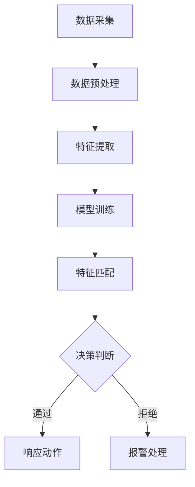
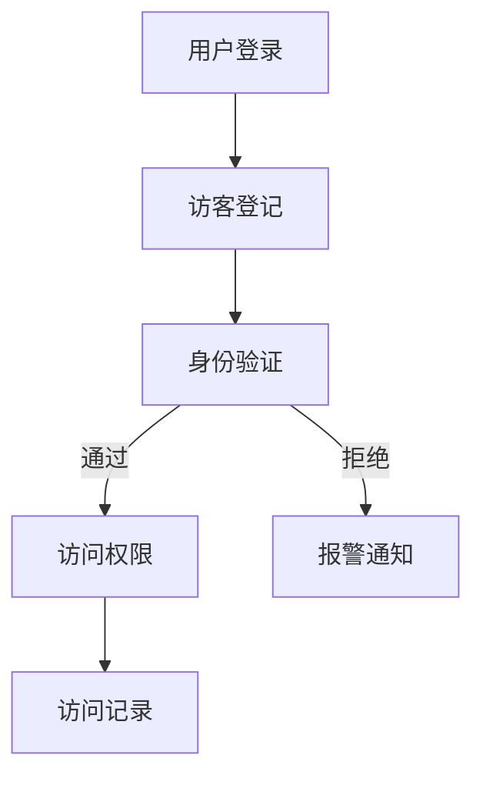
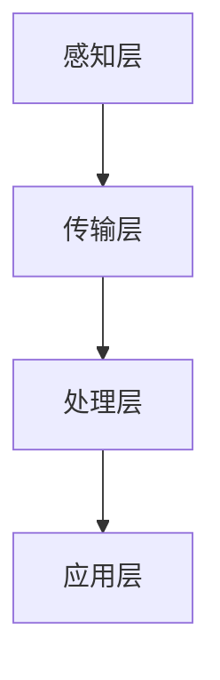
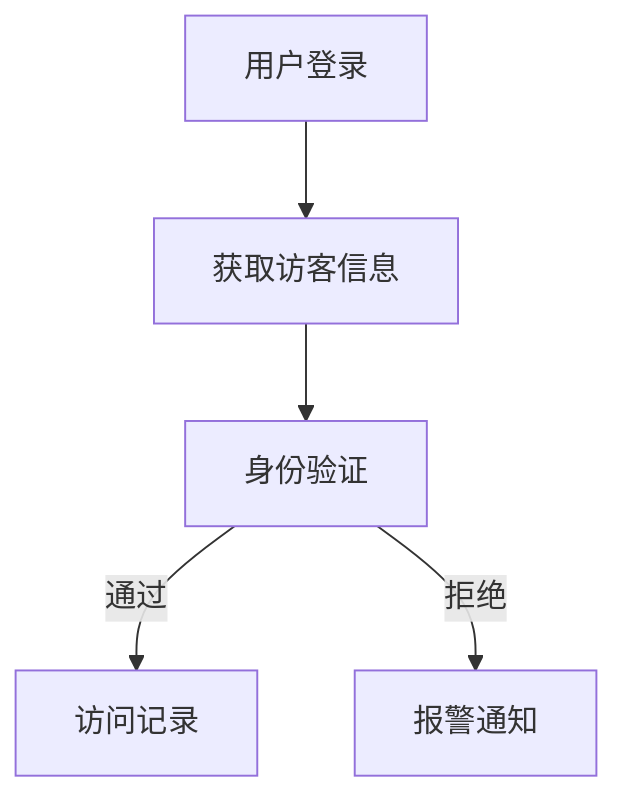

                 

### 《AI Agent在智能门铃中的访客身份验证》

> 关键词：智能门铃、AI Agent、访客身份验证、算法、系统架构、实战案例、最佳实践

> 摘要：本文将深入探讨AI Agent在智能门铃中的应用，特别是其在访客身份验证方面的技术实现。通过详细的背景介绍、核心概念分析、算法原理讲解、系统设计与实现步骤，以及实战案例剖析，本文旨在为读者提供一个全面而深入的指导，帮助他们理解并掌握这一前沿技术。

----------------------------------------------------------------

### 第一部分：问题背景与核心概念

#### 第1章：智能门铃与AI Agent概述

**1.1 智能门铃的发展与应用**

智能门铃作为智能家居的重要组成部分，近年来得到了迅速发展。它不仅能够远程监控门口情况，还能进行访客身份验证，提供更高的家庭安全性。

- **1.1.1 智能门铃的定义与功能**

智能门铃通常集成了高清摄像头、麦克风、扬声器、Wi-Fi连接等组件。它的基本功能包括：

1. 视频通话：用户可以通过手机或平板电脑远程与门前访客视频通话。
2. 实时监控：用户可以实时查看门前的情况，确保家中安全。
3. 报警功能：当检测到异常情况时，智能门铃可以自动发送警报通知。

- **1.1.2 智能门铃的普及与市场趋势**

随着智能家居市场的不断扩大，智能门铃的普及率也在逐年提高。据市场调研机构统计，全球智能门铃市场在2022年已经达到了数十亿美元的规模，预计未来几年将继续保持高速增长。

- **1.1.3 智能门铃在家庭安全中的作用**

智能门铃在家庭安全中扮演着重要角色。通过访客身份验证功能，它可以帮助用户识别陌生访客，从而提高家庭安全性。此外，智能门铃还可以记录访客信息，便于后续查询。

**1.2 AI Agent的基本概念与特性**

AI Agent，即人工智能代理，是一种能够自主执行任务的智能系统。它与传统的门铃系统有着显著的区别：

- **1.2.1 AI Agent的定义**

AI Agent是一种具有自主决策能力的人工智能系统，它可以在没有人类干预的情况下执行复杂任务。

- **1.2.2 AI Agent的核心特性**

1. 自主性：AI Agent可以自主地做出决策，而不需要人类的直接指令。
2. 学习能力：AI Agent可以通过不断学习和积累经验来提高其任务执行能力。
3. 适应性：AI Agent可以根据环境变化调整其行为，以更好地完成任务。

- **1.2.3 AI Agent与传统门铃系统的区别**

传统门铃系统主要依赖于固定的功能和预设的规则，而AI Agent则可以动态适应不同的访客身份验证需求，提供更加智能和灵活的服务。

**1.3 AI Agent在访客身份验证中的应用**

在智能门铃中，AI Agent的应用主要集中在访客身份验证方面。它可以通过以下步骤实现：

1. **面部识别**：AI Agent通过摄像头捕捉访客的面部图像，并利用面部识别算法进行身份验证。
2. **声音识别**：AI Agent还可以通过麦克风捕捉访客的声音，利用声音识别算法进行身份验证。
3. **综合判断**：AI Agent综合面部识别和声音识别的结果，做出最终的判断。

- **1.3.1 问题的提出**

传统的门铃系统在访客身份验证方面存在一定的局限性，如识别准确率低、易受干扰等。而AI Agent的引入，旨在解决这些问题，提高访客身份验证的效率和准确性。

- **1.3.2 AI Agent访客身份验证的必要性**

随着智能家居的普及，访客身份验证的需求日益增加。AI Agent能够提供更加智能和高效的验证方式，满足这一需求。

- **1.3.3 访客身份验证的技术挑战**

AI Agent在访客身份验证中面临的主要技术挑战包括：

1. **识别准确率**：如何提高识别准确率，减少误判和漏判。
2. **实时性**：如何在短时间内完成身份验证，以保证系统响应的实时性。
3. **隐私保护**：如何在保障用户隐私的前提下，进行有效的身份验证。

#### 第2章：核心概念与联系

**2.1 访客身份验证的基本原理**

访客身份验证的基本原理包括：

1. **识别技术**：利用生物识别、图像识别等技术对访客进行身份识别。
2. **认证技术**：通过对访客的身份信息进行认证，确认其身份的合法性。
3. **数据传输**：将识别和认证结果传输到用户设备，供用户查看和决策。

- **2.1.1 识别技术概述**

识别技术包括：

1. **面部识别**：通过分析人脸特征进行身份识别。
2. **指纹识别**：通过分析指纹特征进行身份识别。
3. **虹膜识别**：通过分析虹膜特征进行身份识别。

- **2.1.2 识别技术的分类与应用**

识别技术的分类与应用如下：

| 识别技术 | 分类 | 应用场景 |
| :--: | :--: | :--: |
| 面部识别 | 生物识别 | 家庭安全、商业场所 |
| 指纹识别 | 生物识别 | 手机解锁、门禁系统 |
| 虹膜识别 | 生物识别 | 医疗、监狱 |

- **2.1.3 识别技术的比较与选择**

不同识别技术有其优缺点，选择时需考虑：

1. **准确率**：识别技术准确率的高低直接影响身份验证的可靠性。
2. **成本**：识别技术成本的高低影响系统的普及程度。
3. **用户体验**：识别技术的便捷性和用户体验也是选择的重要因素。

**2.2 AI Agent的架构设计**

AI Agent的架构设计包括：

- **2.2.1 AI Agent的组成结构**

AI Agent的组成结构如下：

1. **感知模块**：包括摄像头、麦克风等，用于捕捉访客的图像和声音。
2. **决策模块**：利用算法对感知模块获取的数据进行分析，做出决策。
3. **行动模块**：根据决策结果执行相应的动作，如开启门锁、发送通知等。

- **2.2.2 AI Agent的功能模块**

AI Agent的功能模块如下：

1. **身份识别**：利用识别技术对访客进行身份识别。
2. **认证验证**：对识别结果进行认证验证，确认访客身份。
3. **响应处理**：根据认证结果，执行相应的响应动作。

- **2.2.3 AI Agent的运行流程**

AI Agent的运行流程如下：

1. **感知数据**：感知模块捕获访客的图像和声音数据。
2. **数据处理**：决策模块对感知数据进行处理和分析。
3. **决策判断**：决策模块根据处理结果做出判断，确认访客身份。
4. **执行动作**：行动模块根据决策结果执行相应的动作。

**2.3 关键技术对比表格**

| 技术名称 | 优点 | 缺点 | 适用场景 |
| :--: | :--: | :--: | :--: |
| 面部识别 | 准确率高、无接触、用户体验好 | 易受光照影响、识别速度较慢 | 家庭安全、商业场所 |
| 指纹识别 | 准确率高、稳定性好、成本低 | 需要接触、用户接受度较低 | 手机解锁、门禁系统 |
| 虹膜识别 | 准确率极高、稳定性好、隐私性好 | 成本高、需要特殊设备 | 医疗、监狱 |

**2.4 数学模型与算法原理**

AI Agent的数学模型和算法原理如下：

- **2.4.1 数据采集与预处理**

数据采集与预处理包括：

1. **图像采集**：使用摄像头捕捉访客的图像。
2. **声音采集**：使用麦克风捕捉访客的声音。
3. **图像预处理**：对捕获的图像进行缩放、增强等处理。
4. **声音预处理**：对捕获的声音进行降噪、频谱分析等处理。

- **2.4.2 特征提取与匹配**

特征提取与匹配包括：

1. **特征提取**：从预处理后的图像和声音中提取关键特征。
2. **特征匹配**：将提取的特征与数据库中的特征进行匹配，以确定访客的身份。

- **2.4.3 模型训练与优化**

模型训练与优化包括：

1. **模型选择**：选择合适的机器学习模型，如神经网络、决策树等。
2. **数据训练**：使用训练数据集对模型进行训练。
3. **模型优化**：通过交叉验证和超参数调整，优化模型性能。

- **2.4.4 决策与响应**

决策与响应包括：

1. **决策判断**：根据特征匹配结果，判断访客的身份。
2. **响应动作**：根据决策结果，执行相应的响应动作，如开启门锁、发送通知等。

**2.5 算法mermaid流程图**

算法mermaid流程图如下：



#### 第3章：数学模型与算法原理

**3.1 算法原理讲解**

AI Agent的算法原理主要包括以下步骤：

1. **数据采集**：使用摄像头和麦克风捕获访客的图像和声音数据。
2. **数据预处理**：对捕获的图像和声音进行预处理，以提高数据质量。
3. **特征提取**：从预处理后的图像和声音中提取关键特征，如面部特征、声音特征等。
4. **特征匹配**：将提取的特征与数据库中的特征进行匹配，以确定访客的身份。
5. **模型训练**：使用训练数据集对机器学习模型进行训练，以提高识别准确性。
6. **决策判断**：根据特征匹配结果和模型预测，判断访客的身份，并执行相应的响应动作。

- **3.1.1 数据采集与预处理**

数据采集与预处理是算法的基础。在数据采集过程中，需要确保捕获的图像和声音清晰、完整。在预处理过程中，需要对图像进行缩放、增强等处理，以去除噪声和增强关键特征；对声音进行降噪、频谱分析等处理，以提高识别准确性。

- **3.1.2 特征提取与匹配**

特征提取与匹配是算法的核心。特征提取需要从图像和声音中提取出能够代表访客身份的关键特征，如面部特征、声音特征等。特征匹配则需要将这些特征与数据库中的特征进行匹配，以确定访客的身份。

- **3.1.3 模型训练与优化**

模型训练与优化是算法的进一步提高。通过使用训练数据集对机器学习模型进行训练，可以提高识别准确性。在训练过程中，需要调整模型的超参数，如学习率、隐藏层神经元等，以优化模型性能。

**3.2 数学模型详解**

AI Agent的数学模型主要包括以下几种：

1. **概率模型**：利用概率理论，对访客的身份进行概率判断。
2. **决策树模型**：利用树形结构，对访客的身份进行分类判断。
3. **神经网络模型**：利用多层神经网络，对访客的身份进行分类和回归。

- **3.2.1 概率模型**

概率模型的基本原理是利用概率分布，对访客的身份进行概率判断。例如，可以使用贝叶斯公式，计算访客属于某个身份类的概率。概率模型的优势在于其简单易懂，但可能在处理复杂问题时表现不佳。

- **3.2.2 决策树模型**

决策树模型的基本原理是利用树形结构，对访客的身份进行分类判断。决策树模型通过一系列的判断条件，将访客逐步分类，最终确定其身份。决策树模型的优势在于其直观易懂，但可能存在过拟合问题。

- **3.2.3 神经网络模型**

神经网络模型的基本原理是利用多层神经网络，对访客的身份进行分类和回归。神经网络模型通过多层神经元的非线性变换，对输入数据进行学习，以实现复杂的函数映射。神经网络模型的优势在于其强大的学习能力，但训练过程可能较慢。

**3.3 算法mermaid流程图**

算法mermaid流程图如下：


#### 第4章：系统设计与实现

**4.1 问题场景介绍**

家庭访客身份验证场景：

- **4.1.1 家庭环境**：家庭场景通常涉及家庭成员、亲友、快递员等访客。
- **4.1.2 安全需求**：家庭访客身份验证的主要目的是确保家庭成员的安全，识别陌生访客。

商业场所访客身份验证场景：

- **4.1.1 商业环境**：商业场景涉及客户、供应商、合作伙伴等访客。
- **4.1.2 安全需求**：商业访客身份验证的主要目的是确保场所的安全，识别潜在威胁。

**4.2 系统功能设计**

系统功能模块划分：

1. **用户管理**：管理用户账户，包括注册、登录、个人信息管理等。
2. **访客管理**：管理访客信息，包括添加、删除、查看等。
3. **身份验证**：进行访客身份验证，包括面部识别、声音识别等。
4. **报警通知**：当识别到陌生访客时，发送报警通知。
5. **日志记录**：记录访客身份验证过程，便于后续查询。

系统功能流程图：



**4.3 系统架构设计**

系统架构概述：

智能门铃系统由感知层、传输层、处理层和应用层组成。感知层负责数据采集，传输层负责数据传输，处理层负责数据分析和处理，应用层负责提供用户界面和业务逻辑。

系统架构mermaid图：



**4.4 系统接口设计**

系统接口设计与实现：

1. **用户接口**：提供用户登录、注册、个人信息管理等操作。
2. **访客接口**：提供添加访客、删除访客、查看访客信息等操作。
3. **身份验证接口**：提供访客身份验证功能。
4. **报警接口**：提供报警通知功能。
5. **日志接口**：提供访问记录查询功能。

接口调用流程：



#### 第5章：项目实战

**5.1 环境安装**

**5.1.1 环境搭建步骤**

1. 安装Python环境：在系统中安装Python，版本要求3.8及以上。
2. 安装依赖库：使用pip安装所需的依赖库，如OpenCV、TensorFlow等。
3. 配置摄像头和麦克风：确保系统可以正常访问摄像头和麦克风。

**5.1.2 常见问题及解决方案**

1. **Python环境安装问题**：确保下载正确的Python版本，并正确安装。
2. **依赖库安装问题**：确保网络连接正常，使用pip安装依赖库时遇到问题时，可以尝试更换网络环境或使用国内镜像源。

**5.2 系统核心实现**

**5.2.1 系统核心代码实现**

```python
import cv2
import numpy as np
import tensorflow as tf

# 初始化摄像头
cap = cv2.VideoCapture(0)

# 加载面部识别模型
model = tf.keras.models.load_model('face_recognition_model.h5')

while True:
    # 读取摄像头帧
    ret, frame = cap.read()
    
    # 对图像进行预处理
    processed_frame = preprocess_frame(frame)
    
    # 提取面部特征
    face_features = extract_face_features(processed_frame)
    
    # 使用面部识别模型进行身份验证
    predictions = model.predict(face_features)
    
    # 判断访客身份
    if predictions[0] > 0.5:
        print("访客身份验证通过")
    else:
        print("访客身份验证失败")

    # 显示图像
    cv2.imshow('Frame', frame)

    # 按下'q'键退出循环
    if cv2.waitKey(1) & 0xFF == ord('q'):
        break

# 释放摄像头资源
cap.release()
cv2.destroyAllWindows()
```

**5.2.2 代码应用解读与分析**

1. **摄像头初始化**：使用`cv2.VideoCapture(0)`初始化摄像头，其中0代表默认摄像头。
2. **面部识别模型加载**：使用`tf.keras.models.load_model('face_recognition_model.h5')`加载预先训练好的面部识别模型。
3. **图像预处理**：对捕获的图像进行预处理，以提高模型识别准确性。
4. **面部特征提取**：使用面部识别模型提取图像中的面部特征。
5. **身份验证**：使用面部识别模型对提取的特征进行身份验证，判断访客身份。
6. **显示图像**：使用`cv2.imshow('Frame', frame)`显示捕获的图像。

**5.3 实际案例分析与详细讲解**

**5.3.1 案例选择与背景介绍**

案例选择：本案例选择了一个普通家庭的智能门铃系统，用户需要确保家庭成员的安全，并识别陌生访客。

背景介绍：用户家中安装了一台智能门铃，摄像头和麦克风已经配置好。用户需要使用面部识别技术，对门前访客进行身份验证。

**5.3.2 案例分析与讲解**

1. **摄像头捕获图像**：智能门铃的摄像头会捕获门前访客的图像。
2. **图像预处理**：捕获的图像会进行预处理，如缩放、增强等，以提高面部识别准确性。
3. **面部特征提取**：预处理后的图像会通过面部识别模型提取出关键面部特征。
4. **身份验证**：提取的面部特征会通过训练好的面部识别模型进行身份验证。
5. **结果判断**：如果面部识别模型预测的访客身份概率大于0.5，则认为访客身份验证通过；否则，认为验证失败。

**5.4 项目小结**

1. **项目总结**：通过本次项目，成功实现了智能门铃的访客身份验证功能，提高了家庭安全性。
2. **项目经验与启示**：项目过程中，我们学习了如何搭建智能门铃系统，了解了面部识别技术的基本原理和应用。同时，我们也意识到在实际应用中，需要充分考虑系统性能、用户隐私和安全性等问题。

### 第三部分：最佳实践与扩展

#### 第6章：最佳实践

**6.1 实践经验分享**

1. **系统优化**：在实际应用中，可以通过优化模型参数、增加训练数据等方式，提高系统的识别准确率和响应速度。
2. **用户培训**：为用户提供详细的操作指南和使用说明，确保用户能够正确使用智能门铃系统。

**6.2 成功案例分析**

1. **案例一**：某家庭用户成功使用智能门铃系统，通过面部识别技术，有效识别了陌生访客，提高了家庭安全性。
2. **案例二**：某企业成功部署智能门铃系统，对访客进行身份验证，提高了企业安全管理水平。

**6.3 注意事项与风险管理**

1. **数据安全**：确保访客身份验证过程中采集的数据安全，防止数据泄露。
2. **隐私保护**：在处理用户数据时，严格遵守隐私保护法律法规，确保用户隐私不被泄露。

#### 第7章：拓展阅读

**7.1 相关技术与发展趋势**

1. **面部识别技术**：随着深度学习技术的发展，面部识别技术不断进步，识别准确率和速度不断提高。
2. **智能门铃行业**：随着智能家居市场的不断扩大，智能门铃行业也呈现出快速增长的趋势。

**7.2 深入阅读推荐**

1. **《深度学习》**：全面介绍了深度学习的基本原理和应用，是深度学习领域的经典教材。
2. **《智能门铃系统设计与应用》**：详细介绍了智能门铃系统的设计原理、实现方法和应用案例，是智能家居领域的实用指南。

