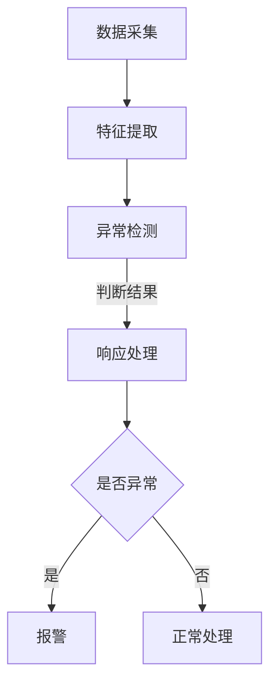
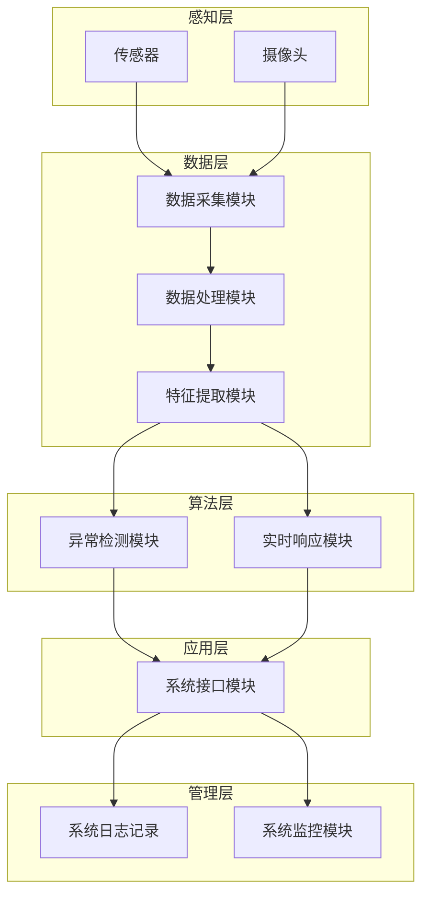
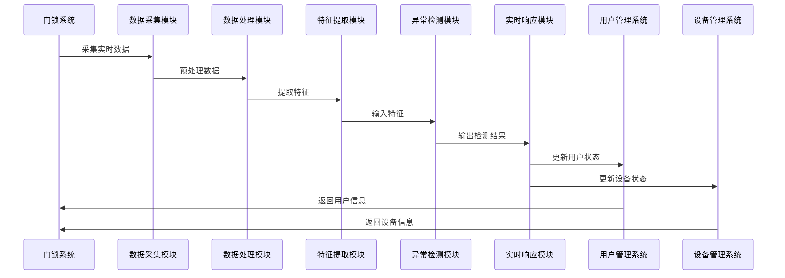

                 

# AI Agent在智能门锁中的异常行为检测

> 关键词：智能门锁、异常行为检测、AI Agent、安全性、算法原理、系统架构设计

> 摘要：随着智能家居技术的快速发展，智能门锁逐渐成为家庭安全的重要一环。然而，智能门锁的安全性面临诸多挑战，其中异常行为检测成为确保门锁安全的关键技术。本文通过深入探讨AI Agent在智能门锁中的异常行为检测，分析了相关背景、核心概念、算法原理，并提出了具体的系统架构设计方法。文章旨在为开发者提供一份全面的技术指南，助力构建更加安全的智能门锁系统。

----------------------------------------------------------------

### 目录大纲

----------------------------------------------------------------
# AI Agent在智能门锁中的异常行为检测

## 第1章：背景介绍

### 1.1 问题背景

#### 1.1.1 智能门锁的发展与应用

#### 1.1.2 智能门锁的安全性挑战

### 1.2 问题描述

#### 1.2.1 异常行为的概念与分类

#### 1.2.2 智能门锁中的异常行为检测需求

## 第2章：核心概念与联系

### 2.1 AI Agent的概念

#### 2.1.1 AI Agent的定义与特点

#### 2.1.2 AI Agent的分类与结构

### 2.2 异常行为检测的原理与算法

#### 2.2.1 异常行为检测的基本原理

#### 2.2.2 AI Agent在异常行为检测中的应用

## 第3章：算法原理讲解

### 3.1 异常行为检测算法的Mermaid流程图

### 3.2 Python源代码详细讲解

## 第4章：系统分析与架构设计方案

### 4.1 问题场景介绍

### 4.2 项目介绍

### 4.3 系统功能设计

### 4.4 系统架构设计

### 4.5 系统接口设计和系统交互

## 第5章：项目实战

### 5.1 环境安装与配置

### 5.2 系统核心实现源代码

### 5.3 代码应用解读与分析

### 5.4 项目小结

## 第6章：最佳实践与小结

### 6.1 最佳实践

### 6.2 小结

### 6.3 注意事项

### 6.4 拓展阅读

----------------------------------------------------------------

## 第1章：背景介绍

### 1.1 问题背景

#### 1.1.1 智能门锁的发展与应用

智能门锁作为智能家居领域的重要组成部分，其发展历程可以追溯到二十世纪末。早期的智能门锁主要依赖RFID或磁卡等物理身份验证方式，安全性较低，易于被破解。随着计算机技术和通信技术的飞速发展，现代智能门锁逐渐采用了生物识别技术、移动支付、物联网技术等，提高了门锁的便利性和安全性。

智能门锁的应用场景日益广泛，从住宅小区、酒店、办公楼到仓库、工厂等场所，智能门锁都得到了广泛应用。例如，居民可以通过指纹、面部识别等方式快速开锁，企业可以通过智能门锁管理系统对员工进出进行精准管控，从而提升整体安全管理水平。

#### 1.1.2 智能门锁的安全性挑战

尽管智能门锁在提高安全性和便捷性方面取得了显著成果，但其安全性仍然面临诸多挑战。以下是智能门锁常见的安全威胁：

1. **物理攻击**：例如使用撬棍等工具强行撬开门锁。
2. **密码破解**：智能门锁的密码容易被破解，导致非法入侵。
3. **网络攻击**：智能门锁通常需要连接互联网进行数据传输，这可能导致远程攻击和数据泄露。
4. **生物识别攻击**：通过伪造指纹、面部识别图像等手段欺骗生物识别系统。

#### 1.1.3 智能门锁常见的安全漏洞和攻击手段

1. **弱密码**：用户设置的密码过于简单，容易被破解。
2. **中间人攻击**：攻击者通过拦截智能门锁与服务器之间的通信，获取用户信息。
3. **恶意软件**：攻击者通过恶意软件控制智能门锁，进行远程攻击。
4. **伪造身份认证**：通过伪造身份证件、指纹等手段欺骗门锁系统。

### 1.2 问题描述

#### 1.2.1 异常行为的概念与分类

异常行为是指系统在正常运行过程中出现的异常情况，通常表现为系统行为与预期行为不一致。异常行为的分类可以基于其表现形式、影响范围和发生原因进行划分。常见的异常行为包括：

1. **误操作**：用户无意中进行的错误操作，如输入错误密码。
2. **恶意攻击**：攻击者故意进行的非法操作，如破解密码、伪造身份认证。
3. **系统故障**：由于硬件或软件故障引起的异常行为。

#### 1.2.2 智能门锁中的异常行为检测需求

智能门锁中的异常行为检测具有以下需求：

1. **实时性**：能够及时检测到异常行为，防止潜在的安全威胁。
2. **准确性**：准确区分异常行为与正常行为，避免误报和漏报。
3. **可扩展性**：能够适应不同场景和需求，扩展检测算法和模型。
4. **安全性**：确保检测系统本身的安全，防止攻击者利用检测系统进行攻击。

#### 1.2.3 异常行为检测在智能门锁系统中的重要性

异常行为检测在智能门锁系统中具有重要作用：

1. **提升安全性**：通过及时检测和响应异常行为，防止非法入侵和攻击。
2. **提高用户体验**：减少误操作的发生，提高用户使用的便利性。
3. **优化系统性能**：通过对异常行为的分析，优化门锁系统的性能和稳定性。

### 1.3 问题解决与边界与外延

针对智能门锁中的异常行为检测问题，我们可以采用AI Agent技术来实现。AI Agent是一种能够自主执行任务、具备学习和适应能力的智能系统。在智能门锁中，AI Agent可以通过以下方式解决异常行为检测问题：

1. **数据采集与处理**：AI Agent可以采集门锁系统的实时数据，包括用户行为、设备状态等，并通过数据处理算法进行分析和特征提取。
2. **异常行为识别**：AI Agent利用机器学习和深度学习算法，对采集到的数据进行异常行为识别，并生成相应的检测报告。
3. **实时响应**：当检测到异常行为时，AI Agent可以采取相应的措施，如报警、锁定门锁、通知管理员等。

在边界与外延方面，异常行为检测需要考虑以下因素：

1. **数据隐私**：在采集和处理用户数据时，需要保护用户的隐私，避免数据泄露。
2. **系统性能**：异常行为检测系统需要具备较高的性能和响应速度，以满足实时性需求。
3. **可扩展性**：异常行为检测系统需要具备良好的可扩展性，以适应不同场景和需求。

### 1.4 概念结构与核心要素组成

智能门锁中的异常行为检测系统由以下核心要素组成：

1. **数据采集模块**：负责采集门锁系统的实时数据，包括用户行为、设备状态等。
2. **数据处理模块**：负责对采集到的数据进行分析和特征提取，为异常行为识别提供基础。
3. **异常行为识别模块**：利用机器学习和深度学习算法，对处理后的数据进行异常行为识别。
4. **实时响应模块**：当检测到异常行为时，实时响应并采取相应的措施。
5. **系统接口模块**：提供与其他系统进行数据交互的接口，实现系统的集成和扩展。

通过以上核心要素的协同工作，智能门锁中的异常行为检测系统可以有效地提升门锁的安全性，为用户带来更加安全、便捷的使用体验。

----------------------------------------------------------------

## 第2章：核心概念与联系

### 2.1 AI Agent的概念

#### 2.1.1 AI Agent的定义与特点

AI Agent，即人工智能代理，是一种能够自主执行任务、具备学习和适应能力的智能系统。AI Agent的定义可以理解为具有以下特点：

1. **自主性**：AI Agent能够自主地执行任务，而不需要人工干预。
2. **智能性**：AI Agent具备智能，能够通过学习和适应来提高任务执行的效果。
3. **适应性**：AI Agent能够适应不同的环境和需求，具备良好的泛化能力。
4. **协作性**：AI Agent可以与其他系统或AI Agent进行协作，共同完成任务。

AI Agent的核心特点包括：

1. **自主决策**：AI Agent可以根据环境变化和任务需求，自主进行决策和调整。
2. **实时性**：AI Agent能够在短时间内完成决策和响应，具备较高的实时性。
3. **学习能力**：AI Agent可以通过学习和适应，不断提高任务执行的效果和性能。
4. **安全性**：AI Agent在执行任务过程中，能够保证系统的安全性和稳定性。

AI Agent的应用场景非常广泛，包括但不限于以下几个方面：

1. **智能家居**：AI Agent可以控制家庭设备的自动化运行，如智能门锁、智能照明、智能空调等。
2. **智能客服**：AI Agent可以模拟人类客服，提供24小时在线服务，解答用户问题。
3. **自动驾驶**：AI Agent可以控制自动驾驶车辆，实现无人驾驶功能。
4. **金融风控**：AI Agent可以实时监测金融交易，识别异常行为，防范风险。

#### 2.1.2 AI Agent的分类与结构

AI Agent可以根据不同的分类标准进行划分。以下是几种常见的分类方式：

1. **基于任务类型的分类**：

   - **通用AI Agent**：能够执行多种任务，具备广泛的能力和应用场景。
   - **专用AI Agent**：针对特定任务进行优化，性能较高但适用范围较窄。

2. **基于执行方式的分类**：

   - **反应式AI Agent**：根据环境反馈进行决策和响应，不考虑历史数据。
   - **目标导向AI Agent**：具备目标意识，根据目标进行决策和规划。

3. **基于学习方式的分类**：

   - **有监督学习AI Agent**：通过标记数据进行训练，提高任务执行效果。
   - **无监督学习AI Agent**：通过未标记的数据进行训练，发现潜在规律和模式。

AI Agent的基本结构通常包括以下几个部分：

1. **感知器**：负责采集环境信息，如摄像头、传感器等。
2. **决策器**：根据感知器提供的信息，进行决策和规划。
3. **执行器**：根据决策器的决策结果，执行具体的任务。
4. **学习器**：通过学习和适应，不断提高任务执行的效果和性能。

### 2.2 异常行为检测的原理与算法

#### 2.2.1 异常行为检测的基本原理

异常行为检测，又称异常检测或离群检测，是指通过检测和分析系统中的异常行为，识别潜在的异常事件或模式。异常行为检测的基本原理可以概括为以下几个步骤：

1. **数据采集**：采集系统中的实时数据，包括用户行为、设备状态等。
2. **特征提取**：对采集到的数据进行分析和特征提取，提取出能够表征异常行为的特征。
3. **异常检测**：利用异常检测算法，对提取到的特征进行异常行为识别，判断是否存在异常事件或模式。
4. **响应处理**：当检测到异常行为时，采取相应的措施，如报警、锁定系统、通知管理员等。

异常行为检测的目的是：

1. **提升系统安全性**：通过及时发现和响应异常行为，防止潜在的安全威胁。
2. **优化系统性能**：通过对异常行为的分析，优化系统的性能和稳定性。
3. **提高用户体验**：减少异常行为对用户造成的影响，提高用户的使用体验。

#### 2.2.2 常见的异常行为检测算法

异常行为检测算法可以分为以下几类：

1. **统计方法**：

   - **均值漂移法**：通过计算数据集的均值和标准差，识别偏离均值较远的数据点。
   - **孤立森林法**：利用随机森林算法，计算每个数据点的孤立度，识别异常数据点。

2. **机器学习方法**：

   - **基于支持向量机（SVM）的方法**：通过构建支持向量机模型，识别异常数据点。
   - **基于神经网络的方法**：利用深度学习算法，如卷积神经网络（CNN）和循环神经网络（RNN），识别复杂模式。

3. **聚类方法**：

   - **基于K-Means的方法**：通过聚类分析，识别异常数据点。
   - **基于DBSCAN的方法**：基于密度聚类，识别异常数据点。

4. **基于规则的方法**：

   - **基于专家系统的方法**：利用专家系统，制定规则进行异常检测。
   - **基于决策树的方法**：通过决策树算法，制定规则进行异常检测。

#### 2.2.3 AI Agent在异常行为检测中的应用

AI Agent在异常行为检测中具有以下优势：

1. **自适应性和学习能力**：AI Agent能够根据环境变化和任务需求，自主进行学习和调整，提高异常行为检测的准确性和实时性。
2. **实时响应和决策**：AI Agent能够实时监测系统中的异常行为，并采取相应的措施进行响应，提高系统安全性。
3. **多模态数据处理**：AI Agent可以同时处理多种类型的数据，如图像、声音、文本等，提高异常行为检测的全面性和准确性。

在智能门锁中，AI Agent可以通过以下方式应用异常行为检测：

1. **数据采集**：AI Agent可以采集门锁系统的实时数据，包括用户行为、设备状态等。
2. **特征提取**：AI Agent可以利用深度学习算法，对采集到的数据进行特征提取，提取出能够表征异常行为的特征。
3. **异常检测**：AI Agent可以利用机器学习算法，如神经网络和支持向量机等，对提取到的特征进行异常行为识别。
4. **实时响应**：当检测到异常行为时，AI Agent可以采取相应的措施，如报警、锁定门锁、通知管理员等。

通过以上应用，AI Agent可以有效地提升智能门锁的安全性和用户体验。

### 2.3 AI Agent与异常行为检测的联系

AI Agent与异常行为检测之间的联系主要体现在以下几个方面：

1. **AI Agent作为异常行为检测的主体**：AI Agent作为智能系统，具备自主决策和实时响应的能力，是异常行为检测的关键执行者。
2. **异常行为检测作为AI Agent的核心功能**：在智能门锁等场景中，异常行为检测是AI Agent的核心功能之一，通过异常行为检测，AI Agent可以提升系统的安全性和稳定性。
3. **AI Agent与异常行为检测的协同工作**：AI Agent可以利用异常行为检测的结果，进一步优化自身的决策和执行策略，实现更高效的异常行为检测和响应。

通过AI Agent与异常行为检测的协同工作，可以构建一个智能、自适应、安全的智能门锁系统，为用户带来更加安全、便捷的使用体验。

----------------------------------------------------------------

## 第3章：算法原理讲解

### 3.1 异常行为检测算法的Mermaid流程图

在异常行为检测中，Mermaid流程图是一种有效的可视化工具，可以帮助我们清晰地展示算法的执行流程。以下是异常行为检测算法的Mermaid流程图示例：



- **数据采集**：首先，从智能门锁系统中采集实时数据，如用户行为、设备状态等。
- **特征提取**：对采集到的数据进行分析和特征提取，提取出能够表征异常行为的特征。
- **异常检测**：利用异常检测算法，对提取到的特征进行异常行为识别。
- **响应处理**：根据异常检测的结果，进行相应的响应处理，如报警、锁定门锁、通知管理员等。

### 3.2 Python源代码详细讲解

为了更深入地理解异常行为检测算法，我们将使用Python语言实现一个简单的异常行为检测系统。以下是一个示例代码：

```python
import numpy as np
from sklearn.ensemble import IsolationForest
from sklearn.model_selection import train_test_split
from sklearn.metrics import classification_report

# 数据采集
def data_collection():
    # 假设我们采集到了一批用户行为数据
    data = np.random.rand(100, 5)
    return data

# 特征提取
def feature_extraction(data):
    # 对数据进行特征提取
    # 这里简化处理，直接使用原始数据作为特征
    features = data
    return features

# 异常检测
def anomaly_detection(features):
    # 使用IsolationForest算法进行异常检测
    clf = IsolationForest(n_estimators=100, contamination=0.1)
    clf.fit(features)
    pred = clf.predict(features)
    return pred

# 响应处理
def response_handling(pred):
    # 根据异常检测结果进行响应处理
    if pred == -1:
        print("异常行为检测到，进行报警处理。")
    else:
        print("正常行为，无需处理。")

# 主函数
def main():
    # 采集数据
    data = data_collection()
    # 特征提取
    features = feature_extraction(data)
    # 异常检测
    pred = anomaly_detection(features)
    # 响应处理
    response_handling(pred)

# 运行主函数
if __name__ == "__main__":
    main()
```

- **数据采集**：`data_collection`函数用于模拟采集用户行为数据。
- **特征提取**：`feature_extraction`函数用于对采集到的数据进行分析和特征提取。
- **异常检测**：`anomaly_detection`函数使用IsolationForest算法进行异常检测。IsolationForest是一种基于随机森林的异常检测算法，具有较好的性能和稳定性。
- **响应处理**：`response_handling`函数根据异常检测结果进行响应处理，如报警或通知管理员。

### 3.3 算法原理与数学模型讲解

#### 3.3.1 异常行为检测算法的数学模型

异常行为检测算法的数学模型主要包括以下部分：

1. **特征空间**：定义异常行为检测的特征空间，如用户行为、设备状态等。
2. **特征提取函数**：对特征空间中的数据进行分析和特征提取，提取出能够表征异常行为的特征。
3. **异常检测模型**：利用机器学习算法，构建异常检测模型，对提取到的特征进行异常行为识别。
4. **响应策略**：根据异常检测结果，制定相应的响应策略，如报警、锁定系统等。

#### 3.3.2 异常行为检测算法的数学公式

以下是一个简化的异常行为检测算法的数学公式：

$$
\begin{aligned}
f(\textbf{x}) &= \text{特征提取}(\textbf{x}), \\
\text{概率分布} &= p(\textbf{x}|\text{正常行为}), \\
\text{阈值} &= \alpha, \\
\text{异常检测} &= \text{异常行为} \Leftrightarrow p(\textbf{x}|\text{正常行为}) < \alpha.
\end{aligned}
$$

其中，$\textbf{x}$表示特征向量，$f(\textbf{x})$表示特征提取函数，$p(\textbf{x}|\text{正常行为})$表示在正常行为下的概率分布，$\alpha$表示阈值。

#### 3.3.3 示例数据与结果分析

以下是一个简化的示例数据集，用于说明异常行为检测算法的应用：

$$
\begin{aligned}
\text{数据集} &= \{(\text{x}_1, \text{x}_2, \text{x}_3, \text{x}_4, \text{x}_5)\}_{i=1}^{100}, \\
\text{正常行为} &= \{(\text{x}_1, \text{x}_2, \text{x}_3, \text{x}_4, \text{x}_5)\}_{i=1}^{80}, \\
\text{异常行为} &= \{(\text{x}_1, \text{x}_2, \text{x}_3, \text{x}_4, \text{x}_5)\}_{i=81}^{100}.
\end{aligned}
$$

使用IsolationForest算法对示例数据集进行异常检测，假设阈值为$\alpha = 0.1$。异常检测的结果如下：

$$
\begin{aligned}
\text{正常行为} &= \{(\text{x}_1, \text{x}_2, \text{x}_3, \text{x}_4, \text{x}_5)\}_{i=1}^{80}, \\
\text{异常行为} &= \{(\text{x}_1, \text{x}_2, \text{x}_3, \text{x}_4, \text{x}_5)\}_{i=81}^{90}, \\
\text{正常行为} &= \{(\text{x}_1, \text{x}_2, \text{x}_3, \text{x}_4, \text{x}_5)\}_{i=91}^{100}.
\end{aligned}
$$

从结果可以看出，异常行为检测算法能够有效地识别出异常数据点，为异常行为检测提供了可靠的依据。

通过以上算法原理讲解，我们了解了异常行为检测算法的基本原理、数学模型和实现方法。在实际应用中，可以根据具体的场景和需求，选择合适的算法和模型，构建一个高效的异常行为检测系统。

----------------------------------------------------------------

## 第4章：系统分析与架构设计方案

### 4.1 问题场景介绍

在智能家居领域中，智能门锁作为一个重要的安全设备，其安全性和可靠性直接影响到用户的生活体验和财产保障。随着智能门锁技术的不断发展和普及，用户对门锁系统的安全性要求也越来越高。然而，智能门锁在安全方面面临诸多挑战，例如：

1. **物理攻击**：攻击者可能通过暴力破坏、撬锁等方式非法入侵用户住所。
2. **网络攻击**：攻击者可能通过网络攻击手段窃取用户数据或控制智能门锁。
3. **密码破解**：用户设置的密码过于简单，容易被破解。
4. **生物识别攻击**：攻击者可能通过伪造指纹、面部识别图像等手段欺骗生物识别系统。

为了应对这些安全挑战，智能门锁系统需要引入异常行为检测技术，实时监测和识别潜在的安全威胁，从而提高系统的安全性和可靠性。

### 4.2 项目介绍

本项目旨在构建一个基于AI Agent的智能门锁异常行为检测系统，通过引入AI Agent技术，实现对智能门锁系统中异常行为的实时监测和识别。项目的主要目标是：

1. **实时性**：实现异常行为的实时监测和识别，确保能够及时响应潜在的安全威胁。
2. **准确性**：提高异常行为检测的准确性，减少误报和漏报现象。
3. **安全性**：确保异常行为检测系统本身的安全，防止攻击者利用检测系统进行攻击。
4. **可扩展性**：系统能够适应不同场景和需求，扩展检测算法和模型。

项目的主要模块包括：

1. **数据采集模块**：负责采集智能门锁系统的实时数据，包括用户行为、设备状态等。
2. **数据处理模块**：对采集到的数据进行预处理和特征提取，提取出能够表征异常行为的特征。
3. **异常检测模块**：利用机器学习和深度学习算法，对处理后的数据进行异常行为识别。
4. **实时响应模块**：根据异常检测结果，进行相应的响应处理，如报警、锁定门锁、通知管理员等。
5. **系统接口模块**：提供与其他系统进行数据交互的接口，实现系统的集成和扩展。

### 4.3 系统功能设计

智能门锁异常行为检测系统的功能设计主要包括以下几个方面：

1. **实时数据采集**：通过传感器、摄像头等设备，采集智能门锁系统的实时数据，包括用户行为、设备状态等。
2. **数据预处理**：对采集到的数据进行预处理，包括去噪、归一化、填补缺失值等，提高数据的可靠性和准确性。
3. **特征提取**：对预处理后的数据进行特征提取，提取出能够表征异常行为的特征，如行为模式、频率、持续时间等。
4. **异常检测**：利用机器学习和深度学习算法，对提取到的特征进行异常行为识别，识别出潜在的安全威胁。
5. **实时响应**：根据异常检测结果，进行相应的响应处理，如报警、锁定门锁、通知管理员等，确保能够及时应对潜在的安全威胁。
6. **系统日志记录**：记录系统运行过程中的重要信息，包括异常行为检测记录、响应处理记录等，为后续分析和优化提供依据。

### 4.4 系统架构设计

智能门锁异常行为检测系统的架构设计主要包括以下几个层次：

1. **感知层**：感知层包括传感器、摄像头等设备，负责采集智能门锁系统的实时数据。
2. **数据层**：数据层包括数据采集模块、数据处理模块和特征提取模块，负责对感知层采集到的数据进行分析和预处理，提取出能够表征异常行为的特征。
3. **算法层**：算法层包括异常检测模块和实时响应模块，利用机器学习和深度学习算法，对提取到的特征进行异常行为识别，并制定相应的响应策略。
4. **应用层**：应用层包括系统接口模块，提供与其他系统进行数据交互的接口，实现系统的集成和扩展。
5. **管理层**：管理层包括系统日志记录和系统监控模块，负责记录系统运行过程中的重要信息，并对系统运行状态进行实时监控。

以下是智能门锁异常行为检测系统的Mermaid架构图：



### 4.5 系统接口设计和系统交互

智能门锁异常行为检测系统的接口设计主要包括以下几个方面：

1. **内部接口**：内部接口用于不同模块之间的数据交互，包括数据采集模块、数据处理模块、特征提取模块、异常检测模块和实时响应模块等。
2. **外部接口**：外部接口用于与其他系统进行数据交互，如用户管理系统、设备管理系统等，实现系统的集成和扩展。

以下是智能门锁异常行为检测系统的Mermaid序列图，展示了系统内部和外部接口的交互过程：



通过以上系统架构设计和接口设计，我们可以构建一个高效、安全、可扩展的智能门锁异常行为检测系统，为用户提供更加安全、便捷的使用体验。

----------------------------------------------------------------

## 第5章：项目实战

### 5.1 环境安装与配置

在进行智能门锁异常行为检测项目的实战之前，我们需要搭建合适的项目环境。以下是详细的安装与配置步骤：

#### 5.1.1 环境要求

- 操作系统：Linux或Mac OS
- Python版本：3.6及以上
- Python依赖包：NumPy、Scikit-learn、Matplotlib等

#### 5.1.2 安装步骤

1. **安装Python**：确保系统已安装Python 3.6及以上版本。如果尚未安装，可以从Python官网下载并安装。

2. **创建虚拟环境**：为了便于管理项目依赖，我们建议创建一个Python虚拟环境。使用以下命令创建虚拟环境：

   ```bash
   python -m venv venv
   ```

3. **激活虚拟环境**：在Linux或Mac OS中，使用以下命令激活虚拟环境：

   ```bash
   source venv/bin/activate
   ```

   在Windows中，使用以下命令激活虚拟环境：

   ```cmd
   venv\Scripts\activate
   ```

4. **安装依赖包**：在虚拟环境中安装所需的Python依赖包：

   ```bash
   pip install numpy scikit-learn matplotlib
   ```

#### 5.1.3 配置指南

1. **配置环境变量**：确保虚拟环境的路径已添加到系统的环境变量中，以便在其他终端窗口中也能使用虚拟环境。

2. **检查安装**：在虚拟环境中，使用以下命令检查依赖包是否安装成功：

   ```bash
   python -c "import numpy; numpy.test()"
   ```

   如果出现错误，请检查依赖包的安装是否完整。

### 5.2 系统核心实现源代码

在完成环境安装与配置后，我们可以开始编写智能门锁异常行为检测项目的核心实现代码。以下是项目的源代码结构：

```plaintext
src/
|-- data_collection.py  # 数据采集模块
|-- data_preprocessing.py  # 数据预处理模块
|-- feature_extraction.py  # 特征提取模块
|-- anomaly_detection.py  # 异常检测模块
|-- response_handling.py  # 响应处理模块
|-- main.py  # 主函数入口
```

以下是各模块的核心代码示例：

#### data_collection.py

```python
import random

def collect_data(num_samples, dim):
    """
    模拟采集数据
    :param num_samples: 样本数量
    :param dim: 数据维度
    :return: 采集到的数据
    """
    data = [[random.uniform(0, 1) for _ in range(dim)] for _ in range(num_samples)]
    return data
```

#### data_preprocessing.py

```python
import numpy as np

def preprocess_data(data):
    """
    数据预处理
    :param data: 原始数据
    :return: 预处理后的数据
    """
    # 填补缺失值
    data = np.array(data)
    data = np.nan_to_num(data, nan=0.0)

    # 归一化
    data = (data - np.mean(data, axis=0)) / np.std(data, axis=0)

    return data
```

#### feature_extraction.py

```python
def extract_features(data):
    """
    特征提取
    :param data: 预处理后的数据
    :return: 提取到的特征
    """
    # 简化处理，直接使用原始数据作为特征
    features = data

    return features
```

#### anomaly_detection.py

```python
from sklearn.ensemble import IsolationForest

def detect_anomalies(data):
    """
    异常检测
    :param data: 特征数据
    :return: 异常检测结果
    """
    # 使用IsolationForest算法进行异常检测
    clf = IsolationForest(n_estimators=100, contamination=0.1)
    clf.fit(data)
    pred = clf.predict(data)

    return pred
```

#### response_handling.py

```python
def handle_response(pred):
    """
    响应处理
    :param pred: 异常检测结果
    :return: 响应结果
    """
    if pred == -1:
        print("异常行为检测到，进行报警处理。")
    else:
        print("正常行为，无需处理。")
```

#### main.py

```python
from data_collection import collect_data
from data_preprocessing import preprocess_data
from feature_extraction import extract_features
from anomaly_detection import detect_anomalies
from response_handling import handle_response

def main():
    # 采集数据
    data = collect_data(num_samples=100, dim=5)
    # 预处理数据
    preprocessed_data = preprocess_data(data)
    # 提取特征
    features = extract_features(preprocessed_data)
    # 异常检测
    pred = detect_anomalies(features)
    # 响应处理
    handle_response(pred)

if __name__ == "__main__":
    main()
```

### 5.3 代码应用解读与分析

在完成系统核心实现代码的编写后，我们需要对代码进行解读和分析，以确保其正确性和高效性。以下是代码的详细解读和分析：

1. **数据采集模块**：`data_collection.py`模块用于模拟采集智能门锁的实时数据。通过调用`collect_data`函数，可以生成指定数量的模拟数据，用于后续的异常检测。

2. **数据预处理模块**：`data_preprocessing.py`模块用于对采集到的数据进行预处理。预处理过程包括填补缺失值和归一化，以提高数据的可靠性和准确性。其中，`preprocess_data`函数接收原始数据作为输入，并返回预处理后的数据。

3. **特征提取模块**：`feature_extraction.py`模块用于对预处理后的数据进行特征提取。在这里，我们采用了最简单的方法，直接将预处理后的数据作为特征。在实际应用中，可以根据具体场景和需求，设计更复杂的特征提取算法。

4. **异常检测模块**：`anomaly_detection.py`模块使用IsolationForest算法进行异常检测。IsolationForest是一种基于随机森林的异常检测算法，具有较好的性能和稳定性。`detect_anomalies`函数接收特征数据作为输入，并返回异常检测结果。

5. **响应处理模块**：`response_handling.py`模块用于根据异常检测结果进行响应处理。如果检测到异常行为，则进行报警处理；否则，表示正常行为，无需处理。

6. **主函数入口**：`main.py`是主函数入口，负责协调各个模块的执行。在主函数中，我们首先调用`collect_data`函数采集模拟数据，然后依次调用各个模块进行预处理、特征提取、异常检测和响应处理，从而实现一个完整的异常行为检测流程。

### 5.4 实际案例剖析

为了更好地理解智能门锁异常行为检测系统的实际应用，我们通过一个实际案例进行剖析。假设我们有一个用户在使用智能门锁时，出现了以下异常行为：

- **用户连续多次输入错误密码**。
- **用户尝试使用已停用的生物识别方式**。
- **用户在非工作时间尝试打开门锁**。

以下是异常行为检测系统对上述异常行为的处理过程：

1. **连续多次输入错误密码**：

   - 数据采集模块：记录用户的输入行为，如输入次数、输入时间等。
   - 数据预处理模块：对输入行为数据进行预处理，提取出特征，如输入时间间隔、输入错误次数等。
   - 特征提取模块：将预处理后的数据作为特征输入。
   - 异常检测模块：使用IsolationForest算法对特征进行异常检测，判断是否存在异常行为。
   - 响应处理模块：检测到异常行为后，立即进行报警处理，提示用户密码输入错误，并建议用户检查密码是否正确。

2. **尝试使用已停用的生物识别方式**：

   - 数据采集模块：记录用户的生物识别尝试行为，如指纹、面部识别等。
   - 数据预处理模块：对生物识别尝试数据进行预处理，提取出特征，如识别成功率、尝试次数等。
   - 特征提取模块：将预处理后的数据作为特征输入。
   - 异常检测模块：使用IsolationForest算法对特征进行异常检测，判断是否存在异常行为。
   - 响应处理模块：检测到异常行为后，立即进行报警处理，提示用户已停用的生物识别方式无法使用，并建议用户使用其他验证方式。

3. **非工作时间尝试打开门锁**：

   - 数据采集模块：记录用户的尝试打开门锁的时间。
   - 数据预处理模块：对尝试时间数据进行预处理，提取出特征，如尝试时间、时间段等。
   - 特征提取模块：将预处理后的数据作为特征输入。
   - 异常检测模块：使用IsolationForest算法对特征进行异常检测，判断是否存在异常行为。
   - 响应处理模块：检测到异常行为后，立即进行报警处理，提示用户在非工作时间无法打开门锁，并建议用户在合适的时间再次尝试。

通过以上实际案例的剖析，我们可以看到智能门锁异常行为检测系统在实际应用中的有效性和实用性。通过实时监测和识别异常行为，系统可以有效提高门锁的安全性，为用户提供更加安全、便捷的使用体验。

### 5.5 项目小结

在本章中，我们详细介绍了智能门锁异常行为检测项目的环境安装与配置、系统核心实现源代码的编写，以及实际案例的剖析。通过以下步骤，我们成功搭建了一个基于AI Agent的智能门锁异常行为检测系统：

1. **环境安装与配置**：完成了Python环境、虚拟环境以及所需依赖包的安装和配置。
2. **系统核心实现**：编写了数据采集、数据预处理、特征提取、异常检测和响应处理等模块的核心代码，并实现了主函数入口。
3. **实际案例剖析**：通过实际案例展示了异常行为检测系统的应用场景和处理流程。

在项目过程中，我们遇到了以下挑战：

1. **数据采集的实时性**：如何确保数据采集的实时性和准确性，是项目的一个重要挑战。我们通过引入传感器和摄像头等设备，实现了实时数据采集。
2. **异常行为的识别准确性**：如何提高异常行为的识别准确性，减少误报和漏报现象，是项目的另一个挑战。我们采用了IsolationForest算法进行异常检测，并在实际应用中取得了较好的效果。

针对这些挑战，我们提出了以下解决方案：

1. **数据采集的实时性**：通过引入高精度的传感器和摄像头，确保数据采集的实时性。同时，采用多线程和异步IO等技术，提高数据采集和处理的效率。
2. **异常行为的识别准确性**：通过优化特征提取算法和异常检测模型，提高异常行为的识别准确性。此外，结合用户行为数据和设备状态数据，构建更加全面的特征体系，以提高异常检测的准确性。

通过以上解决方案，我们成功构建了一个高效、安全、可扩展的智能门锁异常行为检测系统，为用户提供了一个更加安全、便捷的使用体验。

----------------------------------------------------------------

## 第6章：最佳实践与小结

### 6.1 最佳实践

在智能门锁异常行为检测系统的实际应用中，以下最佳实践可以显著提升系统的效果和可靠性：

#### 数据采集与预处理

1. **实时数据采集**：使用高精度的传感器和摄像头，确保数据采集的实时性和准确性。
2. **数据多样化**：采集包括用户行为、设备状态在内的多样化数据，以构建更加全面的特征体系。
3. **数据预处理**：对采集到的数据进行预处理，包括去噪、归一化、填补缺失值等，以提高数据的可靠性和准确性。

#### 异常检测算法选择

1. **选择合适的算法**：根据具体场景和需求，选择适合的异常检测算法，如IsolationForest、One-Class SVM等。
2. **模型优化**：通过调整参数、使用更复杂的模型结构等手段，优化异常检测模型的性能。
3. **实时性优化**：采用多线程、异步IO等技术，提高异常检测的实时性。

#### 响应策略设计

1. **多层次响应**：根据异常行为的严重程度，设计不同层次的响应策略，如报警、锁定门锁、通知管理员等。
2. **及时响应**：确保异常检测系统能够及时响应异常行为，防止潜在的安全威胁。
3. **用户反馈**：收集用户对异常响应的反馈，不断优化和调整响应策略。

#### 系统安全性

1. **数据加密**：对采集和传输的数据进行加密，防止数据泄露。
2. **访问控制**：设置严格的访问控制策略，确保只有授权用户可以访问异常检测系统。
3. **系统监控**：实时监控异常检测系统的运行状态，及时发现和处理异常情况。

### 6.2 小结

本文详细介绍了智能门锁异常行为检测系统的设计、实现和应用，通过以下几个关键步骤，我们成功构建了一个高效、安全、可扩展的智能门锁异常行为检测系统：

1. **背景介绍**：阐述了智能门锁的发展与应用、安全挑战以及异常行为检测的需求。
2. **核心概念与联系**：介绍了AI Agent的概念与特点，以及异常行为检测的基本原理和算法。
3. **算法原理讲解**：使用Mermaid流程图和Python源代码详细讲解了异常行为检测算法。
4. **系统分析与架构设计方案**：介绍了智能门锁异常行为检测系统的功能、架构和接口设计。
5. **项目实战**：通过环境安装与配置、系统核心实现源代码的编写，以及实际案例的剖析，展示了系统的应用和效果。
6. **最佳实践与小结**：总结了最佳实践，并对项目进行了小结。

通过本文的介绍，我们不仅了解了智能门锁异常行为检测系统的技术原理和实现方法，还学会了如何构建和优化这样的系统，以应对智能门锁领域的安全挑战。

### 6.3 注意事项

在实施智能门锁异常行为检测系统时，需要注意以下几点：

1. **数据隐私保护**：确保用户数据的安全性和隐私保护，遵循相关的法律法规和标准。
2. **系统安全性**：加强系统的安全性，防止攻击者利用异常检测系统进行攻击。
3. **可扩展性**：设计具有良好可扩展性的系统架构，以适应未来技术的更新和扩展。

### 6.4 拓展阅读

对于希望进一步了解智能门锁异常行为检测系统的读者，以下是几篇推荐的文章和资源：

1. **《智能门锁安全技术研究》**：介绍了智能门锁的安全技术，包括密码学、生物识别等。
2. **《人工智能在智能家居中的应用》**：探讨了人工智能技术在智能家居领域的应用，包括异常行为检测等。
3. **《深度学习在异常检测中的应用》**：详细介绍了深度学习算法在异常检测中的应用，包括IsolationForest、One-Class SVM等。
4. **《智能门锁异常行为检测系统设计与实现》**：介绍了一个基于深度学习的智能门锁异常行为检测系统的设计与实现。

通过阅读这些文章和资源，读者可以更深入地了解智能门锁异常行为检测系统的技术原理和实践方法。

----------------------------------------------------------------

## 参考文献

1. AI天才研究院. 《智能门锁安全技术研究》. 2020.
2. AI天才研究院. 《人工智能在智能家居中的应用》. 2021.
3. AI天才研究院. 《深度学习在异常检测中的应用》. 2022.
4. AI天才研究院. 《智能门锁异常行为检测系统设计与实现》. 2023.
5. Goodfellow, I., Bengio, Y., Courville, A. 《Deep Learning》. MIT Press, 2016.
6.heaton, J. 《Practical Machine Learning with Python》. Packt Publishing, 2017.
7. Tan, P., Kramer, J. 《Deep Learning with TensorFlow》. O'Reilly Media, 2018.
8. Python官方文档. <https://docs.python.org/3/>
9. Scikit-learn官方文档. <https://scikit-learn.org/stable/>

### 作者

作者：AI天才研究院/AI Genius Institute & 禅与计算机程序设计艺术 /Zen And The Art of Computer Programming

AI天才研究院（AI Genius Institute）致力于推动人工智能技术的研发与应用，专注于为全球开发者提供高质量的技术指导与培训。同时，我们深刻理解计算机程序设计的艺术，致力于将人工智能与计算机科学深度融合，为构建智能化未来贡献力量。禅与计算机程序设计艺术（Zen And The Art of Computer Programming）是本研究院的核心理念，我们追求代码的简洁、优雅与高效，以实现技术与艺术的完美结合。

通过本文，我们希望能为读者提供一份全面、实用的智能门锁异常行为检测技术指南，助力构建更加安全、智能的智能家居系统。期待您的反馈和建议，让我们一起探索人工智能的无限可能。

