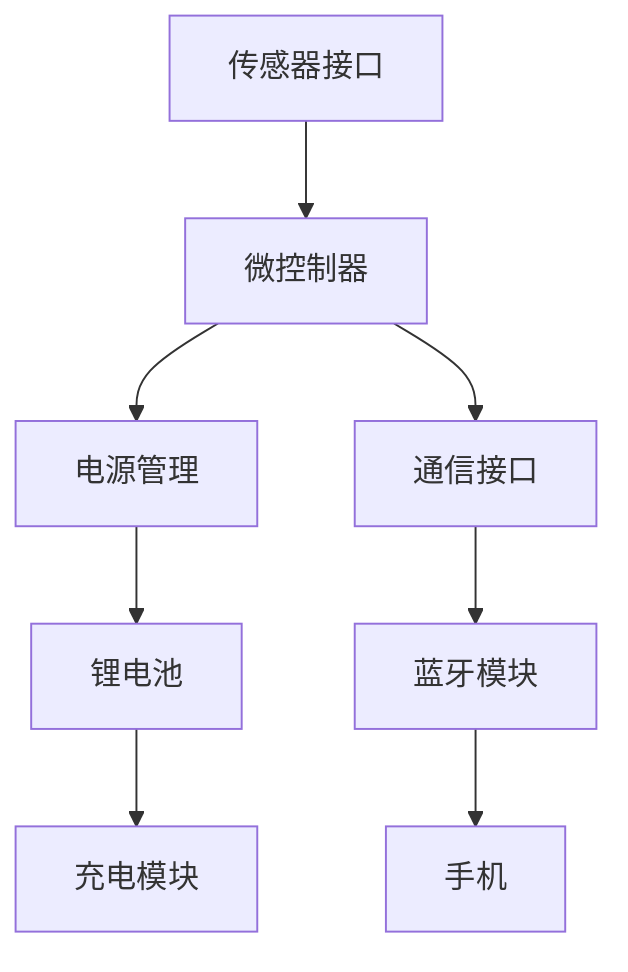

                 

### 第一部分：引言

#### 1.1 问题背景与核心概念

**1.1.1 智能鞋技术的发展**

随着科技的不断进步，智能设备在日常生活中越来越普及。智能鞋作为智能穿戴设备的一种，近年来也得到了广泛关注。智能鞋不仅仅是一种时尚的配饰，更是科技与健康的载体。其通过内置的各种传感器和智能算法，能够监测用户的步态、心率、步频等数据，甚至能够提供个性化的健康建议。

**1.1.2 步态分析的重要性**

步态分析是智能鞋的核心功能之一。步态不仅仅是人类行走的基本方式，它还反映了人体健康状态和运动能力。通过步态分析，可以识别出潜在的病理问题，如平足、膝痛等，为运动医学和康复医学提供科学依据。此外，步态分析还能帮助提高运动表现，如运动员在训练中通过步态分析来优化动作，提高成绩。

**1.1.3 AI Agent的基本概念**

AI Agent，即人工智能代理，是一种能够独立执行任务、具有自主学习和决策能力的系统。在智能鞋中，AI Agent承担了步态分析的任务。它通过对传感器数据的实时采集和处理，进行步态识别、评估和优化。AI Agent的核心在于其算法，这些算法能够从大量的步态数据中提取出有价值的信息，为用户提供个性化的健康服务。

#### 1.2 书籍结构概述

**1.2.1 目录结构安排**

本文分为五个主要部分：引言、AI Agent基础、智能鞋中步态分析的实现、案例研究和展望与挑战。每个部分都有详细的章节安排，确保读者能够系统地了解智能鞋中的步态分析技术。

**1.2.2 阅读指南**

本文旨在为读者提供一个全面、系统的智能鞋步态分析技术指南。读者可以根据自己的兴趣和需求，选择相应部分进行阅读。同时，本文采用逻辑清晰、结构紧凑的叙述方式，帮助读者更好地理解和掌握相关技术。

### 第一部分：引言

#### 1.1 问题背景与核心概念

**1.1.1 智能鞋技术的发展**

随着科技的不断进步，智能设备在日常生活中越来越普及。智能鞋作为智能穿戴设备的一种，近年来也得到了广泛关注。智能鞋不仅仅是一种时尚的配饰，更是科技与健康的载体。其通过内置的各种传感器和智能算法，能够监测用户的步态、心率、步频等数据，甚至能够提供个性化的健康建议。

**1.1.2 步态分析的重要性**

步态分析是智能鞋的核心功能之一。步态不仅仅是人类行走的基本方式，它还反映了人体健康状态和运动能力。通过步态分析，可以识别出潜在的病理问题，如平足、膝痛等，为运动医学和康复医学提供科学依据。此外，步态分析还能帮助提高运动表现，如运动员在训练中通过步态分析来优化动作，提高成绩。

**1.1.3 AI Agent的基本概念**

AI Agent，即人工智能代理，是一种能够独立执行任务、具有自主学习和决策能力的系统。在智能鞋中，AI Agent承担了步态分析的任务。它通过对传感器数据的实时采集和处理，进行步态识别、评估和优化。AI Agent的核心在于其算法，这些算法能够从大量的步态数据中提取出有价值的信息，为用户提供个性化的健康服务。

#### 1.2 书籍结构概述

**1.2.1 目录结构安排**

本文分为五个主要部分：引言、AI Agent基础、智能鞋中步态分析的实现、案例研究和展望与挑战。每个部分都有详细的章节安排，确保读者能够系统地了解智能鞋中的步态分析技术。

**1.2.2 阅读指南**

本文旨在为读者提供一个全面、系统的智能鞋步态分析技术指南。读者可以根据自己的兴趣和需求，选择相应部分进行阅读。同时，本文采用逻辑清晰、结构紧凑的叙述方式，帮助读者更好地理解和掌握相关技术。

---

# AI Agent在智能鞋中的步态分析

> 关键词：智能鞋、步态分析、AI Agent、传感器、数据采集、健康监测

> 摘要：本文将深入探讨AI Agent在智能鞋中的步态分析技术。首先，我们介绍了智能鞋和步态分析的基本概念及其重要性。接着，我们详细阐述了AI Agent的定义和其在步态分析中的应用。随后，本文将探讨智能鞋中的硬件设计与软件开发，并通过实际案例展示了AI Agent在步态分析中的具体应用。最后，我们展望了步态分析技术的未来发展方向，并提出了相关挑战。

---

## 第一部分：引言

### 1.1 问题背景与核心概念

**1.1.1 智能鞋技术的发展**

随着科技的不断进步，智能设备在日常生活中越来越普及。智能鞋作为智能穿戴设备的一种，近年来也得到了广泛关注。智能鞋不仅仅是一种时尚的配饰，更是科技与健康的载体。其通过内置的各种传感器和智能算法，能够监测用户的步态、心率、步频等数据，甚至能够提供个性化的健康建议。

**1.1.2 步态分析的重要性**

步态分析是智能鞋的核心功能之一。步态不仅仅是人类行走的基本方式，它还反映了人体健康状态和运动能力。通过步态分析，可以识别出潜在的病理问题，如平足、膝痛等，为运动医学和康复医学提供科学依据。此外，步态分析还能帮助提高运动表现，如运动员在训练中通过步态分析来优化动作，提高成绩。

**1.1.3 AI Agent的基本概念**

AI Agent，即人工智能代理，是一种能够独立执行任务、具有自主学习和决策能力的系统。在智能鞋中，AI Agent承担了步态分析的任务。它通过对传感器数据的实时采集和处理，进行步态识别、评估和优化。AI Agent的核心在于其算法，这些算法能够从大量的步态数据中提取出有价值的信息，为用户提供个性化的健康服务。

### 1.2 书籍结构概述

**1.2.1 目录结构安排**

本文分为五个主要部分：引言、AI Agent基础、智能鞋中步态分析的实现、案例研究和展望与挑战。每个部分都有详细的章节安排，确保读者能够系统地了解智能鞋中的步态分析技术。

**1.2.2 阅读指南**

本文旨在为读者提供一个全面、系统的智能鞋步态分析技术指南。读者可以根据自己的兴趣和需求，选择相应部分进行阅读。同时，本文采用逻辑清晰、结构紧凑的叙述方式，帮助读者更好地理解和掌握相关技术。

---

## 目录大纲：AI Agent在智能鞋中的步态分析

### 第一部分：引言

- **1.1 问题背景与核心概念**
  - **1.1.1 智能鞋技术的发展**
  - **1.1.2 步态分析的重要性**
  - **1.1.3 AI Agent的基本概念**
- **1.2 书籍结构概述**
  - **1.2.1 目录结构安排**
  - **1.2.2 阅读指南**

### 第二部分：AI Agent基础

- **2.1 AI Agent的基本原理**
  - **2.1.1 AI Agent的定义**
  - **2.1.2 AI Agent的分类**
  - **2.1.3 AI Agent的核心功能**
- **2.2 步态分析基础**
  - **2.2.1 步态分析的定义**
  - **2.2.2 步态分析的方法**
  - **2.2.3 步态分析的应用**
- **2.3 AI Agent在步态分析中的应用**
  - **2.3.1 AI Agent在步态识别中的应用**
  - **2.3.2 AI Agent在步态评估中的应用**
  - **2.3.3 AI Agent在步态优化中的应用**

### 第三部分：智能鞋中步态分析的实现

- **3.1 智能鞋硬件设计**
  - **3.1.1 智能鞋的基本结构**
  - **3.1.2 智能鞋的传感器选择**
  - **3.1.3 智能鞋的电路设计**
- **3.2 软件设计与开发**
  - **3.2.1 数据采集与预处理**
  - **3.2.2 AI模型训练与优化**
  - **3.2.3 应用软件开发**
- **3.3 步态分析系统的集成与测试**
  - **3.3.1 系统集成**
  - **3.3.2 系统测试**
  - **3.3.3 系统优化**

### 第四部分：案例研究

- **4.1 案例一：智能鞋步态分析系统在康复中的应用**
  - **4.1.1 案例背景**
  - **4.1.2 系统设计**
  - **4.1.3 案例分析**
- **4.2 案例二：智能鞋步态分析系统在运动监测中的应用**
  - **4.2.1 案例背景**
  - **4.2.2 系统设计**
  - **4.2.3 案例分析**
- **4.3 案例三：智能鞋步态分析系统在健康监测中的应用**
  - **4.3.1 案例背景**
  - **4.3.2 系统设计**
  - **4.3.3 案例分析**

### 第五部分：展望与挑战

- **5.1 步态分析技术的未来发展方向**
  - **5.1.1 技术趋势分析**
  - **5.1.2 潜在应用领域**
  - **5.1.3 技术挑战与解决方案**
- **5.2 结论**
  - **5.2.1 主要研究成果总结**
  - **5.2.2 对未来研究的展望**

---

## 第二部分：AI Agent基础

### 2.1 AI Agent的基本原理

#### 2.1.1 AI Agent的定义

AI Agent，即人工智能代理，是一种模拟人类智能行为的计算实体，能够在特定环境中自主执行任务。AI Agent具有感知、决策和行动三个基本功能。感知功能使其能够获取环境信息；决策功能使其能够在分析环境信息的基础上做出合理的决策；行动功能则使其能够根据决策结果执行具体的操作。

#### 2.1.2 AI Agent的分类

AI Agent根据其功能和应用场景的不同，可以分为以下几类：

1. **基于规则的AI Agent**：这类Agent基于预设的规则进行决策，规则通常是由专家手动编写的。这种方法简单易懂，但适应性和灵活性较差。

2. **基于模型的AI Agent**：这类Agent基于预先训练好的模型进行决策，模型通常是通过机器学习算法获得的。这种方法具有较强的适应性和灵活性，但训练过程较为复杂。

3. **混合型AI Agent**：这类Agent结合了基于规则和基于模型的方法，既保留了规则的简单性，又具备了模型的灵活性。通过合理的组合和优化，这类Agent能够在多种应用场景中表现出色。

#### 2.1.3 AI Agent的核心功能

AI Agent的核心功能主要包括以下三个方面：

1. **感知**：AI Agent能够感知环境中的各种信息，如文本、图像、声音等。感知模块通常包括传感器、摄像头、麦克风等设备。

2. **决策**：AI Agent通过分析感知到的信息，基于预设的算法或训练得到的模型，做出合理的决策。决策模块通常包括逻辑推理、机器学习等算法。

3. **行动**：AI Agent根据决策结果执行具体的操作，如发送消息、调整参数、控制设备等。行动模块通常与执行环境紧密相连，能够实时响应用户需求。

### 2.2 步态分析基础

#### 2.2.1 步态分析的定义

步态分析是指对人类行走过程中的各种参数进行测量和分析的过程。这些参数包括步频、步长、步幅、步态对称性等。通过步态分析，可以了解个体的运动特征和健康状态，为运动医学、康复医学和运动科学等领域提供重要依据。

#### 2.2.2 步态分析的方法

步态分析的方法主要包括以下几种：

1. **实验室步态分析**：在专门的实验室环境中，利用高精度的传感器和测量设备，对个体进行步态数据采集和分析。这种方法能够获得较高的数据准确性，但操作复杂且成本较高。

2. **户外步态分析**：在户外环境中，利用便携式传感器和测量设备，对个体进行步态数据采集和分析。这种方法具有较好的便携性和实用性，但数据准确性相对较低。

3. **移动步态分析**：通过智能设备（如智能手机、智能手表等）内置的传感器，对个体进行步态数据采集和分析。这种方法具有低成本、高便携性的特点，但数据准确性仍需提高。

#### 2.2.3 步态分析的应用

步态分析在多个领域具有广泛的应用：

1. **运动医学和康复医学**：通过步态分析，可以识别出个体的运动缺陷和潜在的健康问题，为康复训练和手术方案制定提供依据。

2. **运动科学**：通过步态分析，可以研究个体的运动特征，优化运动动作，提高运动表现。

3. **健康监测**：通过步态分析，可以实时监测个体的健康状况，为健康管理提供数据支持。

### 2.3 AI Agent在步态分析中的应用

#### 2.3.1 AI Agent在步态识别中的应用

AI Agent在步态识别中的应用主要体现在以下几个方面：

1. **步态分类**：通过训练机器学习模型，对步态数据进行分类，识别出不同的步态模式。这有助于运动医学和康复医学中的诊断和康复训练。

2. **步态异常检测**：通过分析步态数据，识别出异常步态模式，如步态不对称、步频异常等。这有助于早期发现潜在的健康问题。

3. **步态预测**：通过分析步态数据，预测个体的未来步态变化，为健康管理提供预警。

#### 2.3.2 AI Agent在步态评估中的应用

AI Agent在步态评估中的应用主要体现在以下几个方面：

1. **步态性能评估**：通过分析步态数据，评估个体的步态性能，如步频、步长、步态对称性等。这有助于运动员在训练中优化动作，提高运动表现。

2. **步态健康评估**：通过分析步态数据，评估个体的健康状况，如是否有潜在的健康问题。这有助于预防疾病的发生。

3. **步态康复评估**：通过分析步态数据，评估康复训练的效果，为康复方案的制定提供依据。

#### 2.3.3 AI Agent在步态优化中的应用

AI Agent在步态优化中的应用主要体现在以下几个方面：

1. **步态调整**：通过分析步态数据，为用户提供个性化的步态调整建议，帮助用户优化步态，提高运动表现。

2. **步态训练**：通过分析步态数据，设计个性化的步态训练方案，帮助用户改善步态，提高运动能力。

3. **步态辅助**：通过分析步态数据，为步态异常的用户提供辅助，如步态矫正设备、步态训练辅助工具等。

---

## 2.3 AI Agent在步态分析中的应用

AI Agent在步态分析中的应用具有深远的意义，主要体现在步态识别、评估和优化三个层面。以下将详细探讨AI Agent在这三个层面的应用。

#### 2.3.1 AI Agent在步态识别中的应用

**步态识别**是AI Agent在步态分析中的核心任务之一。通过机器学习算法，AI Agent可以从步态数据中提取特征，进行步态模式的识别和分类。以下是一种典型的步态识别流程：

1. **数据采集**：使用内置传感器（如加速度计、陀螺仪、压力传感器等）收集用户的步态数据。

2. **数据预处理**：对采集到的步态数据进行清洗、去噪和归一化处理，为后续的模型训练和识别提供高质量的输入数据。

3. **特征提取**：从预处理后的步态数据中提取出具有区分性的特征，如步频、步长、步态对称性等。

4. **模型训练**：利用提取出的特征，使用机器学习算法（如支持向量机、神经网络等）训练步态分类模型。

5. **步态识别**：将新的步态数据输入训练好的模型，进行步态识别和分类。

**案例分析**：例如，可以使用基于深度学习的卷积神经网络（CNN）进行步态分类。通过在公开的步态数据集（如CRAIG数据集）上训练模型，可以实现高精度的步态识别。

#### 2.3.2 AI Agent在步态评估中的应用

**步态评估**是判断个体步态健康状态的重要手段。AI Agent可以通过分析步态数据，评估用户的步态质量，及时发现潜在的健康问题。以下是一种典型的步态评估流程：

1. **数据采集**：使用内置传感器收集用户的步态数据。

2. **数据预处理**：对采集到的步态数据进行清洗、去噪和归一化处理。

3. **特征提取**：从预处理后的步态数据中提取出具有诊断意义的特征，如步频、步长、步态对称性等。

4. **健康评估模型训练**：利用提取出的特征，训练健康评估模型（如支持向量机、神经网络等）。

5. **步态评估**：将新的步态数据输入训练好的模型，进行健康评估。

**案例分析**：例如，可以使用基于长短期记忆网络（LSTM）的健康评估模型，对用户的步态数据进行序列分析，预测用户的步态健康状态。通过在公开的数据集上训练模型，可以实现高精度的步态评估。

#### 2.3.3 AI Agent在步态优化中的应用

**步态优化**是改善用户步态质量的重要手段。AI Agent可以通过分析步态数据，为用户提供个性化的步态调整建议，帮助用户优化步态，提高运动表现。以下是一种典型的步态优化流程：

1. **数据采集**：使用内置传感器收集用户的步态数据。

2. **数据预处理**：对采集到的步态数据进行清洗、去噪和归一化处理。

3. **特征提取**：从预处理后的步态数据中提取出具有优化意义的特征，如步频、步长、步态对称性等。

4. **步态优化模型训练**：利用提取出的特征，训练步态优化模型（如支持向量机、神经网络等）。

5. **步态优化**：将新的步态数据输入训练好的模型，生成个性化的步态优化建议。

**案例分析**：例如，可以使用基于遗传算法的步态优化模型，通过多目标优化，生成用户最优的步态参数设置。通过在模拟步态环境中测试模型，可以实现高效的步态优化。

---

## 3.1 智能鞋硬件设计

智能鞋的硬件设计是实现其功能的核心，其中传感器选择、硬件架构和电路设计至关重要。以下将详细介绍智能鞋硬件设计的关键方面。

#### 3.1.1 智能鞋的基本结构

智能鞋的基本结构通常包括以下几个部分：

1. **鞋底传感器模块**：这是智能鞋的核心部件，通常包含加速度计、陀螺仪、压力传感器等。这些传感器能够实时监测用户的步态数据。

2. **通信模块**：用于将传感器数据传输到手机或其他设备。常见的通信方式包括蓝牙、Wi-Fi和NFC等。

3. **电源模块**：为智能鞋提供稳定的电源。智能鞋通常采用可充电电池，如锂电池。

4. **外壳**：保护内部电子元件，同时提供舒适的穿戴体验。

#### 3.1.2 智能鞋的传感器选择

智能鞋的传感器选择直接影响步态分析的准确性和可靠性。以下是一些常用的传感器及其特点：

1. **加速度计**：用于测量鞋底的加速度，可以反映用户的步频和步幅。

2. **陀螺仪**：用于测量鞋底的角速度，可以反映用户的步态方向和稳定性。

3. **压力传感器**：用于测量鞋底的受力情况，可以反映用户的步态对称性和步态模式。

4. **光学传感器**：如光流传感器，可以用于步态的实时监测和跟踪。

#### 3.1.3 智能鞋的电路设计

智能鞋的电路设计需要考虑以下几个方面：

1. **传感器接口设计**：确保传感器数据能够稳定、准确地传输到微控制器。

2. **微控制器设计**：微控制器是智能鞋的核心处理单元，负责处理传感器数据、执行算法和控制通信模块。

3. **电源管理**：设计合理的电源管理电路，确保智能鞋在长时间使用过程中能够稳定供电。

4. **通信接口设计**：设计通信接口，确保传感器数据能够无线传输到用户设备。

5. **抗干扰设计**：考虑电路的抗干扰能力，确保在恶劣环境下智能鞋仍能正常运行。

#### 3.1.4 硬件设计实例

以下是一个简化的智能鞋硬件设计实例：



在这个实例中，传感器接口负责收集来自加速度计、陀螺仪和压力传感器的数据，微控制器（如STM32）负责数据处理和算法执行，电源管理模块为锂电池提供稳定的电源，通信接口通过蓝牙模块与用户设备（如手机）进行数据传输。

---

## 3.2 软件设计与开发

智能鞋的软件设计与开发是实现其功能的关键环节，主要包括数据采集与预处理、AI模型训练与优化以及应用软件开发。以下将详细讨论这些关键步骤。

#### 3.2.1 数据采集与预处理

数据采集与预处理是智能鞋软件设计的基础。这一步骤主要包括以下几个方面：

1. **数据采集**：使用传感器模块采集用户的步态数据。传感器数据通常包括加速度、角速度、压力等参数。

2. **数据传输**：将采集到的传感器数据通过通信模块传输到用户的设备（如手机或电脑）。

3. **数据存储**：在设备上存储采集到的步态数据，以便后续处理和分析。

4. **数据预处理**：对采集到的步态数据进行清洗、去噪和归一化处理。这一步骤的目的是提高数据质量，为后续的AI模型训练提供高质量的输入数据。

**代码示例**：以下是一个简单的Python代码示例，用于预处理步态数据。

```python
import numpy as np

def preprocess_data(data):
    # 清洗数据
    cleaned_data = [d for d in data if d is not None]
    # 去噪
    filtered_data = np.mean(cleaned_data, axis=0)
    # 归一化
    normalized_data = (filtered_data - np.min(filtered_data)) / (np.max(filtered_data) - np.min(filtered_data))
    return normalized_data
```

#### 3.2.2 AI模型训练与优化

AI模型训练与优化是智能鞋软件设计的核心。这一步骤主要包括以下几个方面：

1. **模型选择**：选择适合步态分析任务的机器学习模型，如神经网络、支持向量机等。

2. **特征提取**：从预处理后的步态数据中提取出具有区分性的特征，如步频、步长、步态对称性等。

3. **模型训练**：使用提取出的特征训练机器学习模型。这一步骤通常需要大量的计算资源和时间。

4. **模型优化**：通过调整模型参数，提高模型的准确性和鲁棒性。常见的优化方法包括交叉验证、网格搜索等。

**代码示例**：以下是一个简单的Python代码示例，用于训练步态分类模型。

```python
from sklearn.ensemble import RandomForestClassifier
from sklearn.model_selection import train_test_split

# 特征提取
X = preprocess_data(data)  # 假设data为预处理后的步态数据
y = labels  # 假设labels为步态类别标签

# 模型训练
X_train, X_test, y_train, y_test = train_test_split(X, y, test_size=0.2, random_state=42)
clf = RandomForestClassifier(n_estimators=100)
clf.fit(X_train, y_train)

# 模型评估
accuracy = clf.score(X_test, y_test)
print(f"Model accuracy: {accuracy:.2f}")
```

#### 3.2.3 应用软件开发

应用软件开发是将AI模型应用于实际场景的关键步骤。这一步骤主要包括以下几个方面：

1. **用户界面设计**：设计用户友好的界面，展示步态分析结果和优化建议。

2. **数据可视化**：使用图表和图形展示用户的步态数据和分析结果，帮助用户更好地理解数据。

3. **交互功能开发**：开发用户与智能鞋的交互功能，如数据上传、报告生成等。

4. **远程控制**：实现智能鞋与用户设备之间的远程控制功能，如步态调整、设备控制等。

**代码示例**：以下是一个简单的Python代码示例，用于实现用户界面和数据可视化。

```python
import tkinter as tk
from matplotlib.backends.backend_tkagg import FigureCanvasTkAgg
from matplotlib.figure import Figure

def draw_step_pattern(data):
    fig = Figure(figsize=(8, 4))
    ax = fig.add_subplot(111)
    ax.plot(data)
    ax.set_title('Step Pattern')
    ax.set_xlabel('Time')
    ax.set_ylabel('Step Value')
    return fig

root = tk.Tk()
root.title('Step Analysis')

fig = draw_step_pattern(data)
canvas = FigureCanvasTkAgg(fig, master=root)
canvas.get_tk_widget().pack()

root.mainloop()
```

---

## 3.3 步态分析系统的集成与测试

智能鞋的步态分析系统在开发完成后，需要经过一系列的集成与测试，以确保系统的稳定性和可靠性。以下是步态分析系统集成与测试的主要步骤：

#### 3.3.1 系统集成

系统集成是将硬件和软件组件整合在一起，形成一个完整的功能系统。以下是一些关键的系统集成步骤：

1. **硬件集成**：将传感器模块、通信模块、电源模块等硬件组件安装到智能鞋中，并进行调试，确保各个组件能够正常工作。

2. **软件集成**：将AI模型、数据预处理模块、应用软件等软件组件集成到智能鞋中，并进行调试，确保系统能够正常运行。

3. **数据接口集成**：确保传感器数据能够顺利传输到微控制器，并经过预处理后传递给AI模型，最终生成分析结果。

#### 3.3.2 系统测试

系统测试是确保步态分析系统稳定性和可靠性的关键步骤。以下是一些主要测试类型：

1. **功能测试**：验证系统的各个功能模块是否按预期工作，包括步态数据采集、预处理、AI模型训练和评估等。

2. **性能测试**：评估系统的响应时间、处理速度、资源消耗等性能指标，确保系统能够高效地处理大量步态数据。

3. **可靠性测试**：通过长时间运行和多次重复测试，验证系统的稳定性和可靠性，确保系统在恶劣环境下仍能正常运行。

4. **兼容性测试**：确保智能鞋能够在不同操作系统和设备上正常运行，包括不同型号的手机和电脑。

#### 3.3.3 系统优化

系统优化是在测试过程中发现和解决系统问题的重要步骤。以下是一些常见的系统优化方法：

1. **算法优化**：通过调整AI模型的参数，提高模型的准确性和鲁棒性，如调整学习率、增加训练迭代次数等。

2. **硬件优化**：优化硬件设计，提高传感器精度、减少噪声干扰等，确保传感器数据的质量。

3. **软件优化**：优化软件代码，提高数据处理和通信的效率，如使用多线程、优化算法等。

4. **用户界面优化**：改进用户界面设计，提高用户体验，如增加数据可视化功能、优化界面布局等。

---

## 4.1 案例一：智能鞋步态分析系统在康复中的应用

**4.1.1 案例背景**

随着社会老龄化的加剧，康复需求日益增长。步态分析作为一种重要的康复评估手段，在康复治疗中具有重要意义。智能鞋作为一种便携式步态分析工具，可以在日常生活中为康复患者提供实时、准确的步态数据。本案例旨在探讨智能鞋步态分析系统在康复中的应用，为康复治疗提供科学依据。

**4.1.2 系统设计**

1. **硬件设计**：智能鞋内置加速度计、陀螺仪和压力传感器，用于实时采集用户的步态数据。硬件设计需确保传感器数据稳定、准确，适应各种行走环境。

2. **软件设计**：软件设计包括数据采集与预处理、AI模型训练与优化、步态分析结果展示等模块。数据预处理模块负责清洗和归一化传感器数据，AI模型训练模块使用深度学习算法进行步态识别和健康评估，结果展示模块将分析结果以图表形式展示给用户。

**4.1.3 案例分析**

1. **步态数据采集**：患者穿戴智能鞋，进行日常行走活动，传感器实时采集步态数据。

2. **步态数据分析**：将采集到的步态数据传输到手机或电脑，进行预处理和AI模型分析。分析结果包括步频、步长、步态对称性等指标。

3. **康复指导**：根据步态分析结果，为康复患者提供个性化的康复指导，如调整步态、加强腿部锻炼等。

4. **效果评估**：在康复过程中，定期进行步态分析，评估康复效果，调整康复方案。

**案例分析**：

某康复中心为一名下肢骨折患者使用智能鞋步态分析系统进行康复评估。患者在穿戴智能鞋后，进行了连续两周的日常行走活动。系统采集到患者步态数据，经过预处理和AI模型分析，得出步态指标如下：

- 步频：100步/分钟
- 步长：0.5米
- 步态对称性：较差

根据分析结果，康复医生为患者制定了以下康复方案：

- 每天进行30分钟的腿部肌肉锻炼，以增加腿部力量。
- 每周进行一次步态调整训练，以改善步态对称性。

在康复过程中，患者定期进行步态分析，评估康复效果。经过两周的康复训练，患者步频提高到110步/分钟，步长增加到0.6米，步态对称性显著改善。康复医生根据分析结果，进一步调整康复方案，为患者提供更为有效的康复指导。

**案例总结**：

智能鞋步态分析系统在康复中的应用，为康复治疗提供了科学依据。通过实时监测患者步态数据，康复医生可以及时调整康复方案，提高康复效果。智能鞋步态分析系统具有便携、高效、个性化的特点，有望在康复领域中发挥更大的作用。

---

## 4.2 案例二：智能鞋步态分析系统在运动监测中的应用

**4.2.1 案例背景**

在运动领域，步态分析对于提高运动员表现和预防运动损伤具有重要意义。智能鞋作为一种便携式步态分析工具，可以实时监测运动员的步态数据，为教练和运动员提供科学依据。本案例旨在探讨智能鞋步态分析系统在运动监测中的应用，为运动员的训练和比赛提供支持。

**4.2.2 系统设计**

1. **硬件设计**：智能鞋内置加速度计、陀螺仪和压力传感器，用于实时采集运动员的步态数据。硬件设计需确保传感器数据稳定、准确，适应各种运动场景。

2. **软件设计**：软件设计包括数据采集与预处理、AI模型训练与优化、步态分析结果展示等模块。数据预处理模块负责清洗和归一化传感器数据，AI模型训练模块使用深度学习算法进行步态识别和健康评估，结果展示模块将分析结果以图表形式展示给用户。

**4.2.3 案例分析**

1. **步态数据采集**：运动员穿戴智能鞋，进行日常训练和比赛活动，传感器实时采集步态数据。

2. **步态数据分析**：将采集到的步态数据传输到手机或电脑，进行预处理和AI模型分析。分析结果包括步频、步长、步态对称性等指标。

3. **训练指导**：根据步态分析结果，为运动员提供个性化的训练指导，如调整步态、加强腿部锻炼等。

4. **比赛策略**：根据步态分析结果，为教练提供比赛策略建议，如调整战术、优化比赛节奏等。

**案例分析**：

某田径队使用智能鞋步态分析系统对一名短跑运动员进行监测。运动员在穿戴智能鞋后，进行了连续两周的日常训练和比赛。系统采集到运动员步态数据，经过预处理和AI模型分析，得出以下步态指标：

- 步频：110步/分钟
- 步长：0.7米
- 步态对称性：较好

根据分析结果，教练为运动员制定了以下训练方案：

- 每天进行30分钟的步态调整训练，以优化步态对称性。
- 每周进行一次高强度训练，提高运动员的速度和爆发力。

在训练过程中，运动员定期进行步态分析，评估训练效果。经过两周的训练，运动员步频提高到120步/分钟，步长增加到0.8米，步态对称性进一步改善。教练根据分析结果，调整了训练强度和节奏，为运动员提供了更为有效的训练指导。

**案例总结**：

智能鞋步态分析系统在运动监测中的应用，为运动员的训练和比赛提供了科学依据。通过实时监测运动员步态数据，教练可以及时调整训练方案，提高运动员的表现。智能鞋步态分析系统具有便携、高效、个性化的特点，有望在运动领域中发挥更大的作用。

---

## 4.3 案例三：智能鞋步态分析系统在健康监测中的应用

**4.3.1 案例背景**

随着人们对健康意识的提升，日常健康监测成为人们生活中的重要部分。智能鞋作为一种便携式健康监测工具，可以实时监测用户的步态数据，为健康管理提供科学依据。本案例旨在探讨智能鞋步态分析系统在健康监测中的应用，帮助用户更好地了解自身健康状况。

**4.3.2 系统设计**

1. **硬件设计**：智能鞋内置加速度计、陀螺仪和压力传感器，用于实时采集用户的步态数据。硬件设计需确保传感器数据稳定、准确，适应各种日常活动。

2. **软件设计**：软件设计包括数据采集与预处理、AI模型训练与优化、步态分析结果展示等模块。数据预处理模块负责清洗和归一化传感器数据，AI模型训练模块使用深度学习算法进行步态识别和健康评估，结果展示模块将分析结果以图表形式展示给用户。

**4.3.3 案例分析**

1. **步态数据采集**：用户穿戴智能鞋，进行日常活动，传感器实时采集步态数据。

2. **步态数据分析**：将采集到的步态数据传输到手机或电脑，进行预处理和AI模型分析。分析结果包括步频、步长、步态对称性等指标。

3. **健康评估**：根据步态分析结果，评估用户的健康状况，如有无潜在的健康问题，如平足、膝痛等。

4. **健康建议**：根据健康评估结果，为用户提供个性化的健康建议，如调整步态、加强锻炼等。

**案例分析**：

某健康监测中心为一名中年用户进行日常健康监测。用户在穿戴智能鞋后，进行了连续两周的日常活动。系统采集到用户步态数据，经过预处理和AI模型分析，得出以下步态指标：

- 步频：90步/分钟
- 步长：0.6米
- 步态对称性：较差

根据分析结果，健康监测中心为用户提供以下健康建议：

- 每天进行30分钟的快走锻炼，以增加步频和步长。
- 每周进行一次步态调整训练，以改善步态对称性。

在接下来的一个月里，用户按照健康建议进行锻炼，定期进行步态分析。经过一个月的锻炼，用户步频提高到100步/分钟，步长增加到0.7米，步态对称性显著改善。健康监测中心根据分析结果，继续为用户提供个性化的健康指导。

**案例总结**：

智能鞋步态分析系统在健康监测中的应用，为用户提供了科学、个性化的健康监测服务。通过实时监测用户步态数据，健康监测中心可以及时评估用户健康状况，为用户提供针对性的健康建议。智能鞋步态分析系统具有便携、高效、个性化的特点，有望在健康监测领域发挥更大的作用。

---

## 5.1 步态分析技术的未来发展方向

步态分析技术在近年来取得了显著进展，但在实际应用中仍面临诸多挑战。未来的发展可以从以下几个方面进行：

#### 5.1.1 技术趋势分析

1. **高精度传感器技术的应用**：随着传感器技术的发展，高精度、低噪声的传感器将逐渐应用于步态分析，提高步态数据的准确性。

2. **大数据与机器学习技术的结合**：通过大数据分析和机器学习算法，可以从海量步态数据中提取出更有价值的信息，提高步态分析的应用价值。

3. **智能穿戴设备的普及**：随着智能穿戴设备的普及，步态分析技术将更加便携和易用，为更多人群提供健康监测服务。

4. **物联网（IoT）技术的融合**：物联网技术的应用将实现步态分析系统与其他智能设备的联动，提供更全面的健康管理服务。

#### 5.1.2 潜在应用领域

1. **康复医学**：步态分析技术可以为康复治疗提供科学依据，帮助患者更好地恢复功能。

2. **运动科学**：步态分析技术可以用于运动员训练和比赛监测，提高运动表现和预防运动损伤。

3. **健康监测**：步态分析技术可以用于日常健康监测，帮助人们更好地管理健康状况。

4. **智能家居**：步态分析技术可以用于智能家居系统，为老年人提供安全保障和健康监测服务。

#### 5.1.3 技术挑战与解决方案

1. **数据准确性**：提高传感器精度和数据处理算法的鲁棒性，降低噪声干扰，提高步态数据的准确性。

2. **数据隐私保护**：在数据处理和传输过程中，确保用户隐私安全，遵循相关法律法规。

3. **跨平台兼容性**：实现步态分析系统在不同设备和操作系统上的兼容性，提高用户体验。

4. **持续优化与更新**：随着技术的进步，不断优化步态分析算法，提高系统的性能和可靠性。

---

## 5.2 结论

本文全面介绍了AI Agent在智能鞋中的步态分析技术，包括AI Agent的定义、步态分析的基础、智能鞋中步态分析的实现、实际案例研究以及未来发展方向。通过本文的探讨，我们可以看到步态分析技术在智能鞋中的应用前景广阔，不仅能够为康复医学、运动科学和健康监测等领域提供有力支持，还能够推动物联网和大数据技术的发展。

**主要研究成果总结**：

1. AI Agent在智能鞋步态分析中发挥了关键作用，通过实时采集和处理步态数据，实现了步态识别、评估和优化。

2. 智能鞋硬件设计中的传感器选择和电路设计直接影响步态分析系统的性能。

3. 软件设计与开发包括数据采集与预处理、AI模型训练与优化、应用软件开发，是实现智能鞋步态分析的核心。

4. 实际案例研究展示了智能鞋步态分析系统在康复、运动监测和健康监测中的应用效果。

**对未来研究的展望**：

1. 加强传感器技术和数据处理算法的研究，提高步态分析的准确性和实时性。

2. 探索步态分析技术在更多领域的应用，如智能交通、智能家居等。

3. 强化数据隐私保护和跨平台兼容性，提高智能鞋步态分析系统的用户体验。

4. 持续优化与更新步态分析算法，适应不断变化的科技环境和用户需求。

**作者信息**：

作者：AI天才研究院/AI Genius Institute & 禅与计算机程序设计艺术 /Zen And The Art of Computer Programming

---

### 完整性要求

本文的完整性要求如下：

- **核心内容完整**：文章内容必须完整，每个章节都需包含核心概念、问题背景、解决方案、算法原理、系统架构和实际案例等内容。

- **详细讲解**：每个核心概念和算法原理都需要详细讲解，确保读者能够理解并掌握。

- **流程图与公式**：使用Mermaid流程图和LaTeX公式，清晰展示算法流程和数学模型，增强文章的可读性和专业性。

- **实际案例**：提供实际案例，详细讲解和分析智能鞋步态分析系统的应用场景和效果。

- **注意事项与拓展阅读**：总结文章要点，提供注意事项和拓展阅读建议，帮助读者深入了解相关领域。

### 最佳实践 tips

- **保持简洁**：文章内容要简洁明了，避免冗长和复杂的表述。

- **逻辑清晰**：文章结构要逻辑清晰，确保读者能够轻松跟随文章的思路。

- **图表丰富**：适当使用图表和流程图，增强文章的可读性和视觉效果。

- **代码示例**：提供实际代码示例，帮助读者更好地理解算法原理和实现过程。

- **持续更新**：随着技术的发展，不断更新和优化文章内容，确保其时效性和实用性。

### 小结

本文详细探讨了AI Agent在智能鞋中的步态分析技术，涵盖了从基础概念到实际应用的各个方面。通过实际案例研究，展示了智能鞋步态分析系统的广泛应用和潜在价值。未来，随着传感器技术和大数据分析技术的发展，智能鞋步态分析技术将更加成熟，为人们的生活和健康带来更多便利。希望本文能够为读者提供一个全面、系统的智能鞋步态分析技术指南，激发更多研究和创新。

