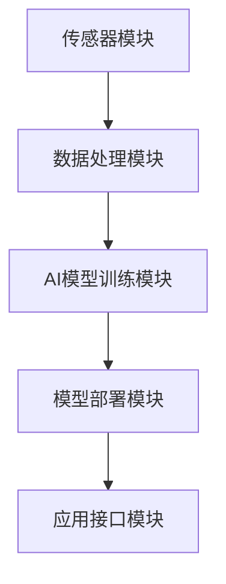
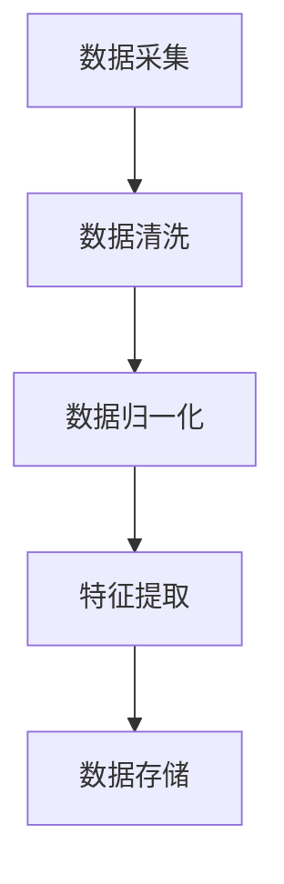
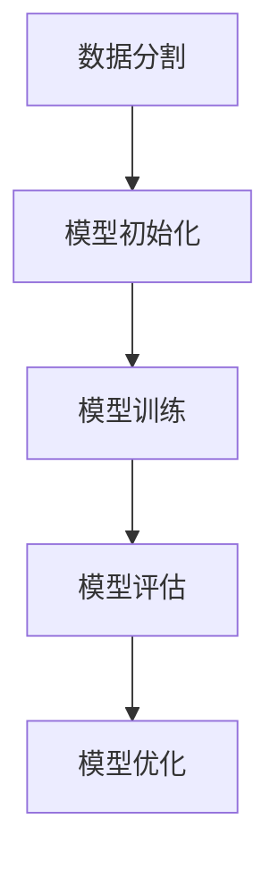
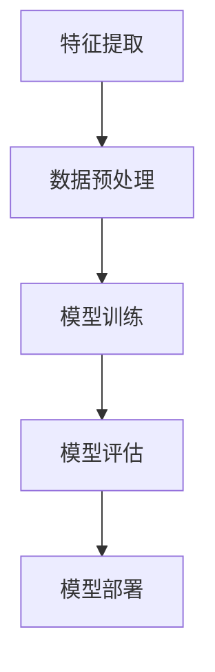

                 

## 4. AI Agent的架构设计与实现

### 4.1 AI Agent的架构设计

#### 4.1.1 系统总体架构设计

**介绍**：
在智能鞋垫中，AI Agent扮演着关键角色，它能够实时分析用户的运动强度，提供个性化的健身建议。为了实现这一功能，我们需要设计一个全面且高效的系统架构。该系统架构包括数据采集、数据预处理、AI Agent的训练、模型部署和交互等环节。

**系统组件**：
系统主要由以下几个关键组件构成：
1. **传感器模块**：负责实时收集用户的运动数据，如步数、步态、心率等。
2. **数据处理模块**：对采集到的数据进行清洗、归一化和特征提取。
3. **AI模型训练模块**：利用处理后的数据进行AI模型训练。
4. **模型部署模块**：将训练好的模型部署到智能鞋垫中。
5. **应用接口模块**：提供用户与智能鞋垫的交互接口。

**架构图**：
以下是系统的架构图示例：

### 4.2 AI Agent的关键模块

#### 4.2.1 数据采集与预处理

**数据采集**：
智能鞋垫内置多个传感器，包括加速度传感器、陀螺仪和心率传感器等，这些传感器能够实时监测用户的运动状态。例如，加速度传感器可以测量步数和步态，陀螺仪可以捕捉运动方向的变化，而心率传感器则能够监测心率。

**数据预处理**：
数据预处理是AI模型训练前的关键步骤。预处理步骤包括：
1. **数据清洗**：去除噪声数据和异常值，确保数据的准确性。
2. **数据归一化**：将不同量纲的数据统一归一化，使其适合模型训练。
3. **特征提取**：从原始数据中提取有用的特征，如步频、步幅、运动方向等。特征提取有助于模型更好地理解数据。

**数据处理流程图**：
以下是数据处理流程的架构图：

#### 4.2.2 AI模型训练

**模型选择**：
在运动强度分析中，常用的AI模型包括深度学习模型和传统机器学习模型。深度学习模型，如卷积神经网络（CNN）和循环神经网络（RNN），能够处理复杂的特征提取任务。传统机器学习模型，如支持向量机（SVM）和随机森林（Random Forest），在特征提取上更为直观。

**模型训练流程**：
AI模型训练流程主要包括以下几个步骤：
1. **数据分割**：将数据集分割为训练集和测试集。
2. **模型初始化**：初始化模型的参数。
3. **模型训练**：使用训练集数据训练模型。
4. **模型评估**：使用测试集评估模型性能。
5. **模型优化**：根据评估结果调整模型参数，以提高性能。

**模型训练流程图**：
以下是模型训练流程的架构图：

### 4.3 AI Agent的算法原理

**算法原理**：
AI Agent的算法原理主要包括以下几个关键步骤：
1. **特征提取**：从原始数据中提取有用的特征。
2. **数据预处理**：对特征进行归一化和标准化处理。
3. **模型训练**：使用处理后的特征数据训练AI模型。
4. **模型评估**：使用测试集评估模型的性能。
5. **模型部署**：将训练好的模型部署到智能鞋垫中。

**数学模型**：
以下是运动强度分析的主要数学模型：

$$
\text{运动强度} = f(\text{步数}, \text{步态}, \text{心率})
$$

其中，$f$是一个复杂的非线性函数，它通过学习步数、步态和心率等特征，来预测用户的运动强度。

**算法流程图**：
以下是算法流程的架构图：

通过上述架构设计和算法原理的介绍，我们可以看到AI Agent在智能鞋垫中是如何实现运动强度分析的。接下来，我们将进一步探讨AI Agent的架构设计与实现细节。

