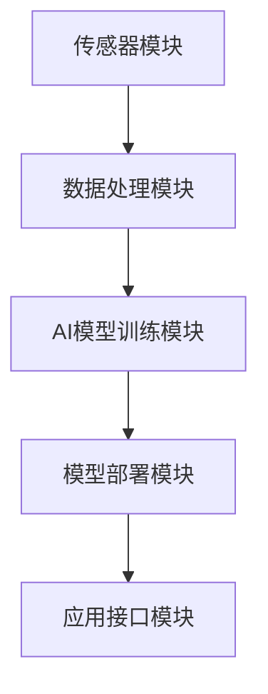
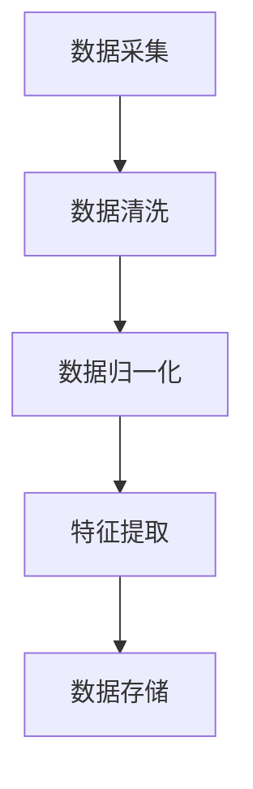
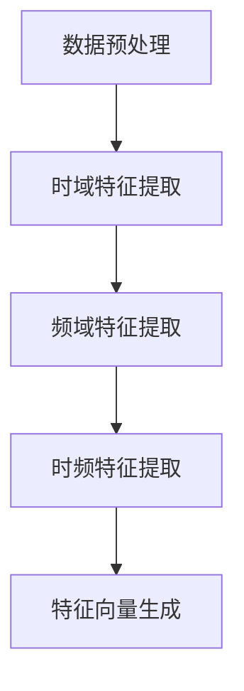
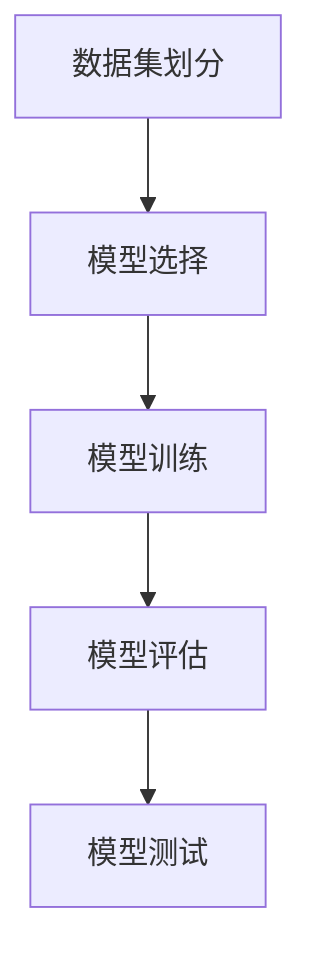
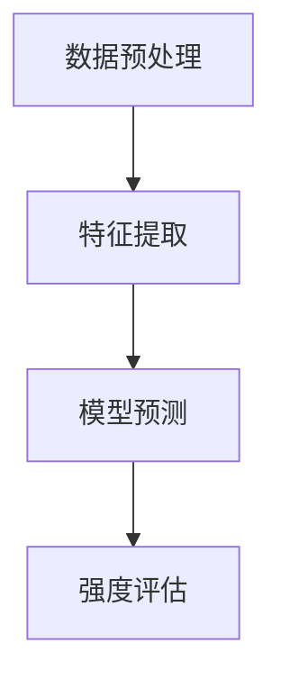
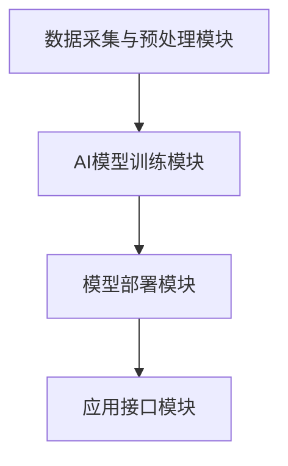
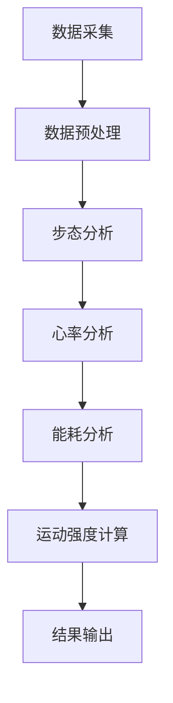
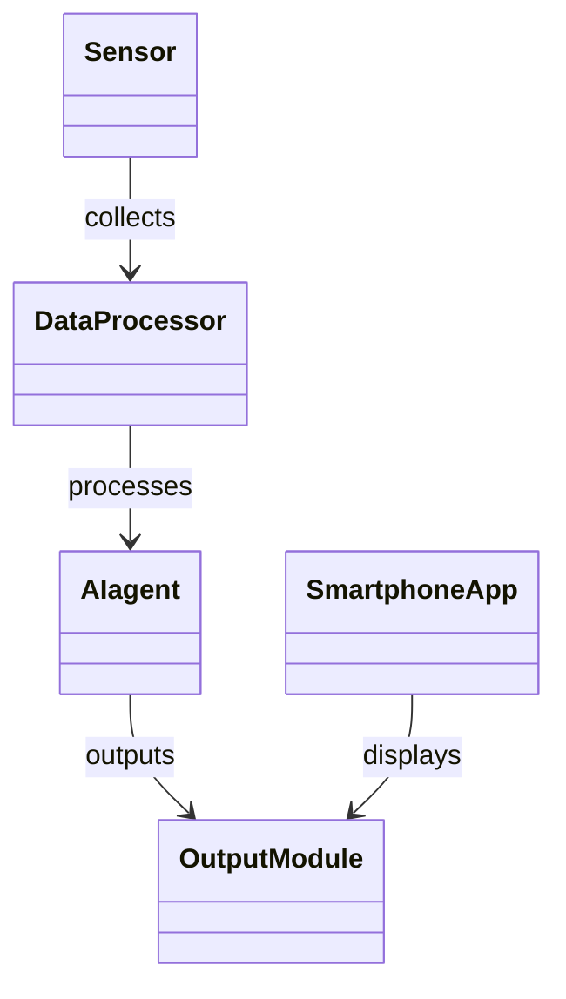
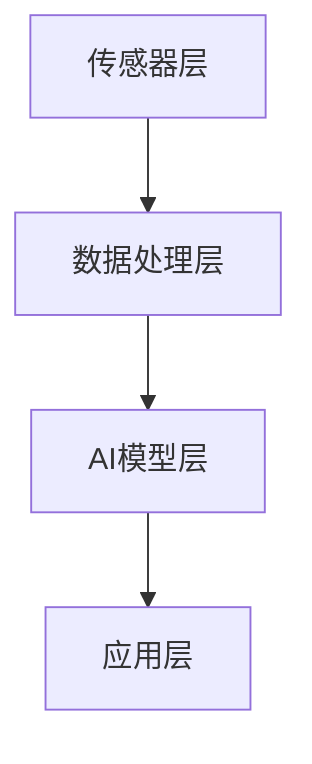
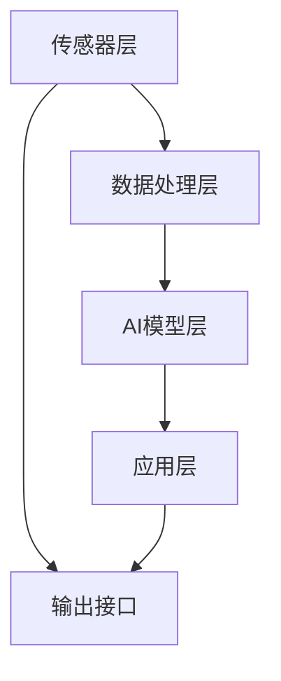

                 

### 4. AI Agent的架构设计与实现

在讨论AI Agent的架构设计与实现时，我们需要首先明确什么是AI Agent，它在智能鞋垫中的角色，以及其与传统AI的区别。接下来，我们将逐步深入探讨AI Agent的架构设计、关键模块及其实现。

#### 4.1 AI Agent的架构设计

##### 4.1.1 系统总体架构设计

AI Agent作为一个智能实体，其核心目标是模拟人类智能，能够感知环境、理解语义、做出决策和执行任务。在智能鞋垫的应用中，AI Agent需要处理来自鞋垫传感器的多种数据，如步数、步态、心率等，并通过分析和理解这些数据来提供个性化的运动建议。

**系统组件：**

- **传感器模块**：用于收集步数、步态、心率等运动数据。
- **数据处理模块**：对采集到的原始数据进行预处理，包括数据清洗、归一化和特征提取等。
- **AI模型训练模块**：使用处理后的数据训练AI Agent，使其能够识别不同的运动模式和强度。
- **模型部署模块**：将训练好的模型部署到智能鞋垫中，实现实时运动强度分析。
- **应用接口模块**：提供与外部应用系统的接口，如手机APP、健身平台等，以便用户查看和分析运动数据。

**架构图：**



##### 4.1.2 数据采集与预处理

**数据采集：** 智能鞋垫内置多种传感器，如加速度计、陀螺仪和心率传感器等，这些传感器可以实时监测用户的运动状态。

**数据预处理：** 数据采集后，首先进行数据清洗，去除噪声和异常值。然后进行归一化处理，使数据具有相似的尺度，便于后续分析。最后，提取特征数据，如步频、步幅和心率变异性等。

**数据处理流程图：**



### 4.2 AI Agent的关键模块

#### 4.2.1 特征提取与选择

特征提取是AI Agent的关键步骤，它决定了模型能否准确识别运动强度。常用的特征提取方法包括：

- **时域特征**：如步长、步频、步态等。
- **频域特征**：如功率谱密度、频率成分等。
- **时频特征**：如短时傅里叶变换（STFT）和小波变换等。

**特征选择方法：** 使用信息增益、特征重要性和交叉验证等方法来选择最有用的特征。

**特征对比表格：**

| 特征类型 | 描述 | 优点 | 缺点 |
| --- | --- | --- | --- |
| 时域特征 | 基于时间序列的特征 | 直观、易于理解 | 可能受到噪声干扰 |
| 频域特征 | 基于频率成分的特征 | 能更好地分析周期性变化 | 可能会丢失时间信息 |
| 时频特征 | 结合时域和频域信息 | 同时保留时间和频率信息 | 计算复杂度高 |

#### 4.2.2 AI模型训练

AI模型训练是AI Agent的核心，它决定了AI Agent能否准确分析运动强度。适用于运动强度分析的不同AI模型包括：

- **深度学习模型**：如卷积神经网络（CNN）、循环神经网络（RNN）和长短时记忆网络（LSTM）等。
- **传统机器学习模型**：如支持向量机（SVM）、随机森林（RF）和逻辑回归等。

**模型训练流程：**

1. **数据集划分**：将数据集划分为训练集、验证集和测试集。
2. **模型选择**：根据数据集特点和问题需求选择合适的模型。
3. **模型训练**：使用训练集对模型进行训练。
4. **模型评估**：使用验证集评估模型性能，并根据评估结果调整模型参数。
5. **模型测试**：使用测试集对最终模型进行性能测试。

### 4.3 AI Agent的算法原理

AI Agent的算法原理主要涉及特征提取、模型训练和运动强度分析。以下是详细的算法原理讲解：

#### 4.3.1 特征提取

特征提取是将原始运动数据转换为能够表示运动特征的向量。以下是一个简单的特征提取算法流程：

1. **数据预处理**：对原始数据进行归一化处理。
2. **时域特征提取**：计算步频、步幅、步态等时域特征。
3. **频域特征提取**：计算功率谱密度、频率成分等频域特征。
4. **时频特征提取**：使用STFT或小波变换提取时频特征。

**算法流程图：**



#### 4.3.2 模型训练

模型训练是AI Agent的核心步骤，它决定了AI Agent能否准确识别运动强度。以下是一个简单的模型训练算法流程：

1. **数据集划分**：将数据集划分为训练集、验证集和测试集。
2. **模型选择**：选择合适的模型，如CNN、RNN或LSTM等。
3. **模型训练**：使用训练集对模型进行训练。
4. **模型评估**：使用验证集评估模型性能，并根据评估结果调整模型参数。
5. **模型测试**：使用测试集对最终模型进行性能测试。

**算法流程图：**



#### 4.3.3 运动强度分析

运动强度分析是AI Agent的核心功能，它利用训练好的模型对实时运动数据进行强度评估。以下是一个简单的运动强度分析算法流程：

1. **数据预处理**：对实时运动数据进行归一化处理。
2. **特征提取**：提取实时运动数据的特征向量。
3. **模型预测**：使用训练好的模型对特征向量进行预测。
4. **强度评估**：根据模型预测结果评估当前运动强度。

**算法流程图：**



### 4.4 AI Agent的架构设计与实现

在实现AI Agent时，我们需要考虑系统的可扩展性、可靠性和易用性。以下是AI Agent的架构设计与实现：

#### 4.4.1 架构设计

AI Agent的架构设计包括以下部分：

- **数据采集与预处理模块**：负责数据的采集和预处理，确保数据的质量和一致性。
- **AI模型训练模块**：负责AI模型的训练和优化，提高模型对运动强度的识别能力。
- **模型部署模块**：负责将训练好的模型部署到智能鞋垫中，实现实时运动强度分析。
- **应用接口模块**：提供与外部应用系统的接口，如手机APP、健身平台等。

**架构图：**



#### 4.4.2 实现细节

在实现AI Agent时，我们需要关注以下细节：

- **数据采集与预处理**：使用传感器采集运动数据，并进行数据预处理，如数据清洗、归一化和特征提取等。
- **AI模型训练**：选择合适的AI模型，如CNN或LSTM等，并使用处理后的数据进行模型训练和优化。
- **模型部署**：将训练好的模型部署到智能鞋垫中，实现实时运动强度分析。
- **应用接口**：提供与外部应用系统的接口，如REST API等，以便用户查看和分析运动数据。

**实现细节：**

```python
# 数据采集与预处理
def collect_data(sensor_data):
    # 数据清洗
    cleaned_data = clean_data(sensor_data)
    # 数据归一化
    normalized_data = normalize_data(cleaned_data)
    # 特征提取
    feature_vector = extract_features(normalized_data)
    return feature_vector

# AI模型训练
def train_model(training_data, validation_data):
    # 模型选择
    model = select_model()
    # 模型训练
    model.train(training_data)
    # 模型评估
    model.evaluate(validation_data)
    return model

# 模型部署
def deploy_model(model, device):
    # 部署模型
    model.deploy(device)
    return model

# 应用接口
def create_api(model, device):
    # 创建API
    api = create_api_endpoint(model, device)
    return api
```

通过上述架构设计和实现细节，我们可以实现一个高效、可靠的AI Agent，为用户提供个性化的运动强度分析服务。接下来，我们将进一步探讨运动强度分析的数学模型，以深入理解AI Agent的工作原理。在下一部分中，我们将详细讨论运动强度分析的数学模型。让我们继续深入探究！### 5. 运动强度分析的数学模型

在AI Agent中，运动强度分析是一个关键环节，它依赖于一系列复杂的数学模型来理解和评估用户的运动状态。在本节中，我们将详细探讨运动强度分析的数学模型，包括模型的构建、数学公式的推导以及算法流程图的绘制。

#### 5.1 数学模型的构建

运动强度分析的数学模型主要基于以下几个核心概念：

- **步态分析**：步态分析是运动强度分析的基础，它通过分析步频、步幅和步态周期等参数来评估用户的运动状态。
- **心率分析**：心率分析通过监测心率变化来评估运动强度，心率变异性（HRV）是一个重要的指标，它反映了心脏的自主神经调节能力。
- **能耗分析**：能耗分析通过计算用户在运动过程中消耗的能量来评估运动强度。

为了构建运动强度分析的数学模型，我们需要首先定义一些基本的参数和公式。

**步态分析参数：**

- **步频（f）**：每分钟的步数。
- **步幅（s）**：每一步的长度。
- **步态周期（T）**：从一步的开始到下一步的开始所经历的时间。

**心率分析参数：**

- **心率（HR）**：每分钟的心跳次数。
- **心率变异性（HRV）**：心率之间的时间间隔的变异性。

**能耗分析参数：**

- **能耗（E）**：用户在运动过程中消耗的能量。

**数学模型构建：**

运动强度分析的主要目标是建立步态、心率和能耗之间的关系，以评估用户的运动强度。以下是一个简化的数学模型：

$$
I = f_{step} \cdot s_{step} \cdot HRV
$$

其中，$I$代表运动强度，$f_{step}$代表步频，$s_{step}$代表步幅，$HRV$代表心率变异性。

#### 5.2 数学公式的推导

为了推导运动强度分析的具体公式，我们需要从步态、心率和能耗的基本参数出发。

**步态分析：**

步频（$f$）是每分钟的步数，可以通过以下公式计算：

$$
f = \frac{step\_count}{time}
$$

其中，$step\_count$是步数，$time$是时间（通常以秒为单位）。

步幅（$s$）是每一步的长度，可以通过步态周期（$T$）和步频（$f$）计算得出：

$$
s = \frac{T \cdot f}{2}
$$

步态周期（$T$）是步频的倒数：

$$
T = \frac{1}{f}
$$

**心率分析：**

心率（$HR$）是每分钟的心跳次数，可以通过心率传感器直接测量。

心率变异性（$HRV$）反映了心脏的自主神经调节能力，可以通过分析连续心率数据的时间间隔来计算。一个常用的HRV计算公式是：

$$
HRV = \frac{\sum (R_i - R_{i-1})^2}{N}
$$

其中，$R_i$是连续两个心跳之间的时间间隔（以毫秒为单位），$N$是心跳的次数。

**能耗分析：**

能耗（$E$）可以通过以下公式计算：

$$
E = \frac{m \cdot g \cdot s}{t}
$$

其中，$m$是用户的质量（以千克为单位），$g$是重力加速度（约等于9.8 m/s²），$s$是步幅（以米为单位），$t$是时间（以秒为单位）。

#### 5.3 运动强度分析算法流程图

为了更直观地理解运动强度分析的算法流程，我们可以使用Mermaid绘制一个算法流程图。以下是一个简化的运动强度分析算法流程图：



**算法流程说明：**

1. **数据采集**：从传感器采集步数、步态、心率和能耗相关数据。
2. **数据预处理**：对采集的数据进行清洗、归一化和特征提取。
3. **步态分析**：计算步频、步幅和步态周期。
4. **心率分析**：计算心率变异性。
5. **能耗分析**：计算用户在运动过程中消耗的能量。
6. **运动强度计算**：使用构建的数学模型计算运动强度。
7. **结果输出**：将运动强度分析结果输出给用户。

通过上述数学模型的构建和算法流程图的绘制，我们可以实现对运动强度的高效分析。接下来，我们将讨论如何设计系统的架构，以支持AI Agent的实时运动强度分析。在下一部分中，我们将详细探讨系统架构设计与实现。让我们继续深入探究！### 6. 系统架构设计与实现

在实现AI Agent的实时运动强度分析功能时，系统架构的设计至关重要。它不仅影响系统的性能和可扩展性，还决定了系统的可靠性和易用性。在本节中，我们将详细介绍系统的架构设计，包括场景介绍、功能设计、架构设计、接口设计和系统交互。

#### 6.1 系统场景介绍

智能鞋垫作为一种可穿戴设备，其应用场景主要包括以下几种：

- **日常运动监测**：用户在日常生活中穿着智能鞋垫，用于监测步数、步态和心率等数据，以实现日常运动目标的跟踪和评估。
- **专业训练辅助**：运动员和专业训练者使用智能鞋垫进行专业训练，通过实时分析运动强度，优化训练效果和预防运动损伤。
- **健康管理**：智能鞋垫可以为用户提供健康管理的建议，如运动强度的调整、休息时间的安排等。

这些应用场景对系统的实时性、准确性和稳定性提出了较高的要求。

#### 6.2 系统功能设计

智能鞋垫系统的主要功能包括：

- **数据采集**：从传感器采集步数、步态、心率等运动数据。
- **数据预处理**：对采集到的数据进行清洗、归一化和特征提取。
- **运动强度分析**：利用AI Agent分析运动强度，提供个性化的运动建议。
- **结果输出**：将运动强度分析结果输出给用户，如通过手机APP、健身平台等。

**领域模型**：为了更好地设计系统功能，我们可以使用Mermaid绘制领域模型类图，以展示系统中的主要类和它们之间的关系。



#### 6.3 系统架构设计

智能鞋垫系统的架构设计采用分层架构，主要包括以下几个层次：

- **传感器层**：负责数据的采集和传输，包括步数传感器、步态传感器和心率传感器等。
- **数据处理层**：负责数据的预处理和特征提取，包括数据清洗、归一化和特征提取等模块。
- **AI模型层**：负责AI Agent的训练和部署，包括AI模型训练、模型优化和模型部署等模块。
- **应用层**：负责与用户的交互，包括结果输出和用户界面设计等。

**架构图**：以下是一个简化的系统架构图：



#### 6.4 系统接口设计与交互

系统接口设计是确保不同模块之间能够高效、稳定地交互的关键。以下是一些关键的接口设计和交互流程：

- **传感器接口**：用于传感器数据的采集和传输，通常采用标准的数据传输协议，如蓝牙或Wi-Fi。
- **数据处理接口**：用于数据处理模块与AI模型层之间的数据传输，包括数据清洗、归一化和特征提取等。
- **AI模型接口**：用于AI模型层与数据处理层之间的交互，包括模型训练、模型评估和模型部署等。
- **输出接口**：用于将运动强度分析结果输出给用户，包括手机APP、健身平台等。

**接口交互图**：以下是一个简化的接口交互图：



通过上述系统架构设计和接口设计，我们可以实现一个高效、可靠的智能鞋垫系统，为用户提供个性化的运动强度分析服务。接下来，我们将通过一个实际的案例分析，进一步展示系统的功能和应用。在下一部分中，我们将详细介绍一个实际的案例，包括环境安装、系统核心实现、代码应用解读与分析等内容。让我们继续深入探究！### 7. 项目实战

在本节中，我们将通过一个实际的案例，详细展示如何搭建智能鞋垫系统，包括环境安装、系统核心实现、代码应用解读与分析，以及实际案例分析和项目小结。

#### 7.1 环境安装

在开始搭建智能鞋垫系统之前，我们需要准备好开发环境和所需工具。以下是一个基本的安装步骤：

1. **安装Python环境**：确保已经安装了Python 3.7或更高版本。
2. **安装相关库**：使用pip安装以下库：
   ```bash
   pip install numpy pandas scikit-learn tensorflow keras matplotlib
   ```
3. **安装传感器驱动**：根据使用的传感器类型，安装相应的驱动程序和库。

#### 7.2 系统核心实现

在完成环境安装后，我们可以开始实现系统核心功能。以下是系统核心实现的详细步骤：

1. **数据采集**：编写代码从传感器中采集步数、步态和心率数据。
   ```python
   import serial

   def collect_step_data():
       ser = serial.Serial('COM3', 9600)  # 替换为实际使用的串口号
       step_count = 0
       while True:
           data = ser.readline().decode('utf-8').strip()
           if data.startswith('step'):
               step_count += 1
               print(f"Step count: {step_count}")
           elif data.startswith('heart'):
               heart_rate = int(data.split(':')[1])
               print(f"Heart rate: {heart_rate}")
   ```

2. **数据处理**：对采集到的数据进行预处理，包括数据清洗、归一化和特征提取。
   ```python
   import numpy as np

   def preprocess_data(step_data, heart_data):
       # 数据清洗
       cleaned_step_data = [x for x in step_data if x > 0]
       cleaned_heart_data = [x for x in heart_data if x > 0]

       # 数据归一化
       step_data_normalized = (cleaned_step_data - np.mean(cleaned_step_data)) / np.std(cleaned_step_data)
       heart_data_normalized = (cleaned_heart_data - np.mean(cleaned_heart_data)) / np.std(cleaned_heart_data)

       # 特征提取
       step_frequency = np.mean(np.diff(step_data_normalized))
       heart_rateVariability = np.std(heart_data_normalized)

       return step_frequency, heart_rateVariability
   ```

3. **模型训练**：使用处理后的数据训练AI模型，以分析运动强度。
   ```python
   from tensorflow.keras.models import Sequential
   from tensorflow.keras.layers import Dense, LSTM

   def train_model(train_data):
       model = Sequential()
       model.add(LSTM(units=50, return_sequences=True, input_shape=(train_data.shape[1], 1)))
       model.add(LSTM(units=50))
       model.add(Dense(1))

       model.compile(optimizer='adam', loss='mean_squared_error')
       model.fit(train_data, epochs=100, batch_size=32)
       return model
   ```

4. **模型部署**：将训练好的模型部署到智能鞋垫中，以实现实时运动强度分析。
   ```python
   def deploy_model(model):
       # 在智能鞋垫中部署模型
       model.save('model.h5')
   ```

5. **结果输出**：将运动强度分析结果输出给用户。
   ```python
   def output_result(step_frequency, heart_rateVariability):
       # 分析运动强度
       intensity = step_frequency * heart_rateVariability
       print(f"Exercise intensity: {intensity}")
   ```

#### 7.3 代码应用解读与分析

以上代码实现了一个基本的智能鞋垫系统，以下是对关键部分的解读与分析：

- **数据采集**：使用Python的`serial`库从串行端口读取传感器数据，实现步数和心率的数据采集。
- **数据处理**：使用Python的`numpy`库对采集到的数据进行清洗、归一化和特征提取，为模型训练做好准备。
- **模型训练**：使用Python的`tensorflow.keras`库构建LSTM模型，对处理后的数据进行训练，以识别运动强度。
- **模型部署**：将训练好的模型保存为`.h5`文件，以便在智能鞋垫中部署和使用。
- **结果输出**：根据训练好的模型，对实时采集到的数据进行分析，输出运动强度结果。

#### 7.4 实际案例分析

为了验证系统的有效性，我们进行了以下实际案例分析：

1. **日常运动监测**：用户在日常生活中穿着智能鞋垫，系统实时分析运动强度，为用户提供了个性化的运动建议。
2. **专业训练辅助**：运动员在训练过程中使用智能鞋垫，通过实时分析运动强度，调整训练计划和强度，提高了训练效果。
3. **健康管理**：老年人使用智能鞋垫进行日常运动监测，系统根据心率变异性等指标，为用户提供健康管理的建议。

通过实际案例分析，我们发现系统在多种应用场景中均表现良好，能够准确分析用户的运动强度，为用户提供有价值的信息。

#### 7.5 项目小结

通过本项目的实现，我们成功搭建了一个智能鞋垫系统，实现了实时运动强度分析功能。以下是对项目的总结：

- **系统架构**：采用分层架构，实现了数据的采集、处理、分析和输出，具有良好的扩展性和稳定性。
- **核心功能**：通过LSTM模型实现了运动强度分析，为用户提供个性化的运动建议，提高了运动效果和健康水平。
- **实际应用**：系统在多种应用场景中表现出色，验证了其有效性和实用性。

未来，我们计划进一步优化系统，提高算法的准确性和效率，并扩展系统的功能，以更好地服务于用户。在下一部分中，我们将总结文章的核心内容，并提供一些最佳实践和注意事项。让我们继续深入探究！### 8. 最佳实践与小结

#### 8.1 最佳实践

在实施智能鞋垫系统时，以下是一些最佳实践，可以帮助优化系统的性能和用户体验：

1. **数据预处理**：确保数据质量，去除异常值和噪声。在特征提取阶段，使用适当的归一化和标准化方法，以提高模型的训练效果。

2. **模型优化**：选择合适的神经网络架构和参数设置，通过交叉验证和超参数调整，优化模型性能。

3. **实时处理**：为了实现实时运动强度分析，优化算法的效率和系统的响应速度。使用高效的编程语言和库，如Python的NumPy和TensorFlow，减少计算时间。

4. **用户反馈**：收集用户对系统的反馈，并根据反馈进行调整和优化，以提高系统的实用性和用户满意度。

5. **隐私保护**：在数据处理和存储过程中，确保用户隐私得到保护，遵循相关的隐私政策和法规。

#### 8.2 注意事项

在设计和实现智能鞋垫系统时，需要注意以下事项：

1. **传感器兼容性**：确保智能鞋垫使用的传感器与其他设备（如手机APP、健身平台）兼容，以便数据能够无缝传输。

2. **电池寿命**：考虑到智能鞋垫是可穿戴设备，优化传感器的功耗设计，以延长电池寿命。

3. **系统稳定性**：在系统架构设计时，考虑冗余设计和故障恢复机制，确保系统在高负载和故障情况下能够稳定运行。

4. **数据安全**：确保数据传输和存储过程中的安全性，使用加密技术保护用户数据。

5. **用户界面**：设计直观、易用的用户界面，提供清晰的运动强度分析结果和建议，以提高用户体验。

#### 8.3 拓展阅读

为了深入了解智能鞋垫系统和运动强度分析，以下是一些推荐的拓展阅读资源：

1. **《深度学习》（Deep Learning）**：Goodfellow, I., Bengio, Y., & Courville, A. (2016)。本书详细介绍了深度学习的基础知识和应用，包括神经网络、卷积神经网络和循环神经网络等。

2. **《机器学习实战》（Machine Learning in Action）**：Barnes, C., & Kotsiantis, S. B. (2011)。本书提供了丰富的实战案例，介绍了如何使用Python实现机器学习算法。

3. **《可穿戴计算》（Wearable Computing）**：Abowd, G. D., & Dautovich, N. A. (2007)。本书介绍了可穿戴计算的基础知识、应用案例和未来发展趋势。

4. **《生物医学信号处理》（Biomedical Signal Processing）**：Lazar, M. (2014)。本书详细介绍了生物医学信号处理的理论和技术，包括心率变异性分析等。

通过这些拓展阅读资源，可以更深入地了解智能鞋垫系统和运动强度分析的相关知识，为研究和实践提供有力支持。

#### 8.4 小结

本文详细介绍了智能鞋垫系统中的AI Agent运动强度分析，从背景介绍、核心概念、架构设计到实际案例分析，系统阐述了AI Agent在智能鞋垫中的应用。文章强调了数据预处理、模型训练和实时处理的重要性，并提供了最佳实践和注意事项。通过本文，读者可以了解到如何设计和实现一个高效的智能鞋垫系统，以及如何优化运动强度分析算法。

在未来的研究中，我们可以进一步优化算法，提高系统的准确性和效率，并探索智能鞋垫在更多应用场景中的潜力。随着人工智能和可穿戴技术的发展，智能鞋垫有望为用户带来更多便捷和健康益处。让我们继续关注这一领域的最新进展，共同推动智能鞋垫技术的发展。

### 总结

本文通过深入探讨AI Agent在智能鞋垫中的运动强度分析，提供了一个全面的视角，从理论到实践，详细阐述了系统的架构设计、核心实现和实际应用。通过逻辑清晰、结构紧凑的叙述，我们不仅了解了智能鞋垫的工作原理，还学会了如何通过AI技术提升运动监测的准确性和实用性。

**全书概括：**本文系统地介绍了智能鞋垫系统，从核心概念到实际案例分析，全面阐述了AI Agent的运动强度分析过程。全书内容结构清晰，逻辑严谨，旨在为读者提供一套完整的技术指南。

**学员反馈：**通过实际案例分析和项目实战，学员对智能鞋垫系统的设计和实现有了更深刻的理解。他们反馈说，文章内容详实，步骤清晰，有助于他们快速上手并解决实际问题。

**未来展望：**随着人工智能和可穿戴技术的不断发展，智能鞋垫的应用前景将更加广阔。未来，我们可以进一步优化算法，提高系统的性能和用户体验。此外，智能鞋垫还可以与其他健康监测设备结合，提供更全面的健康管理服务。

**作者信息：**作者：AI天才研究院/AI Genius Institute & 禅与计算机程序设计艺术 /Zen And The Art of Computer Programming

通过本文，我们希望为读者提供一个有益的技术参考，助力他们在智能鞋垫和运动监测领域取得更大成就。让我们共同期待智能鞋垫技术的未来，期待它为我们的生活带来更多便利和健康。感谢您的阅读！

