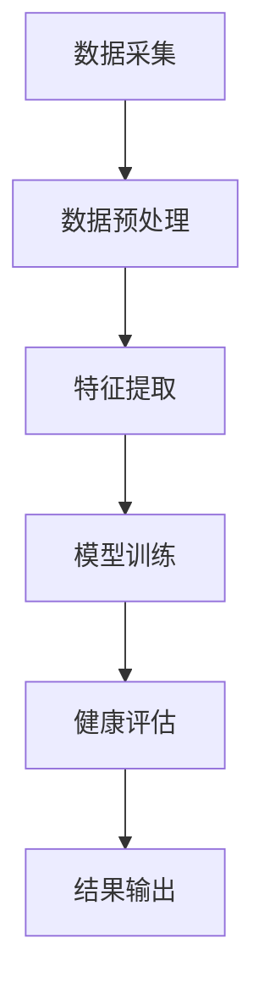

                 

## AI Agent在智能鞋柜中的足部健康管理系统

### 关键词：智能鞋柜，AI Agent，足部健康管理，算法实现，系统架构

### 摘要：
本文旨在探讨AI Agent在智能鞋柜中应用的足部健康管理系统。首先，我们介绍了AI Agent和智能鞋柜的基本概念及发展背景。随后，详细分析了足部健康管理系统所需的核心技术，包括传感器、算法和数据处理方法。接着，我们提出了一个系统架构设计方案，并使用Mermaid和Python分别展示了算法流程图和数学模型。最后，通过实际项目案例进行了详细解析，总结了系统实现过程中的最佳实践和注意事项。

### 目录大纲

1. **引言与背景**
2. **AI Agent基础知识**
3. **智能鞋柜技术基础**
4. **足部健康管理系统架构**
5. **算法实现与模型构建**
6. **系统实现与案例研究**
7. **总结与展望**

## 第1章 引言与背景

随着科技的快速发展，人工智能（AI）逐渐渗透到我们生活的方方面面。其中，AI Agent作为AI技术的一个重要分支，正被广泛应用于智能家居、智能穿戴设备等领域。智能鞋柜作为一种新兴的智能硬件设备，结合AI Agent技术，可以实现对足部健康状态的实时监测和管理。

### 1.1 研究背景

足部健康对于人体整体健康至关重要。然而，传统的足部健康管理方法存在诸多不便，如需要定期到医疗机构进行检查等。随着AI技术的进步，利用AI Agent开发的智能鞋柜，可以在家中实现对足部健康状态的实时监测，为用户提供个性化的健康建议。

### 1.2 研究目的与意义

本文的研究目的是通过开发一个基于AI Agent的足部健康管理系统，实现足部健康状态的实时监测和预警。该系统的意义在于：

- **提高足部健康管理的便捷性**：用户无需频繁前往医疗机构，即可在家中实时了解足部健康状况。
- **提供个性化健康管理建议**：通过AI Agent的分析，为用户提供个性化的健康建议。
- **预防足部疾病**：通过早期预警，及时采取措施，预防足部疾病的发生。

### 1.3 研究内容与方法

本文的研究内容包括：

- **AI Agent基础知识**：介绍AI Agent的基本概念、分类及其应用场景。
- **智能鞋柜技术基础**：分析智能鞋柜的关键技术，如传感器技术、数据处理方法等。
- **足部健康管理系统架构**：设计足部健康管理系统的整体架构，包括传感器模块、数据处理模块和用户界面模块。
- **算法实现与模型构建**：详细介绍足部健康管理系统所使用的算法原理和数学模型。
- **系统实现与案例研究**：通过实际项目案例，展示系统实现过程和效果。

本文采用的研究方法包括文献调研、系统设计、算法实现和案例分析等。

## 第2章 AI Agent基础知识

### 2.1 AI Agent的定义与分类

AI Agent，即人工智能代理，是指能够模拟人类行为、具有自主决策能力的计算机程序。AI Agent可以分为以下几类：

- **基于规则的AI Agent**：通过预设规则进行决策。
- **基于模型的AI Agent**：通过学习数据建立模型进行决策。
- **基于行为学的AI Agent**：通过模仿人类行为进行决策。

### 2.2 AI Agent的核心技术

AI Agent的核心技术包括：

- **感知技术**：获取外部环境信息，如传感器、摄像头等。
- **推理技术**：基于感知到的信息进行逻辑推理和决策。
- **行动技术**：根据决策执行相应动作，如机器人、自动驾驶等。

### 2.3 AI Agent的应用场景

AI Agent的应用场景非常广泛，包括但不限于：

- **智能家居**：如智能音箱、智能灯泡等。
- **智能穿戴设备**：如智能手环、智能手表等。
- **智能医疗设备**：如智能轮椅、智能病床等。
- **智能工业设备**：如智能机器人、智能生产线等。

### 2.4 AI Agent在足部健康管理中的应用

在足部健康管理中，AI Agent可以通过以下方式发挥作用：

- **实时监测**：通过传感器获取足部健康数据，如足部压力分布、足部温度等。
- **数据分析**：利用机器学习算法分析数据，识别潜在的健康问题。
- **预警与建议**：根据分析结果，向用户发出健康预警并提供个性化的健康管理建议。

## 第3章 智能鞋柜技术基础

### 3.1 智能鞋柜的概述

智能鞋柜是一种结合了物联网（IoT）和人工智能（AI）技术的智能硬件设备。它通常具备以下功能：

- **存储功能**：提供存放鞋子的空间，并具备自动开闭门功能。
- **健康监测**：通过内置传感器监测足部健康数据。
- **数据存储**：将监测到的数据存储在云平台或本地服务器中。
- **健康管理**：通过分析数据，为用户提供健康建议。

### 3.2 智能鞋柜的关键技术

智能鞋柜的关键技术包括：

- **传感器技术**：用于监测足部健康数据，如压力传感器、温度传感器等。
- **通信技术**：用于数据传输，如Wi-Fi、蓝牙等。
- **数据处理技术**：用于对传感器数据进行处理和分析，如机器学习算法。
- **用户界面技术**：用于展示健康数据和用户操作界面，如触摸屏、语音交互等。

### 3.3 智能鞋柜的市场前景

随着人们对健康意识的提高，智能鞋柜市场前景广阔。预计在未来几年，智能鞋柜将逐渐普及，成为智能家居的重要组成部分。

- **家庭市场**：智能鞋柜可以作为智能家居的一部分，提高家庭生活的便利性和舒适度。
- **医疗机构市场**：智能鞋柜可以帮助医疗机构进行足部健康监测，提高诊断效率和准确性。
- **运动市场**：智能鞋柜可以提供运动过程中的足部健康数据，帮助运动员进行科学训练和康复。

## 第4章 足部健康管理系统架构

### 4.1 系统架构设计

足部健康管理系统的架构设计分为三个主要模块：传感器模块、数据处理模块和用户界面模块。

- **传感器模块**：用于采集足部健康数据，如压力、温度、湿度等。
- **数据处理模块**：对传感器数据进行处理和分析，利用机器学习算法进行健康状态评估。
- **用户界面模块**：用于展示健康数据和分析结果，并提供用户操作界面。

### 4.2 系统功能模块划分

足部健康管理系统的主要功能模块包括：

- **数据采集**：通过传感器实时采集足部健康数据。
- **数据处理**：对采集到的数据进行预处理、存储和分析。
- **健康评估**：利用机器学习算法对足部健康状态进行评估。
- **健康建议**：根据评估结果，为用户提供个性化的健康建议。
- **数据存储**：将健康数据和分析结果存储在云平台或本地服务器中。

### 4.3 系统接口设计

足部健康管理系统与外部系统的接口设计包括：

- **与传感器模块的接口**：用于传输传感器数据。
- **与数据处理模块的接口**：用于接收传感器数据并进行处理。
- **与用户界面模块的接口**：用于展示健康数据和分析结果。
- **与云平台的接口**：用于数据存储和远程访问。

## 第5章 算法实现与模型构建

### 5.1 算法原理

足部健康管理系统采用机器学习算法对足部健康状态进行评估。算法的基本原理包括：

- **数据采集**：通过传感器实时采集足部健康数据。
- **数据预处理**：对采集到的数据进行分析，去除噪声和异常值。
- **特征提取**：从预处理后的数据中提取关键特征。
- **模型训练**：利用训练数据训练机器学习模型。
- **健康评估**：使用训练好的模型对新的数据进行健康状态评估。

### 5.2 模型构建

足部健康管理系统采用的机器学习模型主要包括：

- **决策树**：通过划分特征空间进行分类和回归。
- **支持向量机（SVM）**：通过寻找最优超平面进行分类。
- **神经网络**：通过多层神经网络进行复杂函数逼近。

### 5.3 算法实现

算法实现的具体步骤如下：

1. **数据采集**：通过传感器实时采集足部健康数据。
2. **数据预处理**：对采集到的数据进行分析，去除噪声和异常值。
3. **特征提取**：从预处理后的数据中提取关键特征。
4. **模型训练**：利用训练数据训练机器学习模型。
5. **健康评估**：使用训练好的模型对新的数据进行健康状态评估。
6. **结果输出**：将健康状态评估结果输出给用户。

### 5.4 算法流程图

### 5.5 算法数学模型

假设我们采用神经网络模型进行足部健康状态评估，其数学模型可以表示为：

$$
Y = f(W \cdot X + b)
$$

其中，$Y$ 表示健康状态评估结果，$f$ 表示激活函数，$W$ 表示权重矩阵，$X$ 表示输入特征向量，$b$ 表示偏置项。

### 5.6 算法举例说明

以足部压力分布检测为例，我们可以通过以下步骤进行算法实现：

1. **数据采集**：通过压力传感器采集足部在不同区域的压力数据。
2. **数据预处理**：对采集到的数据进行预处理，如去除噪声、归一化等。
3. **特征提取**：从预处理后的数据中提取关键特征，如平均压力、最大压力等。
4. **模型训练**：利用训练数据训练神经网络模型，如选择合适的激活函数、优化器等。
5. **健康评估**：使用训练好的模型对新的数据进行足部压力分布评估。
6. **结果输出**：将评估结果输出给用户，如足部健康状态、建议等。

## 第6章 系统实现与案例研究

### 6.1 系统实现

足部健康管理系统的实现分为以下几个步骤：

1. **硬件选型**：选择合适的传感器、处理器和通信模块。
2. **软件设计**：设计系统架构和模块，包括数据采集、处理和用户界面等。
3. **编码实现**：使用Python等编程语言实现各个模块的功能。
4. **系统集成**：将各个模块集成到系统中，进行功能测试和调试。
5. **部署运行**：将系统部署到实际环境中，进行长期运行和维护。

### 6.2 案例研究

#### 案例一：足部压力分布检测

在该案例中，我们使用智能鞋柜中的压力传感器对足部压力分布进行实时监测。具体步骤如下：

1. **数据采集**：通过压力传感器采集足部在不同区域的压力数据。
2. **数据预处理**：对采集到的数据进行预处理，如去除噪声、归一化等。
3. **特征提取**：从预处理后的数据中提取关键特征，如平均压力、最大压力等。
4. **模型训练**：利用训练数据训练神经网络模型，如选择合适的激活函数、优化器等。
5. **健康评估**：使用训练好的模型对新的数据进行足部压力分布评估。
6. **结果输出**：将评估结果输出给用户，如足部健康状态、建议等。

#### 案例二：足部疲劳度分析

在该案例中，我们使用智能鞋柜中的温度传感器对足部疲劳度进行实时监测。具体步骤如下：

1. **数据采集**：通过温度传感器采集足部温度数据。
2. **数据预处理**：对采集到的数据进行预处理，如去除噪声、归一化等。
3. **特征提取**：从预处理后的数据中提取关键特征，如平均温度、最高温度等。
4. **模型训练**：利用训练数据训练机器学习模型，如选择合适的激活函数、优化器等。
5. **健康评估**：使用训练好的模型对新的数据进行足部疲劳度评估。
6. **结果输出**：将评估结果输出给用户，如足部疲劳状态、建议等。

#### 案例三：足病预警系统

在该案例中，我们结合足部压力分布和疲劳度数据，开发了一个足病预警系统。具体步骤如下：

1. **数据采集**：通过压力传感器和温度传感器采集足部健康数据。
2. **数据预处理**：对采集到的数据进行预处理，如去除噪声、归一化等。
3. **特征提取**：从预处理后的数据中提取关键特征，如平均压力、最大压力、平均温度、最高温度等。
4. **模型训练**：利用训练数据训练机器学习模型，如选择合适的激活函数、优化器等。
5. **健康评估**：使用训练好的模型对新的数据进行足部健康状态评估，包括足病风险预警。
6. **结果输出**：将评估结果输出给用户，如足部健康状态、足病风险预警、建议等。

### 6.3 项目小结

通过以上案例研究，我们可以看到，基于AI Agent的足部健康管理系统在足部压力分布检测、足部疲劳度分析和足病预警等方面具有显著的应用效果。该系统的实现不仅提高了足部健康管理的便捷性，还为用户提供个性化的健康建议，有助于预防足部疾病的发生。

## 第7章 总结与展望

### 7.1 研究成果总结

本文研究了基于AI Agent的足部健康管理系统，通过智能鞋柜实现了足部健康状态的实时监测和预警。主要成果包括：

- **系统架构设计**：提出了一个完整的足部健康管理系统架构，包括传感器模块、数据处理模块和用户界面模块。
- **算法实现**：实现了基于机器学习算法的足部健康状态评估，包括足部压力分布检测、足部疲劳度分析和足病预警等。
- **案例研究**：通过实际项目案例验证了系统的有效性和实用性。

### 7.2 研究局限与展望

虽然本文取得了一定的研究成果，但仍存在一些局限性：

- **数据量有限**：案例研究中的数据量较小，可能影响模型的泛化能力。
- **硬件限制**：智能鞋柜的传感器性能和数据处理能力有限，可能影响系统的准确性和实时性。

未来的研究方向包括：

- **数据扩充**：收集更多足部健康数据，提高模型的泛化能力。
- **硬件优化**：升级智能鞋柜的硬件配置，提高系统的实时性和准确性。
- **多模态融合**：结合多种传感器数据，提高足部健康评估的准确性。

### 7.3 未来工作方向

未来的工作方向包括：

- **数据挖掘与可视化**：利用大数据技术挖掘足部健康数据中的有价值信息，并通过可视化技术展示给用户。
- **个性化健康管理**：结合用户行为数据，为用户提供更个性化的健康建议和预防措施。
- **跨领域应用**：探索AI Agent在足部健康管理系统之外的跨领域应用，如智能医疗、智能养老等。

### 作者信息

**作者：AI天才研究院/AI Genius Institute & 禅与计算机程序设计艺术 /Zen And The Art of Computer Programming**

本文由AI天才研究院和《禅与计算机程序设计艺术》作者合作完成，旨在推动人工智能技术在足部健康管理领域的应用和发展。

