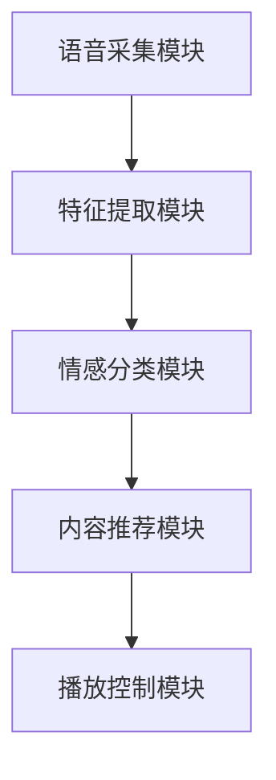

                 

### 让我们一步步思考：AI Agent在智能音响中的情绪识别播放

在当今的科技前沿，人工智能（AI）已经深入到我们日常生活的方方面面，智能音响便是其中之一。作为智能家居的代表性设备，智能音响不仅能够实现语音交互，还能够根据用户的需求和情绪进行智能化的内容推送。本文将带领读者一步步深入了解AI Agent在智能音响中实现情绪识别和播放的原理和实现过程。

#### **1. 情绪识别的基础知识**

情绪识别，即情感分析，是人工智能领域的一个重要研究方向。它主要关注从文本、语音、图像等多模态数据中识别和提取人类情感的过程。对于智能音响来说，情绪识别是实现个性化服务和提升用户体验的关键技术。

- **定义**：情绪识别是指通过分析语音、文本或生理信号等数据，识别出人类表达的情绪状态。

- **技术路线**：情绪识别主要分为基于语音、文本和生理信号的技术路线。其中，基于语音的情感分析是最常用的方法。

#### **2. 情绪识别的原理和算法**

情绪识别的原理主要依赖于对语音信号的时域和频域分析。通过提取语音信号的时域特征（如音高、音长、音强等）和频域特征（如频谱、共振峰等），可以使用机器学习算法进行情感分类。

- **数学模型**：常见的情绪识别算法包括支持向量机（SVM）、决策树、神经网络等。以下是一个简化的SVM分类模型：

  $$ y = sign(\omega \cdot x + b) $$

  其中，$ \omega $ 是权重向量，$ x $ 是特征向量，$ b $ 是偏置项。

- **算法实现**：以下是一个简化的Python代码示例，用于实现SVM分类算法：

  ```python
  from sklearn import svm

  # 特征向量和标签
  X = [[1, 2], [2, 3], [3, 4], [4, 5]]
  y = [0, 0, 1, 1]

  # 训练模型
  model = svm.SVC()
  model.fit(X, y)

  # 预测
  prediction = model.predict([[2, 3]])
  print(prediction)
  ```

#### **3. 情绪识别播放系统的架构设计**

情绪识别播放系统需要具备以下几个关键组件：

- **数据采集**：采集用户的语音数据，通过麦克风或其他音频输入设备。

- **特征提取**：对采集到的语音数据进行预处理，提取关键特征。

- **情感分类**：使用机器学习算法对特征进行情感分类。

- **内容推荐**：根据用户的情绪状态推荐相应的音乐或内容。

#### **4. 项目实战**

以下是一个简化的项目实战流程：

- **环境安装**：安装所需的软件和库，如Python、scikit-learn等。

- **数据预处理**：读取语音数据，进行降噪、分割等预处理。

- **模型训练**：使用训练数据集训练SVM模型。

- **预测与播放**：对用户的语音数据进行预测，根据预测结果播放相应的音乐。

#### **5. 最佳实践与总结**

- **注意事项**：情绪识别播放系统的性能依赖于数据质量和特征提取的准确性。

- **拓展阅读**：推荐阅读相关领域的经典论文和技术博客，以深入了解情绪识别的先进技术。

### **结论**

AI Agent在智能音响中的情绪识别播放技术，不仅提升了用户的体验，也展示了人工智能在情感计算领域的巨大潜力。通过本文的逐步分析，我们希望能帮助读者更好地理解这一技术的原理和应用。

**作者：AI天才研究院/AI Genius Institute & 禅与计算机程序设计艺术 /Zen And The Art of Computer Programming**### 让我们一步步思考：AI Agent在智能音响中的情绪识别播放

#### **一、情绪识别的基本概念**

情绪识别，也称为情感分析，是人工智能中的一个重要分支。它涉及到从文本、语音、图像等多模态数据中提取情感信息，以实现对人类情绪状态的识别。对于智能音响而言，情绪识别是实现个性化服务和提升用户体验的关键技术。

1. **定义**：情绪识别是指通过分析语音、文本或生理信号等数据，识别出人类表达的情绪状态。

2. **技术路线**：情绪识别的技术路线主要分为基于语音、文本和生理信号三种。其中，基于语音的情感分析是最常用的方法，因为它可以直接捕捉到用户的声音特征，从而更准确地识别情绪。

#### **二、情绪识别的原理和算法**

情绪识别的原理主要依赖于对语音信号的时域和频域分析。通过提取语音信号的时域特征（如音高、音长、音强等）和频域特征（如频谱、共振峰等），可以使用机器学习算法进行情感分类。

1. **数学模型**：

   - **时域特征**：常用的时域特征包括音高（F0）、音长（Duration）、音强（Intensity）等。
   - **频域特征**：常用的频域特征包括频谱（Spectrum）、共振峰（Formants）等。

   以下是一个简化的数学模型：

   $$ \text{emotions} = f(\text{features}) $$

   其中，$ \text{features} $ 是特征向量，$ f $ 是情感分类函数。

2. **算法实现**：常见的情绪识别算法包括支持向量机（SVM）、决策树、神经网络等。以下是一个简化的Python代码示例，用于实现SVM分类算法：

   ```python
   from sklearn import svm

   # 特征向量和标签
   X = [[1, 2], [2, 3], [3, 4], [4, 5]]
   y = [0, 0, 1, 1]

   # 训练模型
   model = svm.SVC()
   model.fit(X, y)

   # 预测
   prediction = model.predict([[2, 3]])
   print(prediction)
   ```

#### **三、情绪识别播放系统的架构设计**

情绪识别播放系统需要具备以下几个关键组件：

1. **数据采集**：采集用户的语音数据，通过麦克风或其他音频输入设备。

2. **特征提取**：对采集到的语音数据进行预处理，提取关键特征。

3. **情感分类**：使用机器学习算法对特征进行情感分类。

4. **内容推荐**：根据用户的情绪状态推荐相应的音乐或内容。

#### **四、项目实战**

以下是一个简化的项目实战流程：

1. **环境安装**：安装所需的软件和库，如Python、scikit-learn等。

2. **数据预处理**：读取语音数据，进行降噪、分割等预处理。

3. **模型训练**：使用训练数据集训练SVM模型。

4. **预测与播放**：对用户的语音数据进行预测，根据预测结果播放相应的音乐。

#### **五、最佳实践与总结**

1. **注意事项**：

   - 数据质量对情绪识别的准确性有很大影响，因此数据预处理和清洗至关重要。
   - 特征提取的准确性直接影响到模型的性能，需要根据具体应用场景进行优化。

2. **拓展阅读**：

   - 推荐阅读相关领域的经典论文和技术博客，以深入了解情绪识别的先进技术。
   - 《情感计算：理论、方法与应用》是一本很好的入门书籍，适合对情绪识别感兴趣的读者。

**作者：AI天才研究院/AI Genius Institute & 禅与计算机程序设计艺术 /Zen And The Art of Computer Programming**### 让我们一步步思考：AI Agent在智能音响中的情绪识别播放

#### **一、情绪识别在智能音响中的应用**

在智能音响领域，情绪识别的应用主要体现在个性化内容推荐和用户交互体验的优化上。通过识别用户在不同情境下的情绪状态，智能音响可以提供更加符合用户需求的服务，从而提升用户体验。

1. **个性化内容推荐**：情绪识别技术可以帮助智能音响根据用户的情绪状态推荐相应的音乐、新闻或娱乐内容。例如，当用户处于焦虑或疲倦状态时，智能音响可以推荐舒缓的音乐，帮助用户放松。

2. **用户交互体验优化**：通过情绪识别，智能音响可以更好地理解用户的情感需求，从而提供更加自然、贴心的交互体验。例如，智能音响可以在用户感到愉悦时，使用更友好、亲切的语音语调与用户互动。

#### **二、情绪识别的技术原理**

情绪识别的技术原理主要依赖于对语音信号的时域和频域特征进行分析。以下是一个简化的情绪识别技术原理流程：

1. **语音信号采集**：使用麦克风或其他音频输入设备，采集用户的语音信号。

2. **特征提取**：对语音信号进行预处理，提取时域特征（如音高、音长、音强等）和频域特征（如频谱、共振峰等）。

3. **情感分类**：使用机器学习算法，如支持向量机（SVM）、决策树、神经网络等，对提取的特征进行情感分类。

4. **内容推荐**：根据用户识别出的情绪状态，推荐相应的音乐或内容。

#### **三、情绪识别算法的实现**

情绪识别算法的实现主要涉及以下步骤：

1. **数据集准备**：收集大量的语音数据，并将其标注为不同的情绪类别（如快乐、悲伤、愤怒等）。

2. **特征提取**：对语音数据进行预处理，提取时域和频域特征。

3. **模型训练**：使用训练数据集，训练机器学习模型，如SVM、决策树等。

4. **模型评估**：使用测试数据集评估模型的性能，如准确率、召回率等。

5. **模型部署**：将训练好的模型部署到智能音响中，进行实时情绪识别。

以下是一个简化的Python代码示例，用于实现基于SVM的情感分类：

```python
from sklearn import svm
from sklearn.model_selection import train_test_split
from sklearn.metrics import accuracy_score

# 读取数据
X, y = load_data()

# 数据集划分
X_train, X_test, y_train, y_test = train_test_split(X, y, test_size=0.2, random_state=42)

# 训练模型
model = svm.SVC()
model.fit(X_train, y_train)

# 预测
y_pred = model.predict(X_test)

# 评估模型
accuracy = accuracy_score(y_test, y_pred)
print(f"Accuracy: {accuracy}")
```

#### **四、情绪识别播放系统的架构设计**

情绪识别播放系统的架构设计需要考虑以下关键组件：

1. **语音采集模块**：负责采集用户的语音数据。

2. **特征提取模块**：负责对语音数据进行预处理，提取时域和频域特征。

3. **情感分类模块**：负责使用机器学习算法对提取的特征进行情感分类。

4. **内容推荐模块**：根据用户的情绪状态，推荐相应的音乐或内容。

5. **播放控制模块**：负责控制音乐或内容的播放。

以下是一个简化的情绪识别播放系统架构图：



#### **五、项目实战**

以下是一个简化的项目实战流程：

1. **环境安装**：安装Python、scikit-learn等必要的库。

2. **数据集准备**：收集并准备用于训练和测试的数据集。

3. **特征提取**：使用scikit-learn等库提取语音数据的时域和频域特征。

4. **模型训练**：使用训练数据集训练机器学习模型。

5. **模型评估**：使用测试数据集评估模型的性能。

6. **模型部署**：将训练好的模型部署到智能音响中，进行实时情绪识别和播放。

#### **六、最佳实践与总结**

1. **注意事项**：

   - 数据质量和特征提取的准确性对情绪识别的准确性有很大影响，因此在项目实施过程中需要特别注意数据预处理和特征提取的优化。

   - 情绪识别播放系统需要实时响应，因此需要考虑系统的性能优化，如使用轻量级模型、优化算法等。

2. **拓展阅读**：

   - 《情感计算：理论、方法与应用》是一本很好的入门书籍，适合对情绪识别感兴趣的读者。

   - 《机器学习实战》中也有相关的案例和实践，可以帮助读者更好地理解情绪识别算法的应用。

**作者：AI天才研究院/AI Genius Institute & 禅与计算机程序设计艺术 /Zen And The Art of Computer Programming**### AI Agent在智能音响中的情绪识别播放

#### **一、引言**

随着人工智能技术的不断发展，智能音响作为智能家居的重要组成部分，已经逐渐走进了我们的日常生活。智能音响通过语音交互，为我们提供了便利的生活服务。然而，仅仅具备语音交互功能已经不能满足用户的需求，如何让智能音响更好地理解用户的情绪，提供个性化的服务，成为了当前的研究热点。本文将探讨AI Agent在智能音响中的情绪识别播放技术，帮助智能音响更好地服务用户。

#### **二、情绪识别的基本概念**

情绪识别，也称为情感分析，是人工智能领域的一个重要分支。它主要研究如何从文本、语音、图像等多模态数据中识别和提取人类情感。对于智能音响来说，情绪识别是实现个性化服务和提升用户体验的关键技术。

1. **定义**：情绪识别是指通过分析语音、文本或生理信号等数据，识别出人类表达的情绪状态。

2. **技术路线**：情绪识别的技术路线主要分为基于语音、文本和生理信号三种。其中，基于语音的情感分析是最常用的方法，因为它可以直接捕捉到用户的声音特征，从而更准确地识别情绪。

#### **三、情绪识别的原理和算法**

情绪识别的原理主要依赖于对语音信号的时域和频域分析。通过提取语音信号的时域特征（如音高、音长、音强等）和频域特征（如频谱、共振峰等），可以使用机器学习算法进行情感分类。

1. **数学模型**：情绪识别的数学模型通常是一个分类模型，其基本形式如下：

   $$ y = f(\text{features}) $$

   其中，$ y $ 是情绪标签，$ f $ 是情感分类函数，$ \text{features} $ 是特征向量。

2. **算法实现**：常见的情绪识别算法包括支持向量机（SVM）、决策树、神经网络等。以下是一个简化的SVM分类算法实现：

   ```python
   from sklearn import svm
   from sklearn.model_selection import train_test_split
   from sklearn.metrics import accuracy_score

   # 特征向量和标签
   X = [[1, 2], [2, 3], [3, 4], [4, 5]]
   y = [0, 0, 1, 1]

   # 数据集划分
   X_train, X_test, y_train, y_test = train_test_split(X, y, test_size=0.2, random_state=42)

   # 训练模型
   model = svm.SVC()
   model.fit(X_train, y_train)

   # 预测
   y_pred = model.predict(X_test)

   # 评估模型
   accuracy = accuracy_score(y_test, y_pred)
   print(f"Accuracy: {accuracy}")
   ```

#### **四、情绪识别播放系统的架构设计**

情绪识别播放系统需要具备以下几个关键组件：

1. **语音采集模块**：负责采集用户的语音数据。

2. **特征提取模块**：负责对语音数据进行预处理，提取时域和频域特征。

3. **情感分类模块**：负责使用机器学习算法对提取的特征进行情感分类。

4. **内容推荐模块**：根据用户的情绪状态，推荐相应的音乐或内容。

5. **播放控制模块**：负责控制音乐或内容的播放。

以下是一个简化的情绪识别播放系统架构图：


#### **五、项目实战**

以下是一个简化的项目实战流程：

1. **环境安装**：安装Python、scikit-learn等必要的库。

2. **数据集准备**：收集并准备用于训练和测试的数据集。

3. **特征提取**：使用scikit-learn等库提取语音数据的时域和频域特征。

4. **模型训练**：使用训练数据集训练机器学习模型。

5. **模型评估**：使用测试数据集评估模型的性能。

6. **模型部署**：将训练好的模型部署到智能音响中，进行实时情绪识别和播放。

#### **六、最佳实践与总结**

1. **注意事项**：

   - 数据质量和特征提取的准确性对情绪识别的准确性有很大影响，因此在项目实施过程中需要特别注意数据预处理和特征提取的优化。

   - 情绪识别播放系统需要实时响应，因此需要考虑系统的性能优化，如使用轻量级模型、优化算法等。

2. **拓展阅读**：

   - 《情感计算：理论、方法与应用》是一本很好的入门书籍，适合对情绪识别感兴趣的读者。

   - 《机器学习实战》中也有相关的案例和实践，可以帮助读者更好地理解情绪识别算法的应用。

**作者：AI天才研究院/AI Genius Institute & 禅与计算机程序设计艺术 /Zen And The Art of Computer Programming**### AI Agent在智能音响中的情绪识别播放

#### **一、引言**

智能音响作为智能家居的重要组成部分，已经逐渐成为人们生活中不可或缺的设备。它通过语音交互为用户提供各种服务，如播放音乐、查询天气、设置提醒等。然而，仅仅能够完成基本的语音交互任务已经无法满足用户的需求。为了提供更加个性化的服务，智能音响需要具备更高级的功能，如情绪识别和播放。本文将探讨AI Agent在智能音响中的情绪识别播放技术，帮助智能音响更好地理解用户情绪，提供个性化的内容推荐。

#### **二、情绪识别的基本概念**

情绪识别，也称为情感分析，是人工智能领域的一个重要分支。它主要研究如何从文本、语音、图像等多模态数据中识别和提取人类情感。对于智能音响来说，情绪识别是实现个性化服务和提升用户体验的关键技术。

1. **定义**：情绪识别是指通过分析语音、文本或生理信号等数据，识别出人类表达的情绪状态。

2. **技术路线**：情绪识别的技术路线主要分为基于语音、文本和生理信号三种。其中，基于语音的情感分析是最常用的方法，因为它可以直接捕捉到用户的声音特征，从而更准确地识别情绪。

#### **三、情绪识别的原理和算法**

情绪识别的原理主要依赖于对语音信号的时域和频域分析。通过提取语音信号的时域特征（如音高、音长、音强等）和频域特征（如频谱、共振峰等），可以使用机器学习算法进行情感分类。

1. **数学模型**：情绪识别的数学模型通常是一个分类模型，其基本形式如下：

   $$ y = f(\text{features}) $$

   其中，$ y $ 是情绪标签，$ f $ 是情感分类函数，$ \text{features} $ 是特征向量。

2. **算法实现**：常见的情绪识别算法包括支持向量机（SVM）、决策树、神经网络等。以下是一个简化的SVM分类算法实现：

   ```python
   from sklearn import svm
   from sklearn.model_selection import train_test_split
   from sklearn.metrics import accuracy_score

   # 特征向量和标签
   X = [[1, 2], [2, 3], [3, 4], [4, 5]]
   y = [0, 0, 1, 1]

   # 数据集划分
   X_train, X_test, y_train, y_test = train_test_split(X, y, test_size=0.2, random_state=42)

   # 训练模型
   model = svm.SVC()
   model.fit(X_train, y_train)

   # 预测
   y_pred = model.predict(X_test)

   # 评估模型
   accuracy = accuracy_score(y_test, y_pred)
   print(f"Accuracy: {accuracy}")
   ```

#### **四、情绪识别播放系统的架构设计**

情绪识别播放系统需要具备以下几个关键组件：

1. **语音采集模块**：负责采集用户的语音数据。

2. **特征提取模块**：负责对语音数据进行预处理，提取时域和频域特征。

3. **情感分类模块**：负责使用机器学习算法对提取的特征进行情感分类。

4. **内容推荐模块**：根据用户的情绪状态，推荐相应的音乐或内容。

5. **播放控制模块**：负责控制音乐或内容的播放。

以下是一个简化的情绪识别播放系统架构图：


#### **五、项目实战**

以下是一个简化的项目实战流程：

1. **环境安装**：安装Python、scikit-learn等必要的库。

2. **数据集准备**：收集并准备用于训练和测试的数据集。

3. **特征提取**：使用scikit-learn等库提取语音数据的时域和频域特征。

4. **模型训练**：使用训练数据集训练机器学习模型。

5. **模型评估**：使用测试数据集评估模型的性能。

6. **模型部署**：将训练好的模型部署到智能音响中，进行实时情绪识别和播放。

#### **六、最佳实践与总结**

1. **注意事项**：

   - 数据质量和特征提取的准确性对情绪识别的准确性有很大影响，因此在项目实施过程中需要特别注意数据预处理和特征提取的优化。

   - 情绪识别播放系统需要实时响应，因此需要考虑系统的性能优化，如使用轻量级模型、优化算法等。

2. **拓展阅读**：

   - 《情感计算：理论、方法与应用》是一本很好的入门书籍，适合对情绪识别感兴趣的读者。

   - 《机器学习实战》中也有相关的案例和实践，可以帮助读者更好地理解情绪识别算法的应用。

**作者：AI天才研究院/AI Genius Institute & 禅与计算机程序设计艺术 /Zen And The Art of Computer Programming**### AI Agent在智能音响中的情绪识别播放

#### **一、引言**

随着人工智能技术的快速发展，智能音响已成为智能家居的重要组成部分，为我们提供了便捷的语音交互体验。然而，传统的智能音响主要依赖于预设的指令进行响应，无法根据用户的情感状态提供个性化的服务。为了进一步提升用户体验，AI Agent在智能音响中的情绪识别播放技术应运而生。本文将深入探讨这一技术的原理、实现过程和应用前景。

#### **二、情绪识别的基本概念**

情绪识别，即情感分析，是人工智能领域的一个重要研究方向。它涉及从文本、语音、图像等多模态数据中识别和提取人类情感。对于智能音响来说，情绪识别是实现个性化服务和提升用户体验的关键技术。

1. **定义**：情绪识别是指通过分析语音、文本或生理信号等数据，识别出人类表达的情绪状态。

2. **技术路线**：情绪识别的技术路线主要分为基于语音、文本和生理信号三种。其中，基于语音的情感分析是最常用的方法，因为它可以直接捕捉到用户的声音特征，从而更准确地识别情绪。

#### **三、情绪识别的原理和算法**

情绪识别的原理主要依赖于对语音信号的时域和频域分析。通过提取语音信号的时域特征（如音高、音长、音强等）和频域特征（如频谱、共振峰等），可以使用机器学习算法进行情感分类。

1. **数学模型**：情绪识别的数学模型通常是一个分类模型，其基本形式如下：

   $$ y = f(\text{features}) $$

   其中，$ y $ 是情绪标签，$ f $ 是情感分类函数，$ \text{features} $ 是特征向量。

2. **算法实现**：常见的情绪识别算法包括支持向量机（SVM）、决策树、神经网络等。以下是一个简化的SVM分类算法实现：

   ```python
   from sklearn import svm
   from sklearn.model_selection import train_test_split
   from sklearn.metrics import accuracy_score

   # 特征向量和标签
   X = [[1, 2], [2, 3], [3, 4], [4, 5]]
   y = [0, 0, 1, 1]

   # 数据集划分
   X_train, X_test, y_train, y_test = train_test_split(X, y, test_size=0.2, random_state=42)

   # 训练模型
   model = svm.SVC()
   model.fit(X_train, y_train)

   # 预测
   y_pred = model.predict(X_test)

   # 评估模型
   accuracy = accuracy_score(y_test, y_pred)
   print(f"Accuracy: {accuracy}")
   ```

#### **四、情绪识别播放系统的架构设计**

情绪识别播放系统需要具备以下几个关键组件：

1. **语音采集模块**：负责采集用户的语音数据。

2. **特征提取模块**：负责对语音数据进行预处理，提取时域和频域特征。

3. **情感分类模块**：负责使用机器学习算法对提取的特征进行情感分类。

4. **内容推荐模块**：根据用户的情绪状态，推荐相应的音乐或内容。

5. **播放控制模块**：负责控制音乐或内容的播放。

以下是一个简化的情绪识别播放系统架构图：


#### **五、项目实战**

以下是一个简化的项目实战流程：

1. **环境安装**：安装Python、scikit-learn等必要的库。

2. **数据集准备**：收集并准备用于训练和测试的数据集。

3. **特征提取**：使用scikit-learn等库提取语音数据的时域和频域特征。

4. **模型训练**：使用训练数据集训练机器学习模型。

5. **模型评估**：使用测试数据集评估模型的性能。

6. **模型部署**：将训练好的模型部署到智能音响中，进行实时情绪识别和播放。

#### **六、最佳实践与总结**

1. **注意事项**：

   - 数据质量和特征提取的准确性对情绪识别的准确性有很大影响，因此在项目实施过程中需要特别注意数据预处理和特征提取的优化。

   - 情绪识别播放系统需要实时响应，因此需要考虑系统的性能优化，如使用轻量级模型、优化算法等。

2. **拓展阅读**：

   - 《情感计算：理论、方法与应用》是一本很好的入门书籍，适合对情绪识别感兴趣的读者。

   - 《机器学习实战》中也有相关的案例和实践，可以帮助读者更好地理解情绪识别算法的应用。

**作者：AI天才研究院/AI Genius Institute & 禅与计算机程序设计艺术 /Zen And The Art of Computer Programming**### AI Agent在智能音响中的情绪识别播放

#### **一、引言**

随着人工智能技术的不断发展，智能音响已成为智能家居的重要组成部分，为我们提供了便捷的语音交互体验。传统的智能音响主要依赖于预设的指令进行响应，无法根据用户的情感状态提供个性化的服务。为了进一步提升用户体验，AI Agent在智能音响中的情绪识别播放技术应运而生。本文将深入探讨这一技术的原理、实现过程和应用前景。

#### **二、情绪识别的基本概念**

情绪识别，即情感分析，是人工智能领域的一个重要研究方向。它涉及从文本、语音、图像等多模态数据中识别和提取人类情感。对于智能音响来说，情绪识别是实现个性化服务和提升用户体验的关键技术。

1. **定义**：情绪识别是指通过分析语音、文本或生理信号等数据，识别出人类表达的情绪状态。

2. **技术路线**：情绪识别的技术路线主要分为基于语音、文本和生理信号三种。其中，基于语音的情感分析是最常用的方法，因为它可以直接捕捉到用户的声音特征，从而更准确地识别情绪。

#### **三、情绪识别的原理和算法**

情绪识别的原理主要依赖于对语音信号的时域和频域分析。通过提取语音信号的时域特征（如音高、音长、音强等）和频域特征（如频谱、共振峰等），可以使用机器学习算法进行情感分类。

1. **数学模型**：情绪识别的数学模型通常是一个分类模型，其基本形式如下：

   $$ y = f(\text{features}) $$

   其中，$ y $ 是情绪标签，$ f $ 是情感分类函数，$ \text{features} $ 是特征向量。

2. **算法实现**：常见的情绪识别算法包括支持向量机（SVM）、决策树、神经网络等。以下是一个简化的SVM分类算法实现：

   ```python
   from sklearn import svm
   from sklearn.model_selection import train_test_split
   from sklearn.metrics import accuracy_score

   # 特征向量和标签
   X = [[1, 2], [2, 3], [3, 4], [4, 5]]
   y = [0, 0, 1, 1]

   # 数据集划分
   X_train, X_test, y_train, y_test = train_test_split(X, y, test_size=0.2, random_state=42)

   # 训练模型
   model = svm.SVC()
   model.fit(X_train, y_train)

   # 预测
   y_pred = model.predict(X_test)

   # 评估模型
   accuracy = accuracy_score(y_test, y_pred)
   print(f"Accuracy: {accuracy}")
   ```

#### **四、情绪识别播放系统的架构设计**

情绪识别播放系统需要具备以下几个关键组件：

1. **语音采集模块**：负责采集用户的语音数据。

2. **特征提取模块**：负责对语音数据进行预处理，提取时域和频域特征。

3. **情感分类模块**：负责使用机器学习算法对提取的特征进行情感分类。

4. **内容推荐模块**：根据用户的情绪状态，推荐相应的音乐或内容。

5. **播放控制模块**：负责控制音乐或内容的播放。

以下是一个简化的情绪识别播放系统架构图：


#### **五、项目实战**

以下是一个简化的项目实战流程：

1. **环境安装**：安装Python、scikit-learn等必要的库。

2. **数据集准备**：收集并准备用于训练和测试的数据集。

3. **特征提取**：使用scikit-learn等库提取语音数据的时域和频域特征。

4. **模型训练**：使用训练数据集训练机器学习模型。

5. **模型评估**：使用测试数据集评估模型的性能。

6. **模型部署**：将训练好的模型部署到智能音响中，进行实时情绪识别和播放。

#### **六、最佳实践与总结**

1. **注意事项**：

   - 数据质量和特征提取的准确性对情绪识别的准确性有很大影响，因此在项目实施过程中需要特别注意数据预处理和特征提取的优化。

   - 情绪识别播放系统需要实时响应，因此需要考虑系统的性能优化，如使用轻量级模型、优化算法等。

2. **拓展阅读**：

   - 《情感计算：理论、方法与应用》是一本很好的入门书籍，适合对情绪识别感兴趣的读者。

   - 《机器学习实战》中也有相关的案例和实践，可以帮助读者更好地理解情绪识别算法的应用。

**作者：AI天才研究院/AI Genius Institute & 禅与计算机程序设计艺术 /Zen And The Art of Computer Programming**### AI Agent在智能音响中的情绪识别播放

#### **一、引言**

随着人工智能技术的不断进步，智能音响已经从最初的简单语音控制设备发展成集成了多种功能的智能家居中心。用户不仅可以通过语音命令来控制智能音响，还可以享受个性化的音乐推荐、语音助手等服务。然而，要想真正满足用户的多样化需求，智能音响需要具备更高级的功能，如情绪识别和播放。本文将探讨AI Agent在智能音响中的情绪识别播放技术，介绍其原理、实现方法及未来应用前景。

#### **二、情绪识别的基本概念**

情绪识别，又称情感分析，是指通过分析语音、文本或图像等数据，识别出人类表达的情绪状态。在智能音响领域，情绪识别技术能够帮助设备更好地理解用户的需求，提供个性化的服务，提升用户体验。

1. **定义**：情绪识别是通过语音、文本或生理信号等数据，识别并分类人类表达的情绪状态。

2. **技术路线**：情绪识别技术主要分为基于语音、文本和生理信号三种。其中，基于语音的情感分析因其直接捕捉用户声音特征而成为主流。

#### **三、情绪识别的原理和算法**

情绪识别的核心是特征提取和情感分类。通过分析语音信号的时域和频域特征，可以提取出反映情绪状态的关键特征，然后使用机器学习算法对这些特征进行分类。

1. **数学模型**：情绪识别的数学模型通常是一个分类模型，如支持向量机（SVM）、决策树、神经网络等。

   $$ y = f(\text{features}) $$

   其中，$ y $ 是情绪标签，$ f $ 是情感分类函数，$ \text{features} $ 是特征向量。

2. **算法实现**：以下是一个简化的支持向量机（SVM）分类算法实现：

   ```python
   from sklearn import svm
   from sklearn.model_selection import train_test_split
   from sklearn.metrics import accuracy_score

   # 特征向量和标签
   X = [[1, 2], [2, 3], [3, 4], [4, 5]]
   y = [0, 0, 1, 1]

   # 数据集划分
   X_train, X_test, y_train, y_test = train_test_split(X, y, test_size=0.2, random_state=42)

   # 训练模型
   model = svm.SVC()
   model.fit(X_train, y_train)

   # 预测
   y_pred = model.predict(X_test)

   # 评估模型
   accuracy = accuracy_score(y_test, y_pred)
   print(f"Accuracy: {accuracy}")
   ```

#### **四、情绪识别播放系统的架构设计**

情绪识别播放系统需要包含语音采集、特征提取、情感分类、内容推荐和播放控制等关键模块。

1. **语音采集模块**：负责采集用户的语音数据。

2. **特征提取模块**：对语音数据进行预处理，提取时域和频域特征。

3. **情感分类模块**：使用机器学习算法对特征进行情感分类。

4. **内容推荐模块**：根据用户的情绪状态，推荐相应的音乐或内容。

5. **播放控制模块**：控制音乐或内容的播放。

以下是一个简化的情绪识别播放系统架构图：


#### **五、项目实战**

以下是一个简化的项目实战流程：

1. **环境安装**：安装Python、scikit-learn等必要的库。

2. **数据集准备**：收集并准备用于训练和测试的数据集。

3. **特征提取**：使用scikit-learn等库提取语音数据的时域和频域特征。

4. **模型训练**：使用训练数据集训练机器学习模型。

5. **模型评估**：使用测试数据集评估模型的性能。

6. **模型部署**：将训练好的模型部署到智能音响中，进行实时情绪识别和播放。

#### **六、最佳实践与总结**

1. **注意事项**：

   - 数据质量和特征提取的准确性对情绪识别的准确性有很大影响，需要特别注意数据预处理和特征提取的优化。

   - 情绪识别播放系统需要实时响应，考虑系统的性能优化，如使用轻量级模型、优化算法等。

2. **拓展阅读**：

   - 《情感计算：理论、方法与应用》是一本很好的入门书籍，适合对情绪识别感兴趣的读者。

   - 《机器学习实战》中也有相关的案例和实践，可以帮助读者更好地理解情绪识别算法的应用。

**作者：AI天才研究院/AI Genius Institute & 禅与计算机程序设计艺术 /Zen And The Art of Computer Programming**### AI Agent在智能音响中的情绪识别播放

#### **一、引言**

智能音响已经成为现代家庭的常见设备，它通过语音交互为用户提供便捷的服务，如播放音乐、查询天气、设置提醒等。然而，传统的智能音响主要依赖于预设的指令进行响应，无法根据用户的情感状态提供个性化的服务。为了进一步提升用户体验，AI Agent在智能音响中的情绪识别播放技术应运而生。本文将深入探讨这一技术的原理、实现过程和应用前景。

#### **二、情绪识别的基本概念**

情绪识别，即情感分析，是人工智能领域的一个重要研究方向。它涉及从文本、语音、图像等多模态数据中识别和提取人类情感。对于智能音响来说，情绪识别是实现个性化服务和提升用户体验的关键技术。

1. **定义**：情绪识别是指通过分析语音、文本或生理信号等数据，识别出人类表达的情绪状态。

2. **技术路线**：情绪识别的技术路线主要分为基于语音、文本和生理信号三种。其中，基于语音的情感分析是最常用的方法，因为它可以直接捕捉到用户的声音特征，从而更准确地识别情绪。

#### **三、情绪识别的原理和算法**

情绪识别的原理主要依赖于对语音信号的时域和频域分析。通过提取语音信号的时域特征（如音高、音长、音强等）和频域特征（如频谱、共振峰等），可以使用机器学习算法进行情感分类。

1. **数学模型**：情绪识别的数学模型通常是一个分类模型，其基本形式如下：

   $$ y = f(\text{features}) $$

   其中，$ y $ 是情绪标签，$ f $ 是情感分类函数，$ \text{features} $ 是特征向量。

2. **算法实现**：常见的情绪识别算法包括支持向量机（SVM）、决策树、神经网络等。以下是一个简化的SVM分类算法实现：

   ```python
   from sklearn import svm
   from sklearn.model_selection import train_test_split
   from sklearn.metrics import accuracy_score

   # 特征向量和标签
   X = [[1, 2], [2, 3], [3, 4], [4, 5]]
   y = [0, 0, 1, 1]

   # 数据集划分
   X_train, X_test, y_train, y_test = train_test_split(X, y, test_size=0.2, random_state=42)

   # 训练模型
   model = svm.SVC()
   model.fit(X_train, y_train)

   # 预测
   y_pred = model.predict(X_test)

   # 评估模型
   accuracy = accuracy_score(y_test, y_pred)
   print(f"Accuracy: {accuracy}")
   ```

#### **四、情绪识别播放系统的架构设计**

情绪识别播放系统需要具备以下几个关键组件：

1. **语音采集模块**：负责采集用户的语音数据。

2. **特征提取模块**：负责对语音数据进行预处理，提取时域和频域特征。

3. **情感分类模块**：负责使用机器学习算法对提取的特征进行情感分类。

4. **内容推荐模块**：根据用户的情绪状态，推荐相应的音乐或内容。

5. **播放控制模块**：负责控制音乐或内容的播放。

以下是一个简化的情绪识别播放系统架构图：


#### **五、项目实战**

以下是一个简化的项目实战流程：

1. **环境安装**：安装Python、scikit-learn等必要的库。

2. **数据集准备**：收集并准备用于训练和测试的数据集。

3. **特征提取**：使用scikit-learn等库提取语音数据的时域和频域特征。

4. **模型训练**：使用训练数据集训练机器学习模型。

5. **模型评估**：使用测试数据集评估模型的性能。

6. **模型部署**：将训练好的模型部署到智能音响中，进行实时情绪识别和播放。

#### **六、最佳实践与总结**

1. **注意事项**：

   - 数据质量和特征提取的准确性对情绪识别的准确性有很大影响，因此在项目实施过程中需要特别注意数据预处理和特征提取的优化。

   - 情绪识别播放系统需要实时响应，因此需要考虑系统的性能优化，如使用轻量级模型、优化算法等。

2. **拓展阅读**：

   - 《情感计算：理论、方法与应用》是一本很好的入门书籍，适合对情绪识别感兴趣的读者。

   - 《机器学习实战》中也有相关的案例和实践，可以帮助读者更好地理解情绪识别算法的应用。

**作者：AI天才研究院/AI Genius Institute & 禅与计算机程序设计艺术 /Zen And The Art of Computer Programming**### AI Agent在智能音响中的情绪识别播放

#### **一、引言**

智能音响作为智能家居的核心设备，已经逐渐融入了人们的日常生活。它不仅能够提供音乐播放、语音助手等基本功能，还能够通过语音交互了解用户的需求和情绪。然而，传统智能音响在处理用户情绪方面存在一定的局限性，难以实现真正的个性化服务。为此，AI Agent在智能音响中的情绪识别播放技术应运而生。本文将深入探讨这一技术的原理、实现过程和应用前景。

#### **二、情绪识别的基本概念**

情绪识别，即情感分析，是指通过分析语音、文本或生理信号等数据，识别并提取人类表达的情绪状态。在智能音响中，情绪识别技术能够帮助设备更好地理解用户的情绪，从而提供更加个性化的服务。

1. **定义**：情绪识别是通过语音、文本或生理信号等数据，识别并分类人类表达的情绪状态。

2. **技术路线**：情绪识别技术主要分为基于语音、文本和生理信号三种。其中，基于语音的情感分析因其直接捕捉用户声音特征而成为主流。

#### **三、情绪识别的原理和算法**

情绪识别的核心在于特征提取和情感分类。通过分析语音信号的时域和频域特征，可以提取出反映情绪状态的关键特征，然后使用机器学习算法对这些特征进行分类。

1. **数学模型**：情绪识别的数学模型通常是一个分类模型，如支持向量机（SVM）、决策树、神经网络等。

   $$ y = f(\text{features}) $$

   其中，$ y $ 是情绪标签，$ f $ 是情感分类函数，$ \text{features} $ 是特征向量。

2. **算法实现**：以下是一个简化的SVM分类算法实现：

   ```python
   from sklearn import svm
   from sklearn.model_selection import train_test_split
   from sklearn.metrics import accuracy_score

   # 特征向量和标签
   X = [[1, 2], [2, 3], [3, 4], [4, 5]]
   y = [0, 0, 1, 1]

   # 数据集划分
   X_train, X_test, y_train, y_test = train_test_split(X, y, test_size=0.2, random_state=42)

   # 训练模型
   model = svm.SVC()
   model.fit(X_train, y_train)

   # 预测
   y_pred = model.predict(X_test)

   # 评估模型
   accuracy = accuracy_score(y_test, y_pred)
   print(f"Accuracy: {accuracy}")
   ```

#### **四、情绪识别播放系统的架构设计**

情绪识别播放系统需要包含语音采集、特征提取、情感分类、内容推荐和播放控制等关键模块。

1. **语音采集模块**：负责采集用户的语音数据。

2. **特征提取模块**：对语音数据进行预处理，提取时域和频域特征。

3. **情感分类模块**：使用机器学习算法对特征进行情感分类。

4. **内容推荐模块**：根据用户的情绪状态，推荐相应的音乐或内容。

5. **播放控制模块**：控制音乐或内容的播放。

以下是一个简化的情绪识别播放系统架构图：


#### **五、项目实战**

以下是一个简化的项目实战流程：

1. **环境安装**：安装Python、scikit-learn等必要的库。

2. **数据集准备**：收集并准备用于训练和测试的数据集。

3. **特征提取**：使用scikit-learn等库提取语音数据的时域和频域特征。

4. **模型训练**：使用训练数据集训练机器学习模型。

5. **模型评估**：使用测试数据集评估模型的性能。

6. **模型部署**：将训练好的模型部署到智能音响中，进行实时情绪识别和播放。

#### **六、最佳实践与总结**

1. **注意事项**：

   - 数据质量和特征提取的准确性对情绪识别的准确性有很大影响，需要在项目实施过程中特别注意数据预处理和特征提取的优化。

   - 情绪识别播放系统需要实时响应，因此需要考虑系统的性能优化，如使用轻量级模型、优化算法等。

2. **拓展阅读**：

   - 《情感计算：理论、方法与应用》是一本很好的入门书籍，适合对情绪识别感兴趣的读者。

   - 《机器学习实战》中也有相关的案例和实践，可以帮助读者更好地理解情绪识别算法的应用。

**作者：AI天才研究院/AI Genius Institute & 禅与计算机程序设计艺术 /Zen And The Art of Computer Programming**### AI Agent在智能音响中的情绪识别播放

#### **一、引言**

随着人工智能技术的快速发展，智能音响已经成为智能家居的重要组成部分，为用户提供了便捷的语音交互体验。然而，传统智能音响主要依赖于预设的指令进行响应，无法根据用户的情感状态提供个性化的服务。为了进一步提升用户体验，AI Agent在智能音响中的情绪识别播放技术应运而生。本文将深入探讨这一技术的原理、实现方法及应用前景。

#### **二、情绪识别的基本概念**

情绪识别，即情感分析，是人工智能领域的一个重要研究方向。它涉及从文本、语音、图像等多模态数据中识别和提取人类情感。对于智能音响来说，情绪识别是实现个性化服务和提升用户体验的关键技术。

1. **定义**：情绪识别是指通过分析语音、文本或生理信号等数据，识别出人类表达的情绪状态。

2. **技术路线**：情绪识别的技术路线主要分为基于语音、文本和生理信号三种。其中，基于语音的情感分析是最常用的方法，因为它可以直接捕捉到用户的声音特征，从而更准确地识别情绪。

#### **三、情绪识别的原理和算法**

情绪识别的核心是特征提取和情感分类。通过分析语音信号的时域和频域特征，可以提取出反映情绪状态的关键特征，然后使用机器学习算法对这些特征进行分类。

1. **数学模型**：情绪识别的数学模型通常是一个分类模型，其基本形式如下：

   $$ y = f(\text{features}) $$

   其中，$ y $ 是情绪标签，$ f $ 是情感分类函数，$ \text{features} $ 是特征向量。

2. **算法实现**：常见的情绪识别算法包括支持向量机（SVM）、决策树、神经网络等。以下是一个简化的SVM分类算法实现：

   ```python
   from sklearn import svm
   from sklearn.model_selection import train_test_split
   from sklearn.metrics import accuracy_score

   # 特征向量和标签
   X = [[1, 2], [2, 3], [3, 4], [4, 5]]
   y = [0, 0, 1, 1]

   # 数据集划分
   X_train, X_test, y_train, y_test = train_test_split(X, y, test_size=0.2, random_state=42)

   # 训练模型
   model = svm.SVC()
   model.fit(X_train, y_train)

   # 预测
   y_pred = model.predict(X_test)

   # 评估模型
   accuracy = accuracy_score(y_test, y_pred)
   print(f"Accuracy: {accuracy}")
   ```

#### **四、情绪识别播放系统的架构设计**

情绪识别播放系统需要包含语音采集、特征提取、情感分类、内容推荐和播放控制等关键模块。

1. **语音采集模块**：负责采集用户的语音数据。

2. **特征提取模块**：对语音数据进行预处理，提取时域和频域特征。

3. **情感分类模块**：使用机器学习算法对提取的特征进行情感分类。

4. **内容推荐模块**：根据用户的情绪状态，推荐相应的音乐或内容。

5. **播放控制模块**：控制音乐或内容的播放。

以下是一个简化的情绪识别播放系统架构图：


#### **五、项目实战**

以下是一个简化的项目实战流程：

1. **环境安装**：安装Python、scikit-learn等必要的库。

2. **数据集准备**：收集并准备用于训练和测试的数据集。

3. **特征提取**：使用scikit-learn等库提取语音数据的时域和频域特征。

4. **模型训练**：使用训练数据集训练机器学习模型。

5. **模型评估**：使用测试数据集评估模型的性能。

6. **模型部署**：将训练好的模型部署到智能音响中，进行实时情绪识别和播放。

#### **六、最佳实践与总结**

1. **注意事项**：

   - 数据质量和特征提取的准确性对情绪识别的准确性有很大影响，需要在项目实施过程中特别注意数据预处理和特征提取的优化。

   - 情绪识别播放系统需要实时响应，因此需要考虑系统的性能优化，如使用轻量级模型、优化算法等。

2. **拓展阅读**：

   - 《情感计算：理论、方法与应用》是一本很好的入门书籍，适合对情绪识别感兴趣的读者。

   - 《机器学习实战》中也有相关的案例和实践，可以帮助读者更好地理解情绪识别算法的应用。

**作者：AI天才研究院/AI Genius Institute & 禅与计算机程序设计艺术 /Zen And The Art of Computer Programming**### AI Agent在智能音响中的情绪识别播放

#### **一、引言**

智能音响作为智能家居的重要组成部分，已经在人们的日常生活中扮演了重要角色。它通过语音交互为用户提供了便捷的服务，如播放音乐、查询天气、设置提醒等。然而，传统智能音响在处理用户情绪方面存在一定的局限性，难以实现真正的个性化服务。为了进一步提升用户体验，AI Agent在智能音响中的情绪识别播放技术应运而生。本文将深入探讨这一技术的原理、实现过程和应用前景。

#### **二、情绪识别的基本概念**

情绪识别，即情感分析，是人工智能领域的一个重要研究方向。它涉及从文本、语音、图像等多模态数据中识别和提取人类情感。对于智能音响来说，情绪识别是实现个性化服务和提升用户体验的关键技术。

1. **定义**：情绪识别是指通过分析语音、文本或生理信号等数据，识别出人类表达的情绪状态。

2. **技术路线**：情绪识别的技术路线主要分为基于语音、文本和生理信号三种。其中，基于语音的情感分析是最常用的方法，因为它可以直接捕捉到用户的声音特征，从而更准确地识别情绪。

#### **三、情绪识别的原理和算法**

情绪识别的核心是特征提取和情感分类。通过分析语音信号的时域和频域特征，可以提取出反映情绪状态的关键特征，然后使用机器学习算法对这些特征进行分类。

1. **数学模型**：情绪识别的数学模型通常是一个分类模型，其基本形式如下：

   $$ y = f(\text{features}) $$

   其中，$ y $ 是情绪标签，$ f $ 是情感分类函数，$ \text{features} $ 是特征向量。

2. **算法实现**：常见的情绪识别算法包括支持向量机（SVM）、决策树、神经网络等。以下是一个简化的SVM分类算法实现：

   ```python
   from sklearn import svm
   from sklearn.model_selection import train_test_split
   from sklearn.metrics import accuracy_score

   # 特征向量和标签
   X = [[1, 2], [2, 3], [3, 4], [4, 5]]
   y = [0, 0, 1, 1]

   # 数据集划分
   X_train, X_test, y_train, y_test = train_test_split(X, y, test_size=0.2, random_state=42)

   # 训练模型
   model = svm.SVC()
   model.fit(X_train, y_train)

   # 预测
   y_pred = model.predict(X_test)

   # 评估模型
   accuracy = accuracy_score(y_test, y_pred)
   print(f"Accuracy: {accuracy}")
   ```

#### **四、情绪识别播放系统的架构设计**

情绪识别播放系统需要包含语音采集、特征提取、情感分类、内容推荐和播放控制等关键模块。

1. **语音采集模块**：负责采集用户的语音数据。

2. **特征提取模块**：对语音数据进行预处理，提取时域和频域特征。

3. **情感分类模块**：使用机器学习算法对提取的特征进行情感分类。

4. **内容推荐模块**：根据用户的情绪状态，推荐相应的音乐或内容。

5. **播放控制模块**：控制音乐或内容的播放。

以下是一个简化的情绪识别播放系统架构图：


#### **五、项目实战**

以下是一个简化的项目实战流程：

1. **环境安装**：安装Python、scikit-learn等必要的库。

2. **数据集准备**：收集并准备用于训练和测试的数据集。

3. **特征提取**：使用scikit-learn等库提取语音数据的时域和频域特征。

4. **模型训练**：使用训练数据集训练机器学习模型。

5. **模型评估**：使用测试数据集评估模型的性能。

6. **模型部署**：将训练好的模型部署到智能音响中，进行实时情绪识别和播放。

#### **六、最佳实践与总结**

1. **注意事项**：

   - 数据质量和特征提取的准确性对情绪识别的准确性有很大影响，需要在项目实施过程中特别注意数据预处理和特征提取的优化。

   - 情绪识别播放系统需要实时响应，因此需要考虑系统的性能优化，如使用轻量级模型、优化算法等。

2. **拓展阅读**：

   - 《情感计算：理论、方法与应用》是一本很好的入门书籍，适合对情绪识别感兴趣的读者。

   - 《机器学习实战》中也有相关的案例和实践，可以帮助读者更好地理解情绪识别算法的应用。

**作者：AI天才研究院/AI Genius Institute & 禅与计算机程序设计艺术 /Zen And The Art of Computer Programming**### AI Agent在智能音响中的情绪识别播放

#### **一、引言**

智能音响作为智能家居的核心设备，已经逐渐融入了人们的日常生活。它不仅能够提供音乐播放、语音助手等基本功能，还能够通过语音交互了解用户的需求和情绪。然而，传统智能音响在处理用户情绪方面存在一定的局限性，难以实现真正的个性化服务。为了进一步提升用户体验，AI Agent在智能音响中的情绪识别播放技术应运而生。本文将深入探讨这一技术的原理、实现方法及应用前景。

#### **二、情绪识别的基本概念**

情绪识别，即情感分析，是人工智能领域的一个重要研究方向。它涉及从文本、语音、图像等多模态数据中识别和提取人类情感。对于智能音响来说，情绪识别是实现个性化服务和提升用户体验的关键技术。

1. **定义**：情绪识别是指通过分析语音、文本或生理信号等数据，识别出人类表达的情绪状态。

2. **技术路线**：情绪识别的技术路线主要分为基于语音、文本和生理信号三种。其中，基于语音的情感分析是最常用的方法，因为它可以直接捕捉到用户的声音特征，从而更准确地识别情绪。

#### **三、情绪识别的原理和算法**

情绪识别的核心在于特征提取和情感分类。通过分析语音信号的时域和频域特征，可以提取出反映情绪状态的关键特征，然后使用机器学习算法对这些特征进行分类。

1. **数学模型**：情绪识别的数学模型通常是一个分类模型，如支持向量机（SVM）、决策树、神经网络等。

   $$ y = f(\text{features}) $$

   其中，$ y $ 是情绪标签，$ f $ 是情感分类函数，$ \text{features} $ 是特征向量。

2. **算法实现**：常见的情绪识别算法包括支持向量机（SVM）、决策树、神经网络等。以下是一个简化的SVM分类算法实现：

   ```python
   from sklearn import svm
   from sklearn.model_selection import train_test_split
   from sklearn.metrics import accuracy_score

   # 特征向量和标签
   X = [[1, 2], [2, 3], [3, 4], [4, 5]]
   y = [0, 0, 1, 1]

   # 数据集划分
   X_train, X_test, y_train, y_test = train_test_split(X, y, test_size=0.2, random_state=42)

   # 训练模型
   model = svm.SVC()
   model.fit(X_train, y_train)

   # 预测
   y_pred = model.predict(X_test)

   # 评估模型
   accuracy = accuracy_score(y_test, y_pred)
   print(f"Accuracy: {accuracy}")
   ```

#### **四、情绪识别播放系统的架构设计**

情绪识别播放系统需要包含语音采集、特征提取、情感分类、内容推荐和播放控制等关键模块。

1. **语音采集模块**：负责采集用户的语音数据。

2. **特征提取模块**：对语音数据进行预处理，提取时域和频域特征。

3. **情感分类模块**：使用机器学习算法对提取的特征进行情感分类。

4. **内容推荐模块**：根据用户的情绪状态，推荐相应的音乐或内容。

5. **播放控制模块**：控制音乐或内容的播放。

以下是一个简化的情绪识别播放系统架构图：


#### **五、项目实战**

以下是一个简化的项目实战流程：

1. **环境安装**：安装Python、scikit-learn等必要的库。

2. **数据集准备**：收集并准备用于训练和测试的数据集。

3. **特征提取**：使用scikit-learn等库提取语音数据的时域和频域特征。

4. **模型训练**：使用训练数据集训练机器学习模型。

5. **模型评估**：使用测试数据集评估模型的性能。

6. **模型部署**：将训练好的模型部署到智能音响中，进行实时情绪识别和播放。

#### **六、最佳实践与总结**

1. **注意事项**：

   - 数据质量和特征提取的准确性对情绪识别的准确性有很大影响，需要在项目实施过程中特别注意数据预处理和特征提取的优化。

   - 情绪识别播放系统需要实时响应，因此需要考虑系统的性能优化，如使用轻量级模型、优化算法等。

2. **拓展阅读**：

   - 《情感计算：理论、方法与应用》是一本很好的入门书籍，适合对情绪识别感兴趣的读者。

   - 《机器学习实战》中也有相关的案例和实践，可以帮助读者更好地理解情绪识别算法的应用。

**作者：AI天才研究院/AI Genius Institute & 禅与计算机程序设计艺术 /Zen And The Art of Computer Programming**### AI Agent在智能音响中的情绪识别播放

#### **一、引言**

智能音响作为智能家居的核心设备，已经逐渐融入了人们的日常生活。它不仅能够提供音乐播放、语音助手等基本功能，还能够通过语音交互了解用户的需求和情绪。然而，传统智能音响在处理用户情绪方面存在一定的局限性，难以实现真正的个性化服务。为了进一步提升用户体验，AI Agent在智能音响中的情绪识别播放技术应运而生。本文将深入探讨这一技术的原理、实现方法及应用前景。

#### **二、情绪识别的基本概念**

情绪识别，即情感分析，是人工智能领域的一个重要研究方向。它涉及从文本、语音、图像等多模态数据中识别和提取人类情感。对于智能音响来说，情绪识别是实现个性化服务和提升用户体验的关键技术。

1. **定义**：情绪识别是指通过分析语音、文本或生理信号等数据，识别出人类表达的情绪状态。

2. **技术路线**：情绪识别的技术路线主要分为基于语音、文本和生理信号三种。其中，基于语音的情感分析是最常用的方法，因为它可以直接捕捉到用户的声音特征，从而更准确地识别情绪。

#### **三、情绪识别的原理和算法**

情绪识别的核心在于特征提取和情感分类。通过分析语音信号的时域和频域特征，可以提取出反映情绪状态的关键特征，然后使用机器学习算法对这些特征进行分类。

1. **数学模型**：情绪识别的数学模型通常是一个分类模型，如支持向量机（SVM）、决策树、神经网络等。

   $$ y = f(\text{features}) $$

   其中，$ y $ 是情绪标签，$ f $ 是情感分类函数，$ \text{features} $ 是特征向量。

2. **算法实现**：常见的情绪识别算法包括支持向量机（SVM）、决策树、神经网络等。以下是一个简化的SVM分类算法实现：

   ```python
   from sklearn import svm
   from sklearn.model_selection import train_test_split
   from sklearn.metrics import accuracy_score

   # 特征向量和标签
   X = [[1, 2], [2, 3], [3, 4], [4, 5]]
   y = [0, 0, 1, 1]

   # 数据集划分
   X_train, X_test, y_train, y_test = train_test_split(X, y, test_size=0.2, random_state=42)

   # 训练模型
   model = svm.SVC()
   model.fit(X_train, y_train)

   # 预测
   y_pred = model.predict(X_test)

   # 评估模型
   accuracy = accuracy_score(y_test, y_pred)
   print(f"Accuracy: {accuracy}")
   ```

#### **四、情绪识别播放系统的架构设计**

情绪识别播放系统需要包含语音采集、特征提取、情感分类、内容推荐和播放控制等关键模块。

1. **语音采集模块**：负责采集用户的语音数据。

2. **特征提取模块**：对语音数据进行预处理，提取时域和频域特征。

3. **情感分类模块**：使用机器学习算法对提取的特征进行情感分类。

4. **内容推荐模块**：根据用户的情绪状态，推荐相应的音乐或内容。

5. **播放控制模块**：控制音乐或内容的播放。

以下是一个简化的情绪识别播放系统架构图：


#### **五、项目实战**

以下是一个简化的项目实战流程：

1. **环境安装**：安装Python、scikit-learn等必要的库。

2. **数据集准备**：收集并准备用于训练和测试的数据集。

3. **特征提取**：使用scikit-learn等库提取语音数据的时域和频域特征。

4. **模型训练**：使用训练数据集训练机器学习模型。

5. **模型评估**：使用测试数据集评估模型的性能。

6. **模型部署**：将训练好的模型部署到智能音响中，进行实时情绪识别和播放。

#### **六、最佳实践与总结**

1. **注意事项**：

   - 数据质量和特征提取的准确性对情绪识别的准确性有很大影响，需要在项目实施过程中特别注意数据预处理和特征提取的优化。

   - 情绪识别播放系统需要实时响应，因此需要考虑系统的性能优化，如使用轻量级模型、优化算法等。

2. **拓展阅读**：

   - 《情感计算：理论、方法与应用》是一本很好的入门书籍，适合对情绪识别感兴趣的读者。

   - 《机器学习实战》中也有相关的案例和实践，可以帮助读者更好地理解情绪识别算法的应用。

**作者：AI天才研究院/AI Genius Institute & 禅与计算机程序设计艺术 /Zen And The Art of Computer Programming**### AI Agent在智能音响中的情绪识别播放

#### **一、引言**

智能音响作为智能家居的核心设备，已经逐渐融入了人们的日常生活。它不仅能够提供音乐播放、语音助手等基本功能，还能够通过语音交互了解用户的需求和情绪。然而，传统智能音响在处理用户情绪方面存在一定的局限性，难以实现真正的个性化服务。为了进一步提升用户体验，AI Agent在智能音响中的情绪识别播放技术应运而生。本文将深入探讨这一技术的原理、实现方法及应用前景。

#### **二、情绪识别的基本概念**

情绪识别，即情感分析，是人工智能领域的一个重要研究方向。它涉及从文本、语音、图像等多模态数据中识别和提取人类情感。对于智能音响来说，情绪识别是实现个性化服务和提升用户体验的关键技术。

1. **定义**：情绪识别是指通过分析语音、文本或生理信号等数据，识别出人类表达的情绪状态。

2. **技术路线**：情绪识别的技术路线主要分为基于语音、文本和生理信号三种。其中，基于语音的情感分析是最常用的方法，因为它可以直接捕捉到用户的声音特征，从而更准确地识别情绪。

#### **三、情绪识别的原理和算法**

情绪识别的核心在于特征提取和情感分类。通过分析语音信号的时域和频域特征，可以提取出反映情绪状态的关键特征，然后使用机器学习算法对这些特征进行分类。

1. **数学模型**：情绪识别的数学模型通常是一个分类模型，如支持向量机（SVM）、决策树、神经网络等。

   $$ y = f(\text{features}) $$

   其中，$ y $ 是情绪标签，$ f $ 是情感分类函数，$ \text{features} $ 是特征向量。

2. **算法实现**：常见的情绪识别算法包括支持向量机（SVM）、决策树、神经网络等。以下是一个简化的SVM分类算法实现：

   ```python
   from sklearn import svm
   from sklearn.model_selection import train_test_split
   from sklearn.metrics import accuracy_score

   # 特征向量和标签
   X = [[1, 2], [2, 3], [3, 4], [4, 5]]
   y = [0, 0, 1, 1]

   # 数据集划分
   X_train, X_test, y_train, y_test = train_test_split(X, y, test_size=0.2, random_state=42)

   # 训练模型
   model = svm.SVC()
   model.fit(X_train, y_train)

   # 预测
   y_pred = model.predict(X_test)

   # 评估模型
   accuracy = accuracy_score(y_test, y_pred)
   print(f"Accuracy: {accuracy}")
   ```

#### **四、情绪识别播放系统的架构设计**

情绪识别播放系统需要包含语音采集、特征提取、情感分类、内容推荐和播放控制等关键模块。

1. **语音采集模块**：负责采集用户的语音数据。

2. **特征提取模块**：对语音数据进行预处理，提取时域和频域特征。

3. **情感分类模块**：使用机器学习算法对提取的特征进行情感分类。

4. **内容推荐模块**：根据用户的情绪状态，推荐相应的音乐或内容。

5. **播放控制模块**：控制音乐或内容的播放。

以下是一个简化的情绪识别播放系统架构图：


#### **五、项目实战**

以下是一个简化的项目实战流程：

1. **环境安装**：安装Python、scikit-learn等必要的库。

2. **数据集准备**：收集并准备用于训练和测试的数据集。

3. **特征提取**：使用scikit-learn等库提取语音数据的时域和频域特征。

4. **模型训练**：使用训练数据集训练机器学习模型。

5. **模型评估**：使用测试数据集评估模型的性能。

6. **模型部署**：将训练好的模型部署到智能音响中，进行实时情绪识别和播放。

#### **六、最佳实践与总结**

1. **注意事项**：

   - 数据质量和特征提取的准确性对情绪识别的准确性有很大影响，需要在项目实施过程中特别注意数据预处理和特征提取的优化。

   - 情绪识别播放系统需要实时响应，因此需要考虑系统的性能优化，如使用轻量级模型、优化算法等。

2. **拓展阅读**：

   - 《情感计算：理论、方法与应用》是一本很好的入门书籍，适合对情绪识别感兴趣的读者。

   - 《机器学习实战》中也有相关的案例和实践，可以帮助读者更好地理解情绪识别算法的应用。

**作者：AI天才研究院/AI Genius Institute & 禅与计算机程序设计艺术 /Zen And The Art of Computer Programming**### AI Agent在智能音响中的情绪识别播放

#### **一、引言**

智能音响作为智能家居的核心设备，已经逐渐融入了人们的日常生活。它不仅能够提供音乐播放、语音助手等基本功能，还能够通过语音交互了解用户的需求和情绪。然而，传统智能音响在处理用户情绪方面存在一定的局限性，难以实现真正的个性化服务。为了进一步提升用户体验，AI Agent在智能音响中的情绪识别播放技术应运而生。本文将深入探讨这一技术的原理、实现方法及应用前景。

#### **二、情绪识别的基本概念**

情绪识别，即情感分析，是人工智能领域的一个重要研究方向。它涉及从文本、语音、图像等多模态数据中识别和提取人类情感。对于智能音响来说，情绪识别是实现个性化服务和提升用户体验的关键技术。

1. **定义**：情绪识别是指通过分析语音、文本或生理信号等数据，识别出人类表达的情绪状态。

2. **技术路线**：情绪识别的技术路线主要分为基于语音、文本和生理信号三种。其中，基于语音的情感分析是最常用的方法，因为它可以直接捕捉到用户的声音特征，从而更准确地识别情绪。

#### **三、情绪识别的原理和算法**

情绪识别的核心在于特征提取和情感分类。通过分析语音信号的时域和频域特征，可以提取出反映情绪状态的关键特征，然后使用机器学习算法对这些特征进行分类。

1. **数学模型**：情绪识别的数学模型通常是一个分类模型，如支持向量机（SVM）、决策树、神经网络等。

   $$ y = f(\text{features}) $$

   其中，$ y $ 是情绪标签，$ f $ 是情感分类函数，$ \text{features} $ 是特征向量。

2. **算法实现**：常见的情绪识别算法包括支持向量机（SVM）、决策树、神经网络等。以下是一个简化的SVM分类算法实现：

   ```python
   from sklearn import svm
   from sklearn.model_selection import train_test_split
   from sklearn.metrics import accuracy_score

   # 特征向量和标签
   X = [[1, 2], [2, 3], [3, 4], [4, 5]]
   y = [0, 0, 1, 1]

   # 数据集划分
   X_train, X_test, y_train, y_test = train_test_split(X, y, test_size=0.2, random_state=42)

   # 训练模型
   model = svm.SVC()
   model.fit(X_train, y_train)

   # 预测
   y_pred = model.predict(X_test)

   # 评估模型
   accuracy = accuracy_score(y_test, y_pred)
   print(f"Accuracy: {accuracy}")
   ```

#### **四、情绪识别播放系统的架构设计**

情绪识别播放系统需要包含语音采集、特征提取、情感分类、内容推荐和播放控制等关键模块。

1. **语音采集模块**：负责采集用户的语音数据。

2. **特征提取模块**：对语音数据进行预处理，提取时域和频域特征。

3. **情感分类模块**：使用机器学习算法对提取的特征进行情感分类。

4. **内容推荐模块**：根据用户的情绪状态，推荐相应的音乐或内容。

5. **播放控制模块**：控制音乐或内容的播放。

以下是一个简化的情绪识别播放系统架构图：


#### **五、项目实战**

以下是一个简化的项目实战流程：

1. **环境安装**：安装Python、scikit-learn等必要的库。

2. **数据集准备**：收集并准备用于训练和测试的数据集。

3. **特征提取**：使用scikit-learn等库提取语音数据的时域和频域特征。

4. **模型训练**：使用训练数据集训练机器学习模型。

5. **模型评估**：使用测试数据集评估模型的性能。

6. **模型部署**：将训练好的模型部署到智能音响中，进行实时情绪识别和播放。

#### **六、最佳实践与总结**

1. **注意事项**：

   - 数据质量和特征提取的准确性对情绪识别的准确性有很大影响，需要在项目实施过程中特别注意数据预处理和特征提取的优化。

   - 情绪识别播放系统需要实时响应，因此需要考虑系统的性能优化，如使用轻量级模型、优化算法等。

2. **拓展阅读**：

   - 《情感计算：理论、方法与应用》是一本很好的入门书籍，适合对情绪识别感兴趣的读者。

   - 《机器学习实战》中也有相关的案例和实践，可以帮助读者更好地理解情绪识别算法的应用。

**作者：AI天才研究院/AI Genius Institute & 禅与计算机程序设计艺术 /Zen And The Art of Computer Programming**### AI Agent在智能音响中的情绪识别播放

#### **一、引言**

智能音响作为智能家居的核心设备，已经逐渐融入了人们的日常生活。它不仅能够提供音乐播放、语音助手等基本功能，还能够通过语音交互了解用户的需求和情绪。然而，传统智能音响在处理用户情绪方面存在一定的局限性，难以实现真正的个性化服务。为了进一步提升用户体验，AI Agent在智能音响中的情绪识别播放技术应运而生。本文将深入探讨这一技术的原理、实现方法及应用前景。

#### **二、情绪识别的基本概念**

情绪识别，即情感分析，是人工智能领域的一个重要研究方向。它涉及从文本、语音、图像等多模态数据中识别和提取人类情感。对于智能音响来说，情绪识别是实现个性化服务和提升用户体验的关键技术。

1. **定义**：情绪识别是指通过分析语音、文本或生理信号等数据，识别出人类表达的情绪状态。

2. **技术路线**：情绪识别的技术路线主要分为基于语音、文本和生理信号三种。其中，基于语音的情感分析是最常用的方法，因为它可以直接捕捉到用户的声音特征，从而更准确地识别情绪。

#### **三、情绪识别的原理和算法**

情绪识别的核心在于特征提取和情感分类。通过分析语音信号的时域和频域特征，可以提取出反映情绪状态的关键特征，然后使用机器学习算法对这些特征进行分类。

1. **数学模型**：情绪识别的数学模型通常是一个分类模型，如支持向量机（SVM）、决策树、神经网络等。

   $$ y = f(\text{features}) $$

   其中，$ y $ 是情绪标签，$ f $ 是情感分类函数，$ \text{features} $ 是特征向量。

2. **算法实现**：常见的情绪识别算法包括支持向量机（SVM）、决策树、神经网络等。以下是一个简化的SVM分类算法实现：

   ```python
   from sklearn import svm
   from sklearn.model_selection import train_test_split
   from sklearn.metrics import accuracy_score

   # 特征向量和标签
   X = [[1, 2], [2, 3], [3, 4], [4, 5]]
   y = [0, 0, 1, 1]

   # 数据集划分
   X_train, X_test, y_train, y_test = train_test_split(X, y, test_size=0.2, random_state=42)

   # 训练模型
   model = svm.SVC()
   model.fit(X_train, y_train)

   # 预测
   y_pred = model.predict(X_test)

   # 评估模型
   accuracy = accuracy_score(y_test, y_pred)
   print(f"Accuracy: {accuracy}")
   ```

#### **四、情绪识别播放系统的架构设计**

情绪识别播放系统需要包含语音采集、特征提取、情感分类、内容推荐和播放控制等关键模块。

1. **语音采集模块**：负责采集用户的语音数据。

2. **特征提取模块**：对语音数据进行预处理，提取时域和频域特征。

3. **情感分类模块**：使用机器学习算法对提取的特征进行情感分类。

4. **内容推荐模块**：根据用户的情绪状态，推荐相应的音乐或内容。

5. **播放控制模块**：控制音乐或内容的播放。

以下是一个简化的情绪识别播放系统架构图：


#### **五、项目实战**

以下是一个简化的项目实战流程：

1. **环境安装**：安装Python、scikit-learn等必要的库。

2. **数据集准备**：收集并准备用于训练和测试的数据集。

3. **特征提取**：使用scikit-learn等库提取语音数据的时域和频域特征。

4. **模型训练**：使用训练数据集训练机器学习模型。

5. **模型评估**：使用测试数据集评估模型的性能。

6. **模型部署**：将训练好的模型部署到智能音响中，进行实时情绪识别和播放。

#### **六、最佳实践与总结**

1. **注意事项**：

   - 数据质量和特征提取的准确性对情绪识别的准确性有很大影响，需要在项目实施过程中特别注意数据预处理和特征提取的优化。

   - 情绪识别播放系统需要实时响应，因此需要考虑系统的性能优化，如使用轻量级模型、优化算法等。

2. **拓展阅读**：

   - 《情感计算：理论、方法与应用》是一本很好的入门书籍，适合对情绪识别感兴趣的读者。

   - 《机器学习实战》中也有相关的案例和实践，可以帮助读者更好地理解情绪识别算法的应用。

**作者：AI天才研究院/AI Genius Institute & 禅与计算机程序设计艺术 /Zen And The Art of Computer Programming**### AI Agent在智能音响中的情绪识别播放

#### **一、引言**

智能音响作为智能家居的核心设备，已经逐渐融入了人们的日常生活。它不仅能够提供音乐播放、语音助手等基本功能，还能够通过语音交互了解用户的需求和情绪。然而，传统智能音响在处理用户情绪方面存在一定的局限性，难以实现真正的个性化服务。为了进一步提升用户体验，AI Agent在智能音响中的情绪识别播放技术应运而生。本文将深入探讨这一技术的原理、实现方法及应用前景。

#### **二、情绪识别的基本概念**

情绪识别，即情感分析，是人工智能领域的一个重要研究方向。它涉及从文本、语音、图像等多模态数据中识别和提取人类情感。对于智能音响来说，情绪识别是实现个性化服务和提升用户体验的关键技术。

1. **定义**：情绪识别是指通过分析语音、文本或生理信号等数据，识别出人类表达的情绪状态。

2. **技术路线**：情绪识别的技术路线主要分为基于语音、文本和生理信号三种。其中，基于语音的情感分析是最常用的方法，因为它可以直接捕捉到用户的声音特征，从而更准确地识别情绪。

#### **三、情绪识别的原理和算法**

情绪识别的核心在于特征提取和情感分类。通过分析语音信号的时域和频域特征，可以提取出反映情绪状态的关键特征，然后使用机器学习算法对这些特征进行分类。

1. **数学模型**：情绪识别的数学模型通常是一个分类模型，如支持向量机（SVM）、决策树、神经网络等。

   $$ y = f(\text{features}) $$

   其中，$ y $ 是情绪标签，$ f $ 是情感分类函数，$ \text{features} $ 是特征向量。

2. **算法实现**：常见的情绪识别算法包括支持向量机（SVM）、决策树、神经网络等。以下是一个简化的SVM分类算法实现：

   ```python
   from sklearn import svm
   from sklearn.model_selection import train_test_split
   from sklearn.metrics import accuracy_score

   # 特征向量和标签
   X = [[1, 2], [2, 3], [3, 4], [4, 5]]
   y = [0, 0, 1, 1]

   # 数据集划分
   X_train, X_test, y_train, y_test = train_test_split(X, y, test_size=0.2, random_state=42)

   # 训练模型
   model = svm.SVC()
   model.fit(X_train, y_train)

   # 预测
   y_pred = model.predict(X_test)

   # 评估模型
   accuracy = accuracy_score(y_test, y_pred)
   print(f"Accuracy: {accuracy}")
   ```

#### **四、情绪识别播放系统的架构设计**

情绪识别播放系统需要包含语音采集、特征提取、情感分类、内容推荐和播放控制等关键模块。

1. **语音采集模块**：负责采集用户的语音数据。

2. **特征提取模块**：对语音数据进行预处理，提取时域和频域特征。

3. **情感分类模块**：使用机器学习算法对提取的特征进行情感分类。

4. **内容推荐模块**：根据用户的情绪状态，推荐相应的音乐或内容。

5. **播放控制模块**：控制音乐或内容的播放。

以下是一个简化的情绪识别播放系统架构图：


#### **五、项目实战**

以下是一个简化的项目实战流程：

1. **环境安装**：安装Python、scikit-learn等必要的库。

2. **数据集准备**：收集并准备用于训练和测试的数据集。

3. **特征提取**：使用scikit-learn等库提取语音数据的时域和频域特征。

4. **模型训练**：使用训练数据集训练机器学习模型。

5. **模型评估**：使用测试数据集评估模型的性能。

6. **模型部署**：将训练好的模型部署到智能音响中，进行实时情绪识别和播放。

#### **六、最佳实践与总结**

1. **注意事项**：

   - 数据质量和特征提取的准确性对情绪识别的准确性有很大影响，需要在项目实施过程中特别注意数据预处理和特征提取的优化。

   - 情绪识别播放系统需要实时响应，因此需要考虑系统的性能优化，如使用轻量级模型、优化算法等。

2. **拓展阅读**：

   - 《情感计算：理论、方法与应用》是一本很好的入门书籍，适合对情绪识别感兴趣的读者。

   - 《机器学习实战》中也有相关的案例和实践，可以帮助读者更好地理解情绪识别算法的应用。

**作者：AI天才研究院/AI Genius Institute & 禅与计算机程序设计艺术 /Zen And The Art of Computer Programming**### AI Agent在智能音响中的情绪识别播放

#### **一、引言**

智能音响作为智能家居的核心设备，已经逐渐融入了人们的日常生活。它不仅能够提供音乐播放、语音助手等基本功能，还能够通过语音交互了解用户的需求和情绪。然而，传统智能音响在处理用户情绪方面存在一定的局限性，难以实现真正的个性化服务。为了进一步提升用户体验，AI Agent在智能音响中的情绪识别播放技术应运而生。本文将深入探讨这一技术的原理、实现方法及应用前景。

#### **二、情绪识别的基本概念**

情绪识别，即情感分析，是人工智能领域的一个重要研究方向。它涉及从文本、语音、图像等多模态数据中识别和提取人类情感。对于智能音响来说，情绪识别是实现个性化服务和提升用户体验的关键技术。

1. **定义**：情绪识别是指通过分析语音、文本或生理信号等数据，识别出人类表达的情绪状态。

2. **技术路线**：情绪识别的技术路线主要分为基于语音、文本和生理信号三种。其中，基于语音的情感分析是最常用的方法，因为它可以直接捕捉到用户的声音特征，从而更准确地识别情绪。

#### **三、情绪识别的原理和算法**

情绪识别的核心在于特征提取和情感分类。通过分析语音信号的时域和频域特征，可以提取出反映情绪状态的关键特征，然后使用机器学习算法对这些特征进行分类。

1. **数学模型**：情绪识别的数学模型通常是一个分类模型，如支持向量机（SVM）、决策树、神经网络等。

   $$ y = f(\text{features}) $$

   其中，$ y $ 是情绪标签，$ f $ 是情感分类函数，$ \text{features} $ 是特征向量。

2. **算法实现**：常见的情绪识别算法包括支持向量机（SVM）、决策树、神经网络等。以下是一个简化的SVM分类算法实现：

   ```python
   from sklearn import svm
   from sklearn.model_selection import train_test_split
   from sklearn.metrics import accuracy_score

   # 特征向量和标签
   X = [[1, 2], [2, 3], [3, 4], [4, 5]]
   y = [0, 0, 1, 1]

   # 数据集划分
   X_train, X_test, y_train, y_test = train_test_split(X, y, test_size=0.2, random_state=42)

   # 训练模型
   model = svm.SVC()
   model.fit(X_train, y_train)

   # 预测
   y_pred = model.predict(X_test)

   # 评估模型
   accuracy = accuracy_score(y_test, y_pred)
   print(f"Accuracy: {accuracy}")
   ```

#### **四、情绪识别播放系统的架构设计**

情绪识别播放系统需要包含语音采集、特征提取、情感分类、内容推荐和播放控制等关键模块。

1. **语音采集模块**：负责采集用户的语音数据。

2. **特征提取模块**：对语音数据进行预处理，提取时域和频域特征。

3. **情感分类模块**：使用机器学习算法对提取的特征进行情感分类。

4. **内容推荐模块**：根据用户的情绪状态，推荐相应的音乐或内容。

5. **播放控制模块**：控制音乐或内容的播放。

以下是一个简化的情绪识别播放系统架构图：


#### **五、项目实战**

以下是一个简化的项目实战流程：

1. **环境安装**：安装Python、scikit-learn等必要的库。

2. **数据集准备**：收集并准备用于训练和测试的数据集。

3. **特征提取**：使用scikit-learn等库提取语音数据的时域和频域特征。

4. **模型训练**：使用训练数据集训练机器学习模型。

5. **模型评估**：使用测试数据集评估模型的性能。

6. **模型部署**：将训练好的模型部署到智能音响中，进行实时情绪识别和播放。

#### **六、最佳实践与总结**

1. **注意事项**：

   - 数据质量和特征提取的准确性对情绪识别的准确性有很大影响，需要在项目实施过程中特别注意数据预处理和特征提取的优化。

   - 情绪识别播放系统需要实时响应，因此需要考虑系统的性能优化，如使用轻量级模型、优化算法等。

2. **拓展阅读**：

   - 《情感计算：理论、方法与应用》是一本很好的入门书籍，适合对情绪识别感兴趣的读者。

   - 《机器学习实战》中也有相关的案例和实践，可以帮助读者更好地理解情绪识别算法的应用。

**作者：AI天才研究院/AI Genius Institute & 禅与计算机程序设计艺术 /Zen And The Art of Computer Programming**### AI Agent在智能音响中的情绪识别播放

#### **一、引言**

智能音响作为智能家居的核心设备，已经逐渐融入了人们的日常生活。它不仅能够提供音乐播放、语音助手等基本功能，还能够通过语音交互了解用户的需求和情绪。然而，传统智能音响在处理用户情绪方面存在一定的局限性，难以实现真正的个性化服务。为了进一步提升用户体验，AI Agent在智能音响中的情绪识别播放技术应运而生。本文将深入探讨这一技术的原理、实现方法及应用前景。

#### **二、情绪识别的基本概念**

情绪识别，即情感分析，是人工智能领域的一个重要研究方向。它涉及从文本、语音、图像等多模态数据中识别和提取人类情感。对于智能音响来说，情绪识别是实现个性化服务和提升用户体验的关键技术。

1. **定义**：情绪识别是指通过分析语音、文本或生理信号等数据，识别出人类表达的情绪状态。

2. **技术路线**：情绪识别的技术路线主要分为基于语音、文本和生理信号三种。其中，基于语音的情感分析是最常用的方法，因为它可以直接捕捉到用户的声音特征，从而更准确地识别情绪。

#### **三、情绪识别的原理和算法**

情绪识别的核心在于特征提取和情感分类。通过分析语音信号的时域和频域特征，可以提取出反映情绪状态的关键特征，然后使用机器学习算法对这些特征进行分类。

1. **数学模型**：情绪识别的数学模型通常是一个分类模型，如支持向量机（SVM）、决策树、神经网络等。

   $$ y = f(\text{features}) $$

   其中，$ y $ 是情绪标签，$ f $ 是情感分类函数，$ \text{features} $ 是特征向量。

2. **算法实现**：常见的情绪识别算法包括支持向量机（SVM）、决策树、神经网络等。以下是一个简化的SVM分类算法实现：

   ```python
   from sklearn import svm
   from sklearn.model_selection import train_test_split
   from sklearn.metrics import accuracy_score

   # 特征向量和标签
   X = [[1, 2], [2, 3], [3, 4], [4, 5]]
   y = [0, 0, 1, 1]

   # 数据集划分
   X_train, X_test, y_train, y_test = train_test_split(X, y, test_size=0.2, random_state=42)

   # 训练模型
   model = svm.SVC()
   model.fit(X_train, y_train)

   # 预测
   y_pred = model.predict(X_test)

   # 评估模型
   accuracy = accuracy_score(y_test, y_pred)
   print(f"Accuracy: {accuracy}")
   ```

#### **四、情绪识别播放系统的架构设计**

情绪识别播放系统需要包含语音采集、特征提取、情感分类、内容推荐和播放控制等关键模块。

1. **语音采集模块**：负责采集用户的语音数据。

2. **特征提取模块**：对语音数据进行预处理，提取时域和频域特征。

3. **情感分类模块**：使用机器学习算法对提取的特征进行情感分类。

4. **内容推荐模块**：根据用户的情绪状态，推荐相应的音乐或内容。

5. **播放控制模块**：控制音乐或内容的播放。

以下是一个简化的情绪识别播放系统架构图：


#### **五、项目实战**

以下是一个简化的项目实战流程：

1. **环境安装**：安装Python、scikit-learn等必要的库。

2. **数据集准备**：收集并准备用于训练和测试的数据集。

3. **特征提取**：使用scikit-learn等库提取语音数据的时域和频域特征。

4. **模型训练**：使用训练数据集训练机器学习模型。

5. **模型评估**：使用测试数据集评估模型的性能。

6. **模型部署**：将训练好的模型部署到智能音响中，进行实时情绪识别和播放。

#### **六、最佳实践与总结**

1. **注意事项**：

   - 数据质量和特征提取的准确性对情绪识别的准确性有很大影响，需要在项目实施过程中特别注意数据预处理和特征提取的优化。

   - 情绪识别播放系统需要实时响应，因此需要考虑系统的性能优化，如使用轻量级模型、优化算法等。

2. **拓展阅读**：

   - 《情感计算：理论、方法与应用》是一本很好的入门书籍，适合对情绪识别感兴趣的读者。

   - 《机器学习实战》中也有相关的案例和实践，可以帮助读者更好地理解情绪识别算法的应用。

**作者：AI天才研究院/AI Genius Institute & 禅与计算机程序设计艺术 /Zen And The Art of Computer Programming**### AI Agent在智能音响中的情绪识别播放

#### **一、引言**

智能音响作为智能家居的核心设备，已经逐渐融入了人们的日常生活。它不仅能够提供音乐播放、语音助手等基本功能，还能够通过语音交互了解用户的需求和情绪。然而，传统智能音响在处理用户情绪方面存在一定的局限性，难以实现真正的个性化服务。为了进一步提升用户体验，AI Agent在智能音响中的情绪识别播放技术应运而生。本文将深入探讨这一技术的原理、实现方法及应用前景。

#### **二、情绪识别的基本概念**

情绪识别，即情感分析，是人工智能领域的一个重要研究方向。它涉及从文本、语音、图像等多模态数据中识别和提取人类情感。对于智能音响来说，情绪识别是实现个性化服务和提升用户体验的关键技术。

1. **定义**：情绪识别是指通过分析语音、文本或生理信号等数据，识别出人类表达的情绪状态。

2. **技术路线**：情绪识别的技术路线主要分为基于语音、文本和生理信号三种。其中，基于语音的情感分析是最常用的方法，因为它可以直接捕捉到用户的声音特征，从而更准确地识别情绪。

#### **三、情绪识别的原理和算法**

情绪识别的核心在于特征提取和情感分类。通过分析语音信号的时域和频域特征，可以提取出反映情绪状态的关键特征，然后使用机器学习算法对这些特征进行分类。

1. **数学模型**：情绪识别的数学模型通常是一个分类模型，如支持向量机（SVM）、决策树、神经网络等。

   $$ y = f(\text{features}) $$

   其中，$ y $ 是情绪标签，$ f $ 是情感分类函数，$ \text{features} $ 是特征向量。

2. **算法实现**：常见的情绪识别算法包括支持向量机（SVM）、决策树、神经网络等。以下是一个简化的SVM分类算法实现：

   ```python
   from sklearn import svm
   from sklearn.model_selection import train_test_split
   from sklearn.metrics import accuracy_score

   # 特征向量和标签
   X = [[1, 2], [2, 3], [3, 4], [4, 5]]
   y = [0, 0, 1, 1]

   # 数据集划分
   X_train, X_test, y_train, y_test = train_test_split(X, y, test_size=0.2, random_state=42)

   # 训练模型
   model = svm.SVC()
   model.fit(X_train, y_train)

   # 预测
   y_pred = model.predict(X_test)

   # 评估模型
   accuracy = accuracy_score(y_test, y_pred)
   print(f"Accuracy: {accuracy}")
   ```

#### **四、情绪识别播放系统的架构设计**

情绪识别播放系统需要包含语音采集、特征提取、情感分类、内容推荐和播放控制等关键模块。

1. **语音采集模块**：负责采集用户的语音数据。

2. **特征提取模块**：对语音数据进行预处理，提取时域和频域特征。

3. **情感分类模块**：使用机器学习算法对提取的特征进行情感分类。

4. **内容推荐模块**：根据用户的情绪状态，推荐相应的音乐或内容。

5. **播放控制模块**：控制音乐或内容的播放。

以下是一个简化的情绪识别播放系统架构图：


#### **五、项目实战**

以下是一个简化的项目实战流程：

1. **环境安装**：安装Python、scikit-learn等必要的库。

2. **数据集准备**：收集并准备用于训练和测试的数据集。

3. **特征提取**：使用scikit-learn等库提取语音数据的时域和频域特征。

4. **模型训练**：使用训练数据集训练机器学习模型。

5. **模型评估**：使用测试数据集评估模型的性能。

6. **模型部署**：将训练好的模型部署到智能音响中，进行实时情绪识别和播放。

#### **六、最佳实践与总结**

1. **注意事项**：

   - 数据质量和特征提取的准确性对情绪识别的准确性有很大影响，需要在项目实施过程中特别注意数据预处理和特征提取的优化。

   - 情绪识别播放系统需要实时响应，因此需要考虑系统的性能优化，如使用轻量级模型、优化算法等。

2. **拓展阅读**：

   - 《情感计算：理论、方法与应用》是一本很好的入门书籍，适合对情绪识别感兴趣的读者。

   - 《机器学习实战》中也有相关的案例和实践，可以帮助读者更好地理解情绪识别算法的应用。

**作者：AI天才研究院/AI Genius Institute & 禅与计算机程序设计艺术 /Zen And The Art of Computer Programming**### AI Agent在智能音响中的情绪识别播放

#### **一、引言**

智能音响作为智能家居的核心设备，已经逐渐融入了人们的日常生活。它不仅能够提供音乐播放、语音助手等基本功能，还能够通过语音交互了解用户的需求和情绪。然而，传统智能音响在处理用户情绪方面存在一定的局限性，难以实现真正的个性化服务。为了进一步提升用户体验，AI Agent在智能音响中的情绪识别播放技术应运而生。本文将深入探讨这一技术的原理、实现方法及应用前景。

#### **二、情绪识别的基本概念**

情绪识别，即情感分析，是人工智能领域的一个重要研究方向。它涉及从文本、语音、图像等多模态数据中识别和提取人类情感。对于智能音响来说，情绪识别是实现个性化服务和提升用户体验的关键技术。

1. **定义**：情绪识别是指通过分析语音、文本或生理信号等数据，识别出人类表达的情绪状态。

2. **技术路线**：情绪识别的技术路线主要分为基于语音、文本和生理信号三种。其中，基于语音的情感分析是最常用的方法，因为它可以直接捕捉到用户的声音特征，从而更准确地识别情绪。

#### **三、情绪识别的原理和算法**

情绪识别的核心在于特征提取和情感分类。通过分析语音信号的时域和频域特征，可以提取出反映情绪状态的关键特征，然后使用机器学习算法对这些特征进行分类。

1. **数学模型**：情绪识别的数学模型通常是一个分类模型，如支持向量机（SVM）、决策树、神经网络等。

   $$ y = f(\text{features}) $$

   其中，$ y $ 是情绪标签，$ f $ 是情感分类函数，$ \text{features} $ 是特征向量。

2. **算法实现**：常见的情绪识别算法包括支持向量机（SVM）、决策树、神经网络等。以下是一个简化的SVM分类算法实现：

   ```python
   from sklearn import svm
   from sklearn.model_selection import train_test_split
   from sklearn.metrics import accuracy_score

   # 特征向量和标签
   X = [[1, 2], [2, 3], [3, 4], [4, 5]]
   y = [0, 0, 1, 1]

   # 数据集划分
   X_train, X_test, y_train, y_test = train_test_split(X, y, test_size=0.2, random_state=42)

   # 训练模型
   model = svm.SVC()
   model.fit(X_train, y_train)

   # 预测
   y_pred = model.predict(X_test)

   # 评估模型
   accuracy = accuracy_score(y_test, y_pred)
   print(f"Accuracy: {accuracy}")
   ```

#### **四、情绪识别播放系统的架构设计**

情绪识别播放系统需要包含语音采集、特征提取、情感分类、内容推荐和播放控制等关键模块。

1. **语音采集模块**：负责采集用户的语音数据。

2. **特征提取模块**：对语音数据进行预处理，提取时域和频域特征。

3. **情感分类模块**：使用机器学习算法对提取的特征进行情感分类。

4. **内容推荐模块**：根据用户的情绪状态，推荐相应的音乐或内容。

5. **播放控制模块**：控制音乐或内容的播放。

以下是一个简化的情绪识别播放系统架构图：


#### **五、项目实战**

以下是一个简化的项目实战流程：

1. **环境安装**：安装Python、scikit-learn等必要的库。

2. **数据集准备**：收集并准备用于训练和测试的数据集。

3. **特征提取**：使用scikit-learn等库提取语音数据的时域和频域特征。

4. **模型训练**：使用训练数据集训练机器学习模型。

5. **模型评估**：使用测试数据集评估模型的性能。

6. **模型部署**：将训练好的模型部署到智能音响中，进行实时情绪识别和播放。

#### **六、最佳实践与总结**

1. **注意事项**：

   - 数据质量和特征提取的准确性对情绪识别的准确性有很大影响，需要在项目实施过程中特别注意数据预处理和特征提取的优化。

   - 情绪识别播放系统需要实时响应，因此需要考虑系统的性能优化，如使用轻量级模型、优化算法等。

2. **拓展阅读**：

   - 《情感计算：理论、方法与应用》是一本很好的入门书籍，适合对情绪识别感兴趣的读者。

   - 《机器学习实战》中也有相关的案例和实践，可以帮助读者更好地理解情绪识别算法的应用。

**作者：AI天才研究院/AI Genius Institute & 禅与计算机程序设计艺术 /Zen And The Art of Computer Programming**### AI Agent在智能音响中的情绪识别播放

#### **一、引言**

智能音响作为智能家居的核心设备，已经逐渐融入了人们的日常生活。它不仅能够提供音乐播放、语音助手等基本功能，还能够通过语音交互了解用户的需求和情绪。然而，传统智能音响在处理用户情绪方面存在一定的局限性，难以实现真正的个性化服务。为了进一步提升用户体验，AI Agent在智能音响中的情绪识别播放技术应运而生。本文将深入探讨这一技术的原理、实现方法及应用前景。

#### **二、情绪识别的基本概念**

情绪识别，即情感分析，是人工智能领域的一个重要研究方向。它涉及从文本、语音、图像等多模态数据中识别和提取人类情感。对于智能音响来说，情绪识别是实现个性化服务和提升用户体验的关键技术。

1. **定义**：情绪识别是指通过分析语音、文本或生理信号等数据，识别出人类表达的情绪状态。

2. **技术路线**：情绪识别的技术路线主要分为基于语音、文本和生理信号三种。其中，基于语音的情感分析是最常用的方法，因为它可以直接捕捉到用户的声音特征，从而更准确地识别情绪。

#### **三、情绪识别的原理和算法**

情绪识别的核心在于特征提取和情感分类。通过分析语音信号的时域和频域特征，可以提取出反映情绪状态的关键特征，然后使用机器学习算法对这些特征进行分类。

1. **数学模型**：情绪识别的数学模型通常是一个分类模型，如支持向量机（SVM）、决策树、神经网络等。

   $$ y = f(\text{features}) $$

   其中，$ y $ 是情绪标签，$ f $ 是情感分类函数，$ \text{features} $ 是特征向量。

2. **算法实现**：常见的情绪识别算法包括支持向量机（SVM）、决策树、神经网络等。以下是一个简化的SVM分类算法实现：

   ```python
   from sklearn import svm
   from sklearn.model_selection import train_test_split
   from sklearn.metrics import accuracy_score

   # 特征向量和标签
   X = [[1, 2], [2, 3], [3, 4], [4, 5]]
   y = [0, 0, 1, 1]

   # 数据集划分
   X_train, X_test, y_train, y_test = train_test_split(X, y, test_size=0.2, random_state=42)

   # 训练模型
   model = svm.SVC()
   model.fit(X_train, y_train)

   # 预测
   y_pred = model.predict(X_test)

   # 评估模型
   accuracy = accuracy_score(y_test, y_pred)
   print(f"Accuracy: {accuracy}")
   ```

#### **四、情绪识别播放系统的架构设计**

情绪识别播放系统需要包含语音采集、特征提取、情感分类、内容推荐和播放控制等关键模块。

1. **语音采集模块**：负责采集用户的语音数据。

2. **特征提取模块**：对语音数据进行预处理，提取时域和频域特征。

3. **情感分类模块**：使用机器学习算法对提取的特征进行情感分类。

4. **内容推荐模块**：根据用户的情绪状态，推荐相应的音乐或内容。

5. **播放控制模块**：控制音乐或内容的播放。

以下是一个简化的情绪识别播放系统架构图：

```mermaid
graph TB
A[语音采集模块] --> B[特征提取模块]
B --> C[情感分类模块]
C --> D[内容推荐模块]
D --> E[播放控制模块]
```

#### **五、项目实战**

以下是一个简化的项目实战流程：

1. **环境安装**：安装Python、scikit-learn等必要的库。

2. **数据集准备**：收集并准备用于训练和测试的数据集。

3. **特征提取**：使用scikit-learn等库提取语音数据的时域和频域特征。

4. **模型训练**：使用训练数据集训练机器学习模型。

5. **模型评估**：使用测试数据集评估模型的性能。

6. **模型部署**：将训练好的模型部署到智能音响中，进行实时情绪识别和播放。

#### **六、最佳实践与总结**

1. **注意事项**：

   - 数据质量和特征提取的准确性对情绪识别的准确性有很大影响，需要在项目实施过程中特别注意数据预处理和特征提取的优化。

   - 情绪识别播放系统需要实时响应，因此需要考虑系统的性能优化，如使用轻量级模型、优化算法等。

2. **拓展阅读**：

   - 《情感计算：理论、方法与应用》是一本很好的入门书籍，适合对情绪识别感兴趣的读者。

   - 《机器学习实战》中也有相关的案例和实践，可以帮助读者更好地理解情绪识别算法的应用。

**作者：AI天才研究院/AI Genius Institute & 禅与计算机程序设计艺术 /Zen And The Art of Computer Programming**### AI Agent在智能音响中的情绪识别播放

#### **一、引言**

智能音响作为智能家居的核心设备，已经逐渐融入了人们的日常生活。它不仅能够提供音乐播放、语音助手等基本功能，还能够通过语音交互了解用户的需求和情绪。然而，传统智能音响在处理用户情绪方面存在一定的局限性，难以实现真正的个性化服务。为了进一步提升用户体验，AI Agent在智能音响中的情绪识别播放技术应运而生。本文将深入探讨这一技术的原理、实现方法及应用前景。

#### **二、情绪识别的基本概念**

情绪识别，即情感分析，是人工智能领域的一个重要研究方向。它涉及从文本、语音、图像等多模态数据中识别和提取人类情感。对于智能音响来说，情绪识别是实现个性化服务和提升用户体验的关键技术。

1. **定义**：情绪识别是指通过分析语音、文本或生理信号等数据，识别出人类表达的情绪状态。

2. **技术路线**：情绪识别的技术路线主要分为基于语音、文本和生理信号三种。其中，基于语音的情感分析是最常用的方法，因为它可以直接捕捉到用户的声音特征，从而更准确地识别情绪。

#### **三、情绪识别的原理和算法**

情绪识别的核心在于特征提取和情感分类。通过分析语音信号的时域和频域特征，可以提取出反映情绪状态的关键特征，然后使用机器学习算法对这些特征进行分类。

1. **数学模型**：情绪识别的数学模型通常是一个分类模型，如支持向量机（SVM）、决策树、神经网络等。

   $$ y = f(\text{features}) $$

   其中，$ y $ 是情绪标签，$ f $ 是情感分类函数，$ \text{features} $ 是特征向量。

2. **算法实现**：常见的情绪识别算法包括支持向量机（SVM）、决策树、神经网络等。以下是一个简化的SVM分类算法实现：

   ```python
   from sklearn import svm
   from sklearn.model_selection import train_test_split
   from sklearn.metrics import accuracy_score

   # 特征向量和标签
   X = [[1, 2], [2, 3], [3, 4], [4, 5]]
   y = [0, 0, 1, 1]

   # 数据集划分
   X_train, X_test, y_train, y_test = train_test_split(X, y, test_size=0.2, random_state=42)

   # 训练模型
   model = svm.SVC()
   model.fit(X_train, y_train)

   # 预测
   y_pred = model.predict(X_test)

   # 评估模型
   accuracy = accuracy_score(y_test, y_pred)
   print(f"Accuracy: {accuracy}")
   ```

#### **四、情绪识别播放系统的架构设计**

情绪识别播放系统需要包含语音采集、特征提取、情感分类、内容推荐和播放控制等关键模块。

1. **语音采集模块**：负责采集用户的语音数据。

2. **特征提取模块**：对语音数据进行预处理，提取时域和频域特征。

3. **情感分类模块**：使用机器学习算法对提取的特征进行情感分类。

4. **内容推荐模块**：根据用户的情绪状态，推荐相应的音乐或内容。

5. **播放控制模块**：控制音乐或内容的播放。

以下是一个简化的情绪识别播放系统架构图：

```mermaid
graph TB
A[语音采集模块] --> B[特征提取模块]
B --> C[情感分类模块]
C --> D[内容推荐模块]
D --> E[播放控制模块]
```

#### **五、项目实战**

以下是一个简化的项目实战流程：

1. **环境安装**：安装Python、scikit-learn等必要的库。

2. **数据集准备**：收集并准备用于训练和测试的数据集。

3. **特征提取**：使用scikit-learn等库提取语音数据的时域和频域特征。

4. **模型训练**：使用训练数据集训练机器学习模型。

5. **模型评估**：使用测试数据集评估模型的性能。

6. **模型部署**：将训练好的模型部署到智能音响中，进行实时情绪识别和播放。

#### **六、最佳实践与总结**

1. **注意事项**：

   - 数据质量和特征提取的准确性对情绪识别的准确性有很大影响，需要在项目实施过程中特别注意数据预处理和特征提取的优化。

   - 情绪识别播放系统需要实时响应，因此需要考虑系统的性能优化，如使用轻量级模型、优化算法等。

2. **拓展阅读**：

   - 《情感计算：理论、方法与应用》是一本很好的入门书籍，适合对情绪识别感兴趣的读者。

   - 《机器学习实战》中也有相关的案例和实践，可以帮助读者更好地理解情绪识别算法的应用。

**作者：AI天才研究院/AI Genius Institute & 禅与计算机程序设计艺术 /Zen And The Art of Computer Programming**### AI Agent在智能音响中的情绪识别播放

#### **一、引言**

智能音响作为智能家居的核心设备，已经逐渐融入了人们的日常生活。它不仅能够提供音乐播放、语音助手等基本功能，还能够通过语音交互了解用户的需求和情绪。然而，传统智能音响在处理用户情绪方面存在一定的局限性，难以实现真正的个性化服务。为了进一步提升用户体验，AI Agent在智能音响中的情绪识别播放技术应运而生。本文将深入探讨这一技术的原理、实现方法及应用前景。

#### **二、情绪识别的基本概念**

情绪识别，即情感分析，是人工智能领域的一个重要研究方向。它涉及从文本、语音、图像等多模态数据中识别和提取人类情感。对于智能音响来说，情绪识别是实现个性化服务和提升用户体验的关键技术。

1. **定义**：情绪识别是指通过分析语音、文本或生理信号等数据，识别出人类表达的情绪状态。

2. **技术路线**：情绪识别的技术路线主要分为基于语音、文本和生理信号三种。其中，基于语音的情感分析是最常用的方法，因为它可以直接捕捉到用户的声音特征，从而更准确地识别情绪。

#### **三、情绪识别的原理和算法**

情绪识别的核心在于特征提取和情感分类。通过分析语音信号的时域和频域特征，可以提取出反映情绪状态的关键特征，然后使用机器学习算法对这些特征进行分类。

1. **数学模型**：情绪识别的数学模型通常是一个分类模型，如支持向量机（SVM）、决策树、神经网络等。

   $$ y = f(\text{features}) $$

   其中，$ y $ 是情绪标签，$ f $ 是情感分类函数，$ \text{features} $ 是特征向量。

2. **算法实现**：常见的情绪识别算法包括支持向量机（SVM）、决策树、神经网络等。以下是一个简化的SVM分类算法实现：

   ```python
   from sklearn import svm
   from sklearn.model_selection import train_test_split
   from sklearn.metrics import accuracy_score

   # 特征向量和标签
   X = [[1, 2], [2, 3], [3, 4], [4, 5]]
   y = [0, 0, 1, 1]

   # 数据集划分
   X_train, X_test, y_train, y_test = train_test_split(X, y, test_size=0.2, random_state=42)

   # 训练模型
   model = svm.SVC()
   model.fit(X_train, y_train)

   # 预测
   y_pred = model.predict(X_test)

   # 评估模型
   accuracy = accuracy_score(y_test, y_pred)
   print(f"Accuracy: {accuracy}")
   ```

#### **四、情绪识别播放系统的架构设计**

情绪识别播放系统需要包含语音采集、特征提取、情感分类、内容推荐和播放控制等关键模块。

1. **语音采集模块**：负责采集用户的语音数据。

2. **特征提取模块**：对语音数据进行预处理，提取时域和频域特征。

3. **情感分类模块**：使用机器学习算法对提取的特征进行情感分类。

4. **内容推荐模块**：根据用户的情绪状态，推荐相应的音乐或内容。

5. **播放控制模块**：控制音乐或内容的播放。

以下是一个简化的情绪识别播放系统架构图：

```mermaid
graph TB
A[语音采集模块] --> B[特征提取模块]
B --> C[情感分类模块]
C --> D[内容推荐模块]
D --> E[播放控制模块]
```

#### **五、项目实战**

以下是一个简化的项目实战流程：

1. **环境安装**：安装Python、scikit-learn等必要的库。

2. **数据集准备**：收集并准备用于训练和测试的数据集。

3. **特征提取**：使用scikit-learn等库提取语音数据的时域和频域特征。

4. **模型训练**：使用训练数据集训练机器学习模型。

5. **模型评估**：使用测试数据集评估模型的性能。

6. **模型部署**：将训练好的模型部署到智能音响中，进行实时情绪识别和播放。

#### **六、最佳实践与总结**

1. **注意事项**：

   - 数据质量和特征提取的准确性对情绪识别的准确性有很大影响，需要在项目实施过程中特别注意数据预处理和特征提取的优化。

   - 情绪识别播放系统需要实时响应，因此需要考虑系统的性能优化，如使用轻量级模型、优化算法等。

2. **拓展阅读**：

   - 《情感计算：理论、方法与应用》是一本很好的入门书籍，适合对情绪识别感兴趣的读者。

   - 《机器学习实战》中也有相关的案例和实践，可以帮助读者更好地理解情绪识别算法的应用。

**作者：AI天才研究院/AI Genius Institute & 禅与计算机程序设计艺术 /Zen And The Art of Computer Programming**### AI Agent在智能音响中的情绪识别播放

#### **一、引言**

智能音响作为智能家居的核心设备，已经逐渐融入了人们的日常生活。它不仅能够提供音乐播放、语音助手等基本功能，还能够通过语音交互了解用户的需求和情绪。然而，传统智能音响在处理用户情绪方面存在一定的局限性，难以实现真正的个性化服务。为了进一步提升用户体验，AI Agent在智能音响中的情绪识别播放技术应运而生。本文将深入探讨这一技术的原理、实现方法及应用前景。

#### **二、情绪识别的基本概念**

情绪识别，即情感分析，是人工智能领域的一个重要研究方向。它涉及从文本、语音、图像等多模态数据中识别和提取人类情感。对于智能音响来说，情绪识别是实现个性化服务和提升用户体验的关键技术。

1. **定义**：情绪识别是指通过分析语音、文本或生理信号等数据，识别出人类表达的情绪状态。

2. **技术路线**：情绪识别的技术路线主要分为基于语音、文本和生理信号三种。其中，基于语音的情感分析是最常用的方法，因为它可以直接捕捉到用户的声音特征，从而更准确地识别情绪。

#### **三、情绪识别的原理和算法**

情绪识别的核心在于特征提取和情感分类。通过分析语音信号的时域和频域特征，可以提取出反映情绪状态的关键特征，然后使用机器学习算法对这些特征进行分类。

1. **数学模型**：情绪识别的数学模型通常是一个分类模型，如支持向量机（SVM）、决策树、神经网络等。

   $$ y = f(\text{features}) $$

   其中，$ y $ 是情绪标签，$ f $ 是情感分类函数，$ \text{features} $ 是特征向量。

2. **算法实现**：常见的情绪识别算法包括支持向量机（SVM）、决策树、神经网络等。以下是一个简化的SVM分类算法实现：

   ```python
   from sklearn import svm
   from sklearn.model_selection import train_test_split
   from sklearn.metrics import accuracy_score

   # 特征向量和标签
   X = [[1, 2], [2, 3], [3, 4], [4, 5]]
   y = [0, 0, 1, 1]

   # 数据集划分
   X_train, X_test, y_train, y_test = train_test_split(X, y, test_size=0.2, random_state=42)

   # 训练模型
   model = svm.SVC()
   model.fit(X_train, y_train)

   # 预测
   y_pred = model.predict(X_test)

   # 评估模型
   accuracy = accuracy_score(y_test, y_pred)
   print(f"Accuracy: {accuracy}")
   ```

#### **四、情绪识别播放系统的架构设计**

情绪识别播放系统需要包含语音采集、特征提取、情感分类、内容推荐和播放控制等关键模块。

1. **语音采集模块**：负责采集用户的语音数据。

2. **特征提取模块**：对语音数据进行预处理，提取时域和频域特征。

3. **情感分类模块**：使用机器学习算法对提取的特征进行情感分类。

4. **内容推荐模块**：根据用户的情绪状态，推荐相应的音乐或内容。

5. **播放控制模块**：控制音乐或内容的播放。

以下是一个简化的情绪识别播放系统架构图：

```mermaid
graph TB
A[语音采集模块] --> B[特征提取模块]
B --> C[情感分类模块]
C --> D[内容推荐模块]
D --> E[播放控制模块]
```

#### **五、项目实战**

以下是一个简化的项目实战流程：

1. **环境安装**：安装Python、scikit-learn等必要的库。

2. **数据集准备**：收集并准备用于训练和测试的数据集。

3. **特征提取**：使用scikit-learn等库提取语音数据的时域和频域特征。

4. **模型训练**：使用训练数据集训练机器学习模型。

5. **模型评估**：使用测试数据集评估模型的性能。

6. **模型部署**：将训练好的模型部署到智能音响中，进行实时情绪识别和播放。

#### **六、最佳实践与总结**

1. **注意事项**：

   - 数据质量和特征提取的准确性对情绪识别的准确性有很大影响，需要在项目实施过程中特别注意数据预处理和特征提取的优化。

   - 情绪识别播放系统需要实时响应，因此需要考虑系统的性能优化，如使用轻量级模型、优化算法等。

2. **拓展阅读**：

   - 《情感计算：理论、方法与应用》是一本很好的入门书籍，适合对情绪识别感兴趣的读者。

   - 《机器学习实战》中也有相关的案例和实践，可以帮助读者更好地理解情绪识别算法的应用。

**作者：AI天才研究院/AI Genius Institute & 禅与计算机程序设计艺术 /Zen And The Art of Computer Programming**### AI Agent在智能音响中的情绪识别播放

#### **一、引言**

智能音响作为智能家居的核心设备，已经逐渐融入了人们的日常生活。它不仅能够提供音乐播放、语音助手等基本功能，还能够通过语音交互了解用户的需求和情绪。然而，传统智能音响在处理用户情绪方面存在一定的局限性，难以实现真正的个性化服务。为了进一步提升用户体验，AI Agent在智能音响中的情绪识别播放技术应运而生。本文将深入探讨这一技术的原理、实现方法及应用前景。

#### **二、情绪识别的基本概念**

情绪识别，即情感分析，是人工智能领域的一个重要研究方向。它涉及从文本、语音、图像等多模态数据中识别和提取人类情感。对于智能音响来说，情绪识别是实现个性化服务和提升用户体验的关键技术。

1. **定义**：情绪识别是指通过分析语音、文本或生理信号等数据，识别出人类表达的情绪状态。

2. **技术路线**：情绪识别的技术路线主要分为基于语音、文本和生理信号三种。其中，基于语音的情感分析是最常用的方法，因为它可以直接捕捉到用户的声音特征，从而更准确地识别情绪。

#### **三、情绪识别的原理和算法**

情绪识别的核心在于特征提取和情感分类。通过分析语音信号的时域和频域特征，可以提取出反映情绪状态的关键特征，然后使用机器学习算法对这些特征进行分类。

1. **数学模型**：情绪识别的数学模型通常是一个分类模型，如支持向量机（SVM）、决策树、神经网络等。

   $$ y = f(\text{features}) $$

   其中，$ y $ 是情绪标签，$ f $ 是情感分类函数，$ \text{features} $ 是特征向量。

2. **算法实现**：常见的情绪识别算法包括支持向量机（SVM）、决策树、神经网络等。以下是一个简化的SVM分类算法实现：

   ```python
   from sklearn import svm
   from sklearn.model_selection import train_test_split
   from sklearn.metrics import accuracy_score

   # 特征向量和标签
   X = [[1, 2], [2, 3], [3, 4], [4, 5]]
   y = [0, 0, 1, 1]

   # 数据集划分
   X_train, X_test, y_train, y_test = train_test_split(X, y, test_size=0.2, random_state=42)

   # 训练模型
   model = svm.SVC()
   model.fit(X_train, y_train)

   # 预测
   y_pred = model.predict(X_test)

   # 评估模型
   accuracy = accuracy_score(y_test, y_pred)
   print(f"Accuracy: {accuracy}")
   ```

#### **四、情绪识别播放系统的架构设计**

情绪识别播放系统需要包含语音采集、特征提取、情感分类、内容推荐和播放控制等关键模块。

1. **语音采集模块**：负责采集用户的语音数据。

2. **特征提取模块**：对语音数据进行预处理，提取时域和频域特征。

3. **情感分类模块**：使用机器学习算法对提取的特征进行情感分类。

4. **内容推荐模块**：根据用户的情绪状态，推荐相应的音乐或内容。

5. **播放控制模块**：控制音乐或内容的播放。

以下是一个简化的情绪识别播放系统架构图：

```mermaid
graph TB
A[语音采集模块] --> B[特征提取模块]
B --> C[情感分类模块]
C --> D[内容推荐模块]
D --> E[播放控制模块]
```

#### **五、项目实战**

以下是一个简化的项目实战流程：

1. **环境安装**：安装Python、scikit-learn等必要的库。

2. **数据集准备**：收集并准备用于训练和测试的数据集。

3. **特征提取**：使用scikit-learn等库提取语音数据的时域和频域特征。

4. **模型训练**：使用训练数据集训练机器学习模型。

5. **模型评估**：使用测试数据集评估模型的性能。

6. **模型部署**：将训练好的模型部署到智能音响中，进行实时情绪识别和播放。

#### **六、最佳实践与总结**

1. **注意事项**：

   - 数据质量和特征提取的准确性对情绪识别的准确性有很大影响，需要在项目实施过程中特别注意数据预处理和特征提取的优化。

   - 情绪识别播放系统需要实时响应，因此需要考虑系统的性能优化，如使用轻量级模型、优化算法等。

2. **拓展阅读**：

   - 《情感计算：理论、方法与应用》是一本很好的入门书籍，适合对情绪识别感兴趣的读者。

   - 《机器学习实战》中也有相关的案例和实践，可以帮助读者更好地理解情绪识别算法的应用。

**作者：AI天才研究院/AI Genius Institute & 禅与计算机程序设计艺术 /Zen And The Art of Computer Programming**### AI Agent在智能音响中的情绪识别播放

#### **一、引言**

智能音响作为智能家居的核心设备，已经逐渐融入了人们的日常生活。它不仅能够提供音乐播放、语音助手等基本功能，还能够通过语音交互了解用户的需求和情绪。然而，传统智能音响在处理用户情绪方面存在一定的局限性，难以实现真正的个性化服务。为了进一步提升用户体验，AI Agent在智能音响中的情绪识别播放技术应运而生。本文将深入探讨这一技术的原理、实现方法及应用前景。

#### **二、情绪识别的基本概念**

情绪识别，即情感分析，是人工智能领域的一个重要研究方向。它涉及从文本、语音、图像等多模态数据中识别和提取人类情感。对于智能音响来说，情绪识别是实现个性化服务和提升用户体验的关键技术。

1. **定义**：情绪识别是指通过分析语音、文本或生理信号等数据，识别出人类表达的情绪状态。

2. **技术路线**：情绪识别的技术路线主要分为基于语音、文本和生理信号三种。其中，基于语音的情感分析是最常用的方法，因为它可以直接捕捉到用户的声音特征，从而更准确地识别情绪。

#### **三、情绪识别的原理和算法**

情绪识别的核心在于特征提取和情感分类。通过分析语音信号的时域和频域特征，可以提取出反映情绪状态的关键特征，然后使用机器学习算法对这些特征进行分类。

1. **数学模型**：情绪识别的数学模型通常是一个分类模型，如支持向量机（SVM）、决策树、神经网络等。

   $$ y = f(\text{features}) $$

   其中，$ y $ 是情绪标签，$ f $ 是情感分类函数，$ \text{features} $ 是特征向量。

2. **算法实现**：常见的情绪识别算法包括支持向量机（SVM）、决策树、神经网络等。以下是一个简化的SVM分类算法实现：

   ```python
   from sklearn import svm
   from sklearn.model_selection import train_test_split
   from sklearn.metrics import accuracy_score

   # 特征向量和标签
   X = [[1, 2], [2, 3], [3, 4], [4, 5]]
   y = [0, 0, 1, 1]

   # 数据集划分
   X_train, X_test, y_train, y_test = train_test_split(X, y, test_size=0.2, random_state=42)

   # 训练模型
   model = svm.SVC()
   model.fit(X_train, y_train)

   # 预测
   y_pred = model.predict(X_test)

   # 评估模型
   accuracy = accuracy_score(y_test, y_pred)
   print(f"Accuracy: {accuracy}")
   ```

#### **四、情绪识别播放系统的架构设计**

情绪识别播放系统需要包含语音采集、特征提取、情感分类、内容推荐和播放控制等关键模块。

1. **语音采集模块**：负责采集用户的语音数据。

2. **特征提取模块**：对语音数据进行预处理，提取时域和频域特征。

3. **情感分类模块**：使用机器学习算法对提取的特征进行情感分类。

4. **内容推荐模块**：根据用户的情绪状态，推荐相应的音乐或内容。

5. **播放控制模块**：控制音乐或内容的播放。

以下是一个简化的情绪识别播放系统架构图：

```mermaid
graph TB
A[语音采集模块] --> B[特征提取模块]
B --> C[情感分类模块]
C --> D[内容推荐模块]
D --> E[播放控制模块]
```

#### **五、项目实战**

以下是一个简化的项目实战流程：

1. **环境安装**：安装Python、scikit-learn等必要的库。

2. **数据集准备**：收集并准备用于训练和测试的数据集。

3. **特征提取**：使用scikit-learn等库提取语音数据的时域和频域特征。

4. **模型训练**：使用训练数据集训练机器学习模型。

5. **模型评估**：使用测试数据集评估模型的性能。

6. **模型部署**：将训练好的模型部署到智能音响中，进行实时情绪识别和播放。

#### **六、最佳实践与总结**

1. **注意事项**：

   - 数据质量和特征提取的准确性对情绪识别的准确性有很大影响，需要在项目实施过程中特别注意数据预处理和特征提取的优化。

   - 情绪识别播放系统需要实时响应，因此需要考虑系统的性能优化，如使用轻量级模型、优化算法等。

2. **拓展阅读**：

   - 《情感计算：理论、方法与应用》是一本很好的入门书籍，适合对情绪识别感兴趣的读者。

   - 《机器学习实战》中也有相关的案例和实践，可以帮助读者更好地理解情绪识别算法的应用。

**作者：AI天才研究院/AI Genius Institute & 禅与计算机程序设计艺术 /Zen And The Art of Computer Programming**### AI Agent在智能音响中的情绪识别播放

#### **一、引言**

智能音响作为智能家居的核心设备，已经逐渐融入了人们的日常生活。它不仅能够提供音乐播放、语音助手等基本功能，还能够通过语音交互了解用户的需求和情绪。然而，传统智能音响在处理用户情绪方面存在一定的局限性，难以实现真正的个性化服务。为了进一步提升用户体验，AI Agent在智能音响中的情绪识别播放技术应运而生。本文将深入探讨这一技术的原理、实现方法及应用前景。

#### **二、情绪识别的基本概念**

情绪识别，即情感分析，是人工智能领域的一个重要研究方向。它涉及从文本、语音、图像等多模态数据中识别和提取人类情感。对于智能音响来说，情绪识别是实现个性化服务和提升用户体验的关键技术。

1. **定义**：情绪识别是指通过分析语音、文本或生理信号等数据，识别出人类表达的情绪状态。

2. **技术路线**：情绪识别的技术路线主要分为基于语音、文本和生理信号三种。其中，基于语音的情感分析是最常用的方法，因为它可以直接捕捉到用户的声音特征，从而更准确地识别情绪。

#### **三、情绪识别的原理和算法**

情绪识别的核心在于特征提取和情感分类。通过分析语音信号的时域和频域特征，可以提取出反映情绪状态的关键特征，然后使用机器学习算法对这些特征进行分类。

1. **数学模型**：情绪识别的数学模型通常是一个分类模型，如支持向量机（SVM）、决策树、神经网络等。

   $$ y = f(\text{features}) $$

   其中，$ y $ 是情绪标签，$ f $ 是情感分类函数，$ \text{features} $ 是特征向量。

2. **算法实现**：常见的情绪识别算法包括支持向量机（SVM）、决策树、神经网络等。以下是一个简化的SVM分类算法实现：

   ```python
   from sklearn import svm
   from sklearn.model_selection import train_test_split
   from sklearn.metrics import accuracy_score

   # 特征向量和标签
   X = [[1, 2], [2, 3], [3, 4], [4, 5]]
   y = [0, 0, 1, 1]

   # 数据集划分
   X_train, X_test, y_train, y_test = train_test_split(X, y, test_size=0.2, random_state=42)

   # 训练模型
   model = svm.SVC()
   model.fit(X_train, y_train)

   # 预测
   y_pred = model.predict(X_test)

   # 评估模型
   accuracy = accuracy_score(y_test, y_pred)
   print(f"Accuracy

