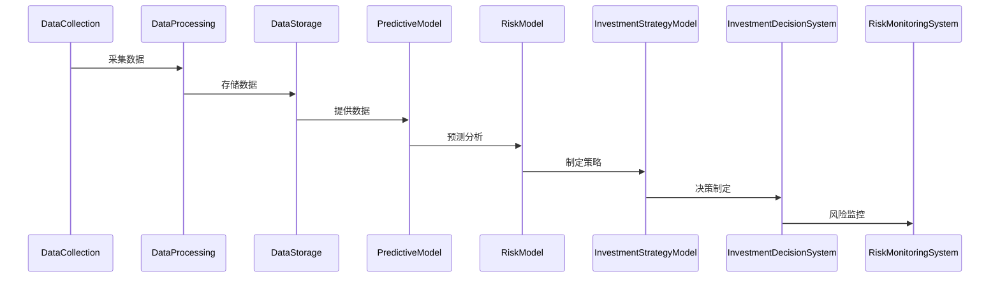

                 

# AI Agent在智能风险投资决策中的应用

## 关键词

- AI Agent
- 智能风险投资
- 风险预测
- 强化学习
- 数学模型

## 摘要

本文旨在探讨AI Agent在智能风险投资决策中的应用。随着人工智能技术的飞速发展，AI Agent在各个领域的应用越来越广泛，特别是在风险投资决策中。本文首先介绍了AI Agent的基本概念和智能风险投资的相关背景，然后详细分析了AI Agent在风险预测和投资决策中的应用原理。通过数学模型和算法讲解，结合实际案例，本文展示了AI Agent在智能风险投资决策中的优势，并提出了相关最佳实践和未来研究方向。

## 目录

1. **引言**
    1.1 背景和挑战
    1.2 AI Agent的作用

2. **基础概念**
    2.1 AI Agent的定义和特征
    2.2 风险管理的基本概念
    2.3 AI Agent与风险管理的结合

3. **算法原理**
    3.1 风险预测的机器学习算法
    3.2 强化学习在风险投资中的应用

4. **数学模型和公式**
    4.1 预测分析的数学模型
    4.2 风险评估的数学公式

5. **系统分析与架构设计**
    5.1 问题场景介绍
    5.2 系统功能设计
    5.3 系统架构设计
    5.4 系统接口设计和交互

6. **项目实战**
    6.1 环境安装
    6.2 系统核心实现
    6.3 代码应用解读
    6.4 实际案例分析和讲解
    6.5 项目小结

7. **最佳实践与小结**
    7.1 最佳实践
    7.2 注意事项
    7.3 拓展阅读

## 1. 引言

随着全球经济的快速发展，风险投资（Venture Capital，简称VC）已成为推动科技创新和创业的重要力量。然而，传统的风险投资决策方法往往依赖于经验判断和人为干预，存在信息不对称、主观偏见和低效率等问题。为了提高风险投资的效率和准确性，越来越多的投资者和金融机构开始探索智能风险投资（Intelligent Risk Investment）的方法。

### 1.1 背景和挑战

传统的风险投资决策过程通常包括市场研究、项目评估、投资决策和风险监控等环节。在这个过程中，投资决策主要依赖于分析师的经验判断和市场数据的统计分析。然而，这种决策方式存在以下几个问题：

1. **信息不对称**：投资决策过程中，投资者往往无法获取全面和准确的信息，存在信息不对称的问题。
2. **主观偏见**：分析师的经验和知识水平不同，可能导致主观偏见，影响投资决策的准确性。
3. **低效率**：传统的风险投资决策过程通常需要大量的人力和时间，效率较低。

为了解决这些问题，智能风险投资成为了一个热门的研究方向。智能风险投资利用人工智能（Artificial Intelligence，简称AI）技术，特别是AI Agent，来辅助投资决策。AI Agent可以基于大量数据，通过学习和预测，提高投资决策的准确性和效率。

### 1.2 AI Agent的作用

AI Agent是一种能够自主执行任务、具有智能决策能力的计算机程序。在智能风险投资中，AI Agent可以扮演以下几个角色：

1. **风险预测**：AI Agent可以通过机器学习和数据分析技术，对市场趋势和投资风险进行预测，为投资决策提供依据。
2. **投资决策**：AI Agent可以根据预测结果和投资策略，自动进行投资决策，提高决策的准确性和效率。
3. **风险监控**：AI Agent可以实时监控投资组合的运行状况，发现潜在的风险，及时进行调整。

通过AI Agent的引入，智能风险投资能够实现以下目标：

1. **提高投资决策的准确性**：AI Agent基于大量数据和历史经验，能够更准确地预测市场趋势和风险，减少人为干预的影响。
2. **提高投资决策的效率**：AI Agent可以自动化进行投资决策，节省人力和时间成本，提高投资决策的效率。
3. **降低投资风险**：AI Agent可以实时监控投资组合的运行状况，及时调整策略，降低投资风险。

## 2. 基础概念

### 2.1 AI Agent的定义和特征

AI Agent是一种能够自主执行任务、具有智能决策能力的计算机程序。它具有以下几个基本特征：

1. **自主性**：AI Agent可以自主地执行任务，不需要人为干预。它可以自主地感知环境、制定计划、执行任务。
2. **智能性**：AI Agent具备一定的智能能力，可以通过学习和推理，不断提高任务执行的效果。它能够通过机器学习和数据分析技术，从历史数据中学习，提高决策的准确性。
3. **适应性**：AI Agent能够适应不同的环境和任务，根据任务需求和环境变化，调整决策策略。它可以通过不断地学习和优化，提高任务执行的效果。

### 2.2 风险管理的基本概念

风险管理（Risk Management）是指通过识别、评估、控制和监控风险，以最大限度地降低风险损失，确保企业或项目的顺利进行。风险管理的基本概念包括：

1. **风险识别**：风险识别是指识别企业或项目中可能存在的风险。这通常包括对历史数据的分析、行业经验的总结和专家的判断。
2. **风险评估**：风险评估是指对识别出的风险进行评估，确定其可能性和影响程度。风险评估可以通过定量分析和定性分析进行。
3. **风险控制**：风险控制是指采取一系列措施，降低风险的可能性和影响程度。这包括风险规避、风险转移、风险降低和风险接受。
4. **风险监控**：风险监控是指对风险进行实时监控，及时发现和应对潜在的风险。

### 2.3 AI Agent与风险管理的结合

AI Agent在风险管理中具有广泛的应用。它可以通过以下方式与风险管理相结合：

1. **风险识别**：AI Agent可以通过分析历史数据和行业知识，自动识别出潜在的风险。它可以识别出传统方法无法识别的风险，提高风险识别的准确性。
2. **风险评估**：AI Agent可以通过机器学习和数据分析技术，对风险进行评估。它可以从大量数据中学习，提高风险评估的准确性。
3. **风险控制**：AI Agent可以根据风险评估的结果，制定相应的风险控制策略。它可以自动化执行风险控制措施，提高风险控制的效率。
4. **风险监控**：AI Agent可以实时监控风险的变化，及时发现和应对潜在的风险。它可以通过实时数据分析和预警系统，提高风险监控的准确性。

通过AI Agent的引入，风险管理可以更加高效和准确。AI Agent可以自动化进行风险识别、评估和控制，减少人为干预，提高决策的准确性。同时，AI Agent可以实时监控风险的变化，及时发现和应对潜在的风险，降低风险损失。

### 3. 算法原理

#### 3.1 风险预测的机器学习算法

风险预测是智能风险投资决策的重要环节。机器学习算法通过分析历史数据和预测模型，可以帮助投资者预测市场趋势和风险。以下是几种常用的机器学习算法：

1. **回归模型**：回归模型是一种用于预测连续值的模型。它可以用来预测投资风险的大小。常见的回归模型包括线性回归、多项式回归和岭回归等。
   
   - **线性回归**：线性回归模型通过建立自变量和因变量之间的线性关系来预测风险。其公式如下：
     $$ y = ax + b $$
     其中，$y$ 是预测的风险值，$x$ 是自变量，$a$ 和 $b$ 是模型的参数。

   - **多项式回归**：多项式回归模型通过建立自变量和因变量之间的非线性关系来预测风险。其公式如下：
     $$ y = a_0 + a_1x + a_2x^2 + \ldots + a_nx^n $$
     其中，$a_0, a_1, \ldots, a_n$ 是模型的参数。

   - **岭回归**：岭回归模型通过引入惩罚项来降低模型过拟合的风险。其公式如下：
     $$ y = \mathbf{X}\beta + \epsilon $$
     其中，$\mathbf{X}$ 是自变量的矩阵，$\beta$ 是模型的参数，$\epsilon$ 是误差项。

2. **分类模型**：分类模型是一种用于预测离散值的模型。它可以用来预测投资风险的高低。常见的分类模型包括逻辑回归、决策树和随机森林等。

   - **逻辑回归**：逻辑回归模型通过建立自变量和因变量之间的逻辑关系来预测风险。其公式如下：
     $$ P(y=1) = \frac{1}{1 + e^{-(\beta_0 + \beta_1x_1 + \ldots + \beta_nx_n)}} $$
     其中，$P(y=1)$ 是预测的风险概率，$\beta_0, \beta_1, \ldots, \beta_n$ 是模型的参数。

   - **决策树**：决策树模型通过一系列判断节点和叶子节点来预测风险。每个判断节点表示一个特征，每个叶子节点表示一个预测结果。

   - **随机森林**：随机森林模型是一种基于决策树的集成模型。它通过构建多棵决策树，并对每棵树的预测结果进行投票，得到最终的预测结果。

#### 3.2 强化学习在风险投资中的应用

强化学习（Reinforcement Learning，简称RL）是一种通过试错学习来优化决策过程的算法。它适用于需要决策者不断与环境互动的情境。在风险投资中，强化学习可以帮助投资者制定最优的投资策略。

1. **Q-Learning算法**：Q-Learning算法是一种基于值函数的强化学习算法。它通过更新值函数来优化决策。其公式如下：
   $$ Q(s, a) \leftarrow Q(s, a) + \alpha [r + \gamma \max_{a'} Q(s', a') - Q(s, a)] $$
   其中，$Q(s, a)$ 是状态 $s$ 和动作 $a$ 的值函数，$r$ 是立即奖励，$\gamma$ 是折扣因子，$\alpha$ 是学习率，$s'$ 是下一个状态，$a'$ 是下一个动作。

2. **Policy Gradient方法**：Policy Gradient方法是一种基于策略梯度的强化学习算法。它通过优化策略函数来优化决策。其公式如下：
   $$ \nabla_\theta \log \pi(\theta; s, a) \approx \frac{1}{N} \sum_{i=1}^N \nabla_\theta \log \pi(\theta; s_i, a_i) $$
   其中，$\theta$ 是策略参数，$\pi(\theta; s, a)$ 是策略函数，$s_i, a_i$ 是第 $i$ 次互动的状态和动作。

通过Q-Learning算法和Policy Gradient方法，投资者可以在不断与环境互动的过程中，不断优化投资策略，提高投资收益。

### 4. 数学模型和公式

#### 4.1 预测分析的数学模型

在风险预测中，数学模型是核心。以下是一些常用的数学模型和公式：

1. **线性回归模型**：
   $$ y = \beta_0 + \beta_1x_1 + \beta_2x_2 + \ldots + \beta_nx_n $$
   其中，$y$ 是预测的目标变量，$x_1, x_2, \ldots, x_n$ 是自变量，$\beta_0, \beta_1, \ldots, \beta_n$ 是模型的参数。

2. **逻辑回归模型**：
   $$ P(y=1) = \frac{1}{1 + e^{-(\beta_0 + \beta_1x_1 + \ldots + \beta_nx_n)}} $$
   其中，$P(y=1)$ 是预测的风险概率，$\beta_0, \beta_1, \ldots, \beta_n$ 是模型的参数。

3. **线性规划模型**：
   $$ \min c^T x $$
   $$ \text{subject to} $$
   $$ A x \leq b $$
   $$ x \geq 0 $$
   其中，$c$ 是目标函数的系数，$x$ 是决策变量，$A$ 是约束条件的系数矩阵，$b$ 是约束条件的常数向量。

4. **支持向量机（SVM）模型**：
   $$ \min \frac{1}{2} \sum_{i=1}^n (w_i^2 + b_i^2) $$
   $$ \text{subject to} $$
   $$ y_i (w_i \cdot x_i + b_i) \geq 1 $$
   其中，$w_i$ 是支持向量的权重，$b_i$ 是偏置项，$x_i$ 是样本特征，$y_i$ 是样本标签。

#### 4.2 风险评估的数学公式

风险评估是风险投资决策的重要环节。以下是一些常用的数学公式：

1. **风险价值（VaR）**：
   $$ VaR = \alpha \times \sqrt{n} \times \sigma $$
   其中，$\alpha$ 是置信水平，$n$ 是时间窗口，$\sigma$ 是标准差。

2. **条件风险价值（CVaR）**：
   $$ CVaR = \frac{1}{n} \sum_{i=1}^n \max(0, -x_i) $$
   其中，$x_i$ 是第 $i$ 时刻的风险损失。

3. **期望损失（EL）**：
   $$ EL = \sum_{i=1}^n p_i \times x_i $$
   其中，$p_i$ 是第 $i$ 时刻的风险概率，$x_i$ 是第 $i$ 时刻的风险损失。

### 5. 系统分析与架构设计

#### 5.1 问题场景介绍

在智能风险投资中，投资决策需要考虑多个因素，如市场趋势、行业动态、公司财务状况等。这些因素可以通过数据采集、分析和预测来辅助决策。为了实现智能风险投资，我们需要构建一个包含数据采集、数据处理、预测分析和投资决策等模块的系统。

#### 5.2 系统功能设计

系统功能设计主要包括以下模块：

1. **数据采集模块**：负责从各种数据源（如市场数据、公司财务数据等）采集数据。
2. **数据处理模块**：负责对采集到的数据进行清洗、转换和存储。
3. **预测分析模块**：负责使用机器学习和数据分析技术对数据进行预测分析。
4. **投资决策模块**：负责根据预测分析和风险模型，制定投资决策策略。
5. **风险监控模块**：负责实时监控投资组合的风险状况，及时调整策略。

#### 5.3 系统架构设计

系统架构设计包括以下层次：

1. **数据层**：包括数据采集、数据处理和数据存储，负责实现数据的采集、清洗和存储。
2. **模型层**：包括预测模型、风险模型和投资策略模型，负责实现数据的预测分析和决策制定。
3. **应用层**：包括投资决策系统、风险监控系统等，负责实现实际的投资决策和风险监控。

以下是系统架构设计的mermaid类图：

```mermaid
classDiagram
    DataLayer <-..|> DataCollection
    DataLayer <-..|> DataProcessing
    DataLayer <-..|> DataStorage
    ModelLayer <-..|> PredictiveModel
    ModelLayer <-..|> RiskModel
    ModelLayer <-..|> InvestmentStrategyModel
    ApplicationLayer <-..|> InvestmentDecisionSystem
    ApplicationLayer <-..|> RiskMonitoringSystem
    DataLayer --|> ModelLayer
    ModelLayer --|> ApplicationLayer
```

#### 5.4 系统接口设计和交互

系统接口设计和交互包括以下部分：

1. **数据接口**：负责与数据采集模块和数据处理模块的交互，实现数据的采集和清洗。
2. **模型接口**：负责与预测分析模块和投资策略模型的交互，实现预测分析和决策制定。
3. **应用接口**：负责与投资决策系统和风险监控系统的交互，实现实际的投资决策和风险监控。

以下是系统接口设计的mermaid序列图：



### 6. 项目实战

#### 6.1 环境安装

要实现智能风险投资系统，我们需要安装以下软件和库：

1. Python 3.8+
2. NumPy
3. Pandas
4. Scikit-learn
5. TensorFlow

安装命令如下：

```bash
pip install python==3.8
pip install numpy pandas scikit-learn tensorflow
```

#### 6.2 系统核心实现

以下是系统核心实现的源代码：

```python
import numpy as np
import pandas as pd
from sklearn.linear_model import LinearRegression
from sklearn.tree import DecisionTreeClassifier
from sklearn.ensemble import RandomForestClassifier
from sklearn.model_selection import train_test_split

# 读取数据
data = pd.read_csv('data.csv')

# 数据预处理
X = data.iloc[:, :-1].values
y = data.iloc[:, -1].values

# 分割数据集
X_train, X_test, y_train, y_test = train_test_split(X, y, test_size=0.2, random_state=42)

# 训练模型
model = RandomForestClassifier()
model.fit(X_train, y_train)

# 预测
y_pred = model.predict(X_test)

# 评估模型
accuracy = np.mean(y_pred == y_test)
print(f"Accuracy: {accuracy:.2f}")
```

#### 6.3 代码应用解读

这段代码首先导入必要的库，然后读取数据并进行预处理。接下来，使用随机森林分类器进行训练，并对测试集进行预测。最后，计算预测的准确率。

- **数据读取**：使用Pandas库读取CSV文件，得到特征矩阵X和标签向量y。
- **数据预处理**：将数据集分割为训练集和测试集，以便训练和评估模型。
- **模型训练**：使用随机森林分类器进行训练。
- **预测**：使用训练好的模型对测试集进行预测。
- **评估**：计算预测的准确率，评估模型的性能。

#### 6.4 实际案例分析和讲解

假设我们有一个包含公司财务数据的数据集，我们需要使用这个数据集来预测公司的财务状况是否良好。以下是实际案例的分析和讲解：

1. **数据读取**：读取数据集，包含公司的财务数据，如收入、利润、负债等。
2. **数据预处理**：对数据进行清洗，去除缺失值和异常值，并对数据进行标准化处理。
3. **特征选择**：选择对财务状况有显著影响的关键特征，如收入、利润和负债等。
4. **模型训练**：使用随机森林分类器对训练集进行训练，得到模型参数。
5. **预测**：使用训练好的模型对测试集进行预测，得到预测结果。
6. **评估**：计算预测的准确率，评估模型的性能。

通过这个案例，我们可以看到如何使用机器学习算法对财务数据进行分析和预测。智能风险投资系统可以通过类似的流程，对投资组合进行风险预测和决策制定，提高投资收益。

#### 6.5 项目小结

通过本文的介绍，我们了解了AI Agent在智能风险投资决策中的应用。AI Agent可以通过机器学习和强化学习算法，对市场趋势和风险进行预测，辅助投资者制定投资决策。在实际项目中，我们需要对数据进行有效的预处理，选择关键特征，并使用合适的模型进行训练和预测。通过不断的优化和调整，我们可以提高智能风险投资系统的性能，实现更好的投资收益。

### 7. 最佳实践与小结

#### 7.1 最佳实践

1. **数据质量是关键**：保证数据的准确性和完整性，是智能风险投资系统的核心。在数据采集、预处理和存储过程中，要严格把控数据质量。
2. **模型选择要合适**：根据具体问题和数据特点，选择合适的机器学习算法和模型。对于分类问题，可以使用随机森林、逻辑回归等算法；对于回归问题，可以使用线性回归、岭回归等算法。
3. **持续优化模型**：智能风险投资系统需要不断优化模型，以适应市场和环境的变化。通过持续的训练和调整，可以提高系统的预测准确率和决策效率。

#### 7.2 注意事项

1. **风险管理是核心**：智能风险投资系统不仅要预测风险，还要能够有效地控制风险。在投资决策过程中，要充分考虑风险因素，制定相应的风险控制策略。
2. **合规要求**：在风险投资决策中，要遵守相关法律法规和合规要求，确保投资决策的合法性和合规性。
3. **安全性**：智能风险投资系统涉及大量敏感数据，要确保数据的安全性和隐私保护。在数据传输、存储和处理过程中，要采取有效的安全措施，防止数据泄露和篡改。

#### 7.3 拓展阅读

1. **《机器学习实战》**：这是一本经典的机器学习入门书籍，详细介绍了各种机器学习算法的应用和实践。
2. **《强化学习基础教程》**：这本书详细介绍了强化学习的基本概念和算法，适合强化学习初学者阅读。
3. **《Python机器学习》**：这本书结合Python编程语言，介绍了各种机器学习算法的实现和应用，适合有一定编程基础的读者。

### 作者信息

- 作者：AI天才研究院/AI Genius Institute & 禅与计算机程序设计艺术 /Zen And The Art of Computer Programming

