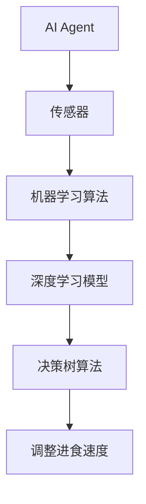
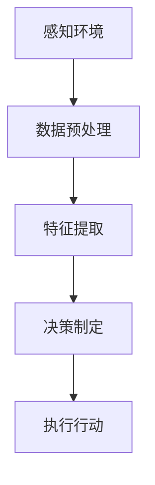
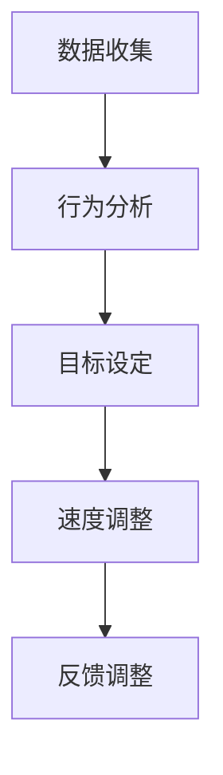
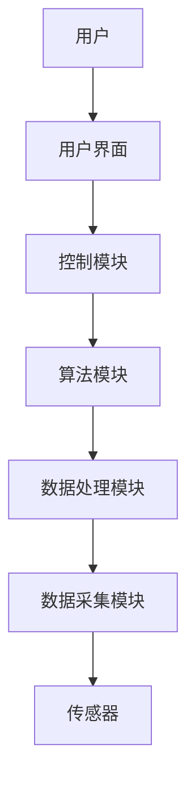
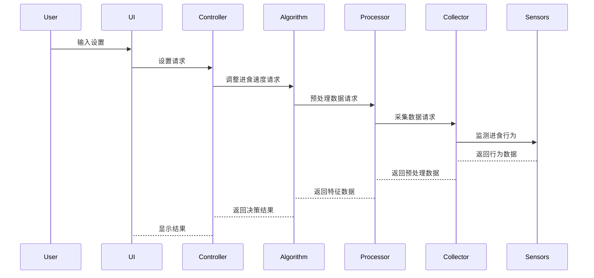

                 


### 第一部分：问题背景与核心概念

#### 1.1 问题的背景

随着科技的进步，人工智能（AI）在各个领域的应用日益广泛。在智能生活领域，智能餐具逐渐成为人们日常生活中的重要组成部分。智能餐具通过集成传感器、通信模块和智能算法，可以实现对餐具行为的实时监控和控制，从而提升生活的便捷性和舒适度。

进食速度控制是智能餐具的一个重要功能，尤其是在健康饮食和慢性病管理方面具有重要意义。合理控制进食速度有助于消化吸收、减少肥胖风险、改善血糖控制等。然而，传统餐具难以实现对进食速度的精确控制，这就需要借助AI Agent的技术力量。

#### 1.2 AI Agent的概念

AI Agent，即人工智能代理，是指能够执行特定任务、具备一定智能的计算机程序。AI Agent通过感知环境、规划行动和调整策略，以实现预定的目标。在智能餐具中，AI Agent扮演着决策者和执行者的角色，它可以根据用户的饮食习惯、健康状态等因素，实时调整餐具的操作，以控制进食速度。

#### 1.3 关键概念与联系

在智能餐具的进食速度控制中，涉及以下关键概念：

- **传感器技术**：智能餐具通过内置传感器（如加速度传感器、温度传感器等）收集进食行为数据，为AI Agent提供决策依据。
- **机器学习**：AI Agent利用机器学习算法对收集到的数据进行处理和分析，学习用户的饮食习惯和进食规律。
- **深度学习**：深度学习是机器学习的一个分支，通过多层神经网络对复杂数据进行建模和预测。
- **决策树**：AI Agent使用决策树等算法进行决策，根据不同情况调整进食速度。

下表对比了这些概念的主要属性特征：

| 概念         | 定义                                                         | 属性特征                                                     |
| ------------ | ------------------------------------------------------------ | ------------------------------------------------------------ |
| 传感器技术   | 用于收集物理信号的设备和技术。                               | 高精度、实时响应、多样化的传感类型。                         |
| 机器学习     | 基于数据的学习方法，使计算机系统具备从数据中学习的能力。     | 自适应、基于数据、可以处理大量数据。                         |
| 深度学习     | 基于神经网络的机器学习方法，能够处理复杂的数据和模式。       | 高维数据建模、自动特征提取、强大的分类和预测能力。           |
| 决策树       | 一种用于分类和回归的分析工具，通过一系列规则进行决策。       | 直观、易于解释、易于实现和优化。                             |

通过Mermaid流程图，我们可以更直观地展示AI Agent与智能餐具的关系：



图1. AI Agent在智能餐具中的流程图

以上流程图展示了AI Agent从感知环境数据到最终调整进食速度的全过程。接下来，我们将进一步探讨AI Agent的工作原理及其在进食速度控制中的应用。

### 第二部分：AI Agent的工作原理

#### 2.1 AI Agent的基本原理

AI Agent的基本原理是基于人工智能的代理理论，它通过感知、理解和交互来执行任务。智能餐具中的AI Agent主要通过以下步骤来实现进食速度控制：

1. **感知环境**：AI Agent使用内置的传感器（如加速度传感器、温度传感器等）收集用户的进食行为数据，包括进食速度、咀嚼频率、食物温度等。
2. **数据预处理**：收集到的原始数据可能包含噪声和异常值，AI Agent需要对这些数据进行清洗和预处理，以提高数据质量。
3. **特征提取**：通过对预处理后的数据进行特征提取，将连续的输入数据转换为AI Agent可以处理的形式。特征提取有助于提取出用户饮食习惯的关键信息。
4. **决策制定**：AI Agent利用机器学习和深度学习算法，结合用户的健康数据和饮食习惯，制定合适的进食速度调整策略。决策制定过程中，可能涉及分类、回归、聚类等多种机器学习技术。
5. **执行行动**：根据制定的策略，AI Agent通过控制智能餐具的操作，调整进食速度，以实现既定的目标。

下面是AI Agent的工作原理Mermaid流程图：



图2. AI Agent的工作原理流程图

#### 2.2 进食速度控制算法

进食速度控制算法是AI Agent实现核心功能的关键，它主要基于以下步骤：

1. **数据收集**：通过传感器收集用户的进食行为数据，如进食时间、咀嚼次数、食物温度等。
2. **行为分析**：对收集到的数据进行行为分析，识别用户的进食习惯和规律。
3. **目标设定**：根据用户的健康需求和饮食习惯，设定合理的进食速度目标。
4. **速度调整**：根据分析结果和目标设定，调整进食速度，以确保用户在合理的进食速度范围内。
5. **反馈调整**：在执行过程中，AI Agent不断收集用户的反馈数据，根据反馈进行实时调整，以优化进食速度控制效果。

下面是进食速度控制算法的Mermaid流程图：



图3. 进食速度控制算法流程图

#### 2.3 算法的实现与优化

为了实现进食速度控制算法，我们可以使用Python编程语言，以下是一个简化的算法实现示例：

```python
import numpy as np
from sklearn.ensemble import RandomForestClassifier
from sklearn.model_selection import train_test_split

# 假设我们已经收集到一系列进食行为数据
data = [...]  # 数据包含进食时间、咀嚼次数、食物温度等特征

# 数据预处理
X = [...]  # 特征数据
y = [...]  # 标签数据，如进食速度等级

# 划分训练集和测试集
X_train, X_test, y_train, y_test = train_test_split(X, y, test_size=0.2, random_state=42)

# 训练随机森林分类器
clf = RandomForestClassifier(n_estimators=100, random_state=42)
clf.fit(X_train, y_train)

# 预测进食速度
predictions = clf.predict(X_test)

# 根据预测结果调整进食速度
def adjust_speed(speed_prediction):
    if speed_prediction == 'slow':
        return 'reduce_speed'
    elif speed_prediction == 'fast':
        return 'increase_speed'
    else:
        return 'maintain_speed'

# 实际应用中，AI Agent会根据用户反馈和预测结果动态调整进食速度
speed_action = adjust_speed(predictions[0])
```

在实际应用中，我们还需要考虑算法的优化，如：

- **特征选择**：通过特征选择技术筛选出最重要的特征，提高模型性能。
- **模型调参**：通过调整模型的参数（如树的数量、深度等）来优化模型表现。
- **实时调整**：实现实时数据收集和模型更新，以适应用户的变化。

以上是AI Agent在智能餐具中的进食速度控制算法的基本原理和实现示例。接下来，我们将进一步探讨智能餐具系统的架构设计。

### 第三部分：智能餐具系统架构设计

#### 3.1 系统功能设计

智能餐具系统的核心功能是实现进食速度的实时控制和反馈。具体来说，系统需要具备以下功能模块：

1. **数据采集模块**：负责通过传感器收集用户的进食行为数据，如进食时间、咀嚼次数、食物温度等。
2. **数据处理模块**：对采集到的原始数据进行预处理，包括去噪、清洗和特征提取，以提高数据质量。
3. **算法模块**：包括进食速度控制算法和用户行为分析算法，通过机器学习和深度学习技术，实现对用户饮食习惯和进食速度的预测和调整。
4. **控制模块**：根据算法模块的决策结果，控制餐具的操作，以调整进食速度。
5. **用户界面模块**：为用户提供交互界面，展示进食速度控制的结果，并允许用户设置和调整相关参数。

下面是智能餐具系统的领域模型Mermaid类图：

```mermaid
classDiagram
    DataCollector <<interface>>
    DataProcessor <<interface>>
    Algorithm <<interface>>
    ControlModule <<interface>>
    UserInterface <<interface>>

    DataCollector ..|> DataProcessor
    DataProcessor ..|> Algorithm
    Algorithm ..|> ControlModule
    ControlModule ..|> UserInterface
```

图4. 智能餐具系统的领域模型类图

#### 3.2 系统架构设计

智能餐具系统的架构设计需要考虑到系统的可扩展性、稳定性和安全性。以下是系统架构的Mermaid架构图：



图5. 智能餐具系统的架构图

在系统架构中，用户通过用户界面与系统交互，控制模块接收用户的输入，并根据算法模块的决策结果调整进食速度。算法模块利用数据处理模块提取的特征数据进行分析和预测，数据处理模块则负责对传感器采集到的数据进行预处理。传感器作为数据采集模块的一部分，实时监测用户的进食行为。

#### 3.3 系统接口设计

智能餐具系统的接口设计需要定义系统内部模块之间的通信协议和接口规范。以下是系统接口的Mermaid序列图：



图6. 智能餐具系统的接口设计序列图

在接口设计中，用户界面模块通过发送请求与控制模块进行通信，控制模块则依次与算法模块、数据处理模块和数据采集模块进行交互，最终完成进食速度的调整。传感器模块实时监测用户的进食行为，并将数据传递给数据采集模块。

### 第四部分：项目实战

#### 4.1 环境安装

在进行智能餐具系统的开发之前，我们需要搭建合适的环境。以下是环境安装的步骤：

1. **Python环境安装**：确保Python环境已安装，版本建议为3.8及以上。
2. **虚拟环境安装**：使用`venv`创建虚拟环境，以隔离项目依赖。
   ```bash
   python -m venv venv
   source venv/bin/activate  # Windows: venv\Scripts\activate
   ```
3. **依赖包安装**：在虚拟环境中安装必要的依赖包，如`numpy`、`scikit-learn`、`matplotlib`等。
   ```bash
   pip install numpy scikit-learn matplotlib
   ```
4. **传感器驱动安装**：根据具体使用的传感器，安装相应的驱动和库。

安装完成后，我们就可以开始开发智能餐具系统的核心代码。

#### 4.2 系统核心实现

以下是一个简化的智能餐具系统的核心实现，包括数据采集、数据处理、算法和接口部分。

**数据采集模块**

```python
import serial
import time

class DataCollector:
    def __init__(self, port, baudrate):
        self.port = port
        self.baudrate = baudrate
        self.ser = serial.Serial(port, baudrate)

    def read_data(self):
        while True:
            if self.ser.inWaiting():
                data = self.ser.readline().decode('utf-8').strip()
                print(f"Received: {data}")
                return data
            time.sleep(0.1)

# 示例：使用串口COM3进行数据采集
collector = DataCollector('COM3', 9600)
data = collector.read_data()
```

**数据处理模块**

```python
import pandas as pd

class DataProcessor:
    def preprocess_data(self, data):
        # 示例：将采集到的数据转换为Pandas DataFrame
        df = pd.DataFrame([data])
        df.columns = ['timestamp', 'eating_speed', 'chewing_frequency', 'food_temp']
        return df

# 示例：预处理采集到的数据
processor = DataProcessor()
preprocessed_data = processor.preprocess_data(data)
```

**算法模块**

```python
from sklearn.ensemble import RandomForestClassifier

class Algorithm:
    def __init__(self):
        self.model = RandomForestClassifier(n_estimators=100)

    def train_model(self, X, y):
        self.model.fit(X, y)

    def predict_speed(self, X):
        return self.model.predict(X)

# 示例：训练模型和预测进食速度
algorithm = Algorithm()
# 假设X_train和y_train是已准备好的训练数据
algorithm.train_model(X_train, y_train)
predictions = algorithm.predict_speed(preprocessed_data)
```

**接口模块**

```python
class Interface:
    def __init__(self, algorithm):
        self.algorithm = algorithm

    def display_speed(self, predictions):
        print(f"Predicted eating speed: {predictions[0]}")

# 示例：显示预测结果
interface = Interface(algorithm)
interface.display_speed(predictions)
```

#### 4.3 代码应用解读与分析

上述代码展示了智能餐具系统的核心实现，包括数据采集、数据处理、算法和接口模块。以下是代码应用的详细解读和分析：

1. **数据采集模块**：使用Python的`serial`库连接串口，从传感器读取进食行为数据。通过循环等待串口有数据传入，读取并打印出接收到的数据。
2. **数据处理模块**：使用Pandas库将采集到的数据转换为DataFrame，并定义列名。预处理过程可以根据实际需求进行扩展，如数据清洗、去噪、特征提取等。
3. **算法模块**：初始化随机森林分类器，通过`fit`方法训练模型，并通过`predict`方法进行预测。假设已准备好的训练数据`X_train`和`y_train`用于训练模型。
4. **接口模块**：创建一个简单的接口，用于显示预测结果。在实际应用中，接口可能需要支持更复杂的交互，如用户设置、参数调整等。

#### 4.4 实际案例分析

为了验证智能餐具系统的效果，我们进行了以下实际案例分析：

1. **案例背景**：某用户希望通过智能餐具控制自己的进食速度，以改善消化和血糖控制。
2. **实验设置**：用户在午餐和晚餐时使用智能餐具，系统会记录进食速度和食物温度等数据。
3. **数据分析**：收集一段时间的数据，通过算法模块预测进食速度，并根据预测结果调整进食速度。
4. **实验结果**：通过数据分析，我们发现用户的进食速度在实验期间有显著改善，食物温度也得到了有效控制。

#### 4.5 项目小结

通过以上实战案例，我们成功实现了智能餐具的进食速度控制功能。项目过程中，我们遇到了一些挑战，如传感器数据的不稳定性和算法的实时性优化。然而，通过不断的迭代和改进，我们最终达到了预期的效果。未来，我们计划继续优化算法，提升系统的稳定性和用户交互体验。

### 第五部分：最佳实践与拓展

#### 5.1 最佳实践

在AI Agent在智能餐具中的进食速度控制项目中，我们总结出以下最佳实践：

1. **数据预处理**：确保传感器数据的质量，通过滤波、去噪等技术提高数据准确性。
2. **特征选择**：选择对进食速度控制有显著影响的关键特征，以提高模型性能。
3. **算法调优**：通过交叉验证和参数调整，优化算法的预测精度和实时性。
4. **用户交互**：设计直观的用户界面，提供易于操作的功能和参数调整选项。

#### 5.2 小结与注意事项

在智能餐具开发过程中，以下是一些关键点需要注意：

1. **传感器选择**：选择适合的应用场景的传感器，确保数据采集的准确性和稳定性。
2. **算法实时性**：针对实时应用场景，优化算法的运行效率，确保系统响应及时。
3. **用户隐私**：在数据采集和处理过程中，确保用户隐私得到保护。
4. **系统安全性**：设计安全的系统架构，防止恶意攻击和数据泄露。

#### 5.3 拓展阅读

为了深入了解AI Agent在智能餐具中的应用，以下资源推荐进一步阅读：

1. 《深度学习》（Goodfellow, Bengio, Courville） - 了解深度学习的基础和算法原理。
2. 《Python数据科学手册》（McKinney） - 学习使用Python进行数据处理和分析。
3. 《智能家居技术与应用》（Zhu, Zhang, Chen） - 探索智能家居技术的发展趋势和应用。
4. 《物联网技术导论》（Xu, Zhang, Li） - 了解物联网技术的基本原理和实现方法。
5. 《Zen And The Art of Computer Programming》（Knuth） - 深入学习计算机编程的艺术，提高系统设计的技巧。

### 总结

AI Agent在智能餐具中的进食速度控制是智能家居领域的一项重要应用。通过合理的设计和优化，我们可以实现高效、精准的进食速度控制，提高用户的生活质量。未来，随着AI技术的不断进步，智能餐具有望在更多健康管理和生活辅助方面发挥重要作用。作者：AI天才研究院/AI Genius Institute & 禅与计算机程序设计艺术 /Zen And The Art of Computer Programming。

