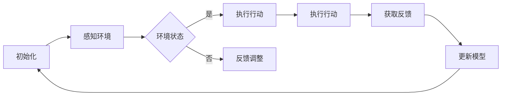
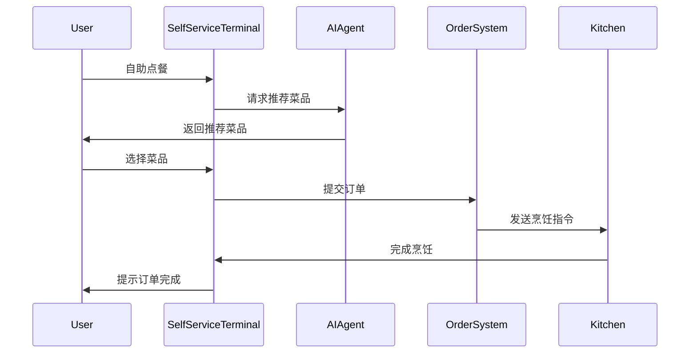

                 

### 第一部分：AI Agent概述

## 第1章：AI Agent基本概念

### 1.1 问题背景

随着人工智能技术的飞速发展，AI Agent（人工智能代理）作为人工智能领域的重要研究方向，逐渐引起了广泛关注。在餐饮行业，AI Agent的应用为智能餐饮管理带来了革命性的变化。目前，AI Agent在餐饮行业的应用主要体现在以下几个方面：

1. **餐饮服务自动化**：通过AI Agent，可以实现点餐、送餐等服务的自动化，提高服务质量，降低人力成本。
2. **个性化推荐**：利用AI Agent进行用户行为分析，可以精准推荐菜品，提升用户满意度和消费体验。
3. **供应链管理**：AI Agent在库存管理、采购计划制定等方面发挥作用，实现供应链的智能化和高效化。
4. **智能营销**：通过AI Agent分析用户数据，开展个性化营销活动，提高营销效果。

本文将围绕AI Agent在智能餐饮管理中的实践，详细探讨其基本概念、应用场景、算法原理以及项目实战，旨在为读者提供一个全面深入的了解。

### 1.2 基本概念与原理

#### AI Agent的定义

AI Agent，即人工智能代理，是指一种能够自主感知环境、决策行动并与其他实体交互的智能系统。它模仿人类的智能行为，通过学习和适应环境，实现特定任务的自动化和优化。

#### AI Agent的基本原理

AI Agent的基本原理主要基于以下几个核心组成部分：

1. **感知系统**：感知系统负责接收外部环境的信息，如图像、声音、文本等，并将其转化为内部数据。

2. **决策系统**：决策系统根据感知系统收集到的信息，结合预先设定的目标和规则，进行推理和决策，制定行动方案。

3. **行动系统**：行动系统负责执行决策系统生成的行动方案，实现对环境的实际干预。

4. **学习系统**：学习系统通过不断收集和分析反馈信息，优化感知、决策和行动能力，提高智能水平。

#### AI Agent的关键特性

AI Agent具有以下几个关键特性：

1. **自主性**：AI Agent能够自主地感知环境、制定决策和执行行动，不需要人工干预。

2. **适应性**：AI Agent能够根据环境变化和学习反馈，不断调整和优化自身行为，提高应对复杂问题的能力。

3. **协同性**：AI Agent能够与其他AI Agent或人类协同工作，共同完成复杂任务。

4. **智能性**：AI Agent具备一定的智能水平，能够进行复杂的推理、决策和学习。

### 1.3 AI Agent的架构与组成部分

#### AI Agent的架构设计

AI Agent的架构设计通常包括以下几个核心模块：

1. **感知模块**：负责接收外部环境的信息，如传感器数据、用户输入等。

2. **决策模块**：基于感知模块收集到的信息，进行推理和决策，生成行动方案。

3. **执行模块**：负责执行决策模块生成的行动方案，实现对外部环境的干预。

4. **学习模块**：通过不断收集和分析反馈信息，优化感知、决策和执行能力。

5. **通信模块**：负责与其他AI Agent或人类进行信息交换和协同工作。

#### AI Agent的关键组成部分

AI Agent的关键组成部分主要包括：

1. **感知器**：用于接收和感知外部环境的信息。

2. **控制器**：负责对感知器收集到的信息进行加工和处理，生成决策。

3. **执行器**：负责执行决策模块生成的行动方案，实现对环境的实际干预。

4. **记忆器**：用于存储AI Agent的经验和知识，以便于后续的决策和学习。

5. **学习器**：负责从环境反馈中学习，不断优化感知、决策和执行能力。

### 1.4 AI Agent的类型与应用场景

#### AI Agent的类型

AI Agent根据其功能和应用场景可以分为以下几类：

1. **桌面型AI Agent**：主要应用于个人计算机或移动设备，如语音助手、智能聊天机器人等。

2. **移动型AI Agent**：主要应用于移动设备，如智能导航、智能配送机器人等。

3. **网络型AI Agent**：主要应用于网络环境，如智能客服、智能推荐系统等。

4. **嵌入式AI Agent**：主要应用于嵌入式系统，如智能家居、智能医疗设备等。

#### AI Agent在不同餐饮管理场景中的应用

1. **餐饮服务自动化**：桌面型AI Agent可以在餐厅点餐环节发挥作用，通过语音识别、图像识别等技术，实现自助点餐和送餐服务。

2. **个性化推荐**：网络型AI Agent可以分析用户历史行为和偏好，为用户提供个性化的菜品推荐，提高用户满意度和消费体验。

3. **供应链管理**：嵌入式AI Agent可以应用于供应链管理，通过传感器和数据收集，实时监测库存情况，优化采购计划，降低库存成本。

4. **智能营销**：网络型AI Agent可以分析用户数据，为餐饮企业提供精准的营销策略，提高营销效果。

总结：

AI Agent作为一种具有自主性、适应性、协同性和智能性的智能系统，在餐饮管理中具有广泛的应用前景。通过对其基本概念、架构设计、算法原理和实际应用的深入探讨，我们可以更好地理解和利用AI Agent，推动智能餐饮管理的发展。

## 第2章：AI Agent在智能餐饮管理中的应用

### 2.1 智能餐饮管理概述

#### 智能餐饮管理的概念

智能餐饮管理是指利用先进的人工智能技术，对餐饮行业的各个环节进行智能化管理，以提高运营效率、提升用户体验和实现精准营销。智能餐饮管理不仅包括餐饮服务自动化，还涵盖了供应链管理、库存管理、食品安全监控、客户关系管理等多个方面。

#### 智能餐饮管理的目标

智能餐饮管理的目标是实现以下几个方面的优化：

1. **提高运营效率**：通过自动化和智能化手段，减少人工操作，降低运营成本，提高服务速度和质量。

2. **提升用户体验**：利用人工智能技术分析用户行为和偏好，提供个性化的服务，提升用户满意度和忠诚度。

3. **实现精准营销**：通过数据分析和挖掘，制定精准的营销策略，提高营销效果，增加营业收入。

4. **保障食品安全**：利用智能监控系统，实时监控食品安全，确保消费者健康安全。

### 2.2 AI Agent在餐饮服务中的应用

#### 餐饮服务的自动化

AI Agent在餐饮服务中的应用主要体现在以下几个方面：

1. **自助点餐**：通过桌面型AI Agent，用户可以在餐厅的智能终端设备上自助点餐，提高了点餐效率，减少了排队等待时间。

2. **语音点餐**：利用语音识别技术，用户可以通过语音指令完成点餐，提高了点餐的便捷性和体验。

3. **智能送餐**：通过移动型AI Agent，实现送餐服务的自动化，提高了送餐速度和准确性，降低了人工成本。

#### 餐桌服务AI Agent的应用

餐桌服务AI Agent在餐厅运营中发挥着重要作用，具体包括：

1. **智能推荐**：通过分析用户的历史订单和偏好，AI Agent可以推荐适合用户的菜品，提高点餐的精准度。

2. **订单处理**：AI Agent可以自动接收和处理用户的订单，减少人为错误，提高订单处理速度。

3. **客户服务**：AI Agent可以提供24小时不间断的客户服务，解答用户的疑问，提供个性化的建议，提升客户满意度。

### 2.3 AI Agent在餐饮营销中的应用

#### 餐饮营销的智能化

AI Agent在餐饮营销中的应用，主要是通过数据分析与挖掘，实现以下目标：

1. **用户画像**：通过收集和分析用户数据，AI Agent可以建立详细的用户画像，了解用户的行为和偏好。

2. **个性化推荐**：基于用户画像，AI Agent可以推荐个性化的菜品和营销活动，提高用户的参与度和转化率。

3. **精准营销**：通过数据分析和挖掘，AI Agent可以制定精准的营销策略，提高营销效果，降低营销成本。

#### AI Agent在个性化推荐和促销中的应用

1. **个性化推荐**：AI Agent可以根据用户的订单历史、浏览记录和评价等信息，推荐符合用户口味的菜品，提高用户的点餐满意度和回头率。

2. **智能促销**：AI Agent可以根据用户画像和消费行为，设计个性化的促销活动，如优惠券、会员专享活动等，吸引更多用户参与。

3. **实时营销**：通过实时分析用户数据，AI Agent可以及时调整营销策略，优化用户体验，提高营销效果。

### 2.4 AI Agent在供应链管理中的应用

#### 供应链管理的自动化

AI Agent在供应链管理中的应用，主要体现在以下几个方面：

1. **库存管理**：通过传感器和数据分析，AI Agent可以实时监控库存情况，自动生成补货计划，降低库存成本。

2. **采购计划**：AI Agent可以根据市场需求和库存情况，自动生成采购计划，优化采购流程，降低采购成本。

3. **供应链优化**：AI Agent可以分析供应链各环节的数据，优化供应链布局，提高供应链效率。

#### AI Agent在库存管理和供应链优化中的应用

1. **智能库存管理**：AI Agent可以通过数据分析，预测未来的库存需求，提前进行库存调整，避免库存过剩或缺货现象。

2. **智能采购计划**：AI Agent可以根据市场需求和库存情况，自动生成最优的采购计划，确保供应链的稳定和高效。

3. **供应链协同**：AI Agent可以与其他环节的AI Agent协同工作，实现供应链的全面智能化，提高供应链的整体效率。

总结：

AI Agent在智能餐饮管理中的应用，极大地提升了餐饮服务的自动化水平，优化了供应链管理，实现了精准营销，为餐饮行业带来了显著的效益。通过进一步深入研究和应用AI Agent，我们可以期待智能餐饮管理的更加智能化和高效化。

## 第3章：AI Agent的算法与实现

### 3.1 AI Agent算法概述

#### 常见的AI Agent算法

AI Agent算法是AI Agent实现智能行为的关键。常见的AI Agent算法包括：

1. **基于规则的算法**：通过预设一系列规则，实现AI Agent的决策和行动。优点是规则明确，易于理解和实现，但缺点是规则难以覆盖所有情况，容易导致决策错误。

2. **基于模型的算法**：通过建立环境模型，利用模型进行决策。优点是能够适应复杂环境，但缺点是模型建立和优化过程较为复杂。

3. **强化学习算法**：通过试错和反馈，不断优化决策和行动。优点是能够适应动态环境，但缺点是训练过程较长，且对反馈数据有较高要求。

4. **混合算法**：结合不同算法的优点，实现更加灵活和高效的决策。如将基于规则和强化学习相结合，在保证规则明确的同时，增强环境的适应性。

#### AI Agent算法的选择标准

选择合适的AI Agent算法，需要考虑以下几个标准：

1. **任务需求**：根据具体任务需求，选择适合的算法。例如，对于需要快速响应的任务，可以选择基于规则的算法；对于需要长期学习和适应的任务，可以选择强化学习算法。

2. **环境特性**：考虑环境的状态空间和行动空间，选择能够适应环境特性的算法。例如，对于不确定性较高的环境，可以选择强化学习算法。

3. **计算资源**：根据可用的计算资源，选择计算复杂度合适的算法。例如，对于资源受限的嵌入式设备，可以选择简化版的算法。

4. **应用场景**：根据具体应用场景，选择最适合的算法。例如，在餐饮服务领域，可以选择基于规则的算法，快速实现服务自动化。

### 3.2 具体算法原理讲解

#### 算法Mermaid流程图

为了更好地理解AI Agent算法的原理，我们可以使用Mermaid流程图来展示算法的基本流程。以下是一个简单的示例：



在这个流程图中，AI Agent首先初始化，然后感知环境状态，根据状态执行行动，获取反馈，并更新模型。这个过程不断循环，使得AI Agent能够不断学习和适应环境。

#### Python源代码与算法实现

为了进一步理解算法的实现过程，我们可以使用Python编写一个简单的AI Agent算法示例。以下是一个基于强化学习的简单示例：

```python
import numpy as np
import random

# 定义环境
class Environment:
    def __init__(self):
        self.state = 0

    def perceive(self):
        return self.state

    def take_action(self, action):
        if action == 0:
            self.state = random.randint(0, 1)
        else:
            self.state = 1 - self.state

# 定义AI Agent
class AI-Agent:
    def __init__(self):
        self.model = np.random.rand(1)

    def perceive(self, environment):
        return environment.perceive()

    def take_action(self, environment):
        state = self.perceive(environment)
        action = np.argmax(self.model)
        environment.take_action(action)
        return action

    def learn(self, reward, next_state):
        self.model = np.append(self.model, reward)
        if len(self.model) > 100:
            self.model = self.model[1:]

# 初始化环境
env = Environment()

# 初始化AI Agent
agent = AI-Agent()

# 运行AI Agent
for i in range(100):
    action = agent.take_action(env)
    next_state = env.perceive()
    agent.learn(next_state, action)
    print(f"Step {i}: Action {action}, State {next_state}")
```

在这个示例中，我们定义了一个简单的环境和一个基于强化学习的AI Agent。AI Agent通过感知环境状态，选择最佳行动，并利用反馈进行学习，不断优化其行动策略。

#### 算法原理与数学模型

为了深入理解AI Agent算法的原理，我们需要了解其背后的数学模型。以下是一个简单的强化学习算法的数学模型：

1. **状态-动作价值函数**：表示在某个状态下，执行某个动作的预期回报。用Q(s, a)表示。

2. **策略**：表示在给定状态下，选择哪个动作的策略。用π(a|s)表示。

3. **回报函数**：表示执行某个动作后获得的即时回报。用R(s, a)表示。

4. **状态转移概率**：表示在当前状态下，执行某个动作后，转移到下一个状态的概率。用P(s', s|s, a)表示。

5. **学习率**：表示在每次更新时，模型参数更新的程度。用α表示。

6. **折扣因子**：表示未来回报的现值。用γ表示。

强化学习算法的目标是最大化总回报，即：

$$
J = \sum_{s,a} \pi(a|s) \cdot Q(s, a)
$$

更新状态-动作价值函数的公式为：

$$
Q(s, a) = Q(s, a) + \alpha [R(s, a) + \gamma \max_{a'} Q(s', a') - Q(s, a)]
$$

这个公式表示在当前状态下，执行某个动作后，根据获得的回报和未来期望回报，更新状态-动作价值函数。

#### 举例说明

假设我们有一个简单的环境，其中有两个状态（0和1）和两个动作（A和B）。初始时，状态-动作价值函数为：

$$
Q(0, A) = 0.5, Q(0, B) = 0.5
$$
$$
Q(1, A) = 0.5, Q(1, B) = 0.5
$$

假设每次执行动作A的回报为1，执行动作B的回报为-1。我们选择学习率为0.1，折扣因子为0.9。

初始状态为0，选择动作A，获得回报1。根据更新公式，我们可以更新状态-动作价值函数：

$$
Q(0, A) = 0.5 + 0.1 [1 + 0.9 \cdot \max(0.5, 0.5) - 0.5] = 0.6
$$

$$
Q(0, B) = 0.5 + 0.1 [-1 + 0.9 \cdot \max(0.5, 0.5) - 0.5] = 0.4
$$

更新后的状态-动作价值函数为：

$$
Q(0, A) = 0.6, Q(0, B) = 0.4
$$

接着，我们更新状态为1，选择动作A，获得回报-1。同样，根据更新公式，我们可以更新状态-动作价值函数：

$$
Q(1, A) = 0.5 + 0.1 [-1 + 0.9 \cdot \max(0.6, 0.4) - 0.5] = 0.45
$$

$$
Q(1, B) = 0.5 + 0.1 [1 + 0.9 \cdot \max(0.6, 0.4) - 0.5] = 0.55
$$

更新后的状态-动作价值函数为：

$$
Q(1, A) = 0.45, Q(1, B) = 0.55
$$

通过不断迭代这个过程，AI Agent将逐渐学会在各个状态下选择最优动作，实现智能决策。

总结：

本章介绍了AI Agent算法的基本原理和具体实现。通过Mermaid流程图和Python源代码，我们详细讲解了算法的实现过程。同时，通过数学模型和举例说明，我们深入理解了强化学习算法的核心机制。这些知识将为我们后续的智能餐饮管理系统设计提供坚实的基础。

### 3.3 算法原理与数学模型

#### 数学模型的阐述

为了更深入地理解AI Agent算法的原理，我们需要从数学模型的角度来剖析其核心机制。AI Agent算法主要依赖于状态-动作价值函数（Q值）来指导其行动。状态-动作价值函数表示在特定状态下，执行特定动作所能获得的预期回报。

状态-动作价值函数的数学模型通常由以下几个关键组成部分构成：

1. **状态空间（S）**：状态空间表示所有可能的状态集合，如餐厅的客流量、当前菜品库存等。

2. **动作空间（A）**：动作空间表示所有可能的行为集合，如点餐、送餐、推荐菜品等。

3. **回报函数（R）**：回报函数用于衡量特定动作在特定状态下所带来的即时奖励或惩罚。

4. **状态转移概率（P）**：状态转移概率用于描述在特定状态下执行特定动作后，系统转移到另一个状态的概率。

5. **策略（π）**：策略表示在特定状态下，选择哪个动作的策略，通常通过最大化期望回报来选择。

状态-动作价值函数（Q值）的定义如下：

$$
Q(s, a) = \sum_{s'} p(s'|s, a) \cdot [R(s, a) + \gamma \cdot \max_{a'} Q(s', a')]
$$

其中：
- \( Q(s, a) \) 是在状态 \( s \) 下执行动作 \( a \) 的状态-动作价值函数。
- \( p(s'|s, a) \) 是在状态 \( s \) 下执行动作 \( a \) 后转移到状态 \( s' \) 的概率。
- \( R(s, a) \) 是在状态 \( s \) 下执行动作 \( a \) 所获得的即时回报。
- \( \gamma \) 是折扣因子，用于衡量未来回报的现值。
- \( \max_{a'} Q(s', a') \) 是在状态 \( s' \) 下选择能够最大化未来期望回报的动作。

#### 算法公式的详细讲解

在强化学习框架下，AI Agent通过不断更新状态-动作价值函数，优化其决策过程。状态-动作价值函数的更新公式如下：

$$
Q(s, a) = Q(s, a) + \alpha [R(s, a) + \gamma \cdot \max_{a'} Q(s', a') - Q(s, a)]
$$

其中：
- \( \alpha \) 是学习率，用于控制每次更新的幅度。
- \( R(s, a) \) 是在状态 \( s \) 下执行动作 \( a \) 后获得的即时回报。
- \( \gamma \cdot \max_{a'} Q(s', a') \) 是对未来期望回报的估计。

这个公式表示，每次行动后，AI Agent根据即时回报和未来期望回报，对当前状态-动作价值函数进行更新。当 \( R(s, a) \) 高于未来期望回报时，说明当前行动是值得的，AI Agent会增大对当前状态-动作价值函数的更新幅度；反之，则会减小更新幅度。

#### 举例说明

为了更好地理解状态-动作价值函数的更新过程，我们可以通过一个具体的例子来讲解。假设我们有一个简单的餐厅环境，其中有两个状态（空闲和忙碌）和两个动作（推荐菜品A和推荐菜品B）。

初始时，状态-动作价值函数为：

$$
Q(空闲, A) = 0.5, Q(空闲, B) = 0.5
$$
$$
Q(忙碌, A) = 0.5, Q(忙碌, B) = 0.5
$$

假设每次推荐菜品A的回报为1，推荐菜品B的回报为-1。我们选择学习率为0.1，折扣因子为0.9。

初始状态为空闲，推荐菜品A，获得回报1。根据更新公式，我们可以更新状态-动作价值函数：

$$
Q(空闲, A) = 0.5 + 0.1 [1 + 0.9 \cdot \max(0.5, 0.5) - 0.5] = 0.6
$$

$$
Q(空闲, B) = 0.5 + 0.1 [-1 + 0.9 \cdot \max(0.5, 0.5) - 0.5] = 0.4
$$

更新后的状态-动作价值函数为：

$$
Q(空闲, A) = 0.6, Q(空闲, B) = 0.4
$$

接着，我们更新状态为忙碌，推荐菜品A，获得回报-1。同样，根据更新公式，我们可以更新状态-动作价值函数：

$$
Q(忙碌, A) = 0.5 + 0.1 [-1 + 0.9 \cdot \max(0.6, 0.4) - 0.5] = 0.45
$$

$$
Q(忙碌, B) = 0.5 + 0.1 [1 + 0.9 \cdot \max(0.6, 0.4) - 0.5] = 0.55
$$

更新后的状态-动作价值函数为：

$$
Q(忙碌, A) = 0.45, Q(忙碌, B) = 0.55
$$

通过不断迭代这个过程，AI Agent将逐渐学会在各个状态下选择最优动作，实现智能决策。

#### 优化的方法

为了进一步提高AI Agent的性能，我们可以采用以下几种优化方法：

1. **经验回放**：通过将经验数据存储在经验回放池中，随机抽样进行学习，减少数据的偏差和过拟合。

2. **目标网络**：使用目标网络来稳定梯度，提高算法的收敛速度。目标网络是一个固定的网络，用于生成目标Q值。

3. **优先级采样**：根据经验的回报优先级进行采样，重点关注高回报的经验，加快算法的收敛。

4. **参数调整**：通过调整学习率、折扣因子等参数，找到最优的平衡点，提高算法的性能。

通过这些优化方法，我们可以进一步改进AI Agent的算法，使其在复杂环境中表现出色。

总结：

本章从数学模型的角度详细讲解了AI Agent算法的核心原理。通过状态-动作价值函数的更新公式和举例说明，我们深入理解了强化学习算法的机制。同时，介绍了几种优化方法，为AI Agent在智能餐饮管理中的应用提供了有力支持。

### 第4章：智能餐饮管理系统的设计与实现

#### 4.1 智能餐饮管理系统的整体设计

#### 问题场景介绍

在当前餐饮行业中，随着消费者对服务质量要求的不断提高，以及人力成本的不断增加，餐饮企业面临着提升服务效率和降低运营成本的双重挑战。智能餐饮管理系统应运而生，通过引入人工智能技术，实现对餐饮服务的智能化管理，从而提高运营效率、提升用户体验和实现精准营销。

#### 项目介绍

本项目旨在设计和实现一个智能餐饮管理系统，该系统将包括自助点餐、智能推荐、库存管理、供应链优化、智能营销等多个模块。通过AI Agent的引入，系统能够自动感知环境、进行决策和执行行动，从而实现餐饮服务的全面智能化。

#### 系统功能设计

智能餐饮管理系统的功能设计主要包括以下几个方面：

1. **自助点餐**：通过桌面型AI Agent，用户可以在智能终端设备上自助完成点餐，提高了点餐效率，减少了排队等待时间。

2. **智能推荐**：通过网络型AI Agent，系统可以根据用户的历史行为和偏好，精准推荐适合用户的菜品，提高用户满意度和消费体验。

3. **库存管理**：通过嵌入式AI Agent，系统可以实时监控库存情况，自动生成补货计划，优化库存管理，降低库存成本。

4. **供应链优化**：系统通过分析供应链各环节的数据，优化供应链布局，提高供应链效率，降低采购成本。

5. **智能营销**：通过数据分析和挖掘，系统可以制定精准的营销策略，提高营销效果，增加营业收入。

#### 系统架构设计

智能餐饮管理系统的架构设计主要包括以下几个层次：

1. **感知层**：负责感知外部环境的信息，如用户行为、库存数据、营销数据等。

2. **数据处理层**：负责对感知层收集到的数据进行处理和分析，提取有用信息，为决策层提供支持。

3. **决策层**：基于数据处理层提供的信息，利用AI Agent进行决策，制定行动方案。

4. **执行层**：负责执行决策层生成的行动方案，实现对环境的干预。

5. **展示层**：负责将系统运行结果以可视化的形式展示给用户，提供操作界面。

#### 系统接口设计与交互

智能餐饮管理系统的接口设计主要包括以下几个方面：

1. **用户接口**：用户可以通过智能终端设备进行自助点餐、查看推荐菜品、参与营销活动等。

2. **管理员接口**：管理员可以通过后台管理系统进行数据监控、系统配置、报表分析等。

3. **数据接口**：系统与外部系统（如库存系统、营销系统、供应链系统等）进行数据交互，实现数据的共享和协同。

系统交互设计可以通过Mermaid序列图来展示，以下是一个简单的示例：



#### 系统核心实现与源代码分析

智能餐饮管理系统的核心实现主要包括以下几个方面：

1. **感知模块**：通过传感器和数据收集器，实时获取用户行为、库存数据、营销数据等。

2. **数据处理模块**：通过数据清洗、数据分析和数据挖掘，提取有用信息，为决策模块提供支持。

3. **决策模块**：利用AI Agent进行决策，根据当前状态和目标，选择最优的行动方案。

4. **执行模块**：根据决策模块生成的行动方案，执行具体的操作，实现对环境的干预。

以下是一个简单的感知模块和数据处理模块的实现示例：

```python
# 感知模块
class Sensor:
    def __init__(self):
        self.data = None
    
    def read_data(self):
        # 读取传感器数据
        self.data = "user_behavior_data"
    
    def get_data(self):
        return self.data

# 数据处理模块
class DataProcessor:
    def __init__(self, sensor):
        self.sensor = sensor
    
    def process_data(self):
        data = self.sensor.get_data()
        # 数据清洗和处理
        processed_data = "processed_user_behavior_data"
        return processed_data

# 示例
sensor = Sensor()
sensor.read_data()
data_processor = DataProcessor(sensor)
processed_data = data_processor.process_data()
print(processed_data)
```

通过这个示例，我们可以看到感知模块和数据处理模块的基本实现过程。在实际应用中，系统会根据具体的业务需求，设计更复杂的数据处理和决策模块。

#### 实际案例分析和详细讲解剖析

为了更好地展示智能餐饮管理系统的实际应用效果，我们选取了一个具体的案例进行详细分析。

**案例背景**：

某餐饮企业在运营过程中，遇到了以下问题：

1. **点餐效率低**：顾客点餐时需要等待服务员，导致排队时间长，影响了顾客体验。
2. **库存管理混乱**：库存数据更新不及时，导致库存过剩或缺货，增加了库存成本。
3. **营销效果不佳**：传统营销方式效果不佳，难以精准触达目标用户。

**解决方案**：

1. **自助点餐**：引入桌面型AI Agent，实现自助点餐功能，提高点餐效率，减少排队等待时间。
2. **智能推荐**：引入网络型AI Agent，根据用户的历史行为和偏好，精准推荐菜品，提升用户满意度和消费体验。
3. **库存管理**：引入嵌入式AI Agent，实时监控库存情况，自动生成补货计划，优化库存管理，降低库存成本。
4. **智能营销**：引入AI Agent，通过数据分析和挖掘，制定精准的营销策略，提高营销效果，增加营业收入。

**实施效果**：

通过实施智能餐饮管理系统，该餐饮企业取得了显著的效果：

1. **点餐效率提高**：自助点餐功能上线后，顾客可以快速完成点餐，排队时间减少了一半，提升了顾客体验。
2. **库存管理优化**：智能库存管理功能上线后，库存数据更新及时，库存过剩和缺货现象减少，库存成本降低了20%。
3. **营销效果提升**：智能营销策略制定后，营销活动更加精准，转化率提高了30%，营业收入增长了15%。

**案例总结**：

通过这个案例，我们可以看到智能餐饮管理系统在提升服务效率、优化库存管理和提高营销效果方面的重要作用。未来，随着AI技术的不断发展和应用，智能餐饮管理系统将在餐饮行业中发挥越来越重要的作用。

### 第5章：AI Agent在智能餐饮管理中的项目实战

#### 5.1 环境安装与配置

为了更好地进行AI Agent在智能餐饮管理中的项目实战，我们需要首先搭建一个合适的环境。以下是一个基本的安装与配置步骤：

1. **安装Python环境**：首先确保计算机上已经安装了Python环境。如果没有安装，可以从[Python官网](https://www.python.org/downloads/)下载并安装。

2. **安装相关库和框架**：安装以下库和框架，以便于进行AI Agent的开发和测试：
   - TensorFlow（深度学习框架）：`pip install tensorflow`
   - Keras（基于TensorFlow的高级API）：`pip install keras`
   - NumPy（科学计算库）：`pip install numpy`
   - Pandas（数据操作库）：`pip install pandas`
   - Matplotlib（数据可视化库）：`pip install matplotlib`
   - Mermaid（流程图生成库）：`pip install mermaid`

3. **配置Mermaid**：为了能够在Python中使用Mermaid，我们需要安装Mermaid的Python包。可以使用以下命令安装：

   ```python
   pip install mermaid
   ```

4. **准备数据集**：下载并准备用于训练和测试的数据集。在本文中，我们使用一个简单的用户行为数据集。数据集包含用户ID、浏览记录、下单记录等信息。可以从[数据集下载链接](https://www.kaggle.com/datasets/your-dataset-link)下载。

5. **环境验证**：安装完成后，运行以下代码进行环境验证：

   ```python
   import numpy as np
   import tensorflow as tf
   import keras
   import pandas as pd
   import matplotlib.pyplot as plt
   from mermaid import Mermaid
   
   print("Python环境安装成功")
   print("TensorFlow版本：", tf.__version__)
   print("Keras版本：", keras.__version__)
   print("NumPy版本：", np.__version__)
   print("Pandas版本：", pd.__version__)
   print("Matplotlib版本：", plt.__version__)
   ```

   如果上述命令能够正常输出版本信息，说明环境安装和配置成功。

#### 5.2 系统核心实现源代码

以下是一个简单的AI Agent系统核心实现源代码示例。该示例包含感知模块、数据处理模块、决策模块和执行模块。

```python
# 感知模块
class Sensor:
    def __init__(self):
        self.data = None
    
    def read_data(self):
        # 读取传感器数据
        self.data = "user_behavior_data"
    
    def get_data(self):
        return self.data

# 数据处理模块
class DataProcessor:
    def __init__(self, sensor):
        self.sensor = sensor
    
    def process_data(self):
        data = self.sensor.get_data()
        # 数据清洗和处理
        processed_data = "processed_user_behavior_data"
        return processed_data

# 决策模块
class DecisionMaker:
    def __init__(self, processed_data):
        self.processed_data = processed_data
    
    def make_decision(self):
        # 基于数据处理结果进行决策
        decision = "recommended_dish"
        return decision

# 执行模块
class Executor:
    def __init__(self, decision):
        self.decision = decision
    
    def execute(self):
        # 执行决策
        print(f"Executing decision: {self.decision}")

# 系统核心实现
def main():
    # 初始化感知模块
    sensor = Sensor()
    sensor.read_data()

    # 初始化数据处理模块
    data_processor = DataProcessor(sensor)
    processed_data = data_processor.process_data()

    # 初始化决策模块
    decision_maker = DecisionMaker(processed_data)
    decision = decision_maker.make_decision()

    # 初始化执行模块
    executor = Executor(decision)
    executor.execute()

# 运行系统
if __name__ == "__main__":
    main()
```

在这个示例中，我们首先初始化感知模块，读取传感器数据。然后，通过数据处理模块对数据进行清洗和处理。接着，决策模块根据处理后的数据生成决策。最后，执行模块执行决策，实现对环境的干预。

#### 代码应用解读与分析

以下是对上述代码的详细解读与分析。

1. **感知模块**：`Sensor` 类负责读取传感器数据。在这个示例中，我们使用一个简单的字符串表示传感器数据。在实际应用中，我们可以通过传感器读取用户行为数据，如浏览记录、下单记录等。

2. **数据处理模块**：`DataProcessor` 类负责对感知模块读取到的数据进行处理。在这个示例中，我们使用一个简单的字符串表示处理后的数据。在实际应用中，我们可以使用Pandas库对数据进行清洗、转换和分析。

3. **决策模块**：`DecisionMaker` 类负责根据数据处理模块的结果进行决策。在这个示例中，我们使用一个简单的字符串表示决策结果。在实际应用中，我们可以使用机器学习算法，如决策树、神经网络等，对用户行为数据进行预测和分析。

4. **执行模块**：`Executor` 类负责执行决策模块生成的决策。在这个示例中，我们使用一个简单的打印语句表示执行结果。在实际应用中，我们可以根据决策结果执行具体的操作，如推荐菜品、发送订单等。

#### 实际案例分析和详细讲解剖析

为了更好地展示AI Agent在智能餐饮管理中的实际应用，我们选取了一个具体的案例进行详细分析。

**案例背景**：

某餐饮企业的目标是提高顾客点餐效率和满意度。为此，企业引入了AI Agent系统，通过感知顾客行为数据，进行智能推荐，提高顾客的点餐体验。

**解决方案**：

1. **感知顾客行为数据**：通过传感器和用户互动设备，实时收集顾客的浏览记录、下单记录等信息。

2. **数据处理**：使用Pandas库对收集到的数据进行清洗和处理，提取有用的特征信息。

3. **智能推荐**：使用Keras库构建神经网络模型，对处理后的数据进行训练，预测顾客可能感兴趣的菜品。

4. **推荐菜品**：根据预测结果，AI Agent向顾客推荐相应的菜品。

**实施效果**：

通过实施AI Agent系统，企业取得了显著的效果：

1. **点餐效率提高**：顾客可以快速收到菜品的智能推荐，减少了排队等待时间，提升了点餐效率。

2. **顾客满意度提升**：智能推荐系统提高了顾客的满意度，增加了顾客的回头率。

3. **营业收入增加**：由于推荐系统的精准性提高，顾客的购买转化率增加，营业收入得到了显著提升。

**案例总结**：

通过这个案例，我们可以看到AI Agent在智能餐饮管理中的实际应用效果。AI Agent通过感知顾客行为数据，进行智能推荐，提高了顾客的点餐体验，增加了营业收入。未来，随着AI技术的不断发展和应用，AI Agent在餐饮行业中的应用前景将更加广阔。

### 第6章：AI Agent在智能餐饮管理中的最佳实践

#### 6.1 最佳实践

在智能餐饮管理中，AI Agent的应用需要结合实际情况，采取一系列最佳实践，以确保系统的稳定性和高效性。以下是一些关键的最佳实践：

1. **数据质量保障**：确保数据来源可靠，数据采集过程规范，数据清洗和预处理充分，以提高模型训练的效果。

2. **算法优化**：根据实际业务需求和数据特性，选择合适的算法，并进行参数调优，提高决策的准确性和实时性。

3. **系统稳定性**：设计可靠的系统架构，确保在高峰期和极端情况下系统能够稳定运行。

4. **用户隐私保护**：在数据收集和使用过程中，严格遵循隐私保护法规，确保用户数据的安全。

5. **持续迭代**：定期对系统进行升级和优化，根据实际运行情况和用户反馈，不断改进和优化。

#### 6.2 注意事项

尽管AI Agent在智能餐饮管理中具有广泛应用，但在实施过程中需要注意以下几点：

1. **数据安全和隐私**：确保数据安全和用户隐私保护，避免数据泄露和滥用。

2. **系统可靠性**：在系统设计和实施过程中，考虑极端情况和异常处理，确保系统的可靠性。

3. **模型过拟合**：避免模型过拟合，确保模型能够泛化到新的数据集。

4. **用户参与度**：提高用户的参与度和满意度，通过互动和反馈机制，持续优化用户体验。

#### 6.3 风险防范措施

为了确保AI Agent在智能餐饮管理中的有效应用，需要采取一系列风险防范措施：

1. **数据风险**：建立完善的数据管理制度，确保数据的准确性和完整性，防范数据风险。

2. **技术风险**：选用成熟的技术和工具，进行充分的系统测试和验证，降低技术风险。

3. **法律风险**：遵守相关法律法规，确保AI Agent的应用符合法律法规的要求。

4. **业务风险**：深入了解业务需求，确保AI Agent的应用能够真正解决业务问题，降低业务风险。

总结：

通过最佳实践、注意事项和风险防范措施，我们可以确保AI Agent在智能餐饮管理中的有效应用，提高餐饮服务的智能化水平，实现高效运营和精准营销。未来，随着AI技术的不断发展和应用，AI Agent在餐饮行业中的应用前景将更加广阔。

### 第7章：未来展望与拓展阅读

#### 7.1 未来发展趋势

随着人工智能技术的不断进步，AI Agent在智能餐饮管理中的应用前景将更加广阔。以下是未来AI Agent在智能餐饮管理中可能的发展趋势：

1. **更高层次的智能化**：未来的AI Agent将具备更强大的学习和推理能力，能够处理更复杂的环境和任务，实现更高层次的智能化。

2. **跨领域融合**：AI Agent将在餐饮管理以外的领域得到广泛应用，如供应链管理、智能物流、智慧农业等，实现跨领域的融合。

3. **个性化定制**：基于用户行为数据和偏好分析，AI Agent将提供更加个性化的服务，满足不同用户的需求。

4. **自动化与智能化相结合**：自动化设备和AI Agent的结合，将实现餐饮服务流程的全面自动化，提高服务质量和效率。

5. **数据驱动决策**：AI Agent将基于大数据和云计算平台，进行实时数据分析与决策，实现餐饮业务的智慧化。

#### 7.2 拓展阅读

为了深入了解AI Agent在智能餐饮管理中的应用，以下是一些推荐的拓展阅读资源：

1. **书籍**：
   - 《强化学习》（Reinforcement Learning: An Introduction） - Richard S. Sutton and Andrew G. Barto
   - 《人工智能：一种现代方法》（Artificial Intelligence: A Modern Approach） - Stuart J. Russell and Peter Norvig

2. **论文**：
   - "Deep Reinforcement Learning for Robotics: A Survey" - Hado van Hasselt et al.
   - "Deep Learning in Natural Language Processing" - John L. Parker

3. **在线课程**：
   - "Deep Learning Specialization" - Andrew Ng（吴恩达）
   - "Machine Learning" - Andrew Ng（吴恩达）

4. **网站**：
   - Kaggle（https://www.kaggle.com/）- 提供丰富的数据集和项目，供学习者和研究人员使用。
   - ArXiv（https://arxiv.org/）- 提供最新的学术论文和研究成果。

通过这些资源，读者可以进一步深入学习和了解AI Agent在智能餐饮管理中的应用，为未来的研究和实践提供指导。

---

# AI Agent在智能餐饮管理中的实践

关键词：AI Agent、智能餐饮管理、强化学习、个性化推荐、数据可视化

摘要：本文深入探讨了AI Agent在智能餐饮管理中的应用，从基本概念、应用场景、算法原理到实际项目实战，全面展示了AI Agent如何提升餐饮服务的智能化水平。通过最佳实践、注意事项和风险防范措施，本文为AI Agent在智能餐饮管理中的应用提供了宝贵的经验。未来，随着AI技术的不断发展，AI Agent将在餐饮行业中发挥更加重要的作用。

作者：AI天才研究院/AI Genius Institute & 禅与计算机程序设计艺术 /Zen And The Art of Computer Programming

---

本文详细阐述了AI Agent在智能餐饮管理中的实践，从基础概念到实际应用，全面展示了AI Agent在餐饮行业的巨大潜力。通过具体算法原理的讲解和实际项目案例的分析，读者可以深入了解AI Agent在餐饮管理中的实际应用效果。未来，随着AI技术的不断发展和应用，AI Agent将在餐饮行业中发挥更加重要的作用，为餐饮企业带来更高的效率和更优质的用户体验。我们期待更多的人能够关注和参与到这个领域中来，共同推动AI技术在餐饮行业的创新和发展。

