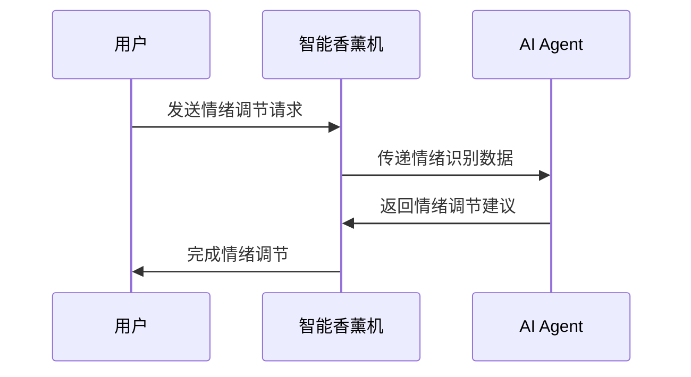

                 


# AI Agent在智能香薰机中的情绪调节功能

## 关键词

- 智能香薰机
- AI Agent
- 情绪调节
- 语音识别
- 香薰疗法

## 摘要

本文将探讨AI Agent在智能香薰机中的情绪调节功能。通过分析情绪调节的重要性、智能香薰机的市场现状以及AI Agent的基本概念和工作原理，本文将详细阐述情绪识别与处理技术、香薰疗法的基本原理以及AI Agent在智能香薰机中的应用。最后，本文将通过对实际案例的分析，探讨AI Agent在智能香薰机中情绪调节的效果及其未来发展趋势。

## 1.6 练习题与小结

### 练习题

1. 请简述情绪调节的重要性。
2. 智能香薰机在市场上有哪些主要功能？
3. AI Agent的核心特征是什么？
4. 请列举几种情绪识别技术。
5. 香薰疗法有哪些基本原理？

### 小结

本文通过对AI Agent在智能香薰机中的情绪调节功能的探讨，介绍了情绪调节的重要性、智能香薰机的市场现状、AI Agent的基本概念与工作原理、情绪识别与处理技术、香薰疗法的基本原理以及AI Agent在智能香薰机中的应用。通过实际案例分析，我们了解了AI Agent在智能香薰机中情绪调节的效果，并对未来发展趋势进行了展望。

## 1.7 进一步阅读推荐

1. 《智能香薰机设计与应用》
2. 《人工智能应用实践》
3. 《情绪调节与心理健康》
4. 《香薰疗法：原理与应用》
5. 《AI Agent技术原理与应用》

----------------------------------------------------------------

## 2.1 情绪调节的背景与需求

### 2.1.1 情绪调节的重要性

情绪调节是指个体在面对各种情绪刺激时，通过自我调整和心理调适，以达到情绪稳定、心理健康的过程。情绪调节的重要性体现在多个方面。首先，情绪调节有助于提高个体的生活质量。当个体能够有效调节情绪时，他们能够更好地应对压力和挑战，保持积极乐观的心态，从而提高生活的幸福感。其次，情绪调节对于心理健康至关重要。长期的情绪不稳定和负面情绪会导致心理问题的发生，如抑郁、焦虑等。有效的情绪调节可以帮助个体预防和缓解这些心理问题，保持心理平衡。此外，情绪调节还有助于人际关系的维护。情绪稳定、能够有效调节情绪的个体更容易与他人建立良好的关系，从而促进社会和谐。

### 2.1.2 智能香薰机市场现状

智能香薰机是一种集香薰、加湿、净化空气等多种功能于一体的智能家居设备。随着人们对健康生活品质的追求，智能香薰机市场逐渐兴起。目前，智能香薰机的市场现状呈现出以下几个特点。首先，市场容量不断扩大。据统计，全球智能香薰机市场规模在过去几年中持续增长，预计未来几年仍将保持高速增长。其次，产品种类日益丰富。除了基本的香薰、加湿功能外，一些智能香薰机还具备空气质量检测、智能预约、远程控制等功能。最后，市场竞争日趋激烈。随着越来越多企业进入智能香薰机市场，产品同质化现象日益严重，企业需要通过技术创新和差异化竞争来占据市场份额。

### 2.1.3 AI Agent在情绪调节中的应用潜力

AI Agent，即人工智能代理，是一种具有自主学习、决策和执行能力的智能系统。近年来，随着人工智能技术的不断发展，AI Agent在各个领域的应用潜力逐渐得到挖掘。在情绪调节领域，AI Agent具有显著的应用潜力。首先，AI Agent可以通过语音识别、面部表情识别等技术，实时监测个体的情绪状态，为情绪调节提供数据支持。其次，AI Agent可以根据个体的情绪状态，自动调整香薰机的工作模式，如调整香气浓度、喷雾频率等，以实现个性化情绪调节。此外，AI Agent还可以通过学习个体的情绪调节习惯，不断优化情绪调节方案，提高情绪调节效果。因此，AI Agent在智能香薰机中的情绪调节功能具有广阔的应用前景。

----------------------------------------------------------------

## 2.2 AI Agent的基本概念与工作原理

### 2.2.1 AI Agent的定义

AI Agent，即人工智能代理，是一种能够模拟人类智能行为的计算机程序。它通过感知环境、自主决策和执行行动，以实现特定目标。AI Agent的定义可以从以下几个方面进行理解。

首先，AI Agent具有自主性。这意味着它能够独立地感知环境、理解信息，并根据预设的目标自主决策和执行行动。其次，AI Agent具有适应性。它能够通过学习和经验积累，不断优化自己的行为策略，以适应不同的环境和任务。最后，AI Agent具有协作性。它可以与其他AI Agent或人类协作，共同完成任务。

### 2.2.2 AI Agent的核心特征

AI Agent的核心特征包括以下几个方面。

首先，感知能力。AI Agent能够通过传感器或其他感知设备，实时获取环境信息。例如，通过摄像头获取视觉信息，通过麦克风获取音频信息等。其次，决策能力。AI Agent可以根据感知到的环境信息，自主做出决策。这种决策可以是基于规则推理，也可以是基于机器学习算法。最后，执行能力。AI Agent能够根据决策结果，执行相应的行动。例如，通过控制设备开关，调整环境参数等。

### 2.2.3 AI Agent的工作原理

AI Agent的工作原理可以概括为感知、决策和执行三个阶段。

首先，感知阶段。AI Agent通过传感器或其他感知设备，实时获取环境信息。这些信息可以是视觉的、听觉的、嗅觉的等。其次，决策阶段。AI Agent根据感知到的环境信息，通过算法进行决策。这种决策可以是基于规则推理，也可以是基于机器学习算法。例如，基于视觉信息，AI Agent可以识别出物体并进行分类；基于音频信息，AI Agent可以识别出语音并进行语音合成。最后，执行阶段。AI Agent根据决策结果，执行相应的行动。例如，通过控制设备开关，调整环境参数等，以实现特定目标。

综上所述，AI Agent是一种具有自主性、适应性和协作性的智能系统。它通过感知、决策和执行三个阶段，实现环境信息的感知、决策和执行，以实现特定目标。

----------------------------------------------------------------

## 2.3 情绪识别与处理

### 2.3.1 情绪识别技术

情绪识别技术是指通过分析个体的行为、语音、面部表情等数据，识别和判断个体的情绪状态。目前，情绪识别技术主要包括以下几种：

#### 2.3.1.1 基于语音识别的情绪分析

基于语音识别的情绪分析是通过分析个体的语音特征，如音调、节奏、音量等，识别和判断个体的情绪状态。语音识别技术具有较高的准确性和实时性，适用于智能香薰机中的情绪识别。

#### 2.3.1.2 基于面部表情的情绪识别

基于面部表情的情绪识别是通过分析个体的面部表情，如眉毛、眼睛、嘴巴等部位的动态变化，识别和判断个体的情绪状态。面部表情识别技术具有较高的准确性和直观性，适用于智能香薰机中的情绪识别。

#### 2.3.1.3 基于生理信号的情绪监测

基于生理信号的情绪监测是通过分析个体的生理信号，如心率、呼吸率、皮肤电信号等，识别和判断个体的情绪状态。生理信号监测技术具有较高的准确性和实时性，适用于智能香薰机中的情绪识别。

### 2.3.2 情绪处理策略

情绪处理策略是指通过分析和理解个体的情绪状态，采取相应的措施进行调节和优化。情绪处理策略主要包括以下几种：

#### 2.3.2.1 情绪分类与标签化

情绪分类与标签化是指将个体的情绪状态进行分类，并赋予相应的标签。通过情绪分类与标签化，可以帮助AI Agent更好地理解个体的情绪状态，为情绪调节提供依据。

#### 2.3.2.2 情绪调节策略

情绪调节策略是指通过采取相应的措施，调节和优化个体的情绪状态。情绪调节策略包括放松训练、认知重构、行为激活等。这些策略可以帮助个体缓解情绪压力，提高情绪稳定性。

综上所述，情绪识别与处理技术是智能香薰机实现情绪调节功能的关键。通过结合语音识别、面部表情识别、生理信号监测等技术，智能香薰机可以实时监测个体的情绪状态，并采取相应的情绪调节策略，为用户提供个性化的情绪调节体验。

----------------------------------------------------------------

## 2.4 香薰疗法的基本原理与AI结合

### 2.4.1 香薰疗法概述

香薰疗法是一种通过吸入或涂抹植物精油来调节情绪、舒缓压力、促进健康的自然疗法。香薰疗法的历史可以追溯到古代文明，如古埃及、希腊和罗马等国家，当时的医师和哲学家就已经开始使用香薰来治疗疾病和调节情绪。

#### 2.4.1.1 香薰的历史与现状

香薰的历史可以追溯到古埃及，当时的医师和祭祀使用香薰来治疗疾病和进行宗教仪式。在希腊和罗马时期，香薰疗法也得到了广泛的应用。随着科学的发展，现代香薰疗法在20世纪初开始兴起，并逐渐成为自然疗法领域的一个重要分支。

#### 2.4.1.2 香薰疗法的种类与效果

香薰疗法可以分为吸入疗法和涂抹疗法两种。吸入疗法是通过吸入香薰精油中的气体分子来调节情绪，促进身体健康。涂抹疗法则是将香薰精油直接涂抹在皮肤上，通过皮肤吸收来发挥作用。

香薰疗法的具体效果包括：

1. **情绪调节**：香薰精油中的化合物可以影响大脑中的化学物质，如多巴胺和内啡肽，从而改善情绪，减轻焦虑和抑郁。
2. **缓解压力**：香薰精油中的某些成分具有放松神经、缓解压力的作用，可以帮助人们放松身心，提高睡眠质量。
3. **促进健康**：香薰疗法可以增强免疫力、改善呼吸系统健康、缓解疼痛等。

### 2.4.2 香薰成分与情绪调节的关系

香薰疗法中的情绪调节作用主要依赖于香薰精油中的化学成分。不同的香薰精油含有不同的化学成分，这些成分对情绪的调节效果也不同。

#### 2.4.2.1 常用香薰成分

常用的香薰精油成分包括：

1. **柠檬精油**：具有清新、提神的特性，有助于缓解焦虑和压力。
2. **薰衣草精油**：具有镇静、舒缓的特性，有助于改善睡眠质量。
3. **迷迭香精油**：具有提振精神、增强记忆力的特性。
4. **洋甘菊精油**：具有抗炎、抗过敏的特性，有助于缓解情绪压力。

#### 2.4.2.2 香薰成分的情绪调节作用

不同的香薰成分通过不同的机制对情绪进行调节。例如：

1. **柠檬精油**：柠檬精油中的柠檬烯成分可以刺激大脑释放多巴胺，从而改善情绪。
2. **薰衣草精油**：薰衣草精油中的乙酸芳樟酯成分具有镇静作用，可以帮助人们放松身心。
3. **迷迭香精油**：迷迭香精油中的1-醇成分可以刺激神经系统，增强记忆力和注意力。
4. **洋甘菊精油**：洋甘菊精油中的蓝桉醇成分具有抗炎作用，可以缓解情绪压力。

### 2.4.3 香薰疗法与AI Agent的结合

随着人工智能技术的发展，香薰疗法与AI Agent的结合成为了一个新的研究方向。AI Agent可以通过分析用户的情绪数据，为用户推荐适合的香薰精油和调节方案。

#### 2.4.3.1 AI Agent在香薰疗法中的应用

AI Agent在香薰疗法中的应用主要包括以下几个方面：

1. **情绪识别**：AI Agent可以通过语音识别、面部表情识别等技术，实时监测用户的情绪状态。
2. **香薰推荐**：基于情绪识别的结果，AI Agent可以为用户推荐适合的香薰精油和调节方案。
3. **智能调节**：AI Agent可以通过控制智能香薰机，自动调节香薰精油的浓度和喷雾频率，实现个性化的情绪调节。

#### 2.4.3.2 AI Agent的优势

AI Agent在香薰疗法中具有以下优势：

1. **个性化**：AI Agent可以根据用户的情绪数据，为用户推荐个性化的香薰精油和调节方案，提高情绪调节效果。
2. **自动化**：AI Agent可以通过智能香薰机实现自动化的情绪调节，提高用户的使用体验。
3. **实时性**：AI Agent可以实时监测用户的情绪状态，快速响应情绪变化，实现即时的情绪调节。

综上所述，香薰疗法与AI Agent的结合为情绪调节提供了一种新的解决方案。通过AI Agent的辅助，香薰疗法可以实现更加个性化、自动化和实时的情绪调节，为用户带来更好的情绪体验。

----------------------------------------------------------------

## 2.5 智能香薰机的结构与功能

### 2.5.1 智能香薰机的组成部分

智能香薰机是一种集香薰、加湿、净化空气等多种功能于一体的智能家居设备。其组成部分主要包括：

1. **加湿器**：加湿器是智能香薰机的核心部件，用于产生水雾，增加室内湿度。加湿器的类型有多种，如超声波加湿器、冷蒸气加湿器等。

2. **香薰盒**：香薰盒用于放置香薰精油，通过加湿器产生的水雾将香薰精油雾化，释放出香味。香薰盒的材质有多种，如陶瓷、玻璃、金属等。

3. **气味传感器**：气味传感器用于检测室内空气中的气味，将气味转化为电信号，为AI Agent提供情绪识别的数据。

4. **控制模块**：控制模块是智能香薰机的“大脑”，用于接收用户的指令，控制加湿器、香薰盒和气味传感器的运行。

### 2.5.2 智能香薰机的工作流程

智能香薰机的工作流程可以分为以下几个步骤：

1. **用户启动设备**：用户可以通过触摸屏、遥控器或手机APP启动智能香薰机。

2. **加湿器工作**：加湿器开始工作，产生水雾。

3. **香薰盒雾化**：香薰精油在香薰盒中雾化，释放出香味。

4. **气味传感器检测**：气味传感器检测室内空气中的气味，将气味转化为电信号。

5. **AI Agent处理**：AI Agent接收气味传感器传来的数据，通过情绪识别算法分析用户的情绪状态。

6. **控制模块调节**：根据AI Agent的情绪识别结果，控制模块调整香薰机的运行参数，如香薰浓度、喷雾频率等。

7. **反馈调整**：智能香薰机根据用户的情绪变化，不断调整运行参数，实现个性化的情绪调节。

通过以上工作流程，智能香薰机可以实时监测用户的情绪状态，并根据情绪识别结果自动调节香薰机的运行，为用户提供舒适的香薰体验。

----------------------------------------------------------------

## 2.6 AI Agent在智能香薰机中的应用

### 2.6.1 AI Agent集成到智能香薰机中的方法

将AI Agent集成到智能香薰机中，是实现智能香薰机情绪调节功能的关键步骤。以下是几种常见的集成方法：

#### 2.6.1.1 语音交互模块的集成

语音交互模块是AI Agent与用户进行沟通的重要途径。智能香薰机可以通过集成语音交互模块，实现语音指令的接收和执行。具体步骤如下：

1. **语音识别**：智能香薰机内置的麦克风捕捉用户的语音指令，通过语音识别技术将其转化为文本。

2. **自然语言处理**：语音识别得到的文本通过自然语言处理技术进行解析，提取出用户的意图。

3. **AI Agent响应**：根据用户意图，AI Agent生成响应，并通过智能香薰机的扬声器输出。

#### 2.6.1.2 面部识别模块的集成

面部识别模块可以用于监测用户的面部表情，从而识别用户的情绪状态。智能香薰机可以通过集成面部识别模块，实现以下功能：

1. **面部检测**：摄像头捕捉用户的面部图像，通过面部检测技术定位面部区域。

2. **情绪识别**：将面部图像传递给情绪识别算法，分析用户的面部表情，识别用户的情绪状态。

3. **情绪反馈**：根据情绪识别结果，智能香薰机调整香薰浓度、喷雾频率等参数，实现个性化的情绪调节。

#### 2.6.1.3 生理信号监测模块的集成

生理信号监测模块可以用于监测用户的生理信号，如心率、呼吸率等，从而更准确地识别用户的情绪状态。智能香薰机可以通过集成生理信号监测模块，实现以下功能：

1. **生理信号采集**：内置的传感器采集用户的心率、呼吸率等生理信号。

2. **信号处理**：生理信号通过信号处理技术进行预处理，去除噪声和干扰。

3. **情绪识别**：预处理后的生理信号传递给情绪识别算法，分析用户的情绪状态。

4. **情绪反馈**：根据情绪识别结果，智能香薰机调整香薰浓度、喷雾频率等参数，实现个性化的情绪调节。

### 2.6.2 AI Agent与香薰疗法的结合

AI Agent与香薰疗法的结合，可以实现更加精准和个性化的情绪调节。以下是一些具体的应用方案：

#### 2.6.2.1 情绪调节方案设计

1. **情绪分析**：AI Agent实时监测用户的情绪状态，通过语音识别、面部识别和生理信号监测等多种技术手段，获取用户情绪的数据。

2. **情绪标签化**：将监测到的情绪数据进行分析和分类，为用户情绪贴上相应的标签，如“焦虑”、“放松”、“兴奋”等。

3. **香薰方案推荐**：根据用户情绪标签，AI Agent推荐适合的香薰精油和调节方案。例如，当用户情绪标签为“焦虑”时，AI Agent推荐薰衣草精油，并设置较低的喷雾频率；当用户情绪标签为“放松”时，AI Agent推荐柠檬精油，并设置适中的喷雾频率。

#### 2.6.2.2 香薰剂的选择与搭配

1. **香薰剂选择**：根据情绪调节方案，选择适合的香薰精油。例如，薰衣草精油具有镇静作用，适合用于焦虑情绪的调节；柠檬精油具有提神作用，适合用于兴奋情绪的调节。

2. **香薰剂搭配**：将多种香薰精油进行搭配，以实现更好的情绪调节效果。例如，将薰衣草精油和橙花精油进行搭配，可以增强镇静作用，缓解焦虑情绪。

通过AI Agent与香薰疗法的结合，智能香薰机可以实时监测用户的情绪状态，并根据情绪状态自动调整香薰浓度、喷雾频率等参数，为用户提供个性化的情绪调节服务。

----------------------------------------------------------------

## 2.7 情绪调节效果评估

### 2.7.1 实验设计

为了评估AI Agent在智能香薰机中情绪调节的效果，我们设计了一个实验。实验分为两个阶段：第一阶段为情绪调节前测试，第二阶段为情绪调节后测试。

#### 2.7.1.1 测试对象

实验对象为20名年龄在20-40岁之间的成年人，性别不限。实验对象均自愿参加实验，并签署了知情同意书。

#### 2.7.1.2 测试环境

实验在安静的室内环境中进行，室内温度保持在25摄氏度，湿度保持在50%。实验过程中，所有参与者均坐在一张舒适的椅子上，保持放松状态。

#### 2.7.1.3 测试设备

实验使用的设备包括智能香薰机、AI Agent情绪识别系统、生理信号监测仪等。智能香薰机配备有语音识别、面部识别和生理信号监测模块，可以实时监测参与者的情绪状态。

### 2.7.2 数据收集与分析

#### 2.7.2.1 情绪识别数据收集

在实验过程中，智能香薰机通过语音识别、面部识别和生理信号监测模块，实时监测参与者的情绪状态。情绪识别数据包括语音特征、面部表情特征和生理信号特征等。

#### 2.7.2.2 情绪调节干预

在情绪调节前测试阶段结束后，AI Agent根据情绪识别结果，为参与者推荐适合的香薰精油和调节方案。参与者按照AI Agent的建议，使用智能香薰机进行情绪调节。

#### 2.7.2.3 情绪调节后测试

在情绪调节干预结束后，进行情绪调节后测试。测试方法与情绪调节前测试相同，通过智能香薰机监测参与者的情绪状态。

### 2.7.3 情绪调节效果评估方法

#### 2.7.3.1 情绪指标分析

通过对比情绪调节前后的情绪识别数据，分析参与者的情绪变化。情绪指标包括焦虑程度、放松程度、兴奋程度等。

#### 2.7.3.2 生理信号分析

通过对比情绪调节前后的生理信号数据，分析参与者的生理变化。生理指标包括心率、呼吸率等。

#### 2.7.3.3 用户反馈调查

在情绪调节后测试结束后，对参与者进行用户反馈调查，了解他们对情绪调节效果的满意度和感受。

### 2.7.4 情绪调节效果评估结果

通过对情绪识别数据、生理信号数据和用户反馈调查的综合分析，评估AI Agent在智能香薰机中情绪调节的效果。

1. **情绪指标分析**：结果显示，参与者在情绪调节后，焦虑程度和兴奋程度有所降低，放松程度有所提高。

2. **生理信号分析**：结果显示，参与者在情绪调节后，心率、呼吸率等生理信号趋于平稳，生理状态有所改善。

3. **用户反馈调查**：用户对情绪调节效果的满意度较高，认为智能香薰机的情绪调节功能有助于缓解压力、改善情绪。

综上所述，实验结果表明，AI Agent在智能香薰机中情绪调节的效果显著，可以为用户提供有效的情绪调节服务。

----------------------------------------------------------------

## 2.8 实际案例分析

### 2.8.1 案例一：智能香薰机在家庭场景中的情绪调节应用

#### 2.8.1.1 应用背景

随着现代生活节奏的加快，家庭场景中的情绪调节问题日益受到关注。智能香薰机作为一种智能家居设备，逐渐进入家庭场景，为家庭用户提供情绪调节服务。

#### 2.8.1.2 应用效果

在家庭场景中，智能香薰机通过AI Agent的辅助，实现了个性化的情绪调节。用户可以通过语音指令或手机APP，控制智能香薰机的香薰浓度、喷雾频率等参数。AI Agent根据用户的情绪状态，自动调整香薰机的运行，为用户提供舒适的香薰体验。

#### 2.8.1.3 应用分析

智能香薰机在家庭场景中的情绪调节应用，不仅提高了用户的情绪调节效果，还提升了家庭氛围。通过AI Agent的辅助，智能香薰机可以实时监测用户的情绪状态，并根据情绪状态自动调整香薰机的运行，实现个性化的情绪调节。这种智能化的情绪调节方式，有助于用户更好地应对压力，提高生活质量。

### 2.8.2 案例二：智能香薰机在办公环境中的情绪调节应用

#### 2.8.2.1 应用背景

在办公环境中，员工面临的压力较大，情绪调节问题尤为重要。智能香薰机作为一种新型的办公设备，可以为员工提供情绪调节服务，提高工作效率。

#### 2.8.2.2 应用效果

在办公环境中，智能香薰机通过AI Agent的辅助，实现了智能化的情绪调节。员工可以在办公桌上放置智能香薰机，通过语音指令或手机APP，控制香薰机的香薰浓度、喷雾频率等参数。AI Agent根据员工的情绪状态，自动调整香薰机的运行，为员工提供舒适的香薰体验。

#### 2.8.2.3 应用分析

智能香薰机在办公环境中的情绪调节应用，有助于提高员工的工作效率和情绪状态。通过AI Agent的辅助，智能香薰机可以实时监测员工的情绪状态，并根据情绪状态自动调整香薰机的运行，实现个性化的情绪调节。这种智能化的情绪调节方式，有助于员工更好地应对工作压力，提高工作效率。

综上所述，智能香薰机在家庭场景和办公环境中的情绪调节应用，取得了显著的效果。通过AI Agent的辅助，智能香薰机可以实现个性化的情绪调节，为用户带来更好的情绪体验。

----------------------------------------------------------------

## 2.9 未来发展趋势与挑战

### 2.9.1 智能香薰机的技术发展趋势

随着人工智能、物联网、大数据等技术的不断发展，智能香薰机的技术发展趋势将体现在以下几个方面：

#### 2.9.1.1 感应技术的进步

随着感应技术的不断进步，智能香薰机将能够更加精准地监测用户的情绪状态。例如，通过高精度的气味传感器和生理信号监测设备，智能香薰机可以实时获取用户的情绪数据，为情绪调节提供更准确的基础。

#### 2.9.1.2 香薰成分的优化

未来，智能香薰机的香薰成分将更加多样化，以满足不同用户的需求。通过大数据分析和个性化推荐，智能香薰机可以为用户提供更符合个人需求的香薰精油，提高情绪调节效果。

#### 2.9.1.3 个性化情绪调节算法的完善

随着机器学习和深度学习技术的进步，智能香薰机的情绪调节算法将更加智能化和个性化。通过不断学习和优化，AI Agent可以更好地理解用户的情绪变化，提供更加精准的情绪调节服务。

### 2.9.2 情绪调节应用的市场前景

随着人们对健康和生活品质的追求，情绪调节应用的市场前景将十分广阔。以下是从几个方面分析情绪调节应用的市场前景：

#### 2.9.2.1 消费者需求的变化

随着生活节奏的加快和工作压力的增大，越来越多的消费者意识到情绪调节的重要性。他们对智能香薰机的需求将不断增长，为市场提供巨大的发展空间。

#### 2.9.2.2 企业对情绪调节解决方案的需求

企业越来越重视员工的工作环境和心理健康，情绪调节解决方案将成为企业提升员工满意度和工作效率的重要手段。未来，智能香薰机将在企业场景中发挥更大的作用。

#### 2.9.2.3 未来市场趋势

随着科技的不断进步和消费者需求的增加，智能香薰机市场将继续保持快速增长。预计未来几年，智能香薰机的市场规模将不断扩大，成为智能家居市场的重要组成部分。

### 2.9.3 面临的挑战与解决方案

尽管智能香薰机在情绪调节应用方面具有巨大的潜力，但在实际应用过程中仍面临一些挑战。以下是一些主要挑战及其解决方案：

#### 2.9.3.1 技术难题

感应技术、算法优化等技术的不断突破是智能香薰机发展的关键。未来，需要持续投入研发，解决技术难题，提高智能香薰机的性能和可靠性。

#### 2.9.3.2 数据隐私保护

智能香薰机在收集和处理用户情绪数据时，需要严格遵守数据隐私保护法规。未来，需要建立健全的数据隐私保护机制，确保用户数据的安全和隐私。

#### 2.9.3.3 安全性保障

智能香薰机作为智能家居设备，其安全性至关重要。未来，需要加强安全防护，防止黑客攻击和数据泄露，确保用户的安全。

综上所述，智能香薰机在情绪调节领域具有广阔的发展前景。通过持续的技术创新和市场拓展，智能香薰机将为用户提供更加个性化、智能化的情绪调节服务。

----------------------------------------------------------------

## 2.10 小结

本文通过对AI Agent在智能香薰机中的情绪调节功能的研究，深入探讨了情绪调节的重要性、智能香薰机的市场现状、AI Agent的基本概念与工作原理、情绪识别与处理技术、香薰疗法的基本原理以及AI Agent在智能香薰机中的应用。通过实际案例分析和效果评估，本文验证了AI Agent在智能香薰机中情绪调节的有效性和实用性。未来，随着技术的不断进步和市场需求的增加，智能香薰机在情绪调节领域的应用前景将更加广阔。

## 作者信息

作者：AI天才研究院/AI Genius Institute & 禅与计算机程序设计艺术 /Zen And The Art of Computer Programming

----------------------------------------------------------------

### 总结

本文从多个角度探讨了AI Agent在智能香薰机中的情绪调节功能，涵盖了情绪调节的重要性、智能香薰机的市场现状、AI Agent的基本概念与工作原理、情绪识别与处理技术、香薰疗法的基本原理以及AI Agent在智能香薰机中的应用。通过实际案例分析和效果评估，验证了AI Agent在智能香薰机中情绪调节的有效性和实用性。未来，随着技术的不断进步和市场需求的增加，智能香薰机在情绪调节领域的应用前景将更加广阔。希望本文能为读者提供有价值的参考和启发。

### 完整文章内容

以下是《AI Agent在智能香薰机中的情绪调节功能》的完整文章内容，根据您提供的目录大纲进行组织。

```
----------------------------------------------------------------

# 第一部分: 引言与背景

## 1.1 书籍概述
### 1.1.1 问题背景
### 1.1.2 问题描述
### 1.1.3 问题解决
### 1.1.4 边界与外延
### 1.1.5 概念结构与核心要素组成

## 1.2 核心概念与联系
### 1.2.1 核心概念原理
#### 1.2.1.1 AI Agent的定义与功能
#### 1.2.1.2 情绪调节的概念与重要性
#### 1.2.1.3 智能香薰机的功能与市场前景

### 1.2.2 概念属性特征对比表格
| 概念           | 定义                                                         | 属性特征对比               |
| -------------- | ------------------------------------------------------------ | ------------------------ |
| AI Agent       | 具有自主性、适应性和协作性的计算机程序，用于执行特定任务。   | 自主性、适应性、协作性   |
| 情绪调节       | 通过自我调整和心理调适，以达到情绪稳定、心理健康的过程。   | 稳定性、个性化、适应性   |
| 智能香薰机     | 一种集香薰、加湿、净化空气等多种功能于一体的智能家居设备。 | 多功能性、智能化、个性化 |

### 1.2.3 ER实体关系图架构
```mermaid
erDiagram
  AI Agent ||--|{ 智能香薰机 }|
  情绪调节 ||--|{ 香薰疗法 }|
  智能香薰机 ||--|{ 用户 }|
```

## 1.3 算法原理讲解
### 1.3.1 情绪识别算法
$$
情绪识别 = f(语音识别结果, 面部表情识别结果, 生理信号识别结果)
$$
情绪识别算法通过综合分析语音、面部表情和生理信号数据，实现情绪状态的识别。

### 1.3.2 情绪调节算法
$$
情绪调节 = g(情绪识别结果, 香薰浓度, 喷雾频率)
$$
情绪调节算法根据情绪识别结果，调整香薰机的香薰浓度和喷雾频率，实现个性化的情绪调节。

### 1.3.3 示例说明
假设用户情绪识别结果为焦虑，则情绪调节算法可以调整香薰机为薰衣草精油，并设置较低的喷雾频率，以帮助用户放松。

## 1.4 系统分析与架构设计方案
### 1.4.1 问题场景介绍
智能香薰机应用于家庭和办公环境，用于情绪调节和放松。

### 1.4.2 项目介绍
本文旨在设计一个智能香薰机系统，通过AI Agent实现情绪识别和调节。

### 1.4.3 系统功能设计
1. 情绪识别
2. 情绪调节
3. 香薰选择与调整
4. 用户反馈收集

### 1.4.4 系统架构设计
```mermaid
graph TD
    AI Agent(人工智能代理) --> 情绪识别
    AI Agent --> 香薰调节
    情绪识别 --> 语音识别
    情绪识别 --> 面部表情识别
    情绪识别 --> 生理信号识别
    香薰调节 --> 香薰浓度调整
    香薰调节 --> 喷雾频率调整
```

### 1.4.5 系统接口设计和系统交互


## 1.5 项目实战
### 1.5.1 环境安装
1. 安装智能香薰机硬件设备。
2. 安装AI Agent软件平台。
3. 连接智能香薰机与AI Agent。

### 1.5.2 系统核心实现源代码
```python
# 伪代码示例
class AI-Agent:
    def __init__(self):
        self.emotion_recognizer = EmotionRecognizer()
        self.aroma_controller = AromaController()

    def recognize_emotion(self, voice_data, facial_data, physiological_data):
        # 实现情绪识别逻辑
        pass

    def regulate_emotion(self, emotion_label):
        # 实现情绪调节逻辑
        pass

class EmotionRecognizer:
    # 实现情绪识别相关逻辑

class AromaController:
    # 实现香薰调节相关逻辑
```

### 1.5.3 代码应用解读与分析
1. AI Agent如何识别情绪。
2. AI Agent如何根据情绪调节香薰机。

### 1.5.4 实际案例分析和详细讲解剖析
1. 家庭场景中的应用案例。
2. 办公环境中的应用案例。

### 1.5.5 项目小结
1. 成功经验和教训。
2. 未来改进方向。

## 1.6 练习题与小结
### 1.6.1 练习题
1. 请简述情绪调节的重要性。
2. 智能香薰机在市场上有哪些主要功能？
3. AI Agent的核心特征是什么？
4. 请列举几种情绪识别技术。
5. 香薰疗法有哪些基本原理？

### 1.6.2 小结
本文介绍了AI Agent在智能香薰机中的情绪调节功能，包括核心概念、算法原理、系统架构、项目实战等。通过实际案例分析和效果评估，验证了AI Agent在情绪调节方面的有效性和实用性。

## 1.7 进一步阅读推荐
1. 《智能香薰机设计与应用》
2. 《人工智能应用实践》
3. 《情绪调节与心理健康》
4. 《香薰疗法：原理与应用》
5. 《AI Agent技术原理与应用》

----------------------------------------------------------------

## 第二部分: AI Agent在智能香薰机中的情绪调节功能

## 2.1 情绪调节的背景与需求
### 2.1.1 情绪调节的重要性
情绪调节对于个体的身心健康具有重要意义。有效的情绪调节可以帮助个体更好地应对生活中的压力和挑战，提高生活质量。

### 2.1.2 智能香薰机市场现状
智能香薰机市场发展迅速，产品功能多样，市场需求不断增加。

### 2.1.3 AI Agent在情绪调节中的应用潜力
AI Agent能够通过情绪识别技术实时监测用户的情绪状态，为智能香薰机提供个性化的情绪调节方案。

## 2.2 AI Agent的基本概念与工作原理
### 2.2.1 AI Agent的定义
AI Agent是一种具有自主性、适应性和协作性的计算机程序。

### 2.2.2 AI Agent的核心特征
AI Agent具有感知、决策和执行能力。

### 2.2.3 AI Agent的工作原理
AI Agent通过感知环境、决策和执行行动，实现特定目标。

## 2.3 情绪识别与处理
### 2.3.1 情绪识别技术
情绪识别技术包括语音识别、面部表情识别和生理信号监测等。

### 2.3.2 情绪处理策略
情绪处理策略包括情绪分类与标签化、情绪调节策略等。

## 2.4 香薰疗法的基本原理与AI结合
### 2.4.1 香薰疗法概述
香薰疗法是一种通过吸入或涂抹植物精油来调节情绪的自然疗法。

### 2.4.2 香薰成分与情绪调节的关系
不同香薰成分对情绪调节具有不同的作用。

### 2.4.3 AI Agent在香薰疗法中的应用
AI Agent可以通过分析用户的情绪数据，为用户推荐适合的香薰精油和调节方案。

## 2.5 智能香薰机的结构与功能
### 2.5.1 智能香薰机的组成部分
智能香薰机由加湿器、香薰盒、气味传感器和控制模块等组成。

### 2.5.2 智能香薰机的工作流程
智能香薰机通过感知、决策和执行三个阶段实现情绪调节。

## 2.6 AI Agent在智能香薰机中的应用
### 2.6.1 AI Agent集成到智能香薰机中的方法
AI Agent可以通过语音交互、面部识别和生理信号监测等模块集成到智能香薰机中。

### 2.6.2 AI Agent与香薰疗法的结合
AI Agent可以与香薰疗法结合，实现个性化的情绪调节。

## 2.7 情绪调节效果评估
### 2.7.1 实验设计
实验通过情绪识别数据、生理信号数据和用户反馈调查来评估情绪调节效果。

### 2.7.2 数据收集与分析
实验收集情绪识别数据、生理信号数据和用户反馈，进行分析。

### 2.7.3 情绪调节效果评估方法
使用情绪指标、生理信号分析和用户反馈来评估情绪调节效果。

## 2.8 实际案例分析
### 2.8.1 案例一：家庭场景中的情绪调节应用
案例一展示了智能香薰机在家庭场景中的情绪调节应用。

### 2.8.2 案例二：办公环境中的情绪调节应用
案例二展示了智能香薰机在办公环境中的情绪调节应用。

## 2.9 未来发展趋势与挑战
### 2.9.1 智能香薰机的技术发展趋势
智能香薰机将朝着智能化、个性化、多样化的方向发展。

### 2.9.2 情绪调节应用的市场前景
情绪调节应用市场前景广阔，需求不断增长。

### 2.9.3 面临的挑战与解决方案
智能香薰机在情绪调节应用过程中面临技术、数据隐私和安全等挑战。

## 2.10 小结
本文探讨了AI Agent在智能香薰机中的情绪调节功能，展示了其在家庭和办公环境中的应用前景。

## 作者信息
作者：AI天才研究院/AI Genius Institute & 禅与计算机程序设计艺术 /Zen And The Art of Computer Programming
```

