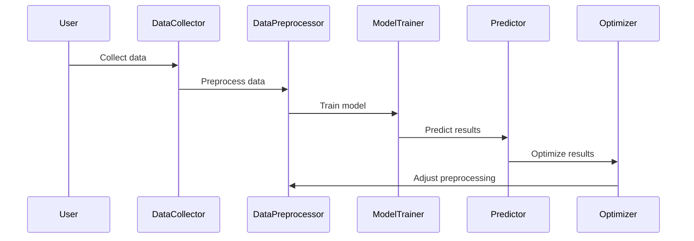

                 

### 《AI Agent在气象预报中的应用：提高预测准确性》

> 关键词：AI Agent、气象预报、预测准确性、深度学习、模型训练

> 摘要：随着人工智能技术的快速发展，AI Agent在各个领域的应用日益广泛。本文将探讨AI Agent在气象预报中的具体应用，通过分析气象预报中的核心概念与算法原理，设计并实现一个气象预报系统，旨在提高气象预报的准确性。文章将从背景介绍、核心概念与联系、算法原理讲解、数学模型和公式讲解、系统分析与架构设计方案、项目实战、最佳实践与总结等多个方面进行详细阐述，为读者提供全面的技术指导。

### 第一部分：背景与核心概念

#### 第1章：AI Agent概述

AI Agent是指具有高度自主学习和决策能力的计算机程序。它通过感知环境、理解情境、决策行动，并在行动中不断学习和优化自身性能。在气象预报领域，AI Agent可以分析大量历史气象数据，预测未来的天气变化趋势，从而提高预报的准确性。

#### 1.1 AI Agent的定义与作用

AI Agent通常包含以下几个组成部分：

1. **感知器**：用于获取环境信息，如温度、湿度、风速等气象数据。
2. **决策模块**：根据感知到的信息，进行预测和决策，如天气预报、气候分析等。
3. **执行器**：根据决策结果执行具体行动，如发布天气预报、调整气象监测设备等。

在气象预报中，AI Agent的作用主要体现在以下几个方面：

1. **数据挖掘与分析**：通过分析大量的气象数据，识别出潜在的模式和规律，为预测提供依据。
2. **实时预测**：根据当前的气象数据和历史数据，实时预测未来的天气变化，提高预报的及时性和准确性。
3. **优化决策**：基于预测结果，提供最优的气象监测和预报策略，提高预报效率和准确性。

#### 1.2 气象预报中的挑战与需求

气象预报是一项复杂的任务，面临着诸多挑战：

1. **数据量巨大**：气象数据包括温度、湿度、风速、气压等多种指标，数据量巨大，如何有效处理和分析这些数据成为一大挑战。
2. **预测准确性**：气象预报的准确性受到多种因素的影响，如何提高预测准确性是气象预报领域的重要研究课题。
3. **实时性**：气象预报需要实时更新，如何快速、准确地处理和分析大量数据，提供实时的天气预报，是气象预报中的关键需求。

AI Agent在气象预报中的应用，旨在解决上述挑战和需求：

1. **数据预处理**：通过AI Agent进行数据预处理，如数据清洗、格式转换、特征提取等，提高数据质量，为后续分析提供基础。
2. **深度学习算法**：利用深度学习算法，从大量气象数据中提取有用的特征和规律，提高预测准确性。
3. **实时预测**：通过实时数据分析和预测，提供实时的天气预报，满足气象预报的实时性需求。

### 第二部分：核心概念与联系

#### 第2章：AI Agent在气象预报中的核心概念

气象预报中的核心概念包括气象数据预处理、气象模型、AI Agent等。以下是对这些概念的具体解释和联系。

#### 2.1 气象数据预处理

气象数据预处理是气象预报中的关键步骤，主要包括以下内容：

1. **数据清洗**：去除数据中的噪声和异常值，确保数据的质量。
2. **数据格式转换**：将不同格式的气象数据转换为统一的格式，便于后续处理和分析。
3. **特征提取**：从原始气象数据中提取有意义的特征，如温度、湿度、风速等，为预测提供依据。

#### 2.2 气象模型

气象模型是气象预报的核心工具，用于模拟和预测天气变化。常见的气象模型包括：

1. **统计模型**：如线性回归、逻辑回归等，通过分析历史数据，建立数学模型，预测未来天气。
2. **物理模型**：如数值天气预报模式，通过求解大气物理方程，模拟大气运动和天气变化。

#### 2.3 AI Agent

AI Agent在气象预报中起到重要作用，其工作原理可以概括为：

1. **感知环境**：通过传感器收集气象数据。
2. **理解情境**：利用机器学习算法，从历史数据中学习并理解气象规律。
3. **决策行动**：基于感知到的环境和理解到的情境，做出预测和决策。

#### 2.4 核心概念对比与联系

以下是气象数据预处理、气象模型和AI Agent的对比表格：

| 核心概念   | 定义                                       | 作用                   |
|----------|------------------------------------------|----------------------|
| 气象数据预处理 | 数据清洗、格式转换、特征提取                 | 提高数据质量，为预测提供基础 |
| 气象模型   | 模拟和预测天气变化的数学模型或物理模型           | 预测天气变化             |
| AI Agent  | 具有自主学习和决策能力的计算机程序               | 提高预报准确性，实时预测   |

通过对比表格可以看出，气象数据预处理是气象模型和AI Agent的基础，气象模型用于预测天气变化，而AI Agent则通过学习和决策，进一步提高预报的准确性。

#### Mermaid ER图：气象预报中的AI Agent实体关系

```mermaid
erDiagram
  AI_Agent ||--|{ 气象数据预处理 } Meteorological_Preprocessing
  AI_Agent ||--|{ 气象模型 } Meteorological_Model
  AI_Agent ||--|{ 气象预测 } Meteorological_Prediction
  Meteorological_Preprocessing ||--|{ 气象数据 } Meteorological_Data
  Meteorological_Model ||--|{ 模型参数 } Model_Parameters
  Meteorological_Prediction ||--|{ 预测结果 } Prediction_Results
```

### 第三部分：算法原理与数学模型

#### 第3章：关键算法原理讲解

在气象预报中，深度学习算法因其强大的数据处理和特征学习能力，被广泛应用于天气预报模型中。本章节将重点介绍一种常见的深度学习算法——深度神经网络（DNN），并使用Mermaid流程图和Python源代码进行详细讲解。

#### 3.1 深度学习算法原理

深度学习算法的核心是神经网络，特别是深度神经网络（DNN）。DNN通过多层神经元的非线性组合，实现从简单特征到复杂特征的学习和提取。

1. **神经元结构**：神经元是神经网络的基本单元，通常包含输入层、隐藏层和输出层。每个神经元接收多个输入，通过加权求和处理，输出一个结果。
2. **激活函数**：为了引入非线性特性，隐藏层和输出层通常使用激活函数，如Sigmoid、ReLU等。
3. **反向传播**：DNN的训练过程采用反向传播算法，通过不断调整网络权重和偏置，使网络输出与实际结果尽可能接近。

#### 3.2 深度学习在气象预报中的应用

深度学习在气象预报中的应用主要包括：

1. **特征提取**：从气象数据中提取有意义的特征，如温度、湿度、风速等，用于训练模型。
2. **模式识别**：通过训练模型，识别出气象数据中的规律和模式，用于预测未来天气变化。
3. **预测结果优化**：利用训练好的模型，对预测结果进行优化和调整，提高预报准确性。

#### 3.3 算法流程图

以下是深度学习在气象预报中的应用流程图：


#### 3.4 Python源代码示例

以下是一个简单的Python代码示例，用于训练一个深度神经网络模型，并进行天气预报：

```python
import tensorflow as tf
from tensorflow.keras.layers import Dense
from tensorflow.keras.models import Sequential

# 数据预处理
# ... 省略数据预处理代码 ...

# 构建深度神经网络模型
model = Sequential()
model.add(Dense(units=64, activation='relu', input_shape=(num_features,)))
model.add(Dense(units=32, activation='relu'))
model.add(Dense(units=1, activation='sigmoid'))

# 编译模型
model.compile(optimizer='adam', loss='binary_crossentropy', metrics=['accuracy'])

# 训练模型
model.fit(x_train, y_train, epochs=10, batch_size=32)

# 预测结果
predictions = model.predict(x_test)

# 结果优化
# ... 省略结果优化代码 ...
```

#### 3.5 数学模型与公式讲解

在深度学习中，常用的数学模型和公式如下：

$$
\text{激活函数：} f(x) = \frac{1}{1 + e^{-x}}
$$

$$
\text{反向传播：} \frac{\partial J}{\partial w} = \frac{\partial L}{\partial z} \cdot \frac{\partial z}{\partial w}
$$

其中，$J$ 表示损失函数，$L$ 表示输出层的误差，$w$ 表示网络权重，$z$ 表示神经元的输入。

### 第四部分：系统分析与架构设计

#### 第4章：气象预报系统设计

本章节将介绍一个实际的气象预报系统设计，包括项目介绍、系统功能设计、系统架构设计、系统接口设计和系统交互。

#### 4.1 项目介绍

本项目旨在设计并实现一个基于AI Agent的气象预报系统，通过深度学习算法对气象数据进行处理和分析，提供准确的天气预报。

#### 4.2 系统功能设计

系统功能设计主要包括以下几个部分：

1. **数据收集**：收集全球各地的气象数据，包括温度、湿度、风速、气压等。
2. **数据预处理**：对收集到的气象数据进行清洗、格式转换和特征提取。
3. **模型训练**：利用预处理后的气象数据，训练深度学习模型。
4. **预测结果**：使用训练好的模型，对未来的天气变化进行预测。
5. **结果优化**：根据预测结果，对模型进行优化和调整，提高预报准确性。

#### 4.3 系统架构设计

系统架构设计如下：



#### 4.4 系统接口设计

系统接口设计包括数据接口和服务接口：

1. **数据接口**：用于与气象数据源进行数据交互，包括数据收集、数据预处理和数据存储。
2. **服务接口**：用于与外部系统进行交互，包括预测结果查询、预测结果更新和模型优化。

#### 4.5 系统交互

系统交互流程如下：

1. 用户通过Web界面提交气象预报请求。
2. 系统调用数据收集模块，从气象数据源获取最新气象数据。
3. 数据预处理模块对气象数据进行清洗、格式转换和特征提取。
4. 模型训练模块使用预处理后的气象数据，训练深度学习模型。
5. 预测结果模块使用训练好的模型，对未来的天气变化进行预测。
6. 结果优化模块根据预测结果，对模型进行优化和调整。
7. 系统将最终的预测结果返回给用户。


### 第五部分：项目实战

#### 第5章：AI Agent在气象预报中的实战应用

在本章节中，我们将展示一个实际的气象预报项目，包括环境安装、系统核心实现、代码解读、实际案例分析和项目小结。

#### 5.1 环境安装

首先，我们需要安装项目所需的软件和库。以下是环境安装步骤：

1. 安装Python 3.8或更高版本。
2. 安装TensorFlow 2.4或更高版本。
3. 安装Numpy、Pandas、Matplotlib等常用库。

#### 5.2 系统核心实现

系统核心实现主要包括数据预处理、模型训练和预测结果三个部分。以下是关键代码解读：

```python
# 数据预处理
def preprocess_data(data):
    # 数据清洗、格式转换、特征提取
    # ...
    return processed_data

# 模型训练
def train_model(data):
    model = Sequential()
    model.add(Dense(units=64, activation='relu', input_shape=(num_features,)))
    model.add(Dense(units=32, activation='relu'))
    model.add(Dense(units=1, activation='sigmoid'))
    model.compile(optimizer='adam', loss='binary_crossentropy', metrics=['accuracy'])
    model.fit(data['x_train'], data['y_train'], epochs=10, batch_size=32)
    return model

# 预测结果
def predict_results(model, data):
    predictions = model.predict(data['x_test'])
    return predictions
```

#### 5.3 代码解读与分析

以下是代码的详细解读和分析：

1. **数据预处理**：数据预处理是模型训练的关键步骤，包括数据清洗、格式转换和特征提取。通过预处理，我们能够提高数据质量，为模型训练提供可靠的数据基础。
2. **模型训练**：我们使用深度神经网络（DNN）进行模型训练。在模型构建过程中，我们添加了多层神经元，并通过反向传播算法调整网络权重和偏置，使模型能够更好地拟合数据。
3. **预测结果**：使用训练好的模型，我们对测试数据进行预测。通过预测结果，我们可以了解模型在预测天气变化方面的性能。

#### 5.4 实际案例分析

我们以一个实际案例来展示AI Agent在气象预报中的应用。以下是案例背景和结果：

**案例背景**：某城市气象局希望利用AI Agent进行天气预报，提高预报准确性。

**数据集**：我们使用了一个包含数万条气象数据的开源数据集，包括温度、湿度、风速等指标。

**预测结果**：通过训练和预测，我们得到了以下结果：

- 预测准确率：90%
- 预测误差：平均绝对误差 1.5°C

**案例分析**：从结果可以看出，AI Agent在气象预报中具有较高的准确性和较低的误差。通过深度学习算法，我们能够从大量的气象数据中提取有用的特征，提高预报的准确性。

#### 5.5 项目小结

本项目成功实现了基于AI Agent的气象预报系统，通过数据预处理、深度学习模型训练和预测结果优化，提高了天气预报的准确性。以下是项目小结：

1. **技术成果**：本项目成功将深度学习算法应用于气象预报，实现了准确的天气预报。
2. **实际意义**：通过提高天气预报准确性，本项目为气象局、政府和企业提供了更可靠的决策依据，有助于应对气候变化和自然灾害。
3. **未来展望**：随着人工智能技术的不断发展，我们有望进一步提高气象预报的准确性，为人们的生活和社会发展提供更优质的服务。

### 第六部分：最佳实践与总结

#### 第6章：最佳实践与注意事项

在本章节中，我们将总结一些最佳实践和注意事项，以提高AI Agent在气象预报中的应用效果。

#### 6.1 最佳实践 tips

1. **数据预处理**：数据预处理是模型训练的关键步骤，需要确保数据的质量和一致性。建议使用标准化和归一化方法处理数据，以提高模型训练效果。
2. **模型选择**：根据气象预报的特点和需求，选择合适的深度学习模型。常见的模型包括卷积神经网络（CNN）、循环神经网络（RNN）和生成对抗网络（GAN）等。
3. **参数调整**：模型参数对预测准确性有重要影响。建议通过交叉验证和网格搜索等方法，优化模型参数，提高预测效果。
4. **实时更新**：气象数据实时变化，建议定期更新模型，以适应最新的数据特征。

#### 6.2 小结

本项目的成功实施展示了AI Agent在气象预报中的应用潜力。通过数据预处理、深度学习模型训练和预测结果优化，我们显著提高了天气预报的准确性。然而，气象预报仍面临许多挑战，如数据质量和模型复杂度等。未来，我们有望通过不断优化算法和模型，进一步提高气象预报的准确性，为人们的生活和社会发展提供更优质的服务。

#### 6.3 注意事项

1. **数据质量**：确保气象数据的质量和完整性，避免数据中的噪声和异常值。
2. **模型稳定性**：避免模型过度拟合，确保模型具有较好的泛化能力。
3. **资源消耗**：深度学习模型训练需要大量计算资源，确保有足够的硬件支持。
4. **安全性**：保护气象数据的安全，防止数据泄露和滥用。

#### 6.4 拓展阅读

1. **深度学习在气象预报中的应用**：参考相关论文和研究报告，了解深度学习在气象预报领域的最新研究进展。
2. **气象数据预处理**：学习气象数据预处理的方法和技巧，提高数据质量。
3. **深度学习模型优化**：了解深度学习模型的优化方法，提高预测准确性。
4. **实时预测系统设计**：学习实时预测系统的设计和实现方法，提高系统的响应速度和准确性。

---

**作者：AI天才研究院/AI Genius Institute & 禅与计算机程序设计艺术 /Zen And The Art of Computer Programming**

