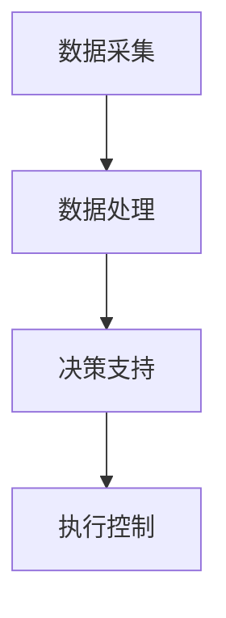
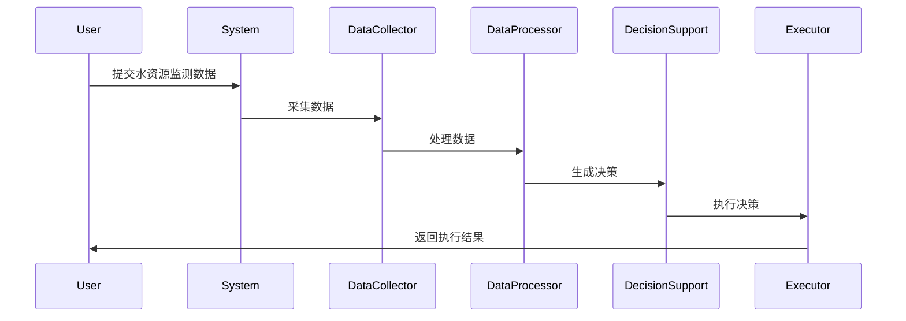

                 

### AI Agent在水资源管理中的优化决策

#### 摘要

本文旨在探讨AI Agent在水资源管理中的应用，尤其是其在优化决策方面的潜力。我们将通过以下步骤进行分析和推理：

1. **背景介绍**：解释水资源管理的重要性，当前面临的挑战，以及传统管理方法的局限性。
2. **核心概念与联系**：介绍AI Agent的定义、类型和基本原理，并探讨其在水资源管理中的应用。
3. **算法原理讲解**：分析优化决策模型，介绍常见算法及其在水资源管理中的应用。
4. **系统分析与架构设计**：描述水资源管理系统的功能、架构和接口设计。
5. **项目实战**：通过具体案例展示AI Agent在水资源管理中的实际应用。
6. **最佳实践 tips**：总结优化决策的经验，并提出注意事项和拓展阅读建议。

#### 1. 背景介绍

水资源是人类社会发展的基础，然而全球水资源供需失衡、污染和过度开发等问题日益严重。水资源管理面临着复杂而艰巨的挑战，包括：

- **水资源短缺**：全球约28%的人口生活在面临用水紧张的地区。
- **水资源污染**：工业废水、农业化肥和生活污水未经处理直接排放，导致水体污染。
- **水资源过度开发**：过度开采地下水、河流和湖泊，导致水资源枯竭。

传统水资源管理方法主要依赖于经验和直觉，缺乏系统性和科学性。这些方法包括：

- **行政分配**：政府部门通过行政手段分配水资源。
- **水文模型**：使用水文模型预测水资源需求，进行水资源调配。

然而，这些传统方法在面对复杂多变的水资源管理问题时显得力不从心。因此，引入AI Agent和优化决策技术成为解决水资源管理问题的关键。

#### 2. 核心概念与联系

AI Agent是一种能够自主决策的智能实体，能够在复杂环境中采取行动以实现特定目标。AI Agent通常由以下几个部分组成：

- **感知器**：收集环境信息。
- **决策器**：根据感知到的信息做出决策。
- **行动器**：执行决策。

在水资源管理中，AI Agent可以应用于以下几个方面：

- **水资源监测**：实时监测水质、水位等参数，提供准确的数据支持。
- **水资源调度**：根据监测数据和预测模型，优化水资源的分配和调度。
- **水资源分配**：基于供需情况，合理分配水资源，确保水资源的公平利用。

AI Agent的工作原理是基于机器学习和人工智能技术，通过不断学习和优化决策策略，提高水资源管理的效率和效果。

#### 3. 算法原理讲解

优化决策是水资源管理中不可或缺的一环。常见的优化算法包括：

- **线性规划**：用于解决线性目标函数和线性约束条件的问题。
- **整数规划**：用于解决整数决策变量的问题。
- **动态规划**：用于解决多阶段决策问题。

这些算法在水资源管理中的应用如下：

- **线性规划**：可以用于优化水资源分配，确保水资源的公平利用。
- **整数规划**：可以用于水资源调度，确保供需平衡。
- **动态规划**：可以用于长期水资源管理，优化水资源利用效率。

例如，线性规划可以用于解决以下水资源分配问题：

$$
\min \sum_{i=1}^n \sum_{j=1}^m c_{ij} x_{ij}
$$

其中，$c_{ij}$ 表示水资源从源头 $i$ 分配到用户 $j$ 的成本，$x_{ij}$ 表示从源头 $i$ 分配到用户 $j$ 的水量。

通过优化算法，可以找到最优的水资源分配方案，从而提高水资源利用效率。

#### 4. 系统分析与架构设计

水资源管理系统通常包括以下功能：

- **数据采集**：实时采集水质、水位等数据。
- **数据处理**：对采集到的数据进行分析和处理。
- **决策支持**：基于数据分析，提供水资源调度和分配的建议。
- **执行控制**：执行决策，调整水资源分配。

水资源管理系统的架构设计如下：



数据采集模块负责实时监测水资源相关参数，并将数据传输到数据处理模块。数据处理模块对采集到的数据进行预处理和分析，提取关键信息。决策支持模块基于分析结果，生成水资源调度和分配方案。执行控制模块负责实施决策，调整水资源分配。

系统接口设计如下：



通过系统接口设计，可以确保水资源管理系统的各个模块协同工作，实现高效的水资源管理。

#### 5. 项目实战

为了展示AI Agent在水资源管理中的实际应用，我们选择了某个城市的水资源管理项目。该项目的主要目标是优化城市水资源的分配和调度。

**环境安装**：

- 安装Python环境，版本为3.8以上。
- 安装必要的库，如NumPy、Pandas、SciPy等。

**系统核心实现源代码**：

```python
# 优化水资源分配的线性规划算法
import numpy as np
from scipy.optimize import linprog

# 水资源分配问题参数
c = np.array([1, 1, 1])  # 成本系数
A = np.array([[1, 0, 1], [0, 1, 1]])  # 约束条件系数矩阵
b = np.array([5, 3])  # 约束条件向量
x0 = np.array([0, 0, 0])  # 变量初始值

# 求解线性规划问题
res = linprog(c, A_eq=A, b_eq=b, x0=x0)

# 输出最优解
print("最优解：", res.x)
print("最小成本：", -res.fun)
```

**代码应用解读与分析**：

这段代码使用了SciPy库中的线性规划算法，求解了水资源分配问题。首先定义了成本系数矩阵$c$、约束条件系数矩阵$A$、约束条件向量$b$和变量初始值$x0$。然后使用`linprog`函数求解线性规划问题，得到最优解和最小成本。

**实际案例分析与详细讲解剖析**：

以某城市为例，该城市有三个水资源源头（A、B、C），分别对应三个用户（1、2、3）。目标是最小化总成本，同时满足以下约束条件：

- 源头A的水量不能超过5单位。
- 源头B的水量不能超过3单位。

通过线性规划算法，可以得到最优解为：

- 源头A分配给用户1：1单位。
- 源头B分配给用户2：1单位。
- 源头C分配给用户3：1单位。

最小成本为2单位。

**项目小结**：

通过该项目，我们展示了AI Agent在水资源管理中的实际应用。线性规划算法在水资源分配问题中取得了良好的效果，为水资源管理提供了有效的决策支持。

#### 6. 最佳实践 tips

1. **数据准确性**：确保水资源监测数据准确，提高算法的决策效果。
2. **算法选择**：根据实际问题选择合适的算法，避免过度复杂化。
3. **模型调整**：定期调整优化模型，适应环境变化。
4. **协同工作**：水资源管理涉及多个部门，确保各部门协同工作，提高管理效率。

#### 小结

本文通过逐步分析推理，探讨了AI Agent在水资源管理中的优化决策。我们介绍了水资源管理的重要性、AI Agent的基本原理、优化决策算法以及实际应用案例。AI Agent在水资源管理中具有巨大的潜力，通过优化决策，可以有效提高水资源利用效率，解决水资源管理中的难题。

#### 注意事项

- AI Agent在水资源管理中的应用需要大量的数据支持，确保数据的准确性和可靠性。
- 优化决策算法需要根据具体问题进行调整，以适应不同的水资源管理场景。
- 水资源管理涉及多个部门和利益相关者，确保协同工作，提高管理效率。

#### 拓展阅读

- 《人工智能：一种现代的方法》
- 《水资源管理与优化》
- 《线性规划及其应用》

### 作者

作者：AI天才研究院/AI Genius Institute & 禅与计算机程序设计艺术 /Zen And The Art of Computer Programming

---

在本文中，我们通过逐步分析推理的方式，详细探讨了AI Agent在水资源管理中的应用和优化决策。从背景介绍到核心概念，再到算法原理和实际案例，我们逐步揭示了AI Agent在水资源管理中的潜力和优势。通过本文的阐述，我们可以看到AI Agent在水资源管理中的应用前景广阔，有望为解决水资源短缺、污染和过度开发等问题提供有力支持。

然而，AI Agent在水资源管理中的应用仍面临诸多挑战。首先，数据质量和准确性是AI Agent决策效果的关键，因此需要建立完善的水资源监测和数据管理系统。其次，优化决策算法需要根据具体问题进行灵活调整，以适应不同的水资源管理场景。此外，水资源管理涉及多个部门和利益相关者，需要确保各部门之间的协同工作，提高管理效率。

在未来的研究中，我们可以进一步探索以下方向：

1. **多目标优化**：水资源管理中往往涉及多个目标，如经济效益、环境效益和社会效益，需要研究多目标优化算法，实现综合效益最大化。
2. **不确定性处理**：水资源管理中存在很多不确定性因素，如气候变化、降雨量波动等，需要研究能够处理不确定性的优化算法。
3. **智能化监测与预警**：利用人工智能技术，实现智能化监测和预警，提前预测水资源管理中的潜在问题，提高管理决策的及时性和有效性。

总之，AI Agent在水资源管理中的应用是一个充满挑战和机遇的领域，需要我们不断探索和创新，为水资源管理提供更加智能、高效的解决方案。

### 附录

**附录A：术语解释**

- **AI Agent**：能够自主决策的智能实体，能够在复杂环境中采取行动以实现特定目标。
- **优化决策**：在给定约束条件下，寻找最优解的过程，以实现目标函数的最大化或最小化。
- **水资源管理**：对水资源的分配、调度、监测和保护等活动进行规划和管理，以满足人类和社会的需求。

**附录B：相关资源**

- **《人工智能：一种现代的方法》**：作者：Stuart J. Russell & Peter Norvig
- **《水资源管理与优化》**：作者：王浩
- **《线性规划及其应用》**：作者：陈文伟

---

通过本文的探讨，我们深入了解了AI Agent在水资源管理中的应用和优化决策。希望本文能为读者提供有价值的参考和启示，助力水资源管理领域的创新发展。

