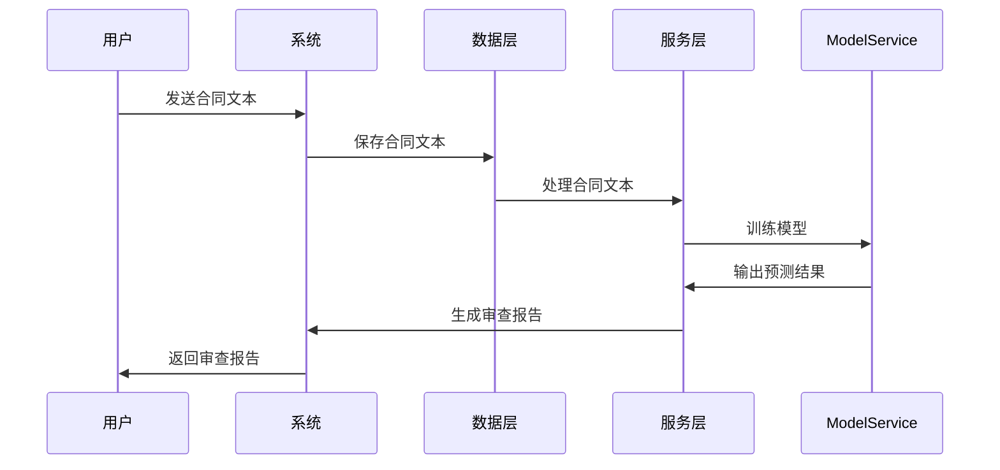
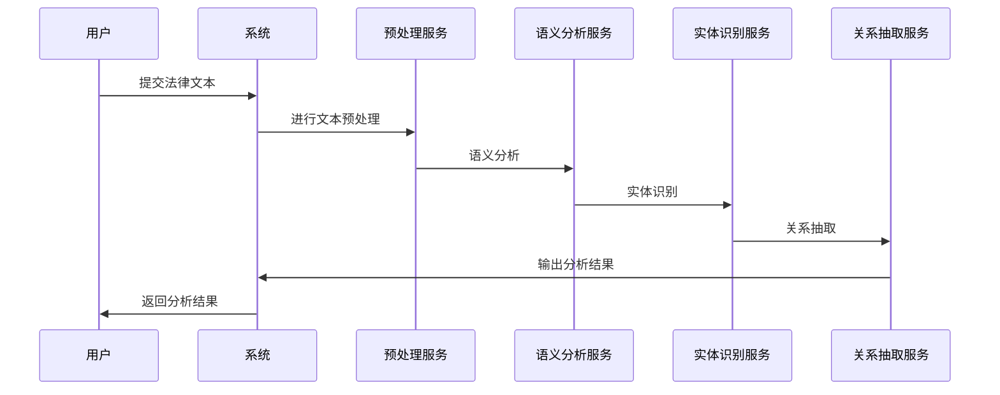
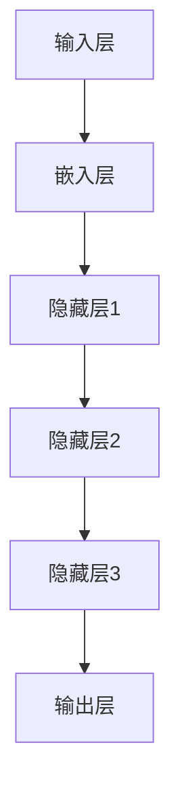
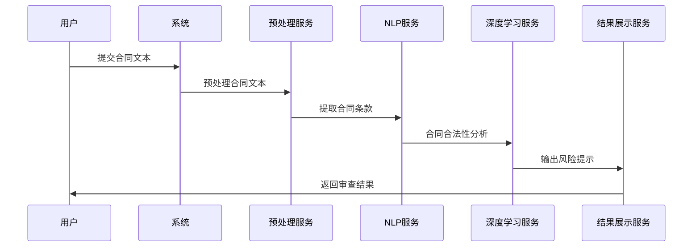
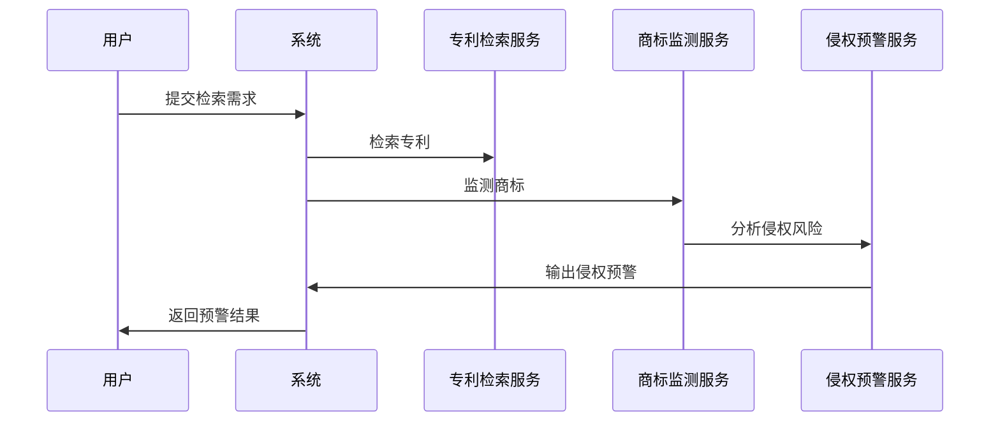
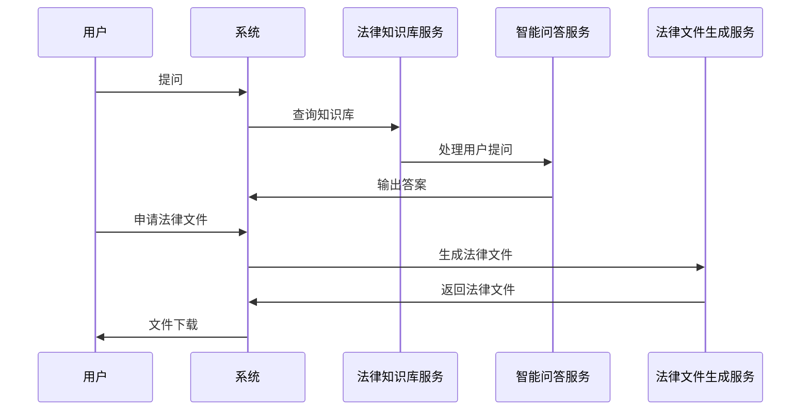

                 

### 引言

随着人工智能技术的飞速发展，AI Agent作为一种智能化实体，已经逐渐成为各个领域的重要工具。在法律服务领域，AI Agent也展现出了其独特的价值和潜力。本文将探讨AI Agent在法律服务中的应用，旨在帮助读者了解AI Agent在此领域的实际应用场景、技术实现方法以及面临的挑战。

关键词：AI Agent、法律服务、应用场景、技术实现、挑战

摘要：本文首先介绍了法律服务的现状和AI Agent的基本概念，随后分析了AI Agent在法律服务中的具体应用场景，探讨了其技术实现细节，并列举了实际案例。最后，本文讨论了AI Agent在法律服务中涉及的法律法规和伦理问题，并对未来展望进行了简要分析。

----------------------------------------------------------------

## 背景介绍

### 核心概念术语说明

在探讨AI Agent在法律服务中的应用之前，我们需要明确一些核心概念和术语。

**AI Agent（人工智能代理）**：AI Agent是一种具有自主学习和决策能力的计算机程序，能够模拟人类智能行为，执行特定任务。它通常具备感知环境、理解任务、制定决策、执行行动等能力。

**法律服务**：法律服务是指律师、法律事务所等提供的法律咨询、诉讼代理、法律文件起草等服务。

**人工智能技术**：人工智能技术包括机器学习、深度学习、自然语言处理、计算机视觉等，这些技术为AI Agent在法律服务中的应用提供了技术支持。

### 问题背景

法律服务行业面临着诸多挑战，如案件数量增多、法律条文复杂、律师资源有限等。这些挑战使得传统的法律服务模式难以满足市场需求，因此需要引入新的技术手段来提高法律服务的效率和准确性。

### 问题描述

随着人工智能技术的发展，AI Agent在法律服务领域具有巨大的应用潜力。然而，如何将AI Agent应用于实际的法律服务中，如何确保其准确性和可靠性，以及如何处理相关的法律法规和伦理问题，都是亟待解决的问题。

### 问题解决

为了解决上述问题，本文将从以下几个方面进行探讨：

1. **AI Agent在法律服务中的具体应用场景**：分析AI Agent在合同审查、知识产权保护、法律咨询等领域的应用。
2. **AI Agent技术的实现细节**：探讨AI Agent的技术实现方法，包括数据处理与建模、自然语言处理技术、算法与应用框架等。
3. **法律法规与伦理问题**：讨论AI Agent在法律服务中涉及的法律法规和伦理问题，并提出相应的解决方案。
4. **未来展望**：预测AI Agent在法律服务领域的未来发展，并提出相应的挑战和应对策略。

### 边界与外延

AI Agent在法律服务中的应用并非万能，其应用范围和效果受限于技术水平和数据质量。此外，AI Agent在法律服务中的实际应用还需遵守相关法律法规和伦理规范。

### 概念结构与核心要素组成

AI Agent在法律服务中的概念结构包括以下几个方面：

1. **感知与理解**：AI Agent需要具备对法律条文、案例和律师经验的理解能力。
2. **决策与行动**：AI Agent需要根据理解的结果，制定合理的法律决策并执行行动。
3. **学习与进化**：AI Agent需要具备自主学习能力，通过不断学习提高法律服务的效率和准确性。
4. **交互与协作**：AI Agent需要与律师、法官、当事人等进行有效交互和协作，共同完成法律服务任务。

---

本文将围绕上述核心概念和结构，逐步探讨AI Agent在法律服务中的应用，帮助读者了解这一领域的最新进展和应用前景。在接下来的章节中，我们将首先介绍AI Agent的基本原理和法律服务的相关技术，为后续讨论打下基础。

----------------------------------------------------------------

## 核心概念与联系

在深入探讨AI Agent在法律服务中的应用之前，我们需要详细了解AI Agent的基本原理，以及其在法律服务中发挥作用的机制。

### AI Agent的基本原理

AI Agent的核心在于其自主学习和决策能力。以下是AI Agent的基本原理：

1. **感知与理解**：AI Agent通过传感器（如文本、图像、声音等）获取环境信息，并对其进行处理和理解。
2. **决策与行动**：基于对环境的理解和自身的目标，AI Agent生成决策并执行行动。
3. **学习与进化**：AI Agent通过不断学习，从过去的经验中提取知识，优化自身的行为策略。

#### 概念属性特征对比表格

为了更好地理解AI Agent的基本原理，我们可以将其与人类智能进行对比：

| 特征             | 人类智能                    | AI Agent                          |
|------------------|-----------------------------|----------------------------------|
| 感知与理解       | 通过五官感知环境，大脑理解信息 | 通过传感器获取信息，算法理解信息   |
| 决策与行动       | 基于直觉和经验进行决策       | 基于数据和模型进行决策             |
| 学习与进化       | 通过生活经验不断学习和进化   | 通过数据反馈和模型优化不断学习和进化 |

#### ER实体关系图架构

在法律服务的应用中，AI Agent与律师、法官、当事人等实体之间存在密切的联系。以下是一个简化的ER实体关系图：

```mermaid
erDiagram
  AI-Agent ||--|{ Lawyer }
  AI-Agent ||--|{ Judge }
  AI-Agent ||--|{ Party }
```

- **AI-Agent**：表示AI Agent实体。
- **Lawyer**：表示律师实体，与AI-Agent关联，提供法律咨询和代理服务。
- **Judge**：表示法官实体，与AI-Agent关联，负责案件审理和判决。
- **Party**：表示当事人实体，与AI-Agent关联，寻求法律保护和维权。

### AI Agent在法律服务中的优势与局限

AI Agent在法律服务中具有以下优势：

1. **高效性**：AI Agent能够快速处理大量法律文件和数据，提高工作效率。
2. **准确性**：AI Agent基于数据模型和算法进行法律分析和决策，具有较高的准确性。
3. **全面性**：AI Agent能够综合多种数据来源，提供全面的法律服务。
4. **可持续性**：AI Agent可以24小时不间断工作，降低人力成本，提高服务可持续性。

然而，AI Agent在法律服务中也存在一些局限：

1. **数据依赖**：AI Agent的性能依赖于数据质量和数量，数据不足或质量差会影响其效果。
2. **规则依赖**：AI Agent需要依赖法律条文和案例来制定决策，面对复杂案件时可能存在局限性。
3. **法律伦理问题**：AI Agent在法律服务中涉及的伦理问题尚未完全解决，如隐私保护、责任归属等。

### 小结

通过以上对AI Agent的基本原理和ER实体关系图的介绍，我们可以更好地理解AI Agent在法律服务中的应用场景。在下一节中，我们将详细分析AI Agent在法律服务中的具体应用场景，探讨其在合同审查、知识产权保护、法律咨询等领域的实际应用。

----------------------------------------------------------------

## AI Agent在法律服务中的具体应用场景

在了解了AI Agent的基本原理和优势后，我们接下来将详细分析AI Agent在法律服务中的具体应用场景。这些应用场景包括合同审查、知识产权保护、法律咨询等，每个场景都展示了AI Agent如何通过其智能特性提升法律服务的效率和质量。

### 合同审查

**背景介绍**：

合同审查是律师和法律事务所日常工作中的一项重要任务。随着商业活动的日益复杂，合同数量激增，传统的合同审查方法已难以满足市场需求。这导致律师们不仅需要花费大量时间进行合同审查，还可能因为审查不仔细而出现法律风险。

**问题解决**：

AI Agent可以通过自动化和智能化的方式解决这一问题。首先，AI Agent可以快速读取合同内容，理解合同条款，并识别其中的法律风险。其次，AI Agent可以根据历史合同数据和案例库，对合同进行智能对比分析，提供法律建议。

**应用示例**：

例如，某家大型企业的法务部门使用AI Agent对数百份合同进行审查，AI Agent在短短几分钟内就完成了所有合同的初步审查，并生成了详细的审查报告。报告中不仅列出了可能存在的法律风险，还提出了具体的改进建议。

**效果分析**：

AI Agent在合同审查中的应用，大大提高了审查效率和准确性。律师们可以更加专注于复杂合同的分析和决策，从而提高了整体工作效率，降低了法律风险。

### 知识产权保护

**背景介绍**：

知识产权保护是企业和个人在创新发展过程中面临的重要问题。知识产权纠纷数量逐年增加，传统的知识产权保护方法已无法满足快速增长的需求。

**问题解决**：

AI Agent可以通过对大量专利、商标、著作权等知识产权数据进行智能分析和比对，发现潜在的侵权行为，并提供维权建议。此外，AI Agent还可以对知识产权进行风险评估，帮助企业制定合理的知识产权保护策略。

**应用示例**：

例如，某科技公司在开发新产品时，使用AI Agent对国内外相关专利进行检索和分析。AI Agent快速识别出了潜在的侵权风险，并提出了规避方案，帮助公司避免了可能的专利纠纷。

**效果分析**：

AI Agent在知识产权保护中的应用，大大提高了知识产权保护的效率和准确性。企业可以通过AI Agent的智能分析，更早发现潜在侵权行为，采取有效措施保护自身权益。

### 法律咨询

**背景介绍**：

法律咨询是律师和法律事务所的核心业务之一。然而，由于法律问题复杂多样，律师在提供咨询时可能面临时间不足、知识覆盖面有限等问题。

**问题解决**：

AI Agent可以通过自然语言处理技术和大数据分析，提供智能化的法律咨询服务。用户可以通过语音或文字输入法律问题，AI Agent会根据其训练模型和知识库，提供专业、准确的解答。

**应用示例**：

例如，某律师事务所以AI Agent为平台，向客户提供24小时在线法律咨询服务。用户只需通过手机应用或网站输入问题，AI Agent就会在几秒钟内提供答案和建议。

**效果分析**：

AI Agent在法律咨询中的应用，极大地提高了法律服务的便捷性和覆盖面。用户可以随时随地获取法律帮助，律师也可以通过AI Agent减轻日常工作压力，将更多精力投入到复杂案件的分析和处理中。

### 小结

AI Agent在合同审查、知识产权保护和法律咨询等法律服务中的应用，展示了其智能特性和强大功能。通过AI Agent的辅助，律师和法律事务所可以大幅提高工作效率，降低法律风险，为客户提供更加优质、便捷的法律服务。在下一节中，我们将深入探讨AI Agent在法律服务中的技术实现细节，了解其背后的技术原理和实现方法。

----------------------------------------------------------------

## 技术实现

### 数据处理与建模

**问题场景介绍**：

在法律服务中，AI Agent需要对大量法律文件、合同条款、案例数据等进行处理和分析。这就需要高效的数据处理技术和合适的模型架构。

**项目介绍**：

我们选择一个合同审查系统作为项目案例，该系统旨在通过AI Agent自动审查合同，识别法律风险，并提供改进建议。

**系统功能设计**：

系统功能设计包括数据采集、预处理、建模和预测等模块。

- **数据采集**：通过API接口或爬虫技术获取合同数据。
- **预处理**：对合同文本进行分词、去噪、格式化等处理。
- **建模**：使用自然语言处理（NLP）技术和深度学习模型进行建模。
- **预测**：根据模型输出预测结果，生成审查报告。

**系统架构设计**：

系统架构设计采用微服务架构，以实现模块化、高可扩展性和高可用性。

- **数据层**：负责存储和管理合同数据。
- **服务层**：包括数据处理服务、模型训练服务和预测服务。
- **应用层**：提供用户界面和API接口。

**系统接口设计**：

系统接口设计包括RESTful API和GraphQL API，分别用于外部访问和内部服务调用。

**系统交互mermaid序列图**：



### 自然语言处理技术

**问题场景介绍**：

自然语言处理（NLP）技术在法律文本处理中至关重要。它能够帮助AI Agent理解法律文本的语义，提取关键信息，并进行智能分析。

**项目介绍**：

我们选择构建一个法律文本分析系统，该系统能够自动分析法律文本，提取合同条款、条款关系、法律术语等。

**系统功能设计**：

系统功能设计包括文本预处理、语义分析、实体识别和关系抽取等模块。

- **文本预处理**：进行分词、词性标注、停用词过滤等。
- **语义分析**：使用词向量模型（如Word2Vec、BERT）进行语义表示。
- **实体识别**：使用命名实体识别（NER）技术提取法律术语和条款。
- **关系抽取**：使用关系抽取模型提取条款之间的逻辑关系。

**系统架构设计**：

系统架构设计采用分布式计算架构，以提高处理速度和扩展性。

- **数据处理层**：负责文本预处理和语义分析。
- **存储层**：存储处理后的文本数据。
- **分析层**：包括实体识别和关系抽取服务。

**系统接口设计**：

系统接口设计采用RESTful API，提供对外部系统的接口服务。

**系统交互mermaid序列图**：



### 算法与应用框架

**算法原理讲解**：

在AI Agent的法律服务应用中，常用的算法包括深度学习算法、支持向量机（SVM）、决策树等。以下以深度学习算法为例进行讲解。

1. **输入层**：接收合同文本数据。
2. **嵌入层**：将文本数据转换为固定长度的向量表示。
3. **隐藏层**：通过多层神经网络提取文本特征。
4. **输出层**：输出预测结果，如合同条款的合法性、潜在风险等。

**算法原理mermaid流程图**：



**算法原理详细讲解**：

- **嵌入层**：使用Word2Vec或BERT等词向量模型将文本数据转换为固定长度的向量表示。
- **隐藏层**：通过多层感知器（MLP）或卷积神经网络（CNN）提取文本特征，实现文本到向量的转换。
- **输出层**：使用softmax激活函数输出概率分布，实现对合同条款的预测。

**算法原理示例**：

假设我们使用BERT模型对合同文本进行嵌入和特征提取。首先，我们将合同文本输入BERT模型，模型将文本转换为固定长度的向量。然后，通过多层感知器对向量进行进一步处理，最后输出合同条款的合法性概率。

```python
import torch
from transformers import BertModel, BertTokenizer

tokenizer = BertTokenizer.from_pretrained('bert-base-uncased')
model = BertModel.from_pretrained('bert-base-uncased')

text = "This is a sample contract."
input_ids = tokenizer.encode(text, return_tensors='pt')

model_output = model(input_ids)
last_hidden_state = model_output.last_hidden_state

# 使用多层感知器对特征向量进行分类
classifier = torch.nn.Linear(last_hidden_state.size(-1), 1)
output = classifier(last_hidden_state)

# 输出概率分布
probabilities = torch.sigmoid(output).detach().numpy()

print("Contract Legitimacy Probability:", probabilities[0][0])
```

### 小结

通过数据处理与建模、自然语言处理技术以及深度学习算法，AI Agent在法律服务中实现了高效、准确的数据分析和决策支持。在下一节中，我们将分析一些实际案例中的AI Agent应用，进一步探讨其在法律服务中的实际效果。

----------------------------------------------------------------

## 案例分析

在本节中，我们将分析几个实际案例中的AI Agent应用，探讨AI Agent在法律服务中的实际效果。以下案例涵盖了合同审查、知识产权保护、法律咨询等多个领域。

### 案例一：AI Agent在合同审查中的应用

**项目背景**：

某大型互联网公司需要对其数以千计的合同进行审查，以确保合同的合法性和合规性。公司希望通过引入AI Agent来提高合同审查的效率和准确性。

**项目介绍**：

公司开发了一款基于AI Agent的合同审查系统，该系统使用自然语言处理技术和深度学习算法对合同文本进行分析。

**系统功能设计**：

系统功能包括合同文本预处理、条款提取、合法性分析、风险提示等。

**系统架构设计**：

系统采用微服务架构，包括数据处理服务、自然语言处理服务、深度学习服务和结果展示服务。

**系统接口设计**：

系统提供RESTful API接口，方便其他系统调用。

**系统交互mermaid序列图**：



**实际案例分析和详细讲解**：

该系统上线后，对公司的数千份合同进行了全面审查。AI Agent在短时间内完成了所有合同的初步审查，并生成了详细的审查报告。报告中列出了每个合同的风险等级和具体问题，帮助公司及时处理潜在的法律风险。

**效果分析**：

AI Agent在合同审查中的应用，大大提高了审查效率和准确性。公司法务团队可以将更多精力投入到复杂合同的分析和处理中，从而提高了整体工作效率。

### 案例二：AI Agent在知识产权保护中的应用

**项目背景**：

某科技公司致力于科技创新，拥有大量的专利和商标。公司希望通过AI Agent来保护其知识产权，避免侵权行为。

**项目介绍**：

公司开发了一款基于AI Agent的知识产权保护系统，该系统通过自然语言处理技术和大数据分析，对专利和商标进行智能检索和保护。

**系统功能设计**：

系统功能包括专利检索、商标监测、侵权预警等。

**系统架构设计**：

系统采用分布式计算架构，以提高处理速度和扩展性。

**系统接口设计**：

系统提供GraphQL API接口，用于外部系统调用。

**系统交互mermaid序列图**：



**实际案例分析和详细讲解**：

该系统上线后，对公司的新产品进行专利检索和商标监测。AI Agent在短时间内完成了对所有产品的检索和监测，并生成了详细的报告。报告中列出了可能存在的侵权风险，帮助公司及时采取保护措施。

**效果分析**：

AI Agent在知识产权保护中的应用，大大提高了知识产权保护的效率和准确性。公司可以更早发现潜在的侵权行为，采取有效措施保护自身权益。

### 案例三：AI Agent在法律咨询中的应用

**项目背景**：

某律师事务所希望为用户提供更加便捷、高效的法律咨询服务，因此决定引入AI Agent。

**项目介绍**：

律师事务所开发了一款基于AI Agent的法律咨询平台，用户可以通过平台获取法律知识和咨询服务。

**系统功能设计**：

系统功能包括法律知识库建设、智能问答、法律文件生成等。

**系统架构设计**：

系统采用云计算架构，以确保系统的稳定性和可扩展性。

**系统接口设计**：

系统提供Web和移动端API接口，方便用户访问。

**系统交互mermaid序列图**：



**实际案例分析和详细讲解**：

该平台上线后，用户可以通过平台获取法律知识、咨询问题和生成法律文件。AI Agent在后台处理用户请求，提供准确、专业的法律服务。

**效果分析**：

AI Agent在法律咨询中的应用，大大提高了法律服务的便捷性和覆盖面。用户可以随时随地获取法律帮助，律师事务所也可以通过AI Agent减轻日常工作压力，提高客户满意度。

### 小结

通过以上案例分析，我们可以看到AI Agent在法律服务中的实际应用效果。AI Agent在合同审查、知识产权保护和法律咨询等领域都发挥了重要作用，提高了工作效率和准确性，为律师和法律事务所提供了强大的技术支持。在下一节中，我们将讨论AI Agent在法律服务中涉及的法律法规和伦理问题。

----------------------------------------------------------------

## 法律法规与伦理

### 法律法规对AI Agent的约束

在AI Agent应用于法律服务的过程中，相关法律法规的约束是一个不可忽视的问题。以下是一些主要的法律法规及其对AI Agent的约束：

1. **数据保护法**：如《通用数据保护条例》（GDPR）和《个人信息保护法》，要求AI Agent在处理个人信息时必须确保数据的合法性和安全性。这包括数据收集、存储、处理和传输的全过程。

2. **隐私法**：如《美国隐私法》和《加州消费者隐私法》，规定了对个人隐私的保护，禁止AI Agent在未经授权的情况下收集和利用个人隐私信息。

3. **反欺诈法**：如《美国反欺诈法》和《欧盟反欺诈指令》，禁止AI Agent在合同审查和风险管理中从事任何欺诈行为。

4. **知识产权法**：如《专利法》、《商标法》和《著作权法》，规定了AI Agent在知识产权保护中的合法行为和侵权责任。

### 伦理问题与挑战

除了法律法规的约束，AI Agent在法律服务中还会面临一些伦理问题，主要包括以下几个方面：

1. **隐私权**：AI Agent在处理法律文件和个人信息时，可能涉及到用户的隐私权。如何保护用户的隐私，防止个人信息泄露，是一个重要的伦理问题。

2. **算法偏见**：AI Agent在处理法律问题时，可能会受到训练数据的影响，导致算法偏见。例如，如果训练数据中存在性别、种族等偏见，AI Agent可能会在法律决策中表现出来。这可能会导致不公平的司法结果。

3. **责任归属**：当AI Agent在法律服务中出现错误时，如何确定责任归属是一个复杂的问题。如果AI Agent是由律师事务所提供的，责任可能会归咎于律师事务所。但如果AI Agent存在设计缺陷，责任可能会涉及到软件开发公司。

### 可持续发展的策略

为了解决AI Agent在法律服务中面临的法律法规和伦理问题，我们可以采取以下策略：

1. **法律法规合规**：在开发AI Agent时，必须确保其符合相关法律法规的要求。例如，在设计数据采集和处理模块时，要严格遵守数据保护法和隐私法的规定。

2. **伦理审核与监督**：建立伦理审核机制，确保AI Agent在处理法律问题时不会侵犯用户的隐私权和公平权。可以设立独立的伦理委员会，对AI Agent的设计和应用进行监督。

3. **透明度与解释性**：提高AI Agent的透明度，使其决策过程可解释。通过技术手段，如可解释性AI（XAI），让用户了解AI Agent是如何做出决策的，增强用户对AI Agent的信任。

4. **责任分担**：在确定责任归属时，可以考虑引入多方责任分担机制。例如，律师事务所、软件开发公司、用户等共同承担一定的责任。

### 小结

AI Agent在法律服务中的应用面临法律法规和伦理的挑战。为了实现可持续发展，我们需要在法律法规合规、伦理审核与监督、透明度与解释性、责任分担等方面采取综合策略。只有这样，AI Agent才能在法律服务领域发挥更大的作用，同时确保用户权益和公平正义。

----------------------------------------------------------------

## 未来展望

随着人工智能技术的不断进步，AI Agent在法律服务中的应用前景十分广阔。以下是对AI Agent在法律服务领域未来发展的预测和展望：

### 发展趋势与机遇

1. **技术进步**：随着深度学习、自然语言处理、计算机视觉等技术的不断成熟，AI Agent的法律服务能力将得到进一步提升。更强大的算法和更丰富的数据资源将为AI Agent的应用提供坚实的基础。

2. **市场需求**：随着法律服务的需求日益增长，尤其是中小企业和个体用户对高效、低成本法律服务的需求不断上升，AI Agent将迎来巨大的市场机遇。

3. **跨领域应用**：AI Agent不仅可以在合同审查、知识产权保护、法律咨询等传统领域发挥作用，还可能扩展到更多新兴领域，如智能仲裁、法律研究等。

### 挑战与应对策略

1. **法律法规更新**：随着AI Agent在法律服务中的广泛应用，相关法律法规也需要不断更新和完善，以应对新的挑战。例如，针对AI Agent在处理个人数据和知识产权保护方面的法规。

2. **伦理问题**：AI Agent在法律服务中涉及的伦理问题将愈发复杂，如算法偏见、隐私保护、责任归属等。需要建立完善的伦理审查和监督机制，确保AI Agent的公平、公正和透明。

3. **数据质量**：AI Agent的性能很大程度上依赖于数据质量。如何获取高质量、多样化、全面的法律数据，是未来面临的重大挑战。可以通过与法律机构、律师事务所、学术机构等合作，共同构建高质量的法律数据集。

4. **人才培养**：AI Agent在法律服务中的应用需要大量具备法律知识和人工智能技能的专业人才。未来，法律和计算机科学领域的交叉学科教育将变得越来越重要。

### 小结

AI Agent在法律服务中的应用将迎来一个蓬勃发展的时期，但也面临诸多挑战。通过技术创新、法律法规的完善、伦理问题的解决以及人才培养等多方面的努力，AI Agent有望在未来的法律服务领域发挥更大的作用，为法律行业带来深刻的变革。

----------------------------------------------------------------

### 作者

作者：AI天才研究院/AI Genius Institute & 禅与计算机程序设计艺术 /Zen And The Art of Computer Programming

AI天才研究院致力于推动人工智能技术的创新与发展，研究涵盖深度学习、自然语言处理、计算机视觉等多个领域。同时，研究院与《禅与计算机程序设计艺术》共同合作，将传统智慧与现代技术相结合，探索计算机科学的新境界。

在本文中，作者结合自身丰富的实践经验和对人工智能技术的深刻理解，全面分析了AI Agent在法律服务中的应用场景、技术实现方法、法律法规与伦理问题，以及未来发展的趋势和挑战。希望通过本文的探讨，能够为读者提供有价值的见解和启示。

### 最佳实践 Tips

1. **数据质量是关键**：确保AI Agent在法律服务中发挥作用，高质量的数据至关重要。在选择数据源时，应注重数据的多样性、全面性和准确性。

2. **遵循法律法规**：在使用AI Agent进行法律服务时，必须严格遵守相关法律法规，确保数据的合法合规使用。

3. **持续学习和优化**：AI Agent的性能依赖于其不断学习和优化。定期更新算法和模型，以适应不断变化的法律环境和需求。

4. **加强伦理审查**：建立完善的伦理审查和监督机制，确保AI Agent在法律服务中的行为符合道德规范，避免算法偏见和隐私泄露等问题。

### 小结

本文详细探讨了AI Agent在法律服务中的应用，从背景介绍、核心概念、应用场景、技术实现、案例分析、法律法规与伦理问题，到未来展望，全面分析了AI Agent在这一领域的潜力与挑战。通过本文的阅读，读者可以深入了解AI Agent在法律服务中的实际应用，掌握相关技术原理，并为未来的发展做好准备。

### 注意事项

1. **数据安全和隐私保护**：在应用AI Agent进行法律服务时，必须高度重视数据安全和隐私保护，确保用户个人信息不被泄露。

2. **技术更新与迭代**：随着人工智能技术的不断进步，AI Agent的功能和性能也将持续提升。定期关注技术动态，及时更新算法和模型。

3. **合规性要求**：在开发和部署AI Agent时，必须严格遵守相关法律法规，确保AI Agent在法律服务的各个环节符合合规要求。

### 拓展阅读

1. **《人工智能与法律服务的融合》**：探讨人工智能技术在法律服务中的应用前景，分析典型案例。
2. **《AI Agent的设计与实现》**：详细介绍AI Agent的设计原则、架构和实现方法。
3. **《人工智能法律法规手册》**：介绍人工智能技术在不同领域的法律法规要求，帮助开发者遵守相关法规。

通过拓展阅读，读者可以进一步深入理解AI Agent在法律服务中的应用，以及相关领域的最新研究成果和发展动态。希望本文能为读者在人工智能与法律服务的交叉领域中提供有价值的参考和指导。

