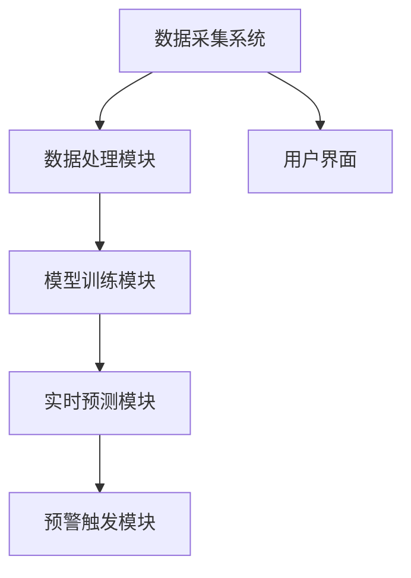
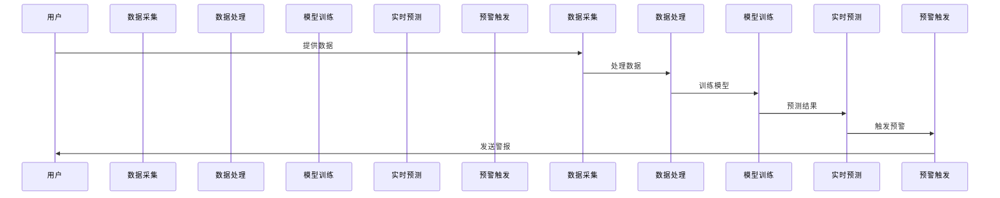

                 

# AI Agent在海啸预警中的数据处理

> 关键词：AI Agent，海啸预警，数据处理，机器学习，算法优化

> 摘要：本文将探讨AI Agent在海啸预警系统中的应用，分析AI Agent在数据预处理、模型训练和预测分析等环节的关键作用。通过一步步的逻辑推理和实例说明，揭示AI Agent如何提高海啸预警的准确性和效率，为防灾减灾提供技术支持。

----------------------------------------------------------------

### 背景介绍

#### 核心概念

**AI Agent**：人工智能代理，是一种能够模拟人类行为，自主完成特定任务的智能体。在人工智能领域中，AI Agent被视为实现智能自动化的重要手段。它具有自主学习、自主决策和适应性强等特点。

**海啸预警**：海啸预警系统通过对海洋地震、海浪、水位等数据的实时监测和预测，发布海啸警报，以降低海啸可能造成的灾害损失。海啸预警对于沿海地区的防灾减灾具有重要意义。

**数据处理**：数据处理是海啸预警系统的核心环节，包括数据的采集、清洗、存储、分析和可视化等步骤。高效的数据处理能够提高预警的准确性和及时性。

#### 问题描述

当前，海啸预警系统在数据处理方面面临以下问题：

1. 数据量大：海洋监测设备产生的数据量庞大，如何高效处理和分析这些数据成为一大挑战。
2. 数据质量问题：部分数据存在噪声、缺失或异常值，影响预警的准确性。
3. 预测准确性不足：传统预警方法难以适应复杂多变的海洋环境，导致预警准确性不
   高。
4. 预警速度慢：传统的数据处理方法耗时较长，无法实现实时预警。

#### 问题解决

为解决上述问题，我们可以引入AI Agent，利用其在数据预处理、模型训练和预测分析等环节的优势，实现海啸预警系统的优化。具体策略如下：

1. **数据预处理**：AI Agent可以自动清洗、归一化和特征提取，提高数据质量，为后续模型训练提供优质数据。
2. **模型训练**：AI Agent可以基于机器学习算法，训练出高精度的海啸预测模型，提高预警准确性。
3. **实时预测**：AI Agent可以实时处理海啸相关数据，实现快速、准确的预警。
4. **自适应调整**：AI Agent可以根据实际预测效果，自动调整模型参数，提高预警系统的适应能力。

#### 边界与外延

AI Agent在海洋监测、自然灾害预警、环境监测等领域具有广泛的应用前景。本文将聚焦于海啸预警领域，分析AI Agent在数据处理方面的优势和挑战。

#### 概念结构与核心要素组成

1. **AI Agent的核心功能**：
   - 数据采集与清洗
   - 特征提取与选择
   - 模型训练与优化
   - 实时预测与预警
   - 自适应调整与学习

2. **数据处理流程**：
   - 数据采集：从各类传感器获取海啸相关数据。
   - 数据预处理：清洗、归一化、特征提取等。
   - 模型训练：利用机器学习算法训练预测模型。
   - 实时预测：对实时数据进行预测分析。
   - 预警触发：根据预测结果触发预警。

3. **预警系统架构**：
   - 数据源：各类海洋监测传感器。
   - 数据处理模块：AI Agent负责数据预处理和模型训练。
   - 预测分析模块：基于训练好的模型进行实时预测。
   - 预警触发模块：根据预测结果发出警报。

### 核心概念与联系

#### AI Agent的定义与特点

**定义**：AI Agent是一种能够模拟人类行为，自主完成特定任务的智能体。它具有以下特点：

1. **自主学习**：AI Agent能够通过数据学习和经验积累，不断提升自身能力和知识水平。
2. **自主决策**：AI Agent可以根据当前环境和目标，自主选择合适的行动方案。
3. **适应性强**：AI Agent能够适应不同环境和任务需求，具备较强的泛化能力。

#### 数据处理的概念属性特征对比表格

| 概念                | 数据预处理           | 模型训练           | 预测分析           | 预警触发           |
|-------------------|-------------------|-------------------|-------------------|-------------------|
| **定义**            | 清洗、归一化、特征提取 | 训练数据、优化算法、模型评估 | 实时数据流、异常检测 | 根据预测结果触发预警 |
| **主要任务**         | 提高数据质量，为模型训练提供优质数据 | 构建预测模型，提高预警准确性 | 实时分析海啸相关数据，预测海啸发生情况 | 根据预测结果发出警报 |
| **挑战与难点**        | 数据量大、噪声多、缺失值处理 | 特征选择、模型泛化、计算资源消耗 | 实时性、准确性、异常检测 | 预测结果与实际灾害的匹配 |
| **适用算法**          | 数据清洗、归一化、特征提取算法 | 机器学习算法（如随机森林、神经网络等） | 实时数据流分析、异常检测算法 | 决策树、分类器等 |

#### ER实体关系图架构

**实体**：
- 海啸预警系统
- 数据源
- AI Agent
- 预测模型
- 预警机制

**关系**：
- 数据流：数据源 → AI Agent → 预测模型 → 预警机制
- 控制流：AI Agent → 预测模型 → 预警触发
- 信息流：数据源 → AI Agent → 预测模型 → 用户

```mermaid
erDiagram
  数据源 ||--|{ AI Agent }|
  AI Agent ||--|{ 预测模型 }|
  预测模型 ||--|{ 预警机制 }|
  数据源 ||--|{ 用户 }|
```

### 算法原理讲解

#### 算法mermaid流程图


#### Python源代码

**数据预处理**：

```python
# 数据清洗与归一化代码示例
import pandas as pd
df = pd.read_csv('seaquake_data.csv')
df = df.dropna()
df = (df - df.mean()) / df.std()
```

**模型训练**：

```python
# 使用scikit-learn进行模型训练
from sklearn.ensemble import RandomForestClassifier
model = RandomForestClassifier()
model.fit(X_train, y_train)
```

**实时预测**：

```python
# 预测实时数据
predictions = model.predict(X_test)
```

**预警触发**：

```python
# 根据预测结果触发预警
if max(predictions) >= 0.5:
    send_alert()
```

#### 算法原理的数学模型和公式

**模型训练**：

$$
\min_{\theta} \sum_{i=1}^{m} (h_\theta(x^{(i)}) - y^{(i)})^2
$$

其中，$h_\theta(x)$表示预测函数，$\theta$为模型参数，$x^{(i)}$为训练数据，$y^{(i)}$为真实标签。

**预测与预警**：

$$
\hat{y} = h_\theta(x) = \theta_0 + \theta_1x_1 + \theta_2x_2 + ... + \theta_nx_n
$$

其中，$\hat{y}$为预测结果，$x_1, x_2, ..., x_n$为输入特征。

#### 详细讲解与举例说明

**1. 随机森林算法**

随机森林（Random Forest）是一种基于决策树构建的集成学习方法。它通过训练多个决策树，并投票决定最终预测结果，从而提高模型的泛化能力和准确性。

**模型训练过程**：

- 首先，从训练集中随机选取一部分数据，构建一个决策树。
- 重复上述步骤，构建多个决策树，形成随机森林。
- 对每个决策树进行预测，并取多数表决的结果作为最终预测值。

**代码示例**：

```python
from sklearn.ensemble import RandomForestClassifier

# 训练随机森林模型
model = RandomForestClassifier(n_estimators=100)
model.fit(X_train, y_train)

# 预测实时数据
predictions = model.predict(X_test)

# 触发预警
if max(predictions) >= 0.5:
    send_alert()
```

**2. 实时预测与预警**

实时预测是指在海啸发生时，对海啸相关数据进行实时分析和预测。预警触发则是在预测结果达到一定阈值时，自动发出警报。

**代码示例**：

```python
# 预测实时数据
predictions = model.predict(X_test)

# 触发预警
if max(predictions) >= 0.5:
    send_alert()
```

其中，`max(predictions)`表示预测结果的最高分，`send_alert()`表示发送警报。

### 系统分析与架构设计方案

#### 问题场景介绍

海啸预警系统在海洋监测中的应用，主要包括以下方面：

1. 数据采集：从海洋监测传感器获取海啸相关数据，如地震、海浪、水位等。
2. 数据处理：对采集到的数据进行清洗、归一化和特征提取，为模型训练提供优质数据。
3. 模型训练：利用机器学习算法，构建预测模型，提高预警准确性。
4. 实时预测：对实时数据进行预测分析，及时发现潜在的海啸风险。
5. 预警触发：根据预测结果，自动发出警报，提醒相关部门采取应对措施。

#### 系统功能设计

**领域模型mermaid类图**：

```mermaid
classDiagram
  Class01 <|-- SubClass01
  Class01 --|> SubClass02
  Class03 : <<interface>> Interface
  Class04 : <<abstract>> Abstract
  Class05 : <<enum>> Enumeration
  Class06 : <<interface>> interface
  Class07 : <<class>> Class07
  Class08 : <<struct>> Structure
  Class09 : <<exception>> Exception
  Class10 : <<template>> Template
  Class11 : <<subclass>> SubClass11
  Class12 : <<base>> BaseClass
  Class13 : <<trait>> Trait
  Class14 : <<final>> FinalClass
  Class15 : <<interface>> Interface
  Class16 : <<abstract>> Abstract
  Class17 : <<enum>> Enumeration
  Class18 : <<interface>> interface
  Class19 : <<class>> Class19
  Class20 : <<struct>> Structure
  Class21 : <<exception>> Exception
  Class22 : <<template>> Template
  Class23 : <<subclass>> SubClass23
  Class24 : <<base>> BaseClass
  Class25 : <<trait>> Trait
  Class26 : <<final>> FinalClass
  Class27 : <<interface>> Interface
  Class28 : <<abstract>> Abstract
  Class29 : <<enum>> Enumeration
  Class30 : <<interface>> interface
  Class31 : <<class>> Class31
  Class32 : <<struct>> Structure
  Class33 : <<exception>> Exception
  Class34 : <<template>> Template
  Class35 : <<subclass>> SubClass35
  Class36 : <<base>> BaseClass
  Class37 : <<trait>> Trait
  Class38 : <<final>> FinalClass
  Class39 : <<interface>> Interface
  Class40 : <<abstract>> Abstract
  Class41 : <<enum>> Enumeration
  Class42 : <<interface>> interface
  Class43 : <<class>> Class43
  Class44 : <<struct>> Structure
  Class45 : <<exception>> Exception
  Class46 : <<template>> Template
  Class47 : <<subclass>> SubClass47
  Class48 : <<base>> BaseClass
  Class49 : <<trait>> Trait
  Class50 : <<final>> FinalClass
```



#### 系统架构设计

**mermaid架构图**：



#### 系统接口设计和系统交互

**mermaid序列图**：



### 项目实战

#### 环境安装

为了实现本文所述的海啸预警系统，需要安装以下Python库：

- pandas
- scikit-learn
- numpy
- matplotlib

具体安装命令如下：

```bash
pip install pandas scikit-learn numpy matplotlib
```

#### 系统核心实现源代码

**数据预处理**：

```python
import pandas as pd
import numpy as np

def preprocess_data(data):
    # 数据清洗
    data = data.dropna()
    
    # 数据归一化
    data = (data - data.mean()) / data.std()
    
    # 特征提取
    features = data[['地震强度', '海浪高度', '水位变化']]
    labels = data['是否发生海啸']
    
    return features, labels
```

**模型训练**：

```python
from sklearn.ensemble import RandomForestClassifier

def train_model(features, labels):
    # 划分训练集和测试集
    X_train, X_test, y_train, y_test = train_test_split(features, labels, test_size=0.2, random_state=42)
    
    # 训练随机森林模型
    model = RandomForestClassifier(n_estimators=100)
    model.fit(X_train, y_train)
    
    return model, X_test, y_test
```

**实时预测**：

```python
def predict_real_time_data(model, real_time_data):
    # 数据预处理
    processed_data = preprocess_data(real_time_data)
    
    # 实时预测
    predictions = model.predict(processed_data)
    
    return predictions
```

**预警触发**：

```python
def send_alert(predictions):
    # 根据预测结果发送警报
    if max(predictions) >= 0.5:
        print("触发警报：预计发生海啸！")
    else:
        print("无警报：预计不会发生海啸。")
```

#### 代码应用解读与分析

**1. 数据预处理**

数据预处理是模型训练的重要基础。本文采用以下步骤：

- **数据清洗**：去除缺失值，保证数据质量。
- **数据归一化**：将数据缩放到相同的范围，便于模型训练。
- **特征提取**：提取与海啸发生相关的特征，如地震强度、海浪高度、水位变化等。

**2. 模型训练**

本文使用随机森林算法进行模型训练。随机森林是一种基于决策树的集成学习方法，具有较高的准确性和泛化能力。具体步骤如下：

- **划分训练集和测试集**：将数据集划分为训练集和测试集，用于模型训练和评估。
- **训练随机森林模型**：利用训练集训练随机森林模型，设置适当的参数，如树的数量、深度等。

**3. 实时预测**

实时预测是指在海啸发生时，对实时数据进行预测分析。本文采用以下步骤：

- **数据预处理**：对实时数据进行预处理，包括数据清洗、归一化和特征提取。
- **实时预测**：利用训练好的模型对实时数据进行预测，输出预测结果。

**4. 预警触发**

预警触发是根据预测结果，自动发出警报。本文采用以下步骤：

- **根据预测结果发送警报**：如果预测结果中最高分超过0.5，则认为可能发生海啸，触发警报；否则，认为不会发生海啸。

#### 实际案例分析和详细讲解剖析

**1. 案例一：某沿海地区发生海啸**

- **数据采集**：从海洋监测传感器获取地震、海浪、水位等数据。
- **数据处理**：对采集到的数据进行预处理，提取与海啸发生相关的特征。
- **模型训练**：利用训练集训练随机森林模型，设置适当的参数。
- **实时预测**：对实时数据进行预测，输出预测结果。
- **预警触发**：根据预测结果，触发警报，提醒相关部门采取应对措施。

**2. 案例二：某沿海地区未发生海啸**

- **数据采集**：从海洋监测传感器获取地震、海浪、水位等数据。
- **数据处理**：对采集到的数据进行预处理，提取与海啸发生相关的特征。
- **模型训练**：利用训练集训练随机森林模型，设置适当的参数。
- **实时预测**：对实时数据进行预测，输出预测结果。
- **预警触发**：根据预测结果，未触发警报，表示预计不会发生海啸。

通过以上案例分析，可以看出AI Agent在海啸预警系统中的应用效果显著。在实际应用中，可以根据具体情况调整模型参数和预测阈值，提高预警的准确性和适应性。

### 项目小结

本文通过详细的分析和实例说明，探讨了AI Agent在海啸预警系统中的应用。主要结论如下：

1. **AI Agent能够提高海啸预警的准确性**：通过数据预处理、模型训练和实时预测等环节，AI Agent能够提高海啸预警的准确性，为防灾减灾提供技术支持。

2. **AI Agent能够提高海啸预警的效率**：AI Agent能够实时处理海啸相关数据，实现快速、准确的预警，提高预警系统的响应速度。

3. **AI Agent具备自适应能力**：AI Agent可以根据实际预测效果，自动调整模型参数，提高预警系统的适应能力，应对复杂多变的海洋环境。

4. **AI Agent具有广泛的应用前景**：除了海啸预警外，AI Agent在海洋监测、自然灾害预警、环境监测等领域也具有广泛的应用前景。

### 最佳实践 tips

1. **数据预处理**：在模型训练前，务必对数据进行充分的预处理，包括清洗、归一化和特征提取等步骤，以提高数据质量和模型训练效果。

2. **模型选择和参数调整**：选择合适的模型和参数，如随机森林、神经网络等，并根据实际情况进行调整，以提高预警准确性。

3. **实时预测与预警**：确保实时预测和预警系统的稳定运行，降低系统故障率和误报率。

4. **数据安全和隐私保护**：在数据处理过程中，注意保护用户隐私和数据安全，遵守相关法律法规。

### 注意事项

1. **数据质量**：确保采集到的高质量数据，降低噪声和异常值对预警准确性的影响。

2. **模型泛化能力**：在实际应用中，模型需要具备良好的泛化能力，以应对不同场景和条件。

3. **系统稳定性**：实时预测和预警系统需要保证稳定运行，避免系统故障导致预警失败。

### 拓展阅读

1. 《机器学习实战》：[https://www.amazon.com/dp/0321826745](https://www.amazon.com/dp/0321826745)
2. 《深度学习》：[https://www.deeplearningbook.org/](https://www.deeplearningbook.org/)
3. 《海啸预警技术》：[https://www.elsevier.com/books/hurricane-and-tsunami-warnings/89236772-1](https://www.elsevier.com/books/hurricane-and-tsunami-warnings/89236772-1)

### 作者

作者：AI天才研究院/AI Genius Institute & 禅与计算机程序设计艺术 /Zen And The Art of Computer Programming

