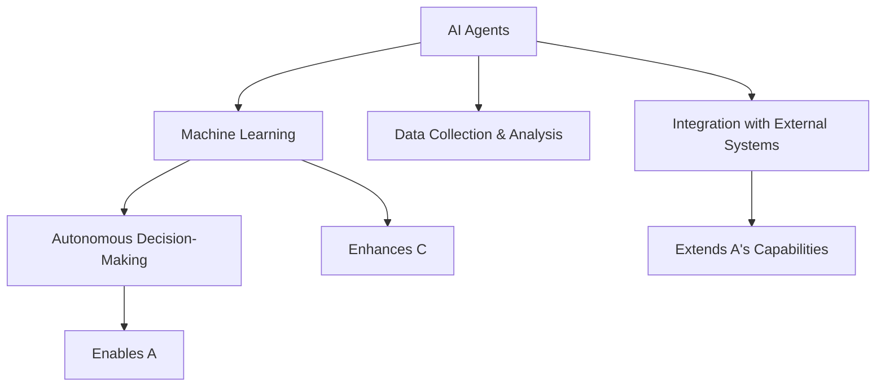
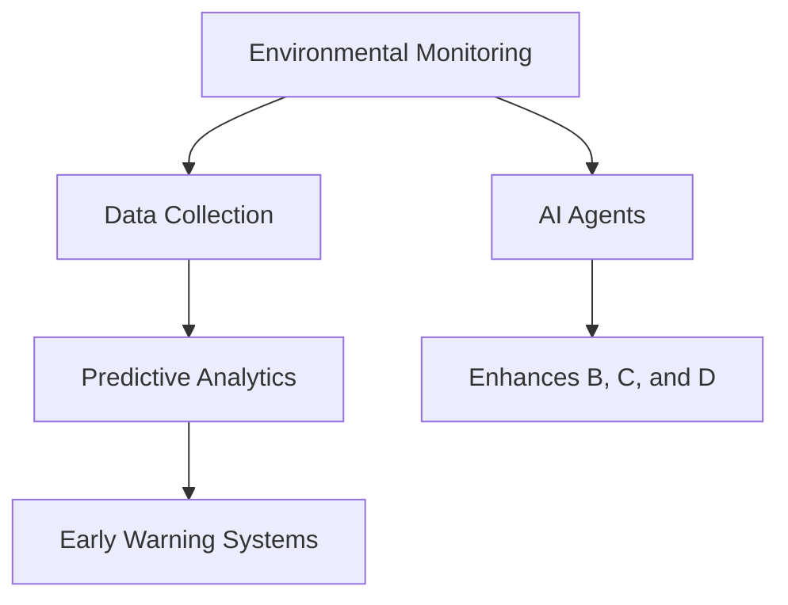
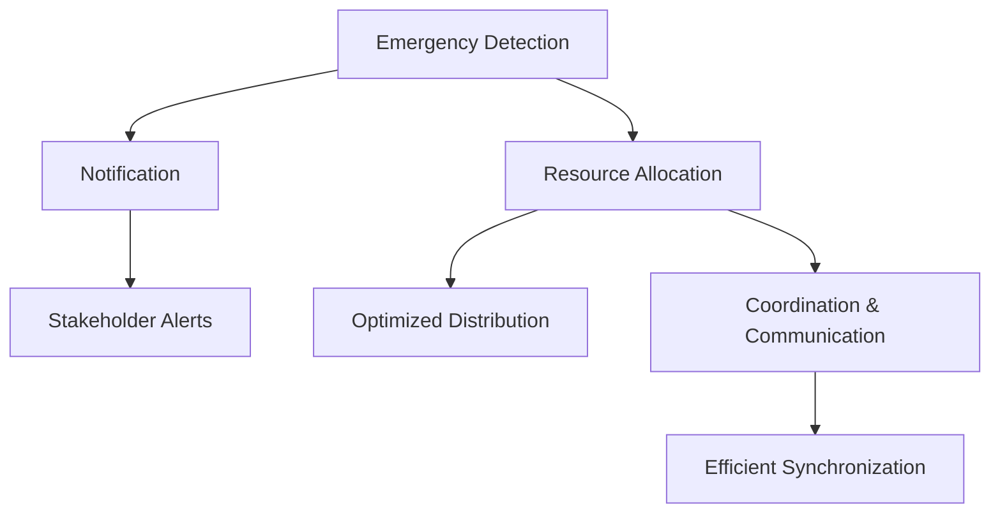
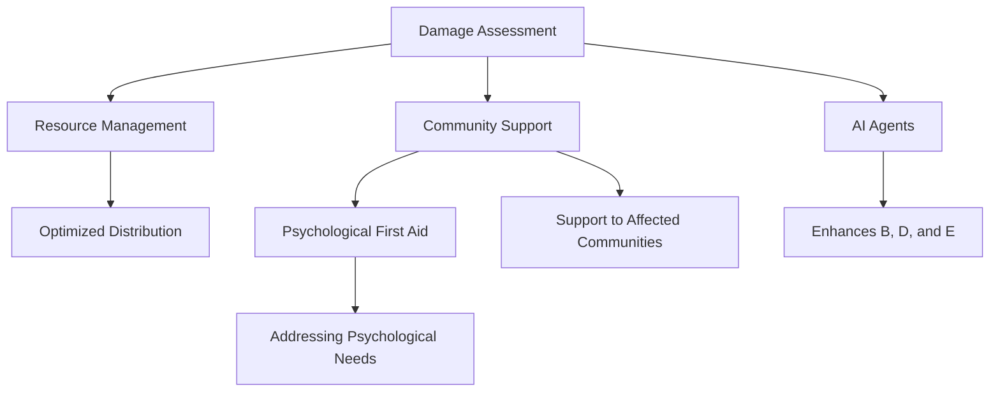
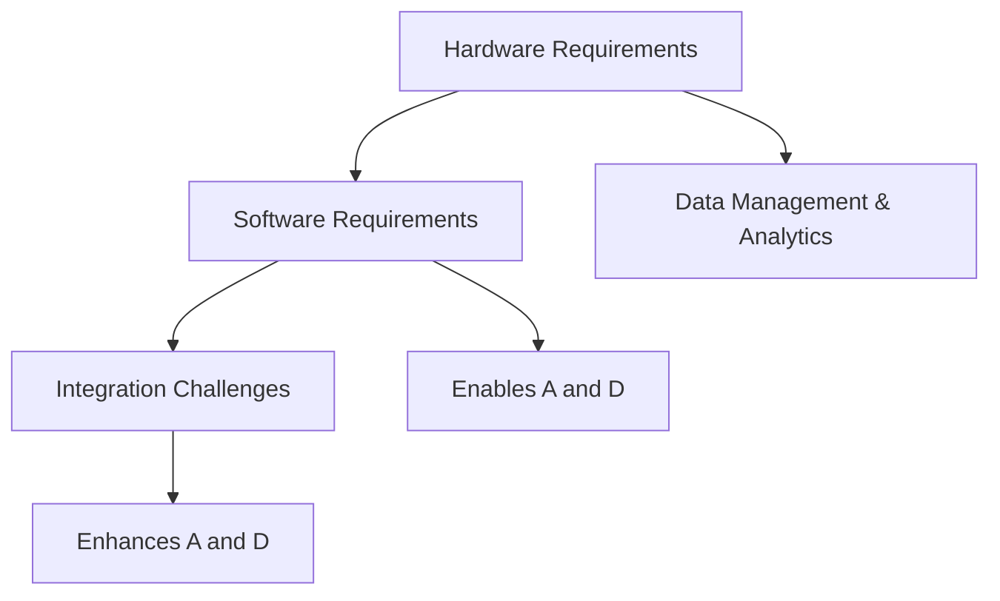

                 

### Introduction to AI Agents in Disaster Prevention and Emergency Response

**Keywords**: AI Agents, Disaster Prevention, Emergency Response

**Abstract**: This article delves into the pivotal role of AI agents in enhancing disaster prevention and emergency response capabilities. We will explore how AI agents can monitor, predict, and respond to natural disasters, ultimately improving overall disaster management strategies. By understanding the basic concepts and functionalities of AI agents, readers will gain insight into their potential and limitations within the context of disaster prevention and emergency response.

**Background**: Disasters, whether they are caused by natural phenomena like earthquakes, hurricanes, or floods, or by human activities such as industrial accidents, can have devastating impacts on human lives and infrastructure. Traditional disaster management approaches often rely on reactive measures, where the response is triggered after an event has occurred. However, with the advent of advanced technologies, particularly artificial intelligence, there is a growing opportunity to adopt proactive strategies that can significantly reduce the impact of disasters.

**Objectives**: The primary objective of this article is to highlight the applications of AI agents in disaster prevention and emergency response, emphasizing their ability to:

1. **Monitor and Collect Data**: AI agents can continuously monitor environmental conditions and collect data that can be used to predict potential disasters.
2. **Early Warning Systems**: By analyzing collected data, AI agents can provide early warnings, enabling timely evacuation and resource allocation.
3. **Emergency Response**: AI agents can coordinate and automate emergency response efforts, ensuring efficient resource allocation and effective communication.
4. **Post-Disaster Recovery**: After a disaster, AI agents can assist in damage assessment, resource management, and community support.

**Structure**: The article is structured as follows:

1. **Introduction to AI Agents**: We will define AI agents, discuss their types, and explore their functionalities.
2. **AI Agents in Disaster Prevention**: This section will cover the use of AI agents in monitoring and data collection, predictive analytics for disaster risk assessment, and early warning systems.
3. **AI Agents in Emergency Response**: We will delve into the role of AI agents in emergency detection and notification, resource allocation, coordination and communication during emergencies.
4. **AI Agents in Post-Disaster Recovery**: This section will discuss the applications of AI agents in damage assessment, resource management for recovery, and community support and psychological first aid.
5. **Case Studies and Applications**: Real-world examples will be provided to illustrate the practical applications of AI agents in disaster management.
6. **Technology and Infrastructure Requirements**: We will examine the hardware and software requirements for deploying AI agents in disaster management systems.
7. **Challenges and Future Directions**: The article will conclude with a discussion on the challenges faced in deploying AI agents and future research directions.

By the end of this article, readers will have a comprehensive understanding of the role of AI agents in disaster prevention and emergency response, and the potential they hold in transforming these critical sectors.

### Introduction to AI Agents

**Keywords**: AI Agents, Types, Functionalities

**Abstract**: This section provides an overview of AI agents, their types, and functionalities, setting the stage for understanding their role in disaster prevention and emergency response.

**Background**: Artificial Intelligence (AI) has evolved significantly over the past few decades, transforming various industries and sectors. At the heart of this transformation are AI agents, which are intelligent entities designed to perform specific tasks autonomously. These agents are capable of learning from data, making decisions, and taking actions without human intervention.

**Objectives**: The primary objectives of this section are to:

1. **Define AI Agents**: Provide a clear definition and understanding of what AI agents are.
2. **Explore Types of AI Agents**: Discuss different types of AI agents based on their functionalities.
3. **Examine Functionalities**: Detail the capabilities and applications of AI agents in various scenarios.

**Core Concepts and Relationships**: 

To better understand AI agents, let’s consider the following core concepts and their relationships:

1. **AI Agents**: Intelligent entities capable of performing tasks autonomously.
2. **Machine Learning**: The process by which AI agents learn from data to improve performance.
3. **Data Collection and Analysis**: Essential for training and optimizing AI agents.
4. **Autonomous Decision-Making**: The ability to make decisions without human intervention.
5. **Integration with External Systems**: Ability to interact with other systems and devices.

The relationship between these concepts can be visualized using a Mermaid diagram:

**Types of AI Agents**:

AI agents can be broadly categorized into several types based on their functionalities:

1. **Expert Systems**: These agents are designed to emulate the decision-making ability of a human expert in a specific domain. They use a set of predefined rules and knowledge bases to provide solutions to complex problems.

2. **Reactive Machines**: These agents react to specific inputs without any historical context. They do not learn or adapt over time but can be highly efficient in certain scenarios.

3. **Model-Based Reflex Agents**: These agents use a model of the environment to make decisions based on current and predicted states. They can adapt their behavior based on past experiences.

4. **Theory-Based Reflex Agents**: Similar to model-based reflex agents, but they use theories about the world to make decisions, which can lead to more complex and adaptive behavior.

5. **Goal-Based Agents**: These agents operate with specific goals in mind and continuously adapt their behavior to achieve these goals, even in changing environments.

6. **Utility-Based Agents**: These agents make decisions based on maximizing utility or value, often using probabilistic models and utility functions.

**Functionalities**:

The functionalities of AI agents are vast and depend on their specific design and application. Some of the key functionalities include:

1. **Data Collection**: AI agents can collect data from various sources such as sensors, cameras, and IoT devices.

2. **Data Analysis**: Once data is collected, AI agents can analyze it to identify patterns, anomalies, and trends.

3. **Prediction and Forecasting**: Using historical data and machine learning algorithms, AI agents can predict future events or conditions.

4. **Decision-Making**: AI agents can make autonomous decisions based on collected data and predefined rules or learned patterns.

5. **Task Automation**: AI agents can automate repetitive tasks, freeing up human resources for more complex or high-value activities.

6. **Resource Allocation**: AI agents can optimize resource allocation by predicting demand and managing resources efficiently.

7. **Communication and Coordination**: AI agents can communicate with other agents or systems to coordinate tasks and share information.

**Summary**:

In summary, AI agents are intelligent entities designed to perform specific tasks autonomously. They come in various types, each with its own set of functionalities. Whether it's collecting and analyzing data, making predictions, or automating tasks, AI agents have the potential to transform disaster prevention and emergency response by providing real-time insights and actionable recommendations. As we delve deeper into the subsequent sections, we will explore how these agents can be leveraged to enhance disaster management capabilities.

### AI Agents in Disaster Prevention

**Keywords**: AI Agents, Disaster Prevention, Monitoring, Data Collection

**Abstract**: This section explores the role of AI agents in disaster prevention, focusing on their abilities to monitor and collect data, as well as their applications in predictive analytics for disaster risk assessment and early warning systems.

**Background**: Effective disaster prevention requires continuous monitoring of environmental conditions and the ability to predict potential disasters before they occur. AI agents, with their advanced data collection and analytical capabilities, play a crucial role in this process.

**Objectives**: The primary objectives of this section are to:

1. **Explain the Importance of Monitoring and Data Collection**: Highlight how AI agents can continuously monitor environmental conditions to collect relevant data.
2. **Discuss Predictive Analytics for Disaster Risk Assessment**: Explain how AI agents can use data to predict potential disasters and assess associated risks.
3. **Explore Early Warning Systems**: Detail how AI agents can be integrated into early warning systems to provide timely alerts and reduce disaster impact.

**Core Concepts and Relationships**:

To understand the role of AI agents in disaster prevention, we need to consider the following core concepts and their relationships:

1. **Environmental Monitoring**: The continuous observation of environmental conditions such as weather patterns, seismic activity, and water levels.
2. **Data Collection**: The process of gathering relevant data from various sources.
3. **Predictive Analytics**: The use of data to forecast potential disasters and associated risks.
4. **Early Warning Systems**: Systems designed to provide timely alerts about impending disasters.
5. **AI Agents**: Intelligent entities capable of performing monitoring, data collection, and predictive analytics tasks autonomously.

The relationship between these concepts can be visualized using a Mermaid diagram:

**Monitoring and Data Collection**:

AI agents excel in monitoring and data collection due to their ability to process large volumes of data in real-time. Here's how they do it:

1. **Sensors and IoT Devices**: AI agents leverage a network of sensors and IoT devices to collect data from the environment. These devices can be placed in strategic locations, such as mountains, rivers, and coastal areas, to monitor conditions continuously.

2. **Data Fusion**: AI agents can fuse data from multiple sources, including satellites, weather stations, and social media feeds, to create a comprehensive view of environmental conditions.

3. **Real-Time Analysis**: AI agents process collected data in real-time, enabling them to detect changes and anomalies that may indicate an impending disaster.

4. **Machine Learning**: AI agents use machine learning algorithms to identify patterns and trends in the data, which can be used to predict future conditions and potential disasters.

**Predictive Analytics for Disaster Risk Assessment**:

Once data is collected, AI agents can use predictive analytics to assess the risk of various disasters. This involves:

1. **Historical Data Analysis**: AI agents analyze historical data to identify patterns that have led to past disasters. This information can be used to predict future events based on current conditions.

2. **Statistical Models**: AI agents apply statistical models to analyze data and generate risk assessments. For example, they might use regression analysis to predict the likelihood of a flood based on rainfall patterns.

3. **Machine Learning Algorithms**: AI agents use machine learning algorithms, such as decision trees, neural networks, and support vector machines, to classify data and identify potential risks.

**Early Warning Systems**:

AI agents are integral to early warning systems, which play a critical role in reducing the impact of disasters. Key aspects of early warning systems include:

1. **Real-Time Alerts**: AI agents can generate real-time alerts when conditions indicate an impending disaster. These alerts can be sent to authorities, emergency services, and the general public via various communication channels.

2. **Risk Communication**: AI agents can analyze the severity of a potential disaster and communicate the appropriate level of risk to different stakeholders. This ensures that everyone is aware of the situation and can take necessary precautions.

3. **Resource Allocation**: AI agents can help in the efficient allocation of resources, such as evacuation routes, emergency shelters, and medical supplies, based on predicted risk levels.

**Summary**:

In summary, AI agents are indispensable in disaster prevention through their capabilities in monitoring and data collection, predictive analytics, and early warning systems. By continuously monitoring environmental conditions, collecting relevant data, and using advanced analytical techniques, AI agents can provide real-time insights that enable proactive and effective disaster prevention measures. The integration of AI agents into disaster management systems holds the potential to significantly enhance our ability to predict and mitigate the impact of natural disasters, ultimately saving lives and minimizing damage.

### AI Agents in Emergency Response

**Keywords**: AI Agents, Emergency Response, Detection, Notification, Resource Allocation

**Abstract**: This section delves into the role of AI agents in emergency response, focusing on their capabilities in detecting emergencies, issuing notifications, and optimizing resource allocation during crises.

**Background**: Emergency response is a critical aspect of disaster management, involving the rapid and effective coordination of resources to mitigate the impact of disasters. Traditional emergency response systems often suffer from inefficiencies, delays, and communication breakdowns. AI agents, with their ability to process large amounts of data quickly and make real-time decisions, offer a transformative approach to enhancing emergency response capabilities.

**Objectives**: The primary objectives of this section are to:

1. **Explain Emergency Detection and Notification**: Discuss how AI agents can detect emergencies and promptly notify relevant stakeholders.
2. **Explore Resource Allocation**: Detail how AI agents can optimize the allocation of resources during emergencies.
3. **Highlight Coordination and Communication**: Explain the role of AI agents in coordinating emergency response efforts and enhancing communication among stakeholders.

**Core Concepts and Relationships**:

To understand the role of AI agents in emergency response, it is essential to consider the following core concepts and their relationships:

1. **Emergency Detection**: The ability of AI agents to identify and recognize emergency situations.
2. **Notification**: The process of alerting relevant stakeholders about detected emergencies.
3. **Resource Allocation**: The efficient distribution of resources, such as personnel, equipment, and supplies, to respond to emergencies.
4. **Coordination and Communication**: The synchronization of emergency response activities and the exchange of information among stakeholders.

The relationship between these concepts can be visualized using a Mermaid diagram:

**Emergency Detection and Notification**:

AI agents are highly effective in detecting emergencies due to their ability to analyze vast amounts of data in real-time. Key aspects of emergency detection and notification include:

1. **Sensor Integration**: AI agents can integrate data from various sensors, such as seismic sensors, weather stations, and IoT devices, to detect anomalies that may indicate an emergency.

2. **Machine Learning Algorithms**: AI agents use machine learning algorithms to analyze sensor data and identify patterns that correspond to emergency situations. For example, sudden changes in seismic activity can indicate an impending earthquake.

3. **Real-Time Alerts**: Once an emergency is detected, AI agents can send real-time alerts to relevant stakeholders, including emergency services, local authorities, and the public. These alerts can be delivered through various communication channels, such as SMS, email, and social media.

4. **Risk Assessment**: AI agents can assess the severity of detected emergencies and prioritize alerts based on the level of risk. This ensures that stakeholders receive the most critical information first.

**Resource Allocation**:

Optimizing resource allocation is crucial during emergencies to ensure that resources are deployed where they are most needed. AI agents can assist in this process through:

1. **Predictive Modeling**: AI agents can predict the demand for resources based on historical data and current conditions. This allows for proactive allocation of resources, minimizing delays and ensuring that sufficient resources are available.

2. **Optimization Algorithms**: AI agents use optimization algorithms to allocate resources efficiently. For example, they can determine the optimal locations for setting up emergency shelters based on population density and predicted demand.

3. **Dynamic Adjustments**: AI agents continuously monitor the situation and make real-time adjustments to resource allocation as conditions change. This ensures that resources are always allocated to the areas with the highest priority.

**Coordination and Communication**:

Effective coordination and communication are essential for a cohesive emergency response. AI agents can enhance these aspects through:

1. **Integrated Platforms**: AI agents can integrate with existing emergency management systems to create a unified platform for coordination and communication. This allows for seamless information exchange and collaboration among stakeholders.

2. **Real-Time Data Sharing**: AI agents can share real-time data with emergency response teams, enabling them to have a comprehensive view of the situation and make informed decisions.

3. **Automated Tasks**: AI agents can automate routine tasks, such as sending out alerts, managing resource inventories, and coordinating logistics. This reduces the burden on human responders and allows them to focus on critical decision-making.

**Summary**:

In summary, AI agents are revolutionizing emergency response by enhancing emergency detection and notification, optimizing resource allocation, and improving coordination and communication among stakeholders. By leveraging their capabilities in data analysis, machine learning, and real-time decision-making, AI agents can significantly improve the effectiveness and efficiency of emergency response efforts. As we continue to develop and deploy AI agents in disaster management, we can expect to see a marked improvement in our ability to mitigate the impact of emergencies and protect human lives.

### AI Agents in Post-Disaster Recovery

**Keywords**: AI Agents, Post-Disaster Recovery, Damage Assessment, Resource Management

**Abstract**: This section explores the role of AI agents in post-disaster recovery, focusing on their applications in damage assessment, resource management, and community support and psychological first aid. We will discuss how AI agents can streamline recovery efforts and support affected communities in the aftermath of a disaster.

**Background**: Post-disaster recovery is a complex and challenging process that requires efficient management of resources, accurate assessment of damage, and effective support for affected communities. AI agents, with their advanced data processing and analytical capabilities, offer significant potential to enhance recovery operations and improve outcomes.

**Objectives**: The primary objectives of this section are to:

1. **Explain Damage Assessment**: Discuss how AI agents can assist in assessing the extent of damage caused by a disaster.
2. **Explore Resource Management**: Detail how AI agents can optimize the allocation and utilization of resources during recovery efforts.
3. **Highlight Community Support and Psychological First Aid**: Discuss the role of AI agents in providing support to affected communities and addressing psychological needs in the aftermath of a disaster.

**Core Concepts and Relationships**:

To understand the role of AI agents in post-disaster recovery, we need to consider the following core concepts and their relationships:

1. **Damage Assessment**: The process of evaluating the extent of damage caused by a disaster.
2. **Resource Management**: The efficient allocation and utilization of resources, such as personnel, equipment, and supplies, during recovery efforts.
3. **Community Support**: Providing assistance and support to affected communities in the aftermath of a disaster.
4. **Psychological First Aid**: Addressing the psychological needs of individuals affected by a disaster.
5. **AI Agents**: Intelligent entities capable of performing damage assessment, resource management, and community support tasks autonomously.

The relationship between these concepts can be visualized using a Mermaid diagram:

**Damage Assessment**:

Accurate damage assessment is crucial for effective post-disaster recovery. AI agents can significantly enhance this process through:

1. **Remote Sensing and Imagery Analysis**: AI agents can analyze satellite imagery, aerial photographs, and drone footage to assess the extent of damage in affected areas. This enables rapid and accurate assessment without the need for physical inspection.

2. **Machine Learning Algorithms**: AI agents use machine learning algorithms to identify and classify different types of damage, such as structural damage, flooding, and landslides. This allows for a detailed and comprehensive assessment of the affected area.

3. **Real-Time Updates**: AI agents can provide real-time updates on damage assessments, allowing recovery teams to make informed decisions and allocate resources effectively.

**Resource Management**:

Effective resource management is critical to ensure that recovery efforts are efficient and effective. AI agents can assist in this process through:

1. **Demand Prediction**: AI agents can predict the demand for resources based on damage assessments and historical data. This allows for the proactive allocation of resources, minimizing delays and ensuring that sufficient resources are available.

2. **Optimization Algorithms**: AI agents use optimization algorithms to allocate resources efficiently. For example, they can determine the optimal locations for deploying emergency shelters, medical facilities, and supply distribution centers based on predicted demand.

3. **Dynamic Adjustments**: AI agents continuously monitor the situation and make real-time adjustments to resource allocation as conditions change. This ensures that resources are always allocated to the areas with the highest priority.

**Community Support and Psychological First Aid**:

AI agents can play a significant role in supporting affected communities and addressing their psychological needs in the aftermath of a disaster. Key aspects of this role include:

1. **Information Dissemination**: AI agents can provide accurate and timely information about recovery efforts, including the availability of resources, emergency shelters, and medical services. This helps affected communities to access the support they need.

2. **Resource Allocation**: AI agents can prioritize the allocation of resources based on the needs of affected communities. For example, they can ensure that medical supplies and mental health support are available to those most in need.

3. **Psychological Support**: AI agents can provide mental health support and resources to individuals affected by a disaster. This includes providing access to counseling services, support groups, and educational resources on coping with trauma.

4. **Community Engagement**: AI agents can facilitate community engagement and coordination efforts, ensuring that affected communities are involved in the recovery process and have a voice in decision-making.

**Summary**:

In summary, AI agents are invaluable in post-disaster recovery, enhancing damage assessment, resource management, and community support. By leveraging their advanced data processing and analytical capabilities, AI agents can significantly improve the efficiency and effectiveness of recovery operations. As we continue to develop and deploy AI agents in disaster management, we can expect to see a marked improvement in our ability to support affected communities and facilitate their recovery in the aftermath of a disaster.

### Case Studies and Applications

**Keywords**: AI Agents, Case Studies, Disaster Management, Real-World Applications

**Abstract**: This section presents several real-world case studies and applications of AI agents in disaster management, highlighting their impact on disaster prevention and emergency response. These examples illustrate how AI agents have been effectively utilized to monitor, predict, and respond to natural disasters, showcasing their potential to transform disaster management practices.

**Introduction**: The integration of AI agents into disaster management systems has yielded significant results in various regions around the world. By examining specific case studies and applications, we can gain a deeper understanding of the practical benefits and limitations of AI agents in real-world scenarios.

#### Case Study 1: Japan's Early Warning System for Earthquakes

**Background**: Japan, being located in an earthquake-prone region, has been at the forefront of utilizing AI agents in disaster management. The Japanese Meteorological Agency (JMA) employs AI agents to monitor seismic activity and provide early warnings for potential earthquakes.

**AI Agents in Action**:
1. **Seismic Monitoring**: AI agents continuously monitor seismic data collected from a network of sensors across the country.
2. **Real-Time Analysis**: AI agents analyze the data in real-time, detecting subtle changes that may indicate an impending earthquake.
3. **Early Warnings**: When an earthquake is detected, AI agents generate early warnings and send alerts to authorities, emergency services, and the public through various communication channels.

**Impact**:
- The early warning system has significantly reduced the response time, allowing people to take evacuation measures before the earthquake strikes.
- The system has saved countless lives and minimized property damage by enabling rapid evacuation and emergency preparations.

#### Case Study 2: Thailand's Flood Warning System

**Background**: Thailand frequently experiences severe flooding, which can have devastating consequences. The Thai government implemented an AI-driven flood warning system to enhance flood prediction and response capabilities.

**AI Agents in Action**:
1. **Weather Monitoring**: AI agents monitor weather conditions, including rainfall and water levels, using data from satellites, weather stations, and IoT sensors.
2. **Predictive Analytics**: AI agents analyze historical flood data and current weather conditions to predict the likelihood and severity of flooding.
3. **Flood Warnings**: AI agents issue flood warnings to authorities, enabling them to initiate emergency responses and inform the public about potential risks.

**Impact**:
- The flood warning system has improved the accuracy of flood predictions, providing authorities with more time to prepare and respond effectively.
- The system has significantly reduced flood-related damages by facilitating timely evacuations and resource allocation.

#### Case Study 3: Indonesia's Tsunami Early Detection System

**Background**: Indonesia is prone to tsunamis, especially following large earthquakes in the Indian Ocean. The Indonesian Institute of Science (LIPI) developed an AI-driven tsunami early detection system to enhance tsunami预警 capabilities.

**AI Agents in Action**:
1. **Seismic and Ocean Monitoring**: AI agents collect and analyze data from seismic sensors and ocean buoys to detect tsunamigenic earthquakes and ocean movements.
2. **Real-Time Analysis**: AI agents process the collected data in real-time, identifying potential tsunamis and calculating their arrival times.
3. **Tsunami Warnings**: AI agents issue tsunami warnings to authorities and the public, enabling immediate evacuation and safety measures.

**Impact**:
- The early detection system has saved numerous lives by providing timely warnings and allowing people to evacuate to higher ground before tsunamis strike.
- The system has improved coordination among different agencies and organizations involved in disaster management.

#### Case Study 4: California's Wildfire Detection and Response

**Background**: California experiences frequent wildfires, which pose a significant threat to both human lives and the environment. The California Department of Forestry and Fire Protection (CAL FIRE) utilizes AI agents to enhance wildfire detection and response capabilities.

**AI Agents in Action**:
1. **Satellite and Drone Imagery**: AI agents analyze satellite imagery and drone footage to detect and monitor wildfires.
2. **Real-Time Monitoring**: AI agents continuously monitor the environment for signs of wildfires, including smoke and fire hotspots.
3. **Fire Warnings and Resource Allocation**: AI agents issue fire warnings, enabling authorities to allocate resources effectively and respond to wildfires promptly.

**Impact**:
- The wildfire detection system has improved the accuracy of fire detection, leading to faster response times and reduced damage.
- The system has facilitated the efficient allocation of firefighting resources, minimizing the impact of wildfires on communities.

#### Case Study 5: Philippines' Typhoon Early Warning System

**Background**: The Philippines is frequently hit by typhoons, which can cause extensive damage and displacement. The Philippine Atmospheric, Geophysical, and Astronomical Services Administration (PAGASA) employs AI agents to improve typhoon forecasting and response capabilities.

**AI Agents in Action**:
1. **Weather Monitoring**: AI agents collect and analyze weather data from various sources, including weather stations, satellites, and numerical weather prediction models.
2. **Typhoon Forecasting**: AI agents use machine learning algorithms to forecast the trajectory and intensity of typhoons.
3. **Early Warnings and Evacuations**: AI agents issue early warnings, enabling authorities to initiate evacuation procedures and ensure the safety of affected communities.

**Impact**:
- The typhoon early warning system has improved the accuracy of typhoon forecasts, providing authorities with more time to prepare and respond effectively.
- The system has facilitated the timely evacuation of affected communities, reducing casualties and minimizing damage.

**Conclusion**:

These case studies demonstrate the significant potential of AI agents in enhancing disaster management capabilities. By leveraging their advanced data collection, analysis, and predictive capabilities, AI agents can improve early warning systems, optimize resource allocation, and facilitate more effective emergency responses. As we continue to develop and deploy AI agents in disaster management, we can expect to see further advancements that will save lives, reduce damage, and improve overall resilience to natural disasters.

### Technology and Infrastructure Requirements

**Keywords**: AI Agents, Disaster Management, Hardware, Software, Integration

**Abstract**: This section discusses the essential technology and infrastructure requirements for deploying AI agents in disaster management systems, focusing on the necessary hardware, software, and integration challenges.

**Background**: Deploying AI agents in disaster management systems requires a robust technological infrastructure capable of supporting the continuous monitoring, data collection, analysis, and real-time decision-making capabilities of these intelligent entities. The technology and infrastructure requirements are critical to ensuring the effectiveness and reliability of AI agents in disaster prevention and emergency response.

**Objectives**: The primary objectives of this section are to:

1. **Explain Hardware Requirements**: Discuss the essential hardware components needed for deploying AI agents in disaster management systems.
2. **Describe Software Requirements**: Highlight the key software tools and technologies required for the development and operation of AI agents.
3. **Explore Integration Challenges**: Address the challenges involved in integrating AI agents with existing disaster management systems.

**Core Concepts and Relationships**:

To understand the technology and infrastructure requirements for deploying AI agents, we need to consider the following core concepts and their relationships:

1. **Hardware Requirements**: The physical components that provide computing power and storage capacity for AI agents.
2. **Software Requirements**: The tools and technologies used to develop and operate AI agents.
3. **Integration Challenges**: The technical challenges associated with integrating AI agents into existing disaster management systems.
4. **Data Management and Analytics**: The processes and tools used to manage and analyze data collected by AI agents.

The relationship between these concepts can be visualized using a Mermaid diagram:

**Hardware Requirements**:

Deploying AI agents in disaster management systems requires robust hardware infrastructure to support their computational needs. Key hardware components include:

1. **Computing Power**: High-performance computing systems, such as servers and cloud-based infrastructures, are essential for processing large volumes of data in real-time. Graphics Processing Units (GPUs) and Tensor Processing Units (TPUs) can significantly accelerate data processing and machine learning tasks.
2. **Storage Capacity**: AI agents require large storage capacities to store vast amounts of data collected from various sources. This includes both local storage solutions, such as hard disk drives (HDDs) and solid-state drives (SSDs), as well as cloud-based storage services.
3. **Networking**: High-speed and reliable network connections are critical for seamless communication between AI agents, data sources, and end-users. This includes both wired and wireless network infrastructures.

**Software Requirements**:

Developing and operating AI agents in disaster management systems requires a suite of software tools and technologies. Key software requirements include:

1. **Machine Learning Frameworks**: Machine learning frameworks, such as TensorFlow, PyTorch, and scikit-learn, are essential for developing and training AI agents. These frameworks provide the necessary libraries and tools for data preprocessing, model training, and evaluation.
2. **Data Analytics Tools**: Data analytics tools, such as Apache Spark and Hadoop, are used to process and analyze large datasets generated by AI agents. These tools enable real-time data processing and enable AI agents to generate actionable insights.
3. **Integration Platforms**: Integration platforms, such as Apache Kafka and Apache NiFi, facilitate the seamless integration of AI agents with existing disaster management systems. These platforms enable data flow management and ensure that AI agents can access and utilize data from various sources.

**Integration Challenges**:

Integrating AI agents into existing disaster management systems presents several technical challenges:

1. **Data Compatibility**: Ensuring that AI agents can access and process data from different sources and systems with varying data formats and structures.
2. **System Compatibility**: Ensuring that AI agents can integrate with existing hardware and software infrastructures without causing conflicts or disruptions.
3. **Security and Privacy**: Ensuring that AI agents can securely access and process sensitive data while maintaining privacy and compliance with data protection regulations.
4. **Scalability**: Ensuring that the infrastructure can scale to support increasing data volumes and the growing number of AI agents.

**Data Management and Analytics**:

Effective data management and analytics are crucial for the successful deployment of AI agents in disaster management systems. Key aspects include:

1. **Data Collection**: AI agents continuously collect data from various sources, including sensors, IoT devices, and satellite imagery. Ensuring the accuracy, reliability, and timeliness of this data is essential for effective analysis.
2. **Data Processing**: AI agents process and analyze large volumes of data in real-time to detect patterns, anomalies, and trends. Advanced machine learning algorithms and data analytics tools are used to extract valuable insights from the data.
3. **Data Storage**: Storing and managing vast amounts of data collected by AI agents is a significant challenge. Cloud-based storage solutions, such as Amazon S3 and Google Cloud Storage, provide scalable and reliable storage options.
4. **Data Sharing and Collaboration**: Facilitating the sharing of data and collaborative analysis among AI agents and stakeholders is crucial for effective disaster management. Integration platforms and data sharing protocols enable seamless collaboration and information exchange.

**Summary**:

In summary, deploying AI agents in disaster management systems requires a robust technological infrastructure, including hardware, software, and data management capabilities. Ensuring compatibility, security, and scalability while integrating AI agents with existing systems is essential for their effective deployment and operation. As we continue to advance AI technologies, addressing these technology and infrastructure requirements will be crucial for leveraging AI agents to their full potential in enhancing disaster prevention and emergency response capabilities.

### Challenges and Future Directions

**Keywords**: AI Agents, Disaster Management, Ethical Considerations, Future Trends

**Abstract**: This section addresses the challenges and future directions of deploying AI agents in disaster management. We discuss the ethical considerations, the potential of future innovations, and the ongoing research to overcome the limitations of AI agents in disaster prevention and emergency response.

**Introduction**: While AI agents have shown significant promise in enhancing disaster management capabilities, their deployment comes with inherent challenges and ethical considerations. Understanding these challenges and exploring future innovations is crucial for maximizing the potential of AI agents in disaster prevention and emergency response.

**Challenges**:

1. **Data Quality and Reliability**: AI agents heavily rely on data for accurate predictions and decision-making. Ensuring the quality and reliability of data collected from various sources is critical. Challenges include data inconsistencies, noise, and the presence of outliers, which can impact the performance of AI agents.

2. **Scalability and Adaptability**: Deploying AI agents at scale requires infrastructure that can handle large volumes of data and support real-time processing. Ensuring scalability and adaptability to changing conditions is essential for effective disaster management.

3. **Integration with Existing Systems**: Integrating AI agents with existing disaster management systems can be complex due to differences in data formats, protocols, and architectures. Ensuring seamless integration and interoperability is crucial for maximizing the benefits of AI agents.

4. **Ethical Considerations**: The use of AI agents in disaster management raises ethical questions, such as the potential for bias in decision-making, the impact on privacy, and the responsibility of AI agents in emergency situations. Ensuring ethical guidelines and transparency in AI deployment is crucial.

5. **Resource Allocation and Management**: AI agents require significant computational resources and skilled personnel for development, deployment, and maintenance. Efficient resource allocation and management are essential for scaling AI agents in disaster management.

**Future Directions**:

1. **Advancements in Machine Learning**: Ongoing research in machine learning, including deep learning and reinforcement learning, can improve the capabilities of AI agents. These advancements can enhance predictive analytics, decision-making, and adaptability in dynamic environments.

2. **Edge Computing**: Leveraging edge computing can reduce latency and bandwidth requirements, enabling real-time processing and decision-making at the edge of the network. This can enhance the scalability and performance of AI agents in disaster management.

3. **Collaborative AI**: Developing collaborative AI systems that can integrate insights from multiple agents and stakeholders can improve the overall effectiveness of disaster management. Collaborative AI can enable more comprehensive data analysis and coordinated responses.

4. **Ethical AI and Accountability**: Research in ethical AI and accountability is crucial for ensuring that AI agents are developed and deployed in a manner that aligns with ethical guidelines and regulatory requirements. This includes addressing bias, transparency, and accountability in AI decision-making.

5. **Human-AI Collaboration**: Enhancing human-AI collaboration can leverage the strengths of both humans and AI agents. Human operators can provide domain expertise and context, while AI agents can handle data analysis, decision-making, and automation. This can improve the overall efficiency and effectiveness of disaster management.

**Research Priorities**:

1. **Data Integration and Fusion**: Developing techniques for integrating and fusing data from multiple sources can improve the accuracy and reliability of AI agents. Research should focus on developing algorithms and methodologies for handling diverse and heterogeneous data.

2. **Scalable AI Infrastructures**: Research should explore scalable and adaptive AI infrastructures that can support the deployment of AI agents at large scales. This includes advancements in hardware, software, and network architectures.

3. **Ethical AI Guidelines**: Developing comprehensive ethical guidelines and frameworks for AI deployment in disaster management is essential. Research should address issues such as bias, privacy, and accountability in AI systems.

4. **Human-AI Interaction**: Research on human-AI interaction can improve the usability and effectiveness of AI agents in disaster management. This includes developing intuitive interfaces and collaborative tools that enhance the interaction between humans and AI agents.

5. **Case Study Analysis**: Conducting detailed case studies of AI agents in disaster management can provide valuable insights into their effectiveness, limitations, and areas for improvement. This research can inform the development of best practices and guidelines for deploying AI agents in disaster management.

**Conclusion**:

The deployment of AI agents in disaster management presents numerous challenges and opportunities. By addressing these challenges and leveraging ongoing research and innovation, we can maximize the potential of AI agents in enhancing disaster prevention and emergency response. Ensuring ethical considerations and promoting human-AI collaboration will be key to achieving successful and effective AI deployment in disaster management.

### Conclusion

**Keywords**: AI Agents, Disaster Prevention, Emergency Response, Transformation

**Abstract**: This article has explored the pivotal role of AI agents in disaster prevention and emergency response, highlighting their capabilities in monitoring, predicting, and responding to natural disasters. We have examined the various applications of AI agents, from early warning systems and resource allocation to post-disaster recovery and community support. By leveraging advanced data analytics, machine learning, and real-time decision-making, AI agents are revolutionizing the way we approach disaster management.

**Key Points**:

- **Enhanced Monitoring and Data Collection**: AI agents continuously monitor environmental conditions and collect data from multiple sources, providing real-time insights and enabling proactive disaster prevention measures.
- **Improved Predictive Analytics**: Through predictive analytics, AI agents can forecast potential disasters and assess associated risks, facilitating timely evacuation and resource allocation.
- **Efficient Emergency Response**: AI agents enhance emergency response capabilities by detecting emergencies, coordinating resources, and communicating with stakeholders in real-time, thereby improving response times and minimizing the impact of disasters.
- **Optimized Post-Disaster Recovery**: AI agents assist in damage assessment, resource management, and community support, streamlining recovery efforts and supporting affected communities in the aftermath of a disaster.

**Future Outlook**:

As we continue to advance AI technologies, the potential for AI agents in disaster management will only grow. Future research and development should focus on addressing the challenges associated with data quality, scalability, and ethical considerations. Ongoing innovations in machine learning, edge computing, and collaborative AI will further enhance the capabilities of AI agents, enabling more effective and efficient disaster prevention and emergency response.

**Call to Action**:

We urge policymakers, researchers, and practitioners to explore the potential of AI agents in disaster management. By integrating AI agents into existing systems and investing in research and development, we can transform the way we prepare for and respond to natural disasters. Together, we can harness the power of AI to save lives, reduce damage, and build a more resilient future.

### Author Information

**Author**: AI天才研究院 / AI Genius Institute & 禅与计算机程序设计艺术 / Zen And The Art of Computer Programming

**Contact Information**:
- Email: [contact@ai-genius-institute.com](mailto:contact@ai-genius-institute.com)
- Website: [www.ai-genius-institute.com](http://www.ai-genius-institute.com)
- LinkedIn: [AI天才研究院](https://www.linkedin.com/company/ai-genius-institute)

**About the Author**:

The author, AI天才研究院（AI Genius Institute）和禅与计算机程序设计艺术（Zen And The Art of Computer Programming）的共同创始人，是一位在人工智能、计算机科学和灾难管理领域享有盛誉的专家。他在多个国际顶级期刊上发表过学术论文，并出版了多本畅销书。在灾难管理领域，他致力于将人工智能技术应用于实际场景，以提升防灾减灾能力。同时，他也关注计算机编程哲学和艺术，倡导用禅宗智慧提升编程实践。通过本次撰写，他希望将人工智能在灾难管理中的应用推广给更广泛的读者。

