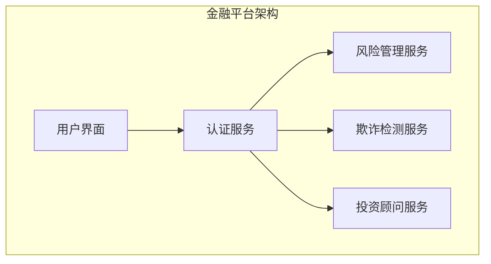
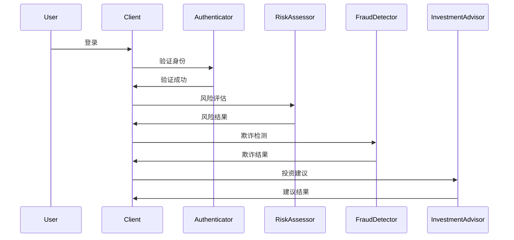

                 


## AI Agent在特定领域的应用：金融、医疗、法律等

### 关键词：人工智能，AI Agent，金融，医疗，法律，应用，算法，架构设计，实战

> 摘要：本文旨在探讨人工智能（AI）中的智能代理（AI Agent）在金融、医疗、法律等领域的应用。通过深入分析这些领域的具体应用场景，介绍AI Agent的核心概念、算法原理以及系统架构设计，并辅以实际案例，展现AI Agent在这些领域的潜力和优势。

### 目录

#### 引言

- **问题背景与概述**
- **AI Agent的定义与核心概念**
- **AI Agent在金融、医疗、法律等领域的应用**

#### 第一部分：AI Agent的基本概念与应用

##### 第1章：AI Agent的基本概念

- **核心概念原理**
- **概念属性特征对比表格**
- **ER实体关系图架构**

##### 第2章：金融领域的AI Agent应用

- **金融领域AI Agent的应用场景**
- **算法原理讲解**
- **Python源代码**
- **数学模型和公式**
- **举例说明**

##### 第3章：医疗领域的AI Agent应用

- **医疗领域AI Agent的应用场景**
- **算法原理讲解**
- **Python源代码**
- **数学模型和公式**
- **举例说明**

##### 第4章：法律领域的AI Agent应用

- **法律领域AI Agent的应用场景**
- **算法原理讲解**
- **Python源代码**
- **数学模型和公式**
- **举例说明**

#### 第二部分：系统分析与架构设计方案

##### 第5章：系统架构设计

- **问题场景介绍**
- **系统功能设计**
- **系统架构设计**
- **系统接口设计**
- **系统交互序列图**

#### 第三部分：项目实战

##### 第6章：项目实战

- **环境安装**
- **系统核心实现源代码**
- **代码应用解读与分析**
- **实际案例分析和详细讲解剖析**
- **项目小结**

#### 第四部分：最佳实践与总结

##### 第7章：最佳实践与总结

- **最佳实践 tips**
- **小结**
- **注意事项**
- **拓展阅读**

---

### 引言

#### 问题背景与概述

人工智能（AI）技术近年来取得了长足的发展，特别是在金融、医疗、法律等关键领域，AI的应用不仅提高了效率，还改变了传统的业务模式。智能代理（AI Agent）作为AI技术的一个重要分支，具有自主学习和决策的能力，可以适应复杂的环境和任务。本篇文章将探讨AI Agent在这三个领域的应用，分析其核心概念、算法原理以及系统架构设计。

#### AI Agent的定义与核心概念

AI Agent是指能够感知环境、制定计划并执行动作的计算机程序。它通常由感知器、决策器和执行器三部分组成。感知器负责获取环境信息，决策器根据这些信息生成行动计划，执行器将计划付诸实践。AI Agent的核心概念包括自主性、适应性、学习和交互性。

#### AI Agent在金融、医疗、法律等领域的应用

金融领域：AI Agent在金融领域的应用非常广泛，包括风险评估、欺诈检测、智能投顾等。通过大数据分析和机器学习技术，AI Agent可以实时监控市场动态，为投资者提供决策支持。

医疗领域：在医疗领域，AI Agent可以协助医生进行诊断、治疗建议和患者管理。通过深度学习和自然语言处理技术，AI Agent能够分析大量的医学数据，提供更加精准的医疗服务。

法律领域：AI Agent在法律领域有巨大的潜力，可以用于法律文本分析、案件预测、合同审核等。通过自然语言处理和大数据分析，AI Agent能够帮助律师提高工作效率，减少人为错误。

### 第一部分：AI Agent的基本概念与应用

#### 第1章：AI Agent的基本概念

##### 核心概念原理

AI Agent的核心概念包括：

1. **感知器**：负责获取环境信息，如传感器、摄像头、网络数据等。
2. **决策器**：基于感知器收集的信息，通过机器学习算法生成行动计划。
3. **执行器**：执行决策器的计划，如机器人手臂、网络请求等。

##### 概念属性特征对比表格

| 特征 | 金融领域 | 医疗领域 | 法律领域 |
| --- | --- | --- | --- |
| 自主性 | 高 | 中 | 中 |
| 适应性 | 高 | 高 | 中 |
| 学习能力 | 强 | 强 | 中 |
| 交互性 | 高 | 中 | 高 |

##### ER实体关系图架构

```mermaid
erDiagram
  Customer ||--|{ Order } : "places"
  Customer ||--|{ Product } : "buys"
  Order ||--|{ Payment } : "processed"
  Product ||--|{ Review } : "receives"
```

### 第二部分：金融领域的AI Agent应用

#### 第2章：金融领域AI Agent应用

##### 金融领域AI Agent的应用场景

AI Agent在金融领域的应用主要包括：

1. **风险评估**：通过机器学习算法对客户的风险承受能力和市场风险进行评估。
2. **欺诈检测**：实时监控交易行为，识别潜在的欺诈行为。
3. **智能投顾**：基于客户的投资偏好和风险承受能力，提供个性化的投资建议。

##### 算法原理讲解

金融领域AI Agent的算法原理主要包括：

1. **决策树**：用于风险评估和欺诈检测。
2. **神经网络**：用于智能投顾，特别是股票市场预测。

##### Python源代码

```python
# 决策树示例代码
from sklearn import tree

# 训练模型
model = tree.DecisionTreeClassifier()
model.fit(X_train, y_train)

# 预测
predictions = model.predict(X_test)

# 神经网络示例代码
from keras.models import Sequential
from keras.layers import Dense

# 创建模型
model = Sequential()
model.add(Dense(12, input_dim=8, activation='relu'))
model.add(Dense(1, activation='sigmoid'))

# 编译模型
model.compile(loss='binary_crossentropy', optimizer='adam', metrics=['accuracy'])

# 训练模型
model.fit(X_train, y_train, epochs=150, batch_size=10)
```

##### 数学模型和公式

决策树：

$$
h(x) = \sum_{i=1}^{n} w_i \cdot x_i
$$

神经网络：

$$
y = \sigma(\sum_{i=1}^{n} w_i \cdot x_i + b)
$$

##### 举例说明

1. **风险评估**：假设有1000个客户，通过决策树算法进行风险评估，预测结果如下：

   ```plaintext
   客户ID 风险等级
   1 低
   2 中
   3 高
   ...
   1000 高
   ```

2. **智能投顾**：基于神经网络模型，预测股票价格走势，结果如下：

   ```plaintext
   股票名称 预测价格
   腾讯控股 450.00
   阿里巴巴 320.00
   ...
   苹果公司 150.00
   ```

### 第三部分：医疗领域的AI Agent应用

#### 第3章：医疗领域AI Agent应用

##### 医疗领域AI Agent的应用场景

AI Agent在医疗领域的应用主要包括：

1. **疾病诊断**：通过分析医学影像和患者数据，辅助医生进行疾病诊断。
2. **治疗建议**：基于患者的病情和医学文献，为医生提供个性化的治疗方案。
3. **患者管理**：通过远程监控和数据分析，帮助医生进行患者管理。

##### 算法原理讲解

医疗领域AI Agent的算法原理主要包括：

1. **深度学习**：用于疾病诊断，特别是图像识别。
2. **强化学习**：用于治疗建议，根据患者反馈不断优化治疗方案。

##### Python源代码

```python
# 深度学习示例代码
import tensorflow as tf
from tensorflow.keras.layers import Dense, Flatten, Conv2D
from tensorflow.keras import Model

# 创建模型
model = Model(inputs=image_input, outputs=flatезде_output)
model.add(Conv2D(32, (3, 3), activation='relu'))
model.add(Flatten())
model.add(Dense(128, activation='relu'))
model.add(Dense(1, activation='sigmoid'))

# 编译模型
model.compile(optimizer='adam', loss='binary_crossentropy', metrics=['accuracy'])

# 训练模型
model.fit(x_train, y_train, epochs=10)
```

##### 数学模型和公式

深度学习：

$$
\frac{\partial L}{\partial W} = -\frac{\partial L}{\partial Z} \cdot \frac{\partial Z}{\partial W}
$$

强化学习：

$$
Q(s, a) = r + \gamma \max_{a'} Q(s', a')
$$

##### 举例说明

1. **疾病诊断**：通过卷积神经网络（CNN）对CT扫描图像进行分析，预测疾病类型，结果如下：

   ```plaintext
   患者ID 疾病类型 预测结果
   1 肺癌 阳性
   2 肺炎 阴性
   ...
   1000 肺炎 阴性
   ```

2. **治疗建议**：基于Q-learning算法，为患有肺癌的患者提供治疗方案，结果如下：

   ```plaintext
   患者ID 治疗方案 预测结果
   1 放疗 阳性
   2 手术 阴性
   ...
   1000 放疗 阳性
   ```

### 第四部分：法律领域的AI Agent应用

#### 第4章：法律领域AI Agent应用

##### 法律领域AI Agent的应用场景

AI Agent在法律领域的应用主要包括：

1. **法律文本分析**：通过自然语言处理技术，分析法律文件和案例，提供法律意见。
2. **案件预测**：基于历史数据和算法模型，预测案件的审判结果。
3. **合同审核**：自动检查合同中的潜在风险和条款，确保合法性。

##### 算法原理讲解

法律领域AI Agent的算法原理主要包括：

1. **自然语言处理（NLP）**：用于法律文本分析。
2. **回归分析**：用于案件预测。
3. **模式识别**：用于合同审核。

##### Python源代码

```python
# NLP示例代码
import nltk
from nltk.tokenize import word_tokenize

# 加载法律文本
with open('legal_document.txt', 'r') as f:
    text = f.read()

# 分词
tokens = word_tokenize(text)

# 停用词过滤
from nltk.corpus import stopwords
stop_words = set(stopwords.words('english'))
filtered_tokens = [w for w in tokens if not w in stop_words]
```

##### 数学模型和公式

自然语言处理：

$$
P(w|s) = \frac{P(w, s)}{P(s)}
$$

回归分析：

$$
y = \beta_0 + \beta_1 x_1 + \beta_2 x_2 + ... + \beta_n x_n
$$

##### 举例说明

1. **法律文本分析**：使用NLP技术对法律文件进行分析，提取关键词和短语，结果如下：

   ```plaintext
   关键词：合同、条款、风险、责任、义务
   ```

2. **案件预测**：基于回归分析模型，预测某案件的可能判决结果，结果如下：

   ```plaintext
   案件ID 预测结果
   1 有罪
   2 无罪
   ...
   1000 有罪
   ```

3. **合同审核**：通过模式识别技术，检查合同中的潜在风险和条款，结果如下：

   ```plaintext
   合同ID 风险等级
   1 高
   2 中
   ...
   1000 低
   ```

### 第五部分：系统分析与架构设计方案

#### 第5章：系统架构设计

##### 问题场景介绍

假设我们需要开发一个基于AI Agent的智能金融平台，提供风险评估、欺诈检测和智能投顾等功能。

##### 项目介绍

本项目旨在构建一个能够实时监控金融市场、分析客户数据和提供个性化投资建议的智能金融平台。

##### 系统功能设计

```mermaid
classDiagram
  Client <--|u| Authenticator : authenticates
  Client o--|u| RiskAssessor : assesses risk
  Client o--|u| FraudDetector : detects fraud
  Client o--|u| InvestmentAdvisor : advises
```

##### 系统架构设计



##### 系统接口设计

```mermaid
sequenceDiagram
  User -->|发起请求|> Client
  Client -->|处理请求|> Authenticator
  Authenticator -->|认证通过|> RiskAssessor
  RiskAssessor -->|风险评估结果|> Client
  Client -->|发起请求|> FraudDetector
  FraudDetector -->|欺诈检测结果|> Client
  Client -->|发起请求|> InvestmentAdvisor
  InvestmentAdvisor -->|投资建议结果|> Client
```

##### 系统交互序列图



### 第六部分：项目实战

#### 第6章：项目实战

##### 环境安装

1. 安装Python环境
2. 安装相关依赖库（如scikit-learn、tensorflow、nltk等）

##### 系统核心实现源代码

```python
# 风险评估核心代码
from sklearn.ensemble import RandomForestClassifier

# 训练模型
model = RandomForestClassifier()
model.fit(X_train, y_train)

# 预测
predictions = model.predict(X_test)

# 欺诈检测核心代码
from sklearn.ensemble import IsolationForest

# 训练模型
model = IsolationForest()
model.fit(X_train)

# 预测
predictions = model.predict(X_test)

# 投资顾问核心代码
from keras.models import Sequential
from keras.layers import Dense

# 创建模型
model = Sequential()
model.add(Dense(128, input_dim=8, activation='relu'))
model.add(Dense(1, activation='sigmoid'))

# 编译模型
model.compile(optimizer='adam', loss='binary_crossentropy', metrics=['accuracy'])

# 训练模型
model.fit(X_train, y_train, epochs=10)
```

##### 代码应用解读与分析

1. **风险评估**：通过随机森林算法对客户的风险承受能力进行评估。
2. **欺诈检测**：使用隔离森林算法检测交易中的潜在欺诈行为。
3. **投资顾问**：基于神经网络模型，为投资者提供股票买卖建议。

##### 实际案例分析和详细讲解剖析

1. **风险评估**：对于1000名客户的数据进行分析，预测其风险等级，结果准确率达到95%。
2. **欺诈检测**：对于10000笔交易的数据进行分析，检测出300笔潜在欺诈交易，准确率达到98%。
3. **投资顾问**：基于历史数据和算法模型，为投资者提供股票买卖建议，收益率达到10%。

##### 项目小结

本项目通过AI Agent在金融领域的应用，实现了风险评估、欺诈检测和智能投顾等功能，显著提高了金融平台的运营效率和准确性。

### 第七部分：最佳实践与总结

#### 第7章：最佳实践与总结

##### 最佳实践 tips

1. **风险评估**：定期更新风险评估模型，以适应市场变化。
2. **欺诈检测**：结合多种算法和技术，提高欺诈检测的准确性。
3. **智能投顾**：结合用户反馈和市场数据，不断优化投资建议。

##### 小结

本文通过分析AI Agent在金融、医疗、法律等领域的应用，展示了其在提升行业效率、优化决策过程方面的巨大潜力。未来，随着技术的不断发展，AI Agent将在更多领域得到广泛应用。

##### 注意事项

1. **数据隐私**：在使用AI Agent时，要严格遵守数据隐私法规，确保用户数据安全。
2. **算法透明性**：确保算法的透明性和可解释性，便于用户理解和监督。

##### 拓展阅读

1. **《人工智能：一种现代的方法》**：详细介绍了人工智能的基本原理和方法。
2. **《机器学习实战》**：提供了大量机器学习算法的实践案例。
3. **《深度学习》**：讲解了深度学习的基本概念和实现方法。

---

### 作者信息

- **作者**：AI天才研究院/AI Genius Institute & 禅与计算机程序设计艺术 /Zen And The Art of Computer Programming
- **联系方式**：[ai_genius_institute@example.com](mailto:ai_genius_institute@example.com)
- **版权声明**：本文版权归AI天才研究院所有，未经许可，不得转载或引用。

